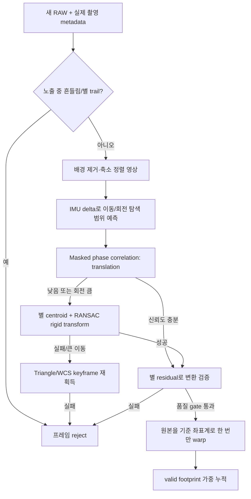
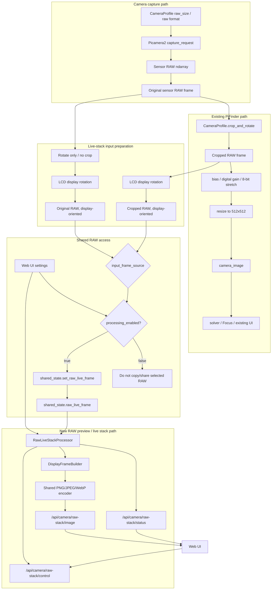
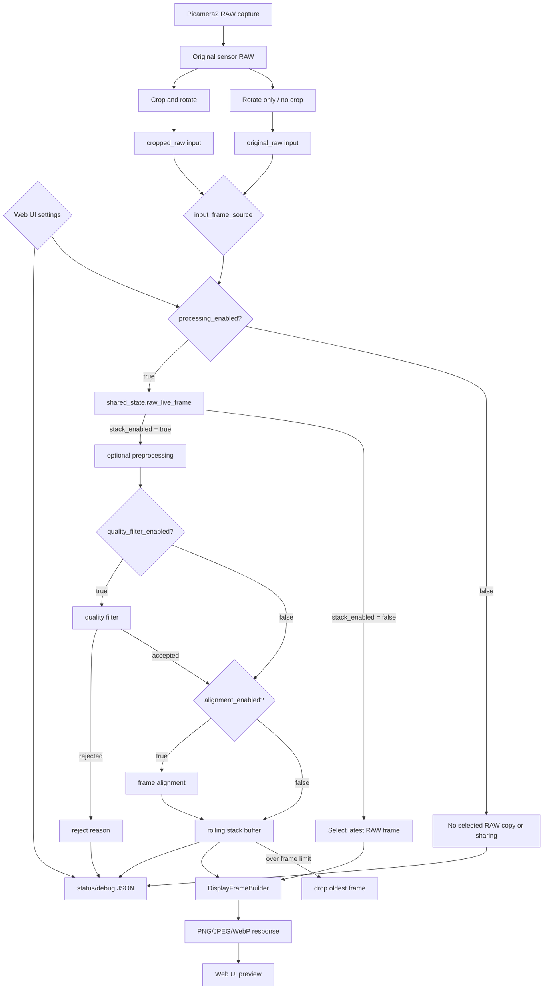

# 카메라·광학·영상 — 이전 설계와 조사 기록

> 2026-10-10 통합 보관. 아래 본문의 “현재/현행”, 기본값, 완료 상태와 명령은 원문 작성 당시 기준이다.
> 오늘의 동작은 [개발 기준 문서](../../mf_dev/README.md)를 따른다. 이력에 적힌 절차를 현재 설치 절차로 사용하지 않는다.

- [mf_auto_exposure_methods_ko.md](#mf_auto_exposure_methods_ko)
- [mf_auto_exposure_plan_ko.md](#mf_auto_exposure_plan_ko)
- [mf_auto_star_framewise_exposure_gain_research_ko.md](#mf_auto_star_framewise_exposure_gain_research_ko)
- [mf_camera_mono_color_plan_ko.md](#mf_camera_mono_color_plan_ko)
- [mf_lens_distortion_correction_ko.md](#mf_lens_distortion_correction_ko)
- [mf_live_stack_stabilization_research_ko.md](#mf_live_stack_stabilization_research_ko)
- [mf_optical_train_fov_integration_ko.md](#mf_optical_train_fov_integration_ko)
- [mf_raw_live_stack_plan_ko.md](#mf_raw_live_stack_plan_ko)
- [mf_sqm_stack_port_plan_ko.md](#mf_sqm_stack_port_plan_ko)


---

<a id="mf_auto_exposure_methods_ko"></a>

## mf_auto_exposure_methods_ko.md

<a id="mf_auto_exposure_methods_ko--카메라-자동-노출게인-제어-방법-조사"></a>
## 카메라 자동 노출·게인 제어 방법 조사

> **통합 관리 지점**: 자동 노출+SEP 솔빙 보강의 현행 상태는 [mf_sep_fullframe_impl_ko.md](solver.md#mf_sep_fullframe_impl_ko)에서 관리한다 (이 문서는 이력).

> 상태: **조사 완료 — 설계 승격됨** (2026-07-25):
> §6 권고안은 [mf_auto_exposure_plan_ko.md](camera.md#mf_auto_exposure_plan_ko)
> (기존 기능 유지 + 옵션 추가 설계)로 구체화되었다.
> 관련 문서: [docs/ax/camera.md](../../ax/camera.md) (현행 노출 제어 아키텍처, 정규 소유자),
> [docs/ax/camera/CONTEXT.md](../../ax/camera/CONTEXT.md) (용어집),
> [ADR 0010](../../adr/0010-zero-match-recovery-single-ladder.md) (zero-match 복구 사다리),
> [mf_solve_motion_gate_review_ko.md](solver.md#mf_solve_motion_gate_review_ko) (노출 중 이동 프레임 게이트)
>
> 목적: 현행 **솔브 결과(매치 수) 기반 자동 노출**의 구조적 문제를 정리하고,
> 대체/보강 가능한 방법들을 조사해 구현 방향 결정의 근거를 만든다.
> 이 문서는 조사(survey)이며, 확정 설계는 협의 후 별도 계획으로 승격한다.

<a id="mf_auto_exposure_methods_ko--1-현행-구현-요약"></a>
### 1. 현행 구현 요약

정규 서술은 [docs/ax/camera.md](../../ax/camera.md)에 있다. 여기서는 문제 분석에 필요한
뼈대만 요약한다.

```
솔버 프로세스                          카메라 프로세스 (get_image_loop)
  tetra3 솔브 시도                        프레임 캡처
    └─ Matches (성공/실패 매번) ────► shared_state.solution()
                                          │  새 last_solve_attempt일 때만
                                          ▼
                            ┌─ 매치 수 컨트롤러 (기본)
                            │    └─ Matches == 0 → zero-match 복구 사다리
                            └─ 배경 컨트롤러 (SQM 화면 전용)
                                          ▼
                               set_camera_config(exposure, gain)
```

- **매치 수 컨트롤러** (`auto_exposure.py::ExposurePIDController`,
  `python/PiFinder/auto_exposure.py:347`): 목표 `Matches` 17, 데드밴드 ±5,
  비대칭 PID(하향 보수적/상향 공격적), 클램프 25 ms–1 s. 새 솔브 시도가
  있을 때만 1스텝 동작.
- **Zero-match 복구** (`auto_exposure.py::ZeroMatchRecovery`,
  `python/PiFinder/auto_exposure.py:65`): 연속 2회 Matches=0이면 고정 사다리
  `[400, 800, 1000, 200] ms`를 각 2회씩 순환(ADR 0010).
- **배경 컨트롤러** (`auto_exposure.py::ExposureSNRController`): SQM 화면
  전용. 프레임 10퍼센타일 ADU를 노이즈 플로어 바로 위로 유지, ×1.3/÷1.3
  곱셈 스텝.
- **게인은 피드백 대상이 아니다**: 센서 프로파일 고정값
  (`sqm/camera_profiles.py` — imx296 15×, imx462 30×, hq 22×) 또는 수동 메뉴.
- 배선: `camera_interface.py:298-380` (솔브 결과 → 컨트롤러 →
  `set_camera_config`).

<a id="mf_auto_exposure_methods_ko--2-현행-솔브-기반-방식의-문제점"></a>
### 2. 현행 솔브 기반 방식의 문제점

| # | 문제 | 원인 구조 |
| --- | --- | --- |
| P1 | **피드백 신호가 원인을 구분하지 못한다.** Matches=0은 "너무 어두움/밝음" 외에도 초점 흐림, 노출 중 이동, 구름/가림, 솔버측 실패에서 똑같이 나온다. 복구 사다리는 노출 원인만 고칠 수 있는데, 다른 원인에서도 사다리를 순환하며 노출을 흔든다 (ax/camera.md §7 gotcha로 명시된 한계). | `Matches`가 유일한 입력. 이미지 자체 통계(포화, 배경, 검출 별 수)를 보지 않음 |
| P2 | **수렴이 솔브 주기에 묶여 느리다.** 조정 1스텝 = 솔브 시도 1회(수백 ms~1 s+). 크게 어긋난 노출에서 복구 사다리 1순환 = 솔브 8회. 박명·달빛·슬루 직후처럼 조건이 빠르게 변하면 따라가지 못한다. | 컨트롤러가 `last_solve_attempt` 갱신 시에만 동작 |
| P3 | **매치 수는 노출의 간접 지표다.** `Matches`는 검출 별 수가 아니라 tetra3가 카탈로그와 대응시킨 수 — FOV, 하늘 영역의 별 밀도, 패턴 DB에 따라 같은 노출에서도 크게 다르다. 은하수/희박 영역에서 목표 17이 물리적으로 달성 불가능하면 노출이 최대(1 s)로 끌려 올라간다(손떨림·블러 악화). | 목표가 "솔버가 쓴 별 수"이지 "프레임에 담긴 별 수"가 아님 |
| P4 | **포화/밝은 하늘 가드가 없다.** 밝은 배경(박명, 달, 광해)에서는 노출을 올려도 별 대비가 늘지 않는데, 매치 수가 적으면 계속 올린다. 이미지 평균/포화율 검사가 없다. | 이미지 통계 미사용 |
| P5 | **게인이 제어 루프 밖이다.** 노출만 조절하므로 어두운 하늘에서 노출이 길어져 수동(手動) 망원경의 이동 블러 한계와 충돌한다. 게인·노출의 역할 분담 정책이 없다. | 게인은 프로파일 고정/수동 |
| P6 | **검출 별 수를 이미 갖고 있는데 쓰지 않는다.** 솔버는 cedar-detect로 센트로이드를 추출한다(`solver.py:282-346`, 개수는 `:539-545`). "검출 N개 / 매치 0개"(솔버측 문제)와 "검출 0개"(노출/광학 문제)를 구분할 수 있는데 AE에 전달되지 않는다. | `SolveDiagnostics`에 매치 수만 배선 |
| P7 | **노출 중 이동 프레임이 피드백을 오염**할 수 있다. 이동 프레임 게이트가 미배선이라([mf_solve_motion_gate_review_ko.md](solver.md#mf_solve_motion_gate_review_ko)) 블러 프레임의 실패가 CAM_FAILED로 AE에 들어온다. | 게이트 미구현 (별도 문서에서 협의 중) |

<a id="mf_auto_exposure_methods_ko--3-조사한-방법들"></a>
### 3. 조사한 방법들

<a id="mf_auto_exposure_methods_ko--방법-a--검출-별-수-서보-cedar-server-방식--가장-직접적인-선례"></a>
#### 방법 A — 검출 별 수 서보 (cedar-server 방식) ★ 가장 직접적인 선례

PiFinder와 같은 솔버 스택(cedar-detect/cedar-solve)을 쓰는
[cedar-server](https://github.com/smroid/cedar-server)(Steven Rosenthal)가
실제 구현한 방식. **매치 수가 아니라 cedar-detect가 검출한 별(센트로이드)
수**를 신호로 쓰고, 2단 구성이다.

**A-1. 1회성 캘리브레이션** (`server/src/calibrator.rs`):

- 목표 검출 별 수(`star_count_goal`, 기본 **20**)가 나오는 노출을 탐색.
- 조정 법칙: **검출 별 수 ≈ 노출에 비례** 모델.
  `new_exp = prev_exp / (검출수 / 목표수)`. 0.8–1.2배 안에 들면 수렴,
  최대 3회 반복.
- 근거: 노출 2.5× ≈ 한계등급 +1등급 ≈ 별 수 ~3×(등급 5 부근) — 소폭
  이동에서는 선형 근사로 충분.
- 부속 캘리브레이션: 1 ms 노출에서 **흑레벨 오프셋**을 "0값 픽셀 <0.1%"까지
  올려 블랙 크러시 방지(희미한 별 검출 보전).

**A-2. 프레임 단위 연속 서보** (`server/src/detect_engine.rs`): 매 프레임
(솔브 없이 검출만으로) 실행.

```text
검출 별 수 < 4          → 폴백 노출(마지막 정상값/캘리브레이션값)  # 슬루/구름
그 외:
  ma = 별 수 EMA(α=0.5)
  f  = ma / star_count_goal
  f < 1.0 이고 중앙 ROI 평균 > 240(8bit) → 폴백    # 밝은 하늘 가드
  f < 0.8 또는 f > 1.6   → exposure = prev / f     # 비대칭 데드밴드
                            (캘리브레이션값 ±3스톱 + [min,max] 클램프)
  그 외                  → 현재 노출을 "정상 폴백값"으로 기억
```

- **게인은 루프 밖 고정**: 야간에는 센서 최적 게인 1회 설정 —
  RPi 카메라는 최대 아날로그 게인(**IMX296 → 15×**; PiFinder imx296
  프로파일과 동일 값). 읽기 노이즈가 평평해지는 지점 + 8-bit 출력에서는
  다이내믹레인지 손실이 무의미하다는 판단.
- cedar-detect 자체가 이미지 노이즈 추정 기반 적응 임계값(σ×noise)을
  쓰므로, 검출이 넓은 노출 범위를 견딘다 → 거친 서보로 충분.

PiFinder 관점의 장점: **P1(검출0 vs 매치0 구분), P3(카탈로그 비의존),
P4(밝은 하늘 가드), P2(솔브 없이 검출만으로 프레임 단위 동작 가능)를 모두
직접 해소**한다. 검출기는 이미 우리 파이프라인에 있다.

<a id="mf_auto_exposure_methods_ko--방법-b--이미지-통계히스토그램평균퍼센타일-서보"></a>
#### 방법 B — 이미지 통계(히스토그램/평균/퍼센타일) 서보

별을 세지 않고 프레임 밝기 통계를 목표에 맞춘다.

- **allsky** ([AllskyTeam mode_mean.cpp](https://github.com/AllskyTeam/allsky/blob/master/src/mode_mean.cpp)):
  마스킹된 이미지 평균(0–1 정규화)을 목표 평균에 맞추는 서보.
  **`exposureLevel = log2(gain × exposure_s) × steps²` 정수 사다리 하나로
  게인·노출을 통합 제어** — 주야간 20+스톱을 한 루프로 처리. 스텝은
  편차 크기에 따른 다항식 + 가중 이력/선형 예측으로 진동 억제.
- PiFinder의 기존 **배경 컨트롤러**(10퍼센타일 ADU ↔ 노이즈 플로어)가 이
  계열의 소형 구현이다.
- 한계: **밝기 통계는 "별이 검출되는가"와 직접 관련이 없다.** 광해 배경을
  목표 평균으로 맞추면 별 검출에는 과노출/부족일 수 있다. 별 검출 지표의
  보조 가드(포화 상한, 배경 하한)로는 유용하지만 주 신호로는 부적합.

<a id="mf_auto_exposure_methods_ko--방법-c--별-snr-서보-phd2-방식"></a>
#### 방법 C — 별 SNR 서보 (PHD2 방식)

[PHD2](https://github.com/OpenPHDGuiding/phd2/blob/master/src/myframe.cpp)는
가이드 별 1개의 자체 SNR 지표(목표 6.0)에 대해
`newExp = exp × (target/SNR)²` (SNR ∝ √노출 가정), 상승 α=0.20/하강 α=0.15의
비대칭 평활로 서보한다. 검증된 부드러운 제어지만 **단일 별 기준**이라
플레이트 솔빙(별 "개수"가 필요)에는 지표가 어긋난다. 다중 별로 일반화하면
사실상 방법 A(+검출 임계 σ)와 수렴한다.

<a id="mf_auto_exposure_methods_ko--방법-d--픽셀-임계-카운트-위성-별추적기-계열"></a>
#### 방법 D — 픽셀 임계 카운트 (위성 별추적기 계열)

고/저 임계값을 넘는 픽셀 수로 노출을 가감하는 초경량 방식
([SPARCS 등](https://arxiv.org/pdf/2507.03102)). 계산이 싸지만 핫픽셀·행성·
광해에 취약하고, cedar-detect가 이미 있는 우리에게는 이점이 없다.

<a id="mf_auto_exposure_methods_ko--방법-e--libcamerapicamera2-네이티브-aec"></a>
#### 방법 E — libcamera/picamera2 네이티브 AEC

`rpi.agc`는 평균 휘도 목표 기반이라 별 하늘(99.9% 근흑색)에서는 셔터·게인을
최대로 밀어 배경만 띄운다. 광해에서는 하늘 글로우에 노출을 맞춘다 — 지표
자체가 틀렸고, 수렴도 다중 프레임이 필요하다. allsky·cedar 모두 야간에는
자체 루프로 대체했고, PiFinder도 이미 `AeEnable=False`
(`camera_pi.py:61-64`)다. **주간 정렬 전용(현행 `set_exp:native`) 이상으로는
쓸 수 없다**는 것이 생태계 공통 결론
([picamera2 #592](https://github.com/raspberrypi/picamera2/discussions/592)).

<a id="mf_auto_exposure_methods_ko--방법-f--모델-기반-상한-이동-블러밝기-한계"></a>
#### 방법 F — 모델 기반 상한: 이동 블러·밝기 한계

피드백이 아니라 **노출 상한을 물리 모델로 계산**하는 보강책.

- 별추적기 문헌([Sensors 2014, PMC4003974](https://pmc.ncbi.nlm.nih.gov/articles/PMC4003974/)):
  별상 트레일 길이 ∝ 각속도×노출. 트레일이 PSF ~1개를 넘으면 노출을 늘려도
  검출 한계등급이 거의 늘지 않는다(1°/s에서 최적 ~31 ms, 2°/s에서 ~18 ms).
- PiFinder에는 IMU 각속도가 있으므로 `max_exp_motion ≈ k / ω`로 동적 상한을
  둘 수 있다 — 수동(手動) 망원경에서 "이동 중 긴 노출 낭비"(P5, P7)를
  구조적으로 차단. 정지 시에는 상한이 풀려 어두운 하늘에서 길게 노출.

<a id="mf_auto_exposure_methods_ko--방법-g--하이브리드-검출-서보내부-루프--솔브-품질-게이트외부-루프"></a>
#### 방법 G — 하이브리드: 검출 서보(내부 루프) + 솔브 품질 게이트(외부 루프)

현실적 결합안. 방법 A를 주 루프로 하되:

- **내부 루프(빠름)**: 검출 별 수 서보 + 밝은 하늘 가드 + 이동 블러 상한(F).
  솔브 없이 프레임/검출 주기로 동작.
- **외부 루프(느림)**: 솔브 결과(`Matches`, 성공률)로 목표 검출 별 수를
  천천히 보정 — "검출 25개인데 솔브가 계속 실패"면 목표를 올리는 식.
  기존 매치 수 컨트롤러의 지혜(비대칭, 데드밴드)를 이 층으로 이동.
- zero-match 복구 사다리는 "검출 0개 + 가드 미발동"일 때만 최후 수단으로
  축소 — P1의 오발동(초점/구름/솔버 실패)에서 사다리가 도는 일이 없어진다.

<a id="mf_auto_exposure_methods_ko--4-게인-정책-조사"></a>
### 4. 게인 정책 조사

| 전략 | 출처 | 요지 |
| --- | --- | --- |
| **고정 고게인 + 노출만 서보** | cedar | 야간엔 최대 아날로그 게인 고정(IMX296 15×). 읽기 노이즈 무릎 이후 + 8-bit 출력에서는 DR 손실 무의미. 제어 변수 1개 → 루프 단순·검출 임계 안정 |
| 게인·노출 통합 사다리 | allsky | `log2(gain×exp)` 단일 레벨로 주야 전 범위. 주간까지 한 루프로 다뤄야 할 때 유효 |
| 게인 우선 → 노출 후순위 | 문헌 종합 | 이동 블러 제약이 있는 장비는 "게인을 읽기노이즈 무릎까지 먼저, 노출은 블러/밝기 한계까지만" |

PiFinder 함의: 현행 프로파일 게인(imx296 15×)이 이미 cedar의 야간 최적값과
일치한다. **게인을 피드백 루프에 넣을 필요는 낮고**, 밝은 하늘 가드 발동 시
게인을 한 단계 내리는 정도의 이산 스케줄링이면 충분해 보인다. (주간 정렬은
현행대로 네이티브 AE 위임.)

<a id="mf_auto_exposure_methods_ko--5-비교-요약"></a>
### 5. 비교 요약

| 방법 | 신호 | 솔브 의존 | P1 원인구분 | P2 속도 | P3 밀도독립 | P4 밝기가드 | 구현 비용 |
| --- | --- | --- | --- | --- | --- | --- | --- |
| 현행 (매치 수) | Matches | 있음 | ✗ | 느림 | ✗ | ✗ | — |
| A 검출 별 수 서보 | 검출 센트로이드 수 | **없음**(검출만) | ◎ | 빠름 | ◎ | ◎(가드 포함) | 중 (검출 수 배선 + 컨트롤러 교체) |
| B 이미지 통계 | 평균/퍼센타일 | 없음 | △ | 매우 빠름 | ◎ | ◎ | 소 (배경 컨트롤러 확장) |
| C 별 SNR | 별 플럭스/노이즈 | 없음 | △ | 빠름 | △ | △ | 중 |
| D 픽셀 임계 | 임계 초과 픽셀 수 | 없음 | ✗ | 매우 빠름 | △ | △ | 소 |
| E 네이티브 AEC | 평균 휘도 | 없음 | ✗ | 중 | ✗ | ✗ | 0 (부적합) |
| F 모션 모델 상한 | IMU 각속도 | 없음 | (보강책) | — | — | — | 소 |
| G 하이브리드 A+F+솔브 게이트 | 검출 수 + Matches | 외부 루프만 | ◎ | 빠름 | ◎ | ◎ | 중~대 |

<a id="mf_auto_exposure_methods_ko--6-권고-협의용-초안"></a>
### 6. 권고 (협의용 초안)

1. **주 신호를 매치 수 → 검출 별 수로 교체(방법 A)** 가 핵심이다. 같은
   솔버 스택의 cedar-server가 수치까지 검증해 둔 설계(목표 20개, EMA α=0.5,
   데드밴드 0.8–1.6, ±3스톱 클램프, 평균>240 가드, <4개 폴백)를 그대로
   출발점으로 쓸 수 있다. 검출 수는 `solver.py`가 이미 계산하고 있어
   `SolveDiagnostics`에 `Centroids` 필드 하나를 배선하면 된다(최소 변경).
   더 나아가면 솔브와 분리해 검출만 빠른 주기로 돌릴 수 있다.
2. **이동 블러 동적 상한(방법 F)** 을 병행 — IMU 각속도로 노출 상한을
   계산해, 수동 이동 중 노출이 길어지는 낭비와 피드백 오염을 차단.
   [mf_solve_motion_gate_review_ko.md](solver.md#mf_solve_motion_gate_review_ko)의
   이동 프레임 게이트와 같은 재료(IMU delta)를 쓰므로 함께 설계.
3. zero-match 복구 사다리는 **"검출 0개"일 때만**으로 축소(ADR 0010의
   책임 범위를 신호 교체로 비로소 강제 가능).
4. 게인은 피드백에 넣지 않고 현행 프로파일 고정 유지(§4). 밝은 하늘 가드
   발동 시 1단계 하향만 검토.
5. 기존 매치 수 컨트롤러는 외부 품질 게이트(방법 G의 느린 루프)로 남길지,
   제거할지는 구현 단계에서 결정.

<a id="mf_auto_exposure_methods_ko--7-참고-자료"></a>
### 7. 참고 자료

- cedar-server [calibrator.rs](https://github.com/smroid/cedar-server/blob/main/server/src/calibrator.rs) ·
  [detect_engine.rs](https://github.com/smroid/cedar-server/blob/main/server/src/detect_engine.rs) ·
  [cedar-camera rpi_camera.rs](https://github.com/smroid/cedar-camera/blob/main/src/rpi_camera.rs) ·
  [cedar-detect](https://github.com/smroid/cedar-detect)
- PHD2 [myframe.cpp](https://github.com/OpenPHDGuiding/phd2/blob/master/src/myframe.cpp) ·
  [매뉴얼](https://openphdguiding.org/man-dev/Advanced_settings.htm)
- allsky [mode_mean.cpp](https://github.com/AllskyTeam/allsky/blob/master/src/mode_mean.cpp) ·
  [플리커 이슈 #228](https://github.com/thomasjacquin/allsky/issues/228)
- 별추적기 노출 최적화 [Sensors 2014 (PMC4003974)](https://pmc.ncbi.nlm.nih.gov/articles/PMC4003974/) ·
  [SPARCS 동적 노출 제어](https://arxiv.org/pdf/2507.03102)
- picamera2 아스트로 논의 [#592](https://github.com/raspberrypi/picamera2/discussions/592) ·
  [#175](https://github.com/raspberrypi/picamera2/discussions/175)
- [SkySolve](https://github.com/githubdoe/skysolve) (수동 노출 대조군) ·
  [FRAMOS IMX296 스펙](https://framos.com/products/sensors/area-sensors/imx296lqr-c-22545/)


---

<a id="mf_auto_exposure_plan_ko"></a>

## mf_auto_exposure_plan_ko.md

<a id="mf_auto_exposure_plan_ko--자동-노출--검출-별-수-컨트롤러-추가-설계"></a>
## 자동 노출 — 검출 별 수 컨트롤러 추가 설계

> **통합 관리 지점**: 자동 노출+SEP 솔빙 보강의 현행 상태는 [mf_sep_fullframe_impl_ko.md](solver.md#mf_sep_fullframe_impl_ko)에서 관리한다 (이 문서는 이력).

> 상태: **Phase 1~3 구현 완료 — 현장 검증 결과 접근법 재검토 중** (2026-07-26)
> 현장 결과(서울, 심한 광해+이동 구름): 목표 20개가 도달 불가능하고 스위트스팟
> (100–200 ms) 밖에서는 노출↑=검출↓로 모델이 역전됨. 당일 보강 5건 —
> 앵커 절대 클램프(bcde58a1), 솔브 성공 홀드([ADR m0022](../../adr/m0022-solve-success-holds-star-count-exposure.md),
> 2b068db2), IMU 소스 AE 동결 해제+시도별 성공 판정(80443cc6), 밝기 헤드룸
> 상향 캡(0b314906), 저검출 앵커 탈출(24292966) — 으로 동결·포화·주차는
> 제거됐으나, **검출 별 1~3개 하늘에서는 어떤 노출 정책도 솔브를 만들 수 없음**
> (tetra3 최소 4개). 병목이 노출 제어가 아니라 검출 감도로 이동 →
> [mf_auto_exposure_field_review_20260726_ko.md](../../mf_report/mf_auto_exposure_field_review_20260726_ko.md)에서
> 전처리/검출기 대안 검토 중.
> 결정 기록: [ADR m0020](../../adr/m0020-star-count-controller-opt-in.md)
> 근거 조사: [mf_auto_exposure_methods_ko.md](camera.md#mf_auto_exposure_methods_ko) (방법 조사, §6 권고안)
> 관련 문서: [docs/ax/camera.md](../../ax/camera.md) (현행 노출 제어 아키텍처, 정규 소유자),
> [docs/ax/camera/CONTEXT.md](../../ax/camera/CONTEXT.md) (용어집),
> [ADR 0010](../../adr/0010-zero-match-recovery-single-ladder.md),
> [mf_solve_motion_gate_review_ko.md](solver.md#mf_solve_motion_gate_review_ko)
>
> **설계 원칙 (사용자 결정, 2026-07-25)**: 기존 기능(매치 수 컨트롤러 +
> zero-match 복구 + 배경 컨트롤러)은 **그대로 유지**한다. 새 방식은
> **옵션으로 추가**하고 사용자가 선택한다. 기본값은 현행(매치 수)이다.

<a id="mf_auto_exposure_plan_ko--1-목표와-범위"></a>
### 1. 목표와 범위

조사 문서 §6 권고안을 구현 가능한 형태로 구체화한다.

**이번 범위 (Phase 1~3):**

1. 검출 센트로이드 수(`Centroids`)를 솔버 진단에 배선 — 양쪽 컨트롤러
   공용 신호 확보 (무해한 선행 변경).
2. 새 **검출 별 수 컨트롤러**(`ExposureStarCountController`) 추가 —
   cedar-server 검증 수치를 출발점으로 사용.
3. 컨트롤러 선택 옵션(config 키 + LCD 메뉴 + 카메라 명령) 배선.

**이번 범위 밖 (후속 Phase, 열어둠):**

- Phase 4: IMU 각속도 기반 이동 블러 동적 노출 상한 (조사 문서 방법 F).
- Phase 5: 검출을 솔브에서 분리한 빠른 케이던스 내부 루프 (방법 G의 완성형).
- 매치 수 컨트롤러 제거/외부 게이트화 — 검출 컨트롤러가 현장 검증된 뒤
  별도 결정.

**비목표:** 게인 피드백 제어(조사 §4 결론: 프로파일 고정 유지), 주간
정렬용 네이티브 AE 변경, SQM 배경 컨트롤러 변경.

<a id="mf_auto_exposure_plan_ko--2-용어-contextmd-준수--신규-제안"></a>
### 2. 용어 (CONTEXT.md 준수 + 신규 제안)

- **검출 별 수 컨트롤러 (star-count controller)** *(신규)*: cedar-detect가
  프레임에서 검출한 센트로이드 수를 목표에 맞추는 컨트롤러. 매치 수
  컨트롤러와 같은 층위의 선택지.
  - 피하기: "cedar 컨트롤러"(출처명), "검출 모드"("mode" 회피 규칙).
- **`Centroids`** *(신규, Positioning 교차 용어)*: 최근 솔브 시도에서
  검출된 센트로이드 수. `Matches`처럼 성공/실패 모든 시도에 게시된다.
  `Matches`와의 차이가 원인 구분의 핵심: 검출 0 = 노출/광학 문제,
  검출 N>0 + 매치 0 = 솔버측 문제.
- **앵커 노출 (anchor exposure)** *(신규)*: 검출 별 수 컨트롤러가 "정상
  동작이 확인된" 것으로 기억하는 노출. 클램프 기준(±3스톱)과 폴백
  목적지로 쓰인다. cedar의 캘리브레이션 노출에 해당하되, 별도
  캘리브레이션 단계 없이 운전 중 학습한다(§4.3).
- 기존 용어(노출 체제, 매치 수 컨트롤러, 배경 컨트롤러, zero-match 복구,
  복구 사다리)는 그대로. 구현 완료 시 CONTEXT.md에 위 신규 용어를 추가한다.

<a id="mf_auto_exposure_plan_ko--3-phase-1--centroids-신호-배선"></a>
### 3. Phase 1 — `Centroids` 신호 배선

검출 수는 이미 계산되지만(`solver.py:539-541`의 `len(centroids)`) 진단에
실리지 않는다. 컨트롤러와 무관하게 먼저 배선한다(진단 가치만으로도 유효).

<a id="mf_auto_exposure_plan_ko--31-typespositioningpy--solvediagnostics"></a>
#### 3.1 `types/positioning.py` — `SolveDiagnostics`

```python
@dataclass
class SolveDiagnostics:
    Matches: int = 0
    Centroids: int = 0        # 신규: 검출 센트로이드 수 (모든 시도에 게시)
    RMSE: Optional[float] = None
    ...
```

- 기본값 0 (`Matches`와 같은 이유 — 자동 노출이 int를 기대).
- 필드명은 tetra3 스타일 대문자 표기(`Matches`와 나란히)로 통일.

<a id="mf_auto_exposure_plan_ko--32-solverpy"></a>
#### 3.2 `solver.py`

| 지점 | 변경 |
| --- | --- |
| `_build_successful_solve()` (`:357`) | 시그니처에 `centroid_count: int` 추가, `SolveDiagnostics(Centroids=centroid_count, ...)` |
| `_build_failed_solve()` (`:409`) | 시그니처에 `centroid_count: int = 0` 추가, 동일 배선 |
| 성공 경로 (`:594`) | `centroid_count=len(centroids)` 전달 |
| 실패 경로 (`:639`) | `centroid_count=len(centroids)` 전달 — 검출 0개로 솔브를 건너뛴 경우(`:545`)와 "검출은 됐지만 매치 실패" 경우가 이 값으로 구분된다 |
| 예외 경로 (`:652`) | **기본값 0 유지** (이 시점의 `centroids` 변수는 이전 루프의 잔재일 수 있어 전달하지 않는다) |

<a id="mf_auto_exposure_plan_ko--33-하위-호환"></a>
#### 3.3 하위 호환

- `SuccessfulSolve`/`FailedSolve` → integrator → `shared_state.solution()`
  경로는 diagnostics를 그대로 통과시키므로 다른 소비자 영향 없음.
- 기존 매치 수 컨트롤러는 `Matches`만 읽으므로 동작 불변.

<a id="mf_auto_exposure_plan_ko--4-phase-2--검출-별-수-컨트롤러"></a>
### 4. Phase 2 — 검출 별 수 컨트롤러

`auto_exposure.py`에 `ExposureStarCountController` 클래스를 추가한다.
기존 `ExposurePIDController`, `ZeroMatchRecovery`, `ExposureSNRController`는
**수정하지 않는다** (복구 사다리는 새 인스턴스로 재사용).

<a id="mf_auto_exposure_plan_ko--41-파라미터-cedar-server-검증값--출발점"></a>
#### 4.1 파라미터 (cedar-server 검증값 = 출발점)

| 파라미터 | 기본값 | 출처/근거 |
| --- | --- | --- |
| `target_stars` | 20 | cedar `star_count_goal` 기본값 |
| `ema_alpha` | 0.5 | cedar 검출 수 EMA |
| `deadband_low` / `deadband_high` | 0.8 / 1.6 | cedar 비대칭 데드밴드 — 부족(f<0.8)엔 즉시, 과잉(f>1.6)엔 관대 |
| `min_stars_for_control` | 4 | cedar: 미만이면 슬루/구름으로 보고 조정 대신 앵커 복귀 |
| `anchor_stop_range` | ±3스톱 (anchor/8 ~ anchor×8) | cedar 클램프 |
| `min_exposure` / `max_exposure` | 25 000 / 1 000 000 µs | 기존 매치 수 컨트롤러와 동일 절대 클램프 |
| `bright_sky_mean` | 240 (8-bit) | cedar 밝은 하늘 가드 |
| `bright_roi` | 중앙 256×256 (512×512 프레임의 중앙 절반) | cedar "중앙 height/2 정사각" 관례 |
| `initial_anchor` | 400 000 µs | 출하 기본 노출 = 복구 사다리 1단과 동일 |

<a id="mf_auto_exposure_plan_ko--42-조정-법칙"></a>
#### 4.2 조정 법칙

```python
def update(self, centroid_count, current_exposure, center_mean=None):
    # 1) 검출 0개 → zero-detection 복구 (기존 사다리 재사용)
    if centroid_count == 0:
        self._zero_count += 1
        return self._recovery.handle(current_exposure, self._zero_count)
    if self._recovery.is_active():
        self._recovery.reset()          # 검출 복귀 → 복구 종료
        self._ema = None                # 복구 여행이 EMA를 오염시키지 않게
    self._zero_count = 0

    # 2) 검출 소수(<4) → 슬루/구름으로 판단, 앵커로 복귀 (조정 안 함)
    if centroid_count < self.min_stars_for_control:
        return self._anchor if current_exposure != self._anchor else None

    # 3) EMA 갱신
    self._ema = (centroid_count if self._ema is None
                 else self.ema_alpha * centroid_count
                      + (1 - self.ema_alpha) * self._ema)
    f = self._ema / self.target_stars

    # 4) 밝은 하늘 가드: 별이 부족한데 배경이 이미 밝으면 올리지 않는다
    if f < 1.0 and center_mean is not None and center_mean > self.bright_sky_mean:
        return self._anchor if current_exposure != self._anchor else None

    # 5) 데드밴드 안 → 현재 노출을 앵커로 학습, 조정 없음
    if self.deadband_low <= f <= self.deadband_high:
        self._anchor = current_exposure
        return None

    # 6) 조정: 별 수 ∝ 노출 근사 → 나눗셈 법칙
    new_exposure = int(current_exposure / f)
    new_exposure = clamp(new_exposure, self._anchor // 8, self._anchor * 8)
    new_exposure = clamp(new_exposure, self.min_exposure, self.max_exposure)
    return new_exposure if new_exposure != current_exposure else None
```

설계 메모:

- **PID가 아니다.** cedar처럼 비례 나눗셈 1스텝 — 별 수∝노출 근사에서
  1~3스텝 내 수렴하고, 적분 와인드업·게인 튜닝 문제가 없다. 기존 PID의
  비대칭 정신(부족엔 빠르게/과잉엔 관대)은 데드밴드 비대칭(0.8/1.6)이
  대신한다.
- **zero-match 복구와의 관계**: 사다리(`ZeroMatchRecovery`)를 재사용하되
  트리거가 다르다 — 기존 컨트롤러는 "매치 0", 새 컨트롤러는 **"검출 0"**.
  이것이 ADR 0010이 명시한 책임 범위("노출이 크게 틀렸을 때만")를 신호
  수준에서 비로소 강제한다: 초점 흐림/솔버 실패로 검출은 되는데 매치가
  0인 프레임에서는 사다리가 돌지 않는다.
- **앵커 학습**: 데드밴드 안에 들어온 노출만 앵커로 저장. cedar의 1회성
  캘리브레이션 대신 운전 중 학습을 택한 이유 — PiFinder는 부팅 후 즉시
  운용이 시작되고, 복구 사다리(400 ms 시작)가 초기 탐색을 이미 담당한다.
  앵커는 재시작 시 `initial_anchor`로 초기화(영속화하지 않음, v1).
- **`center_mean`은 호출자가 계산해 전달**: `get_image_loop`에 이미
  `base_image`(512×512 L)가 있으므로 중앙 crop 평균(`np.mean`)을 솔브
  주기당 1회 계산 — 비용 무시 가능. 이미지가 없는 경로(테스트)에서는
  `None`으로 가드 생략.
- `reset()`, `get_status()` (target, ema, anchor, zero_count, recovery
  active)를 기존 컨트롤러와 같은 형태로 제공.

<a id="mf_auto_exposure_plan_ko--43-케이던스"></a>
#### 4.3 케이던스

v1은 기존과 동일하게 **새 솔브 시도가 있을 때만** 1스텝 동작한다
(`_last_solve_time` 게이트 재사용). 검출이 솔버 프로세스 안에서 솔브와
함께 일어나는 현 구조에서는 그 이상 빨라질 수 없다. 솔브 없이 검출만
고속으로 돌리는 것은 Phase 5로 분리(솔버 루프 개편 필요).

<a id="mf_auto_exposure_plan_ko--5-phase-3--선택-옵션-배선"></a>
### 5. Phase 3 — 선택 옵션 배선

> **개정 (2026-07-25, 사용자 결정)**: 초판은 별도 config 키
> `camera_ae_controller` + "Camera AE" 메뉴로 배선했으나, **Camera Exp
> 메뉴의 "Star" 항목(`camera_exp = "auto_star"`)으로 통합**했다.
> 이유: 포커스(preview) 화면의 마킹 메뉴(롱키)가 `camera_exposure`
> 메뉴로 점프하므로, 포커스 화면에서 노출을 바꿔가며 확인하는 기존
> 워크플로 안에서 컨트롤러 선택까지 한 곳에서 이루어져야 한다.
> `camera_ae_controller` 키·"Camera AE" 메뉴·`set_ae_controller:` 명령은
> 같은 날 제거했다(릴리즈 전이라 마이그레이션 불필요). 컨트롤러 선택은
> `set_exp:auto`/`set_exp:auto_star`가 실어 나른다. 아래 5.1~5.5는 초판
> 설계 기록이며, 최종 구현은 이 개정 내용과
> [docs/ax/camera.md](../../ax/camera.md) §3b를 따른다.

<a id="mf_auto_exposure_plan_ko--51-config-키"></a>
#### 5.1 config 키

`default_config.json`:

```json
"camera_ae_controller": "match_count"
```

- 값: `"match_count"`(기본, 현행 유지) | `"star_count"`(신규).
- 알 수 없는 값 → `match_count`로 폴백 + 경고 로그 (ADR 0010의 stale
  config 처리 관례와 동일).
- 기존 사용자: 키가 없으면 기본값 적용 → **동작 변화 없음.**

주의: 기존 `set_ae_mode:pid|snr`(SQM 화면 스코프, 비영속)과는 별개 축이다.
이 키는 "기본 컨트롤러가 무엇인가"를 정하고, SQM 화면이 활성인 동안
배경 컨트롤러가 우선하는 기존 규칙은 그대로 둔다(§5.3).

<a id="mf_auto_exposure_plan_ko--52-카메라-명령"></a>
#### 5.2 카메라 명령

`camera_interface.py` 명령 파서에 추가 (기존 `set_ae_mode` 블록과 나란히):

```
set_ae_controller:match_count | set_ae_controller:star_count
```

- 유효값이면 `_ae_controller_choice` 갱신 + 해당 컨트롤러 인스턴스
  생성/reset + console 표시(`CAM: AE=Star Count` 등).
- config 저장은 명령이 아니라 메뉴 콜백에서(기존 `set_exposure` 콜백
  관례와 동일하게 `config_option`이 저장을 담당).

<a id="mf_auto_exposure_plan_ko--53-camera_interfacepy-디스패치"></a>
#### 5.3 `camera_interface.py` 디스패치

상태 필드 추가: `_ae_controller_choice: str`("match_count"|"star_count"),
`_auto_exposure_star: Optional[ExposureStarCountController]`.

- **초기화** (`:184-192`): `camera_exp == "auto"`일 때
  `camera_ae_controller` 키를 읽어 선택 컨트롤러를 준비한다. 기존 gate
  (`_auto_exposure_enabled and _auto_exposure_pid`)가 매치 수 컨트롤러
  객체를 요구하므로 **`_auto_exposure_pid`는 선택과 무관하게 항상 생성**
  (기존 gotcha 유지 — 게이트 조건을 건드리지 않는 최소 변경).
- **디스패치** (`:326-360`): 기존 구조 유지, 기본 분기만 교체.

```
if self._auto_exposure_mode == "snr":        # SQM 화면 — 기존 그대로
    ... 배경 컨트롤러 ...
elif self._ae_controller_choice == "star_count":
    centroid_count = solution.diagnostics.Centroids
    center_mean = np.mean(np.asarray(base_image)[128:384, 128:384])
    new_exposure = self._auto_exposure_star.update(
        centroid_count, self.exposure_time, center_mean)
else:                                         # 기본 — 기존 그대로
    new_exposure = self._auto_exposure_pid.update(
        matched_stars, self.exposure_time)
```

- `set_exp:auto` 처리(`:403-413`)에서 두 컨트롤러 모두 reset.
- 로그 라인(`:367-371`)에 컨트롤러 이름과 (star_count일 때) 검출 수/f값
  포함 — 현장 사후 분석용.

<a id="mf_auto_exposure_plan_ko--54-lcd-메뉴"></a>
#### 5.4 LCD 메뉴

`ui/menu_structure.py` — Camera Exp와 Camera Gain 사이에 추가:

```python
{
    "name": _("Camera AE"),
    "class": UITextMenu,
    "select": "single",
    "config_option": "camera_ae_controller",
    "label": "camera_ae_controller",
    "post_callback": callbacks.set_ae_controller,   # 신규 콜백
    "items": [
        {"name": _("Match Count"), "value": "match_count"},
        {"name": _("Star Count"), "value": "star_count"},
    ],
},
```

- `callbacks.set_ae_controller`: 카메라 큐에
  `set_ae_controller:<value>` 전송 (기존 `set_exposure` 콜백 패턴).
- 신규 문자열("Camera AE", "Match Count", "Star Count")은 i18n 마킹 +
  Babel 파이프라인 통과 필요.
- 메뉴 위치·명칭은 확정 전(§8 열린 질문 Q4).

<a id="mf_auto_exposure_plan_ko--55-상태-표시-선택"></a>
#### 5.5 상태 표시 (선택)

`get_camera_exposure_display`(Auto 항목 서픽스)는 그대로 두되, 로그와
`get_status()`로 충분한지 현장 사용 후 판단. 웹 상태 노출은 이번 범위 밖.

<a id="mf_auto_exposure_plan_ko--6-동작-비교-완성-후-기대-상태"></a>
### 6. 동작 비교 (완성 후 기대 상태)

| 상황 | 매치 수 컨트롤러 (기본, 현행 그대로) | 검출 별 수 컨트롤러 (신규 옵션) |
| --- | --- | --- |
| 정상 야간 | Matches 17±5 목표 PID | 검출 EMA/20 이 0.8~1.6 안에 들도록 나눗셈 스텝, 수렴 시 앵커 학습 |
| 희박한 별 영역 | 목표 미달 → 노출 최대로 상승 가능 (P3) | 검출 수는 카탈로그 무관 → 그대로 유지되기 쉬움 |
| 초점 흐림/솔버 실패 (검출 N>0, 매치 0) | zero-match 복구 사다리 순환 (P1) | 사다리 안 돎 — f 기준 정상 제어 유지 |
| 슬루/구름 (검출 <4) | Matches 0 → 사다리 | 앵커 복귀, 사다리는 검출 0일 때만 |
| 박명/달 (밝은 배경) | 매치 적으면 노출 계속 상승 (P4) | 중앙 평균 >240이면 상승 차단, 앵커 복귀 |
| SQM 화면 | 배경 컨트롤러 (기존) | 배경 컨트롤러 (동일 — 선택과 무관) |
| 주간 정렬 | 네이티브 AE (기존) | 네이티브 AE (동일) |

<a id="mf_auto_exposure_plan_ko--7-구현-체크리스트"></a>
### 7. 구현 체크리스트

<a id="mf_auto_exposure_plan_ko--phase-1--신호-배선-선행-무해--완료-2026-07-25"></a>
#### Phase 1 — 신호 배선 (선행, 무해) — 완료 (2026-07-25)

- [x] `SolveDiagnostics.Centroids` 필드 추가 (`types/positioning.py`)
- [x] `_build_successful_solve`/`_build_failed_solve` 시그니처 + 호출부 배선
      (`solver.py` — 예외 경로는 stale 목록 위험 때문에 기본값 0)
- [x] 단위 테스트: `Centroids` 기본값/전달
      (`tests/test_auto_exposure_starcount.py::TestCentroidsDiagnostics`)
- [x] `docs/ax/positioning/CONTEXT.md`에 `Centroids` 항목

<a id="mf_auto_exposure_plan_ko--phase-2--컨트롤러--완료-2026-07-25"></a>
#### Phase 2 — 컨트롤러 — 완료 (2026-07-25)

- [x] `ExposureStarCountController` 구현 — **신규 파일
      `auto_exposure_starcount.py`** (기존 `auto_exposure.py` 무수정 원칙,
      `ZeroMatchRecovery`는 import 재사용)
- [x] 단위 테스트 21종: 수렴(부족/과잉), 데드밴드-앵커 학습, <4 폴백,
      밝은 하늘 가드, 검출0 → 사다리 위임/복귀, EMA 리셋, 클램프(±3스톱, 절대)
- [x] `get_status()` 테스트

<a id="mf_auto_exposure_plan_ko--phase-3--옵션-배선--완료-2026-07-25-5-개정-반영"></a>
#### Phase 3 — 옵션 배선 — 완료 (2026-07-25, §5 개정 반영)

- [x] ~~`default_config.json`에 `camera_ae_controller` 추가~~ → 개정으로
      제거. 선택은 기존 `camera_exp` 키의 새 값 `"auto_star"`가 담당
- [x] `set_exp:auto|auto_star` 파서에서 컨트롤러 선택 + 시작 시
      `camera_exp` 로드 (`camera_interface.py`, `camera_pi.py`)
- [x] 디스패치 분기 — star 컨트롤러는 lazy 생성(기존 SNR 컨트롤러 관례),
      중앙 ROI 평균은 호출부에서 계산 (`camera_interface.py`)
- [x] 메뉴: Camera Exp에 "Star" 항목(Auto 다음) + 라이브 노출 서픽스
      (`get_camera_exposure_star_display`) — 포커스 화면 마킹 메뉴에서
      접근 가능
- [x] i18n: `nox -s babel` + de/es/fr/ko/zh 번역(AI-TRANSLATED 마커)
- [x] 검증: lint/format/mypy 통과, smoke 7, unit 754 통과
- [x] 문서: `docs/ax/camera.md` §3b, `docs/ax/camera/CONTEXT.md` 용어,
      [ADR m0020](../../adr/m0020-star-count-controller-opt-in.md)

<a id="mf_auto_exposure_plan_ko--검증-현장"></a>
#### 검증 (현장)

- [ ] 실내: debug 카메라로 전환/복귀, 회귀 없음 확인
- [ ] 실외 A/B: 같은 하늘에서 두 컨트롤러의 수렴 시간·최종 노출·솔브
      성공률 로그 비교 (은하수 안/밖, 달 유/무 각 1회 이상)
- [ ] 실외: 초점 링을 일부러 흐트러뜨려 "검출 N>0/매치 0"에서 star_count가
      사다리를 돌지 않는지 확인 (P1 개선의 직접 검증)

<a id="mf_auto_exposure_plan_ko--8-열린-질문-구현-전-결정"></a>
### 8. 열린 질문 (구현 전 결정)

| # | 질문 | 초안 입장 |
| --- | --- | --- |
| Q1 | `target_stars` 20(cedar) vs 17(기존 매치 목표)과의 관계 | 20으로 시작. 검출≥매치이므로 두 값은 비교 대상이 아님. 현장 A/B 후 조정 |
| Q2 | 검출 수 EMA를 컨트롤러 안(α=0.5)에서만 쓰는가 | 예 — 원시값은 진단에 그대로 남기고 평활은 컨트롤러 내부 상태 |
| Q3 | 밝은 하늘 가드 발동 시 게인 1단계 하향(조사 §4)도 넣는가 | v1 제외 — 게인 불변 원칙 유지, 가드는 "안 올림+앵커 복귀"만 |
| Q4 | ~~메뉴 명칭~~ — **해결(2026-07-25)**: 별도 메뉴 대신 Camera Exp의 "Star" 항목(§5 개정) | 포커스 화면 워크플로와 통합 |
| Q5 | star_count 선택 시 실패 경로 예외(`Centroids=0`)가 사다리를 촉발할 수 있음 — 예외 빈도가 낮아 무시 가능한가 | trigger_count=2 + 예외는 산발적이므로 무시. 현장 로그로 재확인 |
| Q6 | 앵커를 config에 영속화(재시작 후 즉시 정상 노출)할 것인가 | v1 제외 — 복구 사다리 400 ms 시작이 이미 그 역할. 필요성 확인 후 |

<a id="mf_auto_exposure_plan_ko--9-위험과-완화"></a>
### 9. 위험과 완화

| 위험 | 완화 |
| --- | --- |
| 신규 컨트롤러 결함으로 노출 폭주 | 절대 클램프(25 ms–1 s) + 앵커 ±3스톱 이중 클램프. 기본값이 match_count라 옵트인 사용자만 노출 |
| `Centroids` 배선 실수로 기존 경로 회귀 | Phase 1을 독립 커밋 + 기존 매치 수 경로는 `Matches`만 읽음(불변) 검증 테스트 |
| SQM 화면 전환과의 상호작용 | 디스패치에서 snr 분기가 최우선(기존 순서 유지) — star_count는 snr이 아닐 때만 |
| 수동/네이티브 체제와의 충돌 | 체제 전환 로직(`set_exp:*`, `exp_up/dn/save`) 불변 — 컨트롤러 선택은 솔버 구동 체제 내부에서만 의미 |
| cedar 수치가 우리 광학/센서에 안 맞음 | 파라미터를 생성자 인자로 유지(하드코딩 금지), 현장 A/B 체크리스트로 조정 |


---

<a id="mf_auto_star_framewise_exposure_gain_research_ko"></a>

## mf_auto_star_framewise_exposure_gain_research_ko.md

<a id="mf_auto_star_framewise_exposure_gain_research_ko--autostar-프레임-단위-노출게인-제어-개선-조사-및-구현안"></a>
## Auto(Star) 프레임 단위 노출·게인 제어 개선 조사 및 구현안

> 상태: **framewise v2 구현·야간 노출 headroom A/B 반영 완료**
> (2026-09-04)
>
> 요청 목표: Auto(Star)가 솔브 결과를 기다리지 않고 **매 캡처 프레임을
> 측정하여 가능한 가장 이른 프레임에 노출과 게인을 반영**한다. 어두운
> 하늘에서는 IMX462/290 프로파일 기본 게인 30을 유지한다. 밝은 하늘이나
> 도시광을 반사하는 구름에서도 **게인이 높을수록 참별 검출과 솔브에
> 유리하면 그대로 유지**하고, 포화 또는 잡음 오검출 때문에 좌표 계산을
> 방해한다는 증거가 있을 때만 낮춘다.
>
> 현장 제약: 현재 구름이 많아 별 하늘 A/B 테스트는 수행하지 않았다. 이
> 문서는 구현 경로, 안전장치, 무천체 테스트와 다음 맑은 밤의 검증 기준을
> 확정하기 위한 설계 문서다.
>
> 선행 문서: [자동 노출 방법 조사](camera.md#mf_auto_exposure_methods_ko),
> [현행 Auto(Star) 설계](camera.md#mf_auto_exposure_plan_ko),
> [2026-07-26 현장 검증](../../mf_report/mf_auto_exposure_field_review_20260726_ko.md),
> [카메라 아키텍처](../../ax/camera.md)

> 구현 반영(2026-08-28): `buffer_count=3, queue=False`, DMA request 조기
> release, 실제 메타데이터/drop 계측, atomic exposure+gain control 제출,
> 512 image+metadata의 atomic latest-wins envelope, full RAW `frame_id` 검증을
> 코드와 단위 테스트에 반영했다. 주변 matched-star SNR과 gain 상태기계를
> 사용하는 Auto(Star) v2 actuator는 아직 활성화하지 않았다.
>
> 실기 확인(동일 일자, IMX290/462): 서비스 재시작 후 실제 400 ms 노출에서
> request-held 4~5 ms, release 이후 처리 32~41 ms, 안정 구간 drop 0을
> 확인했다. 기존 화면 절전 경로가 캡처를 약 30초씩 중단하던 문제도 발견하여
> 제거했다. 수정 뒤 화면 절전 상태에서도 2.5초 동안 accepted sequence가
> 22프레임 증가했다. 25 ms 노출처럼 처리보다 센서가 빠른 구간은 drop으로
> 계수되고 backlog는 만들지 않았다. 이 수치는 당시 장치 상태의 표본이며
> 장기 p95는 추가 운전 데이터로 확정한다.

> 노출 안정화 반영(2026-09-02, IMX462 실기): Auto(Star)가 중앙 production
> crop만 보던 문제를 수정하여 gated Cedar와 Cedar/SEP 전체 프레임 합의 수를
> 사용한다. SQM SNR override도 Auto(Star) 선택 시 확실히 해제한다. 최근
> 노출별 검출 수 중앙값으로 비단조 광해 응답을 학습하여, 긴 노출에서 후보가
> 무너지면 실측 최적 노출을 90초 유지한 뒤 재탐색한다. 밝은/구름 낀 실제
> 시야에서 기존 400/800/1000 ms 반복 순환이 사라졌고, 유지 만료 후
> 400→200 ms를 짧게 재평가한 다음 17/17 시도를 200 ms에 유지했다. Gain은
> 참별/오검출 품질 증거가 아직 없으므로 프로파일 30(실제 29.51)을 유지했다.
> 이 단계는 여전히 솔버 결과 주기의 exposure 안정화이며, 매 RAW 프레임
> 주변 matched-star SNR과 자동 gain actuator는 후속 구현 범위다.

> Framewise v2 구현·실기 반영(2026-09-02): 3×3 주변 RAW p50/MAD/p90/p99/
> p999/포화율, 중앙 달·bloom connected-component 제외, 실제 메타데이터 기반
> pending/apply 확인, 비대칭 exposure 제어, gain 사다리 시험/rollback 및
> full-frame/주변 타일 catalog-match RAW SNR 요약을 구현했다. 기존 솔브 주기
> Auto(Star)는 v2 활성 중 카메라 값을 쓰지 않는다. IMX462 실기에서 제어
> 계산 7.2~10.4 ms, 전체 후처리 41.8~48.2 ms, request-held 4.0~5.5 ms,
> 관측 drop 0이었다. 이 장치에서 command→applied 지연은 최대 7 accepted
> frames로 재측정되어 timeout은 실측+2인 9 frames로 정했다. 별이 없는 구름
> 조건에서는 포화 탈출과 pending windup 방지만 검증했으며 gain 품질 판정과
> §12 야간 합격 기준은 다음 맑은 밤에 검증해야 한다. 기능은
> `camera_auto_star_framewise` opt-in으로 유지한다.

> 광해 시야 추가 검증(2026-09-02): gain 30/200 ms에서 주변 p999가
> 3969/4095까지 올라간 첫 프레임에 100 ms 하향을 제출했고 7 accepted frames
> 뒤 실제 100 ms, p999 2222, 포화율 0으로 복구했다. 이후 gain 30/100 ms에서
> 100→15 단계 시험이 한 번 발생했으나 gain 15/약 197 ms도 catalog match가
> 0이어서 gain 30/약 99 ms로 rollback했다. 후보 수 감소만으로 낮은 gain을
> 유지하지 않고 실제 solve 성공과 3개 이상 match 개선을 요구하도록 수정했으며,
> 실패한 gain 시험은 90초 cooldown한다. 최종 관측 구간은 gain 30/100 ms,
> p50 1173~1184, p999 2152~2182, 포화율 0, direction reversal 0이었다.
> 숫자 gain만 lock하고 `Profile`은 자동 gain 사다리를 unlock한다. 낮은 gain이
> 실제 품질 개선으로 유지된 뒤에는 양호한 주변 solve 5회가 연속될 때 한 단계
> 높은 gain을 같은 총 노광량으로 재시험하고 품질이 나빠지지 않을 때만 기본
> 고gain 방향으로 복귀한다.

> 박명 획득 수정(2026-09-03): 첫 catalog solve anchor 전에는 밝기 안전 하향만
> 허용하던 fail-closed 분기 때문에, 해가 진 뒤 주변 배경이 계속 어두워져도
> `awaiting_peripheral_solve_anchor`에서 노출이 고정됐다. 수동 노출을 선택했다가
> Auto(Star)로 돌아오면 그 수동값에서 밝기 하향 계산이 다시 실행되어 조금 높은
> 값이 나오는 현장 증상과 일치했다. 첫 anchor 전에는 비포화 주변 배경 신호를
> usable range의 24%로 유지하는 acquisition servo를 추가했다. 상향은 실제 적용
> 1회당 최대 +0.5 stop이고, 30% bright-sky guard와 포화 즉시 하향, gain 30 우선,
> 센서 pending 확인은 그대로 유지한다. 따라서 박명에는 프레임마다 어두워진 만큼
> 노출이 자동 증가하지만, 갑작스러운 밝은 구름에는 기존 빠른 하향이 우선한다.
> 현장 검증 중 작은 국부 하이라이트가 주변 region의 p99.9/포화율 0.1%만 건드려
> 노출을 1/2로 낮춘 뒤 acquisition servo가 재상승시키는 진동도 확인했다. 포화
> 안전 하향은 region 면적 0.5% 이상이 실제 clipping되거나, p99와 p99.9가 함께
> white level에 근접하는 넓은 하이라이트가 주변 여러 region에서 동시에
> 관측될 때 적용한다. 별·hot pixel·단일 region의 국부 광원은 무시하지만 밝은
> 구름, 달빛 bloom 같은 넓은 포화에는 즉시 반응한다.
> 포화 하향값은 임시 light-product 상한으로 30초간 기억한다. 이 시간에는 배경
> 획득 루프가 즉시 같은 포화점으로 되돌아가는 것을 막고, 이후 +0.5 stop 이하로
> 재탐색한다. 재탐색도 포화되면 상한을 다시 설정하며, 포화되지 않으면 박명에
> 맞춰 계속 상승한다. 안전 하향비도 불필요한 과잉 반감을 피하도록 최대 0.75로
> 제한한다.

> 야간 headroom A/B 및 반영(2026-09-04, IMX462 gain 29.51): 같은 고정 시야에서
> 200/280/400/450/560 ms를 시험하고 400 ms를 다시 측정했다. 200 ms는 성공
> 프레임 14~18 matches, 280 ms는 15~17, 400 ms는 최초 19~23 및 반복
> 19~26으로 가장 좋았다. 450 ms는 usable region의 robust p99.9가 91.3%까지
> 올라갔지만 15~19 matches로 개선되지 않았고, 560 ms는 포화가 중앙·우측으로
> 퍼지며 관측된 고유 시도 3회 중 1회만 성공했다. 400 ms 두 RAW의 usable
> p99.9는 각각 81.0%, 81.4%였고 전역 포화 4.8~5.4%는 하단 광해 band에
> 집중됐다.
>
> 이에 acquisition/anchor 이후의 광량 목적을 배경 p50 24%에서 **오염 region을
> 제외한 주변 region p99.9의 75 percentile 84%**로 변경했다. Bayer 위상과
> 화면 회전에 따라 특정 색 한 채널만 선택되지 않도록 2×2 CFA cell의 최댓값을
> 먼저 취한다. 이 최종 측정법으로 400 ms 반복 RAW는 82.6%, 83.6%, 450 ms는
> 87.4%였다. 78~87%를
> deadband로 두고, p99도 68% 이상일 때만 p99.9 초과를 넓은 highlight로 보아
> 하향한다. 포화/넓은 highlight region이 4개 이상이거나 usable region이 4개
> 미만이면 즉시 안전 하향한다. 따라서 하단의 국부 광해 2~3 region은 star-only
> mask에 맡기고 나머지 하늘을 충분히 노출하지만, 560 ms처럼 포화가 절반 이상
> 퍼지면 즉시 차단한다. catalog solve가 낮은 노출에서 먼저 성공해도 headroom이
> 남고 주변 품질이 fresh하면 +0.5 stop씩 계속 올라가므로 조기 anchor 고정도
> 해소한다. 넓은 배경 자체가 usable range의 60%를 넘는 밝은 구름은 p99.9와
> 별개로 52% 목표까지 빠르게 하향한다. Gain 품질 시험은 highlight가 78~87%
> deadband에 먼저 들어오고 hard saturation이 없는 프레임에서만 누적하여, 노출
> 탐색 중의 일시적인 후보 압력을 gain 저하로 오인하지 않는다. 구름 한 프레임의
> 밝기 하락으로 다시 상향하지 않도록 headroom 부족이 3프레임 연속 확인될 때만
> 노출을 올리며, 포화·넓은 밝기 증가는 계속 첫 프레임에 즉시 하향한다.
>
> 실장 재검증에서는 수동 400 ms에서 Auto(Star)로 진입한 뒤 479→525 ms로
> headroom 경계를 확인하고, 넓은 포화를 본 즉시 387.8 ms로 한 번 하향했다.
> 이후 `highlight_headroom_deadband`, gain 29.51을 유지하면서 catalog matches가
> 11→16→18→22였고 capture drop은 0이었다. Gain 15 시험은 발생하지 않았다.
> CFA-cell 결합을 전체 frame에 만든 뒤 stride하는 대신 최종 stride에 남을 2×2
> cell만 결합하도록 최적화하여 같은 통계와 회전 불변성을 유지한다.
> 최종 재시작 뒤 1분 관찰에서는 12/12 표본이 400 ms, gain 29.51,
> `highlight_headroom_deadband`를 유지했고 matches 20~24, candidates 66~73,
> controller 처리 7.2~10.6 ms, capture drop 0이었다.

<a id="mf_auto_star_framewise_exposure_gain_research_ko--1-결론"></a>
### 1. 결론

권고안은 **카메라 프로세스 안의 2중 루프**다.

1. **빠른 내부 루프**는 매 RAW 프레임을 중앙 하나가 아닌 공간 격자로 나눠
   배경, MAD, 상위 퍼센타일, 포화율을 계산한다. 이 루프는 포화 방지와
   급격한 광량 변화의 안전 경계만 즉시 다룬다.
2. **느린 외부 루프**의 목적 함수는 영상의 깨끗함이 아니라 **좌표 계산에
   쓰인 참별**이다. 주변부 솔브에서 카탈로그와 매치된 별의 SNR, Matches,
   RMSE와 검출 후보 과잉을 사용하여 내부 루프의 목표와 최근 성공 앵커를
   보정한다. 직접 카메라 값을 쓰지 않아 두 컨트롤러가 싸우지 않게 한다.
3. 밝아질 때는 포화 방지가 우선이므로 한 번에 크게 낮춘다. 어두워질 때는
   구름이 별을 가린 상황을 노출 부족으로 오판하지 않도록 천천히 올리거나
   최근 솔브 성공값을 유지한다.
4. 총 노광량 목표를 먼저 구한 뒤 노출과 게인으로 분배한다. 기본은 높은
   게인이며, `[30, 15, 8, 4, 2, 1]` 하향은 밝기만으로 실행하지 않는다.
   실제 포화 또는 “후보는 많은데 주변부 catalog match가 되지 않는”
   오검출 압력이 확인되어야 한다. 실제 허용 최댓값은 카메라 프로파일과
   드라이버 `camera_controls`의 교집합으로 제한한다.
5. 적용 여부는 반드시 해당 프레임의 Picamera2 메타데이터
   `ExposureTime`/`AnalogueGain`으로 확인한다. 요청값을 적용값으로
   간주하면 안 된다.

구현 스택은 새 의존성을 추가하지 않고 기존 **SEP + SciPy `ndimage` +
NumPy + Tetra3**를 재사용한다. SEP는 주변 catalog-match 별의 local
background aperture SNR, SciPy는 달/포화 mask, Tetra3는 참별 판정에 쓴다.

중요한 현실 제약이 하나 있다. **연속 스트리밍에서 프레임 N을 본 뒤 센서의
물리적 N+1 프레임에 새 값을 보장하는 것은 현재 장치에서 불가능하다.**
저장소의 실측 주석에는 IMX290/462가 노출 변경 뒤 기존 노출 프레임을 정확히
3장 전달한다고 기록되어 있고(`camera_interface.py::_settle_exposure`),
libcamera도 센서별 gain/exposure delay를 처리한다. 따라서 달성 가능한 계약은
다음과 같다.

> 매 프레임 판단하고 즉시 제어를 제출하되, 센서 파이프라인이 허용하는 가장
> 이른 프레임에 적용하며, 실제 적용 프레임은 메타데이터로 식별한다.

카메라를 매번 stop/set/start하면 첫 유효 프레임에 값을 강제할 수 있지만,
재시작 시간과 프레임 손실 때문에 프레임 단위 자동 제어에는 부적합하다.

<a id="mf_auto_star_framewise_exposure_gain_research_ko--2-현행-autostar가-느린-이유"></a>
### 2. 현행 Auto(Star)가 느린 이유

현재 데이터 흐름은 다음과 같다.

```text
프레임 N 캡처
  → camera_image/shared_state 복사
  → 별도 solver 프로세스가 검출·솔브
  → last_solve_attempt가 갱신됨
  → 이후 카메라 루프가 결과를 발견
  → ExposureStarCountController.update()
  → 노출만 set_controls()
  → 센서 지연 뒤 적용
```

구체적인 한계는 다음과 같다.

- `camera_interface.py:595-703`의 Auto(Star)는 **새 솔브 결과가 있을 때만**
  실행된다. 캡처 프레임 속도보다 솔브 케이던스가 제어 속도를 결정한다.
- 피드백은 해당 시점의 `base_image`가 아니라 비동기로 도착한
  `SolveDiagnostics.Centroids`다. 솔브 결과의 원본 프레임과 현재 카메라
  프레임 사이에 시간차가 있다.
- `ExposureStarCountController`의 출력은 노출 시간 하나뿐이다. 게인은
  프로파일 기본값(IMX462/290은 30) 또는 사용자의 마지막 수동값에 고정된다.
- 밝은 하늘 가드는 처리된 8-bit 중앙 평균 하나를 사용한다. 포화율,
  RAW 페데스탈, 게인별 응답과 실제 적용 메타데이터를 제어 모델에 쓰지 않는다.
- `CameraPI.set_camera_config()`는 `AeEnable`, `AnalogueGain`, `ExposureTime`을
  세 번의 `set_controls()` 호출로 나눠 보낸다. 노출·게인 한 쌍을 한 요청으로
  제출하는 편이 전이 프레임의 해석과 추적에 유리하다.
- `self.exposure_time`과 `self.gain`은 요청 상태다. 실제 프레임의 값은
  `last_frame_metadata`에 따로 있는데 기존 컨트롤러는 요청 상태를 피드백
  기준으로 사용한다.

즉 기존 컨트롤러를 단순히 “매 루프마다 호출”하면 해결되지 않는다. 같은
솔브 결과를 여러 번 재사용하고, 아직 적용되지 않은 요청을 현재값으로
오인해 연속 보정하면서 과조정하게 된다.

<a id="mf_auto_star_framewise_exposure_gain_research_ko--3-제어-목표와-비목표"></a>
### 3. 제어 목표와 비목표

<a id="mf_auto_star_framewise_exposure_gain_research_ko--31-목표"></a>
#### 3.1 목표

- 모든 정상 RAW 프레임을 한 번씩 평가한다.
- 솔버 왕복을 제거해 밝기 급변에 대한 명령 제출 지연을 1 캡처 루프 이내로
  줄인다.
- 실제 적용된 노출·게인 쌍과 그 프레임의 통계를 정확히 연결한다.
- 어두운 하늘에서는 게인 30을 기본값으로 사용한다.
- 어느 정도의 노이즈를 허용하고 **참별 검출 수·catalog match·솔브 성공률을
  최우선**으로 한다. 영상의 매끄러움은 평가 지표가 아니다.
- 밝은 하늘/밝은 구름에서도 고게인이 검출에 유리하면 유지한다. 포화 또는
  잡음 후보가 별로 오인되어 패턴 매칭을 방해할 때만 게인을 낮춘다.
- 중앙에 달이나 강한 광원이 있어도 중앙 ROI를 전체 하늘의 대표값으로 쓰지
  않고, 유효한 주변부 솔브와 주변 RAW 영역에서 SNR을 계산한다.
- 어두운 구름, 렌즈 가림, 슬루를 “더 많은 노출이 필요한 하늘”로 오판하지
  않는다.
- 수동 노출, 수동 게인, 주간 native AE, SQM용 배경 컨트롤러를 침범하지
  않는다.
- IMX296처럼 프로파일 최대 게인이 15인 센서에도 같은 코드가 동작한다.

<a id="mf_auto_star_framewise_exposure_gain_research_ko--32-비목표"></a>
#### 3.2 비목표

- 완전히 흐려 별이 없는 프레임에서 솔브를 만들어내는 것.
- 첫 구현에서 모든 센서에 공통인 최종 임계값을 확정하는 것.
- LiveCam의 `Stretched` 표시 밝기를 제어 신호로 사용하는 것. 이 모드는
  프레임별 퍼센타일 스트레치라 광량 변화가 상쇄된다.
- 매 프레임 카메라를 재시작하여 문자 그대로 N+1 적용을 강제하는 것.

<a id="mf_auto_star_framewise_exposure_gain_research_ko--4-목적-함수와-게인의-정확한-해석"></a>
### 4. 목적 함수와 게인의 정확한 해석

PiFinder의 목적은 영상 촬영이 아니라 좌표 계산과 추적이다. 따라서 목적
함수의 우선순위는 다음과 같아야 한다.

1. 올바른 좌표를 내는 솔브 성공
2. catalog match 수와 매치된 참별의 강건 SNR
3. 좌표 계산 시간을 늘리는 과도한 검출 후보와 오검출 억제
4. 포화·이동 블러 억제
5. 영상의 시각적 노이즈 — **제어 목적이 아님**

밝은 하늘에서 게인을 낮출 수는 있지만, “게인을 낮추면 영상이 깨끗해진다”는
이유만으로 낮추면 안 된다.

- 구름/광해가 밝을 때 지배적인 것은 대개 **광자 샷 노이즈**다. 아날로그
  게인을 낮춰도 이미 들어온 광자의 샷 노이즈 자체는 사라지지 않는다.
- 고게인은 같은 센서 전자 수를 더 큰 ADU로 만들므로 읽기 노이즈가 중요한
  어두운 환경에는 유리할 수 있다.
- 반대로 밝은 환경에서는 읽기 노이즈의 비중이 작다. 고게인의 이득은
  줄고, 입력 다이내믹레인지와 포화 여유를 잃는 비용이 커진다.
- 같은 출력 밝기를 유지할 수 있고 이동 블러가 허용된다면 **더 긴 노출 +
  더 낮은 게인**은 더 많은 광자를 모으므로 별 SNR에 유리할 수 있다.

실제로 2026-07-26 서울 스윕에서 200 ms/gain 15가 200 ms/gain 30보다
검출 수가 같거나 많았다. 그러나 이 한 사례를 “밝으면 항상 gain 15” 규칙으로
일반화하지 않는다. 동일 프레임 조건에서 **솔브 성공, Matches, 매치 별 SNR,
후보/매치 비율**이 개선되는지를 보고 gain 경계를 정한다.

<a id="mf_auto_star_framewise_exposure_gain_research_ko--41-검출-수와-참별-수는-다르다"></a>
#### 4.1 검출 수와 참별 수는 다르다

`Centroids`가 많다는 사실만으로 노출·게인이 좋다고 판정할 수 없다. 구름
무늬, 웜픽셀, 포화 경계와 고게인 잡음이 후보를 늘릴 수 있다. 반대로 catalog
match는 최소한 별 패턴과 일치했다는 강한 증거다.

외부 루프에는 다음과 같은 점수를 사용한다. 정확한 가중치는 shadow 결과로
정하지만 우선순위는 고정한다.

```text
quality = solve_success_reward
        + w_match × peripheral_matches
        + w_snr × robust_peripheral_matched_star_snr
        - w_candidate × unmatched_candidate_pressure
        - w_saturation × usable_region_saturation
        - w_latency × solve_time
```

`unmatched_candidate_pressure`는 `candidates - matches`를 곧바로 “가짜 별
개수”라고 부르지 않는다. 매치에 사용되지 않은 진짜 별도 있기 때문이다.
대신 후보 수가 급증했는데 Matches와 SNR은 줄고 전 경로가 실패하는 패턴을
**오검출 압력의 proxy**로 사용한다.

<a id="mf_auto_star_framewise_exposure_gain_research_ko--42-중앙-달을-배제한-주변부-snr"></a>
#### 4.2 중앙 달을 배제한 주변부 SNR

중앙에 달이 있으면 중앙 crop은 포화되고 별 검출·솔브·SNR 계산이 모두
실패할 수 있다. 따라서 중앙 단일 솔브나 중앙 단일 ROI를 SNR의 필수 입력으로
두지 않는다.

현행 솔버에는 이미 두 종류의 주변 근거가 있다.

- 기본 4단 경로: `cedar_center → sep_center → cedar_full → sep_full`과
  `CedarRawCentroids`, `CedarGatedCentroids`, `CedarCenterCentroids`,
  `SepCentroids`
- 선택형 타일 경로: 타일별 `centroids`, `matches`, `RMSE`, 중앙 포화 판정,
  시도/후보/합의 타일(`TileScores`, `TileAttempted`, `TileAccepted`)

하지만 현재 진단만으로는 full-frame의 **매치된 별이 중앙인지 주변인지**
알 수 없다. 구현 시 solver가 `matched_centroids`를 좌표계 때문에 제거하기
직전에 AE 전용 요약을 계산해야 한다.

```python
{
    "frame_sequence": int,
    "source": "peripheral_full" | "peripheral_tile" | "center",
    "region_ids": tuple[str, ...],
    "matched_stars": int,
    "candidate_stars": int,
    "snr_p25": float | None,
    "snr_median": float | None,
    "rmse": float | None,
    "solve_success": bool,
    "center_contaminated": bool,
}
```

별 하나의 빠른 SNR proxy는 원본 RAW의 매치 좌표에서 aperture와 local
annulus로 계산한다.

```text
signal = aperture_sum - aperture_pixels × median(local_annulus)
noise  = max(1.4826 × MAD(local_annulus) × sqrt(aperture_pixels), epsilon)
SNR_proxy = signal / noise
```

전자/ADU 변환 보정 전까지는 절대 물리 SNR이 아니라 같은 센서·gain 설정을
비교하는 proxy로 쓴다. 평균 대신 하위 25퍼센타일과 중앙값을 함께 사용하면
밝은 별 몇 개가 전체 평가를 지배하지 않는다.

영역 선택 규칙:

1. 중앙 포화 또는 달 오염 판정 시 중앙 region을 SNR 집계에서 제외한다.
2. full-frame 솔브가 성공하면 `matched_centroids` 중 중앙 오염 mask 밖의
   별만 골라 주변 SNR을 계산한다.
3. 중앙 오염 때문에 full-frame까지 실패하면 기존 타일 계획을 재사용한
   **measurement-only 주변 솔브**를 실행한다. 이 경로는
   `wide_solver_enabled`나 주변 좌표 발행 설정에 의존하지 않고 Auto(Star)의
   품질 측정만 제공해야 한다. 중앙 정상 프레임에는 추가 비용을 쓰지 않는다.
4. 주변부에서 catalog match에 성공한 full-frame/tile 결과를 우선한다.
5. 주변 타일 하나만 유효해도 **AE 품질 측정에는 사용 가능**하다. 다만
   좌표 발행은 기존의 주변 타일 합의 규칙을 그대로 지켜야 한다. AE 측정이
   포인팅 안전 규칙을 완화해서는 안 된다.
6. 여러 주변 region이 유효하면 Matches로 가중한 강건 중앙값을 사용한다.
7. 주변 결과가 하나도 없으면 중앙 달 프레임으로 gain을 올리지 않는다.
   최근 주변 성공 앵커를 유지하고 포화 안전 하향만 허용한다.

이때 “주변 솔브를 AE에 사용”한다는 말은 두 역할을 구분한다.

- **AE 측정:** 품질 게이트를 통과한 단일 주변 솔브도 참별/SNR 근거로 사용.
- **좌표·추적 발행:** 현행 정책이 요구하는 주변 합의 또는 검증된 recovery
  규칙을 통과한 경우에만 사용.

따라서 중앙 달 때문에 AE 측정이 멈추지는 않지만, 단일 주변 결과 하나가
잘못된 좌표를 발행하도록 안전 기준을 낮추지도 않는다.

<a id="mf_auto_star_framewise_exposure_gain_research_ko--43-권장-제어-알고리즘-지연-인지형-supervisory-state-machine"></a>
#### 4.3 권장 제어 알고리즘: 지연 인지형 supervisory state machine

일반 PID 하나로 `Centroids`를 목표값에 맞추는 방식은 권장하지 않는다.
후보 수는 gain에 대해 단조롭지 않고, 구름·웜픽셀·포화 경계 때문에 갑자기
늘 수 있으며, 센서 적용 지연까지 있다. 오차가 크다는 이유로 gain을 계속
올리는 PID는 오검출을 더 키우는 양의 피드백이 될 수 있다.

권장안은 두 시간척도를 분리한 **지연 인지형 supervisory controller**다.

1. **매 프레임 안전·광량 루프:** 주변 grid의 background, MAD, p999,
   포화율을 보고 노출을 먼저 조정한다. pending control이 실제 메타데이터로
   확인될 때까지 추가 명령을 내리지 않는다.
2. **솔브 품질 루프:** catalog match가 있는 프레임만 사용해 gain 상태를
   결정한다. 기본은 gain 30을 유지하고, 포화 또는 반복되는 오검출 압력이
   실제 솔브 품질을 해칠 때만 한 단계 낮춘다.
3. **시험 후 유지/복귀:** gain을 낮출 때 처음에는
   `exposure × gain`이 비슷하도록 노출을 보상하되 motion 한계를 넘지 않는다.
   적용 지연 뒤 같은 주변 region의 Matches, SNR, 후보 압력을 비교하여
   개선되면 유지하고 아니면 이전 gain으로 복귀한다.

gain은 연속 최적화보다 `[30, 15, 8, 4, 2, 1]` 같은 이산 사다리가 적합하다.
각 상태 전이에 최소 유지 프레임, K회 연속 품질 근거, 약 0.5 stop의
히스테리시스를 둔다. 한 번의 솔브 실패나 구름 프레임으로 gain을 바꾸지
않는다.

```text
on_frame(frame, applied_metadata):
    pending 상태를 실제 ExposureTime/AnalogueGain과 대조
    주변 grid 광량/포화 안전 한계를 계산
    if hard_saturation:
        노출을 즉시 단축(gain 변경은 보류)
    elif pending:
        hold
    else:
        deadband와 rate limit 안에서 다음 노출 요청

on_solve(frame_id, peripheral_quality):
    요청값이 아니라 그 frame_id의 실제 메타데이터와 결합
    if 주변 match 없음:
        최근 성공 anchor 유지; 포화 안전 하향만 허용
    elif solve/Matches/SNR 양호:
        현재 gain 유지; 높은 gain 자체를 벌점으로 두지 않음
    elif K회 연속 (포화 또는 후보 압력 증가) and Matches/SNR 저하:
        다음 낮은 gain을 시험하고 노출 보상
        적용 후 품질이 개선되지 않으면 rollback
```

Bayesian optimization, contextual bandit, MPC는 초기 구현에 권장하지 않는다.
이들은 행동별 보상이 충분히 자주 관측된다는 전제가 필요한데, 솔브 보상은
느리고 구름·시야·별 밀도에 따라 비정상적이며 중앙 달 프레임에서는 빠질 수
있다. 먼저 shadow telemetry를 축적한 뒤 gain 사다리의 임계값을 오프라인으로
튜닝하는 편이 안전하고 설명 가능하다.

<a id="mf_auto_star_framewise_exposure_gain_research_ko--44-라이브러리-조사와-선택"></a>
#### 4.4 라이브러리 조사와 선택

현재 설치 상태는 `numpy 1.26.4`, `scipy 1.17.1`, `sep 1.4.1`이며
`astropy`, `photutils`, `opencv`는 설치되어 있지 않다. 결론은 **새 런타임
의존성 없이 기존 SEP·SciPy·NumPy·Tetra3를 재사용**하는 것이다.

| 후보 | 판단 | 사용 위치 또는 제외 이유 |
|---|---|---|
| **SEP 1.4.1** | 채택 | 이미 검출 경로와 의존성에 포함. 공간 가변 background/RMS와 벡터화된 aperture photometry로 주변 매치 별 SNR 계산 |
| **Tetra3** | 유지 | catalog와 기하적으로 일치한 참별 게이트. 후보 수가 아니라 match를 품질의 중심으로 사용 |
| **SciPy `ndimage`** | 채택 | 포화 connected component, 달/번짐 mask 확장, region labeling. 이미 설치되어 추가 비용 없음 |
| **NumPy** | 채택 | median/MAD, p25, 히스테리시스, 짧은 ring buffer와 점수 집계 |
| cedar-detect | 유지 | 빠른 1차 후보 검출. SEP는 fallback 및 정밀 광도 측정 역할 |
| Photutils/Astropy | 보류 | DAOStarFinder와 풍부한 PSF 도구는 유용하지만 현재 목적은 SEP로 충족. 추가 의존성과 메모리/배포 부담이 큼 |
| OpenCV/scikit-image | 제외 | 일반 blob/morphology 기능은 SciPy/SEP와 중복되고 catalog truth를 제공하지 않음 |
| libcamera native AEGC | 보조만 | 평균 밝기 기반 AEGC는 주변 catalog Matches/SNR과 오검출 압력을 목적 함수로 받을 수 없음 |
| tetra3rs | 보류 | 추적 힌트 기능은 흥미롭지만 현재 alpha API로 solver를 교체할 이유가 없음 |
| ML 오검출 분류기 | 보류 | 라벨 코퍼스와 기기별 재학습 필요. 현 단계에서는 morphology + catalog match가 더 직접적이고 검증 가능 |

<a id="mf_auto_star_framewise_exposure_gain_research_ko--sep로-매치-별-snr-계산"></a>
##### SEP로 매치 별 SNR 계산

기존 solver가 full-frame/tile의 `matched_centroids`를 좌표계 정리 과정에서
제거하기 **직전**에 좌표와 해당 RAW를 결합한다. 가능하면 배경 제거 배열,
`sep.Background.rms()`의 공간 RMS map, 달/포화 mask를 사용한다.

```python
flux, fluxerr, flag = sep.sum_circle(
    background_subtracted_raw,
    matched_x,
    matched_y,
    aperture_radius,
    err=background.rms(),
    gain=None,
    mask=moon_and_saturation_mask,
    bkgann=(annulus_inner, annulus_outer),
)
snr = flux / np.maximum(fluxerr, epsilon)
```

여기서 SEP의 `gain`은 **검출기의 전자/ADU 변환 gain**이다. Picamera2의
`AnalogueGain` 배율이 아니므로 `30`을 넘기면 계산이 틀린다. 센서와 각
analogue gain 상태별 e-/ADU 변환을 photon-transfer 방식으로 보정하기
전에는 `gain=None`과 RMS map으로 일관된 상대 SNR proxy를 계산한다.

집계 전에는 다음을 적용한다.

- SEP 오류 flag가 있거나 aperture가 mask/프레임 경계와 겹치는 별 제외
- 중앙 달/포화 connected component와 dilation margin 안의 별 제외
- full-resolution 좌표와 2×2 binned RAW 좌표의 변환을 명시적으로 수행
- 별별 SNR의 p25와 median, 사용 별 수를 함께 저장
- 최소 유효 match 수 미달이면 SNR 수치 대신 `insufficient`로 기록

달 mask는 단순 중앙 원보다 `scipy.ndimage.label`로 포화 connected
component를 찾고 `binary_dilation`으로 bloom/halo 여유를 주는 방식이 낫다.
달이 중앙에서 벗어나도 동작하며, 고도·수평선·비네팅 정적 mask와 합칠 수
있다. local annulus는 남은 완만한 배경 기울기를 줄이고, catalog match는
노이즈 peak가 SNR 표본에 들어오는 것을 막는다.

<a id="mf_auto_star_framewise_exposure_gain_research_ko--5-제안-아키텍처"></a>
### 5. 제안 아키텍처

```text
CameraPI.capture()
  │
  ├─ RAW + 실제 ExposureTime/AnalogueGain/SensorTimestamp
  │
  ├─ SpatialFrameRadiometry (매 프레임, 카메라 프로세스)
  │    중앙+주변 grid별 background / MAD / saturation / gradient
  │
  ▼
AutoStarFrameController ── pending/applied 추적 ──► ExposureGainAllocator
  ▲                                                    │
  │                                                    ▼
  ├─ 최근 솔브 성공 앵커                         단일 atomic set_controls
  ├─ 주변 catalog match/SNR/RMSE                     │
  ├─ fresh cloud_flag                                 ▼
  └─ IMU motion limit                           센서 지연 후 실제 적용
                                                       │
                                                       └─ metadata로 확인
```

<a id="mf_auto_star_framewise_exposure_gain_research_ko--51-소유권"></a>
#### 5.1 소유권

빠른 컨트롤러는 반드시 **카메라 프로세스**가 소유한다. 웹/API 큐나 solver
프로세스를 왕복하지 않는다. 단, “카메라 프로세스 소유”는 센서 캡처를
컨트롤러가 기다린다는 뜻이 아니다. DMA request의 RAW와 메타데이터를 로컬
메모리로 넘기고 request를 즉시 release한 뒤, **센서가 다음 프레임을 노출하는
동안** 통계와 제어를 계산한다.

Auto(Star) v2가 활성화된 동안 카메라 값을 쓰는 주체는 하나여야 한다.
기존 `ExposureStarCountController`는 직접 노출을 변경하지 않고 다음만 외부
루프 입력으로 제공한다.

- 최근 솔브 성공 노출·게인 앵커
- 주변부의 catalog match 수·매치 별 SNR·RMSE
- 검출 후보가 늘지만 match가 늘지 않는 오검출 압력
- 내부 루프 배경 목표를 천천히 올리거나 낮출 품질 힌트

SQM 화면의 `snr` 제어가 활성화되면 framewise Auto(Star)는 일시 정지한다.
native AE 또는 manual 체제로 바뀌면 pending 요청과 학습 상태를 초기화한다.

<a id="mf_auto_star_framewise_exposure_gain_research_ko--52-기존-per-frame-계측-재사용"></a>
#### 5.2 기존 per-frame 계측 재사용

`camera_pi.py`는 이미 매 RAW 프레임에
`collect_radiometer_sample()`을 호출한다. 이 함수는 중앙 80%의 희소 그리드로
다음을 저비용 계산한다.

- 배경 중앙값
- MAD
- 4분면 중앙값과 배경 그라디언트
- 실제 노출 시간과 자체 sequence

현재 방식 그대로 중앙값 하나만 반환하면 달이 중앙에 있을 때 사용할 수 없다.
희소 샘플 비용은 유지하되 solver-valid 영역을 3×3 또는 현재 렌즈의 타일
계획으로 나누고, 중앙과 주변 region을 각각 반환하도록 확장한다. 비네팅
가장자리, 지평선 mask, 사용자 제외 타일은 SNR 집계에서 제외한다. 다음 필드를
추가하면 빠른 AE에 필요한 대부분의 값이 갖춰진다.

```python
{
    "sequence": int,
    "sensor_timestamp_ns": int | None,
    "actual_exposure_us": float,
    "actual_analogue_gain": float,
    "actual_digital_gain": float | None,
    "regions": {
        "C": {
            "background_p50_adu": float,
            "background_mad_adu": float,
            "p90_adu": float,
            "p99_adu": float,
            "p999_adu": float,
            "saturated_fraction": float,
            "background_gradient": float,
            "usable": bool,
        },
        "U": {"...": "..."},
        "L": {"...": "..."},
        "R": {"...": "..."},
        "D": {"...": "..."},
    },
}
```

통계는 crop 적용 뒤, bias subtraction 전의 profile bit-depth RAW에서
계산한다. LiveCam 표시 프레임이나 8-bit 변환 결과를 사용하지 않는다.

<a id="mf_auto_star_framewise_exposure_gain_research_ko--53-무중단-캡처와-처리-과부하-정책"></a>
#### 5.3 무중단 캡처와 처리 과부하 정책

<a id="mf_auto_star_framewise_exposure_gain_research_ko--현행-코드-확인"></a>
##### 현행 코드 확인

`camera_pi.py::initialize()`는 `create_still_configuration()`에
`buffer_count`와 `queue`를 지정하지 않는다. 현재 설치된 Picamera2 0.3.31의
still 기본값은 `buffer_count=1`, `queue=True`다. 버퍼가 하나뿐이면 Picamera2는
파이프라인 정지를 피하기 위해 완료 프레임을 내부 latest queue에 보관하지
않지만, 애플리케이션이 받은 request를 release할 때까지 그 버퍼를 재사용할
수 없다.

현행 `CameraPI.capture()`의 순서는 다음과 같다.

```text
capture_request() 대기
  → full RAW를 NumPy로 copy
  → metadata 읽기
  → request.release()
  → LiveCam 선택/누적 처리
  → crop/rotate + radiometer
  → Manager proxy로 cropped/full RAW 복사
  → float 변환/stretch/resize/PIL
  → camera loop에서 rotate/paste/metadata 발행
  → Auto(Star) 확인
  → 다음 capture_request()
```

따라서 request release 뒤의 무거운 처리는 다음 센서 노출과 겹칠 수 있지만,
**RAW 복사가 끝나 release하기 전까지는 단일 버퍼 경계에서 다음 요청을 위한
여유가 없다.** 또한 Auto(Star) 판단이 PIL/Manager 복사 뒤에 있어, 짧은
노출에서는 이미 여러 센서 프레임이 지나간 뒤 제어가 제출될 수 있다.

solver 쪽은 `last_image_metadata`가 새로울 때 Manager의 `camera_image` 최신값을
복사한다. 큐를 무한히 쌓지는 않으므로 결과적으로 오래된 프레임을 건너뛰는
latest-wins에 가깝다. 다만 이미지, full RAW, 메타데이터가 서로 다른 proxy
호출로 발행되어 같은 프레임이라는 원자적 보장은 없다. 처리 지연이 커질수록
이 pairing race도 함께 해결해야 한다.

<a id="mf_auto_star_framewise_exposure_gain_research_ko--권장-기본-정책-촬영-우선-오래된-프레임-폐기"></a>
##### 권장 기본 정책: 촬영 우선, 오래된 프레임 폐기

좌표 계산과 추적에는 모든 과거 프레임을 늦게 처리하는 것보다 최신 관측의
나이가 짧은 것이 중요하다. 따라서 기본 정책은 버퍼링이 아니라
**bounded latest-wins/drop-oldest**로 정한다.

```text
libcamera sensor pipeline:  F0 ─ F1 ─ F2 ─ F3 ─ F4 ─ F5 ─►  (항상 연속)
                                  │         │         │
accepted processing:             P0────────┘         P4────►
dropped on overload:                        F1 F2 F3

원칙: 센서를 기다리게 하지 않는다.
      처리 슬롯이 없으면 새 request를 즉시 release하거나 이전 READY를 폐기한다.
      PROCESSING 중인 메모리는 덮어쓰지 않는다.
```

구체적인 1차 수정안:

1. still configuration을 **`buffer_count=3, queue=False`**로 명시한다.
   triple buffer는 한 버퍼를 애플리케이션이 복사하는 동안 다음 센서 요청이
   진행될 여유를 준다. `queue=False`는 처리자가 다시 요청할 때 이미 완료된
   오래된 한 장을 돌려주는 Picamera2 cache를 끈다.
2. request를 잡고 있는 critical section에는 RAW copy, 실제 metadata 읽기,
   최소 frame id 생성만 둔다. 파일 저장, Manager proxy, PIL, LiveCam,
   solver용 변환은 모두 release 뒤로 둔다.
3. sparse spatial radiometry와 framewise controller를 release 직후로 옮긴다.
   이 계산은 다음 노출과 겹치며, LiveCam/solver publish보다 우선한다.
4. `set_controls`는 노출과 gain을 한 dict로 제출한다. 제출을 위해 캡처를
   stop/start하거나 settle frame을 동기적으로 버리지 않는다.
5. 처리 시간이 노출/FrameDuration보다 길면 중간 센서 프레임은 Picamera2에서
   재순환되어 폐기한다. 다음 처리 입력은 완료 cache에 오래 쌓인 프레임이
   아니라, 이전 처리 중 이미 진행 중이었거나 이후 완료되는 fresh frame이며
   과거 프레임 backlog를 만들지 않는다.

`flush=True`는 기본으로 쓰지 않는다. queue cache를 끈 상태에서 이것까지
사용하면 이미 정상적으로 노출 중인 fresh frame도 버리고 그 다음 프레임을
기다려 제어 관측 지연이 한 노출만큼 늘 수 있다.

1차 변경 뒤에도 release 이후의 처리 때문에 “소프트웨어가 받아 평가하는
프레임률”이 부족하면 2차로 acquisition과 processing을 분리한다.

- 고정 크기 RAW slot 3개: `FREE`, `READY`, `PROCESSING`
- acquisition은 완료 request를 빈 slot에 복사하고 즉시 release
- 빈 slot이 없으면 기다리지 않고 incoming을 drop
- READY가 여러 개면 가장 최신 것만 남기고 이전 READY를 drop
- worker는 radiometry/preview/solver publish를 수행
- 카메라 control mailbox는 depth 1, 최신 target이 이전 미적용 target을 대체

Python `multiprocessing.Queue`에 full RAW를 무제한으로 넣는 방식은 쓰지
않는다. feeder thread 뒤에 메모리 backlog가 숨어 지연과 OOM을 만들 수 있다.
고정 shared-memory ring 또는 카메라 프로세스 내부의 고정 slot을 사용한다.

<a id="mf_auto_star_framewise_exposure_gain_research_ko--프레임-pairing과-드롭-계측"></a>
##### 프레임 pairing과 드롭 계측

모든 산출물에는 같은 `frame_id`를 붙인다. 우선순위는 libcamera
`SensorTimestamp`; 없으면 카메라 프로세스의 단조 증가 sequence를 쓴다.

```python
FrameEnvelope(
    frame_id: int,
    sensor_timestamp_ns: int | None,
    exposure_start_ns: int | None,
    exposure_end_ns: int,
    actual_exposure_us: float,
    actual_gain: float,
    raw_slot: int | None,
    image_512: object | None,
)
```

solver는 이미지와 메타데이터를 별도로 읽지 않고 같은 envelope/slot generation을
확인해야 한다. slot을 읽는 동안 generation이 바뀌면 결과를 사용하지 않고
최신 slot을 다시 읽는다.

`SensorTimestamp` 차이와 `FrameDuration`으로 센서 프레임 간격을 추정하고
다음을 별도 계수한다.

- `sensor_completed` 또는 timestamp 기반 추정 프레임 수
- `accepted_for_processing`
- `drop_no_free_slot`
- `drop_replaced_ready`
- `drop_stale_before_solve`
- `capture_to_control_ms`, `capture_to_solve_start_ms`
- processing p50/p95/max와 실제 frame duration

프레임이 버려지는 것은 오류가 아니라 명시된 overload 동작이다. 다만 drop률과
관측 age가 합격 기준을 넘으면 LiveCam 같은 선택 기능을 먼저 감속하고,
radiometry와 solver 입력이 가장 높은 우선순위를 갖는다.

<a id="mf_auto_star_framewise_exposure_gain_research_ko--6-빠른-내부-루프"></a>
### 6. 빠른 내부 루프

<a id="mf_auto_star_framewise_exposure_gain_research_ko--61-기본-모델"></a>
#### 6.1 기본 모델

선형·비포화 구간에서 배경 신호를 다음처럼 근사한다.

```text
B = max(P50_raw - pedestal(gain, temperature), epsilon)
H = exposure_us × analogue_gain
B ≈ scene_flux × H
```

유효한 주변 region의 강건 목표 배경 `B_target`에 필요한 총 노광량은 다음
한 스텝으로 예측한다. 이는 최적화 목적이 아니라 **포화/광량 안전 경계의
초기 추정**이다. 최종 target의 상향·하향은 §4의 주변 솔브 품질이 승인한다.

```text
ratio    = B_target / B
H_target = clamp(H_actual × ratio, H_min, H_max)
```

단, `pedestal`은 현재 프로파일의 단일 `bias_offset`을 무조건 쓰면 안 된다.
IMX462의 238 ADU는 gain 30에서 측정된 값이다. gain 1~30을 자동으로 오갈
예정이면 최소한 게인 사다리 각 점의 dark-frame 중앙값을 측정해
`pedestal_by_gain`을 선형 보간해야 한다. 이 캘리브레이션 전에는 절대 ADU
목표보다 포화 가드와 동일 설정 대비 상대 변화에 더 큰 가중치를 둔다.

<a id="mf_auto_star_framewise_exposure_gain_research_ko--62-노출게인-분배"></a>
#### 6.2 노출·게인 분배

총 노광량 `H_target`을 구한 뒤 두 변수를 독립 PID로 제어하지 않는다. 독립
루프 두 개는 같은 밝기 오차를 동시에 보상해 진동하기 쉽다. 하나의
allocator가 다음 우선순위로 쌍을 만든다.

1. 현재 IMU 움직임으로 허용 노출 상한 `t_motion_max`를 계산한다.
2. 정지 시 선호 노출 `t_preferred`를 적용한다. 초기 후보는 현장 스위트스팟과
   응답 속도를 절충한 100~200 ms이며 최종값은 리플레이/야간 A/B로 정한다.
3. 기본 gain은 프로파일 상한(30 또는 15)이다. 높은 gain으로 참별 검출과
   match가 유지되는 동안 낮추지 않는다.
4. 먼저 노출로 총 노광량을 맞춘다. gain 하향은 포화가 노출 안전 하한에서도
   남거나, 후보 과잉/주변 match 감소가 반복되거나, 한 단계 낮은 gain의
   shadow 품질 점수가 더 좋다는 증거가 있을 때만 승인한다.
5. 매우 밝아 gain 1에서도 목표를 넘으면 노출을 25 ms 아래의 드라이버 허용
   최솟값까지 줄인다. 기존 25 ms는 솔빙 경험 범위이지 센서 절대 하한은
   아니므로, v2의 하한은 `camera_controls["ExposureTime"]`과 별도 안전
   설정에서 결정한다.

초기 이산 사다리:

```text
IMX462/290: 30 → 15 → 8 → 4 → 2 → 1
IMX296:     15 → 8  → 4 → 2 → 1
```

사다리는 UI preset이 아니라 센서가 실제 반환하는 gain에 맞춰야 한다. 각
경계에 약 0.5 stop의 히스테리시스를 두고, 경계 안에서는 현재 gain을
유지한다. 한 단계 낮춘 뒤 주변 솔브 품질이 개선되지 않으면 높은 gain으로
복귀한다. 날씨가 변하는 두 프레임을 단순 비교하지 않고, 실제 설정이 적용된
프레임의 공간 통계와 같은 region의 품질만 비교한다.

<a id="mf_auto_star_framewise_exposure_gain_research_ko--63-비대칭-응답"></a>
#### 6.3 비대칭 응답

밝기 급증과 어둠은 위험이 대칭이 아니다.

| 상태 | 판정 예 | 동작 |
|---|---|---|
| 포화 위험 | 유효 주변 region의 `p999`가 white level 근접 또는 포화율 초과 | pending 여부와 무관하게 노출 우선 즉시 하향. 노출 안전 하한에서도 남으면 gain 하향 |
| 밝은 하늘/밝은 구름 | 주변 배경 flux 상승 | 고게인을 유지한 채 노출을 먼저 줄임 |
| 잡음 오검출 | 후보 급증 + 주변 Matches/SNR 하락 또는 전 경로 실패가 반복 | gain 한 단계 하향 shadow/적용, 품질 개선 시 유지 |
| 정상 데드밴드 | 배경·포화·솔브 품질 정상 | 유지 |
| 맑은 어두운 하늘 | 주변 match/SNR 존재 | gain 30 우선, 필요 시 노출을 천천히 증가 |
| 어두운 구름/가림 | 최근 성공 뒤 배경과 별 신호가 함께 급락 | 최근 성공 앵커 유지; 노출·게인 상승 금지 |
| 슬루 | IMU 이동량 초과 | 노출 상한 축소 또는 제어 학습 일시 정지 |

하향은 빠르게, 상향은 예를 들어 한 번의 실제 적용당 최대 +0.5 stop으로
제한한다. 이는 갑자기 밝아진 구름에서 포화된 3프레임을 더 만드는 것보다,
잠시 어두운 프레임을 허용하는 편이 안전하기 때문이다.

<a id="mf_auto_star_framewise_exposure_gain_research_ko--64-구름-처리"></a>
#### 6.4 구름 처리

RAW 배경 하나만으로 어두운 맑은 하늘과 어두운 구름을 완전히 구분할 수
없다. 그래서 다음 신호를 결합한다.

- 최근 90초 안의 성공 솔브 앵커(현행 anchor trust 재사용)
- 주변 region의 catalog Matches, matched-star SNR, RMSE
- full-frame/tile 후보 수와 match 이용률
- SQM의 `cloud_flag`가 fresh할 때만 보조 사용
- region별 `(p99 또는 p999 - p50) / max(1.4826×MAD, epsilon)` 형태의
  빠른 점광원 대비 proxy
- 배경 4분면/메시의 구조적 contrast(밝은 구름의 비균일성)

`cloud_flag`나 주변 솔브는 매 프레임 도착하지 않으므로 안전 방향으로
fail-closed 한다. 최근 성공 직후 배경과 주변 점광원 대비가 동시에 급락하면
노출을 올리지 않고 앵커를 유지한다. 중앙에 달이 있어도 주변부가 정상
match/SNR을 제공하면 그 결과로 계속 제어한다. 반대로 주변 region의 포화는
구름 판정이 없어도 즉시 노출을 하향한다.

<a id="mf_auto_star_framewise_exposure_gain_research_ko--7-센서-지연과-pending-제어"></a>
### 7. 센서 지연과 pending 제어

프레임마다 새 계산을 한다고 매 프레임 서로 다른 명령을 센서 큐에 넣으면
안 된다. 프레임 N+1, N+2가 아직 이전 설정으로 촬영됐는데 이를 새 요청의
결과로 오인하여 같은 방향으로 계속 보정하기 때문이다.

컨트롤러 상태에 다음을 둔다.

```python
requested = (exposure_us, gain, request_sequence, requested_at)
applied   = (metadata_exposure_us, metadata_gain, frame_sequence)
pending   = requested 값과 applied 값이 허용오차 밖이면 True
```

동작 규칙:

1. 모든 프레임을 측정하고 상태/진단은 갱신한다.
2. 일반 보정은 pending 요청이 실제 메타데이터에서 확인될 때까지 새 값을
   누적하지 않는다.
3. 포화 위험 하향만 pending을 덮어쓸 수 있다. 덮어쓴 최신 안전 목표 하나만
   유지한다.
4. 요청값과 실제값 비교 허용오차는 exposure 2%, gain은 센서 양자화 오차를
   반영한다.
5. 일정 프레임 수 안에 적용되지 않으면 `control_apply_timeout`을 기록하고
   보수적 안전값으로 전환하되 카메라 재시작은 자동 수행하지 않는다.

이 방식은 “매 프레임 평가”를 유지하면서 지연 시스템의 runaway를 막는다.
정상 상태의 유효 조정 속도는 센서 적용 지연당 1회이며, 솔버 주기당 1회인
현재보다 훨씬 빠르다.

<a id="mf_auto_star_framewise_exposure_gain_research_ko--71-atomic-control-제출"></a>
#### 7.1 atomic control 제출

노출·게인은 한 호출로 제출한다.

```python
camera.set_controls({
    "AeEnable": False,
    "ExposureTime": int(exposure_us),
    "AnalogueGain": float(gain),
})
```

현재 Picamera2는 `ExposureTime`/`AnalogueGain`을 설정할 때 각 수동 mode를
자동 처리하지만 `AeEnable=False`를 함께 두면 의도가 명확하고 구버전 호환도
유지된다. 프레임 시간 상한이 긴 노출을 clamp하지 않도록 카메라 시작 시
`FrameDurationLimits`의 실제 범위도 확인하고 구성해야 한다. 실제 적용값은
항상 메타데이터가 최종 진실이다.

<a id="mf_auto_star_framewise_exposure_gain_research_ko--8-상태-전이와-다른-제어-체제"></a>
### 8. 상태 전이와 다른 제어 체제

| 이벤트 | 동작 |
|---|---|
| `set_exp:auto_star` 진입 | framewise 상태 reset, 프로파일 gain에서 시작, 최근 유효 메타데이터를 첫 applied 값으로 사용 |
| 수동 exposure 선택 | framewise 즉시 종료, pending 폐기 |
| native AE 진입 | framewise 종료; driver AEGC가 유일한 소유자 |
| SQM `snr` 진입 | framewise actuator 일시 중지, SQM 컨트롤러 소유 |
| SQM 종료 | 새 프레임 메타데이터로 재초기화한 뒤 framewise 재개 |
| 수동 gain 명령 | 초기 구현에서는 gain lock으로 해석하고 노출만 자동 제어; Auto(Star)를 다시 선택하면 lock 해제 |
| 카메라 재시작 | 영속 학습값 사용 금지, 프로파일 기본과 실제 첫 메타데이터에서 시작 |

수동 gain 처리 방식은 UI에 `Auto/Locked`를 표시해야 한다. 사용자가 gain을
명시했는데 다음 프레임에 자동으로 덮어쓰는 동작은 피한다.

<a id="mf_auto_star_framewise_exposure_gain_research_ko--9-구현-위치"></a>
### 9. 구현 위치

<a id="mf_auto_star_framewise_exposure_gain_research_ko--91-신규-순수-제어-모듈"></a>
#### 9.1 신규 순수 제어 모듈

`python/PiFinder/auto_exposure_framewise.py`를 제안한다.

- `FrameExposureSample`: 실제 프레임 설정 + RAW 통계
- `ExposureGainTarget`: 요청 exposure/gain + reason + safety 여부
- `AutoStarFrameController`: 데드밴드, pending, 앵커, 구름/포화 상태
- `ExposureGainAllocator`: 총 노광량을 센서별 exposure/gain으로 분배

하드웨어나 shared state를 import하지 않는 순수 모듈로 만들어 리플레이와
단위 테스트가 실제 실행 경로와 같은 코드를 사용하게 한다.

<a id="mf_auto_star_framewise_exposure_gain_research_ko--92-기존-파일-변경점"></a>
#### 9.2 기존 파일 변경점

| 파일 | 변경 |
|---|---|
| `sqm/radiometer.py` | 기존 희소 샘플에 상위 퍼센타일·포화율·실제 gain 메타데이터 추가 |
| `camera_pi.py` | `buffer_count=3, queue=False`; request 조기 release; capture별 radiometry 저장; atomic exposure/gain 적용; 지원 범위 조회 |
| `camera_interface.py` | 무거운 publish보다 먼저 framewise controller 호출; 기존 Auto(Star)는 외부 품질 입력으로 축소; requested/applied 분리 |
| `state.py` | 이미지/RAW/메타데이터에 공통 frame id를 주는 bounded latest-frame envelope 또는 slot generation 추가 |
| `solver.py` | matched 좌표를 제거하기 전에 중앙/주변 region별 AE 품질(SNR proxy, Matches, candidates, RMSE)을 계산; 주변 타일 단독 해는 AE 측정에만 허용 |
| `types/positioning.py` | 프레임 식별자와 압축된 `ExposureQuality` 진단 추가; 포인팅 좌표 계약은 변경하지 않음 |
| `camera_controls.py` | 자동 gain 소유권/lock 상태 정규화가 필요하면 추가 |
| `api_extensions.py` | 실제 applied exposure/gain과 frame id, SensorTimestamp, request wait/held, processing, 추정 drop 노출; 향후 controller 상태 추가 |
| `views/livecam.html` | Auto(Star) 상태에 실제 gain, 제어 이유, pending/apply lag 표시 |
| `sqm/camera_profiles.py` | 검증 후 gain별 pedestal/read-noise 또는 별도 calibration table 연결 |

기존 `auto_exposure_starcount.py`를 즉시 제거하지 않는다. 현장 검증 전에는
feature flag로 old/v2를 A/B할 수 있어야 한다.

```json
"camera_auto_star_framewise": false
```

기본 off로 shadow 운전을 마친 뒤 opt-in, 야간 성공 기준을 통과한 후 기본
on으로 전환한다. 사용자 설정에 세부 임계값을 대량 노출하지 말고, 초기에는
진단 로그와 개발 config만 둔다.

<a id="mf_auto_star_framewise_exposure_gain_research_ko--10-관측성과-로그"></a>
### 10. 관측성과 로그

프레임마다 INFO 로그를 남기면 SD 카드와 CPU를 낭비한다. 상태 변화나 실제
적용 확인 시에만 INFO, 프레임 샘플은 ring buffer/DEBUG로 둔다.

권장 진단 레코드:

```json
{
  "frame": 1234,
  "sensor_timestamp_ns": 987654321000,
  "actual": {"exposure_us": 200000, "gain": 15.0},
  "raw_regions": {
    "C": {"p50": 4095, "sat_frac": 0.31, "usable": false},
    "U": {"p50": 354, "mad": 12, "p999": 811, "sat_frac": 0.0}
  },
  "solve_quality": {
    "source": "peripheral_tile",
    "matches": 9,
    "snr_median": 7.4,
    "candidate_pressure": 3.1
  },
  "scene": "bright_cloud",
  "target": {"exposure_us": 100000, "gain": 15.0},
  "reason": "peripheral_saturation_exposure_down_gain_held",
  "pending": true,
  "applied_after_frames": null,
  "pipeline": {
    "processing_ms": 34.2,
    "frame_duration_ms": 200.0,
    "capture_to_control_ms": 5.1,
    "dropped_since_last": 0
  }
}
```

실제 적용 프레임에서 `applied_after_frames`를 채운다. 최소 지표:

- command→applied 프레임 지연 분포
- gain별 체류 시간
- 시간당 제어 변경 횟수와 방향 반전 횟수
- 포화 프레임 비율
- 배경 데드밴드 체류율
- 중앙/주변별 솔브 성공률, candidates/Matches 분포, matched-star SNR
- gain 변경 전후 같은 주변 region의 품질 점수와 오검출 압력
- 최근 성공 앵커를 구름 때문에 유지한 횟수
- sensor timestamp 간격으로 추정한 frame drop 수와 원인별 drop counter
- capture→control, capture→solver 시작의 p50/p95/max 관측 age
- processing time/frame duration 비율과 Picamera2 request 대기 시간

<a id="mf_auto_star_framewise_exposure_gain_research_ko--11-구름-없는-상태에서-가능한-검증"></a>
### 11. 구름 없는 상태에서 가능한 검증

<a id="mf_auto_star_framewise_exposure_gain_research_ko--111-순수-시뮬레이션"></a>
#### 11.1 순수 시뮬레이션

센서 모델에 3프레임 제어 지연을 넣는다.

```text
raw_signal[n] = pedestal(gain[n])
              + sky_flux[n] × exposure[n] × gain[n]
              + shot_noise + read_noise(gain[n])
```

필수 시나리오:

- 어두운 맑은 하늘 → gain 30 유지
- 일정 하늘에서 작은 광량 변화 → 데드밴드 유지, 진동 없음
- 밝은 구름 8배 급증 → 최초 측정 직후 하향 제출, 적용 후 포화 탈출
- 중앙 달 포화 + 주변 참별 → 중앙 region 제외, 주변 match/SNR로 제어 유지
- 중앙 달 포화 + 주변 결과 없음 → gain 상향 금지, 포화 안전 하향만 허용
- 고게인 후보 100개/매치 0, 저게인 후보 25개/매치 9 → 저게인 유지
- 고게인 후보 40개/매치 15, 저게인 후보 18개/매치 8 → 고게인 유지
- 어두운 구름 0.1배 급락 → 최근 성공 앵커 유지, 1 s/30 폭주 없음
- 구름 통과 후 복귀 → 이전 앵커로 빠른 복귀
- 슬루 중 IMU 상한 축소
- 노출·gain 양자화와 clamp
- pending 중 연속 stale 프레임 → 명령 누적/적분 windup 없음
- processing time이 frame duration의 0.5×/1×/2×/5×일 때 센서가 멈추지
  않고, backlog가 유한하며, 1× 초과에서 오래된 READY가 폐기됨
- image/RAW/metadata의 frame id가 다르면 solver가 사용하지 않음

<a id="mf_auto_star_framewise_exposure_gain_research_ko--112-저장-raw-리플레이"></a>
#### 11.2 저장 RAW 리플레이

기존 exposure sweep TIFF와 stage dump를 시간순으로 재생한다. 각 프레임의
원래 exposure/gain으로 scene flux를 정규화한 뒤, 제어기가 선택한 새 쌍에
대한 예상 RAW 통계를 합성한다. 맑음·광해·포화·구름 코퍼스를 각각
분리하여 old Auto(Star)와 v2의 다음을 비교한다.

- 목표 진입까지 필요한 실제 적용 횟수
- 포화 탈출 시간
- gain 30 고정 대비 예상 헤드룸
- 중앙 달 프레임에서 중앙 전용/주변부 품질 집계의 결과 비교
- 후보 수가 아닌 catalog match/SNR 기준 gain 선택 정확도
- 제어 방향 반전/진동
- 기존 솔브 성공 프레임의 exposure/gain 영역을 벗어나는 비율

<a id="mf_auto_star_framewise_exposure_gain_research_ko--113-실내-실기-테스트"></a>
#### 11.3 실내 실기 테스트

별이 없어도 일정 LED 조명과 밝기 단계 변화로 다음은 검증할 수 있다.

- 이 센서/현재 libcamera에서 exposure와 gain 각각의 실제 적용 지연
- atomic pair가 같은 메타데이터 프레임에 적용되는지
- gain 사다리와 히스테리시스
- 포화 급감 복구
- `FrameDurationLimits`와 긴 노출의 실제 clamp
- manual/native/SQM 전환 시 소유권 충돌 없음
- `buffer_count=1`과 `3/queue=False`의 SensorTimestamp 연속성 및 request-held
  gap 비교
- 인위적으로 worker를 지연시켰을 때 RSS가 계속 증가하지 않고 drop counter만
  증가하는지 확인
- LiveCam/Manager publish를 느리게 했을 때도 capture→control 시간이 영향을
  받지 않는지 확인

이 테스트는 설정을 영속화하지 않는 별도 진단 명령으로 수행하고, 종료 시
원래 모드와 값을 복원해야 한다.

<a id="mf_auto_star_framewise_exposure_gain_research_ko--12-다음-맑은-밤의-합격-기준"></a>
### 12. 다음 맑은 밤의 합격 기준

old/v2를 같은 하늘 구간에서 교대로 운전한다. 최소한 어두운 하늘, 도시광,
얇은 구름, 밝은 구름 구간을 포함한다.

1. 밝기 급증을 본 뒤 **한 캡처 루프 안에 하향 명령이 제출**될 것.
2. 실제 적용은 측정된 센서 지연 범위 안에 있고, 적용 프레임이 메타데이터로
   추적될 것.
3. 95% 이상의 정상 프레임이 포화 안전 범위 안에 있을 것. 정확한 퍼센타일
   임계는 shadow 데이터로 확정한다.
4. 맑은 어두운 구간의 gain 중앙값이 30일 것. 밝은/구름 구간도 고게인이
   주변 match/SNR에 유리하면 유지하고, 포화·오검출 압력이 실제로 감소하며
   솔브 품질이 좋아지는 구간에서만 gain이 낮아질 것.
5. dark cloud에서 exposure/gain이 상한으로 사냥하지 않을 것.
6. old Auto(Star) 대비 솔브 성공률이 악화되지 않고, 첫 성공까지 걸리는
   시간이 단축될 것.
7. gain 경계에서 반복 왕복하는 진동이 시간당 허용 횟수 이내일 것.
8. 카메라 프레임률과 solver 처리량의 회귀가 5% 이내일 것.
9. 중앙에 달을 둔 프레임에서 중앙 SNR이 없어도 주변부 유효 솔브가 있으면
   제어와 좌표 추적이 유지되고, 주변부가 없으면 잘못된 gain 상향을 하지 않을 것.
10. 카메라가 active인 동안 연속 SensorTimestamp 간격에 애플리케이션 처리
    시간만큼의 정지 구간이 생기지 않을 것. 과부하 시 RSS/backlog는 bounded이고
    drop counter가 증가할 것.
11. 정상 부하의 capture→control p95가 한 frame duration보다 작고, 과부하
    상태에서도 solver가 처리하는 입력의 age가 설정 상한을 넘지 않을 것.

<a id="mf_auto_star_framewise_exposure_gain_research_ko--13-단계별-구현-순서"></a>
### 13. 단계별 구현 순서

<a id="mf_auto_star_framewise_exposure_gain_research_ko--phase-0--계측만-추가"></a>
#### Phase 0 — 계측만 추가

- actual exposure/gain, region별 RAW percentiles/saturation, SensorTimestamp를
  한 프레임 레코드로 연결한다.
- 현행 `buffer_count=1`과 진단용 `3/queue=False`에서 request 보유 시간,
  timestamp 간격, processing time, drop 추정을 A/B한다.
- solver에서 matched 좌표가 제거되기 전에 중앙/주변 AE 품질 요약을 shadow로
  기록한다. 좌표 발행 경로는 바꾸지 않는다.
- 현재 장치의 exposure/gain 적용 지연을 실내에서 측정한다.
- 동작 변경 없음.

<a id="mf_auto_star_framewise_exposure_gain_research_ko--phase-1--무중단-캡처-기반과-순수-컨트롤러"></a>
#### Phase 1 — 무중단 캡처 기반과 순수 컨트롤러

- 검증된 `buffer_count=3, queue=False`, request 조기 release, 공통 frame id를
  적용한다. 처리 과부하 테스트에서 bounded drop을 확인한다.
- `AutoStarFrameController`와 allocator를 구현한다.
- 합성 시나리오 및 기존 RAW 리플레이 테스트를 통과시킨다.
- gain별 pedestal/read-noise 실내 캘리브레이션을 수집한다.

<a id="mf_auto_star_framewise_exposure_gain_research_ko--phase-2--shadow-mode"></a>
#### Phase 2 — shadow mode

- 매 프레임 목표 exposure/gain만 계산하고 실제 카메라에는 쓰지 않는다.
- old Auto(Star)의 실제값과 v2 추천값을 로그로 비교한다.
- 구름 낀 현재 조건에서도 포화/밝은 구름 하향 판단은 검토할 수 있다.

<a id="mf_auto_star_framewise_exposure_gain_research_ko--phase-3--opt-in-actuator"></a>
#### Phase 3 — opt-in actuator

- `camera_auto_star_framewise=true`에서만 v2가 카메라를 소유한다.
- atomic controls, pending 확인, API/LiveCam 상태 표시를 배선한다.
- 실내 밝기 스텝과 체제 전환 테스트 후 배포한다.

<a id="mf_auto_star_framewise_exposure_gain_research_ko--phase-4--야간-ab와-기본-전환"></a>
#### Phase 4 — 야간 A/B와 기본 전환

- §12 기준을 만족한 뒤 gain 경계, target background, motion cap을 확정한다.
- 한 릴리스 동안 즉시 old 방식으로 돌아갈 수 있게 유지한다.
- 충분한 현장 데이터 뒤 v2를 기본으로 하고 legacy 제거는 별도 결정한다.

<a id="mf_auto_star_framewise_exposure_gain_research_ko--14-구현-전-확정할-항목"></a>
### 14. 구현 전 확정할 항목

| 항목 | 권고 초안 | 확정 방법 |
|---|---|---|
| `B_target` | 숫자 하드코딩 보류 | 기존 **주변 성공** RAW의 gain/exposure 정규화 분포 |
| 포화 가드 | region별 p999 + saturated fraction 이중 조건 | 중앙 달/주변 하늘 shadow histogram |
| `t_preferred` | 정지 시 100~200 ms | 서울 스윕 + motion A/B |
| gain 사다리 | 30/15/8/4/2/1, 높은 gain 우선, 프로파일 상한 clamp | driver 실제값 + 주변 Matches/SNR + 후보 압력 |
| gain 히스테리시스 | 약 0.5 stop | 시뮬레이션 방향 반전률 |
| 상향 rate limit | 적용 1회당 최대 +0.5 stop | dark transition 응답/구름 사냥 비교 |
| pending timeout | 실측 적용 지연 + 2프레임 | Phase 0 실기 측정 |
| dark-cloud hold | 최근 성공 90 s 재사용 | cloudy shadow + 다음 맑은 밤 |
| SNR 공간 집계 | 중앙 오염 제외, 주변 match 별 p25/median | 중앙 달 + 주변 별 코퍼스 |
| 수동 gain | Auto(Star) 안에서는 gain lock | UI/API 호환 테스트 |
| Picamera2 request | `buffer_count=3`, `queue=False` | SensorTimestamp 연속성·메모리·drop A/B |
| 처리 과부하 | latest-wins/drop-oldest, 무제한 backlog 금지 | 0.5×~5× 인위 지연 테스트 |

<a id="mf_auto_star_framewise_exposure_gain_research_ko--15-외부-근거와-버전"></a>
### 15. 외부 근거와 버전

조사 장치(2026-08-28): `python3-picamera2 0.3.31-1`,
`python3-libcamera 0.5.2+rpt20250903-1~bpo12+1`.

- [Picamera2 매뉴얼](https://datasheets.raspberrypi.com/camera/picamera2-manual.pdf):
  `ExposureTime`, `AnalogueGain`, `DigitalGain`, `FrameDurationLimits`의 의미와
  captured metadata를 통한 실제값 확인. configuration의 `buffer_count`는
  카메라 request/buffer 세트 수이며 still 기본값은 1, preview는 4, video는
  6이다. 버퍼 증가는 frame drop을 줄일 수 있지만 메모리를 더 사용한다.
- [Picamera2 request queue 구현](https://github.com/raspberrypi/picamera2/blob/main/picamera2/picamera2.py):
  `queue=False` 또는 단일 buffer에서 completed-request cache 길이를 0으로
  두고, 남는 완료 request를 release하여 libcamera로 재순환하는 동작과
  `capture_request(flush=...)`의 timestamp gate 확인 근거.
- [Picamera2 CompletedRequest 구현](https://github.com/raspberrypi/picamera2/blob/main/picamera2/request.py):
  request reference가 0이 될 때 buffer를 allocator/libcamera에 반환하므로,
  request-held 구간을 최소화해야 한다는 근거.
- [libcamera control 정의](https://github.com/raspberrypi/libcamera/blob/main/src/libcamera/control_ids_core.yaml):
  AEGC, manual exposure/gain mode, 메타데이터 의미, frame duration 계약.
- [Raspberry Pi pipeline의 delayed controls](https://github.com/raspberrypi/libcamera/blob/main/src/libcamera/pipeline/rpi/common/pipeline_base.cpp):
  센서별 gain/exposure delay로 delayed control writer를 구성하는 구현.
- [Raspberry Pi 카메라 노출 모드 문서](https://github.com/raspberrypi/documentation/blob/master/documentation/asciidoc/computers/camera/rpicam_options_common.adoc):
  같은 총 노광을 짧은 노출/높은 gain 또는 긴 노출/낮은 gain으로 분배하는
  표준 exposure profile과 frame duration 제한.
- [Picamera2 수동 노출·게인 답변](https://github.com/raspberrypi/picamera2/discussions/592):
  `set_controls`와 프레임 메타데이터를 사용하는 공식 maintainer 설명.
- [Picamera2 제어 지연 논의](https://github.com/raspberrypi/picamera2/discussions/152):
  연속 스트리밍에서 센서/요청 큐 지연 때문에 즉시 적용을 보장할 수 없고,
  메타데이터로 적용 프레임을 식별해야 한다는 maintainer 설명.
- [SEP 공식 문서](https://sep.readthedocs.io/en/stable/):
  공간 가변 background/noise 추정, source extraction, NumPy 배열 기반의 빠른
  aperture photometry를 제공하는 C 기반 라이브러리.
- [SEP aperture photometry 문서](https://sep.readthedocs.io/en/latest/apertures.html):
  `sum_circle`, local background annulus, `err`/`var`, flux error와 detector
  conversion gain의 정의. Picamera2 analogue multiplier와 구분해야 한다.
- [Photutils 공식 detection 문서](https://photutils.readthedocs.io/en/latest/user_guide/detection.html):
  DAOStarFinder 계열 기능 비교 근거. 현재 요구는 이미 설치된 SEP로 충족된다.
- [Photutils 변경 기록](https://github.com/astropy/photutils/blob/main/CHANGES.rst):
  최신 계열의 Python/NumPy 및 Astropy·SciPy·Matplotlib·scikit-image 의존성
  확인 근거.
- [ESA Tetra3](https://github.com/esa/tetra3):
  centroid의 기하 패턴을 별 catalog와 대조하는 기존 solver를 참별 게이트로
  재사용하는 근거.
- [Astrometry.net 설계 논문](https://arxiv.org/abs/0910.2233):
  source detection 뒤 기하학적 catalog 검증을 분리하는 강건한 blind
  astrometry 구조의 근거.
- [SPARCS 동적 노출 제어 논문](https://arxiv.org/abs/2111.10322):
  완료된 최신 노출의 측정값으로 다음 노출을 결정하는 프레임 피드백 구조의
  선행 사례. 과학 목표와 하드웨어가 달라 임계값을 직접 전용하지는 않는다.


---

<a id="mf_camera_mono_color_plan_ko"></a>

## mf_camera_mono_color_plan_ko.md

<a id="mf_camera_mono_color_plan_ko--카메라-monocolor-변형-선택-계획-imx296--imx462"></a>
## 카메라 mono/color 변형 선택 계획 (IMX296 · IMX462)

> 상태: **구현됨(2026-08-08)** · 작성 2026-08-05 · 구현 후기는 §8
> 관련: [mf_mono_sqm_colour_guard_20260805_ko.md](../../mf_report/mf_mono_sqm_colour_guard_20260805_ko.md)(모노 실측·#560 가드),
> `docs/mf_dev/mf_sep_fullframe_impl_ko.md` §6.4(위상 실측), ADR 0026(색 기반 zero point)

> **2026-10-04 제품 기본값 갱신:** 새 설치에서 IMX462 Color, 수동 렌즈
> 8.2409 mm(표시 약 8.24 mm), 해당 광학 조합의 하늘 측정 왜곡 계수 `k1=-0.12`를 기본으로
> 사용한다. 아래의 mono 기본값은 2026-08 초기 설계 기록이다. 기기별 저장
> 설정과 이미 선택한 카메라 오버레이는 유지되며, 렌즈가 다르면 재측정한다.

<a id="mf_camera_mono_color_plan_ko--1-배경과-목표"></a>
### 1. 배경과 목표

IMX296과 IMX462는 각각 mono/color 두 변형이 존재하지만 실리콘·레지스터
맵이 동일하고 CFA는 I2C로 읽을 수 없는 광학층이라 **런타임에 변형을
판별할 방법이 없다**(실측으로만 판별 가능 —
[colour guard 리포트](../../mf_report/mf_mono_sqm_colour_guard_20260805_ko.md) §배경).
현재 코드는 세 프로파일(imx296/imx462/imx290)에 `mono=True`를
하드코딩해 두었다(`python/PiFinder/sqm/camera_profiles.py:238,280,328`).

기기당 카메라는 고정이므로, **설정에서 mono/color를 1회 선택**하게 하고
선택값이 파이프라인 전체(raw 저장, SQM 색보정 게이트, LiveCam 디베이어)에
일관되게 반영되도록 한다.

<a id="mf_camera_mono_color_plan_ko--2-현행-구조-분석"></a>
### 2. 현행 구조 분석

<a id="mf_camera_mono_color_plan_ko--21-cameraprofilemono-플래그와-소비처"></a>
#### 2.1 `CameraProfile.mono` 플래그와 소비처

| 소비처 | 위치 | mono=True 동작 | mono=False 동작 |
|---|---|---|---|
| raw TIFF 저장 | `camera_pi.py:386` (`capture_raw_file`) | 접미사 없음(휘도 데이터) | `_RGGB` 접미사 → 후처리 디베이어 유도 |
| SQM 색보정 게이트 | `sqm/radiometer.py:57` (`_mosaic_phase_is_rggb`) | 색 필드 미수집 → zero point 상수 유지 | upstream #560 색 연동 zero point 활성 |
| LiveCam RAW 프리뷰/다운로드 | `raw_live_stack.py:154,608` | 디베이어 생략(2×2 비닝 프리뷰만) | Bayer 포맷이면 디베이어 프리뷰 |

주의: **`extract_photometry_image`(`sqm/radiometer.py:18`)는 mono가 아니라
`format` 라벨(SRGGB*)로 분기**한다. imx462는 mono=True여도 SRGGB12
라벨이라 그린 위상 평균(half-res)을 쓰며, 스텔라 SQM 반경 스케일과
캘리브레이션 전체가 이 추출 방식 기준으로 적합되어 있다. 변형 선택이
이 경로를 건드리면 안 된다(→ 결정 D1).

<a id="mf_camera_mono_color_plan_ko--22-camera_type-전파-경로"></a>
#### 2.2 camera_type 전파 경로

```
Picamera2.camera.id → detect_camera_type() (camera_profiles.py:419)
  → CameraPI.camera_type / self.profile (camera_pi.py:46-47)
  → camType "PI imx462" (camera_pi.py:59)
  → shared_state.set_camera_type("imx462") (camera_interface.py:378-379)
  → solver(solver.py:855) · sqm UI · api_extensions · sep_shadow · sep_warm_map이
    각자 get_camera_profile(camera_type)로 재조회
```

즉 **프로파일은 카메라 프로세스 밖에서도 camera_type 문자열로 여러 번
독립 조회**된다. 카메라 프로세스 안에서만 profile을 패치하면 solver/웹
쪽 조회와 어긋난다 — 변형 정보는 camera_type 문자열에 실려야 전 프로세스에
공짜로 전파된다(→ 결정 D2).

<a id="mf_camera_mono_color_plan_ko--23-설정-메뉴-현행"></a>
#### 2.3 설정 메뉴 현행

- Settings → Advanced → **Camera Type** (`ui/menu_structure.py:1316-1337`):
  imx477/imx296/imx462 3항목. 선택 시 `callbacks.switch_cam_*`
  (`ui/callbacks.py:423-438`) → `switch_camera.py`가 boot config의
  `dtoverlay=`를 바꾸고 `restart_system()`(시스템 재부팅).
- 체크마크는 `callbacks.get_camera_type`(`ui/callbacks.py:441-456`)이
  boot config의 `dtoverlay=imx*` 행을 읽어 결정. config.json이 아니라
  **부트 설정이 카메라 종류의 소유자**다.

<a id="mf_camera_mono_color_plan_ko--3-설계-결정"></a>
### 3. 설계 결정

<a id="mf_camera_mono_color_plan_ko--d1-dtoverlay는-건드리지-않는다-변형은-순수-소프트웨어-선택"></a>
#### D1. dtoverlay는 건드리지 않는다 (변형은 순수 소프트웨어 선택)

RPi 오버레이(imx296/imx290/imx462)에는 수동 `mono` 파라미터가 있지만
사용하지 않는다. 근거:

- 현행 imx462 캘리브레이션 전체(bias 238, 그린 위상 추출, 반경 스케일,
  SQM 상수)가 **컬러 바인딩의 SRGGB12 라벨** 위에 적합되어 있다. 오버레이
  mono 파라미터는 포맷 라벨을 바꿔 이 체인을 전부 흔든다.
- 라벨과 무관하게 실측 사실(`profile.mono`)이 동작을 결정한다는 것이
  colour guard 사건에서 확립한 이 포크의 원칙이다.

따라서 mono/color 선택은 boot config가 아니라 **config.json + 프로파일**
차원에서만 이뤄진다. (imx296 color의 포맷 라벨 이슈는 §6 V1 참조.)

<a id="mf_camera_mono_color_plan_ko--d2-변형-표현--파생-프로파일-이름-imx296_color-imx462_color"></a>
#### D2. 변형 표현 = 파생 프로파일 이름 (`imx296_color`, `imx462_color`)

두 안을 비교했다:

| | A. 파생 프로파일 이름 (권장) | B. config를 읽는 profile override |
|---|---|---|
| 방식 | `CAMERA_PROFILES`에 `imx296_color`/`imx462_color` 항목 추가(`dataclasses.replace` 파생). 카메라 프로세스가 시작 시 variant를 붙여 camera_type을 확정 | `get_camera_profile()`이 호출 시마다 config에서 variant를 읽어 `replace(mono=...)` |
| 전파 | camType→shared_state로 **전 프로세스 자동 전파**, 추가 배선 0 | solver/sqm/api/스크립트 등 모든 호출부가 각자 config에 접근해야 함 |
| 오프라인 스크립트·테스트 | 프로파일 이름만으로 결정적(archive replay 스크립트가 이미 `row["profile"]` 문자열 사용) | config.json 상태에 따라 결과가 달라져 재현성 훼손 |
| 부작용 | camera_type 문자열 등가비교 1곳 수정 필요(아래) | camera_profiles가 config 모듈에 의존(계층 역전) |

**A를 채택한다.** 색 변형은 사실상 다른 기기이므로 이름이 다른 것이
오히려 정확하다(웜픽셀 맵도 camera_type으로 그룹되므로 색 변형 기기는
자동으로 별도 맵을 갖는다 — 바람직).

파생 항목 정의(모두 `replace()`로 mono 항목에서 파생, 단일 소스 유지):

```python
CAMERA_PROFILES["imx462_color"] = replace(
    CAMERA_PROFILES["imx462"], mono=False
)   # SRGGB12 유지: 진짜 CFA면 #560 색보정이 원래 의도대로 동작
CAMERA_PROFILES["imx296_color"] = replace(
    CAMERA_PROFILES["imx296"], mono=False, format=<V1 실측값>
)   # R10은 mono 전용 라벨 — 실기 포맷 확인 필요(§6 V1)
```

`detect_camera_type()`은 하드웨어 id 감지 그대로 두고, 변형 적용은 별도
헬퍼로 분리한다:

```python
def apply_variant(camera_type: str, variant: str) -> str:
    """variant("mono"|"color")를 프로파일 이름에 반영. hq 등 무관 카메라는 그대로."""
```

`camera_pi.py:46` 이후 `self.camera_type = apply_variant(detected, cfg.get_option("camera_variant"))`.
이후 camType `"PI imx462_color"` → `camera_interface.py:378`의
`split(" ")[1]` 파싱을 그대로 통과해 전 프로세스에 전파된다.

수정 필요한 등가비교: `camera_pi.py:302-308`(`capture_bias`)의
`camera_type == "imx296"` 등 3곳 → `startswith` 또는 (더 좋게) 이미 있는
`profile.crop_and_rotate` 사용으로 정리. 전수 grep 결과 등가비교는 이
한 함수뿐이다(`main.py:1449`는 "pi"/"debug"/"asi" 구분이라 무관).

<a id="mf_camera_mono_color_plan_ko--d3-설정-키-camera_variant--mono--color-기본-mono"></a>
#### D3. 설정 키: `camera_variant` = `"mono"` | `"color"`, 기본 `"mono"`

- `default_config.json`에 `"camera_variant": "mono"` 추가. 기본값 mono =
  현행 동작과 비트 동일(기존 기기 무영향).
- 이름을 `camera_variant`로 하는 이유: LiveCam에 이미 표시용
  `color_mode`(theme/color/**mono**, `livecam_config.py:52-57`)가 있어
  "color mode"류 이름은 충돌한다. 이것은 표시 모드가 아니라 **하드웨어
  변형 선언**이다.
- hq(imx477)는 항상 컬러이므로 이 키를 무시한다(`apply_variant`가 통과).
- imx290은 imx462 프로파일 계열이므로 동일하게 적용된다.

<a id="mf_camera_mono_color_plan_ko--d4-ui-기존-camera-type-메뉴를-변형-포함-5항목으로-확장"></a>
#### D4. UI: 기존 Camera Type 메뉴를 변형 포함 5항목으로 확장

별도 토글 메뉴 대신 **Camera Type 메뉴 항목 자체를 늘린다**
(`menu_structure.py:1316-1337`):

```
v2 - imx477          → dtoverlay imx477,            camera_variant 무관
v3 - imx296 Mono     → dtoverlay imx296  + variant "mono"
v3 - imx296 Color    → dtoverlay imx296  + variant "color"
v3 - imx462 Mono     → dtoverlay imx462  + variant "mono"
v3 - imx462 Color    → dtoverlay imx462  + variant "color"
```

근거: 변형은 센서 선택의 일부이지 독립 옵션이 아니다. 별도 토글이면
"imx477인데 variant=color" 같은 무의미 조합 상태가 UI에 남고, 사용자가
두 메뉴를 오가야 한다. 5항목이면 한 번의 선택으로 조합이 항상 유효하다.

- 항목 value는 `"imx477" | "imx296_mono" | "imx296_color" | "imx462_mono" | "imx462_color"`.
- 콜백: 기존 `switch_cam_*` 3개를 (cam, variant) 인자를 받는 형태로
  통합하거나 5개로 확장. 동작 =
  ① `config_object.set_option("camera_variant", ...)`
  ② dtoverlay가 실제로 바뀌는 경우에만 `sys_utils.switch_cam_*` + `restart_system()`(재부팅),
  ③ **variant만 바뀐 경우 `restart_pifinder()`(서비스 재시작)로 충분** —
  boot config 무변경이므로 재부팅은 낭비다.
- 체크마크: `get_camera_type()`(`callbacks.py:441`)이 boot config의
  dtoverlay id에 config의 `camera_variant`를 합성해
  `"imx462_mono"`식 값을 반환하도록 수정(imx290→imx462 별칭 처리 유지).
- 신규 문자열은 `_()` 래핑 + babel 파이프라인(`nox -s babel`) 통과.

<a id="mf_camera_mono_color_plan_ko--4-선택에-따른-동작-변화-매트릭스"></a>
### 4. 선택에 따른 동작 변화 매트릭스

mono(기본, 현행 유지) 대비 **color 선택 시**:

| 영역 | 변화 | 비고 |
|---|---|---|
| raw TIFF 저장 (`capture_raw_file`) | `_RGGB` 접미사 부여 → 후처리 디베이어 안내 | 기존 mono 플래그 분기 그대로 활용, 코드 수정 없음 |
| SQM radiometer (#560) | 색 필드 수집 + 하늘색 연동 zero point 활성 | imx462_color에서는 upstream이 컬러 실기로 적합한 slope 5.544가 **의도대로** 동작. colour guard(`radiometer.py:57`)는 mono 프로파일에만 계속 발동 |
| LiveCam RAW | Bayer 디베이어 프리뷰 활성 | `raw_live_stack.py`는 profile.mono를 이미 스레딩, 수정 없음 |
| 솔빙 (cedar/SEP) | 변화 없음 — 두 경로 모두 raw 모자이크에서 검출하며 hq(컬러)도 같은 방식으로 이미 동작 중 | |
| 스텔라 SQM 추출 | 변화 없음(format 키, §2.1) | imx462_color=SRGGB12라 동일 경로 |
| 웜픽셀 맵 | camera_type이 달라져 별도 맵 그룹 | 물리적으로 다른 기기이므로 올바른 동작 |
| SQM 캘리브레이션 상수 | 승계하되 **미검증 표기** | mono 실기에서 적합한 값. color 실기 확보 전까지 프로파일 주석에 "inherited from mono unit, unverified" 명기 |

<a id="mf_camera_mono_color_plan_ko--5-구현-단계"></a>
### 5. 구현 단계

<a id="mf_camera_mono_color_plan_ko--p1--프로파일전파-핵심"></a>
#### P1 — 프로파일·전파 (핵심)
1. `camera_profiles.py`: `imx296_color`/`imx462_color` 파생 항목 +
   `apply_variant()` 헬퍼 + docstring에 변형 판별 불가 사실 기록.
2. `camera_pi.py`: `get_images()`의 `cfg`를 `CameraPI(exposure_time, cfg)`로
   전달, `__init__`에서 `apply_variant` 적용. `capture_bias`의 등가비교
   정리.
3. `default_config.json`: `"camera_variant": "mono"`.

<a id="mf_camera_mono_color_plan_ko--p2--설정-ui"></a>
#### P2 — 설정 UI
4. `menu_structure.py`: Camera Type 5항목 확장(+`_()` 래핑).
5. `callbacks.py`: switch 콜백에 variant 저장·조건부 재시작,
   `get_camera_type` 합성값 반환. `sys_utils_fake.py` 대응 확인.

<a id="mf_camera_mono_color_plan_ko--p3--테스트품질"></a>
#### P3 — 테스트·품질
6. `test_radiometer.py`: `imx462_color`가 색 게이트를 **통과**함을
   단언(기존 `replace(mono=False)` 우회와 별개로 출하 프로파일 자체 검증),
   `test_shipped_colour_profiles_hold_the_phase_invariants`에 color 항목
   편입, mono 회귀 핀(`test_measured_mono_imx462_keeps_the_constant_zero_point`)
   유지 확인.
7. 신규: `apply_variant` 단위 테스트(hq 통과, imx290 별칭,
   미지 variant 방어), `get_camera_type` 합성 테스트, 메뉴 value 정합
   테스트(`test_ui_modules.py` 계열).
8. `nox -s lint / format / type_hints / smoke_tests / unit_tests`, babel.
9. 헤드리스 UI로 메뉴 왕복 확인(pifinder-remote 스킬).

<a id="mf_camera_mono_color_plan_ko--p4--문서"></a>
#### P4 — 문서
10. 본 문서 상태 갱신(plan → 구현), `mf_change_history_ko/en`,
    docs 인덱스, 사용자 가이드(`docs/source/`)의 카메라 설정 절 갱신.
    colour guard 리포트에 "설정 선택화됨" 후기 각주.

<a id="mf_camera_mono_color_plan_ko--6-하드웨어-검증-항목-구현과-병행"></a>
### 6. 하드웨어 검증 항목 (구현과 병행)

- **V1 (imx296_color 포맷 라벨, P1 전 필수)**: color IMX296(RPi Global
  Shutter 카메라 등) 실기 또는 자료로 libcamera 보고 포맷을 확정한다
  (`rpicam-hello --list-cameras`, picamera2 `sensor_modes`). 현행 프로파일
  `R10`은 mono 라벨이므로 color 실기에서는 다를 가능성이 높다(SBGGR10
  추정 — **미확인, 코드에 넣기 전 실측**). 포맷이 SRGGB가 아니면
  `extract_photometry_image`가 full-res 경로로 빠지고 색 게이트도 닫히는데,
  이는 안전한(보수적) 폴백이므로 1차 구현에서 허용한다.
- **V2 (imx296 자동 감지 가능성)**: imx296 드라이버가 mono/color를 스스로
  구분해 다른 포맷을 보고한다면, imx296에 한해 variant를 보고 포맷에서
  자동 유도할 수 있다(감지값과 설정 불일치 시 로그 경고). 확인 전까지는
  수동 선택이 정본. imx462는 오버레이 수동 파라미터의 존재가 자동 감지
  불가의 방증이므로 항상 수동.
- **V3 (imx462_color 실기 부재)**: 이 포크에 color 실기가 없으므로 색
  경로는 시뮬레이션 테스트(6번 항목)로만 검증하고, 프로파일 주석에 상수
  미검증을 명기한다.

<a id="mf_camera_mono_color_plan_ko--7-리스크열린-질문"></a>
### 7. 리스크·열린 질문

- **잘못된 선택의 피해 방향**: mono 실기에 color를 선택하면 colour guard가
  무력화되어 SQM이 ~+0.74 mag 이동한다(리포트 실측). 메뉴 설명/문서에
  "실측 없이는 Mono 유지"를 명시하고, 기본값 mono가 안전측임을 유지한다.
  장기적으로 위상 평균 자가진단(주·야 프레임 R/G·B/G≈1 검사)을 진단
  화면이나 콘솔 명령으로 노출하는 것을 후속 과제로 남긴다.
- **camera_type 문자열을 파싱하는 외부 소비자**: 웹 API(`api_extensions.py:221`)가
  `"imx462_color"`를 그대로 노출하게 된다 — 표시 문자열로만 쓰이는지 확인
  필요(P2에서 grep 전수).
- **debug 카메라**: `camera_debug.py:35`의 `"Debug imx296"`은 mono 프로파일
  경로를 타며 현행 유지. 필요 시 후속으로 variant 반영.

<a id="mf_camera_mono_color_plan_ko--8-구현-후기-2026-08-08"></a>
### 8. 구현 후기 (2026-08-08)

P1–P4를 설계대로 구현했다 (`camera_profiles.py`의 파생 프로파일 +
`apply_variant`, `camera_pi.py`의 cfg 전달과 `capture_bias` 크롭 사다리의
`profile.crop_and_rotate` 대체, Camera Type 5항목 메뉴와 변형-전용
서비스 재시작, `sys_utils_fake.switch_cam_imx462` 보강 포함).

하드웨어 검증 항목 결과:

- **V1 (해소)**: 커널 드라이버 소스(`drivers/media/i2c/imx296.c`)로 확정 —
  mono는 `Y10`, colour는 SBGGR10 계열(플립 설정에 따라 4종). `imx296_color`
  프로파일은 `SBGGR10`으로 출하하며, 실기 라벨 검증 전까지는 non-SRGGB
  라벨이라 색 게이트가 닫힌 보수 폴백으로 동작한다(계획 §6 V1의 허용 범위).
- **V2 (소스로 확인)**: imx296 드라이버는 compatible 문자열 또는 센서 정보
  레지스터로 mono/color를 자가 감지할 수 있다. imx296에 한한 variant 자동
  유도(감지값-설정 불일치 경고 포함)는 후속 과제로 유지; 수동 선택이 정본.
- **V3 (해소)**: 컬러 imx462 실기가 이 포크에 확보되어 전파 경로를 실기
  검증했다 — `camera_variant=color` 설정 후 카메라 프로세스가
  `imx462_color`로 기동(SRGGB12 스트림 정상), 웹 API `camera_type`이
  `imx462_color`를 반환. **SQM 상수는 여전히 mono 승계 미검증** — 야간
  실측(색 필드 수집과 #560 zero point 거동) 전까지 §4의 "inherited from
  mono unit, unverified" 상태가 유지된다.


---

<a id="mf_lens_distortion_correction_ko"></a>

## mf_lens_distortion_correction_ko.md

<a id="mf_lens_distortion_correction_ko--현재-소스의-렌즈-왜곡-보정-요약"></a>
## 현재 소스의 렌즈 왜곡 보정 요약

<a id="mf_lens_distortion_correction_ko--적용-방식"></a>
### 적용 방식

현재 코드는 영상을 보간하여 새 영상으로 만드는 `remap` 방식이 아니다. 원본 RAW
타일에서 Cedar 또는 SEP가 별의 중심점(centroid)을 검출한 다음, 그 좌표만 전체 센서
좌표계에서 역왜곡한다. 따라서 별의 밝기와 PSF가 영상 재표본화로 변하지 않는다.

처리 순서는 다음과 같다.

1. 원본 타일에서 별 중심점 `(y, x)`를 검출한다.
2. 타일 원점을 더해 전체 프레임 좌표로 바꾼다.
3. 카메라 종류, 렌즈, RAW/crop 크기와 pixel pitch가 일치하는 활성 보정 프로파일을
   읽는다.
4. Brown–Conrady 모델의 수치 역함수를 8회 고정점 반복으로 계산한다.
5. 보정 좌표를 다시 타일 로컬 좌표로 바꿔 tetra3 솔버에 전달한다.

핵심 구현은 `python/PiFinder/mf_wide_distortion.py`, 호출부는
`python/PiFinder/solver.py`, 적용 순서는 `python/PiFinder/mf_wide_solver.py`에 있다.

<a id="mf_lens_distortion_correction_ko--사용-공식"></a>
### 사용 공식

프레임 크기를 `(H, W)`, 광학 중심과 정규화 스케일을 다음처럼 둔다.

```text
cy = (H - 1) / 2
cx = (W - 1) / 2
s  = sqrt((H/2)^2 + (W/2)^2)     # 중심에서 프레임 모서리까지의 반경
yd = (Yd - cy) / s
xd = (Xd - cx) / s
```

왜곡되지 않은 정규화 좌표를 `(xu, yu)`라 하고 `r² = xu² + yu²`라 하면,
Brown–Conrady 순방향 왜곡식은 다음과 같다.

```text
radial = 1 + k1*r² + k2*r⁴ + k3*r⁶

x_model = xu*radial + 2*p1*xu*yu + p2*(r² + 2*xu²)
y_model = yu*radial + p1*(r² + 2*yu²) + 2*p2*xu*yu
```

입력은 이미 왜곡된 `(xd, yd)`이므로 닫힌식 대신 다음 고정점 갱신을 8회 수행한다.

```text
xu <- xu + (xd - x_model)
yu <- yu + (yd - y_model)
```

초기값은 `xu = xd`, `yu = yd`이며, 마지막에 픽셀 좌표로 복원한다.

```text
Yu = yu*s + cy
Xu = xu*s + cx
```

`k1`, `k2`, `k3`는 방사 왜곡, `p1`, `p2`는 접선 왜곡 계수다. 현재 좌표
정규화는 카메라 내부행렬 `K`나 초점거리 단위가 아니라 **프레임 모서리 반경을 1**로
사용하는 이 프로젝트의 규약이다.

<a id="mf_lens_distortion_correction_ko--수동-tv-distortion-초기값"></a>
### 수동 TV distortion 초기값

데이터시트 값으로 임시 프로파일을 만들 때는 센서가 실제로 사용하는 물리 반경으로
1차 방사 계수를 축소한다.

```text
r_sensor = sqrt((crop_width*pitch/2)^2 + (crop_height*pitch/2)^2)
k1_initial = sign * abs(TV_percent)/100 * (r_sensor/r_reference)^2
```

배럴 왜곡은 `sign = -1`, 핀쿠션 왜곡은 `sign = +1`이며, 이때 알 수 없는
`k2`, `k3`, `p1`, `p2`는 0으로 둔다. 이 값은 최종 실측값이 아니라 provisional
초기값이다.

<a id="mf_lens_distortion_correction_ko--현재-저장된-설정과-실제-동작-상태"></a>
### 현재 저장된 설정과 실제 동작 상태

`PiFinder_data/config.json`에는 `imx462_color + 6mm` 조합의 하늘 실측 프로파일이
선택되어 있다.

```text
model = brown_conrady
k1 = -0.04389242740018018
k2 = k3 = p1 = p2 = 0
검증 자료 = 6 프레임, 2개 하늘 방향, 별 138개
중앙/중간/가장자리 표본 = 26/75/37
중앙값 RMSE = 97.0 arcsec -> 56.09 arcsec (42.18% 개선)
```

단, 현재 같은 설정 파일의 `wide_solver_enabled`가 `false`이므로 실행 중인 광각 타일
솔버 경로와 이 좌표 보정은 비활성 상태다. 프로파일은 저장·선택되어 있지만 플래그가
켜지고 타일 솔버의 실행 조건을 만족할 때만 실제 프레임에 사용된다.

또한 현재 런타임 소스에는 자동으로 계수를 피팅하는 알고리즘은 포함되어 있지 않다.
자동 실측 계수를 검증·저장하는 프로파일 API와 적용 알고리즘은 구현되어 있다.

<a id="mf_lens_distortion_correction_ko--안전-처리"></a>
### 안전 처리

- 모델이 `brown_conrady`가 아니거나 계수가 숫자/유한값이 아니면 보정하지 않는다.
- 빈 중심점 목록과 잘못된 프레임 크기는 원 좌표를 유지한다.
- 반복 결과에 NaN 또는 무한대가 생기면 전체 입력 좌표를 그대로 반환한다.
- 프로파일 fingerprint가 카메라·렌즈·RAW/crop·pixel pitch와 다르면 적용하지 않는다.

<a id="mf_lens_distortion_correction_ko--auto-측정과-수동-렌즈-2026-09-14"></a>
### Auto 측정과 수동 렌즈 (2026-09-14)

Advanced → Lens → **Auto (Measure)**를 선택하면 진행 화면이 열린다.
기존 렌즈 설정을 유지하면서 중심 영역의 별을 기존 화각/왜곡 보정 없이 별도로
플레이트 솔브한다. 정지 상태에서 품질 기준을 만족하고 초점거리 편차가 1% 이내인
새 프레임 5개를 확인하면, 측정된 화각에서 실효 초점거리를 계산하여 **Manual**로
자동 저장한다. 저장값은 소수점 네 자리 mm까지 유지하며, 화면에는 화각과 수동
초점거리를 표시한다. 계산은 센서 픽셀 크기 및 중앙 crop 폭에 근거하므로 제조사
라벨의 초점거리와 다를 수 있다.

진행 화면은 수집한 프레임 수, 별 개수, 대기/측정 상태를 표시한다. 움직임이
감지되면 확인 표본을 다시 수집한다. 뒤로 가기는 측정을 취소하고 기존 렌즈 값을
유지한다. 3분 동안 안정된 결과를 얻지 못하면 실패 상태를 표시한다. 카메라/렌즈
설정이 바뀐 뒤 완료된 이전 작업은 적용하지 않는다. 단, 카메라 프레임 자체가
공급되지 않는 동안에는 프레임 대기 상태가 유지되며 뒤로 가기로 취소할 수 있다.

수동으로 입력한 렌즈와 Auto가 저장한 수동 렌즈 모두 **Distortion → Measure Sky**를
사용할 수 있다. 수동 왜곡 보정은 카메라와 소수점 네 자리의 실효 초점거리별로
구분하여 저장/복원한다. 다른 수동 값이나 이름이 지정된 렌즈에는 재사용하지 않는다.
이름이 지정된 렌즈를 선택하면 이전 수동 초점거리 override는 해제된다.

Auto는 광학 스케일을 측정하는 기능이다. 왜곡 보정 측정은 별도로 실행하며,
렌즈를 교체했을 때의 접안부 조준점 정렬 역시 별도로 확인해야 한다.

Auto 및 왜곡 보정이 프레임을 기다리거나 측정하는 동안에는 자동 절전을 보류해
진행 화면과 카메라 입력을 유지한다. 완료/취소 후에는 원래 절전 설정으로 돌아간다.


---

<a id="mf_live_stack_stabilization_research_ko"></a>

## mf_live_stack_stabilization_research_ko.md

<a id="mf_live_stack_stabilization_research_ko--mf-livecam-라이브-스택-흔들림-보정-조사와-설계-후보"></a>
## MF LiveCam 라이브 스택 흔들림 보정 조사와 설계 후보

작성일: 2026-08-13
상태: **조사·설계 후보 / 제품 소스 미반영 / 달 주변 HDR 실험과 별개**

<a id="mf_live_stack_stabilization_research_ko--1-범위와-결론"></a>
### 1. 범위와 결론

이 문서는 LiveCam RAW 라이브 스택에서 손으로 경통을 건드리거나 마운트가 미세하게
흔들리고 추적 오차·필드 회전이 발생했을 때, 별 상을 같은 위치에 맞추는 방법을
조사한다. 달빛 제거, HDR 촬영, plate solver 입력, 현행 솔빙 캐스케이드는 범위에
포함하지 않는다.

현재 `raw_live_stack.py`는 같은 shape/source/mode의 RAW를 정렬 없이 rolling
mean/sum/max로 누적한다. `mf_raw_live_stack_plan_ko.md`의 Stage 3 정렬과 Stage 4
quality filter는 아직 미구현이다.

PiFinder에 가장 적합한 방향은 단일 알고리즘이 아니라 다음의 **정렬 캐스케이드**다.

1. 노출 중 흔들림을 IMU와 별 모양으로 판정해 흐려진 프레임을 먼저 제외한다.
2. 정상 프레임은 축소·배경 제거 영상의 masked phase correlation으로 빠르게
   평행이동을 구한다.
3. 회전이 무시할 수 없거나 2번의 신뢰도가 낮으면 별 centroid 대응과 RANSAC으로
   회전+평행이동을 구한다.
4. 큰 이동으로 별 대응이 끊겼을 때만 triangle asterism 또는 유효한 plate-solve
   좌표로 기준 프레임을 다시 획득한다.
5. 모든 단계가 실패하면 억지로 누적하지 않고 프레임을 버리거나 새 스택 구간을
   시작한다.



<a id="mf_live_stack_stabilization_research_ko--2-먼저-구분해야-할-흔들림"></a>
### 2. 먼저 구분해야 할 흔들림

<a id="mf_live_stack_stabilization_research_ko--21-프레임-사이-이동--정렬-가능"></a>
#### 2.1 프레임 사이 이동 — 정렬 가능

노출 A와 노출 B 사이에 카메라 방향이 달라졌지만 각 노출 자체의 별이 점으로 찍힌
경우다. 기준 프레임에 대한 변환을 구해 B를 이동·회전시키면 누적할 수 있다.

<a id="mf_live_stack_stabilization_research_ko--22-노출-중-이동--일반-정렬로-복구-불가"></a>
#### 2.2 노출 중 이동 — 일반 정렬로 복구 불가

한 노출이 진행되는 동안 카메라가 움직이면 별 PSF가 선이나 곡선으로 퍼진다. 프레임
전체를 한 번 이동하는 정렬은 퍼진 별을 다시 점으로 만들 수 없다. 복원
deconvolution은 PSF를 정확히 알아야 하고 잡음을 증폭시키므로 라즈베리파이 실시간
스택의 1차 방법으로 적합하지 않다.

이 경우에는 다음 중 하나가 필요하다.

- 실제 노출시간을 줄인다.
- 노출 시작/끝 quaternion 차이 또는 적분 gyro가 한계를 넘으면 프레임을 버린다.
- 별의 elongation/FWHM이 기준보다 커지면 프레임을 버린다.

PiFinder는 이미 일반 카메라 루프에서 노출 전후 IMU quaternion의 전체 각도 차이를
`imu_delta`로 계산한다. 다만 LiveCam `RawFrameInfo`에는 현재 이 값과 노출 시작/끝
quaternion이 전달되지 않으므로 구현 전에 metadata 경계를 보강해야 한다.

<a id="mf_live_stack_stabilization_research_ko--23-회전과-큰-자세-변화"></a>
#### 2.3 회전과 큰 자세 변화

짧은 시간의 작은 흔들림은 평행이동으로 근사할 수 있다. 광축 주위 회전이 있으면
화면 중심에서는 움직임이 작고 가장자리에서는 `반경 × 회전각`만큼 커지므로
translation만으로는 별이 방사형으로 두꺼워진다.

고정 초점의 하늘 영상은 물리적으로 scale이 변하는 장면이 아니다. 작은 움직임에는
2D rigid transform(회전+평행이동), 더 큰 카메라 회전에는 보정된 카메라의
`H = K R K^-1` rotational homography가 맞다. 처음부터 자유도가 높은 affine 또는
homography를 허용하면 잘못 검출한 별에도 과적합할 수 있으므로 단계적으로만 확장한다.

<a id="mf_live_stack_stabilization_research_ko--24-rolling-shutter-변형"></a>
#### 2.4 rolling-shutter 변형

IMX296은 global shutter라 빠른 움직임에 의한 rolling-shutter 왜곡이 없다. 반면
PiFinder의 IMX462와 HQ 카메라의 IMX477은 행별로 다른 시각에 노출되는 rolling
shutter이므로 빠른 흔들림에서는 한 개의 rigid transform으로 모든 행을 동시에 맞출
수 없다.

행별 IMU 보정은 이론적으로 가능하지만 sensor readout timing, 카메라-IMU 시간 동기,
카메라-IMU 축 보정이 모두 필요하다. 1차 구현에서는 비강체 보정을 하지 않고 해당
프레임을 motion/shape gate로 제외하는 편이 안전하다.

<a id="mf_live_stack_stabilization_research_ko--3-가능한-정렬-방법-비교"></a>
### 3. 가능한 정렬 방법 비교

| 방법 | 처리 가능한 변화 | 장점 | 약점 | PiFinder 판단 |
|---|---|---|---|---|
| IMU quaternion 차이 | 대략적인 3축 회전 | 영상이 어두워도 동작, 이동 프레임 사전 차단 | BNO055 오차·시간 오프셋·광축 외부보정 때문에 subpixel 정렬에는 부족 | **gate와 탐색 prior** |
| FFT phase correlation | x/y 평행이동 | 빠르고 subpixel 추정 가능, 밝기 scale 변화에 비교적 강함 | 회전 불가, 저SNR에서 불안정, 구름·지상광·고정 결함이 peak를 지배할 수 있음 | **빠른 1차 정렬** |
| 별 centroid + robust matching | 평행이동·회전, 제한된 scale | 별 장면에 직접 맞고 변환 residual로 검증 가능 | 검출 별이 적거나 hot pixel이 많으면 실패 | **주 정밀 정렬** |
| triangle asterism | 큰 이동·회전·scale 차이 | 별 ID를 몰라도 재획득 가능, 누락 별에 강함 | 조합/검출 비용이 크고 hot pixel 정제가 필수 | **keyframe 재획득** |
| plate solve/WCS | 큰 이동, 회전, 하늘 좌표 | 잘 풀리면 가장 명확한 절대 기준 | 매 프레임 수행은 느리고 흐린 프레임에서는 실패 | **드문 anchor/fallback** |
| ECC intensity 정렬 | translation/euclidean/affine/homography | mask와 초기값 사용 가능, 영상 전체 정보를 사용 | 별이 희박한 영상과 큰 초기 오차에 약하고 배경 변화에 끌릴 수 있음 | 2차 비교 후보 |
| sparse optical flow | 선택한 별의 국소 이동 | 여러 별의 이동을 직접 추적 | 점처럼 생긴 희미한 별은 일반 corner보다 불리하며 누적 drift 발생 | 보조 실험 후보 |
| dense optical flow | 위치별 비강체 이동 | rolling shutter·국소 왜곡 모델 가능 | 계산량·오적합 위험이 매우 큼 | 실시간 1차 범위 제외 |

OpenCV의 `phaseCorrelate`는 Fourier shift theorem으로 두 영상의 translation을 찾고
응답값으로 peak 집중도를 제공한다. scikit-image의 `phase_cross_correlation`은
subpixel DFT refinement와 유효 픽셀 mask를 지원하지만, 공식 문서도 phase
normalization이 고잡음에서 항상 최선은 아니라고 명시한다. 그러므로 PiFinder에서는
phase 방식과 비정규화 상관을 실제 저SNR RAW로 비교해야 한다.

Astroalign 계열은 일반 영상의 corner 대신 세 별로 만든 triangle invariant를
대응시키고 RANSAC으로 변환을 확인한다. 별 상은 서로 모양이 비슷해 일반 feature
descriptor가 구분하기 어려우므로, 큰 이동 재획득에는 ORB/SIFT보다 별 좌표 기하가
더 적합하다.

<a id="mf_live_stack_stabilization_research_ko--4-권장-정렬-입력-영상"></a>
### 4. 권장 정렬 입력 영상

정렬 변환을 찾는 영상과 실제 누적하는 RAW는 분리한다.

```text
native RAW
 ├─ 정렬용: bias/공간 배경 제거 → 2×2 또는 4×4 bin → star-scale band-pass
 │          → edge·포화·결함 mask → transform 추정
 └─ 누적용: 원래 선형 RAW/채널 → 구한 transform을 딱 한 번 적용 → stack
```

정렬용 영상의 권장 처리:

- float32에서 profile bias를 뺀다.
- 큰 배경 그라디언트는 mesh background 또는 Gaussian 차영상으로 제거한다.
- 별 PSF보다 훨씬 작은 hot pixel과 훨씬 큰 구름·광해 구조를 band-pass에서 억제한다.
- sensor edge, 포화 영역, 알려진 warm/hot pixel을 mask한다.
- 연산량을 줄이기 위해 2×2 또는 4×4 bin 영상에서 먼저 이동량을 구하고 원본 좌표로
  환산한다.
- Hann window 또는 valid mask로 FFT의 반대쪽 edge wrap peak를 줄인다.

원본 밝기 영상 자체에 바로 correlation을 걸면 고정 hot pixel, 비네팅, 구름 또는
지상광이 실제 별보다 강한 정렬 기준이 될 수 있다. 반대로 매 프레임의 별 residual을
사용하면 움직이지 않는 sensor 결함은 제거하거나 낮은 가중치를 줄 수 있다.

<a id="mf_live_stack_stabilization_research_ko--5-권장-캐스케이드-상세"></a>
### 5. 권장 캐스케이드 상세

<a id="mf_live_stack_stabilization_research_ko--51-gate-0--입력-일관성"></a>
#### 5.1 Gate 0 — 입력 일관성

다음 중 하나면 새 프레임을 기존 스택에 섞지 않는다.

- shape, source, rotation 또는 Bayer/mono 의미 변경
- 실제 exposure/gain이 허용 오차 밖으로 변경
- 설정 변경 직후 transitional frame
- timestamp 역행·중복 또는 frame gap 과다
- 포화/저대비/유효 영역이 최소치 미달

현재 구현은 shape/source/mode/frame-limit 변화만 reset한다. exposure/gain과 실제 촬영
시각까지 확인해야 정렬 신뢰도와 밝기 누적이 함께 보장된다.

<a id="mf_live_stack_stabilization_research_ko--52-gate-1--노출-중-motion-blur"></a>
#### 5.2 Gate 1 — 노출 중 motion blur

초기에는 다음 두 독립 증거 중 하나가 강하면 reject한다.

1. 노출 시작과 끝의 IMU angular delta가 profile별 한계를 넘음
2. 검출된 별의 median elongation 또는 FWHM이 현재 reference보다 크게 악화됨

IMU가 순간 충격을 놓칠 수 있고 별 shape는 저SNR에서 불안정하므로 둘을 같이 기록한
뒤 threshold는 현장 데이터에서 정한다. `moving=true`만 사용하는 것보다 실제 각도와
노출시간을 기록하는 것이 필요하다.

<a id="mf_live_stack_stabilization_research_ko--53-fast-path--masked-phase-correlation"></a>
#### 5.3 Fast path — masked phase correlation

reference와 current의 축소 residual 영상에서 `(dy, dx)`를 구한다. IMU로 예상한
이동 방향과 최대 범위를 벗어난 FFT peak는 거부한다. 다음 조건을 모두 통과할 때만
translation 결과를 사용한다.

- correlation peak/response가 최소치 이상
- 첫 번째 peak가 두 번째 후보 peak보다 충분히 우세
- 이동 후 valid overlap이 최소치 이상
- 대응 가능한 별 centroid residual의 median/p95가 한계 이하
- 화면 가장자리의 미모델 회전 오차가 허용 픽셀 이하

translation 허용 여부는 고정 회전각보다 다음 식으로 결정하는 편이 profile에 독립적이다.

```text
edge_rotation_error_px ~= usable_radius_px × abs(roll_delta_rad)
```

이 값이 예를 들어 0.5 pixel을 넘으면 다음 rigid-transform 단계로 보낸다. 실제 한계는
별 FWHM과 Web 표시 배율에 따라 실측한다.

<a id="mf_live_stack_stabilization_research_ko--54-precision-path--별-centroid--ransac-rigid-transform"></a>
#### 5.4 Precision path — 별 centroid + RANSAC rigid transform

1. 배경 제거 영상에서 PSF 크기와 면적 gate를 통과한 별 centroid를 뽑는다.
2. IMU/phase 결과를 초기 translation·rotation 범위로 사용해 가까운 후보만 만든다.
3. 최소 3쌍 이상으로 2D rigid transform을 가정하고 RANSAC을 수행한다.
4. inlier 수, inlier 비율, reprojection residual, scale 변화량을 검사한다.
5. 고정 초점에서는 scale을 1로 고정한다. 진단을 위해 scale을 추정하더라도 매우 좁은
   범위를 벗어나면 잘못된 정렬로 판정한다.

자유 affine은 렌즈가 실제로 찌그러진 것이 아니라 잘못 연결된 별을 억지로 맞출 수 있다.
따라서 translation → rigid → calibrated rotational homography 순으로만 자유도를 늘린다.

<a id="mf_live_stack_stabilization_research_ko--55-recovery-path--triangle-또는-wcs-keyframe"></a>
#### 5.5 Recovery path — triangle 또는 WCS keyframe

손으로 크게 움직여 직전 별의 근접 대응이 사라졌을 때 사용한다.

- 밝고 품질이 좋은 별 10~30개로 제한해 triangle invariant를 만든다.
- hot pixel/warm pixel map을 먼저 적용한다.
- 찾은 변환은 사용하지 않은 별의 reprojection residual로 다시 검증한다.
- 최근 plate solve와 정확히 timestamp가 대응하는 경우 그 WCS/roll을 keyframe prior로
  사용할 수 있다.
- 이동이 너무 커 기존 frame과 겹치는 유효 영역이 부족하면 기존 스택에 이어 붙이지
  않고 새 segment를 시작한다.

plate solve 결과가 오래됐거나 현재 LiveCam RAW와 다른 frame이면 정렬 anchor로 쓰지
않는다. 기존 SEP overlay도 timestamp와 frame geometry가 정확히 일치할 때만 재사용한다.

<a id="mf_live_stack_stabilization_research_ko--6-기준-프레임과-누적-drift-방지"></a>
### 6. 기준 프레임과 누적 drift 방지

프레임 A→B, B→C, C→D처럼 직전 프레임 변환을 계속 더하면 작은 오차도 누적된다.
다음 정책을 권장한다.

- 모든 accepted frame은 가능한 한 고정 keyframe K에 직접 맞춘다.
- K와의 직접 정렬이 약할 때만 직전 프레임을 bridge로 사용하되, 합성 변환을 K의 별로
  다시 검증한다.
- reference 별이 화면 밖으로 많이 빠지거나 overlap이 낮아지면 스택을 새 segment로
  끊고 새 keyframe을 선택한다.
- keyframe은 별 수, FWHM, 포화, IMU motion이 가장 좋은 accepted frame으로 선택한다.
- 누적 영상 자체를 다음 정렬의 유일한 reference로 사용하지 않는다. 누적 과정에서
  PSF와 결함이 바뀌어 registration bias가 생길 수 있다.

<a id="mf_live_stack_stabilization_research_ko--7-변환-적용과-스택-방식"></a>
### 7. 변환 적용과 스택 방식

<a id="mf_live_stack_stabilization_research_ko--71-한-번만-resample"></a>
#### 7.1 한 번만 resample

매 프레임은 원본에서 keyframe 좌표로 한 번만 warp한다. 이미 warp한 영상을 반복해서
움직이면 별 PSF가 계속 넓어진다.

- translation-only 후보: Fourier shift와 bilinear/cubic shift를 비교한다.
- Fourier shift는 subpixel 이동에 유리하지만 zero-padding 없이 쓰면 반대 edge로
  wrap되고 날카로운 별 주변에 ringing이 생길 수 있다.
- 회전/rigid 후보: inverse mapping으로 한 번 resample한다.
- interpolation 외부 영역은 0을 실제 하늘값처럼 누적하지 않고 valid footprint=0으로
  표시한다.

```text
sum    += valid_weight × aligned_frame
weight += valid_weight
mean    = sum / max(weight, epsilon)
```

rolling window에서는 오래된 aligned frame의 `valid_weight × frame`과 weight를 함께
빼야 한다. 현재처럼 영상값만 빼면 이동으로 생긴 가장자리의 평균이 잘못된다.

<a id="mf_live_stack_stabilization_research_ko--72-bayer-raw-주의"></a>
#### 7.2 Bayer RAW 주의

컬러 Bayer mosaic를 subpixel 이동한 뒤 마지막에 debayer하면 서로 다른 색 필터 샘플이
섞여 별 주변에 거짓 색과 해상도 손실이 생긴다.

후보는 다음 두 가지다.

1. Pi 성능 우선: Bayer 2×2 cell을 채널 또는 luminance superpixel로 만든 반해상도
   선형 영상에서 정렬·누적한다.
2. 색 품질 우선: 선형 RGB로 demosaic한 뒤 같은 transform을 각 채널에 적용한다.

native Bayer에 임의 subpixel shift를 적용하고 현행처럼 stack 뒤 debayer하는 방식은
채택하지 않는다. mono profile은 선형 RAW에 직접 warp할 수 있다.

<a id="mf_live_stack_stabilization_research_ko--8-imu를-사용하는-올바른-범위"></a>
### 8. IMU를 사용하는 올바른 범위

PiFinder의 BNO055 loop는 약 30 Hz이며 quaternion, timestamp와 선택적 raw gyro를
제공한다. 활용 우선순위는 다음과 같다.

1. 노출 중 움직임 frame gate
2. 영상 정렬의 최대 shift/rotation과 탐색 방향 제한
3. 별이 적을 때 직전 변환의 단기 예측
4. 충분한 보정 후 `H = K R K^-1` 초기값

IMU만으로 최종 subpixel warp를 결정하는 것은 권장하지 않는다. 카메라와 IMU의 축
정렬 오차, quaternion bias, 30 Hz sampling, 카메라 timestamp와의 지연 때문에 별이
보이는 상황에서는 영상 residual로 반드시 최종 보정해야 한다.

정확한 결합을 위해 향후 metadata에 다음이 필요하다.

- Picamera2 `SensorTimestamp`와 실제 `ExposureTime`
- exposure midpoint에 보간한 IMU quaternion
- exposure 구간의 최대/적분 gyro와 시작/끝 quaternion
- 카메라 광축과 IMU 좌표계의 고정 extrinsic rotation
- profile별 focal length/pixel scale 또는 카메라 intrinsic `K`

Picamera2의 `SensorTimestamp`는 부팅 이후 nanosecond 단위 센서 프레임 시각이다. 현재
LiveCam의 `timestamp=time.time()`은 publish 시각에 가까우므로 IMU 융합용 촬영 시각으로
대체해서는 안 된다. 두 clock의 offset을 측정해 같은 monotonic 시간축으로 변환해야
한다.

<a id="mf_live_stack_stabilization_research_ko--9-권장-구현-우선순위"></a>
### 9. 권장 구현 우선순위

<a id="mf_live_stack_stabilization_research_ko--phase-a--독립-replay-bench"></a>
#### Phase A — 독립 replay bench

제품 코드에 정렬을 넣기 전에 저장된 짧은 RAW burst로 다음을 비교한다.

- 무정렬 기준
- integer centroid translation
- masked phase correlation translation
- subpixel translation
- star RANSAC rigid transform
- triangle 재획득

원본 burst와 중간 결과는 기본적으로 `/dev/shm/pifinder/live_stack_align/`에 두고,
사용자가 명시적으로 내보낼 때만 SD에 저장한다.

<a id="mf_live_stack_stabilization_research_ko--phase-b--shadow-mode"></a>
#### Phase B — shadow mode

LiveCam 화면에는 아직 적용하지 않고 각 프레임의 변환과 confidence만 계산한다.

```text
frame_id, sensor_timestamp, exposure_us, gain
imu_delta_deg, predicted_dx/dy/roll
method, dx, dy, roll, scale
correlation_response, inliers, residual_median/p95
accepted/rejected, reject_reason, processing_ms
```

로그는 tmpfs를 기본으로 하고 크기/보존시간 상한을 둔다.

<a id="mf_live_stack_stabilization_research_ko--phase-c--translation-적용"></a>
#### Phase C — translation 적용

confidence가 충분한 프레임에만 translation을 적용한다. 고정 keyframe, valid footprint,
rolling-window 제거가 먼저 완성돼야 한다.

<a id="mf_live_stack_stabilization_research_ko--phase-d--rigid와-재획득"></a>
#### Phase D — rigid와 재획득

화면 가장자리 별이 두꺼워지는 실측이 있을 때 rigid transform을 켠다. triangle/WCS는
큰 이동 뒤 stack segment 재시작을 판단하는 저빈도 recovery로만 추가한다.

<a id="mf_live_stack_stabilization_research_ko--phase-e--고급-항목-판단"></a>
#### Phase E — 고급 항목 판단

IMU homography, rolling-shutter row correction, optical flow는 앞 단계의 실패 corpus가
명확할 때만 검토한다.

<a id="mf_live_stack_stabilization_research_ko--10-시험-장면과-평가-지표"></a>
### 10. 시험 장면과 평가 지표

<a id="mf_live_stack_stabilization_research_ko--101-합성-시험"></a>
#### 10.1 합성 시험

동일 RAW에 정답이 알려진 변환을 적용한다.

- x/y: 0, 0.25, 0.5, 1, 3, 10, 50 pixel
- roll: 0, 0.02, 0.05, 0.1, 0.5, 2 degree
- 배경/노이즈/별 수 단계
- hot pixel, 구름형 저주파 구조, 포화광 추가
- 일부 frame의 motion blur와 잘못된 exposure 삽입

<a id="mf_live_stack_stabilization_research_ko--102-실장비-시험"></a>
#### 10.2 실장비 시험

- 완전 고정: 정렬이 거짓 움직임을 만들지 않는지
- 느린 무추적 drift
- 경통을 가볍게 건드린 순간 충격
- 천천히 평행 이동
- 광축 주위 회전
- 이동 중 노출해 별 trail 발생
- 별이 적은 영역과 구름 통과
- mono와 color Bayer profile
- `original_raw`와 `cropped_raw`

<a id="mf_live_stack_stabilization_research_ko--103-초기-품질-기준"></a>
#### 10.3 초기 품질 기준

수치는 독립 replay 결과로 확정하되 다음을 시작점으로 둔다.

```text
false accept = 0
정답 transform이 있는 시험의 registration residual median <= 0.25 px
registration residual p95 <= 0.75 px
고정 장면 stack의 별 FWHM 증가 <= 10%
노출 중 trail frame accept = 0
accepted frame의 valid overlap >= 70%
Pi 4 cropped_raw 정렬+stack p90 <= 300 ms/frame
```

중요한 평가는 preview가 보기 좋은지가 아니라 단일 frame 대비 stack 별의 FWHM,
peak SNR, ellipticity가 개선되는지다. 정렬 성공률만 높이고 별을 넓히는 알고리즘은
실패로 판정한다.

<a id="mf_live_stack_stabilization_research_ko--11-최종-권고"></a>
### 11. 최종 권고

첫 구현 후보는 다음의 최소 조합이 가장 안전하다.

```text
노출 중 IMU/별-shape reject
→ 4×4 binned background-subtracted frame
→ masked phase correlation translation
→ 별 centroid residual 검증
→ 원본을 keyframe으로 한 번만 subpixel shift
→ valid footprint weighted rolling mean
```

그 다음 실제로 화면 가장자리 회전 잔차가 확인될 때만 star-RANSAC rigid transform을
추가한다. Triangle matching은 일반 프레임마다 돌리지 않고 큰 이동 후 keyframe을
다시 잡는 용도로 제한한다. 이 구조가 Pi 4 처리량, 오정렬 방지, 별 상 보존 사이의
균형이 가장 좋다.

<a id="mf_live_stack_stabilization_research_ko--12-참고-자료"></a>
### 12. 참고 자료

- [OpenCV phaseCorrelate 공식 문서](https://docs.opencv.org/4.13.0/d7/df3/group__imgproc__motion.html)
- [scikit-image phase_cross_correlation 공식 문서](https://scikit-image.org/docs/stable/api/skimage.registration.html)
- [OpenCV ECC·Lucas-Kanade 공식 문서](https://docs.opencv.org/doc/doxygen/html/dc/d6b/group__video__track.html)
- [Astroalign 논문: triangle asterism 기반 천체영상 정렬](https://arxiv.org/abs/1909.02946)
- [SciPy Fourier shift 공식 문서](https://docs.scipy.org/doc/scipy/reference/generated/scipy.ndimage.fourier_shift.html)
- [Picamera2 SensorTimestamp 공식 매뉴얼](https://datasheets.raspberrypi.com/camera/picamera2-manual.pdf)
- [Raspberry Pi IMX296 Global Shutter Camera 사양](https://www.raspberrypi.com/products/raspberry-pi-global-shutter-camera/)
- [FRAMOS IMX462 Rolling Shutter 사양](https://framos.com/products/modules/framos-sensor-modules/fsm-imx462-sensor-module-26365/)
- [기존 RAW Live Stack 계획](camera.md#mf_raw_live_stack_plan_ko)


---

<a id="mf_optical_train_fov_integration_ko"></a>

## mf_optical_train_fov_integration_ko.md

<a id="mf_optical_train_fov_integration_ko--optical-train--fov-단계적-병합-및-야간-검증-절차"></a>
## Optical train / FOV 단계적 병합 및 야간 검증 절차

상위 `brickbots/PiFinder`의 optical-train/FOV 변경(#608, #609, #624,
#625, #628)을 MF_PiFinder의 cedar+SEP 하이브리드 솔버와 SQM 보정값을 보존한
채 받아들이기 위한 작업 기준이다.

상태: **기반·렌즈 선언 UI 구현됨 · 야간 검증 대기** (2026-08-19)

<a id="mf_optical_train_fov_integration_ko--1-범위와-안전-경계"></a>
### 1. 범위와 안전 경계

FOV(field of view)는 센서만, 또는 렌즈만의 속성이 아니다. 실제 사용 중인
센서의 유효 crop 폭과 렌즈의 **실효 초점거리**를 함께 써서 계산한다. 이를
`optical train`이라고 부른다.

이번 낮/악천후 시간 작업에서 적용한 것은 다음 세 가지뿐이다.

1. `sqm/camera_profiles.py`에 센서 픽셀 피치, 기본 렌즈, 출하 렌즈 목록을
   메타데이터로 추가했다. mono/color 변형은 `replace()`로 이 정보를 그대로
   승계한다.
2. `PiFinder/optics.py`에 FOV, plate scale, 향후 tetra3 FOV gate 후보값,
   fitted FOV의 렌즈 후보 판별을 계산하는 **독립 모듈**을 추가했다.
3. Advanced > Lens 메뉴와 `camera_lens` 설정/shared state를 추가했다. 빈 값은
   `Automatic (not set)`이며, 사용자가 렌즈를 선언하지 않았음을 뜻한다.
4. cedar/SEP full-frame FOV 계산 함수는 미래의 crop FOV를 인자로 받을 수 있게
   준비했다. 인자를 주지 않으면 기존 `12.0°`를 그대로 쓰며, 아직 그 인자를
   optical train에서 전달하지 않는다.

아래 항목은 아직 연결하지 않았다. 따라서 이번 커밋만으로 기존 동작이나 현장
표시값이 바뀌지 않는다.

| 보류한 연결 | 현재 유지되는 동작 | 보류 이유 |
|---|---|---|
| 일반 tetra3 FOV gate | 고정 `12.0 +/- 4.0` | 실제 렌즈/센서별 solve 성공률 확인 필요 |
| cedar/SEP full-frame FOV | 기존 frame-map 및 경로별 계산 | crop/resize 좌표계와 함께 검증 필요 |
| radiometric SQM pixel area | 프로파일의 검증된 `radiometric_fov_degrees` | 값 변경은 SQM 절대값을 바꾸므로 기준계 비교 필요 |
| Chart frustum / API FOV | 기존 상수와 solve 진단값 | 화면/API 소비자 호환성 확인 필요 |
| Lens 선언값의 FOV 소비 | 메뉴/config/shared state까지만 구현 | 선언값을 믿어 gate를 좁히기 전 현장 확인 필요 |
| 자동 보정 | 없음 | 잘못된 설정값을 자동으로 덮어쓰지 않기 위함 |

<a id="mf_optical_train_fov_integration_ko--2-현재-기준값과-새-계산값"></a>
### 2. 현재 기준값과 새 계산값

현재 radiometric SQM에 쓰이는 값은 현장 보정 상수이며 이번 작업에서 변경하지
않는다. 새 계산값은 기본 렌즈(16 mm 또는 HQ 25 mm)와 유효 crop을 사용해 그
기준을 재현하도록 만든 별도 값이다.

| 프로파일 | pixel pitch | 기본 렌즈(실효) | 기존 radiometric FOV | 계산 FOV 목표 |
|---|---:|---:|---:|---:|
| `imx296` / `_color` | 3.45 um | 16 mm (15.61 mm) | 13.71° | 13.71° ± 0.03° |
| `imx462` / `_color` | 2.90 um | 16 mm (15.61 mm) | 10.38° | 10.38° ± 0.03° |
| `imx290` | 2.90 um | 16 mm (15.61 mm) | 10.38° | 10.38° ± 0.03° |
| `hq` | 3.10 um (2x2 bin) | 25 mm (26.0 mm) | 10.34° | 10.34° ± 0.03° |

12 mm 렌즈는 실효 13.04 mm로 등록했다. 이 값은 렌즈 배럴 표기와 구별해야
하며, 기존 16 mm/SQM 보정값을 대체하지 않는다.

<a id="mf_optical_train_fov_integration_ko--3-저녁-전-정적-확인"></a>
### 3. 저녁 전 정적 확인

이 문서 작성 시에는 낮이라 카메라 촬영·실제 solve·SQM 비교를 실행하지 않았다.
야간 시작 전에 아래만 먼저 실행한다.

```bash
cd /home/pifinder/PiFinder
python -m compileall -q python/PiFinder
PYTHONPATH=python pytest -q python/tests/test_optics.py python/tests/test_sqm.py
PYTHONPATH=python pytest -q python/tests/test_nearby.py python/tests/test_ui_modules.py
```

첫 명령은 문법/모듈 import, 두 번째는 새 계산과 기존 SQM 회귀, 세 번째는 이미
반영한 nearby 변경 및 UI 회귀를 나눠 확인한다. 실패하면 그 시점에서 FOV 런타임
연결을 진행하지 않고 실패 로그와 profile/lens 조합을 남긴다.

<a id="mf_optical_train_fov_integration_ko--4-야간-하드웨어-검증-순서"></a>
### 4. 야간 하드웨어 검증 순서

<a id="mf_optical_train_fov_integration_ko--a-기준선-확보-코드-연결-전"></a>
#### A. 기준선 확보 (코드 연결 전)

1. 현재 `main`으로 평소 설정 그대로 부팅한다.
2. 카메라 타입, mono/color 변형, 장착 렌즈 배럴 표기, 해상도/crop, 노출/게인을
   기록한다.
3. 맑은 별 영역에서 정상 솔브 10회 이상을 기록한다. 각 시도의 성공 여부, 경로
   (`cedar_center`, `cedar_full`, `sep_center`, `sep_full`), fitted FOV, 시간,
   RA/Dec 오차를 저장한다.
4. 가능하면 같은 프레임/조건에서 현재 SQM 및 기준 SQM-L 값을 기록한다.

이 기록은 뒤 단계의 A/B 기준이다. 기준선 없이 FOV gate를 좁히면 "렌즈 때문인지
하늘/노출 때문인지" 구분할 수 없다.

<a id="mf_optical_train_fov_integration_ko--b-계산값-대-fitted-fov-비교"></a>
#### B. 계산값 대 fitted FOV 비교

실제 장착 렌즈에 대해 `build_optical_train(camera_type, lens).fov_degrees`를
출력하고 정상 solve의 fitted FOV들과 비교한다.

판정 기준:

- 중앙값이 계산 FOV의 ±5% 안이면 해당 렌즈 후보는 일치다.
- solve별 fitted FOV가 크게 흔들리거나 ±5% 밖이면 렌즈 자동 판별/좁은 gate는
  **보류**한다.
- 지원하지 않는 제3자 렌즈는 `identify_lens_from_fitted_fov()`가 `None`이어야
  한다. 가까운 출하 렌즈로 억지로 설정하거나 config를 쓰면 안 된다.

<a id="mf_optical_train_fov_integration_ko--c-일반-tetra3-gate-연결-시험"></a>
#### C. 일반 tetra3 gate 연결 시험

별도 작업 커밋에서만 `solver.py`의 일반 tetra3 호출에 계산된
`(fov_estimate, fov_max_error)`를 전달한다. 순서는 다음과 같다.

1. **명시 렌즈**: 장착 렌즈를 config로 명시한 경우 계산 FOV의 ±15% gate를 쓴다.
2. **미명시 렌즈**: imx296/imx462/imx290은 출하 16/12 mm 범위를 모두 포함하는
   대칭 gate를 쓴다. 임의의 기본 렌즈 하나로 좁히지 않는다.
3. 각 경우 기준선과 같은 조건에서 10회 이상 solve한다.

통과 조건은 기준선 대비 성공률 저하 없음, timeout 증가 없음, 좌표 오차 악화 없음,
fitted FOV가 입력 gate 안에 안정적으로 남는 것이다. 하나라도 어기면 이 커밋만
되돌리고 기존 `12.0 +/- 4.0`을 유지한다.

<a id="mf_optical_train_fov_integration_ko--d-cedarsep-full-frame-연결-시험"></a>
#### D. cedar/SEP full-frame 연결 시험

일반 tetra3 통과 후 별도 커밋으로 진행한다. `SOLVER_FOV_DEG` 전역 상수를
바꾸지 말고 cedar와 SEP가 이미 사용하는 resize/crop 폭을 인자로 받아 각 경로의
FOV를 계산한다. 이 값은 centroid 좌표, horizon mask, target pixel 변환에도
연결되어 있으므로 경로 하나씩 검증한다.

각 경로에서 중앙/전체 프레임, 정상/밝은 배경 조건을 각각 시험하고 다음을
확인한다.

- solve 결과의 RA/Dec 및 target overlay 위치가 기존과 같은 천체를 가리킨다.
- fitted FOV와 계산 FOV가 같은 정의(가로 crop 폭)인지 확인한다.
- cedar 실패 뒤 SEP 폴백 순서와 timeout 예산이 달라지지 않는다.

<a id="mf_optical_train_fov_integration_ko--e-sqm-chart-api"></a>
#### E. SQM, Chart, API

solver 연결과 분리된 마지막 단계다.

1. SQM은 먼저 기존 `radiometric_fov_degrees`와 계산 FOV를 **로그 비교만** 한다.
   같은 sky/reference-meter 조건에서 SQM 차이를 기록한다.
2. 기존 보정 상수를 계산값으로 바꾸는 것은 여러 밤의 기준계 비교가 끝난 뒤에만
   별도 커밋으로 한다. 0.05 mag 이상의 체계적 차이는 즉시 보류한다.
3. Chart camera mask(현재 고정값)와 API의 solve-diagnostic FOV는 표시만 바꾸는
   별도 변경으로 분리하고, 웹 UI와 SkySafari 대상 좌표가 흔들리지 않는지 확인한다.

<a id="mf_optical_train_fov_integration_ko--5-자동-렌즈-판별나중-단계"></a>
### 5. 자동 렌즈 판별(나중 단계)

fitted FOV는 optical train 전체를 측정하므로, 센서가 알려진 상태에서는 렌즈 후보를
고르는 근거가 될 수 있다. 다만 이 기능은 현재 연결하지 않았다.

연결 조건은 모두 충족해야 한다.

1. `camera_lens`가 비어 있을 때만 후보 판별을 수행한다. 사용자가 명시한 렌즈는
   자동으로 덮어쓰지 않는다.
2. 출하 렌즈와 계산 FOV의 ±5% 안인 solve만 후보로 인정한다.
3. 같은 후보가 **연속 3회** 성공 solve에서 재현될 때까지 config를 쓰지 않는다.
4. 제3자 렌즈/불일치/solve 실패는 로그만 남기고 설정을 바꾸지 않는다.
5. 설정 저장 실패는 solve 실패로 전파하지 않는다.

<a id="mf_optical_train_fov_integration_ko--6-커밋과-되돌리기-단위"></a>
### 6. 커밋과 되돌리기 단위

각 단계는 아래처럼 독립 커밋으로 유지한다.

1. 기반 모듈/문서 (현재 단계)
2. Lens config/UI (현재 단계: 동작 변경 없는 명시적 메뉴)
3. 일반 tetra3 gate
4. cedar/SEP full-frame 매핑
5. SQM 보정 전환
6. chart/API 표시와 자동 렌즈 판별

현장 문제가 나면 문제가 난 단계의 커밋만 `git revert <commit>`한다. profile의
기존 `radiometric_fov_degrees`와 solver의 기존 고정 FOV를 먼저 바꾸지 않았기
때문에, 기반 모듈 자체는 현장 동작을 되돌릴 필요가 없다.

<a id="mf_optical_train_fov_integration_ko--7-기록할-결과"></a>
### 7. 기록할 결과

야간 종료 후에는 아래를 한 표에 남긴다.

| 일시 | 카메라/변형 | 렌즈 표기 | 경로 | 성공/시도 | fitted FOV 중앙값 | 계산 FOV | SQM/기준값 | 판정 |
|---|---|---|---|---:|---:|---:|---:|---|

이 표와 실패 로그를 바탕으로 다음 단계(일반 tetra3 gate 연결)를 승인한다. 결과가
불충분하면 현재 기반 커밋에서 멈추며, 실행 경로에는 아무 변화가 없으므로 안전하다.

<a id="mf_optical_train_fov_integration_ko--8-2026-08-19-야간-1차-실행-기록"></a>
### 8. 2026-08-19 야간 1차 실행 기록

| 항목 | 결과 |
|---|---|
| 정적 검사 | `compileall` 및 optical/lens/solver-frame/SQM/SEP 관련 170개 통과 |
| UI·nearby 회귀 | 298개 통과, 2개 skip |
| 실행 서비스 | `pifinder`, `cedar_detect` active 확인 후 PiFinder만 재시작하여 새 소스 반영 |
| 현장 조건 | `imx462_color`, 0.8 s, gain 30. 구름 사이 별은 보였으나 안정적인 solve 조건은 아님 |
| 기준선 수집 | 재시작 전후 약 1분의 상태 API 표본에서 새 성공 solve 0회 |
| 검출 관찰 | Cedar gated centroid 0--1개, SEP detection 23--40개. fitted FOV는 성공 solve가 없어 없음 |
| 판정 | optical-train FOV gate를 **활성화하지 않음**. 맑은 간격에서 연속 성공 10회 이상을 다시 수집할 것 |

이 결과는 FOV 코드 실패가 아니라 실측 기준선이 부족하다는 판정이다. 현재 실행
경로는 기존 FOV 설정을 계속 사용하며, 다음 시험은 성공 solve가 안정적으로 생긴
시점에 §4 B부터 재개한다.

<a id="mf_optical_train_fov_integration_ko--81-12-mm-렌즈-명시-설정"></a>
#### 8.1 12 mm 렌즈 명시 설정

현재 장착 렌즈가 12 mm임을 확인하여 `camera_lens`를 `"12mm"`로 저장하고
PiFinder를 재시작했다. `imx462_color` 조합의 계산값은 다음과 같다.

| 항목 | 결과 |
|---|---:|
| 명시 상태 | `True` |
| crop 가로 FOV | 12.4382° |
| 향후 tetra3 gate 후보 | 12.4382° ± 1.8657° (±15%) |
| 설정/UI 단위 시험 | 8개 통과 |

이 값은 계산·설정 검증값이며, 실제 solver에는 아직 전달하지 않았다. 맑은
조건에서 fitted FOV가 이 값의 ±5% 안에 연속으로 들어오는 것을 확인한 뒤에만
§4 C의 gate 활성화로 진행한다.

<a id="mf_optical_train_fov_integration_ko--82-2026-08-20-방향-전환-후-fitted-fov-확인"></a>
#### 8.2 2026-08-20 방향 전환 후 fitted FOV 확인

방향을 바꾼 뒤 `imx462_color`에서 연속 성공 solve를 얻었다. 기존 full-frame
경로(`sep_center`/`cedar_center`)에서는 약 11.388°가 반복되었고, 렌즈의 crop
FOV를 직접 확인하기 위해 `solver_cedar_fullframe=false`로 잠시 전환해 기존
512-pixel 경로를 측정했다. 시험 직후 해당 플래그는 `true`로 원복했다.

| 측정/비교 | 결과 |
|---|---:|
| 512 경로 fitted FOV | 10.33--10.34° (연속 성공) |
| 12 mm 선언 계산값 | 12.4382° |
| 12 mm와의 상대 차이 | 약 16.9% |
| 16 mm 계산값 | 10.4028° |
| 16 mm와의 상대 차이 | 약 0.7% |

따라서 **측정값은 현재 12 mm 선언을 지지하지 않으며 16 mm optical train과
일치**한다. 다만 `camera_lens`는 사용자가 명시한 설정이므로 자동으로 바꾸지
않고 `"12mm"`를 유지했다. 이 상태에서 12 mm 전용 gate를 활성화하면 실제
FOV와의 차이가 ±15% gate 경계보다도 커질 수 있어 활성화하지 않는다.

다음 현장 작업은 렌즈 배럴 표기/실제 장착 상태를 물리적으로 다시 확인하는
것이다. 16 mm임이 확인되면 사용자가 Advanced > Lens에서 16 mm로 바꾼 뒤,
동일 조건에서 512 경로의 fitted FOV가 16 mm 계산값 ±5% 안에 연속 3회 이상
드는지 확인한다. 12 mm 표기가 확실하다면, 이 기기의 실효 초점거리 또는 crop
기하정보를 별도 보정 대상으로 조사하며 자동 판별과 FOV gate 활성화는 보류한다.

<a id="mf_optical_train_fov_integration_ko--83-렌즈-확인-정정-및-일반-512-gate-준비"></a>
#### 8.3 렌즈 확인 정정 및 일반 512 gate 준비

사용자가 물리 장착 렌즈를 재확인해 실제 렌즈가 **16 mm**임을 확정했다.
`camera_lens`는 `"16mm"`로 정정했다. §8.2의 512 측정값과 16 mm 계산값의
0.7% 차이는 이 확인과 일치한다.

일반 512 solver에만 `solver_optics_fov_gate` opt-in 플래그를 추가했다. 기본값은
`false`이므로 기존 기기는 계속 `12.0 +/- 4.0`을 사용한다. 16 mm 시험에서는
이 플래그와 `solver_cedar_fullframe=false`를 함께 켜서 10.4028° ±15% gate를
기존 512 기준선과 비교한다. Cedar/SEP full-frame 및 SQM은 이 단계의 대상이
아니다.

<a id="mf_optical_train_fov_integration_ko--84-16-mm-일반-512-gate-ab-결과"></a>
#### 8.4 16 mm 일반 512 gate A/B 결과

16 mm 확인 후 `solver_cedar_fullframe=false`,
`solver_optics_fov_gate=true`로 재시작해 일반 512 경로를 시험했다. 초반 구름
구간(centroid 0--4)은 어느 gate에서도 solve할 수 없는 입력이었고, 별이 다시
보인 구간에서는 Cedar 512 성공 solve가 연속으로 발생했다.

| 항목 | 기존 512 기준선 | 16 mm optical gate |
|---|---:|---:|
| tetra3 입력 gate | 12.0° ±4.0° | 10.4028° ±1.5604° |
| fitted FOV | 10.33--10.34° | 10.329--10.338° |
| 성공 경로 | `cedar_512` | `cedar_512` (연속 성공) |
| 판정 | 기준 | **성공률 저하·timeout 증가 없음** |

gate는 실제 fitted FOV를 충분히 포함했고, A/B에서 solve를 막지 않았다. 시험 후
`solver_cedar_fullframe=true`로 원복했고, 검증한 `solver_optics_fov_gate=true`는
유지했다. 따라서 일반 512 fallback이 선택되는 경우에는 16 mm optical gate가
사용되며, 기본 full-frame cedar/SEP 경로는 아직 기존 FOV 매핑을 사용한다.

full-frame 성공값(약 11.39°)은 512 crop FOV와 같은 좌표 정의가 아니므로 이
단계의 10.40° gate 판정에 섞지 않는다. Cedar/SEP full-frame optical FOV 전환은
frame-map·horizon mask·target pixel 좌표를 포함한 다음 단계의 별도 A/B로 남긴다.

<a id="mf_optical_train_fov_integration_ko--85-cedarsep-full-frame-ab-준비"></a>
#### 8.5 Cedar/SEP full-frame A/B 준비

`solver_optics_fullframe_fov` opt-in 플래그는 cedar와 SEP가 full-frame canvas의
FOV를 만들 때 사용할 **crop 기준 FOV**만 optical train(16 mm: 10.4028°)에서
받도록 한다. 기본값은 `false`다. target pixel의 중심-스케일 변환, horizon mask,
SQM, chart/API는 이 플래그가 바꾸지 않는다. 따라서 이 단계의 현장 판정은
full-frame solve 성공률·fitted FOV·RA/Dec/Roll 연속성에만 한정한다.

<a id="mf_optical_train_fov_integration_ko--86-16-mm-cedarsep-full-frame-optical-fov-ab-결과"></a>
#### 8.6 16 mm Cedar/SEP full-frame optical FOV A/B 결과

`solver_cedar_fullframe=true`, `solver_optics_fullframe_fov=true`로 PiFinder를
재시작하고 30초 동안 상태 API를 수집했다. 렌즈 선언은 `"16mm"`이며,
full-frame solver에 전달한 crop 기준 FOV는 10.4028°다.

| 항목 | 결과 |
|---|---|
| 성공 표본 | 수집한 모든 표본에서 성공 solve |
| solve 경로 | 주로 `sep_center`, 일부 `cedar_center` |
| fitted FOV | 11.385--11.395° |
| matches | 12--26개 |
| RMSE | 약 8.6--22 px |
| 기준선 대비 | 이전 full-frame fitted FOV 약 11.388°와 연속적이며 성공률/timeout 저하 없음 |

full-frame가 보고하는 fitted FOV는 512 crop solver의 10.40°와 다른 canvas/좌표
정의의 결과이므로 두 수치를 직접 같아야 하는 값으로 비교하지 않는다. 이 시험은
optical crop FOV를 Cedar/SEP의 내부 기준값으로 전달해도 기존 full-frame 해를
배제하거나 불안정하게 만들지 않는다는 것을 확인한 것이다. 현재 `solver_optics_fullframe_fov=true`를 유지한다.

추가로 현행 상태 API도 `cedar_center` 성공 solve, FOV 11.3959°, matches 37개와
Radiometer SQM 값을 정상 반환했다.

<a id="mf_optical_train_fov_integration_ko--9-sqm-및-chartapi-optical-fov-적용"></a>
#### 9. SQM 및 chart/API optical FOV 적용

원작 upstream의 optical-train 변경(3fb1f6db)과 이후 렌즈 실측 보정(9d8bc4b5)을
현재 MF 코드 구조에 맞춰 적용했다. 이 단계는 **렌즈 설정을 데이터 경로에
연결**하는 작업이며, SQM의 절대 정확도를 새로 주장하는 보정 재측정은 아니다.

| 소비자 | 적용 내용 |
|---|---|
| Radiometer SQM | 매 발행 시 live `camera_type` + `camera_lens`에서 계산한 FOV를 픽셀 solid angle에 사용 |
| Sweep metadata | 실제 렌즈 키, 유효 초점거리, 계산 FOV를 함께 저장하여 후속 SQM refit의 오표기를 방지 |
| Align chart | hard-coded 9.5° 대신 optical FOV frustum으로 음영 및 alignment-star 후보를 제한 |
| `/api/visible_stars` | 동일 frustum을 요청별 렌더 인자로 전달; 공유 Starfield 객체에 가변 FOV를 저장하지 않아 동시 요청 간 간섭 없음 |

현재 `imx462_color` + `16mm`의 radiometric FOV는 10.4028°다. 같은 렌즈에서
기존 factory 값(10.38°)과의 차이는 약 0.02°이므로 기존 16mm 사용자의 SQM 값은
사실상 연속적이다. 12mm 등 다른 렌즈를 선언하면 계산 폭과 sweep provenance가
함께 변경되며, 그 경우 SQM 값 변화는 렌즈에 따른 실제 solid angle 차이를 반영한다.

코드 검증은 소비자/solver 30개 및 기존 SQM·API·UI 회귀 422개(2 skip)를 통과했다.
서비스 재시작 후 Radiometer SQM 갱신과 로그상 연결 오류가 없음을 확인했다.

<a id="mf_optical_train_fov_integration_ko--91-16-mm-live-chartapi-확인"></a>
#### 9.1 16 mm live chart/API 확인

구름이 옅어진 뒤 새 성공 solve에서 20° chart 요청을 다시 시험했다.

| 항목 | 결과 |
|---|---|
| solve 경로 | `cedar_center` |
| fitted FOV | 11.3920° |
| matches / RMSE | 17개 / 16.5 px |
| Radiometer SQM | 16.54 mag/arcsec²로 정상 갱신 |
| `/api/visible_stars` | 이미지 미포함·포함 요청 모두 HTTP 200 |

따라서 live optical-train FOV를 전달한 chart/API 경로는 정상 solve 상태에서 렌더에
성공했다. 20° chart에서는 16 mm의 10.4028° frustum이 적용되어, Align의 후보
별과 API의 visible-star 집합이 실제 카메라 field에 맞춰 제한된다.


---

<a id="mf_raw_live_stack_plan_ko"></a>

## mf_raw_live_stack_plan_ko.md

<a id="mf_raw_live_stack_plan_ko--mf-pifinder-raw-live-stack-plan"></a>
## MF PiFinder RAW Live Stack Plan

작성일: 2026-07-08

이 문서는 PiFinder가 촬영하는 RAW 카메라 이미지를 별도 처리 모듈에서 받아,
Web UI에서 더 자세한 별사진을 볼 수 있게 하는 Live Stack 기능의 설계와 단계별
작업 계획을 정리한다.

목표는 기존 plate solving, Focus, Preview, SQM 동작을 흔들지 않고 RAW 처리
기능을 독립적으로 추가하는 것이다. 처음부터 완성형 stacking을 구현하지 않고,
각 단계가 독립적으로 확인될 수 있도록 작은 단위로 나눈다.

<a id="mf_raw_live_stack_plan_ko--목표"></a>
### 목표

- 카메라 종류와 관계없이 Pi camera backend의 RAW capture 결과를 사용한다.
- 처리 모듈의 직접 입력은 Web UI 설정에 따라 선택한다.
  - `original_raw`: crop 전 원본 RAW를 사용하되, 기존 화면과 같은 방향이 되도록
    rotate만 적용한다.
  - `cropped_raw`: 기존 profile crop/rotate 결과를 사용해 처리 부하와 메모리 사용을
    줄인다.
- 새 모듈에는 선택된 RAW frame을 공유하는 지점이 필요하다. 이 문서에서는 임시 이름으로
  `shared_state.raw_live_frame()` / `shared_state.set_raw_live_frame()`을 사용한다.
- 기존 PiFinder solver가 쓰는 512x512 processed image 흐름은 그대로 둔다.
- 기본 Web UI 출력은 최신 단일 선택 RAW 프레임에서 서버가 생성한 표시용 preview로 둔다.
- Web UI 설정에 따라 stretch, Bayer 평균, live stack, alignment, reject filter를
  단계적으로 적용한다.
- 단계별 처리 옵션을 켜고 끌 수 있어야 한다.
- Pi 4와 Pi 5 모두에서 과도한 CPU/메모리 부하 없이 동작해야 한다.
- 디버깅을 위해 입력 RAW, 처리 preview, stack 상태, reject 사유를 확인할 수 있어야 한다.

<a id="mf_raw_live_stack_plan_ko--현재-pifinder-raw-흐름"></a>
### 현재 PiFinder RAW 흐름

현재 Pi camera backend는 다음 순서로 RAW를 다룬다.

```text
Picamera2 raw capture request
  -> camera profile의 raw_size / raw format으로 sensor RAW 획득
  -> raw ndarray 생성, dtype은 uint16 view
  -> LiveCam processing이 켜져 있으면 여기서 publish_selected_frame으로 선택 RAW 공유
  -> CameraProfile.crop_and_rotate()
  -> bias/digital gain/8-bit stretch
  -> PIL image resize(512, 512)
  -> camera_image shared PIL frame
  -> solver/UI 기존 흐름
```

관련 파일:

- `python/PiFinder/camera_pi.py`
  - `CameraPI.capture()`
  - RAW capture, profile crop/rotate
  - crop 전 원본 RAW와 crop/rotate RAW 중 선택한 프레임을 공유하는
    `publish_selected_frame` 호출 지점 포함
  - 기존 processed image를 512x512로 resize
- `python/PiFinder/sqm/camera_profiles.py`
  - sensor별 raw format, raw size, crop, rotation, bit depth, bias offset
- `python/PiFinder/state.py`
  - 새 모듈용 선택 RAW frame getter/setter (`raw_live_frame` / `set_raw_live_frame`)
- `python/PiFinder/api_extensions.py`
  - `/api/camera/raw`
  - `/api/camera/raw-stack/*`
  - `/api/camera/controls` (전역 카메라 노출/게인)
- `python/PiFinder/camera_controls.py`
  - 노출/게인 값 검증, 프리셋 정의, `set_exp:`/`set_gain:` 명령 문자열 생성
- `python/PiFinder/ui/preview.py`
  - LCD Preview에서 RAW display helper 사용

센서별 RAW capture 설정, 새 모듈 입력 후보, 기존 처리 경로의 crop 결과:

| Camera | `original_raw` 입력 | `cropped_raw` 입력 | 기존 processed output |
| --- | ---: | ---: | ---: |
| IMX296 | 1456x1088 | 1088x1088 | 512x512 |
| IMX462 / IMX290 | 1920x1080 | 980x980 | 512x512 |
| HQ / IMX477 | 2028x1520 | 약 1516x1520 | 512x512 |

중요한 점:

- 새 처리 모듈은 기존 512x512 processed image가 아니라 RAW capture 경로를 사용한다.
- `original_raw`는 crop하지 않지만, `CameraProfile.rotation_90`과 같은 방향 보정을
  적용해 기존 화면과 같은 방향으로 맞춘다.
- `cropped_raw`는 기존 profile crop/rotate 결과를 사용하므로 처리 픽셀 수가 줄어든다.
- 선택 RAW는 LCD Focus/Preview와 같은 `camera_rotation` 또는 `screen_direction`
  display rotation을 추가 적용해 Web LiveCam과 LCD 화면 방향을 맞춘다.
- 예를 들어 IMX462는 `original_raw`일 때 1920x1080, `cropped_raw`일 때 980x980이다.
- RAW 공유 지점은 source, shape, rotation, exposure, gain, timestamp, frame id 같은
  metadata를 함께 다룰 수 있어야 한다.
- `/api/camera/raw-stack/image`가 선택 RAW를 관측용으로 보기 좋게 stretch한 표시용
  이미지를 반환한다.

<a id="mf_raw_live_stack_plan_ko--기본-아키텍처"></a>
### 기본 아키텍처

새 모듈은 기존 camera capture 흐름에서 얻은 crop 전 원본 RAW를 별도 소비자로
읽는다. 기존 solver, Focus, Preview가 사용하는 crop/rotate 및 512x512 processed
image 생성 흐름은 그대로 유지한다.

중요한 구조 원칙:

- CameraPI는 계속 Picamera2 RAW capture를 수행한다.
- Picamera2에서 받은 sensor RAW ndarray가 새 모듈의 공통 기준 frame이다.
- sensor RAW에서 두 갈래가 생긴다.
  - 기존 PiFinder 경로: crop/rotate 후 bias/digital gain/stretch/resize로
    512x512 image 생성
  - 새 RAW 처리 경로: `processing_enabled=true`일 때만 Web UI의 `input_frame_source`
    설정에 따라 `original_raw` 또는 `cropped_raw`를 선택해 `shared_state.raw_live_frame()`
    같은 별도 공유 지점으로 복사하고 서버 내부에서 Web UI용 display frame으로 변환
- `original_raw`를 선택해도 기존 화면과 같은 방향이 되도록 crop 없이 rotate만 적용한다.
- 선택된 RAW 배열은 서버 내부 처리와 디버그 통계에만 사용하고, Web UI로 직접 전송하지
  않는다.
- `processing_enabled=false`이면 `shared_state.set_raw_live_frame()` 단계부터
  차단해 RAW copy, shared-state 저장, 후속 image processing, encoding을 모두
  수행하지 않는다.
- 카메라 capture loop도 `processing_enabled=false`이면 LiveCam publish helper를
  호출하지 않아, crop 전 원본 RAW 참조를 새 기능 때문에 추가로 오래 유지하지 않는다.
- 새 모듈은 1차 구현에서 camera capture timing과 solver 입력을 변경하지 않는다.



이 구조에서 새 모듈의 입력 지점은 Web UI에서 선택한 RAW frame이다.
`original_raw`는 crop하지 않은 full-frame RAW이지만 기존 화면과 같은 방향으로 rotate된
상태이고, `cropped_raw`는 기존 crop/rotate 결과이다.

권장 파일 구성:

```text
python/PiFinder/livecam_config.py
  lightweight settings helpers
  no numpy/Pillow import

python/PiFinder/raw_live_stack.py
  RawLiveStackProcessor
  RawFrameInfo
  StackState
  stretch helpers
  frame quality helpers
  DisplayFrameBuilder
  display frame encoder helpers

python/PiFinder/server.py 또는 api_extensions.py
  /api/camera/raw-stack/status
  /api/camera/raw-stack/image
  /api/camera/raw-stack/control

python/views/livecam.html
  LiveCam Web UI
```

초기에는 별도 process를 만들지 않고 Web 요청 또는 짧은 background update에서
동작시킨다. CPU 부하와 프레임 지연이 확인되면 나중에 독립 process로 분리한다.

<a id="mf_raw_live_stack_plan_ko--출력-정책과-web-ui-옵션"></a>
### 출력 정책과 Web UI 옵션

기본 동작은 live stack이 아니다. Web UI 설정의 `processing_enabled`가 켜져 있을
때만 camera capture loop가 `input_frame_source`에 따라 선택된 RAW frame을
`shared_state.raw_live_frame()`에 복사한다. 그 이후에만 선택된 RAW 프레임을 서버
내부에서 처리하고, 브라우저에 표시 가능한 압축 이미지로 변환해 보여준다.
`processing_enabled`가 꺼져 있으면 `shared_state.set_raw_live_frame()` 호출 단계부터
차단한다. 따라서 새 모듈을 위한 RAW copy, shared-state 저장, stretch, stack update,
image encoding을 수행하지 않고 상태값만 반환한다.

원본 RAW 배열 자체를 Web UI로 전달하지 않는다. 이때 브라우저 표시를 위한 최소한의
tone mapping, resize, 8-bit 변환, 압축 encoding은 필요하지만, stack accumulator는
`stack_enabled`가 켜진 경우에만 사용한다.

전달 정책:

- 서버 내부 처리 입력: `processing_enabled=true`일 때만 공유되는 선택 RAW ndarray
  (`original_raw` 또는 `cropped_raw`)
- 서버 내부 처리 결과: 최신 선택 RAW preview 또는 stack accumulator
- Web API 응답: 표시용 PNG/JPEG/WebP 이미지와 JSON 상태값
- 원본 RAW 다운로드 또는 raw/float stack 다운로드는 1차 구현 범위에서 제외한다.
- `processing_enabled=false`이면 image API는 새 이미지를 만들지 않는다. 이때는
  `204 No Content` 또는 작고 어두운 placeholder를 반환하는 방식 중 하나로 통일한다.
- `processing_enabled=false`이면 `shared_state.raw_live_frame()`의 이전 frame을
  재사용하지 않는다. 상태에는 disabled/no-frame으로 표시한다.

기본 출력:

```text
latest raw_live_frame()
  -> selected display source = latest selected RAW
  -> DisplayFrameBuilder
  -> Web UI selected RAW preview
```

Web UI에서 stack 관련 옵션을 켜면 같은 RAW 입력에 선택된 처리 단계가 추가된다.

```text
latest raw_live_frame()
  -> optional preprocessing
  -> optional quality filter
  -> optional alignment
  -> stack accumulator
  -> selected display source = stack accumulator
  -> DisplayFrameBuilder
  -> Web UI stacked preview
```

`DisplayFrameBuilder`는 latest selected RAW preview와 stacked preview가 공통으로 사용하는
후단 변환 계층이다.

```text
selected display source
  -> tone mapping / percentile stretch
  -> optional Bayer 2x2 average or mono conversion
  -> optional resize when display_size > 0
  -> uint8 conversion
  -> PNG/JPEG/WebP encoding
  -> /api/camera/raw-stack/image response
```

설정에 따른 전체 출력 선택 흐름:



초기 기본값:

| Option | 기본값 | 의미 |
| --- | --- | --- |
| `processing_enabled` | `false` | 선택 RAW 공유 단계부터 RAW preview/stack 처리를 완전히 끔 |
| `input_frame_source` | `original_raw` | Processor 입력을 full-frame RAW 또는 cropped RAW 중 선택 |
| `output_source` | `latest_selected_raw` | 최신 단일 선택 RAW preview 또는 live stack 출력 선택 |
| `stack_enabled` | `false` | `output_source=stack`이면 true로 정규화되는 파생 상태 |
| `stack_mode` | `mean` | stack을 켰을 때 사용할 기본 누적 방식 |
| `stack_frame_limit` | `10` | 최근 N장만 유지하는 rolling stack 장수 제한 |
| `preview_mode` | `raw_display` | 카메라별 RAW를 표시 가능한 단일 preview로 변환 |
| `color_mode` | `theme` | `theme`은 최종 밝기 이미지를 현재 Web theme 색으로 틴트하고, `color`는 Bayer RAW 카메라의 경우 최종 단계에서 RGB로 복원해 표시 |
| `web_image_format` | `jpeg` | 다운로드 전용 포맷 (2026-08-04부터 라이브 프리뷰는 항상 JPEG — PNG 인코딩이 갱신 속도를 떨어뜨려 분리) |
| `display_size` | `0` | `0`이면 원본 크기 전송, 양수이면 Web 전송 전 서버에서 축소할 최대 표시 크기 |

`alignment_enabled`와 `quality_filter_enabled`는 Stage 3/4에서 추가할 후보 옵션이다.
1차 구현에서는 설정값으로 저장하지 않고, 문서상 후속 작업 항목으로만 둔다.

따라서 Stage 1은 `original_raw`와 `cropped_raw` 각각의 preview가 안정적으로 보이는지
확인하는 단계이고, Stage 2부터 Web UI 옵션을 통해 stack 출력으로 전환할 수 있게 한다.

초기 Web UI에서는 `processing_enabled`를 명시적으로 켜야 선택 RAW가 공유되고 preview가
생성된다. 이 설정은 관측 중 Web UI를 열어두더라도 필요하지 않을 때 RAW copy,
shared-state 메모리 사용, CPU 사용을 막기 위한 최상위 스위치이다.
처리 부하가 크면 `input_frame_source=cropped_raw`를 선택해 픽셀 수를 줄인다.

Stack은 무한히 누적하지 않는다. 새 RAW frame이 들어오면 stack에 추가하고,
`stack_frame_limit`을 넘으면 가장 오래된 프레임을 제거한다. 밤에는 노출 시간이 길어지는
경우가 많으므로 별도의 sampling interval보다 최근 N장 제한을 기본 안정장치로 사용한다.
따라서 망원경을 움직이거나 초점 조작 중일 때 오래된 프레임이 계속 남아 화면이 하얗게 뜨는
문제를 줄일 수 있다. 추후 정렬/추적 기반 stack이 추가되더라도 1차 동작은 이 rolling
window를 기본으로 사용한다.

Theme/Color 처리는 stack 누적 뒤의 최종 display conversion에서만 적용한다. Stack buffer와
mean/sum/max accumulator에는 theme tint가 들어가지 않아야 하며, 항상 선택된 RAW 입력의
기본 RAW/Bayer 데이터를 기준으로 누적한다. Bayer RAW 카메라는 최종 display/download
변환 단계에서 2x2 RGGB 기반 RGB preview로 변환한다.

<a id="mf_raw_live_stack_plan_ko--라이브러리-조사"></a>
### 라이브러리 조사

현재 `python/requirements.txt`에는 이미 `numpy`, `pillow`, `scipy`가 포함되어
있다. 1차 구현은 추가 의존성 없이 이 세 가지를 사용한다.

| Library | 현재 설치 여부 | 용도 | 판단 |
| --- | --- | --- | --- |
| NumPy | 있음 | RAW ndarray, float accumulator, mean/max/sigma 계산 | 1차 필수 |
| Pillow | 있음 | 서버 측 display frame resize, PNG/JPEG/WebP encoding | 1차 필수 |
| SciPy | 있음 | `ndimage.shift`, blur/quality helper | 2차 정렬 후보 |
| OpenCV | 없음 | `accumulate`, `phaseCorrelate`, 빠른 영상 정렬 | 성능 필요시 후보 |
| scikit-image | 없음 | `phase_cross_correlation` subpixel registration | 정렬 정확도 필요시 후보 |
| ccdproc / astropy | 없음 | astronomy image combine, sigma clipping | 실시간보다는 offline/후기능 후보 |

공식 문서 기준 확인 사항:

- NumPy `ndarray.astype()`는 dtype 변환 시 새 배열을 만들 수 있다. RAW stack은
  불필요한 복사를 줄이기 위해 `astype(np.float32, copy=False)` 또는 명시적인
  accumulator dtype을 사용해야 한다.
- SciPy `ndimage.shift()`는 배열을 subpixel 단위로 이동할 수 있으나 보간 차수와
  boundary mode에 따라 CPU 비용과 edge artifact가 달라진다.
- OpenCV `phaseCorrelate()`는 두 이미지 사이의 translation shift를 찾는 용도이며,
  OpenCV `accumulate*` 계열은 누적 영상 처리에 적합하다. 단 OpenCV는 새 의존성이다.
- scikit-image `phase_cross_correlation()`은 registration용 shift 추정 함수이다.
  정확도 검토용으로 좋지만 새 의존성이다.
- ccdproc `Combiner`는 astronomy image combine에 적합하지만 Pi 실시간 Web preview
  1차 목표에는 무겁다.

참고 자료:

- NumPy ndarray astype: https://numpy.org/doc/stable/reference/generated/numpy.ndarray.astype.html
- SciPy ndimage shift: https://docs.scipy.org/doc/scipy/reference/generated/scipy.ndimage.shift.html
- SciPy gaussian_filter: https://docs.scipy.org/doc/scipy/reference/generated/scipy.ndimage.gaussian_filter.html
- OpenCV motion analysis / phaseCorrelate / accumulate: https://docs.opencv.org/4.x/d7/df3/group__imgproc__motion.html
- scikit-image registration: https://scikit-image.org/docs/stable/api/skimage.registration.html
- ccdproc Combiner: https://ccdproc.readthedocs.io/en/latest/api/ccdproc.Combiner.html

<a id="mf_raw_live_stack_plan_ko--단계별-구현-계획"></a>
### 단계별 구현 계획

<a id="mf_raw_live_stack_plan_ko--stage-0-raw-입력과-상태-확인"></a>
#### Stage 0. RAW 입력과 상태 확인

목표:

- 현재 RAW 입력 크기, dtype, min/max, percentile, frame age를 Web에서 확인한다.
- stack 기능은 아직 만들지 않는다.

작업:

- `RawFrameInfo` 구조 정의
- `processing_enabled=true`일 때만 camera loop가 `input_frame_source`에 따라 선택한
  RAW frame을 `shared_state.raw_live_frame()`에 공유한다.
- `shared_state.raw_live_frame()`에서 source/shape/dtype/rotation/statistics 산출
- `/api/camera/raw-stack/status` 초안 추가
- Web UI에 read-only status panel 추가

테스트:

- IMX462에서 `input_frame_source=original_raw` shape가 1920x1080으로 표시되는지 확인
- IMX462에서 `input_frame_source=cropped_raw` shape가 980x980으로 표시되는지 확인
- IMX296에서 `original_raw` shape가 1456x1088, `cropped_raw` shape가 1088x1088로 표시되는지 확인
- `original_raw`도 기존 crop/rotate 화면과 같은 방향으로 표시되는지 확인
- `processing_enabled=false`일 때 RAW shape는 disabled/no-frame으로 표시되는지 확인
- 카메라 미연결 또는 RAW 없음 상태에서 503/empty status가 안전하게 표시되는지 확인
- 기존 `/api/camera/raw`, solver, Focus 화면이 변하지 않는지 확인

<a id="mf_raw_live_stack_plan_ko--stage-1-raw-stretch-preview"></a>
#### Stage 1. RAW stretch preview

목표:

- `processing_enabled`가 켜진 경우에만 선택된 RAW frame 하나를 Web UI의 기본 출력으로 표시한다.
- 기본 source는 stack이 아닌 최신 단일 선택 RAW frame이다.
- Live Stack 전 단계로 stretch와 Bayer/mono 처리 문제를 먼저 확인한다.

처리 순서:

```text
selected raw uint16
  -> selected display source = latest selected RAW
  -> DisplayFrameBuilder
  -> uint8 PNG/JPEG/WebP response
```

설정 후보:

- `input_frame_source`: original_raw, cropped_raw
- `output_source`: latest_selected_raw, stack
- `preview_mode`: raw_display, stretched, bayer_2x2_average
- `low_percentile`: 기본 1.0
- `high_percentile`: 기본 99.5
- `display_size`: 기본 0, 원본 크기 전송
- `color_mode`: 기본 theme, 필요하면 color로 Bayer 카메라의 RGB preview 유지
- `web_image_format`: 기본 JPEG, 무손실 디버그가 필요하면 PNG.
  다운로드에만 적용된다 — 라이브 프리뷰는 갱신 속도 유지를 위해 항상
  JPEG로 인코딩 (UI 라벨도 "Download Format")

테스트:

- 별이 없어도 background가 검은색으로 무너지지 않는지 확인
- 밝은 낮/실내 frame에서 saturated/flat 처리 확인
- `input_frame_source` 변경 시 preview shape/FOV가 바뀌고 stack accumulator가 reset되는지 확인
- `cropped_raw` 선택 시 Pi4 CPU/메모리 부하가 줄어드는지 확인
- `color_mode=theme`에서 Red Night theme이면 preview가 적색 계열로 표시되는지 확인
- `color_mode=color`에서 Bayer 카메라는 RGB preview로 표시되고 mono 카메라는 기존 밝기 표시를 유지하는지 확인

<a id="mf_raw_live_stack_plan_ko--stage-2-정렬-없는-live-stack"></a>
#### Stage 2. 정렬 없는 Live Stack

목표:

- 움직임이 작거나 고정된 상황에서 여러 RAW frame을 누적해 별을 더 잘 보이게 한다.
- alignment 없이 mean/sum/max stack을 먼저 제공한다.
- Web UI에서 `processing_enabled=true`이고 `output_source=stack`일 때만 stack을 누적하고
  stack 결과를 출력한다.

상태:

```text
stack_enabled
processing_enabled
input_frame_source
output_source
frame_count
accepted_count
rejected_count
stack_mode
frame_limit
raw_shape
last_error
```

stack mode:

- `mean`: stack을 켰을 때의 기본값. 노이즈 감소 확인에 적합.
- `sum`: 어두운 별 강조. overflow 방지를 위해 float32 accumulator 사용.
- `max`: 별 흔적 확인에 유용하지만 hot pixel에 취약.

제어:

- Output source를 `Live Stack`으로 선택하면 Stack On
- Output source를 `Latest RAW Preview`로 선택하면 Stack Off
- Reset
- Download current preview/stack display image
- Save current stack raw/float data는 후순위이며 Web preview 응답과 분리한다.
- Processing Off 또는 Stack Off로 전환할 때는 stack accumulator를 reset해 더 이상
  필요 없는 float buffer를 유지하지 않는다.

테스트:

- frame count가 증가하는지 확인
- Stop 후 frame count가 멈추는지 확인
- Reset 후 accumulator가 비워지는지 확인
- CPU 사용률이 Pi4에서 과도하게 올라가지 않는지 확인

현재 구현:

- [x] `mean`, `sum`, `max` stack mode 구현
- [x] `stack_frame_limit` 기준 rolling stack 구현
- [x] 새 프레임이 들어올 때마다 stack에 추가하고 제한 장수를 넘으면 가장 오래된 frame 제거
- [x] `processing_enabled=false` 또는 `stack_enabled=false` 전환 시 stack reset
- [x] stack 누적은 RAW/기본 frame 데이터로만 수행하고 theme tint는 최종 출력에서만 적용
- [x] rolling frame limit 동작 unit test 추가
- [ ] frame alignment 적용
- [ ] exposure/gain 변경 감지에 따른 자동 reset/reject 정책
- [ ] Pi4 장시간 부하 측정

<a id="mf_raw_live_stack_plan_ko--stage-3-간단한-frame-alignment"></a>
#### Stage 3. 간단한 frame alignment

목표:

- mount/hand movement 또는 drift가 있을 때 별이 번지는 문제를 줄인다.
- 처음에는 translation만 처리한다. rotation/scale은 처리하지 않는다.

후보 방법:

1. Star centroid 기반 integer shift
   - 가장 밝은 N개 별 후보를 찾고 reference frame과 displacement를 계산한다.
   - 의존성 추가가 없다.
   - 별이 적거나 hot pixel이 강하면 실패할 수 있다.

2. SciPy shift 기반 subpixel apply
   - shift 값은 자체 계산 또는 phase correlation 결과를 사용한다.
   - `scipy.ndimage.shift()`로 frame을 이동해 누적한다.

3. OpenCV/scikit-image phase correlation
   - 정확도가 필요하면 optional dependency로 검토한다.
   - Pi4 성능, 설치 크기, wheel availability를 먼저 확인해야 한다.

1차 권장:

- Stage 3A: alignment confidence를 계산만 하고 누적에는 반영하지 않는다.
- Stage 3B: confidence가 충분할 때만 integer shift를 적용한다.
- Stage 3C: subpixel shift는 나중에 추가한다.

테스트:

- 고정 별 field에서 shift가 0 근처인지 확인
- 손으로 조금 움직였을 때 shift 방향이 맞는지 확인
- confidence가 낮을 때 frame이 reject되는지 확인

<a id="mf_raw_live_stack_plan_ko--stage-4-quality-filter"></a>
#### Stage 4. Quality filter

목표:

- stack을 망치는 frame을 걸러낸다.

reject 후보:

- RAW 없음
- dtype/shape 변경
- exposure/gain 변경 직후 flush frame
- saturated 비율이 너무 높음
- background percentile span이 너무 낮음
- star count 부족
- alignment confidence 낮음
- motion blur 또는 trail 의심

테스트:

- 카메라를 손으로 움직였을 때 reject count가 증가하는지 확인
- 밝은 실내 frame에서 saturated reject가 작동하는지 확인
- 노출 변경 후 stack reset 또는 reject가 되는지 확인

<a id="mf_raw_live_stack_plan_ko--stage-5-web-ui-통합"></a>
#### Stage 5. Web UI 통합

초기 위치:

- 상단 Web UI 메뉴에서 `Tools`와 `Logs` 사이에 `LiveCam` 메뉴를 추가한다.
- route는 `/livecam`을 사용하고, API는 `/api/camera/raw-stack/*` 아래에 둔다.
- 추후 관측 workflow가 안정되면 `Observations` 또는 별도 `Camera` 탭으로 옮길 수 있다.

UI 구성:

- Preview image
- Processing On / Off
- Input frame source: original RAW / cropped RAW
- Output source: latest selected RAW preview / stacked preview
- Stack On / Off follows Output source, Reset
- Reset Defaults
- Stack mode select
- Stack Frames (Max 500)
- 설정 영역 select: Color mode, Image format
- Preview header controls: Download
- Preview zoom controls: Zoom out / 100% / Zoom in / Actual size
- Frame count / accepted / rejected
- Frame source / raw shape / display shape / dtype
- Stretch low/high controls
- Download image
- Last error / reject reason
- Camera Exposure / Gain 카드(2026-07-25 추가): Exposure select(Auto / Auto (Star) /
  프리셋 / Manual) + `us` 숫자 입력, Gain select(Profile / 프리셋 / Manual) + 배율
  숫자 입력, `Apply Camera` 버튼, 마지막 프레임의 실제 노출/게인/모드 표시

카메라 노출·게인 컨트롤(2026-07-25):

- 이 값은 **LiveCam 전용이 아니라 전역 카메라 설정**이다. 카메라는 하나뿐이고 같은
  프레임이 plate solving에도 들어간다. 기기의 `Camera Exp` / `Camera Gain` 메뉴와
  같은 대상을 조작한다.
- 웹은 카메라 프로세스의 command queue에 기존 명령을 그대로 넣는다
  (`set_exp:<us|auto|auto_star>`, `set_gain:<배율|profile>`). 새 카메라 제어 경로를
  만들지 않는다.
- 이를 위해 `camera_command_queue`를 웹서버 프로세스까지 배선했다
  (`main.py` → `server.run_server` → `Server.__init__`). 큐가 없으면(standalone 실행)
  API가 `available=false`로 응답하고 UI의 `Apply Camera`가 비활성화된다.
- 검증/명령 문자열 생성은 `python/PiFinder/camera_controls.py`에 모았다. 프리셋 값은
  `ui/menu_structure.py`의 `Camera Exp`/`Camera Gain` 메뉴와 같은 집합이며,
  단위 테스트가 두 목록의 일치를 검사한다.
- 허용 범위: 노출 1,000~1,000,000us, 게인 1~30x. 범위를 벗어나면 clamp하고 응답의
  `notes`로 알린다. Pi 백엔드가 `FrameDurationLimits`를 설정하지 않으므로 1s를 넘는
  노출은 picamera2가 조용히 잘라낸다 — 상한을 1s로 둔 이유다.
- 게인은 기기 메뉴와 마찬가지로 config에 저장하지 않는다(런타임 전용). 노출은 기존
  동작대로 카메라 프로세스가 manual 값을 `camera_exp`에 저장한다.
- 표시값 구분: `requested`는 config의 `camera_exp`, `actual`은 마지막 프레임
  metadata(`last_image_metadata()`)의 실제 적용값이다. 자동 노출 중에는 `requested`가
  `auto`/`auto_star`로 고정되고 `actual`만 움직인다.
- `Apply Camera` 응답으로는 컨트롤을 다시 채우지 않는다. 카메라 프로세스는 다음 루프
  패스에서 명령을 적용하므로 응답에는 아직 이전 값이 담겨 있고, 다시 채우면 방금 고른
  값이 되돌아가 보인다. 컨트롤은 페이지 진입 시 한 번만 hydrate한다.

Web 전달 형식:

- `/api/camera/raw-stack/status`: JSON 상태와 통계만 반환한다.
- `/api/camera/raw-stack/image`: 원본 RAW가 아니라 서버에서 변환된 표시용
  PNG/JPEG/WebP 이미지를 반환한다.
- `/api/camera/raw-stack/download`: 현재 stack/latest 선택 결과를 다운로드한다. 다운로드는
  Web preview가 `color_mode=theme`이어도 항상 `color_mode=color`로 변환한다. WebP 미리보기
  상태에서는 호환성과 보존성을 위해 PNG로 변환해서 내려준다.
- `/api/camera/raw-stack/control`: 설정 저장, stack reset, 기본값 복원을 처리한다.
- `/api/camera/controls`(2026-07-25 추가): 전역 카메라 노출/게인. GET은 현재
  요청값/실제값/프리셋/허용 범위를, POST(`{"exposure": ..., "gain": ...}`, 둘 다
  선택이지만 최소 하나 필요)는 카메라 큐에 명령을 넣고 같은 상태를 반환한다.
  raw-stack 계열이 아닌 카메라 전역 설정이라 `raw-stack/*` 아래에 두지 않았다.
- `display_size=0`이면 표시용 이미지를 원본 크기로 전송한다. 양수이면 서버에서
  `display_size`로 축소한 뒤 전송한다.
- 브라우저의 수동 확대/축소는 서버의 `display_size`와 별개로 동작한다. 기본은 100%
  실제 이미지 크기이며, 25%~400% 범위에서 조절한다.
- `processing_enabled=false`이면 image endpoint는 heavy processing을 하지 않고
  no-content/placeholder 정책을 따른다.
- 향후 원본 RAW 저장/다운로드가 필요하면 preview API와 분리된 별도 다운로드 API로
  추가한다.

Red Night 고려:

- 버튼/텍스트는 theme color를 따른다.
- `color_mode=theme`이면 preview image도 theme color로 틴트한다.
- `color_mode=color`이면 Bayer 카메라는 RGB preview를 표시하고, mono RAW 카메라는 기존 grayscale/밝기 표시를 유지한다.
- 다운로드 이미지는 야간 테마와 무관하게 `color_mode=color` 출력으로 저장한다.
- preview 주변 배경은 red night palette를 유지한다.

<a id="mf_raw_live_stack_plan_ko--stage-6-저장과-디버깅"></a>
#### Stage 6. 저장과 디버깅

저장 위치 후보:

```text
PiFinder_data/captures/live_stack/
  stack_YYYYmmdd_HHMMSS.png
  stack_YYYYmmdd_HHMMSS.json
```

debug JSON 포함 후보:

- camera type
- raw shape
- bit depth
- exposure/gain
- frame count
- accepted/rejected count
- stack mode
- stretch percentiles
- alignment method
- alignment confidence summary

<a id="mf_raw_live_stack_plan_ko--1차-구현에서-하지-않을-것"></a>
### 1차 구현에서 하지 않을 것

- 기존 solver 입력 이미지를 RAW live stack 이미지로 바꾸지 않는다.
- plate solve 결과에 stack 이미지를 사용하지 않는다.
- 원본 RAW ndarray를 Web UI에 직접 전송하지 않는다.
- debayer color image를 목표로 하지 않는다.
- dark/bias library를 복잡하게 만들지 않는다.
- OpenCV/scikit-image/ccdproc를 바로 필수 dependency로 추가하지 않는다.
- auto exposure 정책(컨트롤러 알고리즘·목표값)은 바꾸지 않는다. 2026-07-25에 추가한
  Web 노출/게인 컨트롤은 기존 `set_exp:`/`set_gain:` 명령을 웹에서 보낼 수 있게 한
  것일 뿐이고, LiveCam 전용 노출 경로나 1s를 넘는 장노출은 여전히 범위 밖이다.

<a id="mf_raw_live_stack_plan_ko--데이터-모델-초안"></a>
### 데이터 모델 초안

```python
@dataclass
class RawFrameInfo:
    source: str
    shape: tuple[int, int]
    dtype: str
    raw_format: str | None
    rotation_90: int
    display_rotation_degrees: int
    min_value: float
    max_value: float
    p01: float
    p50: float
    p995: float
    camera_type: str | None = None
    exposure_us: float | None = None
    gain: float | None = None
    timestamp: float | None = None
    frame_id: int | None = None


@dataclass
class StackState:
    processing_enabled: bool
    input_frame_source: str
    stack_enabled: bool
    output_source: str
    mode: str
    frame_limit: int
    frame_count: int
    accepted_count: int
    rejected_count: int
    raw_shape: tuple[int, int] | None
    display_shape: tuple[int, int] | None
    web_image_format: str
    last_error: str | None
    last_reject_reason: str | None
```

<a id="mf_raw_live_stack_plan_ko--위험-요소"></a>
### 위험 요소

- `shared_state.raw_live_frame()`는 multiprocessing manager를 통해 전달되므로 큰 ndarray copy
  비용이 생길 수 있다.
- 매 Web refresh마다 전체 RAW를 그대로 처리하거나 전송하면 Pi4에서 CPU spike와
  네트워크 병목이 생길 수 있다.
- Web UI에는 원본 RAW 대신 서버에서 축소/압축된 display frame만 보낸다.
- `processing_enabled=false` 상태에서는 `set_raw_live_frame()`부터 실행하지 않아
  선택 RAW 복사, shared-state 저장, 변환, encoding을 하지 않아야 한다.
- `processing_enabled=false` 상태의 status/control API는 `RawLiveStackProcessor`를
  새로 만들지 않고 lightweight disabled status를 반환한다.
- LiveCam 처리 모듈은 필요할 때만 import해 Off 상태의 기본 메모리 사용량을 낮춘다.
- `original_raw`는 full-frame이라 Pi4에서 비용이 클 수 있다. 관측 중 부하가 크면
  `cropped_raw`를 우선 사용한다.
- `input_frame_source`가 바뀌면 shape와 FOV가 달라지므로 stack accumulator를 반드시
  reset해야 한다.
- full-frame RAW에 rotate만 적용할 때 Bayer pattern 해석이 달라질 수 있으므로 source와
  rotation metadata를 함께 유지한다.
- IMX462/IMX290은 Bayer format으로 보고되지만 실제 사용 환경에서는 mono처럼 보일 수
  있어 2x2 평균이 preview 품질에 유리할 수 있다.
- stacking 중 exposure/gain이 바뀌면 frame brightness가 달라져 stack이 망가질 수 있다.
- mount가 움직이는 중에는 alignment 없이는 별이 길게 늘어진다.
- browser refresh와 camera capture loop가 서로 다른 속도로 동작한다.

<a id="mf_raw_live_stack_plan_ko--성능-기준-초안"></a>
### 성능 기준 초안

- Stage 1 RAW preview 생성은 Pi4에서 1초 이내.
- Stage 2 mean stack update는 frame당 300ms 이내를 1차 목표로 한다.
- Web UI refresh 기본값은 1초 이상으로 시작한다.
- Web UI image response는 기본 원본 크기로 전송한다. 성능이 필요하면
  `display_size`를 양수로 설정해 제한한다.
- LiveCam page는 기본 Materialize container의 최대 폭 제한을 우회해 넓은 브라우저에서
  preview panel과 설정 영역을 화면 폭에 맞게 확장한다. 실제 image element는 원본
  크기 기준으로 표시하고 preview shell에서 scroll/pan한다.
- stack accumulator는 float32 1장, count/metadata 정도만 유지한다.
- full raw history는 기본 저장하지 않는다.
- Pi4에서 `original_raw`가 느리면 `cropped_raw` 입력을 기본 성능 회피 옵션으로 사용한다.

<a id="mf_raw_live_stack_plan_ko--테스트-체크리스트"></a>
### 테스트 체크리스트

자동 테스트/소스 검증 완료:

- [x] `processing_enabled=false` 상태에서 LiveCam publish helper가 shared frame을 갱신하지 않는다.
- [x] `input_frame_source=original_raw`는 crop 없이 원본 RAW와 camera profile rotation을 사용한다.
- [x] `input_frame_source=cropped_raw`는 기존 crop/rotate 결과를 사용한다.
- [x] `display_rotation_degrees`가 적용되어 Web LiveCam 방향을 LCD 표시 방향과 맞출 수 있다.
- [x] 기본 출력은 stack이 아닌 최신 선택 RAW 기반 표시용 preview다.
- [x] Web image render는 원본 RAW 배열이 아니라 서버에서 변환한 PNG/JPEG/WebP 표시용 이미지를 반환한다.
- [x] rolling stack은 최근 `stack_frame_limit`장만 유지한다.
- [x] `mean` stack은 전체 누적 평균이 아니라 현재 rolling window 평균을 사용한다.
- [x] theme tint는 stack 누적 뒤 최종 display conversion에서만 적용된다.
- [x] 다운로드는 Web preview가 `color_mode=theme`이어도 `color_mode=color`로 출력된다.
- [x] WebP 미리보기 상태의 다운로드 포맷은 PNG로 변환된다.
- [x] `Reset Defaults`는 LiveCam 설정을 기본값으로 저장하고 stack/shared RAW frame을 비운다.
- [x] `display_size=0`은 서버 display frame을 축소하지 않고 원본 generated display size를 유지한다.
- [x] `Output=Live Stack`이면 Stack On, `Output=Latest RAW Preview`이면 Stack Off로 정규화된다.
- [x] Preview image는 natural image size 기준으로 표시되고, 브라우저에서 25%~400% zoom과 actual-size reset을 지원한다.
- [x] LiveCam page는 wide container를 사용해 큰 브라우저 폭에서도 설정/preview 영역이 확장된다.
- [x] Status panel은 RAW shape와 별도로 서버에서 생성된 display shape를 표시한다.
- [x] 웹 노출/게인 프리셋이 기기 `Camera Exp`/`Camera Gain` 메뉴 값과 일치한다
      (`test_camera_controls.py::test_presets_match_the_on_device_menu`).
- [x] 범위를 벗어난 노출/게인은 clamp되고 note가 붙는다. 숫자가 아닌 값은 400.
- [x] manual 노출은 정수 us로 큐에 들어간다(`set_exp:400000`, `400000.0` 아님 —
      `camera_interface`가 `int()`로 파싱).
- [x] `camera_command_queue`가 웹서버 프로세스까지 배선되어 있다
      (`test_camera_controls.py::test_web_server_is_wired_to_the_camera_command_queue`).
- [x] Flask test client로 `/api/camera/controls` GET/POST 실측: 큐에
      `set_exp:auto_star`, `set_exp:800000`, `set_gain:12`, `set_exp:1000000`(clamp),
      `set_gain:profile`이 순서대로 들어감.
- [x] `python -m py_compile python/PiFinder/livecam_config.py python/PiFinder/raw_live_stack.py python/PiFinder/api_extensions.py python/PiFinder/camera_controls.py` 통과.
- [x] `pytest python/tests/test_raw_live_stack.py python/tests/test_api_extensions.py python/tests/test_camera_controls.py -q` 통과.
- [x] `git diff --check` 통과.
- [x] `pifinder` service restart 후 `active` 상태 확인.

구현은 되었지만 실사용 확인이 남은 항목:

- [x] LiveCam Web UI에서 zoom controls와 `Download`가 Preview 오른쪽 상단에, `Color Mode`와 `Image Format` select가 설정 영역에 정상 배치되는지 브라우저로 확인.
- [x] LiveCam Web UI에서 `Stack Frames (Max 500)` 입력과 저장이 정상 동작하는지 확인.
- [x] `Output` 선택에 따른 `Stack On/Off`와 `Reset Stack`이 실제 Web UI 상태와 preview에 기대대로 반영되는지 확인.
- [x] `input_frame_source=original_raw`에서 IMX462 raw shape가 1920x1080으로 Web UI에 표시되는지 확인.
- [x] `input_frame_source=cropped_raw`에서 IMX462 raw shape가 cropped frame으로 표시되는지 확인.
- [x] `color_mode=theme`에서 Red Night preview가 적색 계열로 표시되는지 실제 브라우저에서 확인.
- [x] `color_mode=color`에서 Bayer 카메라 다운로드 이미지가 RGB로 저장되고 테마 틴트가 없는지 실제 파일로 확인.
- [x] Pi4에서 장시간 LiveCam 사용 중 CPU/메모리 사용량과 service 안정성 확인.
- [ ] (2026-07-25) Camera Exposure / Gain 카드를 실제 브라우저에서 확인: 프리셋 선택 시
      숫자 입력이 채워지고 Manual일 때만 편집 가능한지, `Apply Camera` 후 `Last frame`
      값이 다음 프레임에 바뀌는지, Auto/Auto (Star) 선택이 기기 `Camera Exp` 메뉴에
      반영되는지.
- [ ] (2026-07-25) 웹에서 노출을 바꿨을 때 plate solving이 기대대로 영향받는지
      (긴 노출에서 solve 실패/지연) 실기기 확인.

아직 미구현/후속 작업:

- [ ] PiFinder 기본 solver와 `/api/camera/raw` 전체 regression 확인.
- [ ] exposure/gain 변경 시 stack reset 또는 reject 정책. 웹에서 노출/게인을 바로
      바꿀 수 있게 되면서 stack 밝기가 섞이는 상황이 더 쉽게 발생한다.
- [ ] frame alignment.
- [ ] quality filter와 reject count 증가 정책.
- [ ] 원본 RAW 또는 raw/float stack 다운로드/저장.

<a id="mf_raw_live_stack_plan_ko--추천-개발-순서"></a>
### 추천 개발 순서

1. `RawLiveStackProcessor` skeleton과 status-only API를 만든다.
2. Web UI에 read-only RAW status panel만 추가한다.
3. `processing_enabled` 제어를 camera RAW 공유 단계 앞에 추가하고 status-only 상태를 먼저 구현한다.
4. `input_frame_source` 설정과 `shared_state.raw_live_frame()` 공유 지점을 추가한다.
5. `original_raw` rotate-only 방향과 `cropped_raw` shape/FOV를 각각 검증한다.
6. 기본 출력용 단일 RAW preview API를 추가하되, 응답은 서버에서 변환한 표시용 이미지로 한다.
7. Web UI에 output source와 stack option 상태를 표시한다.
8. mean stack accumulator를 추가한다.
9. Output 기반 Stack On/Off 동기화, Reset Stack, 현재 preview/download 제어를 추가한다.
10. reject reason과 debug metadata를 추가한다.
11. alignment 후보를 실험하되, 먼저 confidence 표시만 한다.
12. alignment 적용은 confidence와 성능이 확인된 뒤 켠다.


---

<a id="mf_sqm_stack_port_plan_ko"></a>

## mf_sqm_stack_port_plan_ko.md

<a id="mf_sqm_stack_port_plan_ko--upstream-sqm-스택532542543544-이식-분석과-계획"></a>
## upstream SQM 스택(#532/#542/#543/#544) 이식 분석과 계획

작성일: 2026-07-30
상태: **소프트웨어 이식 완료 (2026-07-30, Phase 0~4)** — 남은 완료 조건은
§4.1 야간 재검증(웜맵 재생성 + σ/게이트 확인)과 SQM 위저드 1회 실행.
커밋: Phase 1 `e22559cf`, Phase 2 `c9180555`, Phase 3a `78f6cd78`,
3b `d004e27b`, 3c `b1a5d8f5`, 3d `c23b1cf4`, 3e `4e584f8f`.
계획 대비 실적 차이: rev4 rename hunk 제외(#539 보류 유지), radiometric
1 Hz 발행 로그는 MF 정책에 따라 DEBUG로 강등, upstream 테스트 8개 파일
전량 수용(test_solver_cedar_client 제외 — 기존 MF 이식본 유지).

대상 upstream 커밋 (적용 순서 기준):

| 커밋 | PR | 내용 |
| --- | --- | --- |
| `b5b16883` | #532 | 자가보정 SQM 전면 개편 (radiometer 우선, raw-green 측광, B−V/Gaia 색보정, wing/cloud/black-level 추정기) |
| `b36cb8c6` | #542 | #532의 cedar-detect 핸드오프 변경 revert |
| `5ef6a1b2` | #543 | #532가 끊은 카메라 테스트모드 토글 복원 |
| `69fe28c2` | #544 | 스케일 인지 측광 반경, tracked black level 우선, 위저드 캡처 수정, full-sensor 스윕 아카이브 |

<a id="mf_sqm_stack_port_plan_ko--1-업스트림-아키텍처-변화-요약"></a>
### 1. 업스트림 아키텍처 변화 요약

SQM이 **"솔브 의존 → 솔브 독립"** 으로 뒤집힌다:

- **Radiometric 경로 (신규, 주력)**: 카메라 프로세스가 매 프레임 raw 크롭의
  중앙 80% 희소 그리드 중앙값을 `sqm_radiometer_sample`로 게시 → 솔버 루프가
  `update_radiometric_sqm()`으로 1초 주기 SQM 발행. **솔브 없이 동작**하고
  구름/솔브 실패에도 값이 유지된다. `SQMState.source="Radiometer"`.
- **Stellar 경로 (기존, 진단으로 강등)**: 기존 별 측광은 10초 주기
  `update_sqm(..., publish=False)` 진단이 되어 mzero/구름 판별/광학 감쇠
  후보만 공급. 처리 8-bit 이미지 대신 **raw green** 측광(`cam_raw()` 직접
  사용, `image_processed` 인자 삭제).
- 지원 모듈 6종 신규: `black_level.py`(롤링 절편 페데스탈 추적),
  `radiometer.py`, `wings.py`(aperture wing 보정), `clouds.py`,
  `color_index.py`(HIP B−V), `gaia_ref.py`(Gaia G, 신규 데이터
  `astro_data/hip_gaia_g.npz` 829KB). **전부 PiFinder 내부 import 없는 순수
  모듈** (color/gaia는 utils만).
- `sqm_details`가 **replace → merge**(`{**prev, **new}`)로 바뀜 — 두 생산자가
  같은 dict에 쓰기 때문. 소비자 입장에서 가장 큰 의미 변화.
- `*_processed` 카메라 프로파일 4종 삭제, `get_camera_profile()`이 사본
  (`dataclasses.replace`) 반환으로 변경.
- `ui/sqm_correction.py` 삭제 (이미 메뉴에서 고아였음; SWEEP으로 대체).

<a id="mf_sqm_stack_port_plan_ko--2-mf와의-상호작용--좋은-소식부터"></a>
### 2. MF와의 상호작용 — 좋은 소식부터

**radiometric SQM은 우리 LP 갭을 정확히 메운다.** 현재 MF 코드는 SEP 폴백
솔브에서 `matched_centroids`를 의도적으로 pop해서(좌표공간 혼합 방지 펜스,
solver.py:673-674) SQM이 cedar 솔브에서만 갱신된다. 목표 조건(광해 하늘)에서는
SEP가 솔브를 전량 수행하므로 **SQM이 사실상 죽어 있다**. 업스트림 radiometric
경로는 솔브 자체가 필요 없으므로 이 갭이 구조적으로 해소된다. stellar 진단이
cedar 솔브에서만 도는 것은 그대로지만(펜스 유지), 주 SQM 값은 항상 나온다.

**cedar 핸드오프는 안전.** #532의 cedar 변경 4건(reopen_shmem 등)은 #542가
전부 revert — pre-#532와 바이트 동일임을 확인. 따라서 **그 hunk들은 아예
적용하지 않는다**. 우리 `PFCedarDetectClient`(hybrid + RemoveIPC 포트
d1875e04, solver.py:276-294/336-351/366-371)는 건드릴 필요 없음.

**#543도 사실상 무관.** 우리 트리는 #532의 `debug→test_mode_on` 개명을 받은
적이 없어 테스트모드가 살아 있다. camera_interface를 이식할 때 **커밋별이
아니라 post-#544 최종 상태 기준으로 이식**하면 #543은 자동 포함되고 깨진
중간 상태를 경유하지 않는다.

<a id="mf_sqm_stack_port_plan_ko--3-파일별-충돌-지도"></a>
### 3. 파일별 충돌 지도

| 파일 | MF 변경(머지베이스 이후) | upstream 변경 | 병합 난이도 |
| --- | --- | --- | --- |
| `sqm/` 6개 신규 모듈 + 테스트 + `hip_gaia_g.npz` | 없음 | 신규 | **없음** — 그대로 수용 |
| `sqm/sqm.py` | 로그 레벨 1줄 (`c0ca4dcc`) | 전면 개편 | 낮음 — upstream 수용 + 로그 강등 재적용 |
| `sqm/camera_profiles.py` | `mono` 필드 +10줄 (`9e18749e`) | 필드 대거 추가, `*_processed` 삭제, **bias_offset 값 변경** | 중간 — mono 재적용, §4.1 리스크 |
| `sqm/noise_floor.py` | 없음 | 보정 모델 중심 재작성 | **없음** |
| `ui/sqm.py`, `ui/sqm_sweep.py` | 없음 | 라벨/보정파일명/스윕 강화 | **없음** |
| `ui/sqm_calibration.py` | timez 치환만 | 전면 재작성 (+#544 캡처 수정) | 낮음 — upstream 수용 후 `datetime.now()`→`timez` 재적용 (ADR 0018) |
| `ui/sqm_correction.py` | timez 치환만 | **삭제** | 없음 — 삭제 수용, ko `.po` 잔재 정리 |
| `state.py` | solver_raw/sep_overlay/livecam/datetime +104 | solve_image_rotation, sqm_radiometer_sample +32 | 낮음 — 서로 다른 필드 추가 |
| `telemetry.py` / `integrator.py` / `types/positioning.py` / `ui/base.py` | 소규모 (Centroids 필드, IMU 가드 등) | 소규모 (radio 이벤트, matched_catID, SQM 게이트) | 낮음 — 전부 직교 |
| `auto_exposure.py` | m0021 ladder 개편 | `ExposureSNRController.from_camera_profile` **삭제** + 포맷 churn | 낮음 — 영역 다름, §4.3 확인 |
| `camera_pi.py` | solver_raw 게시, 스테이지 캡처, mono raw 저장 +141 | radiometer 샘플 게시, sensor_temp, full-sensor TIFF(속성 개명) +98 | **중간** — capture() 수동 병합 |
| `camera_interface.py` | AE 디스패치 게이트 확장, gain 정책, 스테이지 덤프, 0.01s 큐, auto_star +288 | solve_rotation 일원화+게시, actual_exposure_us, set_exp_transient, capture 재작업, 스윕 기록 +310 | **높음** — §4.2 |
| `solver.py` | hybrid 루프 +172, RemoveIPC 포트 | SQM 배선 전면 교체 (+500, cedar 부분 제외) | **높음** — §4.4 |
| `timez.py`, `ui/timeentry.py` | (timez는 MF/upstream 공통) | **ruff 포맷 churn만** | 적용 생략 |
| `python/result`, `result-lib` | — | **/nix/store 심링크 (사고 유입)** | **적용 금지** |

<a id="mf_sqm_stack_port_plan_ko--4-리스크-등급순"></a>
### 4. 리스크 (등급순)

<a id="mf_sqm_stack_port_plan_ko--41--최상--bias_offset-값-변경이-프로덕션-솔브-이미지를-바꾼다"></a>
#### 4.1 ⚠️ 최상 — `bias_offset` 값 변경이 프로덕션 솔브 이미지를 바꾼다

`camera_pi.py:173`의 캡처 파이프라인(크롭→**bias 감산**→디지털 게인→8-bit
스트레치)이 `profile.bias_offset`을 직접 쓴다. upstream은 imx462/imx290을
50→**238**, imx296을 32→60으로 바꾼다(raw 12-bit 실측 페데스탈; imx462
표준 OB 240과 부합). 값 자체는 아마 더 정확하지만:

- 512 솔브 이미지의 배경/스트레치가 달라져 **cedar σ8, SEP σ4+게이트 튜닝,
  웜픽셀 맵(`sep_warm_pixels.npy`)이 전부 그 위에서 재검증 대상**이 된다.
- 검증된 순도 83~91%, 야간 솔브율 95%는 bias 50 기준 실측이다.

선택지:
1. **(권장) 프로파일 분리 없이 수용하되, 야간 재검증을 이식 완료 조건으로
   명시** — 웜맵 재생성(`python -m PiFinder.sep_warm_map`) + σ/게이트 스윕
   1회. 값이 옳다면 검출은 오히려 개선될 수 있다.
2. 파이프라인용 bias와 SQM용 bias를 분리(필드 추가) — 이식 diff가 커지고
   upstream과 영구 분기. 재검증 실패 시의 후퇴안으로만.

<a id="mf_sqm_stack_port_plan_ko--42-높음--camera_interfacepy-수동-병합"></a>
#### 4.2 높음 — `camera_interface.py` 수동 병합

같은 `get_image_loop()` 안에서 양쪽이 크게 갈라졌다. 보존해야 할 MF 항목:

- AE 디스패치 게이트 `("CAM","CAM_FAILED","IMU")` + per-attempt 성공 판정
  (`solution.last_solve_success == solve_attempt_time`) — m0022 배선
- `_ae_controller_choice`/`auto_star` 분기, `set_exp` auto 모드 config 저장
- gain 런타임 전용 정책 (`set_gain:` config 미기록, `"profile"` 센티널)
- `command_queue.get(timeout=0.01)` — **테스트 없는 성능 항목, 조용히
  0.1로 되돌아가기 쉬움**
- 스테이지 덤프/`_publish_solver_raw`/LiveCam 게시 블록
- 테스트모드: 우리 `debug` 플래그 구조 유지 or upstream `test_mode_on`
  최종형(#543 포함) 채택 — 어느 쪽이든 **post-#544 상태 기준**
- upstream의 `solve_rotation` 일원화(`set_solve_image_rotation` 게시)는
  수용하되 stage-5 회전 규칙 변화가 없는지
  `test_sep_detect.py::test_stage5_rotation_matches_camera_interface_rules`로
  확인 (SEP 좌표계 tripwire)

<a id="mf_sqm_stack_port_plan_ko--43-중간--noise_floor--snr-ae의-의미-변화"></a>
#### 4.3 중간 — noise_floor / SNR AE의 의미 변화

upstream은 `update_sqm`의 `set_noise_floor()` 쓰기를 삭제(어차피 키 불일치로
불발이었음)하고 `ExposureSNRController.from_camera_profile()`을 삭제한다.
결과적으로 `noise_floor()`는 기본값 10.0에 고정되고 SNR 컨트롤러(SQM 화면의
`ae_mode:snr`)는 그 값으로 돈다. 우리 주력 AE는 star-count(m0020)라 실사용
영향은 작지만, `camera_interface`가 `from_camera_profile`을 호출하고 있으면
이식 시 함께 제거해야 한다. SQM 화면 진입 시 AE 거동을 이식 후 한 번 확인.

<a id="mf_sqm_stack_port_plan_ko--44-높음--solverpy-sqm-배선-이식"></a>
#### 4.4 높음 — `solver.py` SQM 배선 이식

cedar/SEP 하이브리드 루프 구조는 유지하고 SQM 관련만 교체한다:

- 신규 헬퍼 4종(`_extract_raw_photometry_image`, `_scale_solution_centroids`,
  `_derotate_centroids`, `_scaled_photometry_radii`)과
  `update_radiometric_sqm` 추가, `update_sqm` 교체
- 루프 배선: lazy calculator(+`_processed` 접미 제거), 추정기 4종 생성,
  매 이미지 `sqm_radiometer_sample()` 소비, 10초 stellar 게이트,
  `matched_catID` pop 위치(“`_build_successful_solve` 이후”) 준수
- **MF 펜스 유지**: SEP 폴백 솔브의 matched_* pop은 그대로 → stellar 진단은
  cedar 솔브 전용 (LP에서 wing/cloud 추정기가 미조건 상태로 남는 것은 수용;
  radiometric 값은 `optics_attenuation_correction` 없이 발행됨)
- `_build_successful_solve`에 `matched_catID` 추가 시 우리 `centroid_count`
  (SEP 카운트 게시) 파라미터와 공존 확인
- **RemoveIPC 포트(d1875e04)와 `PFCedarDetectClient` 전체는 불가침**

<a id="mf_sqm_stack_port_plan_ko--45-중간--imx462-mono와-raw-green-추출"></a>
#### 4.5 중간 — imx462 mono와 raw-green 추출

`radiometer.extract_photometry_image`는 `profile.format`이 `SRGGB*`면 Bayer
green 2사이트 평균(half-res)을 만든다. 우리 실측으로 imx462는 mono이므로
green 평균은 “동일 픽셀 2/4 서브샘플 평균”이 된다 — 오류는 아니고 upstream
imx462 보정값(rad zp 15.25, band 0.53 등)도 그 경로 기준 실측이므로 **초기엔
upstream 경로 그대로 사용**한다. mono full-res 경로 전환은 보정값 재적합이
필요하므로 후속 튜닝 항목으로만 남긴다(§7).

<a id="mf_sqm_stack_port_plan_ko--46-낮음--기타"></a>
#### 4.6 낮음 — 기타

- `sqm_details` merge 의미 변화: 우리 쪽 추가 소비자는 api_extensions의
  `/api/sqm`(그대로 dict 반환)뿐 — 영향 없음, 키가 늘어날 뿐.
- `ui/sqm.py`의 `sqm_altitude_corrected` 표시가 None(공란)이 됨 — upstream
  의도된 동작.
- 보정 파일명에서 `_processed` 접미 제거 — **기기에 기존 보정 파일 없음
  확인 완료**, 마이그레이션 불요. 이식 후 위저드 1회 실행 필요.
- upstream `ui/sqm_calibration.py`/신규 모듈의 `datetime.now()` 잔재 → ADR
  0018 위반이므로 이식 시 `timez` 치환 일괄 확인.
- ADR `0024-sqm-raw-green-photometry-redesign`(업스트림 0020 충돌 정리로 개명,
  2026-08-04), `0022-sqm-radiometer-first`는
  숫자 그대로 수용(숫자=upstream 규칙). `docs/ax/sqm*`, `docs/ax/camera*`
  변경은 우리 문서와 병합.
- 스테디스테이트 로깅 DEBUG 정책(`c0ca4dcc`) — upstream 신규 info 로그 중
  주기성 있는 것이 없는지 이식 후 로그 census 1회.

<a id="mf_sqm_stack_port_plan_ko--5-단계별-이식-계획"></a>
### 5. 단계별 이식 계획

각 단계는 독립 커밋 + 테스트 그린을 조건으로 다음 단계 진행.

- **Phase 0 — 기준선**: 관련 스위트 전부 그린 확인(§6 목록), 현재 main 태그.
- **Phase 1 — 순수 모듈**: `sqm/{black_level,radiometer,wings,clouds,
  color_index,gaia_ref}.py`(post-#544 상태) + `hip_gaia_g.npz` +
  `test_{black_level,black_level_lease,clouds,radiometer}.py` +
  `scripts/{evaluate_radiometer_archive,report_sqm_production_archive}.py`.
  기존 코드 무변경, 무위험. (`benchmark_sqm_pipeline.py`는 solver 내부 의존
  → Phase 4로.)
- **Phase 2 — sqm 패키지 코어**: `sqm.py`, `camera_profiles.py`(+mono 재적용),
  `noise_floor.py`, `save_sweep_metadata.py`, `__init__.py`, `ui/sqm.py`,
  `ui/sqm_sweep.py`, `ui/sqm_correction.py` 삭제, upstream ADR 2건, 테스트
  (`test_sqm` 확장판 + mono 테스트 병합, `test_sqm_calibration`,
  `test_sweep_frame_record`). **bias_offset 변경이 여기서 들어옴** — 이
  시점부터 §4.1 재검증 플래그 활성.
- **Phase 3 — 플럼빙**: `state/telemetry/integrator/types/ui-base`(직교 추가)
  → `camera_pi.py` → `camera_interface.py`(§4.2 체크리스트) →
  `solver.py`(§4.4) → `ui/sqm_calibration.py`(+timez) → `test_solver_sqm.py`.
  전부 post-#544 최종 상태 기준, cedar hunk와 nix 심링크 제외.
- **Phase 4 — 검증**: §6 스위트 전체 + `benchmark_sqm_pipeline.py` 이식 +
  실기 확인: (a) radiometric SQM이 솔브 없이 발행되는지, (b) 솔브 사이클
  ~0.3s 유지(§4.2 타임아웃 포함), (c) LP 하늘에서 SEP 솔브율 회귀 없는지 —
  필요 시 웜맵 재생성 + σ 스윕, (d) SQM 위저드 1회 실행, (e) 로그 census.

<a id="mf_sqm_stack_port_plan_ko--6-회귀-방지-앵커-불가침-목록"></a>
### 6. 회귀 방지 앵커 (불가침 목록)

이식 중 어떤 단계에서도 다음이 깨지면 중단·원복:

| 불변식 | 앵커 |
| --- | --- |
| cedar-512 경로가 매 시도 선행, SEP는 구조 무변경 | ADR m0023 §1 (리뷰 불변식) |
| SEP 폴백 솔브 좌표 무결성 | `test_sep_fullframe_solve.py` 2건 |
| 웜픽셀 마스크가 top-N 캡보다 선행 | `test_sep_detect.py::TestWarmPixelMap` |
| stage-5 회전 규칙 = PIL 고정 | `test_sep_detect.py::TestRotationConvention`, `test_stage5_rotation_matches_camera_interface_rules` |
| SEP 폴백 백오프 | `test_sep_shadow.py::TestFallbackBackoff` |
| RemoveIPC 복구 | `test_solver_cedar_client.py` 3건 |
| 솔브 성공 노출 홀드 + anchor trust | `test_auto_exposure_starcount.py` 7건 |
| fast-shutter 도달성 | `test_auto_exposure.py::TestZeroMatchRecovery` |
| imx462 mono | `test_sqm.py::test_mono_flags_ignore_driver_bayer_label`, `test_raw_live_stack.py` 3건 |
| gain 미기록 정책 | `test_api_camera_controls.py` |
| 스테이지 덤프 회전/tmpfs 정책 | `test_camera_stage_dump.py` |
| 큐 타임아웃 0.01s / 솔브 사이클 0.3s | **테스트 없음 — 수동 diff 확인 필수** |

<a id="mf_sqm_stack_port_plan_ko--7-후속이식-범위-외-튜닝-항목"></a>
### 7. 후속(이식 범위 외) 튜닝 항목

- bias 238 기준 웜맵/σ 재검증 결과 반영 (§4.1)
- mono full-res 측광 경로 + imx462 보정값 재적합 (radiometric/sqm_band_offset)
- SEP 솔브에서 stellar 진단 허용 여부 (frame 좌표 → 512 매핑 후 update_sqm)
  — wing/cloud 추정기를 LP 하늘에서도 조건화할 유일한 방법
- `ko` locale의 sqm_correction 잔재 문자열 정리
