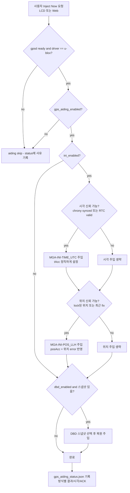
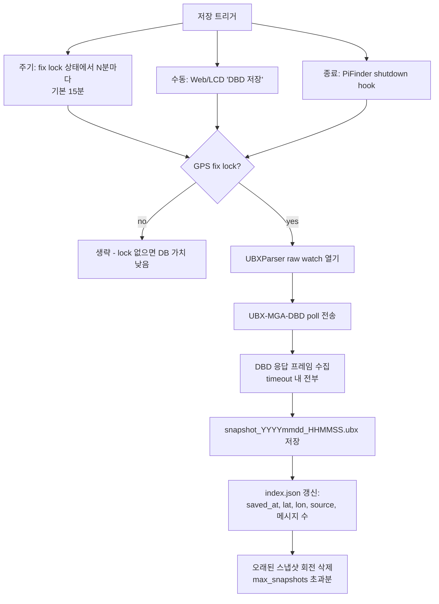
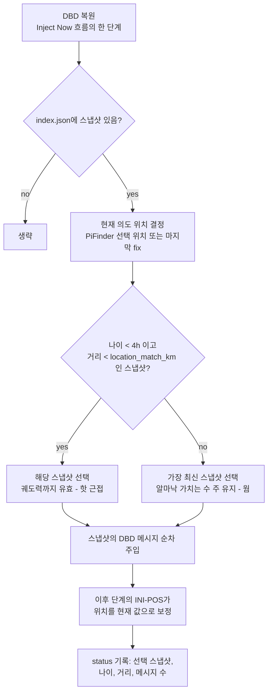
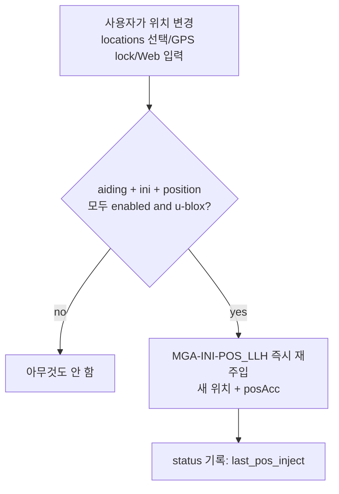
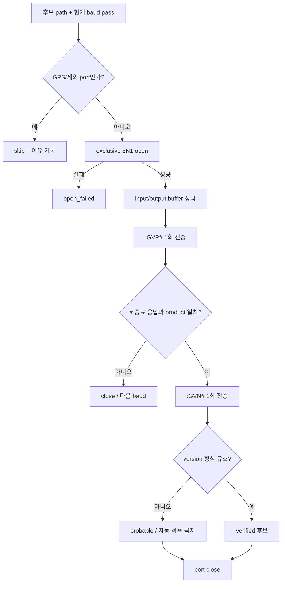
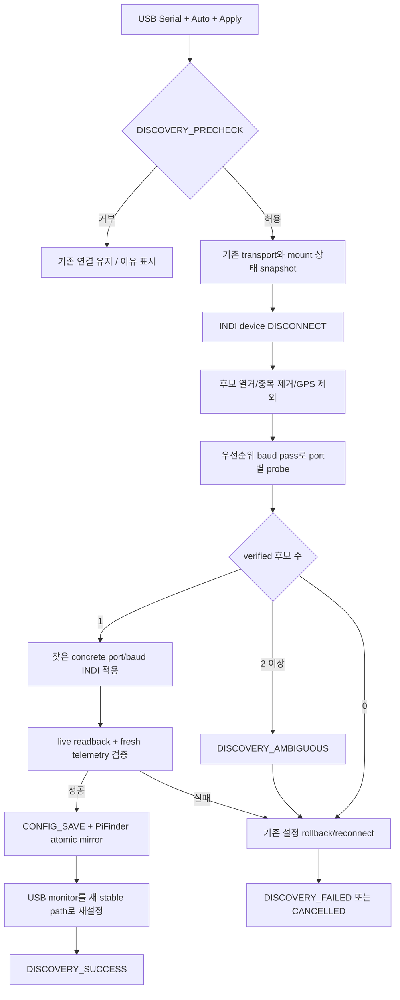
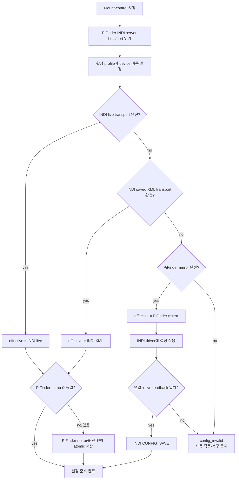
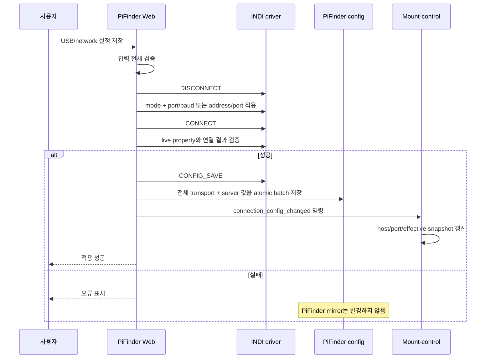
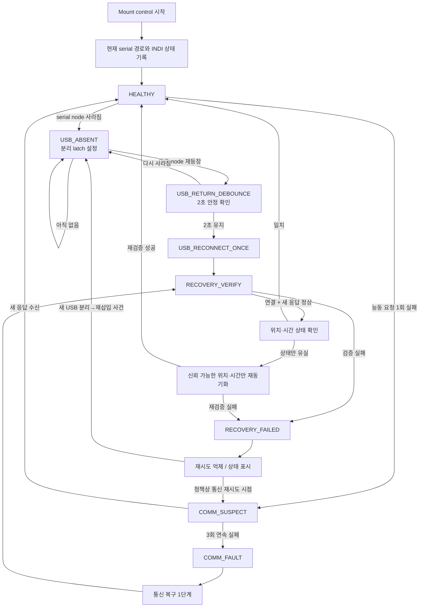
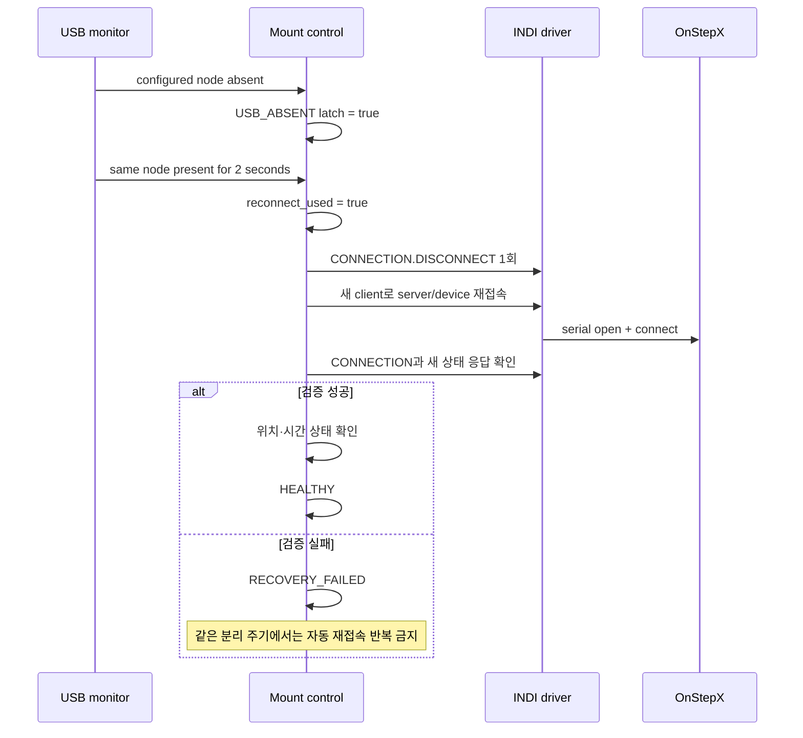

# 연결·GPS·시간·네트워크 — 이전 설계와 조사 기록

> 2026-10-10 통합 보관. 아래 본문의 “현재/현행”, 기본값, 완료 상태와 명령은 원문 작성 당시 기준이다.
> 오늘의 동작은 [개발 기준 문서](../../mf_dev/README.md)를 따른다. 이력에 적힌 절차를 현재 설치 절차로 사용하지 않는다.

- [gpsd_stable_ko.md](#gpsd_stable_ko)
- [mf_gps_aiding_plan_ko.md](#mf_gps_aiding_plan_ko)
- [mf_i2c_clock_stretching_fix_ko.md](#mf_i2c_clock_stretching_fix_ko)
- [mf_indi_serial_auto_discovery_design_ko.md](#mf_indi_serial_auto_discovery_design_ko)
- [mf_indi_serial_reconnect_design_ko.md](#mf_indi_serial_reconnect_design_ko)
- [mf_time_sync_ko.md](#mf_time_sync_ko)
- [mf_wifi_apsta_ko.md](#mf_wifi_apsta_ko)


---

<a id="gpsd_stable_ko"></a>

## gpsd_stable_ko.md

<a id="gpsd_stable_ko--gpsd-안정-버전-설치"></a>
## GPSD 안정 버전 설치

2026-09-20에 확인한 공식 최신 안정 릴리스는 **3.27.5**다.
[공식 릴리스 태그](https://gitlab.com/gpsd/gpsd/-/tags)와
[공식 배포 파일](https://download-mirror.savannah.gnu.org/releases/gpsd/)을 사용한다.
개발 브랜치나 PyPI의 Python 클라이언트 버전을 설치 기준으로 사용하지 않는다.

`pifinder_setup.sh`는 GPS 설정을 생성한 다음 안정 버전 설치기를 실행한다.
기존 장비의 GPSD만 업데이트하려면 일반 사용자로 실행한다.

```bash
cd ~/PiFinder
bash scripts/install_gpsd_stable.sh
```

설치기는 SHA-256으로 소스를 검증하고 빌드 및 `scons check`를 수행한다.
실패하면 서비스 전환 전에 중단한다. `/var/tmp`에서 빌드하므로 디스크
공간과 인터넷 연결이 필요하다. 설치 과정에서 GPSD가 잠시 재시작된다.
`/etc/default/gpsd`의 장치·통신 속도 설정은 보존한다.

실행 파일은 `/opt/pifinder/gpsd-3.27.5`에 설치하고 systemd의
`/etc/systemd/system/gpsd.service.d/50-pifinder-stable.conf`로 선택한다.
Debian 패키지의 서비스·소켓·클라이언트 라이브러리는 유지한다.
따라서 `/usr/sbin/gpsd -V`는 배포판 버전을 표시하며, 실제 서비스 버전은
다음과 같이 확인한다.

```bash
/opt/pifinder/gpsd-3.27.5/sbin/gpsd -V
systemctl status gpsd --no-pager
/opt/pifinder/gpsd-3.27.5/bin/gpspipe -w -n 5
```

서비스 시작 실패 시 기존 drop-in을 복원한다. 수동으로 Debian GPSD로
되돌릴 때는 아래 명령을 실행한다.

```bash
sudo rm /etc/systemd/system/gpsd.service.d/50-pifinder-stable.conf
sudo systemctl daemon-reload
sudo systemctl restart gpsd
```

후속 안정 버전 적용 시 설치기의 `version`과 `sha256`을 함께 갱신하고
자체 회귀 테스트 및 실제 GPS 수신을 확인한다.

<a id="gpsd_stable_ko--2026-09-20-장비-적용-검증"></a>
### 2026-09-20 장비 적용 검증

- Debian 12 arm64에서 빌드 및 `scons check` 통과. 데이터 재생 회귀 테스트
  194건 성공. 설치하지 않는 그래픽 도구의 선택 의존성 경고만 남았다.
- GPSD 서비스가 3.27.5를 실행하고 JSON `VERSION`도 3.27.5를 반환했다.
- `/dev/ttyAMA2`, 115200 설정 보존, u-blox 수신기 인식 확인.
- PiFinder와 동일한 `gpsdclient`에서 `convert_datetime=True`로 TPV/SKY
  파싱 성공. PiFinder 서비스 active, gpsd.socket enabled 확인.
- 검증 시점에는 TPV mode 1, 사용 위성 0개로 위치 고정이 없었다.
  실제 위치·시각 정확도는 위성 고정 후 별도로 확인해야 한다.
- 설치 스크립트 `bash -n` 및 `git diff --check` 통과.


---

<a id="mf_gps_aiding_plan_ko"></a>

## mf_gps_aiding_plan_ko.md

<a id="mf_gps_aiding_plan_ko--mf-pifinder-gps-aiding-plan-u-blox-전용"></a>
## MF PiFinder GPS Aiding Plan (u-blox 전용)

> 아래 OS 언급은 당시 설계·전환 기준이다. 현재 MFNavis 설치는
> [Trixie 64-bit / Python 3.13 안내](setup.md#mf_trixie_install_ko)를 따른다.

작성일: 2026-07-14
상태: 설계 초안 (구현 전 검토용)

이 문서는 u-blox 수신기(GEP-M1025, M10 SPG 5.10)가 장시간 전원 차단 후
콜드스타트로 시작하는 문제를 완화하기 위해, Raspberry Pi가 가진 시각·위치·
보조 데이터를 **사용자의 주입 요청 시점에** 수신기에 주입(aiding)하는
기능의 설계와 동작 순서를 정리한다. 구현 전에 이 문서로 동작 순서와
정책을 확정한다.

<a id="mf_gps_aiding_plan_ko--배경"></a>
### 배경

- GEP-M1025의 백업 전원은 배터리가 아니라 슈퍼커패시터다. 유지 시간이
  분~수 시간 수준이라, PiFinder를 하루 이상 꺼두면 시각·궤도력·알마낙이
  모두 소실되어 매번 완전 콜드스타트가 된다. (설정은 플래시에 있어 유지됨)
- 콜드/웜 스타트에서 이미 추적 중인 위성의 C/N0 자체는 같지만,
  **획득(acquisition) 감도와 TTFF는 크게 다르다**. 콜드는 전 위성을
  넓은 도플러×코드 공간에서 blind 탐색해야 하므로 획득 문턱이 높고
  (M10 기준 약 -148 dBm), 웜/핫은 좁은 창만 탐색해 재획득 감도
  (약 -160 dBm)에 가깝게 동작한다. 실효 차이는 10~15 dB에 달한다.
- 2026-07-14 진단에서 PiFinder 본체 EMI가 GPS 신호를 10~15 dB 깎는 것을
  확인했다(A-B-A 측정). aiding은 이 손실을 부분적으로 상쇄하는
  실질적인 우회책이기도 하다.

<a id="mf_gps_aiding_plan_ko--목표"></a>
### 목표

- **사용자가 주입을 요청한 시점**(LCD/Web의 Inject Now)에 수신기를
  콜드 → 웜(가능하면 핫에 근접) 스타트로 전환한다. **부팅 시 자동 주입은
  하지 않는다** — 수신기에 쓰는 시점은 항상 사용자가 결정한다.
- **완전 오프라인으로 동작한다.** 인터넷, 외부 서비스 가입, 계정이 일절
  필요 없다.
- 사용자가 방식별로 켜고 끄고, 수동으로 주입/저장할 수 있어야 한다.
- 기존 GPS 흐름(gpsd, gps_gpsd/gps_ubx, time sync helper)을 흔들지 않는다.
- 실패해도 부팅과 GPS 수신 자체는 절대 방해하지 않는다 (best-effort).

<a id="mf_gps_aiding_plan_ko--범위와-전제"></a>
### 범위와 전제

- **u-blox 전용**: 주입에 쓰는 UBX-MGA/UPD는 u-blox 프로토콜이다.
  게이트는 config가 아니라 **수신기 감지**로 한다 — gpsd `DEVICES` 응답의
  `driver == "u-blox"` (현재 기기: `SW ROM SPG 5.10, PROTVER=34.10`).
  gpsd/ublox 어느 백엔드를 쓰든 수신기가 u-blox이면 동작한다.
- **패키지 사용**: 전송 도구는 gpsd의 `ubxtool`을 쓴다. Bookworm에서
  `/usr/bin/ubxtool`은 이미 있으나 `python3-gps` 패키지가 필요하다
  (`pifinder_setup.sh`에 추가). gpsd가 `-b`(readonly)로 실행 중이면 기능을
  비활성화하고 상태에 사유를 남긴다.
- 수신(ACK 확인, DBD 캡처)은 리포에 이미 있는 `UBXParser`의 gpsd raw watch
  (`?WATCH raw:2`)를 재사용한다. 새 시리얼 접근은 만들지 않는다 —
  포트는 계속 gpsd가 소유한다.
- ROM 펌웨어(SPG 5.10)는 `UBX-UPD-SOS`(플래시 자동 저장/복원)를 지원하지
  않을 수 있으므로 계획에서 제외하고, 호스트(Pi) 저장 방식(② MGA-DBD)으로
  통일한다.

<a id="mf_gps_aiding_plan_ko--두-가지-방식"></a>
### 두 가지 방식

| # | 방식 | 데이터 | 효과 | 기본값 |
| --- | --- | --- | --- | --- |
| ① | MGA-INI 시각+위치 | Pi 시계(chrony/RTC), PiFinder 위치 | 콜드 → 웜. 탐색 공간 대폭 축소 | On |
| ② | MGA-DBD 백업/복원 | 수신기가 실제 수집한 nav DB(궤도력/알마낙) | 최근 사용 시 핫 근접, 이후 웜 | On |

- **두 방식 모두 사용자 선택 항목이다.** ①도 예외 없이 토글로 켜고 끈다
  (`gps_aiding_ini_enabled`). 어떤 방식도 사용자가 끄면 주입하지 않는다.
- ①이 활성화되어 있으면 항상 가장 먼저 주입한다 (시각이 있어야 뒤의
  데이터를 수신기가 검증할 수 있으므로).
- ②는 위치 정보와 함께 저장·관리한다. 장소가 바뀌면 즉시 반응한다
  (아래 "위치 변경 반응" 참고).
- 두 방식 모두 인터넷이 필요 없다.

<a id="mf_gps_aiding_plan_ko--제외한-방식-assistnow-mga-ano"></a>
#### 제외한 방식: AssistNow (MGA-ANO)

u-blox AssistNow(구 Online/Offline, 신 Predictive Orbits)의 궤도 예측
데이터도 같은 주입 경로로 쓸 수 있으나, **외부 서비스 가입 절차가 필요해
이 계획에서 제외한다**:

- 구 Online/Offline은 2026-05-31부로 EOM/EOS, 신규 토큰 미발급.
- 후속 Predictive Orbits는 M10에 무료지만 Thingstream 계정 가입 +
  ZTP 기기 등록(수신기 `UBX-SEC-UNIQID` 기반 chipcode 발급) 절차가 필요.

PiFinder는 오프라인·무계정 동작을 원칙으로 하므로 채택하지 않는다.
데이터 포맷(UBX-MGA-ANO)과 접근 절차 조사 기록은 git 이력
(`fb86262` 이전 버전)에 남아 있어, 추후 필요 시 재검토할 수 있다.

<a id="mf_gps_aiding_plan_ko--아키텍처"></a>
### 아키텍처

```text
새 모듈: python/PiFinder/gps_aiding.py
데이터:   ~/PiFinder_data/gps_aiding/
            dbd/  snapshot_*.ubx   (② 스냅샷, 회전 보관)
            dbd/  index.json       (스냅샷 메타: 시각, 위치, 소스)
상태:     ~/PiFinder_data/gps_aiding_status.json
```

실행 주체:

- **주입은 전부 사용자 요청으로만**: server.py 라우트와 LCD 콜백이
  같은 모듈의 주입 함수를 직접 호출한다. 별도 큐는 만들지 않는다.
  부팅 시 자동 주입 경로는 없다.
- **백그라운드 워커는 ② 주기 DBD 백업 전용**: GPS 프로세스가 시작될 때
  `gps_aiding.start_worker()` 데몬 스레드를 띄우되, 이 워커는 수신기에
  aiding 데이터를 주입하지 않는다 — fix lock 상태에서 주기적으로
  DBD를 **읽어 저장**만 한다. gpsd 연결과 u-blox 감지가 끝난 뒤에만
  동작한다.
- **직렬화**: 수신기에 쓰는 모든 동작은 파일 lock
  (`gps_aiding.lock`, flock)으로 직렬화한다. 프로세스가 달라도 안전하다.
- 전송은 `ubxtool -P 34.10 -c CLASS,ID,<hex payload>` 서브프로세스,
  검증/캡처는 UBXParser raw watch. MGA ACK는 `CFG-NAVSPG-ACKAIDING`이
  켜져 있을 때만 오므로, ACK는 "확인되면 기록"하고 없어도 실패로
  간주하지 않는다(fire-and-forget 허용).

<a id="mf_gps_aiding_plan_ko--주입-요청-처리-순서도"></a>
### 주입 요청 처리 순서도

주입은 사용자가 LCD/Web에서 `Inject Now`를 눌렀을 때만 실행된다.



주입 순서 원칙: **시각 → 위치 → DBD**. 시각이 있어야 수신기가
뒤따르는 궤도력 데이터의 유효성을 판정할 수 있다.

<a id="mf_gps_aiding_plan_ko--②-mga-dbd-저장복원-순서도"></a>
### ② MGA-DBD 저장/복원 순서도

저장 (백업):



복원 (주입 요청 시):



- 궤도력은 ~4시간만 유효하므로 "나이 < 4h + 같은 장소"가 최상 케이스다.
  그 외에는 알마낙/이온층 보정 가치로 최신 스냅샷을 넣는다 (콜드보다
  항상 낫고, 해가 되지 않는다).
- 위치 태깅은 스냅샷 메타(index.json)에 저장한다. 장소별로 별도 보관할
  필요는 없다 — 궤도력·알마낙 자체는 위치 독립이고, 위치는 ①이 맡는다.
  매칭 판정은 "이 스냅샷의 궤도력을 핫스타트급으로 신뢰할지"의 기준이다.

<a id="mf_gps_aiding_plan_ko--위치-변경-반응"></a>
### 위치 변경 반응



- 관측지를 옮겨 다니는 사용 패턴에서, 위치가 바뀌는 순간 수신기 탐색
  가정도 바로 갱신되도록 한다. 훅 지점은 main.py의 `gps_msg == "fix"`
  중 source가 GPS가 아닌 경우(수동/저장 위치 적용)와 locations 콜백.
- 위치 변경도 사용자의 명시적 행위이므로 "사용자 요청 시점 주입" 원칙에
  부합한다. 부팅처럼 사용자 개입 없이 일어나는 자동 주입은 아니다.

<a id="mf_gps_aiding_plan_ko--사용자-제어-ui"></a>
### 사용자 제어 (UI)

LCD:

```text
Settings > Advanced > GPS Settings > GPS Aiding
  Aiding        Off / On          (gps_aiding_enabled)
  Use INI       Off / On          (gps_aiding_ini_enabled, ① 시각+위치)
  Use DBD       Off / On          (gps_aiding_dbd_enabled)
  Inject Now    [action]          (활성화된 방식 전체 재주입)
  Save DBD      [action]          (지금 DBD 백업)
```

Web (GPS 관련 카드 또는 Tools):

- 방식별 토글(①시각/위치 분리 토글 포함)
- 상태 표시: 방식별 마지막 주입 시각/결과,
  DBD 스냅샷 목록(시각·위치·나이)
- 버튼: `Inject Now`, `Save DBD Now`
- LCD보다 세부 설정(주기, 임계값)은 Web에만 노출

<a id="mf_gps_aiding_plan_ko--설정-키-default_configjson"></a>
### 설정 키 (default_config.json)

```text
gps_aiding_enabled            true    기능 전체
gps_aiding_ini_enabled        true    ① (사용자 선택 토글, LCD/Web)
gps_aiding_time               true    ① 세부: 시각 주입 (Web 전용)
gps_aiding_position           true    ① 세부: 위치 주입 (Web 전용)
gps_aiding_dbd_enabled        true    ②
gps_aiding_dbd_interval_min   15      주기 백업 간격
gps_aiding_dbd_max_snapshots  5       회전 보관 수
gps_aiding_dbd_match_km       100     핫스타트급 신뢰 거리 임계
```

모든 키는 일반 설정처럼 저장된다 (LiveCam processing 같은 세션 전용
스위치는 없음 — aiding은 리소스를 상시 소비하지 않는다).

<a id="mf_gps_aiding_plan_ko--안전-규칙"></a>
### 안전 규칙

- **UI와 GPS 수신을 절대 막지 않는다**: 주입은 사용자 요청 시에만
  실행되고, 모든 단계에 타임아웃(전송 수 초), 실패는 로그 + status
  기록 후 다음 단계로. 주입 실행 중에도 LCD/Web은 블로킹되지 않는다
  (백그라운드 실행 + 상태 표시).
- **거짓 데이터를 넣지 않는다**:
  - 시각: chrony synced 또는 time sync helper가 신뢰하는 상태에서만.
    `tAccS/Ns`를 실제 신뢰도로 설정 (NTP면 수백 ms~수 초, RTC면 크게).
  - 위치: lock된 저장 위치 또는 최근 GPS fix만. `posAcc`에 위치 error를
    반영하고 하한을 둔다. 불확실하면 생략 — 틀린 위치 주입은 무주입보다
    나쁘다.
- 수신기 쓰기는 flock으로 전 프로세스 직렬화. gpsd `-b` 감지 시 기능
  비활성 + status에 안내.
- ubxtool 부재/실패(패키지 미설치)면 기능 비활성 + status 안내.

<a id="mf_gps_aiding_plan_ko--메시지도구-참고"></a>
### 메시지/도구 참고

```text
전송: ubxtool -P 34.10 -c <class,id,payload>
  MGA-INI-TIME_UTC   0x13 0x40 (type=0x10)  시각 + tAcc
  MGA-INI-POS_LLH    0x13 0x40 (type=0x01)  lat/lon/alt + posAcc
  MGA-DBD            0x13 0x80              poll(빈 payload) / 복원(덤프 재전송)
확인: UBXParser raw watch
  MGA-ACK            0x13 0x60              ACKAIDING 켜진 경우만 수신
  MGA-DBD 응답        0x13 0x80              백업 캡처 대상
```

- UBXParser에 MGA 클래스(0x13) raw 프레임 패스스루를 추가해야 한다
  (현재는 NAV 계열만 파싱). 파싱은 불필요 — 프레임 bytes 그대로 저장/재전송.

<a id="mf_gps_aiding_plan_ko--구현-단계"></a>
### 구현 단계

```text
Stage 1  gps_aiding.py 뼈대 + ① 시각/위치 주입 + Inject Now 진입점(Web)
         + status 파일 (u-blox 감지, flock, ubxtool 래퍼, 게이트 규칙)
Stage 2  설정 키 + LCD 메뉴 + Web 카드/버튼 (Inject Now)
Stage 3  ② DBD: UBXParser MGA 패스스루, 백업(주기/수동/종료), 복원,
         index.json, 위치 태깅/선택 규칙
Stage 4  위치 변경 훅, pifinder_setup.sh에 python3-gps 추가, 문서 갱신,
         실측 검증
```

각 Stage는 독립적으로 배포/검증 가능해야 한다. Stage 1만으로도
콜드 → 웜 효과가 나온다.

<a id="mf_gps_aiding_plan_ko--테스트-계획"></a>
### 테스트 계획

- 실내: 주입 명령 성공/타임아웃, status 파일 필드, flock 경합,
  gpsd `-b`/ubxtool 부재 시 비활성 동작.
- 실외 A/B (scripts/gps_acquisition_diag.py 재사용):
  - cold (주입 안 함) vs ① vs ①+② 의 TTFF 비교
    (각 케이스 모두 부팅 후 사용자가 Inject Now를 누른 시점 기준)
  - 전원 수 시간 차단 → 재부팅 → Inject Now 시나리오
  - 관측지 이동 시나리오 (위치 변경 반응 확인)
- 회귀: 기존 GPS 흐름(fix/time/satellites 메시지, time sync helper)
  무영향 확인. aiding 전체 Off 시 현재와 완전 동일해야 한다.

<a id="mf_gps_aiding_plan_ko--미해결-질문-구현-전-확정-필요"></a>
### 미해결 질문 (구현 전 확정 필요)

1. 종료 시 DBD 백업 훅의 위치 — PiFinder 정상 종료 경로가 짧아서
   systemd `ExecStop` 스크립트가 더 안정적일 수 있음.
2. gpsd 3.22 ubxtool의 M10(PROTVER 34) 호환 — `-c` 원시 전송은 문제
   없을 것으로 보이나 Stage 1에서 실기기 확인이 첫 작업.


---

<a id="mf_i2c_clock_stretching_fix_ko"></a>

## mf_i2c_clock_stretching_fix_ko.md

<a id="mf_i2c_clock_stretching_fix_ko--리포트-bno055-i2c-클럭-스트레칭-문제-해결-보드-모델-인지-i2c-버스-선택"></a>
## 리포트: BNO055 I2C 클럭 스트레칭 문제 해결 (보드 모델 인지 I2C 버스 선택)

- 작성일: 2026-07-13
- 브랜치: `mf_pifinder` (포크 `hjoungjoo/MF_PiFinder`)
- 테스트 하드웨어: Raspberry Pi 4 Model B Rev 1.4, GPIO2/GPIO3에 연결된 BNO055 IMU
- 상태: Pi 4에서 구현·검증 완료. Pi 5 경로는 구현됨(업스트림과 같은 하드웨어 I2C 경로,
  400 kbps) — Pi 5 실기 테스트는 아직 안 함

<a id="mf_i2c_clock_stretching_fix_ko--1-요약"></a>
### 1. 요약

PiFinder에서 간헐적인 전체 시스템 프리징이 발생했다: 무작위 시점에 모든 프로세스
(UI, 솔버, SkySafari 서버, 웹 UI)가 4~5초간 응답을 멈췄다가 풀린다. 원인 사슬은
다음과 같다.

1. BCM2835/BCM2711 I2C 컨트롤러(Pi 1~4)에는 클럭 스트레칭 지원에 잘 알려진 실리콘
   버그가 있다. BNO055 IMU는 SCL 클럭을 상시 스트레칭하므로 일반 버스 속도에서는
   전송이 깨질 수 있다.
2. 업스트림 PiFinder는 이를 하드웨어 버스를 10 kHz로 낮추는 것
   (`dtparam=i2c_arm_baudrate=10000`)으로 우회한다. 이 방법은 깨짐 확률은 줄이지만
   모든 IMU 트랜잭션을 ~40배 느리게 만들어, IMU 프로세스가 커널 I2C 전송 안에서
   대부분의 시간을 보내게 된다 (uninterruptible `D` 상태,
   `wchan=bcm2835_i2c_xfer`).
3. PiFinder는 프로세스 간 상태를 단일 `multiprocessing.BaseManager` 서버
   프로세스로 공유한다. CPU 압박 상황(열 스로틀링도 관측됨:
   `vcgencmd get_throttled` = `0x80000`)에서 느린 I2C에 묶인 IMU 프로세스와 직렬화된
   매니저가 호송(convoy)을 이룬다: 매니저가 느린 클라이언트 뒤에서 막히면 공유
   상태를 만지는 **모든** PiFinder 프로세스가 함께 멈춘다. 이것이 눈에 보이는
   4~5초 프리징이다.

수정은 보드 모델별로 I2C 전송 계층을 선택한다:

- **Pi 5 / CM5** (RP1 I2C 컨트롤러, 클럭 스트레칭 버그 없음): 하드웨어 I2C
  **400 kbps**.
- **Pi 4 이하** (BCM2835 계열 컨트롤러): 같은 물리 핀(GPIO2/GPIO3,
  `/dev/i2c-3`로 노출)에 **소프트웨어(비트뱅잉) `i2c-gpio` 버스**를 사용한다.
  소프트웨어 버스는 클럭 스트레칭을 규격대로 처리한다. 버그가 있는 하드웨어 블록
  (`i2c_arm`)은 핀을 점유하지 못하도록 끈다.

변경 후 Pi 4에서 IMU 프로세스는 더 이상 `D` 상태에 상주하지 않고(프리징 중 기존
~59% 샘플 → 사실상 0), BNO055 판독은 깨끗하며(단위 쿼터니언, I/O 오류 없음),
다중 프로세스 동시 `D` 상태라는 프리징 시그니처도 사라졌다.

<a id="mf_i2c_clock_stretching_fix_ko--2-증상과-진단"></a>
### 2. 증상과 진단

- 증상: 무작위 시점에 — 메뉴를 빠르게 전환하면 가장 쉽게 재현 — 시스템 전체
  (모든 PiFinder 프로세스가 동시에)가 4~5초간 멈춘다.
- `/proc/<pid>/stat`을 샘플링하는 "프리즈 캐처" 스크립트가 여러 PiFinder
  프로세스가 동시에 `D` 상태인 2.3초 스톨을 포착했다.
- IMU 프로세스는 샘플의 ~59%에서 `D` 상태였고 `wchan = bcm2835_i2c_xfer` —
  즉 하드웨어 I2C 전송 내부에서 블록되어 있었다.
- 가중 요인: 4코어에 CPU 부하 ~5.4, `get_throttled = 0x80000`(소프트 온도 제한
  이력, 76.9 °C 관측) — 테스트 장비의 개발 도구 영향도 있지만, 순수 PiFinder
  시스템에서도 프리징은 재현된다.
- 모든 프로세스 간 상태가 GIL에 묶인 단일 `StateManager`/`BaseManager` 프로세스를
  거치므로, 하나의 클라이언트가 멈추면 전부가 직렬화된다 — 관측된 "모두 같이
  멈춤" 동작과 일치한다.

<a id="mf_i2c_clock_stretching_fix_ko--3-배경-bcm2835-i2c-클럭-스트레칭-버그"></a>
### 3. 배경: BCM2835 I2C 클럭 스트레칭 버그

BCM2835(그리고 Pi 4의 BCM2711까지 이어지는 후속) I2C 블록은 SCL을 고정 시점에
샘플링하며, 슬레이브가 클럭 스트레칭을 할 때 SCL 최소 하이 시간을 보장하지
않는다. 슬레이브(거의 모든 읽기에서 스트레칭하는 BNO055 같은)가 불운한 순간에
클럭을 놓으면 컨트롤러가 극단적으로 짧은(~40 ns) SCL 펄스를 낼 수 있고,
슬레이브는 깨진 바이트를 내보낸다. 참고 자료:

- https://www.advamation.com/knowhow/raspberrypi/rpi-i2c-bug.html
- https://github.com/raspberrypi/linux/issues/254
- https://github.com/raspberrypi/linux/issues/4884

알려진 우회책: (a) 스트레칭이 (거의) 일어나지 않도록 버스를 느리게 — 현재
업스트림 방식이며 위에서 설명한 지연 비용이 있음; (b) BNO055를 UART 모드로 사용;
(c) 클럭 스트레칭을 규격대로 구현하는 소프트웨어 `i2c-gpio` 버스 사용. Pi 5의
RP1 I2C 컨트롤러에는 이 버그가 없으므로 우회가 필요 없다.

(c)를 선택한 이유: 하드웨어 변경이 필요 없고, 배선과 디바이스 주소가 그대로이며,
두 가지 실패 모드(데이터 깨짐 *그리고* 10 kHz 지연)를 한 번에 제거하기 때문이다.

<a id="mf_i2c_clock_stretching_fix_ko--4-변경-사항"></a>
### 4. 변경 사항

다섯 부분이며, 모두 런타임/설치 시점에 모델을 인지한다 — 설정 옵션 없이 올바른
경로가 자동 선택된다.

<a id="mf_i2c_clock_stretching_fix_ko--41-신규-모듈-pythonpifinderi2c_buspy"></a>
#### 4.1 신규 모듈: `python/PiFinder/i2c_bus.py`

어떤 버스를 내줄지 결정하는 단일 지점. 전체 소스:

```python
#!/usr/bin/python
# -*- coding:utf-8 -*-
"""Model-aware I2C bus factory.

Raspberry Pi 5 (and Compute Module 5) drive I2C through the RP1 controller,
which honours clock stretching correctly, so those boards use the hardware
I2C bus at full speed.

Raspberry Pi 4 and earlier use the BCM2835/BCM2711 I2C block, which has a
well-documented clock-stretching bug: when a slave stretches the clock the
controller can emit a too-short SCL pulse and corrupt the transfer.  The
BNO055 IMU stretches the clock routinely, so on those boards PiFinder uses a
software (bit-banged) i2c-gpio bus on ``/dev/i2c-3`` instead, which respects
clock stretching.  ``pifinder_setup.sh`` provisions that overlay at install
time; this module simply selects the matching bus at runtime.
"""

import logging
from typing import Optional

logger = logging.getLogger("I2C")

# Bus number provisioned by the i2c-gpio overlay in pifinder_setup.sh.
SOFTWARE_I2C_BUS = 3


def _board_model() -> str:
    """Return the device-tree model string, or "" when unavailable."""
    try:
        with open("/proc/device-tree/model", "rb") as handle:
            return handle.read().decode("utf-8", "replace").rstrip("\x00").strip()
    except OSError:
        return ""


def uses_hardware_i2c(model: Optional[str] = None) -> bool:
    """Return True when this board should use the hardware I2C bus (Pi 5)."""
    if model is None:
        model = _board_model()
    return "Raspberry Pi 5" in model or "Compute Module 5" in model


def get_i2c():
    """Return an I2C bus object appropriate for this board.

    Pi 5 uses the hardware bus via ``board.I2C()``; earlier boards use the
    software i2c-gpio bus (``/dev/i2c-3``) via ``adafruit_extended_bus`` to
    work around the BCM2835/BCM2711 clock-stretching bug.
    """
    if uses_hardware_i2c():
        import board

        logger.debug("Using hardware I2C bus (board.I2C)")
        return board.I2C()

    from adafruit_extended_bus import ExtendedI2C

    logger.debug("Using software i2c-gpio bus /dev/i2c-%d", SOFTWARE_I2C_BUS)
    return ExtendedI2C(SOFTWARE_I2C_BUS)
```

<a id="mf_i2c_clock_stretching_fix_ko--42-pythonpifinderimu_pipy--팩토리-사용"></a>
#### 4.2 `python/PiFinder/imu_pi.py` — 팩토리 사용

```diff
@@ -11,7 +11,7 @@ import math
 from PiFinder import config, imu_calibration
 from PiFinder.multiproclogging import MultiprocLogging
 from PiFinder.types.positioning import ImuSample
-import board
+from PiFinder.i2c_bus import get_i2c
 import adafruit_bno055
 import logging
 import quaternion  # Numpy quaternion
@@ -30,7 +30,7 @@ class Imu:

     def __init__(self):
         cfg = config.Config()
-        i2c = board.I2C()
+        i2c = get_i2c()
         self.sensor = adafruit_bno055.BNO055_I2C(i2c)
```

<a id="mf_i2c_clock_stretching_fix_ko--43-pythonpifinderhardware_detectpy--같은-팩토리-import-safe-유지"></a>
#### 4.3 `python/PiFinder/hardware_detect.py` — 같은 팩토리, import-safe 유지

이 모듈은 Rev-4 디스플레이 자동 감지를 위해 BQ25895 충전 IC(0x6A)를 조사한다.
충전 IC도 같은 물리 핀에 있으므로 소프트웨어 버스에서 똑같이 접근된다.

```diff
@@ -11,9 +11,9 @@ older PiFinder hardware keeps the SSD1351 default.
 import logging

 try:
-    import board
+    from PiFinder.i2c_bus import get_i2c
 except Exception:
-    board = None
+    get_i2c = None


 logger = logging.getLogger("HardwareDetect")
@@ -22,11 +22,11 @@ BQ25895_ADDRESS = 0x6A


 def i2c_present(address: int) -> bool:
-    """Return True when an I2C address ACKs on the default board I2C bus."""
-    if board is None:
+    """Return True when an I2C address ACKs on the board I2C bus."""
+    if get_i2c is None:
         raise RuntimeError("blinka / board unavailable; no I2C bus")

-    i2c = board.I2C()
+    i2c = get_i2c()
     locked = False
     try:
         while not i2c.try_lock():
```

<a id="mf_i2c_clock_stretching_fix_ko--44-pythonrequirementstxt--의존성-추가"></a>
#### 4.4 `python/requirements.txt` — 의존성 추가

`Adafruit-Blinka`의 `board.I2C()`는 기본 하드웨어 버스에 고정되어 있다.
`adafruit-extended-bus`는 Blinka 호환을 유지하면서 임의의 `/dev/i2c-n`을 여는
`ExtendedI2C(n)`을 제공한다 (따라서 `adafruit_bno055`는 수정 불필요).

```diff
 adafruit-blinka==8.12.0
 adafruit-circuitpython-bno055
+adafruit-extended-bus==1.0.2
 cheroot==10.0.0
```

<a id="mf_i2c_clock_stretching_fix_ko--45-pifinder_setupsh--모델-인지-부팅-설정"></a>
#### 4.5 `pifinder_setup.sh` — 모델 인지 부팅 설정

무조건적인 `i2c_arm=on` + `i2c_arm_baudrate=10000` 라인을 기존
`pifinder_board_profile` 헬퍼(`pifinder_paths.sh`)에 대한 분기로 교체했다.
두 경로는 추가 전에 상대 경로의 라인을 먼저 삭제해 상호 배타적으로 유지되므로,
SD 카드를 다른 세대 보드로 옮겨 setup을 재실행해도 올바른 설정으로 수렴한다.

```diff
@@ -161,13 +161,41 @@ fi
 BOOT_CONFIG="$(pifinder_boot_config_path)"
 for line in \
     "dtparam=spi=on" \
-    "dtparam=i2c_arm=on" \
-    "dtparam=i2c_arm_baudrate=10000" \
     "dtoverlay=pwm,pin=13,func=4" \
     "$(pifinder_uart_overlay)"
 do
     grep -qxF "${line}" "${BOOT_CONFIG}" || echo "${line}" | sudo tee -a "${BOOT_CONFIG}"
 done
+
+# I2C for the BNO055 IMU (and the BQ25895 charger on Rev-4 boards).
+#
+# Pi 5 / CM5 drive I2C through the RP1 controller, which honours clock
+# stretching, so hardware I2C at 400 kbps is safe there.  Pi 4 and earlier use
+# the BCM2835/BCM2711 I2C block, which has a known clock-stretching bug that
+# corrupts transfers with a clock-stretching device like the BNO055.  On those
+# boards, use a software (bit-banged) i2c-gpio bus on the same SDA/SCL pins
+# (GPIO2/GPIO3 -> /dev/i2c-3) instead, and disable the hardware i2c_arm block
+# so it does not fight the software bus for the pins.  Keep the two paths
+# mutually exclusive by removing the other path's lines first.
+if [[ "$(pifinder_board_profile)" == "pi5_class" ]]; then
+    sudo sed -i \
+        -e '/^dtoverlay=i2c-gpio/d' \
+        "${BOOT_CONFIG}"
+    for line in \
+        "dtparam=i2c_arm=on" \
+        "dtparam=i2c_arm_baudrate=400000"
+    do
+        grep -qxF "${line}" "${BOOT_CONFIG}" || echo "${line}" | sudo tee -a "${BOOT_CONFIG}"
+    done
+else
+    sudo sed -i \
+        -e '/^dtparam=i2c_arm=on/d' \
+        -e '/^dtparam=i2c_arm_baudrate=/d' \
+        "${BOOT_CONFIG}"
+    I2C_GPIO_OVERLAY="dtoverlay=i2c-gpio,i2c_gpio_sda=2,i2c_gpio_scl=3,bus=3"
+    grep -qxF "${I2C_GPIO_OVERLAY}" "${BOOT_CONFIG}" \
+        || echo "${I2C_GPIO_OVERLAY}" | sudo tee -a "${BOOT_CONFIG}"
+fi
 if [[ "$(pifinder_uart_overlay)" == "dtoverlay=uart2-pi5" ]]; then
     sudo sed -i 's/^dtoverlay=uart3/#dtoverlay=uart3/' "${BOOT_CONFIG}"
 fi
```

<a id="mf_i2c_clock_stretching_fix_ko--46-결과-bootfirmwareconfigtxt-관련-라인"></a>
#### 4.6 결과 `/boot/firmware/config.txt` (관련 라인)

Pi 4 이하:

```
dtparam=spi=on
dtoverlay=pwm,pin=13,func=4
dtoverlay=uart3
dtoverlay=i2c-gpio,i2c_gpio_sda=2,i2c_gpio_scl=3,bus=3
# (dtparam=i2c_arm=on / i2c_arm_baudrate 는 제거됨)
```

Pi 5 / CM5:

```
dtparam=spi=on
dtparam=i2c_arm=on
dtparam=i2c_arm_baudrate=400000
dtoverlay=pwm,pin=13,func=4
dtoverlay=uart2-pi5
```

<a id="mf_i2c_clock_stretching_fix_ko--5-검증-raspberry-pi-4-model-b-rev-14"></a>
### 5. 검증 (Raspberry Pi 4 Model B Rev 1.4)

새 설정으로 재부팅한 후:

1. **버스 생성, 디바이스 검출.** `/dev/i2c-3` 존재
   (`/sys/bus/i2c/devices/i2c-3` = i2c-gpio 어댑터). 하드웨어 `i2c-1`은 사라짐.
   `i2cdetect -y 3`에서 BNO055가 `0x28`로 ACK.
2. **센서 데이터 정상.** 소프트웨어 버스로 직접 판독(서비스 중지 상태): 칩 응답
   (온도 55 °C); 첫 웜업 샘플 이후 모든 쿼터니언의 노름이 정확히 1.0; Euler 각은
   정지 자세와 일치하며 안정; 자이로 값이 샘플마다 미세하게 변함 — 매 판독이
   신선하고 성공한 버스 트랜잭션임을 증명:

   ```
   [1] quat=(0.8865, -0.0907, 0.4538, -0.0001) |q|=1.0  euler=(0.0, -53.56, 15.69)  gyro=(0.003, -0.008, -0.001)
   [2] quat=(0.8865, -0.0907, 0.4538, -0.0001) |q|=1.0  euler=(0.0, -53.56, 15.69)  gyro=(0.0, -0.001, 0.0)
   ...
   ```
3. **로그에 I2C 오류 없음.** 부팅 이후 `Failed to get sensor` /
   `non-unit quaternion` / `Remote I/O` / `errno 121` 0건.
4. **D 상태 압박 해소.** IMU 프로세스(`/dev/i2c-3` 보유자)는 `S`/`R`로 샘플링됨.
   5초간 시스템 전체 스윕에서 어느 순간에도 `D` 상태 프로세스는 최대 **1**개,
   I2C 관련 `D` 상태는 **0**건 — 변경 전 IMU 프로세스의 ~59% `D`
   (`bcm2835_i2c_xfer`)와 프리징 중 다중 프로세스 동시 `D`에 대비된다.

<a id="mf_i2c_clock_stretching_fix_ko--6-트레이드오프와-참고-사항"></a>
### 6. 트레이드오프와 참고 사항

- **비트뱅잉의 CPU 비용:** `i2c-gpio`는 엣지마다 커널에서 CPU를 사용한다.
  실제로는 대체 대상보다 훨씬 저렴하다: 10 kHz 하드웨어 버스는 IMU 프로세스를
  일반 100 kHz 전송보다 트랜잭션당 ~40배 오래 블록시켰다. 소프트웨어 버스는
  기본 `i2c-gpio` 속도(기본 `i2c_gpio_delay_us=2` 기준 ~62 kHz, 타이밍 비보장)
  수준으로 동작해 기존 10 kHz보다 수 배 빠르면서 클럭 스트레칭에도 올바르다.
- **같은 핀, 같은 배선.** GPIO2/GPIO3를 그대로 재사용하며 하드웨어 변경이 없다.
  PiFinder I2C 헤더의 모든 디바이스(BNO055, Rev-4의 BQ25895)가 함께 버스 3으로
  이동하고, 트리 내 두 소비자 모두 같은 `get_i2c()` 팩토리를 거친다.
- **기존 설치의 업그레이드:** `pifinder_setup.sh` 재실행으로 부팅 설정이 수렴
  (상대 경로 라인을 먼저 삭제)하고 새 의존성이 설치된다. 오버레이 적용에는
  재부팅이 필요하다.
- **Pi 5의 400 kbps:** 실제 Pi 5 하드웨어에서는 아직 미검증. BNO055 데이터시트는
  400 kHz까지 허용하고 RP1은 클럭 스트레칭을 처리하지만, 문제가 나타나면
  보수적 대안은 baudrate 라인을 생략하는 것(기본 100 kHz)이다.
- **검토했던 대안:** BNO055 UART 모드도 버그를 피하지만 재배선과 UART가 필요한데,
  PiFinder는 UART를 이미 GPS에 사용 중이다.


---

<a id="mf_indi_serial_auto_discovery_design_ko"></a>

## mf_indi_serial_auto_discovery_design_ko.md

<a id="mf_indi_serial_auto_discovery_design_ko--indi-onstepx-usb-serial-포트-자동-탐색-설계안"></a>
## INDI OnStepX USB Serial 포트 자동 탐색 설계안

상태: **구현 완료 / 자동·실장 검증 진행**
작성일: 2026-08-13

<a id="mf_indi_serial_auto_discovery_design_ko--2026-10-10-230400bps-실장-검증"></a>
#### 2026-10-10: 230400bps 실장 검증

MF OOZOO E4의 OnStepX `10.28z`는 USB 명령 포트 기본 속도가 230400bps다.
현재 MFNavis 및 설치된 INDI OnStepX 드라이버는 이 속도를 지원하므로 운영 설정은
실제 자동 탐색 transaction으로 변경했다. 일반 OnStep의 기본 탐색 시작값 9600과
기존 장비에 대한 호환성은 유지한다.

- 선호 속도 없이 9600부터 탐색: 약 5.04초에 230400bps/`On-Step`/`10.28z` 식별.
- 이전 INDI/MFNavis 저장값을 115200으로 둔 상태: 약 12.05초에 새 속도 탐색,
  INDI 적용, telemetry 확인, INDI XML 및 MFNavis 설정 저장까지 성공.
- 저장된 230400으로 재탐색: 식별 약 0.17초, 전체 transaction 약 5.96초에 성공.
- INDI 실시간 속성, 저장 XML, MFNavis `onstep_serial_baud`가 모두 230400으로 일치.
- MFNavis 서비스 재시작 후에도 230400 설정과 `healthy` 연결을 유지하며, 새 상태
  갱신·추적 Off·이동 없음·가이드 대상 대기를 확인했다.
- USB 모터 출력 조회 200회 모두 응답, 중앙값 4.95ms, 95백분위 5.19ms.
  이는 조회 명령 응답 시간이며 펄스 시작 지연이나 종료 정밀도 측정값이 아니다.
- 시험은 정상 앱 제어를 잠시 정지하고 같은 production controller의
  `discover_onstep_serial_connection()`을 호출하는 장치 통합 harness로 실행했다.
  웹 요청의 큐 전달 경로는 별도 단위 테스트로 검증했다.
- 업로드 직후 첫 식별 요청은 응답이 없었으나 이후 기동 완료 상태의 식별과 위
  모든 자동 탐색은 성공했다. 펌웨어 기동 중의 무응답을 baud 불일치로 단정하지 않는다.
- 펌웨어 업로드 전 축 카운터를 저장·복원했고, 시험 중 추적·GoTo·가이드 이동을
  요청하지 않았다. 본 검증은 추적 정확도 또는 광학 가이드 프로필 재교정이 아니다.
- 회귀 테스트에 115200 실패 후 230400 탐색 및 230400 적용·저장 사례를 추가했다.
  관련 테스트 375개 통과, 1개 skip. 수정 테스트 파일 Ruff 검사 통과.

원시 시험 기록은 장비의 `MFNavis_data/telemetry/20261010_onstep_230400/`에
보관하며 사용자 설정·장치 로그는 Git에 포함하지 않는다.

이 문서는 Web UI에서 OnStepX 연결 방식을 `USB Serial`로 설정하고 Serial Port를
`Auto`로 선택했을 때, **현재 연결되어 있는 serial 장치 중 OnStepX port와 통신
속도를 함께 찾아 적용하는 방법**을 정의한다. 자동 찾기는 장애 복구나 부팅 시 자동
재탐색 기능이 아니다. 2026-08-13 이 문서의 안전 경계를 기준으로 후보 정규화,
읽기 전용 probe, baud pass, Web 선택 UI, mount-control 단일 실행 transaction과
실패 원복을 구현했다.

2026-08-13 ESP32 기반 OnStepX의 EN/GPIO0가 USB-UART DTR/RTS에 연결되는
하드웨어를 추가 검토했다. 이후 모든 PiFinder 직접 serial open은 흐름 제어를 끄는
것에 더해 **DTR/RTS 출력 상태를 설정하는 ioctl 자체를 호출하지 않는 것**을 안전
조건으로 사용한다.

관련 문서:

- [`mf_indi_serial_reconnect_design_ko.md`](connectivity.md#mf_indi_serial_reconnect_design_ko)
- [`mf_mountcontrol_indi_flow_ko.md`](mount.md#mf_mountcontrol_indi_flow_ko)
- [`mf_indi_connection_config_reconcile_20260812_ko.md`](../../mf_report/mf_indi_connection_config_reconcile_20260812_ko.md)
- [`mf_indi_usb_reinsert_field_test_20260812_ko.md`](../../mf_report/mf_indi_usb_reinsert_field_test_20260812_ko.md)

<a id="mf_indi_serial_auto_discovery_design_ko--1-목표와-비목표"></a>
### 1. 목표와 비목표

목표:

- 사용자가 Web UI에서 `Connection Type = USB Serial`,
  `USB Serial Port = Auto`를 선택하고 Apply했을 때 현재 연결된 장치 중 OnStepX의
  stable port와 baud를 안전하게 찾는다.
- `/dev/ttyUSB0`처럼 재삽입 때 바뀌는 이름 대신 가능한 가장 안정적인 경로를
  선택한다.
- GPS, 다른 마운트, USB-UART 디버그 콘솔을 OnStepX로 잘못 선택하지 않는다.
- 검증이 끝나기 전에는 INDI XML과 PiFinder mirror를 변경하지 않는다.
- 탐색 성공 시 찾은 concrete stable path와 검증된 baud를 일반 수동 선택과 동일한
  transaction으로 적용·저장한다.
- 탐색 실패 시 기존 연결 설정과 mount 상태를 원래대로 복구한다.

비목표:

- 정상 연결 중에 더 좋아 보이는 포트로 자동 전환하지 않는다.
- `Auto`를 persistent port/baud 값으로 저장하거나 매번 연결할 때 검색하지 않는다.
- USB가 잠시 빠진 사건은 기존 stable by-id 재삽입 복구가 담당한다. 자동 찾기는
  그 복구를 시작하거나 대신하지 않는다.
- 탐색 과정에서 수동 이동, GoTo, Sync, park/unpark, tracking 명령을 만들거나
  재전송하지 않는다.
- VID/PID만으로 특정 제품을 확정하지 않는다.
- 부팅 시 자동 탐색, 지속 통신 이상 감시와 driver/server 자동 재시작은 별도
  과제로 유지한다.
- INDI server가 원격 host에 있을 때 PiFinder의 로컬 `/dev`를 검색하지 않는다.

<a id="mf_indi_serial_auto_discovery_design_ko--2-현재-소스-구조"></a>
### 2. 현재 소스 구조

현재 `sys_utils.list_onstep_serial_ports()`는 다음 glob 결과를 Web UI에 나열한다.

```text
/dev/serial/by-id/*
/dev/ttyUSB*
/dev/ttyACM*
```

이 함수는 경로와 실제 tty target을 보여 준다. 2026-08-13 실측에서 같은
`/dev/ttyUSB1`을 가리키는 by-id와 tty 경로가 각각 표시되어 사용자가 포트 두
개로 오인하는 문제가 확인됐다. 자동 탐색 구현 전의 독립 선행 수정으로 같은
실제 장치의 alias를 한 항목으로 합쳤다(2026-08-13 구현·실장 검증 완료).

```text
/dev/serial/by-id/usb-1a86_USB_Serial-if00-port0 -> /dev/ttyUSB1
/dev/ttyUSB1                                      -> /dev/ttyUSB1

기존 UI: 2개
수정 UI: by-id 대표 1개
```

목록 단계에서 적용할 규칙:

1. 각 경로를 `realpath`로 정규화한다.
2. 같은 realpath는 같은 실제 serial device로 묶는다.
3. 대표 경로는 `by-id → by-path → ttyUSB/ttyACM` 순으로 선택한다.
4. 현재 목록은 by-id와 tty를 수집하므로 같은 장치에서는 by-id 하나만 남는다.
5. 서로 다른 realpath는 VID/PID가 같아도 별도 장치로 유지한다.

이 dedup은 화면 목록과 향후 자동 탐색 후보 생성에 공통으로 사용하며, 기존
저장 설정이나 INDI 연결을 변경하지 않는다.

자동 탐색 구현으로 다음 동작도 추가됐다.

- configured GPS와 같은 실제 tty 제외
- 실제 OnStep `:GVP#`/`:GVN#` 응답 확인
- 마지막 검증값·9600·나머지 지원값 순서의 baud pass
- 유일 verified 후보만 적용하고 0개/복수 후보는 기존 설정 원복

USB VID/PID, serial number, physical location 표시는 후속 확장 항목이다. 현재
선택 합격 기준은 metadata가 아니라 실제 OnStep protocol 응답이다.

Web `INDI > LX200 OnStepX Driver Connection`은 사용자가 목록 또는 수동 경로와
baud를 선택한 뒤 `apply_indi_onstep_connection()`을 호출한다. 이 함수는 INDI
device를 disconnect하고 port/baud를 적용한 뒤 connect, live readback,
`CONFIG_SAVE`까지 수행한다.

mount-control 시작 시 설정 우선순위는 다음과 같다.

```text
INDI live property
→ INDI CONFIG_SAVE XML
→ 마지막 검증 PiFinder mirror
```

따라서 자동 탐색은 이 우선순위를 우회해 부팅할 때마다 설정을 덮어쓰면 안 된다.
탐색 결과는 기존 Web 저장 transaction과 동일하거나 더 강한 검증을 통과한
경우에만 새 effective transport가 되어야 한다.

<a id="mf_indi_serial_auto_discovery_design_ko--3-현재-장비의-식별-정보-실측"></a>
### 3. 현재 장비의 식별 정보 실측

2026-08-13 현재 연결 장비:

```text
dynamic node: /dev/ttyUSB1
by-id: /dev/serial/by-id/usb-1a86_USB_Serial-if00-port0
by-path: /dev/serial/by-path/platform-xhci-hcd.0-usb-0:1:1.0-port0
USB driver: ch341
VID:PID: 1a86:7523
USB product: USB Serial
USB serial_number: 없음
physical location: 1-1
INDI port: 같은 by-id
INDI baud: 115200
```

핵심 제약은 이 CH340에 USB serial number가 없다는 점이다. `1a86:7523`은
일반적인 USB-UART 칩 식별자이므로 같은 칩을 사용하는 GPS, 다른 컨트롤러,
디버그 어댑터도 동일하게 보일 수 있다. 따라서 다음 조건은 단독 합격 기준이
될 수 없다.

```text
ttyUSB 또는 ttyACM이다
VID:PID가 1a86:7523이다
product 문자열이 USB Serial이다
by-id 이름에 1a86이 들어 있다
```

by-id는 현재 한 장비의 tty 번호 변경에는 안정적이지만, USB serial number가 없는
동일 CH340 두 개를 동시에 연결하면 장치 자체를 유일하게 식별하지 못할 수 있다.
이 경우 by-path는 물리 USB 소켓을 구분하지만 다른 소켓으로 옮기면 바뀐다.

<a id="mf_indi_serial_auto_discovery_design_ko--4-onstepx-읽기-전용-식별-방법"></a>
### 4. OnStepX 읽기 전용 식별 방법

OnStepX 공식 소스 `src/telescope/Telescope.command.cpp`에는 다음 읽기 명령이
정의되어 있다.

| 명령 | 의미 | 공식 응답 형식 | 탐색 사용 |
|---|---|---|---|
| `:GVP#` | Product Name | 문자열 + `#` | 1차 필수 |
| `:GVN#` | Firmware Number | `M.mp#` | 2차 필수 |
| `:GVC#` | Config/Product Description | 문자열 + `#` | 표시용 선택 |
| `:GVH#` | Firmware Hardware/Pinmap | 문자열 + `#` | 표시용 선택 |

현재 OnStepX 공식 소스의 firmware name은 `On-Step`이다. 자동 탐색은 이동이나
설정 변경 명령이 아니라 `:GVP#`와 `:GVN#`만 사용한다.

<a id="mf_indi_serial_auto_discovery_design_ko--41-esp32-dtrrts-안전-경계"></a>
#### 4.1 ESP32 DTR/RTS 안전 경계

`rtscts=False`, `dsrdtr=False`는 흐름 제어만 끈다. pySerial 3.5는 이 상태에서도
port open 직후 기본 active 상태인 DTR과 RTS를 각각 `TIOCMBIS`로 적용한다. ESP32
OnStepX에서는 이 핀이 EN과 GPIO0에 연결될 수 있으므로 probe가 읽기 전용 명령만
보내더라도 MCU reset 또는 bootloader 진입을 일으킬 수 있다.

PiFinder 직접 serial 경로는 다음 규칙을 공통 적용한다.

```text
serial open
→ pySerial의 _update_dtr_state() 억제
→ pySerial의 _update_rts_state() 억제
→ CRTSCTS, IXON, IXOFF, IXANY 해제
→ HUPCL 해제(close 때 DTR hang-up 방지)
→ CLOCAL 설정
→ OnStep 읽기/쓰기
→ close(DTR/RTS ioctl 없음)
```

적용 범위:

- Auto port/baud의 `:GVP#`, `:GVN#` probe
- INDI를 정지하고 실행하는 OnStep 위치·시간 직접 동기화
- 같은 공통 함수로 수행하는 serial 명령 전송

INDI v2.2.3.1의 Linux `tty_connect()`도 `CRTSCTS`, `HUPCL`, XON/XOFF를 해제하고
DTR/RTS ioctl을 호출하지 않으므로 같은 정책이다. 단, Linux USB-UART driver가
최초 `open()` 자체에서 만드는 순간 신호는 userspace가 완전히 통제할 수 없다.
PiFinder 수정의 보장 범위는 애플리케이션이 DTR/RTS를 추가로 assert/deassert하거나
close hang-up을 만들지 않는 것이다. 실제 ESP32 보드별 최종 합격은 reset reason
또는 DTR/RTS 파형을 함께 확인한다.

검증 등급 제안:

```text
verified
  :GVP# 응답이 허용된 OnStep product name이고
  :GVN# 응답이 유효한 version 형식이다.

probable
  :GVP#만 맞고 version 응답이 없거나 비정상이다.
  사용자에게 후보로만 표시하고 자동 적용하지 않는다.

rejected
  응답 없음, framing 오류, product 불일치, 포트 open 실패.
```

허용 product 문자열은 실제 OnStep/OnStepX 호환 범위를 확인한 명시적 목록으로
관리하고, 단순히 `LX200` 응답이라는 이유로 합격시키지 않는다. `:GVC#`와
`:GVH#`는 구형 firmware에서 없을 수 있으므로 필수 조건으로 삼지 않는다.

참조한 공식 소스:

- [OnStepX repository](https://github.com/hjd1964/OnStepX)
- [Telescope.command.cpp의 firmware query](https://github.com/hjd1964/OnStepX/blob/d4874283ab74e390329b007f253595138e617752/src/telescope/Telescope.command.cpp#L193-L215)
- [OnStepX.ino firmware name/version](https://github.com/hjd1964/OnStepX/blob/d4874283ab74e390329b007f253595138e617752/OnStepX.ino#L39-L45)
- [Config.h serial baud 설정](https://github.com/hjd1964/OnStepX/blob/d4874283ab74e390329b007f253595138e617752/Config.h#L22-L29)

<a id="mf_indi_serial_auto_discovery_design_ko--5-후보-포트-생성과-정규화"></a>
### 5. 후보 포트 생성과 정규화

후보 생성에는 pySerial `serial.tools.list_ports.comports()`와 Linux stable link를
함께 사용한다. pySerial은 USB 장치의 VID, PID, serial number, location 등을
제공하지만 운영체제에 따라 값이 없을 수 있으므로 보조 정보로만 사용한다.

후보 범위:

1. `/dev/serial/by-id/*`
2. USB 장치로 확인된 `/dev/ttyUSB*`, `/dev/ttyACM*`
3. by-id가 없거나 충돌할 때 `/dev/serial/by-path/*`
4. 사용자가 명시적으로 입력한 `/dev/...` 경로

제외 범위:

- PiFinder `gps_port`와 같은 실제 tty로 resolve되는 경로
- 내부 UART인 `/dev/ttyAMA*`, `/dev/serial0` 등
- 존재하지 않거나 character device가 아닌 경로
- 권한이 없거나 exclusive open에 실패한 포트
- 현재 정상 INDI 연결이 사용 중인 포트(강제 재탐색 승인 전)

중복 제거는 문자열이 아니라 `realpath`와 device identity를 기준으로 한다.
예를 들어 다음 세 경로는 한 후보로 묶는다.

```text
/dev/serial/by-id/usb-1a86_USB_Serial-if00-port0
/dev/serial/by-path/platform-xhci-hcd.0-usb-0:1:1.0-port0
/dev/ttyUSB1
```

저장 경로 우선순위:

```text
고유 serial number가 포함된 by-id
→ 현재 유일성이 확인된 by-id
→ 동일 어댑터가 여러 개면 사용자 선택을 받은 by-path
→ stable link가 없을 때만 동적 tty 경로 + 경고
```

pySerial 공식 문서는 link 포함 시 한 장치가 원본 경로와 symlink로 중복될 수
있다고 명시하므로, 중복 제거는 필수이다.

목록 dedup 합격 기준:

- by-id와 tty가 같은 realpath이면 by-id 한 항목만 반환한다.
- 서로 다른 tty target은 각각 유지한다.
- by-id가 없는 장치는 ttyUSB/ttyACM 항목으로 계속 표시한다.
- 목록 정리만으로 INDI/PiFinder 설정 파일을 쓰거나 device를 disconnect하지 않는다.

<a id="mf_indi_serial_auto_discovery_design_ko--6-통신-속도-자동-탐색"></a>
### 6. 통신 속도 자동 탐색

Serial Port에서 Auto를 선택하면 port와 baud를 함께 찾는다. 현재 PiFinder 지원
목록은 다음과 같다.

```text
9600, 19200, 38400, 57600, 115200, 230400, 460800
```

baud 시도 순서는 다음과 같다.

1. INDI live/XML에 마지막으로 검증된 baud
2. PiFinder mirror의 마지막 검증 baud
3. OnStepX 공식 기본값 9600
4. 위 값과 중복되지 않는 나머지 지원 baud 순서

현재 장비의 마지막 검증값은 115200이므로 첫 pass에서 바로 확인할 수 있다.
설정이 전혀 없는 장비에서는 공식 기본값 9600을 먼저 검사한다.

모든 조합을 후보별로 끝까지 순회하기보다 **baud pass 방식**을 사용한다.

```text
last verified baud로 모든 미확정 port 검사
→ 9600으로 모든 미확정 port 검사
→ 나머지 baud를 순서대로 모든 미확정 port 검사
```

한 port가 verified되면 그 port는 이후 baud pass에서 제외한다. 전체 port를 끝까지
확인하는 이유는 OnStep이 두 대 연결된 ambiguous 상황을 첫 발견 장치 하나로
오판하지 않기 위해서다. 한 port/baud 조합에는 `:GVP#`와 `:GVN#`를 각 한 번만
전송하고, 조합별 timeout과 전체 discovery deadline을 둔다. deadline이 끝나면
부분 결과를 자동 적용하지 않고 기존 설정으로 원복한다.

초기 timeout 제안값은 실장 시험에서 조정한다.

```text
PROBE_SETTLE_SECONDS = 0.15
PROBE_REPLY_TIMEOUT_SECONDS = 0.8
DISCOVERY_TOTAL_TIMEOUT_SECONDS = 30.0
```

일반 후보는 `:GVP#`가 실패하면 그 조합을 즉시 끝내므로 `:GVN#` timeout까지
소비하지 않는다. Web 요청은 이 시간 동안 HTTP connection을 block하지 않고
mount-control 상태를 polling한다.

잘못된 baud에서 반복 byte를 보내는 범위를 줄이기 위해 다음 제한을 둔다.

- user-triggered Auto+Apply 한 transaction에서만 탐색
- 동일 port/baud 재시도 금지
- verified port의 나머지 baud 검사 금지
- 후보 수, 현재 pass, 전체 elapsed time을 tmpfs 상태에 표시
- timeout 또는 cancel 뒤 background scan 금지

<a id="mf_indi_serial_auto_discovery_design_ko--7-단일-후보-probe-절차"></a>
### 7. 단일 후보 probe 절차



probe 조건:

- 8 data bits, no parity, 1 stop bit, flow control off
- 짧고 유한한 read/write timeout
- `#`까지 읽되 응답 최대 길이를 제한
- 한 port/baud 조합당 식별 명령은 각 1회
- Linux에서는 가능한 경우 `exclusive=True`
- port open/close 전후 DTR/RTS 변화가 컨트롤러 reset을 일으키는 보드가 있는지
  실장 시험으로 확인
- probe 중 받은 원문은 길이 제한과 제어문자 제거 후 tmpfs 상태에만 기록

pySerial의 `exclusive`는 POSIX에서 다른 exclusive opener와 동시 open을 막지만,
모든 기존 프로그램이 같은 잠금을 사용한다는 보장은 없다. 따라서 INDI driver를
먼저 disconnect하고 mount-control이 탐색의 단일 소유자가 되는 절차가 더
중요하다.

참조:

- [pySerial port listing](https://pyserial.readthedocs.io/en/latest/tools.html)
- [pySerial Serial API와 exclusive access](https://pyserial.readthedocs.io/en/latest/pyserial_api.html)

<a id="mf_indi_serial_auto_discovery_design_ko--8-web-ui와-실행-의미"></a>
### 8. Web UI와 실행 의미

별도 복구 버튼을 만드는 것이 아니라 기존 Serial Port 선택 목록에 다음 항목을
추가한다.

```text
Connection Type: USB Serial
USB Serial Port: Auto (Find connected OnStep)
Communication Speed: Auto (Detect with port)
Apply to INDI
```

Serial Port 목록 구조 제안:

```text
Auto (Find connected OnStep)
────────────────────────────
/dev/serial/by-id/...
/dev/ttyUSB...
/dev/ttyACM...
Manual entry
```

`Auto`는 port 값이나 운용 모드가 아니라 **Apply 시 실행하는 선택 명령**이다.
form에서는 `serial_port=__auto__` 같은 sentinel로 전달할 수 있지만, sentinel을
INDI XML이나 PiFinder config에 저장하면 안 된다.

사용자 동작과 결과:

1. 사용자가 `USB Serial`과 `Auto`를 선택한다.
2. `Apply to INDI`를 누른 동작을 자동 탐색과 유일 후보 적용에 대한 승인으로 본다.
3. mount-control이 현재 연결된 serial 후보를 한 번 검사한다.
4. verified OnStep 후보가 하나면 별도의 두 번째 Apply 없이 그 concrete stable
   path와 응답이 검증된 baud를 적용한다.
5. fresh telemetry까지 성공하면 concrete path/baud를 INDI와 PiFinder에 저장하고,
   Web 화면도 실제 찾은 값으로 다시 표시한다.
6. verified 후보가 없거나 여러 개면 저장하지 않고 기존 설정으로 원복한다.

Communication Speed 처리:

- concrete port나 Manual entry를 선택했을 때는 지금처럼 사용자가 baud를 고른다.
- Auto를 선택하면 Communication Speed도 `Auto (Detect)`로 표시하고 수동 baud
  dropdown은 비활성화한다.
- form에는 port와 baud 모두 `__auto__` sentinel을 전달할 수 있지만 persistent
  설정에는 저장하지 않는다.
- 성공 후에는 발견한 concrete baud가 선택된 상태로 표시·저장된다.

정상 연결 중에도 사용자가 Auto를 선택하고 Apply하면 전체 후보 검색 의사를
명시한 것이다. 현재 INDI 연결과 mount 상태를 snapshot한 뒤 잠시 disconnect하고
검색한다. 기존 연결이 이미 유일한 OnStep이면 같은 concrete path/baud로 다시
연결되며 설정 값은 불필요하게 변경되지 않는다.

이 설계에서는 다음 동작을 하지 않는다.

- 페이지를 열었다는 이유만으로 탐색
- USB Serial을 선택했다는 이유만으로 탐색
- PiFinder 부팅 또는 연결 실패 때 자동 탐색
- `usb_absent`/재삽입 복구 중 다른 port 탐색
- 저장된 concrete path가 없다는 이유만으로 background scan

탐색 시작 전 precheck:

```text
active driver = OnStep family
AND 요청 connection type = USB Serial
AND INDI server가 PiFinder의 local/loopback endpoint
AND manual/GoTo/guide/backlash/alignment 작업이 진행 중이 아님
AND USB 재삽입 recovery 또는 driver/controller restart 중이 아님
AND 다른 discovery transaction이 없음
```

하나라도 만족하지 않으면 INDI를 disconnect하기 전에 요청을 거부한다. 특히 INDI
server가 다른 컴퓨터에 있으면 serial device도 그 컴퓨터에 있으므로 PiFinder의
로컬 `/dev` 검색 결과를 적용할 수 없다. 이때 Auto 항목은 비활성화하거나 명확한
오류를 표시하고 concrete remote path의 수동 입력만 허용한다.

<a id="mf_indi_serial_auto_discovery_design_ko--9-전체-상태-순서도"></a>
### 9. 전체 상태 순서도

탐색은 Web process가 직접 serial port를 열기보다 mount-control queue를 통해
단일 소유 상태 기계로 실행하는 것을 권장한다.



verified 후보가 둘 이상이면 Auto가 임의 선택하지 않는다. 기존 연결을 원복한 뒤
찾은 후보들의 stable path, product, version, 검증 baud, USB location을 화면에 보여
주고 사용자가 concrete port를 선택해 다시 Apply하도록 한다. 따라서 Auto+Apply는
**유일하게 검증된 후보에 한해 자동 적용**한다.

<a id="mf_indi_serial_auto_discovery_design_ko--10-적용-transaction과-실패-원복"></a>
### 10. 적용 transaction과 실패 원복

현재 `apply_indi_onstep_connection()`은 connect와 live config readback 뒤 바로
`CONFIG_SAVE`를 수행한다. 자동 탐색 구현에서는 이 함수만 그대로 호출하기보다
다음 원자적 경계를 추가해야 한다.

탐색 시작 snapshot:

- 기존 effective port와 baud
- INDI connect 상태
- park/unpark, tracking, slew rate, track frequency
- USB monitor path와 health
- 기존 PiFinder mirror 값

Auto 탐색·적용 성공 조건:

```text
INDI CONNECTION=On
AND live DEVICE_PORT/baud가 선택값과 일치
AND 새 좌표 callback + 새 OnStep Status callback 수신
    OR reconnect된 동일 driver session에서 유효 좌표 + :GU# live readback 확인
AND park 상태가 탐색 전과 동일
```

실장 시험에서 OnStepX driver가 reconnect 직후 일부 동적 property를 정의하기 전에
첫 vector를 보내 새 PyIndi client의 callback이 누락되는 경계가 확인됐다. 따라서
기존 mount-control client를 유지하고 callback을 우선 사용하되, 누락 시에는 같은
새 driver session의 CONNECT, concrete transport readback, 유효 RA/DEC와
`OnStep Status.:GU# return`을 모두 확인해야만 fallback 검증을 통과한다.

위 조건이 모두 맞은 뒤에만 `CONFIG_SAVE`와 PiFinder atomic mirror를 수행한다.
location/time sync, unpark, tracking-on은 탐색 연결에서 강제하지 않는다.

실패 시:

1. 새 후보 INDI session을 disconnect한다.
2. 기존 port/baud를 INDI에 다시 적용한다.
3. 탐색 전 연결 상태였으면 보존 모드로 reconnect한다.
4. fresh telemetry와 park 상태를 확인한다.
5. PiFinder mirror는 처음부터 변경하지 않았으므로 그대로 유지한다.
6. rollback도 실패하면 반복 재시도하지 않고 명확한 실패 상태를 남긴다.

기존 설정이 없던 최초 설정 탐색에서는 rollback 대상이 없으므로 INDI device를
disconnect 상태로 두고 `config_invalid` 또는 discovery failure를 표시한다.

<a id="mf_indi_serial_auto_discovery_design_ko--11-다중-장치와-예외-정책"></a>
### 11. 다중 장치와 예외 정책

| 상황 | 동작 |
|---|---|
| OnStep verified 1개 | concrete path와 응답이 검증된 baud 적용·검증 |
| OnStep verified 2개 이상 | 기존 설정 원복 후 ambiguous 표시, concrete port 사용자 선택 필수 |
| 같은 CH340 2개, OnStep은 1개 | protocol 응답이 맞는 1개만 선택 |
| 같은 CH340 2개가 모두 OnStep | by-path/USB 위치와 응답 정보를 표시해 선택 |
| GPS와 OnStep 동시 연결 | configured GPS 실제 tty 제외, 나머지 protocol probe |
| 포트가 probe 도중 제거됨 | 해당 후보 실패, 전체 한 주기 종료 또는 다음 후보 진행 |
| port busy/permission denied | skip하며 이유 표시, 강제 kill 금지 |
| product만 맞고 version 없음 | probable, 자동 적용 금지 |
| 현재 정상 mount 연결 | Auto+Apply를 눌렀을 때만 snapshot 후 탐색 |
| 기존 configured path absent | background rewrite 금지, Auto+Apply 때만 탐색 |
| INDI server가 remote host | local discovery 거부, 기존 설정 유지 |
| mount 동작 또는 USB recovery 중 | busy로 거부, serial disconnect 금지 |

firmware version, config description, hardware/pinmap은 업데이트로 바뀔 수 있으므로
영구 장치 ID로 사용하지 않는다. USB serial number가 있으면 가장 강한 identity
보조값이고, 없으면 protocol 검증과 사용자 선택이 최종 기준이다.

<a id="mf_indi_serial_auto_discovery_design_ko--12-상태와-로그"></a>
### 12. 상태와 로그

기존 원칙대로 자동 탐색 로그와 상세 결과는 tmpfs가 기본이다.

mount-control 상태 필드 제안:

```text
serial_discovery_state
  idle / precheck / disconnecting / scanning / found / ambiguous /
  applying / verifying / success / failed / rollback

serial_discovery_candidate_count
serial_discovery_verified_count
serial_discovery_current_port
serial_discovery_current_baud
serial_discovery_selected_port
serial_discovery_selected_baud
serial_discovery_product
serial_discovery_version
serial_discovery_error
```

후보별 raw 응답은 길이를 제한하고 제어문자를 제거한다. 비밀번호나 일반 serial
stream을 기록하지 않는다. SD에 자동 진단 파일을 만들지 않으며, 사용자가 필요할
때 tmpfs 결과를 명시적으로 내보내는 방식만 허용한다.

<a id="mf_indi_serial_auto_discovery_design_ko--13-구현-위치-제안"></a>
### 13. 구현 위치 제안

| 파일 | 구현 역할 |
|---|---|
| `python/PiFinder/sys_utils.py` | 후보 열거/정규화, GPS 제외, port/baud read-only probe와 baud pass 생성 |
| `python/PiFinder/sys_utils_fake.py` | off-device fake API |
| `python/PiFinder/mountcontrol_indi.py` | 단일 소유 discovery 상태 기계, snapshot/rollback/fresh telemetry |
| `python/PiFinder/server.py` | `__auto__` Apply 요청 검증·queue 전달과 상태 조회 |
| `python/views/indi_mount.html` | Serial Port의 Auto 항목, baud Auto 연동, 진행/결과 UI |
| `python/tests/test_sys_utils.py` | metadata, 중복, probe parser, timeout 단위 테스트 |
| `python/tests/test_mountcontrol_indi.py` | 상태 기계, 보존, rollback, 경쟁 방지 테스트 |

Web 요청 하나가 전체 검색 완료까지 block되지 않도록 mount-control queue에 작업을
넣고 Web은 tmpfs 상태를 polling하는 구조가 적합하다. 탐색 중 기존 Web Apply,
driver restart, controller reboot가 동시에 실행되지 않도록 discovery lock과 상태
검사를 둔다.

<a id="mf_indi_serial_auto_discovery_design_ko--14-단계별-구현안"></a>
### 14. 단계별 구현안

<a id="mf_indi_serial_auto_discovery_design_ko--phase-a--후보와-protocol-probe-완료"></a>
#### Phase A — 후보와 protocol probe (**완료**)

- USB metadata 수집과 alias 중복 제거
- GPS port 제외
- `:GVP#`/`:GVN#` parser와 bounded timeout
- 마지막 검증값·9600·나머지 지원값 순서의 baud pass 생성
- pseudo-terminal 기반 단위 테스트
- 아직 INDI 설정 저장 없음

<a id="mf_indi_serial_auto_discovery_design_ko--phase-b--serial-port-auto-선택형-web-탐색-완료"></a>
#### Phase B — Serial Port Auto 선택형 Web 탐색 (**완료**)

- `USB Serial + Auto + Apply`를 mount-control queue 기반 비동기 탐색으로 전달
- 현재 연결 snapshot과 INDI disconnect
- 유일 후보는 자동 적용 단계로 전달, 여러 개/없음은 기존 설정 원복
- Cancel 시 기존 설정 reconnect

<a id="mf_indi_serial_auto_discovery_design_ko--phase-c--선택-적용과-원복-완료"></a>
#### Phase C — 선택 적용과 원복 (**완료**)

- port/baud 적용
- live config와 fresh telemetry 검증
- 성공 후에만 CONFIG_SAVE/mirror
- 모든 실패 지점의 rollback 테스트

<a id="mf_indi_serial_auto_discovery_design_ko--phase-d--실제-장비-검증-완료"></a>
#### Phase D — 실제 장비 검증 (**완료**)

- CH340/OnStepX 실장 시간 측정
- GPS와 동시 연결 시험
- 동일 USB-UART 두 개 시험
- DTR/RTS에 의한 controller reset 여부 확인
- 페이지 load, 부팅, USB 재삽입 때 탐색이 실행되지 않는지 확인

<a id="mf_indi_serial_auto_discovery_design_ko--15-시험-계획과-합격-기준"></a>
### 15. 시험 계획과 합격 기준

자동 테스트:

- by-id/by-path/tty alias가 후보 하나로 합쳐진다.
- USB serial number, VID/PID, location이 없더라도 예외가 나지 않는다.
- configured GPS와 같은 realpath는 제외된다.
- 마지막 검증 baud, 공식 기본값 9600, 나머지 지원 baud 순서가 중복 없이
  만들어진다.
- 한 baud pass에서 모든 미확정 port를 검사한 뒤 다음 pass로 진행한다.
- verified port는 이후 baud에서 다시 probe하지 않는다.
- 전체 deadline 뒤 부분 탐색 결과를 자동 적용하지 않는다.
- `On-Step#` + 유효 version만 verified가 된다.
- timeout, 너무 긴 응답, 제어문자, 잘못된 framing은 rejected가 된다.
- verified 두 개를 자동 선택하지 않는다.
- probe 예외가 mount-control loop를 종료하지 않는다.
- 탐색 취소/후보 없음/후보 다수/적용 실패 각각에서 기존 설정이 복구된다.
- `__auto__`가 INDI XML이나 PiFinder config에 저장되지 않는다.
- fresh telemetry 전에는 CONFIG_SAVE/mirror write가 없다.
- park/tracking/manual/GoTo 상태를 임의 변경하지 않는다.

실장 시험:

1. Web에서 USB Serial + Auto + Apply를 실행한다.
2. 마지막 검증 baud 115200 첫 pass에서 현재 CH340/by-id 장비를 식별한다.
3. 마지막 검증값을 제거한 조건에서는 9600부터 시작해 실제 baud에서 식별하는지
   확인한다.
4. 케이블 재삽입 후 tty 번호가 달라도 같은 by-id를 선택한다.
5. 다른 USB serial 또는 GPS를 함께 연결해 오탐이 없는지 확인한다.
6. 동일 VID/PID USB-UART 두 개에서 protocol 응답 장치만 선택한다.
7. OnStep 두 개가 응답하면 ambiguous로 멈추는지 확인한다.
8. probe 중 cable 제거와 port busy를 재현한다.
9. 적용 직전/연결/readback/fresh telemetry/CONFIG_SAVE 각 실패를 주입해 원복한다.
10. 탐색 전후 park/tracking/slew rate와 위치·시간 설정이 동일한지 확인한다.
11. PiFinder, indiserver, driver 불필요한 restart와 SD 로그 생성이 없는지 확인한다.

최종 합격 기준:

- 장치 선택 근거가 metadata가 아니라 실제 OnStep 읽기 응답이다.
- 후보가 유일하지 않으면 자동 적용하지 않는다.
- Auto+Apply 요청과 유일 후보 검증 전에는 persistent 설정을 변경하지 않는다.
- 저장값은 `Auto`가 아니라 검증된 concrete stable path와 실제 응답 baud이다.
- 성공은 `CONNECT=On`뿐 아니라 새 좌표와 OnStep 상태로 확인한다.
- 실패하면 기존 연결로 원복하고 반복 retry storm을 만들지 않는다.
- 어떤 탐색 경로도 마운트 이동 명령을 보내지 않는다.

<a id="mf_indi_serial_auto_discovery_design_ko--16-권고-결론"></a>
### 16. 권고 결론

첫 구현은 **Web Serial Port 목록의 `Auto (Find connected OnStep)` 선택형**으로
제한하는 것이 가장 안전하다.

```text
USB Serial + Auto + Apply
→ USB metadata로 현재 연결 후보 생성
→ alias 중복/GPS 제외
→ INDI disconnect로 serial 단일 소유
→ last verified / 9600 / 나머지 baud pass로 :GVP# + :GVN# 검증
→ verified 1개면 concrete port + 검증 baud 자동 적용
→ 0개 또는 여러 개면 기존 설정 원복 및 오류/선택 안내
→ fresh telemetry 검증
→ 마지막에만 CONFIG_SAVE와 PiFinder mirror
→ 실패 시 기존 설정 원복
```

단순히 첫 번째 ttyUSB, CH340 VID/PID 또는 by-id 이름만 골라 자동 저장하는 방식은
현재 장비의 USB serial number 부재와 다중 serial 장치 가능성 때문에 채택하지
않는다. 자동 찾기는 오직 사용자가 Serial Port에서 Auto를 선택하고 Apply했을 때
실행하며, 이후 운용과 USB 재삽입 복구에는 찾아서 저장한 concrete stable path를
사용한다.


---

<a id="mf_indi_serial_reconnect_design_ko"></a>

## mf_indi_serial_reconnect_design_ko.md

<a id="mf_indi_serial_reconnect_design_ko--indi-onstepx-serial-재접속통신-감시-설계안"></a>
## INDI OnStepX Serial 재접속·통신 감시 설계안

상태: **1.2 설정 불일치 및 USB 재삽입 1회 복구 구현·실장 검증 완료 / 지속 통신 감시는 후속 과제**
작성일: 2026-08-12

관련 후속 설계:

- [`mf_indi_serial_auto_discovery_design_ko.md`](connectivity.md#mf_indi_serial_auto_discovery_design_ko):
  Web Serial Port에서 Auto를 선택했을 때 현재 장치 중 OnStepX stable port를
  찾는 설정 기능 설계

<a id="mf_indi_serial_reconnect_design_ko--1-목적과-변경-경계"></a>
### 1. 목적과 변경 경계

USB serial 케이블의 물리적 분리/재삽입과, 정상 연결 중 노이즈·일시 오류·컨트롤러 재부팅을 서로 다른 사건으로 판정하고 안전하게 복구한다.

이번 설계가 지켜야 할 경계:

- 기존 수동 이동 API, 방향 매핑, 대각선 이동, keepalive, lease, stop 동작은 수정하지 않는다.
- GoTo, guide, tracking 제어 로직도 수정하지 않는다.
- 감시와 재접속은 mount-control 내부의 별도 상태 기계로 구성한다.
- 로그와 상태 파일은 기존 `/dev/shm/pifinder` tmpfs만 사용한다. SD에는 자동 저장하지 않는다.
- 자동 복구는 새로운 이동 명령을 만들지 않는다.

<a id="mf_indi_serial_reconnect_design_ko--11-현행-소스-상세-감사-결과"></a>
### 1.1 현행 소스 상세 감사 결과

이 절은 2026-08-12 현재 서버 소스를 다시 추적한 결과이다. 이 가운데 설정의
이중 소스 문제는 1.2와 같이 수정했으며, 재접속·통신 감시 항목은 아직 수정하지
않았다.

<a id="mf_indi_serial_reconnect_design_ko--이미-존재하는-연결-확인과-재접속"></a>
#### 이미 존재하는 연결 확인과 재접속

현재 mount-control에는 다음 기능이 이미 있다.

1. 서비스 시작 5초 뒤 `connect()` 실행.
2. `connected == false`이면 명령 큐가 비는 시점에 자동 연결 실행.
3. 실패 후 nominal 10초 간격으로 계속 재시도.
4. 상태 heartbeat에서 `PyIndi client.isServerConnected()`와 device의 `isConnected()`/`CONNECTION.CONNECT` 확인.
5. INDI server disconnect callback에서 `mark_disconnected()` 실행.

이 경로는 network 전용이 아니며 USB와 network 모두 같은 `connect()`를 사용한다. 그러나 USB device node의 소실/재등장을 직접 보지 않으므로 “케이블 재삽입 사건당 1회”가 아니라 연결되지 않은 동안 무기한 재시도하는 구조이다.

<a id="mf_indi_serial_reconnect_design_ko--명목-주기와-실제-주기의-차이"></a>
#### 명목 주기와 실제 주기의 차이

- `STATUS_HEARTBEAT_INTERVAL`은 2초지만 heartbeat는 독립 thread/timer가 아니다. `mount_queue.get()`이 timeout인 경우에만 실행되므로 명령 처리가 계속되거나 `connect()`가 block되면 지연된다.
- `connect()`는 device 20초, `CONNECTION` property 20초, device connect 15초, 좌표 10초를 단계별로 기다릴 수 있다.
- retry deadline은 blocking `connect()` 호출 **전**의 `now`로 계산한다. 연결 시도가 10초보다 오래 걸리면 실패 직후 다음 시도가 사실상 바로 시작될 수 있다.
- 실장 로그에서도 21:49:53 시도 → 21:50:16 property timeout 뒤, 긴 10초 휴지 없이 다음 suppressed retry가 진행되어 21:50:36 연결된 흐름이 확인됐다.
- 연결 대기 중 mount-control queue가 block되므로 그동안 stop/deadman/새 명령 처리도 지연될 수 있다.

<a id="mf_indi_serial_reconnect_design_ko--현재-health-판정의-한계"></a>
#### 현재 health 판정의 한계

- `isServerConnected()`는 PiFinder↔indiserver만 확인한다.
- device `isConnected()`와 `CONNECTION.CONNECT`는 INDI가 가진 상태이며, 실제 serial 요청이 새 응답을 받았는지는 확인하지 않는다.
- `EQUATORIAL_EOD_COORD` callback은 좌표 값만 저장하고 마지막 새 응답 시각을 저장하지 않는다.
- heartbeat의 좌표 읽기는 cached property를 다시 읽으므로 오래된 좌표도 정상처럼 보일 수 있다.
- `TIME_UTC`와 `GEOGRAPHIC_COORD`는 연결 시 쓰거나 Web에서 표시할 뿐, 현재 mount-control은 새 응답 여부·시간 유실·위치 유실을 지속 감시하지 않는다.
- `removeDevice()`는 client 내부 device reference만 비우고 mount-control에 즉시 disconnect를 통보하지 않는다.
- 따라서 server와 driver가 살아 있고 `CONNECTION=On`이 stale인 통신 정지/노이즈/컨트롤러 재부팅은 놓칠 수 있다.

<a id="mf_indi_serial_reconnect_design_ko--재접속-성공-판정과-상태-변경"></a>
#### 재접속 성공 판정과 상태 변경

현재 `connect()`는 다음을 순서대로 수행한다.

```text
INDI server 연결
→ telescope device 발견
→ CONNECTION property 발견
→ CONNECTION.CONNECT
→ 위치/시간 sync
→ unpark
→ sidereal mode + tracking on
→ 좌표 property 확인
→ connected=true
```

주의할 점:

- 위치/시간 sync, unpark, tracking enable의 반환값을 확인하지 않는다.
- 좌표 property가 존재하면 최종 `connected=true`가 될 수 있으므로 “연결됨”이 위치·시간·park·tracking까지 정상이라는 뜻은 아니다.
- 재접속은 장애 전 park/tracking 상태를 보존하지 않고 unpark와 tracking on을 시도한다.
- disconnect 시 `_coordinate_sync`만 지우며 GoTo/refine/guide/manual 내부 상태를 일괄 정리하지 않는다. 기존 수동 이동 정책과 충돌하지 않도록 새 복구 로직은 이 상태들을 임의 수정하면 안 된다.

<a id="mf_indi_serial_reconnect_design_ko--callback과-수동-재시작-경로의-경쟁-가능성"></a>
#### callback과 수동 재시작 경로의 경쟁 가능성

- `serverDisconnected()`는 callback thread에서 공용 `MountControlIndi` 상태를 직접 변경하며 client generation 확인이나 lock이 없다. 오래된 client의 늦은 callback이 새 연결 상태를 지울 가능성을 설계에서 차단해야 한다.
- 정상적인 임시 PyIndi client 종료도 `Disconnected from INDI server: 0` WARNING을 남긴다. 위치/시간 Web 동작 등이 만드는 정상 종료와 실제 장애 로그를 구분하기 어렵다.
- LCD의 Restart Driver는 mount-control queue를 거쳐 `restart_driver()`를 실행한다.
- Web `/indi/restart`는 mount-control을 거치지 않고 Web Manager를 직접 재시작한 뒤 별도로 driver connect를 실행한다. 동시에 mount-control의 disconnect callback/자동 연결도 움직일 수 있어 이중 connect 경쟁이 가능하다.

<a id="mf_indi_serial_reconnect_design_ko--설정의-이중-소스와-현재-장비-불일치"></a>
#### 설정의 이중 소스와 현재 장비 불일치

연결 정보는 두 곳에 존재한다.

1. PiFinder `config.json`: 직접 LX200 sync, controller reboot, alignment reset과 mount-control server 주소에 사용.
2. INDI `~/.indi/LX200 OnStepX_config.xml`: driver가 실제로 여는 serial/TCP 설정.

현재 장비의 실측 상태:

```text
INDI XML:
  CONNECTION_SERIAL=On
  DEVICE_PORT=/dev/serial/by-id/usb-1a86_USB_Serial-if00-port0
  baud=115200

PiFinder config.json:
  onstep_connection_type 없음 → 코드 기본값 network
  onstep_serial_port 없음
  onstep_serial_baud 없음 → 코드 기본값 9600
  onstep_network_host 없음
```

일반 `connect()`는 INDI가 저장한 XML을 사용하므로 USB로 연결되지만, PiFinder 설정을 직접 사용하는 controller reboot/direct location-time sync/alignment reset은 network + 빈 host를 선택해 실패할 수 있다. USB 재삽입 감시를 추가하기 전에 두 설정을 단일 기준으로 맞추거나 명시적인 우선순위를 정해야 한다.

Web `/indi/driver`는 적용 성공 후 PiFinder 설정도 저장하지만, mount-control의 `indi_host`/`indi_port`는 프로세스 시작 때 고정된다. Web에서 server 주소를 바꾸고 `reload_config`만 보내면 실행 중 mount-control에는 즉시 반영되지 않는다.

<a id="mf_indi_serial_reconnect_design_ko--direct-locationtime-sync-옵션의-특수-동작"></a>
#### direct location/time sync 옵션의 특수 동작

`onstep_direct_lx200_location_time_sync=true`이면 `connect()` 시작 전에 exclusive LX200 sync가 INDI Web Manager를 stop/start하고 driver connect까지 실행한다. 따라서 이 옵션에서는 일반 auto-connect 한 번이 사실상 INDI 전체 재시작을 포함할 수 있다. `restart_driver()` 뒤 `connect()`가 다시 direct sync를 실행하면 연속 재시작도 가능하다. 새 복구 상태 기계는 이 옵션과 중복 실행되지 않도록 해야 한다.

<a id="mf_indi_serial_reconnect_design_ko--테스트-공백"></a>
#### 테스트 공백

현재 테스트에는 USB 분리→재삽입, heartbeat disconnect 감지, run-loop retry 시각, blocking 중 stop 처리, Web Restart와 auto-connect 경쟁, stale 응답 판정의 통합 테스트가 없다. 구현 시 이 항목을 먼저 재현 테스트로 고정해야 한다.

<a id="mf_indi_serial_reconnect_design_ko--12-설정-불일치-해소--구현-완료"></a>
### 1.2 설정 불일치 해소 — 구현 완료

상태: **2026-08-12 구현 및 실장 검증 완료**

<a id="mf_indi_serial_reconnect_design_ko--설정-영역-분리"></a>
#### 설정 영역 분리

현재 한 화면에 표시되지만 실제로는 다음 두 설정 영역이 다르다.

| 영역 | 값 | 기준 저장소 |
|---|---|---|
| PiFinder→INDI server | `server_host`, `server_port` | PiFinder `config.json` |
| INDI driver→OnStep | `usb/network`, serial port/baud 또는 TCP address/port | INDI live property와 `~/.indi/<device>_config.xml` |

INDI server 주소는 INDI driver XML에서 알 수 없으므로 PiFinder 설정을 유일한 기준으로 유지한다. 반면 OnStep transport는 실제 port를 여는 INDI driver의 검증된 설정을 운용 기준으로 삼는다.

<a id="mf_indi_serial_reconnect_design_ko--적용한-단일-기준-정책"></a>
#### 적용한 단일 기준 정책

OnStep transport의 우선순위:

```text
1. 연결된 INDI driver의 live property
2. INDI가 CONFIG_SAVE한 <device>_config.xml
3. PiFinder config.json의 마지막 검증 설정
4. 모두 불완전하면 config_invalid
```

해석:

- INDI live/XML은 **현재 driver가 실제로 사용할 운용 설정**이다.
- PiFinder 설정은 별도 desired 설정이 아니라, 마지막으로 검증된 INDI 운용 설정의 **persistent mirror**로 사용한다.
- 사용자가 PiFinder Web UI에서 새 값을 저장하는 순간에는 그 입력이 새 desired 설정이 된다. INDI 적용·연결·readback·`CONFIG_SAVE`가 모두 성공한 뒤에만 PiFinder mirror를 갱신한다.
- 사용자가 INDI Web Manager에서 직접 바꾼 경우에는 다음 reconciliation에서 INDI 값이 PiFinder mirror로 들어온다. driver를 예전 PiFinder 값으로 조용히 되돌리지 않는다.

이 정책을 택하는 이유:

- PiFinder mirror가 오래됐다는 이유로 정상 운용 중인 driver 연결을 자동 변경하지 않는다.
- direct sync/controller reboot처럼 INDI를 잠시 내려야 하는 기능도, 내려가기 전에 확정한 effective transport snapshot을 사용할 수 있다.
- 설정 충돌과 케이블이 단순히 빠진 상태를 구분할 수 있다. `/dev` node 부재는 설정 삭제 사유가 아니다.

<a id="mf_indi_serial_reconnect_design_ko--정규화된-설정-형식"></a>
#### 정규화된 설정 형식

소스가 live/XML/PiFinder 중 어디든 다음 한 형식으로 변환한다.

```json
{
  "connection_type": "usb",
  "serial_port": "/dev/serial/by-id/usb-1a86_USB_Serial-if00-port0",
  "serial_baud": 115200,
  "network_host": "",
  "network_port": 9999,
  "source": "indi_live|indi_xml|pifinder",
  "verified": true
}
```

검증 규칙:

- mode는 `usb` 또는 `network`만 허용한다. 코드와 Web form의 실제 값은 `serial`이 아니라 `usb`이다.
- USB port는 `/dev/` 절대 경로여야 한다. 안정 경로 `/dev/serial/by-id/...`를 우선하지만, 장치가 현재 빠져 있어 경로가 존재하지 않아도 저장 설정 자체는 유효하다.
- USB baud는 지원 목록에 있어야 한다.
- network host는 비어 있지 않고 port는 1~65535여야 한다.
- 비활성 mode의 값은 보존할 수 있지만 effective transport 비교에서는 제외한다.
- XML device 이름은 현재 autostart profile의 telescope driver 이름과 정확히 일치해야 한다.

<a id="mf_indi_serial_reconnect_design_ko--부팅-및-mount-control-시작-reconciliation"></a>
#### 부팅 및 mount-control 시작 reconciliation



중요 조건:

- live/XML이 유효한 mismatch는 **driver를 재접속하지 않고 PiFinder mirror만 맞춘다**.
- PiFinder fallback을 INDI에 적용하는 것은 INDI live/XML 모두 불완전할 때의 부팅 복구로 제한한다.
- mirror 저장은 여러 `set_option()` 호출이 아니라 한 번의 atomic batch write로 수행한다. 중간 전원 차단으로 일부 키만 저장되는 것을 막는다.
- 값이 이미 동일하면 SD에 다시 쓰지 않는다.
- reconciliation 결과와 source는 tmpfs 상태 파일에 기록한다.

<a id="mf_indi_serial_reconnect_design_ko--web-ui-저장-transaction"></a>
#### Web UI 저장 transaction



현재 Web route는 INDI 적용 후 PiFinder 키 7개를 개별 저장하며 `reload_config`는 main process의 Config만 다시 읽는다. 제안안에서는 batch 저장과 mount-control 전용 `connection_config_changed` 명령을 추가해 서비스 재시작 없이 server host/port도 갱신한다.

<a id="mf_indi_serial_reconnect_design_ko--충돌-및-실패-처리"></a>
#### 충돌 및 실패 처리

| 상황 | 제안 동작 |
|---|---|
| INDI valid, PiFinder 없음 | INDI를 PiFinder에 1회 import |
| INDI valid, PiFinder와 다름 | INDI를 운용 기준으로 mirror 갱신, 상태에 `reconciled_from_indi` 기록 |
| INDI live 없음, XML valid | XML을 운용 기준으로 사용 |
| INDI live/XML invalid, PiFinder valid | PiFinder 값을 INDI에 1회 적용·검증 |
| 모두 invalid | 자동 connect/recovery 중지, `config_invalid` 표시 |
| USB node가 현재 없음 | 설정은 유지하고 `usb_absent`; network fallback 금지 |
| Web 적용 실패 | 기존 PiFinder mirror 유지, 부분 저장 금지 |
| CONFIG_SAVE 실패 | PiFinder mirror 갱신 금지, 사용자에게 저장 실패 표시 |

<a id="mf_indi_serial_reconnect_design_ko--현재-장비의-1회-migration-실측-결과"></a>
#### 현재 장비의 1회 migration 실측 결과

서비스 재시작 전 PiFinder `config.json`에는 아래 연결 키가 모두 없었고, INDI
live property와 XML에는 동일한 USB 설정이 있었다. 첫 reconciliation은 INDI
live 값을 선택해 다음 PiFinder mirror를 한 번 저장했다.

```text
onstep_connection_type = usb
onstep_serial_port = /dev/serial/by-id/usb-1a86_USB_Serial-if00-port0
onstep_serial_baud = 115200
mount_control_indi_host = localhost
mount_control_indi_port = 7624
```

이 migration 자체는 driver 설정을 다시 적용하지 않았고, 이미 검증된 INDI
운용값만 PiFinder에 복사했다. 서비스 재시작 뒤 tmpfs 상태 파일에서 다음을
확인했다.

```text
connection_config_valid = true
connection_config_reconciled = true
connection_config_source = indi_live
state = connected
```

재시작 전후 `config.json` 비교 결과 위 5개 키 외의 기존 값은 바뀌지 않았다.
같은 설정으로 두 번째 재시작했을 때는
`connection_config_reconciled=false`였고, 파일 mtime·크기·SHA-256이 모두
그대로여서 일치 상태에서 SD에 다시 쓰지 않는 것도 확인했다.

<a id="mf_indi_serial_reconnect_design_ko--구현-내용"></a>
#### 구현 내용

1. `sys_utils.py`: live property/XML 파싱, 정규화, active transport 비교를 추가했다.
2. `config.py`: tmpfs lock을 사용하는 원자적 batch 저장과 default가 아닌 실제 저장값 조회를 추가했다.
3. `mountcontrol_indi.py`: 시작 시 `live → XML → PiFinder mirror` 순으로 조정하고, 유효 설정이 없으면 자동 접속을 차단한다.
4. `server.py`: Web 저장은 INDI 연결·readback·`CONFIG_SAVE`가 모두 성공한 뒤 7개 키를 한 번에 저장하고 mount-control에 endpoint 변경을 알린다.
5. 상태와 lock은 `/dev/shm/pifinder`에 두며 새 SD 로그는 추가하지 않았다.

집중 단위 테스트는 `146 passed`였고, 상세 실장 결과는
[`mf_indi_connection_config_reconcile_20260812_ko.md`](../../mf_report/mf_indi_connection_config_reconcile_20260812_ko.md)에 기록했다.

<a id="mf_indi_serial_reconnect_design_ko--2-장애-유형-구분"></a>
### 2. 장애 유형 구분

<a id="mf_indi_serial_reconnect_design_ko--a-usb-물리-재삽입"></a>
#### A. USB 물리 재삽입

판정 기준:

1. 설정된 안정 경로(`/dev/serial/by-id/...`)가 존재하다가 사라진다.
2. `USB_ABSENT` 상태를 latch한다.
3. 같은 안정 경로가 다시 나타나고 2초 동안 유지된다.
4. 이 분리→재등장 주기에서 재접속은 **정확히 1회만** 수행한다.

단순히 프로그램 시작 시 장치가 이미 존재하는 경우는 “재삽입”으로 보지 않는다. 새 분리 사건이 발생해야 1회 권한이 다시 생긴다.

<a id="mf_indi_serial_reconnect_design_ko--b-연결-중-통신-이상"></a>
#### B. 연결 중 통신 이상

장치 파일이 계속 존재해도 다음 신호를 조합해 판단한다.

| 신호 | 의미 | 단독 장애 판정 여부 |
|---|---|---|
| INDI server 연결 상태 | PiFinder↔indiserver 세션 | 연결 해제는 즉시 장애 후보 |
| INDI device `CONNECTION` | driver↔OnStep 연결 | Off/Alert는 즉시 장애 후보 |
| OnStep 상태 요청 응답 시각 | 실제 요청에 대한 새 응답 여부 | 연속 timeout 시 통신 장애 |
| `TIME_UTC` readback | 컨트롤러 재부팅·시간 유실 감지 | 값 불일치만으로 serial 장애 판정 금지 |
| `GEOGRAPHIC_COORD` readback | 컨트롤러 재부팅·위치 유실 감지 | 값 불일치만으로 serial 장애 판정 금지 |
| 좌표 응답 시각 | driver 데이터 흐름 보조 확인 | RA/DEC 값이 안 변한다는 이유로 장애 판정 금지 |

위치와 시간은 두 가지 용도로 나눈다.

- **통신 생존 확인:** 동일한 값이어도 새 요청에 새 응답이 도착했는지를 본다.
- **상태 유실 확인:** 통신은 되지만 OnStep 값이 PiFinder의 신뢰 가능한 현재 위치/시간과 크게 다르면 컨트롤러 재부팅 또는 설정 유실로 분류한다.

<a id="mf_indi_serial_reconnect_design_ko--3-감시-주기와-debounce-제안"></a>
### 3. 감시 주기와 debounce 제안

- USB device node: 1초 주기
- INDI 연결 상태: 2초 주기
- 능동 OnStep 상태 요청: 5초 주기
- 위치·시간 일치 확인: 30초 주기 또는 재접속 직후
- 일시 오류 허용: 5초 감시 3회 연속 실패(약 15초) 후 `COMM_FAULT`
- 성공 응답 2회 연속 수신 후 `HEALTHY` 복귀

한 번의 timeout이나 한 프레임의 Alert로는 복구를 시작하지 않는다. 단, USB node 소실은 물리 분리 사건이므로 즉시 `USB_ABSENT`로 전환한다.

<a id="mf_indi_serial_reconnect_design_ko--4-전체-상태-순서도"></a>
### 4. 전체 상태 순서도



<a id="mf_indi_serial_reconnect_design_ko--5-usb-재삽입-1회-복구-순서"></a>
### 5. USB 재삽입 1회 복구 순서

상태: **2026-08-12 구현 및 실제 케이블 분리·재삽입 검증 완료**

2026-08-12 실장 시험에서 CH340은 재삽입 시 `/dev/ttyUSB0`에서
`/dev/ttyUSB1`로 바뀌었지만 설정된 by-id 경로는 동일하게 복원됐다. 기존 코드는
remove/add를 mount-control 상태에 반영하지 않아 60초 이상 stale
`CONNECT=On`/`connected`와 정지 좌표를 유지했다.

재삽입 후 INDI device에 `DISCONNECT`를 한 번 보내 stale state를 지우자 driver,
indiserver, PiFinder 재시작 없이 약 3.3초에 `CONNECT=On`, 약 6.7초에 새 좌표가
복원됐다. 따라서 1차 복구는 driver restart가 아니라 **같은 stable by-id의
재등장 → device DISCONNECT/CONNECT 1회 → 새 telemetry 검증**으로 확정한다.
상세 실측은
[`mf_indi_usb_reinsert_field_test_20260812_ko.md`](../../mf_report/mf_indi_usb_reinsert_field_test_20260812_ko.md)를 참조한다.



현재 구현은 mount-control loop에서 설정된 serial 경로를 1초마다 확인한다.
분리 시 park/tracking/slew-rate/track-frequency를 snapshot하고 `usb_absent`로
전환해 기존 무기한 auto-connect를 억제한다. 같은 경로가 돌아와 2초간 유지되면
`DISCONNECT`와 보존 모드 `connect()`를 한 번 실행한다. 이 연결에서는
location/time sync, unpark, tracking-on을 강제하지 않으며, 연결 generation 이후의
새 좌표와 새 `OnStep Status` callback이 모두 들어와야 성공으로 판정한다.

성공 후 snapshot과 현재 park 상태가 다르면 안전을 위해 자동 park/unpark를 하지
않고 실패로 남긴다. tracking과 slew rate는 명확하게 달라진 경우에만 원래 상태로
복구한다. 예외 또는 fresh telemetry timeout은 `recovery_failed`로 latch되어 같은
분리 주기에서 반복 재시도하지 않는다. 오래된 INDI client의 늦은 disconnect
callback은 client generation으로 무시하고, 분리 직후 늦게 도착한 좌표 callback은
내부 generation만 갱신할 뿐 `usb_absent` 상태를 `connected`로 덮어쓰지 않는다.

실장 결과는 2초 debounce 뒤 device session reset을 정확히 한 번 수행했고, reset
시작 후 약 1.7초 안에 새 좌표와 OnStep 상태가 확인됐다. PiFinder, indiserver,
OnStepX driver PID는 모두 유지됐고 USB/by-id/115200 설정도 바뀌지 않았다.

재접속 시 보존하는 값:

- 장애 직전 park/unpark 상태
- 장애 직전 tracking 상태
- 사용자가 선택한 slew rate와 guide 관련 설정
- 위치·시간은 재전송하지 않으므로 GPS/수동 load/default 출처를 변경하지 않음

안전 원칙:

- 재접속 자체는 수동 이동·GoTo·guide 명령을 재전송하지 않는다.
- park 상태를 임의로 unpark하지 않는다.
- tracking 복원은 장애 직전 실제 tracking 상태가 명확하고 연결 검증이 끝난 경우에만 고려한다.
- 복구 중 사용자가 새 이동을 요청하면 `reconnecting` 상태를 반환하고 실행하지 않는 방안을 권장한다.

<a id="mf_indi_serial_reconnect_design_ko--6-정상-연결-중-통신-이상-복구안"></a>
### 6. 정상 연결 중 통신 이상 복구안

`COMM_FAULT`에서는 다음 1단계를 제안한다.

1. INDI client 세션만 정리한다.
2. indiserver와 driver 프로세스는 유지한다.
3. device `CONNECTION` 재접속을 1회 요청한다.
4. `CONNECTION=On`만으로 성공 처리하지 않고 능동 OnStep 상태 요청의 새 응답을 확인한다.
5. 위치·시간 readback을 확인한다.
6. 값이 유실됐고 PiFinder 위치와 시간이 신뢰 가능할 때만 재동기화한다.

INDI driver 속성이 사라졌거나 1단계가 실패했을 때 Web Manager/driver까지 자동 재기동할지는 별도 승인이 필요하다. 프로세스 재기동은 다른 INDI client와 상태에도 영향을 주므로 현재 설계에서는 자동 실행으로 확정하지 않는다.

<a id="mf_indi_serial_reconnect_design_ko--7-위치시간-검증-규칙-제안"></a>
### 7. 위치·시간 검증 규칙 제안

시간:

- 시스템 시간이 GPS/NTP/A5 등으로 trusted인 경우에만 OnStep 시간과 비교·재동기화한다.
- 허용 차이는 5초를 제안한다.
- 시스템 시간이 provisional이면 읽기/상태 표시만 하고 OnStep에 쓰지 않는다.

위치:

- 현재 활성 위치가 GPS인지 사용자가 load한 위치인지 출처와 함께 사용한다.
- 위도/경도 허용 차이는 각각 0.01도(약 1 km)를 제안한다.
- 위치 불일치는 통신 장애가 아니라 `STATE_MISMATCH`로 분류한다.
- 사용자가 load한 위치는 GPS가 새로 잡혔다는 이유만으로 자동 덮어쓰지 않는다. 기존 위치 선택 정책을 따른다.

<a id="mf_indi_serial_reconnect_design_ko--8-상태-및-로그"></a>
### 8. 상태 및 로그

`/dev/shm/pifinder/mount_control_status.json`에 다음 진단 필드를 추가하는 안을 제안한다.

```json
{
  "connection_health": "healthy|suspect|usb_absent|recovering|failed",
  "serial_present": true,
  "last_active_response_at": 0.0,
  "consecutive_comm_failures": 0,
  "recovery_reason": "usb_reinsert|communication_fault|null",
  "recovery_attempt": 0,
  "time_state": "ok|mismatch|untrusted|unknown",
  "location_state": "ok|mismatch|unknown"
}
```

로그는 상태 전이만 INFO/WARNING으로 남긴다. 1~5초 polling 성공과 반복 timeout은 매회 기록하지 않아 tmpfs 사용량과 CPU 부하를 제한한다.

<a id="mf_indi_serial_reconnect_design_ko--9-구현-전-확인이-필요한-항목"></a>
### 9. 구현 전 확인이 필요한 항목

1. USB 재삽입 후 1회 복구 범위를 `INDI client/device reconnect`까지만 할지, 실패 시 `INDI driver restart`도 그 1회에 포함할지.
2. 정상 운용 중 통신 장애 1단계 실패 후 자동 재시도 여부와 간격.
3. 장애 직전 tracking이 On이었던 경우 자동 복원 허용 여부.
4. 제안한 시간 5초, 위치 0.01도, 연속 실패 3회의 임계값이 적절한지.

승인 전에는 이 문서의 재접속·감시 로직을 소스에 구현하지 않는다.


---

<a id="mf_time_sync_ko"></a>

## mf_time_sync_ko.md

<a id="mf_time_sync_ko--mf-pifinder-시간-동기화"></a>
## MF PiFinder 시간 동기화

이 문서는 PiFinder의 시간 동기화 구조를 설명합니다. Linux system clock의
유일한 관리자는 `chronyd`입니다. chronyd는 NTP pool(네트워크가 있을 때)과
gpsd가 공급하는 GPS SHM refclock(현장) 중 더 정확한 소스를 자동 선택합니다.
PiFinder는 시계를 직접 쓰지 않고, `chronyc tracking` 상태와 GPS 시간 후보를
관찰해 UI에 표시하며, 필요한 경우 RTC 동기화 요청만 root helper에 전달합니다.

2026-07-25 축소 개편
([mf_field_test_20260724_analysis_ko.md](../../mf_report/mf_field_test_20260724_analysis_ko.md)
A3): PiFinder 자체 SNTP client, Software PPS, 직접 system clock 쓰기
(`Clock Manager = PiFinder`), `Best/GPS/NTP` 소스 모드를 제거했습니다. 소스
선택은 chronyd의 역할이고 PiFinder는 관찰자입니다. `Time Sync`는 기본
`On`입니다(관찰 전용이라 위험이 없습니다).

<a id="mf_time_sync_ko--시간-공급-체인-현장-기준"></a>
### 시간 공급 체인 (현장 기준)

```text
u-blox GPS ── /dev/ttyAMA3 ──> gpsd (-n 필수) ──┬─> NTP SHM(0) ──> chronyd
                                                └─> TCP 2947 ──> PiFinder gps_ubx
인터넷(있을 때) ── NTP pool ──────────────────────────────────────> chronyd
chronyd ──> system clock (유일한 쓰기 주체)
```

핵심 시스템 설정(`scripts/install_chrony_time_sync.sh install|configure`가
멱등 관리):

- `/etc/default/gpsd`: `GPSD_OPTIONS="-n -s <baud>"` — `-n`이 없으면 gpsd가
  클라이언트 워치만으로는 NTP SHM에 시간을 쓰지 않는다(2026-07-25 실측).
- `/etc/chrony/chrony.conf`: `refclock SHM 0 poll 3 refid gps1`,
  `makestep 1 -1` — RTC 없는 보드에서 부팅 한참 뒤 GPS fix가 와도 큰
  오프셋을 즉시 스텝한다.

<a id="mf_time_sync_ko--ui-설정"></a>
### UI 설정

설정 위치:

```text
Settings > Advanced > Time Sync
```

상태 확인 위치:

```text
Tools > Place & Time > Time Sync
```

UI 항목:

| UI 항목 | 설정 키 | 기본값 | 의미 |
| --- | --- | --- | --- |
| `Time Sync` | `time_sync_enabled` | `On` | 시간 동기 관찰/표시 전체 스위치 |
| `Chrony Source` | `chrony_time_sync` | `On` | chronyd 상태 관찰 |
| `GPS Source` | `gps_time_sync` | `On` | GPS 시간 후보 관찰(진단용) |
| `RTC Sync` | `rtc_sync` | `Off` | 선택된 시간으로 RTC 동기화 요청 (RTC 하드웨어 도입 시 사용) |

<a id="mf_time_sync_ko--기본-설정-값"></a>
### 기본 설정 값

`default_config.json`의 주요 기본값:

```json
"time_sync_enabled": true,
"chrony_time_sync": true,
"chrony_poll_interval_seconds": 30,
"chrony_timeout_seconds": 1.0,
"chrony_stale_seconds": 120,
"gps_time_sync": true,
"gps_time_sync_min_samples": 5,
"gps_time_sync_window_seconds": 120,
"gps_time_sync_stale_seconds": 30,
"gps_time_sync_max_tacc_ns": 1000000000,
"gps_time_sync_stable_jitter_ms": 250,
"gps_time_sync_stable_offset_ms": 1000,
"rtc_sync": false,
"rtc_sync_min_interval_seconds": 3600
```

구버전 config에 남아 있는 `ntp_*`, `software_pps*`, `time_sync_source_mode`,
`time_sync_clock_manager`, `time_sync_system_clock*` 키는 무시됩니다.

<a id="mf_time_sync_ko--선택상태-모델"></a>
### 선택/상태 모델

- `selected`(선택된 시간 소스)는 chronyd가 동기 상태(`stable`)일 때의
  Chrony 후보 하나뿐입니다. chronyd가 비동기(`unsynced`)면 `selected`는
  비어 있고, 상태는 chrony/GPS 관찰 상태를 그대로 보여줍니다.
- GPS 후보는 진단용으로만 관찰합니다: `tAcc`, 샘플 jitter, stale 여부로
  `stable/collecting/low_quality/unstable/stale`을 판정합니다.
- **시계 신뢰 게이트(A4, 구현됨 · 2026-08-08 완화)**: chronyd가 이번 부팅에서
  처음 동기되면 tmpfs 마커 `/dev/shm/pifinder/clock_trusted.json`(boot_id
  포함)이 기록됩니다. `gps_time_sync.clock_is_trusted()`가 이 마커(+필요 시
  `chronyc` 직접 확인)로 판정합니다. 미신뢰 동안에도 마운트 location/time
  sync는 **차단하지 않고 현재 PiFinder 시간을 잠정(provisional)으로
  전송**합니다 — 시간이 전혀 없는 마운트는 모든 슬루를 거부해 현장 세션이
  솔빙 가능한 하늘로 이동조차 못 하기 때문입니다(2026-08-08 현장 실측).
  잠정 시간은 A5가 신뢰 전이/점프 시 자동으로 교체하며, 상태 메시지와
  `mount_control_status.json`의 `time_sync_provisional` 필드에 표시됩니다.
  LCD 타이틀바 "T" 점멸과 웹 `/indi` 경고 배너는 그대로 유지됩니다.
  **Multi-Point Align은 예외로 하드 게이트를 유지**합니다 — 정렬 모델에
  LST가 구워지므로 미신뢰 시계에서는 명확한 메시지와 함께 세션이
  실패합니다(수동 설정 시간은 허용).
- **시간 점프 재동기(A5, 구현됨)**: 시계가 2초 이상 점프하면(늦은 GPS fix를
  chrony가 스텝) 마운트 site/time을 재전송하고 추적 타깃을 해제합니다.
  점프 없이 신뢰 상태로 전이해도 site/time을 재전송합니다.
- **수동 시간 우선**: LCD Set Time/Date로 수동 설정한 시간
  (`shared_state.datetime()`의 manual 플래그)은 신뢰 게이트보다 우선합니다 —
  마운트에는 그 수동 시간이 그대로 전송되고, 설정 즉시 site/time 재전송 +
  추적 타깃 해제가 수행됩니다. 수동 우선은 서비스 재시작/재부팅 시
  초기화됩니다.

<a id="mf_time_sync_ko--system-clock과-rtc"></a>
### System Clock과 RTC

chronyd가 system clock을 관리하므로 PiFinder는 시계를 쓰지 않습니다.

chronyd 설치/설정:

```bash
cd ~/PiFinder
./scripts/install_chrony_time_sync.sh install    # 설치 + 시간 체인 설정
./scripts/install_chrony_time_sync.sh configure  # 시간 체인 설정만(멱등)
./scripts/install_chrony_time_sync.sh status
```

RTC를 도입해 실제 쓰기를 허용하려면 root helper가 필요합니다:

```bash
cd ~/PiFinder
./scripts/install_gps_time_sync_helper.sh enable-dry-run   # 검증
./scripts/install_gps_time_sync_helper.sh enable           # 실제 쓰기
```

helper는 요청 파일을 검증한 뒤에만 `/usr/sbin/hwclock`을 실행합니다.
요청은 같은 부팅 세션의 최신 요청인지, 선택된 시간 소스가 유효한지
확인됩니다. (helper의 system clock 쓰기 경로는 모니터가 더 이상 요청하지
않으며, RTC 도입 결정(A6) 시 함께 정리합니다.)

<a id="mf_time_sync_ko--상태-파일"></a>
### 상태 파일

```text
/dev/shm/pifinder/gps_time_status.json      # 상태(tmpfs, 재부팅 시 소실)
~/PiFinder_data/gps_time_sync_request.json  # helper 요청
~/PiFinder_data/gps_time_sync_helper_status.json
```

주요 항목:

| 항목 | 의미 |
| --- | --- |
| `state` / `message` | 통합 상태 (chrony 선택 여부 반영) |
| `clock_manager` | 항상 `chrony` |
| `selected` | 현재 선택된 시간 소스(Chrony) 또는 null |
| `chrony` | chronyd tracking 상태 |
| `latest` / `offset` / `samples` | 마지막 GPS 시간 샘플과 통계 |
| `sources.chrony` / `sources.gps` | 소스별 상태와 후보 |
| `rtc_sync` | RTC 동기화 요청 상태 |
| `helper` | root helper의 마지막 처리 결과 |

<a id="mf_time_sync_ko--테스트"></a>
### 테스트

단위 테스트:

```bash
cd ~/PiFinder/python
pytest tests/test_gps_time_sync.py tests/test_gps_time_sync_helper.py \
  tests/test_gps_time_sync_status_ui.py tests/test_gps_time_sources.py -q
```

실기 상태 확인:

```bash
chronyc tracking
chronyc sources -v      # gps1 Reach가 0이 아니어야 GPS 공급 정상
watch -n 1 cat /dev/shm/pifinder/gps_time_status.json
```


---

<a id="mf_wifi_apsta_ko"></a>

## mf_wifi_apsta_ko.md

<a id="mf_wifi_apsta_ko--mf-pifinder-wi-fi-apsta-모드"></a>
## MF PiFinder Wi-Fi AP+STA 모드

PiFinder Wi-Fi 모드는 세 가지입니다.

| 모드 | 의미 |
| --- | --- |
| `Client` | `wlan0`이 저장된 Wi-Fi에 STA로 접속합니다. 인터넷 접속과 업데이트에 사용합니다. |
| `AP` | `wlan0`이 `PiFinderAP` access point가 됩니다. 스마트폰/태블릿은 `10.10.10.1`로 접속합니다. |
| `AP+STA` | `wlan0`은 STA로 인터넷에 접속하고, `uap0` 가상 인터페이스가 `PiFinderAP`를 제공합니다. |

<a id="mf_wifi_apsta_ko--동작-방식"></a>
### 동작 방식

`AP+STA`는 Raspberry Pi의 내장 Wi-Fi 하나를 STA와 AP로 동시에 사용합니다. 단일 라디오이므로 AP는 STA가 접속한 채널과 같은 채널을 사용해야 합니다.

PiFinder는 `AP+STA` 모드에서 다음을 수행합니다.

- `wlan0`은 기존 `wpa_supplicant` 설정을 사용해 외부 Wi-Fi에 접속합니다.
- `uap0` 가상 AP 인터페이스를 생성합니다.
- `dnsmasq`는 `uap0`에서 `10.10.10.2`부터 `10.10.10.20`까지 DHCP를 제공합니다.
- `hostapd`는 `uap0`에서 PiFinder AP를 제공합니다.
- STA 채널을 감시하고, 채널이 바뀌면 `hostapd` 채널을 갱신한 뒤 재시작합니다.

시작 시에는 STA 채널을 잠깐 기다린 뒤 AP를 시작합니다. STA가 아직 연결되지 않았거나 채널을 알 수 없으면 기본 채널 `7`을 사용합니다. 이후 STA가 연결되어 채널이 확인되면 AP 채널을 STA 채널로 맞춥니다.

<a id="mf_wifi_apsta_ko--설정-위치"></a>
### 설정 위치

웹 UI:

```text
Network Setup > Wifi Mode > AP+STA
```

같은 Network 페이지에서 다음 항목도 설정합니다.

- AP 네트워크 이름
- AP IP 주소. 기본값은 `10.10.10.1`이며, 클라이언트는 같은 `/24` 대역에서 DHCP 주소를 받습니다.
- AP 보안 모드: Open 또는 WPA2 Password
- AP 암호: WPA2 선택 시 8-63자
- 저장된 STA 네트워크
- 새 STA 네트워크 추가 시 주변 Wi-Fi 스캔 목록
- AP+STA 인터넷 공유. 기본값은 Off입니다.
- STA 밴드 선호: Auto, Prefer 2.4 GHz, Prefer 5 GHz
- AP 접속 장치 목록. 현재 연결된 station 상태와 DHCP lease를 함께 보여줍니다.

<a id="mf_wifi_apsta_ko--저장과-적용의-분리-2026-08-07"></a>
#### 저장과 적용의 분리 (2026-08-07)

Network 페이지의 편집은 **저장(설정 파일 기록)**과 **적용(네트워크 재구성)**이
분리되어 있습니다. STA 목록 추가/삭제/우선순위 변경과 밴드 선호 변경은 저장만
되고, 주황색 "Apply Now" 배너 버튼을 눌러야 NetworkManager 프로파일 동기화와
`wpa_cli reconfigure`가 실행됩니다(이 단계에서만 STA 링크가 잠시 끊길 수
있습니다). 모드/AP 설정 폼도 "Save Settings"(저장만)와 "Apply &
Restart"(저장+모드 전환+재시작)로 나뉩니다. 수시 끊김과 재접속 실패를 막기
위한 구조입니다.

<a id="mf_wifi_apsta_ko--sta-우선순위와-수동-접속"></a>
#### STA 우선순위와 수동 접속

- 저장된 STA 목록은 접속 우선순위 순으로 표시되며, 행의 ▲/▼로 순서를
  바꿉니다. 우선순위는 `wpa_supplicant`의 `priority=`(높을수록 선호)와
  NetworkManager `connection.autoconnect-priority`에 함께 기록됩니다(적용 시).
- 행의 Wi-Fi 아이콘은 해당 SSID로 **지금 즉시** 접속을 전환합니다(nmcli
  `con up`; 명시적 사용자 액션이라 적용 대기 없이 실행). 해당 SSID의
  NetworkManager 프로파일이 아직 없으면 먼저 Apply가 필요합니다.
- **전파 범위 사전 검사(2026-08-08)**: 전환 전에 Wi-Fi 스캔으로 대상 SSID가
  보이는지 확인하고, 안 보이면 현재 링크를 건드리지 않고 즉시 오류를
  돌려줍니다("not in range"). 안 보이는 SSID로 `con up`을 실행하면
  NetworkManager가 현재 링크부터 끊고 타임아웃까지 기다린 뒤 자동접속으로
  다른 저장 네트워크에 붙어, 웹 세션이 죽고 "다른 Wi-Fi로 접속된" 것처럼
  보였기 때문입니다(현장 관찰). `con up`에는 25초 대기 상한(`-w 25`)을
  둡니다. 스캔 자체가 실패(빈 결과)하면 차단하지 않고 진행하며, 그
  트레이드오프로 다른 네트워크가 보이는 동안 숨김 SSID로는 전환할 수
  없습니다.
- **현재 접속 표시(2026-08-08)**: 목록에서 현재 접속된 SSID
  행(`get_connected_ssid()` 일치)은 녹색 "Connected" 체크 표시가 붙고, 접속
  버튼 대신 녹색 Wi-Fi 아이콘(비활성)이 표시됩니다.
- **비동기 전환 + 결과 배너(2026-08-08)**: 검증 통과 후 실제 `con up`은
  HTTP 응답을 먼저 내보낸 뒤 백그라운드 스레드에서 1초 지연 후 실행합니다.
  전환을 인라인으로 하면 응답을 실어 나르는 링크가 먼저 끊겨 사용자는
  성공/실패 어느 쪽의 피드백도 못 받았습니다("버튼 반응 없음"으로 관찰).
  응답에는 "전환 중, 이 페이지 연결이 끊길 수 있음" 안내가 나가고, 전환
  결과는 `get_last_connect_result()`에 남아 다음 페이지 로드 때 배너로
  표시됩니다(성공=녹색, 실패=적색).

기기 UI:

```text
Settings > WiFi Mode > AP+STA Mode
```

변경 후에는 시스템 재시작이 필요합니다.

<a id="mf_wifi_apsta_ko--sta-네트워크-가져오기"></a>
### STA 네트워크 가져오기

Raspberry Pi OS Trixie을 처음 설치할 때 Raspberry Pi Imager에서 설정한 Wi-Fi는 `/etc/wpa_supplicant/wpa_supplicant.conf`가 아니라 NetworkManager 프로파일에 저장될 수 있습니다.

PiFinder는 설치 및 업데이트 마이그레이션 과정에서 이 OS 기본 Wi-Fi 프로파일을 가져와 저장된 STA 네트워크 목록에 표시되도록 합니다. 웹 UI도 가능한 경우 NetworkManager 프로파일을 직접 읽으므로, 아직 `wpa_supplicant`로 옮겨지기 전의 초기 OS Wi-Fi도 목록에 보일 수 있습니다.

웹 UI에서 새 STA 네트워크를 추가할 때는 주변 Wi-Fi를 스캔해 SSID를 선택할 수 있습니다. 숨김 네트워크나 스캔 실패 상황을 위해 수동 SSID 입력도 유지됩니다.

편집 대상인 `/etc/wpa_supplicant/wpa_supplicant.conf`는 PiFinder 서비스 사용자 소유의 `600` 권한으로 유지합니다. 따라서 PiFinder는 저장된 STA 네트워크를 수정할 수 있지만 Wi-Fi 암호가 모든 로컬 사용자에게 노출되지는 않습니다.

<a id="mf_wifi_apsta_ko--ap-접속-장치-목록"></a>
### AP 접속 장치 목록

Network 페이지에서는 PiFinder AP에서 보이는 장치 목록을 확인할 수 있습니다. `Connected`로 표시되는 항목은 현재 hostapd에 실제로 연결된 AP station입니다. `Lease only`로 표시되는 항목은 DHCP lease 기록은 남아 있지만 현재 AP station으로는 보이지 않는 장치입니다.

<a id="mf_wifi_apsta_ko--ap-보안"></a>
### AP 보안

AP 보안 설정은 `/etc/hostapd/hostapd.conf`를 공통으로 사용하므로 `AP` 모드와 `AP+STA` 모드에 모두 적용됩니다.

지원 모드:

- `Open`: AP 암호 없음
- `WPA2 Password`: hostapd에 `wpa=2`, `wpa_key_mgmt=WPA-PSK`, `rsn_pairwise=CCMP`를 설정

AP 보안 방식이나 암호를 변경한 뒤에는 재시작해야 클라이언트가 새 설정으로 다시 접속할 수 있습니다.

AP IP 주소를 변경한 뒤에도 재시작이 필요합니다. 재시작 후에는 `10.10.10.1` 대신 새 AP IP 주소로 접속해야 합니다. `gw.wlan` DNS 별칭도 선택한 AP IP로 갱신됩니다.

<a id="mf_wifi_apsta_ko--apsta-인터넷-공유"></a>
### AP+STA 인터넷 공유

AP+STA 모드에서는 선택적으로 STA 쪽 인터넷 연결을 PiFinder AP에 접속한 클라이언트에 공유할 수 있습니다. 이 기능은 IPv4 forwarding과 PiFinder 전용 `nft` masquerade table을 사용합니다.

기본값은 Off입니다. 이 기능은 Pi에 라우팅 부하를 추가하고 속도가 느릴 수 있으므로 필요한 경우에만 켜는 것을 권장합니다. 특히 PiFinder가 촬영, plate solving, 웹 UI 처리를 동시에 수행하는 중에는 더 느려질 수 있습니다.

PiFinder는 AP+STA 모드가 활성화되어 있고 STA 인터페이스에 default route가 있을 때만 인터넷 공유를 켭니다. STA 인터넷이 사용할 수 없는 상태이면 NAT table을 제거하며, 이 경우에도 PiFinder AP 제어 기능은 그대로 사용할 수 있습니다.

<a id="mf_wifi_apsta_ko--sta-밴드-선호"></a>
### STA 밴드 선호

같은 SSID가 2.4 GHz와 5 GHz를 동시에 제공하는 경우, Network 페이지에서 STA 접속 밴드를 선택할 수 있습니다.

옵션:

- `Auto`: STA 스캔 주파수를 제한하지 않습니다.
- `Prefer 2.4 GHz`: STA 스캔을 일반적인 2.4 GHz 채널로 제한합니다.
- `Prefer 5 GHz`: STA 스캔을 일반적인 5 GHz 채널로 제한합니다.

AP+STA 모드에서는 AP가 STA 채널을 따라가야 하므로 이 설정이 중요합니다. OnStep처럼 AP 클라이언트가 2.4 GHz만 지원한다면 STA 밴드를 `Prefer 2.4 GHz`로 설정하고 PiFinder를 2.4 GHz를 제공하는 STA 네트워크에 연결하세요.

선택한 밴드가 저장된 STA SSID에서 실제로 제공되어야 합니다. 선택한 밴드가 없으면 `Auto`로 되돌리거나 사용 가능한 밴드로 바꾸기 전까지 STA 연결이 실패할 수 있습니다.

<a id="mf_wifi_apsta_ko--관련-파일"></a>
### 관련 파일

```text
switch-apsta.sh
scripts/pifinder_apsta.sh
scripts/import_initial_wifi_networks.py
/etc/pifinder_apsta_nat.conf
pi_config_files/dhcpcd.conf.apsta
pi_config_files/pifinder_apsta_prepare.service
pi_config_files/pifinder_apsta_monitor.service
```

<a id="mf_wifi_apsta_ko--pi-4--pi-5-호환성"></a>
### Pi 4 / Pi 5 호환성

Pi 4와 Pi 5 모두 기본 Wi-Fi 인터페이스는 `wlan0`으로 사용합니다. AP+STA 모드는 `wlan0` 위에 `uap0` 가상 AP 인터페이스를 추가하므로 GPS UART 보드 프로파일과는 독립적으로 동작합니다.

Pi 5에서도 동일한 `wlan0`/`uap0` 구성을 사용합니다. 단, STA가 5 GHz 채널에 연결되면 AP도 같은 5 GHz 채널로 재시작될 수 있으므로 접속하는 스마트폰/태블릿이 해당 채널을 지원해야 합니다.
