# 마운트·GoTo·정렬 — 이전 설계와 조사 기록

> 2026-10-10 통합 보관. 아래 본문의 “현재/현행”, 기본값, 완료 상태와 명령은 원문 작성 당시 기준이다.
> 오늘의 동작은 [개발 기준 문서](../../mf_dev/README.md)를 따른다. 이력에 적힌 절차를 현재 설치 절차로 사용하지 않는다.

- [mf_backlash_measurement_flow_ko.md](#mf_backlash_measurement_flow_ko)
- [mf_goto_mount_source_structure_ko.md](#mf_goto_mount_source_structure_ko)
- [mf_indi_goto_guide_plan_ko.md](#mf_indi_goto_guide_plan_ko)
- [mf_indi_mount_install_ko.md](#mf_indi_mount_install_ko)
- [mf_moon_safe_goto_handoff_design_ko.md](#mf_moon_safe_goto_handoff_design_ko)
- [mf_moon_smooth_tracking_integration_plan_20261003_ko.md](#mf_moon_smooth_tracking_integration_plan_20261003_ko)
- [mf_mount_mode_compatibility_ko.md](#mf_mount_mode_compatibility_ko)
- [mf_mountcontrol_indi_flow_ko.md](#mf_mountcontrol_indi_flow_ko)
- [mf_multipoint_align_flow_ko.md](#mf_multipoint_align_flow_ko)
- [mf_slew_rate_feedback_ko.md](#mf_slew_rate_feedback_ko)
- [mf_smooth_tracking_environment_design_ko.md](#mf_smooth_tracking_environment_design_ko)
- [mf_visual_tracking_continuity_design_ko.md](#mf_visual_tracking_continuity_design_ko)
- [mf_visual_tracking_trial_ko.md](#mf_visual_tracking_trial_ko)


---

<a id="mf_backlash_measurement_flow_ko"></a>

## mf_backlash_measurement_flow_ko.md

<a id="mf_backlash_measurement_flow_ko--mf-pifinder-backlash-measurement-flow"></a>
## MF PiFinder Backlash Measurement Flow

이 문서는 INDI > Settings > Backlash의 자동 측정 흐름을 정리한다. 현재
내부 mode 이름은 과거 구현과의 호환을 위해 `compass_goto_loop`로 남아 있지만,
백레시 계산 기준 좌표는 compass/IMU가 아니라 solved 좌표이다.

현재 이 모드는 다시 INDI GoTo 이동을 사용한다. OnStepX 드라이버의
`GUIDE_RATE` 지원은 드라이버 기능으로 유지하지만, Auto Backlash는 더 이상
`GUIDE_RATE`를 변경하지 않고 `TELESCOPE_TIMED_GUIDE_*` 명령도 보내지 않는다.

백레시 계산에 사용하는 PiFinder 기준 좌표는
`PointingCoordinateService`에서 가져온다. 단, fallback 좌표는 사용하지 않고
plate solve가 성공한 `CoordinateState.solved` 좌표가 유효할 때만 자동 측정을
시작하고 진행한다. solved 좌표가 없거나 stale이면 테스트는 이동 명령을 보내지
않고 실패/대기 상태로 빠져야 한다.

<a id="mf_backlash_measurement_flow_ko--핵심-원칙"></a>
### 핵심 원칙

- 한 번에 한 축만 active 축으로 테스트한다.
- Alt/Az 마운트는 `AZ`를 먼저 테스트하고 그 다음 `ALT`를 테스트한다.
- EQ 마운트는 `RA`를 먼저 테스트하고 그 다음 `DEC`를 테스트한다.
- 각 축은 고정 시작점 `S`와 active 축만 offset된 목표점 `T`를 사용한다.
- `S`와 `T` 사이에서 inactive 축 좌표는 바꾸지 않는다.
- PiFinder는 각 GoTo가 완료되고 안정화된 뒤 마운트 좌표와
  `PointingCoordinateService.solved` 좌표를 기록한다.
- `PointingCoordinateService.current`는 IMU fallback, mount/IMU fusion, mount
  readback이 섞일 수 있으므로 백레시 계산에는 사용하지 않는다.
- `CoordinateState.solved.valid == True`이고 RA/Dec가 유효한 경우만 기록한다.
- 각 leg 기록은 해당 이동 이후의 fresh solved sample을 사용해야 한다.
- 마운트 이동량은 직전 안정화 마운트 readback에서 현재 안정화 마운트 readback까지의 차이다.
- PiFinder 이동량은 직전 solved 좌표에서 현재 solved 좌표까지의 차이다.
- signed motion error는 `마운트 이동량 - PiFinder solved 이동량`이다.
- 백래시 후보값은 signed motion error의 절대값을 arc-second로 변환한 값이다.
- 마운트와 PiFinder solved 이동량 차이가 1도 이상인 leg는 solve/저장 시점
  문제로 보고 통계에서 제외한다.
- 남은 후보값을 정렬한 뒤 하위 30%와 상위 30%를 버리고 가운데 40% 평균을 추천값으로 사용한다.

OnStep/INDI는 GoTo 후 tracking을 자동으로 켤 수 있으므로 PiFinder는 테스트
시작 전 tracking을 끄고, 각 GoTo leg가 끝난 뒤에도 다시 tracking을 끈다.

GoTo 완료 판정은 OnStepX 펌웨어의 near-destination refinement를 고려한다.
PiFinder는 첫 idle 샘플만으로 leg를 완료 처리하지 않고, INDI idle 상태와
좌표 readback이 안정 시간 동안 유지되는지 확인한다. 또한 OnStep status
text를 읽을 수 있으면 `:GU#` 응답에 `N`(`No goto`)이 다시 나타날 때까지
기다린다. 이 처리는 펌웨어가 근처 목표점에서 잠깐 settle wait를 한 뒤 최종
미세 접근을 다시 수행하는 동안 solved/mount 좌표를 너무 이르게 기록하는 문제를
막기 위한 것이다.

<a id="mf_backlash_measurement_flow_ko--기본값"></a>
### 기본값

```text
offset = 2.0도
기본 반복 횟수 = 10회, 웹 UI에서 1~50회로 변경 가능
GoTo 완료 전 stable idle/position 확인 = 4.0초
GoTo 완료 후 안정화 대기 = 0.5초
각 record 전 fresh solved 좌표 대기 = 구현 시 timeout 상수로 관리
각 return leg 전 대기 = 1.0초
GoTo timeout = 180초
```

<a id="mf_backlash_measurement_flow_ko--좌표-데이터-흐름"></a>
### 좌표 데이터 흐름

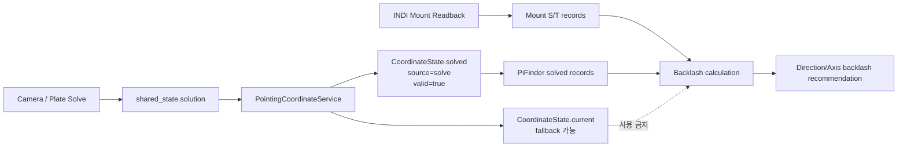

백레시 계산은 위 도식처럼 두 좌표만 비교한다.

- `MountRecord`: INDI driver에서 읽은 실제 마운트 좌표.
- `PiFinderRecord`: `PointingCoordinateService.solved`에서 읽은 solved RA/Dec.

`PointingCoordinateService.current`는 SkySafari 응답이나 UI 표시에는 유용하지만,
fallback이 섞일 수 있으므로 백레시 계산에는 넣지 않는다.

<a id="mf_backlash_measurement_flow_ko--소스-관리-위치"></a>
### 소스 관리 위치

백레시 캘리브레이션 로직은 다음처럼 분리되어 있다.

```text
python/PiFinder/indi_backlash_calibration.py
  BacklashCalibrationMixin
    - 수동 Backlash 값 검증/저장
    - 자동 Backlash 상태 machine
    - stop request 처리
    - PointingCoordinateService solved 좌표 검사
    - 축별 GoTo 측정 시퀀스
    - 좌표 record 생성
    - mount delta / PiFinder solved delta 계산
    - 방향별 필터링과 추천값 계산

python/PiFinder/mountcontrol_indi.py
  MountControlIndi(BacklashCalibrationMixin)
    - INDI 연결/드라이버 상태
    - mount GoTo/Sync/Stop/Tracking 명령
    - 현재 위치 readback
    - 공통 status file publish
    - 웹/LCD/queue command dispatch
```

즉 백레시 절차를 수정할 때는 우선
`python/PiFinder/indi_backlash_calibration.py`를 기준으로 보고,
INDI 명령 자체나 공통 mount-control 동작이 필요할 때만
`mountcontrol_indi.py`를 확인한다.

<a id="mf_backlash_measurement_flow_ko--축별-목표점"></a>
### 축별 목표점

<a id="mf_backlash_measurement_flow_ko--altaz-마운트"></a>
#### Alt/Az 마운트

시작점이 `Alt 10, Az 20`이고 offset이 2도이면 다음처럼 테스트한다.

```text
AZ 축 테스트:
  S_az = Alt 10, Az 20
  T_az = Alt 10, Az 22

ALT 축 테스트:
  S_alt = Alt 10, Az 20
  T_alt = Alt 12, Az 20
```

PiFinder는 이 Alt/Az 목표점을 RA/Dec로 변환한 뒤 INDI GoTo를 보낸다.

<a id="mf_backlash_measurement_flow_ko--eq-마운트"></a>
#### EQ 마운트

시작점이 `RA 100, DEC 20`이고 offset이 2도이면 다음처럼 테스트한다.

```text
RA 축 테스트:
  S_ra = RA 100, DEC 20
  T_ra = RA 102, DEC 20

DEC 축 테스트:
  S_dec = RA 100, DEC 20
  T_dec = RA 100, DEC 22
```

<a id="mf_backlash_measurement_flow_ko--상세-순서도"></a>
### 상세 순서도

<a id="mf_backlash_measurement_flow_ko--1-시작-조건"></a>
#### 1. 시작 조건

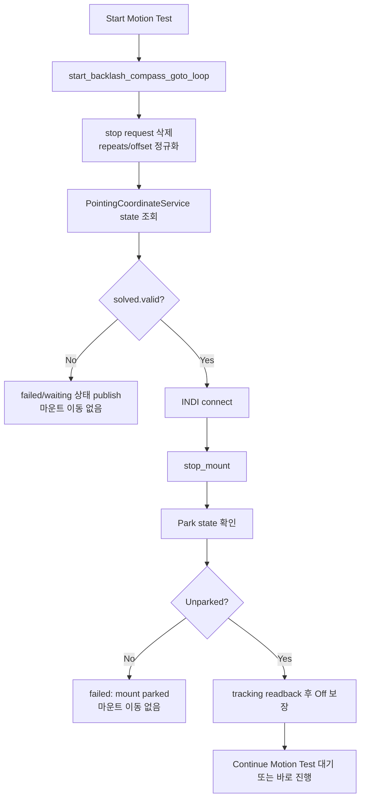

시작 단계에서 `PointingCoordinateService.solved`가 유효하지 않으면 테스트를
시작하지 않는다. 이때 IMU fallback이나 mount-only 좌표를 대신 쓰지 않는다.

<a id="mf_backlash_measurement_flow_ko--2-좌표계-동기화"></a>
#### 2. 좌표계 동기화

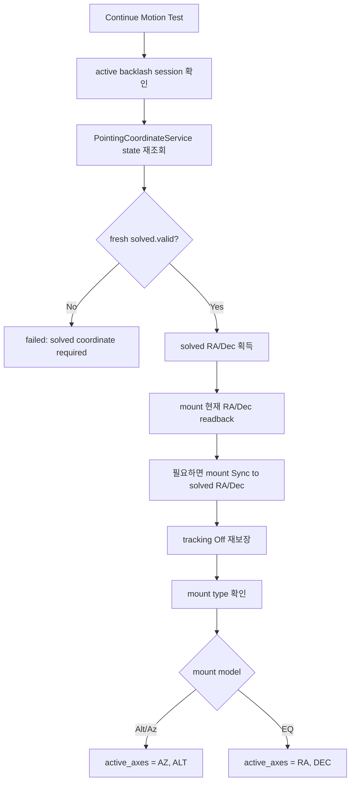

동기화의 기준 좌표는 `PointingCoordinateService.solved`이다. Sync가 필요한
경우에도 IMU 좌표가 아니라 solved RA/Dec로 mount 좌표계를 맞춘다.

<a id="mf_backlash_measurement_flow_ko--3-축별-측정-이동"></a>
#### 3. 축별 측정 이동

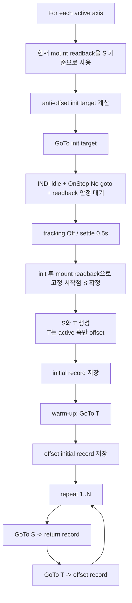

각 record 저장은 다음 하위 절차를 반드시 통과해야 한다.

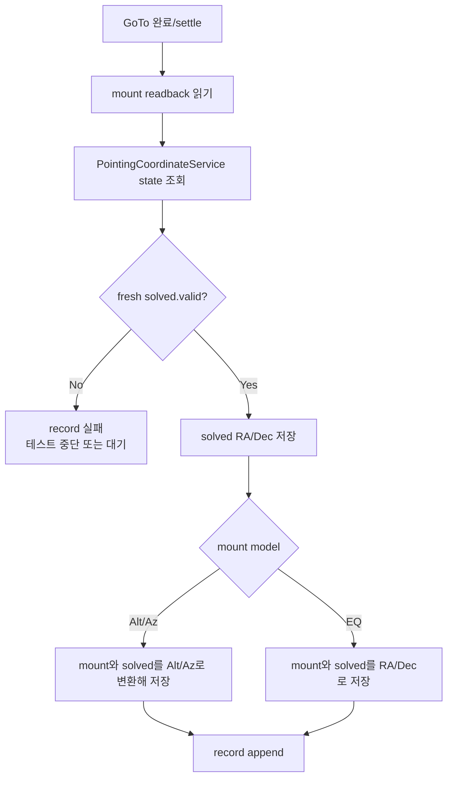

<a id="mf_backlash_measurement_flow_ko--4-계산과-필터링"></a>
#### 4. 계산과 필터링

```mermaid
flowchart TD
    A[records] --> B[인접 record 쌍으로 leg 생성]
    B --> C[warm-up leg 제외]
    C --> D[solved가 없는/stale leg 제외]
    D --> E[active 축별 delta 계산]
    E --> F[mount_delta = mount_end - mount_start]
    E --> G[pifinder_delta = solved_end - solved_start]
    F --> H[motion_error = mount_delta - pifinder_delta]
    G --> H
    H --> I{abs(error) >= 1도?}
    I -->|Yes| J[solve/record timing outlier로 제외]
    I -->|No| K[abs(error)*3600 = 후보값]
    K --> L[축/방향별 그룹화]
    L --> M[하위 30% / 상위 30% 제거]
    M --> N[가운데 40% 평균/median/p75 계산]
    N --> O[추천값 표시]
```

계산 결과는 표시만 한다. 입력칸과 실제 mount backlash 값은 자동 변경하지 않고,
사용자가 `Save Backlash`를 눌러야 적용된다.

<a id="mf_backlash_measurement_flow_ko--5-종료-처리"></a>
#### 5. 종료 처리

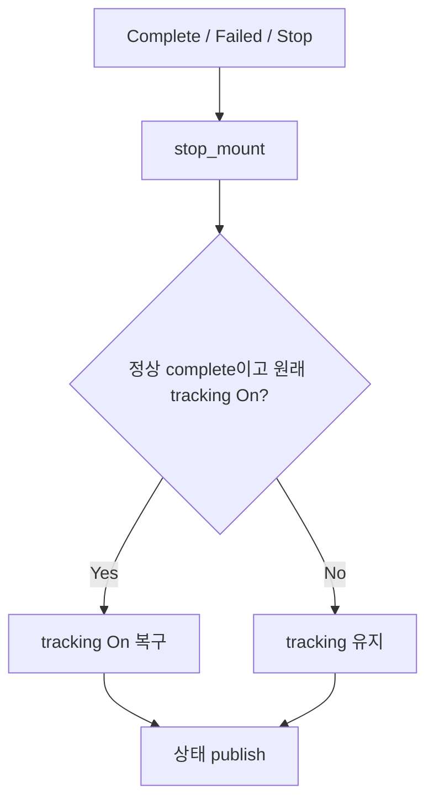

<a id="mf_backlash_measurement_flow_ko--기록되는-값"></a>
### 기록되는 값

각 leg는 디버깅을 위해 다음 값을 남긴다.

- `mount_start_*`: 직전 안정화 마운트 readback.
- `mount_end_*`: 현재 GoTo 완료 후 마운트 readback.
- `command_start_*`: leg의 명목상 명령 시작점.
- `target_*`: leg의 GoTo 목표점.
- `pifinder_solved_start_*`: 직전 record의
  `PointingCoordinateService.solved` 좌표.
- `pifinder_solved_end_*`: 현재 record의
  `PointingCoordinateService.solved` 좌표.
- `pifinder_solved_source`: 항상 `solve`여야 한다.
- `pifinder_solved_valid`: 항상 `true`여야 하며, false인 leg는 계산에서 제외한다.
- `pifinder_solved_timestamp`: fresh solved 여부를 확인하기 위한 시각.
- `mount_delta_*`: `mount_end - mount_start`.
- `pifinder_solved_delta_*`: `pifinder_solved_end - pifinder_solved_start`.
- `motion_difference_*`: `mount_delta - pifinder_solved_delta`.
- `motion_backlash_*_arcsec`: 축별 절대 백래시 후보값.

웹 UI에는 짧은 요약만 표시한다. 상세 레코드는 mount-control status와 로그에서
디버깅용으로 확인할 수 있다.


---

<a id="mf_goto_mount_source_structure_ko"></a>

## mf_goto_mount_source_structure_ko.md

<a id="mf_goto_mount_source_structure_ko--mf-pifinder-goto--mount-control-소스-구조"></a>
## MF PiFinder GoTo / Mount Control 소스 구조

작성 기준: `mf_pifinder` 브랜치, 2026-07-08.

이 문서는 SkySafari LX200 흐름과 INDI/OnStep mount control 흐름을 소스 기준으로
정리한다. SkySafari 위치 응답, push-to target, 선택적 INDI GoTo/Sync forwarding,
Multi Align routing, guide/manual motion을 분석하거나 개선할 때 이 문서를 기준
구조로 사용한다.

<a id="mf_goto_mount_source_structure_ko--목적"></a>
### 목적

현재 PiFinder에는 서로 다른 입력 흐름이 하나의 mount-control/좌표 서비스 구조로
연결되어 있다.

1. SkySafari가 PiFinder에 LX200 프로토콜로 접속해 현재 PiFinder가 보고 있는 하늘
   위치를 읽고, 사용자가 선택한 대상 좌표를 PiFinder의 recent target으로 넣는
   기본 push-to 흐름.
2. INDI LX200 OnStepX 드라이버를 통해 위치/시간, park/unpark, slew rate, 수동 이동, sync, GoTo를 수행하는 mount-control 흐름.
3. 설정이 켜진 경우 SkySafari `:MS#` GoTo를 GoTo/Guide service queue로,
   `:CM#` Sync/Align을 mount-control queue로 전달하는 INDI forwarding 흐름.
4. Multi Align이 active일 때 SkySafari GoTo/Align을 일반 PushTo 화면이 아니라
   Multi Align target/confirm으로 라우팅하는 흐름.
5. SkySafari guide 버튼을 `manual_movement`/`stop_movement`로 변환하는 수동 이동
   bridge.

기본 호환 동작은 push-to이다. INDI mount forwarding은 `mount_control`과
SkySafari INDI 관련 설정이 켜진 경우에만 동작한다.

<a id="mf_goto_mount_source_structure_ko--실행-프로세스-구조"></a>
### 실행 프로세스 구조

주요 프로세스는 `python/PiFinder/main.py`에서 시작된다.

```text
main.py
  SharedStateObj
  ├─ GPS monitor process
  ├─ Keyboard process
  ├─ Web server process              -> server.py
  ├─ Camera process
  ├─ IMU process
  ├─ Solver process
  ├─ Integrator process              -> shared_state.solution()
  ├─ SkySafariServer process         -> pos_server.py, TCP 4030
  ├─ MountControl process(optional)  -> mountcontrol_indi.py
  └─ IndiGotoGuide process(optional) -> indi_goto_guide_service.py
```

관련 시작 위치:

- `python/PiFinder/main.py`
  - SkySafari server: `Process(name="SkySafariServer", target=pos_server.run_server, ...)`
  - INDI mount-control: `Process(name="MountControl", target=mountcontrol_indi.run, ...)`
  - INDI GoTo/Guide service: `Process(name="IndiGotoGuide", target=indi_goto_guide_service.run, ...)`
- INDI mount-control과 GoTo/Guide 프로세스는 `mount_control` config가 `true`일 때만 시작된다.

<a id="mf_goto_mount_source_structure_ko--공유-상태-구조"></a>
### 공유 상태 구조

<a id="mf_goto_mount_source_structure_ko--핵심-객체"></a>
#### 핵심 객체

`python/PiFinder/state.py`

- `SharedStateObj`
  - `solution()`: 현재 PiFinder가 추정하는 pointing 상태.
  - `solve_state()`: 현재 pointing이 유효한지 빠르게 확인하는 캐시.
  - `location()`: GPS 또는 수동 Load로 설정된 관측 위치.
  - `datetime()`: PiFinder 기준 시간.
  - `ui_state()`: recent target, current target, push-to 플래그 등 UI 상태.

`python/PiFinder/types/positioning.py`

- `PointingEstimate`
  - canonical pointing 구조.
  - 현재 망원경 방향은 보통 `pointing.aligned.estimate`를 사용한다.
  - `RA`, `Dec`, `Roll`은 degrees 단위다.

<a id="mf_goto_mount_source_structure_ko--현재-망원경-방향"></a>
#### 현재 망원경 방향

현재 PiFinder가 생각하는 망원경 방향은 다음 경로로 읽는다.

```python
solution = shared_state.solution()
aligned = solution.pointing.aligned.estimate
current_ra = aligned.RA
current_dec = aligned.Dec
```

이 값은 plate solve와 IMU dead-reckoning을 통합한 결과다.

<a id="mf_goto_mount_source_structure_ko--현재-관측-위치"></a>
#### 현재 관측 위치

`shared_state.location()`은 다음 상황에서 갱신된다.

- GPS lock
- 웹 Locations의 `Load Location`
- LCD Locations의 Load
- 수동 좌표 입력

수동 위치는 `WEB`, `MANUAL`, `CONFIG: <name>` source로 들어오며 lock된 위치로 취급된다. 자동 GPS 업데이트는 수동 lock을 덮지 않도록 보호된다. 단, 사용자가 다시 수동 위치를 선택하면 기존 수동 lock 위에 새 수동 위치가 적용된다.

<a id="mf_goto_mount_source_structure_ko--plate-solve--push-to-기준-위치-흐름"></a>
### Plate Solve / Push-To 기준 위치 흐름

<a id="mf_goto_mount_source_structure_ko--solver와-integrator"></a>
#### Solver와 Integrator

`python/PiFinder/solver.py`

- 카메라 이미지에서 별을 인식하고 plate solve 결과를 만든다.
- 성공 결과는 `SuccessfulSolve`로 solver queue에 전달된다.
- solve 결과에는 camera axis와 aligned axis가 포함된다.

`python/PiFinder/integrator.py`

- solver 결과와 IMU 샘플을 합쳐 `PointingEstimate`를 유지한다.
- plate solve 성공 시 기준점을 갱신한다.
- solve 사이에는 IMU dead-reckoning으로 `pointing.aligned.estimate`를 진행시킨다.
- `shared_state.set_solution(...)`으로 현재 pointing을 publish한다.

<a id="mf_goto_mount_source_structure_ko--object-details-push-to-화면"></a>
#### Object Details push-to 화면

`python/PiFinder/ui/object_details.py`

- 대상 객체의 RA/Dec와 현재 pointing을 비교해서 push-to 안내를 표시한다.
- `_render_pointing_instructions()`에서 `calc_utils.aim_degrees(...)`를 호출한다.

`python/PiFinder/calc_utils.py`

- `aim_degrees(shared_state, mount_type, screen_direction, target)`
  - Alt/Az mount일 때: target RA/Dec를 현재 시간/위치 기준 Alt/Az로 변환하고 현재 `solution.Alt/Az`와 비교한다.
  - EQ mount일 때: target RA/Dec와 현재 aligned RA/Dec 차이를 계산한다.

<a id="mf_goto_mount_source_structure_ko--skysafari-lx200-서버-구조"></a>
### SkySafari LX200 서버 구조

`python/PiFinder/pos_server.py`

SkySafari는 PiFinder에 LX200 telescope처럼 접속한다.

- TCP port: `4030`
- 실행 프로세스: `SkySafariServer`
- 프로토콜: Meade LX200 style command subset
- socket parser는 한 TCP packet에 여러 LX200 명령이 붙어 들어오거나
  하나의 명령이 여러 packet으로 나뉘어 들어오는 경우를 모두 처리한다.
  `:MS#:D#` 같은 연속 명령도 별도 protocol message로 처리된다.

<a id="mf_goto_mount_source_structure_ko--skysafari가-현재-위치를-읽는-흐름"></a>
#### SkySafari가 현재 위치를 읽는 흐름

명령 매핑:

```text
:GR# -> get_telescope_ra()
:GD# -> get_telescope_dec()
```

`get_telescope_ra(shared_state, _)`

- `PointingCoordinateService`가 publish한 최신 `CoordinateState.current`를 읽는다.
- 현재 source는 solve, IMU fallback, synced mount readback, mount+IMU delta 중 하나이다.
- current RA degrees를 `HH:MM:SS` 형태로 반환한다.

`get_telescope_dec(shared_state, _)`

- 같은 current coordinate에서 Dec degrees를 읽는다.
- `+DD*MM'SS` 형태로 반환한다.

SkySafari 입장에서는 PiFinder가 “현재 망원경이 바라보는 좌표를 알려주는 telescope”처럼 보인다.

<a id="mf_goto_mount_source_structure_ko--skysafari-target-선택--push-to-흐름"></a>
#### SkySafari target 선택 / push-to 흐름

SkySafari에서 사용자가 대상을 선택하고 GoTo를 누르면 일반적으로 다음 명령 순서가 들어온다.

```text
:SrHH:MM:SS#     target RA 설정
:Sd+DD*MM:SS#    target Dec 설정
:MS#             slew 요청
```

현재 PiFinder 구현:

- `:Sr...#`
  - `parse_sr_command()`
  - target RA를 임시 전역 변수 `sr_result`에 저장한다.
- `:Sd...#`
  - `parse_sd_command()`
  - target Dec를 임시 전역 변수 `sd_result`에 저장한다.
- `:MS#`
  - `handle_slew_command(...)`를 호출한다.
  - 저장된 RA/Dec로 `handle_goto_command(...)`를 실행한다.
  - SkySafari에는 slew 시작 ACK로 `"0"`을 반환한다.
- `:D#`
  - INDI mount 상태가 `slewing`, `refine_wait`, `refine_sent`이면 distance-bar byte를 반환한다.
  - mount-control 상태가 해당 상태를 벗어나면 빈 LX200 응답(`#`)을 반환해서 SkySafari의 “slewing” 표시가 해제되게 한다.

`handle_goto_command(shared_state, ra_parsed, dec_parsed)`

동작은 다음과 같다.

1. RA/Dec를 degrees로 변환한다.
2. SkySafari 입력 좌표를 요청 좌표 그대로 `last_target_coordinates`에 저장한다.
3. `CompositeObject`를 만든다.
   - `catalog_code`: `PUSH`
   - `description`: `Skysafari object nr <sequence>`
4. `shared_state.ui_state().add_recent(obj)`
5. `shared_state.ui_state().set_new_pushto(True)`
6. `ui_queue.put("push_object")`
7. mount control과 SkySafari INDI GoTo가 켜져 있으면 GoTo 요청을
   `goto_guide_queue`에 넣는다. GoTo/Guide service가 `indi_goto_method`에 따라
   mount-control로 전달하거나 PiFinder 수동 접근 loop를 실행한다.
8. Multi Align active 중이면 PushTo 화면으로 전환하지 않고
   `multipoint_align_goto_target`으로 라우팅한다.

SkySafari GoTo는 기본적으로 PiFinder recent target으로 push되며, 설정이 켜진 경우 같은
요청 좌표가 INDI GoTo로도 전달된다.

<a id="mf_goto_mount_source_structure_ko--lcd-ui-반응"></a>
#### LCD UI 반응

`python/PiFinder/main.py`

```python
elif ui_command == "push_object":
    menu_manager.jump_to_label("recent")
```

`python/PiFinder/ui/object_list.py`

- Recent list가 활성화될 때 `ui_state.new_pushto()`를 확인한다.
- 새 push-to가 있으면 object list를 갱신하고 바로 object details 화면으로 들어간다.

`python/PiFinder/ui/object_details.py`

- `PUSH` catalog code는 외부 catalog 초기화 없이 바로 표시 가능하다.
- 이후 기존 push-to 방식으로 방향 안내를 보여준다.

<a id="mf_goto_mount_source_structure_ko--indi--onstep-웹-ui-구조"></a>
### INDI / OnStep 웹 UI 구조

웹 INDI 페이지는 Flask server 안에 있다.

`python/PiFinder/server.py`

주요 route:

```text
GET  /indi
GET  /tools/indi_mount
GET  /indi/current_values
GET  /indi/pointing_status
POST /indi/skysafari
POST /indi/goto_guide
POST /indi/driver
POST /indi/restart
POST /indi/park
POST /indi/slew_rate
POST /indi/motion
POST /indi/location_time
POST /indi/multipoint_align
POST /indi/backlash
POST /indi/backlash/auto
POST /indi/backlash/auto/continue
POST /indi/backlash/auto/stop
POST /indi/reset_pointing
```

템플릿:

- `python/views/indi_mount.html`

<a id="mf_goto_mount_source_structure_ko--웹-ui의-제어-방식"></a>
#### 웹 UI의 제어 방식

웹 UI는 PyIndi 프로세스 큐를 거치지 않고 주로 `indi_getprop` / `indi_setprop` CLI를 사용한다.

관련 helper:

`python/PiFinder/sys_utils.py`

- `get_indi_onstep_properties(...)`
  - 활성 INDI Web Manager profile에서 telescope driver 이름을 읽는다.
  - `indi_getprop`로 `<active driver>.*` 속성을 읽는다.
- `apply_indi_onstep_connection(...)`
  - LX200 OnStep driver의 USB/network 연결 속성을 설정한다.
- `apply_indi_onstep_properties(...)`
  - INDI 속성 목록을 `indi_setprop`로 적용한다.
- `restart_indi_web_manager(...)`
  - `indiwebmanager.service` 재시작.
- `connect_indi_onstep_driver(...)`
  - INDI driver의 `CONNECTION.CONNECT=On` 적용.
- `apply_indi_onstep_location_time(...)`
  - 활성 INDI telescope driver를 사용할 때의 기본 위치/시간 동기화 경로.
  - PyIndi로 `GEOGRAPHIC_COORD`와 `TIME_UTC` 전체 벡터를 갱신한다.
- `sync_onstep_location_time_exclusive(...)`
  - OnStep 전용 구버전/비상 fallback 경로.
  - INDI Web Manager를 잠깐 중지하고 OnStep LX200 TCP/serial 명령을 직접 보낸 뒤 다시 시작한다.

<a id="mf_goto_mount_source_structure_ko--위치시간-동기화"></a>
#### 위치/시간 동기화

`POST /indi/location_time`

현재 흐름:

1. 웹 form의 `latitude`, `longitude`, `elevation`, `utc_time`을 읽는다.
2. 서버가 요청을 받은 시점의 PiFinder UTC를 다시 계산한다.
3. `apply_indi_onstep_location_time(...)`를 실행한다.
4. 이 helper는 실행 중인 INDI server에 PyIndi로 접속해
   `GEOGRAPHIC_COORD`와 `TIME_UTC` 전체 벡터를 갱신한다.
5. LX200 OnStepX driver를 사용할 때는 driver가 INDI longitude/time
   convention을 OnStep LX200 명령으로 변환하며, 초 단위와 고도를 보존한다.

주의할 점:

- `indi_setprop` CLI로 `GEOGRAPHIC_COORD` 또는 `TIME_UTC`의 일부 element만
  쓰지 않는다. 테스트 결과 지정하지 않은 vector element가 0으로 바뀔 수 있다.
  PiFinder는 PyIndi 전체 벡터 갱신을 사용한다.
- 직접 LX200 위치/시간 동기화는 driver를 신뢰할 수 없는 경우에만 사용하는
  OnStep 전용 fallback으로 남긴다.
- OnStep `:SG`는 "local time에 더해서 UTC를 만드는 값"이다. 따라서
  한국 시간대는 `-09:00`이고, INDI `TIME_UTC.OFFSET=+9.00`과 부호 관례가 반대다.
- INDI raw longitude는 0..360 eastward convention이다.
- OnStep web UI 표시는 동/서 부호 convention이 다르게 보일 수 있다.
- PiFinder UI는 이 값을 구분해 표시한다.
  - `OnStep Location`: OnStep web UI와 같은 DMS 스타일 표시. 수정된 driver에서는 초 단위와 고도까지 표시된다.
  - `Effective Coordinates`: 앞으로 기능 코드가 사용해야 하는 decimal 좌표. PiFinder가 성공적으로 동기화한 고정밀 위치를 우선하고, 없으면 INDI driver readback으로 fallback한다.
  - `INDI Driver Readback`: INDI driver가 직접 보고한 원본 값.

<a id="mf_goto_mount_source_structure_ko--웹-수동-이동"></a>
#### 웹 수동 이동

`POST /indi/motion`

- 방향 버튼을 누르면 `TELESCOPE_MOTION_NS` / `TELESCOPE_MOTION_WE` 속성을 켠다.
- 손을 떼면 `TELESCOPE_ABORT_MOTION.ABORT=On`을 보낸다.
- web page JS는 keepalive를 보내고, 서버는 motion lease timer로 안전 stop을 보강한다.

관련 파일:

- `python/PiFinder/server.py`
- `python/views/indi_mount.html`

<a id="mf_goto_mount_source_structure_ko--indi-mountcontrol-프로세스-구조"></a>
### INDI MountControl 프로세스 구조

`python/PiFinder/mountcontrol_indi.py`

이 프로세스는 선택 기능이다. `mount_control` config가 켜졌을 때만 `main.py`에서 시작된다.

<a id="mf_goto_mount_source_structure_ko--통신-구조"></a>
#### 통신 구조

```text
LCD UI / Object Details / INDI Guide
  -> mountcontrol_queue.put(command dict)
  -> MountControlIndi.handle_command()
  -> PyIndi client
  -> INDI server localhost:7624
  -> LX200 OnStep driver
  -> OnStep mount
```

<a id="mf_goto_mount_source_structure_ko--상태-파일"></a>
#### 상태 파일

MountControl은 상태를 파일로 기록한다.

```text
~/PiFinder_data/mount_control_status.json
```

읽는 쪽:

- LCD top bar status: `python/PiFinder/ui/base.py`
- LCD INDI status page: `python/PiFinder/ui/indi.py`

<a id="mf_goto_mount_source_structure_ko--주요-command-dict"></a>
#### 주요 command dict

`MountControlIndi.handle_command(...)`에서 처리한다.

```text
{"type": "init"}
{"type": "restart_driver"}
{"type": "sync", "ra": <deg>, "dec": <deg>}
{"type": "goto_target", "ra": <deg>, "dec": <deg>}
{"type": "stop_movement"}
{"type": "manual_movement", "direction": "...", "lease_seconds": ...}
{"type": "manual_movement_keepalive", "direction": "...", "lease_seconds": ...}
{"type": "increase_slew_rate"}
{"type": "reduce_slew_rate"}
{"type": "set_slew_rate", "rate": 0..9}
{"type": "refresh_slew_rate"}
{"type": "sync_location_time"}
{"type": "park_action", "action": "park|unpark|set_home|return_home|set_park"}
{"type": "multipoint_align_start", "mode": "manual|auto", "points": 1..9}
{"type": "multipoint_align_select_star", "star_name": "...", "goto": true|false}
{"type": "multipoint_align_goto_target", "ra": <deg>, "dec": <deg>, "name": "..."}
{"type": "multipoint_align_confirm", "source": "ui|skysafari|web"}
{"type": "multipoint_align_clear_target"}
{"type": "multipoint_align_cancel"}
```

<a id="mf_goto_mount_source_structure_ko--pyindi-client"></a>
#### PyIndi client

`PiFinderIndiClient`

- INDI server에 연결한다.
- telescope-like device를 자동 감지한다.
- `EQUATORIAL_EOD_COORD` update를 받아 현재 mount RA/Dec를 status에 기록한다.
- number/switch/text property set helper를 제공한다.

<a id="mf_goto_mount_source_structure_ko--goto-구현"></a>
#### GoTo 구현

`MountControlIndi.goto_target(ra_deg, dec_deg)`

현재 동작:

1. `connect()`로 INDI server와 telescope device를 준비한다.
2. `ON_COORD_SET.SLEW=On`을 설정한다.
3. `EQUATORIAL_EOD_COORD.RA=<ra_hours>`, `DEC=<dec_deg>`를 설정한다.
4. 상태 파일에 `state="slewing"`, `target_ra`, `target_dec`를 기록한다.
5. mount-control loop가 INDI busy 상태를 감시하고, slew가 끝나면 `state="connected"`와 `GoTo complete`를 기록한다.

RA 입력은 degrees이고 INDI에는 hours로 보낸다.

```python
{"RA": (ra_deg % 360.0) / 15.0, "DEC": dec_deg}
```

<a id="mf_goto_mount_source_structure_ko--sync-구현"></a>
#### Sync 구현

`MountControlIndi.sync_mount(ra_deg, dec_deg)`

현재 동작:

1. `ON_COORD_SET.SYNC=On`
2. `EQUATORIAL_EOD_COORD`에 현재 solve RA/Dec를 보낸다.
3. 다시 `ON_COORD_SET.TRACK=On`
4. tracking on
5. status에 현재 mount position을 기록한다.

<a id="mf_goto_mount_source_structure_ko--수동-이동-구현"></a>
#### 수동 이동 구현

`MountControlIndi.manual_move(direction, lease_seconds)`

- 현재 OnStep INDI motion property를 직접 켠다.
- 방향 mapping은 OnStep에서 관측자가 보는 화면 방향에 맞추기 위해 일부 East/West가 내부적으로 반전되어 있다.
- lease가 만료되면 `stop_mount()`가 자동 호출된다.
- SkySafari guide command는 `pos_server.py`에서 별도 keepalive timer로 관리된다.
  0.4초 간격으로 `manual_movement_keepalive`를 보내고, 8초마다 새
  `manual_movement`를 보내 mount-control의 10초 연속 이동 제한을 넘지 않게 한다.
- SkySafari TCP command connection이 닫힌 것만으로는 stop하지 않는다.
  실제 정지는 `:Q#`, `:Qn#`, `:Qs#`, `:Qe#`, `:Qw#` 또는 60초 안전 제한으로 처리한다.

<a id="mf_goto_mount_source_structure_ko--lcd-indi-ui-구조"></a>
### LCD INDI UI 구조

`python/PiFinder/ui/menu_structure.py`

현재 INDI 메뉴 위치:

```text
Start
  INDI
    STATUS
    INIT
      Connect
      Set Location
      Reset Pointing
      Park
      Unpark
      Set Home
      Return Home
      Set-Park
      Restart INDI
    Guide
```

실제 화면 구현:

- `python/PiFinder/ui/indi.py`
  - `UIIndiStatus`
  - `UIIndiGuide`
  - `UIIndiBase`
- `UIIndiInit` 클래스도 있으나, 현재 menu_structure에서는 INIT이 `UITextMenu`로 구성되어 있다.

<a id="mf_goto_mount_source_structure_ko--status"></a>
#### STATUS

`UIIndiStatus`

- `mount_control_status.json`을 읽는다.
- state, message, age, device, home/park state, raw mount status, RA, Dec,
  speed, target RA/Dec를 표시한다.

<a id="mf_goto_mount_source_structure_ko--init"></a>
#### INIT

현재 menu item callback 기반이다.

`python/PiFinder/ui/callbacks.py`

- `indi_init`
- `indi_sync_location_time`
- `reset_pointing` (mount queue가 아니라 pointing reset request 파일을 기록)
- `indi_park`
- `indi_unpark`
- `indi_set_home`
- `indi_return_home`
- `indi_set_park`
- `indi_restart_driver`

`reset_pointing`을 제외한 각 callback은 `_send_mount_control(...)`로
mountcontrol queue에 command dict를 넣는다.

<a id="mf_goto_mount_source_structure_ko--guide"></a>
#### Guide

`UIIndiGuide`

- 카메라 영상을 배경으로 보여준다.
- 숫자키/키보드 문자 입력으로 수동 이동한다.
- 숫자키 mapping (2/4/6/8 cardinal 이동, 대각선은 keyboard 문자 `q/e/z/c`):

```text
  8
4   6
  2
```

- `9`, `3`: slew rate 증가/감소.
- `5`: GoTo refine 토글, `0`: guide correction 토글.
- `Square`: 현재 PiFinder pointing으로 mount sync.
- key press에서 motion 시작, key release에서 stop.
- keepalive와 lease를 사용해서 freeze 시 계속 움직이는 위험을 줄인다.

<a id="mf_goto_mount_source_structure_ko--object-details에서-indi-goto"></a>
### Object Details에서 INDI GoTo

`python/PiFinder/ui/object_details.py`

Mount Control이 켜져 있으면 Object Details 숫자 키가 mountcontrol command를 보낸다.

현재 mapping:

```text
0 stop
2 south
3 slew rate 감소
4 west
5 현재 object GoTo
6 east
7 현재 pointing으로 sync
8 north
9 slew rate 증가
```

2/4/6/8은 누르는 동안 이동하고 떼면 정지한다(hold-to-move). 실제 구현은
`python/PiFinder/ui/base.py`의 `_mount_key`/`_mount_command`에 있다.

`5`가 현재 내부 PiFinder target을 GoTo/Guide 서비스로 보내는 지점이다.
`indi_goto_method = off`이면 GoTo 없이 "GoTo Off" 메시지만 표시한다
(2026-07-19 개편으로 refine 옵션 전달은 제거되었고, GoTo 방식 선택과 추적
타깃 재장전은 GoTo/Guide 서비스가 담당한다).

```python
command = {
    "type": "goto_target",
    "ra": target[0],
    "dec": target[1],
}
if guide_queue is not None:
    guide_queue.put(command)
else:
    queue.put(command)
```

따라서 PiFinder 내부 catalog object, observing list object, SkySafari에서 PUSH된 object는 모두 Object Details에 올라온 뒤 `5`를 누르면 같은 GoTo 경로를 사용할 수 있다.

<a id="mf_goto_mount_source_structure_ko--현재-skysafari-push-to--indi-forwarding--multi-align-routing"></a>
### 현재 SkySafari Push-To / INDI Forwarding / Multi Align routing

<a id="mf_goto_mount_source_structure_ko--기본-skysafari-push-to-path"></a>
#### 기본 SkySafari Push-To path

```text
SkySafari target selected
  -> LX200 :Sr / :Sd
  -> pos_server.handle_goto_command()
  -> CompositeObject(catalog_code="PUSH")
  -> ui_state.recent
  -> ui_queue "push_object"
  -> LCD Object Details
  -> push-to 안내 표시
```

이 path는 `mount_control`이 꺼져 있거나 SkySafari INDI GoTo forwarding이 꺼져
있을 때의 기본 호환 동작이다.

<a id="mf_goto_mount_source_structure_ko--skysafari-indi-goto-forwarding-path"></a>
#### SkySafari INDI GoTo forwarding path

```text
SkySafari target selected
  -> LX200 :Sr / :Sd / :MS
  -> pos_server.handle_goto_command()
  -> 기본 Push-To target 저장
  -> goto_guide_queue {"type": "goto_target", "ra": target.ra, "dec": target.dec}
  -> IndiGotoGuideService (indi_goto_method=indi_mount이면 mountcontrol_queue로 전달)
  -> MountControlIndi.goto_target()
  -> INDI EQUATORIAL_EOD_COORD
  -> active INDI telescope driver
  -> mount GoTo
```

조건:

- `mount_control`이 켜져 있어야 한다.
- `indi_goto_method`(GoTo Type)가 `off`가 아니어야 한다. (`skysafari_indi_goto`
  옵션은 2026-07-19에 제거되어 GoTo Type 하나로 통합되었다.)
- target 좌표는 SkySafari에서 받은 RA/Dec를 그대로 사용한다.
- `indi_goto_method`가 `pifinder`이면 GoTo/Guide service가 INDI GoTo 대신
  PiFinder 좌표 기반 수동 접근 loop를 실행한다.
- Multi Align active 중에는 GoTo/Guide service를 거치지 않고
  `multipoint_align_goto_target`이 mountcontrol queue로 직접 들어간다.

<a id="mf_goto_mount_source_structure_ko--skysafari-syncalign-forwarding-path"></a>
#### SkySafari Sync/Align forwarding path

```text
SkySafari :CM#
  -> pos_server.handle_sync_command()
  -> 최신 :Sr/:Sd 또는 last target 좌표 선택
  -> PiFinder solved/IMU align 처리
  -> `skysafari_indi_sync`(기본 켜짐)가 켜져 있으면 mountcontrol_queue {"type": "sync", ...}
```

Multi Align이 active가 아닐 때는 일반 Sync/Align 흐름이다. Multi Align active 중에는
아래 Multi Align routing이 우선한다.

<a id="mf_goto_mount_source_structure_ko--multi-align-active-path"></a>
#### Multi Align active path

```text
SkySafari :Sr / :Sd / :MS
  -> multipoint_align_goto_target
  -> 선택 target으로 GoTo

SkySafari :CM#
  -> multipoint_align_confirm
  -> 가장 최근 GoTo target 좌표로 align point 확정
```

이 path에서는 SkySafari target이 Object Details push 화면으로 새지 않는다.
세션은 `mount_control_status.json`의 `multipoint_align.active`를 기준으로 감지한다.

<a id="mf_goto_mount_source_structure_ko--pifinder-내부-indi-goto-path"></a>
#### PiFinder 내부 INDI GoTo path

```text
PiFinder Object Details target
  -> number key 5
  -> goto_guide_queue {"type": "goto_target", "ra": target.ra, "dec": target.dec}
  -> IndiGotoGuideService (indi_goto_method에 따라 INDI Mount 전달 또는 PiFinder loop)
  -> MountControlIndi.goto_target()
  -> INDI EQUATORIAL_EOD_COORD
  -> LX200 OnStep driver
  -> OnStep mount GoTo
```

Object Details의 `5` GoTo도 SkySafari forwarding과 같은 GoTo/Guide 서비스 경로를
사용한다(2026-07-19 개편). 서비스 큐가 없을 때만 mountcontrol로 직접 보낸다.

<a id="mf_goto_mount_source_structure_ko--앞으로-goto-편의-기능을-붙일-수-있는-지점"></a>
### 앞으로 GoTo 편의 기능을 붙일 수 있는 지점

<a id="mf_goto_mount_source_structure_ko--1-web-indi-페이지에-target-goto-추가"></a>
#### 1. Web INDI 페이지에 target GoTo 추가

수정 후보:

- `python/PiFinder/server.py`
- `python/views/indi_mount.html`

가능한 UI:

- Current PiFinder target 표시.
- Current SkySafari PUSH target 표시.
- `GoTo Current Target`
- `Sync Mount to Current Solve`
- `Stop`

필요한 것:

- 웹 server process에서 `mountcontrol_queue` 접근 가능 여부 확인.
- 현재 web INDI control은 `indi_setprop` 직접 방식이라, GoTo를 direct setprop로 할지 mountcontrol queue를 재사용할지 결정해야 한다.

권장:

- 장기적으로 GoTo/Sync/Stop은 mountcontrol queue로 통일한다.
- 웹의 direct `indi_setprop` 경로는 driver setup, status, fallback, 간단한 수동 제어에 남긴다.

<a id="mf_goto_mount_source_structure_ko--2-lcd-object-details-goto-confirm-개선"></a>
#### 2. LCD Object Details GoTo confirm 개선

수정 후보:

- `python/PiFinder/ui/object_details.py`

현재는 숫자 `5`를 누르면 바로 GoTo다. 편의/안전 기능을 추가할 수 있다.

- GoTo 전 confirm 화면.
- target altitude 낮음 경고.
- mount parked 상태이면 unpark 여부 확인.
- slew 중 stop/abort overlay.
- GoTo 후 현재 mount RA/Dec와 target 차이 표시.

<a id="mf_goto_mount_source_structure_ko--3-상태-모델-통합"></a>
#### 3. 상태 모델 통합

현재 상태는 두 갈래다.

- PiFinder pointing: `shared_state.solution()`
- INDI mount position: `mount_control_status.json`의 `ra`, `dec`

앞으로 GoTo 편의 기능에는 둘을 모두 보여주는 것이 좋다.

예:

```text
PiFinder solve: RA/Dec
Mount reported: RA/Dec
Target: RA/Dec
Delta solve-target
Delta mount-target
```

<a id="mf_goto_mount_source_structure_ko--주의할-위험-지점"></a>
### 주의할 위험 지점

<a id="mf_goto_mount_source_structure_ko--포트-충돌"></a>
#### 포트 충돌

OnStep 네트워크/serial 포트는 동시에 여러 client가 붙으면 불안정할 수 있다.

- INDI LX200 OnStep driver가 연결 중이면 직접 LX200 TCP/serial 명령을 피한다.
- 직접 명령이 필요한 경우 `sync_onstep_location_time_exclusive(...)`처럼 INDI를 잠깐 중지하고 독점 접근 후 다시 시작한다.

<a id="mf_goto_mount_source_structure_ko--좌표-기준"></a>
#### 좌표 기준

현재 `pos_server.py`는 SkySafari/LX200 입력 좌표를 요청 좌표 그대로 사용한다.

- `:Sr/:Sd` target은 `last_target_coordinates`에 그대로 저장된다.
- `:MS#`, `:CM#`, Multi Align confirm은 같은 target 좌표를 사용한다.
- `pointing.aligned.estimate`도 좌표 서비스에서 epoch 변환 없이 현재 PiFinder 좌표로 사용한다.
- Alt/Az 변환은 IMU 보정, 표시, 마운트 타입 해석이 필요한 곳에서만 수행한다.

GoTo/Sync 정확도 문제가 보이면 target 좌표가 중간에 다른 좌표계로 재해석되지 않았는지와
mount readback/IMU smoothing 상태를 먼저 확인한다.

<a id="mf_goto_mount_source_structure_ko--longitude-convention"></a>
#### longitude convention

OnStep Web UI와 INDI raw longitude 표시는 부호 convention이 다르게 보일 수 있다.

- PiFinder 일반 위치: east-positive decimal degrees.
- INDI LX200 OnStep raw longitude: 0..360 eastward.
- OnStep Web UI: west-positive처럼 보이는 표시가 있다.

관련 helper:

- `sys_utils.onstep_longitude_degrees(...)`
- `sys_utils.onstep_web_longitude_degrees(...)`
- `sys_utils.format_onstep_location_display(...)`

<a id="mf_goto_mount_source_structure_ko--움직임-안전"></a>
#### 움직임 안전

수동 guide는 press/release와 lease timeout을 모두 사용한다.

- 웹 UI: JS pointer release + 서버 timer.
- LCD UI: key release + mountcontrol lease.
- freeze 시 lease 만료 후 stop 재시도.

GoTo 자동화에도 abort/stop 경로가 항상 접근 가능해야 한다.

<a id="mf_goto_mount_source_structure_ko--관련-config"></a>
### 관련 config

`default_config.json`

```json
"mount_control": false,
"mount_control_indi_host": "localhost",
"mount_control_indi_port": 7624,
"onstep_connection_type": "network",
"onstep_serial_port": "",
"onstep_network_host": "",
"onstep_network_port": 9999
```

의미:

- `mount_control`
  - LCD mount-control process를 켤지 결정한다.
- `mount_control_indi_host`, `mount_control_indi_port`
  - INDI server 접속 위치.
- `onstep_connection_type`
  - LX200 OnStep driver가 OnStep에 붙는 방식.
- `onstep_serial_port`
  - USB serial 사용 시 port.
- `onstep_network_host`, `onstep_network_port`
  - network TCP 사용 시 OnStep host/port.

<a id="mf_goto_mount_source_structure_ko--관련-설치서비스"></a>
### 관련 설치/서비스

설치 문서:

- `docs/mf_dev/mf_indi_mount_install_ko.md`
- `docs/mf_dev/mf_indi_mount_install_en.md`

설치 스크립트:

- `scripts/install_indi_mount_OnstepX.sh`

서비스:

- `pifinder.service`
- `indiwebmanager.service`

기본 포트:

- PiFinder web: 80 또는 8080 fallback
- SkySafari LX200 server: 4030
- INDI server: 7624
- INDI Web Manager: 8624
- OnStep TCP: 9999

<a id="mf_goto_mount_source_structure_ko--관련-테스트"></a>
### 관련 테스트

현재 직접 관련 테스트:

- `python/tests/test_sys_utils.py`
  - INDI 위치/시간 property 변환.
  - OnStep LX200 직접 명령 변환.
  - longitude 표시 convention.
- `python/tests/test_mountcontrol_indi.py`
  - mount-control command 처리와 상태.
- `python/tests/test_main.py`
  - 수동 위치 reload가 이전 수동 lock 위에 다시 적용되는지.
- `python/tests/skysafari.py`
  - SkySafari LX200 server stress client.

GoTo 편의 기능을 추가할 때 필요한 테스트 후보:

- `pos_server.py`의 `:Sr`, `:Sd`, `:MS` 순서 처리 테스트.
- SkySafari push-to 기본 호환 유지 테스트.
- SkySafari INDI GoTo forwarding이 켜졌을 때 mountcontrol queue에 정확한
  `goto_target` command가 들어가는 테스트.
- mount_control off 상태에서 SkySafari 동작이 기존 push-to로 유지되는 테스트.
- SkySafari target 좌표가 변환 없이 그대로 저장/전달되는지 테스트.
- GoTo 중 stop/abort command 우선순위 테스트.

<a id="mf_goto_mount_source_structure_ko--현재-결론"></a>
### 현재 결론

현재 구조는 다음 모드를 지원한다.

```text
push_to       기본 동작. SkySafari target을 PiFinder recent/Object Details로 보냄.
goto_forward  설정이 켜진 경우 SkySafari :MS#를 GoTo/Guide service 경유로 INDI GoTo에도 전달.
sync_forward  설정이 켜진 경우 SkySafari :CM#를 INDI Sync/Align으로 전달.
multi_align   Multi Align active 중에는 SkySafari GoTo/Align을 align session에 라우팅.
guide_bridge  SkySafari guide 버튼을 INDI manual motion으로 전달.
```

새 기능을 붙일 때는 `pos_server.py`가 target/guide 명령을 해석하고,
`indi_goto_guide_service.py`가 GoTo/Guide 정책을,
`mountcontrol_indi.py`가 실제 driver I/O와 상태 publish를 맡는 경계를 유지하는
것이 좋다. SkySafari 좌표 응답은 동작별로 직접 계산하지 않고
`PointingCoordinateService`의 최신 `CoordinateState.current`를 읽는 구조를 유지한다.


---

<a id="mf_indi_goto_guide_plan_ko"></a>

## mf_indi_goto_guide_plan_ko.md

<a id="mf_indi_goto_guide_plan_ko--mf-pifinder-indi-goto--guide-설정-설계-및-구현"></a>
## MF PiFinder INDI GoTo / Guide 설정 설계 및 구현

<a id="mf_indi_goto_guide_plan_ko--2026-10-10-goto-시작부터-추적-보정까지-검증한-설계"></a>
### 2026-10-10 GoTo 시작부터 추적 보정까지 검증한 설계

이 절은 현재 작업 트리의 `indi_goto_guide_service.py`, `mountcontrol_indi.py`,
`guide_holdover.py`, `mount_motion_limits.py`와 자동 테스트를 대조한 기준이다.
이후의 날짜별 기록은 변경 이력이며, 이전 수치·정책과 충돌하면 이 절을 따른다.
검증 범위는 **MFNavis 기본 GoTo/Tracking Guide**다. `indi_mount`는 네이티브
GoTo만 수행하며 `off`는 GoTo를 거부한다. 선택 기능인 smooth tracking은 별도
제어권·광학 품질 정책을 사용한다. 이동 한계 인터록은 smooth timed pulse에도 적용한다.

<a id="mf_indi_goto_guide_plan_ko--처리-계층과-판정-기준"></a>
#### 처리 계층과 판정 기준

| 계층 | 역할 | 다음 단계로 넘어가는 증거 |
|---|---|---|
| LCD·웹·SkySafari | 타겟, GoTo, 정렬, 수동 이동, 취소·정지 요청 | 큐에 사용자 의도를 전달 |
| GoTo/Guide 서비스 | 초기 이동·도착·추적·복구 상태 전환 | 최근 마운트 상태와 해당 이동 이후 촬영된 유효 solve |
| 마운트 실행기 | SYNC/GoTo, 가이드 펄스, 실제 한계 검사와 정지 | 현재 연결의 새로운 INDI 응답, 이동 상태, 펄스 종료 시각 |
| `GuideHoldover` | 마지막 측정 오차·실행한 보정량·확인된 표류 속도 기록 | 관측과 추정을 구분하고 같은 오차를 중복 누적하지 않음 |

마운트가 멈췄다는 것과 광학적으로 타겟에 도착했다는 것은 별개다.
`goto_completed_wall`은 마운트 정지 확인 시각이며, 도착 판정에는 그 이후의
solve가 필요하다. 광학 기준은 `pointing.aligned.solve`이고,
IMU로 진행한 `pointing.aligned.estimate`나 마운트 좌표를 새 solve로 취급하지 않는다.
정밀 보정 단계는 유효한 최근 성공 프레임을 계속 사용할 수 있지만, 이미 소비한
프레임으로 PID를 다시 실행하거나 펄스 종료 전 프레임으로 최종 도착을 확정하지 않는다.

<a id="mf_indi_goto_guide_plan_ko--goto-시작과-도착-판정"></a>
#### GoTo 시작과 도착 판정

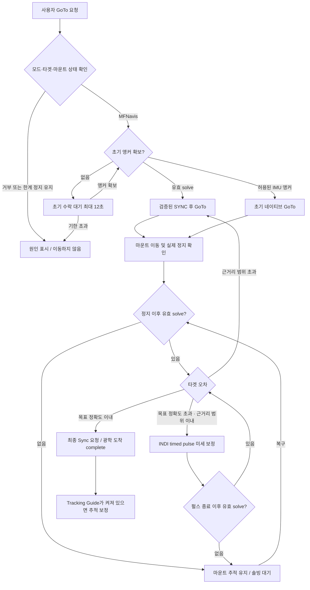

1. 새 GoTo는 이전 도착·복구·보정 횟수를 초기화한다. 초기 IMU 앵커는 기존
   설정과 유효성 조건을 만족할 때만 허용한다. **초기 수락 대기 12초**와
   **이미 수락한 GoTo 중 솔빙 대기**는 다르다. 후자에는 만료 시간이 없다.
2. `sync_and_goto`는 현재 연결에서 새 `ON_COORD_SET=SYNC` 응답 → 요청과
   일치하는 좌표 응답 → `ON_COORD_SET=SLEW` 응답을 확인한 뒤 GoTo를 보낸다.
   이전 캐시나 단순 송신 성공만으로 다음 단계를 진행하지 않는다.
3. 실행기는 INDI Busy·OnStep 완료·좌표 안정화를 확인한다. 검증된 빠른 정지는
   1초, 일반 경로는 2.5초 안정화를 사용한다. 같은 이동의 정지 시각이 있으면
   서비스가 별도 정착 시간을 중복 추가하지 않는다. 타임아웃으로 가정한 완료는
   검증된 정지 시각을 제공하지 않는다.
4. 목표 정확도 `A`는 `indi_goto_refine_accuracy_arcmin`이며 서비스 폴백은 1′,
   최소는 0.1′다. 실제 저장 설정을 우선한다. 근거리 범위 `N`은
   `min(max(A, 설정 근거리 도수 × 60), 15′)`다. `오차 ≤ A`는 도착,
   `A < 오차 ≤ N`은 펄스 보정, 그 밖은 새 solve를 이용한 SYNC+GoTo다.
5. 근거리 접근은 자동 수동 이동이 아니라 **INDI timed guide pulse**다.
   정상 광학 보정은 축별 PID와 확인된 가이드 속도를 사용하고, OnStep은 같은
   축의 타이머를 새 명령으로 교체한다. 기본 최대 펄스는 2.5초다.
6. GoTo 10회/복구 5회는 한 묶음의 한도다. 소진하면 타겟을 유지하고 10초 뒤
   새로운 solve로 다시 시도한다. 90초 미세 보정 정체도 새 관측을 기다리는
   재시도 경로이며, 솔빙 실패 시간만으로 타겟을 취소하는 타이머가 아니다.
7. `complete`는 **광학 오차가 목표 정확도 이내라는 서비스 판정**이다.
   `final_sync_sent`는 최종 Sync 요청을 큐에 넣었다는 뜻이며, 초기
   `sync_and_goto`의 검증된 응답과 같은 의미가 아니다. 최종 Sync 실패는
   실행기의 `sync_failed` 상태로 별도 보고된다.

<a id="mf_indi_goto_guide_plan_ko--도착-전-솔빙-실패와-사용자-정렬"></a>
#### 도착 전 솔빙 실패와 사용자 정렬

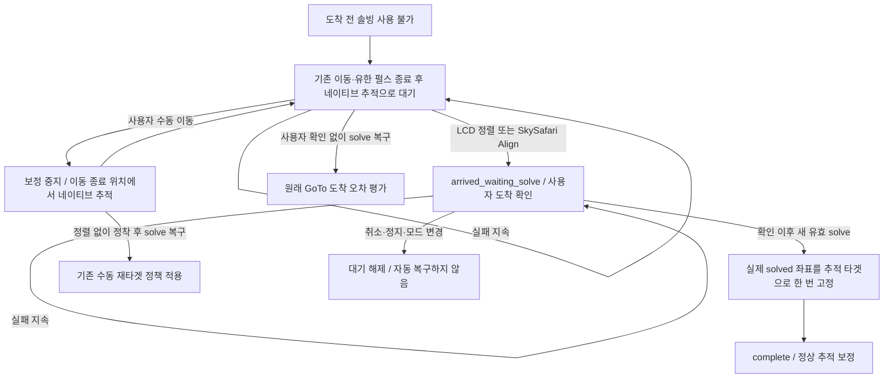

- 솔빙이 끊겼다는 이유만으로 추가 IMU/마운트 좌표 GoTo를 보내지 않는다.
  이미 승인되어 실행 중인 네이티브 슬루·유한 펄스는 종료를 기다린다.
- 수동 방향키 해제는 축 이동을 정지하고 네이티브 추적을 유지한다.
  전체 Stop과 다르다. 새 타겟은 이동 종료 및 정착 이후의 solve로 결정한다.
- 사용자 정렬은 솔빙이 없는 상태에서도 도착 의도를 확정한다. 이때 좌표를
  solve로 위조하거나 카탈로그 좌표로 복귀하는 GoTo를 만들지 않는다.
- 복구된 첫 유효 solve가 실제 추적 타겟을 정한다. 이후 프레임마다 타겟을
  다시 바꾸지 않는다. 사용자 확인 이전·이동 중·펄스 종료 이전 프레임은 제외한다.
- 취소/정지/새 GoTo는 이 대기를 무효화한다. 이번 점검에서 취소 후
  `arrived_waiting_solve` 표시가 남는 문제를 재현하여, 대기 상태와 이유도
  함께 초기화하도록 수정했다. `clear_tracking_target`, 보정 중단, 모드 변경
  세 가지 취소 경로에 회귀 테스트를 추가했다.

<a id="mf_indi_goto_guide_plan_ko--도착-후-추적과-보정"></a>
#### 도착 후 추적과 보정

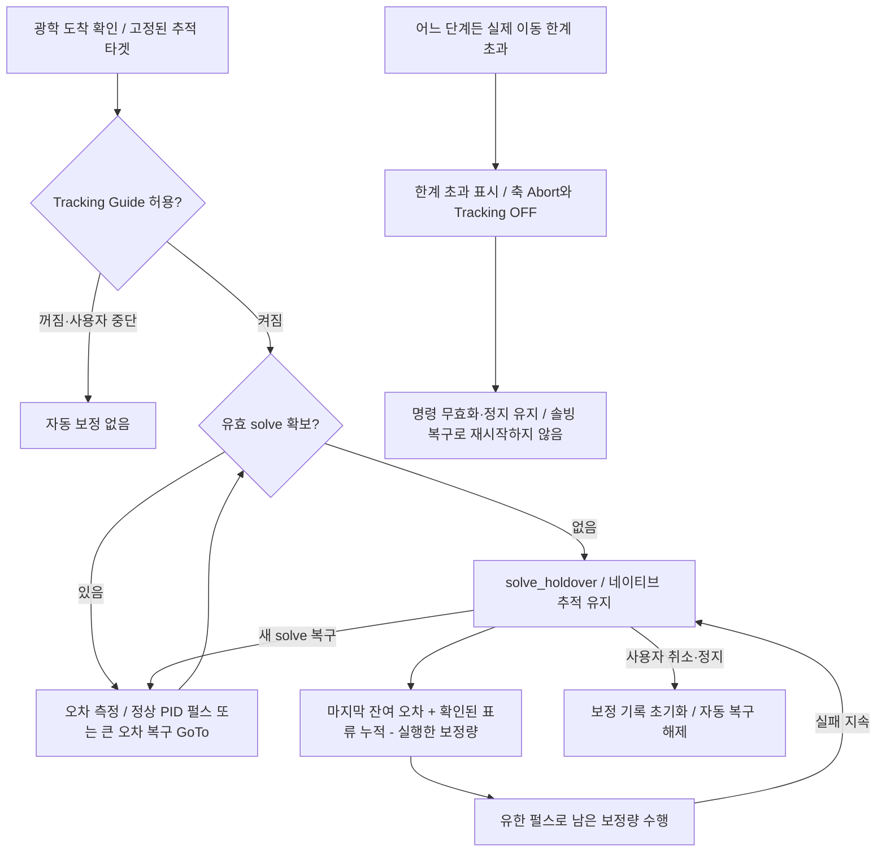

축별 보정 잔량은 `r(t) = e₀ + v × (t − t₀) − (p(t) − p(t₀))`다.
`e₀`는 마지막 solve의 오차, `v`는 광학 관측으로 확인한 오차 증가 속도,
`p`는 송신이 수락된 펄스의 속도와 경과 시간으로 추정한 누적 이동량이다.
이는 명령 기반 계산이며 실제 축 이동을 별도 센서로 실측한 값은 아니다.

- 같은 오차를 매 tick 다시 더하지 않는다. 축 타이머 교체 시 이전 펄스는
  실제로 경과한 명령 시간까지만 계산한다. 장시간 기록은 누적값으로 축약한다.
- 표류 속도는 펄스 이동을 보상한 독립 관측에서 학습한다. 0.5~12초 관측 간격,
  같은 부호의 연속 두 속도 추정, 0.2~5″/s 범위와 일관성 검사를 사용한다.
  빠른 연속 프레임도 최소 0.5초 구간으로 묶어 학습한다. 확인된 속도가 없으면
  0으로 두고 마지막 잔량만 처리한다. 솔빙 실패 시간만으로 속도를 만료하지 않는다.
- 잔량이 1″ 이상 쌓이면 확인된 가이드 속도로 최대 2.5초의 펄스를 보낸다.
  진행 중 펄스가 끝난 뒤 잔량을 재계산한다. 추정값은 새 solve나 PID 입력으로
  다시 넣지 않으며, 솔빙 실패만으로 수렴 실패 횟수를 증가시키지 않는다.
- 도착 프레임이 미세 보정 단계에서 이미 소비됐더라도 이동 이후의 유효 프레임이면
  추적 단계의 초기 잔량으로 이어받는다. 이전 PID 명령을 재실행하지는 않는다.
- 새 solve는 추정 잔량을 실제 관측 오차로 교체한다. 작은 오차는 정상 펄스 보정,
  큰 오차는 설정에 따른 광학 앵커 기반 복구 GoTo로 돌아간다. 복구 슬루 중에는
  펄스를 보내지 않고, 복구 정지 이후 새 solve와 정착을 거쳐 보정을 재개한다.
- 연결 상실, 주차, 드라이버 거부·지원 불가, 사용자 보정 Off는 솔빙 실패와
  별개다. 이런 상태에서 무조건 펄스를 보내지는 않는다.

<a id="mf_indi_goto_guide_plan_ko--모든-단계의-이동-한계와-정지-우선순위"></a>
#### 모든 단계의 이동 한계와 정지 우선순위

실행기의 한계 검사가 서비스의 도착·솔빙 복구 판단보다 우선한다. 실제 INDI
고도 한계(`minAlt`, `maxAlt`), GEM 현재 피어 측의 자오선 한계, OnStep의
고도·축·리미트 스위치 오류를 검사한다. GPS 잠금이 없어도 마운트의
`GEOGRAPHIC_COORD`가 있으면 해당 위치를 사용한다. 정렬 별 선택의 기본
20~78도나 과거의 고정 10도 값을 물리 한계로 대신 사용하지 않는다.

GoTo는 목적지 고도도 확인한다. 이동 경로·피어 전환·내부 축의 물리 한계는
펌웨어 판정과 상태 보고를 함께 사용한다. 수동 이동·네이티브 추적·펄스·smooth
실행 전과 제어 루프에서 감시하며, 감지 지연은 마운트 상태 보고와 루프 주기에
따른다. 소프트웨어 테스트가 하드웨어 리미트 스위치의 성능을 보증하지는 않는다.

한계 초과 시 `motion_limit.latched=true`와 `limit_exceeded`를 기록하고,
대기 명령의 epoch를 무효화하며 복구 작업을 취소한다. 축 Abort와 Tracking OFF를
요청하고, 실패하면 재시도한다. LCD에는 **마운트 이동 한계 초과**, 상태 파일에는
구체적인 원인을 남긴다. 오류 창 닫기나 솔빙 복구는 재시작 조건이 아니다.
실제 한계 위반이 해소된 뒤 사용자가 명시적으로 Tracking On을 요청해야 정지
유지를 해제할 수 있다. 자동 추적 복구의 Tracking On은 해제하지 못한다.

<a id="mf_indi_goto_guide_plan_ko--검증-결과와-재현"></a>
#### 검증 결과와 재현

`test_goto_correction_lifecycle.py`는 실제 서비스·명령 epoch·마운트 실행기를
연결한다. FIFO 운반, INDI I/O, 광학 관측, 물리 정지 입력만 시뮬레이션하며
실제 장비나 운영 서비스는 구동하지 않는다. 정지 콜백의 신선도·안정화 판정은
기존 `test_mountcontrol_indi.py`에서 별도로 검사한다.

| 확인 시나리오 | 자동 검증 위치 |
|---|---|
| 새 SYNC 모드·좌표·SLEW 응답 없이 GoTo를 보내지 않음 | `test_mountcontrol_indi.py`, lifecycle |
| GoTo → 큰 오차 재GoTo → 근거리 펄스 → 광학 도착 → 추적 | lifecycle |
| 도착 전 장기 솔빙 대기 → 수동 이동 → 정렬 확인 → 실제 타겟 고정 | lifecycle, `test_indi_solve_fallback.py` |
| 도착 후 실패 중 잔량 보정 → 새 solve 복구 → 사용자 전체 Stop | lifecycle |
| 도착 후 큰 오차의 광학 복구 및 보정 재개 | lifecycle |
| GoTo·미세 보정·추적·솔빙 실패의 각 단계에서 한계 초과 정지 | lifecycle |
| 장시간 중복 보정 방지·표류 유지·타이머 교체·빠른 프레임 | `test_guide_holdover.py` |
| 최신 설정·GEM 측·축 오류·GPS 없는 경우 한계 판정 | `test_mount_motion_limits.py` |
| LCD/SkySafari 정렬 라우팅·오류 표시·취소 후 표시 해제 | UI/POS/operation errors/solve fallback 테스트 |

검증 명령은 개발 환경에서 실행한다.

```bash
source scripts/activate_dev_trixie.sh
pytest -q tests/test_goto_correction_lifecycle.py tests/test_guide_holdover.py \
  tests/test_goto_arrival.py tests/test_mount_motion_limits.py \
  tests/test_indi_solve_fallback.py tests/test_indi_goto_guide_service.py \
  tests/test_mountcontrol_indi.py tests/test_ui_align.py tests/test_pos_server.py \
  tests/test_pos_server_stellarium.py tests/test_operation_errors.py \
  tests/test_tracking_target_integration.py tests/test_smooth_tracking_handover.py \
  tests/test_smooth_tracking_runtime.py tests/test_solve_acceptance.py \
  tests/test_integrator_drift.py tests/test_pointing_coordinate_service.py \
  tests/test_alignment_tracking_flow.py
```

2026-10-10 실행 결과: **881 passed**, 기존 의존성/프로세스 관련 경고 4건.
새 연결 시나리오 8개와 사용자 확인 취소 표시 회귀 3개를 포함한다.

실장비 미검증 항목은 구름/가림 중 장기 표류 보정 정확도, 한계 도달에서 실제
정지까지 걸리는 시간, 실제 방향키 해제 후 추적 유지다. 현장에서는 작은 이동과
안전한 시험 한계로 시작하고 INDI 응답·`goto_timing`·펄스 기록·오류 표시를 함께
확인한다. 이번 검증은 코드와 시뮬레이션 결과이며 현장 측정 결과로 표시하지 않는다.

<a id="mf_indi_goto_guide_plan_ko--이전-변경-이력-및-상세-설정"></a>
### 이전 변경 이력 및 상세 설정

2026-10-09 GoTo 방식 이름 변경: `indi_goto_method`의 기본값과 새 저장값은
`mfnavis`이며 웹/LCD에는 **MFNavis**로 표시한다. LCD 방식 표시 문자는
`M`이다. 기존 `pifinder` 값은 읽을 때 같은 방식으로 해석하고 다음 설정
저장 시 `mfnavis`로 변환한다. 예전 웹 폼과 런타임 명령도 호환한다.
`indi_pifinder_goto_*` 설정 키와 내부 단계 식별자는 호환성을 위해 유지한다.

2026-10-09 GoTo 도착 지연 개선:

- 마운트 상태는 같은 연결에서 받은 최신 서버 콜백(유효기간 5초)을 우선한다.
  `ON_COORD_SET`의 Busy는 더 새로운 정상 좌표 콜백과 최신 OnStep 종료 응답이
  모두 있을 때만 대체한다. 좌표/수동 이동의 Busy는 계속 정지를 막는다.
- INDI가 idle이고, 같은 연결의 정상 좌표 콜백 두 개가 1초 이상 간격으로
  0.02° 안에 유지되며 최신 OnStep 종료 응답이 있으면 안정화 창을 2.5초에서
  1초로 단축한다. 최신 정보(2초 이내)가 부족하거나 캐시만 반복해서 읽으면
  2.5초를 유지한다. Busy/재이동은 안정화 판정을 초기화한다.
  마운트 좌표의 타겟 거리는 정지 조건에서 제외하고 광학 도착 판정에서 보정한다.
- 정상 정지 확인 시 `goto_completed_wall`을 전달한다. 같은 GoTo의 유효한
  확인 시각이 있으면 서비스의 추가 1초 정착 대기를 생략하고, 그 시각 이후의
  solve를 사용한다. 타임아웃으로 가정한 완료에는 이 시각을 부여하지 않는다.
- GoTo/펄스/복구 진행 중 서비스 확인 주기는 0.2초, 일반 대기와 상태 파일 기록은
  1초다. 펄스 단계는 평균 좌표 대신 최신 성공 solve의 실제 좌표를 우선한다.
  이동 중 새 solve도 오차/진행 표시에 반영하며, 실행 계층이 이미 소비한 solve는
  새 펄스 전송 시각보다 앞서더라도 중간 평가에 사용할 수 있다. 최종 Sync와
  다음 GoTo는 펄스 종료 이후 solve로만 전환하며 추가 안정화 대기는 없다.
  최신 시도 실패가 기존 성공 결과를 폐기하지 않는다. 타겟 픽셀 불일치와
  오래된/미래 시각은 제외한다.
- OnStep은 새 solve마다 축별 PID로 진행 중 타이머를 교체한다(대기열 누적 없음).
  거리가 멀면 최대 2.5초 펄스, 가까워지면 smoothstep으로 보정량을 줄인다.
  P/I/D=1.0/0.05/0.25, D 필터 0.3초, 적분 포화 방지와 타겟 통과 시 초기화를
  사용한다. 1배/저장된 미세 속도의 전환에는 10% 히스테리시스를 두고,
  드라이버가 지원하지 않는 중간 속도를 요청하지 않는다. 일반 드라이버는 검증된
  타이머 교체 동작이 없어 기존 펄스 종료를 기다린다.
- `goto_completion`에 속성별 상태·콜백 나이·정지 차단 이유를,
  `goto_timing`에 정지 전달·solve 대기·도착 평가 시각을 기록한다. 새 solve 대기가
  12초 이상이면 12초 간격으로 경고를 남긴다. 타겟을 유지하며 복구를 기다린다.
- 큰 이동의 별도 프레임 solve 재확인은 유지한다. 지연 단축은 자동 테스트로
  검증했고 실기기에서의 개선 시간은 아직 측정하지 않았다.

이하 기록의 최초 기준: `main`, 2026-07-19. 현행 동작 검증 기준은 위의 2026-10-10 절이다.

이 문서는 INDI 마운트의 `Goto/Guide` 설정 UI와 동작 방식을 기술한다. 최초에는
구현 전 설계 초안이었으나, 아래 기능은 모두 구현되어 있고(`indi_goto_guide_service.py`,
`mountcontrol_indi.py`, 웹/LCD UI) 이 문서는 그 소스에 맞춰 유지한다. 문서의
과거 설정값은 이후 변경되었으므로 2026-10-10 절의 공식과 실제 저장 설정을 우선한다. 한곳에 모은
"상수와 타이밍" 표는 [상수와 타이밍 (소스 기준)](mount.md#mf_indi_goto_guide_plan_ko--상수와-타이밍-소스-기준)에 있다.

2026-07-19 설정 개편 요약:

- `indi_goto_method`(GoTo Type)에 `off`가 추가되어 GoTo 전달을 여기서 끈다.
- `skysafari_indi_goto`, `indi_goto_refine_once` 옵션과 LCD 가이드 화면의
  숫자 5 Refine 토글은 제거되었다.
- `skysafari_indi_sync`는 기본 켜짐이며 SkySafari Align/Sync 전달을 단독으로
  제어한다. solve 전 SkySafari Align의 IMU 정렬은 항상 켜져 있다.
- `indi_goto_refine_accuracy_arcmin` 입력은 웹 UI에서 GoTo / Guide Settings로
  이동했고, SkySafari Mount Mode 카드는 GoTo / Guide Settings 바로 위로 옮겨졌다.
- Object Details 숫자 5 GoTo는 mountcontrol 직행 대신 GoTo/Guide 서비스 큐를
  사용한다.

2026-07-20 트래킹 주파수 정책 요약:

- GoTo 진입점 세 곳(웹 카탈로그 push / LCD 키패드 5 / SkySafari `:MS#`)이 모두 같은
  트래킹 주파수 정책을 적용한다. 행성은 feed-forward 주파수, 정적 대상은 활성 비항성
  주파수가 있을 때만 sidereal 복원. 정책 본체는 `track_freq_policy.py`.
- 웹·LCD는 `obj_type == "Pla"`로 판별한다. SkySafari는 LX200 프로토콜상 천체 종류가
  없어 **좌표를 에페메리스와 대조**해 판별하며(허용오차 6′),
  `skysafari_planet_track_freq`(기본 켜짐)로 끌 수 있다. 엄폐/합에서 행성과 항성이
  좌표를 공유하므로 이 추정은 선택적이며, `obj_type`을 아는 경로는 사용하지 않는다.
- 상세 설계·실기기 검증·미해결 사항은 `mf_web_catalogs_dev_ko.md` P6/P6-1/P6-2 참고.
  P6-2는 SkySafari 좌표(JNow)와 `calc_planets()`(J2000)의 분점 불일치로 세차 22′ 때문에
  매칭이 실패하던 결함과 그 수정(`planet_positions_of_date()`)을 기록한다.
- `_queue_indi_goto_if_enabled`는 경로별로 필요한 큐만 검사한다. 두 큐를 모두 요구하면
  GoTo/Guide 서비스가 없을 때 multi-point align GoTo가 조용히 사라진다(2026-07-20 수정).

<a id="mf_indi_goto_guide_plan_ko--목적"></a>
### 목적

INDI 마운트를 사용할 때 GoTo와 추적 보정 동작을 사용자가 명확히 선택할 수 있게 한다.

새 설정 UI:

- LCD: `Settings > INDI Setting > Goto/Guide`
- Web: `/indi` 페이지의 INDI 탭 제일 하단

1차 설정 항목:

```text
Goto 진행방법
  - Off
  - INDI Mount
  - PiFinder

추적 가이드
  - On
  - Off
```

GoTo target 입력 경로:

```text
LCD UI를 통한 target 선택
SkySafari를 통한 target 설정
Web UI를 통한 target 설정
```

세 입력 경로는 모두 같은 mount-control target 처리로 모이고, 선택된
`GoTo Type`에 따라 `INDI Mount` 또는 `MFNavis` 절차를 수행한다.

<a id="mf_indi_goto_guide_plan_ko--현재-관련-구현"></a>
### 현재 관련 구현

현재 소스에서 이미 존재하는 관련 기능:

```text
python/PiFinder/mountcontrol_indi.py
  goto_target()
  toggle_guide_correction()
  _check_guide_correction()
  manual_move()
  stop_mount()

python/PiFinder/ui/indi.py
  UIIndiGuide
  숫자 0: toggle_guide_correction

python/PiFinder/server.py
python/views/indi_mount.html
  SkySafari Mount Mode 설정
  skysafari_lx200_mount_code
  skysafari_indi_sync
  skysafari_planet_track_freq
  GoTo / Guide 설정
  indi_goto_method (off | indi_mount | mfnavis)
  indi_goto_refine_accuracy_arcmin

python/PiFinder/pointing_coordinate_service.py
  SkySafari/Web/LCD가 사용할 현재 좌표 상태 제공
```

현재 `goto_target()`은 INDI 표준 `ON_COORD_SET=SLEW`와
`EQUATORIAL_EOD_COORD`를 사용해 마운트 driver에 GoTo를 보낸다.

현재 `toggle_guide_correction()`은 solve 기반 target 오차를 보고 INDI timed guide
correction을 보내는 구조다.

<a id="mf_indi_goto_guide_plan_ko--구현-아키텍처"></a>
### 구현 아키텍처

기존 시스템을 흔들지 않기 위해 새 기능은 별도 서비스와 별도 소스로 구현한다.

새 소스 후보:

```text
python/PiFinder/indi_goto_guide_service.py
```

역할 분리:

```text
pos_server.py
  SkySafari LX200 명령 수신
  GoTo/Sync/Guide 요청을 새 서비스 큐로 전달
  기존 push-to UI 처리는 유지

server.py / views/indi_mount.html
  Web 설정 UI
  Web target/stop 요청을 새 서비스 큐로 전달

ui/indi.py, ui/object_details.py
  LCD 설정 UI
  LCD target/stop 요청을 새 서비스 큐로 전달

indi_goto_guide_service.py
  GoTo Type 정책 결정
  PiFinder GoTo 상태 머신 실행
  Tracking Guide 상태 머신 실행
  PointingCoordinateService 좌표 읽기
  기존 mountcontrol_queue로 작은 명령만 전송

mountcontrol_indi.py
  기존 INDI 명령 실행자 역할 유지
  connect, sync, goto_target, manual_move, stop_mount 등 기존 primitive 제공
```

새 서비스는 mountcontrol을 대체하지 않는다. 기존 `MountControlIndi`는 실제 INDI
driver에 명령을 보내는 실행 계층으로 남기고, 새 서비스는 여러 명령을 순서대로
조합하는 orchestration 계층으로 둔다.

프로세스/큐 구조 초안:

```text
main.py
  mountcontrol_queue = Queue()
  goto_guide_queue = Queue()

  MountControl process
    input: mountcontrol_queue

  INDI GoTo/Guide process
    input: goto_guide_queue
    output: mountcontrol_queue
    reads: shared_state, mount_control_status.json
    writes: indi_goto_guide_status.json

  POS Server process
    SkySafari GoTo/Sync/Guide -> goto_guide_queue

  Web/LCD
    settings/config -> config.json
    target/stop/runtime commands -> goto_guide_queue
```

상태 파일 후보:

```text
data/indi_goto_guide_status.json
```

상태 파일에는 최소한 다음 정보를 기록한다.

```text
service_state
active_target_ra
active_target_dec
goto_method
tracking_guide_enabled
phase
last_error_arcmin
last_action
wait_reason
updated
```

<a id="mf_indi_goto_guide_plan_ko--구현-원칙과-주의점"></a>
### 구현 원칙과 주의점

- 새 서비스는 긴 blocking loop로 동작하지 않고 짧은 tick 단위 상태 머신으로 동작한다.
- Stop/Abort 명령은 어느 phase에서도 최우선 처리한다.
- 기존 `goto_target()` 경로는 `GoTo Type = INDI Mount`일 때 그대로 유지한다.
- `indi_goto_method`가 GoTo 전달 여부(`off`)와 실행 방식(`indi_mount` /
  `pifinder`)을 함께 결정한다(`skysafari_indi_goto`는 2026-07-19에 제거).
- `PointingCoordinateService`는 좌표 계산의 단일 기준으로 사용한다.
- PiFinder GoTo는 mount가 Park 상태이거나 위치/시간이 유효하지 않으면 시작하지 않는다.
- PiFinder GoTo 접근은 mount sync + `goto_target()` primitive를 반복 사용하고,
  마지막 1도 이내에서는 pulse guide로 넘긴다. 접근에 수동 이동은 사용하지 않는다.
- Tracking Guide는 사용자의 manual movement, GoTo, backlash test, multi align 중에는
  끼어들지 않는다.
- pulse guide가 driver별로 불안정하면 짧은 manual movement fallback을 사용하되,
  fallback 사용 여부를 상태에 명확히 표시한다.
- OnStepX 전용 기능은 driver 이름/기능 감지 후에만 사용하고, 일반 INDI 마운트에서는
  표준 INDI primitive만 사용한다.

<a id="mf_indi_goto_guide_plan_ko--상수와-타이밍-소스-기준"></a>
### 상수와 타이밍 (소스 기준)

아래는 config로 바꿀 수 없는 내부 상수와 주기다. 값은 소스와 1:1로 맞춰 두었다
(바뀌면 이 표도 같이 갱신). 출처 파일을 함께 적는다.

`indi_goto_guide_service.py` (오케스트레이션 서비스):

```text
HEARTBEAT_SECONDS = 1.0
  일반 대기 주기. 큐 명령(예: Stop)은 즉시 대기를 깨운다.
ACTIVE_GOTO_POLL_SECONDS = 0.2
  GoTo, 펄스 보정, solve 복구, 추적 복구 GoTo 중 상태 확인 주기.
STATUS_WRITE_SECONDS = 1.0
  indi_goto_guide_status.json 기록 최소 간격(tmpfs). 웹이 ~1초로 폴링하므로 거기
  맞춰 2.0→1.0 하향. 진행 중 0.2초 확인과 파일 기록 주기는 별개다.
CONFIG_RELOAD_SECONDS = 2.0
  config 자동 재로딩 주기. 명시적 reload_config 명령도 지원한다. load_config는 읽기 전용(되쓰기 없음)이라
  주기 단축 비용은 값싼 재파싱뿐 → 설정 체감 개선 위해 5.0→2.0 하향.
POINTING_STATUS_MAX_AGE_SECONDS = 5.0
  pointing_coordinate_status.json이 이 나이를 넘으면 stale로 보고 usable_for_goto를
  False로 만든다(오래된 좌표로 GoTo/보정하지 않음).
PIFINDER_FINAL_GOTO_SETTLE_SECONDS = 1.0
  GoTo 완료 판정 정착 시간. (1) 명령 후 최소 대기, (2) 무모션 연속 유지 창 두
  용도로 쓰이고, PiFinder sync+GoTo 대기와 추적 가이드 복구 GoTo 대기가 공유한다.
  실장비 OnStepX 6회 슬루 측정(12~56°, 2026-07-18)으로 2.0→1.0s 하향: 중간
  idle/bounce 0건, mount_control이 자체 GOTO_COMPLETE_STABLE_SECONDS(측정 당시
  4초, 이후 2.5초로 하향) 창을 거친 뒤에만 모션 플래그를 내려 이 서비스가 무모션을
  보는 시점엔 마운트가 이미 물리적으로 정지한 상태였다. 1.0s는 명령 픽업 지연·단일
  샘플 글리치만 흡수하면 되므로 안전 마진이 충분하다(상세: [실장비 정착 시간 측정](mount.md#mf_indi_goto_guide_plan_ko--실장비-정착-시간-측정-2026-07-18)).
  현재 이름은 MFNAVIS_FINAL_GOTO_SETTLE_SECONDS다. 최신 마운트 정지 확인
  시각이 있으면 추가 무모션 유지 창을 생략한다. 레거시 상태에서는 1초를 유지한다.
PIFINDER_DEFAULT_MAX_GOTOS = 10
  config에 indi_pifinder_goto_max_gotos가 없을 때의 상한 폴백.
PIFINDER_MIN_ERROR_IMPROVEMENT_ARCMIN = 1.0
  개선 부족 로그의 기준. 새 solve로 타겟을 유지하며 계속 보정한다.
PIFINDER_PULSE_ALIGN_TIMEOUT_SECONDS = 90.0
  유효 solve가 있으나 보정이 정체된 경우의 재시도 기준. 솔빙 실패의 만료 시간이 아니다.
TRACKING_GUIDE_MAX_RECOVERY_GOTOS = 5
  추적 가이드의 복구 한 묶음 시도 횟수. 소진하면 10초 대기 후 새 묶음을 시작한다.
TRACKING_TARGET_MIN_ALT_DEFAULT_DEG = 10.0
  과거 설정의 호환 기본값. 현재 이동 한계 가드에는 사용하지 않는다.
TRACKING_TARGET_ALT_CACHE_SECONDS = 10.0
  타겟 고도 계산 캐시 유효시간(타겟 좌표로 키잉, 항성시라 서서히 변함).
TRACKING_IMU_QUIET_OVERRIDE_MULTIPLE = 2.0
  좌표가 settle_seconds x 2(기본 8초) 동안 정지하면 IMU moving 플래그 단독으로는
  더 이상 복구를 막지 못한다(릴리즈 후 micro-sway 무한 지연 방지).
```

`mountcontrol_indi.py` (실제 펄스가이드/GoTo 실행 계층):

```text
GOTO_COMPLETE_STABLE_SECONDS = 2.5
  GoTo 완료 1차 판정 창. 완료 조건(INDI busy=False, OnStep이 진행 중이 아님,
  위치 변화<0.02°
  (GOTO_COMPLETE_POSITION_STABLE_DEG))이 이 시간 연속 참이어야 goto_motion을
  종료(플래그 해제)한다. 조건 하나라도 깨지면 타이머 리셋. 실측(2026-07-18)으로
  4.0→2.5 하향(조건이 정지 후 ~1.2초에 굳음, ~1초 마진). 최소 대기
  GOTO_COMPLETE_MIN_SECONDS=1.0, 상태 못 읽을 때의 하드 폴백
  GOTO_COMPLETE_FALLBACK_SECONDS=180.0.
GOTO_COMPLETE_FAST_STABLE_SECONDS = 1.0
  새 좌표 콜백 두 개와 최신 OnStep 종료 신호가 있으면 사용하는 단축 창.
  콜백 유효기간 2초, 좌표 샘플 간격 최소 1초. 캐시 반복은 샘플로 세지 않는다.
GUIDE_TRACKING_INTERVAL_SECONDS = 1.0
  수렴/악화 평가 간격. 펄스 전송 제한 주기가 아니며 실행 루프는 약 0.1초마다
  새 solve를 확인한다. OnStep에서는 진행 중 펄스도 교체한다. 같은 solve는 한 번만
  소비한다. timed guide 미지원 드라이버에서는 자동 보정을 중단한다.
SIDEREAL_ARCSEC_PER_SEC = 15.041
  펄스 시간 계산에 쓰는 항성 속도(arcsec/s).
DEFAULT_GUIDE_RATE_X = 0.5
  드라이버가 GUIDE_RATE를 못 주면 쓰는 기본 가이드레이트(sidereal 배수).
GUIDE_RATE_FAST_X = 1.0 / GUIDE_RATE_FINE_X = 0.5
  복귀(fast) / 정밀(fine) 가이드레이트. 오차가 정확도 x
  GUIDE_RATE_FAST_MIN_ERROR_MULTIPLE(=2.0)를 넘으면 1.0x, 복귀는 1.8배 이하에서
  저장된 미세 속도(기본 0.5x). 히스테리시스로 경계의 반복 속도 변경을 방지한다.
GUIDE_PULSE_AGGRESSIVENESS = 1.0
  PID 출력에 적용하는 시간 변환 계수. 축 오차/(정확도*2)의 smoothstep 비율로
  최대 펄스를 포함한 PID 보정량을 0.5~1.0배 조절하여 근접 접근을 완화한다.
GUIDE_PULSE_MIN_MS = 20 / GUIDE_PULSE_MAX_MS = 2500
  한 펄스 지속시간(ms) clamp 범위.
component_threshold = max(0.01, accuracy_arcmin / 2.0 * axis_scale)
  축별(NS/WE) 데드밴드. 이보다 작은 축 오차에는 그 축 펄스를 보내지 않는다.
DEFAULT_GOTO_REFINE_ACCURACY_ARCMIN = 3.0
  caller가 정확도를 안 주면 쓰는 solve 보정 목표 정확도(= 0.05도).
GOTO_REFINE_DELAY_SECONDS = 8.0 / GOTO_REFINE_SOLVE_TIMEOUT_SECONDS = 45.0
  INDI Mount refine(1회 solve 보정)의 대기/솔브 타임아웃.
```

<a id="mf_indi_goto_guide_plan_ko--제안-설정-키"></a>
### 제안 설정 키

새 설정은 장치 재시작 후에도 유지되어야 하므로 config option으로 관리한다.
아래 값들은 `default_config.json`의 기본값과 일치한다.

```text
indi_goto_method = "off" | "indi_mount" | "mfnavis"
  기본값: "mfnavis"
  웹 UI 라벨: **GoTo Type** (2026-07-17에 "GoTo Method"에서 변경)

indi_tracking_guide_enabled = false | true
  기본값: true (2026-07-19에 false에서 변경)

indi_goto_refine_accuracy_arcmin = 3.0
  solve 기반 정밀 보정의 목표 정확도(분각). 실장비 아이피스 중앙 정렬 결과에 따라
  6′에서 3′ = 0.05도로 하향했다. 공유 사용처: PiFinder GoTo 최종 pulse guide 정렬, LCD 수동
  "Guide Correction". (`indi_goto_refine_once` 기반 INDI Mount refine은
  2026-07-19에 제거. 자동 추적 가이드 밴드는 별도 키
  `indi_tracking_guide_threshold_arcmin` 사용.)

indi_guide_pulse_invert_we = false | true
  기본값: false
  timed guide pulse의 RA/Az(WE) 방향 반전. 마운트가 RA에서 반대로 가면 On.

indi_guide_pulse_invert_ns = false | true
  기본값: false
  timed guide pulse의 Dec/Alt(NS) 방향 반전. 마운트가 Dec에서 반대로 가면 On.

indi_pifinder_goto_near_threshold_deg = 1.0
  PiFinder GoTo에서 sync + 마운트 GoTo 반복을 끝내고 pulse guide 미세 보정으로
  전환하는 설정 경계. 실제 전환은 펄스 용량에 맞춰 최대 0.25도(15분각)로 제한한다.
  그보다 큰 오차는 sync + GoTo를 반복하고, 이내이면 pulse guide로 넘어간다.

indi_pifinder_goto_max_gotos = 10
  초기 GoTo를 포함한 한 묶음의 SYNC+GoTo 횟수. 소진 후 10초 대기하고 새 solve로
  재시도한다. 직전보다 오차가 덜 줄어도 로그를 남기고 타겟을 유지한다.

indi_tracking_guide_threshold_arcmin = 3.0
  추적 가이드가 pulse guide에 넘겨주는 목표 정확도(accuracy) 밴드. mountcontrol의
  guide correction은 오차가 이 값을 넘으면 펄스를 쏘고, 이하이면 "정착"으로 보고
  펄스를 멈춘다. 즉 pulse guide가 타겟을 유지하는 정밀도이자 보정 발동 경계다.
  (수동 재타겟 직후 새 타겟에 guide correction을 재-arm할 때의 accuracy로도 쓰인다.)

indi_tracking_guide_settle_seconds = 1.0
  현재 서비스 폴백. 저장된 사용자 설정을 우선하며, 외란 이후 정착 확인에 사용한다.
  아래의 4초 Option A 기록은 당시의 변경 이력이다.

indi_tracking_guide_motion_arcmin = 15.0
  현재 좌표의 tick당 변화량이 이 값 이상이면 망원경이 "외부 힘으로
  움직이는 중(disturbed)"으로 보고 모든 보정을 중단한다.

### 외란 반응성 (Option A, 2026-07-13)

실장비 증상: GoTo 완료 후 경통을 손으로 움직이면 한동안 "무반응"이다가, 한 번
움직였다 원위치로 되돌아오고, 그 뒤 정상 반응. RAW IMU + 융합 좌표 + 마운트 상태를
캡처해 디버깅한 결과:

- IMU는 얼지 않는다; 마운트가 idle일 때는 밀기가 융합 좌표에 즉시 반영된다.
- "무반응"의 정체는 마운트가 슬루 중일 때다(도착 부근의 corrective GoTo, 또는
  추적 가이드 자체의 recovery GoTo). 슬루 중엔 `mount_readback_priority`가 서서
  pointing service가 raw 마운트 readback을 쓰고 IMU delta가 억제된다. recovery
  슬루가 타겟으로 되돌리는 것이 "원위치 복귀"다.
- 좌표가 잠깐 안정될 때마다 recovery가 발동해, 조작 중에도 루프가 돌았다.

수정:

1. settle이 좌표뿐 아니라 물리적 움직임을 기준으로 한다. `_tick_tracking_guide`가
   arcmin 좌표 델타에 더해 IMU `moving` 플래그(BNO055 모션 감지)를 "움직임"으로
   취급하고, IMU가 움직이는 동안 settle 창을 계속 리셋한다. 그래서 경통을 다루는
   동안엔(융합 좌표 델타가 잠깐 임계값 아래로 떨어지는 순간에도) `disturbed`를
   유지하고 recovery로 넘어가지 않는다. 정말로 `settle_seconds`만큼 정지한 뒤에만
   recovery가 한 번 발동한다.
   - **IMU 플래그 상한 (2026-07-16)**: BNO055 플래그는 좌표 임계값보다 훨씬
     민감해(quat 델타 ~0.0003) 릴리즈 후 미세 흔들림으로 수십 초 유지될 수 있고,
     실측에서 recovery 시작이 30초 이상 지연됐다. 좌표가
     `settle_seconds x TRACKING_IMU_QUIET_OVERRIDE_MULTIPLE`(기본 2배 = 8초) 동안
     정지해 있으면 IMU 플래그 단독으로는 더 이상 recovery를 막지 못한다
     (좌표 이동은 계속 무제한으로 막는다 — 실제 밀기 진행 중 보호는 유지).
     override 발동은 로그로 남는다. 상태 전이도 이제 journal에 로깅된다
     (`Tracking guide disturbed -> settling (...)`).
2. guide-correction 펄스는 더 이상 마운트 readback 우선권을 주장하지 않는다
   (mountcontrol `_mount_common_status_fields`). 미세 펄스 보정 중에도 IMU가 살아 있게 한다
   (펄스는 sub-arcminute이고 IMU-delta rate 게이트가 어차피 버린다).

실장비 검증: ~30초 연속 손 움직임 동안 가이드가 `disturbed`를 유지하고(좌표는 밀기
반영, median ~585'), 경통을 놓은 뒤 ~3–4초 후 recovery GoTo를 정확히 한 번만
발동한 뒤 `enabled`로 복귀. 이전엔 조작 내내 recovery 슬루가 반복됐다.

### 솔브 앵커 게이트 (2026-10-10 검증)

최초 GoTo의 앵커 미확보 대기는 최대 12초다. 초기 IMU GoTo는 별도의 허용
설정과 유효성 조건에 따른다. 이미 수락한 GoTo나 추적 복구에서 solve가 없으면
네이티브 추적으로 대기하며, 12초 경과를 근거로 추정 좌표 SYNC/GoTo를 보내지 않는다.
도착 전 펄스 단계와 도착 후 `solve_holdover`는 위 현행 설계처럼 구분한다.

indi_tracking_guide_goto_recovery_enabled = false | true
  기본값: true (2026-07-19에 false에서 변경)
  외란 후 큰 오차에 대한 sync + GoTo 복구 동작 허용 여부.
  Off이면 오차 크기와 관계없이 pulse guide로만 보정하고(큰 오차는 상태에
  표시), 마운트를 절대 슬루하지 않는다.

indi_tracking_guide_goto_threshold_deg = 0.25
  pulse guide는 정착 후 오차를 이 크기까지 담당한다 (기본 0.25도 = 15 arcmin;
  메뉴 INDI Setting > Goto/Guide > Recovery Range에서 0.25~3도 선택).
  이 값을 "초과"하는 오차는 (복구가 켜져 있을 때) pulse guide 대신
  sync + GoTo 복구를 사용하고, 이하이면 pulse guide로 직접 보정한다.
  이 단일 경계가 곧 pulse guide의 실용 한계이기도 하다.

indi_tracking_guide_manual_retarget_enabled = true | false
  기본값: true
  트래킹 중 마운트 수동이동 명령으로 스코프를 옮겼다가 멈추면, 원래 타겟으로
  복귀하는 대신 멈춘 위치(현재 좌표)를 새 타겟으로 삼아 그 자리에서 추적을
  이어간다. 물리적 손밀기(외란)에는 적용하지 않고 기존 disturbance recovery를
  유지한다. Off이면 수동이동도 외란처럼 취급해 원래 타겟으로 복귀한다.
```

이름은 구현 시 바뀔 수 있지만, 문서에서는 위 이름을 기준으로 설명한다.

<a id="mf_indi_goto_guide_plan_ko--ui-설계"></a>
### UI 설계

<a id="mf_indi_goto_guide_plan_ko--lcd"></a>
#### LCD

메뉴 위치:

```text
Settings
  INDI Setting
    Goto/Guide
```

화면 구성 (현재 `menu_structure.py` 구현):

```text
Goto/Guide
  GoTo Type           -> indi_goto_method            [INDI Mount | MFNavis]
  Tracking Guide      -> indi_tracking_guide_enabled           [Off | On]
  GoTo Recovery       -> indi_tracking_guide_goto_recovery_enabled  [Off | On]
  Recovery Range      -> indi_tracking_guide_goto_threshold_deg
                         [0.25° | 0.5° | 1° | 2° | 3°]
  Manual Re-target    -> indi_tracking_guide_manual_retarget_enabled [Off | On]
  Max GoTos           -> indi_pifinder_goto_max_gotos [3 | 5 | 10 | 15 | 20]
  Invert Guide RA/Az  -> indi_guide_pulse_invert_we             [Off | On]
  Invert Guide Dec/Alt-> indi_guide_pulse_invert_ns             [Off | On]
```

조작 원칙:

- 좌우/사각 버튼으로 항목 선택과 값 변경.
- 값 변경 시 각 항목의 `post_callback = reload_config`로 config를 저장하고 즉시
  재로딩 신호를 보낸다. 신호가 없어도 서비스는 `CONFIG_RELOAD_SECONDS`(5초)마다
  config를 다시 읽으므로 최대 5초 안에 반영된다.
- 장비 연결 상태와 무관하게 설정은 변경 가능하다.
- 실제 동작 중인 추적 가이드를 Off로 바꾸면 서비스가 다음 tick에서
  `toggle_guide_correction(false)`를 한 번 보내고 `off`로 간다.

<a id="mf_indi_goto_guide_plan_ko--web"></a>
#### Web

위치: `/indi` 페이지 제일 하단 `GoTo / Guide Settings` 카드
(`views/indi_mount.html`, form action `/indi/goto_guide`).

표시 항목 (현재 구현):

```text
GoTo Type                          select  -> indi_goto_method [INDI Mount | MFNavis]
Tracking Guide                     checkbox-> indi_tracking_guide_enabled
Tracking Guide GoTo Recovery       checkbox-> indi_tracking_guide_goto_recovery_enabled
Manual Re-target                   checkbox-> indi_tracking_guide_manual_retarget_enabled
Invert guide pulse RA/Az (WE)      checkbox-> indi_guide_pulse_invert_we
Invert guide pulse Dec/Alt (NS)    checkbox-> indi_guide_pulse_invert_ns
Max GoTos                          select  -> indi_pifinder_goto_max_gotos
[Apply GoTo / Guide Settings] 버튼
```

주의: 웹에는 `Recovery Range`(goto_threshold_deg) 선택이 없다 — LCD 메뉴에서만
바꾼다. 웹 `GoTo Recovery` 체크박스 라벨의 "re-slew when off target by more than
3 deg" 문구는 고정 안내 텍스트로, 실제 재슬루 경계는 Recovery Range(기본 0.25도)를
따른다. (라벨 문구는 정리 대상.)

읽기전용 상태 패널 `GoTo / Guide Status`: `indi_goto_guide_status.json`을
`/indi/current_values` 폴링으로 읽어 service_state/phase, tracking_guide_state,
recovery mode+count, last action을 표시한다.

Web UI는 기존 `SkySafari Mount Mode` 카드와 구분한다. SkySafari 설정은
SkySafari protocol forwarding 정책이고, `Goto/Guide`는 INDI 마운트 자체의
GoTo/추적 보정 정책이다.

<a id="mf_indi_goto_guide_plan_ko--goto-type-indi-mount"></a>
### GoTo Type: INDI Mount

현재 동작을 유지하는 모드다.

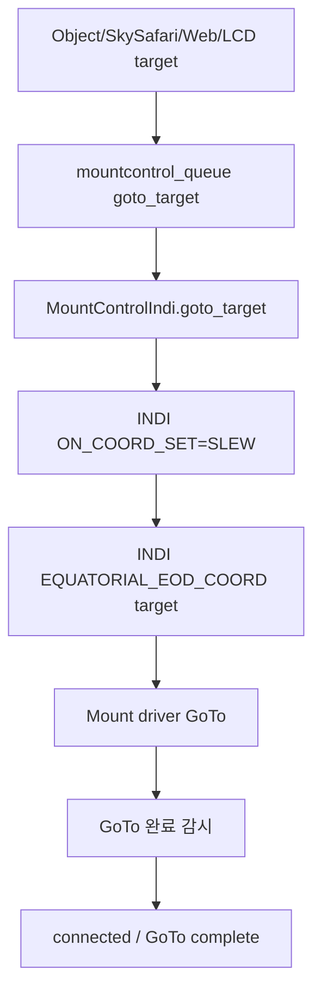

특징:

- 마운트 driver가 target 좌표로 이동한다.
- PiFinder는 진행 중 mount readback을 좌표 서비스에 제공한다.
- solve 기반 1회 refine 옵션(`indi_goto_refine_once`)은 2026-07-19에 제거되었다.
  GoTo 후 정밀 접근이 필요하면 `GoTo Type = MFNavis`를 사용한다.
- 추적 가이드가 On이면 GoTo 이후 target을 기준으로 주기적 guide correction을
  수행한다.

<a id="mf_indi_goto_guide_plan_ko--goto-type-mfnavis"></a>
### GoTo Type: MFNavis

현행 전체 순서도와 경계 조건은 문서 첫 절을 따른다. 서비스는 유효한 광학
앵커로 SYNC+GoTo를 검증해 시작하고, 실제 정지 이후 solve로 도착 오차를 평가한다.
근거리 범위는 설정값을 최대 15′로 제한하며 이내에서는 timed guide pulse만 사용한다.
자동 수동 접근은 사용하지 않는다. 목표 정확도 이내이면 최종 Sync를 요청하고
`complete`로 전환한다. 정확도는 고정 0.05도가 아니라 저장된 설정값이다.

- 반복 한도와 미세 보정 정체는 타겟을 유지한 재시도 묶음이다. 솔빙 실패만으로
  자동 취소하거나 추가 네이티브 GoTo를 만들지 않는다.
- 사용자 수동 이동은 보정을 중지하고, 방향키 해제 후 네이티브 추적을 유지한다.
  새로운 타겟 좌표는 이동 종료 이후 solve로 정하며, 무솔빙 상태의 정렬 입력은
  `arrived_waiting_solve`로 처리한다. 복구한 실제 좌표를 한 번 채택한다.
- 광학 도착 후 솔빙 실패는 `solve_holdover`이며 마지막 잔량과 확인된 보정 속도를
  유지한다. 사용자 취소/정지와 실제 마운트 한계 인터록이 우선한다.
- 새 GoTo마다 `final_sync_sent`, 도착 확인, 보정 횟수와 기존 복구 상태를 초기화한다.

<a id="mf_indi_goto_guide_plan_ko--goto-완료-판정-대기-로직"></a>
#### GoTo 완료 판정 (대기 로직)

각 sync + GoTo 스텝에서 "GoTo 완료 대기"는 좌표가 target에 도달했는지를 직접 보지
않고, **마운트가 슬루를 끝내고 정지했는지를 모션 상태 플래그로 폴링**해 판정한다
(도착 정확도는 완료 후 별도 오차 측정 단계에서 확인). 구현은 `_tick_goto_wait`이며
초기 GoTo·보정 GoTo·추적 가이드 복구 GoTo에 모두 같은 로직이 쓰인다.

절차:

1. **명령 시점 기록**: GoTo를 보낼 때 `final_goto_sent_at`을 현재 시각으로 기록하고
   idle 타이머(`final_goto_idle_since`)를 0으로 리셋한다.
2. **최소 대기**: 명령 후 `PIFINDER_FINAL_GOTO_SETTLE_SECONDS`(현재 1.0초) 동안은
   완료 판정을 보류한다. 마운트가 슬루를 시작하기 직전의 잠깐 idle 상태를 "완료"로
   오판하지 않기 위한 최소 창이다.
3. **모션 폴링**: 매 tick마다 마운트 상태 요약을 읽어 아래 중 하나라도 참이면
   "움직이는 중"으로 보고 idle 타이머를 리셋한 채 대기를 계속한다
   (`last_action = "waiting for final INDI GoTo"`):
   - `mount_motion_active`
   - `goto_motion_active`
   - `manual_motion_direction`가 설정됨
   - 상태 문자열에 `slew` / `goto` / `moving` / `motion` 포함
4. **idle 정착 창(settle window)**: 마운트가 정지(위 조건 모두 거짓)로 보이면 첫
   idle 샘플에서 idle 타이머를 시작하고, idle 상태가
   `PIFINDER_FINAL_GOTO_SETTLE_SECONDS`(1.0초) 연속 유지될 때만 완료로 인정한다.
   중간에 다시 모션이 감지되면 타이머를 리셋한다 — OnStepX처럼 "근처 이동 후
   미세조정"으로 모션이 잠깐 멈췄다 재개하는 마운트를 완료로 오판하지 않는다.
   (실장비 측정에서 이런 중간 idle은 관측되지 않았고, mount_control이 자체 4초
   안정 창을 거친 뒤 플래그를 내리므로 이 창은 짧아도 안전하다 — 아래 측정 참고.)
5. **완료 후 오차 측정**: idle이 정착하면 `PointingCoordinateService`를 다시 읽어
   `usable_for_goto`를 확인하고(불가하면 error), target과의 오차를 측정한다. 이
   오차로 sync + GoTo 반복 / pulse guide / complete 분기를 결정한다.

대기 중 안전 가드(해당 시 즉시 error로 중단):

- 마운트 상태 unavailable.
- 마운트 parked.
- Stop/Abort는 이 대기 중에도 최우선으로 처리한다.

`PIFINDER_FINAL_GOTO_SETTLE_SECONDS`는 최종·보정 GoTo 대기와 추적 가이드의
sync + GoTo 복구 대기가 공유하는 정착 시간이다.

<a id="mf_indi_goto_guide_plan_ko--실장비-정착-시간-측정-2026-07-18"></a>
#### 실장비 정착 시간 측정 (2026-07-18)

`PIFINDER_FINAL_GOTO_SETTLE_SECONDS` 최적값을 정하려고 실장비(OnStepX, 웨지)에서
좌우 별로 **6회 GoTo**(슬루각 12~56°)를 하며 `mount_control_status.json`의 모션
플래그를 7Hz로 캡처해 분석했다.

측정 결과:

```text
- 6회 모두 실제로 슬루하고 오차 0°로 수렴.
- 슬루 중 중간 idle(모션 플래그 1→0→1 bounce): 0건.
  코드 주석이 대비하던 "OnStepX 코스 이동 후 미세조정 일시정지"는 관측되지 않음.
- 물리적 정지 → 모션 플래그 해제까지 지연: 4.2~5.3초(평균 ~4.8s).
  = mount_control의 GOTO_COMPLETE_STABLE_SECONDS(측정 당시 4초) 안정 창 때문.
- 완료 조건(INDI busy=False, OnStep 'N', 타겟 0.5° 이내, 위치 안정<0.02°)은
  물리적 정지 후 ~1.2초 안에 모두 만족 — 4초 중 실제 판정에 쓰인 건 앞 ~1초뿐.
- 즉 이 서비스가 "무모션"을 보는 시점엔 마운트가 이미 ~5초 물리적으로 정지 상태.
- 플래그 해제 직후 readback은 즉시 안정(정지 구간 vmax ≈ 항성시 수준).
```

당시 결론(두 상수 조정; 2026-10-09 최신 콜백 기반 1초 경로 추가):

- **`PIFINDER_FINAL_GOTO_SETTLE_SECONDS` 2.0 → 1.0s**: 완료 판정용 idle 창은
  bounce가 없고 mount_control이 이미 정착을 보장하므로 짧아도 안전하다. 명령→슬루
  시작 지연(단독 :MS 테스트에서 <0.15s)만 흡수하면 된다(안전 마진 3배 이상).
- **`GOTO_COMPLETE_STABLE_SECONDS` 4.0 → 2.5s** (mount_control의 1차 정착 보증
  창): 완료 조건이 정지 후 ~1.2초 안에 굳으므로, 그 위에 ~1초 마진(도착 부근
  OnStep 상태 떨림 대비)만 남기고 하향. GoTo·보정·복구 슬루마다 ~1.5초 절약.
  이 창은 goto_guide의 idle 창과 달리 조기 완료 시 "움직이는 중 오차 측정"으로
  잘못된 final sync를 유발할 수 있는 1차 보증이라, 이번 6회 슬루에 2단(도착 후
  일시정지→재이동) 케이스가 없었던 점을 감안해 1.0초까지는 내리지 않고 2.5초에서
  멈췄다. 더 공격적(2.0초) 하향은 긴 슬루·자오선 근처·콜드 스타트에서 원신호
  (INDI busy, OnStep `:GU#`, tick당 위치변화)를 추가 실측해 중간 lull이 없음을
  확인한 뒤가 안전하다.

주의 사항:

- 이 모드는 `PointingCoordinateService`의 좌표 품질에 크게 의존한다.
- plate solve 좌표가 있으면 가장 신뢰도가 높다.
- solve가 없으면 IMU/mount 융합 좌표로 coarse 접근은 가능하지만 오차가 커질 수 있다.
- 마운트가 Park 상태이거나 위치/시간이 유효하지 않으면 시작하지 않는다.
- Stop/Abort는 접근 sync/GoTo, 반복 GoTo, 최종 pulse guide 어느 단계에서도 최우선
  처리한다.

<a id="mf_indi_goto_guide_plan_ko--추적-가이드"></a>
### 추적 가이드

추적 가이드는 GoTo method와 별개로 On/Off 할 수 있는 보정 기능이다.

목표:

- target 추적 중 지속적으로 `PointingCoordinateService`의 현재 좌표를 확인한다.
- target 좌표와 현재 좌표가 일정량 이상 틀어졌을 때 pulse guide로 추가 보정한다.
- 기능 자체는 설정에서 On/Off 한다.

기본 흐름:

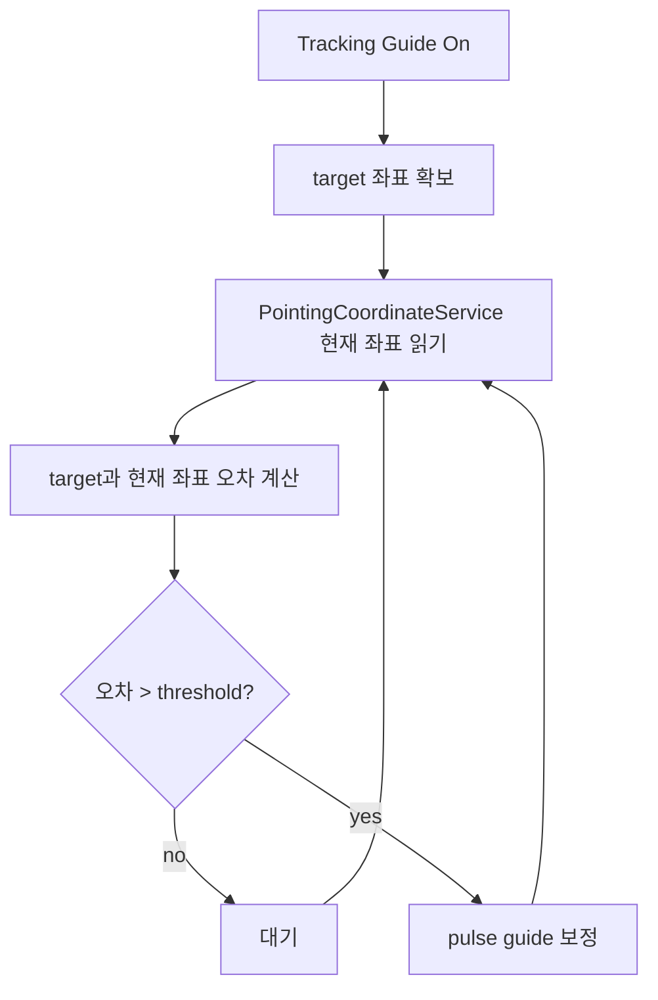

좌표 우선순위:

```text
1. plate solve 기반 PointingCoordinateService 좌표
2. mount sync 이후 mount + IMU delta 좌표
3. solve 없음/초기 상태의 IMU fallback 좌표
```

보정 방식:

```text
오차 방향 계산
  -> RA/Dec 기준 축별(NS, WE) 오차 계산
  -> 축별 pulse guide duration 계산 (오차 각도 / 가이드레이트)
  -> INDI 표준 timed guide pulse(TELESCOPE_TIMED_GUIDE_NS/WE) 전송
  -> 다음 좌표 갱신에서 효과 확인
```

<a id="mf_indi_goto_guide_plan_ko--펄스가이드-구현"></a>
#### 펄스가이드 구현

트래킹 보정은 **INDI 표준 timed guide pulse**로 수행한다. 이는 수동이동
(`manual_move`, 버튼처럼 start/stop으로 구동)과는 다른 별도 명령으로, 지정한
**시간(ms)만큼** 가이드레이트로 이동한다.

- **명령**: `TELESCOPE_TIMED_GUIDE_NS`(`TIMED_GUIDE_N`/`TIMED_GUIDE_S`),
  `TELESCOPE_TIMED_GUIDE_WE`(`TIMED_GUIDE_W`/`TIMED_GUIDE_E`)에 각각 pulse
  시간을 number로 보낸다. NS/WE 두 축을 독립적으로 보정한다.
- **지속시간 계산**: 축 오차를 그 축의 가이드레이트로 이동하는 데 필요한 시간으로
  계산한다.
  `duration_ms = |오차_arcsec| / (guide_rate_x × 15.041 arcsec/s) × aggressiveness`.
  한 번에 오차의 일부(예: 70%)만 닫고 6초 주기 루프로 수렴시키며, 최소·최대
  ms로 clamp한다.
- **가이드레이트**: 드라이버의 `GUIDE_RATE`(sidereal 배수)를 읽어 사용하고,
  못 읽으면 기본값(0.5×)으로 폴백한다.
- **복귀 속도 전환**: 남은 오차가 `정확도 × 2`를 초과하는 동안은 `GUIDE_RATE`를
  **1.0×**(fast)로 올려 복귀 펄스가 두 배 빨리 이동하게 하고(1.0× 쓰기를 받는
  수정된 OnStepX 드라이버 필요), 오차가 그 밴드 안으로 들어오면 **0.5×**(fine)로
  내려 정밀 보정으로 마무리한다. 보정이 정확도 내로 수렴하거나 guide correction이
  꺼질 때도 0.5×로 복원한다. 드라이버가 `GUIDE_RATE` 쓰기를 거부하면 현재
  레이트를 그대로 쓰고 재시도하지 않는다(펄스 시간 계산은 항상 실제 레이트를
  다시 읽으므로 안전).
  - **수동이동 속도 오염과 복원(2026-08-08)**: OnStepX 드라이버는 `GUIDE_RATE`
    쓰기를 펌웨어 공유 레이트 선택자 `:R<n>#`(0.5×→:R1, 1.0×→:R2)로 보내므로,
    가이드 레이트 전환이 조이스틱/수동 이동 속도까지 0.5×/1×로 끌어내린다
    (현장 실측). 대응: 매 가이드 사이클에서 펄스 창이 끝난 뒤
    `TELESCOPE_SLEW_RATE.<사용자 레이트>`를 재적용하고(`_check_slew_rate_reassert`,
    펄스 최대 지속 + 0.5 s 뒤), 사용자 `manual_move`는 시작 직전에 오염이
    감지되면 즉시 재적용한다(가이드 보정의 manual fallback은 저속이 의도라
    제외). 사용자의 `set_slew_rate`는 대기 중 재적용을 무효화하는 새 권위다.
- **capability 감지**: 드라이버에 `TELESCOPE_TIMED_GUIDE_*` 프로퍼티가 있으면
  timed guide pulse를 쓰고, 없으면 기존처럼 **짧은 manual movement lease를
  fallback**으로 사용한다(감지 결과는 캐시).
- **방향 부호 반전**: NS는 dec 오차 부호(양수→N), WE는 RA 오차 부호로 정한다.
  드라이버마다 축 부호가 반대일 수 있어, 축별 반전을 config로 둔다
  (`indi_guide_pulse_invert_we`=RA/Az, `indi_guide_pulse_invert_ns`=Dec/Alt,
  기본 off; LCD·Web에서 토글). 반전은 timed guide pulse에만 적용되고 manual
  fallback에는 적용되지 않는다(그쪽 매핑은 이미 검증됨).
  - **실장비 검증(OnStepX, 2026-07-15)**: 실제 LX200 OnStepX에서 펄스를 쏘고 RA/Dec
    변화를 측정한 결과 `TIMED_GUIDE_E`→RA↑, `TIMED_GUIDE_W`→RA↓, `TIMED_GUIDE_N`
    →Dec↑ (모두 표준). 따라서 **기본 매핑이 맞고 반전 불필요**(두 반전 키 기본
    off 유지). 반전 옵션은 다른 드라이버 대비 안전장치로 둔다.
  - 같은 테스트에서 펄스 실이동량이 공칭 GUIDE_RATE(0.5×)의 ~1.6배로 측정되어,
    오버슛 방지를 위해 `GUIDE_PULSE_AGGRESSIVENESS`를 0.5로 보수적으로 둔다.

이 방식은 (1) 수동이동과 명령이 달라 트래킹 보정 펄스가 마운트 상태에
`manual_motion`으로 찍히지 않으므로 [수동 재타겟] 구분이 깔끔해지고, (2) 오차
각도에 비례한 시간만큼만 이동해 고정 lease 방식보다 정밀하다.

Off 조건:

- 사용자가 설정에서 Off 선택
- mount disconnect/error
- mount parked
- 사용자가 Stop/Abort
- target 없음
- `PointingCoordinateService` 좌표 unavailable

상태 표시 후보:

```text
guide_correction_enabled
guide_correction_target_ra
guide_correction_target_dec
guide_correction_error_arcmin
guide_correction_last_action
guide_correction_wait_reason
guide_correction_pulse_ms
guide_correction_threshold_arcmin
```

<a id="mf_indi_goto_guide_plan_ko--트래킹-가이드-보강-외란-복구-disturbance-recovery"></a>
### 트래킹 가이드 보강: 외란 복구 (Disturbance Recovery)

추가 기준일: 2026-07-11.

<a id="mf_indi_goto_guide_plan_ko--문제"></a>
#### 문제

1차 트래킹 가이드는 solved 좌표가 target에서 벗어날 때마다 pulse guide 보정을
계속 보낸다. 추적 중 망원경이 물리적으로 움직이면(부딪힘, 손으로 재배치, 바람,
케이블 당김) IMU + plate solve로 현재 좌표가 변한다. **움직이는 도중에 보정하면**
움직이는 점을 쫓게 되어 사용자와 싸우게 된다. 또 2도 변위와 5분각 드리프트를
똑같이 취급해서, GoTo 한 번이면 닫을 큰 오차를 pulse로 천천히 기어가게 된다.

<a id="mf_indi_goto_guide_plan_ko--목표"></a>
#### 목표

트래킹 가이드가 On이고 target을 잡고 있을 때:

1. 좌표/IMU 신호로 외란을 감지하고, 움직이는 동안에는 **모든 보정을 중단**한다.
   움직임의 첫 프레임부터 보정하지 않고, 멈출 때까지 기다린다.
2. 움직임이 멈추고 좌표가 정착하면, target까지 오차를 측정해 크기별로 복구를
   선택한다:
   - **작은/중간 오차** (GoTo 임계값 이하, 기본 0.5도): pulse guide 미세 보정.
   - **큰 오차** (GoTo 임계값 초과, 즉 0.5도 초과): 정확하고 빠른 복구를 위해
     **마운트를 PiFinder 현재 좌표로 sync**하고 **target으로 GoTo**한 뒤, target
     근처에서 **pulse guide 미세 보정으로 복귀**한다.
3. 위 동작들은 모두 설정으로 게이트된다. sync + GoTo 복구는 별도 On/Off
   (`indi_tracking_guide_goto_recovery_enabled`)이다. 어떤 게이트가 Off이면 해당
   동작은 건너뛰고 상태로만 표시하며, 게이트가 Off인 동안 마운트는 절대 움직이지
   않는다. (사용자가 강조한 "설정에 따라 On/Off" 안전장치)

<a id="mf_indi_goto_guide_plan_ko--상태-모델"></a>
#### 상태 모델

트래킹 가이드에 작은 내부 상태머신을 둔다 (`tracking_guide_state`로 노출):

```text
off             config에서 트래킹 가이드 비활성
waiting_target  아직 추적 target 없음
paused          GoTo/backlash/multi-align 또는 (수동이동이 아닌) 마운트 모션으로 일시중지
manual_move     사용자가 마운트 수동이동 명령으로 스코프를 움직이는 중; 보정 중단
waiting_mount   마운트 상태 unavailable / parked
waiting_coordinate  포인팅 좌표 unavailable/stale
disturbed       현재 좌표가 움직이는 중; 모든 보정 중단
settling        움직임 멈춤; settle_seconds 동안 좌표 안정 대기
enabled         정상; pulse guide 미세 보정 동작 (오차가 pulse 밴드 내)
recovering_goto sync + GoTo 복구 진행 중 (큰 오차)
failed          복구 수렴 실패 / pulse guide 실패 보고
```

<a id="mf_indi_goto_guide_plan_ko--외란정착-감지"></a>
#### 외란·정착 감지

- 좌표 소스는 `PointingCoordinateService` 하나다 (서비스가 이미 가진
  `_load_pointing_status`로 가져온다). 이 서비스가 적합한 소스(solve / mount+IMU /
  IMU)를 선택해 `current`를 내려주고, `_load_pointing_status`가 그 상태에서
  `usable_for_goto`와 `reason`을 계산한다. **트래킹 가이드는 자체 solve/IMU
  판단을 하지 않고** `usable_for_goto`를 신뢰한다. 좌표가 usable하지 않으면
  `waiting_coordinate` 상태로 두고 보정하지 않는다.
- **disturbed**: 직전 샘플 대비 `current`의 tick당 변화량이
  `indi_tracking_guide_motion_arcmin`(기본 15′) 이상이면 움직이는 것으로 본다.
  물리적 이동을 잡는 게 목적이다.
- **settled**: 좌표 변화량이 임계값 아래로 `indi_tracking_guide_settle_seconds`
  (기본 4초) 동안 연속 유지되면 정착으로 본다. 정착 후 target 오차는 같은
  `current` 좌표로 측정한다.
- 외란·정착 판정은 자체 last-stable 좌표와 타이머를 별도로 두어, PiFinder GoTo의
  sync + GoTo 반복 상태와 충돌하지 않게 한다.

<a id="mf_indi_goto_guide_plan_ko--복구-결정-정착-후"></a>
#### 복구 결정 (정착 후)

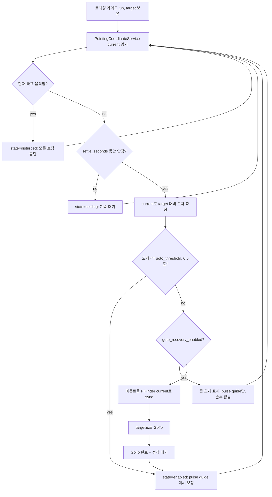

밴드:

```text
오차 <= 0.5도 (goto_threshold) -> pulse guide 미세 보정
오차 > 0.5도                   -> sync + GoTo 복구 후 target 근처에서 pulse guide;
                                 복구 Off면 pulse guide만 (슬루 없음)
```

pulse guide는 여전히 마지막 작은 오차를 닫는 수단이고, sync + GoTo 단계는 큰
변위를 pulse로 기어가는 대신 한 번의 슬루로 닫기 위해 존재한다. GoTo 복구는 최종
PiFinder GoTo용으로 이미 만든 sync + `goto_target()` + 정착/검증 로직을 재사용한 뒤
target 근처에서 pulse guide로 넘긴다.

복구 GoTo는 한 외란 이벤트당 `TRACKING_GUIDE_MAX_RECOVERY_GOTOS`(5회)로 제한된다.
5회 안에 pulse 밴드로 수렴하지 못하면 `goto recovery limit reached`로 `failed`
상태에 들어간다(무한 재슬루 방지). 각 복구 GoTo의 완료 판정은 PiFinder GoTo와 같은
정착 로직(`PIFINDER_FINAL_GOTO_SETTLE_SECONDS` = 1초 무모션 창)을 쓴다. 복구 시도
카운터는 좌표가 다시 정착할 때(외란이 새로 끝날 때)마다 0으로 리셋된다.

<a id="mf_indi_goto_guide_plan_ko--onoff-게이트-규칙"></a>
#### On/Off 게이트 규칙

- `indi_tracking_guide_enabled` Off → 기능 전체 off; 보정 중이었으면
  `toggle_guide_correction(false)`를 한 번 보내고 `off`로 간다.
- `indi_tracking_guide_goto_recovery_enabled` Off → 트래킹 가이드가 절대
  sync/GoTo하지 않는다; 큰 오차도 pulse guide로만 보정하고 상태에 표시한다.
- `indi_tracking_guide_manual_retarget_enabled` On(기본) → 마운트 수동이동 종료·정착
  후 현재 좌표를 새 타겟으로 채택한다(아래 "수동 재타겟" 참고). Off이면 수동이동도
  물리적 외란처럼 취급해 원래 타겟으로 복귀한다.
- 복구는 GoTo, backlash 테스트, multi-point align 중에는 실행 안 함 (기존 `paused`
  가드), 마운트 모션/parked 중에도 안 함.
- Stop/Abort는 모든 상태에서 최우선이며 복구 하위 상태를 초기화한다.

<a id="mf_indi_goto_guide_plan_ko--이동-한계와-타겟-초기화-2026-10-10-검증"></a>
#### 이동 한계와 타겟 초기화 (2026-10-10 검증)

고정 10도 아래에서 타겟을 폐기하던 가드는 실행기의 실제 INDI/펌웨어 이동 한계
검사로 대체했다. 한계 초과 시 축 Abort와 Tracking OFF, 오류 표시, 대기 명령 무효화,
자동 재시작 차단을 함께 적용한다. 상세 판정과 해제 조건은 문서 첫 절을 따른다.
과거 `indi_tracking_guide_min_target_alt_deg` 값은 호환을 위해 읽지만 더 이상
이동 한계를 결정하지 않는다. 정렬 별 선택의 20~78도 기본 범위도 물리 한계가 아니다.

Pointing reset은 `clear_tracking_target`을 보내 이전 좌표 프레임의 타겟을 해제한다.
사용자의 복구 취소는 네이티브 추적 유지, 전체 Stop과 한계 초과는 추적 정지를
구분한다. 큰 오차 자체를 이유로 타겟을 영구 폐기하는 상한은 없다.

<a id="mf_indi_goto_guide_plan_ko--신규-상태-필드"></a>
#### 신규 상태 필드

```text
tracking_guide_state              위 확장 enum
tracking_guide_recovery_mode      none | pulse | goto
tracking_guide_recovery_count     target 설정 이후 sync+GoTo 복구 횟수
tracking_guide_settle_remaining   정착 보정까지 남은 초
tracking_guide_error_arcmin       (기존) current-vs-target 오차
tracking_guide_last_action        (기존) 사람이 읽는 마지막 단계
```

<a id="mf_indi_goto_guide_plan_ko--변경한-파일-2026-07-11-구현-완료"></a>
#### 변경한 파일 (2026-07-11 구현 완료)

```text
python/PiFinder/indi_goto_guide_service.py   [완료]
  _tick_tracking_guide가 정착 감지 + 밴드 복구 상태머신; 외란/정착 추적 필드
  추가; recovery_goto는 최종 GoTo 경로의 sync + goto_target + 정착 로직 재사용;
  _status_payload에 신규 필드(tracking_guide_recovery_mode/count/settle_
  remaining) 추가; _reload_config_if_needed에서 신규 config 키 로드; 모듈
  docstring 갱신.

default_config.json   [완료]
  위 기본값으로 indi_tracking_guide_* 키 추가.

python/PiFinder/server.py + python/views/indi_mount.html   [완료]
  GoTo/Guide 웹 카드에 GoTo Recovery On/Off 체크박스, 그리고 읽기전용
  "GoTo / Guide Status" 패널(service/phase, guide state, error arcmin, recovery
  mode+count, last action)을 indi_goto_guide_status.json → /indi/current_values
  폴링(신규 _goto_guide_status 리더)으로 표시.

python/PiFinder/ui/menu_structure.py   [완료]
  LCD Start > INDI > Setting > Goto/Guide에 indi_tracking_guide_goto_recovery_
  enabled에 연결된 "GoTo Recovery" Off/On 항목 추가.
```

<a id="mf_indi_goto_guide_plan_ko--체크리스트"></a>
#### 체크리스트

- `tracking_guide_state = disturbed`인 동안 보정을 보내지 않는다.
- 좌표가 `settle_seconds` 안정된 후에만 보정을 재개한다.
- GoTo 임계값 미만 오차는 pulse guide만 사용; 마운트 슬루 없음.
- 임계값 이상 오차 + 복구 On + 최신 solve면 sync → GoTo → pulse guide를 하고
  `tracking_guide_recovery_count`를 갱신한다.
- 복구 Off면 큰 오차라도 마운트를 슬루하지 않고 pulse 보정만 하며 상태에 표시한다.
- 좌표 usable 판단은 `usable_for_goto`에만 의존하고, 트래킹 가이드가 독자적으로
  solve/IMU를 판단하지 않는다.
- 복구 중 트래킹 가이드를 Off하면 즉시 모션이 멈춘다.

<a id="mf_indi_goto_guide_plan_ko--트래킹-가이드-보강-수동-재타겟-manual-re-target"></a>
### 트래킹 가이드 보강: 수동 재타겟 (Manual Re-target)

추가 기준일: 2026-07-15.

<a id="mf_indi_goto_guide_plan_ko--목적-1"></a>
#### 목적

타겟 도달 후 트래킹 중, 사용자가 **마운트 수동이동 명령**(키패드/UI hold-to-move
등)으로 스코프를 새 위치로 옮기고 손을 떼면, 원래 타겟으로 되돌리는 대신 **멈춘
위치(현재 좌표)를 새 타겟으로 삼아** 그 자리에서 추적을 이어간다. "밀어서 옮긴 곳을
그대로 잡아주는" 동작이다.

기존 외란 복구(disturbance recovery)와는 방향이 반대다:

- **물리적 손밀기(외란)**: 기존대로 원래 타겟으로 복귀(pulse guide 또는 sync + GoTo).
- **마운트 수동이동 명령**: 멈춘 위치를 새 타겟으로 채택(재타겟).

두 경우는 신호로 구분된다. 마운트 수동이동은 mount-control이
`manual_motion_direction`(state=`manual_motion`)로 보고하므로, 트래킹 가이드는 그
동안을 `manual_move` 상태로 표시하고(보정 중단), 이는 IMU/좌표 변화로만 잡히는
`disturbed`(물리적 손밀기)와 구분된다.

<a id="mf_indi_goto_guide_plan_ko--동작"></a>
#### 동작

트래킹 가이드 On, 타겟 보유, `indi_tracking_guide_manual_retarget_enabled` On일 때:

1. 마운트가 수동이동을 보고하는 동안 `manual_move` 상태로 모든 보정을 중단한다
   (기존 mount-motion pause를 수동이동 여부로 세분화).
2. 수동이동이 끝나면(마운트가 더 이상 모션을 보고하지 않음) 좌표가
   `settle_seconds` 동안 정착할 때까지 기다린다. 스코프가 멈춘 직후의 흔들림에
   재타겟하지 않기 위함이다.
3. 정착하면 **현재 좌표를 새 트래킹 타겟으로 설정**하고 `enabled`로 돌아가 그
   위치를 pulse guide로 유지한다. 마운트로의 복귀 슬루/GoTo는 없다.
4. 재타겟 후 이전 타겟은 버린다. 이후 GoTo/Stop/새 타겟 설정이 오면 그에 따라 다시
   타겟이 바뀐다.

게이트가 Off면 수동이동도 기존 외란 복구 경로로 처리되어 원래 타겟으로 복귀한다.

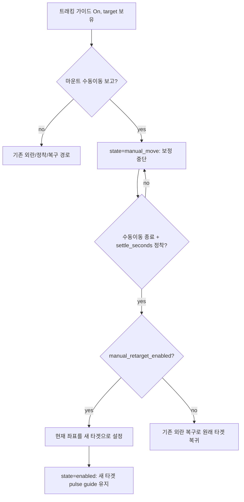

<a id="mf_indi_goto_guide_plan_ko--onoff-게이트"></a>
#### On/Off 게이트

- `indi_tracking_guide_manual_retarget_enabled` On(기본) → 수동이동 종료·정착 후
  현재 좌표를 새 타겟으로 채택.
- Off → 수동이동도 물리적 외란처럼 취급해 원래 타겟으로 복귀(기존 disturbance
  recovery).
- 재타겟은 마운트를 슬루하지 않는다(현재 위치를 sync만 하고 그 자리를 pulse guide로
  유지). Stop/Abort는 이 상태에서도 최우선.

<a id="mf_indi_goto_guide_plan_ko--신규-상태-필드-1"></a>
#### 신규 상태 필드

```text
tracking_guide_state              manual_move 값 추가
tracking_guide_manual_retarget    (신규) 마지막 재타겟 발생 여부/시각 표시용
```

<a id="mf_indi_goto_guide_plan_ko--체크리스트-1"></a>
#### 체크리스트

- 마운트 수동이동 중에는 `tracking_guide_state = manual_move`로 보정을 보내지 않는다.
- 수동이동 종료 후 `settle_seconds` 정착 전에는 재타겟하지 않는다.
- 재타겟은 게이트 On일 때만; 마운트 슬루/GoTo 없이 현재 좌표를 타겟으로 채택한다.
- 게이트 Off면 수동이동도 기존 외란 복구로 원래 타겟에 복귀한다.
- 물리적 손밀기(`disturbed`)는 재타겟 대상이 아니며 기존 복구 경로를 유지한다.
- 재타겟 이후 tracking guide target이 새 좌표로 갱신된다.

<a id="mf_indi_goto_guide_plan_ko--기존-설정과의-관계"></a>
### 기존 설정과의 관계

2026-07-19 개편으로 다음과 같이 정리되었다.

- `indi_goto_refine_accuracy_arcmin`은 `Goto/Guide` 공통 accuracy 설정으로
  이동했다(웹 UI 입력도 GoTo / Guide Settings에 있다).
- `indi_goto_refine_once`는 GoTo/Guide 서비스의 PiFinder GoTo와 중복이라
  제거되었다.
- `skysafari_indi_goto`는 `indi_goto_method`(GoTo Type)의 `off` 값으로
  통합되어 제거되었고, `skysafari_indi_sync`(기본 켜짐)만 SkySafari protocol
  정책으로 남았다.

<a id="mf_indi_goto_guide_plan_ko--단계별-구현-계획과-체크리스트"></a>
### 단계별 구현 계획과 체크리스트

각 단계는 커밋 가능한 단위로 나눈다. 가능한 경우 각 단계 완료 후 서버에 push해
디버깅 기준점을 남긴다.

<a id="mf_indi_goto_guide_plan_ko--stage-0-문서와-기준선"></a>
#### Stage 0: 문서와 기준선

목표:

- 본 문서 확정.
- 기존 동작을 바꾸지 않는 기준선을 기록.

체크리스트:

- `git status`에서 작업 대상이 명확한가.
- 기존 `mountcontrol_indi.goto_target()` 경로를 변경하지 않았는가.
- 기존 SkySafari GoTo forwarding 의미를 유지하고 있는가.
- 문서만 커밋/푸시되어 소스 변경과 분리되어 있는가.

<a id="mf_indi_goto_guide_plan_ko--stage-1-별도-서비스-골격"></a>
#### Stage 1: 별도 서비스 골격

목표:

- `indi_goto_guide_service.py`를 추가한다.
- `main.py`에서 별도 process와 `goto_guide_queue`를 생성한다.
- 서비스는 아직 mount를 움직이지 않고 status heartbeat만 기록한다.

체크리스트:

- `mount_control = false`이면 새 서비스도 시작하지 않는가.
- `mount_control = true`이면 MountControl과 새 서비스가 모두 시작되는가.
- `indi_goto_guide_status.json`이 주기적으로 갱신되는가.
- 기존 `mount_control_status.json` 형식이 바뀌지 않았는가.
- 기존 SkySafari 위치 조회가 계속 동작하는가.

<a id="mf_indi_goto_guide_plan_ko--stage-2-설정-ui와-config"></a>
#### Stage 2: 설정 UI와 config

목표:

- Web `/indi` 하단에 `GoTo / Guide Settings`를 추가한다.
- LCD `Start > INDI > Setting > Goto/Guide`를 추가한다.
- 설정은 저장만 하고, 아직 동작은 기존 경로를 유지한다.

체크리스트:

- `indi_goto_method` 기본값이 `mfnavis`인가.
- `indi_tracking_guide_enabled` 기본값이 `true`인가(2026-07-19에 변경).
- Web에서 설정 변경 후 재로딩해도 값이 유지되는가.
- LCD에서 설정 변경 후 재시작해도 값이 유지되는가.
- Red Night 테마에서 새 UI가 흰색 계열을 사용하지 않는가.

<a id="mf_indi_goto_guide_plan_ko--stage-3-요청-라우팅"></a>
#### Stage 3: 요청 라우팅

목표:

- SkySafari/Web/LCD target 요청을 새 서비스 큐로 보낼 수 있게 한다.
- `GoTo Type = INDI Mount`이면 새 서비스가 기존 mountcontrol `goto_target`
  명령을 그대로 전달한다.

체크리스트:

- `indi_goto_method = off`이면 SkySafari GoTo가 mount로 전달되지 않는가.
- `indi_goto_method = indi_mount`이면 기존과 같은 GoTo가 수행되는가.
- Object Details / LCD / Web에서 기존 GoTo 동작이 깨지지 않는가.
- Stop/Abort가 새 서비스 경유 후에도 즉시 mountcontrol로 전달되는가.

<a id="mf_indi_goto_guide_plan_ko--stage-4-pointingcoordinateservice-입력-연결"></a>
#### Stage 4: PointingCoordinateService 입력 연결

목표:

- 새 서비스가 `PointingCoordinateService` 현재 좌표를 읽는다.
- 좌표가 unavailable일 때 안전하게 대기/실패 처리한다.

체크리스트:

- solve 좌표가 있을 때 source/quality/status가 상태 파일에 표시되는가.
- solve가 없고 IMU fallback만 있을 때도 현재 좌표가 표시되는가.
- mount가 Park 상태이면 mount 좌표를 PiFinder GoTo 기준으로 사용하지 않는가.
- 좌표가 unavailable이면 mount 명령을 보내지 않는가.

<a id="mf_indi_goto_guide_plan_ko--stage-5-pifinder-goto-1차-상태-머신"></a>
#### Stage 5: PiFinder GoTo 1차 상태 머신

목표:

- PiFinder GoTo 상태 머신을 추가한다.
- 1차 구현은 실제 자동 접근을 최소화하고, target/current/error 계산과 Stop 처리부터
  검증한다.

체크리스트:

- target 수신 후 `phase = planning`이 기록되는가.
- 현재 좌표와 target 오차가 계산되는가.
- Park/location/time invalid 조건에서 시작하지 않는가.
- Stop/Abort가 어느 phase에서도 `idle/stopped`로 전환되는가.
- 아직 의도하지 않은 manual movement가 발생하지 않는가.

<a id="mf_indi_goto_guide_plan_ko--stage-6-pifinder-sync--goto-반복-접근"></a>
#### Stage 6: PiFinder sync + GoTo 반복 접근

목표:

- 시작 sync 후 target으로 INDI GoTo하고, 완료 후 오차가 근처 도달 범위(기본 1도)
  이상이면 sync + GoTo를 제한 횟수만큼 반복한다.
- 반복 상한과 stop을 명확히 관리한다.

체크리스트:

- 시작 시 현재 PiFinder 좌표로 mount sync가 한 번 수행되는가.
- 초기 GoTo가 기존 `goto_target()` primitive를 사용하는가.
- GoTo 완료 후 오차가 1도 이상이면 sync + GoTo가 다시 수행되는가.
- sync + GoTo 반복 횟수가 `indi_pifinder_goto_max_gotos`(기본 10)로 제한되는가.
- 오차가 줄지 않으면(개선 없음 가드) 상한 도달 전이라도 error 상태로 멈추는가.
- 오차가 1도 미만이 되면 반복을 멈추고 pulse guide 단계로 넘어가는가.
- 사용자가 Stop을 누르면 즉시 mount stop/abort가 mountcontrol로 전달되는가.

<a id="mf_indi_goto_guide_plan_ko--stage-7-pulse-guide-미세-정렬"></a>
#### Stage 7: pulse guide 미세 정렬

목표:

- 오차가 1도 미만이 된 뒤, pulse guide로 목표 정확도(0.05도 = 3분각) 미만까지
  미세 정렬한다.
- pulse guide 보정은 추적 가이드와 같은 보정 로직을 재사용한다.

체크리스트:

- 오차 < 1도에서 마운트 슬루(GoTo) 대신 pulse guide로 전환되는가.
- pulse guide 보정 방향/duration이 오차 방향과 크기에 맞게 계산되는가.
- 목표 정확도(0.05도) 미만이 되면 반복을 멈추는가.
- pulse guide 실패 시 fallback 여부가 status에 표시되는가.
- 미세 정렬 중 GoTo가 다시 끼어들지 않는가(1도 이내에서는 슬루 없음).

<a id="mf_indi_goto_guide_plan_ko--stage-8-final-sync와-완료"></a>
#### Stage 8: final sync와 완료

목표:

- 오차가 목표 정확도(0.05도) 미만이 되면 최종 target 좌표로 mount sync/alignment를
  한 번 수행하고 `complete`로 넘어간다.
- 각 GoTo 시작 시 per-GoTo 진행 플래그를 리셋해 최종 sync가 no-op이 되지 않게 한다.

체크리스트:

- 목표 정확도 진입 후 final sync가 한 번만 수행되는가.
- 각 GoTo 시작 시 `final_sync_sent` 등 진행 플래그가 리셋되어 상태기계가 `complete`에
  도달하는가.
- final sync 이후 tracking guide target이 최신 target으로 설정되는가.
- 전체 상태기계가 `complete`로 안정적으로 종료되는가.

<a id="mf_indi_goto_guide_plan_ko--stage-9-tracking-guide"></a>
#### Stage 9: Tracking Guide

목표:

- `indi_tracking_guide_enabled`가 켜진 경우 target 추적 보정을 수행한다.
- `PointingCoordinateService` 현재 좌표와 target 좌표의 오차를 기준으로 pulse guide
  또는 manual fallback을 보낸다.

체크리스트:

- target이 없으면 보정하지 않고 wait 상태로 남는가.
- 사용자가 manual movement 중이면 보정하지 않는가.
- mount가 GoTo/backlash/multi-align 중이면 보정하지 않는가.
- pulse guide 실패 시 fallback 여부가 status에 표시되는가.
- Off로 전환하면 진행 중 보정이 중지되는가.

<a id="mf_indi_goto_guide_plan_ko--stage-10-통합-테스트"></a>
#### Stage 10: 통합 테스트

목표:

- 기존 동작과 새 동작을 비교한다.
- 실제 장비 테스트 전에 안전 조건을 모두 확인한다.

체크리스트:

- `indi_goto_method = indi_mount`에서 기존 SkySafari GoTo가 동일하게 동작하는가.
- `indi_goto_method = mfnavis`에서 target/current/error/status가 안정적으로 표시되는가.
- Stop/Abort가 모든 단계에서 최우선인가.
- 서비스 재시작 후 status가 꼬이지 않는가.
- INDI mount disconnect/reconnect 상황에서 새 서비스가 안전하게 대기하는가.


---

<a id="mf_indi_mount_install_ko"></a>

## mf_indi_mount_install_ko.md

<a id="mf_indi_mount_install_ko--mfnavis-indi-마운트-제어"></a>
## MFNavis INDI 마운트 제어

이 문서는 Raspberry Pi 4/Pi 5/CM5 Trixie 64-bit 설치 환경에서 사용할 수 있는 선택형 INDI 마운트 제어 작업을 설명합니다.

이 기능은 기본값이 꺼짐입니다. `mount_control` 설정을 켜기 전까지 일반 MFNavis 설치에서는 PyIndi를 import하지 않고 INDI 마운트 제어 프로세스도 시작하지 않습니다.

Raspberry Pi 5에서 Trixie/Python 3.13 설치와 OnStepX 동작을 점검했고,
사용자는 2026-09-27 GoTo 실테스트에서 큰 문제를 발견하지 못했다고 보고했습니다.
이전 Pi 4 검증은 Bookworm 환경이므로 Pi 4·CM5의 Trixie 실기 검증과 구분합니다.
현재 기본 구성은 [Trixie 설치 안내](setup.md#mf_trixie_install_ko)를 참고하세요.

<a id="mf_indi_mount_install_ko--현재-범위"></a>
### 현재 범위

INDI 마운트 제어는 실험 기능입니다. 먼저 INDI Telescope Simulator로 테스트하고, 실제 마운트는 실내의 안전한 상태에서 충분히 확인한 뒤 야외에서 사용하세요.

현재 지원 범위는 다음과 같습니다.

- PyIndi를 통한 INDI 서버 연결
- telescope/mount 장치 자동 감지
- MFNavis의 위치와 UTC 시간 동기화
- MFNavis plate-solve RA/Dec 기준 마운트 Sync
- Object Details 화면에 표시된 대상 GoTo
- Stop 명령
- 작은 RA/Dec 오프셋 기반 수동 이동

GoTo 미세보정·추적 가이드는 [GoTo/Guide 흐름](mount.md#mf_indi_goto_guide_plan_ko)과
[다중 정렬 안내](mount.md#mf_multipoint_align_flow_ko)를 참고하세요. 현재 GoTo 흐름은
솔빙 실패 시 IMU 정렬 또는 이미 정렬된 마운트로 전환해 native GoTo·추적을
이어가고, fresh solve가 복구되면 미세보정을 재개할 수 있습니다.
Sync 거절은 정렬 성공으로 처리하지 않고 실패 사유를 표시합니다.

OnStepX 프로필이 연결된 상태에서 `INDI > Settings`로 지평선·천정 고도와
East/West 메리디안 제한을 조회·변경할 수 있습니다. 경위대의 메리디안 표시는
INDI 드라이버 값이며 컨트롤러 독립 재조회 값과 구분합니다. 검증 범위는
[제한값 설정 기록](../../mf_report/mfnavis_trixie_indi_limits_20260927_ko.md)을 참고하세요.

<a id="mf_indi_mount_install_ko--indi-지원-설치"></a>
### INDI 지원 설치

기본 설치 방식은 **OS별 aarch64 바이너리 아카이브**입니다. MFNavis 배포본에
포함된 Trixie 64-bit/aarch64 아카이브를 설치하면 검증된 INDI core, third-party
드라이버, PyIndi와 MFNavis의 OnStepX 패치 구성이 그대로 설치됩니다. 소스 수정이나
드라이버 패치 변경이 필요할 때만 아래의 전체 소스 설치·빌드 방식을 사용하세요.

아카이브는 OS별로 구분합니다. **Bookworm/aarch64/Python 3.11**은 기존 v1
아카이브를, **Trixie/aarch64/Python 3.13**은 v2 아카이브를 사용합니다. 설치 전에
아카이브의 OS와 Python ABI가 장치에 맞는지 검사합니다. Bookworm 아카이브의
이름이나 apt 패키지 이름을 바꾸는 것만으로 Trixie에서 사용할 수는 없습니다.

Trixie 아카이브에는 네이티브 바이너리, 실제 ELF 의존성에서 수집한 apt 패키지
목록, 버전이 고정된 Python wheel과 설치 도구를 포함합니다. Python 패키지는
네트워크 없이 가상환경에 설치하며, 네이티브 런타임 패키지는 Trixie apt를
사용합니다. 시스템 Python에 `--break-system-packages`로 설치하지 않습니다.

```bash
cd ~/MFNavis
bash scripts/install_indi_mount_archive.sh \
  dist/mfnavis-indi-trixie-arm64-v2.2.3.1-current.tar.gz --verify-only
MFNAVIS_PYTHON="$PWD/.venv-trixie/bin/python" \
  bash scripts/install_indi_mount_archive.sh \
  dist/mfnavis-indi-trixie-arm64-v2.2.3.1-current.tar.gz
```

`MFNAVIS_PYTHON`에는 MFNavis가 사용하는 가상환경의 Python을 지정합니다.
미지정 시 `.venv-trixie`가 있으면 사용하고, 없으면 `.venv-indi`를 생성합니다.
별도의 `.venv-indi`는 MFNavis 서비스의 Python을 자동으로 바꾸지 않으므로,
MFNavis에서도 PyIndi를 사용하려면 앱의 가상환경을 명시해야 합니다.
구버전 체크아웃용 설치 도구는 아카이브의 `metadata/installer/`에 있습니다.

전체 `mfnavis_setup.sh` 설치에서는 현재 OS에 맞는 아카이브를 자동 선택합니다.

설치는 INDI와 지원 라이브러리 경로만 허용하고 기존 시스템 디렉터리의 권한·소유자와
`/lib`, `/bin`, `/sbin` 링크를 보존합니다. 손상된 usrmerge 링크를 시스템 폴더 삭제로
자동 복구하지 않습니다. 분할 파일 재조립·압축 해제와 파일·Python 환경 백업에
필요한 디스크 여유 공간을 검사하며, 부족하면 서비스 정지 전에 중단합니다.

파일 교체 전에 INDI 파일, 앱 가상환경, Web Manager·chrony 설정을 백업합니다.
일반 오류나 SIGINT/SIGTERM으로 실패하면 복원한 뒤 기존에 실행 중이던 서비스를
다시 시작합니다. 복원 자체가 실패하면 서비스를 정지한 상태로 백업을 보존하고
복구 명령을 출력합니다. apt로 설치한 OS 의존성은 이 복원 대상에 포함되지 않습니다.
전원 차단이나 SIGKILL은 자동 복원이 실행되지 않으므로 디스크의 설치 로그에 기록된
`/var/tmp/mfnavis-indi.*/rollback` 경로로 수동 복구해야 합니다.

설치 로그는 `~/MFNavis_data/logs/indi-install-*.log`에 남습니다.
`MFNAVIS_INSTALL_LOG`로 로그 파일 경로를 지정할 수 있습니다.
전체 setup은 `setup-*.log`도 남기고, journal을 최대 64 MiB의 영구 저장으로 설정합니다.
`/tmp/indiserver.log`는 RAM 로그이므로 재부팅을 넘겨 보존되지 않습니다.

<a id="mf_indi_mount_install_ko--수정용-전체-소스-설치빌드"></a>
#### 수정용: 전체 소스 설치·빌드

MFNavis 체크아웃에서 전용 설치 스크립트를 실행합니다.

```bash
cd ~/MFNavis
export MFNAVIS_PYTHON="$PWD/.venv-trixie/bin/python"
export INDI_WEB_EXEC="$PWD/.venv-trixie/bin/indi-web"
bash scripts/install_indi_mount_OnstepX.sh
```

앱 가상환경이 먼저 설치되어 있어야 합니다. 이 환경 변수는 소스 빌드와
Web Manager 서비스가 MFNavis와 같은 Python 3.13 환경을 사용하게 합니다.
아래 빌드 옵션 예제에도 같은 환경 변수를 유지합니다.

이 스크립트는 INDI, INDI third-party 드라이버, PyIndi, INDI Web Manager, Chrony GPS 시간 동기화 지원을 설치합니다. 바이너리 설치 단계에서는 실행 중인 `mfnavis`와 INDI Web Manager 서비스를 멈추고, 성공·실패와 관계없이 원래 실행 중이던 서비스를 다시 시작합니다.

INDI Web Manager는 현재 `FastAPI 0.103.2`, `Starlette 0.27.0`, `Uvicorn 0.23.2`, `AnyIO 3.7.1` 조합으로 고정되어 있습니다. 최신 Starlette 계열에서는 INDI Web Manager의 기존 템플릿 호출 방식과 맞지 않아 Web UI 루트 페이지가 `500 Internal Server Error`를 반환할 수 있습니다.

필요하면 환경 변수로 버전과 빌드 병렬 수를 바꿀 수 있습니다.

```bash
JOBS=4 bash scripts/install_indi_mount_OnstepX.sh
```

Pi 4에서는 메모리 여유를 위해 기본 `JOBS=2`를 권장합니다. Pi 5나 CM5에서는 냉각과 전원 상태가 안정적이면 `JOBS=3` 또는 `JOBS=4`로 빌드 시간을 줄일 수 있습니다. `INDI_VERSION` / `INDI_3RDPARTY_VERSION`도 같은 방식으로 바꿀 수 있습니다.

이 스크립트는 INDI `v2.2.3.1`을 `~/indi-latest` 아래에 받아 빌드하고, `scripts/patches/indi-v2.2.3.1-onstepx.patch`를 자동으로 적용합니다. 패치는 원본 `LX200 OnStep` 드라이버를 변경하지 않고 `LX200 OnStepX` 장치와 실행 링크를 추가합니다. OnStepX 패치에는 MFNavis Backlash 범위/readback 수정과 드라이버 호환성을 위한 writable `GUIDE_RATE` 처리도 포함됩니다.

`install_indi_mount_OnstepX.sh`는 Pi 5에서 빌드하더라도 Pi 4에서 실행될 수 있도록 `-march=native`, `-mcpu=*`, `-mtune=*`를 제거하고 `-march=armv8-a`를 사용합니다. 패치 적용을 끄고 순수 upstream INDI만 테스트하려면 다음처럼 실행할 수 있습니다.

```bash
INDI_PATCH_DIR=none bash scripts/install_indi_mount_OnstepX.sh
```

`INDI_PATCH_DIR=none`은 변경되지 않은 INDI 소스 체크아웃에서만 동작한다.
이전에 OnStepX 패치를 적용한 `~/indi-latest/indi`가 있다면 별도의 빈
`BUILD_ROOT`를 지정해 새 소스를 받아 시험한다. 설치 대상과 빌드 작업 수는
시스템 패키지를 변경하기 전에 검사한다.

<a id="mf_indi_mount_install_ko--기본-설치-trixie-aarch64-바이너리-아카이브"></a>
#### 기본 설치: Trixie aarch64 바이너리 아카이브

일반 설치에는 미리 만든 Trixie 64-bit/aarch64 아카이브를 사용합니다. 소스
수정이나 새 패치 검증이 필요한 경우에만 앞 절의 전체 소스 빌드로 전환합니다.

```bash
cd ~/MFNavis
bash scripts/install_indi_mount_archive.sh dist/mfnavis-indi-trixie-arm64-v2.2.3.1-current.tar.gz
```

Git 저장소에는 큰 아카이브가 `.tar.gz.part-00`, `.part-01` 같은 조각 파일로
저장될 수 있습니다. 이 경우에도 위 명령처럼 같은 `.tar.gz` 경로를 넘기면
`install_indi_mount_archive.sh`가 조각을 다시 합치고 `.sha256` checksum을
검증한 뒤 설치합니다.

전체 MFNavis 설치 스크립트인 `mfnavis_setup.sh`는 INDI를 기본으로 아카이브에서
설치합니다. 현재 OS에 맞는 `dist/mfnavis-indi-<OS>-arm64-*.tar.gz` 또는
`.tar.gz.part-00`을 찾아 최신 버전을 선택합니다. 분할 파일과 `.sha256`은
같은 디렉터리에 두어야 합니다. Bookworm/Python 3.11과 Trixie/Python 3.13을
지원하며, 소스 빌드를 자동으로 호출하지 않습니다.

Trixie 기반 `main` 브랜치를 다음과 같이 설치합니다.

```bash
wget -O /tmp/mfnavis-setup.sh https://raw.githubusercontent.com/hjoungjoo/MFNavis/main/mfnavis_setup.sh &&
MFNAVIS_INSTALL_BRANCH=main bash /tmp/mfnavis-setup.sh
```

기존 체크아웃에 수정된 tracked 파일이 있으면 설치 스크립트는 해당 변경을
덮어쓰지 않고 중단합니다. 기존 설치가 선택한 브랜치로 fast-forward 가능한지도
검사합니다. 자세한 변경·검증 범위는 [Trixie 배포 기록](setup.md#TRIXIE_20260926_ko)을
참조합니다.

다른 위치의 아카이브를 선택하려면 절대 경로로 지정합니다. Trixie 예:

```bash
cd ~
MFNAVIS_INDI_ARCHIVE="$HOME/MFNavis/dist/mfnavis-indi-trixie-arm64-v2.2.3.1-current.tar.gz" \
  bash "$HOME/MFNavis/mfnavis_setup.sh"
```

`MFNAVIS_INSTALL_INDI_ARCHIVE`는 기본값이 `true`입니다. 이전 설정의 `auto`도
이제 아카이브 설치를 필수로 수행합니다. 아카이브가 없거나 checksum·OS·Python
ABI가 맞지 않으면 앱 Python 패키지 설치와 GPS·네트워크 설정 전에 중단합니다.
Trixie 아카이브는 별도로 제공해야 하며, 설치 스크립트가 다운로드하거나
Bookworm 아카이브로 대신 설치하지 않습니다.

Trixie에서는 `requirements-trixie.txt`로 `.venv-trixie`를 구성하고, 같은 Python에
아카이브의 PyIndi와 INDI Web Manager wheel을 설치합니다. MFNavis, splash,
INDI Web Manager 서비스도 이 환경을 사용합니다. `MFNAVIS_PYTHON`을 지정할 때는
Python 3.13 가상환경을 사용하고 Picamera2 등 OS 패키지 접근을 위해
`--system-site-packages`로 생성합니다. Bookworm은 기존 시스템 Python 설치를
유지합니다.

INDI를 사용하지 않는 별도 설치에서만 명시적으로 끌 수 있습니다.

```bash
MFNAVIS_INSTALL_INDI_ARCHIVE=false bash "$HOME/MFNavis/mfnavis_setup.sh"
```

새 바이너리 아카이브를 만들 때는 다음 스크립트를 사용합니다.

```bash
cd ~/MFNavis
bash scripts/package_indi_mount_archive.sh
```

Trixie에서는 기본적으로 `.venv-trixie/bin/python`의 설치된 INDI 구성과
`~/indi-latest`의 네이티브 설치 manifest를 사용합니다. 다른 가상환경을
사용하면 `MFNAVIS_PYTHON`으로 지정합니다. Python 패키징 도구 `wheel`과
`packaging`이 필요합니다. 패키징 시 PyIndi와 커스텀 INDI Web Manager는
설치된 파일·wheel metadata·라이선스를 모아 wheel로 다시 포장하고, 나머지
Python 의존성은 현재 설치된 정확한 버전으로 wheel을 수집합니다.

`package_indi_mount_archive.sh`는 전체 `.tar.gz`와 `.sha256`을 만들고,
아카이브가 GitHub에 올리기 좋은 크기 제한을 넘으면 `.tar.gz.part-*`
조각 파일도 자동으로 생성합니다. 소스와 함께 배포할 때는 이 조각 파일들을
커밋하면 됩니다.

최신 소스 빌드 스크립트로 만든 뒤 아카이브를 생성하면 패치된 `LX200 OnStepX`가 포함된 설치 결과를 아카이브와 같은 OS·Python ABI를 사용하는 aarch64 장비에 배포할 수 있습니다. 아카이브 metadata에는 OnStepX patch 이름과 checksum이 기록되어 설치된 바이너리가 어떤 patch에서 만들어졌는지 추적할 수 있습니다.

2026-10-03에 갱신한 Trixie `v2.2.3.1-current` 아카이브에는 수동 이동이
약 7초 뒤 멈추는 문제의 수정이 포함됩니다. MFNavis가 활성 방향을 주기적으로
재전송하면 OnStepX 드라이버가 같은 방향의 요청도 펌웨어로 전달해 이동 타이머를
갱신합니다. 입력이 끊기거나 정지 요청이 들어오면 기존 정지 처리를 유지합니다.
MFNavis의 `manual_motion_keepalive` 수정과 함께 사용해야 합니다.

이 아카이브는 기존 Trixie 패키지에서 `indi_lx200generic`만 다시 빌드해 교체했고,
`indi_lx200_OnStepX`를 비롯한 alias와 다른 네이티브 파일·Python wheel은 유지합니다.
`metadata/build_info.txt`에는 원본 아카이브·새 바이너리·patch의 SHA256이,
`metadata/manual-motion-build/`에는 빌드 방법과 회귀 검사 결과가 들어 있습니다.
Bookworm 아카이브는 이번 Trixie 갱신 대상에 포함되지 않습니다.

이미 설치된 Trixie 장비에 적용하려면 다음 명령을 일반 사용자로 실행합니다.
시스템 파일을 교체할 때 sudo 인증이 필요합니다. 전체 `.tar.gz`가 없어도
함께 배포된 `.part-*`와 `.sha256`으로 설치할 수 있습니다.

```bash
cd ~/MFNavis
bash scripts/install_indi_mount_archive.sh \
  dist/mfnavis-indi-trixie-arm64-v2.2.3.1-current.tar.gz
```

<a id="mf_indi_mount_install_ko--마운트-드라이버-설정"></a>
### 마운트 드라이버 설정

INDI Web Manager를 엽니다.

```text
http://<hostname>.local:8624
```

mDNS 이름이 동작하지 않으면 MFNavis IP 주소를 사용합니다.

```text
http://<pifinder-ip>:8624
```

Profile을 만들고 사용하는 마운트에 맞는 telescope driver를 선택합니다. 필요하면 Auto Start와 Auto Connect를 켠 뒤 profile을 시작합니다. 흔한 드라이버는 EQMod, LX200, iOptron, Celestron, Telescope Simulator입니다.

활성 INDI profile이 `LX200 OnStepX`를 사용할 때는 MFNavis 웹 UI의 다음 영역에서 연결 방식을 설정할 수 있습니다.

```text
INDI > LX200 OnStepX Driver Connection
```

USB 연결은 감지된 `/dev/serial/by-id`, `/dev/serial/by-path`, `/dev/ttyUSB*`, `/dev/ttyACM*`
목록에서 선택하거나 수동으로 포트 이름을 입력하고, Communication Speed에서
`9600`/`19200`/`38400`/`57600`/`115200`/`230400`/`460800` baud를
선택합니다.
같은 실제 장치를 가리키는 by-id와 ttyUSB/ttyACM alias는 목록에서 한 항목으로
합치며, 가능한 경우 재삽입에도 안정적인 `/dev/serial/by-id/...`를 표시합니다.
Serial Port에서 `Auto (Find connected OnStep)`를 선택하면 Communication Speed도
Auto로 전환됩니다. Apply 시에만 현재 local serial 후보를 configured GPS와
중복 제거한 뒤, 읽기 전용 `:GVP#`/`:GVN#` 응답을 지원 baud별로 확인합니다.
검증된 OnStep이 정확히 하나일 때만 concrete stable port와 실제 baud를 적용하며,
후보가 없거나 둘 이상이면 기존 연결을 원복하고 설정을 저장하지 않습니다.
적용 시 드라이버를 먼저 disconnect하고 `DEVICE_PORT`와 INDI 표준
`DEVICE_BAUD_RATE`를 함께 쓴 다음 reconnect·readback 검증·`CONFIG_SAVE`를
수행합니다. 속도 선택은 USB Serial일 때만 적용되며 기본값은 9600 baud입니다.
네트워크 연결은 AP에 접속된 장치 목록에서 IP를 선택하거나, 목록에 없으면
IP/host와 TCP port를 수동으로 입력합니다. OnStep 네트워크 연결의 기본 TCP
port는 `9999`입니다.

OnStep transport의 운용 기준은 INDI live property, INDI가 저장한 XML,
MFNavis mirror 순입니다. 시작 시 live/XML이 유효하면 MFNavis mirror만 해당
값으로 맞추며 정상 driver 설정을 되돌리거나 재적용하지 않습니다. live/XML이
모두 불완전할 때만 마지막으로 검증된 MFNavis mirror를 한 번 적용하고 live
readback을 확인합니다. 모두 불완전하면 잘못된 기본값으로 접속하지 않고
`config_invalid` 상태로 자동 접속을 중지합니다.

Web에서 저장할 때는 INDI reconnect와 live readback, `CONFIG_SAVE`까지 성공해야
MFNavis의 transport/server 설정이 한 번의 atomic write로 갱신됩니다. 실패하면
기존 mirror를 유지합니다. reconciliation 상태는 tmpfs의
`mount_control_status.json`에 기록됩니다.

<a id="mf_indi_mount_install_ko--mfnavis-indi-웹-메뉴"></a>
### MFNavis INDI 웹 메뉴

MFNavis 웹 UI 상단 메뉴에는 `INDI` 항목이 별도로 표시됩니다. 이 페이지에서 INDI Web Manager로 바로 이동하고, 실행 중인 INDI profile에서 active driver 이름을 읽습니다. OnStepX 전용 설정과 제어 영역은 active driver가 `LX200 OnStepX`일 때만 표시됩니다.

<a id="mf_indi_mount_install_ko--current-indi-driver-state"></a>
#### Current INDI Driver State

활성 INDI profile, active driver, 사용 가능한 driver 속성을 표시합니다. OnStepX의 연결 방식, serial/network 설정, OnStep 위치, OnStep UTC 시간은 INDI profile이 시작되고 `LX200 OnStepX` 드라이버가 로드된 뒤에 표시됩니다.

<a id="mf_indi_mount_install_ko--location-and-time"></a>
#### Location and Time

`Location and Time` 영역은 `LX200 OnStepX`에서 표시되며 MFNavis의 현재 위치와 UTC 시간을 OnStep에 전송합니다.

- 위치는 GPS lock이 있으면 GPS/loaded location 값을 사용합니다.
- GPS lock이 없으면 `GPS Lock: Not locked`로 표시하고, MFNavis `Locations`의 기본 위치를 `Location to Send`로 사용합니다.
- UTC 시간 입력칸은 화면을 열어 둔 동안 초 단위로 계속 갱신됩니다.
- `Reload Current Values`는 MFNavis 위치/시간과 OnStep의 현재 위치/시간 표시를 다시 읽습니다.
- `Send Location and Time`을 누르면 서버가 요청을 받은 바로 그 시점의 MFNavis system UTC를 다시 계산해서 OnStep에 전송합니다. 따라서 브라우저나 휴대폰 시간이 틀려 있어도 최종 전송 시간은 MFNavis 기준입니다.
- Web 요청은 driver가 느리거나 사용할 수 없는 경우에도 페이지가 멈추지 않도록 제한된 background sync로 시작합니다. 완료되면 상태 영역을 자동으로 새로 고치고, 결과와 driver readback 값을 표시합니다.
- GPS가 새로 lock한 위치는 자동 적용합니다. 이후 GPS 변화는 jitter로 인한 mount 갱신을 막기 위해 500 m 초과이고 1분에 한 번 이하일 때만 적용합니다. `Locations`에서 위치를 Load하거나 기본 위치로 지정하는 것은 명시적 선택이므로 선택한 좌표를 즉시 적용합니다.
- LX200 OnStepX 드라이버는 MFNavis용 커스텀 INDI 드라이버입니다. 위치/시간 동기화는 INDI `GEOGRAPHIC_COORD`/`TIME_UTC` 전체 벡터를 통해 처리하며, 드라이버 내부에서 OnStep LX200 명령으로 변환합니다.
- `indi_setprop` CLI로 일부 element만 쓰는 방식은 피합니다. MFNavis는 PyIndi 전체 벡터 전송을 사용합니다.
- 한국 시간대처럼 UTC+9인 환경에서 INDI `TIME_UTC.OFFSET`은 `+9.00`으로 전송되고, 드라이버가 OnStep의 `:SG-09:00#` convention으로 변환합니다.

<a id="mf_indi_mount_install_ko--mount-control"></a>
#### Mount Control

`Mount Control` 영역은 `LX200 OnStepX`에서 표시되며 간단한 초기화/주차/수동 이동 기능을 제공합니다.

- Home 상태와 Park 상태를 분리해서 표시합니다. OnStep은 `At Home`이면서도
  `Unparked`일 수 있습니다. OnStep Web UI는 `At Home`과 `Parked` 모두에서
  Park 버튼을 비활성화하므로, MFNavis는 디버깅을 위해 원시 `:GU#` 마운트
  상태도 함께 표시합니다.
- `At Home`, `Return Home`, `Park`, `Unpark`, `Set-Park` 명령을 보낼 수 있습니다.
- Slew Rate는 OnStep의 0-9 단계를 그대로 사용합니다: `Off`, `1/2`, `1`, `2`, `4`, `8`, `20`, `48`, `1/2 MAX`, `MAX`.
- 방향 버튼은 누르고 있는 동안 이동하고, 손을 떼면 정지 명령을 보냅니다.
- 대각선 버튼은 North/South와 East/West 명령을 함께 보냅니다.

이 웹 제어는 INDI 드라이버에 직접 명령을 보내는 보조 UI입니다. Object Details 화면의 숫자 키 기반 Sync/GoTo 기능과 함께 사용할 수 있습니다.

<a id="mf_indi_mount_install_ko--onstepx-설정"></a>
#### OnStepX 설정

`Settings > INDI Setting` 메뉴에는 OnStepX 유지보수 제어가 포함됩니다.
(이전에는 `Start > INDI > Setting`에 있었으나, 이제 다른 설정 메뉴와 함께
`Settings` 아래에 위치합니다.)

- `Multi Align`은 Web/LCD/SkySafari가 같은 공통 session controller를
  사용합니다. 시작 시 MFNavis 위치/시간을 mount에 전송하고, MFNavis가
  현재 보고 있다고 판단하는 좌표로 mount를 sync한 뒤 readback을 검증합니다.
  OnStepX native `:A<n>#` 시작은 home/frame reset 부작용 때문에 즉시 호출하지
  않고 지연하며, stale native align 상태가 남아 있으면 `:SX09,0#` 직접 명령으로
  정리한 뒤 진행합니다. 자세한 흐름은
  `docs/mf_dev/mf_multipoint_align_flow_ko.md`를 참고하세요.
- `Backlash`는 INDI driver의 `Backlash.Backlash RA`,
  `Backlash.Backlash DEC` 속성을 읽고 씁니다. 이 값은 OnStep의 RA/Azm,
  Dec/Alt 백래시 arc-second 값에 대응합니다.
- Alt/Az 모드 UI에서는 OnStep 축 이름에 맞춰 첫 번째 값
  `Backlash.Backlash RA`를 `AZ`(Axis1 RA/Azm), 두 번째 값
  `Backlash.Backlash DEC`를 `ALT`(Axis2 Dec/Alt)로 표시합니다. EQ 모드에서는
  기존처럼 `RA` / `DEC`로 표시합니다.
- 수동 `Save Backlash` 동작은 설정값만 갱신하고 마운트 이동 명령을 보내지
  않으므로 실내에서도 안전하게 테스트할 수 있습니다.
- `Auto Backlash`는 현재 내부 이름은 `compass_goto_loop`로 유지하지만,
  실제 측정 이동은 INDI GoTo로 수행합니다. 계산, 필터, 추천값 산출 방식은
  유지하고, Alt/Az 마운트에서는 `AZ`와 `ALT`, EQ 마운트에서는 `RA`와 `DEC`를
  한 축씩 따로 움직입니다. 자세한 순서도와 계산식은
  `docs/mf_dev/mf_backlash_measurement_flow_ko.md`를 참고하세요.
- 자동 Backlash 테스트는 테스트 전 `TELESCOPE_TRACK_STATE.TRACK_OFF`로
  tracking을 끄고, 정상 완료 시 원래 tracking이 켜져 있었다면 다시 복구합니다.
  Tracking이 켜진 상태에서는 sidereal motion이 IMU 변화로 섞여 백래시로
  오판될 수 있습니다.
- 자동 Backlash 테스트는 더 이상 IMU 지자계를 확인하지 않습니다. 대신
  `PointingCoordinateService.solved`의 plate-solved 좌표가 유효해야 합니다.
  fresh solved 좌표가 없으면 mount 이동 명령을 보내기 전에 대기/실패합니다.
- 측정값이 `3600 arc-sec` 상한에 도달하면 UI는 낮은 신뢰도 경고를 표시합니다.
  이 경우 실제 백래시가 설정 범위를 넘었거나 solved 좌표가 stale이거나 잘못된
  시점에 저장되었을 수 있으므로 바로 저장하지 말고 반복 데이터와 장비 기계
  상태를 확인합니다.
- 현재 자동 측정은 Backlash 값을 0으로 초기화하거나 자동 적용하지 않습니다.
  측정 결과는 추천값으로만 표시되며, 사용자가 입력값을 확인한 뒤
  `Save Backlash`로 저장합니다. 테스트 완료 시 원래 tracking 상태가 켜져
  있었다면 다시 복구합니다.

<a id="mf_indi_mount_install_ko--mfnavis-제어-켜기"></a>
### MFNavis 제어 켜기

MFNavis UI에서 다음 메뉴로 이동합니다.

```text
Tools > Experimental > Mount Control > On
```

이 값을 변경하면 선택형 `MountControl` 프로세스를 깨끗하게 시작하거나 종료하기 위해 MFNavis가 재시작됩니다.

Mount Control 프로세스는 켜져 있어도 시작 직후 INDI에 바로 연결하지 않습니다. Object Details 화면에서 `1`, Sync, GoTo 같은 마운트 명령을 실행할 때 INDI 연결을 초기화합니다.

고급 설정 키는 `default_config.json`에 있습니다.

```json
"mount_control": false,
"mount_control_indi_host": "localhost",
"mount_control_indi_port": 7624,
"onstep_connection_type": "network",
"onstep_serial_port": "",
"onstep_serial_baud": 9600,
"onstep_network_host": "",
"onstep_network_port": 9999
```

<a id="mf_indi_mount_install_ko--object-details-숫자-키-맵"></a>
### Object Details 숫자 키 맵

Mount Control이 켜져 있으면 Object Details 화면의 숫자 키가 마운트 명령을 보냅니다.

| 키 | 동작 |
| --- | --- |
| 0 | 마운트 정지 |
| 1 | INDI 연결 초기화, MFNavis solve가 있으면 Sync |
| 2 | 현재 step 크기만큼 South 이동 |
| 3 | step 크기 줄이기 |
| 4 | 현재 step 크기만큼 West 이동 |
| 5 | 현재 표시 중인 대상 GoTo |
| 6 | 현재 step 크기만큼 East 이동 |
| 7 | 현재 MFNavis solve 위치로 마운트 Sync |
| 8 | 현재 step 크기만큼 North 이동 |
| 9 | step 크기 키우기 |

수동 이동은 현재 마운트 RA/Dec 좌표에서 작은 GoTo 오프셋을 보내는 방식입니다. 기본 step은 1도이고, `3`은 절반으로 줄이며 `9`는 두 배로 키웁니다.

<a id="mf_indi_mount_install_ko--로그와-상태-확인"></a>
### 로그와 상태 확인

MFNavis 로그에는 `MountControl.Indi` 이름으로 마운트 제어 로그가 남습니다.

상태 파일은 다음 위치에 기록됩니다.

```text
~/MFNavis_data/mount_control_status.json
```

확인에 유용한 명령은 다음과 같습니다.

```bash
systemctl status indiwebmanager.service
systemctl status mfnavis.service
journalctl -u indiwebmanager.service -n 100
tail -n 100 ~/MFNavis_data/pifinder.log
```

<a id="mf_indi_mount_install_ko--안전-테스트-순서"></a>
### 안전 테스트 순서

1. INDI 지원을 설치합니다.
2. INDI Web Manager에서 Telescope Simulator를 시작합니다.
3. MFNavis Mount Control을 켭니다.
4. 아무 대상의 Object Details 화면을 엽니다.
5. `1`을 눌러 초기화합니다.
6. MFNavis solve가 잡힌 뒤 `7`을 눌러 Sync합니다.
7. `5`를 눌러 GoTo를 보냅니다.
8. `0`으로 Stop 동작을 확인합니다.

시뮬레이터 동작을 이해한 뒤 실제 마운트 테스트로 넘어가세요.


---

<a id="mf_moon_safe_goto_handoff_design_ko"></a>

## mf_moon_safe_goto_handoff_design_ko.md

<a id="mf_moon_safe_goto_handoff_design_ko--달-근접-goto-안전-핸드오프-설계"></a>
## 달 근접 GoTo 안전 핸드오프 설계

> 상태: 구현 전 설계안
> 범위: INDI GoTo가 켜진 PiFinder, 달 자체 및 달 근처의 모든 GoTo 대상
> 목적: 달빛 때문에 plate solve가 멈추거나 오인식되어도 IMU 추정 좌표를 근거로 mount sync/GoTo가 반복되지 않게 한다.

<a id="mf_moon_safe_goto_handoff_design_ko--1-결론"></a>
### 1. 결론

가장 안전한 방식은 이동 중 전역 `indi_goto_method`를 `pifinder`에서 `indi_mount`로 바꾸는 것이 아니다. 설정은 2초 주기로 reload되고, 기존 GoTo/guide loop와 겹칠 수 있다.

대신 `indi_goto_guide_service` 안에 **계획(plan) 단위의 moon-safe direct handoff**를 둔다. 이 기능은 테스트 기간에도 웹 INDI 페이지에서 즉시 On/Off할 수 있으며, 새 설치와 기존 설정에 키가 없는 경우의 기본값은 **On**이다.

1. 대상과 달의 각거리를, 해당 요청의 좌표 frame에서 계산한다.
2. 충분히 떨어져 solve 가능한 stage 지점까지는 기존 PiFinder solve 보정 GoTo를 사용한다.
3. stage에서 신선한 high-quality solve를 얻은 경우에만 한 번 sync한다.
4. 그 뒤 최종 대상(달 또는 달 근처 모든 천체)으로는 INDI `SLEW` GoTo만 수행한다.
5. direct 구간에서는 자동 sync, PiFinder refine, tracking guide pulse, recovery GoTo를 모두 금지한다.

stage를 만들 수 없거나 solve가 timeout이면 **실패 폐쇄(fail closed)** 한다. 즉 IMU/current fallback으로 sync 또는 recovery GoTo를 하지 않는다. 이 판단이 현 문제를 해결하는 핵심이다.

<a id="mf_moon_safe_goto_handoff_design_ko--2-현행-소스-분석"></a>
### 2. 현행 소스 분석

<a id="mf_moon_safe_goto_handoff_design_ko--21-요청-진입점"></a>
#### 2.1 요청 진입점

| 진입점 | 현재 좌표/명령 | tracking rate |
| --- | --- | --- |
| LCD `ui/base.py` 숫자 5 | `goto_target` 뒤 `track_freq_command_for_target` | Planet은 ephemeris rate, 정적 대상은 sidereal |
| 웹 catalog `web_catalogs.py` | `_queue_mount_goto()`가 `goto_target` queue 적재 | `/push_planet/moon`은 Moon rate 적용 |
| SkySafari `pos_server.py` | EOD 좌표로 `goto_target` queue 적재 | 좌표가 planet과 일치하면 해당 rate |
| multi-point web 이동 | 별도 multi-point queue | v1 범위 밖 |

`main.py`는 `mount_control=true`일 때 `mountcontrol_queue`, `goto_guide_queue`, `IndiGotoGuideService`를 만들고 구동한다. 현재 test 장비처럼 mount USB가 없어도 service 로직 검증은 가능하지만, 실제 INDI SLEW 검증은 mount가 연결된 환경이 필요하다.

<a id="mf_moon_safe_goto_handoff_design_ko--22-현재-pifinder-goto-흐름"></a>
#### 2.2 현재 PiFinder GoTo 흐름

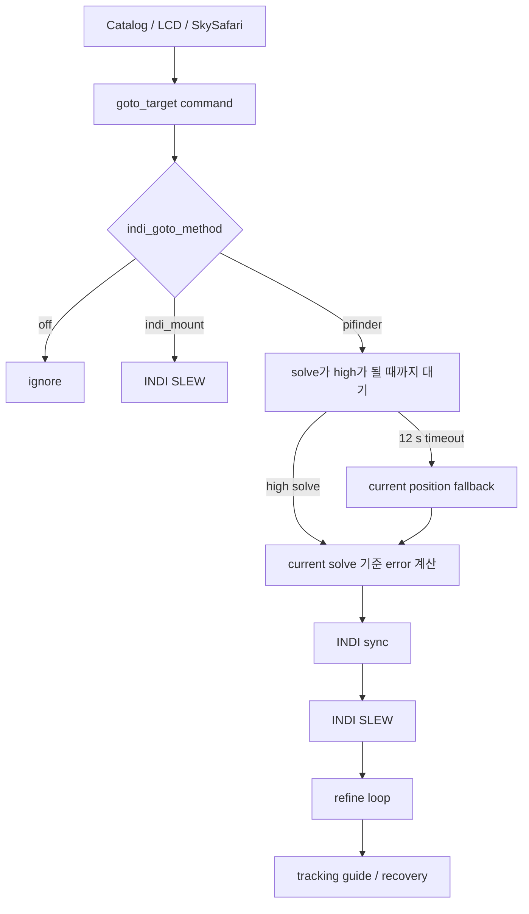

현행 `indi_goto_guide_service.py`의 `_tick_goto_wait()`는 `PIFINDER_SOLVE_ANCHOR_WAIT_SECONDS = 12` 동안 `source == "solve"` 및 `quality == "high"`를 기다린다. timeout 뒤에는 경고를 남기지만 `current` 위치를 계속 사용하여 error를 계산하고, 조건을 만족하면 sync+GoTo를 실행한다.

`_tick_tracking_guide_states()`도 tracking recovery 전에 solve anchor를 기다린 뒤 timeout이면 current position으로 `_begin_tracking_recovery_goto()`를 수행한다. 이 경로는 sync 후 GoTo가 되므로, 달 근처에서 solve가 막힌 경우 IMU/fallback 좌표가 실제 mount 좌표로 확정되는 위험이 있다. 소스의 기존 테스트도 이 fallback 동작을 명시적으로 검증한다.

`mountcontrol_indi.py`의 일반 guide correction은 신선한 plate solve가 없으면 correction하지 않는다. 그러나 상위 service의 GoTo/recovery fallback은 별도 경로이므로, 이 보호만으로는 충분하지 않다.

<a id="mf_moon_safe_goto_handoff_design_ko--23-이미-있는-tracking-정책"></a>
#### 2.3 이미 있는 tracking 정책

`track_freq_policy.py`는 대상 identity가 Planet이면 ephemeris 기반 non-sidereal rate를 만든다. Moon은 lunar tracking rate를 받으며, 정적 DSO/별은 sidereal rate를 받는다. SkySafari처럼 좌표만 받은 경우에는 `planet_positions_of_date()`와 0.1도 tolerance로 planet을 판별한다.

따라서 "달 근처"라는 이유로 Moon rate를 강제해서는 안 된다. 최종 tracking rate는 반드시 **최종 대상의 종류**로 정한다.

| 최종 대상 | final GoTo 뒤 rate |
| --- | --- |
| Moon | lunar ephemeris rate |
| Sun / planet | 해당 body ephemeris rate |
| DSO / star / unknown static | sidereal rate |

<a id="mf_moon_safe_goto_handoff_design_ko--3-좌표-frame과-달-기준점"></a>
### 3. 좌표 frame과 달 기준점

이 기능에서 가장 중요한 입력은 `target–Moon separation`이다. 둘을 다른 epoch/frame으로 비교하면 stage 방향 자체가 틀어진다.

| 요청 종류 | 현재 관례 | Moon reference |
| --- | --- | --- |
| PiFinder catalog, LCD, web planet push | catalog/J2000 관례. `sf_utils.calc_planets()` 결과도 이 경로 | 같은 `calc_planets()`의 Moon J2000 |
| SkySafari / OnStep coordinate request | `EQUATORIAL_EOD_COORD`, equinox-of-date (JNow) | `track_freq_policy.planet_positions_of_date()`의 Moon EOD |
| frame을 알 수 없는 legacy command | 불명 | 안전 stage 계산 금지 |

`test_track_freq_policy.py`에는 J2000과 EOD를 섞으면 약 22 arcmin mismatch가 생길 수 있음을 확인하는 테스트가 있다. 구현 전에 static catalog의 frame을 audit하고, 각 entry point가 다음 metadata를 넣도록 한다.

```text
target_meta = {
  label: "Moon" | catalog name,
  target_kind: "planet" | "static" | "unknown",
  body_name: "MOON" | optional,
  coordinate_frame: "catalog_j2000" | "equinox_of_date" | "unknown",
  origin: "lcd" | "web_catalog" | "web_planet" | "skysafari"
}
```

기존 queue producer와 호환을 위해 metadata가 없는 `goto_target`은 계속 처리한다. 단 moon-safe 기능을 켠 경우 frame이 `unknown`이면 stage를 계산하지 않고 direct-only 또는 명시적 거부 중 설정된 fail-closed policy를 사용한다.

<a id="mf_moon_safe_goto_handoff_design_ko--4-제안-상태기계"></a>
### 4. 제안 상태기계

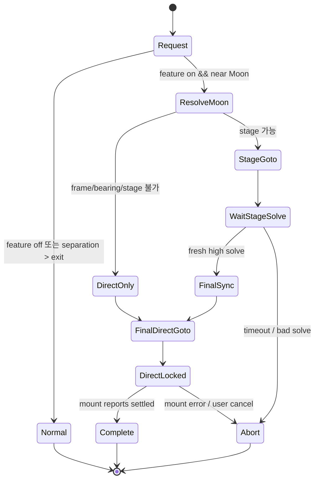

`DirectLocked`는 일반 `indi_mount` mode와 달리, stage에서 얻은 solve anchor에 대한 audit 정보를 보존한다. 하지만 공통 안전 속성은 같다. 그 상태에서는 다음을 수행하지 않는다.

- 최종 대상 부근의 plate solve를 mount sync origin으로 채택
- PiFinder refine loop
- tracking guide pulse
- tracking recovery sync/GoTo
- timeout current position fallback
- 수동 retarget 자동 보정

사용자가 새 GoTo를 요청하거나 cancel하면 plan을 종료한다. config 변경은 진행 중 plan을 바꾸지 않고, 다음 plan부터 적용한다.

<a id="mf_moon_safe_goto_handoff_design_ko--5-stage-기하"></a>
### 5. stage 기하

기본값은 IMX462의 약 10.38도 수평 FOV와 달 주변 산란광을 고려해 enter 20도, exit/stage 25도로 시작한다. enter/exit hysteresis로 경계에서 모드가 반복 전환되는 것을 막는다.

| 설정 | 초기값 | 의미 |
| --- | ---: | --- |
| `moon_safe_goto_enabled` | `true` | 달 근접 GoTo 안전 핸드오프 사용. 웹 INDI 페이지에서 On/Off |
| `moon_safe_goto_enter_deg` | `20.0` | 이 안쪽이면 moon-safe plan |
| `moon_safe_goto_exit_deg` | `25.0` | 해제/재진입 hysteresis 기준 |
| `moon_safe_goto_stage_deg` | `25.0` | Moon 중심에서 stage까지 거리 |
| `moon_safe_goto_require_solve_age_s` | `8.0` | sync에 쓸 solve freshness |
| `moon_safe_goto_solve_wait_s` | `12.0` | stage solve 최대 대기 |
| `moon_safe_goto_fail_closed` | `true` | stage solve 실패 시 sync 금지 |
| `moon_safe_goto_auto_resume` | `false` | 실패 후 자동 재시도 금지 |

유효성: `stage_deg >= exit_deg > enter_deg > 0`이며 모든 값은 설정 가능한 상한(예: 60도) 안이어야 한다.

달의 unit vector를 `m`, target unit vector를 `t`라 할 때, target 방위를 향하는 달 중심의 접선 방향은 다음과 같다.

```text
u = normalize(t - dot(m, t) * m)
stage = normalize(cos(stage_distance) * m + sin(stage_distance) * u)
```

RA/Dec로 `stage`를 다시 변환해 INDI stage GoTo에 사용한다. target이 Moon 자신이면 `t`와 `m`이 같아 방위가 정해지지 않는다. 이 경우에는 마지막 신뢰 가능한 high solve의 시선 방향으로 outward bearing을 정하고, 그것도 없으면 **direct-only**로 간다. 임의의 RA 방향을 선택해서는 안 된다.

<a id="mf_moon_safe_goto_handoff_design_ko--6-명령-및-service-설계"></a>
### 6. 명령 및 service 설계

<a id="mf_moon_safe_goto_handoff_design_ko--61-queue-contract"></a>
#### 6.1 queue contract

기존 payload를 확장한다.

```text
{
  type: "goto_target",
  ra: <hours>, dec: <degrees>,
  target_meta: <optional object>
}
```

producer는 행성 이름 또는 catalog object identity가 있을 때 metadata를 채운다. SkySafari는 raw EOD 좌표임을 표시한다. legacy caller는 그대로 동작한다.

<a id="mf_moon_safe_goto_handoff_design_ko--62-plan-snapshot"></a>
#### 6.2 plan snapshot

`indi_goto_guide_service.py`에 `MoonSafeGotoPlan`(또는 동등 dataclass)을 추가한다.

```text
request + target_meta + validated moon-safe config snapshot
  -> frame별 Moon reference resolve
  -> separation / stage decision
  -> stage target, final target, final tracking policy, timestamps
```

전역 `_config`를 각 tick에서 다시 해석하지 않는다. 새 요청 시 snapshot을 만들고, 그 plan이 끝날 때까지 동일한 threshold와 fail-closed 값을 쓴다. 이는 config reload와 motion state의 경쟁을 제거한다.

`_tick_goto_wait()`와 `_tick_tracking_guide_states()`에는 다음 guard가 먼저 들어가야 한다.

```text
if active_plan.direct_locked:
    return  # no sync/refine/guide/recovery from local position
```

stage wait는 기존 fallback을 재사용하지 않는다. `fresh high solve` 조건은 source solve, quality high, finite RA/Dec, age <= configured freshness, 그리고 stage target과의 최대 허용 오차를 동시에 만족해야 한다. timeout은 `Abort` 상태와 사용자에게 보이는 원인을 남긴다.

<a id="mf_moon_safe_goto_handoff_design_ko--63-final-direct-command의-순서"></a>
#### 6.3 final direct command의 순서

```mermaid
sequenceDiagram
  participant P as GoTo service
  participant S as Solver/current position
  participant M as INDI mount
  P->>M: SLEW(stage)
  P->>S: fresh high solve 대기
  alt valid stage solve
    P->>M: SYNC(stage solve) 단 1회
    P->>M: target tracking rate 설정
    P->>M: SLEW(final target)
    P->>P: direct_locked=true; guide/recovery off
  else timeout / invalid solve
    P->>P: abort; no sync; no recovery GoTo
  end
```

tracking rate는 final `SLEW` 직전에 한 번 적용한다. 현재 LCD/web/SkySafari entry point에서 별도로 넣는 rate command는 normal path 호환을 위해 남긴다. moon-safe plan에서는 service가 plan metadata를 기준으로 authoritative final rate를 보장하고, entry의 선행 rate가 있더라도 final rate가 덮어쓴다.

<a id="mf_moon_safe_goto_handoff_design_ko--7-변경-위치"></a>
### 7. 변경 위치

| 파일 | 변경 내용 |
| --- | --- |
| 신규 `moon_safe_goto.py` | frame별 separation, spherical stage geometry, validation을 가진 순수 함수. INDI/queue side effect 없음 |
| `indi_goto_guide_service.py` | plan 생성, stage/final 상태, direct lock, timeout fail-closed, status 노출 |
| `web_catalogs.py` | catalog/planet push에 `target_meta` 추가 |
| `ui/base.py` | LCD target identity/frame metadata 전달 |
| `pos_server.py` | SkySafari EOD origin/frame metadata 전달 |
| `track_freq_policy.py` | 공용 body/rate resolver 공개 API를 추가하거나 metadata 기반 helper 추가. 기존 matching API 유지 |
| `default_config.json` | `moon_safe_goto_enabled: true` 및 threshold/fail-closed 기본값 추가 |
| `server.py` | INDI page render context, `/indi/goto_guide` checkbox parse·검증·persistent save |
| `views/indi_mount.html` | GoTo / Guide Settings의 Moon-safe On/Off checkbox와 설명 |
| `config.py` | atomic replace 뒤 parent directory `fsync`를 추가해 설정 rename의 전원 차단 내구성 보강 |
| `mountcontrol_indi.py` | 일반 SLEW/SYNC API 재사용. safety policy를 여기로 옮기지 않음 |

multi-point controller, LiveCam HDR/stack, plate solver algorithm, mount driver의 저수준 protocol은 v1에서 수정하지 않는다.

<a id="mf_moon_safe_goto_handoff_design_ko--8-웹-indi-설정과-전원-후-유지"></a>
### 8. 웹 INDI 설정과 전원 후 유지

`python/views/indi_mount.html`의 기존 **GoTo / Guide Settings** form에 다음 checkbox를 추가한다.

```text
[x] Moon-safe GoTo handoff near the Moon
    Use a solved outer stage and a final direct INDI slew.
    No fallback sync, guide correction, or recovery GoTo near the Moon.
```

`python/PiFinder/server.py`의 `_indi_config_values()`가 현재 checkbox value를 render context로 제공하고, 동일한 `/indi/goto_guide` POST handler가 `moon_safe_goto_enabled`를 저장한다. 이 위치를 쓰면 기존 INDI 인증(`@auth_required`), Apply 버튼, 설정 화면 갱신 방식과 일관된다.

| 요구 | 설계 |
| --- | --- |
| 기본값 On | `default_config.json`, server render fallback, goto service config fallback을 모두 `true`로 둔다. 키가 없는 기존 `config.json`도 On으로 해석한다. |
| 사용 중 On/Off | checkbox를 바꾸고 **Apply GoTo / Guide Settings**를 누른다. 변경은 다음 GoTo plan부터 적용하며 진행 중 plan은 snapshot을 유지한다. |
| 정상 재시작 후 유지 | `Config.set_options({"moon_safe_goto_enabled": value})`로 `utils.data_dir/config.json`에 저장한다. session key를 사용하지 않는다. |
| 갑작스러운 전원 차단 후 유지 | 현재 Config의 temp-file `fsync` + atomic `os.replace()` 흐름을 사용하고, 구현 시 replace 뒤 parent directory도 `fsync`해 rename metadata까지 durable commit으로 만든다. 저장 성공 응답은 이 완료 뒤에만 보낸다. |
| 저장 실패 | 이전 값으로 유지하고 HTTP/UI error를 표시한다. service에는 reload command를 보내지 않는다. |

설정 On/Off는 mount driver의 INDI `CONFIG_SAVE`가 아니라 PiFinder의 persistent config에 속한다. INDI mount가 연결되지 않은 test device에서도 저장·reload·다음 plan 선택을 검증할 수 있어야 한다.

<a id="mf_moon_safe_goto_handoff_design_ko--9-상태-및-ui-계약"></a>
### 9. 상태 및 UI 계약

기존 goto/guide status에 다음처럼 read-only 진단 필드를 추가한다.

```text
moon_safe: {
  active, phase, target_label, target_kind,
  coordinate_frame, separation_deg,
  stage_ra, stage_dec, stage_solve_age_s,
  final_direct_locked, sync_count,
  fail_reason
}
```

UI에는 `moon-safe stage`, `waiting stage solve`, `direct final slew`, `aborted: no safe solve`를 표시한다. "solve timeout, fallback sync"처럼 보이는 모호한 상태는 허용하지 않는다. `sync_count`는 moon-safe plan에서 0 또는 1이어야 하며, 2 이상이면 invariant 위반으로 error를 남긴다.

<a id="mf_moon_safe_goto_handoff_design_ko--10-안전-불변조건"></a>
### 10. 안전 불변조건

1. 달 근접 plan은 stale/IMU/current fallback 좌표로 `sync_mount()`를 호출하지 않는다.
2. final direct SLEW 후 local solve는 display/diagnostic만 가능하며 mount correction 입력이 될 수 없다.
3. target–Moon separation은 같은 coordinate frame에서만 계산한다.
4. tracking rate는 Moon proximity가 아닌 target identity로 정한다.
5. `direct_locked` plan에서는 guide pulse 및 recovery GoTo가 0회다.
6. stage sync는 fresh high solve에서 최대 한 번이다.
7. cancel, mount fault, stale telemetry는 safe abort하며 자동으로 PiFinder recovery를 시작하지 않는다.
8. feature가 기본 On이더라도, 달 근접이 아닌 요청과 명시적으로 Off인 요청은 기존 흐름을 보존한다.
9. checkbox의 사용자 선택은 persistent config commit이 성공한 뒤에만 성공으로 표시되며, 재기동 뒤 같은 값으로 restore된다.

<a id="mf_moon_safe_goto_handoff_design_ko--11-테스트-설계"></a>
### 11. 테스트 설계

| 층 | 검증 |
| --- | --- |
| 순수 unit | RA wrap, pole 부근, antipodal 입력, Moon target bearing, frame mismatch reject, stage 거리/방향 |
| config unit | 범위, `stage >= exit > enter`, snapshot immutability |
| web/persistence unit | 기본 On render, checkbox On/Off POST, config reload, 새 `Config` instance 및 service restart 뒤 값 restore, write/rename failure 시 이전 값 보존 |
| service unit | stage valid solve는 sync 1회+final SLEW 1회, timeout은 sync 0회, direct lock에서 guide/recovery 0회 |
| entry unit | LCD/web catalog는 J2000 metadata, SkySafari는 EOD metadata, legacy queue는 기존 normal path |
| tracking unit | Moon/planet/DSO 각각 final rate가 맞고 달 근접 DSO가 lunar rate가 아님 |
| regression | 기존 `indi_mount` mode deactivation, existing Pifinder fallback behavior는 feature off에서 그대로 |
| hardware dry run | mount 없이 fake mount queue로 상태/state ordering 검증 |
| hardware integration | 안전한 daylight/parked test mount에서 stage SLEW, single sync, final SLEW telemetry 및 abort 버튼 검증 |

특히 지금 보고된 재현 조건을 자동 시험으로 고정한다: stage 이후 final target 부근에서 12초 동안 high solve가 전혀 오지 않아도 sync/recovery GoTo가 추가로 발생하지 않아야 한다.

<a id="mf_moon_safe_goto_handoff_design_ko--12-단계적-도입"></a>
### 12. 단계적 도입

1. 순수 geometry/frame resolver와 unit test를 먼저 추가한다.
2. feature flag default On, 웹 On/Off, durable persistent save를 연결하고 fake mount test를 통과시킨다. 웹에서 Off를 선택하면 기존 PiFinder 동작을 명시적으로 재현할 수 있어야 한다.
3. test device에서 mount 없이 command ordering과 fail-closed 상태를 확인한다.
4. 실제 INDI mount는 낮은 위험의 비달 target으로 stage/final/cancel을 검증한다.
5. 달 가장자리, 달 근처 DSO, 달 자체 순으로 수동 검증한다. 각 run의 separation, stage solve age, sync count, final rate를 기록한다.
6. 테스트 기간에도 기본값은 On으로 유지하되, 위험을 비교하거나 기존 동작을 확인할 때만 웹에서 Off로 전환한다. 각 실행에서는 설정값도 기록한다.

<a id="mf_moon_safe_goto_handoff_design_ko--13-구현-전-확정할-사항"></a>
### 13. 구현 전 확정할 사항

- static catalog 좌표의 정확한 epoch/frame을 source와 data file까지 audit한다.
- Moon itself의 stage bearing을 위해 사용할 마지막 solve의 freshness/quality 기준을 확정한다.
- direct-only가 가능한 mount driver에서 final slew completion을 어떤 INDI property로 판정할지 확인한다.
- 20/25도 초기값은 현장 산란광과 camera lens에 맞춰 profile화할지 결정한다.
- multi-point 이동에도 같은 policy를 적용할지는 v1 검증 후 별도 설계한다.

이 설계는 달을 target으로 하든 달 주변의 임의 천체를 target으로 하든 동일하게 적용한다. 중요한 경계는 "달 근처인가"가 아니라, **신뢰 가능한 plate solve를 mount coordinate correction에 써도 되는 구간인가**이다.


---

<a id="mf_moon_smooth_tracking_integration_plan_20261003_ko"></a>

## mf_moon_smooth_tracking_integration_plan_20261003_ko.md

<a id="mf_moon_smooth_tracking_integration_plan_20261003_ko--수동-정렬과-솔빙-복구를-지원하는-대상별-영상-추적-개선-계획"></a>
## 수동 정렬과 솔빙 복구를 지원하는 대상별 영상 추적 개선 계획

작성일: 2026-10-03 KST. 검토 기준: MFNavis `main`, HEAD `a10d6395`.

상태 갱신(2026-10-04): **정렬 분기와 대상별 측정을 코드에 통합했으며 실제 장비의 최종 시험은 대기 중이다.** 구현 범위·기존 시험과의 경계·새 설정·재현 명령은 [구현과 최종 시험 인계](../../mf_report/mf_target_tracking_integration_20261004_ko.md)를 따른다. 아래 소스 상태와 121개 시험은 `a10d6395` 기준의 구현 전 검토 기록이다.

두 작업은 결합할 수 있다. **정상 솔빙의 정보를 사용하고, 솔빙 공백에는 수동 정렬로 확인한 같은 목표를 대상별 영상 측정으로 이어간다.** 달은 원반 중심, 목성·토성 등 행성은 대상 영상과 주변 별, 항성·딥스카이는 대상 별과 주변 별을 최근 부드러운 보정 엔진의 입력으로 연결한다. 달과 행성의 시간별 운동을 반영하고, 사용자 정렬 시점의 목표를 정상 솔빙 복구 이후에도 유지한다.

정렬 요청은 **유효한 솔빙이 있으면 즉시 정상 정렬, 이동 직후 미솔빙이면 남은 솔빙 시간만 대기, 실패 확정 또는 대기시간 경과 시 사용자 중심 도착 확인** 순서로 처리한다. 대기는 마지막 관측용 이동 완료 시각부터 계산하며 추적 보정 이동으로 다시 시작하지 않는다.

여기서 사용자가 원하는 달빛 중심은 **영상에 들어온 달의 원반 중심**으로 정의한다. 달 내부가 포화되어도 외곽이 구분되면 중심을 측정할 가능성이 있다. 광륜이나 화면 전체 포화로 외곽까지 없어지면 위치를 검증할 수 없으므로 영상 보정을 보류한다. 이 가능성과 한계는 실제 포화 달 영상으로 확인해야 한다.

<a id="mf_moon_smooth_tracking_integration_plan_20261003_ko--1-결합할-기존-작업과-현재-상태"></a>
### 1 결합할 기존 작업과 현재 상태

| 작업 | 소스에서 확인한 현재 상태 | 통합에서 맡길 역할 |
|---|---|---|
| [영상 추적 연속성 설계](mount.md#mf_visual_tracking_continuity_design_ko)와 [시험 구현](mount.md#mf_visual_tracking_trial_ko) | 사용자 기준, 달 외곽 측정, 기존 천체 식별과 시간별 위치 계산, shadow와 재생이 있다. 실제 마운트 전송은 연결하지 않았다. | 대상과 달 중심의 측정 방법을 재사용한다. |
| [부드러운 추적 보정 설계](mount.md#mf_smooth_tracking_environment_design_ko)와 [구현 보고서](../../mf_report/mf_smooth_tracking_implementation_20261003_ko.md) | 카탈로그 별 기준, RAW ROI worker, 영상 estimate, 펄스·예측·인계·취소를 구현했다. 달과 최초 미솔빙 정렬은 P6 후속 범위다. | 측정 승인, 보정량 계산, 펄스 실행과 소유권을 재사용한다. |
| [달 근접 GoTo 인계 설계](mount.md#mf_moon_safe_goto_handoff_design_ko) | 구현 전 설계다. 달 근처의 미검증 좌표로 Sync와 복구 GoTo가 반복되지 않도록 최종 direct 구간의 보정을 금지한다. | 달 도착 전후의 자동 Sync와 GoTo 제한을 계승하고, 도착 후 검증된 영상 펄스와 구분한다. |

최신 `default_config.json`의 `smooth_tracking_mode` 기본값은 `active`이고 프로필은 빈 객체다. 기본 On과 세션 시작은 다르며, 현재 코드도 명시 Start와 검증된 프로필을 요구한다. 이전 shadow의 기본 Off나 초기 설계의 Off를 현재 보정 엔진의 기본값으로 해석하지 않는다. 운영 서비스가 어떤 소스를 로드했는지는 이번 검토에서 확인하지 않았다.

<a id="mf_moon_smooth_tracking_integration_plan_20261003_ko--소스로-확인한-연결-장애"></a>
#### 소스로 확인한 연결 장애

아래는 단순히 옵션을 켜는 것만으로 두 작업을 함께 사용할 수 없는 이유다.

| 확인 위치 | 현재 계약과 필요한 수정 |
|---|---|
| [smooth_tracking_runtime.py](../../../python/MFNavis/smooth_tracking_runtime.py#L149), `start_session` | `body`가 있는 요청을 거절하며, `resolve`에 행성 식별 옵션을 넘기지 않는다. 세션에는 대상 ID 대신 고정 RA와 Dec만 저장한다. 달 좌표를 별처럼 넣으면 달의 운동을 따라가는 세션이 되지 않는다. |
| [server.py](../../../python/MFNavis/server.py#L2039), `indi_smooth_tracking` | Start와 Calibrate에서 RA, Dec, frame만 큐로 전달한다. 기존 대상 식별 결과를 세션 요청까지 보존해야 한다. |
| [tracking_quality.py](../../../python/MFNavis/tracking_quality.py#L80), `build_reference` | 승인된 실제 RAW 솔빙과 카탈로그 별 대응이 필요하다. 달만 보이는 상태에서 새 기준을 만들 수 없다. |
| [smooth_tracking_runtime.py](../../../python/MFNavis/smooth_tracking_runtime.py#L65), `run_worker` | reference가 없으면 측정을 시작하지 않으며 `StarTracker`만 생성한다. 달 기준을 별도로 만들고 측정기를 선택해야 한다. |
| [state.py](../../../python/MFNavis/state.py#L374), `smooth_tracking_frame` | 별 ROI 반경은 최대 32px다. 달 원반과 외곽을 포함할 별도 bounded ROI 계약이 필요하다. |
| [tracking_quality.py](../../../python/MFNavis/tracking_quality.py#L204), `centroid` | 별 ROI에 포화 픽셀이 있으면 측정을 거부한다. 이 규칙을 달 전체에 적용하면 내부 포화만으로 달 측정도 중단된다. |
| [tracking_quality.py](../../../python/MFNavis/tracking_quality.py#L249), `StarTracker` | 고정 `context.target`에 대한 오차와 솔빙 기준의 유효기간을 사용한다. 달 직접 측정과 이동 천체를 추적하는 별 측정에는 서로 다른 계산이 필요하다. |
| [tracking_contracts.py](../../../python/MFNavis/tracking_contracts.py#L35), `TrackingContext` | 고정 목표와 catalog frame 계약이다. 매 프레임 좌표를 context에 갈아 넣으면 권한과 controller가 계속 달라질 수 있다. 대상 정체성과 시각별 좌표를 분리해야 한다. |
| [integrator.py](../../../python/MFNavis/integrator.py#L293), `_apply_visual_measurement` | camera RA, Dec, Roll과 aligned RA, Dec가 있는 측정만 적용한다. 달 한 점에서 완전 자세를 만들어 이 조건을 억지로 통과시키지 않는다. |
| [smooth_mount_runtime.py](../../../python/MFNavis/smooth_mount_runtime.py#L148), 복구 기준 전달 | reference를 절대 복구 기준의 pose와 geometry로 읽는다. 달 측정 기준을 그대로 넣으면 형식과 의미가 맞지 않는다. reference 종류별로 분기해야 한다. |
| [ui/align.py](../../../python/MFNavis/ui/align.py#L36), `align_on_radec` | 기존 정렬은 요청마다 solver 응답을 기다리며 timeout은 15초다. 유효한 기존 솔빙 즉시 사용, 이동 완료부터의 남은 대기, 실패 시 중심 도착 확인을 공통 처리기로 분리해야 한다. |
| [pos_server.py](../../../python/MFNavis/pos_server.py#L1016), `_set_imu_alignment_from_target_if_no_solve` | 최초 솔빙 전 IMU 표시용 정렬 경로이며 솔빙 이력이 있으면 진입하지 않는다. 최초 미솔빙과 관측 중 솔빙 중단 모두를 처리하는 사용자 영상 기준이 추가로 필요하다. |
| [visual_tracking.py](../../../python/MFNavis/visual_tracking.py#L250), `TrackingSession.align` | shadow에서는 정렬 시 검출한 별을 기준 광선으로 만들 수 있다. 생산 경로에는 카탈로그 ID가 없는 상대 별 기준의 품질·수명·제어 사용 계약을 별도로 추가해야 한다. |
| [alignment_projection.py](../../../python/MFNavis/alignment_projection.py#L115), `cached_target_pixel` | 현재 캐시 함수는 IMU 사용 가능성과 원점도 요구한다. 현재 자세에 유효한 솔빙을 직접 사용하는 경로와 IMU로 과거 솔빙을 전파하는 경로를 구분해야 한다. IMU 표시가 있다는 이유로 과거 솔빙을 새 성공으로 인정하지 않는다. |

<a id="mf_moon_smooth_tracking_integration_plan_20261003_ko--2-사용자가-얻을-동작"></a>
### 2 사용자가 얻을 동작

사용자가 달·행성·항성·딥스카이를 선택해 GoTo했지만 광포화나 기타 원인으로 솔빙이 실패한 경우, 수동으로 대상을 찾아 지정 위치에 맞춘 뒤 정렬을 명령한다. 솔빙이 가능하면 기존의 정상 정렬로 처리한다. 솔빙 실패가 확정되거나 충분한 대기시간이 지난 경우에는 정렬 요청을 **선택한 대상을 추적 중심에 맞췄다는 도착 확인 신호**로 사용한다. 첫 솔빙 전과 기존 솔빙 이력이 있는 관측 중 실패에 모두 적용한다.

지정 위치는 정렬된 접안 중심인 `target_pixel` 또는 명시한 세션 유지 위치다. 카메라 화면 중앙과 접안 중심은 다를 수 있으며 RAW 좌표로 정확히 변환한다. 수동 이동과 이전 펄스가 끝난 뒤 새 기준 프레임을 확보하고, 대상과 주변 영상의 품질을 확인해 보정을 시작한다.

| 관측 상황 | 제안 동작 |
|---|---|
| 정렬 요청 시 현재 자세에 유효한 정상 솔빙이 있음 | 새 솔빙을 기다리지 않고 즉시 기존 정상 정렬을 적용한다. |
| 정렬 요청 시 미솔빙이고 관측용 이동 완료 후 대기시간이 남음 | 남은 시간 동안 솔빙을 기다리고, 성공하면 즉시 정상 정렬한다. |
| 정렬 요청 시 미솔빙이고 실패 확정 또는 이동 완료 후 충분한 시간 경과 | 추가 전체 대기 없이 중심 도착 확인으로 처리하고 대상별 영상 기준을 만든다. |
| 중심 도착 확인의 대상이 달 | 달 원반 중심 측정으로 새 보정 세션을 시작·재개한다. |
| 중심 도착 확인의 대상이 목성·토성 등 행성 | 행성 자체의 유효한 중심과 주변 별로 부드러운 보정을 한다. 행성 운동을 반영하며, 행성 중심이 불량하면 유효한 주변 별로 이어간다. |
| 중심 도착 확인의 대상이 항성·딥스카이 | 정렬 시점의 대상 별·주변 별 배치를 상대 기준으로 추적한다. 대상이 영상에 보이지 않는 딥스카이도 주변 별이 유효하면 추적할 수 있다. |
| 어느 대상이든 정상 솔빙 승인 | 솔빙을 절대 좌표·광학 기준과 해당 시각의 오차에 우선 사용한다. 솔빙 사이의 영상 측정도 같은 목표와 제어기를 사용한다. |
| 달 중심 측정 유효, 솔빙 실패 | 달 중심 오차로 부드러운 보정을 계속한다. |
| 달 내부 포화, 외곽 측정 유효 | 외곽으로 얻은 중심을 사용한다. 내부 포화만으로 거부하지 않는다. |
| 달 외곽 불명확, 검증된 배경 별 유효 | 달의 시간별 운동을 반영한 별 측정으로 전환한다. |
| 달과 별 모두 소실 | 기본 달 추적을 유지하고 영상 보정을 보류한다. 별도 검증된 짧은 coast만 허용한다. |
| 처음부터 솔빙 실패, 달은 보임 | 사용자 확인과 기존 광학·응답 보정이 있으면 달 위치 유지로 시작할 수 있게 확장한다. |
| 달이 화면 밖, 화면에 달빛만 있음 | 광륜의 밝은 중심으로 대상을 확정하지 않는다. 사용자 재획득을 기다린다. |
| 행성이 별처럼 작은 점 또는 분해된 원반으로 보임 | 영상 크기에 맞는 별도 행성 중심 품질을 적용한다. 직접 측정이 미검증이거나 불량하면 운동을 반영한 주변 별 추적을 사용한다. |
| 목표가 달 근처 항성이나 DSO | 달 중심으로 목표를 바꾸지 않는다. 원래 천체의 추적 정책을 유지한다. |

<a id="mf_moon_smooth_tracking_integration_plan_20261003_ko--정렬-요청의-분기와-우선순위"></a>
#### 정렬 요청의 분기와 우선순위

정렬에서 사용할 수 있는 솔빙은 현재 광학·좌표계에 맞는 승인된 실제 솔빙이며, 마지막 관측용 이동 이후의 촬영과 현재 자세에 대한 유효성이 확인돼야 한다. `solve_state=True`, 보존된 과거 solve 셀, IMU·영상 estimate만으로 솔빙 완료를 판정하지 않는다. 필요한 자세 전파의 근거가 없다면 이동 전 솔빙을 즉시 정렬에 사용하지 않는다.

| 우선순위 | 조건 | 처리와 결과 |
|---|---|---|
| 1 | 취소·새 대상·새 관측용 이동 등으로 요청 문맥이 변경됨 | 이전 요청을 취소한다. 이전 목표의 정렬·도착 확인을 뒤늦게 적용하지 않는다. |
| 2 | 현재 자세에 유효한 승인 솔빙이 있음 | **즉시 정상 정렬**한다. 새 노출·솔빙 시도를 강제하거나 남은 timeout을 기다리지 않는다. |
| 3 | 관측용 이동이 아직 진행 중이거나 완료·정착이 확인되지 않음 | 이동 확인 대기다. 요청을 중심 도착으로 완료하지 않는다. |
| 4 | 유효 솔빙 없음, 해당 이동의 솔빙 대기 한도가 남음, 최종 실패는 아님 | **남은 시간만 솔빙 대기**한다. 유효 솔빙이 오면 즉시 정상 정렬로 완료한다. |
| 5 | 유효 솔빙 없음, 해당 문맥의 정렬용 솔빙 실패 확정 | 남은 시간과 관계없이 **사용자 중심 도착 확인**으로 전환한다. |
| 6 | 유효 솔빙 없음, 해당 이동의 솔빙 대기 한도 경과 | **즉시 사용자 중심 도착 확인**으로 전환한다. 요청 시점부터 대기시간을 다시 부여하지 않는다. |

수신 시점에 있는 유효 솔빙을 먼저 검사한다. 이미 시간이 지났어도 유효 솔빙이 있으면 정상 정렬이며, 대기 종료와 솔빙 승인 이벤트가 함께 관측되면 취소 여부를 확인한 뒤 사용 가능한 솔빙을 우선한다. 원본 프레임·시각·문맥이 없는 지연 결과는 이 우선권을 갖지 않는다.

실패 확정은 정렬에 배정한 솔빙 시도의 필요한 탐색·재확인 경로가 끝났거나 해당 worker가 실행 불가임이 확인된 경우다. 단일 프레임의 일시적인 검출 실패를 전체 솔빙 실패로 취급하지 않는다. 반대로 실패가 확정됐는데 무조건 timeout까지 기다리지 않는다. 유효한 솔빙으로 대상 투영이 모순되거나 정상 정렬 자체의 계약이 잘못된 경우는 정렬 오류로 표시하고, 솔빙이 없다는 이유의 도착 확인과 구분한다.

<a id="mf_moon_smooth_tracking_integration_plan_20261003_ko--솔빙-대기시간과-관측용-이동-완료-시각"></a>
#### 솔빙 대기시간과 관측용 이동 완료 시각

대기 기준은 **사용자 수동 재위치 또는 관측 대상 이동용 GoTo가 실제로 완료된 시각**이다. 명령을 큐에 넣은 시각, 추적이 On인 시각, 마지막 INDI 상태 파일 갱신 시각을 이동 완료로 쓰지 않는다. 마운트 완료 응답과 정지 확인을 해당 명령·이동 세대에 연결한다.

추적 가이드 펄스, 새 영상 보정 펄스, 자동 refine·복구 등 **보정 목적의 이동은 솔빙 대기시간을 리셋하지 않는다.** 동일한 GoTo 형식이라도 목적 metadata로 구분하고 INDI Busy 여부만으로 분류하지 않는다. 보정 이동의 종료·정착은 영상 사용 가능성 검사에 별도로 반영한다. 즉 보정 펄스가 끝나야 새 기준 영상을 쓸 수 있어도, 그 때문에 솔빙 대기 한도 전체를 다시 시작하지 않는다.

다음 값은 동일한 clock epoch의 monotonic 시각으로 관리한다. 관측용 이동 완료 시 해당 이동 세대의 솔빙 대기 정책과 deadline을 고정하고, 이후 정렬 요청은 그 window를 공유한다. 설정 변경과 재요청으로 진행 중 한도를 늘리지 않는다.

```text
t_move_done = 마지막 관측용 이동의 확인된 완료 시각
T_solve_wait = 정착부터 솔빙 승인 전달까지를 포함한 최악 조건의 유한 대기 상한
solve_deadline = t_move_done + T_solve_wait
remaining_wait = max(0, solve_deadline - now)
```

`T_solve_wait`에는 정착, 이미 진행 중인 촬영·솔빙의 잔여 시간, 새 유효 노출·readout·버퍼, 필요한 탐색 경로와 재확인 프레임, 큐·승인·게시 지연을 포함한다. 카메라 모드·최대 노출·활성 솔빙 정책의 설정 상한과 부하 시험을 사용하고 무제한 재시도는 포함하지 않는다. 명령 완료 관측의 지연도 상한에 반영한다.

현재 [UI 정렬 timeout](../../../python/MFNavis/ui/align.py#L28)은 `ALIGN_TIMEOUT_SECONDS=15.0`이다. 이는 기존 요청 응답 대기값이며 검증된 최악의 솔빙 시간이나 이동 완료 기준 deadline을 구현한 값은 아니다. 새 `alignment_solve_wait_max_s`는 **제안 설정**으로, 위 경로의 상한을 확인해 확정해야 한다. 기존 15초를 비교 출발점으로 사용할 수 있지만 근거 없이 모든 장비의 최악 시간으로 확정하지 않는다.

예를 들어 **시험에서 상한을 15초로 설정하고** 관측용 이동이 0초에 완료됐다면, 3초의 정렬 요청은 최대 12초만 기다린다. 8초에 승인 솔빙이 오면 그때 정상 정렬한다. 20초의 정렬 요청은 유효 솔빙이 없을 때 추가 대기 없이 중심 도착 확인이다. 중간에 보정 펄스가 실행돼도 deadline은 15초로 유지한다.

이동 완료 기록이 없으면 충분히 기다렸다고 추측하지 않는다. 현재 정지 상태를 확인한 시각을 대체 기준으로 명시하고, 그 시각부터 유한 대기 상한을 한 번 적용한다. 실제 이동 완료·정지 상태도 확인할 수 없으면 이동 확인 대기로 표시하고 자동 보정을 허용하지 않는다. 같은 이동에서 정렬 재요청이나 솔빙 재시도 때문에 deadline을 연장하지 않는다.

<a id="mf_moon_smooth_tracking_integration_plan_20261003_ko--요청-수명과-중심-도착-확인의-적용"></a>
#### 요청 수명과 중심 도착 확인의 적용

정렬 요청은 `request_id`, 대상 revision, 관측용 이동 세대, 요청 시각, 유지 위치와 deadline을 보존한다. 웹·LCD·SkySafari는 같은 분기 정책을 사용하고, 긴 대기는 공통 처리기의 이벤트 상태로 관리해 UI와 Stop 처리를 막지 않는다. 한 요청은 정상 정렬 또는 중심 도착 확인 중 **한 번만** 완료한다.

도착 확인은 사용자의 요청에 담긴 확인을 대기 종료 시 소비하는 것이며 시스템이 달·행성·별의 실제 도착을 절대 좌표로 검증했다는 뜻은 아니다. 결과는 `solved_alignment`와 `user_center_arrival`로 구분하고, 도착 확인 결과에는 `solve_failed`, `solve_wait_expired`, `already_waited` 같은 전환 사유를 기록한다. 별도 Start를 다시 요구하지 않는다.

도착 확인 후 늦은 솔빙은 7절의 기준 갱신 경로로 연결한다. 과거 정렬 요청을 다시 실행하거나 정상 정렬 응답을 두 번 보내지 않으며, 유지 픽셀을 새로 교정해 바꾸지 않는다. 취소·새 이동·새 대상은 이전 대기 요청과 그 요청의 늦은 솔빙 결과보다 우선한다.

<a id="mf_moon_smooth_tracking_integration_plan_20261003_ko--정렬-분기-이후의-공통-처리"></a>
#### 정렬 분기 이후의 공통 처리

1. 수동 이동 시작 시 이전 자동 보정 권한, 미실행 펄스, 기존 GoTo·refine·복구 예약을 취소한다. 사용자의 이동을 반대로 되돌리는 보정은 하지 않는다.
2. 정렬 요청에서 최신 선택 대상 ID·좌표계·유지 위치·요청 시각을 고정한다. 달·행성의 위치는 실제 정렬 기준 시각에 다시 계산한다. 이전 GoTo 좌표나 이전 대상의 별 배치를 그대로 쓰지 않는다.
3. 위 분기 정책으로 정상 정렬 또는 중심 도착 확인을 선택한다. 기준 RAW는 수동 이동과 잔여 펄스의 종료·정착 이후 촬영돼야 한다. 정렬 적용 전에 새로운 수동 이동이나 대상 변경이 오면 이전 요청을 폐기한다.
4. 정상 정렬은 기존 솔빙 기반 처리와 결과 저장을 수행한다. 중심 도착 확인은 새 사용자 기준과 generation을 발급한다. 두 경로 모두 이전 drift·위치 보정 잔여량을 초기화하며 내부 기준과 INDI Sync의 성공을 각각 기록한다. 정렬이 자동 GoTo를 뜻하지 않는다.
5. 영상 보정이 활성화된 모드이고 장비·측정 조건이 유효하면 **완료된 정렬 명령을 새 세션 시작·재개의 명시적 요청으로 사용한다.** 아직 솔빙·이동 대기 중인 요청은 도착 확인 권한으로 쓰지 않는다. 명시 Off·추적 Off·주차는 그대로 존중하고 shadow는 명령을 보내지 않는다.
6. 영상이 아직 부족하면 사용자 정렬은 성립시키되 보정은 획득 대기로 둔다. 같은 대상을 유지하며 새 영상으로 재확인한다. 다른 별이 더 잘 보인다는 이유로 추적 목표를 바꾸지 않는다.

솔빙 없는 중심 도착 확인은 기존 유지 픽셀을 사용해 세션 기준을 설정한다. 새 FOV·Roll·왜곡이나 영구 `target_pixel` 교정을 성공한 것처럼 저장하지 않는다. UI는 솔빙 대기와 남은 시간, 솔빙 정렬 완료, 사용자 중심 도착 확인, 영상 보정 시작·획득 대기, INDI Sync 결과를 구분해 표시한다.

<a id="mf_moon_smooth_tracking_integration_plan_20261003_ko--3-통합-구조와-제어-소유권"></a>
### 3 통합 구조와 제어 소유권

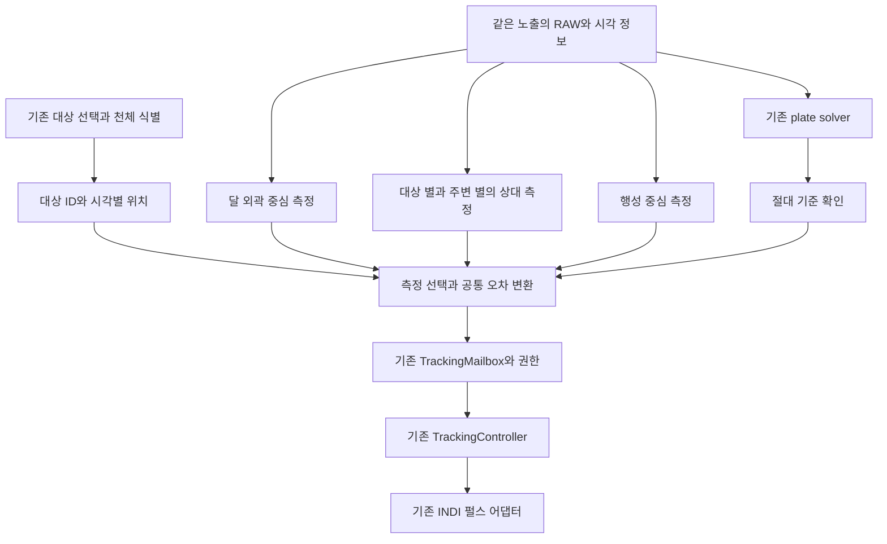

생산 경로는 기존 `smooth_tracking_runtime` worker 하나로 유지하고 달·행성 중심 측정과 사용자 정렬에 기반한 상대 별 측정을 추가한다. `visual_tracking_runtime.LiveShadow` 자체를 생산 controller로 올리지 않는다. shadow manifest와 로그 수명은 시험용이며, 새 보정의 권한·시각·Stop 계약을 대신하지 못한다. 재사용 대상은 순수 달 측정, 기하 변환, 상대 별 대응, 대상 위치 계산이다.

달·행성·별·솔빙의 측정 결과는 worker에서 검증한 뒤 **프레임당 하나의 최종 측정**으로 게시한다. 현재 mailbox는 같은 sequence의 복수 valid 관측을 받지 않으므로, 측정기가 따로 게시하면 늦게 도착한 결과가 사라질 수 있다. 같은 RAW의 여러 결과를 독립 확인 프레임 여러 개로 세지 않는다.

기존 Tracking Guide와 새 펄스 엔진의 소유권 인계를 유지한다. 기존 반복 솔빙 보정에서 제거한 예측 펄스를 다시 연결하지 않는다. 새 엔진의 위치 보정과 검증된 드리프트 예측은 기존처럼 단일 명령·duty 예산을 공유한다. 관측 실패가 기존 Sync나 자동 복구 GoTo 재개를 뜻하지 않는다.

<a id="mf_moon_smooth_tracking_integration_plan_20261003_ko--4-대상-식별과-행성-및-딥스카이-운동의-처리"></a>
### 4 대상 식별과 행성 및 딥스카이 운동의 처리

새 달·행성 분류기는 만들지 않는다. 내부 카탈로그의 명시 천체 ID를 우선하고, 좌표만 있는 요청은 기존 `planet_at_coordinates`와 `TargetEphemeris.resolve`를 사용한다. 식별은 새 GoTo나 정렬 때 수행하고 세션 동안 결과를 보존한다. 명시 항성 선택을 가까운 달로 바꾸지 않는다.

현재 [TargetEphemeris](../../../python/MFNavis/visual_tracking_target.py#L27)는 기존 `calc_planets`로 관측지와 시각에 따른 RA와 Dec를 계산하고, `basis`로 마운트 종류별 예상 회전을 계산한다. 행성과 딥스카이는 아래처럼 다른 운동 모델을 사용한다.

- **항성·딥스카이:** 짧은 관측 세션의 고정 천구 방향과 기본 항성 추적을 사용한다. 경위대에서는 시야 회전을 반영해 대상 별과 주변 별의 예상 위치를 계산한다. 모든 주변 별을 처음 픽셀에 고정하지 않는다.
- **달·행성 직접 측정:** 올바르게 추적하면 원반 또는 대상 중심은 지정 픽셀에 머문다. 중심의 위치 오차에 천체의 정상 이동량을 한 번 더 더하거나 빼지 않는다.
- **달·행성의 주변 별 측정:** 같은 노출 시각의 천체 RA·Dec와 예상 카메라 자세로 배경 별 위치를 예측하고, 그 예측에서 벗어난 잔차만 보정한다. 행성에 대한 배경 별의 정상 상대 이동을 drift로 학습하거나 0으로 만드는 펄스를 보내지 않는다.

행성 자체를 항성과 같은 고정 기준 별 목록에 넣지 않는다. 행성에는 시간별 위치를, 항성에는 고정 기준 광선을 사용한다. 둘은 공통의 카메라 자세 오차를 측정하는 관측으로 결합하되 서로 다른 예상 운동을 먼저 제거한다.

```text
시각 t의 목표 방향 = 항성·딥스카이의 고정 방향 또는 달·행성의 위치 계산 결과
정상 카메라 자세 Q(t) = 목표를 유지 위치에 두고 마운트별 시야 회전을 반영한 자세
예상 주변 별 픽셀 = 고정 기준 별 광선을 Q(t)로 투영한 위치
주변 별 잔차 = 관측 별 위치 - 예상 주변 별 픽셀
대상 중심 잔차 = 관측 달·행성·대상 별 중심 - 유지 픽셀
최종 보정 오차 = 유효한 잔차를 같은 기준면으로 변환하고 검증한 결과
```

예를 들어 시험에서 행성이 배경 별에 대해 동쪽으로 이동하도록 입력하면, 행성을 정확히 추적하는 영상에서는 주변 별이 반대 방향으로 움직일 수 있다. 이때 최종 보정 오차는 0에 가까워야 한다. 동일한 별 배치에서 딥스카이를 추적하는 시험은 행성 이동 항을 넣지 않으며, 알려진 카메라 이탈을 추가했을 때만 대응 보정이 나와야 한다.

행성 영상은 품질에 따라 별도 중심 측정을 쓴다. 작은 비포화 점은 확인된 점상 모델, 분해된 목성·토성은 검증한 원반·고리 모델로 중심을 추정한다. 포화 밝기 무게중심, 표면 무늬나 근처 위성을 행성 중심으로 채택하지 않는다. 직접 측정이 불량하면 검증된 주변 별 경로로 이어가며, 직접 행성 중심 제어의 실장 검증도 이번 통합의 완료 조건에 포함한다.

기본 비항성 추적은 `track_freq_policy`가 맡고 영상 보정은 남은 오차를 맡는다. RA 주파수 설정만으로 Dec와 경위대의 2축 추적이 모두 구현됐다고 가정하지 않는다. 실제 마운트 기능을 확인하고 부족한 부분은 검증된 펄스 용량 안에서만 보완한다.

천체 좌표를 노출 대표 UTC 시각에 계산하고 timeout은 monotonic을 사용한다. 내부 RA와 Dec 단위는 도이며, INDI 프로토콜의 RA 시간 단위 변환은 기존 경계에서 수행한다. 요청의 `catalog`와 `of_date` 축을 보존하고 기존 변환을 한 번 적용한다. J2000 기준축과 astrometric 또는 apparent 위치 의미는 별개라는 점은 [Skyfield 위치 문서](https://rhodesmill.org/skyfield/positions.html)에 따른다. 달의 관측지 시차를 포함하는 기존 계산을 재사용하고, 새 공급원이 필요하면 현재 계산과 의미를 비교한다.

세션 context에는 고정된 대상 ID와 revision, 오차를 표현하는 기준 접평면을 둔다. 시간별 `target_radec_at_observation`은 측정 필드로 분리한다. 변화하는 좌표 때문에 controller가 매번 재시작하지 않도록 한다. 이동한 목표의 잔차와 펄스 응답 행렬은 같은 접평면으로 변환하며, 현재 자세가 응답 모델의 유효 범위를 벗어나면 재검증한다.

<a id="mf_moon_smooth_tracking_integration_plan_20261003_ko--5-달-중심-검출과-포화-대응"></a>
### 5 달 중심 검출과 포화 대응

<a id="mf_moon_smooth_tracking_integration_plan_20261003_ko--기존-검출기의-재사용-범위"></a>
#### 기존 검출기의 재사용 범위

[measure_moon](../../../python/MFNavis/visual_tracking_images.py#L48)은 밝은 픽셀의 무게중심 대신 달 외곽의 기울기와 원 적합을 사용한다. 독립적으로 입력한 예상 반지름, 중심 검색 범위, 기울기 방향으로 후보를 제한한다. 현재 검사값은 반지름 5px 이상, 외곽점 25개 이상, 외곽 커버리지 160도 이상, 반지름 차이 10퍼센트 이내, 적합 RMS 1px 이하 등이다. 이 값은 기존 구현의 조건이며 실제 장비의 합격 성능을 뜻하지 않는다.

밝은 부분의 무게중심은 위상·구름·광륜에 따라 달 중심에서 치우칠 수 있다. 따라서 밝은 영역은 제한된 탐색 ROI를 찾는 보조 자료로 쓰고, 보정용 기준은 원반 외곽으로 얻는다. 명암 경계와 광륜을 외곽으로 잘못 고르는 사례도 시험한다. 외곽이 없는 큰 포화 덩어리의 중심을 정밀 추적용으로 승인하는 방식은 이번 1차 범위에서 제외한다.

<a id="mf_moon_smooth_tracking_integration_plan_20261003_ko--추가할-품질-검사"></a>
#### 추가할 품질 검사

1. 달 내부와 외곽 띠의 포화율을 따로 측정한다. 내부 포화는 허용할 수 있지만 외곽 포화·blooming·광륜 편향이 오차 예산을 넘으면 거부한다.
2. 반지름은 관측 시각의 각크기와 확인된 광학 scale, 또는 실측한 장비 프로필에서 공급한다. 검출 결과의 반지름으로 검출 결과 자체를 검증하지 않는다.
3. 외곽점의 잔차뿐 아니라 각도별 분포, 여러 원 후보의 모호성, 중심 불확실성, 직전 유효 관측과의 연속성을 평가한다. 현재 커버리지와 RMS만으로 중심 오차 상한이 보장되지는 않는다.
4. 큰 이동·가림 뒤에는 예측 오차에 맞춰 bounded 탐색을 하고 새 프레임으로 재확인한다. 화면 전체의 가장 밝은 광원을 자동 채택하지 않는다.
5. 시야 가장자리의 왜곡으로 달이 원처럼 보이지 않으면 보정된 외곽 광선에서 적합하거나, 검증된 중심 영역으로 사용 범위를 제한한다. 왜곡된 원의 중심 하나만 사후 변환한 결과를 정확하다고 가정하지 않는다.

노출·gain은 기존 카메라 제어가 소유한다. 달 외곽이 잘 보이는 짧은 노출을 추적 요청으로 전달하고, 솔빙 실패 때문에 노출이 계속 늘어나는 동작과 조정한다. 실제 노출값, 적용 프레임, 안정화 기간을 확인하며 전환 프레임으로 drift와 응답을 학습하지 않는다. 첫 단계에서는 한 가지 달용 노출을 안정적으로 유지한다. 별용 노출 교대는 전환 지연과 누락 처리까지 시험한 후 추가한다.

<a id="mf_moon_smooth_tracking_integration_plan_20261003_ko--roi와-좌표-변환"></a>
#### ROI와 좌표 변환

달 원반과 외곽·검색 여유를 포함하는 사각 ROI를 별 ROI와 구분한다. 요청에는 원본 형상, origin, 크기, frame ID, capture epoch, reference revision을 넣고, 허용 최대 면적과 바이트 수를 장비별로 제한한다. 전체 RAW를 worker IPC로 반복 복사하지 않는다.

예를 들어 **시험 입력으로** 수평 FOV 10.38도, 영상 폭 1920px, 달 지름 0.5도를 가정하면 단순 각도 비례 반지름은 약 46px다. 외곽과 탐색 여유까지 넣으면 현재 별 ROI 반경 상한 32px로 부족하다. 실제 크기는 센서 모드와 위치별 광학 scale로 산정하며 이 예를 모든 카메라에 적용하지 않는다.

달 중심과 유지 픽셀을 같은 공간에서 비교한다. RAW ROI의 origin을 더해 원본 `(y, x)`로 복원하고, 기존 `solver_frame_map` 및 `tracking_quality.corrected_points/native_points`의 왜곡·회전·crop 규약을 따른다. 기존 512 공간의 `target_pixel`을 RAW 중앙으로 간주하지 않는다.

<a id="mf_moon_smooth_tracking_integration_plan_20261003_ko--6-사용자-정렬-기준과-솔빙-없는-영상-추적"></a>
### 6 사용자 정렬 기준과 솔빙 없는 영상 추적

달 중심은 방향의 두 자유도를 측정하며, 단독으로 Roll이나 완전한 카메라 자세를 결정하지 못한다. **로컬 위치 유지 가능성과 절대 pointing 게시 가능성을 별도 판정**한다.

| 변경할 자료 | 제안 필드와 용도 |
|---|---|
| 세션 대상 | 천체 ID, 식별 출처, 입력 좌표계, 대상 revision, 위치 공급원, 유지 픽셀. 현재 고정 좌표 요청과 호환한다. |
| 정렬 요청과 이동 기록 | request ID, 요청·적용 시각, 관측용 이동 ID·목적·세대·완료 시각, 솔빙 deadline, 정책 snapshot, 정상 정렬·중심 도착 확인 결과와 사유. 보정 이동의 정착 경계는 별도로 둔다. |
| reference | `catalog_solve`, `user_star_anchor`, `moon_anchor`, `planet_anchor` 종류, 사용자 정렬 generation, 광학 geometry, 원본 유지 위치, 생성 시각, Roll 근거, 절대 복구 사용 가능성. 원반 측정은 크기 근거도 포함한다. |
| 측정 | `measurement_source`, 측정 중심과 품질, 측정한 자유도, 시각별 목표 좌표, 공통 접평면 오차와 상한, local 제어 가능 여부, 절대 estimate 가능 여부. |
| 장비 프로필 | 달·행성 중심과 상대 별 측정 각각의 검증 범위, 위치별 픽셀 변환, 응답 행렬의 좌표계·방향·자세 범위, 노출·중심 품질·ROI 한도. 기존 카탈로그 별 검증 플래그로 다른 경로의 검증을 대용하지 않는다. |

생산 펄스 제어에는 기존과 같은 접평면 arcsec 오차를 공급한다. 이미지에서 달 중심이 움직이는 방향과 카메라가 움직이는 방향은 반대일 수 있으므로, 픽셀 오차를 N/S/E/W로 직접 대응시키지 않는다. 검증된 광선 변환·자세 또는 두 축의 실측 응답으로 방향과 scale을 확인한다. 자체 펄스의 효과를 제외한 남은 drift만 학습한다.

소스 전환 전에는 새 오차를 기존 제어와 같은 접평면으로 맞추고 bias 차이를 확인한다. 기준면이나 응답 모델이 달라졌다면 새 revision을 발급하고 잔여 위치 보정과 drift를 폐기해 다시 확인한다. 기준면이 고정돼 있어도 경위대의 실제 Alt/Az 자세·시야 회전과 EQ의 pier side에 따른 모델 유효성을 검사한다.

<a id="mf_moon_smooth_tracking_integration_plan_20261003_ko--카탈로그-식별이-없는-주변-별의-상대-기준"></a>
#### 카탈로그 식별이 없는 주변 별의 상대 기준

솔빙이 실패해도 별 검출과 프레임 간 대응은 가능할 수 있다. 정렬 후 새 RAW에서 대상 별과 주변 별을 검출하고, 정렬 시점의 배치를 `user_star_anchor`로 만든다. 항성의 카탈로그 ID가 없어도 세션 내 상대 ID, 위치·형상·주변 배치와 시간별 예상 운동을 이용해 추적할 수 있게 한다. 이는 현재 생산 `build_reference`의 카탈로그 ID 필수 조건을 실제로 확장해야 하는 작업이다.

초기 검출은 기존 MFDS RAW 결과를 재사용하고, 이후에는 bounded ROI에서 위치를 재측정한다. 별 수, 두 축의 분포, 대응 모호성, 잔차·불확실성, 새 프레임 확인과 시각 조건을 검사한다. 화면의 밝은 점이나 핫픽셀을 모두 별로 승인하지 않는다. 3개 대응으로 모델을 적합할 수 있다는 사실을 active 품질 승인으로 대용하지 않는다.

딥스카이 대상 자체가 검출되지 않아도 사용자가 맞춘 위치와 주변 별의 움직임으로 위치를 유지할 수 있다. 대상 별은 품질이 좋을 때 주변 별과 함께 쓰고, 대상 점 하나만 남으면 Roll을 새로 측정했다고 하지 않는다. 해당 장비의 로컬 보정 계약으로 일부 자유도만 제어하거나 획득 대기로 둔다.

카탈로그 ID가 없는 기준은 상대 측정이다. 광학·Roll과 사용자 방향 기준이 충분할 때 기준 별을 광선으로 나타낼 수 있으며, 부족하면 로컬 이미지 기준으로 제한한다. 솔빙으로 정체성을 확인한 별과 구분해 출처와 제어 가능성을 게시하고, 이를 절대 Sync·GoTo 기준으로 쓰지 않는다.

<a id="mf_moon_smooth_tracking_integration_plan_20261003_ko--최초-미솔빙과-관측-중-솔빙-중단의-공통-시작-조건"></a>
#### 최초 미솔빙과 관측 중 솔빙 중단의 공통 시작 조건

이전 절대 솔빙이 있는 관측 중 중단과 최초 솔빙이 전혀 없는 시작을 모두 지원 대상으로 삼는다. 전자는 현재 광학·방향 보정을 재사용할 수 있고, 후자는 사용자 확인과 해당 장비의 사전 검증된 광학·펄스 응답을 사용한다. 어느 경우든 수동 이동 뒤에는 새 영상 기준을 만들며, 과거 시야의 별 기준을 자동으로 이어 붙이지 않는다.

솔빙이 중단되어도 새 달·행성·상대 별 관측이 계속 유효하면 위치 유지를 이어간다. 기존 절대 별 기준의 `reference_valid_s`가 지났다는 이유만으로 유효한 사용자 영상 기준도 함께 종료하지 않는다. 관측 freshness, 대응 신뢰도와 광학·응답 모델의 유효성을 별도로 확인하며, 절대 좌표의 신뢰도 저하는 표시한다. 기준 교체는 검증된 새 관측을 연결하는 방식으로 수행하고 불확실성을 매번 0으로 초기화하지 않는다.

최초 미솔빙 시작에는 사용자가 선택한 대상을 지정 위치에 맞췄다는 확인, 신뢰 가능한 시각·관측지, 기존 유지 픽셀, 해당 장비에서 확인한 광학·펄스 방향·2축 응답이 필요하다. 달·행성은 정렬 시각의 위치를 다시 계산한다. 사용자 확인만으로 FOV, 왜곡, Roll, 펄스 부호를 새로 알아냈다고 처리하지 않는다.

완전 자세가 없어도 검증된 로컬 2축 보정은 가능하도록 adapter의 `model_pointing`과 검증 범위를 명시적으로 확장한다. 현재 adapter는 계획 또는 측정의 aligned RA와 Dec도 검사하므로, 좌표를 비워서 보내기만 하면 동작하지 않는다. 신뢰 가능한 사용자 기준·천체 위치를 가진 별도 모델 방향 입력을 사용하고 상대 측정을 절대 솔빙으로 승격하지 않는다.

절대 자세를 복원할 근거가 충분할 때만 integrator가 `camera.estimate`와 `aligned.estimate`를 갱신한다. 부족하면 달 픽셀 오차와 로컬 보정 상태만 게시한다. `camera.solve`, `aligned.solve`, `last_solve_success`, Matches는 실제 솔빙 사실을 유지한다. 영상 시각과 IMU 원점을 연결하지 못했다면 IMU 진행을 보류한다.

<a id="mf_moon_smooth_tracking_integration_plan_20261003_ko--7-관측-전환과-솔빙-복구"></a>
### 7 관측 전환과 솔빙 복구

**정상 승인된 신선한 솔빙은 절대 좌표·자세와 해당 시각의 오차에 우선 사용한다.** 솔빙 사이 또는 실패 중에는 대상별 영상 관측으로 같은 목표의 보정을 이어간다. 같은 프레임의 솔빙과 영상 측정으로 펄스를 두 번 만들지 않으며, 솔빙 대기 때문에 유효한 최신 영상을 멈추지 않는다.

솔빙 공백의 측정 선택은 달은 원반 중심, 행성은 유효한 대상 중심과 운동을 반영한 주변 별, 항성·딥스카이는 대상 별·주변 별 순으로 해당 품질에 따라 정한다. 직접 측정과 주변 별의 잔차가 서로 모순되면 평균으로 감추지 않고 확인·보류한다. 일시적인 검출 변화로 매 프레임 기준을 바꾸지 않으며, 복귀 확인 후보는 기존 controller와 같은 새 프레임 3개·0.5초 이상이다.

솔빙 복구 시에는 사용자가 정렬한 대상 ID와 유지 위치를 보존한다. 새 솔빙에서 그 대상의 현재 위치와 영상 기준을 같은 시각·geometry로 비교해 절대 기준을 갱신한다. 작은 차이는 제한된 전환과 ramp로 연결하고, 큰 차이는 독립 관측으로 확인한다. 정렬 당시의 오래된 행성 좌표로 돌아가거나 솔빙 때마다 유지 위치를 재정의하지 않는다.

| 전환 사건 | 처리 |
|---|---|
| 달 측정 유지, 솔빙 실패 | 솔빙 실패 자체로 달 측정 권한을 철회하지 않는다. |
| 행성·항성·딥스카이 영상 유효, 솔빙 실패 | 현재 대상과 영상 세션을 유지하고 해당 운동 모델의 오차로 보정을 계속한다. |
| 달 외곽 측정 실패 | 새 invalid 사건으로 미실행 펄스 권한을 철회하고, 검증된 별 후보 또는 hold를 선택한다. |
| 유효한 별로 전환 | 달·행성 또는 고정 대상에 맞는 운동을 반영한 같은 기준면의 잔차를 확인한다. 실패 기간의 위치 보정량을 쌓지 않는다. |
| 새 솔빙 승인 | 정상 솔빙을 기준으로 사용하되 원본 프레임·시각·geometry를 확인한다. 이전 영상보다 늦게 도착한 과거 솔빙으로 estimate를 되돌리지 않는다. |
| 솔빙과 달 중심이 크게 불일치 | 한 번의 결과로 목표·Roll·유지 픽셀을 바꾸지 않는다. 새 독립 관측으로 원인을 확인한다. |
| 수동 이동 후 같은 대상 또는 새 대상에 정렬 | 이전 측정·권한·예약 명령을 폐기한다. 정렬을 명시 재개 요청으로 받아 새 generation과 새 시야 기준을 만든다. |
| Stop, 새 목표, 카메라 변경 | 기존 제어 세대 규칙을 유지하고 이전 측정·권한·예약 명령을 폐기한다. 유효한 새 정렬 또는 Start 전까지 보정하지 않는다. |

현재 `COAST_REASONS`는 별 소실 관련 사유만 허용한다. 달 소실 사유를 추가하려면 달 측정의 drift 정확도와 시간·오차·이동 한도를 따로 검증해야 한다. 우선 달 전체 소실은 `QUALITY_HOLD`로 두고, 기존 `coast_verified`를 달용 승인으로 해석하지 않는다. 광륜 중심의 급변, 노출 전환, 시각 불명, worker 고장은 coast 대상이 아니다.

<a id="mf_moon_smooth_tracking_integration_plan_20261003_ko--8-달-근접-goto-설계와의-정책-조정"></a>
### 8 달 근접 GoTo 설계와의 정책 조정

기존 달 근접 GoTo 설계의 `DirectLocked`는 guide pulse도 모두 금지하므로, 문구 그대로 달 중심 보정과 동시에 적용할 수 없다. 다음처럼 **GoTo 계획의 잠금과 관측 세션의 보정 권한**을 나눈다. 아래는 후속 구현에서 적용할 정책 제안이며 기존 moon-safe 설계가 이미 구현됐다는 뜻은 아니다.

1. 최종 direct GoTo와 정착이 진행되는 동안 모든 영상 보정은 금지한다.
2. 정착 후 달 목표·사용자의 정렬 또는 Start·장비 프로필·새 달 측정이 확인되면 새 영상 세션에 미세 펄스 소유권을 인계할 수 있다. GoTo 완료만으로 세션을 자동 시작하지 않는다.
3. 달 영상 세션에는 미세 펄스만 허용한다. 절대 복구에 쓸 수 없는 달 중심이나 IMU fallback으로 자동 Sync, refine, 복구 GoTo를 열지 않는다.
4. 달 측정 실패 때 기존 GoTo 복구가 다시 시작되지 않도록 현재 인계·중단 상태를 유지한다. 큰 이탈은 사용자 재획득과 재개로 처리한다.
5. 달 근처 DSO에 대한 direct 인계는 유지한다. 사용자가 DSO에 맞추고 정렬하면 검증된 주변 별 영상 세션에만 미세 펄스 권한을 줄 수 있다. 달 영상이 보인다는 이유만으로 달 중심 추적 세션을 만들지 않는다.

현재 `start_session`은 `indi_goto_method=pifinder`도 요구한다. 1차 구현은 이 조건 안에서 달 세션을 연결하고, 명시 `indi_mount` 설정에서도 영상 보정을 제공하려면 후속 정책·시험을 추가한다. GoTo plan의 direct 인계와 전역 설정 변경을 혼동하지 않는다.

펄스는 기존 시간 제한 adapter를 재사용한다. INDI의 `TELESCOPE_TIMED_GUIDE_NS/WE`는 ms 단위 명령이라는 점을 [표준 속성 문서](https://docs.indilib.org/drivers/standard-properties/)에서 확인했다. 이 명세만으로 해당 장비의 실제 응답·종료·통신 장애 동작이 검증된 것은 아니며 기존 장비 프로필 계약을 유지한다.

<a id="mf_moon_smooth_tracking_integration_plan_20261003_ko--9-파일별-수정-계획"></a>
### 9 파일별 수정 계획

아래 표는 구현 전 수정 제안이다. 실제 변경 위치와 이번 단계의 제한은 [구현과 최종 시험 인계](../../mf_report/mf_target_tracking_integration_20261004_ko.md)의 수정 위치와 검증 범위를 따른다.

| 파일 | 수정 내용 |
|---|---|
| `visual_tracking_target.py`, `track_freq_policy.py` | 기존 ID·좌표 식별·에페메리스 재사용. 천체 위치와 달 크기 근거를 일관된 시각·관측지에서 공급한다. 식별 로직을 복제하지 않는다. |
| `server.py`, `views/smooth_tracking.html`, `views/js/smooth_tracking.js` | 선택한 대상과 식별 출처를 전달하고 정렬 대기 사유·남은 시간, 결과 종류와 영상 획득 상태를 표시한다. |
| `web_catalogs.py`, `ui/base.py`, `ui/align.py`, `pos_server.py`, `indi_goto_guide_service.py` | 공통 정렬 처리기로 즉시 정상 정렬·이동 완료 기준 유한 대기·중심 도착 확인을 선택한다. 완료된 Align으로 세션을 시작·재개하고 이전 GoTo 복귀를 종료한다. 요청 취소·중복·지연 결과를 세대로 거른다. |
| `alignment_projection.py`, 신규 공통 정렬 처리 모듈 | 현재 자세에 유효한 승인 솔빙을 직접 사용하는 빠른 경로와 과거 솔빙의 IMU 전파를 구분한다. IMU 필수인 cache helper가 정상 솔빙의 즉시 적용을 불필요하게 막지 않도록 검사 계약을 분리한다. |
| `mountcontrol_indi.py`, `tracking_commands.py`, 마운트 상태 게시 | 관측용 이동과 보정 이동에 목적·ID를 붙이고 확인된 완료 시각을 전달한다. 보정 이동은 솔빙 deadline을 리셋하지 않지만 기준 영상의 정착 검사에는 반영한다. |
| `tracking_contracts.py` | 대상 ID와 revision, 측정 소스·자유도·시간별 목표 좌표, 로컬 제어와 절대 좌표 사용 가능성, 달 프로필 계약을 추가한다. |
| `visual_tracking_images.py`와 신규 `tracking_moon.py`·행성 측정 모듈 | 달 외곽 검출을 재사용하고 별도 행성 중심의 품질·모호성·불확실성을 검사한다. 각 측정기를 공통 오차 계약에 연결한다. |
| `state.py`, `tracking_quality.py`, `visual_tracking.py` | 대상용 bounded ROI와 상대 별 기준을 추가한다. 기존 MFDS 검출을 재사용하고 카탈로그 ID 없는 별의 대응·분포·불확실성을 검사한다. 달·행성 추적의 예상 별 운동을 반영한다. |
| `smooth_tracking_runtime.py`, `tracking_mailbox.py` | 사용자 정렬 기준 생성·대상별 측정기 선택·프레임당 최종 측정·기준 수명 분리·정상 솔빙 우선과 영상 전환을 연결한다. |
| `tracking_control.py`, `tracking_motion.py`, `smooth_mount_runtime.py` | 동일 기준면의 오차만 소비한다. 전환 때 drift·잔여량을 폐기하고 reference 종류별 절대 복구 경로를 분기한다. |
| `tracking_mount_adapter.py`, `tracking_calibration.py` | 달용 모델 방향·실제 자세 유효성 검사. 초기에는 기존 검증 응답을 사용하며 달만으로 새 응답을 교정하는 기능은 별도 검증한다. |
| `integrator.py`, `pointing_coordinate_service.py` | 부분 측정으로 완전 자세를 만들지 않는다. 영상 estimate와 솔빙 사실, 사용자 기준과 IMU 원점을 구분한다. |
| 카메라 제어·기본 설정·상태 API | 노출 소유권 조정, 적용 프레임 확인, 대상별 측정 프로필과 정렬·솔빙·추적 진단을 추가한다. 최악 솔빙 대기 상한의 설정과 근거를 관리하고 기존 active 기본값과 사용자 저장값을 유지한다. |

MFDS 검출기 수정은 1차 통합의 전제가 아니다. 현재 RAW ROI와 NumPy/SciPy 측정으로 시작하며 다운로드된 `python/MFDS` 패키지를 직접 수정하지 않는다.

<a id="mf_moon_smooth_tracking_integration_plan_20261003_ko--10-구현-순서와-검증-기준"></a>
### 10 구현 순서와 검증 기준

| 단계 | 작업 | 완료 판정 |
|---|---|---|
| 1 공통 정렬 분기와 측정 입력 | 즉시 정상 정렬, 관측용 이동 기준 솔빙 deadline, 실패 시 중심 도착 확인과 대상별 측정 계약을 연결하고 shadow로 비교한다. | 정상 솔빙은 대기 없이 적용하고 미솔빙은 남은 시간만 기다린다. 최초 미솔빙·관측 중 실패에서 유효한 도착 확인은 새 시야 기준을 만든다. |
| 2 달과 항성 및 딥스카이 보정 | 검증된 장비에서 달 중심과 대상·주변 별의 로컬 보정을 연결한다. | 솔빙 성공 없이 사용자 정렬 후 위치를 유지하고, 이전 GoTo·중복 보정·허위 솔빙이 없다. |
| 3 행성 보정 | 목성·토성 등 행성 중심과 주변 별을 다른 운동 모델로 측정해 같은 controller로 연결한다. | 행성 정상 운동을 drift로 보정하지 않으며, 직접 중심 불량 시 주변 별로 추적을 이어간다. |
| 4 솔빙 전환과 호환성 | 솔빙 정상·실패 반복, 대상별 소스 전환, 노출 교대, EQ와 pier side를 확장한다. | 같은 목표와 유지 위치를 보존하고, 회복 시 불연속·overshoot·Stop·재연결을 조합별로 검증한다. |

<a id="mf_moon_smooth_tracking_integration_plan_20261003_ko--추가해야-할-자동-시험"></a>
#### 추가해야 할 자동 시험

| 시험 입력 | 기대 결과 |
|---|---|
| 명시 MOON, 행성, 명시 항성, 좌표만 있는 대상 | 기존 식별 결과가 보존되며 명시 항성이 달로 바뀌지 않는다. |
| 정렬 요청 시 현재 자세에 유효한 승인 솔빙 | 즉시 정상 정렬 1회, 새 솔빙 요청·timeout 대기·중심 도착 전환 0회. |
| 관측용 이동 후 대기 한도 안의 미솔빙 Align, 대기 중 정상 솔빙 도착 | 이동 완료 기준 deadline까지만 기다리고 솔빙 승인 시 바로 정상 정렬 1회. |
| 대기 중 정렬용 솔빙의 최종 실패 | 남은 시간과 관계없이 중심 도착 확인 1회, 대상별 영상 기준 생성. 단일 일시 실패는 최종 실패와 구분한다. |
| 이동 완료 후 대기 한도 경과 시 미솔빙 Align | 추가 전체 솔빙 대기 0, 즉시 중심 도착 확인 1회. |
| 대기 종료 tick에 사용 가능한 승인 솔빙도 있음 | 취소가 없고 문맥이 유효하면 정상 정렬 1회, 중심 도착 확인과 중복 완료 없음. |
| 보정 펄스·자동 refine·복구 GoTo가 대기 중 반복됨 | 관측용 이동 완료 시각과 deadline은 유지한다. 현재 보정의 정착만 별도로 검사한다. |
| 같은 이동에서 Align 재요청·솔빙 재시도 | 대기 상한 연장 없음, 동일 요청의 중복 완료·세션 생성 없음. |
| 이동 전 성공 솔빙·IMU estimate만 있음 | 새 이동 뒤의 유효 솔빙으로 인정하지 않는다. 남은 대기 또는 중심 도착 분기를 사용한다. |
| 이동 완료 시각이 없거나 프로세스가 재시작됨 | 이전 monotonic 기록으로 충분한 대기를 추측하지 않는다. 확인된 정지 시각의 새 유한 대기 또는 이동 확인 대기. |
| 첫 솔빙 전 또는 솔빙 이력 후 실패, 수동 이동 후 Align | 대기 정책으로 중심 도착 확인이 완료된 두 경우 모두 사용자 영상 기준을 만들고, 유효 조건에서 별도 Start 없이 세션을 시작·재개한다. |
| Align 대기 중 추가 수동 이동·새 대상, 이전 GoTo 복구 예약 | 이전 정렬과 모든 오래된 보정 예약은 폐기되며 사용자의 최종 대상만 유지한다. |
| 보정 Off·추적 Off·주차에서 Align | 사용자 기준 설정과 자동 보정 권한을 구분하고 명령 0을 유지한다. |
| 카탈로그 ID 없는 주변 별과 영상에 보이지 않는 DSO | 검증된 상대 별로 로컬 위치를 유지하되 절대 솔빙·Sync 기준을 만들지 않는다. |
| 행성 중심과 주변 별이 동시에 관측됨 | 행성만 시간별 운동을 적용하고 배경 별을 고정 광선으로 모델링한다. 프레임당 최종 측정과 펄스는 중복되지 않는다. |
| 달 내부만 포화된 영상과 외곽까지 포화된 영상 | 전자는 품질 범위에서 중심 측정, 후자는 invalid와 명령 0. |
| 초승달·반달·보름달, 광륜·부분 구름·다중 밝은 물체 | 원반 중심의 오차와 오승인을 독립 원본 기준으로 평가한다. |
| 다른 RAW 크기·ROI origin·회전·crop·왜곡·512 유지 픽셀 | 중심과 유지 위치가 같은 좌표 공간에 있고 펄스 부호가 맞는다. |
| 달·행성 정상 운동, 고정 대상 추적과 알려진 카메라 이탈 | 정상 운동만 있으면 대상·주변 별 경로 모두 오차가 0에 가깝고, 카메라 이탈에만 해당 보정이 나온다. |
| RA wrap·Dec 변화·경위대 회전·모델 유효 범위 이탈 | 벡터/기준면 변환과 보류가 맞으며 자동 부호 반전이 없다. |
| 솔빙 공백이 별 기준 유효기간보다 김 | 최신 달 측정과 유효 모델은 위치 유지가 가능하고 절대 정확도를 허위 표시하지 않는다. |
| 최초 솔빙 없음, 사용자 기준 있음 또는 없음 | 확인된 기준·응답이 있는 로컬 보정과 획득 대기를 구분한다. |
| 같은 RAW에서 달·별·솔빙 결과, 역순 결과 | 최종 측정 1건, 독립 확인 횟수 중복 없음, 과거 시각으로 복귀 없음. |
| 대상별 솔빙 정상·실패·복구 반복, 영상 소실·재등장 | 정상 솔빙 정보를 우선 사용하고 실패 중 영상 추적을 이어간다. 목표·유지 위치와 새 정렬 generation은 보존하며 재확인·ramp로 복귀한다. |
| 현재 사용자 정렬 뒤 과거 솔빙·이전 대상의 별 관측 도착 | 과거 generation으로 좌표·유지 위치·세션을 되돌리거나 이전 대상 펄스를 내보내지 않는다. |
| direct GoTo 중 또는 정착 후, 새 영상 세션 종료 | 인계 전 펄스 0, 허가 후 단일 owner, 종료 후 자동 legacy 복구 없음. |
| Stop·수동 이동·프로세스 종료·장비 재연결 | 이전 세대 명령이 실행되지 않고 자동 추적 시작·Sync·GoTo가 없다. |

실장 시험 전에 허용 중심 오차를 px와 arcsec로 모두 정하고, RMS·상위 분위수·최댓값, 유효 관측 비율·오검출률, 처리 지연·누락, 펄스 duty·overshoot, 재획득 시간을 기록한다. 목표 수치가 없으면 정밀 추적 완료로 판정하지 않는다. 합성 정답이나 별도 짧은 노출·수동 외곽 측정 같은 독립 기준을 쓰며 controller 출력 자체를 정답으로 사용하지 않는다.

<a id="mf_moon_smooth_tracking_integration_plan_20261003_ko--이번-검토에서-실행한-기존-시험"></a>
#### 이번 검토에서 실행한 기존 시험

다음 7개 파일의 **121개 시험이 통과했다**. 실행 시간 7.92초. 달 외곽과 기존 대상 식별·시간별 위치, 기존 부드러운 보정·API·제어 인계를 확인했다. 기존 pytz와 SWIG 관련 deprecation 경고 3건이 있었다.

```bash
cd /home/mfnavis/MFNavis/python
PYTHONPATH=. PYTHONDONTWRITEBYTECODE=1 ../.venv-dev-trixie/bin/python -m pytest \
  tests/test_visual_tracking.py tests/test_visual_tracking_runtime.py \
  tests/test_smooth_tracking.py tests/test_smooth_tracking_runtime.py \
  tests/test_smooth_tracking_api.py tests/test_smooth_tracking_handover.py \
  tests/test_track_freq_policy.py -q --tb=short
```

기존 달 검출 시험은 합성 보름달·초승달과 잘못된 반지름 거부 등이다. 이번 121개 통과는 기존 부품의 동작을 확인하며, 위 표의 새 통합 시험이나 실제 포화 달 제어 시험을 통과했다는 뜻은 아니다. 실제 장비 이동, 서비스 재시작, 운영 설정 변경은 수행하지 않았다.

<a id="mf_moon_smooth_tracking_integration_plan_20261003_ko--11-구현-우선순위"></a>
### 11 구현 우선순위

먼저 **정렬 요청의 즉시 정상 처리, 이동 완료 기준 솔빙 대기, 실패 시 중심 도착 확인을 공통화**한다. 완료된 요청에서 달 중심, 항성·딥스카이의 상대 별, 행성 중심과 운동을 반영한 주변 별을 같은 부드러운 보정 엔진에 연결한다. 실패·복구가 반복돼도 사용자가 정렬한 같은 목표와 유지 위치를 이어가는 조건까지 완료 범위에 포함한다.


---

<a id="mf_mount_mode_compatibility_ko"></a>

## mf_mount_mode_compatibility_ko.md

<a id="mf_mount_mode_compatibility_ko--mf-pifinder-마운트-모드-호환성-점검-계획"></a>
## MF PiFinder 마운트 모드 호환성 점검 계획

작성일: 2026-07-03

이 문서는 SkySafari, IMU no-solve fallback, INDI mount control, OnStepX 연동이
Alt/Az 전용 가정에 묶이지 않고 적도의 계열 마운트에서도 동작하도록 확인하기 위한
기준 문서다. 이후 수정과 현장 테스트는 이 문서의 항목을 기준으로 진행한다.

<a id="mf_mount_mode_compatibility_ko--목표"></a>
### 목표

- PiFinder `mount_type = "Alt/Az"`와 `"EQ"` 모두에서 SkySafari 위치 응답이
  올바른 마운트 모드로 보이게 한다.
- plate solve 전에는 IMU의 실제 수평 방향을 RA/Dec로 변환해서 SkySafari에
  제공한다.
- plate solve 전 SkySafari GoTo 후 사용자가 수동으로 별을 중앙에 놓고
  Sync/Align을 누르면, 마지막 GoTo 대상과 현재 IMU 방향 차이를 보정값으로
  저장한다.
- plate solve가 성공하면 PiFinder의 solve 기반 pointing을 우선하고, no-solve
  IMU 보정값은 즉시 초기화한다.
- INDI GoTo, Sync, guide/manual movement는 특정 마운트 형식에 묶지 않고
  INDI telescope driver의 RA/Dec 및 guide/motion interface를 통해 동작한다.

<a id="mf_mount_mode_compatibility_ko--현재-소스-점검-결과"></a>
### 현재 소스 점검 결과

| 영역 | 현재 상태 | 조치 |
| --- | --- | --- |
| PiFinder push-to UI | `calc_utils.aim_degrees()`가 `mount_type == "Alt/Az"`이면 Alt/Az 차이, 그 외에는 RA/Dec 차이를 계산한다. | 기존 구조 유지, 회귀 테스트 대상 |
| SkySafari 현재 좌표 | `pos_server.get_telescope_ra/dec()`는 pointing coordinate service가 선택한 좌표를 반환한다. solve pointing이 우선이고, 없으면 IMU/mount 기반 fallback을 사용한다. | 유지 |
| SkySafari status `:GW#` | 기존에는 항상 `AT1`을 반환해서 Alt/Az처럼 보였다. | `mount_type`과 override 설정을 반영하도록 수정 |
| no-solve IMU 보정 | SkySafari Sync 시 sync target(최신 `Sr/Sd`, 없으면 마지막 GoTo 대상)과 현재 IMU Alt/Az 차이를 저장한다. | solve 성공 시 초기화 보장 |
| INDI GoTo | `goto_target`은 RA/Dec를 INDI `EQUATORIAL_EOD_COORD`로 전달한다. | 마운트 독립으로 유지 |
| INDI guide/manual move | `north/south/east/west` guide motion을 INDI driver에 전달한다. | 마운트 독립으로 유지, 실제 장치별 확인 필요 |
| OnStepX 위치/시간 | OnStepX driver일 때만 표시/동작한다. | OnStepX 전용으로 유지 |

<a id="mf_mount_mode_compatibility_ko--skysafari-lx200-status-정책"></a>
### SkySafari LX200 Status 정책

PiFinder는 SkySafari의 `:GW#` 요청에 LX200-style status 문자열을 반환한다.

기본 정책:

| PiFinder 설정 | 반환 |
| --- | --- |
| `mount_type = "Alt/Az"` | `AT1` |
| `mount_type = "EQ"` | `PT1` |

문자 의미:

- 첫 글자: mount geometry. `A`는 Alt/Az, `P`는 polar/equatorial 계열로 사용한다.
- 두 번째 글자: tracking 상태. PiFinder는 현재 `T`로 응답한다.
- 세 번째 글자: alignment 상태. PiFinder는 기존 호환성을 유지하기 위해 `1`로 응답한다.

일부 mount/app 조합은 German equatorial을 별도 코드로 기대할 수 있다. 이 경우
웹 UI에서 다음 메뉴로 값을 바꾸거나 설정 파일에서 직접 override할 수 있다.

```text
INDI > SkySafari Mount Mode > SkySafari LX200 Mount Code
```

```json
"skysafari_lx200_mount_code": "G"
```

지원 값:

| 값 | 의미 |
| --- | --- |
| `auto` | `mount_type` 기준 자동 선택 |
| `A` | Alt/Az로 강제 |
| `P` | Polar/equatorial로 강제 |
| `G` | German equatorial로 강제 |

<a id="mf_mount_mode_compatibility_ko--no-solve-imu-정렬-흐름"></a>
### no-solve IMU 정렬 흐름

1. PiFinder가 아직 plate solve를 갖고 있지 않다.
2. SkySafari 사용자가 밝고 찾기 쉬운 별을 선택하고 GoTo를 누른다.
3. PiFinder는 마지막 SkySafari target RA/Dec를 저장한다.
4. 사용자가 마운트를 수동/가이드 조작으로 움직여 아이피스 중앙에 별을 놓는다.
5. SkySafari에서 Sync/Align을 누른다.
6. PiFinder는 target RA/Dec를 현재 시간/위치 기준 Alt/Az로 변환한다.
7. 현재 IMU Alt/Az와 target Alt/Az의 차이를 보정값으로 저장한다.
8. 이후 plate solve 전 SkySafari 위치 응답은 IMU Alt/Az에 이 보정값을 적용한 뒤
   RA/Dec로 변환한다.
9. plate solve가 성공하면 보정값을 초기화하고 solve 기반 pointing으로 전환한다.

이 흐름은 mount axis가 Alt/Az인지 EQ인지에 의존하지 않는다. IMU는 실제 하늘
수평 방향을 측정하고, SkySafari에는 항상 RA/Dec를 반환하기 때문이다.

SkySafari/LX200의 `:Sr/:Sd`(target 저장) → `:MS#`(GoTo) / `:CM#`(Sync/Align)
처리와 forwarding 전체 흐름은
[mf_goto_mount_source_structure_ko.md](mount.md#mf_goto_mount_source_structure_ko)가
소유한다. 본 no-solve 정렬에서 중요한 점은 `:CM#`이 방금 받은 `:Sr/:Sd`를 이전
GoTo target보다 우선한다는 것이다 — 다른 대상에서 Align/Sync해도 이전 GoTo
좌표로 잘못 정렬되지 않는다.

SkySafari GoTo 전달 여부는 GoTo / Guide 설정의 `indi_goto_method`(GoTo Type:
`off` / `indi_mount` / `pifinder`)가 결정한다(2026-07-19 개편). `off`가 아니면
SkySafari GoTo가 GoTo/Guide 서비스로 전달된다. SkySafari Align/Sync 전달은
`skysafari_indi_sync`(기본 켜짐) 하나로만 제어한다. solve 전 SkySafari Align을
IMU 정렬에 사용하는 동작은 옵션 없이 항상 켜져 있다.

<a id="mf_mount_mode_compatibility_ko--구현-체크리스트"></a>
### 구현 체크리스트

- [x] no-solve IMU 보정값 저장 구조 추가
- [x] solve 좌표 사용 가능 시 IMU 보정값 초기화
- [x] no-solve Sync에서 PiFinder plate-solve align을 호출하지 않도록 분리
- [x] SkySafari `:GW#`가 `mount_type`을 반영하도록 수정
- [x] `skysafari_lx200_mount_code` override 추가
- [x] SkySafari `CM#`가 최신 `Sr/Sd` 좌표를 이전 GoTo target보다 우선하도록 수정
- [x] SkySafari GoTo 전송이 켜진 경우 Align/Sync도 INDI/OnStep으로 전달
- [x] Alt/Az push-to 계산에서 고도 0도를 유효한 좌표로 처리
- [x] object list push-to 표시에서 한 축 이동량 0도를 유효한 값으로 표시
- [x] INDI 웹 UI에 SkySafari mount mode 공통 설정 추가
- [x] 관련 unit test 추가
- [x] 서비스 재시작 후 상태 확인
- [ ] 실제 SkySafari Alt/Az profile 연결 확인
- [ ] 실제 SkySafari EQ/German profile 연결 확인

<a id="mf_mount_mode_compatibility_ko--2026-07-03-소스-감사-결과"></a>
### 2026-07-03 소스 감사 결과

마운트 모드 변경과 직접 관련된 경로를 다시 확인했다.

| 영역 | 결과 | 조치 |
| --- | --- | --- |
| LCD Settings > Mount Type | `mount_type`은 `Alt/Az` 또는 `EQ`로 저장되고 재시작 callback을 호출한다. | 정상 |
| Push-to 계산 | `calc_utils.aim_degrees()`가 `Alt/Az`에서는 Alt/Az 차이, 그 외에는 RA/Dec 차이를 반환한다. | 고도 0도 경계값 수정 |
| Object Details 표시 | `aim_degrees()` 결과와 같은 `mount_type`을 `draw_pointing_instructions()`에 전달한다. | 정상 |
| Object List 표시 | `aim_degrees()` 결과를 목록 거리 문자열로 표시한다. | 한 축 0도 표시 수정 |
| Polar Align | 극축 보정은 마운트 타입과 관계없이 실제 Alt/Az 조정 나사를 움직이므로 강제로 `Alt/Az` 표시를 사용한다. | 의도된 예외 |
| SkySafari `:GW#` | `mount_type` 또는 `skysafari_lx200_mount_code` override로 `AT1`/`PT1`/`GT1`을 반환한다. | 정상 |
| SkySafari `:Sr/:Sd/:MS/:CM` | `Sr/Sd`는 좌표 저장만 하고 `MS`는 GoTo, `CM`은 Sync/Align으로 구분한다. | 최신 `Sr/Sd` 우선 처리 완료 |
| INDI GoTo/Sync/Guide | 표준 INDI telescope property와 guide/motion command를 사용한다. | 마운트 독립, 실제 driver별 테스트 필요 |
| Web Equipment telescope `mount_type` | 장비 DB의 `alt/az`/`equatorial` 값이며 PiFinder 동작 설정 `Alt/Az`/`EQ`와 별도다. | 자동 연동 여부는 사용자 판단 필요 |

판단 보류 항목:

- Equipment에서 active telescope을 바꿀 때 PiFinder의 전역 `mount_type`까지 자동으로
  변경할지 여부. 자동 변경은 편할 수 있지만, 관측 중 의도치 않게 SkySafari mode와
  push-to 좌표계가 바뀔 수 있어 별도 UX 판단이 필요하다.
- LX200 `Sr/Sd` parser의 transaction state 강화. SkySafari 정상 흐름에서는 항상
  `Sr`와 `Sd`가 함께 오지만, 비정상 client가 일부 좌표만 새로 보내면 이전 좌표와
  섞일 수 있다. 이 수정은 프로토콜 상태 모델 변경이라 별도 작업으로 다루는 것이 좋다.

<a id="mf_mount_mode_compatibility_ko--테스트-항목"></a>
### 테스트 항목

<a id="mf_mount_mode_compatibility_ko--unit-test"></a>
#### Unit Test

| 테스트 | 기대 결과 |
| --- | --- |
| `mount_type = "Alt/Az"`에서 `:GW#` | `AT1` |
| `mount_type = "EQ"`에서 `:GW#` | `PT1` |
| `skysafari_lx200_mount_code = "G"` | `GT1` |
| no-solve Sync | IMU 보정값 active |
| solve 좌표 사용 가능 | IMU 보정값 inactive |
| SkySafari GoTo with INDI GoTo off | 기존 push-to target만 생성 |
| SkySafari GoTo with INDI GoTo on | `goto_target` queue 생성 |
| SkySafari Align/Sync with INDI GoTo on | `sync` queue 생성 |
| mount_control off | SkySafari 위치 응답과 push-to만 동작 |
| Alt/Az solution 고도 0도 | 유효한 push-to 차이 반환 |
| Object List 한 축 이동량 0도 | `--- ---`가 아니라 실제 거리 표시 |

<a id="mf_mount_mode_compatibility_ko--hardware-test"></a>
#### Hardware Test

| 단계 | Alt/Az | EQ/적도의 |
| --- | --- | --- |
| SkySafari 연결 | 연결 유지, 좌표 갱신 | 연결 유지, 좌표 갱신 |
| plate solve 전 위치 | IMU fallback 위치 표시 | IMU fallback 위치 표시 |
| GoTo 대상 push | Object Details 대상 생성 | Object Details 대상 생성 |
| INDI GoTo on | mount GoTo 시작/완료 | mount GoTo 시작/완료 |
| no-solve Sync 보정 | 같은 별 주변 좌표 개선 | 같은 별 주변 좌표 개선 |
| plate solve 후 | solve 위치로 전환, 보정 초기화 | solve 위치로 전환, 보정 초기화 |
| guide/manual move | 누르는 동안 이동, release/stop 정지 | driver 기준 N/S/E/W 이동, release/stop 정지 |

<a id="mf_mount_mode_compatibility_ko--주의-사항"></a>
### 주의 사항

- IMU no-solve 보정은 plate solve를 대체하지 않는다. 초기 탐색 보조용이다.
- `mount_type = "EQ"`일 때 PiFinder push-to UI는 RA/Dec 차이를 보여준다.
- SkySafari의 telescope profile mount type과 PiFinder `mount_type`은 가능한 한
  일치시키는 것이 좋다.
- OnStepX가 아닌 INDI driver는 위치/시간 UI가 다르게 보일 수 있지만, GoTo/Sync는
  표준 INDI telescope property가 있으면 같은 경로를 사용한다.


---

<a id="mf_mountcontrol_indi_flow_ko"></a>

## mf_mountcontrol_indi_flow_ko.md

<a id="mf_mountcontrol_indi_flow_ko--mf-pifinder-mountcontrol_indi-동작-순서도"></a>
## MF PiFinder mountcontrol_indi 동작 순서도

이 문서는 `python/PiFinder/mountcontrol_indi.py`의 현재 구현을 기준으로
INDI 마운트 제어 프로세스의 역할, 명령 처리 순서, 상태 발행 경로를 정리한다.

관련 문서:

- `docs/mf_dev/mf_coordinate_helper_plan_ko.md`: `PointingCoordinateService`와 SkySafari 좌표 응답 흐름
- `docs/mf_dev/mf_multipoint_align_flow_ko.md`: Multi Align의 사용자 흐름
- `docs/mf_dev/mf_backlash_measurement_flow_ko.md`: Backlash 측정 상태 machine과 계산식
- `docs/mf_dev/mf_goto_mount_source_structure_ko.md`: SkySafari GoTo/Push 구조와 소스 위치

<a id="mf_mountcontrol_indi_flow_ko--전체-역할"></a>
### 전체 역할

`MountControlIndi`는 PiFinder 내부 명령을 INDI telescope driver 명령으로 변환하는
마운트 제어 프로세스이다. Web UI, LCD UI, SkySafari POS server 등이 직접 INDI에
접근하지 않고 queue 명령을 넣으면, 이 프로세스가 INDI server/driver와 통신한다.

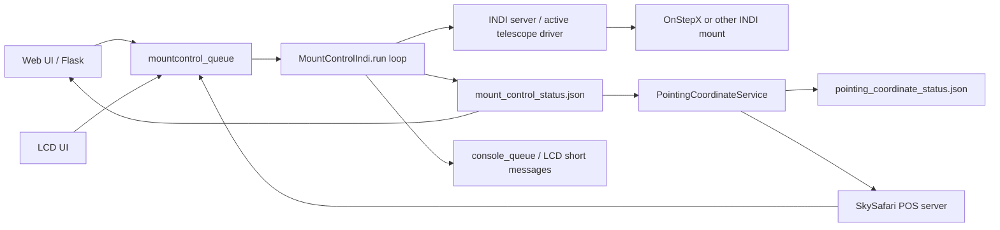

<a id="mf_mountcontrol_indi_flow_ko--주요-파일과-데이터"></a>
### 주요 파일과 데이터

소스:

- `python/PiFinder/mountcontrol_indi.py`
- `python/PiFinder/pos_server.py`
- `python/PiFinder/server.py`
- `python/PiFinder/pointing_coordinate_service.py`
- `python/PiFinder/indi_multipoint_align.py`
- `python/PiFinder/indi_backlash_calibration.py`

상태 파일:

```text
/home/pifinder/PiFinder_data/mount_control_status.json
/home/pifinder/PiFinder_data/pointing_coordinate_status.json
```

`mount_control_status.json`은 mount-control의 최신 상태 snapshot이다.
Web UI와 `PointingCoordinateService`가 이 파일을 읽는다.

대표 필드:

```text
state
message
updated
slew_rate
ra
dec
home_state
park_state
driver_mount_status
raw_mount_status
manual_motion_direction
manual_motion_lease_remaining
mount_motion_active
mount_motion_type
mount_readback_priority
goto_motion_active
target_ra
target_dec
target_error_deg
guide_correction_enabled
backlash_ra
backlash_de
backlash_auto
multipoint_align
coordinate_sync
device
connection_health
serial_present
serial_path
serial_path_stable
recovery_reason
recovery_attempt
```

<a id="mf_mountcontrol_indi_flow_ko--시간-상수"></a>
### 시간 상수

중요한 현재 값:

```text
POSITION_STATUS_MIN_INTERVAL = 0.5 sec
STATUS_HEARTBEAT_INTERVAL = 2.0 sec
AUTO_CONNECT_START_DELAY = 5.0 sec
AUTO_CONNECT_RETRY_INTERVAL = 10.0 sec
USB_SERIAL_MONITOR_INTERVAL_SECONDS = 1.0 sec
USB_SERIAL_RETURN_DEBOUNCE_SECONDS = 2.0 sec
USB_SERIAL_DISCONNECT_WAIT_SECONDS = 3.0 sec
USB_SERIAL_FRESH_TELEMETRY_WAIT_SECONDS = 12.0 sec

MANUAL_MOTION_LEASE_SECONDS = 1.2 sec
MANUAL_MOTION_MIN_LEASE_SECONDS = 0.3 sec
MANUAL_MOTION_MAX_LEASE_SECONDS = 5.0 sec
MANUAL_MOTION_MAX_CONTINUOUS_SECONDS = 10.0 sec
MANUAL_MOTION_POLL_SECONDS = 0.1 sec
MANUAL_MOTION_STOP_RETRY_SECONDS = 0.5 sec

SkySafari POS server guide bridge:
_GUIDE_LEASE_SECONDS = 1.2 sec
_GUIDE_KEEPALIVE_SECONDS = 0.4 sec
_GUIDE_RESTART_SECONDS = 8.0 sec
_GUIDE_MAX_HOLD_SECONDS = 60.0 sec

GOTO_COMPLETE_MIN_SECONDS = 1.0 sec
GOTO_COMPLETE_STABLE_SECONDS = 2.5 sec
GOTO_COMPLETE_POSITION_STABLE_DEG = 0.02 deg
GOTO_COMPLETE_TARGET_TOLERANCE_DEG = 0.5 deg
GOTO_COMPLETE_FALLBACK_SECONDS = 180.0 sec
```

<a id="mf_mountcontrol_indi_flow_ko--프로세스-시작과-메인-루프"></a>
### 프로세스 시작과 메인 루프

`run()`은 mount-control 프로세스의 중심 루프이다.

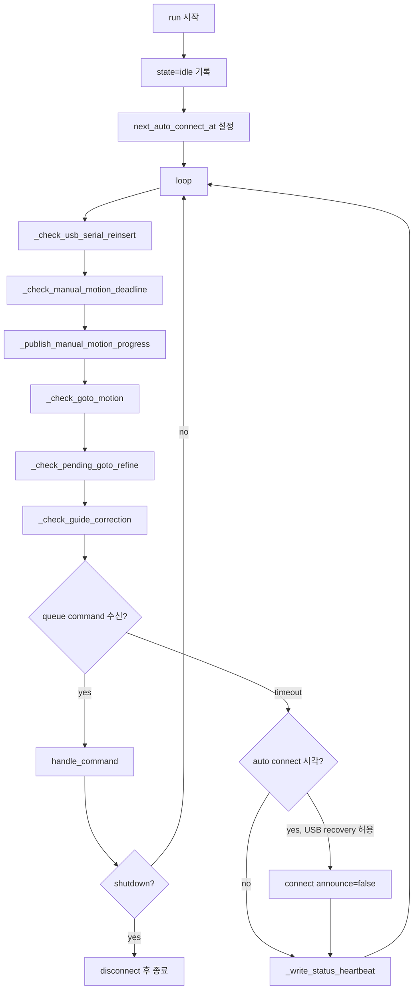

루프 특징:

- 명령이 없어도 주기적으로 수동 이동 deadline, GoTo 완료, refine, guide correction을 확인한다.
- 수동 이동 중이면 queue timeout이 짧아져 stop/deadman 처리가 빠르게 돈다.
- 서비스 시작 후 5초 뒤 자동 연결을 시도하고, 실패하면 10초 간격으로 재시도한다.
- 연결 후 heartbeat는 명령 처리가 비어 있을 때 nominal 2초 간격으로 상태 파일을
  갱신한다.
- OnStepX USB 설정에서는 configured serial path를 1초마다 확인한다. 분리 및
  재삽입 복구 중에는 일반 auto-connect를 억제한다.

<a id="mf_mountcontrol_indi_flow_ko--상태-기록-흐름"></a>
### 상태 기록 흐름

상태 기록은 대부분 `_write_controller_status()`를 통해 이루어진다.

```mermaid
flowchart TD
    A[동작 함수] --> B[_write_controller_status]
    B --> C[_status_fields]
    C --> D[현재 내부 상태 병합]
    D --> E[_home_park_status_fields]
    E --> F[OnStep Status / Park / raw :GU# 조회]
    F --> G[_write_status]
    G --> H[mount_control_status.json atomic write]
```

중요한 점:

- `_status_fields()`는 `current_ra/current_dec`를 항상 `ra/dec`로 넣는다.
- `_mount_common_status_fields()`는 동작별 내부 상태를 공통 telemetry로 정규화한다.
- manual motion, GoTo, guide correction, backlash, multipoint align 상태가 있으면
  같은 payload에 같이 들어간다.
- `PointingCoordinateService`는 이 상태 파일의 `ra/dec`,
  `mount_readback_priority`, `mount_motion_active`, `coordinate_sync`,
  `multipoint_align` 등을 사용해 현재 좌표 후보를 판단한다.
- `goto_motion_active`, `manual_motion_direction`, `goto_refine_pending`,
  `state`는 계속 남아 있지만 좌표 선택의 1차 기준은 공통 telemetry이다.

공통 mount telemetry:

```text
mount_motion_active
  실제 또는 명령상 마운트가 움직이는 중이면 true.

mount_motion_type
  manual / goto / goto_refine_settle / guide_correction /
  align_goto / backlash_auto 등의 진단용 분류.

mount_readback_priority
  좌표 서비스가 IMU delta보다 mount readback을 우선해야 하면 true.
  GoTo settle/refine처럼 실제 motion은 아닐 수 있지만 readback이
  authoritative 해야 하는 구간도 포함한다.
```

<a id="mf_mountcontrol_indi_flow_ko--indi-연결-순서"></a>
### INDI 연결 순서

`connect()`는 명령 실행 전에 자주 호출된다. 이미 정상 연결이면 바로 성공한다.

```mermaid
flowchart TD
    A[connect] --> B{이미 connected?}
    B -->|yes, device connected| OK[return true]
    B -->|yes, stale| C[mark_disconnected]
    B -->|no| D{PyIndi 있음?}
    D -->|no| FAIL[missing_pyindi]
    D -->|yes| E{OnStep direct location/time sync?}
    E -->|yes| F[sync_location_time reconnect_after=false]
    E -->|no| G[기존 client disconnect]
    F --> G
    G --> H[PiFinderIndiClient 생성]
    H --> I[connectServer]
    I -->|fail| FAIL2[server_unavailable]
    I -->|ok| J[_wait_for_device]
    J -->|fail| FAIL3[no_telescope]
    J -->|ok| K[CONNECTION property 대기]
    K --> L{driver device connected?}
    L -->|no| M[CONNECTION.CONNECT set_switch]
    L -->|yes| N{INDI location/time sync?}
    M --> N
    N -->|필요| O[sync_location_time]
    N -->|skip| P[unpark_mount]
    O --> P
    P --> Q[enable_tracking]
    Q --> R[_wait_for_current_position]
    R -->|fail| FAIL4[device_connect_failed]
    R -->|ok| S[connected=true, state=connected]
```

주의:

- OnStepX direct sync 설정이 켜져 있으면 INDI 연결 전에 exclusive LX200
  location/time sync를 수행할 수 있다.
- 연결 성공 후 현재 구현은 `unpark_mount()`와 `enable_tracking()`을 호출한다.
- 연결 마지막에는 `EQUATORIAL_EOD_COORD` readback을 기다려 `current_ra/current_dec`를 채운다.

<a id="mf_mountcontrol_indi_flow_ko--indi-client-event와-위치-갱신"></a>
### INDI client event와 위치 갱신

`PiFinderIndiClient.updateProperty()`가 INDI 2.x의 단일 콜백으로,
`EQUATORIAL_EOD_COORD` number vector가 갱신될 때(드라이버 `POLLING_PERIOD`,
기본 1초 주기) 호출된다. 구버전 PyIndi 호환용 `newNumber()`도 남아 있지만,
현재 설치된 PyIndi(INDI 2.x)에서는 호출되지 않는다 — 과거에는 이 때문에
드라이버의 좌표 push가 전부 유실되어 위치가 5초 heartbeat로만 갱신됐다
(2026-07-17 수정).

```mermaid
flowchart TD
    A[INDI updateProperty EQUATORIAL_EOD_COORD] --> B[RA hours / DEC deg 추출]
    B --> C[set_current_position RA*15, DEC]
    C --> D[current_ra/current_dec 갱신]
    D --> E[_write_position_status]
    E --> F{0.5초 제한 통과?}
    F -->|yes| G[state=connected, ra/dec 기록]
    F -->|no| H[내부 값만 갱신]
```

이 이벤트 기반 갱신은 GoTo/추적을 포함한 일반 readback 변화를 ~1Hz로
공급하며, pointing coordinate service의 마운트 이동 감지가 이 주기에
의존한다. 수동 이동 중에는 INDI driver가 좌표를 즉시 발행하지 않거나
PiFinder 루프가 소비하지 못할 수 있어, 현재 구현은 수동 이동 중 별도
polling 발행도 수행한다.

<a id="mf_mountcontrol_indi_flow_ko--onstepx-usb-분리재삽입-복구"></a>
### OnStepX USB 분리·재삽입 복구

USB transport의 effective 설정이 확정되면 mount-control은 설정된 serial path를
감시한다. `/dev/ttyUSB*` 번호 변경을 피하기 위해 Web에서 저장된
`/dev/serial/by-id/...` 경로를 사용하는 것이 기준이다.

```mermaid
flowchart TD
    A[healthy / configured path present] -->|path absent| B[usb_absent]
    B --> C[park tracking slew-rate track-frequency snapshot]
    C --> D[connected=false / 일반 auto-connect 억제]
    D -->|같은 path 재등장| E[return_debounce 2초]
    E -->|다시 소실| B
    E -->|2초 유지| F[CONNECTION.DISCONNECT 1회]
    F --> G[보존 모드 connect]
    G --> H{새 좌표 + 새 OnStep Status?}
    H -->|아니오| X[recovery_failed / 같은 주기 retry 금지]
    H -->|예| I[park 상태 불변 확인]
    I --> J[필요한 tracking slew frequency만 복원]
    J --> K[healthy / recovery_attempt=1]
```

보존 모드 `connect()`는 location/time sync, unpark, tracking-on을 실행하지 않는다.
cached `CONNECTION=On`이나 기존 좌표 property 존재만으로는 성공하지 않으며,
새 client generation 이후 좌표와 `OnStep Status` callback을 모두 확인한다.
park 상태가 달라졌으면 자동 park/unpark 이동을 하지 않고 실패로 남긴다.
tracking과 slew rate는 snapshot과 현재 상태가 명확하게 다를 때만 원래 값으로
복원한다. 수동 이동·GoTo·guide 명령은 저장하거나 재전송하지 않는다.

오래된 INDI client의 늦은 disconnect callback은 generation이 다르면 무시한다.
USB 분리 뒤 늦게 도착한 좌표 callback도 `connected=false`인 동안 최상위 상태를
`connected`로 덮어쓰지 않는다. 로그와 상태는 기존 tmpfs 경로만 사용하며 USB
복구 전용 SD 로그를 만들지 않는다.

<a id="mf_mountcontrol_indi_flow_ko--명령-분배"></a>
### 명령 분배

`handle_command()`는 queue command의 `type`에 따라 실제 함수로 분기한다.

| command type | 처리 함수 | 의미 |
| --- | --- | --- |
| `shutdown` | return false | mount-control loop 종료 |
| `init` | `connect()` | INDI 연결 |
| `restart_driver` | `restart_driver()` | INDI Web Manager/server/driver 재시작 |
| `sync` | `sync_mount()` | mount 좌표를 지정 RA/Dec로 sync |
| `goto_target` | `goto_target()` | 지정 RA/Dec로 GoTo |
| `toggle_guide_correction` | `toggle_guide_correction()` | solve 기반 1회/반복 보정 토글 |
| `stop_movement` | `stop_mount()` | 이동 정지. `stop_tracking=true`(LCD 0키)이면 대기 보정도 취소하고 Tracking Off를 확인 |
| `manual_movement` | `manual_move()` | 방향키 수동 이동 시작/유지 |
| `manual_movement_keepalive` | `manual_motion_keepalive()` | 같은 방향 lease 연장 |
| `increase_slew_rate` | `change_slew_rate(1)` | slew rate 증가 |
| `reduce_slew_rate` | `change_slew_rate(-1)` | slew rate 감소 |
| `set_slew_rate` | `set_slew_rate()` | slew rate 직접 설정 |
| `refresh_slew_rate` | `refresh_slew_rate()` | driver slew rate 읽기 |
| `refresh_backlash` | `refresh_backlash()` | backlash readback |
| `set_backlash` | `set_backlash()` | backlash 값 저장 |
| `auto_backlash` | `auto_calculate_backlash()` | backlash motion test 시작 |
| `backlash_compass_continue` | `continue_backlash_compass_goto_loop()` | backlash test 다음 단계 |
| `backlash_compass_stop` | `stop_backlash_auto()` | backlash test 중지 |
| `multipoint_align_start` | `start_multipoint_align()` | Multi Align 시작 |
| `multipoint_align_select_star` | `select_multipoint_align_star()` | 별 선택 |
| `multipoint_align_goto_target` | `select_multipoint_align_target()` | SkySafari target으로 align target 설정/GoTo |
| `multipoint_align_confirm` | `confirm_multipoint_align()` | align point 확정 |
| `multipoint_align_clear_target` | `clear_multipoint_align_target()` | 현재 target만 지우고 세션 유지 |
| `multipoint_align_cancel` | `cancel_multipoint_align()` | Multi Align 취소 |
| `sync_location_time` | `sync_location_time()` | 위치/시간 동기화 |
| `park_action` | `park_action()` | park/unpark/home/set-park 동작 |

<a id="mf_mountcontrol_indi_flow_ko--수동-이동-순서"></a>
### 수동 이동 순서

수동 이동은 Web UI, LCD UI, Bluetooth/USB keyboard, SkySafari guide command가
공통으로 사용하는 핵심 경로이다.

SkySafari guide command 예:

```text
:Mn# -> north
:Ms# -> south
:Me# -> east
:Mw# -> west
:Q#  -> stop
```

`pos_server.py`는 guide move를 받으면 mount-control queue에 수동 이동 명령을
넣고, SkySafari가 짧은 TCP command connection을 반복해서 쓰는 경우에도 이동이
끊기지 않도록 내부 keepalive timer를 유지한다.

```text
{"type": "manual_movement", "direction": "...", "lease_seconds": ...}
{"type": "manual_movement_keepalive", "direction": "...", "lease_seconds": ...}
{"type": "stop_movement"}
```

순서:

```mermaid
flowchart TD
    S[SkySafari :Mn/:Ms/:Me/:Mw] --> T[pos_server guide timer 시작]
    T --> A[manual_movement command]
    T --> KA[0.4초마다 manual_movement_keepalive]
    T --> KR[8초마다 manual_movement 재전송]
    S2[SkySafari :Q/:Qn/:Qs/:Qe/:Qw] --> STOPCMD[stop_movement]
    A --> B[manual_move direction]
    B --> C{direction 유효?}
    C -->|no| FAIL[return false]
    C -->|yes| D[INDI motion property 선택]
    D --> E[_apply_indi_properties]
    E -->|fail| FAIL2[state=manual_failed]
    E -->|ok| F[_arm_manual_motion_deadline]
    F --> G[_publish_manual_motion_progress force=true]
    G --> H[state=manual_motion, ra/dec 기록]
    H --> I[run loop]
    I --> J[_publish_manual_motion_progress]
    J --> K[0.5초 간격으로 cached readback 발행]
    I --> L[_check_manual_motion_deadline]
    L --> M{lease 만료?}
    M -->|no| I
    M -->|yes| N[stop_mount]
    N --> O[TELESCOPE_ABORT_MOTION.ABORT]
    KA --> I
    KR --> B
    STOPCMD --> N
```

방향 매핑:

```text
north     -> TELESCOPE_MOTION_NS.MOTION_NORTH
south     -> TELESCOPE_MOTION_NS.MOTION_SOUTH
east      -> TELESCOPE_MOTION_WE.MOTION_WEST
west      -> TELESCOPE_MOTION_WE.MOTION_EAST
northeast -> north + west
northwest -> north + east
southeast -> south + west
southwest -> south + east
```

east/west가 반대로 매핑되는 이유:

- 현재 UI/사용자 기준 방향과 OnStep guide axis 방향을 맞추기 위한 보정이다.
- 이 보정은 테스트로 고정되어 있다.

deadman/lease 동작:

- `manual_move()`가 시작되면 기본 1.2초 lease가 잡힌다.
- 같은 방향 keepalive가 들어오면 mount-control deadline이 연장된다.
- mount-control 단일 `manual_movement`의 최대 연속 시간은 10초이다.
- SkySafari POS server는 누르고 있는 동안 0.4초 간격 keepalive를 보내고,
  8초마다 새 `manual_movement`를 보내 mount-control의 10초 연속 제한을
  넘지 않게 한다.
- SkySafari guide bridge의 전체 안전 제한은 60초이다.
- stop command 또는 lease 만료 시 `TELESCOPE_ABORT_MOTION.ABORT`를 보낸다.
- TCP command connection이 닫힌 것만으로는 stop을 보내지 않는다.
  SkySafari가 짧은 연결로 `:Mn#`과 `:Qn#`을 따로 보낼 수 있기 때문이다.
  실제 정지는 `:Q...#` 명령 또는 60초 안전 제한으로 처리한다.

좌표 발행:

- 수동 이동 시작 직후 `manual_motion` 상태와 현재 `ra/dec`를 강제로 발행한다.
- 이후 run loop에서 0.5초 간격으로 `ra/dec`를 갱신 발행한다.
- 이때 공통 telemetry는 `mount_motion_active=true`,
  `mount_motion_type=manual`, `mount_readback_priority=true`가 된다.
- `PointingCoordinateService`는 세부 동작 이름이 아니라
  `mount_readback_priority=true`를 보고 IMU delta를 보류하고 mount readback을 우선한다.

<a id="mf_mountcontrol_indi_flow_ko--goto-순서"></a>
### GoTo 순서

`goto_target()`은 INDI 표준 `ON_COORD_SET=SLEW`와 `EQUATORIAL_EOD_COORD`를 사용한다.

```mermaid
flowchart TD
    A[goto_target ra dec] --> B[connect]
    B -->|fail| FAIL[return false]
    B -->|ok| C[ON_COORD_SET.SLEW]
    C --> D[EQUATORIAL_EOD_COORD RA=deg/15 DEC=deg]
    D --> E[_goto_target_accepted]
    E -->|fail, retry 가능| C
    E -->|fail, retry 초과| F[state=goto_failed]
    E -->|ok| G[_last_goto_target 저장]
    G --> H[_arm_goto_motion]
    H --> I[state=slewing, target_ra/target_dec 기록]
    I --> J[run loop _check_goto_motion]
```

GoTo target acceptance는 다음 중 하나면 성공으로 본다.

- `TARGET_EOD_COORD` readback이 target과 3 arcmin 이내
- INDI mount busy 상태가 true
- OnStep raw status가 GoTo active로 보임
- 현재 좌표가 target과 3 arcmin 이내
- timeout 전 위 조건 중 하나를 만족

<a id="mf_mountcontrol_indi_flow_ko--goto-진행완료-판정"></a>
### GoTo 진행/완료 판정

GoTo가 시작되면 `_goto_motion` dict가 만들어진다.

```text
target_ra
target_dec
started_at
complete_ready_since
indi_seen_busy
onstep_seen_goto_active
last_complete_position
target_error_deg
position_change_deg
```

진행 중 루프:

```mermaid
flowchart TD
    A[_check_goto_motion] --> B{_goto_motion 있음?}
    B -->|no| END[return]
    B -->|yes| C{refine 대기 중?}
    C -->|yes| END
    C -->|no| D{manual motion 중?}
    D -->|yes| END
    D -->|no| E{시작 후 1초 지남?}
    E -->|no| END
    E -->|yes| F[_indi_mount_is_busy]
    F --> G[_read_goto_progress_position]
    G --> H[_write_goto_progress_status]
    H --> I[_goto_completion_ready]
    I -->|ready| J[_complete_goto_motion]
    I -->|not ready| K{180초 초과?}
    K -->|yes| L[timeout complete 처리]
    K -->|no| END
```

완료 판정 조건:

1. INDI busy가 true이면 완료 아님.
2. OnStep raw `:GU# return`에 GoTo active가 보이면 완료 아님.
3. OnStep complete가 true라도 busy/active를 한 번도 못 봤고 시작 후 3초 미만이면 관찰 대기.
4. INDI busy가 명확히 false가 아니면 완료 아님.
5. 현재 위치가 target과 0.5도보다 멀면 완료 아님.
6. 현재 위치가 직전 완료 후보 위치에서 0.02도보다 많이 움직였으면 완료 아님.
7. 위 조건을 통과한 상태가 4초 이상 유지되면 완료.

GoTo 진행 상태 발행:

```text
state = slewing
message = GoTo in progress
mount_motion_active = true
mount_motion_type = goto
mount_readback_priority = true
ra
dec
target_ra
target_dec
target_error_deg
indi_busy
goto_wait_seconds
goto_motion_active = true
```

이 값이 SkySafari 좌표 안정성에 중요하다. GoTo 중에는 mount readback을 계속 발행하고,
`PointingCoordinateService`는 `mount_readback_priority=true`를 보고 이를 우선 사용한다.

<a id="mf_mountcontrol_indi_flow_ko--goto-refine와-guide-correction"></a>
### GoTo refine와 guide correction

참고(2026-07-19): `indi_goto_refine_once` 옵션이 제거되어 이제
`refine_after_goto=true`를 보내는 호출자가 없다. GoTo 후 정밀 보정은
GoTo/Guide 서비스(`indi_goto_method = pifinder`)가 담당하며, 아래 refine 로직은
mount-control에 남아 있지만 휴면 상태다.

GoTo refine:

```mermaid
flowchart TD
    A[goto_target refine_after_goto=true] --> B[_arm_goto_refine]
    B --> C[state=refine_wait]
    C --> D[8초 대기]
    D --> E[_current_plate_solve]
    E -->|fresh solve 없음| F[계속 대기 또는 timeout]
    E -->|fresh solve 있음| G[solve 좌표와 target 오차 계산]
    G -->|accuracy 이내| H[state=refine_complete]
    G -->|accuracy 초과| I[sync_mount solve 좌표]
    I --> J[goto_target target 다시 전송]
    J --> K[state=refine_sent]
```

Guide correction:

GoTo 완료 허용 오차(`indi_goto_refine_accuracy_arcmin`)는 2026-10-03 요청에 따라
기본값과 현재 저장 설정 모두 **1분각**으로 변경했다. GoTo 정지 후 새 솔빙의
오차가 1분각 이하이면 완료하며, 이를 초과하면 기존 미세 보정·재시도 절차를
따른다. 추적 유지도 같은 `indi_goto_refine_accuracy_arcmin` 값을 사용한다.
후속 요청으로 두 기준을 통합했으며, 설정 화면의 “GoTo 완료·추적 유지 허용 오차”를
변경하면 둘 다 함께 바뀐다. 이전 `indi_tracking_guide_threshold_arcmin` 키는
구버전 프로세스 호환용으로만 같은 값을 저장하며 새 판정에서는 사용하지 않는다.

```mermaid
flowchart TD
    A[toggle_guide_correction on] --> B[target 결정]
    B --> C[interval마다 fresh solve 확인]
    C --> D[target과 solve 오차 계산]
    D -->|accuracy 이내| E[추가 펄스 없이 다음 새 솔빙 대기]
    D -->|accuracy 초과| F[확인된 가이드 속도로 timed pulse]
    F -->|timed pulse 미지원| G[manual_move direction, 짧은 lease]
```

2026-10-03 사용자 요청에 따라 **기존 반복 솔빙·보정에서 학습하던 예측 보정은 제거했다.**
추적 유지 명령은 `predictive_tracking=false`를 전달하며, 오래된 명령의 true도
호환성 인자로만 받고 무시한다. 기존 가이드는 새 솔빙에서 확인한 오차가
허용 범위를 벗어날 때만 위치 펄스를 보낸다. 솔빙 사이의 0.2초 예측 루프,
100ms 예측 펄스, 작은 예측량 누적 및 `GuideDrift` 학습 연결은 사용하지 않는다.
상태 호환 필드 `guide_predictive_tracking`은 false,
`guide_drift_arcsec_per_sec`는 0이다.

새 **부드러운 영상 보정 엔진**의 RAW 기반 위치 보정·드리프트 추정·예측과
검증된 짧은 한도 내 예측 유지는 그대로 유지한다. 이 기능은 별도 설정과
검증된 프로필을 사용하며 기존 보정과 명령 소유권을 공유하지 않는다.

복귀 GoTo가 끝난 뒤에는 최초 정지 확인 시각을 기록하고, 그 시각 이후에 촬영한
최근의 고품질 카메라 solve를 확인해야 추적 보정을 다시 활성화한다.
`observation_after_wall`로 같은 시각을 mount-control에도 전달해 독립적으로 읽은
이전 solve를 소비하지 않게 한다. 새 solve가 없으면 복귀 대기 상태를 유지한다.
2026-10-02 M31 증상 조사에서, 기존 경로가 도착 전 좌표를 재사용해 2500ms
추가 펄스를 보내는 경우를 모의 재현했다. 오래된 오차가 작은 경우의 펄스와
큰 경우의 반복 GoTo를 모두 회귀 테스트로 차단했다. 당시 상세 RAM 로그는
남아 있지 않아 첫 이탈의 실제 원인은 확정하지 못했다.

아래는 제거 전 기존 예측 펄스에 관한 2026-10-02 조사 기록이다.
당시 0.2초는 애플리케이션의 전송 주기이며 물리적인 보정 주기를 보장하지 않았다.
공개 [OnStepX Mount.cpp](https://github.com/hjd1964/OnStepX/blob/main/src/telescope/mount/Mount.cpp)의
Alt/Az 경로는 1초마다 `poll()`에서 가이드 영향을 추적 속도로 변환한다.
[Guide.cpp](https://github.com/hjd1964/OnStepX/blob/main/src/telescope/mount/guide/Guide.cpp)의
펄스 시작·종료는 `update()`를 호출하지만 이 Alt/Az 변환을 다시 계산하지 않는다.
따라서 짧은 펄스가 poll 사이에서 사라지거나, poll에서 반영된 속도가 다음 poll까지
남을 가능성이 있다. 동일한 100ms 요청을 200ms마다 보내는 단순 모델에서도
poll과의 시차에 따라 효과가 달라졌다. 기존 단위 테스트는 명령 길이만큼 정확히
움직이는 모델을 사용하므로 이 펌웨어 응답 차이를 검증하지 못한다.

2026-10-02 실내에서 설치된 OnStepX 10.28x를 직접 시험했다. 추적 중 100ms
북쪽 펄스의 Dec 좌표 변화는 거의 0 또는 약 9각초였고, 100ms 펄스 10개를
목표 200ms 간격으로 보낸 세 시험은 각각 약 9·18·0각초였다. 실제 명령 평균
간격은 약 200~204ms였다. 2500ms 펄스도 약 3초간 속도에 반영됐다.
이 결과는 짧은 펄스의 효과가 시작 시점에 따라 달라진다는 문제를 장비에서도
확인한 것이다. 예측기의 명령 기반 이동량 추정이 실제 응답과 일치하지 않는다.
이는 모터 카운터와 펌웨어 좌표의 측정이며, 독립 엔코더나 별 영상 검증은 아니다.
시험 고도는 펌웨어 좌표 기준 약 -0.52도로 M15/M31 관측 조건을 재현하지 않았다.
M15의 최초 증상은 예측 기능 추가 전에도 있었다는 사용자 설명이 있으므로,
짧은 예측 펄스만으로 당시 첫 이탈의 원인을 확정할 수 없다.

같은 시험에서 INDI가 추적 정지와 오래된 좌표를 보고하면서 실제 펌웨어는
추적 중인 상태도 확인했다. INDI 드라이버 재시작 후 추적 상태 보고가 복구됐고,
INDI 경유 시험에서도 100ms 북쪽 펄스에 약 9각초가 반영되는 경우를 확인했다.
INDI 좌표는 변경 시에만 통지되며 표준 좌표 정밀도가 낮으므로, 세부 시간/이동량
판단에는 위 직접 통신의 고정밀 좌표와 모터 카운터 기록을 사용한다.
관측 당시에도 이 상태였는지는 확인되지 않았다. 현장 관측 DB와 상세 펄스/솔빙
기록은 남아 있지 않았으며, journal의 GoTo 기록만으로 원래 오차를 재생할 수 없다.
시험 원자료와 요약은 데이터 디렉터리의
`telemetry/20261002_indoor_tracking/`에 저장했다.

2026-10-02 야외 재관측에서 솔빙 중단 후 복구 경로가 도착 오차에 관계없이
새 Sync+GoTo를 시작하고, 보정 횟수와 미세 보정 실패 판단을 초기화하는 것을
확인했다. 이제 이 경로도 일반 GoTo 도착과 같은 `_evaluate_goto_arrival()`로
진입한다. 정지 후의 새 solve 오차가 정확도 이내이면 완료하고, 근접 범위이면
미세 보정하며, 범위 밖일 때만 GoTo를 보낸다. 기존 횟수와 미세 보정 실패
판단은 유지하므로 솔빙 복구만으로 재시도 배치의 대기를 우회하지 않는다.
반복 솔빙 중단, 중앙 도착, 근접/원거리 도착, 배치 한계와 실패 판단 유지를
포함한 관련 테스트 357개를 통과했다.

같은 날 23:18경에는 이동 명령 없이 약 12초간 마운트 카운터와 카메라 solve를
동시에 기록했다. 고도 카운터는 약 +11.15각초/초, 13개 카메라 solve에서 추정한
고도 변화는 약 +149.83각초/초였다. 이 구간은 양쪽 모두 상승 방향이며 속도
차이가 크다. 방위각은 각각 약 -7.71, -9.29각초/초였다. 카메라 값은 J2000
좌표를 GMST로 근사 변환한 결과이므로 정밀 축 배율 보정값으로 사용하지 않는다.
미정렬 상태의 마운트 절대 좌표 차이 자체를 오류 근거로 삼지 않으며, 특정 천체나
고도에서 방향이 반전되는지는 아직 확인하지 못했다. 추적/GoTo 마이크로스텝은
설정값으로 64/4이지만 실제 드라이버 레지스터는 읽지 못했으므로 전환 실패도
확정하지 않았다. 실제 과속을 확인한 뒤 자동 보정과 기본 추적을 정지했다.
원자료와 동시 비교 결과는 `telemetry/20261002_225845_M31_user_goto/`의
`simultaneous_native_direction.jsonl`, `simultaneous_direction_analysis.json`,
카메라 기록은 `captures/solver_sessions/a218aae1a067409cb1fc6a97d1ceff52/`에 있다.

<a id="mf_mountcontrol_indi_flow_ko--sync-순서"></a>
### Sync 순서

`sync_mount(ra, dec)`는 INDI 표준 sync 경로를 사용한다.

```mermaid
flowchart TD
    A[sync_mount ra dec] --> B[connect]
    B --> C[ON_COORD_SET.SYNC]
    C --> D[EQUATORIAL_EOD_COORD RA=deg/15 DEC=deg]
    D --> E[state=connected, mount synced]
    E --> F[set_current_position ra dec]
```

Multi Align과 SkySafari align/sync 동작에서 이 경로가 중요하다.

<a id="mf_mountcontrol_indi_flow_ko--locationtime-sync"></a>
### Location/Time sync

`sync_location_time()`은 설정에 따라 두 경로 중 하나를 사용한다.

```mermaid
flowchart TD
    A[sync_location_time] --> B[_shared_location_time_values]
    B --> C{direct OnStep LX200 sync?}
    C -->|yes| D[_sync_location_time_direct_onstep]
    C -->|no| E[apply_indi_onstep_location_time]
    D --> F[필요 시 INDI reconnect]
    E --> G[write_onstep_location_cache]
```

OnStep direct sync:

- INDI driver와 같은 TCP/serial port를 공유하면 충돌할 수 있으므로 exclusive 방식으로 처리한다.
- INDI를 멈추거나 driver 연결을 정리한 뒤 LX200 command를 직접 보내고 다시 연결한다.

INDI sync:

- PyIndi/INDI property를 사용해 latitude, longitude, elevation, UTC time을 보낸다.

시계 신뢰 게이트(A4): 미신뢰 시계도 전송을 막지 않고 현재 PiFinder 시간을
잠정(provisional)으로 보낸다 — 상세 규약과 근거는
[mf_time_sync_ko.md](connectivity.md#mf_time_sync_ko)(정규 소유자) 참조. Multi-Point
Align 시작만 하드 게이트를 유지한다(`_sync_multipoint_location_time`).

<a id="mf_mountcontrol_indi_flow_ko--parkhometrackingslew"></a>
### Park/Home/Tracking/Slew

Park/Home:

```text
park        -> TELESCOPE_PARK.PARK
unpark      -> TELESCOPE_PARK.UNPARK
set_home    -> TELESCOPE_HOME.SET
return_home -> TELESCOPE_HOME.GO
set_park    -> TELESCOPE_PARK_OPTION.PARK_CURRENT
```

Tracking:

- `_read_tracking_enabled()`는 driver property와 OnStep Status text를 함께 확인한다.
- `set_tracking(enabled)`는 tracking switch를 적용하고 confirm한다.

Slew rate:

- `set_slew_rate(rate)`는 `TELESCOPE_SLEW_RATE.<0..9>`를 적용한다.
- `refresh_slew_rate()`는 현재 driver switch 상태를 읽어 `self.slew_rate`를 갱신한다.

Guide rate:

- `set_guide_rate(rate)`는 driver의 guide rate number vector를 적용한다.
- OnStepX 드라이버는 이 쓰기를 펌웨어 공유 레이트 선택자 `:R<n>#`로 보내
  수동 이동 속도까지 오염시킨다 — 가이드 사이클마다 펄스 창 종료 후 사용자
  slew rate를 재적용하고, 사용자 `manual_move` 직전에도 오염 시 즉시
  재적용한다(상세: [mf_indi_goto_guide_plan_ko.md](mount.md#mf_indi_goto_guide_plan_ko)
  복귀 속도 전환 절).
- 현재 backlash 테스트는 pulse guide 방식이 아니라 GoTo loop 방식으로 정리되어 있다.

<a id="mf_mountcontrol_indi_flow_ko--backlash-관련-흐름-요약"></a>
### Backlash 관련 흐름 요약

Backlash의 수동 저장, 자동 측정 상태 machine, GoTo 측정 loop, solved 좌표 기록,
필터링, 추천값 계산은 `python/PiFinder/indi_backlash_calibration.py`의
`BacklashCalibrationMixin`에서 관리한다. `MountControlIndi`는 이 mixin을
상속하고, INDI 연결/GoTo/Sync/Tracking/status 발행 같은 공통 마운트 동작을
제공한다.

자동 Backlash 계산 좌표는 `PointingCoordinateService.solved`에서 가져오며,
plate solve가 유효한 상태에서만 동작한다. `PointingCoordinateService.current`
는 fallback이 섞일 수 있으므로 계산에는 사용하지 않는다.

Backlash UI 명령은 다음으로 들어온다.

```text
refresh_backlash
set_backlash
auto_backlash
backlash_compass_continue
backlash_compass_stop
```

`set_backlash()`:

```mermaid
flowchart TD
    A[set_backlash ra de] --> B[value 0..3600 validate]
    B --> C[_apply_backlash_values]
    C --> D[_apply_indi_backlash]
    D --> E[state=connected, backlash_ra/backlash_de 갱신]
```

Auto backlash:

- 현재 주 모드는 `compass_goto_loop`이다.
- `PointingCoordinateService.solved`가 유효한지 확인한다.
- 안전 위치/마운트 모델/AltAz 또는 RA/Dec frame을 고려한다.
- 이동 기록은 상세 CSV/records 형태로 분석한다.
- 계산 결과를 UI에 표시하지만, 최종 적용은 사용자가 입력/저장하는 방식이다.

자세한 절차는 `docs/mf_dev/mf_backlash_measurement_flow_ko.md`와 실제 UI 상태를
함께 봐야 한다.

<a id="mf_mountcontrol_indi_flow_ko--multi-point-align-흐름-요약"></a>
### Multi-Point Align 흐름 요약

명령:

```text
multipoint_align_start
multipoint_align_select_star
multipoint_align_goto_target
multipoint_align_confirm
multipoint_align_clear_target
multipoint_align_cancel
```

시작 순서:

```mermaid
flowchart TD
    A[start_multipoint_align] --> B[controller.start]
    B --> C[sync location/time]
    C --> D[stale OnStep native alignment reset]
    D --> E[PiFinder pointing 읽기]
    E --> F[sync_mount PiFinder coordinate]
    F --> G[verify mount sync]
    G --> H[native alignment start는 defer]
    H --> I{mode auto?}
    I -->|yes| J[auto star 선택]
    I -->|no| K[manual star 대기]
    J --> L[_align_goto_current_star]
```

중요 규칙:

- Multi Align 시작 시 mount 좌표를 PiFinder 좌표에 먼저 sync한다.
- PiFinder 좌표는 solve/estimate가 있으면 그것을 우선하고, 없으면 IMU fallback을 사용한다.
- OnStep native alignment start는 현재 구현에서 즉시 시작하지 않고 defer한다.
  이유는 OnStep native align start가 home frame을 reset할 수 있어 star-selection/GoTo
  이전 PiFinder sync를 깨뜨릴 수 있기 때문이다.
- 별을 선택하면 target sent 여부를 기록한다.
- confirm은 가장 최근 GoTo/선택된 target 좌표를 기준으로 처리한다.
- native alignment session이 시작된 경우 `NewAlignStar.1`을 보내고,
  그렇지 않으면 `sync_mount()`로 현재 별 좌표에 sync한다.

자세한 순서도는 `docs/mf_dev/mf_multipoint_align_flow_ko.md`를 기준으로 본다.

<a id="mf_mountcontrol_indi_flow_ko--skysafari와의-관계"></a>
### SkySafari와의 관계

SkySafari는 PiFinder에 좌표를 push 받지 않는다. LX200 명령으로 계속 요청한다.

```text
:GR# -> current RA 요청
:GD# -> current Dec 요청
```

PiFinder 쪽 흐름:

```mermaid
flowchart LR
    MC[MountControlIndi] --> MCS[mount_control_status.json]
    MCS --> PCS[PointingCoordinateService background loop]
    PCS --> Current[latest CoordinateState.current]
    SS[SkySafari :GR#/:GD#] --> POS[pos_server]
    POS --> Current
    POS --> Reply[LX200 RA/Dec response]
```

따라서 mount-control이 GoTo/수동 이동 중 `ra/dec`를 계속 발행해야 SkySafari 위치가
움직이는 중에도 자연스럽게 변한다.

<a id="mf_mountcontrol_indi_flow_ko--디버깅-포인트"></a>
### 디버깅 포인트

서비스 상태:

```bash
systemctl status pifinder.service --no-pager -l
```

mount-control 상태:

```bash
jq . /home/pifinder/PiFinder_data/mount_control_status.json
```

coordinate service 상태:

```bash
jq . /home/pifinder/PiFinder_data/pointing_coordinate_status.json
```

수동 이동 중 확인할 값:

```text
mount_control_status.json:
  state == "manual_motion"
  mount_motion_active == true
  mount_motion_type == "manual"
  mount_readback_priority == true
  manual_motion_direction != null  # 호환/진단용
  ra / dec가 0.5초 간격으로 변함

pointing_coordinate_status.json:
  current.source가 mount 또는 mount_delta 계열로 유지
  health warning에 mount motion/settle active가 보일 수 있음
```

GoTo 중 확인할 값:

```text
mount_control_status.json:
  state == "slewing"
  mount_motion_active == true
  mount_motion_type == "goto"
  mount_readback_priority == true
  goto_motion_active == true  # 호환/진단용
  target_ra / target_dec
  target_error_deg
  ra / dec가 이동 중 변함

pointing_coordinate_status.json:
  GoTo 중 IMU delta보다 mount readback 우선
```

문제가 생겼을 때 우선순위:

1. `mount_control_status.json`의 `ra/dec`가 실제로 갱신되는지 본다.
2. 갱신된다면 `pointing_coordinate_status.json`에서 어떤 source가 선택되는지 본다.
3. 둘 다 정상인데 SkySafari만 다르면 POS server의 `:GR#/:GD#` 응답 경로를 본다.
4. `mount_control_status.json`이 멈춰 있으면 INDI driver readback 또는 mount-control loop를 본다.

<a id="mf_mountcontrol_indi_flow_ko--현재-수동-이동-좌표-갱신의-핵심"></a>
### 현재 수동 이동 좌표 갱신의 핵심

현재 수동 이동 좌표 갱신은 다음 세 함수가 담당한다.

```text
_read_manual_motion_progress_position()
_write_manual_motion_progress_status()
_publish_manual_motion_progress()
```

호출 위치:

```text
manual_move()
  -> 시작 직후 force publish

run()
  -> 매 loop 시작부
  -> queue timeout 후 empty branch
```

이 구조의 목적:

- SkySafari가 좌표를 요청할 때 최신 수동 이동 좌표를 받을 수 있게 한다.
- GoTo와 동일하게 움직이는 동안 mount readback을 우선하게 한다.
- IMU 흔들림이 수동 이동 중 좌표 오차로 섞이지 않게 한다.


---

<a id="mf_multipoint_align_flow_ko"></a>

## mf_multipoint_align_flow_ko.md

<a id="mf_multipoint_align_flow_ko--mf-pifinder-indi-multi-align-소스-흐름"></a>
## MF PiFinder INDI Multi Align 소스 흐름

작성 기준: `mf_pifinder` 브랜치, 2026-07-08.

이 문서는 현재 소스 기준의 INDI Multi Align 구조와 Web UI, LCD GUI,
SkySafari 연동 흐름을 정리한다. Multi Align의 핵심 절차는
`python/PiFinder/indi_multipoint_align.py`의 공통 컨트롤러가 관리하고,
Web/LCD/SkySafari는 각자의 입력 방식만 이 공통 흐름에 얹는다.

<a id="mf_multipoint_align_flow_ko--목적"></a>
### 목적

Multi Align은 사용자가 선택한 정렬 기준 별 또는 SkySafari target을 실제
아이피스 중앙에 맞춘 뒤, 그 target 좌표를 mount에 sync해서 이후 GoTo와
좌표계를 더 잘 맞추는 기능이다.

현재 구현의 핵심 원칙은 다음과 같다.

- Multi Align 시작 시 PiFinder의 위치와 시간을 mount에 먼저 맞춘다.
- 시작 직후 PiFinder가 현재 보고 있다고 판단하는 좌표로 mount를 sync하고
  readback을 검증한다.
- Plate solving이 된 상태에서는 PiFinder solved pointing을 기준으로 사용한다.
- Solving이 안 된 상태에서는 IMU 기반 pointing을 fallback으로 사용한다.
- OnStepX native `:A<n>#` align session은 즉시 시작하지 않는다.
- 사용자가 확정하는 좌표는 현재 mount readback이 아니라 가장 최근에 GoTo로
  보낸 target 좌표다.
- 선택한 별이 고도 제한 밖이면 세션을 실패시키지 않고 다음 별 선택 대기로
  돌아간다.
- 실제 GoTo 실패, 위치/시간 sync 실패, PiFinder 좌표 sync 검증 실패는 세션
  실패로 처리한다.

<a id="mf_multipoint_align_flow_ko--관련-소스"></a>
### 관련 소스

```text
python/PiFinder/indi_multipoint_align.py
  Multi Align 공통 session/state controller

python/PiFinder/indi_align.py
  밝은 별 catalog, 별 선택/필터링 helper

python/PiFinder/mountcontrol_indi.py
  위치/시간 sync, stale OnStep align reset, PiFinder 좌표 sync,
  GoTo, confirm, cancel 처리

python/PiFinder/ui/indi.py
  LCD Settings > INDI Setting > Multi Align 화면과 keypad/keyboard 조작

python/PiFinder/server.py
  Web /indi 페이지 렌더링, /indi/multipoint_align route

python/views/indi_mount.html
  Web INDI 페이지의 Multi Align UI와 Ajax 갱신

python/PiFinder/pos_server.py
  SkySafari LX200 GoTo/Align 명령을 Multi Align session으로 라우팅

PiFinder_data/mount_control_status.json
  mount-control process가 publish하는 상태 파일
```

<a id="mf_multipoint_align_flow_ko--공통-컨트롤러"></a>
### 공통 컨트롤러

`MultiPointAlignController`가 session lifecycle을 소유한다.
`MountControlIndi`는 하드웨어 I/O를 담당하고, Web/LCD/SkySafari는 queue
command를 보내는 입력 계층으로만 동작한다.

공통 상태:

```text
idle          active session 없음
preparing     위치/시간, stale align reset, PiFinder 좌표 sync 준비
waiting       별 또는 SkySafari target 선택 대기
moving        GoTo 명령 전송 중
adjust        target GoTo 후 사용자가 중앙 조정/확정할 차례
complete      요청한 point 수 완료
cancelled     사용자가 취소
failed        복구 불가능한 동작 실패
```

주요 session 필드:

```text
active
mode                         manual 또는 auto
total_points                 1..9
completed_points
completed
current_star                 현재 target. 별뿐 아니라 SkySafari target도 사용
available_stars
state
message
started_at / updated

location_time_synced
pifinder_sync_source         solve 또는 imu
pifinder_sync_ra
pifinder_sync_dec
pifinder_mount_separation_arcmin
pifinder_mount_synced
pifinder_mount_verified
pifinder_mount_verify_separation_arcmin

mount_align_started          현재 구현에서는 false
mount_align_deferred         OnStepX native align start 지연 여부
onstep_native_align_reset    stale native align reset 수행 여부
auto_reference
```

`current_star` 구조:

```text
name
ra
dec
mag
target_sent                  GoTo가 mount로 실제 전송되었는지 여부
```

Confirm은 `target_sent=true`인 target에서만 가능하다. 즉 별을 선택만 하고
GoTo하지 않은 상태에서 confirm을 누르면 실패한다. 이는 SkySafari Align/Sync와
일반 GoTo target을 구분하기 위한 안전장치다.

<a id="mf_multipoint_align_flow_ko--onstepx-native-align-처리-정책"></a>
### OnStepX native align 처리 정책

OnStep/OnStepX의 `:A<n>#` 명령은 firmware에서 home/frame을 reset한다.
이 동작은 Multi Align 시작 전에 수행한 PiFinder 기준 sync를 깨뜨릴 수 있다.
따라서 현재 PiFinder Multi Align은 OnStepX native `AlignStars.<n>` /
`NewAlignStar.0` 시작을 즉시 호출하지 않고 지연한다.

현재 confirm 단계는 mount native `:A+#` 대신 일반 `sync_mount(target_ra,
target_dec)`를 사용한다. 이 방식은 다음 목적을 가진다.

- PiFinder가 선택한 target 좌표를 기준으로 현재 mount 방향을 맞춘다.
- OnStepX native align 시작으로 인한 home reset을 피한다.
- OnStepX가 아닌 다른 INDI mount에서도 같은 공통 흐름을 유지한다.

향후 OnStepX 내부의 진짜 multi-star pointing model을 만들려면 `:SX09`,
`:SX0A`..`:SX0E` 계열의 alignment model upload 경로를 별도 기능으로 구현하는
것이 맞다.

<a id="mf_multipoint_align_flow_ko--stale-onstepx-align-reset"></a>
#### stale OnStepX align reset

이전 테스트나 외부 앱에서 OnStepX native align session이 남아 있으면 일반
Sync가 align point accept처럼 소비될 수 있다. Multi Align 시작 시
`mountcontrol_indi.py`는 OnStepX의 `Align Process` 상태를 확인하고, 진행 중인
native align이 감지되면 다음 순서로 정리한다.

```text
1. INDI Web Manager profile 정지
2. OnStep TCP/serial에 직접 LX200 명령 전송
   :A?#        현재 align 상태 조회
   :SX09,0#    align upload/model state reset
   :A?#        reset 후 상태 재확인
3. INDI Web Manager profile 재시작
4. INDI driver 재연결
```

정상 reset 후 OnStep direct `:A?#` 응답은 `900#` 형식으로 확인된다.

<a id="mf_multipoint_align_flow_ko--시작-흐름"></a>
### 시작 흐름

공통 시작점은 `MountControlIndi.start_multipoint_align()`이다.

```mermaid
flowchart TD
    A[Multi Align start] --> B[mode와 point 수 정리]
    B --> C[MultiPointAlignController.start]
    C --> D[state preparing publish]
    D --> E[PiFinder 위치/시간을 mount에 sync]
    E -->|실패| X[state failed, active false]
    E --> F{OnStepX stale native align active?}
    F -->|yes| G[:SX09,0# 직접 reset 후 INDI reconnect]
    F -->|no| H[reset 생략]
    G -->|실패| X
    G --> I[PiFinder 현재 pointing 계산]
    H --> I
    I -->|solve 있음| J[solved RA/Dec 사용]
    I -->|solve 없음| K[IMU Alt/Az -> RA/Dec fallback]
    I -->|둘 다 실패| X
    J --> L[현재 mount readback과 separation 기록]
    K --> L
    L --> M[sync_mount PiFinder RA/Dec]
    M -->|실패| X
    M --> N[readback이 tolerance 안으로 들어왔는지 검증]
    N -->|실패| X
    N --> O[mount_align_deferred=true]
    O --> P{mode}
    P -->|manual + star_name| Q[별 선택, GoTo는 하지 않음]
    P -->|manual only| R[state waiting]
    P -->|auto| S[visible bright star 선택 후 GoTo]
    Q --> T[state adjust, target_sent=false]
    R --> U[별 선택 대기]
    S --> V[state adjust, target_sent=true]
```

시작 command에 `star_name`이 있더라도 즉시 GoTo하지 않는다. Web UI의 Start가
페이지 위치를 유지하고 target만 설정할 수 있도록 하기 위함이다. 실제 이동은
별 선택 화면이나 Web의 별 선택 action에서 `goto=true`로 별도 요청한다.

<a id="mf_multipoint_align_flow_ko--target-선택과-goto"></a>
### Target 선택과 GoTo

<a id="mf_multipoint_align_flow_ko--수동-별-선택"></a>
#### 수동 별 선택

`select_multipoint_align_star(star_name, goto=False|True)`

```text
1. active session이 없으면 manual session을 새로 시작
2. get_align_star(star_name)로 catalog 별 검색
3. current_star에 name/ra/dec/mag 저장, target_sent=false
4. goto=false이면 state=adjust로 전환
5. goto=true이면 _align_goto_current_star() 실행
```

<a id="mf_multipoint_align_flow_ko--skysafari-target-선택"></a>
#### SkySafari target 선택

Multi Align active 중 SkySafari GoTo는 일반 PushTo 화면으로 새지 않고
`multipoint_align_goto_target`으로 라우팅된다.

```text
1. SkySafari :Sr/:Sd target 저장
2. :MS#가 들어오면 select_multipoint_align_target(..., goto=True)
3. current_star 이름은 pos_server가 보내는 SkySafari Target
4. GoTo 성공 시 target_sent=true
```

<a id="mf_multipoint_align_flow_ko--goto-수행"></a>
#### GoTo 수행

`_align_goto_current_star(session)`

```text
1. current_star 확인
2. target RA/Dec를 현재 위치/시간 기준 Alt/Az로 변환
3. 고도 < 20도 또는 고도 > 78도이면 current_star를 지우고 state=waiting
4. 제한 안에 있으면 goto_target(ra, dec, refine_after_goto=False)
5. INDI GoTo target accept/readback 검증
6. 성공 시 target_sent=true, state=adjust
7. GoTo 거부/실패 시 current_star를 지우고 state=waiting
```

고도 제한 밖 target과 GoTo 거부/실패는 장비 오류가 아니므로 세션 실패로
처리하지 않는다. 세션은 active 상태를 유지하고, 사용자는 LCD/Web 또는
SkySafari에서 다른 별을 다시 선택할 수 있다.

<a id="mf_multipoint_align_flow_ko--confirm-흐름"></a>
### Confirm 흐름

`confirm_multipoint_align(ra_deg=None, dec_deg=None, source="ui")`

```mermaid
flowchart TD
    A[Confirm] --> B{active session?}
    B -->|no| X[실패]
    B --> C{current_star 있음?}
    C -->|no| Y[state waiting]
    C --> D{target_sent=true?}
    D -->|no| Z[state failed: GoTo 필요]
    D --> E[sync_mount current_star RA/Dec]
    E -->|실패| F[state failed]
    E --> G[completed에 point 기록]
    G --> H{completed_points >= total_points?}
    H -->|yes| I[state complete, active=false]
    H -->|no + auto| J[다음 자동 별 선택 후 GoTo]
    H -->|no + manual| K[state waiting, 다음 별 선택]
```

기록되는 completed point:

```text
name
ra
dec
source                     web, lcd/ui, skysafari 등
mount_align_started        false
mount_align_command        sync
confirmed_at
```

<a id="mf_multipoint_align_flow_ko--web-ui-흐름"></a>
### Web UI 흐름

`/indi/multipoint_align` route는 active INDI driver가 LX200 OnStepX일 때만
동작하며, 다음 action을 처리한다.

```text
align_action=start
  mode, points, align_star를 queue에 넣는다.
  manual mode는 유효한 align_star가 필수이며, 별 선택만 수행하고 GoTo하지
  않는다.

align_action=select_star
  선택한 별을 current_star로 설정하고 goto=true로 GoTo한다.

align_action=confirm
  current_star가 target_sent=true이면 sync로 point를 확정한다.

align_action=cancel
  session을 cancelled로 닫는다.
```

Web은 Ajax 갱신으로 `mount_control_status.json`의 `multipoint_align` 필드를
표시한다. Web에서 Start 후 화면이 상단으로 튀지 않도록 action은 Ajax로
처리된다.

<a id="mf_multipoint_align_flow_ko--lcd-ui-흐름"></a>
### LCD UI 흐름

`UIIndiMultiPointAlign`은 공통 session 상태를 읽어 다음 stage를 표시한다.

```text
points      정렬 point 수 선택
mode        Manual / Auto 선택
preparing   위치/시간 sync, stale align reset, PiFinder sync 대기
star        Manual 별 선택 또는 Auto 추천 별 표시
adjust      선택 target GoTo 후 수동 중앙 조정
```

LCD 조작 요약:

- Points 화면: `+/-` 또는 `1..9`로 point 수 선택
- Mode 화면: Manual 또는 Auto 선택
- Manual Star 화면: 별 목록에서 오른쪽/사각 버튼으로 선택 및 GoTo
- Adjust 화면: `2/4/6/8` 방향 이동, 손을 떼면 정지, `9/3`으로 속도 조절
- Adjust 화면: 사각 버튼으로 Confirm
- 왼쪽 버튼:
  - Adjust 화면에서 Manual mode이면 `multipoint_align_clear_target`을 보내 현재
    target만 지우고 Manual Star 화면으로 돌아간다. 이때 session은 유지된다.
  - Manual Star/Preparing 화면에서 Manual/Auto 선택 화면으로 돌아갈 때 session을 cancel한다.
  - Manual/Auto 선택 화면에서 Points 화면으로 돌아갈 때는 active session이 없어야 한다.

LCD Auto mode는 solved pointing이 없으면 시작하지 않고 No solve 메시지를
표시한다. Web 등 다른 경로로 시작한 session은 controller에서 IMU fallback을
사용할 수 있다. 실제 관측 운용에서는 solve 이후 Auto mode를 쓰는 것이 더
안전하다.

<a id="mf_multipoint_align_flow_ko--skysafari-연동"></a>
### SkySafari 연동

`pos_server.py`는 Multi Align active 상태를 `mount_control_status.json`에서
확인한다.

```text
Multi Align inactive:
  SkySafari GoTo/Sync는 일반 PiFinder/INDI 설정에 따라 처리된다.

Multi Align active:
  SkySafari GoTo(:Sr/:Sd/:MS)는 multipoint_align_goto_target으로 라우팅된다.
  SkySafari Align/Sync(:CM)는 multipoint_align_confirm으로 라우팅된다.
```

따라서 Manual mode에서 SkySafari로 별을 선택하고 GoTo한 뒤 아이피스 중앙에
수동 조정하고 SkySafari Align/Sync를 누르면, PiFinder는 그 target을 Multi
Align point로 확정한다.

<a id="mf_multipoint_align_flow_ko--실제-장비-확인-결과"></a>
### 실제 장비 확인 결과

2026-07-08 현재 OnStepX 실장비와 단위 테스트로 확인한 내용:

- 이전 OnStep native align 상태가 남아 있을 때 `:SX09,0#` 직접 reset으로
  `:A?# -> 900#` 상태를 확인했다.
- Multi Align 시작 시 `mount_align_started=false`,
  `mount_align_deferred=true`로 기록된다.
- PiFinder 기준 sync readback 검증은 `0.0 arcmin`으로 통과했다.
- Vega 선택/GoTo가 실제 장비 좌표 변경으로 이어졌다.
- Vega confirm 후 `completed_points=1`,
  `mount_align_command=sync`로 기록되었다.
- Altair가 현재 위치/시간에서 고도 20도 아래로 계산될 때 세션은 failed가
  아니라 `waiting`으로 돌아갔다.
- GoTo 거부/실패 또는 고도 제한 밖 target은 `current_star`를 지우고
  `waiting`으로 돌아가며, session은 active 상태를 유지한다.
- LCD Guide 화면에서 왼쪽 버튼을 누르면 manual mode에서는 target만 지우고
  별 선택 화면으로 돌아간다. 취소는 Manual/Auto 선택 화면으로 돌아갈 때만 수행한다.
- Cancel 후 `active=false`, `state=cancelled`로 정리되었다.

<a id="mf_multipoint_align_flow_ko--테스트"></a>
### 테스트

관련 단위 테스트:

```text
python/tests/test_mountcontrol_indi.py
python/tests/test_pos_server.py
python/tests/test_pointing_coordinate_service.py
```

확인 명령:

```bash
python -m pytest \
  python/tests/test_pos_server.py \
  python/tests/test_mountcontrol_indi.py \
  python/tests/test_pointing_coordinate_service.py
```

2026-07-08 기준 결과:

```text
110 passed
```


---

<a id="mf_slew_rate_feedback_ko"></a>

## mf_slew_rate_feedback_ko.md

<a id="mf_slew_rate_feedback_ko--확인된-slew-rate-피드백"></a>
## 확인된 slew-rate 피드백

PiFinder는 INDI 웹 페이지, 키패드, 조이스틱에서 하나의 OnStep/INDI slew-rate
선택값을 사용합니다. 기본 단계 순서는 다음과 같습니다.

`Off`, `1/2`, `1`, `2`, `4`, `8`, `20`, `48`, `1/2 MAX`, `MAX`.

키패드 `9`는 속도를 높이고 `3`은 낮춥니다. 조이스틱 속도 조작도 같은 경로를
사용합니다. 기기의 짧은 팝업은 INDI 갱신이 성공적으로 끝난 뒤에만 표시하므로,
이전 값이 아니라 확인된 새 rate를 보여 줍니다. driver 갱신에 실패하면 성공 팝업은
표시하지 않습니다.

이동 방향 조작은 즉시 press/hold 명령으로 동작하며, 이 확인 절차 때문에 지연되지
않습니다.


---

<a id="mf_smooth_tracking_environment_design_ko"></a>

## mf_smooth_tracking_environment_design_ko.md

<a id="mf_smooth_tracking_environment_design_ko--mfnavis-환경-변화에-대응하는-부드러운-추적-보정-설계"></a>
## MFNavis 환경 변화에 대응하는 부드러운 추적 보정 설계

작성일: 2026-10-03 KST

수동 정렬과 미솔빙 추적의 후속 통합은 [대상별 영상 추적 개선 계획](mount.md#mf_moon_smooth_tracking_integration_plan_20261003_ko)을 따른다. 유효 솔빙의 즉시 정렬, 관측용 이동 완료 기준의 유한 솔빙 대기, 실패 시 중심 도착 확인을 구분하는 P6 코드를 연결했다. 새 통합 설정의 기본값은 false이고 기존 최종 시험과 새 통합 실장 시험을 분리한다. 실제 구현·시험 결과는 [최종 시험 인계](../../mf_report/mf_target_tracking_integration_20261004_ko.md)를 따른다.

기본 설정 갱신: `smooth_tracking_mode`의 기본값은 On에 해당하는 `active`다. 기본값과 실제 세션 시작은 별개이며, 명시 Start·목표·검증된 장비 프로필이 있어야 명령을 허용한다. 아래 초기 Off 정책은 변경 전 기록이다.

최신 범위 확정: 기존 반복 보정에서 학습하던 예측 펄스는 제거했다. 이 문서의 새 영상 보정 엔진에 대한 예측·제한 유지 설계는 그대로 유효하다. 아래 분석 당시 기존 예측 경로에 관한 내용은 변경 전 조사 기록이다.

상태: **계약·ROI 측정·펄스/예측 제어·교정·복구 제한·웹 제어를 구현하고 실내 회귀 시험을 수행했다. 장비별 광학 응답과 최종 동작 승인은 별도다.** 구현 결과와 재현 방법은 [실내 구현·검증 보고서](../../mf_report/mf_smooth_tracking_implementation_20261003_ko.md)를 따른다.

재검토일: 2026-10-03 KST. **감시 단계 구현은 진행할 수 있으나, 현재 shadow를 그대로 자동 제어에 연결할 수는 없다.** 재검토에서 촬영 시각 상한, 이벤트 역전, 좌표 기준시점, 기준별 공간 변환, 펄스 벡터 전송과 실행권 인계의 구현 계약을 보완했다. 아래 P0 조건과 단계별 합격 시험은 구현할 요구사항이며, 기존 회귀 시험 통과가 이를 충족했다는 뜻은 아니다.

검토 기준은 `main`의 HEAD `50367660`과 분석 당시 작업 디렉터리다. 작업 디렉터리에는 GoTo/Guide, 마운트 제어, 보정 재개 감시의 미커밋 변경과 `guide_drift.py`가 있다. 아래의 “현재 구현”은 이 변경까지 포함한 파일을 뜻하며, 해당 커밋만 체크아웃했을 때와 같다고 가정하지 않는다. 운영 마운트나 서비스의 현재 실행 상태를 검증한 문서는 아니다.

이 문서는 펌웨어 수정 없이 표준 마운트 명령으로 추적 오차를 부드럽게 줄이는 방법을 정한다. 특히 광해, 구름, 주변 물체의 가림과 별 오인, 바람, 관측자의 미세한 접촉이 잘못된 펄스나 GoTo를 유발하지 않게 하는 측정 승인, 제어 전환, 복구 절차를 설계한다. 기본 수단은 시간 제한이 있는 펄스 가이드다. 지원과 응답이 확인된 마운트에서만 짧은 저속 축 이동을 추가하고, 보정 능력을 초과한 경우에는 검증된 위치를 기준으로 GoTo 복구를 사용한다.

모든 환경에서 오동작이 없다는 보장은 영상과 IMU만으로 증명할 수 없다. 따라서 **근거가 부족한 상태를 추적 정상으로 간주하지 않고, 추가 보정을 보류하면서 마운트 고유 추적과 사용자의 관측 목표를 유지**하는 것을 기본 동작으로 한다. 가림 중의 정밀 추적 성능을 보장하는 것과 오인에 의한 이동을 억제하는 것은 구분한다.

<a id="mf_smooth_tracking_environment_design_ko--1-요구사항과-구현-범위"></a>
### 1 요구사항과 구현 범위

<a id="mf_smooth_tracking_environment_design_ko--1-1-사용자-요구사항"></a>
#### 1 1 사용자 요구사항

- GoTo 도착 후 같은 목표를 추적하고, 작은 오차와 반복되는 드리프트를 부드럽게 보정한다.
- 기계적 슬립이 펄스 보정 능력을 넘으면 한계를 일찍 판단하고, 가능한 범위에서 목표를 다시 찾는다.
- 정상인 축까지 과도하게 움직이지 않으며, 고도 슬립을 이유로 방위축 전체를 불량으로 취급하지 않는다.
- 광해와 구름 때문에 별이 줄어도 무리하게 별 검출·솔빙 기준을 낮추지 않는다.
- 창문 불빛, 가로등, 핫픽셀, 구름 가장자리 등을 별로 오인하여 보정하지 않는다.
- 바람과 관측자의 접촉으로 생긴 왕복 흔들림을 추적 오차처럼 따라가지 않는다.
- 펌웨어 변경과 특정 OnStep 전용 추가 추적 속도 명령을 요구하지 않는다.
- 기존 Stop, 추적 Off, 수동 이동, 주차, 정렬, 마운트 연결·해제의 의미를 유지한다.

<a id="mf_smooth_tracking_environment_design_ko--1-2-첫-구현의-범위"></a>
#### 1 2 첫 구현의 범위

첫 제어 구현은 검증된 별 기준과 펄스 가이드에 집중한다. 달 중심 측정, 최초 솔빙 없는 사용자 정렬, 비항성 천체의 영상 추적은 기존 연속성 설계와 자료 계약을 공유하되, 별 추적과 같은 승인 기준으로 자동 활성화하지 않는다. 각 경로의 검증이 끝나기 전에는 진단만 제공한다.

Alt/Az와 EQ의 좌표·드라이버 경계는 처음부터 분리한다. 경위대에서 먼저 실장 검증하되, 적도의의 RA 단위, 적위, GEM 반전, 남북 반구를 모의 시험에 포함한다. 한 마운트의 시험 결과를 상용 마운트 전체의 지원 근거로 확대하지 않는다.

관련 정본은 [Positioning 용어집](../../ax/positioning/CONTEXT.md), [영상 추적 연속성 설계](mount.md#mf_visual_tracking_continuity_design_ko), [현재 shadow 시험 안내](mount.md#mf_visual_tracking_trial_ko)다. 본 문서는 그 설계의 환경 판단과 추적 제어를 구체화하며, 기존 사용자 정렬·대상 수명 설계를 대체하지 않는다.

<a id="mf_smooth_tracking_environment_design_ko--2-구현-착수-전-소스와-설계의-비교"></a>
### 2 구현 착수 전 소스와 설계의 비교

아래 표는 설계 검토 시점의 baseline이다. 이후 추가한 `tracking_*` / `smooth_*` 구현과 시험 결과는 위 구현 보고서에 별도로 기록한다.

| 현재 소스 | 현재 확인한 동작 | 필요한 변경 |
|---|---|---|
| [camera_interface.py](../../../python/MFNavis/camera_interface.py#L540) | 촬영 전후 시각, IMU, `frame_id`, 실제 노출·gain, sensor timestamp를 게시한다. IMU가 없으면 `imu_delta`를 0으로 채우는 경로가 있다. | 노출 구간의 시각 근거와 IMU 유효 여부를 명시한다. 0이라는 값만으로 무진동을 판단하지 않는다. |
| [solver.py](../../../python/MFNavis/solver.py#L154) | RAW와 solver 입력을 같은 프레임으로 pairing한다. | 새 측정도 동일 pairing 계약을 사용하고 누락된 프레임을 이웃 프레임으로 대체하지 않는다. |
| [sep_shadow.py](../../../python/MFNavis/sep_shadow.py#L373) | RAW 검출에 warm pixel map, 포화 기준, 광학 조건별 cloud window gate 등을 적용한다. | 후보 검출을 측정 승인과 구분한다. morphology와 후보별 품질이 부족하면 RAW의 작은 영역에서 추가 측정한다. |
| [horizon_mask.py](../../../python/MFNavis/horizon_mask.py#L90) | IMU 기준 고도 하한 아래의 후보를 제외한다. IMU가 무효이면 후보를 통과시킨다. | 수평선 위 건물·나뭇가지까지 제거하는 기능으로 간주하지 않는다. 별 기준·장면 마스크를 추가하고, IMU 무효를 “마스크 검증 완료”로 표시하지 않는다. |
| [solve_acceptance.py](../../../python/MFNavis/solve_acceptance.py#L82) | 경로별 Matches, RMSE, Prob와 연속성을 검사한다. 큰 점프는 추가 프레임으로 확인한다. | 기존 승인 기준을 유지하고, 자동 이동에는 추가 제어 승인과 불확실성 경계를 둔다. |
| [solver.py](../../../python/MFNavis/solver.py#L2598) | 승인된 RAW 솔빙과 검출을 shadow에 전달한다. 전처리 솔빙은 유효 관측 시각이 불명확해 shadow 기준 갱신에 사용하지 않는다. | 초기 제어도 이 제한을 유지한다. 시간 합성 영상의 마지막 frame ID만으로 최신 원본 측정으로 취급하지 않는다. |
| [visual_tracking.py](../../../python/MFNavis/visual_tracking.py#L168) | 고유 대응, RANSAC, 최소 3개 대응, 공간 baseline, 잔차로 별 자세를 적합한다. | 제어에는 별 정체성, 영역 분포, rank, 불확실성, 노출·장면 변화와 재확인까지 필요하다. 3개 적합 성공은 자동 제어 승인과 같지 않다. |
| [visual_tracking.py](../../../python/MFNavis/visual_tracking.py#L279) | 세대·시각·frame ID를 확인하고 솔빙 점프를 보류한다. 솔빙 기준을 잡을 때 입력 후보 전체에서 `world`를 만든다. | 처음 기준을 만들 때 카탈로그와 검증된 대응만 사용한다. 건물 불빛이 기준에 포함될 수 있는 현재 후보 전체 사용을 제어 전에 수정한다. |
| [visual_tracking.py](../../../python/MFNavis/visual_tracking.py#L420) | 보정 Jacobian으로 진단용 펄스를 계산한다. 명령을 보내지 않는다. | 보정 제안과 명령 실행 사이에 환경·권한·수명·마운트 기능 검증을 둔다. |
| [visual_tracking_runtime.py](../../../python/MFNavis/visual_tracking_runtime.py#L243) | 환경 manifest, 신선도, 광학·마운트 변경을 검사하는 shadow 경로다. `moving`이면 세션을 suspend한다. | 생산 경로는 사용자 이동, 자체 보정, 바람, 지속 슬립을 구분한다. 어떤 움직임이든 기준을 버리는 현재 시험 정책을 그대로 사용하지 않는다. |
| [integrator.py](../../../python/MFNavis/integrator.py#L170) | `PointingEstimate`의 단일 작성자다. 솔빙 실패 시 estimate를 보존하고 IMU로 진행시킨다. | 새 영상 이벤트를 별도로 받아 estimate에 적용하되 solve 셀과 `last_solve_success`는 변경하지 않는다. |
| [integrator.py](../../../python/MFNavis/integrator.py#L380) | IMU `moving`을 통해 heading drift가 위치 이동으로 누적되는 것을 억제한다. | IMU는 흔들림 보조 증거로만 사용한다. 갱신 시각이 새롭거나 moving=False라는 사실을 광학적 정지의 증명으로 사용하지 않는다. |
| [indi_goto_guide_service.py](../../../python/MFNavis/indi_goto_guide_service.py#L1569) | 모드·설정·목표·마운트 이동 상태로 보정을 제한한다. 큰 오차, 펄스 악화 시 최신 솔빙으로 SYNC+GoTo 복구한다. | 세션과 복구 정책의 소유권을 유지한다. 환경 보류와 지속 오차·보정 포화를 구분한다. |
| [mountcontrol_indi.py](../../../python/MFNavis/mountcontrol_indi.py#L3650) | 새 솔빙을 사용하며 보정 후 관측 경계를 둔다. 반복 악화를 세 번 확인하면 reacquire를 요청한다. | 새 제어에서는 전체 오차 악화만으로 방향 불량을 확정하지 않는다. 외란과 명령 응답을 분리하여 축별로 판단한다. |
| [guide_drift.py](../../../python/MFNavis/guide_drift.py#L7) | 세 번의 솔빙, 같은 부호와 유사 속도, 최대 5″/초의 드리프트를 학습한다. 펄스 명목 이동량을 되돌려 외란을 추정한다. | 불확실성·명령 응답 모델·관측 지연을 포함하는 추정기로 확장한다. 5″/초 제한만 올리는 방식은 사용하지 않는다. |
| [mountcontrol_indi.py](../../../python/MFNavis/mountcontrol_indi.py#L3822) | 0.2초 예측 주기와 최대 100ms 펄스가 있다. 위치 보정은 3초 간격, 최대 2500ms다. | 드라이버 지연·노출·완료 응답을 반영해 주기를 선택한다. 무조건 0.2초 실행을 호환성 보장으로 취급하지 않는다. |
| [mountcontrol_indi.py](../../../python/MFNavis/mountcontrol_indi.py#L3957) | GoTo 접근에는 4×·8×·20×에 해당하는 짧은 물리 축 이동이 있다. | 특정 속도 인덱스와 고정 배율을 다른 마운트에 복사하지 않는다. 기능과 실제 응답이 확인된 어댑터에서만 재사용한다. |
| [latest_frame_worker.py](../../../python/MFNavis/latest_frame_worker.py#L48) | 실행 중 작업과 최신 대기 작업을 제한하는 worker가 있다. | 영상 측정에 이 제한 구조를 재사용한다. 작업 freshness만으로 촬영 시각의 freshness를 대체하지 않는다. |

현재 솔빙 품질 경계는 native full-frame 기준 Matches 6개 이상, SEP 경로 7개 이상, RMSE 180″ 이하, Prob `5e-5` 이하 등이다. 이는 광각 솔빙 승인 기준이며 새 추적의 보장 정밀도가 아니다. 현재 일반 점프 확인의 2° 일치 범위도 미세 보정이나 큰 자동 이동을 승인하는 허용 오차로 재사용하지 않는다.

현재 shadow의 `max_gap_s=120`, 검색 12px, 적합 잔차 1.5px도 감시·시험 값이다. 특히 120초 동안 예측 가능하다는 상태 표시를 120초 동안 광학 확인 없이 자동 보정 가능한 것으로 해석하지 않는다.

<a id="mf_smooth_tracking_environment_design_ko--3-실측-근거와-설계상-해석"></a>
### 3 실측 근거와 설계상 해석

[2026-10-02와 03의 기록](../../mf_report/mf_guide_resume_20261002_ko.md)은 가이드가 꺼진 상태의 고고도 실제 이동 이상, 방향 전환 후 지연, GoTo 완료 판정 지연을 서로 구분한다. 기계적 하중·조임 문제에 의한 슬립은 사용자가 확인한 원인이다. 소프트웨어는 원인 이름을 확정하지 않아도 관측 오차의 증가와 실제 보정 응답을 이용해 대응할 수 있어야 한다.

조정 후 80° 정지 시험은 초기 30초 이후 약 180초 동안 IMU 고도 변화가 약 −0.000054°, 방위각 변화가 약 +0.0315°였다. 모터 주파수 조회는 모두 0이었다. 이 시험은 정지 후 고도가 안정된 근거이며, 조정 후 추적·펄스 응답의 성능 검증은 아니다. IMU 고도와 마운트 내부 고도의 절대 차이가 남았으므로 IMU 절대값을 복구 SYNC 기준으로 승격하지 않는다. 원본은 장비 로컬 `MFNavis_data/telemetry/20261003_alt80_slip_check/`에 보관한다.

마운트의 스텝 계산 좌표와 IMU는 각각 명령 위치와 자세 예측 자료다. 둘의 일치를 독립 광학 검증으로 계산하지 않는다. 새로운 제어의 평가는 카메라의 승인된 관측과 독립적인 검증 자료를 기준으로 한다.

<a id="mf_smooth_tracking_environment_design_ko--4-반드시-유지할-동작-조건"></a>
### 4 반드시 유지할 동작 조건

1. **명령 실행자는 mountcontrol 하나다.** 영상 worker, integrator, 좌표 서비스는 마운트 명령을 직접 보내지 않는다.
2. **목표와 현재 측정을 분리한다.** 슬립·바람·솔빙 복구만으로 목표를 현재 좌표로 바꾸지 않는다. 명시적인 사용자 수동 이동·정렬의 기존 정책만 목표를 바꿀 수 있다.
3. **측정 불가를 오차 0으로 채우지 않는다.** 별이 사라지면 신뢰도와 마지막 관측 나이를 게시한다.
4. **상대 영상과 예측은 성공 솔빙이 아니다.** `pointing.camera.solve`, `pointing.aligned.solve`, Matches, `last_solve_success`를 위조하지 않는다.
5. **Stop과 사용자 제어가 자동 보정보다 우선한다.** 대기 명령을 폐기하고, 실행 중 추가 이동을 드라이버가 지원하는 방식으로 끝낸다.
6. **신선도가 없는 환경·연결·추적 상태로 명령하지 않는다.** 미확인은 허용과 구분한다. 마운트 readback 위치만으로 물리 수렴을 확인하지 않는다.
7. **하나의 관측은 한 번만 사용한다.** RAW, 전처리, 같은 프레임의 솔빙과 상대 이동은 독립 표본으로 중복 계수하지 않는다.
8. **광학·정렬·마운트 문맥이 바뀌면 이전 보정은 무효다.** crop, 렌즈·왜곡 보정, target_pixel, pier side, rotator, 위치·시각 체계 변경을 포함한다.
9. **측정이 없는 동안 보정량을 쌓지 않는다.** 보류 시 펄스 잔여량·적분량·복구 예약을 폐기한다. 구름이 걷혔다고 누적분을 한꺼번에 실행하지 않는다.
10. **자동 복구는 관측된 결과로 끝낸다.** 전송 성공이나 INDI Idle만으로 목표 도착을 확정하지 않는다.
11. **재시작으로 자동 이동을 재개하지 않는다.** 저장된 세션·보정은 진단 자료다. 새 세션과 새 측정을 확인하고 사용자 GoTo·정렬·재개 명령으로 다시 활성화한다.
12. **기본값은 기존 동작이다.** 새 기능이 Off이면 기존 모드의 동작을 유지하고, On이면 기존 펄스·예측 루프와 동시에 실행하지 않는다.

<a id="mf_smooth_tracking_environment_design_ko--5-구성과-프로세스-소유권"></a>
### 5 구성과 프로세스 소유권

```mermaid
flowchart TD
    C[카메라의 식별된 RAW와 촬영 정보] --> V[영상 worker]
    S[기존 솔빙과 승인된 별 대응] --> V
    I[IMU와 환경 보조 정보] --> V
    V --> Q[측정 품질과 외란 판단]
    Q --> E[Integrator의 영상 estimate]
    E --> P[좌표 서비스의 출처와 사용 가능성]
    Q --> G[GoTo Guide의 세션과 복구 정책]
    P --> G
    G --> M[Mountcontrol의 추정 제어 스케줄러]
    Q --> M
    M --> A[마운트 어댑터]
    A --> D[INDI 드라이버]
    D --> M
```

영상 worker는 상대 자세, 별별 잔차, 관측 품질을 계산하는 순수 측정 경로다. GoTo/Guide 서비스는 목표·권한·상태 전환·재획득 정책을 소유한다. mountcontrol 안의 새 스케줄러가 승인된 측정과 명령 이력으로 외란·보정량을 계산하고 드라이버 명령을 직렬화한다. 목표·권한은 저주기로 전달하고 측정은 최신 이벤트로 전달하여 GoTo/Guide의 기존 heartbeat에 영상 측정 주기를 종속시키지 않는다.

Integrator는 광학 estimate의 단일 작성자로 남는다. 영상 자세를 적용하면 camera estimate를 갱신하고 현재 정렬을 통해 aligned estimate를 재투영한다. 같은 관측에서 파생된 estimate와 측정 이벤트가 mountcontrol에 함께 도착해도 원본 `measurement_id`로 중복 제거한다. 제어 오차는 승인된 측정과 해당 시각의 목표에서 계산하며 화면 평활화 좌표에서 역산하지 않는다.

현재 `LiveShadow`는 solver 안에서 실행되므로 솔빙 처리 지연이 측정 간격에도 영향을 준다. 단계별 생산 연결은 다음처럼 정한다.

- 첫 감시 단계는 기존 RAW 검출 결과를 공유하여 중복 full-frame 검출 없이 품질·외란 판단을 검증한다. 이 단계에서 고빈도 관측 성능을 주장하지 않는다.
- 제어 도입 전에는 별도 최신 프레임 worker에서 승인된 별 주변의 제한된 RAW 영역을 추적한다. 카메라의 식별된 RAW envelope와 소유권이 보장된 버퍼를 사용하고, 프리뷰·합성 LiveCam을 입력으로 쓰지 않는다.
- full-frame 검출과 절대 솔빙은 기존 경로를 이용한다. ROI 추적 실패가 전체 검출·솔빙을 중복 실행시키지 않도록 재획득 요청을 rate limit한다.
- 버퍼 참조가 다음 촬영으로 바뀌는 자료를 그대로 넘기지 않는다. 초기 구현은 필요한 ROI만 복사한다. 공유 메모리 도입은 lease·세대·해제 계약을 별도로 검증한 뒤 한다.

새 worker는 실행 작업 하나와 최신 대기 작업 하나만 유지한다. 늦은 결과는 촬영 나이와 세대 검사를 통과하지 못하면 폐기한다. 로그 저장과 full-frame I/O는 제어 tick에서 실행하지 않는다. CPU 과부하·worker 예외는 추가 보정 보류로 이어지고 기존 솔빙·UI·Stop 경로는 계속 실행되어야 한다.

<a id="mf_smooth_tracking_environment_design_ko--6-자료-계약과-시간-모델"></a>
### 6 자료 계약과 시간 모델

Integrator가 처리하는 영상 이벤트는 성공 솔빙과 별도 타입으로 둔다. 새로운 estimate 출처와 `last_visual_observation`을 추가하고, 기존 CAMERA/CAMERA_FAILED/IMU 분기와 최근 솔빙 검사를 함께 갱신한다. `solve_state=True`는 현재 pointing이 있다는 뜻이므로 영상 estimate에도 가능하지만, 이를 최근 절대 솔빙이 있다는 근거로 사용하지 않는다. frame·reference가 바뀔 때 IMU 진행의 원점을 영상 기준과 일관되게 갱신하거나 임시 보류하여 같은 물리 이동을 두 번 더하지 않는다.

아래 자료형과 모듈 이름은 제안이며 현재 API가 아니다.

| 자료 | 필수 필드와 의미 |
|---|---|
| `TrackingContext` | session_id, target_revision, alignment_revision, geometry_id, connection_epoch, control_epoch, clock_epoch, 마운트 형식, 기준 출처, 목표 계산 방법 |
| `TrackingFrame` | frame_id, capture_sequence, RAW 형상·좌표 공간, 촬영 구간, 대표 시각, 실제 노출·gain, bit depth, 포화·background 통계, IMU 유효 상태, 합성 여부 |
| `StarReference` | 검증된 별 ID와 방향, 기준 frame ID, catalog/solve 대응, descriptor와 형태, 허용 재탐색 영역, 마지막 관측, 제외 영역 |
| `TrackingMeasurement` | measurement_id, 모든 revision, 원본 frame ID, 관측 시각·나이·시각 불확실성, camera 자세 또는 접평면 오차, covariance/bound, 관측된 자유도, 품질 상태·거부 이유, 사용한 별·영역·잔차 |
| `TrackingPermission` | control_epoch, 목표·모드, 허용 보정 단계, 유효기한, 최신 Stop/사용자 명령 세대, tracking 상태의 근거 |
| `CorrectionPlan` | command_id, 원인 measurement_id, context, 명령 방식·방향·길이, 최대 이동량, expires_at_monotonic, 기대 완료 범위, 적용 응답 모델 ID |
| `CorrectionReceipt` | accepted, rejected, started, ended, unknown을 구분한 상태, 드라이버 속성 sequence, 제출·수신·예상 완료 시각, 실제 관측 응답과 불확실성 |
| `EnvironmentEvidence` | 별의 SNR·분포·잔차·유효 비율, 지역별 가림·광해·포화, 노출 전환, 흔들림 근거, 보조 SQM cloud 정보와 원본 시각 |

외부 저장에는 wall UTC를 쓰고 deadline·lease·경과 시간에는 monotonic을 쓴다. 프로세스 재시작 뒤 monotonic deadline을 재사용하지 않는다. 두 시계의 변환은 `clock_epoch`에 묶고 큰 시각 보정이나 수동 천문 시각 변경 때 추정·명령 세대를 바꾼다. 천체 계산 시각과 실제 촬영·명령 시각을 별도 필드로 둔다.

현재 카메라의 `exposure_start/end`는 capture 호출 전후 시각을 포함한다. **버퍼에 남아 있던 영상의 노출은 호출 시작보다 앞설 수 있으므로 호출 구간은 노출 시각의 보수적 경계조차 아니다.** `SensorTimestamp`, 실제 exposure, pipeline diagnostics로 드라이버별 시각 매핑을 검증한다. 매핑이 없으면 검증된 최대 버퍼 나이까지 포함한 경계를 사용하고, 그 상한도 없으면 `timing_unknown`으로 active 보정을 보류한다. 대표 시각을 최신 JSON 작성 시각으로 정하지 않는다.

센서 timestamp의 의미도 backend 계약으로 고정한다. [libcamera 문서](https://docs.libcamera.org/master/internal-api/namespacelibcamera_1_1controls.html)는 첫 행 노출과 `CLOCK_BOOTTIME`을 기술하지만, [Picamera2 설명서 6.4.1](https://datasheets.raspberrypi.com/camera/picamera2-manual.pdf)은 첫 픽셀 readout 시각에서 exposure를 빼서 노출 시작을 구한다. 필드 이름만 보고 일괄적으로 노출 절반을 더하거나 빼지 않는다. 설치 버전·센서 모드별 정의, clock domain과 변환 오차를 기록하고, suspend/resume·센서 재시작 때 재검증한다. rolling shutter는 사용한 ROI 행들의 노출 구간 합집합과 행간 시각차를 포함한다. 시각차에 의한 예상 이동이 오차 예산을 넘으면 단일 자세 적합을 승인하지 않는다.

노출 도중의 펄스는 이미지에 시간 평균으로 반영된다. 외란 추정에는 노출 구간과 명령 구간의 overlap, 드라이버 응답 지연을 반영한다. 최종 위치를 확인하는 솔빙은 이동·펄스 종료 이후 노출된 새 프레임을 요구한다. 진행 중 펄스와 겹친 영상은 모델이 유효한 경우의 추정 자료이며 “도착 확인”으로 사용하지 않는다.

예측을 포함한 총 방향 불확실성은 관측·기준·시각·외란·보정 응답의 오차를 포함한다. 공통 RAW에서 나온 솔빙과 상대 측정, IMU로 예측한 검색 위치와 그 검색으로 얻은 측정은 독립 오차로 가정하지 않는다. 초기에는 교차 상관을 낙관적으로 무시한 공분산 대신 보수적 상한도 허용한다.

<a id="mf_smooth_tracking_environment_design_ko--6-1-이벤트-식별과-역순-도착"></a>
#### 6 1 이벤트 식별과 역순 도착

`TrackingFrame`에는 `capture_epoch`와 단조 증가 `capture_sequence`, `TrackingContext`에는 `reference_revision`, `coordinate_frame_id`, `response_model_revision`을 추가한다. 세션 ID는 프로세스 재시작을 구분해야 한다. 중복 판정의 원본 키는 `(capture_epoch, capture_sequence)`이며, 처리기별 `measurement_id`만 비교해서 같은 RAW의 솔빙과 영상 추적을 두 관측으로 세지 않는다. 이전 프로세스의 epoch는 새 프로세스의 sequence와 수치 비교하지 않는다.

품질 mailbox의 `quality_revision`은 완료 순서가 아니라 **단일 수신 조정자가 관측 순서를 검사한 뒤** 증가시킨다. 프레임 102의 invalid 이후 늦게 끝난 101의 valid는 hold를 해제하지 못한다. 같은 프레임에서 판단이 충돌하면 보류가 우선한다. worker 사망·Stop 같은 비영상 사건은 별도 fault/control epoch로 즉시 latch하고, 과거 valid 결과로 해제하지 않는다. 새 프레임이 아직 없는 tick과 새 프레임이 invalid인 사건은 구분한다.

Integrator에는 solve 기록 갱신과 현재 estimate 적용을 분리하는 처리가 필요하다. 현재 [_apply_successful_solve](../../../python/MFNavis/integrator.py#L278)는 solve·estimate·IMU 원점을 함께 덮어쓰므로 단순 VISUAL 분기 추가로는 충분하지 않다.

| 도착 사건 | 첫 구현의 처리 |
|---|---|
| 최신 영상보다 오래된 성공 솔빙 | 같은 문맥의 더 최신 solve 기록이면 solve 셀·진단은 갱신할 수 있다. 현재 estimate 시각과 영상 원점은 되돌리지 않는다. 제어 reference 교체는 현재 시각으로 검증해 연결할 수 있을 때만 하고, 불가능하면 재획득한다. |
| 영상과 같은 RAW의 성공 솔빙 | 절대 기준으로 대체·보강할 수 있으나 확인 횟수·위치 펄스 예산은 추가하지 않는다. |
| 늦은 실패 솔빙 | attempt/진단의 시각 순서를 확인해 기록한다. 더 최신 영상 estimate의 출처·유효 시각을 CAMERA_FAILED로 덮어쓰지 않는다. |
| 영상 적용 뒤 IMU 갱신 | 영상 관측 시각에 대응하는 검증된 IMU 원점을 별도로 사용한다. 그 원점이 없으면 IMU 진행을 보류한다. 이전 plate solve 원점의 예측으로 영상 보정을 지우지 않는다. |

`last_visual_observation`, estimate provenance, 마지막 성공 solve의 기록은 별도 필드다. `last_solve_success`와 `last_solve_attempt`도 늦은 이벤트로 감소시키지 않는다. 첫 버전은 과거 상태 전체 재추정 없이 오래된 결과의 현재 estimate 적용을 거부한다. `_realign_estimate`도 마지막 solve plate와 현재 영상 자세의 역할을 구분하도록 수정하고, 재정렬이 과거 IMU 원점을 복원하지 않는지 시험한다.

<a id="mf_smooth_tracking_environment_design_ko--6-2-좌표-기준과-단위"></a>
#### 6 2 좌표 기준과 단위

RA/Dec 숫자만 전달하지 않고 `frame/equinox`, catalog DB 식별자·고유운동 기준시점, 관측 천문 UTC, 위치 revision, 대기굴절 정책을 함께 전달한다. 첫 별 제어의 기준은 승인된 catalog 좌표계로 통일하고, 겉보기·수평 좌표와 마운트 명령 좌표로의 변환은 이름 있는 경계에서 한 번만 수행한다. 단순히 `JNow`라고 적어 겉보기·기하·굴절 좌표를 같은 것으로 취급하지 않는다.

[INDI 표준](https://docs.indilib.org/drivers/standard-properties/)은 `EQUATORIAL_COORD`를 J2000, `EQUATORIAL_EOD_COORD`를 date 기준으로 구분하며 RA 단위는 시간이다. 현재 [sync_mount](../../../python/MFNavis/mountcontrol_indi.py#L4379)와 verified Sync+GoTo의 송신 구간은 RA를 15로 나누지만 그 자체가 기준시점 변환은 아니다. [solver의 epoch 제거](../../../python/MFNavis/solver.py#L2774) 전에 reference에 출처를 보존하고, 호출자의 실제 좌표계부터 송신·수신까지 전 경로를 검증한다. adapter가 요구하는 좌표계가 미확인이면 새 자동 Sync+GoTo는 지원하지 않는다.

제어 내부는 각오차 `arcsec`, 시간 간격 `s`, 펄스 길이 `ms`, 응답 `arcsec/ms`로 고정한다. 카메라 중심과 망원경 `target_pixel` 방향, 물리 축과 하늘 접평면을 각각 구분한다. 구면 벡터로 새 접평면을 만들 때 이전 오차·속도·공분산·응답 행렬을 동일 basis로 운반하거나 모두 다시 초기화한다. 프레임마다 basis만 바꾸고 이전 2차원 속도를 그대로 더하지 않는다.

<a id="mf_smooth_tracking_environment_design_ko--7-환경에-따른-측정-승인"></a>
### 7 환경에 따른 측정 승인

<a id="mf_smooth_tracking_environment_design_ko--7-1-판단-순서"></a>
#### 7 1 판단 순서

단일 점수의 평균이 높은 것만으로 승인하지 않는다. 아래의 필수 조건은 점수와 별개로 통과해야 한다.

1. 프레임·시각·세대·RAW 공간이 일치하고, 합성·blank·test 프레임이 아니다.
2. 유효한 광학·정렬 기준이 있으며 현재 마운트 문맥과 일치한다.
3. 별 정체성이 기준과 일치하고, 가림·포화·핫픽셀 후보를 제외했다.
4. 대응이 모호하지 않고, 자세를 결정할 공간 분포와 관측 rank가 있다.
5. 잔차·모델 간 경쟁·시각 나이를 반영한 불확실성이 제어 한계 이하다.
6. 새 측정이 연속 관측과 모순되지 않거나, 별도의 재확인 절차로 설명된다.
7. 추가 이동의 권한과 마운트 상태가 유효하다.

결과는 `valid`, `degraded`, `invalid`, `unknown`과 구체 사유로 게시한다. `valid`도 허용 보정 단계를 별도로 가진다. 진단에 유용한 2개 별, Roll 미관측, 공간 편중된 측정을 자동 고속 복구 근거로 사용하지 않는다.

<a id="mf_smooth_tracking_environment_design_ko--7-2-광해와-별-오인"></a>
#### 7 2 광해와 별 오인

기준은 승인된 솔빙의 matched star와 catalog ID에서 만든다. 현재 shadow처럼 모든 검출 후보를 하늘 기준에 올리는 방식은 제어 경로에서 금지한다. 전체 화면 솔빙이 게시 전에 matched 정보를 제거하는 경로는 제거 전에 원본 공간·관측 시각·왜곡 보정 ID를 붙인 별도 reference 이벤트를 만든다. SQM 입력의 기존 공간 계약을 바꾸지 않는다.

reference 생성은 [solver의 matched 제거](../../../python/MFNavis/solver.py#L2711) 전에 승인된 RAW 결과를 복사하는 지점에 연결한다. `matched_centroids[i]`, `matched_stars[i]`, `matched_catID[i]`의 대응을 보존하고 공통 mask로 필터한다. 길이 불일치·중복 ID·비유한 방향은 거부한다. tetra3의 ID는 `None`, 스칼라 목록, 복합 ID 목록일 수 있다. ID 없는 DB에서는 이름을 만들어 교차 reference 대응에 쓰지 않고 첫 active 버전을 제한한다. 필요하면 DB 해시와 안정된 catalog 행 ID를 내보내는 계약을 먼저 구현한다.

좌표 변환 순서는 `sensor RAW → 왜곡 제거 → solver canvas 회전 → 카메라 ray`이며 ROI 좌표에는 먼저 RAW 원점을 더한다. RAW ROI 추출 위치는 역회전 후 재왜곡으로 계산한다. 현재 [LiveShadow._observe](../../../python/MFNavis/visual_tracking_runtime.py#L243)는 검출점을 왜곡 제거하지만 `target_pixel`에는 full-frame 크기 변환만 수행한다. 생산 경로는 [solver_frame_map](../../../python/MFNavis/solver_frame_map.py#L84)의 크기 변환을 왜곡 보정으로 오인하지 않고 **별과 target에 같은 광학 변환**을 적용해야 한다. 회전 0/90/180/270°, 비정사각 센서, 중심 밖 target, ROI 원점과 pixel-center 규약을 포함한 왕복 투영 시험으로 확인한다. 광각 주변 잔차가 예산을 넘으면 허용 영역을 줄인다.

재솔빙은 원래 관측 목표를 바꾸지 않는다. 새 reference와 이전 reference의 동일 시각 target 방향 차이를 비교하고, 기준 교체의 불연속이 허용 오차를 넘으면 `REACQUIRING`으로 이동한다. 별 구성 변경만으로 생긴 centroid bias를 실제 drift로 학습하지 않는다. reference에는 유효 시간·자세 범위와 절대 기준 오차 상한을 두고, 재확인이 계속 실패하면 상대 추적 성공만으로 무기한 연장하지 않는다.

별 후보에는 지역 background·gradient, SNR, 폭·늘어짐, 포화 여부, 근접 후보 모호성, bright halo·선 구조와의 거리를 기록한다. 광해가 심한 영역만 제외하고 영상 전체의 평균 밝기만으로 정상을 판단하지 않는다. 형태 하나만으로 별을 확정하지 않으며, 밝기나 색의 절대값을 유지 조건으로 쓰지 않는다.

별 대응은 one-to-one와 상호 모호성 검사를 유지하고, 카탈로그 투영·시간 이력·공통 회전 적합·영역별 합의를 함께 사용한다. 수평선 마스크 외에 사용자가 지정한 방해 영역과 보수적으로 감지한 건물·나뭇가지·광륜 영역을 사용할 수 있다. 고정 RAW 핫픽셀과 하늘 기준·지상 장면의 서로 다른 운동 모델을 비교하되, 짧은 구간에서는 두 모델을 구분하지 못할 수 있음을 명시한다.

주요 원칙은 **반복 검출 자체가 별임을 증명하지 않는다는 것**이다. 고정 창문 불빛도 여러 프레임에 남는다. 같은 프레임을 RAW·전처리로 재검출한 결과도 확인 횟수를 늘리지 않는다. 두 모델의 우열이 불명확하거나 가림 후 원래 별이 유사한 불빛으로 대체되었을 가능성이 있으면 `ambiguous_scene`으로 보류한다.

재탐색 반경은 마지막 검증 시각, 예상 운동, 불확실성에 따라 제한한다. 별을 놓쳤다고 반경을 무한히 넓혀 가장 가까운 점을 채택하지 않는다. 새 reference 별은 카탈로그 또는 충분한 기존 별과의 독립 검증을 거쳐 넣는다. 기준·마스크를 갱신하는 자료도 승인된 구간만 사용하여 구름 가장자리나 지상 불빛을 “정상 별”로 학습하지 않는다.

<a id="mf_smooth_tracking_environment_design_ko--7-3-구름과-노출-변화"></a>
#### 7 3 구름과 노출 변화

구름의 판단에는 원래 보이던 별의 지역별 소실률, SNR·투과량 감소, background 변화와 적합 잔차를 사용한다. 초기 맑은 하늘 기준은 승인된 관측에서만 갱신한다. 처음부터 구름이 낀 경우 기준이 없다는 사실을 맑음으로 채우지 않는다. 필드 이동, 고도, 노출·gain 변경은 정상적인 별 수·밝기 변화를 만들 수 있으므로 문맥으로 보정하거나 기준을 다시 설정한다.

[SQM CloudEstimator](../../../python/MFNavis/sqm/clouds.py#L58)는 솔빙·측광 자료와 baseline에 의존하는 보조 자료다. 솔빙이 실패하는 바로 그 상황에서 정보가 오래되거나 없을 수 있으므로 새 제어의 유일한 cloud 판정으로 사용하지 않는다. 값이 없거나 늦으면 `unknown`이며, 광학 측정이 좋은 영역까지 무조건 금지하는 단일 스위치로 사용하지 않는다.

얇은 구름에서 남은 별의 위치가 일관되고 공간 분포·오차 상한이 충분하면 낮은 이득의 측정 보정을 허용한다. 별 수가 줄었다는 이유만으로 target을 바꾸거나 Sync/GoTo를 보내지 않는다. thick cloud나 완전 가림에서는 신규 위치 보정과 속도 재학습을 중단한다. 2026-10-03 사용자 결정에 따라, 별 소실 전 검증한 속도만 `PREDICTION_COAST`에서 장비별 시간·불확실성·누적 이동 한도 안에 유지할 수 있다. `coast_verified=False`인 미검증 프로필은 즉시 추가 펄스를 중단한다. 가림 전에 학습한 속도를 120초간 계속 보정하는 기본 정책은 채택하지 않는다.

노출·gain이 바뀌면 실제 적용값과 드라이버의 안정화 프레임을 확인한다. 전환 프레임은 속도·응답 학습에서 제외한다. 기존 auto-exposure는 계속 소유권을 가지며, 추적 쪽은 최대 허용 motion blur 등 제약만 전달한다. 두 루프가 서로 직접 gain을 올렸다 내렸다 하지 않도록 최소 유지 시간과 bounded 요청을 둔다. 검출 실패 때문에 솔빙 확률 기준을 낮추는 자동 경로를 만들지 않는다.

<a id="mf_smooth_tracking_environment_design_ko--7-4-가림과-별-분포의-변화"></a>
#### 7 4 가림과 별 분포의 변화

가림은 영상 전체 또는 일부 영역에서 발생할 수 있다. 남은 별이 화면 한쪽에 몰리면 평균 잔차가 작더라도 target_pixel 부근 자세가 부정확할 수 있다. convex hull, 영역 수, baseline의 두 축 rank, target까지의 외삽 거리로 품질을 제한한다. 현재 `min_baseline_px`의 단일 거리 검사만으로는 이 분포 검증을 대체할 수 없다.

유효 별 수가 기준 아래이거나 Roll을 확인할 수 없으면 첫 버전은 광학 보정을 보류한다. 부분 자유도만 관측하는 후속 기능은 `observed_dof`를 명시하고 검증된 축 투영만 제한적으로 사용해야 한다. 1개 밝은 점으로 전체 방향·Roll을 만들어내지 않는다.

완전 가림에서 기본 추적은 유지한다. 추가 보정은 검증된 짧은 예측 유지 한도까지만 허용하고 이후 멈춘다. 복귀 시 독립된 새 프레임들에서 같은 별 정체성과 새 자세를 확인하고 ramp를 0에서 시작한다. 큰 위치 차이는 별도의 절대 솔빙 재획득을 요구한다. 가림 직전의 마지막 위치 오차나 펄스 잔여량은 복귀 때 재사용하지 않는다.

<a id="mf_smooth_tracking_environment_design_ko--8-바람과-관측자-접촉의-처리"></a>
### 8 바람과 관측자 접촉의 처리

<a id="mf_smooth_tracking_environment_design_ko--8-1-원인-이름보다-관측-형태를-판단한다"></a>
#### 8 1 원인 이름보다 관측 형태를 판단한다

영상·IMU만으로 바람과 사람의 터치, stick-slip을 항상 구분할 수는 없다. 분류 결과는 `oscillatory`, `step_pending`, `persistent_drift`, `commanded_motion`, `unknown`처럼 제어에 필요한 형태로 둔다. 사용자 명령으로 확인된 수동 이동만 `user_manual`로 판단한다. IMU moving만으로 목표 변경이나 재정렬을 실행하지 않는다.

왕복 흔들림은 복수 프레임의 고주파 잔차·부호 반전·늘어진 별과 IMU의 보조 흔들림 근거로 탐지한다. 한 번의 sign reversal을 원인 증명으로 쓰지 않는다. 정상적으로 보낸 펄스와 마운트의 고유 추적·시야 회전은 예상 운동에서 제거한 뒤 잔차를 판단한다.

<a id="mf_smooth_tracking_environment_design_ko--8-2-왕복-흔들림과-남는-위치-오차"></a>
#### 8 2 왕복 흔들림과 남는 위치 오차

왕복 진동이 hold 조건을 충족하면 drift 학습을 중단하고 신규 추가 속도 요구를 즉시 0으로 만든다. 진입 시 감속 ramp로 신규 펄스를 더 보내지 않으며, 이미 실행된 패킷은 13절의 중단 규칙을 따른다. 고속 복구는 보류한다. 낮은 주파수의 평균 오차를 따로 관측하되 진동보다 늦은 필터가 반대 방향으로 과잉 보정하지 않도록 latency와 bandwidth를 제한한다. 측정 주기보다 빠른 진동은 모터로 상쇄하려 하지 않는다.

터치로 순간 이동이 보이면 `step_pending`으로 들어가 신규 펄스를 보류하고 별 신원을 유지한 채 다음 프레임을 기다린다. 원래 위치로 돌아오면 재중심 이동 없이 추적을 재개한다. 흔들림이 가라앉은 뒤 같은 방향의 오차가 연속 관측으로 확인되면 step으로 승인하고, 기존 목표로 낮은 이득의 복귀를 시작한다. 대량 Sync/GoTo는 절대 기준까지 확인한 후에만 허용한다.

지속 슬립처럼 위치가 계속 한쪽으로 밀리면 “scope moving”으로 영구 대기하지 않는다. 영상 별 신원이 유지되고, 노출 품질과 잔차가 유효하고, 명시적 사용자 이동이 없으며, 여러 구간에서 잔차 속도가 일관된 경우만 `persistent_drift`로 승인한다. 사람의 지속적인 밀기와 구분할 수 없는 큰 이동은 `unknown`으로 보류한다. 복구 시도에는 최대 이동량과 관측 확인 간격을 둔다.

<a id="mf_smooth_tracking_environment_design_ko--8-3-imu의-역할"></a>
#### 8 3 IMU의 역할

IMU는 노출 중 흔들림, 급격한 이동과 검색 예측을 돕는다. 필터링된 quaternion이 오래 같은 값을 유지하거나 yaw drift가 있어도 새로운 timestamp가 게시될 수 있다. 양 끝 quaternion 차이가 작다는 사실만으로 노출 도중의 왕복 흔들림이 없다고 판단하지 않는다. 반대로 moving이 계속 True여도 좋은 영상이 충분한 경우 추가 근거로 판단한다.

기본 동작에 gyro·accel 원시값이 항상 있다고 가정하지 않는다. 원시 샘플이 없으면 관련 feature는 unknown으로 두고 영상 morphology·연속 잔차를 사용한다. 새 기능을 위해 별도 프로세스가 BNO055 I2C를 중복 조회하는 방식은 사용하지 않는다. 센서 데이터의 추가 수집은 기존 IMU 프로세스의 소유권 아래에서만 수행한다.

<a id="mf_smooth_tracking_environment_design_ko--9-측정-승인과-제어-상태의-분리"></a>
### 9 측정 승인과 제어 상태의 분리

측정 품질 상태와 마운트 제어 상태를 각각 유지한다. 별을 잃었다는 사건을 `pulse_bad`나 복구 실패와 같은 카운터로 처리하지 않는다.

| 제어 상태 | 진입 조건 | 허용 행동과 종료 조건 |
|---|---|---|
| `DISABLED` | 모드 Off, 추적 보정 Off, 명시 Stop, 권한 철회 또는 세션 없음 | 신규 자동 명령 없음. 사용자 GoTo·정렬·재개 정책으로만 활성화한다. |
| `ACQUIRING` | 새 목표, 정렬·광학·connection 세대 변경 | 기준·기능·보정 응답과 새 측정 확인. 이전 보정 예약 없음. |
| `FINE_TRACKING` | 유효 측정, 작은 오차, 유효 응답 모델 | 제한된 예측·위치 펄스. 관측 나이·권한이 만료되면 보류한다. |
| `DEGRADED_TRACKING` | 남은 별로 위치는 확인되나 품질 저하 | 이득·최대 펄스·예측 시간을 줄인다. 새 응답 학습과 고속 복구는 금지한다. |
| `QUALITY_HOLD` | 가림, 모호한 대응, 노출 전환, 오래된 측정 | 신규 추가 보정 0, 잔여량 폐기. 기본 추적 유지. 새 측정을 재확인한다. |
| `DISTURBANCE_HOLD` | 왕복 흔들림, 미확인 step·큰 외란 | 신규 펄스와 복구 보류. target 유지. 안정 후 남는 오차만 승인한다. |
| `PREDICTION_COAST` | 기준 별 일시 소실, 직전 검증 드리프트와 승인된 짧은 한도 | 위치 보정·학습·고속 복구 없이 한도 내 마지막 예측만 유지. 초과 시 hold. |
| `PULSE_RECOVERY` | 유효한 지속 오차, 펄스로 수렴 가능 | 보정 비율을 점진적으로 높이고 진행을 확인한다. 정밀 band에서 감속한다. |
| `AXIS_RECOVERY` | 펄스 부족, 확인된 짧은 축 이동 기능·응답 | 한 번의 제한 이동 후 정지와 새 광학 관측. 자체 이동을 사용자 retarget로 처리하지 않는다. |
| `GOTO_RECOVERY` | 신뢰 가능한 절대 기준, 펄스·축 이동으로 회복 불가, 복구 허용 | 기존 검증된 Sync+GoTo 수명 사용. 도착 후 새 솔빙으로 판정한다. |
| `REACQUIRING` | 품질 복귀, 큰 오차 후보, 복구 도착 | 새로운 독립 관측을 확인하고 drift와 ramp를 재설정한다. |
| `LIMITED` | 보정 능력 부족·응답 불량·한도 반복 도달 | 기본 추적과 상태 알림. 동일 근거의 무한 GoTo 반복 금지. 새 근거·재개 정책이 필요하다. |

기본 전이는 `ACQUIRING → FINE_TRACKING → PULSE_RECOVERY → AXIS/GOTO_RECOVERY → REACQUIRING`이다. 어디서든 품질이 사라지면 QUALITY_HOLD, 미확인 흔들림이면 DISTURBANCE_HOLD로 이동한다. Stop·주차·연결 세대 변경은 정상 전이보다 먼저 처리한다.

보류는 기본 추적 Off와 다르다. 기존 마운트 고유 추적을 유지하고 UI에는 “추적 유지, 영상 보정 보류”와 이유를 표시한다. 드라이버가 abort 시 기본 추적까지 멈추는 경우에는 관측 복귀를 이유로 자동 재활성화하지 않고 실제 상태와 기존 사용자 정책을 따른다.

<a id="mf_smooth_tracking_environment_design_ko--9-1-전이-우선순위와-기존-엔진-인계"></a>
#### 9 1 전이 우선순위와 기존 엔진 인계

같은 tick의 우선순위는 `Stop/추적 Off/park/연결 무효 → 사용자 이동·정렬 → 권한/시각/품질 무효 → 외란 hold → 복구 → 미세 보정`이다. `DISABLED`는 명시적 비활성 latch이며 영상 복귀로 해제하지 않는다. active 세션의 단순 permission 만료는 `QUALITY_HOLD`로 처리하고, 살아 있는 정책 소유자가 새 lease와 새 관측으로 재획득할 수 있다. 서비스 재시작은 별도 세션이므로 사용자 활성화를 다시 요구한다.

실행권은 mountcontrol이 소유하는 `engine_owner=none|legacy|visual|recovery|user`와 `owner_epoch`로 관리한다. 설정 변경만으로 소유권을 즉시 넘기지 않는다.

1. 기존 owner의 신규 발행을 막고 epoch를 증가시켜 대기 계획·drift·잔여량을 폐기한다.
2. 실행 중 pulse/motion과 `_pending_sync_goto`, `_pending_goto_refine`, 지연 rate 복원 작업을 종료·취소한다. 기존 보정 tick과 서비스의 재GoTo 발행도 동일 owner 검사에 포함한다.
3. 종료 또는 검증된 최장 종료 경계를 확인한다. unknown이면 owner를 넘기지 않고 hold한다.
4. 새 owner는 경계 이후 노출된 새 관측과 새 permission으로만 활성화한다. active→Off도 같은 인계 절차를 거쳐 legacy로 복귀하며, visual 실패는 자동 legacy 복귀 조건이 아니다.

`shadow`는 명령 실행권을 갖지 않는다. 기존 엔진이 동작하는 중 shadow를 평가할 때에는 그 명령 이력을 관측에 첨부한다. MFNavis 내부 실행권이 다른 INDI 클라이언트·핸드컨트롤러까지 배타적으로 잠그는 것은 아니다. 외부 가이더와의 동시 제어는 지원하지 않으며, 예기치 않은 rate·tracking·motion 변경은 모델을 무효화하고 hold한다.

<a id="mf_smooth_tracking_environment_design_ko--10-부드러운-펄스-제어"></a>
### 10 부드러운 펄스 제어

<a id="mf_smooth_tracking_environment_design_ko--10-1-오차의-좌표계"></a>
#### 10 1 오차의 좌표계

관측 시각에서 목표와 aligned 방향의 차이를 구면상의 단위벡터·접평면 두 성분으로 구한다. 부호 정의는 “측정 방향에서 목표로 필요한 보정”으로 통일한다. RA wrap, 높은 적위·고도, 시야 회전을 처리하고, 단순 RA 차이나 화면 longitude 최댓값만으로 복구 여부를 결정하지 않는다.

화면에 쓰는 axis error와 광학 각거리, 실제 mount command의 양은 별도로 기록한다. 현재 `max(separation, axis_error)` 기준은 기존 제어에서 유지하되 새 엔진에서는 공통 접평면 오차와 어댑터의 축 부담으로 판단한다.

경위대의 물리 Alt/Az와 펄스의 N/S/E/W는 항상 같지 않다. EQ에서도 RA 명령과 하늘 접평면 이동의 cos(Dec) 효과가 다르다. 실제 응답으로 얻은 두 방향의 행렬과 드라이버 의미를 사용한다. 고도 슬립에 필요한 펄스가 N/S와 E/W 양쪽일 수 있으며, 이를 방위축 슬립의 증거로 보지 않는다.

<a id="mf_smooth_tracking_environment_design_ko--10-2-외란-추정과-제어식"></a>
#### 10 2 외란 추정과 제어식

`e(t)`를 목표까지 필요한 접평면 보정, `d(t)`를 현재 기본 추적 아래에서 남는 오차 증가 속도, `B`를 추가 펄스 시간에서 접평면 이동으로 변환하는 응답 행렬로 둔다. 정상 목표 운동은 같은 시각의 목표 계산에 이미 반영되므로 `d`에 항성 속도나 비항성 속도를 다시 더하지 않는다. 아래 이산식은 노출 사이의 명령 효과가 분리된 경우의 근사다.

```text
측정 모델:  e[k+1] = e[k] + d[k] * Δt - B[k] * applied_pulse[k] + noise
명령 요구:  v_req = Kp * deadband(e_pred) + confidence_d * d_hat
명령 제한:  v_cmd = ramp(saturate(v_req, verified_capacity), previous_cmd)
펄스 예산:  B * pulse_ms ≈ v_cmd * next_command_interval
```

이 식은 방향·단위 계약이며, 고정 Kp나 모든 마운트에 같은 응답 행렬을 요구하지 않는다. `e_pred`는 촬영 대표 시각에서 예정 명령 시작까지 진행시킨 오차다. 시각 매핑이나 외란 모델이 불확실하면 예측 성분을 0으로 하고 낮은 이득의 위치 보정만 사용한다.

단, 낮은 이득도 시각·방향 오차 상한이 유효할 때만 허용한다. 제어 오차의 상한이 deadband나 예정 보정량보다 크면 신규 명령은 0이다. `Kp` 단위는 `1/s`다. 부호 확인용 1축 예에서 `e=+10″`, `d=+2″/s`, `Δt=1s`, 양의 보정 응답 `B=0.01″/ms`, 실행 길이 `100ms`이면 다음 오차는 `+11″`다. 오차가 증가했어도 펄스 방향 불량은 아니며, 그 구간의 보정량이 외란보다 작은 것이다.

노출과 pulse가 겹치는 경우 `applied_pulse`를 구간 내 송신 ms 합으로 대체하지 않는다. 대표 시각도 노출 중간값이라는 이유만으로 순간 자세가 되지는 않는다. 다음 모델에서 `w_i`는 합이 1인 노출 가중치, `C(t)`는 명령 이력과 응답 지연으로 계산한 누적 추가 이동이다.

```text
관측:              e_bar[i] = integral(w_i(t) * e(t), dt)
관측에 반영된 보정: C_bar[i] = integral(w_i(t) * C(t), dt)
외란 추정:          d_hat ≈ (e_bar[j] - e_bar[i] + C_bar[j] - C_bar[i]) / Δt
```

이는 외란 속도가 구간에서 거의 일정하고 관측이 같은 basis에 있을 때의 모델이다. 완료된 pulse도 이전 노출에 일부 반영되어 있을 수 있다. 첫 P3는 복잡한 노출 적분을 필수로 구현하는 대신 **명령 종료·정착 경계가 노출 시작 하한보다 확실히 앞선 관측만** 응답 학습·위치 확인에 사용한다. 정확히는 `exposure_start_min > command_end_max + settle_s`를 요구한다. overlap 관측은 진단용으로 남기며, 경계를 알 수 없으면 학습하지 않는다. 연속 pulse 때문에 clean 관측이 없으면 의도적으로 관측 창을 확보하고 그 시간을 capacity에서 차감한다.

방향별 응답이 비대칭이면 `B=[b_N,b_S,b_E,b_W]`인 2×4 행렬과 0 이상의 네 duration을 사용한다. 두 열의 부호만 뒤집는 2×2 모델은 반대 방향 응답의 대칭성이 확인된 경우에만 사용한다. 같은 축의 반대 방향을 한 패킷에 함께 배정하지 않는다. 직렬 드라이버에서는 `sum(pulse_ms)/1000 + I/O·정착·관측 예약시간 ≤ 계획 구간`을 만족시키고, 공통 0~1 배율로 요구 벡터를 줄이는 등 검증된 제한기를 쓴다. ill-conditioned 행렬을 무조건 역행렬로 풀거나 축별 clip 후 실제 방향 변화를 무시하지 않는다.

외란은 여러 개의 독립된 광학 측정으로 robust하게 추정한다. 명령 이력에서 승인·실행·미확인을 구분하며, 응답 불확실성까지 포함해 관측에서 명령 이동량을 제거한다. 전송 ack만 받은 펄스를 정확히 실행된 이동량으로 간주하지 않는다. 가림, step, 노출 전환, 응답 불량은 정상 drift 학습에서 제외한다.

초기 구현은 적분항 없이 위치 비례 보정과 검증된 속도 예측으로 시작한다. 지속 편차 보정에 적분항이 필요해지는 후속 단계는 saturation·hold에서 누적을 중단하는 anti-windup을 필수로 한다. 같은 슬립을 drift 예측과 위치 차이에 완전한 이득으로 중복 반영하지 않도록 replay로 조정한다.

<a id="mf_smooth_tracking_environment_design_ko--10-3-펄스-스케줄링"></a>
#### 10 3 펄스 스케줄링

길고 드문 펄스를 기본으로 삼기보다, 드라이버 지연과 최소 유효 펄스 길이보다 충분히 긴 작은 펄스를 계획된 간격에 분산한다. 너무 짧은 펄스는 마운트 dead time·양자화 때문에 움직이지 않을 수 있으므로 실측 최소값을 사용한다. 펄스 예산의 잔여량은 작고 유효한 관측 동안에만 보존하며, 최대 한 패킷 이하로 제한한다.

한 축의 펄스가 끝나기 전에 같은 축에 새 펄스를 보내지 않는다. 양 축 동시 실행은 드라이버 기능·실측 응답이 확인된 경우만 허용한다. 직렬화해야 하는 드라이버는 양 축이 같은 시간 예산을 경쟁한다는 사실을 capacity 계산에 포함한다. 같은 측정을 5번 읽었다고 위치 펄스를 5번 보내지 않는다. 새 측정 사이의 예측 명령은 유효한 모델과 짧은 permission lease에 묶는다.

미세 오차는 측정 오차 상한·응답 deadband보다 클 때만 보정한다. 정밀 목표 band에서는 펄스 duty와 위치 이득을 줄인다. 작아지는 오차의 예상 도착 시간을 사용해 일찍 감속하고, 부호 전환은 잡음 범위를 벗어난 독립 관측으로 확인한다.

위치 예산은 원본 관측 키당 한 번 생성한다. 여러 패킷으로 나눌 때도 이미 보낸 양을 차감하며 다음 tick에서 같은 오차로 예산을 다시 만들지 않는다. 예측 예산은 별도의 `prediction_step_id`와 짧은 horizon으로 식별하고 이미 발행한 구간과 겹치지 않게 한다. 관측 나이 상한·permission·모델 validity 중 가장 먼저 끝나는 시각까지만 허용한다. drift 학습을 위해 같은 표본을 보관하는 것은 가능하지만 독립 확인 횟수는 늘리지 않는다.

<a id="mf_smooth_tracking_environment_design_ko--10-4-이득과-응답-학습"></a>
#### 10 4 이득과 응답 학습

사용자 또는 확인된 자동 시험 세션에서 짧은 펄스의 부호, 지연, 이동량, 축 간 결합을 측정한다. 변화량은 정상 천체 운동과 실제 보낸 명령을 분리해 계산한다. 입력이 충분하지 않거나 측정 잡음보다 작은 펄스로 나온 gain은 채택하지 않는다.

최초 응답 모델이 없는 상태에서 `ACQUIRING`이 무한 대기하거나 임의의 방향 모델을 채우지 않도록 calibration 경로를 따로 둔다. 사용자가 시작한 시험 세션에만 `purpose=calibration` permission을 부여하고, 자동 목표 추적은 멈춘 채 한 방향씩 제한 probe와 전후의 새 관측을 수집한다. drift를 분리할 무명령 구간과 방향별 반복 자료를 확보하고, 충분한 신호를 얻으려고 정해진 최대 pulse·이동 범위를 넘어 증폭하지 않는다. 실패 시 모델은 무효이며 active 추적을 시작하지 않는다. 기존 제어·외부 가이더가 동시에 동작한 자료를 자동 calibration으로 채택하지 않는다.

추적 중 보낸 펄스로 응답을 보수적으로 갱신할 수는 있지만, 빠르게 달라지는 slip과 동시에 actuator gain을 자유롭게 학습하면 둘을 식별할 수 없다. 환경·자세·외란이 안정되고 양쪽 응답을 분리할 자료가 있을 때만 bounded 업데이트를 한다. 응답 부호는 한 번의 악화 관측으로 자동 반전하지 않는다.

기존 per-axis inversion 설정은 사용자의 명시 보정으로 유지한다. 드라이버·마운트·guide rate·광학·pier side가 바뀌면 모델 validity를 다시 확인한다. Alt/Az의 응답 행렬은 자세·시야 회전에 따라 달라지므로 위치 의존 모델 또는 작은 허용 자세 범위를 둔다. 오래된 단일 Jacobian을 천정 근처까지 그대로 적용하지 않는다.

<a id="mf_smooth_tracking_environment_design_ko--11-펄스-한계와-단계적-복구"></a>
### 11 펄스 한계와 단계적 복구

<a id="mf_smooth_tracking_environment_design_ko--11-1-크기만으로-전환하지-않는다"></a>
#### 11 1 크기만으로 전환하지 않는다

펄스의 최대 길이, 최소 유효 길이, 전송 지연, 관측·정착 시간, 동시 실행 제한, 실제 응답으로 유효 보정 capacity를 추정한다. 큰 오차라도 줄어들고 있으면 PULSE_RECOVERY를 유지할 수 있다. 작은 오차라도 신뢰 가능한 증가 속도가 capacity를 넘거나 예상 허용 오차까지의 시간이 짧으면 조기 복구를 검토한다.

예를 들어 명목상 15″/초의 보정도 실제 펄스 duty가 절반이면 평균 이동은 7.5″/초 정도다. 단, 이 예는 한 방향의 단순 설명이며 Alt/Az나 두 축 결합에서 고도 보정 한계를 직접 뜻하지 않는다. 실제 판단은 응답 행렬의 가능한 이동 집합과 관측 오차 벡터를 비교한다.

`pulse_saturated`는 요구가 한도에 걸린 상태, `pulse_ineffective`는 실제 응답이 기대와 맞지 않는 상태, `external_drift_exceeds_capacity`는 정상 응답이어도 외란을 감당하지 못하는 상태다. 세 상태를 현재의 단일 `pulse_alignment_unreliable`에 합치지 않는다.

<a id="mf_smooth_tracking_environment_design_ko--11-2-짧은-축-이동"></a>
#### 11 2 짧은 축 이동

펄스로 회복 시간이 너무 길거나 지속 외란을 상쇄하지 못하면, 기능과 실제 응답이 확인된 경우 짧은 축 이동으로 전환한다. 이때 전 단계 펄스 종료를 확인하고, 보정하려는 물리 축 방향과 예상 실제 이동량을 어댑터에서 계산한다.

축별 명령을 분리할 수 있을 때 큰 성분의 축부터 제한 이동하고 작은 성분은 다음 관측까지 보존한다. 그러나 드라이버가 수동 축 이동 동안 양 축 추적을 바꾸는 경우가 있어 “방위축은 항상 그대로”를 일반 보장으로 두지 않는다. 그 동작이 확인되지 않으면 AXIS_RECOVERY는 사용하지 않는다.

시간 lease, 최대 각거리, 종료 응답, post-stop 새 관측을 모두 요구한다. 여러 이동을 영상 확인 없이 연속 예약하지 않는다. rate selector를 보내고 fresh property 응답을 확인한 뒤 이동한다. 숫자 인덱스 4/5/6이나 4×/8×/20×를 범용 의미로 사용하지 않는다. 속도가 바뀌면 최소 정지 거리와 드라이버 지연을 포함해 다음 이동 길이를 계산한다.

새 복구 이동은 `origin=tracking_recovery` 등으로 사용자 수동 이동과 구분한다. 해당 태그가 없으면 기존 manual retarget 정책과 충돌하므로 제어 연결을 승인하지 않는다. 원래 사용자 slew rate는 저장하고, 자체 명령 세대가 여전히 유효한 경우만 복구 후 되돌린다. 그 사이 사용자가 변경한 값을 덮어쓰지 않는다.

<a id="mf_smooth_tracking_environment_design_ko--11-3-goto-복구"></a>
#### 11 3 GoTo 복구

최신 절대 솔빙, 공간·시각·정렬 검증, 이동 한계와 사용자 복구 설정이 유효할 때 기존 verified Sync+GoTo를 사용한다. Sync를 지원하지 않는 마운트에는 Sync+GoTo가 가능하다고 표시하지 않는다. 대안이 검증되지 않았으면 보정을 보류하고 사용자가 재획득하도록 알린다.

품질 소실이나 IMU 좌표 차이만으로 GoTo를 시작하지 않는다. 복구 전에 큰 오차를 독립된 프레임으로 재확인하고, 목표까지 이동 경로·상하한·GEM 반전 정책을 검사한다. 슬립이 있다면 mount readback 좌표가 실제 위치를 나타내지 않을 수 있으므로 새 솔빙을 기준으로 재정의하는 기존 흐름을 유지한다.

복구 이동이 끝난 다음 새 솔빙으로 실제 오차와 진행을 판정한다. 솔빙 복귀 사건만으로 재GoTo를 보내지 않는다. 재시도에는 batch 한도, 시간 한도, 이동량 한도, 이전보다 나아진 독립 관측을 요구한다. 같은 좌표·같은 측정으로 무한 반복하지 않는다. 회복 후 drift를 새로 학습하고 부드럽게 FINE_TRACKING으로 돌아간다.

<a id="mf_smooth_tracking_environment_design_ko--11-4-천정과-고적위"></a>
#### 11 4 천정과 고적위

Alt/Az 천정과 EQ 고적위에서는 기하 변환의 조건수가 커지고 일부 명령이 큰 축 운동으로 바뀔 수 있다. 광학 잔차가 작아도 응답 행렬이 불안정하면 duty·최대 이동량을 낮추고, 상한을 넘으면 추정의 해당 자유도를 보류한다. 검색 반경이나 속도를 무조건 높이지 않는다. 회전·pier side·경로 상태가 미확인인 고속 복구는 금지한다.

<a id="mf_smooth_tracking_environment_design_ko--12-마운트-호환성과-드라이버-어댑터"></a>
### 12 마운트 호환성과 드라이버 어댑터

[INDI 표준 속성](https://docs.indilib.org/drivers/standard-properties/)의 timed guide, motion, slew rate, tracking과 abort를 기본 인터페이스로 사용한다. 표준 속성 이름이 있다는 사실은 모든 마운트가 해당 기능을 구현하거나 같은 속도·종료 동작을 보인다는 뜻이 아니다. [ASCOM PulseGuide 설명](https://www.ascom-standards.org/newdocs/pulseguide-faq.html)도 pulse의 이동량이 guide rate에 의존함을 설명한다. ASCOM은 의미 비교용 참고이며 이번 범위에서 새 ASCOM backend를 구현하지 않는다.

| 기능 수준 | 요구 확인 | 제공 기능 |
|---|---|---|
| 관측 전용 | 카메라·기준만 유효 | 환경·오차 감시, 자동 명령 없음 |
| 기본 펄스 | writable timed guide, 부호·최소 길이·종료 semantics, tracking 상태 | 제한된 광학 펄스 보정 |
| 예측 펄스 | 위 조건과 시각·응답·drift validity | 관측 사이의 짧은 bounded 예측 |
| 축 복구 | 검증된 rate selector·motion·stop·lease, 기본 추적에 미치는 영향 | 짧은 물리 축 이동 |
| GoTo 복구 | 좌표계·SYNC·GoTo·완료·제한 정책 확인 | 최신 솔빙 기준의 재획득 |

guide rate 변경은 writable 여부와 fresh readback이 확인된 경우만 사용한다. 지원하지 않으면 고정된 현재 guide rate로 capacity를 계산한다. 마운트 제어의 rate 변경이 수동 속도와 공유된다는 특성은 어댑터 특성으로 기록하며 범용 드라이버에 OnStep workaround를 무조건 적용하지 않는다.

펄스 종료를 알 수 없으면 드라이버별 보수적 최대 완료 시간으로 다음 명령을 지연하고, 종료 미확인을 응답 학습에서 제외한다. Abort가 진행 중 pulse를 끝내지 못하는 드라이버에서는 최대 펄스 길이가 사용자 Stop의 추가 이동 상한이 된다. 이 상한을 기능 수준에 명시하고 긴 펄스로 보정 능력을 높이지 않는다.

여기서 최대 완료 시간은 드라이버 수신·실제 시작 지연까지 측정한 상한이다. **송신 함수 반환 시각 + 요청 duration만으로는 종료가 보장되지 않는다.** 지연 상한 또는 종료 증거가 없으면 기본 펄스 active 지원을 승인하지 않는다. Stop 뒤 이동 상한에는 이미 전송된 드라이버 내부 대기 명령, I/O 취소 지연과 최장 pulse를 모두 포함한다. 새 receipt의 `started/ended`는 실제로 관측한 상태만 표시하고 계산한 시각은 `expected_*`에 둔다.

현재 [PiFinderIndiClient.set_number](../../../python/MFNavis/mountcontrol_indi.py#L290)는 지정한 항목만 로컬 property에 대입한 뒤 전체 vector를 전송한다. 새 adapter는 pulse마다 NS 또는 WE vector의 **반대 방향 값을 명시적으로 0**으로 만들고 두 항목의 지원·단위·범위를 검증한다. 캐시의 지난 N duration이 다음 S 명령과 함께 재전송되지 않아야 한다. 로컬 캐시 변경은 ACK가 아니며, 명령 ID 없는 INDI 응답은 연결 세대·수신 sequence·내용·단일 in-flight 제약으로 보수적으로 대응시킨다. 무관한 telemetry를 물리 종료로 승인하지 않는다.

연속적인 수동 motion은 프로세스가 죽으면 lease watchdog도 실행되지 않을 수 있다. 따라서 자동 AXIS_RECOVERY는 드라이버·장치에 시간 제한 동작이나 독립 종료 보장이 있는 경우, 또는 별도로 검증된 watchdog이 있는 경우만 허용한다. Python 안의 deadline만으로 갑작스러운 전원·프로세스 단절에서도 종료가 보장된다고 기술하지 않는다. 펄스-only 마운트가 기본 호환성 대상이다.

<a id="mf_smooth_tracking_environment_design_ko--13-명령-수명과-전원-복구"></a>
### 13 명령 수명과 전원 복구

품질 invalid나 worker 고장은 마지막 valid 측정보다 뒤의 `quality_revision`으로 전달한다. 과거 valid 측정의 lease가 남아 있어도 더 최신의 보류 사건을 우선 적용한다. 새 프레임의 invalid 결과가 오래된 작업 뒤에 대기하지 않도록 보류·취소 상태는 최신 mailbox에 별도로 게시한다. 카메라 cadence 사이에서 실제 가림이 시작되는 시점까지 예측할 수는 없으므로 이미 실행된 짧은 패킷의 추가 이동 상한도 시험·지원 수준에 명시한다.

mountcontrol의 실행 직전에 permission lease, target·geometry·connection·control epoch, 추적·주차·사용자 명령 상태, measurement 나이, 명령 deadline을 다시 확인한다. 명령 큐에 들어갈 때 검증했더라도 실행 시에는 무효일 수 있다.

기존 mountcontrol loop는 자동 검사 후 큐를 읽는 경로가 있으므로, 새 엔진에서는 취소 세대·Stop mailbox를 먼저 확인하도록 순서를 바꾼다. 긴 드라이버 I/O 앞뒤에서도 취소를 확인하며, 진행 중 I/O의 응답을 과거 세대의 성공으로 적용하지 않는다. 단일 FIFO의 뒤에 있는 Stop 때문에 오래된 보정들이 먼저 실행되지 않도록 우선 취소 경로를 마련한다.

Stop mailbox는 기존 명령 dispatcher가 취소 epoch를 먼저 게시한 뒤 stop 명령을 넣도록 연결한다. 실행 직전 검사와 전송 등록은 같은 executor의 임계 구간에서 순서를 확정한다. Stop 이후 새 전송은 없어야 하며, Stop 전에 이미 전송 등록된 명령은 in-flight로 계산해 중단 상한을 검증한다. I/O 동안 lock을 잡아 Stop 게시를 막지 않는다. [현재 set_number](../../../python/MFNavis/mountcontrol_indi.py#L290)의 property 대기는 최대 5초이므로, 단순 loop 순서 변경만으로 짧은 Stop 지연을 보장할 수 없다. active tick은 이미 확인한 property만 사용하고 모든 하위 I/O를 장비별 Stop 예산 안에서 제한한다. 별도 I/O worker가 필요해도 명령 소유권과 직렬화는 mountcontrol에 남는다.

Sync+GoTo는 하나의 원자 명령이 아니다. Sync 이후 Stop이나 시간 초과가 발생하면 GoTo는 취소하지만 이미 바뀐 마운트 좌표 모델은 되돌아가지 않는다. `mount_model_revision`을 증가시키고 `sync_applied_goto_cancelled`를 기록하며 새 솔빙으로 확인한다. 오래된 좌표를 자동 재Sync하여 rollback하지 않는다. 복구 자체의 의도된 모델 변경은 transaction에 연결하고, 예상하지 못한 모델·정렬 변경은 transaction을 취소한다.

가림·흔들림·권한 만료 시 실행 전 펄스·motion·GoTo 계획은 즉시 폐기한다. 진행 중 timed pulse는 지원되는 중단을 시도하거나 제한된 원래 길이로 종료한다. 전송 결과가 unknown인 명령을 같은 ID로 무조건 재전송하지 않는다. fresh 상태와 새 관측으로 실제 이동 가능성을 판단한다.

| 사건 | 복구 규칙 |
|---|---|
| 서비스 재시작·전원 복귀 | 새 session/control/connection epoch. 저장된 명령·drift·deadline 재사용 금지. 연결은 기존 정책대로 수행하고 자동 이동은 새 사용자 활성화 이후만 허용한다. |
| 드라이버 재연결·기기 교체 | 기존 property cache·기능·응답 모델을 재검증한다. connection epoch 이전의 receipt와 결과는 무효다. |
| IMU 고장·재보정 | IMU evidence는 unknown. 광학은 독립적으로 검증하되 IMU를 필요로 하는 마스크·기하 경로의 validity를 재판정한다. |
| 카메라 timeout·blank·stale RAW | QUALITY_HOLD. 재시작된 frame sequence는 capture epoch로 구분한다. |
| 시각·위치·정렬·target_pixel 변경 | 해당 revision을 증가시키고 측정·명령·기하 모델을 갱신한다. |
| 사용자 Stop·tracking Off·park | 예약 취소와 제어 비활성화. 새 영상이나 연결 복귀가 자동으로 해제하지 않는다. |
| 기록 장치 가득 참·worker 종료 | 신규 기능의 상태를 보류·해제하고 UI와 기존 Stop 경로를 유지한다. 저장 실패로 명령을 반복하지 않는다. |

프로세스 재기동과 하드웨어의 실제 종료 동작은 별개의 보장이다. 정전 시험에서는 마운트 컨트롤러도 함께 꺼지는 경우와 MFNavis만 꺼지는 경우를 나누어 검사한다. 자동 복귀가 추적 On, 오래된 Sync, 이전 target GoTo를 암묵적으로 발생시키지 않아야 한다.

<a id="mf_smooth_tracking_environment_design_ko--14-보정-설정과-초기-정책"></a>
### 14 보정 설정과 초기 정책

`smooth_tracking_mode`(기본 `off`), `smooth_tracking_profile`, `smooth_tracking_prediction_enabled`(기본 true), `smooth_tracking_axis_recovery_enabled`/`smooth_tracking_goto_recovery_enabled`(기본 false)를 구현했다. 기본 true인 예측 옵션도 active 프로필·명시 시작·측정 및 권한 조건을 통과해야 명령을 보낸다. 설정은 기본 Off인 기능 스위치, shadow/active 실행 모드, 펄스 최대 길이·duty, 최소 신뢰 수준, 복구 허용 범위와 사용자 정확도 목표 정도로 제한한다. 수십 개의 내부 필터 상수를 사용자가 조정해야 정상 동작하는 구조는 피한다.

아래 값은 replay·shadow에서 비교할 **초기 시험 후보**이며 출하 기본값이나 보장 성능이 아니다.

| 항목 | 초기 시험 후보 | 변경 근거 |
|---|---|---|
| 제어용 별 수 | 기본 6개 이상, 품질 저하 시 4~5개는 저이득만 검토 | 정상 측정·가림·불빛 corpus의 오승인율. 현재 수학적 최소 3개와 구분한다. |
| 별 분포 | 두 축 rank와 3개 이상의 공간 영역, target 외삽 제한 | 좁은·편중된 필드에서는 감시만 가능할 수 있다. 정밀도를 위해 기준을 자동 완화하지 않는다. |
| 복귀 확인 | 독립 새 프레임 3개 이상, 최소 시간 구간도 충족 | 동일 영상 재처리·긴 노출 프레임을 독립 다수 표본으로 세지 않는다. |
| 미확인 step | 최초 관측은 보류, 이후 2개 이상의 새 관측으로 확인 | 실제 jump 크기·노출·잔차에 따라 확정 조건을 더 강화한다. |
| 정밀 펄스 패킷 | 50~250ms 후보, 실측 최소 길이 이상 | 드라이버 지연·dead time·Stop 한계를 확인한다. 기존 20ms/100ms를 범용값으로 확정하지 않는다. |
| 명령 시각의 관측 나이 | 0.5~2초 후보와 방향 불확실성 경계를 함께 사용 | 느린 장비는 예측 제어를 제한한다. freshness만 늘려 active 처리하지 않는다. |
| 이득 ramp | 2~5초 후보 | 회복 시간과 최대 overshoot를 비교한다. Stop·품질 실패는 즉시 요구량 0이다. |
| 포화 확인 | 새 관측 3개 이상과 최소 2초 이상의 유효 구간 | 흐린 프레임을 포함하거나 품질 회복마다 카운터를 초기화하지 않는다. |
| 축 복구 1회 길이 | 0.1~0.5초 후보와 실측 최대 각거리 중 작은 값 | 종료 보장·실제 속도·정지 거리가 확인된 마운트만 사용한다. |

고정 숫자와 함께 시각·질량·기하·픽셀 scale·측정 오차 상한을 사용한다. 광각 1.5px 잔차를 고배율에서도 같은 각오차로 가정하지 않는다. 프로필의 값과 실제 마운트 응답을 검사하고 검증 범위를 벗어난 장비는 shadow로 제한한다.

<a id="mf_smooth_tracking_environment_design_ko--15-파일별-구현-계획"></a>
### 15 파일별 구현 계획

| 파일 또는 새 모듈 제안 | 구현 내용과 경계 |
|---|---|
| `types/positioning.py` | 영상 측정 이벤트와 provenance/revision 추가. 기존 solve 자료형·셀의 의미는 유지한다. |
| `main.py`, `state.py`, 명령 dispatcher | 생산 worker의 시작·종료, 원본 식별자가 붙은 bounded 측정 mailbox, 품질/fault mailbox, Stop epoch 게시와 owner 인계. `latest_frame_worker`만 추가해서 프로세스 간 경로가 완성되었다고 보지 않는다. |
| `camera_interface.py`와 카메라 backend | 시각 근거·capture epoch·blank/test·실제 적용 노출 정보. sensor timestamp의 clock 변환을 backend별로 검증한다. |
| `solver.py`, `sep_shadow.py`, `solver_frame_map.py` | 승인된 matched reference 이벤트와 원본 공간 매핑. existing RAW 검출 공유. 합성 시각 미확인 결과를 active reference로 쓰지 않는다. |
| `visual_tracking.py` | reference whitelist, rank/분포·모호성·불확실성, target 주변 잔차와 측정 자유도. 순수 함수·재생 가능한 구조를 유지한다. |
| `tracking_quality.py` 제안 | 환경 feature와 필수 승인 조건. SQM·IMU 보조 증거의 원본 시각·unknown 처리. |
| `tracking_motion.py` 제안 | 왕복/step/지속 drift 분류. 자체 명령 예상 운동과 외란 분리. 명령 전송 없음. |
| `visual_tracking_runtime.py` 또는 별도 생산 worker | 현재 shadow manifest를 보존하고 생산 lifecycle를 분리. 최신 RAW ROI·bounded worker·측정 이벤트 전달. |
| `integrator.py` | 영상 estimate 적용과 현재 정렬 재투영. 같은 frame/anchor에서 IMU 델타 중복 누적 방지. |
| `pointing_coordinate_service.py` | 표시용·제어용 provenance와 usability 분리. 영상 estimate를 high-quality plate solve로 승격하지 않는다. |
| `guide_drift.py`와 `tracking_control.py` 제안 | 실제 응답·명령 구간·불확실성에 기반한 속도 추정, deadband, ramp, packet 예산, saturation 상태. legacy 경로는 선택적으로 유지한다. |
| `indi_goto_guide_service.py` | 세션·권한·환경 hold·복구 전환·batch 예산. 자동 이동과 사용자 retarget의 구분. |
| `mountcontrol_indi.py`와 `tracking_mount_adapter.py` 제안 | 하나의 실행자, 기능·fresh receipt, 응답 모델, cancel epoch, Stop 우선, 펄스 직렬화, 검증된 axis/GoTo 복구. |
| `telemetry.py` 및 status/API/UI | 관측 시각·품질·모델·의도·실행·확인 결과의 기록. “추적 유지/영상 보정 보류/복구 중/능력 부족”을 사용자에게 표시한다. |
| `config.py`와 defaults | 기본 Off와 지원 수준. 기존 goto/guide 설정의 의미를 유지하며 모드 전환 시 단일 엔진 소유권을 설정한다. |

MFDS 검출·전처리 변경이 필요하면 MFDS 저장소에서 구현·릴리즈하고 lock을 갱신한다. MFNavis의 내려받은 `python/MFDS`를 직접 수정하지 않는다. 초기 구현은 현재 검출 출력과 RAW ROI 후처리로 필요한 품질을 확보할 수 있는지 먼저 평가한다.

<a id="mf_smooth_tracking_environment_design_ko--15-1-제어-tick-의사-코드"></a>
#### 15 1 제어 tick 의사 코드

```text
tick:
    먼저 취소 세대와 사용자 Stop, 연결·추적·주차 상태 확인
    만료된 계획과 과거 context의 이벤트 폐기
    진행 중 명령의 fresh receipt와 종료 경계 갱신
    관측 순서 watermark 이후의 품질/fault 사건과 최신 measurement를 수신
    더 최신 invalid/unknown/fault 또는 lease·관측 나이 만료이면 hold
    hold에서는 미실행 예산 폐기, in-flight 중단/종료 감시, 신규 이동 없음
    새 measurement가 없으면 위치 예산을 만들지 않음
    이때 유효한 예측 모델·lease·horizon이 모두 남은 경우만 기존 예측 계획 진행
    새 measurement가 있으면 원본 키·revision·품질을 확인하고 한 번만 반영
    oscillatory/step_pending이면 disturbance hold, 목표 유지
    관측 오차와 명령 응답을 갱신하고 외란·capacity 계산
    큰 복구가 필요하면 GoTo/Guide에 측정 근거를 붙여 요청
    복구 권한이 오기 전에는 강한 명령을 보내지 않음
    fine/pulse 상태이면 bounded 제어량과 펄스 계획 계산
    실행 직전에 epoch·lease·상태·나이를 다시 검사
    adapter에 단일 명령 제출, receipt와 독립 관측으로 후속 판단
```

GoTo/Guide의 heartbeat와 mountcontrol tick 사이에는 versioned permission을 쓴다. 양쪽에서 동일 오차로 독립 recovery를 발사하지 않는다. 명령에 대한 started/ended와 최신 광학 관측을 전달해 정책과 실행 상태가 어긋나지 않게 한다.

permission에는 `owner_epoch`, 허용 목적·단계, 발급 당시 `quality_revision`과 기준 관측 watermark를 포함한다. owner·target·geometry·connection·clock·mount model·response 모델 revision은 실행 시 현재 문맥과 정확히 일치해야 한다. 품질 watermark는 별도로 비교한다. **새 valid 프레임마다 저주기 서비스의 permission을 다시 받아야 하는 구조는 만들지 않는다.** 같은 문맥의 더 최신 valid는 기존 lease 안에서 사용할 수 있지만, 더 최신 invalid/fault는 그 lease를 즉시 무효화한다. hold 해제에는 그 보류 사건을 확인한 새 permission과 재확인 관측이 필요하며, 과거 heartbeat가 해제할 수 없다. 계획 자체에는 계산에 사용한 품질 revision을 기록하고 실행 전에 새 invalid 또는 오차를 바꾸는 새 측정이 있으면 폐기·재계산한다.

<a id="mf_smooth_tracking_environment_design_ko--16-검증-시나리오"></a>
### 16 검증 시나리오

<a id="mf_smooth_tracking_environment_design_ko--16-1-환경-오인과-측정-품질"></a>
#### 16 1 환경 오인과 측정 품질

| 시험 | 기대 결과 |
|---|---|
| 광해 증가, 화면 한쪽 밝은 건물과 많은 점 광원 | 미검증 후보가 reference에 들어가지 않는다. 별의 검증된 공통 운동만 승인한다. |
| 같은 위치에 오래 남는 창문 불빛·핫픽셀 | 시간 반복만으로 별 승인되지 않는다. 하늘 모델과 구분 불가하면 보류한다. |
| 실제 별 소실 후 비슷한 위치의 불빛으로 대체 | descriptor·주변 배치·독립 확인 실패로 reference 교체와 신규 명령을 차단한다. |
| 얇은 구름과 부분 별 소실 | 충분한 남은 별로 degraded 제어 또는 hold. 별 수 감소 자체로 GoTo 없음. |
| 두꺼운 구름·완전 가림·물체 가림 | 신규 추가 명령 없음. 목표 유지, 예산 누적 없음, native tracking 정책 유지. |
| 한 영역의 별만 남음·3개 일직선·target 멀리 외삽 | 작은 RMSE라도 rank/분포 부족으로 active 승인을 거부한다. |
| 구름 가장자리·비행기·위성·달 광륜·포화 점 | 잘못된 공통 운동·거대 위치 jump로 채택하지 않는다. |
| 노출·gain 변경, RAW/전처리 전환 | 전환 시각·frame ID 검사. 과거·합성 측정을 최신 독립 확인으로 사용하지 않는다. |
| 같은 frame ID의 결과 반복·순서 역전·JSON 신선도만 갱신 | 측정·확인 횟수·펄스 수가 증가하지 않는다. |
| 가림 후 정상 별 재등장 | 새 프레임으로 재확인, 과거 펄스 burst 없음, ramp로 복귀한다. |

<a id="mf_smooth_tracking_environment_design_ko--16-2-바람과-접촉"></a>
#### 16 2 바람과 접촉

- 평균 0인 왕복 진동, 주기 변화, 측정 cadence 이상의 진동, aliasing과 긴 노출 blur를 넣는다. 외란 속도를 지속 학습하거나 반대 펄스를 번갈아 과도하게 보내지 않아야 한다.
- 짧은 접촉 후 원위치 복귀에는 고속 재중심 이동이 없어야 한다.
- 접촉 후 위치 step이 남으면 관측 재확인 후 원래 target로 회복하고 자동 retarget는 없어야 한다.
- 지속 slip과 사용자 수동 명령이 겹치면 사용자 명령이 우선한다. 원인 불명 큰 움직임을 persistent drift로 자동 승인하지 않는다.
- IMU moving stuck, 일정 quaternion, yaw drift, 센서 stale·무효와 영상 정상/불량 조합을 시험한다. IMU 상태 하나만으로 이동 승인·목표 교체·재Sync가 없어야 한다.

<a id="mf_smooth_tracking_environment_design_ko--16-3-제어-수렴과-호환성"></a>
#### 16 3 제어 수렴과 호환성

- 알려진 외란 속도에 정상 actuator, 무응답 actuator, 지연 증가, 방향별 유격, guide rate 불일치, 증가하는 slip을 결합한다. 포화와 방향 불량이 구분되어야 한다.
- 정상 방위축과 고도 step·drift를 동시에 넣는다. 접평면·어댑터 변환 후 불필요한 교차 축 오차가 증가하지 않아야 한다. 물리 축과 pulse 축이 다른 경우도 포함한다.
- 두 축 동시 pulse 불가, 비동기·동기 driver, pulse 종료 미확인, guide rate read-only, axis motion 불가, Sync 불가를 각각 시험한다.
- RA wrap, 고적위, Alt/Az 시야 회전·천정 접근, rotator 변화, GEM 반전과 pier side 미확인을 검사한다.
- 달·행성의 정상 목표 운동과 기존 비항성 추적이 새 feed-forward에서 중복 보정되지 않아야 한다. 첫 별 버전에서는 미검증 비항성 active 사용을 차단한다.
- 같은 목표의 일시 hold 후 재개에는 수렴·포화의 진단 이력을 보존하되 drift·명령 잔여량은 새로 확인한다. 목표 변경에는 이전 이력이 제어에 섞이지 않아야 한다.

<a id="mf_smooth_tracking_environment_design_ko--16-4-취소와-전원-장애"></a>
#### 16 4 취소와 전원 장애

- 명령 제출 직전 Stop, queue 적체 중 Stop, driver call 중 Stop, pulse 중 quality invalid, GoTo 중 Stop을 시험한다.
- MFNavis만 종료, mountcontrol만 종료, worker만 종료, 드라이버 재연결, 마운트 컨트롤러 재부팅, 전체 전원 차단을 나누어 시험한다.
- 종료 보장 없는 manual motion은 active 기능으로 노출되지 않아야 한다. 재시작 후 기존 명령 파일·receipt·monotonic deadline이 남아 있어도 자동 이동이 없어야 한다.
- clock jump, 위치 unlock, target_pixel 변경, 카메라 교체와 같은 시점에 늦은 solve가 도착하는 경우를 넣는다.
- CPU 부하·저장 공간 부족·로그 writer 정지·최신 RAW 누락에서도 Stop와 기존 사용자 조작이 처리되어야 한다.

<a id="mf_smooth_tracking_environment_design_ko--17-평가-지표와-합격-조건"></a>
### 17 평가 지표와 합격 조건

<a id="mf_smooth_tracking_environment_design_ko--17-1-구현-경계별-필수-시험"></a>
#### 17 1 구현 경계별 필수 시험

아래는 이번에 통과한 기존 시험이 아니라 **추가 구현 시 작성·통과해야 할 계약 시험**이다. 시간은 fake monotonic clock, 마운트는 명령 기록 가능한 fake adapter를 사용한다. 실제 장비가 필요한 종료·지연 수치는 별도 실장 시험으로 측정한다.

| 경계 | 입력과 합격 판정 |
|---|---|
| 시각·노출 | capture 호출 이전의 버퍼 프레임, timestamp 의미 차이, clock jump, rolling shutter 행간 지연을 주입한다. 상한 미확인 시 명령 0, post-stop 조건은 `start_min > end_max + settle`일 때만 참이어야 한다. |
| 이벤트 순서 | valid 101, invalid 102, 지연 valid 101 순서 및 동일 RAW의 solve/visual 중복. hold 유지, 독립 표본 1회, 위치 예산 1회, fault epoch의 역전 없음. |
| Integrator | visual 102 뒤 solve/failed 101과 IMU를 전달한다. estimate 시각 감소·시각과 다른 자세·과거 원점 복원 없음. solve 기록은 별도 유지하며 재정렬에도 같은 조건을 만족한다. |
| 별 reference | 배열 순서 교란, 복합/누락 ID, 가림 뒤 후보 대체, 중심 밖 target·왜곡·ROI 이동. 잘못된 대응은 거부하고 모든 변환의 target 오차가 프로필 한도 이하여야 한다. |
| 좌표·응답 | catalog→date→INDI 왕복, RA 0/24h, 남반구·고적위·GEM 반전, 접평면 basis 변화. 단위·부호·회전·epoch를 별도 oracle과 비교한다. 10절의 +11″ 예는 방향 불량으로 분류하지 않는다. |
| pulse vector·예산 | N 이후 S, E 이후 W를 전송한다. 반대 항목은 0, 같은 축 중첩 없음, 직렬 두 축 총 시간과 최대 이동량 준수. 같은 측정을 반복 읽어도 예산이 늘지 않는다. |
| Stop·인계 | 검증 직후 Stop, I/O 대기 중 Stop, active↔Off 중 늦은 receipt, pending refine/Sync+GoTo를 주입한다. executor 전송 등록 순서상 Stop 뒤 자동 전송 0, owner 중복 0, 이전 epoch 재실행 0. |
| 보류·복귀 | 새 프레임 없는 정상 tick, 새 invalid, service lease 만료, 명시 disable를 구분한다. 정상 tick만으로 ramp가 매번 초기화되지 않고, invalid에서는 즉시 신규 명령 0, disable은 자동 해제 0. |
| 복구 transaction | Sync ACK 뒤 Stop·timeout. GoTo 0, Sync 적용 기록과 모델 revision 유지, 자동 역Sync 0. 한 목표의 hold 반복으로 recovery batch/시간/이동량 한도가 리셋되지 않아야 한다. |
| calibration·관측 창 | 무모델 초기화, 반대 방향 비대칭, overlap-only 프레임을 주입한다. 무단 probe 0, clean 관측 없이 gain 학습 0, 실패 모델로 추적 0. |

<a id="mf_smooth_tracking_environment_design_ko--17-2-성능과-장비별-승인"></a>
#### 17 2 성능과 장비별 승인

불변 조건 위반, 과거 세대 명령, 중복 측정 사용, 가짜 SuccessfulSolve, hold 중 신규 추가 명령, 명시 Stop 뒤 신규 자동 이동은 검증 corpus에서 **0건**이어야 한다. 이는 해당 시험 자료에서의 합격 조건이며 모든 실제 환경의 무오류 확률을 뜻하지 않는다.

정밀 추적 성능은 독립적인 검증 관측에서 다음을 측정한다.

- target_pixel 방향 오차의 RMS, 95/99 분위수, 최댓값과 drift 속도.
- 정밀 band 체류 비율, step·slip 회복 시간, overshoot, 방향 반전 횟수.
- 펄스 duty, 실제 보정 이동량, 축별 응답 예측 오차, capacity 부족 감지 시간.
- 구름·가림·흔들림의 오승인율과 과도한 보류율, 복귀 후 오차·재획득 시간.
- 솔빙·측정 지연, frame drop, Stop 처리 지연과 중단 뒤 추가 이동 상한, CPU·메모리·로그 I/O.

각 장비·렌즈별 시험 시작 전에 허용 오차, 최대 복구 이동량, Stop 상한, 최대 지연과 native tracking 성능을 정한다. 동일 조건의 기존 엔진과 새 엔진을 비교하고 “더 부드러움”을 오차와 명령 변화량·반전 횟수로 평가한다. 부드러움만 좋아지고 RMS나 회복 시간이 허용 범위를 벗어나면 합격시키지 않는다.

active 프로필에는 최소한 `max_total_error_arcsec`, `max_observation_age_s`, `max_timing_uncertainty_s`, 방향별 `min/max_pulse_ms`, `max_duty`, `command_end_bound_s`, `stop_latency_bound_s`, `reference_validity`, `recovery_count/time/travel_budget`과 검증된 자세 범위를 기록한다. 값이 비어 있거나 실제 측정 한도가 설정 목표를 넘으면 해당 기능을 shadow로 제한한다. 프로필 상한은 파서에서 유한성·부호·상호 관계까지 검사한다. 사용자 결정으로 P3 최초 활성화 범위에 검증된 예측 펄스를 포함한다. 기준 별 소실 중의 예측 유지는 별도 `coast_verified`와 짧은 시간·오차·이동 상한을 실측 승인해야 한다. 축 이동과 자동 GoTo는 기능별 검증 뒤 활성화한다.

제어에 쓴 필터 출력만으로 오차를 평가하지 않는다. 알려진 정답의 합성 시퀀스, 보정 모델과 별도의 승인 솔빙, 숨겨둔 검증 별·프레임, 필요한 경우 외부 고정 표적을 사용한다. 학습용 광해·가림 영상과 평가용 영상을 분리하고 exposure/gain·마운트·고도 범위를 보존한다.

과거 실제 측정의 replay는 환경 오승인과 기존 상태 전환의 재현에 사용한다. 새로운 명령을 보냈을 때 실제 기구가 어떻게 반응할지는 과거 영상 replay만으로 평가할 수 없으므로 별도의 closed-loop 모의 actuator와 실제 마운트 시험을 요구한다.

<a id="mf_smooth_tracking_environment_design_ko--18-구현-순서와-완료-기준"></a>
### 18 구현 순서와 완료 기준

| 단계 | 작업 | 단계 완료 기준 |
|---|---|---|
| P0 계약과 비교 기준 | provenance·시간·권한·기능·응답 계약, 기존 테스트와 baseline, 환경 corpus 분류 | 좌표·출처·Stop 우선·revision 불변 조건을 모의 시험으로 확인. 현재 코드를 새 기능으로 잘못 표시하지 않음. |
| P1 환경 감시 | catalog reference, 품질·가림·불빛·흔들림 판단, 기존 RAW 결과 공유 | 명령 없는 shadow. 악조건 오승인·과도 보류를 분리 측정하고 감시 이슈를 해결. |
| P2 빠른 영상 측정 | bounded ROI worker, 시각 매핑, estimate 통합, RAW/솔빙 상관 처리 | 측정 지연·CPU·누락·세대 시험 통과. 기존 solver와 SQM·UI 결과를 훼손하지 않음. |
| P3 펄스 제어 | 실제 응답 calibration, robust drift, ramp, packet·duty·취소 | closed-loop 모의 시험 후 경위대 제한 실장. 명령 없는 shadow 결과만으로 완료 표기하지 않음. |
| P4 단계적 복구 | capacity 판단, 검증된 axis 기능, fresh solve GoTo, recovery 예산 | 반복 slip·가림·접촉에서도 목표·취소·한도를 유지. unsupported 기능은 fallback/hold. |
| P5 호환성 확대 | EQ·GEM·상용 INDI driver, 고정 guide rate·직렬 pulse·기능 부족 | 실제 검증된 조합별 지원 수준과 제한 공개. 모의 결과를 실장 결과로 확대하지 않음. |
| P6 후속 측정 경로 | 최초 미솔빙 정렬, 달·행성, 일부 자유도 측정 | 별 제어와 별도 품질·대상 운동 검증. 기존 연속성 설계의 목표 수명 유지. |

첫 코드 변경부터 기본 Off와 명령 없는 shadow를 제공한다. active 전환은 사용자 요청·시험 범위 안에서만 수행한다. 새 엔진이 실패할 때 기존 자동 보정에 즉시 무조건 넘기면 이미 불명확한 오차로 legacy GoTo가 실행될 수 있으므로, active 상태의 실패는 hold로 처리하고 새 측정·정책을 통해 복귀한다. 설정 Off일 때의 기존 동작과 active 실패 시의 안전한 보류는 구분한다.

**착수와 활성화 기준:** P0/P1 코딩은 가능하다. P2 estimate 통합 전에는 6절의 이벤트 순서·IMU 원점 계약을, P3 active 전에는 9절의 실행권 인계와 12~13절의 종료·Stop 상한을 반드시 구현한다. 시각·catalog 좌표계·광학 변환·방향별 응답 중 하나라도 확인되지 않으면 단순히 이득을 낮춰 active를 허용하지 않는다. P4 자동 Sync+GoTo는 좌표 변환·이동 경로·부분 성공 처리까지 검증된 adapter에서만 연다.

<a id="mf_smooth_tracking_environment_design_ko--19-설계-검토-시점의-검증-이력"></a>
### 19 설계 검토 시점의 검증 이력

작성 과정에서 현재 작업 디렉터리의 아래 기존 시험을 실행했다.

```bash
cd python
PYTHONPATH=. ../.venv-dev-trixie/bin/python -m pytest \
  tests/test_visual_tracking.py tests/test_visual_tracking_runtime.py \
  tests/test_guide_drift.py tests/test_solve_acceptance.py \
  tests/test_solver_frame_pairing.py tests/test_ground_light_filters.py -q
```

결과는 **102 passed**다. 기존 영상 수학·shadow·소규모 drift·솔빙 승인·프레임 pairing·ground filter의 회귀를 확인한 것이며, 이 문서에서 제안한 환경 분류·새 제어·전원 복구 기능의 검증 결과가 아니다. 실행 환경의 `pytz`에서 UTC 변환 deprecation warning 1건이 있었다.

2026-10-03 재검토에서는 마운트·서비스·좌표·정렬·worker·비항성 정책까지 기존 회귀 범위를 넓혀 아래 명령을 실행했다.

```bash
cd python
PYTHONPATH=. ../.venv-dev-trixie/bin/python -m pytest \
  tests/test_visual_tracking.py tests/test_visual_tracking_runtime.py \
  tests/test_guide_drift.py tests/test_solve_acceptance.py \
  tests/test_solver_frame_pairing.py tests/test_ground_light_filters.py \
  tests/test_mountcontrol_indi.py tests/test_indi_goto_guide_service.py \
  tests/test_indi_solve_fallback.py tests/test_pointing_coordinate_service.py \
  tests/test_alignment_tracking_flow.py tests/test_ui_align.py \
  tests/test_latest_frame_worker.py tests/test_nonsidereal.py \
  tests/test_track_freq_policy.py -q
```

결과는 **542 passed, 3 warnings, 8.42s**다. 경고는 `pytz` UTC 변환과 SWIG 타입의 deprecation이다. 종료 시 `swigvarlink` deprecation 메시지도 출력됐다. 기존 회귀가 통과한 것이며, 17절의 새 계약 시험이나 실제 새 제어의 성능을 검증한 결과가 아니다.

최초 확장 실행에 포함했던 `test_imu_runtime.py`는 `adafruit_bno055 → digitalio → lgpio.gpiochip_open` import 중 `lgpio.error: 'can not open gpiochip'`으로 수집 단계에서 실패했다. 위 542개 실행에서는 이 파일을 제외했다. 이 설계 검토 당시에는 GPIO 권한을 바꾸거나 센서를 조작하지 않아 IMU runtime 시험을 미검증으로 남겼다. 후속 구현 검증에서는 장비 시험 허용 범위 안에서 해당 3개 모의 시험을 별도로 실행하여 통과했다. 향후 IMU 원점 통합 시 해당 환경의 시험과 새 이벤트 역전 시험이 필요하다.

위 결과는 구현 착수 전 문서 검토 이력이다. 이후 사용자의 구현 요청에 따라 소스·새 시험을 추가했다. 운영 설정과 서비스 재시작은 수행하지 않았고 실제 장비에는 상태 조회만 수행했다. 후속 시험과 제한은 [구현·검증 보고서](../../mf_report/mf_smooth_tracking_implementation_20261003_ko.md)에 기록한다.

<a id="mf_smooth_tracking_environment_design_ko--20-참고-자료와-설계-선택의-근거"></a>
### 20 참고 자료와 설계 선택의 근거

문서의 로컬 소스 링크와 줄 번호, 코드 블록의 닫힘을 검사했다. 실제 Markdown 뷰어에서 Mermaid 도식의 렌더링은 별도 확인하지 않았다.

분석 대상 파일의 SHA-256 앞 16자리를 아래에 남긴다. 미커밋 소스가 있으므로 구현 시작 때 커밋 번호뿐 아니라 이 비교 기준과 현재 파일의 차이를 다시 확인한다.

| 파일 | 분석 기준 해시 |
|---|---|
| `solver.py` | `8a5bc40328fac51b` |
| `visual_tracking.py` | `8e717faee7c84858` |
| `visual_tracking_runtime.py` | `67d57c017608d095` |
| `integrator.py` | `6ed2dbc2d02c2f24` |
| `pointing_coordinate_service.py` | `5fdfb454cbea9e38` |
| `indi_goto_guide_service.py` | `b06eab1448288e42` |
| `mountcontrol_indi.py` | `85fd852f4856356d` |
| `guide_drift.py` | `eea7979444fb3bf2` |

- [INDI Standard Properties](https://docs.indilib.org/drivers/standard-properties/): 표준 pulse·motion·rate·coordinate·abort의 이름과 단위. 기능 구현·물리 응답은 장비별 확인 대상이다.
- [libcamera controls](https://docs.libcamera.org/master/internal-api/namespacelibcamera_1_1controls.html), [Picamera2 설명서](https://datasheets.raspberrypi.com/camera/picamera2-manual.pdf): 센서 timestamp와 실제 노출·readout 시각의 계약. 6절의 정의 차이 때문에 설치 backend에서 확인하며, 문서만으로 센서별 정확한 시각을 확정하지 않는다.
- [ASCOM PulseGuide 설명](https://www.ascom-standards.org/newdocs/pulseguide-faq.html): pulse 시간과 guide rate의 관계. 특정 INDI 드라이버의 동작을 대신 검증하지 않는다.
- [PHD2 Guide Algorithms](https://openphdguiding.org/man/Guide_algorithms.htm): 이력·감쇠·방향 전환 억제·예측 가이딩의 참고. 불규칙 slip을 주기 오차로 가정한 PPEC에 그대로 학습시키는 설계는 채택하지 않는다.
- [PHD2 Advanced Settings](https://openphdguiding.org/man-dev/Advanced_settings.htm): 최대 guide duration과 별 상실·복귀 제어의 참고. MFNavis의 수치·상태·명령 소유권은 별도로 설계한다.
- [PHD2 Basic Use](https://openphdguiding.org/man-dev/Basic_use.htm): 여러 별을 사용하는 측정 안정화의 참고. 다중 별이 지상 점광원 오인을 자동으로 해결한다고 가정하지 않는다.

이 문서의 상태 모델, 품질 경계, 모듈 분리, 전환·검증 정책은 MFNavis 요구사항을 위한 제안이다. 구현 전 실측으로 확정할 항목은 센서 촬영 시각의 매핑, ROI 품질 지표의 비용, 장비별 최소 유효 pulse·종료·abort, 자세별 응답 행렬, corpus에서의 오승인·복귀 경계와 CPU 예산이다. 미확정 값은 active 제어에서 유리한 값으로 가정하지 않고 지원 수준을 제한한다.


---

<a id="mf_visual_tracking_continuity_design_ko"></a>

## mf_visual_tracking_continuity_design_ko.md

<a id="mf_visual_tracking_continuity_design_ko--솔빙-중단-시-사용자-정렬과-영상-추적-연속성-설계"></a>
## 솔빙 중단 시 사용자 정렬과 영상 추적 연속성 설계

작성일: 2026-09-28

2026-10-03 후속 검토: [대상별 영상 추적 개선 계획](mount.md#mf_moon_smooth_tracking_integration_plan_20261003_ko)에서 정렬 요청의 즉시 처리·유한 솔빙 대기·중심 도착 확인과 달·행성·항성·딥스카이 추적의 변경·시험 기준을 정리했다. 대기는 관측용 이동 완료부터 계산하며 보정 이동으로 리셋하지 않는다. 아래 Off와 shadow 범위는 이 초기 시험 경로에 대한 설명이다.

2026-10-04 통합 구현: [구현과 최종 시험 인계](../../mf_report/mf_target_tracking_integration_20261004_ko.md)에 생산 보정 엔진의 대상별 경로·별도 설정과 시험군을 기록했다. 아래 shadow 실험의 lifecycle과 구현 기록은 유지하며 실제 하늘의 제어 검증은 대기 중이다.

상태: **시험 구현 진행 — 기본 Off, shadow·재생 경로 구현, 실장·제어 통합 미검증**

검토 기준: MFNavis main, 커밋 7058f900. 기존 기능을 확인한 결과와 앞으로
구현할 내용을 구분한다. 이후 추가한 시험 구현의 범위와 실행 방법은
[시험 안내](mount.md#mf_visual_tracking_trial_ko)를 따른다. 기존 동작은 기본값으로
유지하며 운영 설정·서비스는 변경하지 않았다.

현재 개발·현장 시험의 우선 대상은 **경위대(Alt/Az)** 다. **적도의(EQ)에도
같은 관측 흐름을 적용하고 후속 실장 시험을 수행**할 수 있도록 공통 좌표·영상
처리와 마운트별 기하·제어를 분리한다. 이번 기능은 경위대에서도 아직 검증 전이며,
기존 경위대 운용 이력을 새 기능 또는 적도의의 검증 결과로 취급하지 않는다.

<a id="mf_visual_tracking_continuity_design_ko--1-목적과-확정한-사용자-시나리오"></a>
### 1. 목적과 확정한 사용자 시나리오

GoTo가 끝난 곳에서 달빛·광해·구름 때문에 plate solve가 되지 않아도,
사용자가 수동으로 관측 대상을 찾아 정렬하고 관측을 이어갈 수 있게 한다.

1. 사용자가 달·행성·항성·성운 등 관측 대상을 선택하고 GoTo한다.
2. 마운트는 이동을 끝내지만 영상 솔빙은 실패하거나 불안정하다.
3. 사용자가 수동으로 대상을 지정 위치에 맞춘다.
4. 사용자가 **정렬(Align/Sync)** 을 명령한다. 이 명령은
   **“선택한 천체를 지정 위치에 맞췄다”는 확인**이다.
5. 정렬 시점의 대상 좌표를 지정 위치의 방향과 연결한다. 달·행성은
   정렬 시각과 관측지로 다시 계산한 좌표를 사용한다.
6. 별 배치의 상대 이동 또는 달 영상으로 추적 오차를 측정하며 관측을 계속한다.
7. 솔빙이 복구되면 좌표 기준을 보정하고 같은 천체의 추적을 이어간다.
8. 다시 가려지면 마지막으로 검증한 기준에서 영상·예측 추적으로 돌아간다.
   가림과 복구가 반복되어도 매번 사용자 정렬을 요구하지 않는다.

마운트의 이동 완료와 천체가 지정 위치에 들어왔다는 확인은 서로 다르다.
사용자 정렬은 후자를 제공하지만 카메라가 절대 위치를 검증했다는 의미는 아니다.
대상이나 별이 카메라에 전혀 안 보여도 사용자 좌표 기준은 설정할 수 있으며,
이때는 영상 추적 활성화와 구분하여 예측 추적 상태로 시작한다.

이 설계의 주목적은 관측 지속이다. 소수 별에 맞추려고 기존 솔빙 승인 기준을
완화하거나 상대 추적 결과를 성공 솔빙으로 위장하지 않는다.

<a id="mf_visual_tracking_continuity_design_ko--2-기존-기능과-재사용-범위"></a>
### 2. 기존 기능과 재사용 범위

아래 경로와 함수는 검토 시점에 존재한다. 이후 장의 새 상태·자료형 이름은 제안이다.

| 기존 구현 | 확인 내용 | 이번 작업에서 연결할 부분 |
|---|---|---|
| [ui/align.py](../../../python/MFNavis/ui/align.py), align_on_radec | 솔버에 대상 좌표를 보내 target pixel을 구하고 추적 대상 전달 | 솔빙 불가 시 사용자 확인을 이용한 별도 좌표 기준 설정 |
| [pos_server.py](../../../python/MFNavis/pos_server.py), _set_imu_alignment_from_target_if_no_solve | 최초 솔빙 이전 SkySafari 정렬을 IMU 기준에 연결; 솔빙 이력이 있으면 진입하지 않음 | 최초 솔빙 전과 관측 중 솔빙 중단을 모두 처리 |
| [track_freq_policy.py](../../../python/MFNavis/track_freq_policy.py), planet_at_coordinates | SkySafari 좌표를 관측지·관측일 기준 천체 좌표와 대조해 식별 | 식별 결과를 관측 세션에 보존 |
| 같은 파일, track_freq_command_for_target / track_freq_command_for_coordinates | 내부 대상 종류 또는 좌표 식별로 비항성 추적 주파수 선택 | 기존 정책 재사용, 중복 주파수 명령 방지 |
| 같은 파일, planet_dra_dt | 두 시각의 천체 RA로 변화율 계산 | 영상 예측에는 RA와 Dec를 모두 사용하는 확장 필요 |
| [calc_utils.py](../../../python/MFNavis/calc_utils.py), calc_planets | 관측 시각별 천체 RA/Dec 및 Alt/Az 계산 | 정렬·영상 예측·솔빙 복구의 공통 위치 공급원 |
| [solver.py](../../../python/MFNavis/solver.py) | RAW/전처리 검출, 중앙/전체 화면 솔빙, 승인 후 좌표 전달 | 검출 결과 공유, 프레임별 영상 추적, 성공 시 기준 갱신 |
| [solver_frame_map.py](../../../python/MFNavis/solver_frame_map.py) | 원본·회전·솔버 공간 변환 | 추적 좌표계 변환 재사용 |
| [solve_acceptance.py](../../../python/MFNavis/solve_acceptance.py) | 품질·연속성 승인 | 기존 품질 검증 유지, 사용자 기준 전환 세대 처리 |
| [pointing_coordinate_service.py](../../../python/MFNavis/pointing_coordinate_service.py) | 좌표 후보 선택과 IMU·마운트 융합 | 사용자/영상 기준의 품질·유효기간·제어 사용 가능성 통합 |
| [indi_goto_guide_service.py](../../../python/MFNavis/indi_goto_guide_service.py) | GoTo·정렬·추적·솔빙 중단 복구 상태 | 수동 정렬 이후 이전 GoTo 복귀를 종료하고 추적 세션 유지 |
| [mountcontrol_indi.py](../../../python/MFNavis/mountcontrol_indi.py), pointing_axis_errors | 마운트별 축 오차와 기존 명령 실행 | 공통 잔차를 마운트별 보정으로 연결 |

기존 전체 화면 솔빙 경로는 512 공간과 섞이지 않도록 일부 matched_centroids,
matched_stars, matched_catID를 발행 전에 제거한다. 추적용 기준은 제거 전에
별도 자료형으로 복사하고 원본 공간·보정 ID·촬영 시각을 함께 보관해야 한다.
기존 SQM 입력 계약을 변경해서 추적 데이터를 억지로 전달하지 않는다.

MFDS 검출기·전처리 자체의 수정이 필요하면 MFDS 저장소에서 개발하고 고정
릴리즈를 갱신한다. MFNavis의 다운로드된 python/MFDS 패키지를 직접 수정하지 않는다.

<a id="mf_visual_tracking_continuity_design_ko--기존-문서와의-관계"></a>
#### 기존 문서와의 관계

- [Positioning 용어집](../../ax/positioning/CONTEXT.md)의 camera/aligned,
  solve/estimate, target_pixel, 시각 구분을 따른다.
- [좌표 서비스](positioning.md#mf_coordinate_helper_plan_ko),
  [SkySafari 명령 경로](mount.md#mf_goto_mount_source_structure_ko),
  [GoTo/Guide](mount.md#mf_indi_goto_guide_plan_ko)는 기존 구조의 정본이다.
- [2026-09-14 정렬 전파](../../mf_report/mf_alignment_tracking_hold_20260914_ko.md)의
  SkySafari 관측일 기준축 ↔ 카메라/카탈로그 기준축 변환을 따른다. 이전 문서의
  “모든 요청 좌표 무변환” 표현을 새 기능에 다시 적용하지 않는다.
- [2026-09-27 솔빙 중단 복구](../../mf_report/mfnavis_trixie_solve_fallback_20260927_ko.md)의
  기존 GoTo 수명과 새 관측 세션 수명을 구분한다. 사용자 정렬 이후에는 이전
  GoTo의 자동 Sync/GoTo 복귀가 다시 실행되지 않도록 변경해야 한다.
- [마운트 호환성 계획](mount.md#mf_mount_mode_compatibility_ko)의 EQ 범위를 계승한다.
  기존 일회성 no-solve IMU 보정을 솔빙 후 해제하는 것과, 새 관측 세션의
  대상 정체성·최신 기준을 계속 유지하는 것은 별개의 동작이다.

<a id="mf_visual_tracking_continuity_design_ko--3-유지해야-할-불변-조건"></a>
### 3. 유지해야 할 불변 조건

1. **목표와 측정은 분리한다.** 정렬 순간에 지정 방향을 대상 좌표에 연결한 뒤,
   현재 방향은 관측 또는 예측으로 갱신한다. 매 프레임 목표 좌표를 현재 좌표에
   복사하여 추적 오차를 0으로 만들지 않는다.
2. 사용자·영상·예측 기준은 SuccessfulSolve로 발행하지 않는다. 기존
   pointing.camera.solve / pointing.aligned.solve와 last_solve_success는
   검증된 plate solve만 갱신한다. 실제 솔빙 실패와 Matches도 그대로 전달한다.
3. 관측 세션에는 대상 정체성과 시간별 위치 계산 방법을 보존한다. 달·행성을
   정렬 당시 RA/Dec에 고정하지 않는다.
4. 소스 전환은 관측 목표를 바꾸지 않는다. 솔빙 복구만으로 새 GoTo를 보내지 않는다.
5. 구름으로 측정이 없어졌다는 사실을 이동량 0 또는 추적 정상으로 해석하지 않는다.
6. 별·달·솔빙은 측정 공급원이다. 마운트 보정 명령은 하나의 제어 경로만 소유한다.
7. 기존 모드·추적 Off·Stop·주차·수동 조작 우선권을 유지한다. 새 관측 기능이
   기존에 꺼진 Tracking Guide를 암묵적으로 켜지 않는다.
8. camera 기준과 aligned 기준을 혼합하지 않는다. 사용자가 맞춘 지정 위치는
   aligned 방향이며 카메라 중심과 다를 수 있다.
9. 대상 이름을 알아도 한 점 정렬만으로 Roll·배율·왜곡·마운트 전체 모델을
   결정할 수 없다. 미관측 자유도는 기존 보정/IMU로 보충하거나 불확실로 남긴다.
10. 경위대의 축 부호·천정 처리·시야 회전 가정을 공통 영상 코드에 넣지 않는다.

<a id="mf_visual_tracking_continuity_design_ko--4-공통-구조와-소유권"></a>
### 4. 공통 구조와 소유권

~~~mermaid
flowchart TD
    A[내부 대상 선택 / SkySafari 좌표] --> B[대상 식별과 시간별 위치]
    B --> C[관측 세션과 사용자 정렬 기준]
    D[촬영 영상과 메타데이터] --> E[별 / 달 영상 측정]
    D --> F[기존 plate solver]
    G[IMU / 마운트 상태] --> H[방향 예측]
    C --> I[기준 관리와 측정 검증]
    E --> I
    F --> I
    H --> I
    I --> J[현재 방향과 품질 게시]
    B --> K[목표 대비 잔차와 추적 제어]
    J --> K
    K --> L[마운트 어댑터]
    L --> M[Alt/Az]
    L --> N[EQ / GEM]
~~~

공통 계층은 천체 식별·기준 관리·별/달 측정·단위벡터 기반 방향 오차를 담당한다.
마운트 어댑터는 축 변환·드라이버 기능·보정 부호·속도/펄스 단위와 한계를 담당한다.
신규 기능이 shared_state의 별도 절대좌표 작성자가 되지 않게 한다.

PointingEstimate의 작성자는 기존처럼 integrator로 유지한다. 새 측정은
SolveResult와 구분한 이벤트로 전달하여 estimate에 반영할 수 있게 확장한다.
PointingCoordinateService는 그 결과와 마운트 후보의 선택·품질 게이트를 소유한다.
GoTo/Guide 서비스는 세션·명령 수명과 제어 전환을 소유하고, mountcontrol은
승인된 명령을 실행한다. 구현 때 프로세스별 인스턴스를 확인하여 기준 상태와
보정 누적값의 작성자를 각각 하나로 정하고, 같은 IMU/영상 델타를 두 번 더하지 않는다.

<a id="mf_visual_tracking_continuity_design_ko--5-제안-자료-계약"></a>
### 5. 제안 자료 계약

명칭은 구현 중 조정할 수 있으나 아래 의미와 구분은 유지한다.

| 자료 | 필수 내용 |
|---|---|
| TargetDescriptor | session_id, target_revision, 고정 대상/태양계 천체 구분, 천체 ID·이름, 입력 출처, 원래 좌표·좌표계·시각, 식별 방식·각거리, 위치 계산 방법 |
| AlignmentAnchor | anchor_id, generation, 사용자/솔빙 기준 출처, 정렬 요청 시각·적용 시각, aligned 방향, 지정 픽셀, frame_id, IMU/마운트 샘플 시각, Roll 출처·불확실성 |
| FrameGeometry | 원본 크기, crop/회전/binning, (y,x) 규약, 카메라·렌즈·왜곡 보정 ID, 지정 픽셀 변환, 카메라-관측축 관계 |
| VisualMeasurement | session_id, generation, frame_id, 촬영 구간·측정 대표 시각, 기준 ID, 별/달 구분, 이동·회전 또는 방향 벡터, 품질·잔차·유효 별 수, 측정된 자유도 |
| TrackingEstimate | 현재 camera/aligned estimate, 기준 출처와 나이, 마지막 영상/솔빙 시각, 오차 범위·누적 불확실성, observed/predicted 구분, 보정 사용 가능 여부·사유 |
| MountContext | 마운트 형식, 실제 드라이버, 축·속도·펄스 기능, pier side/회전기 상태가 있으면 그 값, 제어 보정 ID, telemetry 시각 |

<a id="mf_visual_tracking_continuity_design_ko--시각과-좌표계"></a>
#### 시각과 좌표계

- 천문 계산 시각은 UTC civil datetime, 관측 데이터 나이는 측정 epoch,
  타임아웃·유예 시간은 monotonic clock으로 구분한다.
- 프레임 시각은 노출 구간과 대표 시각을 기록한다. 영상의 대표 시각과 IMU
  자세를 맞춘다. 기존 exposure_end 기반 solve 계약을 이 기능만 조용히 바꾸지
  않는다. 노출 중간 시각을 도입하면 경계에서 변환/전파하는 방법을 함께 시험한다.
- 모든 RA/Dec에는 기준축과 apparent/astrometric 의미를 명시한다. J2000
  기준축이라는 이름만으로 행성의 겉보기 좌표를 항성 카탈로그 위치로 간주하지 않는다.
- SkySafari 식별은 기존 planet_positions_of_date의 관측일 기준축에서 수행하고,
  내부 비교·솔빙 경계에서는 기존 변환을 정확히 한 번 적용한다.
- 방향 계산은 구면 단위벡터/회전을 사용한다. RA 0/360 경계에서 단순 뺄셈을
  하지 않는다. RA 좌표 변화와 접평면 동서 변화(작은 각도에서 ΔRA·cos Dec)를
  구분하고, 극 부근은 단순 나눗셈 대신 벡터 모델과 제어 가능성 판정을 사용한다.

<a id="mf_visual_tracking_continuity_design_ko--6-사용자-정렬과-대상-식별"></a>
### 6. 사용자 정렬과 대상 식별

<a id="mf_visual_tracking_continuity_design_ko--대상-결정"></a>
#### 대상 결정

내부 선택에 천체 ID가 있으면 이를 우선한다. SkySafari처럼 좌표만 있으면 기존
planet_at_coordinates와 skysafari_planet_track_freq 정책을 재사용한다.
명시적인 항성 선택을 근접 행성으로 바꾸지 않는다. 좌표 식별은 엄폐/합에서
모호할 수 있으므로 식별 출처·각거리와 사용자에게 표시할 이름을 보존한다.

GoTo/정렬의 명시적 대상 변경 때 식별하고 관측 중에는 정체성을 유지한다.
매 프레임 오래된 입력 좌표를 현재 에페메리스에 대조하여 대상이 바뀌게 하지 않는다.
최신 SkySafari Sr/Sd가 다른 대상을 가리키면 이전 GoTo 대상보다 우선하는 기존
Align 규칙을 유지하며, 새 좌표와 기존 대상의 관련성을 다시 판정한다.

천체 ID가 확정된 뒤에는 정렬 시각 및 각 측정 시각의 좌표를 재계산한다.
과거 GoTo 좌표와 수 분 뒤 정렬 좌표를 같다고 가정하지 않는다. 관측지·시각을
사용할 수 없으면 태양계 천체 기준의 정확도/자동 보정 가능성을 낮추고 이유를 게시한다.

<a id="mf_visual_tracking_continuity_design_ko--기준-설정-절차"></a>
#### 기준 설정 절차

1. 정렬 요청에서 대상 revision, 지정 위치, 요청 시각을 고정한다.
2. 수동 이동 명령과 잔여 펄스가 끝났는지 확인한다. 안정화 중에는 정렬 대기를 표시한다.
3. 명령 시점의 사용자 확인과 기준 영상/IMU를 같은 시각으로 연결한다.
   지연 후 영상을 쓰면 그 시간차의 천체 운동과 자세 변화를 전파한다.
   중간에 새 수동 이동이 있었으면 이전 요청을 적용하지 않는다.
4. 해당 시각의 대상 방향을 aligned 기준에 연결하고 새 generation을 발급한다.
5. 가능한 별 배치 또는 달 중심을 기준 영상으로 저장한다. 영상 기준이 없어도
   사용자 정렬은 성립하며 영상 측정은 획득 대기로 남는다.
6. 이전 목표 보정의 누적값·대기 명령·GoTo 복구 예약을 폐기한다. 공유 좌표와
   대상 revision 반영을 확인한 뒤 새 추적을 이어간다.

기존 솔빙 기반 정렬은 target_pixel을 계산하는 기능이다. 솔빙 없는 한 점 정렬로
그 픽셀이나 렌즈 보정값을 새로 알아낸 것처럼 영구 저장하지 않는다. 기존 지정
픽셀을 사용하거나 UI에서 명시한 위치를 사용하고, 세션 좌표 기준을 별도로 둔다.

<a id="mf_visual_tracking_continuity_design_ko--마운트-sync와-구분"></a>
#### 마운트 Sync와 구분

내부 기준 설정과 INDI Sync 전달은 각각 성공/실패를 기록한다. SkySafari의
skysafari_indi_sync 및 다점 정렬 우선 라우팅을 유지한다. Sync는 좌표 기준 변경이며
이동 완료 명령이나 새 GoTo가 아니다. 마운트 Sync가 실패해도 내부 사용자 기준의
성립 여부는 별도로 표시하며, 마운트 기준이 유효하다고 가정하지 않는다.
일반 관측 정렬을 다점 정렬·극축 정렬 절차로 확대하지 않는다.

<a id="mf_visual_tracking_continuity_design_ko--7-별을-이용한-상대-추적"></a>
### 7. 별을 이용한 상대 추적

<a id="mf_visual_tracking_continuity_design_ko--검출과-대응"></a>
#### 검출과 대응

- 기존 RAW/MFDS/전처리 결과를 재사용한다. 중앙을 먼저 보되 달·광륜·구름으로
  중앙이 불리하면 주변부까지 사용한다. 별의 공간 분포도 품질에 포함한다.
- 국소 배경·잡음을 추정하고 SNR, 크기, 폭, 포화, 형상으로 후보를 거른다.
  결함 픽셀 지도와 PSF 폭을 사용한다. 같은 픽셀에 계속 있다는 이유만으로
  핫픽셀을 별로 채택하지 않는다.
- 직전 위치와 예측 범위에서 대응을 찾고, 원본의 작은 영역에서 중심점을
  재측정한다. 광류/템플릿 매칭은 보조 수단이며 가림 뒤에는 새 검출을 확인한다.
- RAW/전처리 경로와 노출·gain 변경은 위치 편향 또는 SNR 변화를 만들 수 있다.
  밝기 순서만으로 별 ID를 연결하지 않고 측정 출처를 기록한다.
- 좁은 시야·작은 변화는 이동+회전 모델로 시작한다. 고정 광학계에서 배율을
  자유롭게 변화시켜 오차를 흡수하지 않는다. 광각은 보정된 광선의 구면 회전을 사용한다.
- 별이 충분하면 robust fit/RANSAC으로 이상 대응을 배제한다. 별 2개가 모델에
  정확히 맞는다는 사실만으로 독립 검증을 통과했다고 판단하지 않는다.

| 가용 관측 | 사용 범위 |
|---|---|
| 같은 별 1개 | 그 점의 이동; 회전과 중심 이동의 분리는 기존 자세 제약에 의존 |
| 충분히 떨어진 별 2개 | 고정 배율에서 이동·회전 추정 가능; 대응 검증 여유가 적음 |
| 잘 분포한 여러 별 | 이동·회전 및 잔차 검증; SNR/분포/독립 관측도 함께 평가 |
| 별 0개 | 새로운 영상 측정 없음; 예측 상태로 전환 |

직전 프레임과의 변화뿐 아니라 기준 영상 대비 누적 이동을 계산한다.
가림 뒤 검색 반경은 예측 불확실성에 따라 확대하되 상한을 두고, 대응이
모호하면 재획득 대기로 둔다. 검출되지 않은 과거 별을 현재 관측으로 복제하지 않는다.

<a id="mf_visual_tracking_continuity_design_ko--8-달행성-운동과-배경-별의-차이"></a>
### 8. 달·행성 운동과 배경 별의 차이

기존 천체 계산을 확장하여 정렬 시각 t0와 현재 측정 시각 t의 목표 방향을 구한다.
현재 planet_dra_dt의 RA 변화율/주파수만으로 2차원 영상 변화를 계산하지 않는다.
RA·Dec 변화, 카메라 회전, 광학 보정과 마운트 기하를 함께 사용한다.

개념적 계산은 다음과 같다.

~~~text
예상 별 위치 = 정상적으로 목표를 추적했을 때의 카메라 자세로 기준 별을 투영
별별 영상 잔차 = 현재 검출 위치 - 예상 별 위치
방향/회전 잔차 = 유효한 별들의 영상 잔차를 공통 기하 모델에 적합
마운트 보정 = 보정 가능한 방향 잔차를 마운트 어댑터에서 변환
~~~

카메라가 달을 따라가면 배경 별은 움직일 수 있다. 그 움직임을 0으로 만드는
제어를 하지 않는다. 기존 비항성 추적은 예측 운동을 담당하고 영상 제어는 그
운동에서 벗어난 잔차를 담당한다. 기존 주파수 적용량을 다시 보정에 더하지 않는다.

항성 카탈로그 대응이 없는 기준 별도, 사용자 기준 방향과 충분한 Roll/렌즈
보정이 있으면 기준 광선으로 표현해 상대 추적할 수 있다. 한 점 정렬에서 Roll이
불확실하면 해당 불확실성을 전달하고, 모든 자세가 결정되었다고 취급하지 않는다.

<a id="mf_visual_tracking_continuity_design_ko--달-전용-영상-측정"></a>
#### 달 전용 영상 측정

- 화면 밖 달빛은 배경·플레어 처리 대상으로 둔다. 화면 안의 달은 원반·포화·
  광륜을 별 경로에서 제외하고 별도 측정한다.
- 달 중심 기준 추적을 1차 범위로 한다. 밝은 부분의 무게중심은 위상·구름에 따라
  달라지므로 외곽 limb와 위상을 고려해 원반 중심을 추정한다. 명암 경계선을
  원반 외곽으로 잘못 적합하지 않는다.
- 필요하면 별용 노출과 달용 짧은 노출을 구분한다. 각각 frame_id와 노출 설정을
  보존하며 노출 교대의 지연·누락을 제어기에 전달한다.
- 포화·부분 가림·외곽 부족이면 중심 신뢰도를 낮추고 측정을 중단한다.
  달이 가려져도 보이는 별로 추적할 수 있고, 모두 가려지면 예측으로 전환한다.
- 작은 행성의 점상/원반 검출은 달과 품질 기준을 공유한다고 가정하지 않는다.
  초기에는 배경 별 추적을 기본으로 하고 행성 직접 측정은 별도 검증한다.
- 달 지형 고정, 행성 표면 무늬 고정은 후속 범위다. 임의 지형점을 달 중심
  좌표로 정렬하지 않는다.

<a id="mf_visual_tracking_continuity_design_ko--9-경위대와-적도의-분리"></a>
### 9. 경위대와 적도의 분리

<a id="mf_visual_tracking_continuity_design_ko--마운트-어댑터-계약"></a>
#### 마운트 어댑터 계약

공통 입력은 시각별 목표 방향/변화율, 현재 방향, 구면 또는 접평면 잔차,
카메라 기하, 유효한 마운트 telemetry다. 공통 출력에 “동쪽=Az+” 같은 가정을
넣지 않는다. 어댑터는 아래 정보를 제공한다.

- 현재 상태에서 예상되는 카메라 자세 변화와 시야 회전 모델.
- 방향 잔차를 실제 축/펄스 명령으로 변환하는 모델 또는 실측 Jacobian.
- 가능한 추적 모드·독립 축 rate·펄스 기능, 단위·부호·한계.
- 현재 보정 가능 여부와 특이점·반전·미확인 보정 상태에 대한 사유.

기존 pointing_axis_errors는 표시·축 오차 정책과의 일관성에 재사용한다.
그 반환값을 카메라 이동 또는 구면 각거리와 동일한 단위 의미로 취급하지 않는다.
마운트 형식 설정과 실제 드라이버 기능을 함께 확인하고, 모르는 형식을 조용히
EQ 또는 Alt/Az로 간주하여 새 자동 보정을 활성화하지 않는다.

| 항목 | 경위대: 우선 구현·실장 | 적도의: 공통 설계에 포함, 후속 실장 |
|---|---|---|
| 구동축 | Alt/Az 및 실제 가이드 명령 의미 검증 | RA/Dec 및 실제 가이드 명령 의미 검증 |
| 정상 별 운동 | 시야 회전과 천체 추적 운동 반영 | 항성 추적의 기본 모델 + 실제 회전/극축 오차/천체 운동 반영 |
| 특이점 | 천정 부근 Az 변화·시야 회전 급증, 조건수·속도 한계 | 천구 극 부근 RA 좌표 민감도, 벡터 모델과 축 한계 |
| 큰 자세 변화 | 큰 수동 이동, 회전기 변화 뒤 재획득 | GEM 자오선 반전·pier side 변화 뒤 재획득 |
| 비항성 추적 | OnStepX 주파수 의미와 실제 2축 동작 확인 | RA와 Dec의 독립 rate 지원 및 단위·부호 확인 |
| 보정 이력 | 촬영 방향/기하에 맞는 보정 ID | pier side·회전기·방향에 맞는 보정 ID |

경위대에서는 방향이 유지되어도 주변 별이 회전할 수 있다. 회전 자체를 마운트
방향 오차로 바꾸지 않는다. 회전기 없는 2축 마운트는 시야 회전을 제거할 수 없으므로
관측 대상의 지정 위치 유지와 시야 전체 고정을 구분한다.

EQ라고 영상 회전을 항상 0으로 고정하지 않는다. 극축 오차, 기구 변화, 회전기,
GEM 반전 등 실제 변화와 측정 잔차를 다룬다. 모든 EQ가 GEM인 것도 아니므로
pier side는 기능이 있는 마운트에만 적용한다.

GEM 반전은 이번 기능이 자동으로 명령하지 않는다. 기존 마운트의 반전을 감지하면
미세보정을 보류하고 이전 영상/펄스 보정의 generation을 만료시킨다. 목표 천체는
유지한다. 정지 후 새 영상·솔빙과 축 부호를 확인하고 재개한다. 단순히 180도
회전시키거나 Dec 부호를 항상 뒤집는 고정 규칙을 넣지 않는다.

추적 속도는 드라이버마다 지원 여부와 단위가 다를 수 있다. ASCOM도 RA/Dec
offset rate와 기능 지원을 구분한다. 이는 어댑터 설계의 참고이며 MFNavis에
ASCOM 백엔드를 이번 범위로 추가한다는 뜻은 아니다.
[ASCOM 추적 속도 의미](https://www.ascom-standards.org/newdocs/trkoffset-faq.html),
[기능·좌표 인터페이스](https://ascom-standards.org/newdocs/telescope.html).

<a id="mf_visual_tracking_continuity_design_ko--10-상태-전환과-제어-연속성"></a>
### 10. 상태 전환과 제어 연속성

상태명은 제안이며 솔빙 상태와 관측 세션 상태를 독립적으로 기록한다.

| 이벤트/조건 | 관측 동작 | 제어와 기준 처리 |
|---|---|---|
| GoTo 종료, 솔빙 실패 | awaiting_user_alignment | 도착 좌표 미확인; 마운트 고유 추적 유지 가능 |
| 수동 조작 시작 | manual_adjusting | 자동 보정 보류; 이전 위치로 복귀시키지 않음 |
| 사용자 정렬 | alignment_pending → tracking | 사용자 기준 설정, 이전 GoTo 복구 종료 |
| 유효한 별/달 측정 | tracking_visual | 잔차 기반 측정·허용된 보정 |
| 영상 관측 소실 | tracking_predicted | 고유 추적·예측 유지; 영상 기반 추가 보정과 적분 누적 중단 |
| 새 영상 확보 | reacquiring → tracking_visual | 대응·시각·품질 확인 후 재개 |
| 새 솔빙 승인 | tracking_solved | 절대 기준 갱신, 같은 대상 유지 |
| 솔빙 재실패 | tracking_visual 또는 tracking_predicted | 최신 기준에서 이어감; 재정렬 불필요 |
| 큰 불일치·불확실성 상한 초과 | uncertain | 자동 미세보정 보류, 확인 가능한 데이터 획득 지속 |
| 목표 교체/Stop/주차/추적 Off | 기존 명령 의미에 맞게 중단 | 이전 세션의 예약 보정·자동 복귀 취소 |

영상 추적은 솔빙 성공 중에도 실행해 최신 별 배치를 유지한다. 소스 선택에는
품질과 연속 관측에 따른 히스테리시스를 두되, 신뢰할 관측이 없는 상태를 정상으로
유지하기 위한 지연은 두지 않는다. 세부 프레임 수/시간은 재생·실장 결과로 정한다.

솔빙 복구 시에는 같은 시각으로 전파한 예측과 비교한다. 새 솔빙이 기존 기준과
크게 다르면 추가 독립 프레임·카탈로그 대응으로 확인한다. 잘못된 사용자 기준
때문에 올바른 솔빙이 영구 거부되지 않도록, 기존 연속성 게이트와 독립 재획득을
구분한다. 그렇다고 품질·오솔빙 방어를 해제하지 않는다.

최신 솔빙으로 좌표 추정을 갱신하는 것과 마운트 보정 명령의 변화 제한은 별개다.
좌표를 거짓으로 고정하여 화면만 부드럽게 만들지 않는다. 제어기는 전환 시 이전
오차 적분·대기 펄스를 초기화하거나 일관되게 재계산하고, 보정량·속도·펄스 시간을
제한하여 갑작스러운 이동을 막는다. 자동 복귀 GoTo는 새 관측 세션에서 실행하지 않는다.

모든 비동기 결과는 session_id, target_revision, generation, frame_id를 검사한다.
이전 정렬/렌즈/대상/반전의 늦은 결과는 기준을 되살리지 못한다. 프로세스 재시작 뒤
저장된 세션만으로 보정을 자동 재개하지 않고 기존 시작 정책을 따른다.

<a id="mf_visual_tracking_continuity_design_ko--11-가림과-품질-평가"></a>
### 11. 가림과 품질 평가

품질에는 별 수 외에도 공간 분포, SNR, 포화, 대응 모호성, fit 잔차,
기준 영상 나이, 누적 불확실성, 실제 관측 시각, IMU/telemetry 신선도를 포함한다.
연속 프레임이나 같은 영상의 솔빙과 영상 추적은 독립 측정이 아니므로 불확실성을
중복으로 낮추지 않는다. 데이터가 부족하면 정밀한 공분산 대신 보수적 오차 범위로
표시하되, 측정이 늘었다는 이유만으로 근거 없이 신뢰도를 높이지 않는다.

완전 가림 동안에도 마운트가 추적 중일 수 있다. UI는 “추적 유지·영상 확인 불가”로
표시하고 IMU/마운트 예측의 오차 범위를 증가시킨다. 마운트 지시 좌표는 독립적인
광학 측정이 아니며, 사용자 정렬의 오차를 검증한 근거로 쓰지 않는다.

불확실성이 상한을 넘으면 광학 피드백 보정을 보류한다. 기존 마운트 고유 추적의
유지 여부는 사용자 설정과 기존 제어 정책을 따른다. 새 측정 없이 무한한 정확도나
유지 시간을 보장하지 않는다.

<a id="mf_visual_tracking_continuity_design_ko--12-솔빙을-돕는-후속-기능"></a>
### 12. 솔빙을 돕는 후속 기능

관측 지속 기능과 별도 단계로 개발한다. 솔빙의 최소 별 수·승인 확률을 낮추는
방법을 기본 해결책으로 삼지 않는다.

<a id="mf_visual_tracking_continuity_design_ko--최근-기준-주변의-국소-매칭"></a>
#### 최근 기준 주변의 국소 매칭

최근 검증된 솔빙과 별 카탈로그 대응으로 예상 위치를 투영하고 근처에서 재검출한다.
사용자 기준만 있는 경우도 제한된 탐색의 사전 정보로 쓸 수 있으나 천체 오인과
Roll 불확실성을 반영한다. 소수 별에 의존한 결과는 상대/제약 추정이며, 기존
절대 솔빙 수준의 검증을 통과하기 전에는 성공 솔빙으로 승격하지 않는다.

<a id="mf_visual_tracking_continuity_design_ko--구름-사이에서-보인-별의-시간적-결합"></a>
#### 구름 사이에서 보인 별의 시간적 결합

공통 별 또는 충분히 정확한 자세로 프레임을 연결하고, 가림·포화 영역을 제외한
별 검출 이력이나 영상을 같은 기준 시각으로 정렬한다. 같은 별을 중복 계수하지
않고 연결 오차와 관측 만료를 관리한다. 공통 관측이 없는 긴 공백은 합성을 중단한다.

태양계 천체 관측에서는 별 배경 좌표계로 정렬하고 움직이는 달·행성을 마스킹한다.
천체를 고정한 영상들을 그대로 합쳐 배경 별을 흐리게 만들지 않는다. 합성 결과로
얻은 솔빙은 최신 원본 프레임에서 대응/시각을 검증한 뒤 현재 기준으로 채택한다.

<a id="mf_visual_tracking_continuity_design_ko--13-구현-단계와-변경-경계"></a>
### 13. 구현 단계와 변경 경계

| 단계 | 결과물 | 완료 조건 |
|---|---|---|
| P0: 계약 정리 | TargetDescriptor, 기준/측정 이벤트, 세대·시각·마운트 어댑터 계약 | Alt/Az와 EQ를 같은 자료형으로 표현; 기존 좌표 경계 회귀 통과 |
| P1: 대상·정렬 | 기존 천체 식별 결과 전달, 솔빙 없는 사용자 기준, 기존 GoTo 복구 종료 | 최초/중간 솔빙 중단 모두 정렬; 오래된 대상/솔빙이 기준을 덮지 않음 |
| P2: 영상 감시 | 별 추적·잔차·품질·재획득, 명령 없는 shadow 실행 | 재생 데이터에서 정상 운동과 추적 오차 구분 |
| P3: 달·천체 운동 | 달 중심 검출, 시각별 목표, 배경 별 예상 운동 | 비항성 운동 중복 보정 없음; 가림/포화 품질 저하 확인 |
| P4: 경위대 제어 통합 | 단일 잔차 제어, 솔빙/영상/예측 전환 | 아래 경위대 실장 시나리오와 설정된 오차 목표 충족 |
| P5: EQ 통합 검증 | EQ 축/단위/부호, 기능 탐지, GEM 반전 처리 | 모의 시험과 독립적인 EQ 실장 결과 확보 후 지원 표기 |
| P6: 솔빙 보강 | 국소 매칭·시간적 결합 | 기존 솔빙 품질 유지, 별도 복구율·오인율 평가 |

P0부터 EQ 모의 시험을 포함한다. P5에 가서 공통 계층을 경위대 전용 구조에서
다시 만드는 방식으로 미루지 않는다. P2 감시만 가능한 단계와 P4/P5 보정 가능한
단계를 UI·설정·보고서에서 구분한다.

기존 파일별 통합 후보:

- types/positioning.py, integrator.py, pointing_coordinate_service.py: 새 측정과
  출처, estimate 갱신, 품질/사용 가능성. 불완전한 Roll을 억지로 0으로 채우지 않는다.
- ui/align.py, pos_server.py, 카탈로그 GoTo 진입점: 공통 대상·정렬 이벤트로 연결.
- track_freq_policy.py, calc_utils.py: 기존 식별/에페메리스 재사용 및 2차원 운동 공급.
- solver.py, solver_frame_map.py: 원본 검출 공유, 프레임 pairing, 성공 기준 추출.
- 새 영상 추적 모듈: 별/달 측정과 순수 기하 계산. 마운트 큐를 직접 호출하지 않음.
- indi_goto_guide_service.py, mountcontrol_indi.py: 세션 수명, 단일 제어, 어댑터 적용.
- UI/상태 API: 사용자 정렬/솔빙 기준, 영상 확인/예측, 보정 보류 이유 표시.

구체 파일 분할·프로세스 배치는 P0에서 기존 호출 관계와 지연을 확인해 확정한다.
현재 기능 이름이나 설정이 이미 추가된 것으로 문서/화면에 표시하지 않는다.

<a id="mf_visual_tracking_continuity_design_ko--14-검증-계획과-합격-기준"></a>
### 14. 검증 계획과 합격 기준

<a id="mf_visual_tracking_continuity_design_ko--자동-시험"></a>
#### 자동 시험

| 묶음 | 필수 사례 |
|---|---|
| 사용자 흐름 | GoTo 후 미솔빙 → 수동 이동 → 정렬; 최초 솔빙 없는 경우; 이전 솔빙 이력이 있으나 현재 실패한 경우 |
| 대상 수명 | 내부 달/행성 ID, SkySafari 식별 On/Off, 최신 Sr/Sd 우선, 대상 교체, 모호한 근접 대상, 오래된 입력 좌표 |
| 시간·좌표 | RA 0/360, 고적위, 관측일/카탈로그 기준축 왕복, 관측지 변경, UTC 시각 변경, 프레임/IMU 시각 불일치 |
| 영상 | 별 0/1/2/다수, 편중된 별, 핫픽셀, 광륜, 구름 가장자리, 포화, 점진 드리프트, 큰 순간 이동, 노출/gain 변화 |
| 달·행성 | 정렬 후 목표 좌표 갱신, RA+Dec 운동, 정상 배경 별 이동의 잔차가 0 근처, 주파수와 보정 중복 없음 |
| 솔빙 전환 | 반복 실패/복구, 오솔빙 후보, 오래된 성공 결과, 잘못된 사용자 기준에서 독립 재획득, 동일 프레임 중복 사용 |
| 명령 수명 | Stop/추적 Off/주차/수동 이동/모드 변경 뒤 예약 명령 없음, 보정 Off에서 감시만 실행, 재시작 자동 이동 없음 |
| Alt/Az | 시야 회전, Az wrap, 천정 근처, 축 기능 부족, telemetry 지연/단절 |
| EQ | RA/Dec rate 단위·부호, 고적위, 남북 반구, GEM 반전/side 미확인, fork EQ, 극축 오차·회전기 변화 |

기존 test_ui_align.py, test_alignment_tracking_flow.py, test_pos_server.py,
test_pointing_coordinate_service.py, test_track_freq_policy.py, test_nonsidereal.py,
test_indi_goto_guide_service.py, test_mountcontrol_indi.py,
test_solver_frame_pairing.py, test_solve_acceptance.py를 관련 회귀 범위로 삼는다.
관측 영상/상태 재생과 합성 기하의 알려진 정답을 사용하고, 구현을 그대로 복사한
기대값 대신 실제 오차·잘못된 명령·오검출을 검증한다.

<a id="mf_visual_tracking_continuity_design_ko--경위대-우선-실장-시험"></a>
#### 경위대 우선 실장 시험

1. 밝은 달 근처에서 GoTo 종료 후 솔빙 실패를 확인한다.
2. 수동으로 달 중심을 지정 위치에 맞추고 정렬한다.
3. 달만 보임, 별 일부 보임, 솔빙 가능, 완전 가림을 포함한 연속 구간을 기록한다.
4. 각 전환에서 목표와 정렬이 유지되고 불필요한 Sync/GoTo/추적 토글이 없는지 확인한다.
5. 항성/성운 등 고정 대상에서도 같은 절차를 수행한다.
6. 동일 재생 데이터의 감시 결과를 평가한 뒤 허용된 자동 보정과 비교한다.
7. 천정 접근 및 장시간 가림에서는 보정 보류와 불확실성 표시를 확인한다.

<a id="mf_visual_tracking_continuity_design_ko--후속-eq-실장-시험"></a>
#### 후속 EQ 실장 시험

경위대와 같은 사용자 흐름을 실제 EQ에서 반복한다. 비항성 추적의 두 좌표 변화,
가이드 축 부호·보정값, 고적위, 지원하는 경우 GEM 반전 전후를 확인한다.
반전 시험은 실제 드라이버가 보고한 상태와 영상을 함께 기록하고, 반전 중 이전
기준 보정이 나오지 않는지 검사한다. 반전 없는 EQ도 별도로 적용 가능해야 한다.

<a id="mf_visual_tracking_continuity_design_ko--측정과-완료-판정"></a>
#### 측정과 완료 판정

- 불변 조건 위반(오래된 명령 실행, 가짜 솔빙 성공, 대상 변경, 중복 운동 보정)은
  시험 세트에서 0건이어야 한다.
- 지정 위치의 오차 RMS/상위 분위수/최댓값, 드리프트율, 가림 후 재획득 시간,
  솔빙 복구 시 좌표/명령 변화, 오대응률과 유효 측정 비율을 기록한다.
- 처리 시간·큐 지연·누락률·CPU/메모리를 기존 솔빙과 비교한다. 무제한 프레임
  큐를 만들지 않고 누락과 긴 간격도 시간 모델에 반영한다.
- 기준 오차는 같은 필터의 출력만으로 검증하지 않는다. 검증 가능한 원본 중심점,
  별도 승인 솔빙 또는 독립 관측 기준과 비교한다.
- 각 실장 시험 전에 렌즈/마운트에 맞는 허용 각오차·위치 오차·재획득 시간·
  처리 지연 목표를 시험 시트에 명시한다. 값 미설정 상태에서 완료 판정하지 않는다.
  기존 3분각 설정을 새 기능의 보장 성능으로 복사하지 않는다.
- 결과 보고서는 “모의 검증”, “경위대 실장 검증”, “EQ 실장 검증”을 구분한다.
  한 장비의 성공을 다른 마운트·렌즈·드라이버의 검증으로 확대하지 않는다.

<a id="mf_visual_tracking_continuity_design_ko--15-진단도입남은-결정"></a>
### 15. 진단·도입·남은 결정

진단에는 session/target/anchor/generation, 기준 출처, 마지막 실제 관측 시각,
솔빙 성공 시각, 별 수·분포·잔차, 달 중심 품질, 예상/실측 이동, 불확실성,
마운트 모드·축 기능·pier side, 보정량·보류 이유를 기록한다. 영상·대용량 로그는
기존 캡처 규칙에 따라 로컬에 보관하고 저장소에는 재현 절차와 집계만 추가한다.

도입은 재생 → 명령 없는 실장 감시 → 경위대 보정 → EQ 보정 순서로 한다.
기능 비활성화 시 새 영상 보정과 세션 예약 명령을 해제하고 기존 제어 경로로
돌아간다. 비활성화가 새 GoTo·오래된 Sync·추적 On을 발생시키지 않게 한다.

구현 초기에 실측으로 확정할 항목은 다음과 같다.

- 별 재획득 반경·품질 경계, 측정 간격, 불확실성 상한과 보정 제한값.
- 달 중심 검출 방법과 노출 교대 비용, 사용하는 렌즈에서 달 원반의 유효 크기.
- 한 점 정렬의 Roll 보완과 미관측 자유도 표시, 마운트별 영상-축 보정 방법.
- OnStepX 경위대 주파수 설정의 실제 효과, EQ 드라이버의 독립 축 rate 지원.
- 예상 위치 공급원의 계산/캐시 주기와 카탈로그 표시 갱신 주기의 분리.
- 모드별 좌표 기준·마운트 Sync 성공/실패 UI와 기존 정렬 메뉴의 연결 방식.

설계 참고: 관측지·좌표계·겉보기 위치는
[Skyfield 위치 문서](https://rhodesmill.org/skyfield/positions.html), 다중 별의
가중 측정과 별 소실 처리는
[PHD2 다중 별 가이딩](https://www.openphdguiding.org/man-dev/Basic_use.htm)을 참고한다.
이 문서의 상태 모델·모듈 분리·시험 기준은 MFNavis 요구사항에 맞춘 개발 제안이다.


---

<a id="mf_visual_tracking_trial_ko"></a>

## mf_visual_tracking_trial_ko.md

<a id="mf_visual_tracking_trial_ko--사용자-정렬영상-추적-시험-구현과-실행-절차"></a>
## 사용자 정렬·영상 추적 시험 구현과 실행 절차

작성일: 2026-09-28. 설계 정본은
[영상 추적 연속성 설계](mount.md#mf_visual_tracking_continuity_design_ko)를 참조한다.

<a id="mf_visual_tracking_trial_ko--적용-범위"></a>
### 적용 범위

**기본 동작은 기존 로직이다.** 새 코드는 기본 Off이며 운영 정렬 결과,
PointingEstimate, 성공 솔빙 시각, 마운트 명령 경로를 대체하지 않는다.
환경 변수를 지정하지 않으면 solver는 새 모듈을 import하지 않고, 추가 영상
검출·파일 접근도 하지 않는다. 기존 정렬 함수의 응답·타임아웃은 그대로다.

이번 구현은 **시험 가능한 계산 엔진, 오프라인 재생, 실시간 shadow 연결**이다.
shadow는 같은 입력에서 새 방법의 좌표·오차를 계산해 별도 파일에 기록한다.
새 기능이 실제 마운트를 보정하는 active 모드는 구현하지 않았으며, 설정에
active를 넣어도 거절한다. 이는 전체 설계 P4/P5의 실장 제어 완료를 뜻하지 않는다.
환경이 정해지면 우선 실제 영상에서 shadow 결과를 검증하고, 그 결과로 축 보정과
제어 통합 범위를 확정한다. 이 구분을 유지한 상태에서 시험 소스를 사용할 수 있다.

| 구현된 부분 | 경계/제약 |
|---|---|
| 사용자 대상 정렬과 generation 관리 | 시험 세션의 별도 기준. 운영 Align의 성공/실패를 바꾸지 않음 |
| 고정 기준 별의 대응·구면 회전 적합 | 3개 이상 대응과 분포/잔차 검증; 1~2개는 완전 자세로 승인하지 않음 |
| 누적 드리프트·구름 소실/재획득 | 관측 소실은 예측으로 표시; 장시간 공백은 uncertain |
| 솔빙 복구·다시 실패 | 동일 시각/기하의 승인된 RAW 솔빙만 재기준에 사용; 큰 차이는 추가 확인 |
| 달 중심 측정 | 외곽의 기울기 방향·두께·커버리지 검사. 독립적으로 정한 원반 반지름 필요 |
| 기존 천체 식별·위치 재사용 | planet_at_coordinates/calc_planets 사용; RA·Dec 둘 다 반영 |
| 경위대·EQ 예상 자세 | 경위대 수직 방향 변화와 EQ 모델 분리; 실장 검증 전 |
| 축 보정량 계산 함수 | 실측 Jacobian으로 제한된 펄스 길이 **제안만** 반환; 전송 연결 없음 |
| 실시간 shadow / JSONL 재생 | 명령 큐 없음. 프레임 수·만료 시각으로 기록 제한 |

실시간 경로는 기존 MFDS RAW 검출을 재사용하고 기존 전체 왜곡 보정·회전을
같이 적용한다. 오프라인 NPY 영상의 기본 검출기는 NumPy/SciPy 기반 시험용
검출기이며 MFDS 대체품이 아니다. 이 차이는 실제 검출 성능 비교 때 구분한다.
OpenCV나 MFDS 변경 없이 구현했으며 추가 런타임 의존성 설치는 하지 않았다.

<a id="mf_visual_tracking_trial_ko--소스와-기본-격리"></a>
### 소스와 기본 격리

- [visual_tracking.py](../../../python/MFNavis/visual_tracking.py): 기하, 별 대응,
  기준/전환, 잔차와 시험용 보정량 계산.
- [visual_tracking_images.py](../../../python/MFNavis/visual_tracking_images.py):
  달 외곽 측정 및 오프라인 시험용 별 검출.
- [visual_tracking_target.py](../../../python/MFNavis/visual_tracking_target.py):
  기존 천체 식별·관측지 에페메리스·마운트별 예상 회전.
- [visual_tracking_runtime.py](../../../python/MFNavis/visual_tracking_runtime.py):
  환경 확인, 실시간 입력 pairing, 별도 세션·기록.
- [visual_tracking_experiment.py](../../../python/MFNavis/visual_tracking_experiment.py):
  preflight/demo/replay/align/stop/manual_move/status CLI.

기존 solver와 UI/SkySafari 정렬, GoTo/Guide 세션 취소에는 환경 변수로 감싼
선택적 연결만 추가했다.
shadow 예외가 솔빙을 중단하지 않도록 격리하며, 파일 기록 자체가 실패하면
시험 경로를 해제한다. 운영 좌표와 입력 배열/solution dict는 수정하지 않는다.

<a id="mf_visual_tracking_trial_ko--1-장비-없이-자동재생-시험"></a>
### 1. 장비 없이 자동·재생 시험

저장소 루트에서 개발 환경 Python을 사용한다. 기존 파일 덮어쓰기를 방지하기
위해 demo와 replay의 출력은 새 파일이어야 한다.

~~~bash
cd /home/mfnavis/MFNavis
mkdir -p /tmp/mfnavis-visual-trial
PYTHONPATH=python .venv-dev-trixie/bin/python -m PiFinder.visual_tracking_experiment \
  demo --output /tmp/mfnavis-visual-trial/demo.jsonl
PYTHONPATH=python .venv-dev-trixie/bin/python -m PiFinder.visual_tracking_experiment \
  replay /tmp/mfnavis-visual-trial/demo.jsonl \
  --output /tmp/mfnavis-visual-trial/replayed.jsonl
~~~

demo는 알려진 별 배치와 태양계 천체에 해당하는 2차원 운동·회전,
가림과 솔빙 복구를 포함한다. 하드웨어나 서비스에 연결하지 않는다.
출력의 commands_sent는 **새 시험 경로가 보낸 명령 수**이며 항상 0이다.

새 시험과 관련 회귀는 python 디렉터리에서 다음과 같이 실행한다.

~~~bash
../.venv-dev-trixie/bin/python -m pytest \
  tests/test_visual_tracking.py tests/test_visual_tracking_runtime.py \
  tests/test_ui_align.py tests/test_pos_server.py \
  tests/test_alignment_tracking_flow.py tests/test_track_freq_policy.py \
  tests/test_nonsidereal.py tests/test_solver_frame_pairing.py -q
~~~

<a id="mf_visual_tracking_trial_ko--2-실시간-시험-환경-확인"></a>
### 2. 실시간 시험 환경 확인

[환경 파일 예제](../../mf_dev/visual_tracking_environment.example.json)를 장비 로컬의 별도
경로에 복사해 실제 값으로 채운다. 예제 자체는 확인되지 않은 상태이고 만료되어
있으므로 실행되지 않는다. 운영 config.json에는 새 기본값을 저장하지 않는다.

| 필드 | 확인할 의미 |
|---|---|
| environment_confirmed | 실제 시험 장비와 아래 값을 확인했을 때만 true |
| mount_type | 실제 Alt/Az 또는 EQ; 알 수 없는 값 자동 추정 안 함 |
| camera_type / lens | 해당 시험 프로세스의 shared_state 값과 정확히 일치 |
| calibration_id | 기존 활성 보정 ID; 활성 보정 없음은 문자열 none. 이것이 광학 검증 완료를 뜻하지는 않음 |
| raw_shape | 회전 이전 원본 높이·너비. 예제 512×512를 실제 센서 값으로 교체 |
| alignment_roll_deg / roll_confirmed | 지정 방향을 기준으로 한 솔버 공간 Roll과 확인 여부. 기본 숫자 0을 미확인 상태에서 승인하지 않음 |
| identify_planets | 좌표만 있는 대상에 기존 천체 식별을 사용할지 선택. 명시 body를 지정한 요청은 이를 우선 |
| moon_radius_px | 원본 센서에서 예상한 달 반지름. null이면 달 직접 측정 비활성, 별 경로는 사용 가능 |
| expires_at | 시험 종료 UTC Unix 시각. 만료되면 추가 계산/기록 종료 |
| max_frames | 최대 1~10000회 관측 처리. 실패/대기 호출도 포함 |
| output_dir | 절대 경로의 별도 시험 출력 디렉터리 |

~~~bash
PYTHONPATH=python .venv-dev-trixie/bin/python -m PiFinder.visual_tracking_experiment \
  preflight /path/to/confirmed-visual-environment.json
~~~

preflight는 설정·의존성 확인만 수행한다. hardware_verified=false는 정상이며,
이 명령만으로 장비 검증 완료라고 표시하지 않는다. 실시간 입력에서 카메라·렌즈·
보정·크기·마운트 종류를 다시 비교하고, 같은 frame_id의 RAW/검출/메타데이터와
최근 마운트 상태를 확인해야 실제 관측 처리가 시작된다.

EQ의 pier side/회전기 상태 변경은 알려진 telemetry 값의 변화를 기준으로
세션을 보류한다. 현재 드라이버가 그 값을 게시하지 않는 경우 GEM 반전 검증이
된 것이 아니다. EQ 실제 제어와 반전 후 재개는 후속 시험 범위다.

<a id="mf_visual_tracking_trial_ko--3-확인된-시험-프로세스에서만-shadow-선택"></a>
### 3. 확인된 시험 프로세스에서만 shadow 선택

해당 시험 프로세스의 시작 환경에 아래 변수를 지정한다.

~~~bash
export MFNAVIS_VISUAL_TRACKING_EXPERIMENT=/path/to/confirmed-visual-environment.json
~~~

이미 실행 중인 서비스에는 현재 셸의 export가 적용되지 않는다. 이 문서 작성·
코드 구현 과정에서 운영 서비스의 환경 변경이나 재시작은 하지 않았다.
실장 시험 때 사용할 프로세스/카메라/마운트 연결은 운영 인스턴스와 충돌하지
않는 환경으로 먼저 정한다. 별도의 마운트 제어 서비스를 중복 실행하지 않는다.

시작 시 환경 변수가 없거나 파일이 부적합하면 기존 경로로 실행한다. shadow가
동작하더라도 기존 GoTo/Sync/Guide는 원래 설정대로 동작한다. **shadow 옵션은
기존 마운트 동작 전체를 무동작 모드로 바꾸는 옵션이 아니다.**

시험 세션의 정렬만 검증하려면 새 CLI를 사용한다. 아래 명령은 정렬 요청 파일만
작성하며 기존 UI 정렬이나 INDI Sync를 호출하지 않는다. RA/Dec는 도 단위다.

~~~bash
PYTHONPATH=python .venv-dev-trixie/bin/python -m PiFinder.visual_tracking_experiment \
  align /path/to/confirmed-visual-environment.json \
  --ra 123.0 --dec 20.0 --frame catalog --body MOON
~~~

body가 있으면 실제 정렬 좌표는 현재 에페메리스에서 계산한다. RA/Dec는 요청
출처 값으로만 남고, 예제 좌표를 달의 실제 좌표로 사용하지 않는다. 고정 대상은
body를 생략하고 정확한 대상 좌표/좌표계를 제공한다. 명시 대상 없이 SkySafari
좌표를 시험할 때는 frame=of_date와 identify_planets 설정을 사용한다.

요청은 시험 프로세스 시작 이후의 것이어야 하며 30초 뒤에는 만료된다. 첫
정지 프레임에서 적용하고 적용 시각을 기록한다. 이 초기 shadow에서는 요청부터
기준 프레임까지의 사용자/기계 이동을 IMU 이력으로 완전히 재구성하지 않는다.
정렬 직후 움직이지 않는 조건에서 시험하며, 해당 지연 오차도 결과에 포함한다.

기존 LCD 정렬 및 최초 솔빙 전 SkySafari 정렬도 opt-in일 때 의도를 복사한다.
원래 정렬의 성공·실패 및 마운트 전송은 바뀌지 않는다. 특히 기존 정렬이 솔빙
실패로 timeout해도 shadow 기준만 생성될 수 있으므로 두 결과를 구분해서 읽는다.

<a id="mf_visual_tracking_trial_ko--4-결과-확인중단재생"></a>
### 4. 결과 확인·중단·재생

~~~bash
PYTHONPATH=python .venv-dev-trixie/bin/python -m PiFinder.visual_tracking_experiment \
  status /path/to/confirmed-visual-environment.json
PYTHONPATH=python .venv-dev-trixie/bin/python -m PiFinder.visual_tracking_experiment \
  stop /path/to/confirmed-visual-environment.json
~~~

stop은 새 시험 세션만 중단하며 마운트 Stop 명령을 보내지 않는다. 환경 변수
제거 후 시험 프로세스를 다음에 시작하면 새 경로가 로드되지 않는다.

출력 디렉터리에는 status.json과 실행별 shadow-<run_id>.jsonl이 생성된다.
로그에는 기준, 시간, 유효 별 수, 잔차, 실제 영상 관측/예측 구분과 재생용 input이
포함된다. 같은 로그를 replay 명령에 전달하면 저장된 측정 입력으로 상태 전환을
재현한다. 이 로그는 전체 RAW 영상 대신 작은 좌표 입력을 저장한다. 검출기를
다시 평가하려면 기존 solver_capture로 원본도 별도 확보해야 한다.

오프라인 JSONL은 align, frame, manual_move, mount_changed, geometry_changed,
stop 이벤트를 지원한다. demo 출력이 기본 스키마 예시다. frame에 image 경로를
지정하면 allow_pickle=False로 2차원 NPY 영상을 읽는다. 해당 영상은 align에
선언한 기하와 같은 보정/회전 공간이어야 한다. 실제 센서 RAW를 보정된 좌표로
속여 넣지 않는다. frame의 moon_radius_px는 그 영상 공간에서의 반지름이다.

<a id="mf_visual_tracking_trial_ko--검증-상태와-후속-조건"></a>
### 검증 상태와 후속 조건

개발 환경은 Python 3.13.5, NumPy 2.2.4, SciPy 1.16.3이다. 합성 기하·영상,
기존 천체 계산 및 모의 라이브 연결을 시험했다. 초승달의 명암 경계를 원반 외곽과
구분하도록 경사 방향과 에지 두께 검사를 적용했다. 실제 구름/광륜에서의 성능은
합성 시험 통과로 보장하지 않는다.

현재 작업 환경에는 /dev/shm/mfnavis 실장 상태 디렉터리가 없으며, 확인된 카메라·
마운트 시험 환경과 실제 영상 코퍼스는 아직 확보되지 않았다. 서비스 재시작,
실제 마운트 이동, 펌웨어/드라이버 설정 변경은 수행하지 않았다.

다음 단계는 실제 경위대 영상으로 오대응·달 중심 편향·처리 지연을 측정하는 것이다.
이후 사용자 기준의 운영 좌표 반영, IMU 이력 전파, 실측 축 보정과 단일 제어기
연결을 검증한다. EQ 실장, GEM 반전, 국소 카탈로그 재솔빙과 시간적 합성은
아직 구현·검증 완료로 표시하지 않는다.

<a id="mf_visual_tracking_trial_ko--2026-09-28-자동-검증-결과"></a>
#### 2026-09-28 자동 검증 결과

- 전체 회귀: **3,739 passed / 3 skipped**, 219.55초. 웹 브라우저 테스트와
  실제 IMU 하드웨어 import를 요구하는 test_imu_runtime.py는 실행 범위에서 제외했다.
- 이후 좌표계/세션 취소/투영 불가 경계를 보완한 최종 관련 회귀: **265 passed**.
  새 실험 전용 시험 45개가 포함된다.
- 전체 Ruff 검사, 변경 Python 파일 11개의 포맷 검사, 신규 모듈 5개의 MyPy 검사 통과.
- 실제 CLI demo → replay 프로세스 실행: predicted 4, visual 4, solved 1 상태;
  commands_sent=0. 실시간 모의 로그의 재생 상태·좌표 잔차 일치도 확인했다.
- 문서 내부 링크와 공백 검사 통과. Graft 인덱스를 갱신했다.

전체 회귀 명령은 python 디렉터리에서 다음과 같다.

~~~bash
../.venv-dev-trixie/bin/python -m pytest tests \
  --ignore=tests/website --ignore=tests/test_imu_runtime.py \
  -q --tb=short --junitxml=/tmp/mfnavis-visual-tracking-tests.xml
~~~

이 결과는 합성·재생·모의 연결 및 기존 코드 회귀 결과이며, 실제 경위대/EQ의
도입 정확도나 자동 추적 성능을 검증한 결과가 아니다.
