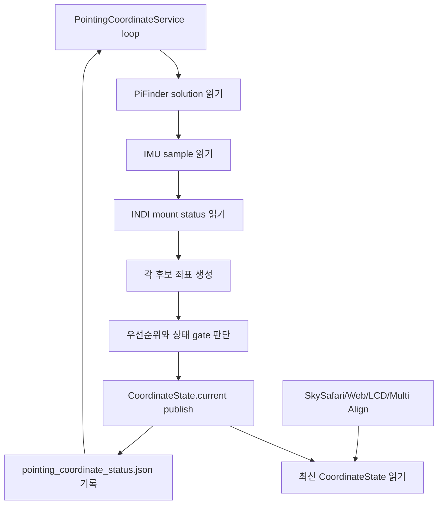

# 포인팅·IMU — 이전 설계와 조사 기록

> 2026-10-10 통합 보관. 아래 본문의 “현재/현행”, 기본값, 완료 상태와 명령은 원문 작성 당시 기준이다.
> 오늘의 동작은 [개발 기준 문서](../../mf_dev/README.md)를 따른다. 이력에 적힌 절차를 현재 설치 절차로 사용하지 않는다.

- [mf_coordinate_helper_plan_ko.md](#mf_coordinate_helper_plan_ko)
- [mf_imu_compass_calibration_ko.md](#mf_imu_compass_calibration_ko)
- [mf_imu_current_behavior_analysis_ko.md](#mf_imu_current_behavior_analysis_ko)
- [mf_imu_relative_magnetic_drift_plan_ko.md](#mf_imu_relative_magnetic_drift_plan_ko)


---

<a id="mf_coordinate_helper_plan_ko"></a>

## mf_coordinate_helper_plan_ko.md

<a id="mf_coordinate_helper_plan_ko--mf-pifinder-pointing-coordinate-service"></a>
## MF PiFinder Pointing Coordinate Service

2026-09-14 변경: 아래의 입력 좌표 무변환 규칙은 SkySafari ↔ PiFinder
카메라/카탈로그 경계에서 대체됐다. LCD 기준 도착·유지 및 정렬 전파와 함께
[변경 보고서](../../mf_report/mf_alignment_tracking_hold_20260914_ko.md)를 따른다.

최종 업데이트: 2026-07-13

이 문서는 현재 `mf_pifinder` 브랜치의 상시 좌표 서비스 구현을 기준으로
SkySafari, Web UI, LCD UI, INDI Multi Align이 공통으로 사용할 좌표 흐름을
정리한다.

중요 원칙:

- SkySafari 또는 LX200 입력으로 들어온 target RA/Dec는 요청 좌표 그대로 사용한다.
- 요청 좌표를 J2000/JNow 같은 epoch 이름으로 재해석하거나 변환하지 않는다.
- `pointing.aligned.estimate`는 PiFinder가 계산한 현재 기준 좌표로 그대로 사용한다.
- Alt/Az 변환은 IMU 보정, 표시, 마운트 타입별 해석이 필요한 지점에서만 수행한다.
- 소비자는 좌표를 직접 다시 계산하지 않고 `PointingCoordinateService`가 publish한
  최신 `CoordinateState`를 읽는다.

<a id="mf_coordinate_helper_plan_ko--구현-파일"></a>
### 구현 파일

```text
python/PiFinder/pointing_coordinate_service.py
python/PiFinder/pos_server.py
python/PiFinder/mountcontrol_indi.py
python/PiFinder/imu_pi.py
```

관련 테스트:

```text
python/tests/test_pointing_coordinate_service.py
python/tests/test_pos_server.py
python/tests/test_mountcontrol_indi.py
```

디버깅 상태 파일:

```text
/home/pifinder/PiFinder_data/pointing_coordinate_status.json
/home/pifinder/PiFinder_data/mount_control_status.json
```

<a id="mf_coordinate_helper_plan_ko--전체-구조"></a>
### 전체 구조

`pos_server.py`는 SkySafari LX200 요청(`:GR#`, `:GD#`)을 받을 때
좌표를 새로 계산하지 않는다. 백그라운드 루프가 갱신해 둔
`PointingCoordinateService.get_state()`의 `current` 좌표를 읽어 LX200 형식으로
응답한다.

```text
PiFinder processes
  IMU process
    -> shared_state.imu()
  Solver/Integrator
    -> shared_state.solution().pointing.aligned.estimate
  INDI Mount process
    -> mount_control_status.json
  POS Server
    -> PointingCoordinateService background loop
    -> SkySafari :GR#/:GD# response
```

좌표 서비스 루프:



<a id="mf_coordinate_helper_plan_ko--후보-좌표"></a>
### 후보 좌표

<a id="mf_coordinate_helper_plan_ko--1-solved-좌표"></a>
#### 1. Solved 좌표

입력:

```text
shared_state.solution().pointing.aligned.estimate.RA
shared_state.solution().pointing.aligned.estimate.Dec
```

유효 조건:

- `solution.has_pointing()`이 true
- `solve_source == CAM`
- 또는 `solve_source == IMU`이지만 plate-solve anchor가 존재함
- 또는 `solve_source == CAM_FAILED`이지만 보존된 plate-solve anchor가 존재함

처리:

- RA/Dec 값을 그대로 사용한다.
- J2000/JNow 변환을 하지 않는다.
- `IMU`/`CAM_FAILED`인데 plate-solve anchor가 없으면 primary solved 좌표로 쓰지
  않는다. Anchor가 있는 `CAM_FAILED`는 이번 시도의 실패일 뿐 보존 좌표의 무효가
  아니므로 medium-quality PiFinder estimate로 유지한다.

<a id="mf_coordinate_helper_plan_ko--2-imu-fallback-좌표"></a>
#### 2. IMU fallback 좌표

입력:

```text
shared_state.imu()
screen_direction
location/time
optional IMU alignment correction
```

처리:

```text
IMU quaternion
  -> camera boresight
  -> raw Alt/Az
  -> optional align correction
  -> smoothing
  -> location/time 기준 RA/Dec
```

IMU smoothing:

- raw Alt/Az 변화량을 기준으로 작은 흔들림을 평균화한다.
- 매우 작은 변화는 강하게 damping한다.
- 중간 변화는 완만하게 따라간다.
- 큰 변화는 사용자가 실제로 망원경을 움직인 것으로 보고 빠르게 반영한다.
- smoothing 전후 값은 모두 status JSON에 기록한다.

첫 솔빙 또는 마운트 정렬 전에는 유효한 IMU 샘플을 실시간 fallback 좌표로
사용한다. 자기센서가 없는 IMUPLUS도 포함하므로, 부팅 직후 GOTO 없이 기구를
직접 움직이거나 수동 이동해도 SkySafari 좌표가 갱신된다. 정렬 전 IMUPLUS 방위는
초기 기준의 임시 좌표이며 낮은 품질과 health 경고를 표시한다. 마운트 제어의 절대
하늘 기준으로 취급하지 않는다. NDOF magnetometer 방위 또는 session-only
SkySafari alignment가 있으면 절대 기준을 갖는다. 솔빙 기준 추정값과 정렬된
마운트 좌표는 계속 우선하므로, 정상 기준이 생긴 뒤 초기 IMU 방위로 돌아가지 않는다.

관측지 위치는 현재 lock된 위치, 설정된 기본 관측지, 마지막으로 OnStep에 성공적으로
전송한 위치(`onstep_location_cache.json`) 순으로 선택한다. 기본 관측지가 없어도
마지막 위치가 저장되어 있으면 GPS lock 전 IMU Alt/Az→RA/Dec 변환이 가능하다.
이 위치의 source는 `CACHE: last OnStep site`이며 health에는 임시 관측지 사용을
표시한다. shared state의 GPS lock이나 마운트 위치·시간 동기화 상태를 변경하지
않으며, 새로운 GPS 위치 또는 기본 관측지가 생기면 이를 우선한다.

관련 status metadata:

```text
imu.metadata.raw_alt
imu.metadata.raw_az
imu.metadata.smoothed_alt
imu.metadata.smoothed_az
imu.metadata.filter_state
imu.metadata.filter_delta_degrees
imu.metadata.quat_norm
imu.metadata.calibration_status
imu.metadata.fusion_mode
imu.metadata.uses_magnetometer
```

<a id="mf_coordinate_helper_plan_ko--3-mount-readback-좌표"></a>
#### 3. Mount readback 좌표

입력:

```text
/home/pifinder/PiFinder_data/mount_control_status.json
```

주요 필드:

```text
state
ra / dec
park_state
driver_mount_status
raw_mount_status
coordinate_sync
multipoint_align
mount_motion_active
mount_motion_type
mount_readback_priority
goto_motion_active
goto_refine_pending
manual_motion_direction
target_ra / target_dec
target_error_deg
goto_wait_seconds
```

mount 후보 제외 조건:

- disconnected/disconnecting/error/fault/failed/server_offline/driver_offline 상태
- Parked 상태
- RA/Dec readback 없음

정렬 전 mount readback:

- `mount.valid = true`일 수 있다.
- 하지만 PiFinder와 mount가 아직 sync/alignment 되지 않았으면 `mount.aligned = false`.
- 이 경우 current 좌표에 섞지 않고 diagnostic으로만 기록한다.

<a id="mf_coordinate_helper_plan_ko--좌표-선택-우선순위"></a>
### 좌표 선택 우선순위

현재 구현의 우선순위:

```text
1. SOLVED_PRIMARY
   plate solve 또는 plate-solve anchor가 있는 PiFinder estimate

2. MOUNT_REFERENCE_PRIMARY
   mount가 usable + synced/aligned이고 IMU도 valid인 경우
   단, mount가 확실히 정지한 상태일 때만 mount anchor + IMU delta 사용

3. MOUNT_ONLY_SYNCED
   mount가 usable + synced/aligned이지만 IMU가 invalid인 경우

4. IMU_PRIMARY_UNSOLVED
   solve 없음, mount sync 전 또는 mount unusable, IMU valid

5. UNAVAILABLE
   사용할 좌표 없음
```

정렬 전에는 mount와 IMU 절대 좌표가 크게 다를 수 있으므로 평균내지 않는다.
mount readback은 PiFinder와 sync된 뒤에만 current 좌표 후보가 된다.

<a id="mf_coordinate_helper_plan_ko--mount--imu-delta"></a>
### Mount + IMU Delta

mount가 PiFinder와 sync/alignment 된 뒤에는 다음 방식으로 보정한다.

```text
anchor_imu   = sync 시점 IMU fallback RA/Dec (delta 기준점)

applied_delta = 속도 게이트를 통과해 누적된 IMU delta (아래 참조)
current = 실시간 mount readback + applied_delta
          (마운트의 네이티브 축 프레임에서 적용 — alt/az 마운트는 alt/az 공간,
          EQ 마운트는 RA/Dec 공간; 아래 "delta 적용 프레임" 참조)
```

(2026-07-16 수정: base가 anchor 시점의 mount 좌표 스냅숏에서 **실시간 mount
readback**으로 바뀌었다. 펄스/슬루로 readback이 움직이면 fused가 즉시 따라가고,
re-anchor가 필요 없어져 re-anchor로 인한 외란 오프셋 소실이 사라졌다.)

의도:

- mount 절대 좌표와 IMU 절대 좌표를 평균내지 않는다.
- mount는 장기 기준점으로 사용한다.
- IMU는 mount 정지 상태에서 사람이 강제로 움직였거나 충격을 준 경우처럼 빠른 변화량을
  감지하는 보조 입력으로 사용한다.

anchor reset 조건 (reset 시 applied 외란 오프셋도 함께 초기화):

- anchor 없음
- `coordinate_sync` 또는 `multipoint_align` sync key 변경 (= sync로 마운트
  좌표계가 재정립된 경우)

mount readback 이동은 더 이상 reset 사유가 아니다. fused의 base가 실시간
readback이므로(아래 2026-07-16 수정) 펄스/슬루는 base를 통해 바로 반영되고,
readback 이동으로 reset하면 실제 물리 외란 오프셋이 소리 없이 지워진다.

<a id="mf_coordinate_helper_plan_ko--delta-적용-프레임--마운트-타입별-2026-07-19-수정"></a>
#### delta 적용 프레임 — 마운트 타입별 (2026-07-19 수정)

**실장비 재현 (실내, plate solve 없음, 손으로만 az 스윙):** IMU↔mount 괴리가
~52° 누적된 상태에서 az만 손으로 돌리자(스코프 alt는 내내 7~17° 유지), fused
좌표가 RA 301 / Dec −46 — 관측지에서 **절대 지평선 위로 뜰 수 없는 좌표** —
까지 갔다. 스카이사파리에선 스코프가 지평선 위를 가리키는데 마커가 땅속으로
들어갔다. 속도 게이트는 무죄였다(`fast_follow`로 delta는 정상 누적) — 결함은
누적된 delta를 fused RA/Dec로 **변환하는 수식**에 있었다.

**구(결함) 적용식** — RA/Dec 성분별 이식:

```text
east_delta = applied_ra × cos(dec_imu)          # IMU가 있는 dec(~60°)에서 각도 환산
fused_dec  = mount_dec + applied_dec            # mount의 dec(~20°)에 그대로 덧셈
fused_ra   = mount_ra + east_delta / cos(fused_dec)
```

이건 1차 접평면 근사다: IMU의 지향점(재현에서 dec ~60)에서 잰 구면 변위를
mount의 지향점(dec ~20)에 옮겨 심는다. 설계 의도였던 분각 수준 delta(가이드
펄스, 작은 범프)에는 문제없지만, 큰 IMU↔mount 괴리 위에서 delta가 수십 도가
되면 구면 왜곡이 폭발한다 — az만 도는 물리 회전이 거대한 가짜 Dec 성분을 만들어
fused가 물리적으로 도달 불가능한 하늘 밖으로 나간다.

**신 적용식 — delta를 마운트의 네이티브 축 프레임에서 추적·적용한다.**
프레임은 `mount_type` config로 선택(`mount_type`에 "alt"와 "az"가 있으면
alt/az 프레임, 아니면 equatorial 프레임):

계산 순서, Alt/Az 마운트 (`fusion_frame = "altaz"`):

```text
1. 컨텍스트: current_state()가 (dt, 관측지 location, mount_type)을 융합
   컨텍스트로 저장. dt/location 없으면 equatorial 분기로 폴백.
2. tracker 좌표: imu.metadata의 raw(비스무딩) alt/az를 (az, alt) 순서로 사용
   — 경도형 축 먼저, (ra, dec) 순서와 대응.
3. 속도 게이트(로직 동일, 코드 공유):
     step_az  = wrap180(az_t − az_(t−1))
     step_alt = alt_t − alt_(t−1)
     rate     = 대원거리(prev, now) / dt          # 같은 구면 공식
   fast_follow 에피소드가 (applied_az, applied_alt)를 누적; hold는 오프셋
   유지; 프레임이 바뀌면 tracker 리셋(다른 프레임에서 누적한 오프셋은 무의미).
4. mount readback → alt/az 변환:
     (mount_alt, mount_az) = radec_to_altaz(mount_ra, mount_dec, dt, atmos=False)
5. alt/az 공간에서 delta 적용:
     fused_az  = (mount_az + applied_az) mod 360
     fused_alt = mount_alt + applied_alt
   천정/천저 폴딩: fused_alt > 90 → fused_alt = 180 − fused_alt, az += 180;
   fused_alt < −90 → fused_alt = −180 − fused_alt, az += 180.
6. RA/Dec 복귀는 **차분식** (편향 상쇄):
     (base_ra,  base_dec)  = altaz_to_radec(mount_alt, mount_az, dt)
     (moved_ra, moved_dec) = altaz_to_radec(fused_alt, fused_az, dt)
     fused_ra  = (mount_ra + wrap180(moved_ra − base_ra)) mod 360
     fused_dec = clamp(mount_dec + (moved_dec − base_dec), ±89.9)
   차분을 쓰는 이유: radec_to_altaz(erfa atco13, ICRS 입력)와
   altaz_to_radec(skyfield from_altaz, epoch-of-date 출력)는 정확한 역함수가
   아니어서 절대 왕복에 ~0.3°의 세차/epoch 편향이 실린다. 차분식은 이를
   상쇄하고, applied delta = 0이면 fused ≡ mount readback을 보장한다.
7. 변환 예외 발생 시 equatorial 폴백(metadata
   `fusion_frame = "equatorial_fallback"`) — fused 소스를 버리지 않는다.
```

결과: az-only 손 스윙은 az-only fused 변화가 되고, fused 좌표는 스코프의
물리적 지향 고도 아래로 절대 내려갈 수 없다.

계산 순서, EQ 마운트 — **폴백 전용** (`fusion_frame = "equatorial"`, 아래 EQ
점검 참조):

```text
fused_ra  = (mount_ra + applied_ra) mod 360     # cos(dec) 재스케일 없음
fused_dec = clamp(mount_dec + applied_dec, ±89.9)
```

극축 주위 손 회전은 **어느 dec에서든** 회전각만큼 지향 RA를 바꾸고, dec축
회전은 dec만 바꾼다 — EQ 마운트에서는 성분별 가산이 곧 축별 정확식이며, 구
공식의 `cos(dec_imu)/cos(dec_mount)` 재스케일은 여기서도 틀린 것이라 제거했다.
**단**, 이 식이 소비하는 delta는 IMU az 프레임에 yaw 오프셋이 없을 때만
올바르다(아래 EQ 점검 참조). 그래서 융합 컨텍스트가 있으면 EQ 마운트도 회전
tracker를 우선 사용하고, 이 스칼라 식은 컨텍스트 없는 폴백으로만 남는다.

metadata: `fusion_frame`(`altaz` / `equatorial` / `equatorial_fallback`),
alt/az 프레임은 `imu_delta_applied_az/alt` + `mount_alt/az` + `fused_alt/az`,
equatorial 프레임은 `imu_delta_applied_ra/dec`(기존 키 유지).

**실장비 검증 (2026-07-19, 실내, pointing reset 후 손 az 스윙만):** 마운트
모션 0건으로 최대 −144° az 스윙 8회. fused alt/az가 IMU alt/az를 median
0.11/0.13°(max 0.66/1.83°) 오차로 추종했고, fused 고도는 IMU 고도 범위
6.2~14.1°와 정확히 일치 — **지평선 아래 샘플 0건**. 회귀 테스트:
`test_altaz_mount_hand_swing_applies_delta_in_altaz_space`,
`test_eq_mount_delta_stays_component_additive_without_cos_rescale`.

<a id="mf_coordinate_helper_plan_ko--회전쿼터니언-tracker-업그레이드-2026-07-19-같은-날-후속"></a>
##### 회전(쿼터니언) tracker 업그레이드 (2026-07-19, 같은 날 후속)

성분 (az, alt) tracker에는 특이점이 남는다: az는 천정에서 수평 성분이 0으로
수렴하는 atan2라 alt 90° 근처에서 측정 az가 noise이고, 천정을 넘는 스윙은 az가
정당하게 ~180° 뒤집힌다 — 성분 누적은 이를 쓰레기로 기록한다. 그래서 alt/az
프레임 tracker를 스칼라 성분에서 **회전(쿼터니언) tracker**로 업그레이드했다
(`_tick_altaz_rotation_tracker`, 우선 경로; 성분 경로는 폴백으로 유지):

```text
1. raw IMU boresight를 각도 차분 없이 **단위벡터** v로 유지한다.
2. psi0 — IMU의 임의 yaw 오프셋(imuplus, 자기센서 미사용)과 마운트 az 프레임의
   차이 — 는 tracker 초기화 시점(applied = 0, 정의상 fused == mount readback)에
   한 번 측정한다:
     psi0 = mount_az − imu_raw_az
   (실측: psi0 = −53.4°가 측정됐고, 이는 누적돼 있던 ~52° IMU↔mount 괴리와
   일치 — 즉 그 괴리의 정체가 yaw 오프셋이었다.)
3. 게이트를 통과한 각 스텝은 작은 회전이 되며, 스텝마다 방식을 선택한다:
   - |alt| ≤ 80 (ALTAZ_ROTATION_ZENITH_GUARD_ALT_DEG): 정확한 마운트 축 분해
       q_step = R_az(Δaz) ∘ R_altaxis(az_prev + psi0, Δalt)
     R_az(Δaz)(−z축 회전: az는 북→동 시계방향)는 **IMU↔mount 괴리 크기와
     무관하게** az축에 대해 정확하다 — 여기서 단일 min-arc 회전을 쓰면
     ~Δaz·sin(alt)·sin(괴리)의 전송 오차가 생긴다.
   - |alt| > 80: boresight 벡터 간 최소회전(min-arc)을 psi0로 마운트 프레임에
     켤레변환 — Δaz가 무의미한 천정 통과 구간에서도 조건이 좋다.
4. 스텝은 오프셋 쿼터니언으로 합성된다: q_off ← q_step ∘ q_off
   (fast_follow에서만; hold는 q_off 유지; suspended는 기준만 전진).
5. 적용: v_fused = q_off · v_mount(라이브 readback) → alt/az → RA/Dec는 성분
   경로와 같은 차분 변환.
```

metadata: `fusion_method` = `rotation`(폴백 경로는 `component`), `psi0_deg`.
snapshot/rollback은 q_off 참조를 저장한다(교체만 하고 제자리 변경 없음).
프레임 전환(성분 ↔ 회전, 또는 새 anchor)은 tracker를 리셋한다.

실장비 검증 (2026-07-19): 손 스윙·GoTo·외란 복구까지 회전 경로에서 전 구간
정상 확인; 지평선 아래 fused 샘플 0건; alt 12~78° 범위에서 fused-vs-IMU 추종
median 0.38/0.94°(alt/az). 천정 케이스 회귀 테스트:
`test_altaz_rotation_tracker_survives_zenith_crossing`(자오선을 따라 천정을
넘는 20° 스윙이 반대편에 착지해야 한다).

<a id="mf_coordinate_helper_plan_ko--eq-마운트-점검--eq도-회전-tracker가-우선-2026-07-19"></a>
##### EQ 마운트 점검 — EQ도 회전 tracker가 우선 (2026-07-19)

Alt/Az 작업 후 EQ 스칼라 경로를 점검하니 같은 부류의 프레임 결함이 두 가지
남아 있었다:

1. **IMU yaw 오프셋이 측정 RA/Dec delta를 오염시킨다.** EQ 스칼라 tracker는
   `raw_ra/raw_dec`를 차분하는데, 이는 **IMU 자체 az**를
   `altaz_to_radec(raw_alt, raw_az, dt)`로 변환한 값이다. imuplus yaw
   오프셋 때문에 이는 엉뚱한 지향점의 변환이 되고, alt/az→RA/Dec 사상은
   비선형이라 차분에서 오프셋이 소거되지 않는다. 실측 오프셋(−53°) 기준:
   순수 극축 +15° 손 회전이 **+11.45 RA / +9.91 Dec**로 기록된다 — 가짜 Dec
   성분 ~10°, 지평선 다이빙의 EQ 판이다. (Alt/Az **성분** 경로엔 이 문제가
   없었다: Δaz/Δalt는 상수 az 오프셋에 불변이다. 적도 성분은 그렇지 않다 —
   프레임 오프셋이 RA 회전이 아니라 az 회전이기 때문.)
2. **천구 극 특이점.** RA는 dec ±90에서 수렴하는 성분의 atan2다 — 천정의 az와
   구조적으로 동일 — 극 근처 스윙은 ΔRA 쓰레기를 기록한다.

수정: 회전 tracker는 마운트 타입에 무관하다 — 스코프의 물리 회전을(psi0
사상으로) 추적해 mount 지향벡터에 적용하며, 출력에서 마운트 축 분해를 쓰지
않는다 — 그래서 이제 **모든** 마운트 타입의 우선 경로다. EQ 스칼라 성분식은
컨텍스트 없는 폴백으로만 남는다. metadata `fusion_frame`은 여전히 마운트
네이티브 프레임(EQ 마운트면 `equatorial`)을 보고하고
`fusion_method = rotation`이 함께 실린다. 회귀 테스트:
`test_eq_mount_uses_rotation_tracker_and_survives_imu_yaw_offset`(−53° yaw
오프셋 하의 극축 +15° 회전이 (mount_ra + 15, mount_dec)의 1° 이내에 착지해야
한다).

<a id="mf_coordinate_helper_plan_ko--추적-따라잡기-예산--사이드리얼-추적-중-bno055-스냅-기각-2026-07-23"></a>
#### 추적 따라잡기 예산 — 사이드리얼 추적 중 BNO055 스냅 기각 (2026-07-23)

**실장비 재현 (2026-07-22, 실내, M5 정렬 후 방치, 10분 시계열 0.3s 샘플):**
마운트가 타겟 추적 중이면 readback RA/Dec는 고정되지만 물리 축은 계속 돈다
(실측 alt −11.1″/s, az +11.4″/s). BNO055(imuplus)는 이 느린 회전을 분해하지
못한다 — 10분간 물리 alt 이동 −6668″ 중 IMU는 **−2524″(38%)만, 스냅 2~3회로**
보고했고 az는 +6869″ 중 **+240″(3.5%)**만 보였다(yaw는 자기센서 없이 절대
기준이 없음). 출력은 평소 **완전히 얼어 있다가**(rate 중앙값 정확히 0.0)
가속도계가 중력 방향 변화를 감지하면 **~0.3°를 0.25~0.41°/s로 한 번에 스냅**
한다. 이 스냅이 외란 게이트(진입 0.03°/s)를 넘어 `fast_follow`로 q_off에
적재됐고, fused가 스냅마다 ~0.3°씩 이탈 → 추적 가이드 복구 임계 초과 →
sync+GoTo 재정렬 → 반복 — 스카이사파리에서 보이던 **주기적 톱니파 드리프트**의
정체다. 추적 모션은 readback을 바꾸지 않으므로 `mount_motion_active` 기반
억제에는 안 보인다는 것이 핵심 맹점이었다.

**수정 — 회전 tracker에 추적 따라잡기 예산(budget) 도입:**

```text
1. 매 tick, readback(고정 RA/Dec)의 alt/az 궤적에서 기대 물리 이동을 계산:
     expected = mount_altaz(dt_now) − mount_altaz(dt_prev)
   (tracker가 매 tick radec_to_altaz를 수행하고 결과를 저장;
   _fuse_altaz_rotation은 이 값을 재사용해 변환 중복을 없앰)
2. hold: budget += expected − step  (얼어 있으면 추적 속도로 누적,
   연속 추종하는 좋은 IMU면 ≈0 유지)
3. fast_follow(정상 고도 분기): 스텝을 예산과 같은 부호·예산 크기 한도로
   상쇄(_tracking_budget_cancel), 잔차만 외란으로 q_off에 적재.
   추적 반대 방향 밀기는 전혀 상쇄되지 않고, 같은 방향 밀기는 예산 초과분이
   적재된다.
4. suspended/post_motion_settle: readback이 움직여 궤적 예측이 무효 —
   budget 폐기.
5. 천정 분기(min-arc): az 성분이 원래 신뢰 불가라 상쇄 없음.
6. 축별 상한 IMU_TRACKING_CATCHUP_BUDGET_CAP_DEG(3.0°) — imuplus yaw는 절대
   기준이 없어 az 예산이 무한 성장할 수 있으므로 상한으로 오상쇄 노출을 제한.
```

- alt/az 성분 비교가 프레임을 넘어 성립하는 근거: az delta는 상수 psi0 yaw
  오프셋에 불변이고 alt는 양쪽 다 중력 기준이다.
- 진단 metadata: `imu_track_budget_alt/az`(대기 중 예산),
  `imu_track_cancelled_alt/az`(tracker 생성 후 상쇄 누계).
- 알려진 한계: 추적과 **같은 방향** 실제 밀기는 대기 예산만큼(전형적으로 스냅
  사이 ≤ ~0.5°) 흡수될 수 있다. 상한 3°가 최악 노출을 제한하고, 야간에는
  solve가 절대 기준이라 영향 없다. 스칼라 성분 폴백 경로(컨텍스트 없음)는
  궤적을 계산할 수 없어 예산 없이 기존 동작 유지.
- 회귀 테스트: `test_tracking_catchup_snap_is_cancelled_not_booked_as_disturbance`
  (180초 동결 후 전량 따라잡기 스냅 → fused가 readback의 0.03° 이내 유지),
  `test_real_push_during_tracking_still_registers`(예산 누적 상태에서 반대
  방향 +2° 밀기 → 전량 적재).

**1차 실기기 검증(2026-07-23, 13분)과 wobble 정류 보강:** 재정렬 사이클은
사라졌고(이전 10분에 2회 → 0회) 스냅 6회 총 −1.99°가 전량 상쇄됐다. 그러나
tick 단위 상쇄에 정류(rectification) 결함이 남아 있었다 — 0.07°/s의 대칭
**진동(wobble)** 에피소드에서 추적 방향 반주기는 예산에 상쇄(예산 소모)되고
복귀 반주기는 외란으로 적재되어, 순변위 ≈0이 ~430″ 오프셋으로 정류됐다(1회
에피소드 실측). 보강: 에피소드 중에는 tick 상쇄를 **잠정**으로 취급하고
순변위·잠정상쇄를 누적(`ep_net_*`/`ep_cancel_*`), 에피소드 종료 시
`_rebalance_tracking_episode`가 **순변위 기준 이상적 상쇄**를 다시 계산해
차액만큼 q_off를 보정하고 잘못 소모된 예산을 반환한다. 깨끗한 스냅·깨끗한
밀기는 이상치와 잠정치가 일치해 보정 0. 천정 에피소드는 성분 장부로 표현
불가라 재정산 제외. suspended 전이 시 에피소드는 재정산 없이 폐기(마운트
자체 모션 누출은 기존 스냅숏 롤백이 처리). 회귀 테스트:
`test_imu_wobble_episode_nets_to_zero_after_rebalance`(±0.05° 대칭 진동 후
fused가 readback 0.02° 이내 + 예산 복원).

<a id="mf_coordinate_helper_plan_ko--imu-delta-속도-게이트-2026-07-12-추가"></a>
#### IMU delta 속도 게이트 (2026-07-12 추가)

추적 중 실장비에서 발견: mount가 사이드리얼 추적을 하면 readback RA/Dec는 target에
고정되지만, IMU 스무딩 필터가 느린 추적 모션(~15"/s)을 "작은 지터"로 취급해 사실상
얼려버린다. 그 결과 IMU 환산 RA가 사이드리얼 속도로 드리프트하고, raw delta가 무한
누적되어 fused 좌표가 target에서 계속 흘러갔다(분당 ~20'). 이 가짜 드리프트가
추적 가이드의 GoTo 복구를 오발시켜 물리적으로는 오히려 target을 벗어나게 했다.

수정: `_mount_with_imu_delta`가 raw delta 대신 **속도 게이트를 통과한 applied
delta**를 사용한다 (`_gated_imu_delta`).

```text
IMU_DELTA_ENTER_RATE_DEG_PER_SEC = 0.03   (진입)
IMU_DELTA_EXIT_RATE_DEG_PER_SEC  = 0.015  (유지/탈출)
```

**히스테리시스 게이트 (2026-07-16 수정)**: 단일 임계값(구 0.05)은 미약한 탈조
슬립(실측 head/tail 속도 0.02~0.06 deg/s)을 조각내서 변위의 ~1/3만 계측했다
(실장비 캡처: 0.033→0.06→0.02 이벤트에서 0.05 초과 3틱만 누적). 누적 에피소드는
진입 속도(0.03, 실내 무진동에서 실측한 아티팩트 바닥 0.004~0.005의 ~7배 —
야외 바람 잔진동도 에피소드를 시작시키지 못하는 마진) 이상에서 시작하고, 일단
시작되면 탈출 속도(0.015, ~4배) 아래로 떨어질 때까지 계속 누적해 슬립의 느린
head/tail까지 포착한다. 0.03 미만으로만 기어가는 극미세 슬립은 여전히 보이지
않는다(rate가 유일한 판별자; 야간에는 solve가 절대 기준).

- 충격/수동 이동/탈조 슬립 -> `fast_follow`: 오프셋이 fused 좌표에 그대로
  반영되어 외란 감지와 복구가 정확한 오차로 동작한다.
- 추적 아티팩트/센서 드리프트(느림) -> `hold`: 증분은 버려지지만 이미 적용된
  오프셋은 그대로 **유지**된다. 정지한 경통의 좌표는 흐트러진 자리에 머물러야
  하며, mount readback으로 기어 돌아가면 안 된다.
- 마운트 자체 이동(GoTo/manual/펄스) 중 -> `suspended_mount_motion`: readback이
  우선 표시되고 IMU 기준점만 전진시켜(누적 없음) 마운트 스스로의 이동이 외란으로
  잘못 집계되지 않게 한다. 오프셋은 이동이 끝난 뒤에도 살아남는다.
- 마운트 이동 종료 직후 -> `post_motion_settle`: BNO055 재수렴 슬라이드를
  흡수하기 위해 rate가 탈출 속도 미만으로 1.5초 연속 유지될 때까지 누적을
  보류한다 (2026-07-17 추가, 아래 "마운트 이동 격리 보강" 참고).
- sync(sync key 변경) 시에만 tracker와 applied가 초기화된다.
- 진단 metadata: `imu_delta_gate`, `imu_delta_rate_deg_per_sec`, 그리고
  프레임별 applied 키(alt/az 마운트는 `imu_delta_applied_az/alt`, EQ 마운트는
  `imu_delta_applied_ra/dec` — "delta 적용 프레임" 참조).
- 한계: 진입 게이트(0.03 deg/s)보다 느린 실제 외력은 solve 없이는 보이지
  않는다. 야간에는 solve(SOLVED_PRIMARY)가 우선되므로 영향 없다.
- 실장비 end-to-end 검증(2026-07-12, 사용자가 경통을 실제로 밀어 테스트): 밀기
  감지(0.99 deg/s, err 1488') -> disturbed -> sync+GoTo 복구 -> settling 2.9' ->
  enabled 0.0'으로 밀기 전 위치 재획득.
- 참고: GoTo 단계 중에는 mount readback이 우선이므로 GoTo 도중의 밀림은 표시
  좌표에 즉시 반영되지 않고, GoTo 종료 후 corrective/트래킹 가이드가 처리한다.

<a id="mf_coordinate_helper_plan_ko--외란-오프셋-유지-2026-07-16-수정"></a>
#### 외란 오프셋 유지 (2026-07-16 수정)

실장비 외란 복구 테스트에서 발견: 경통을 밀고 멈추면 fused 좌표가 그 자리에
머물지 않고 (1) **이전 GoTo 좌표로 천천히 되돌아가거나** (2) **한번에 점프**했다.

원인 두 가지:

1. applied delta가 느린 구간에서 tau 120 s로 지수 감쇠(`slow_decay`)했다.
   3도 오프셋이면 초당 ~1.5' 속도로 readback(=이전 target)으로 기어 돌아간다.
   감쇠의 원래 목적(추적 아티팩트 드리프트 소멸)은 속도 게이트가 증분을 아예
   applied에 넣지 않는 것으로 이미 달성되므로, 감쇠는 정상 외란 오프셋만
   갉아먹는 부작용이었다.
2. mount readback이 조금만 움직이거나(18" 지터로도) motion/priority 플래그가
   서면 anchor를 통째로 삭제하고 raw readback을 반환해, 오프셋이 즉시
   소실(=점프)됐다.

수정 (모두 `pointing_coordinate_service.py`):

- `slow_decay` -> `hold`: 느린 구간에서 applied를 유지한다. 오프셋은 sync
  (sync key 변경)로만 지워진다. 복구 경로가 sync + GoTo로 시작하므로 복구가
  일어나면 자연히 초기화된다.
- fused base를 anchor 스냅숏 -> 실시간 mount readback으로 변경. re-anchor가
  불필요해져 readback 이동으로 인한 오프셋 소실이 사라졌다.
- 마운트 자체 이동 중에는 anchor를 지우지 않고 IMU 기준점만 전진
  (`suspended_mount_motion`). 이동 종료 후 fused = 새 readback + 보존된 오프셋.
- 검증: 밀기 후 5분 정지에도 오프셋 유지, 마운트 슬루 통과 후 오프셋 생존,
  미세 readback 이동 시 base 즉시 추종, sync 후 오프셋 초기화 (단위 테스트
  4건 추가).

<a id="mf_coordinate_helper_plan_ko--마운트-이동-격리-보강-2026-07-17-수정"></a>
#### 마운트 이동 격리 보강 (2026-07-17 수정)

실장비 GoTo 테스트에서 발견: 마운트 자체 슬루가 외란 오프셋에 누적되어
(관측치 15.7도) PiFinder GoTo 보정 루프가 가짜 오차를 측정, "오차 개선 없음"으로
중단되고 추적 타겟이 장착되지 않아 복구도 불가능했다. 원인 네 가지와 수정:

1. **readback 공급 주기 (mountcontrol_indi.py)**: 설치된 PyIndi(INDI 2.x)는
   구버전 `newNumber` 콜백을 호출하지 않아 드라이버의 1초 주기 좌표 push가
   전부 유실되고, 위치가 5초 heartbeat로만 갱신됐다. 슬루 중 이동 감지가
   5초에 한 틱만 발동하고 hold(1.5초)가 그 사이에 만료되어 나머지 구간의
   IMU 이동이 전부 외란으로 누적됐다. INDI 2.x `updateProperty` 콜백을
   구현해 readback이 드라이버 `POLLING_PERIOD`(~1Hz) 그대로 흐른다.
2. **감지 전 누출 롤백**: 정지 상태의 readback 샘플마다 applied 오프셋
   스냅숏을 저장하고, 새 샘플이 이동을 보이면 직전 정지 스냅숏으로 되돌린다.
   슬루 시작~첫 감지 사이(최대 ~1초)의 누출만 정확히 폐기하고, 손밀기
   오프셋은 보존된다 (`_snapshot_imu_delta_applied` /
   `_rollback_imu_delta_to_snapshot`).
3. **delta tracker 입력을 raw로**: 스무딩 필터의 큰 이동 후 수렴 꼬리가
   지속 모션으로 읽혀 슬루 종료 후에도 수십 초간 누적됐다. tracker는
   스무딩 전 raw IMU RA/Dec(`imu.metadata.raw_ra/raw_dec`)를 차분하고,
   스무딩은 표시용으로만 유지한다.
4. **post-motion settle 게이트**: BNO055가 큰 회전 후 내부 융합을 재수렴하며
   물리 이동 없이 자세가 미끄러진다(실측 15초간 ~1.8도, 게이트 임계 초과
   속도). 마운트 이동 종료 후 IMU rate가 탈출 속도 미만으로
   `IMU_DELTA_POST_MOTION_QUIET_SECONDS`(1.5초) 연속 유지될 때까지 누적
   재개를 보류한다 (gate `post_motion_settle`). hold 1.5초와 합쳐 슬루 후
   IMU 외란 감지 재개까지 총 ~3초.

검증 (실장비, 15~30도 슬루 + 0.2초 융합 트레이스): 슬루 중 fused =
readback 1Hz 추종 / applied 0.0 유지, 종료 후 settle 게이트 해제 뒤에도
applied 0.0. readback에 보이지 않는 의도적 물리 드리프트(~8.5초마다 ALT
+0.37도 스텝)는 여전히 fast_follow로 누적되어 추적 가이드 오차가 설계대로
커진다.

<a id="mf_coordinate_helper_plan_ko--goto-중-좌표-처리"></a>
### GoTo 중 좌표 처리

OnStepX는 GoTo 중에 큰 이동 후 잠시 멈춘 것처럼 보이다가 마지막 정밀 이동을 수행할 수
있다. 이 구간에서 IMU 움직임을 `mount + IMU delta`에 반영하면 target 오차가 생길 수
있으므로 GoTo 중에는 mount readback을 우선한다.

mount-control은 GoTo와 수동 이동 진행 중에도 현재 mount readback을 status에 publish한다.
좌표 서비스가 우선 사용하는 공통 telemetry는 다음이다.

```text
mount_motion_active
  실제 또는 명령상 mount가 움직이는 중이면 true.

mount_motion_type
  manual / goto / goto_refine_settle / guide_correction /
  align_goto / backlash_auto 등의 진단용 분류.

mount_readback_priority
  현재 좌표 계산에서 IMU delta보다 mount readback을 우선해야 하면 true.
  GoTo 마지막 정밀 이동 대기처럼 실제 motion은 아닐 수 있지만 readback을
  우선해야 하는 구간도 여기에 포함한다.
```

기존 세부 필드(`goto_motion_active`, `manual_motion_direction`,
`goto_refine_pending`, `state`)는 디버깅 및 과거 status 호환용으로 유지한다.

```text
MountControlIndi._check_goto_motion()
  -> _read_goto_progress_position()
  -> _write_goto_progress_status()
  -> state = slewing
  -> ra / dec / target_ra / target_dec / target_error_deg 기록

MountControlIndi.manual_move()
  -> _arm_manual_motion_deadline()
  -> _publish_manual_motion_progress(force=True)

MountControlIndi.run()
  -> _publish_manual_motion_progress()
  -> state = manual_motion
  -> ra / dec / manual_motion_direction 기록
```

좌표 서비스는 다음 조건에서 IMU delta를 보류하고 mount readback만 사용한다.

```text
mount_readback_priority == true
mount readback이 최근 tick 대비 계속 변하는 중
```

<a id="mf_coordinate_helper_plan_ko--실장비-검증-2026-07-12"></a>
#### 실장비 검증 (2026-07-12)

이 소스 선택 로직 자체는 정상 동작함을 확인했다. 직접 홀드 이동(키패드) 중에는
mount-control이 `state = manual_motion`, `mount_motion_active = true`를 보고하고,
`current.source = mount`로 드라이버 `EQUATORIAL_EOD_COORD`를 부드럽게 추종한다.

주의: 이 로직은 **마운트가 실제로 계속 움직여 mount-control state가 `manual_motion`으로
유지될 때만** 활성화된다. PiFinder GoTo(`indi_goto_method = pifinder`)의 수동 접근에서
마운트가 멈추던 문제는 이 좌표 로직이 아니라, 수동 접근의 모션 lease가 서비스 tick
간격보다 짧아 모션이 만료→정지되어 state가 `connected`로 떨어지고 `mount_imu_delta`
(정지 전용)로 폴백된 것이 원인이다. 자세한 내용은 `mf_indi_goto_guide_plan`의
"실장비 테스트 발견: 수동 접근 모션이 tick 사이에 끊김" 참고.

`mount_readback_priority`가 없는 오래된 status를 읽는 경우에만 fallback으로
`goto_motion_active`, `goto_refine_pending`, `manual_motion_direction`, `state`,
`multipoint_align`, `backlash_auto`를 해석한다.

GoTo 상태가 `connected`로 바뀐 직후에도 readback이 계속 변하면 일정 시간 동안
IMU delta를 계속 보류한다. 현재 hold 시간은 1.5초이고, readback이 ~1Hz로
공급되므로(2026-07-17 `updateProperty` 수정) 슬루 중 hold가 끊기지 않는다.
hold 만료 후에도 post-motion settle 게이트(1.5초 연속 정숙)가 통과해야
외란 누적이 재개된다.

이 구조의 기대 동작:

- SkySafari 위치 표시는 GoTo 중 mount readback을 따라간다.
- GoTo 마지막 정밀 이동 중 IMU 움직임이 target 오차로 들어가지 않는다.
- mount가 확실히 정지한 뒤에만 IMU delta를 다시 반영한다.

<a id="mf_coordinate_helper_plan_ko--skysafari-target--sync--align"></a>
### SkySafari Target / Sync / Align

`:Sr/:Sd/:MS/:CM`의 파싱·저장·push-to·INDI GoTo/Sync forwarding·Multi Align
라우팅 전체 흐름은 [mf_goto_mount_source_structure_ko.md](mount.md#mf_goto_mount_source_structure_ko)
("SkySafari INDI GoTo/Sync forwarding path")가 소유한다. 좌표 서비스 관점에서
중요한 점만 정리한다.

- target(`:Sr/:Sd` → `:MS#`)과 sync(`:CM#`) 모두 **요청 좌표를 그대로** 쓴다
  (J2000/JNow 재해석 없음, `sr_result`/`sd_result`). `:CM#`은 방금 받은 `:Sr/:Sd`를
  우선, 없으면 최근 GoTo target(`last_target_coordinates`)을 사용한다.
- SkySafari guide 입력(`:Mn#`, `:Ms#`, `:Me#`, `:Mw#`)은 target 좌표가 아니라
  수동 이동 명령이다. `pos_server.py`가 keepalive timer를 관리해
  `manual_movement`/`manual_movement_keepalive`를 mount-control에 보내고,
  좌표 서비스는 mount-control이 발행하는 `mount_readback_priority`와
  최신 mount readback을 보고 현재 좌표를 선택한다.
- SkySafari release/stop 입력(`:Q#`, `:Qn#`, `:Qs#`, `:Qe#`, `:Qw#`)은
  `stop_movement`로 라우팅된다. TCP 연결이 닫힌 것만으로는 stop으로 보지 않는다.

정렬 요청 좌표는 confirm 시점의 IMU 좌표가 아니다. 사용자가 마지막으로 선택하거나
SkySafari가 지정한 target을 아이피스 중앙에 맞췄다는 의미이므로, 그 target 좌표를
정렬 좌표로 사용한다.

<a id="mf_coordinate_helper_plan_ko--reset-pointing--좌표-초기화-2026-07-12-추가"></a>
### Reset Pointing / 좌표 초기화 (2026-07-12 추가)

fused 좌표가 실제 하늘에서 크게 벗어났을 때 운영자가 직접 초기화하는 기능이다 —
플레이트 솔빙이 안 되거나 잘못됐을 때, 또는 실내 테스트에서 IMU 드리프트가 fused
소스에 누적됐을 때. 초기화하면 fusion anchor와 IMU-delta tracker를 버려서 다음
tick에 최적 소스로 다시 기준을 잡는다: 유효한 solve > 정렬된 mount > IMU fallback
(즉 "솔빙이 없으면 IMU를 기준으로 재정리").

메커니즘 (서비스는 `pos_server` 프로세스 내 싱글톤이라 web/UI 프로세스와 큐를
공유하지 않으므로, 백래시 정지-요청 파일 패턴을 그대로 따른다):

1. Web `POST /indi/reset_pointing` (server.py) 또는 LCD 메뉴 콜백
   `callbacks.reset_pointing`가 원자적 요청 파일
   `PiFinder_data/pointing_reset_request.json`(`{requested_at, source}`)을 쓴다.
2. `_coordinate_service_loop`가 매 tick 폴링(pos_server.py의
   `_handle_pointing_reset_request`): 파일을 소비/삭제하고, SkySafari IMU
   정렬 보정(`_imu_alignment_correction`)을 먼저 폐기한 뒤, 솔빙이 없으면
   마운트를 raw IMU에 정렬(아래), `PointingCoordinateService.clear_state()`
   호출, pointing 캐시 무효화, `_pointing_reset_last_at` 기록.
3. `clear_state()`는 `_state`, `_mount_imu_anchor`, `_imu_delta_tracker`,
   `_imu_filter_altaz`, `_mount_motion_hold_until`, `_last_mount_motion_radec`,
   `_last_mount_sample_ts`, `_imu_delta_applied_snapshot`을 비운다. SkySafari IMU 정렬 보정은 `clear_state()`가 아니라 reset 핸들러가
   위 2번에서 지운다(2026-07-13 수정, `dd045dc`). 이전에는 reset이 보정을
   유지했는데("IMU→하늘 기준이므로 보존" 정책), 솔빙이 없는 환경(실내)에서는
   잘못된 target으로 정렬한 보정을 해제할 수단이 reset뿐인데도 보정이 살아남고,
   마운트→IMU 정렬이 보정이 적용된 IMU 좌표로 sync해 잘못된 정렬이 마운트
   좌표계에 다시 구워졌다. Reset의 의도는 "raw IMU로 원복"이므로 보정도 함께
   폐기한다. 보정이 필요하면 SkySafari sync로 다시 정렬하면 된다.

**솔빙 없음 시 마운트→IMU 정렬**(`_align_mount_to_imu_on_reset`): 솔빙이 없을 때는
`clear_state()`만으로 부족하다 — 마운트가 여전히 "aligned"(이전에 sync됨) 상태라
선택 우선순위가 계속 마운트 좌표를 반환해, 화면이 IMU가 아니라 (벗어난) 마운트
값에 머문다. 그래서 state를 비우기 전에, 솔빙이 무효이고 마운트 컨트롤이 켜져
있으면, 보정 미적용 raw IMU RA/Dec를 새로 계산해
(`_imu_fallback_pointing(..., apply_alignment=False)` — 캐시된 `state.imu`
샘플은 정렬 보정이 이미 적용돼 있어 쓰지 않는다) 그 좌표로 마운트에
`{"type": "sync", ...}`를 큐잉한다. sync는 마운트의 좌표계를 재정의할 뿐 스코프를
움직이지 않으므로, 마운트 readback(따라서 fused 좌표)이 IMU를 따라가게 된다.
솔빙이 유효하면 IMU 정렬은 하지 않고 솔빙이 좌표를 주도한다.

요청 소비 지연은 최대 ~0.2초(서비스 tick 주기 `_POINTING_UPDATE_SECONDS`).

UI:

- Web INDI 페이지: "Location and Time" 다음에 "Pointing Coordinate Service"
  카드 — selected source, mode, quality, RA/Dec(deg), mount separation,
  IMU–mount separation, warnings, 마지막 초기화 시각 표시 + "Reset Pointing" 버튼.
  이 값들은 상태 JSON 파일만 읽는 전용 경량 엔드포인트 `GET /indi/pointing_status`로
  ~1Hz 갱신된다(INDI 속성 셸 조회가 없어 5초짜리 `/indi/current_values`보다 가볍다).
  같은 빠른 엔드포인트가 `mount_control_status`·`goto_guide_status`도 함께 실어,
  라이브 raw 마운트 상태와 goto/추적 가이드 상태도 ~1Hz로 갱신된다. (별도로
  "OnStep UTC Time"은 OnStepX 드라이버가 `TIME_UTC` 속성을 드물게만 갱신하므로
  클라이언트에서 틱시키며, 드라이버가 새 값을 보고할 때만 재시드한다.)
  상태는 `server.py::_pointing_coordinate_status()`가
  평탄화하고, 서비스가 `pointing_coordinate_status.json`에 `last_reset_at`를 추가.
- LCD UI: INDI > INIT > "Reset Pointing" ("Set Location" 다음). 요청 파일을 쓰고
  확인 메시지를 띄우는 단순 액션 항목.

<a id="mf_coordinate_helper_plan_ko--위치-변경-시-마운트-sitetime-자동-재동기화-2026-07-22-추가"></a>
### 위치 변경 시 마운트 site/time 자동 재동기화 (2026-07-22 추가)

배경: INDI 마운트는 **connect 시점에만** site 위치/시간을 받는다
(`mountcontrol_indi.py`의 `sync_location_time`, `sync_on_connect`). 부팅 시
마운트가 GPS 락 이전에 자동 연결되면 `location.lock=False`라 sync가 "No locked
location/time"으로 실패하고([mountcontrol_indi.py:1535]), 이후 GPS가 락되거나
사용자가 위치를 선택해도 마운트에 알리는 자동 트리거가 없어 site/clock이
스테일하게 남는다. Alt/Az 마운트는 site·시계로 alt/az↔RA/Dec를 환산하므로 이
오차가 그대로 readback·GoTo 오차가 된다. (수동 재sync는 LCD 메뉴/웹 INDI
페이지에만 있었다.)

구현: 좌표 서비스 루프(`pos_server._coordinate_service_loop`)가 매 tick
`_sync_mount_location_on_change`를 호출한다.

- 트리거는 `shared_state.location()`의 **잠긴 좌표 변화**다. GPS 락과 수동 위치
  선택 모두 동일한 `gps_queue` "fix" 경로로 `location.lock=True`를 세팅하므로
  감지기 하나가 둘 다 커버한다.
- **첫 잠긴 위치**는 즉시 `mountcontrol_queue.put({"type":
  "sync_location_time"})`. 부팅 시 마운트가 이미 연결된 상태에서 첫 GPS 락이
  오는(바로 그) 시나리오를 잡는다. 시간도 함께 실려 GPS로 보정된 시각이
  OnStep에 전달된다.
- **이후**에는 `_LOCATION_RESYNC_RECHECK_SECONDS`(60s) 주기로만 재확인하고,
  직전 동기화 위치에서 `_LOCATION_RESYNC_MOVE_THRESHOLD_M`(500m)를 넘은
  경우에만 재전송 → GPS 지터로 매 tick 재sync(및 앵커 리셋)하는 것을 방지한다.
- 가드: `mountcontrol_queue is None` 또는 `mount_control` config off이면 무동작.
  `_get_config_option`을 직접 조용히 조회한다(비활성 시 매 tick INFO 로그를
  남기는 `_mount_control_enabled()`는 쓰지 않는다).
- **정렬 안전성은 의도적으로 트리거 제한에서 제외**한다: 위치가 바뀌면 사용자가
  관측지를 옮긴 것이므로 어차피 재정렬이 필요하다 — 그래서 이미 정렬된
  상태에서도 재sync를 억제하지 않는다. site 재전송
  (GEOGRAPHIC_COORD/TIME_UTC 또는 LX200 `:St/:Sg/...`)은 OnStep 네이티브
  정렬을 지우지 않는다(정렬 리셋은 별도 `:SX09,0#`). 문제 시 재검토.

융합 앵커 리셋: site가 바뀌면 마운트 readback RA/Dec가 (물리 이동 없이) 새 site
기준으로 점프하고, 옛 site에서 누적된 IMU-delta 앵커/tracker(회전 tracker의
`psi0`, alt/az↔RA/Dec 변환)는 무효가 된다. `PointingCoordinateService.
current_state()`가 매 tick 관측지 위치를 `_reset_fusion_on_location_change`로
비교해, `FUSION_LOCATION_RESET_THRESHOLD_M`(500m)를 넘으면 `_mount_imu_anchor`·
`_imu_delta_tracker`·applied 스냅숏을 버린다(sync key 변경과 동일한 취급). 두
tracker 경로 모두 anchor 정체성이 바뀌면 새 site 기준으로 재초기화된다.
`clear_state()`도 `_fusion_location`을 초기화한다.

IMU fallback 자체는 매 tick `sf_utils.set_location` 후 재계산하므로 위치 변경을
자동 추종한다(수정 불필요).

테스트(단위):

- `test_pos_server.py`: 첫 락 즉시 sync / 지터 무시 / 실이동 재sync / recheck 창
  내 rate-limit / unlocked skip / mount_control off skip.
- `test_pointing_coordinate_service.py::
  test_fusion_anchor_resets_when_observer_location_moves`: 지터는 앵커 유지,
  ~1.5km 이동은 앵커·tracker 폐기.

미검증: 실기기 end-to-end(부팅 후 첫 GPS 락 → OnStep site/clock 반영, 관측지
이동 후 readback 정합) 확인은 아직. 실장비에서 재확인 필요.

<a id="mf_coordinate_helper_plan_ko--디버깅-포인트"></a>
### 디버깅 포인트

좌표가 흔들릴 때 먼저 확인할 파일:

```bash
jq . /home/pifinder/PiFinder_data/pointing_coordinate_status.json
jq . /home/pifinder/PiFinder_data/mount_control_status.json
```

확인 순서:

```text
1. pointing_coordinate_status.json의 mode/current.source 확인
2. IMU raw_alt/raw_az와 smoothed_alt/smoothed_az 차이 확인
3. imu.metadata.filter_state 확인
4. mount.aligned와 coordinate_sync/multipoint_align 확인
5. GoTo 중 mount_control_status.json의 state, ra, dec, target_error_deg 확인
6. health.warnings 확인
```

대표 상태:

```text
IMU_PRIMARY_UNSOLVED:
  solve 없음, mount sync 전, magnetometer/정렬된 IMU fallback이 현재 좌표

MOUNT_REFERENCE_PRIMARY:
  mount sync 이후, mount 정지 상태, mount anchor + IMU delta 사용

MOUNT_ONLY_SYNCED:
  mount sync 이후, IMU invalid 또는 mount motion/settle active

SOLVED_PRIMARY:
  plate solve 좌표가 최우선
```

<a id="mf_coordinate_helper_plan_ko--테스트"></a>
### 테스트

현재 관련 테스트:

```bash
python -m pytest \
  python/tests/test_pos_server.py \
  python/tests/test_mountcontrol_indi.py \
  python/tests/test_pointing_coordinate_service.py
```

2026-07-08 기준 확인 결과:

```text
110 passed
```

테스트가 검증하는 주요 항목:

- solved 좌표가 mount/IMU보다 우선됨
- sync 전 mount readback은 current 좌표에 섞이지 않음
- sync 후 mount 정지 상태에서만 IMU delta 반영
- GoTo/refine/readback 이동 중에는 mount readback 우선
- GoTo 중 mount readback progress가 status로 publish됨
- IMU 작은 흔들림 smoothing 적용
- SkySafari target/sync 좌표는 요청 좌표 그대로 사용
- SkySafari guide move는 keepalive 중에는 지속되고 stop command에서 정지
- Alt/Az 마운트: az-only 손 스윙이 alt/az 공간에서 적용됨(fused az 추종, alt
  불변, 지평선 아래 불가)
  (`test_altaz_mount_hand_swing_applies_delta_in_altaz_space`, 2026-07-19 추가)
- EQ 마운트: delta가 cos(dec) 재스케일 없는 성분별 가산 유지
  (`test_eq_mount_delta_stays_component_additive_without_cos_rescale`,
  2026-07-19 추가)
- Alt/Az 마운트: 천정을 넘는 손 스윙을 회전 tracker가 추종
  (`test_altaz_rotation_tracker_survives_zenith_crossing`, 2026-07-19 추가)
- EQ 마운트: IMU yaw 오프셋 하의 극축 회전을 회전 tracker가 복원
  (`test_eq_mount_uses_rotation_tracker_and_survives_imu_yaw_offset`,
  2026-07-19 추가)


---

<a id="mf_imu_compass_calibration_ko"></a>

## mf_imu_compass_calibration_ko.md

<a id="mf_imu_compass_calibration_ko--mf-pifinder-imu-compass-calibration"></a>
## MF PiFinder IMU Compass Calibration

<a id="mf_imu_compass_calibration_ko--목적"></a>
### 목적

기본 IMU 모드는 기존과 같은 IMUPLUS입니다. 이 모드는 자력계를 쓰지 않으므로 주변 자기장 영향이 적지만, 절대 방위각은 plate solve 이후의 IMU dead-reckoning에 의존합니다.

`Settings > IMU Settings > Compass > On`을 선택하면 BNO055 NDOF 모드를 사용합니다. 이 모드는 자력계를 포함해 절대 방위각 안정성을 개선할 수 있지만, 주변 금속/전류/자석 영향과 캘리브레이션 상태에 민감합니다.

<a id="mf_imu_compass_calibration_ko--자동-캘리브레이션"></a>
### 자동 캘리브레이션

1. `Settings > IMU Settings > Compass > On`으로 변경합니다.
2. 설정을 바꾸면 PiFinder가 자동으로 재시작됩니다.
3. `Tools > Status`에서 `IMU CAL`을 확인합니다.
   - 형식: `NDO Sx Gy Az Mw`
   - `S/G/A/M`은 각각 system, gyro, accel, magnetometer calibration입니다.
   - 각 값이 `3`에 가까울수록 좋고, `S3 G3 A3 M3`이면 완전 캘리브레이션입니다.
   - IMU 추적 자체는 gyro 상태를 기준으로 계속 동작하며, 전체 `S/G/A/M`은 compass 품질과 자동 저장 기준으로 사용합니다.
4. 완전 캘리브레이션이 되면 PiFinder가 BNO055 offsets/radius 값을 자동 저장합니다.
5. 다음 시작부터 저장된 캘리브레이션이 자동 로드됩니다.

<a id="mf_imu_compass_calibration_ko--수동-캘리브레이션-메뉴"></a>
### 수동 캘리브레이션 메뉴

`Settings > IMU Settings > Calibration`에서 사용할 수 있습니다.

- `Save`: 현재 BNO055 calibration offsets/radius를 저장합니다.
- `Load`: 저장된 calibration 값을 센서에 다시 적용합니다.
- `Clear`: 저장된 calibration 파일을 삭제합니다.

<a id="mf_imu_compass_calibration_ko--주의사항"></a>
### 주의사항

- NDOF는 주변 자기장 환경에 민감합니다. 배터리, 모터, 스피커, 강한 전류선, 철제 구조물 근처에서는 방위가 흔들릴 수 있습니다.
- 실내 테스트에서는 magnetometer 값이 늦게 올라가거나 안정되지 않을 수 있습니다.
- NDOF가 불안정하면 `Settings > IMU Settings > Compass > Off`로 되돌리면 기존 IMUPLUS 동작을 사용합니다.


---

<a id="mf_imu_current_behavior_analysis_ko"></a>

## mf_imu_current_behavior_analysis_ko.md

<a id="mf_imu_current_behavior_analysis_ko--mf-pifinder-imu-현재-동작-분석"></a>
## MF PiFinder IMU 현재 동작 분석

- 문서 상태: **living — 기준선 + P0 구현 반영**
- 분석일: 2026-08-25 (KST)
- 분석 기준: `main` / `d71a5b4e667d43237ba5ccff7ab47e66b883afb4`
- P0 구현일: 2026-08-25 (working tree, 미커밋)
- 대상 센서: Bosch BNO055 (`adafruit-circuitpython-bno055`)
- 분석 방법: 현재 소스·기본 설정·장치 설정·관련 테스트·기존 설계 문서 정적 추적

이 문서는 IMU 개선 전 기준선과 2026-08-25에 반영한 P0 안전 개선을 한곳에서
이해하기 위한 문서다. 센서
드라이버만 설명하지 않고, IMU 샘플이 카메라·solver·integrator·절전·UI·
SkySafari/INDI 좌표 서비스·telemetry로 전달되는 전체 흐름을 다룬다.

실장 센서의 노이즈·지연·드리프트를 새로 계측한 보고서는 아니다. 분석 시점에
PiFinder 서비스가 실행 중이지 않아 새로운 실시간 캡처는 하지 않았다. 문서의
실측 수치는 기존 프로젝트 문서와 코드 주석에 기록된 결과를 인용한 것이며,
그 외 평가는 현재 코드에서 직접 확인한 동작이다.

관련 정규 문서:

- Positioning 용어·데이터 모델: [`../ax/positioning/CONTEXT.md`](../../ax/positioning/CONTEXT.md)
- plate solve/IMU 통합 구조: [`../ax/positioning.md`](../../ax/positioning.md)
- 외부 좌표 선택·mount+IMU 융합: [`mf_coordinate_helper_plan_ko.md`](positioning.md#mf_coordinate_helper_plan_ko)
- compass 보정 사용법: [`mf_imu_compass_calibration_ko.md`](positioning.md#mf_imu_compass_calibration_ko)
- I2C clock stretching 대응: [`mf_i2c_clock_stretching_fix_ko.md`](connectivity.md#mf_i2c_clock_stretching_fix_ko)
- 노출 중 이동 solve gate 검토: [`mf_solve_motion_gate_review_ko.md`](solver.md#mf_solve_motion_gate_review_ko)

---

<a id="mf_imu_current_behavior_analysis_ko--1-한눈에-보는-결론"></a>
### 1. 한눈에 보는 결론

현재 PiFinder에서 IMU는 하나의 기능이 아니라 다음 세 계통에 동시에 쓰인다.

1. **plate solve 사이의 pointing estimate 진행**
   - 마지막 성공 solve와 같은 프레임의 IMU quaternion을 anchor로 잡는다.
   - 이후 현재 quaternion과의 회전을 적용해 camera/aligned estimate를 갱신한다.
   - 이 경로의 이동 deadband는 고정값 `0.06°`이다.
2. **이동 감지·절전 해제·UI 표시**
   - 연속 quaternion 성분의 L1 차이와 hysteresis로 `moving`을 만든다.
   - 사용자 `Sensitivity` 설정은 이 경로의 임계값만 배율 조정한다.
3. **SkySafari/INDI용 무해결 좌표와 mount 교란 보정**
   - raw IMU 자세를 Alt/Az로 바꾸고 별도 smoothing을 적용한다.
   - aligned mount가 있으면 빠른 IMU 변화만 외란 delta로 누적한다.
   - 이 경로는 `PointingCoordinateService`가 5 Hz로 갱신한다.

따라서 “IMU 감도”라는 단일 표현과 달리 실제로는 서로 다른 임계값·필터·갱신률을
가진 세 동작이 존재한다. 현재 설정 메뉴의 `Sensitivity`는 dead-reckoning 정확도나
SkySafari smoothing을 바꾸지 않는다.

구현의 장점은 명확하다.

- plate solve가 절대 기준을 반복해서 재설정하므로 IMUPLUS의 yaw drift를 장기간
  절대 위치로 오인하지 않는다.
- camera axis와 aligned axis를 하나의 dead-reckoner에서 함께 진행해 target pixel
  정렬 오프셋을 유지한다.
- BNO055의 I2C clock stretching 문제를 보드 세대별 bus 선택으로 우회한다.
- quaternion을 프로세스 사이에서 4개 float로 직렬화해 알려진 메모리 누수를 피한다.
- mount가 스스로 움직이는 구간과 BNO055 재수렴 구간을 외란으로 누적하지 않도록
  별도의 mount+IMU gate가 있다.
- telemetry record/replay가 실제 integrator 경로를 재사용한다.
- 실행 중 sensor read 오류를 sample health로 게시하고, 연속 3회 실패하면 fake
  driver로 격리한 뒤 물리 센서를 지수 backoff로 다시 초기화한다.
- live consumer는 calibration·health·quaternion norm·1초 freshness를 한 계약으로
  검사하며, solver도 frame epoch 기준으로 유효한 sample만 anchor로 채택한다.

P0 반영 뒤에도 남은 주요 개선 후보는 다음과 같다.

- IMU process 자체가 예기치 않게 종료되는 경우를 main process가 감지·재시작하는
  supervisor는 아직 없다. 다만 정상 sampling loop의 sensor 예외는 process 안에서
  격리·복구한다.
- 물리 카메라의 노출 중 이동량 `imu_delta`는 측정되지만 solver gate로 연결되지 않았다.
- `Sensitivity = Off`는 IMU tracking을 끄지 않으며 큰 움직임은 `moving`으로 잡힐 수 있다.
- quaternion artifact/flip을 버린 주기에도 timestamp가 새로 게시될 수 있어
  “새 자세의 측정 시각”이라는 의미가 흐려진다.
- calibration level 0에서 최대 약 30 Hz warning을 낼 수 있다.
- driver/filter/monitor의 핵심 실패 동작을 직접 고정하는 단위 테스트가 부족하다.

이 항목들은 16장에서 근거·영향·권고 순서와 함께 자세히 정리한다.

---

<a id="mf_imu_current_behavior_analysis_ko--2-분석-시점-장치의-유효-설정"></a>
### 2. 분석 시점 장치의 유효 설정

장치 모델은 `Raspberry Pi 5 Model B Rev 1.0`이다. 사용자 config에 없는 값은
`default_config.json`에서 보충되므로 분석 시점의 IMU 관련 유효 설정은 다음과 같다.

| 항목 | 유효값 | 출처 | 실제 영향 |
|---|---:|---|---|
| `screen_direction` | `flat3` | 사용자 config | IMU frame→camera frame 고정 회전 |
| `imu_threshold_scale` | `1` | 기본값 | `moving` 시작/종료 임계값 배율 |
| `imu_use_magnetometer` | `false` | 기본값 | IMUPLUS 사용, magnetometer 미사용 |
| `imu_auto_calibration_store` | `true` | 기본값 | NDOF일 때만 자동 load/save에 관여 |
| `telemetry_raw_imu` | `false` | 기본값 | gyro/linear acceleration 추가 읽기 안 함 |
| `skysafari_imu_fallback` | `true` | 기본값 | 외부 좌표 서비스의 raw IMU fallback 허용 |
| `sleep_timeout` | `30s` | 기본값 | 30초 idle 후 sleep, IMU movement로 wake |
| `mount_control` | `true` | 사용자 config | aligned mount+IMU delta 경로 사용 가능 |
| `mount_type` | `Alt/Az` | 기본값 | mount fusion context 및 진단 frame |

`~/PiFinder_data/imu_bno055_calibration.json`은 분석 시점에 존재하지 않았다. 현재
compass가 꺼져 있어 시작 시 자동 calibration load 자체도 실행되지 않는다.

설정 변경과 런타임 반영 방식:

- `Sensitivity`, `Compass` 메뉴 변경은 PiFinder를 재시작한다.
- calibration Save/Load/Clear는 `imu_command_queue`로 실행 중 IMU process에 전달된다.
- `telemetry_raw_imu`는 IMU process 시작 때 읽는다. 별도의 런타임
  `set_raw_capture` 명령 구현도 있지만 현재 일반 UI/API에서 호출하는 경로는 없다.
- `skysafari_imu_fallback`은 integrator나 LCD tracking을 끄는 전역 IMU 스위치가
  아니다. `PointingCoordinateService`의 fallback 후보만 끈다.

---

<a id="mf_imu_current_behavior_analysis_ko--3-구성-요소와-소유권"></a>
### 3. 구성 요소와 소유권

| 구성 요소 | 책임 | 주요 입출력 |
|---|---|---|
| `i2c_bus.py` | 보드별 I2C bus 선택 | Pi 5/CM5 hardware I2C, 이전 보드 software I2C |
| `imu_pi.py::Imu` | BNO055 설정·읽기·기초 필터·movement 판정 | native quaternion, calibration, optional raw vectors |
| `imu_pi.py::imu_monitor` | 명령 처리·샘플 생성·공유 상태 게시 | `shared_state.set_imu(ImuSample)` |
| `imu_fake.py` | fake hardware 및 물리 IMU 초기화 실패 fallback | 두 사용 형태의 동작이 서로 다름 |
| `imu_calibration.py` | BNO055 offset/radius 파일 저장·적용 | `imu_bno055_calibration.json` |
| `types/positioning.py::ImuSample` | 프로세스 간 IMU 데이터 계약 | quaternion/timestamp/status/moving/raw vectors |
| `camera_interface.py` | 노출 시작·종료 sample 비교, frame metadata 작성 | `imu`, `imu_delta` |
| `solver.py` | 성공 solve에 frame-end IMU quaternion 첨부 | `SuccessfulSolve.imu_anchor` |
| `integrator.py` | solve anchor와 IMU로 canonical pointing 진행 | `PointingEstimate` |
| `imu_dead_reckoning.py` | quaternion 기반 camera/aligned 예측 수학 | `solve()`, `predict()` |
| `main.py::PowerManager` | sleep/wake | `ImuSample.moving` 소비 |
| `pointing_coordinate_service.py` | 외부용 solve/IMU/mount 후보 선택·융합 | `CoordinateState` |
| `pos_server.py` | 5 Hz 좌표 서비스 실행, SkySafari IMU align | LX200 RA/Dec, status JSON |
| `ui/status.py`, `ui/base.py` | 상태·tube attitude·아이콘 | calibration/quaternion/moving 표시 |
| `api_extensions.py` | `/api/imu`, `/api/status` | JSON-friendly `ImuSample.to_dict()` |
| `telemetry.py` | IMU/solve record·replay | JSONL event stream |

전체 데이터 흐름은 다음과 같다.

```text
BNO055
  │  I2C, nominal 30 Hz
  ▼
imu_pi.Imu.update()
  ├─ calibration gate
  ├─ quaternion validation/artifact filter
  ├─ moving hysteresis
  └─ optional gyro + linear acceleration
  ▼
imu_monitor → shared_state.imu(): ImuSample
  ├─ Camera ── exposure start/end delta ── frame metadata
  │                                     └─ Solver ── SuccessfulSolve.imu_anchor
  │                                                   ▼
  │                                              Integrator
  │                                                   └─ PointingEstimate
  ├─ PowerManager ── sleep wake
  ├─ LCD/Status/API ── 표시·진단
  ├─ Telemetry ── record/replay
  └─ PointingCoordinateService
       ├─ raw IMU fallback
       └─ aligned mount + gated IMU disturbance delta
```

---

<a id="mf_imu_current_behavior_analysis_ko--4-프로세스-시작과-장애-fallback"></a>
### 4. 프로세스 시작과 장애 fallback

<a id="mf_imu_current_behavior_analysis_ko--41-시작-순서"></a>
#### 4.1 시작 순서

`main.py`는 공유 상태 manager를 만든 뒤 대략 Webserver → Camera → IMU → Solver →
Integrator → Position server 순서로 process를 시작한다. Camera와 IMU 사이에는 1초
대기가 있지만 그 대기는 Camera 시작 직후에 있으므로, IMU가 준비되기 전에 첫 camera
frame이 만들어질 수 있다.

그 결과 초기 frame은 `metadata["imu"] = None`일 수 있다. 이 frame이 성공적으로
solve되면:

- camera/aligned solve와 estimate는 정상 게시된다.
- `SuccessfulSolve.imu_anchor`는 `None`이다.
- dead-reckoner는 NaN sentinel로 solve를 시도하고 초기화되지 않는다.
- 다음 성공 solve가 유효한 IMU sample을 함께 가질 때까지 IMU 진행은 일어나지 않는다.

이는 안전한 degraded 동작이지만 “첫 solve 직후 움직였는데 좌표가 따라오지 않는” 짧은
창을 만들 수 있다.

<a id="mf_imu_current_behavior_analysis_ko--42-물리-imu-초기화-실패"></a>
#### 4.2 물리 IMU 초기화 실패

bus open, BNO055 생성, mode 설정 또는 초기 calibration load 중 예외가 발생하면
`imu_pi.imu_monitor`는 같은 process 안에서 `imu_fake.Imu`로 전환한다.

- console에 물리 IMU 오류와 `DEGRADED_OPS IMU`를 보낸다.
- main UI는 “Degraded / Check Status”를 표시한다.
- invalid `ImuSample`을 계속 공유 상태에 게시한다.
- status는 0, timestamp는 0이고 valid tracking은 시작되지 않는다.
- 최초 1초 뒤 물리 IMU 재초기화를 시도하며, 계속 실패하면 최대 30초까지 지수
  backoff한다.

<a id="mf_imu_current_behavior_analysis_ko--43-fake-hardware-실행-모드와의-차이"></a>
#### 4.3 fake hardware 실행 모드와의 차이

`--fakehardware`는 `imu_pi.imu_monitor`가 아니라 `imu_fake.imu_monitor`를 직접
사용한다. 이 monitor는 sleep loop만 돌고 `shared_state.set_imu()`를 호출하지 않는다.
따라서 다음 두 fake 경로는 동일하지 않다.

| 경로 | 공유 IMU sample | command queue |
|---|---|---|
| 실제 실행 중 물리 초기화 실패 | unhealthy sample을 반복 게시하고 물리 센서 재시도 | 소비하며 unsupported 응답 가능 |
| `--fakehardware` | 게시하지 않음 (`None` 유지) | 인자는 받지만 소비하지 않음 |

<a id="mf_imu_current_behavior_analysis_ko--44-초기화-이후-장애"></a>
#### 4.4 초기화 이후 장애

각 `Imu.update()`는 `_update_imu_safely()` 경계 안에서 실행된다.
`calibration_status`, `quaternion` 등 일반 sensor read가 예외를 내면:

1. 예외가 sampling loop 밖으로 전파되지 않는다.
2. 같은 shared sample에 `sensor_healthy=false`, 연속 오류 수, 마지막 오류를 기록한다.
3. `moving=false`로 강제해 오류 상태가 wake/movement로 해석되지 않게 한다.
4. 연속 3회 실패하면 fake driver로 교체하고 status/calibration/mode를 invalid로
   바꾼다.
5. 1초부터 최대 30초까지 지수 backoff로 물리 `Imu()`를 다시 만든다.
6. 재생성만으로 healthy를 선언하지 않고, 실제 새 I2C transaction의
   `last_io_time`이 전진한 뒤에만 오류 counter와 메시지를 지운다.

raw gyro/acceleration은 optional telemetry이므로 이 두 추가 read의
`OSError`/`RuntimeError`는 기존처럼 raw 값만 `None`으로 만들고 orientation read를
실패시키지 않는다.

남은 경계는 process-level crash다. 현재 main process에는 IMU process가 sensor 예외
외의 이유로 종료됐을 때 이를 감지해 재시작하는 supervisor가 없다. 이 경우에도 live
consumer의 1초 freshness gate가 마지막 sample 사용을 중단하지만 process 자동 복구는
별도 개선이 필요하다.

---

<a id="mf_imu_current_behavior_analysis_ko--5-센서-초기화와-calibration"></a>
### 5. 센서 초기화와 calibration

<a id="mf_imu_current_behavior_analysis_ko--51-i2c-bus"></a>
#### 5.1 I2C bus

`get_i2c()`는 device-tree model 문자열로 bus를 선택한다.

- Pi 5/CM5: `board.I2C()`, setup 기준 400 kbit/s hardware I2C.
- Pi 4 이하: GPIO2/GPIO3의 `i2c-gpio`, `/dev/i2c-3` software I2C.

이 분기는 BNO055의 clock stretching과 BCM2835/BCM2711 hardware I2C 문제를 피하기
위한 것이다. 분석 장치는 Pi 5이므로 hardware I2C 경로를 선택한다.

<a id="mf_imu_current_behavior_analysis_ko--52-fusion-mode"></a>
#### 5.2 fusion mode

| 설정 | BNO055 mode | 센서 입력 | 의미 |
|---|---|---|---|
| `imu_use_magnetometer=false` | IMUPLUS | accelerometer + gyro + fusion | 기본. yaw는 상대 기준이며 drift 가능 |
| `imu_use_magnetometer=true` | NDOF | accel + gyro + magnetometer + fusion | 절대 heading 개선 가능, 자기장·보정에 민감 |

센서는 native axis quaternion을 반환한다. driver에서 축을 미리 바꾸지 않고,
`ImuDeadReckoning._q_imu2cam(screen_direction)`이 하드웨어 배치 회전을 담당한다.

지원되는 `screen_direction`은 `left`, `right`, `straight`, `flat3`, `flat`,
`as_bloom`이다. 알 수 없는 값은 integrator의 `ImuDeadReckoning` 생성에서
`ValueError`를 내므로 integrator process가 시작되지 않는다.

<a id="mf_imu_current_behavior_analysis_ko--53-tracking-calibration-판정"></a>
#### 5.3 tracking calibration 판정

BNO055는 `(system, gyro, accel, magnetometer)` 각각 0~3을 보고한다. PiFinder가
`ImuSample.status`로 게시하는 값은 전체 system level이 아니라 **gyro level**이다.

```text
calibration_status = (sys, gyro, accel, mag)
status = calibration_status[1]
ImuSample.is_calibrated() = (status == 3)
```

따라서:

- gyro=0이면 quaternion을 읽지 않고 해당 update를 끝낸다.
- gyro=1 또는 2이면 quaternion과 movement는 갱신할 수 있지만 integrator와 raw
  fallback은 sample을 calibrated로 인정하지 않는다.
- gyro=3이면 IMUPLUS tracking에 사용할 수 있다.
- NDOF도 raw fallback/dead-reckoning의 최소 gate 자체는 gyro=3이다.
- NDOF의 “Calibrated!” 메시지와 auto-save는 네 component가 모두 3이어야 한다.

즉 “tracking 가능”과 “compass 전체 보정 완료”는 의도적으로 다른 상태다.

<a id="mf_imu_current_behavior_analysis_ko--54-calibration-파일"></a>
#### 5.4 calibration 파일

파일: `~/PiFinder_data/imu_bno055_calibration.json`

저장 필드:

- accelerometer offsets
- magnetometer offsets
- gyroscope offsets
- accelerometer radius
- magnetometer radius

자동 동작:

- NDOF + `imu_auto_calibration_store=true`일 때만 시작 시 load한다.
- 같은 조건에서 모든 component가 3이 되면 실행당 한 번 auto-save한다.
- IMUPLUS 기본 모드에서는 자동 load/save를 하지 않는다.

수동 동작:

- Save: 현재 센서 값을 calibration 수준과 무관하게 즉시 저장한다.
- Load: 실행 중 센서 property에 값을 적용한다.
- Clear: 파일만 지운다. 이미 센서에 적용된 offset을 현재 session에서 초기화하지는 않는다.

현재 파일 format에는 `version=1`, `sensor=BNO055`가 기록된다. load 시 sensor와 필드
존재는 검사하지만 `version` 호환성은 검사하지 않는다. save는 일반 파일 overwrite이며
config 저장과 달리 temp file + fsync + atomic rename을 쓰지 않는다.

실행 중 수동 Load가 자세 출력을 점프시켜도 integrator anchor를 reset/reseed하는
연결은 없다. 다음 plate solve가 들어오면 자연히 새 anchor로 교정된다.

---

<a id="mf_imu_current_behavior_analysis_ko--6-30-hz-sample-처리의-정확한-순서"></a>
### 6. 30 Hz sample 처리의 정확한 순서

<a id="mf_imu_current_behavior_analysis_ko--61-cadence"></a>
#### 6.1 cadence

`imu_sample_frequency`라는 이름의 값은 frequency가 아니라 period이며 `1/30`초다.

1. `Imu.update()`가 마지막 sample로부터 1/30초가 안 됐으면 즉시 return한다.
2. monitor는 update·명령·publish에 쓴 시간을 period에서 빼고 남은 시간만 sleep한다.
3. 정상 물리 경로는 nominal 30 Hz read/publish를 목표로 한다.
4. manager proxy pickle 비용을 줄이기 위해 monitor 자체도 pacing한다.

이 pacing은 과거 hot loop의 약 19% CPU 사용과 반복 pickle memory 문제를 줄이기 위해
들어갔다.

<a id="mf_imu_current_behavior_analysis_ko--62-update-순서"></a>
#### 6.2 update 순서

한 sensor update는 다음 순서다.

```text
period gate
  → calibration_status read/log
  → status = gyro calibration level
  → gyro level 0이면 중단
  → NDOF 전체 3이면 선택적 auto-save
  → quaternion read
  → float 변환 + norm 검사
  → 선택적 gyro/linear_acceleration read
  → last_read_time 갱신
  → 이전 accepted quaternion과 성분 차이 계산
  → exact 0.0078125 artifact filter
  → >1.5 flip filter / 11회 지속 시 history reset
  → avg_quat에 최신값 저장
  → movement hysteresis 갱신
```

<a id="mf_imu_current_behavior_analysis_ko--63-quaternion-유효성-검사"></a>
#### 6.3 quaternion 유효성 검사

- convention: scalar-first `(w, x, y, z)`.
- 각 component를 float로 변환할 수 있어야 한다.
- norm은 finite이고 `0.8 <= norm <= 1.2`여야 한다.
- accepted quaternion을 driver 단계에서 명시적으로 normalize하지는 않는다.
- downstream dead-reckoning은 합성 결과를 normalize한다.

norm 허용 범위는 단위 quaternion의 정상 오차보다 넓은 방어 범위다. reject count,
마지막 reject 사유, 연속 I/O 오류 수는 공유 상태나 API에 게시되지 않는다.

<a id="mf_imu_current_behavior_analysis_ko--64-artifactflip-filter"></a>
#### 6.4 artifact/flip filter

이전 accepted quaternion과의 차이는 실제 회전각이 아니라 다음 L1 성분합이다.

```text
reading_diff = |Δw| + |Δx| + |Δy| + |Δz|
```

두 특수 처리가 있다.

1. `reading_diff == 0.0078125`이면 BNO055 정지 진동 artifact로 보고 버린다.
2. `reading_diff > 1.5`이면 quaternion sign flip 또는 noise로 보고 버린다.
   10회 연속 뒤 11번째에는 현재 quaternion으로 history를 reset해 영구 고착을 막는다.

quaternion의 `q`와 `-q`가 같은 회전을 나타내는 double-cover는 integrator의
각도차 함수에서는 올바르게 처리된다. 그러나 driver의 L1 filter는 sign-invariant가
아니어서 별도의 큰 차이 heuristic으로 우회한다. 큰 실제 회전과 sign flip을
수학적으로 구분하지는 않는다.

또한 `last_read_time`은 artifact/flip filter보다 먼저 갱신된다. 따라서 filter가
현재 quaternion을 버린 주기에도 monitor는:

- 새 timestamp를 게시하고
- 이전 `avg_quat`을 다시 게시한다.

이 동작은 I2C read 시각은 맞지만 `timestamp`를 “게시 quaternion이 실제로 채택된
시각”으로 해석하면 맞지 않는다.

<a id="mf_imu_current_behavior_analysis_ko--65-movement-hysteresis"></a>
#### 6.5 movement hysteresis

기본 임계값:

```text
start moving: reading_diff > 0.0005 × imu_threshold_scale
stop moving : reading_diff < 0.0003 × imu_threshold_scale
```

start와 stop 사이에 hysteresis가 있어 경계에서 flag가 빠르게 토글되는 것을 막는다.
메뉴값은 다음과 같다.

| 메뉴 | scale | start | stop |
|---|---:|---:|---:|
| High | 0.5 | 0.00025 | 0.00015 |
| Medium | 1 | 0.0005 | 0.0003 |
| Low | 2 | 0.0010 | 0.0006 |
| Very Low | 3 | 0.0015 | 0.0009 |
| Off | 100 | 0.0500 | 0.0300 |

단위는 degree나 radian이 아니라 quaternion component L1 합이다. 자세에 따라 같은
물리 회전도 component 변화량이 달라질 수 있으므로 감도값을 각도 임계값으로 직접
환산할 수 없다.

`Off`도 boolean disable이 아니다. 충분히 큰 움직임은 0.05를 넘으므로 movement가
켜질 수 있다. 더 중요하게는 이 scale이 integrator의 `0.06°` deadband나 외부 좌표
서비스의 smoothing/rate gate에는 전혀 적용되지 않는다.

---

<a id="mf_imu_current_behavior_analysis_ko--7-공유-데이터-계약과-freshness"></a>
### 7. 공유 데이터 계약과 freshness

`ImuSample` 필드:

| 필드 | 의미 |
|---|---|
| `quat` | scalar-first native IMU quaternion |
| `timestamp` | IMU process가 성공 read로 기록한 `time.time()` epoch |
| `status` | BNO055 gyro calibration level |
| `moving` | driver L1+hysteresis 이동 flag |
| `calibration_status` | `(sys, gyro, accel, mag)` |
| `fusion_mode` | `imuplus`, `ndof`, `unknown` |
| `uses_magnetometer` | magnetometer 사용 여부 |
| `gyro` | optional angular velocity, rad/s |
| `accel` | optional linear acceleration, m/s², gravity 제거 |
| `sensor_healthy` | 마지막 update 경로에 sensor 오류가 없는지 |
| `consecutive_errors` | 연속 sensor update 예외 수 |
| `last_error` | 마지막 예외의 type과 message |
| `last_success_time` | 마지막 성공 I2C transaction epoch |

`numpy.quaternion`을 그대로 pickle하면 현재 고정 dependency
`numpy-quaternion==2023.0.4`에서 누수가 발생하므로 `__getstate__`는 `(w,x,y,z)`
float tuple로 바꾸고 consumer process에서 다시 quaternion으로 만든다.

공유 상태는 latest-value slot 하나다. queue/history가 아니므로 느린 consumer는
중간 sample을 건너뛰고 최신 snapshot만 본다. 이는 pointing/UI에는 적합하지만
고주파 raw motion 분석에는 원본 30 Hz 보존을 보장하지 않는다.

P0에서 다음 계약을 추가했다.

```text
is_calibrated     = status == 3
orientation_valid = calibrated + sensor_healthy + finite quaternion
                    + 0.8 <= norm <= 1.2
is_fresh          = 유효 timestamp + age <= 1.0초
is_usable         = orientation_valid + is_fresh
```

`age_seconds()`는 아직 orientation read가 없거나 timestamp가 비정상이면 `None`을
반환한다. wall clock이 뒤로 보정돼 sample이 미래로 보이는 경우는 age 0으로 clamp한다.
live consumer는 `is_usable()`을 사용한다. 반면 telemetry replay와 frame에 이미 결합된
historical sample은 현재 wall clock과 비교하면 항상 stale이므로, 재생/프레임 내부
수학에는 age를 제외한 `orientation_valid()`를 사용한다.

이 계약은 “process alive”를 직접 측정하지 않는다. 대신 process가 멈춰 timestamp가
전진하지 않으면 1초 안에 모든 live consumer가 sample을 거부한다. 새 health 필드가
없는 과거 pickle은 `__setstate__`에서 healthy/zero-error 기본값을 보충한다.

---

<a id="mf_imu_current_behavior_analysis_ko--8-camera와-solver에서의-imu-동작"></a>
### 8. camera와 solver에서의 IMU 동작

<a id="mf_imu_current_behavior_analysis_ko--81-노출-중-이동량"></a>
#### 8.1 노출 중 이동량

camera는 각 물리 노출의 앞뒤에 `shared_state.imu()`를 읽는다.

```text
imu_start = exposure 직전 latest sample
capture
imu_end   = exposure 직후 latest sample
imu_delta = angular_diff(imu_start.quat, imu_end.quat), degree
```

frame metadata에는 `imu=imu_end`, `imu_delta`, exposure start/end가 들어간다.
`get_quat_angular_diff`는 double-cover를 처리한다. P0 이후 start와 end가 모두
각 endpoint의 실제 exposure start/end epoch에서 `is_usable()`일 때만 delta를 계산한다.
한쪽이라도 unhealthy/stale/uncalibrated이면 기존 metadata 계약대로 `imu_delta=0.0`을
게시한다. 긴 노출 때문에 start sample을 현재 wall clock 기준으로 잘못 stale 처리하지
않는다.

한계:

- start/end 사이 30 Hz trajectory 전체가 아니라 두 endpoint 차이만 본다.
- 왕복 진동은 endpoint가 같으면 0에 가까울 수 있다.
- camera publish와 metadata publish가 하나의 atomic object가 아니어서 이동 중
  image/metadata generation race 가능성이 기존 검토 문서에 기록돼 있다.

<a id="mf_imu_current_behavior_analysis_ko--82-현재-movement-frame-처리"></a>
#### 8.2 현재 movement frame 처리

test/debug image 경로는 angular diff가 0.01 rad를 넘으면 blank image로 바꿀 수 있다.
하지만 실제 물리 camera 경로는 움직인 frame도 그대로 solver에 전달한다.

`solver.py`의 현재 loop는 frame freshness(`exposure_end > last_solve_attempt`)만
확인하며 `metadata["imu_delta"]`를 solve reject 조건으로 사용하지 않는다. 기존
`max_imu_ang_during_exposure` 파라미터도 현재는 연결돼 있지 않다.

따라서 노출 중 움직이며 얻은 성공 solve는:

- 노출 동안 번진/평균화된 별 위치에서 camera/aligned 좌표를 만들 수 있고
- 노출 종료 시점 `imu_end.quat`을 anchor로 사용한다.

solve 좌표의 유효 시점과 anchor 시점이 어긋나면 그 오프셋이 다음 성공 solve까지
dead-reckoning에 유지될 수 있다. 상세 영향과 제안은 별도 motion-gate 문서가 정규
검토 기록이다.

<a id="mf_imu_current_behavior_analysis_ko--83-성공-solve의-imu-anchor"></a>
#### 8.3 성공 solve의 IMU anchor

solver는 frame metadata의 IMU sample이 frame epoch에서 `is_usable()`일 때만
`SuccessfulSolve.imu_anchor`로 옮긴다. freshness의 `now`는 solve 완료 시각이 아니라
`metadata["exposure_end"]`를 사용한다. 긴 solve 처리 시간 때문에 정상 frame sample을
잘못 stale로 판정하지 않으면서 다음을 모두 차단한다.

- calibration 전 sample
- runtime sensor error가 표시된 sample
- frame 노출 종료보다 1초 이상 오래된 sample
- NaN/Inf 또는 norm 범위 `0.8..1.2` 밖의 quaternion

gate를 통과하지 못해도 plate solve 자체는 camera-only 성공으로 게시되고
`imu_anchor=None`이 된다. 따라서 zero quaternion normalize나 불량 anchor 기반
dead-reckoning을 시작하지 않는다.

---

<a id="mf_imu_current_behavior_analysis_ko--9-integrator-dead-reckoning"></a>
### 9. Integrator dead-reckoning

<a id="mf_imu_current_behavior_analysis_ko--91-canonical-pointing-model"></a>
#### 9.1 canonical pointing model

Integrator가 소유하는 `PointingEstimate`는 두 axis × 두 state다.

| | plate-solve truth (`solve`) | 현재값 (`estimate`) |
|---|---|---|
| camera optical axis | `camera.solve` | `camera.estimate` |
| aligned eyepiece axis | `aligned.solve` | `aligned.estimate` |

성공 solve 직후 두 estimate는 solve와 같다. IMU는 이후 estimate만 진행하며 solve
cell은 바꾸지 않는다.

<a id="mf_imu_current_behavior_analysis_ko--92-anchor-설정-수학"></a>
#### 9.2 anchor 설정 수학

고정 하드웨어 회전:

```text
q_imu2cam = f(screen_direction)
```

성공 solve에서:

```text
q_eq2cam      = pointing_to_quaternion(camera.solve)
q_eq2aligned  = pointing_to_quaternion(aligned.solve)
q_eq2x        = q_eq2cam × conjugate(q_anchor × q_imu2cam)
q_cam2aligned = conjugate(q_eq2cam) × q_eq2aligned
```

이후 sample에서:

```text
q_eq2cam(now)     = q_eq2x × q_imu(now) × q_imu2cam
q_eq2aligned(now) = q_eq2cam(now) × q_cam2aligned
```

`q_cam2aligned`가 target pixel로 배운 camera↔eyepiece 정렬 회전을 보존한다. 매 성공
solve마다 누적하지 않고 새 값으로 교체하므로 이전 오차가 계속 합산되지 않는다.

<a id="mf_imu_current_behavior_analysis_ko--93-imu-적용-gate"></a>
#### 9.3 IMU 적용 gate

Integrator가 sample을 적용하려면 모두 만족해야 한다.

1. 이번 loop에 새 성공 solve를 적용하지 않았음.
2. dead-reckoner가 유효한 anchor로 초기화됨.
3. `estimate.imu_anchor`가 있음.
4. live에서는 `imu.is_usable()`, telemetry replay에서는
   `imu.orientation_valid()`가 true.
5. IMU process의 hysteresis 이동 판정 `imu.moving`이 true.
6. anchor quaternion과 현재 quaternion의 회전각이 `0.06°`보다 큼.
7. `predict()`가 유효한 camera/aligned 쌍을 반환함.

여기서 비교 대상은 직전 IMU sample이 아니라 **마지막 성공 solve의 anchor**다.
작은 움직임을 누적 적분하는 구조가 아니라 현재 절대 quaternion을 마지막 성공 solve의
anchor frame에 직접 투영한다. 따라서 중간 sample 누락이 각도 누적으로 증폭되지 않으며,
새 정상 solve가 확정될 때마다 그 좌표와 같은 프레임의 IMU quaternion으로 기준이
교체된다.

2026-09-03 수정부터 `ImuSample.moving`을 함께 요구한다. 이전에는 IMUPLUS의 정지 yaw
drift가 시간이 지나 anchor 대비 0.06°를 넘으면 실제 이동으로 오인되어 좌표가 흔들릴
수 있었다. 이제 정지 상태에서는 마지막 plate-anchored estimate를 유지하고, 실제 이동
hysteresis가 켜진 동안에만 anchor 대비 현재 자세를 투영한다.

<a id="mf_imu_current_behavior_analysis_ko--94-게시와-timing"></a>
#### 9.4 게시와 timing

IMU 적용 성공 시:

- `camera.estimate`, `aligned.estimate` 갱신
- `estimate_time = imu.timestamp`
- `solve_source = IMU`
- 새 aligned RA/Dec에서 constellation과 Alt/Az 재계산
- deep copy를 `shared_state.set_solution()`에 게시

`last_published_time`보다 estimate epoch가 커야 한다. 같은 stale sample을 integrator가
반복 poll해도 동일 timestamp면 재게시하지 않는다.

<a id="mf_imu_current_behavior_analysis_ko--95-failed-solve"></a>
#### 9.5 failed solve

failed solve는 기존 solve cells, estimate cells, IMU anchor를 보존하고:

- 최신 diagnostics/attempt time 갱신
- `solve_source = CAM_FAILED`
- auto-exposure가 실패를 즉시 보도록 무조건 게시

그 뒤 같은 loop에서 `moving=true`이고 IMU가 anchor로부터 0.06°보다 멀면 estimate를
다시 진행하고 source를 `IMU`로 바꾼다. 정지 상태에서는 `CAM_FAILED`가 유지되지만
LCD/shared `PointingEstimate`와 외부 좌표 서비스 모두 마지막 estimate를 유지한다.

<a id="mf_imu_current_behavior_analysis_ko--96-replay"></a>
#### 9.6 replay

Telemetry replay 중에는 live solver queue를 버리고 녹화된 `SuccessfulSolve`,
`FailedSolve`, `ImuSample`을 동일한 apply/advance 함수로 통과시킨다. replay 종료 시
estimate와 dead-reckoner를 unanchored 상태로 reset한다.

---

<a id="mf_imu_current_behavior_analysis_ko--10-이동-감지-절전-ui-상태api"></a>
### 10. 이동 감지, 절전, UI, 상태/API

<a id="mf_imu_current_behavior_analysis_ko--101-절전"></a>
#### 10.1 절전

`PowerManager`는 awake 상태에서 keyboard/UI activity만 idle timer에 반영한다. timeout
후 sleep에 들어가며 sleep 상태에서 `shared_state.imu().is_usable()`과 `moving`이 모두
true면 wake한다. stale/unhealthy sample의 과거 movement flag로는 깨우지 않는다.

중요한 세부 동작:

- awake 상태에서 IMU movement는 `last_activity`를 갱신하지 않는다.
- 즉 scope를 계속 움직여도 다른 activity가 없으면 timeout 시점에 일단 sleep으로
  전환될 수 있다.
- 다음 main loop에서 moving이 계속 true이면 곧바로 wake한다.
- 매우 느린 motor motion이 movement threshold 아래면 sleep을 막거나 깨우지 못한다.
- Camera는 sleep 중 약 30초마다 한 번만 주기 capture한다.

<a id="mf_imu_current_behavior_analysis_ko--102-title-bar"></a>
#### 10.2 title bar

UI는 usable sample의 `moving`이 true이면 “마지막 camera solve 뒤로 움직이지 않음”
상태를 false로 만든다.
새 camera solve가 들어오면 다시 true가 된다. 따라서 camera icon의 밝기/표시와
push-to 숫자의 신뢰 표현은 driver movement flag에 영향을 받는다.

<a id="mf_imu_current_behavior_analysis_ko--103-status-화면"></a>
#### 10.3 Status 화면

표시 항목:

- `Moving`/`Static` 또는 `Stale`/`Error`와 gyro status level
- sample age
- fusion mode와 `S/G/A/M` component level
- quaternion `(qw,qx)` / `(qy,qz)`
- `T.ALT`, `T.TILT`, `T.HDG`

Tube attitude는 quaternion에 `screen_direction`의 `q_imu2cam`을 적용한 뒤 camera
boresight를 ENU frame으로 해석한다. IMUPLUS에서는 `T.HDG` 절대값보다 변화량만
의미가 있다. tube attitude는 usable sample일 때만 계산한다. 현재 화면은 sample
age와 stale/error를 구분하지만 process PID/alive, 상세 I2C error 수, quaternion norm은
표시하지 않는다.

<a id="mf_imu_current_behavior_analysis_ko--104-web-api"></a>
#### 10.4 Web API

`GET /api/imu`와 `/api/status`의 `imu` 항목은 `ImuSample.to_dict()` 결과를 반환한다.
quaternion은 `[w,x,y,z]`, tuple은 JSON list다. health 필드와 계산된
`age_seconds`, `fresh`, `usable`도 포함한다. `/api/imu`는 sample이 없거나 unusable이면
503, usable이면 200을 반환한다. `/api/status`는 전체 상태 snapshot endpoint이므로
HTTP 200을 유지하고 nested IMU 필드로 상태를 판별한다.

API는 읽기 전용이다. calibration Save/Load/Clear 또는 raw capture를 제어하는 IMU
POST endpoint는 없다.

---

<a id="mf_imu_current_behavior_analysis_ko--11-skysafariindi-외부-좌표-경로"></a>
### 11. SkySafari/INDI 외부 좌표 경로

이 절은 IMU 관점의 요약이다. 전체 source priority와 mount 상태 계약의 정규 소유자는
`mf_coordinate_helper_plan_ko.md`다.

<a id="mf_imu_current_behavior_analysis_ko--111-5-hz-좌표-서비스"></a>
#### 11.1 5 Hz 좌표 서비스

Position server process의 background thread가 0.2초마다 다음 후보를 만든다.

1. `solved`: canonical `PointingEstimate.aligned.estimate`
2. `imu`: raw IMU 자세에서 만든 fallback RA/Dec
3. `mount`: cached INDI mount readback

현재 우선순위:

```text
plate solve 또는 plate-anchored PiFinder IMU estimate
  > aligned mount + gated IMU disturbance delta
  > aligned mount only
  > magnetometer 또는 session alignment가 있는 absolute IMU fallback
  > unavailable
```

<a id="mf_imu_current_behavior_analysis_ko--112-raw-imu-fallback-전제"></a>
#### 11.2 raw IMU fallback 전제

모두 필요하다.

- `skysafari_imu_fallback=true`
- location 존재 및 `lock=true` (configured default location도 사용 가능)
- datetime 존재
- `imu.is_usable()` (`status==3`, healthy, finite/unit quaternion, age 1초 이하)
- quaternion이 camera boresight로 변환 가능
- NDOF magnetometer 절대 방위가 있거나 session-only SkySafari alignment가 적용됨

처리 순서:

```text
native IMU quaternion
  → q_imu2cam(screen_direction)
  → camera boresight ENU vector
  → raw Alt/Az
  → optional session-only SkySafari alignment offsets
  → adaptive smoothing
  → current location/time의 RA/Dec
```

IMUPLUS의 raw azimuth는 임의 yaw 기준이므로 정렬 없이 절대 하늘 좌표로 선택하지
않는다. 첫 solve 전 절대 하늘 좌표로 쓰려면 SkySafari Align으로 현재 target과 raw
IMU Alt/Az 사이 offset을 설정할 수 있다.
이 offset은 memory only이며 plate solve가 생기거나 Reset Pointing을 수행하면 지운다.

<a id="mf_imu_current_behavior_analysis_ko--113-fallback-smoothing"></a>
#### 11.3 fallback smoothing

이 filter는 driver `moving`과 무관하며 이전 **smoothed** Alt/Az에 대한 구면 변화량을
사용한다.

| 변화량 | alpha | 상태 |
|---:|---:|---|
| 최초 sample | 1.0 | `initial` |
| `< 0.3°` | 0.06 | `smoothed_small_jitter` |
| `0.3° ~ <1.5°` | 0.25 | `smoothed_motion` |
| `1.5° ~ <5°` | 0.65 | `tracking_large_motion` |
| `>= 5°` | reset/1.0 | `reset_large_motion` |

raw와 smoothed 값, filter state, quaternion norm, calibration/mode/raw vectors는
pointing coordinate status metadata에 기록된다.

<a id="mf_imu_current_behavior_analysis_ko--114-cam_failed-경계"></a>
#### 11.4 `CAM_FAILED` 경계

외부 좌표 서비스의 solved 후보는 source가 `CAM`, 또는 plate anchor가 있는 `IMU`와
`CAM_FAILED`일 때 유효하다. `CAM_FAILED`는 새 좌표의 실패가 아니라 최신 solve
attempt가 실패했다는 상태이며, integrator에 보존된 plate-anchored estimate는 계속
유효한 medium-quality 좌표로 취급한다.

따라서 failed solve 직후:

- LCD/Web의 canonical solution은 마지막 estimate를 계속 보유한다.
- integrator가 같은/다음 loop에 실제 이동과 0.06° 이상 IMU 진행을 확인하면 source가
  `IMU`가 되어
  외부 좌표도 다시 plate-anchored estimate를 쓴다.
- 정지 상태라 source가 `CAM_FAILED`에 머물러도 Positioning service는 preserved
  estimate를 계속 사용한다.

이 정합으로 구름 통과 중 SkySafari가 미정렬 IMUPLUS 절대 좌표로 순간 전환하던 경로를
제거했다. plate anchor가 전혀 없는 `CAM_FAILED`는 계속 거부한다.

<a id="mf_imu_current_behavior_analysis_ko--115-mountimu-disturbance-delta"></a>
#### 11.5 mount+IMU disturbance delta

plate-anchored solved 후보가 없고 mount가 usable+aligned일 때, IMU는 mount 절대 좌표와
평균되지 않는다. mount readback을 기준으로 빠른 물리 외란만 offset으로 누적한다.

핵심 gate:

- update: 5 Hz
- 외란 episode 진입: `0.03°/s` 이상
- episode 유지/탈출: `0.015°/s`
- mount motion 종료 후 quiet: 1.5초
- mount readback motion hold: 1.5초
- tracking catch-up budget cap: 축별 3.0°
- zenith guard: IMU altitude 80° 이상에서 boresight minimal-arc 사용

모든 mount type의 우선 경로는 Alt/Az boresight 단위벡터의 per-tick 회전을 mount
frame으로 옮기는 quaternion tracker다. 이는 IMUPLUS yaw offset과 zenith azimuth
singularity를 피한다.

mount가 GoTo/manual/pulse로 스스로 움직이는 동안에는:

- mount readback을 우선한다.
- IMU 기준점은 전진시키되 외란 offset을 누적하지 않는다.
- 기존 외란 offset은 보존한다.
- motion 종료 뒤 BNO055의 자세 slide가 충분히 조용해질 때까지 재무장하지 않는다.

sidereal tracking보다 BNO055 출력이 느리게 멈췄다가 약 0.3°씩 따라잡는 현상을 실제
push로 오인하지 않도록, 예상 tracking motion을 budget으로 쌓고 같은 방향 catch-up
component를 상쇄한다.

<a id="mf_imu_current_behavior_analysis_ko--116-stale-sample-영향"></a>
#### 11.6 stale sample 영향

raw fallback과 mount+IMU disturbance 입력은 모두 `imu.is_usable()`을 통과해야 한다.
timestamp가 1초 이상 전진하지 않거나 sensor health가 false가 되면 raw IMU 후보를
만들지 않고 mount fusion에도 새 IMU delta를 공급하지 않는다. 따라서 고정된 마지막
quaternion을 current datetime으로 계속 RA/Dec 변환하는 동작은 차단된다.

plate-anchored canonical estimate도 live integrator에서 같은 freshness gate를 사용한다.
마지막으로 계산된 pointing snapshot 자체를 삭제하지는 않지만 stale IMU로 epoch/source를
새로 진행하지 않는다.

---

<a id="mf_imu_current_behavior_analysis_ko--12-telemetry"></a>
### 12. Telemetry

<a id="mf_imu_current_behavior_analysis_ko--121-기록"></a>
#### 12.1 기록

`telemetry_record=true`이거나 런타임 recording 명령이 들어오면
`~/PiFinder_data/telemetry/<session>/session.jsonl`에 기록한다.

IMU event:

```text
t     sample timestamp
e     "imu"
q     [w,x,y,z], 소수점 5자리
mv    moving
st    gyro calibration level
gyro  optional
accel optional
ok    sensor healthy
ec    consecutive error count
err   last error
lst   last successful I2C transaction epoch
```

- 같은 timestamp와 같은 health signature는 중복 기록하지 않는다. timestamp가 멈춰도
  health/error 상태가 바뀌면 새 event를 기록한다.
- healthy stationary sample은 10개 중 1개만 기록한다.
- moving sample은 모두 기록한다.
- unhealthy sample은 stationary decimation을 우회해 상태 전이를 보존한다.
- raw gyro/accel을 얻으려면 별도의 추가 I2C read가 필요하다.
- calibration component tuple, fusion mode, magnetometer 사용 여부는 현재 IMU event에
  기록하지 않는다.

<a id="mf_imu_current_behavior_analysis_ko--122-buffer와-손실"></a>
#### 12.2 buffer와 손실

recorder는 최대 300 line deque를 쓰고 background thread가 약 5초마다 flush한다.
producer가 flush보다 빠르면 가장 오래된 event가 자동 탈락하며 drop count를 센다.

<a id="mf_imu_current_behavior_analysis_ko--123-replay-fidelity"></a>
#### 12.3 replay fidelity

replay는 quaternion, timestamp, status, moving, gyro, accel과 health/error 필드를
복원한다. P0 이전 recording은 health 필드가 없으므로 healthy/zero-error로 읽는다.
기록하지 않은 `calibration_status`, `fusion_mode`, `uses_magnetometer`는 기본값으로 돌아간다.
pointing 수학과 movement gate 검증에는 충분하지만 NDOF/IMUPLUS mode별 현상을 완전히
재현하는 format은 아니다.

---

<a id="mf_imu_current_behavior_analysis_ko--13-임계값과-갱신률-통합표"></a>
### 13. 임계값과 갱신률 통합표

| 계층 | 값 | 기준/단위 | 사용처 | Sensitivity 영향 |
|---|---:|---|---|---|
| sensor read | 30 Hz nominal | wall-clock period | BNO055 read/publish | 없음 |
| live freshness | `<=1.0 s` | sample timestamp age | 모든 live IMU consumer | 없음 |
| recovery trigger | 3회 연속 오류 | sensor update exception | fake 격리·재초기화 시작 | 없음 |
| reinitialize backoff | 1 s → 최대 30 s | monotonic retry schedule | 물리 IMU 자동 복구 | 없음 |
| driver artifact | `0.0078125` exact | quaternion L1 diff | 정지 진동 reject | scale 전 선처리 |
| driver flip | `>1.5` | quaternion L1 diff | sign flip/noise reject | scale 전 선처리 |
| movement start | `0.0005×scale` | quaternion L1 diff | wake/UI/telemetry | **있음** |
| movement stop | `0.0003×scale` | quaternion L1 diff | wake/UI/telemetry | **있음** |
| integrator deadband | `>0.06°` | anchor↔current 회전각 | canonical estimate 진행 | 없음 |
| fallback update | 5 Hz | service loop | SkySafari/INDI 좌표 | 없음 |
| fallback smoothing | 0.3/1.5/5° | previous smoothed↔raw Alt/Az | raw IMU fallback | 없음 |
| mount delta enter | 0.03°/s | raw boresight step rate | 외란 누적 시작 | 없음 |
| mount delta exit | 0.015°/s | raw boresight step rate | episode 유지/종료 | 없음 |
| post-mount quiet | 1.5 s | rate < exit 지속 | 외란 감지 재무장 | 없음 |
| mount motion hold | 1.5 s | readback/motion state | mount 우선 유지 | 없음 |
| tracking budget cap | 3.0°/axis | expected-unreported motion | catch-up snap 상쇄 | 없음 |
| zenith guard | 80° altitude | raw IMU Alt | vector minimal-arc 전환 | 없음 |
| stationary telemetry | 1/10 sample | `moving=false` | JSONL downsample | movement를 통해 간접 영향 |

한 설정이 모든 행을 조정하지 않는다는 점이 현재 tuning에서 가장 중요한 구조적
사실이다.

---

<a id="mf_imu_current_behavior_analysis_ko--14-대표-상태-전이"></a>
### 14. 대표 상태 전이

<a id="mf_imu_current_behavior_analysis_ko--141-정상-부팅--첫-solve"></a>
#### 14.1 정상 부팅 → 첫 solve

```text
IMU process 시작
  → calibration status 게시
  → gyro level 3
  → 30 Hz quaternion 게시
  → camera frame 끝 sample을 metadata에 첨부
  → solver 성공
  → integrator가 camera/aligned + IMU anchor로 dead-reckoner seed
  → solve_source=CAM
```

<a id="mf_imu_current_behavior_analysis_ko--142-solve-뒤-scope-이동"></a>
#### 14.2 solve 뒤 scope 이동

```text
IMU moving=true + 현재 quaternion이 solve anchor에서 0.06° 초과
  → camera/aligned estimate 예측
  → estimate_time=sample timestamp
  → solve_source=IMU
  → LCD/Web/SkySafari가 plate-anchored estimate 사용
```

<a id="mf_imu_current_behavior_analysis_ko--143-solve-실패"></a>
#### 14.3 solve 실패

```text
FailedSolve
  → 기존 solve/estimate/anchor 보존
  → diagnostics 갱신
  → solve_source=CAM_FAILED
  → shared solution 즉시 게시
  → 실제 IMU 이동이 충분하면 곧 source=IMU
  → 정지면 모든 소비자가 마지막 plate-anchored estimate 유지
```

<a id="mf_imu_current_behavior_analysis_ko--144-sleepwake"></a>
#### 14.4 sleep/wake

```text
30초 UI idle
  → power_state=0, display/camera 저전력
  → movement L1 start threshold 초과
  → power_state=1
  → camera 정상 cadence 복귀
```

<a id="mf_imu_current_behavior_analysis_ko--145-첫-solve-없는-skysafari-align"></a>
#### 14.5 첫 solve 없는 SkySafari Align

```text
location/time + calibrated IMU
  → raw IMU Alt/Az
  → 요청 RA/Dec의 Alt/Az와 offset 계산
  → session-only alt/az correction 저장
  → IMU_PRIMARY_UNSOLVED 좌표 제공
  → 첫 plate solve 또는 Reset에서 correction 제거
```

<a id="mf_imu_current_behavior_analysis_ko--146-aligned-mount-외란"></a>
#### 14.6 aligned mount 외란

```text
plate solved 후보 없음 + mount aligned
  → mount readback을 reference로 anchor
  → IMU rate가 0.03°/s 넘으면 episode 시작
  → physical rotation delta만 q_off에 누적
  → 정지 후 q_off 유지
  → mount sync/location reset에서 anchor/offset 재설정
```

---

<a id="mf_imu_current_behavior_analysis_ko--15-현재-강점"></a>
### 15. 현재 강점

1. **절대 기준과 상대 motion의 역할 분리**
   - plate solve는 truth, IMU는 estimate progression이라는 경계가 명확하다.
2. **camera/aligned 이중 axis 보존**
   - target pixel로 생긴 optical offset을 IMU 이동 중에도 quaternion 회전으로 유지한다.
3. **현재 자세 투영 방식**
   - gyro angular velocity를 시간 적분하지 않고 BNO055 fusion quaternion의 현재값을
     anchor에 직접 적용해 consumer sample 누락이 곧 적분 손실이 되지 않는다.
4. **failed solve 내구성**
   - solve 실패가 마지막 유효 pointing과 anchor를 지우지 않는다.
5. **double-cover 처리**
   - 실제 angular difference 계산은 `q`/`-q`를 같은 회전으로 본다.
6. **프로세스 직렬화 안전성**
   - hot-path quaternion pickle leak을 우회하고 monitor loop를 pacing한다.
7. **보드별 I2C 안정화**
   - Pi 4 이하 clock stretching 문제와 Pi 5 성능을 분리한다.
8. **mount motion 격리**
   - GoTo/manual/pulse와 post-motion BNO055 slide를 실제 외란과 분리한다.
9. **zenith/yaw offset 대응**
   - mount fusion은 scalar RA/Dec 차분보다 boresight rotation tracker를 우선한다.
10. **재현 기반**
    - synthetic drift test, dead-reckoning equivalence, mount fusion 상태 테스트,
      telemetry replay가 존재한다.

---

<a id="mf_imu_current_behavior_analysis_ko--16-개선-후보와-우선순위"></a>
### 16. 개선 후보와 우선순위

아래는 현재 동작 분석에서 도출한 개선 목록이다. P0는 2026-08-25에 구현했으며,
나머지는 실장 telemetry로 임계값과 실패 빈도를 확인한 뒤 진행하는 것이 좋다.

<a id="mf_imu_current_behavior_analysis_ko--p0--runtime-imu-health와-stale-차단--구현-완료"></a>
#### P0 — runtime IMU health와 stale 차단 — 구현 완료

<a id="mf_imu_current_behavior_analysis_ko--p0-1-sampling-loop-예외-격리복구"></a>
##### P0-1. sampling loop 예외 격리·복구

**구현:**

- per-read 예외 처리와 연속 오류 counter
- 3회 연속 실패 뒤 fake driver 격리와 1~30초 sensor/bus reinitialize backoff
- 실제 성공 I2C transaction에서만 counter reset과 healthy 복귀
- 첫 오류부터 explicit unhealthy publication과 movement 해제

main-level process liveness supervision은 P0 sensor-read 경계 밖의 별도 최후 방어선으로
남아 있다.

<a id="mf_imu_current_behavior_analysis_ko--p0-2-freshness-계약-추가"></a>
##### P0-2. freshness 계약 추가

**구현:** sample age와 health를 명시적으로 분리했다.

```text
orientation_valid = calibration + finite unit quaternion
sample_fresh      = now - timestamp <= threshold
sensor_healthy    = process/read error state
```

live Integrator, PowerManager, PointingCoordinateService, camera delta, UI와 API/status가
공통 1초 `is_usable()` gate를 사용한다. raw IMU fallback과 mount fusion도 stale
sample을 invalid 후보로 제외한다. historical telemetry replay와 frame 후처리는 현재
wall clock age 대신 `orientation_valid()` 또는 frame epoch를 사용한다.

<a id="mf_imu_current_behavior_analysis_ko--p0-3-calibration-전invalid-anchor-gate"></a>
##### P0-3. calibration 전/invalid anchor gate

**구현:** solver는 frame metadata sample이 calibrated, healthy, fresh-at-exposure-end,
finite, norm-valid일 때만 anchor를 만들고, 아니면 camera-only 성공 solve로 처리한다.

<a id="mf_imu_current_behavior_analysis_ko--p1--movement-frame과-timestamp-의미-정리"></a>
#### P1 — movement frame과 timestamp 의미 정리

<a id="mf_imu_current_behavior_analysis_ko--p1-1-노출-중-이동-solve-gate-연결"></a>
##### P1-1. 노출 중 이동 solve gate 연결

**현재:** `imu_delta`를 측정하지만 실제 solver가 읽지 않는다.

**영향:** motion-blurred solve와 frame-end anchor의 epoch 불일치가 다음 solve까지
estimate bias로 남을 수 있다.

**개선 방향:** 기존 `mf_solve_motion_gate_review_ko.md`의 결정을 갱신하고 threshold,
skip-vs-failed semantics, image/metadata atomicity를 함께 확정한다.

<a id="mf_imu_current_behavior_analysis_ko--p1-2-accepted-orientation-timestamp-분리"></a>
##### P1-2. accepted orientation timestamp 분리

**현재:** artifact/flip reject 뒤에도 새 `last_read_time` + 이전 quaternion이 게시될 수
있다.

**개선 방향:** 최소 두 시각을 구분한다.

- `sensor_read_time`: I2C read 성공
- `orientation_time`: 현재 게시 quaternion이 실제 accepted된 시각

또는 reject 시 sample quaternion/timestamp를 함께 유지하고 health counter만 별도
갱신한다.

<a id="mf_imu_current_behavior_analysis_ko--p1-3-quaternion-native-movement-metric"></a>
##### P1-3. quaternion-native movement metric

**현재:** component L1 차이는 sign과 자세에 의존한다.

**개선 방향:** `abs(dot(q_prev,q_now))` 또는 normalized relative quaternion의 회전각을
사용해 sign-invariant degree/radian threshold로 통일한다. BNO055 exact artifact를 별도
현상으로 유지할지 실측 corpus로 검증한다.

<a id="mf_imu_current_behavior_analysis_ko--p1--설정-의미와-source-정책"></a>
#### P1 — 설정 의미와 source 정책

<a id="mf_imu_current_behavior_analysis_ko--p1-4-sensitivity-off-의미-수정"></a>
##### P1-4. `Sensitivity Off` 의미 수정

선택지는 둘 중 하나다.

- 이름을 `Wake sensitivity`로 좁히고 Off를 `Very insensitive`처럼 표현
- 실제 전역 IMU disable을 도입해 movement, dead-reckoning, fallback 정책을 명확히 끔

현재처럼 “Off이지만 일부 IMU 경로는 계속 동작”하는 의미가 가장 혼란스럽다.

<a id="mf_imu_current_behavior_analysis_ko--p1-5-cam_failed-preserved-estimate-정책-정합-2026-09-03-완료"></a>
##### P1-5. `CAM_FAILED` preserved estimate 정책 정합 (2026-09-03 완료)

Plate anchor + preserved estimate를 medium quality solved 후보로 인정하도록 적용했다.
이에 따라 failed attempt 중에도 외부 좌표가 미정렬 raw IMU로 전환하지 않는다. 장기적으로
`last_attempt_success`와 “현재 estimate 생산자”를 별도 필드로 분리하는 데이터 모델
정리는 여전히 유효하지만, 현재 enum 구조에서도 좌표 연속성은 보장한다.

<a id="mf_imu_current_behavior_analysis_ko--p2--진단보정테스트"></a>
#### P2 — 진단·보정·테스트

<a id="mf_imu_current_behavior_analysis_ko--p2-1-health-telemetry-추가-확장"></a>
##### P2-1. health telemetry 추가 확장

P0에서 sample age/healthy/error count/last error/last success를 shared state, Status,
API와 telemetry record/replay에 추가했다. 남은 권장 진단:

- effective read/publish Hz와 process liveness
- last error time
- accepted/rejected count와 reject reason
- quaternion norm
- movement angular delta/threshold
- calibration file load/save 상태
- process/fallback state

<a id="mf_imu_current_behavior_analysis_ko--p2-2-calibration-persistence-강화"></a>
##### P2-2. calibration persistence 강화

- version 검사/migration
- temp file + fsync + atomic rename
- manual Save 전에 보정 상태 경고
- Clear가 “파일만 삭제”임을 UI에 명시
- Load 뒤 dead-reckoner re-anchor 정책 결정

<a id="mf_imu_current_behavior_analysis_ko--p2-3-log-rate-limit"></a>
##### P2-3. log rate limit

gyro level 0의 `NOIMU CAL` warning은 nominal 30 Hz까지 발생할 수 있다. 상태 변화 또는
주기 제한 로그로 바꾸면 실제 I2C 오류를 찾기 쉬워진다.

<a id="mf_imu_current_behavior_analysis_ko--p2-4-fake-imu-계약-통일"></a>
##### P2-4. fake IMU 계약 통일

`--fakehardware`와 물리 실패 fallback이 같은 `ImuSample`/command behavior를 갖도록
통일하면 headless/integration test가 실제 degraded path를 더 잘 재현한다.

<a id="mf_imu_current_behavior_analysis_ko--p2-5-drivermonitor-테스트-추가"></a>
##### P2-5. driver/monitor 테스트 추가

현재 자동 테스트가 강한 영역:

- dual-axis dead-reckoning 수학 및 legacy equivalence
- solve→IMU→solve sequence와 synthetic drift
- calibration snapshot field round-trip
- telemetry decimation/serialization/replay
- raw fallback smoothing
- mount+IMU source priority, motion hold, rate hysteresis, zenith, tracking catch-up
- update 중 sensor exception 격리와 성공 I/O 기반 health 복귀
- stale/unhealthy sample의 live consumer 및 solver anchor 차단
- health 상태의 API status code와 telemetry record/replay

현재 직접 고정하지 않는 영역:

- `Imu.update()` calibration gate와 30 Hz cadence
- quaternion norm/artifact/flip behavior
- movement sensitivity/hysteresis와 Off semantics
- monitor loop의 실제 시간 기반 fake 전환/reinitialize backoff end-to-end
- calibration auto load/save 조건과 수동 명령 end-to-end
- camera `imu_delta`→solver gate
- fake 두 경로의 공유 상태 equivalence

---

<a id="mf_imu_current_behavior_analysis_ko--17-권장-개선-순서와-검증-기준"></a>
### 17. 권장 개선 순서와 검증 기준

<a id="mf_imu_current_behavior_analysis_ko--단계-1--관측-가능성과-안전-차단--코드-구현-완료"></a>
#### 단계 1 — 관측 가능성과 안전 차단 — 코드 구현 완료

1. sample freshness/health model 정의
2. I2C read 예외 격리와 invalid publication
3. status/API/telemetry에 age/error/reject 진단 추가
4. driver/monitor fake-sensor 단위 테스트

완료 기준:

- 실행 중 I2C를 끊었을 때 process가 죽지 않거나 명시적으로 재시작됨
- 제한 시간 안에 IMU source가 invalid로 전환됨
- LCD/API/status에서 stale/error를 구분 가능
- 연결 복구 후 새 sample epoch와 정상 source로 자동 복귀

자동 테스트에서는 예외 격리, health 전이, stale 차단, API/telemetry 계약을 확인했다.
위 완료 기준의 실제 I2C 분리·재연결 동작과 backoff timing은 실장 검증이 남아 있다.

<a id="mf_imu_current_behavior_analysis_ko--단계-2--motion-품질"></a>
#### 단계 2 — motion 품질

1. quaternion-native angular movement metric
2. accepted orientation timestamp 정리
3. solve motion gate 연결 및 image/metadata epoch 검증
4. 실제 stationary/move/stop corpus로 threshold 재결정

완료 기준:

- `q`↔`-q` 전환이 movement나 rejection burst를 만들지 않음
- 같은 물리 각도에 자세별 sensitivity 편차가 작음
- 움직이는 노출의 solve-anchor bias가 정한 상한 이내
- 정지 solve 성공률에 유의한 회귀 없음

<a id="mf_imu_current_behavior_analysis_ko--단계-3--정책과-ux"></a>
#### 단계 3 — 정책과 UX

1. Sensitivity의 범위를 wake-only 또는 global로 확정
2. CAM_FAILED source 의미 분리/정합
3. calibration load/save/clear UX와 atomic persistence
4. fake/degraded behavior 통일

완료 기준:

- 사용자 설정명이 실제 영향을 정확히 설명
- LCD/Web/SkySafari가 같은 상황에서 왜 다른 source를 쓰는지 status로 설명 가능
- calibration 변경이 pointing jump를 만들 경우 reset/re-anchor가 예측 가능

<a id="mf_imu_current_behavior_analysis_ko--단계-4--실장-회귀"></a>
#### 단계 4 — 실장 회귀

최소 시나리오:

1. IMUPLUS 정지 30분: drift, false moving, sleep/wake
2. IMUPLUS 수동 push: 0.06° deadband 이후 latency/오차
3. NDOF 자력 환경 A/B: heading 안정성과 magnetic disturbance
4. 노출 중 slow/medium/fast move: solve skip/성공과 anchor bias
5. I2C disconnect/reconnect
6. calibration 0→3 전이와 restart/load
7. first solve 전/후 SkySafari Align
8. CAM_FAILED 정지/이동 source 전이
9. aligned Alt/Az 및 EQ mount의 tracking, GoTo, physical push
10. zenith crossing과 tracking catch-up snap

기록할 공통 값:

```text
sample epoch/age, quat/norm, calibration, read errors, reject reason,
moving metric/state, solve source, camera imu_delta,
predicted-vs-next-solve angular error,
coordinate-service mode/source/filter/gate/rate/budget
```

---

<a id="mf_imu_current_behavior_analysis_ko--18-코드-변경-시-보존해야-할-불변조건"></a>
### 18. 코드 변경 시 보존해야 할 불변조건

1. IMU는 `solve` cell을 수정하지 않고 `estimate` cell만 진행한다.
2. anchor는 `camera.solve`와 같은 frame epoch의 IMU orientation이어야 한다.
3. camera와 aligned estimate는 같은 dead-reckoner에서 함께 갱신한다.
4. `q_cam2aligned`는 solve마다 교체하며 누적하지 않는다.
5. quaternion 비교는 double-cover를 처리해야 한다.
6. 프로세스 경계를 넘을 때 bare `numpy.quaternion`을 직접 pickle하지 않는다.
7. `estimate_time`은 계산/게시 시간이 아니라 실제 measurement epoch다.
8. failed solve는 마지막 유효 estimate/anchor를 지우지 않는다.
9. mount 자체 motion은 physical disturbance offset으로 누적하지 않는다.
10. 외란 offset은 scope가 멈춘 뒤에도 유지되고 명시적 re-anchor에서만 지운다.
11. IMUPLUS raw heading은 절대 북쪽이 아니라 임의 yaw 기준임을 유지한다.
12. Pi 4 이하 software I2C / Pi 5 hardware I2C 선택을 깨지 않는다.

---

<a id="mf_imu_current_behavior_analysis_ko--19-소스-및-테스트-참조"></a>
### 19. 소스 및 테스트 참조

핵심 구현:

- `python/PiFinder/i2c_bus.py`
- `python/PiFinder/imu_pi.py`
- `python/PiFinder/imu_fake.py`
- `python/PiFinder/imu_calibration.py`
- `python/PiFinder/types/positioning.py`
- `python/PiFinder/camera_interface.py`
- `python/PiFinder/solver.py`
- `python/PiFinder/integrator.py`
- `python/PiFinder/pointing_model/imu_dead_reckoning.py`
- `python/PiFinder/pointing_model/quaternion_transforms.py`
- `python/PiFinder/pointing_coordinate_service.py`
- `python/PiFinder/pos_server.py`
- `python/PiFinder/telemetry.py`
- `python/PiFinder/main.py`
- `python/PiFinder/ui/status.py`
- `python/PiFinder/ui/base.py`
- `python/PiFinder/api_extensions.py`

주요 테스트:

- `python/tests/test_imu_calibration.py`
- `python/tests/test_imu_runtime.py`
- `python/tests/test_imu_dead_reckoning.py`
- `python/tests/test_imu_dead_reckoning_equivalence.py`
- `python/tests/test_integrator_drift.py`
- `python/tests/test_pointing_coordinate_service.py`
- `python/tests/test_telemetry.py`
- `python/tests/test_pointing_estimate.py`
- `python/tests/test_pos_server.py`
- `python/tests/test_api_imu.py`

이 문서는 위 파일의 현재 동작을 설명하는 living 기준선이다. 추가 개선 구현이 들어오면 최소한
2장(유효 설정), 6장(sample/filter), 9장(integrator), 11장(외부 좌표),
13장(임계값), 16장(backlog)을 함께 갱신해야 한다.


---

<a id="mf_imu_relative_magnetic_drift_plan_ko"></a>

## mf_imu_relative_magnetic_drift_plan_ko.md

<a id="mf_imu_relative_magnetic_drift_plan_ko--imuplus-상대-지자계-보정-계획--무효화-기록"></a>
## IMUPLUS 상대 지자계 보정 계획 — 무효화 기록

- 상태: **무효화 — 구현하지 않음**
- 결정일: 2026-09-17 (KST)
- 검토 기준: `main` / `352e2abe`, 설치된 Adafruit BNO055 드라이버 `5.4.22`
- 결정: IMUPLUS에서 내장 자력계의 새 측정값을 사용할 수 없음을 재확인했으며,
  사용자의 조건부 취소 요청에 따라 이번 계획을 무효화한다.

<a id="mf_imu_relative_magnetic_drift_plan_ko--검토-대상"></a>
### 검토 대상

BNO055의 IMUPLUS 동작과 별도 사용자 캘리브레이션 없는 사용성을 유지하면서,
같은 센서의 지자계 벡터 변화와 IMU 회전을 비교해 PiFinder에서 yaw drift를
보정하려던 계획이다. 아래 하드웨어 전제가 성립하지 않으므로 설계 확장을 중단한다.

<a id="mf_imu_relative_magnetic_drift_plan_ko--재확인-근거"></a>
### 재확인 근거

Bosch BNO055 데이터시트 revision 1.8 (October 2021):

| 위치 | 확인 내용 |
|---|---|
| p.21, §3.3, Table 3-3 | IMU 모드의 Accel/Gyro/상대 자세는 제공되지만 Mag는 `-` |
| p.21, 표 바로 아래 설명 | 선택 모드에 필요하지 않은 센서는 suspend 상태로 전환 |
| p.22, Table 3-5 | IMU 모드 값은 `0x08`, 드라이버의 IMUPLUS와 동일 |
| p.33, §3.6.3, Table 3-14 | IMU 모드의 자력계 입력·출력은 `NA` |

출처: [Bosch 공식 데이터시트](https://www.bosch-sensortec.com/media/boschsensortec/downloads/datasheets/bst-bno055-ds000.pdf).
페이지 번호는 문서에 인쇄된 번호다.

설치된 `/usr/local/lib/python3.11/dist-packages/adafruit_bno055.py`와
[Adafruit 공식 소스](https://docs.circuitpython.org/projects/bno055/en/latest/_modules/adafruit_bno055.html)의
`magnetic` getter도 모드 `0x08`에서 `(None, None, None)`을 반환한다.
이는 제조사 동작 명세와 일치한다.

따라서 자력계를 fusion 계산에서만 제외하고 별도 측정을 계속하는 모드로 해석하면
안 된다. 레지스터 주소에 접근할 수 있다는 것과 새로운 유효 측정값이 갱신된다는
것은 다르며, 드라이버 검사만 우회해도 이번 계획에 필요한 입력을 얻을 수 없다.

<a id="mf_imu_relative_magnetic_drift_plan_ko--종료-범위"></a>
### 종료 범위

- 작성 중이던 설계 초안을 이 무효화 기록으로 대체했다.
- 코드, 센서 모드, 사용자 설정, 실행 중 서비스는 변경하지 않았다.
- 외부 센서 추가나 다른 fusion 모드 전환으로 작업을 확대하지 않는다.
- 실기기 레지스터 측정 실험은 하지 않았다. 결론은 제조사 명세와 드라이버 재확인에 근거한다.
- 기존 [IMU 현재 동작 분석](positioning.md#mf_imu_current_behavior_analysis_ko)과
  [선택형 NDOF calibration 안내](positioning.md#mf_imu_compass_calibration_ko)는 그대로 유효하다.
