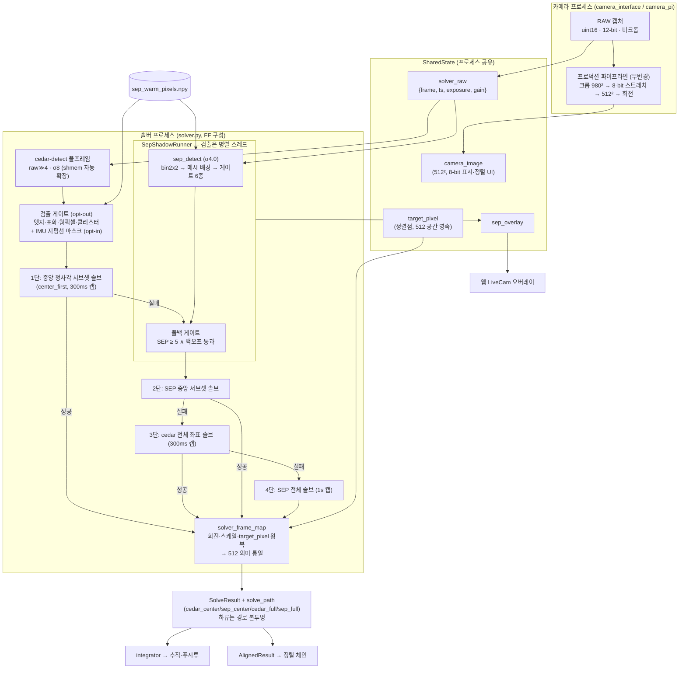
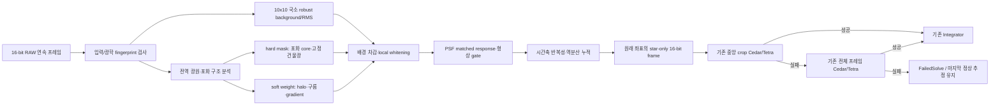
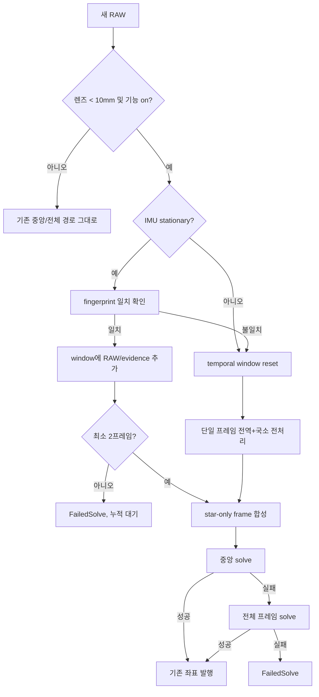
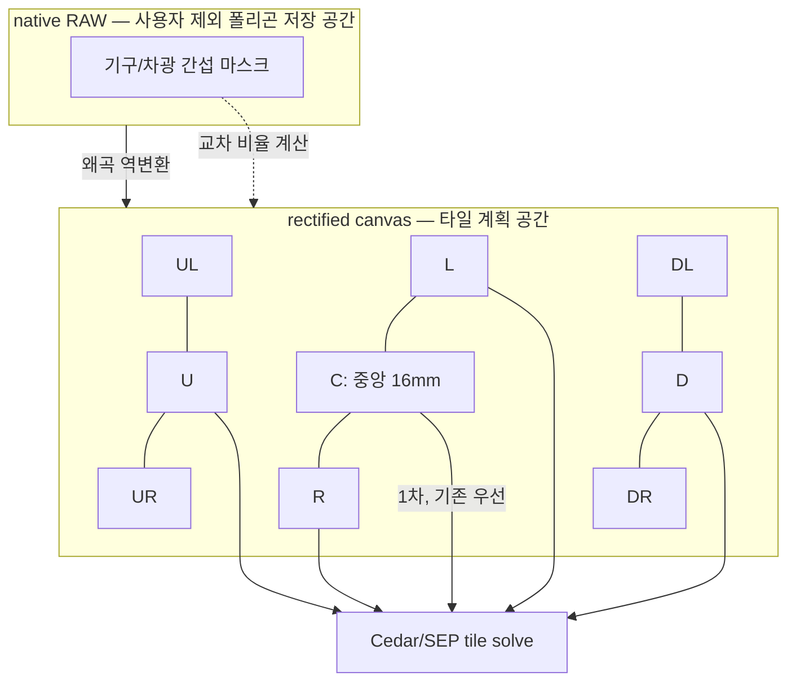
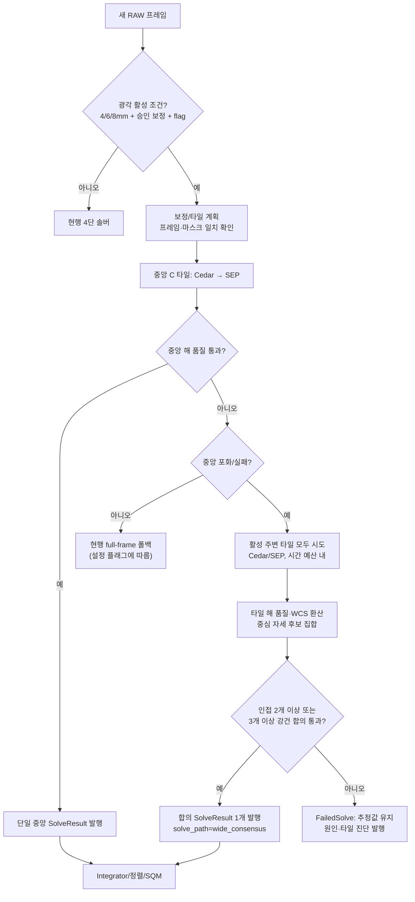
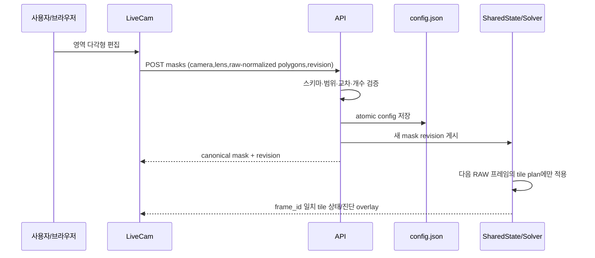

# 솔빙·검출·전처리 — 이전 설계와 조사 기록

> 2026-10-10 통합 보관. 아래 본문의 “현재/현행”, 기본값, 완료 상태와 명령은 원문 작성 당시 기준이다.
> 오늘의 동작은 [개발 기준 문서](../../mf_dev/README.md)를 따른다. 이력에 적힌 절차를 현재 설치 절차로 사용하지 않는다.

- [mf_adaptive_solver_scheduling_ko.md](#mf_adaptive_solver_scheduling_ko)
- [mf_cedar_fullframe_primary_plan_ko.md](#mf_cedar_fullframe_primary_plan_ko)
- [mf_cedar_sep_hybrid_design_ko.md](#mf_cedar_sep_hybrid_design_ko)
- [mf_false_solve_evening_validation_ko.md](#mf_false_solve_evening_validation_ko)
- [mf_sep_fullframe_impl_ko.md](#mf_sep_fullframe_impl_ko)
- [mf_solve_motion_gate_review_ko.md](#mf_solve_motion_gate_review_ko)
- [mf_star_only_preprocess_design_ko.md](#mf_star_only_preprocess_design_ko)
- [mf_wide_angle_solver_design_ko.md](#mf_wide_angle_solver_design_ko)
- [mf_wide_angle_solver_implementation_plan_ko.md](#mf_wide_angle_solver_implementation_plan_ko)
- [mf_wide_tiles_livecam_ko.md](#mf_wide_tiles_livecam_ko)


---

<a id="mf_adaptive_solver_scheduling_ko"></a>

## mf_adaptive_solver_scheduling_ko.md

<a id="mf_adaptive_solver_scheduling_ko--상태에-따른-동기비동기-솔빙-전환"></a>
## 상태에 따른 동기·비동기 솔빙 전환

2026-09-06. `solver_preprocess_mode` 기본값은 `auto`이며 `sync`로 고정할 수도 있다.
기존 `solver_preprocess_async`는 새 모드 설정이 없는 구성의 호환용으로만 읽는다.

<a id="mf_adaptive_solver_scheduling_ko--전환-조건"></a>
### 전환 조건

- 시작 시 동기 처리한다. 원본 솔브가 3프레임 연속 성공하면 비동기로 전환한다.
- 비동기 상태에서 원본 솔브가 실패한 프레임은 동기 전처리로 복구한다.
- 원본 패턴은 풀렸지만 좌표 연속성 검증이 2회 연속 보류되면 다음 프레임을
  동기로 복구한다. 통상적인 전처리→원본 전환의 1회 확인 대기는 허용한다.
- 원본이 한두 번만 성공했다 다시 실패하면 동기를 유지한다. 다시 3회 연속
  성공해야 비동기로 돌아가므로 불안정한 시야에서 잦은 전환을 억제한다.
- 이동·광학 설정·얼라인 target pixel 변경은 이력을 초기화한다. 얼라인 및
  왜곡 보정 중에는 동기 처리를 강제한다.

<a id="mf_adaptive_solver_scheduling_ko--프레임과-좌표"></a>
### 프레임과 좌표

동기 처리는 현재 프레임에 대응하는 전처리 결과를 기존 품질·연속성 검증 후
게시한다. 비동기는 현재 원본 솔브를 게시하며, 과거 전처리 결과를 새 프레임의
좌표로 바꾸어 게시하지 않는다. 비동기→동기 복구 시 오래된 동기 누적 창을
초기화하므로 첫 프레임은 워밍업이 필요할 수 있다.

동기 상태에서도 같은 프레임의 원본·전처리 좌표 차이를 학습하고, 일반적인
모드 전환에서는 그 보정을 유지한다. 이동·광학·target pixel 변경, 반복된
검증 보류, 원본/전처리의 과도한 불일치에서는 보정을 초기화한다.
모드/프레임 맥락이 바뀔 때 generation을 증가시켜 이전 비동기 결과를 버린다.

**전처리 간격은 변경하지 않았다.** 비동기 프레임마다 기존 `poll()`과 `offer()`를
실행한다. `LatestFrameWorker`는 실행 중 1개와 최신 대기 1개만 유지하고,
대기 프레임을 더 최신 프레임으로 바꾸는 기존 동작을 유지한다.

<a id="mf_adaptive_solver_scheduling_ko--진단과-검증"></a>
### 진단과 검증

`/dev/shm/pifinder/solver_scheduling_status.json`에서 설정 모드, 실제 비동기 여부,
다음 전환 상태/사유, 원본 성공 여부, 좌표 승인 여부, 처리 시간, frame ID,
exposure_end, generation을 조회한다. 이 파일은 RAM에 기록하며 좌표를 제어하지 않는다.

상태 전환·원본 실패 연속·간헐 성공·검증 보류·이동/광학/얼라인 초기화,
실제 `SolveContinuityGate`와 `PreprocessBiasTracker`를 조합한 전환 검증을 포함해
관련 테스트 70개가 통과했다. 대상 파일 Ruff 및 MyPy 검사, 설정 JSON 구문과
변경분 공백 검사도 통과했다.

<a id="mf_adaptive_solver_scheduling_ko--실기-적용과-측정"></a>
### 실기 적용과 측정

2026-09-06 21:47:36(KST)에 장치 설정을 `auto`로 적용하고 서비스를 재시작했다.
로그에서 21:47:51 원본 3회 연속 성공 후 비동기 전환, 21:47:53 원본 실패 후
동기 복귀를 확인했다. 이후 두 측정 구간(21:47:56~21:50:14 사이)의 동기 처리
표본 55회 중 좌표 승인 48회, 처리 시간 중앙값 1.708초, 범위 0.070~2.691초였다.
이는 개별 프레임 처리 시간이며 노출 시간이나 좌표 갱신 간격과 같지는 않다.
현재 시야에서는 원본 성공이 이어지지 않아 동기 복구가 주로 사용됐다.
비동기 전환은 로그로 확인했지만 측정 구간에 비동기 표본이 없어 두 모드의
속도 차이는 정량화하지 않았다. 측정 원본은 장치의 임시 파일
`/tmp/pifinder_adaptive_solver_measurement.json`에 저장했다.


---

<a id="mf_cedar_fullframe_primary_plan_ko"></a>

## mf_cedar_fullframe_primary_plan_ko.md

<a id="mf_cedar_fullframe_primary_plan_ko--cedar-풀프레임-1차-경로-전환--준비-계획-2026-08-03"></a>
## cedar 풀프레임 1차 경로 전환 — 준비 계획 (2026-08-03)

> 상태: **구현·기본 활성화 완료** — 2026-08-03 승인·구현,
> 2026-08-12 풀프레임 4단 경로 기본화 및 실기 재검증
> (§8). 실측 근거는 기존 문서를 참조로 인용하며 여기서 재수록하지 않는다.
> 관련 문서: [하이브리드 설계 정본](solver.md#mf_cedar_sep_hybrid_design_ko) ·
> [ADR m0023](../../adr/m0023-cedar-sep-hybrid-solving.md)(cedar 풀프레임 "보류" 결정)
> · [3경로 벤치 2026-08-01](../../mf_report/mf_solver_3path_bench_20260801_ko.md) ·
> [구현 이력 §6.7](solver.md#mf_sep_fullframe_impl_ko)(어두운 하늘 실측).

<a id="mf_cedar_fullframe_primary_plan_ko--1-배경--무엇을-바꾸려는가"></a>
### 1. 배경 — 무엇을 바꾸려는가

현행 1차 경로는 **cedar-512**: 프로덕션 512²/8-bit 스트레치 이미지를
shmem gRPC로 cedar-detect(σ8, max_size 10, binned)에 넣는다
(`solver.py` ~L986). 실패 시 SEP 폴백이 12-bit 원본(980² 크롭)으로
구제한다. 이번 작업의 대상은 **cedar의 입력을 풀프레임으로 바꾸는 것**.

<a id="mf_cedar_fullframe_primary_plan_ko--2-기존-테스트-방법-재사용할-방법론"></a>
### 2. 기존 테스트 방법 (재사용할 방법론)

두 차례 실측 모두 같은 방법론을 썼고 이번 검증에도 그대로 재사용한다:

1. **오프라인 동일 프레임 N자 비교** — 스테이지 덤프(단일 노출의 단계별
   저장)를 주기 캡처해 각 경로에 같은 프레임을 입력. 노출 동일성은
   덤프 단계 간 통계(min/max/mean/p50) 비트 일치로 검증.
2. **라이브 전수 기록** — `/api/solution` 0.15s 폴링로 시도 전수 수집.
   주의(벤치 §5): FOV·Centroids 필드로는 cedar/SEP 경로 구분 불가 —
   경로 판별은 오프라인 동일 프레임 RA 대조로.
3. cedar 접속은 실행 중인 서버(50551)에 **gRPC 인라인** (PFCedarDetectClient
   신규 인스턴스 금지 — shmem 세그먼트 충돌).
4. 스크립트: 이전 세션 스크래치패드 `bench3.py`/`aggregate_bench.py`/
   `bench_b_variants.py` (SD `~/.cache/piptmp/.../088e4027-*/scratchpad/` —
   소실 시 벤치 문서 §2 기준으로 재작성).

<a id="mf_cedar_fullframe_primary_plan_ko--3-기존-결과-요약-현행-vs-풀프레임"></a>
### 3. 기존 결과 요약 (현행 vs 풀프레임)

| 조건 | cedar-512 (현행 1차) | cedar 풀프레임 | 하이브리드(현행 전체) |
| --- | --- | --- | --- |
| **어두운 하늘** (7/29, §6.7, 6장) | 검출 6–10, 솔브 4/6 (간헐 실패) | 검출 24–31, **매치 3배, 순도 95%, 6/6** | cedar 직접 420/461 + SEP 구제, 100% |
| **광해 하늘** (8/1 벤치, 50장+라이브) | 검출 0–1, **0%** | 18% (감도=물리 SNR 한계), 순도 89%, 산포 최소(1σ 27–36″) | **88–90%** (SEP 전담) |
| 검출 시간 | 14ms (비경합 6ms) | 66ms (비경합 34ms) | SEP 143ms + 솔브 64ms |

추가 확정 사실:
- **전처리 무관** (벤치 §3.4): raw>>4 직결 = 프로덕션 스트레치와 검출·솔브
  완전 동일 → 풀프레임 cedar 입력은 전처리 없이 `solver_raw`를 바로 쓰면 됨.
- cedar-512의 간헐 실패는 좋은 하늘에서도 발생 — **크롭(시야 1/2.16)과
  8-bit 손실이 상시 병목** (§6.7 판정 ③).
- 풀프레임 이득의 대부분은 시야 2.16배 확장분의 실별 (벤치 §3.1).
  ※ 정정(2026-08-03 라이브 확인): SEP 경로도 **1920×1080 전체**를 사용한다
  — `crop_width_px=980`은 실제 크롭이 아니라 FOV 환산의 스케일 기준값.
  따라서 cedar-FF의 이득은 (SEP 대비) 시야가 아니라 cedar-512 대비
  시야+비트심도이고, 하이브리드 관점의 이득은 1차 성공 점유율·순도·지연이다.

<a id="mf_cedar_fullframe_primary_plan_ko--4-변경-옵션-분석"></a>
### 4. 변경 옵션 분석

**옵션 A — cedar-FF를 1차로 교체 (2단 유지: cedar-FF → SEP)** ← 권고
- 어두운 하늘: 1차 품질 급상승(매치 3배·순도 95%·간헐실패 해소) →
  SEP 폴백 빈도↓(시도당 ~200ms 절약 빈도↑), 정확도 개선 여지.
- 광해 하늘: 0% → 18%가 1차에서 해결되고 나머지는 지금처럼 SEP.
  회귀 없음(1차 실패 비용 +20~50ms/시도, 라이브 주기 439ms의 5–11%).
- 비용: 업스트림 패리티 제약(설계 제약 #1) 공식 포기 → ADR 개정 필요.

**옵션 B — 3단 (cedar-512 → cedar-FF → SEP)**: 기각 권고.
어두운 하늘에선 512가 먼저 성공해버려(420/461) FF의 품질 이득을 전혀
못 보고, 광해에선 실패 경로 지연만 +66ms 추가된다. 패리티 유지라는
장점뿐인데 이득이 구조적으로 발생하지 않는다.

**옵션 C — 배경 밝기 조건부 전환(밝으면 512, 어두우면 FF)**: 기각 권고.
A가 두 조건 모두에서 열등하지 않으므로 복잡도만 추가된다.

<a id="mf_cedar_fullframe_primary_plan_ko--5-권고-및-롤아웃"></a>
### 5. 권고 및 롤아웃

**옵션 A를 설정 플래그로 구현** (`solver_cedar_fullframe`, 구현 당시 기본 off;
2026-08-12부터 기본 on):
1. 플래그 on 상태로 §2 방법론 재검증 후 기본 on 전환. **완료**
2. 기본화 시점에 ADR m0023 개정(또는 후속 ADR): "cedar 풀프레임 보류"
   결정을 실측 근거로 해제, 업스트림 패리티 제약 완화 명시.
3. 롤백 = 플래그 off (기존 경로 코드 유지).

<a id="mf_cedar_fullframe_primary_plan_ko--6-구현-체크리스트-코드-접점"></a>
### 6. 구현 체크리스트 (코드 접점)

| 항목 | 내용 | 근거/비고 |
| --- | --- | --- |
| 입력 | `shared_state.solver_raw`(12-bit 비크롭) → `raw >> 4` 직결, 전처리 없음 | 벤치 §3.4 B2 판정 |
| 검출 파라미터 | σ8 / hot=on / binned=on (실측 구성 그대로) | §6.7·벤치 B |
| 전송 | 기존 PFCedarDetectClient shmem 재사용 — `_alloc_shmem`이 크기 자동 확장(512²→1920×1080 ≈ 2MB) | cedar_detect_client.py |
| 센트로이드 매핑 | FF 좌표 → 프로덕션 512 의미로 환산(90° 회전 + 스케일). SEP의 `solver_frame_map` 패턴 재사용/일반화 | 하류(추적·정렬·푸시투·target_pixel 512 영속) 무변경 유지 |
| tetra3 솔브 | **확인 완료**: 벤치 B는 프로덕션 `solver_frame_map`의 `rotate_centroids` + `fov_estimate_deg`(12°×1920/980 ≈ 23.5°)로 **네이티브 FOV 직접 솔브** — tetra3 DB 지원 실증(밝은 하늘 9/50, 어두운 하늘 6/6). SEP 경로와 동일 모듈이라 그대로 재사용 | bench3.py L95–106 확인(2026-08-03) |
| 오버레이 | cedar matched_centroids 매핑(§6.7, caec3e2f)이 FF 네이티브가 되면 단순화 | |
| AE 별카운트 | auto_exposure_starcount는 cedar 검출 수를 신호로 사용 — 입력이 FF가 되면 카운트 스케일이 ~3배 변함 → **AE 앵커/목표 재점검 필수** (또는 AE 전용으로 512 카운트 유지) | auto_exposure_starcount.py |
| SQM | matched_centroids 기반 mzero 계산의 좌표 공간 확인 | |
| 폴백 조건 | SEP 폴백 트리거(solution 실패)는 무변경 | |

<a id="mf_cedar_fullframe_primary_plan_ko--65-512-크롭-소비처-인벤토리와-무영향-전략-2026-08-03-전수-조사"></a>
### 6.5 512 크롭 소비처 인벤토리와 무영향 전략 (2026-08-03 전수 조사)

전제: 변경되는 것은 **솔버 프로세스가 cedar에 넣는 입력**뿐이다. 카메라
프로세스의 512² 생산 파이프라인(크롭→스트레치→512→회전)과
`shared_state.camera_image` 발행은 그대로 유지한다.

| 소비처 | 512 의존 내용 | 전략 |
| --- | --- | --- |
| UI 7곳: `preview` `align_daytime` `menu_manager`(×3) `base` `indi` `sqm` `sqm_sweep` | `camera_image`(512 8-bit)를 화면 표시/정렬 UI에 사용 | **무영향** — camera_image 생산 불변 |
| integrator | solution의 RA/Dec/Roll/target | **무영향** — SEP 전례대로 솔루션을 512 의미로 발행 (`_build_successful_solve` 무변경) |
| 정렬 체인 (target_pixel 512 공간 영속, 멀티포인트/SkySafari align) | solve의 `target_pixel` 입력과 `y/x_target` 출력 | `sep_shadow.solve`의 왕복 매핑 재사용: `map_target_pixel_to_frame`(512→FF) / `map_frame_pixel_to_target`(FF→512) — SEP이 실전 검증 완료 |
| SQM mzero (`solver.py` L890대) + `ui/sqm_calibration` | `matched_centroids` 좌표(+FOV)로 별 광량 샘플링 | **어댑터 기존재**: `utils.py`의 matched_centroids 스케일 헬퍼 + `_derotate_centroids(solve_rotation, side)` — SEP 솔브가 이미 통과하는 변환 체인에 FF cedar 솔루션도 동일하게 태움 |
| 오버레이 (`sep_overlay`) | matched_centroids를 풀프레임에 표시 | 오히려 **단순화** — §6.7(caec3e2f)의 "cedar 512→FF 매핑"이 불필요해지고 FF 네이티브 직결 |
| AE 별카운트 (`auto_exposure_starcount`, target 20) | `SolveDiagnostics.Centroids` | 권고: Centroids를 **"크롭 창 내 검출 수"로 계속 발행**(FF 검출 중 512 영역 내만 카운트 — 프레임당 1회 필터) → AE 완전 무변경. 대안은 FF 총수 발행 + AE 목표 재튜닝. ※ Centroids 의미는 이미 혼합 상태(SEP 구제 시 SEP 검출 수 발행 — 벤치 §5) |
| 웹 status / `api_extensions` | FOV·Centroids 표시 | 표시 전용 — FOV는 진단값 그대로(SEP도 ~11.46° 발행 전례), Centroids는 위 결정 따름 |
| tetra3 폴백 (cedar 서버 다운 시) | 512 `get_centroids_from_image` | **불변** — 플래그와 무관한 비상 경로로 유지 |

결론: 512 소비처 중 코드 수정이 필요한 곳은 **솔버 내부의 어댑터 층뿐**
이며, 전부 SEP 폴백이 이미 실전 검증한 매핑(`solver_frame_map`,
matched_centroids 변환)을 재사용한다. 하류·UI·정렬·SQM은 무변경.

<a id="mf_cedar_fullframe_primary_plan_ko--7-검증-계획-판정-기준"></a>
### 7. 검증 계획 (판정 기준)

§2 방법론으로 두 밤 측정 (플래그 on/off A/B):
1. **어두운 하늘 밤**: 오프라인 50장 3자(512/FF/하이브리드) + 라이브 15분.
   합격: FF-1차 하이브리드 솔브율 ≥ 현행, cedar 직접 점유율 상승,
   1σ 산포 ≤ 현행, 시도 주기 2Hz대 유지.
2. **광해 밤**(목표 조건): 동일. 합격: 솔브율 회귀 없음(≥88%),
   p95 산포 ≤ 현행.
3. AE 상호작용: FF 카운트 기준으로 노출 수렴이 정상인지 박명→암야
   전환 구간 관찰 (2026-08-03 밤 실측: 박명기 0별 사다리 순환 이슈
   별도 존재 — 사다리 최소단 400ms > 적정 180ms 문제, 본 작업과 독립).

<a id="mf_cedar_fullframe_primary_plan_ko--75-검증-기록--광해-상승-곡선-실측-2026-08-03-밤"></a>
### 7.5 검증 기록 — 광해 상승 곡선 실측 (2026-08-03 밤)

수동 노출 200ms/게인 30 고정, 섀도 CSV(시도별 전수)로 측정. 경통을 건물
불빛(하단)에서 시작해 단계적으로 상승. 시도 1,552건 원자료:
세션 스크래치패드 `lp_curve_20260803_full.csv`.

| 구간 | 배경(p50/4095) | 솔브율 | cedar-FF 직접 | SEP 구제 | 매치 med |
| --- | --- | --- | --- | --- | --- |
| 극한(건물빛 하단) | 2884 (70%) | 10% (251시도) | 0% | 10% | 8 |
| 〃 512 기준선(A/B) | 2883 (70%) | 72% (82시도) | 0% | 72% | 8 |
| 상승1 | 2553 (62%) | 98% | **95%** | 3% | 12 |
| 상승2 | 2249 (55%) | 100% | **99%** | 1% | 14 |
| 상승3 | 1756 (43%) | 97% | **95%** | 2% | 13 |
| (참고) 좋은 하늘 22:34 표본 | — | 10/10 | 100% | 0 | 25–27, RMSE 20–29″ |

**판정:**
1. **옵션 A 실지 검증 성공**: 배경 ≤62%에서 cedar-FF 1차가 95–99%를 직접
   해결(512 경로는 같은 밤 매치 ~6–10). 광해 목표 조건에서 SEP 의존이
   사실상 해소되는 구간이 넓다.
2. **솔빙 절벽은 배경 65–70% 부근** — FF 전환과 무관한 물리 한계(§벤치와
   정합). 절벽 위에선 SEP 구제만 유효.
3. **회귀 1건 발견(절벽 위 한정)**: FF는 검출 8개짜리 쓰레기 프레임에도
   tetra3 solve_timeout(1s)을 태워 시도율이 0.4Hz로 하락(512는 0–1개
   검출로 빠른 포기 → 2Hz). 그만큼 SEP 구제 기회·백오프 재무장 기회가
   줄어 절벽 위 구제율이 낮아진다(실측 10% vs 72% — 단 순차 측정이라
   하늘 변화 교란 포함). 개선 §9-1.
4. 극한 위치 A/B의 교훈: 순차 A/B는 하늘 변화에 취약 — 정식 두 밤 검증
   (§7)은 동일 프레임 오프라인 방식을 유지할 것.

<a id="mf_cedar_fullframe_primary_plan_ko--9-개선-백로그-2026-08-03-실측-기반"></a>
### 9. 개선 백로그 (2026-08-03 실측 기반)

1. ~~FF 빠른 포기~~ **적용 완료(2026-08-03)**: solve_timeout 1000→300ms
   (`CEDAR_FF_SOLVE_TIMEOUT_MS`).
2. **SEP 폴백 백오프 재측정**: #1 적용 후 절벽 위 구제율 재측정. 필요시
   "SEP 검출 ≥ 12일 때 백오프 면제" 검토.
3. **AE 0별 복구 개선** (본 작업과 독립, 사용자 결정: 별도 AE 테스트에서
   확정): 코드 분석(2026-08-03) 결과 실결함은 ① 경계 밝기에서 간헐 성공이
   사다리를 매번 리셋해 200k 단/확장에 도달 못 하는 **리셋 루프**,
   ② bright 판정 문턱 240/255가 과도해 광해 하늘이 야간 상향 사다리를
   타는 것. 개선안: 성공 후 연속 M프레임 비제로 확인 뒤 리셋 + 문턱
   120–150 하향(또는 12-bit 배경 기준). 소유: ax/camera.md 체계.
4. ~~솔브 경로 필드 발행~~ **적용 완료(2026-08-03)**:
   `SolveDiagnostics.solve_path` + `/api/solution` 노출.
5. ~~**기본 on 전환**~~ **완료(2026-08-12)**: 누적 동일 프레임 A/B와
   라이브 실기 재검증을 근거로 `solver_cedar_fullframe=true`,
   `solver_center_first=true`를 기본값으로 전환. 각 플래그 off 롤백은 유지.

<a id="mf_cedar_fullframe_primary_plan_ko--8-결정-기록"></a>
### 8. 결정 기록

**2026-08-03 사용자 전부 승인** — 옵션 A(cedar-FF 1차 + SEP 폴백 하이브리드
유지) 채택, 패리티 제약 완화 승인, AE는 크롭 내 카운트 발행 방식.
같은 날 구현 완료: `solver_cedar_fullframe` 플래그(당시 기본 off),
solver.py `_solve_cedar_fullframe`/`_count_in_crop` + sep_shadow
`attach_canvas_matched`, 테스트 tests/test_solver_cedar_fullframe.py.
ADR 개정은 계획대로 검증 통과 후 기본 on 전환 시점에 수행.
**후속 확장(2026-08-04)**: FF 검출 게이트(`solver_cedar_ff_gates`) ·
IMU 지평선 마스크(`solver_horizon_mask`, opt-in) · 중앙 우선 4단
캐스케이드+SEP 병렬 검출(`solver_center_first`) — 현행 구조의 정본 기술은
[설계 문서 §2](solver.md#mf_cedar_sep_hybrid_design_ko)로 이관.
**라이브 1차 검증(2026-08-03 22:34, 플래그 on)**: cedar-FF 직접 솔브 10/10
표본, 매치 25–27(512 경로 대비 ~3배), RMSE 20–29″, T_solve 9–10ms,
Centroids=크롭 내 카운트(15–17) 정상 발행. §7의 정식 두 밤 검증은 잔여.

**기본 활성화 및 재검증(2026-08-12)**: 풀프레임·게이트·중앙 우선·SEP
폴백을 기본 운용 경로로 확정했다. 단계별 검출 진단을 추가한 뒤 현재 장비의
동일 하늘에서 `cedar_ff_center`(원검출 114 → 게이트 90 → 중앙 64,
38매치)와 `cedar_ff`(120 → 88, 71매치, RMSE 16.6″) 연속 성공을 확인했다.
상세 기록은 [2026-08-12 실기 리포트](../../mf_report/mf_solver_diagnostics_20260812_ko.md).

**캐스케이드 우선순위 보정(2026-08-12)**: 현장 설계 의도를 명문화하여
`Cedar 중앙 → SEP 중앙 → Cedar 전체 → SEP 전체`로 변경했다. 상·하단은
광학 왜곡과 지평선 광해·장애물의 영향을 받으므로, 검출기 우선순위보다
중앙 영역 우선순위를 높인다. 풀프레임 좌표는 두 중앙 경로가 모두 부족하거나
패턴 매칭에 실패한 최악의 경우에만 사용한다.

**진단 경로 명칭 정리(2026-08-12)**: 성공 영역을 이름에서 즉시 판별하도록
`cedar_ff_center`→`cedar_center`, `cedar_ff`→`cedar_full`,
`sep`→`sep_full`로 변경했다. `sep_center`는 그대로다. 과거 리포트의 기존
값은 당시 API 기록으로 보존하며, 이후 응답과 문서는 새 이름을 사용한다.

이전 결정 대기 항목(이력):
1. 옵션 A(1차 교체) 채택 여부 — 본 문서 권고. → 승인
2. 업스트림 패리티 제약 포기 승인 (ADR 개정 트리거). → 승인
3. ~~FF 솔브 방식~~ **해결(2026-08-03)**: 네이티브 23.5° FOV 직접 솔브
   (`solver_frame_map` 재사용, 벤치 실증) — 별도 결정 불필요.
4. AE 별카운트 처리: FF 재튜닝 vs 512 카운트 유지. → 크롭 내 카운트 발행으로 확정(§6.5)


---

<a id="mf_cedar_sep_hybrid_design_ko"></a>

## mf_cedar_sep_hybrid_design_ko.md

<a id="mf_cedar_sep_hybrid_design_ko--cedar--sep-하이브리드-솔빙--설계-문서"></a>
## cedar + SEP 하이브리드 솔빙 — 설계 문서

> 상태: **living(설계 정본)** — 코드가 바뀌면 이 문서를 함께 갱신한다.
> 코드 기준일: 2026-08-12 (`solver.py` / `sep_detect.py` / `sep_shadow.py` /
> `solver_frame_map.py` / `sep_warm_map.py` / `horizon_mask.py`).
> English version: [mf_cedar_sep_hybrid_design_en.md](solver.md#mf_cedar_sep_hybrid_design_ko)
>
> **문서 지형** — 이 주제는 문서 4종이 역할을 나눈다:
> - **이 문서**: 현재 설계의 정규 기술(무엇이 어떻게 동작하는가). 유일한
>   설계 권위.
> - [ADR m0023](../../adr/m0023-cedar-sep-hybrid-solving.md): 아키텍처 결정과 근거
>   (왜 이 구조인가). 결정 기록이므로 갱신하지 않는다.
> - [mf_sep_fullframe_impl_ko.md](solver.md#mf_sep_fullframe_impl_ko): 구현·튜닝
>   **이력**(실측 원자료, 튜닝 판정 경위 §6). 수치의 출처가 필요할 때 참조.
> - [mf_cedar_sep_hybrid_solve_20260728_ko.md](../../mf_report/mf_cedar_sep_hybrid_solve_20260728_ko.md)
>   (커뮤니티 공지) / [mf_solver_3path_bench_20260801_ko.md](../../mf_report/mf_solver_3path_bench_20260801_ko.md)
>   (밝은 하늘 벤치): 요약·1회성 실측.
> - [mf_cedar_fullframe_primary_plan_ko.md](solver.md#mf_cedar_fullframe_primary_plan_ko)
>   (전환 계획·소비처 인벤토리·결정 기록) /
>   [mf_solver_fullframe_field_test_20260803_ko.md](../../mf_report/mf_solver_fullframe_field_test_20260803_ko.md)
>   (풀프레임 실측 리포트): cedar 풀프레임 1차 전환 트랙(2026-08-03 채택).
>
> 자동 노출 아키텍처의 정규 소유자는 [ax/camera.md](../../ax/camera.md),
> 포인팅 체인은 [ax/positioning.md](../../ax/positioning.md). 이 문서는 그 사이의
> "검출→솔브 경로 선택"만 소유한다.

<a id="mf_cedar_sep_hybrid_design_ko--1-목표와-제약"></a>
### 1. 목표와 제약

**목표 조건** (사용자 결정 2026-07-28): 광해로 별이 몇 개만 보이는 하늘에서
정확하게 솔빙되는 파인더. 이 조건에서 기존 경로(cedar-512)는 검출 0–1개로
직접 솔브 0%였고, SEP 풀프레임 경로가 솔브 전량을 담당한다(실측: ADR m0023
표, 3경로 벤치).

**설계 제약** (전 구간에 적용되는 불변 조건):

| 제약 | 구현 방식 |
| --- | --- |
| 프로덕션 512 경로 보존 | `solver_cedar_fullframe`=off이면 cedar 경로는 기존과 바이트 동일하게 실행되어 즉시 롤백할 수 있다. **기본 on에서는 cedar 1차가 비크롭 12-bit 원본(>>4)을 네이티브 FOV로 솔브**한다. 어느 쪽이든 SEP 폴백·하류 계약은 동일 |
| 하류 체인(추적·정렬·푸시투·SQM) 무변경 | SEP 솔루션을 기존 좌표 의미로 환산해 같은 메시지로 공급 — 하류는 어느 경로가 풀었는지 모른다 |
| 실험 코드는 프로덕션을 죽일 수 없다 | `sep_shadow`의 모든 진입점이 예외를 로그 후 삼킴(None 반환) |
| SD 쓰기 금지(명시적 디버깅 제외) | 섀도 CSV·덤프·로그 전부 tmpfs (§12) |
| `sep`은 선택 의존성 | 미설치 시 import 실패 없이 전 경로 무해화(None) |

<a id="mf_cedar_sep_hybrid_design_ko--2-아키텍처-개요"></a>
### 2. 아키텍처 개요

폴백 하이브리드: cedar가 우선하고, 실패한 그 시도에서 SEP이 같은 노출의
12-bit 비크롭 원본으로 이어받는다. `solver_cedar_fullframe`=on(이 포크의
운용 구성, 2026-08-03 채택)이면 cedar 1차도 비크롭 원본(raw≫4)을 네이티브
FOV로 솔브하고, `solver_center_first`=on이면 좌표 레벨 4단 캐스케이드
(**cedar-중앙 정사각 → SEP-중앙 정사각 → cedar-전체 → SEP-전체**)가 되며
SEP 검출은 최초 cedar 중앙 단과 워커 스레드로 병렬 실행된다. 검출기보다
프레임 영역을 우선한다. 두 플래그 모두 off면 기존
2계층(cedar-512 → SEP)과 바이트 동일하다.

**블록 다이어그램** — 컴포넌트·데이터 채널 관점:



`target_pixel`은 프로덕션 솔브에는 그대로, SEP 솔브에는 `solver_frame_map`
매핑을 거쳐 들어가고, 정렬 갱신은 두 경로 모두 `AlignedResult`를 통해서만
이뤄진다(§8).

**시도별 데이터 흐름**:

```
카메라 프로세스 (camera_interface / camera_pi)
  RAW 캡처(uint16, 12-bit, 비크롭)
    ├─ set_solver_raw({frame, ts, exposure_us, gain})   ← SEP 경로 입력
    │    (solver_shadow_detect ∨ solver_sep_fallback일 때만 발행, rot90만 적용)
    └─ 크롭(980²) → 8-bit 스트레치 → 512² → 회전 → camera_image  ← 프로덕션 무변경

솔버 프로세스 (solver.py, 시도마다 — FF+center_first 구성 기준)
  [검출] cedar-detect(solver_raw≫4, σ8, max_size 10, binned, hot)
         → 게이트: 엣지·포화 샘플·웜픽셀·클러스터 (solver_cedar_ff_gates)
         → IMU 지평선 마스크: 고도 < 5° 검출 제거 (solver_horizon_mask, opt-in)
         ∥ 동시에 워커 스레드: sep_shadow.detect(solver_raw)
         (신선한 solver_raw 부재/cedar 연결 실패 시 그 시도만 512/tetra3 폴백)
  [1단] 중앙 정사각(min(h,w)²) 서브셋 솔브 — 4개 미만 or 전체와 동일하면 스킵
  [2단] 실패 ∧ SEP ≥ 5 ∧ 백오프 통과 → 스레드 join 후 SEP 중앙 서브셋
  [3단] 두 중앙 경로 실패 시에만 cedar 전체 좌표 솔브 (300ms 캡)
  [4단] 다시 실패하면 SEP 전체 (sep_shadow.solve, 1s 캡)
  [발행] SolveResult(+ solve_path) → integrator, 오버레이 1회 게시, CSV 1행
         Centroids = 게이트 후 크롭 창 내 검출 수 (AE 512 의미 보존)
```

**cedar 풀프레임 1차 채택 경위** (ADR m0023의 "보류"에서 변경, 2026-08-03
사용자 승인): 보류 사유였던 "밝은 하늘 18%"는 1차 **단독** 운용 기준이었고,
SEP 폴백을 유지한 채 1차만 교체하면 회귀 없이 어두운 하늘 이득(매치 3배·
순도 95%)을 얻는다는 판단. 광해 상승 곡선 실측으로 확인 — 배경 ≤62%에서
cedar-FF 직접 95–99%, 절벽(≥65–70%)은 물리 한계로 경로 무관
(실측 리포트 참조). 중앙 우선 캐스케이드는 사용자 설계(2026-08-04):
중앙 서브셋이 어두운 하늘에서 RMSE 24→13″(오프라인 A/B). 정식 어두운 밤
A/B와 2026-08-12 실기 재검증을 근거로 풀프레임·중앙 우선 플래그를 기본
on으로 전환했다. 같은 날 사용자 기준을 명확히 반영해 **모든 중앙 경로를
모든 전체 경로보다 우선**하도록 순서를 바꿨다. 이유는 상·하단의 광학 왜곡,
지평선 광해와 장애물이 패턴 오류를 일으킨다는 실기 관찰이며, 전체 프레임은
중앙 두 경로가 모두 실패했을 때만 쓰는 최후 수단이다. off 롤백 경로는
그대로 보존한다.

<a id="mf_cedar_sep_hybrid_design_ko--3-프레임-공간과-좌표-정합-solver_frame_mappy"></a>
### 3. 프레임 공간과 좌표 정합 (`solver_frame_map.py`)

추적 무결성의 핵심. 세 좌표 공간을 구분한다:

| 공간 | 정의 | 사용처 |
| --- | --- | --- |
| **회전된 512** (정규) | 크롭→512 리사이즈→stage-5 회전 | 프로덕션 솔브, `target_pixel` 영속, 정렬 체인, SQM 측광 |
| **회전된 풀프레임** | 비크롭 원본에 같은 stage-5 회전 적용 | SEP 솔브가 수행되는 공간 |
| **풀프레임(무회전)** | `solver_raw` 그대로 (rot90만) | SEP 검출·웜픽셀 맵·LiveCam 오버레이 |

설계 원리: **SEP 솔브를 프로덕션과 같은 회전이 적용된 공간에서 수행**하면
RA/Dec/Roll과 정렬 의미가 동일해진다. 크롭이 중심 대칭이고 리사이즈가
등방이므로, 두 회전된 공간 사이의 `target_pixel` 변환은 회전이 상쇄되어
**"중심 기준 ×(crop_width/512) 스케일"**로 환원된다(모듈 docstring에 증명).

- `stage5_rotation_deg(screen_direction, camera_rotation)`: `camera_rotation`
  설정 시 `(-rot) % 360`, 아니면 screen_direction
  right/straight/flat3/as_bloom → 90°, 기타 → 270°. PIL `Image.rotate`
  (CCW, expand=False)와의 부호 규약은 테스트로 고정.
- `rotate_centroids`: 90° 배수는 캔버스 치수를 교환하는 정수 정확 매핑,
  임의각은 캔버스 중심 회전.
- `map_target_pixel_to_frame` / `map_frame_pixel_to_target`: 위 중심-스케일
  관계의 정/역방향. 정렬점을 512 공간 ↔ 회전된 풀프레임으로 오간다.
- `fov_estimate_deg(width, crop_w)`: 프로덕션 캘리브레이션 "크롭 980px =
  12°"에서 산출. imx462 풀프레임 가로 23.5° (패턴 DB max_fov 30° 이내).

**검증**: `test_sep_fullframe_solve.py` — tetra3 자체 별표를 두 경로로 각각
투영·솔브 → Roll 편차 0.000°, 정렬점 편차 20″(평면 피팅 잔차 수준). unit
스위트 상시 회귀. 실하늘 교차검증: 두 경로 동일 하늘 솔브 시 정렬점 512공간
1px 이내(듀얼솔브 테스트).

<a id="mf_cedar_sep_hybrid_design_ko--4-sep-검출-파이프라인-sep_detectdetect_stars"></a>
### 4. SEP 검출 파이프라인 (`sep_detect.detect_stars`)

입력: `solver_raw` 프레임(uint16 모자이크/모노, 임의 크기). 출력:
`SepDetection` — 풀프레임 픽셀 좌표 (y, x) 센트로이드(플럭스 내림차순),
플럭스, 배경 통계, `masked_count`.

```
bin2x2 평균 비닝 (float32, SNR ×2)                960×540 (imx462)
  → sep.Background(bw=32, bh=32) 메시 배경 추정·차감   ← 광해 그라디언트·구름 글로우 제거
  → sep.extract(thresh=σ, err=bkg.rms(),
                filter_kernel=3×3 가우시안, minarea=3)  ← 국소 RMS 상대 임계 + 매치드 필터
  → 품질 게이트 (아래 순서대로)
  → 플럭스 상위 max_stars, 좌표 ×2+0.5로 풀프레임 환산
```

**품질 게이트** — 순서와 근거 (임계는 전부 tetra3 매치 실측 대비 도출,
경위: impl §6.1/§6.3/§6.5):

| # | 게이트 | 파라미터(기본) | 걸러내는 것 |
| --- | --- | --- | --- |
| 1 | 포화 가드 | 내부(중앙 1/2) 중앙값 ≥ 0.98×풀스케일 → **정직한 0** 반환 | 두꺼운 구름이 센서를 태운 프레임의 가장자리 잡음 |
| 2 | 양성 플럭스 | flux > 0 | 배경 모델 잔재(0·음수 플럭스) |
| 3 | 가장자리 마진 | 경계 48px(풀해상도) 이내 제외 | 비네팅·배경 메시 경계 아티팩트 |
| 4 | 점광원 형태 | 장축 유한 ∧ ≤ 2.0 비닝px ∧ npix ≤ 40 | 구름 텍스처(실별 장축 p95 0.86, npix p95 10; 여유분은 디포커스 헤드룸) |
| 5 | 웜픽셀 마스크 | 맵 위치 반경 4px 이내 제거, `masked_count` 보고 | 센서 정적 결함 (§5). top-N 캡 **이전**에 적용 — 결함이 실별을 밀어내지 못하게 |
| 6 | 클러스터 | 반경 50px 내 이웃 > 1이면 제거 | 구름 에지를 SEP이 디블렌딩한 "검출 뭉텅이" (실별은 이 배율에서 전원 고립 — 이웃 0 실측) |

σ는 config `solver_sep_sigma`(기본 **4.0**)로 주입 — 함수 시그니처 기본값
3.5는 라이브러리 기본일 뿐 프로덕션 값이 아니다. σ4.0 채택 근거: 게이트가
순도를 담당(σ4.5 대비 실별 회수 +20–40%, 순도는 게이트 후 66→91%) — impl
§6.5 재판정.

<a id="mf_cedar_sep_hybrid_design_ko--5-웜픽셀-맵-sep_warm_map-sep_detectbuild_warm_pixel_map"></a>
### 5. 웜픽셀 맵 (`sep_warm_map`, `sep_detect.build_warm_pixel_map`)

야간 검출의 절반 이상이 센서 정적 결함이었다는 실측(19위치가 검출의 55%,
impl §6.3)에서 도입. **검출 재발이 아니라 raw 도메인에서 직접** 찾는다:

- 후보: 거리-2 이웃 4개(컬러 센서라면 동일 Bayer 채널 위치; 모노에서도
  희소 이웃으로 유효)의 중앙값 대비 **+45 ADU 초과**.
- 확정: 코퍼스 프레임의 **70%+에서 같은 위치 재발**. 별은 하늘과 함께
  이동해 한 프레임 간격에 빠져나가고, 순간 노이즈는 재발하지 않는다.
- 생성: `python -m PiFinder.sep_warm_map <스테이지덤프 디렉터리>` →
  `~/PiFinder_data/sep_warm_pixels.npy` ((N,2) int, solver_raw 방향).
  현행 배포 맵 47위치.

**운영 규칙**: ① 재생성은 **어두운 코퍼스로만** — 밝은 박명 프레임이 섞이면
재발률 희석으로 정당한 웜픽셀이 탈락(57→40 퇴보 실측). ② 웜픽셀은 센서
노화·온도로 늘어나므로 시즌마다 재생성 권장(주기는 미확정 — ADR m0023 잔여
운영 항목). ③ 맵 부재/로드 실패는 마스킹 없이 동작(로그만).

<a id="mf_cedar_sep_hybrid_design_ko--6-러너와-폴백-정책-sep_shadowsepshadowrunner"></a>
### 6. 러너와 폴백 정책 (`sep_shadow.SepShadowRunner`)

<a id="mf_cedar_sep_hybrid_design_ko--61-구성-create_if_enabled"></a>
#### 6.1 구성 (`create_if_enabled`)

`solver_shadow_detect ∨ solver_sep_fallback`일 때만 생성. 카메라
프로파일(`sqm/camera_profiles.py`)에서 크롭 기하(→ crop_width, FOV)와 비트
깊이(→ 포화 가드 4095)를 읽으므로 센서별 상수 하드코딩이 없다. 카메라 타입
공유 전이면 None → 솔버 루프가 다음 시도에 재생성 시도.

<a id="mf_cedar_sep_hybrid_design_ko--62-신선도-가드"></a>
#### 6.2 신선도 가드

`detect()`는 `solver_raw`가 **15초 이내**일 때만 사용(`MAX_FRAME_AGE_S`).
카메라 wedge나 경로 비활성화 직후의 낡은 프레임을 현재 시도로 오인하지
않기 위함.

<a id="mf_cedar_sep_hybrid_design_ko--63-폴백-발동-조건-solverpy-배선과-합쳐서"></a>
#### 6.3 폴백 발동 조건 (solver.py 배선과 합쳐서)

```
sep_run 존재                          ← detect 성공 (신선한 프레임 + sep 가용)
∧ fallback_enabled                    ← config solver_sep_fallback
∧ cedar 경로 솔브 실패 (RA 없음)
∧ SEP 검출 수 ≥ min_fallback_stars(5)
∧ fallback_should_attempt(검출 수)    ← 백오프 게이트 (§6.4)
```

`min_fallback_stars=5`의 근거: σ4.5 스윕에서 실별 구제 솔브의 절반이 검출
5–7개였고(예전 게이트 8은 σ3.5의 잡음 인플레이션 기준), 5 미만 솔브는 관측
0 (impl §6.5).

<a id="mf_cedar_sep_hybrid_design_ko--64-백오프--헛수고-방지와-즉시-재무장"></a>
#### 6.4 백오프 — 헛수고 방지와 즉시 재무장

실패한 폴백 솔브는 시도당 최대 solve_timeout(1 s)의 솔버 CPU를 태운다.
실내·두꺼운 구름에서는 웜픽셀·잔여 오검출로 게이트를 매번 통과할 수 있어
그 비용이 무한 반복된다. 설계:

- 연속 실패 n회 → 다음 `min(2ⁿ, 8)`회 시도를 스킵.
- **즉시 재무장 2경로**: ① SEP 검출 수가 마지막 실패 시의 **1.5배**로
  점프(구름 틈이 열리는 시그니처 — 실측: 마스크 후 ≤5 → ~30), ② 프로덕션
  솔브 성공(`note_solved()` — 하늘이 풀리는 상태이므로 다음 cedar 실패는
  즉시 구제 시도).

구제가 필요한 순간(별이 다시 보임)에 지연이 없고, 가망 없는 장면에서만
쉰다.

<a id="mf_cedar_sep_hybrid_design_ko--65-폴백-솔브-solve"></a>
#### 6.5 폴백 솔브 (`solve()`)

1. 센트로이드를 stage-5 회전각으로 회전 (→ 회전된 풀프레임 캔버스).
2. `target_pixel`을 512 공간 → 캔버스로 매핑, FOV 산출 (§3).
3. `t3.solve_from_centroids(cents, canvas, fov_estimate, fov_max_error=fov/3,
   match_max_error=0.005, return_matches=True, target_pixel, target_sky_coord,
   solve_timeout=1000)`.
4. 성공 시 `y/x_target`을 **512 공간으로 역매핑**(§8 정렬 체인이 그대로
   소비하도록).

참고: 프로덕션 512 솔브는 `fov_estimate 12.0 / fov_max_error 4.0`으로 같은
tetra3를 호출한다 — 파라미터 차이는 FOV 스케일뿐.

<a id="mf_cedar_sep_hybrid_design_ko--7-솔버-배선-solverpy"></a>
### 7. 솔버 배선 (`solver.py`)

폴백 솔루션을 정규 체인에 공급할 때의 규칙:

- **`matched_centroids` / `matched_stars` / `matched_catID` 제거**: 이들은
  풀프레임 좌표라서, 512 프레임을 읽는 SQM 측광에 섞이면 좌표 공간이
  오염된다. catID는 나머지 둘과 배열이 평행하므로 함께 제거해 메시지
  일관성 유지.
- **`Centroids`(검출 수)는 SEP 검출 수로 발행**: 자동 노출의 솔브
  홀드(ADR m0022)가 "실제로 솔브된 노출"에 앵커되도록. cedar 솔브 시에는
  기존대로 cedar 수.
- 성공/실패 메시지 형식·타이밍은 기존과 동일 — integrator 이하 하류는
  경로를 구분할 수 없다(의도된 불투명성).
- 솔브 성공(어느 경로든) 시 `note_solved()`로 백오프 리셋.
- **FF cedar 솔루션도 같은 규칙**: matched-* 3종은 풀프레임 좌표라 SQM 앞에서
  제거하되 오버레이용으로만 따로 보관(`attach_canvas_matched` — SEP 매치와
  같은 회전 캔버스 공간). `Centroids`는 **게이트 후 크롭 창 내 검출 수**로
  발행해 AE의 512 의미를 보존한다.
- **타임아웃 캡**: FF cedar 단 300ms(`CEDAR_FF_SOLVE_TIMEOUT_MS` — 성공
  솔브 실측 9–26ms, 실패 시 빠른 포기로 SEP 기회 보존), SEP 폴백
  1s(`FALLBACK_SOLVE_TIMEOUT_MS` — 500ms 캡은 실측 근거 미확보로 보류).
- **`SolveDiagnostics.solve_path`**: `cedar_center` / `sep_center` /
  `cedar_full` / `sep_full` — 기본 4단 경로. 이름은 검출 입력이 아니라 실제
  솔빙에 사용한 영역을 나타낸다. 레거시 롤백 모드는 `cedar_512`, Cedar
  서버 불가 모드는 `tetra3`. 진단 전용(하류 분기 금지), `/api/solution` 노출.

**cedar 1차 경로 자체의 가용성 방어** (하이브리드와 독립이지만 같은 루프):
cedar-detect-server 연결 실패(`CedarConnectionError`) 시
`tetra3.get_centroids_from_image`로 검출 폴백. logind `RemoveIPC`가 공유
메모리 세그먼트를 지운 경우 `PFCedarDetectClient._del_shmem` 오버라이드가
소실을 해제로 간주하고 같은 호출을 이미지 인라인(gRPC)으로 재시도 —
인라인 폴백에도 `detect_hot_pixels`를 명시 전달해 검출 품질을 유지한다
(d1875e04, 업스트림 #548 이식). 시스템 차원 예방은 설치 스크립트의
`RemoveIPC=no` 드롭인.

<a id="mf_cedar_sep_hybrid_design_ko--8-하이브리드-정렬"></a>
### 8. 하이브리드 정렬

정렬(align)도 같은 우선순위를 따른다. cedar가 풀면 기존 정렬 그대로
(폴백 분기는 cedar 실패 시에만 진입하므로 우선순위가 구조적으로 보장),
못 풀면:

1. 솔버가 보류 중인 정렬 좌표 `[[align_ra, align_dec]]`를
   `sep_shadow.solve(target_sky_coord=...)`로 전달.
2. tetra3가 회전된 풀프레임 캔버스에서 `y/x_target`을 반환.
3. `map_frame_pixel_to_target`으로 **512 공간에 역매핑** 후 정규 정렬
   체인(`AlignedResult` → `target_pixel` 영속)에 공급 — 정렬 저장 형식·
   config 무변경.

이로써 목표 하늘(cedar 불능)에서 정렬이 가능하다. 두 경로의 정렬점 일치
(512공간 1px 이내)는 듀얼솔브 테스트로 고정. 실망원경 정밀 검증은 운영
잔여 항목(§15).

<a id="mf_cedar_sep_hybrid_design_ko--9-자동-노출-연동"></a>
### 9. 자동 노출 연동

정규 소유자는 [ax/camera.md](../../ax/camera.md) §3b/§6b — 여기서는 접점만:

- 폴백 솔브 성공 시 `Centroids`=SEP 수 발행(§7) → 별 수 컨트롤러의 앵커
  트러스트(90 s 신뢰 창, ADR m0022)가 "솔브된 노출"에 고정된다. 구름
  통과 중 출렁임 방지.
- 실패 시도의 `Centroids`는 여전히 cedar 수(목표 하늘에서 ~0) — 무솔브
  구간의 회복 사다리가 cedar 실명에 의존한다. SEP 수 공급안은 "구름 중
  사다리 억제" 부작용으로 보류(사다리는 의도된 탐색) — 관찰 항목.

<a id="mf_cedar_sep_hybrid_design_ko--10-오버레이진단-채널"></a>
### 10. 오버레이·진단 채널

**LiveCam SEP 오버레이** — 의미론: **초록 = 어느 경로든 솔버가 tetra3
매치로 확정한 별**(솔브 프레임에선 정의상 오인 0), 주황 = 미확정 후보.

발행 수명주기(경합 방지가 요점): `detect()`가 후보를 러너 내부에 보관만
하고, 솔브 결과 확정 후 매치 정보를 부착해 **시도당 정확히 1회**
`publish_overlay()`로 게시한다. (후보를 detect 시점에 게시하면 다음 시도의
detect가 덮어써 확정/후보 구분이 화면에 못 닿는다 — 수정된 경합.)
매치 좌표 부착 경로 2종: SEP 솔브는 캔버스→역회전, cedar 솔브는 512→
중심-스케일 매핑→역회전 (`attach_production_matched`).

**섀도 CSV** (`solver_shadow_log.csv`, tmpfs, opt-in): 시도당 1행의 A/B
비교 (`cedar_centroids, matches, solved, sep_centroids, sep_top_flux,
sep_bkg, sep_rms, sep_ms, fallback_used, fallback_rmse, sep_masked` 등).
스키마 변경 시 기존 파일을 `.old`로 밀어내고 새로 시작(혼합 폭 방지).
튜닝 세션에만 켠다(ADR m0023 §2).

**API 단계별 진단(2026-08-12)**: `/api/solution`은 `solve_path`와 함께 다음
검출 수를 노출한다. SEP 구제 성공 시 기존 `Centroids`가 SEP 수로 바뀌어
Cedar 상태를 숨기던 문제를 해결한 관측 전용 필드이며, 하류 제어에는 쓰지
않는다.

| 필드 | 의미 |
| --- | --- |
| `CedarRawCentroids` | 풀프레임 Cedar 원검출 수 |
| `CedarGatedCentroids` | 품질·지평선 게이트 후 Cedar 수 |
| `CedarCenterCentroids` | 중앙 정사각 1단에 투입된 Cedar 수 |
| `SepCentroids` | 같은 프레임의 SEP 게이트 후 검출 수 |

필드가 없는 구버전 메시지와 Cedar/SEP가 실행되지 않은 경로는 `null`로
직렬화한다. 기존 `Centroids` 의미와 자동 노출 동작은 호환성을 위해
변경하지 않았다. 따라서 경로 판별은 `solve_path`, 단계별 검출 병목은 위
네 필드로 직접 확인한다. 라이브 sigma 스윕 시에는
`PFCedarDetectClient` 새 인스턴스 생성 금지(shmem 충돌) — gRPC 인라인으로
접속한다.

**경로 명칭 변경(2026-08-12)**: 종전 `cedar_ff_center`는 풀프레임 원본에서
검출했더라도 중앙 좌표만 솔빙에 사용하므로 `cedar_center`로 변경했다.
같은 원칙으로 `cedar_ff`→`cedar_full`, `sep`→`sep_full`로 명시화했다.
`ff`는 검출 구현과 솔빙 영역을 혼동시키므로 경로 이름에서 사용하지 않는다.

<a id="mf_cedar_sep_hybrid_design_ko--11-안전방어-설계-요약"></a>
### 11. 안전·방어 설계 요약

| 층 | 방어 | 실패 시 동작 |
| --- | --- | --- |
| import | `sep` 선택 의존성, lazy import | 미설치 → 전 경로 None, 경고 1회 |
| 러너 진입점 전부 | try/except 로그 후 삼킴 | 실험 오류가 프로덕션 솔버에 전파 불가 |
| 프레임 | 신선도 15 s, 포화 가드 | 낡은/탄 프레임에 정직한 무시/0 |
| 검출 | 게이트 6종 (§4) | 오검출이 폴백 게이트·오버레이 오염 방지 |
| 솔브 | 백오프 (§6.4) | 가망 없는 장면의 CPU 소진 방지 |
| 최종 | tetra3 패턴 매칭 기각 | 가짜 센트로이드로는 솔브 자체가 안 됨 — 양일 야간 오솔브 0 실측 |
| 좌표 | matched_* 제거, 공간별 명시 매핑 | 풀프레임 좌표가 512 소비자(SQM 등)에 유입 불가 |

<a id="mf_cedar_sep_hybrid_design_ko--12-설정저장-정책"></a>
### 12. 설정·저장 정책

| 키 | 기본 | 의미 |
| --- | --- | --- |
| `solver_sep_fallback` | **true** | SEP 폴백 솔브 (+`solver_raw` 발행 트리거) |
| `solver_cedar_fullframe` | **true** | cedar 1차를 비크롭 원본·네이티브 FOV로 (off=기존 512 바이트 동일 롤백) |
| `solver_cedar_ff_gates` | **true** | FF 검출 품질 게이트 (엣지·포화·웜픽셀·클러스터) |
| `solver_horizon_mask` | false | IMU 지평선 마스크 (고도<5° 검출 제거) — 관측지 스카이라인별 opt-in |
| `solver_center_first` | **true** | 전역 중앙 우선 4단(Cedar 중앙→SEP 중앙→Cedar 전체→SEP 전체) + SEP 병렬 검출 |
| `solver_sep_sigma` | **4.0** | SEP 추출 임계(σ, 국소 배경 RMS 단위) |
| `solver_shadow_detect` | **false** | 섀도 A/B CSV — 튜닝 세션 opt-in |
| `camera_auto_dump` | false | 솔브 10연속 실패 시 3분 쿨다운 스테이지 덤프(자동 코퍼스 수집) |

모두 재시작 필요. 풀프레임·중앙 우선 기본화는 2026-08-12 적용했으며
각 플래그를 off로 바꾸면 이전 경로로 롤백된다. `solver_raw` 발행은 shadow/fallback/FF 어느 하나라도
쓰면 필요하다.

저장 정책(2026-07-28 사용자 결정): CSV·앱 로그·스테이지 덤프 전부
**tmpfs**. 덤프는 최근 30세트(~270 MB) 로테이션. 전원 차단 시 소실 —
보존은 웹 Logs "Save to SD" 또는 `/api/camera/stages` 다운로드로만.
웜픽셀 맵(`sep_warm_pixels.npy`)만 영속 데이터 디렉터리에 있다.

<a id="mf_cedar_sep_hybrid_design_ko--13-성능정확도-특성-실측-요약"></a>
### 13. 성능·정확도 특성 (실측 요약)

수치의 원출처: impl §6, ADR m0023, 3경로 벤치. 대표값만 요약.

| 조건 | cedar-512 단독 | 하이브리드 |
| --- | --- | --- |
| 목표 광해 하늘 (07-28 박명, 08-01 밝은 밤) | 직접 솔브 **0%** | **88–98%** (SEP 전담) |
| 어두운 하늘 40분 혼합 (07-29) | 1,919 솔브 | +SEP 구제 1,711 = **95%** |
| 좋은 하늘 5분 (07-29) | 대부분 직접 | **100%** (cedar 우선 복귀 — 설계 동작) |

- **정확도**: 어두운 밤/박명 1σ 7–17″ (플레이트 스케일 44″/px의 ~0.3px).
  밝은 배경(p50 87%) 밤은 1σ ≈ 1′, p95 ≈ 2.6′ — SNR 저하로 인한 저하이며
  파인더 용도(아이피스 0.5–1°)에는 충분. AE on 재측정 가치 있음(벤치 §4).
- **비용**: SEP 검출 ~143 ms(경합 포함; 비경합 더 낮음), 폴백 시도당 총
  ~280 ms(실패한 cedar 1차 포함), 라이브 시도 주기 med 439 ms ≈ 2.3 Hz.
  cedar-512 검출 단독은 6–14 ms — 1차 경로가 싼 이유이자 우선인 이유.
- **순도**: 게이트 후 솔브 프레임 60–91%(하늘 밝기에 따라 변동). 순도는
  게이트가, 최종 진위는 tetra3가 담당(오솔브 0).

<a id="mf_cedar_sep_hybrid_design_ko--14-테스트"></a>
### 14. 테스트

| 테스트 | 검증 내용 |
| --- | --- |
| `test_sep_detect.py` | 검출·비닝·좌표, PIL 회전 규약 고정, target_pixel 매핑, 가장자리/포화 필터 |
| `test_sep_fullframe_solve.py` | 두 경로 솔브 동등성 (Roll 0°, 정렬점 20″) — 좌표 정합의 상시 회귀 |
| `test_auto_exposure_starcount.py` | 앵커 트러스트 포함 노출 컨트롤러 (연동 §9) |
| `test_camera_stage_dump.py` | 무손실 스테이지 저장·로테이션 |
| `test_solver_cedar_client.py` | shmem 소실 복구(RemoveIPC) — 테스트 전용 세그먼트명 사용 |

<a id="mf_cedar_sep_hybrid_design_ko--15-알려진-한계보류-결정"></a>
### 15. 알려진 한계·보류 결정

1. **밝은 배경에서 정확도 저하** (1σ ~1′, 벤치 3.3) — 물리적 SNR 한계.
   AE on 재측정 예정.
2. **실패 시도의 `Centroids`=cedar 수** — AE 회복 사다리의 cedar 의존
   (§9). 맑은 하늘 장시간 데이터로 재평가.
3. ~~cedar 풀프레임 보류~~ → **1차 교체로 채택**(2026-08-03, §2 경위).
   잔여: 정식 어두운 밤 오프라인 A/B 후 기본 on + ADR m0023 개정.
4. **프레임 전달 shared_memory 전환 보류** — 병목이 IPC가 아니라 검출
   감도. 착수 조건: 실전 노출 수백 ms 이하로 하락, 또는 대형 프레임
   소비자 증가 (impl §7-6).
5. **노출 중 이동 프레임 게이트 미배선** — 하이브리드 이전부터의 별도
   이슈([mf_solve_motion_gate_review_ko.md](solver.md#mf_solve_motion_gate_review_ko),
   협의 대기). SEP 경로도 같은 노출을 쓰므로 동일하게 해당.
6. **운영 잔여** (ADR m0023): 실망원경 정렬~푸시투 정밀 검증, 웜픽셀 맵
   재생성 주기 확정.


---

<a id="mf_false_solve_evening_validation_ko"></a>

## mf_false_solve_evening_validation_ko.md

<a id="mf_false_solve_evening_validation_ko--간헐적-좌표-점프-방지와-야간-검증-절차"></a>
## 간헐적 좌표 점프 방지와 야간 검증 절차

<a id="mf_false_solve_evening_validation_ko--1-목적"></a>
### 1. 목적

6 mm 광각 렌즈와 도심 광해 환경에서 정상 좌표 사이에 전혀 다른 plate-solve 좌표가
간헐적으로 발행되는 현상을 차단한다. 촬영은 카메라 프로세스에서 계속 이어지고, 이
문서의 후보 필터·왜곡 보정·솔브 검증은 별도 solver 프로세스에서 이미 캡처된 RAW를
처리한다. 따라서 다음 프레임 촬영 시작을 기다리게 하는 동기 대기는 추가하지 않는다.

<a id="mf_false_solve_evening_validation_ko--2-소스-분석-결과"></a>
### 2. 소스 분석 결과

2026-09-02에 저장한 실제 문제 RAW(`/tmp/mf_current_falsecheck.tiff`)와 당시 로그를
재생해 다음 경로를 확인했다.

1. SEP의 배경/형상 필터를 통과한 최종 후보 18개 중 6개가 영상 아래쪽 건물·탑의
   포화 조명이었다. 이 6개는 peak가 모두 4095 ADU였고 flux도 약 8,200–41,000으로
   실제 별 후보의 약 500–2,600보다 훨씬 컸다. 기존 코드는 프레임 전체 포화만
   검사하고 개별 source의 포화는 검사하지 않았다.
2. Tetra3는 내부 false-match 확률 제한 `1e-4` 바로 아래인 `9.542e-5`, 6 matches의
   해도 성공으로 돌려줄 수 있었다. solver는 Matches, RMSE, Prob의 후단 기준 없이
   모든 `RA != None` 결과를 즉시 발행했다.
3. 이전에 신뢰한 좌표와 수십~수백 도 떨어진 단일 결과도 연속성 확인 없이
   `SuccessfulSolve`가 됐다. PointingCoordinateService는 이렇게 들어온 solver 결과를
   높은 품질로 취급하므로 하위 계층에서 막을 수 없었다.
4. 저장된 `imx462_color:6mm` Brown--Conrady 계수는 광각 타일 실험 경로에만 쓰였고,
   실제 우선 경로인 Cedar full/centre와 SEP full/centre에는 적용되지 않았다. 가장자리
   별의 잔차가 커지면서 잘못된 pattern과 정상 pattern의 품질 차이가 줄어드는 상태였다.
5. IMU horizon mask는 IMU 보정 상태가 유효할 때만 사용할 수 있다. 현재 장치에서는
   유효한 자세가 없어 이 기능만으로 영상 아래쪽 지상광을 안정적으로 제거할 수 없다.
6. `wide_solver_enabled=false`여도 중앙이 포화되면 Auto(Star)의 주변 SNR 측정을 위해
   타일 솔버가 실행됐다. 이 진단 실행의 성공 해가 노출 품질뿐 아니라 pointing
   `solution`에도 대입되어, 사용자가 비활성화한 실험 솔버가 밝은 중앙 조건에서만
   좌표를 발행할 수 있었다. 간헐 조건과 직접 일치하는 별도 발행 경로다.

<a id="mf_false_solve_evening_validation_ko--3-적용한-방어-계층"></a>
### 3. 적용한 방어 계층

<a id="mf_false_solve_evening_validation_ko--31-개별-포화-source-제거"></a>
#### 3.1 개별 포화 source 제거

SEP centroid마다 원본 12-bit RAW의 3×3 peak를 검사한다. 센서 full scale의 98% 이상인
source는 flux 정렬 전에 제거한다. 같은 문제 RAW의 최종 후보는 18개에서 12개가 됐고,
제거된 6개는 모두 포화 건물 조명이었다. 중앙과 주변의 비포화 별 후보 12개는 유지됐다.

<a id="mf_false_solve_evening_validation_ko--32-native-full-frame-해의-명시적-품질-기준"></a>
#### 3.2 native full-frame 해의 명시적 품질 기준

| 경로 | 최소 Matches | 최대 RMSE | 최대 Prob |
| --- | ---: | ---: | ---: |
| SEP centre/full | 7 | 180 arcsec | `5e-5` |
| Cedar centre/full | 6 | 180 arcsec | `5e-5` |

기존 512 Cedar/Tetra 경로의 판정은 바꾸지 않는다. 임계값은 현장 정상 해의
7–10 matches, RMSE 78–142 arcsec와 경계 해의 6 matches, Prob `9.542e-5`를 분리한다.
한 번 관측된 RMSE 234 arcsec 해는 좌표 안전성을 위해 보류한다.

<a id="mf_false_solve_evening_validation_ko--33-좌표-연속성-확인"></a>
#### 3.3 좌표 연속성 확인

- 이전 신뢰 좌표에서 5° 이내의 결과는 즉시 갱신한다.
- 5°보다 큰 점프는 실패로 확정하지 않고 pending으로 보관한다.
- 15초 안의 다음 독립 프레임이 pending 좌표에서 2° 이내로 다시 풀릴 때만 새 좌표를
  신뢰한다. 실제 망원경 이동도 한 solve interval 뒤 정상 반영된다.
- 프로세스 시작 직후 native full-frame 해도 같은 방식으로 두 프레임 확인한다.
- 기존 중앙 512 또는 Cedar centre 경로는 초기 anchor를 즉시 만들 수 있지만, native
  경로의 Matches/RMSE/Prob 품질 기준은 먼저 통과해야 한다.
- 보류 중 원래 신뢰 좌표로 복귀하면 잘못된 pending 후보를 즉시 폐기한다.

2026-09-03 고정 장비 미세 흔들림 실측 뒤 다음 stationary 규칙을 추가했다.

- IMU `moving=false`이면 즉시 허용 범위는 1.5 arcmin +
  `(항성시 각속도 × 경과시간 × 1.25)`다. 고정 Alt/Az 장비에서 발생하는 정상적인
  RA/Dec 진행은 막지 않는다.
- 범위를 넘는 좌표는 다음 독립 프레임도 같은 위치를 지지할 때만 확정한다.
- 전처리 solve를 신뢰한 뒤 원본 경로로 fallback하면 변화량이 작아도 한 프레임
  확인한다.
- solver preprocessing이 ON인 초기 raw solve도 한 프레임 확인한 뒤 첫 anchor로
  채택한다.
- `moving=true`인 수동 이동 중에는 이 미세 gate를 적용하지 않는다. 기존 5° 대규모
  점프 확인은 그대로 유지되며, 이동 종료 뒤 연속 solve로 새 위치를 확정한다.

이 계층은 단발성 점프를 막는다. 같은 지상광 pattern이 두 프레임 연속 오검출되는 경우는
포화 source 제거와 품질 기준이 먼저 차단한다. 비포화 지상광의 반복 오검출이 야간에
관측되면 matched centroid의 영상 분포 기준을 실제 자료로 산정해야 하며, 검증 없이
상·하단 고정 마스크를 추가하지 않는다.

<a id="mf_false_solve_evening_validation_ko--34-활성-렌즈-왜곡-profile-연결"></a>
#### 3.4 활성 렌즈 왜곡 profile 연결

같은 카메라·렌즈 fingerprint로 활성화된 Brown--Conrady profile을 Cedar centre/full과
SEP centre/full의 centroid에 적용한 뒤 Tetra3로 전달한다. 현재 6 mm 자동 하늘 실측
profile의 `k1=-0.0438924`가 이 경로에서도 사용된다. RAW를 재표본화하지 않으므로
별 에너지와 SEP 검출 자체는 변하지 않는다.

<a id="mf_false_solve_evening_validation_ko--35-autostar-주변-측정과-pointing-발행-분리"></a>
#### 3.5 Auto(Star) 주변 측정과 pointing 발행 분리

중앙에 달이나 밝은 광원이 있을 때 주변 타일 solve는 계속 실행하고 matched-star SNR을
Auto(Star)에 제공한다. 그러나 `wide_solver_enabled=false`이면 그 해는 exposure quality
전용으로만 보존하고 RA/Dec pointing에는 대입하지 않는다. 사용자가 광각 타일 pointing을
명시적으로 켠 경우에만 합의된 타일 좌표가 연속성 확인 계층으로 전달된다.

<a id="mf_false_solve_evening_validation_ko--4-저녁-현장-검증"></a>
### 4. 저녁 현장 검증

<a id="mf_false_solve_evening_validation_ko--41-시작-조건"></a>
#### 4.1 시작 조건

1. 6 mm 렌즈와 `Auto(Star)`를 선택하고 카메라를 10분 이상 고정한다.
2. LiveCam의 SEP overlay를 켜고 중앙 별과 영상 아래쪽 건물 조명이 함께 보이는 구도를
   유지한다.
3. 첫 정상 좌표와 알고 있는 기준 천체 방향을 기록한다. 방향을 일부러 바꾸는 테스트 전
   5분 동안 고정 상태를 먼저 기록한다.

<a id="mf_false_solve_evening_validation_ko--42-로그-판독"></a>
#### 4.2 로그 판독

다음 로그는 오류가 아니라 방어 계층이 동작했다는 뜻이다.

- `Rejected sep_center solution: matches_below_7`: 약한 6점 SEP 해 차단
- `Rejected ... rmse_too_high`: 잔차가 큰 해 차단
- `Rejected ... false_probability_too_high`: false-match 확률이 큰 해 차단
- `Held ... solution for confirmation: jump_confirmation`: 기존 좌표에서 5° 넘는 첫 해 보류
- `Held ... initial_fullframe_confirmation`: 재시작 뒤 첫 native 해 보류
- `Held ... stationary_change_confirmation`: 정지 중 허용 범위를 넘은 첫 해 보류
- `Held ... raw_fallback_confirmation`: 전처리에서 원본으로 바뀐 첫 해 보류
- `Held ... initial_preferred_confirmation`: 전처리 ON으로 시작한 초기 raw 해 보류
- `Confirmed ... solution on consecutive frames`: 다음 프레임까지 일치해 새 좌표 승인
- `Peripheral tile solve retained for Auto(Star) quality only`: 주변 SNR에는 사용했지만
  비활성화된 타일 pointing 좌표는 발행하지 않음

같은 새 방향에서 두 번째 정상 해가 나오면 `confirmed_jump` 조건으로 발행된다. API
좌표 갱신 시각과 연속 두 frame의 SolveDiagnostics도 함께 확인한다.

<a id="mf_false_solve_evening_validation_ko--43-합격-기준"></a>
#### 4.3 합격 기준

- 고정 10분 동안 발행된 RA/Dec에 단일 프레임 5° 초과 점프가 없다.
- LiveCam에서 포화 건물 조명에는 SEP 원이 표시되지 않고 중앙 비포화 별은 유지된다.
- `Matches >= 7`, `RMSE <= 180`, `Prob <= 5e-5`인 SEP 해만 발행된다.
- 카메라 방향을 5° 이상 실제로 바꾸면 첫 해는 보류되고 15초 안의 두 번째 일치 해에서
  새 위치가 발행된다.
- 캡처 frame ID는 계속 증가하며 solver 처리 때문에 촬영 간격이 추가로 늘지 않는다.
- 정상 필드에서 품질 탈락이 과도하면 임계값을 즉시 완화하지 말고 해당 RAW와
  Matches/RMSE/Prob를 저장해 정상/오검출 분포를 다시 비교한다.

<a id="mf_false_solve_evening_validation_ko--5-회귀-검사"></a>
### 5. 회귀 검사

- `test_sep_detect.py`: 개별 포화 source만 제거하고 비포화 별을 보존한다.
- `test_solve_acceptance.py`: RA 0° wrap, 초기 full-frame 확인, 큰 점프 확인, 만료,
  원래 좌표 복귀, stationary sky-rate allowance, raw fallback 확인, 이동 중 bypass를
  검사한다.
- `test_sep_shadow.py`: SEP 6점 경계 해 차단과 왜곡 보정 적용을 검사한다.
- `test_solver_cedar_fullframe.py`: Cedar full-frame 품질 차단과 왜곡 보정 적용을 검사한다.
- 저장한 실제 문제 RAW 재생 결과: 최종 후보 18 → 12, 제거된 최종 후보 6개 모두
  4095 ADU 포화 지상광.

<a id="mf_false_solve_evening_validation_ko--6-광각-솔브-좌표-안정화"></a>
### 6. 광각 솔브 좌표 안정화

Stationary 확인 gate는 잘못된 단발 좌표를 막지만, 6 mm 광각 영상에서 정상으로
확정된 solve 자체의 1–4 arcmin 산포까지 제거하지는 않는다. SkySafari와 Web에
제공하는 `PointingCoordinateService` 출력에 다음 후단 안정화를 적용한다.

- 서로 다른 정상 `CAM` solve 5개만 구면 단위 벡터로 평균한다. 같은 solve를 반복
  조회하거나 `CAM_FAILED`가 보존한 좌표는 평균 창에 다시 넣지 않는다.
- 고정 카메라는 Alt/Az에서 평균한 뒤 현재 시각 RA/Dec로 변환한다. 따라서 지구 자전에
  따른 정상적인 RA 진행을 지연시키지 않는다.
- 추적 장비는 RA/Dec 평균이 적합하다. 첫 5개 solve의 적도/수평 산포를 비교해 더 작은
  좌표계를 고르고, 관측 중에는 좌표계를 바꾸지 않는다. 좌표계 재선택은 실제 IMU 이동,
  0.25° 이상의 새 위치, 위치 변경 또는 명시적 상태 초기화 뒤에만 한다.
- IMU `moving=true` 또는 IMU dead-reckoning 좌표는 평균을 우회하고 창을 즉시 비운다.
  따라서 수동 이동 반응과 최신 plate solve/IMU anchor 계약은 바뀌지 않는다.
- 첫 4개 solve는 원시 확정 좌표를 그대로 제공한다. 3개만으로 좌표계를 정했을 때
  초기 노이즈 때문에 적도/수평 좌표계를 잘못 고르는 실측 사례가 있어, 정확성을 위해
  5개가 모두 찬 뒤 평균을 시작한다.

2026-09-03 고정 장비에서 최종 구현을 45초 실측했다. 23개 상태 표본과 13개 독립
solve 동안 선택 frame은 전부 `horizontal`, window는 전부 5로 유지됐다.

| 지표 | 원시 정상 solve | SkySafari용 평균 좌표 |
|---|---:|---:|
| 연속 step 중앙값 | 1.18 arcmin | 0.51 arcmin |
| 연속 step p95 | 2.73 arcmin | 0.79 arcmin |
| 연속 step 최대 | 4.42 arcmin | 0.99 arcmin |

평균 좌표 표본은 약 2초 간격이므로 중앙값 0.51 arcmin에는 고정 Alt/Az 장비의 정상
항성시 진행이 포함된다. 개발 중 sliding window마다 frame을 다시 고르는 방식은
`horizontal ↔ equatorial` 전환 시 최대 28.65 arcmin 점프를 만들었고, 위 frame lock으로
제거했다.


---

<a id="mf_sep_fullframe_impl_ko"></a>

## mf_sep_fullframe_impl_ko.md

<a id="mf_sep_fullframe_impl_ko--광해-솔빙-보강-통합-문서--자동-노출--sep-풀프레임"></a>
## 광해 솔빙 보강 통합 문서 — 자동 노출 + SEP 풀프레임

> **이 문서가 "자동 노출 + SEP 솔빙 보강"의 단일 관리 지점이다** (2026-07-28
> 사용자 결정). 설계·구현·튜닝·실측·판정이 모두 여기에 축적되며, 아래
> 배경 문서들은 이력으로만 유지한다:
> [mf_auto_exposure_methods_ko.md](camera.md#mf_auto_exposure_methods_ko) (방법 조사) →
> [mf_auto_exposure_plan_ko.md](camera.md#mf_auto_exposure_plan_ko) (별 수 컨트롤러 설계) →
> [mf_auto_exposure_field_review_20260726_ko.md](../../mf_report/mf_auto_exposure_field_review_20260726_ko.md)
> (07-26 현장 리뷰, SEP 방향 채택).
>
> 상태: **아키텍처 확정 — [ADR m0023](../../adr/m0023-cedar-sep-hybrid-solving.md)으로
> 승격, 본 문서는 구현 기록으로 유지** (2026-07-29). 잔여 검증은 운영
> 항목(실망원경 정렬 정밀도, 웜픽셀 맵 재생성 주기)만.
> **설계 정본은 [mf_cedar_sep_hybrid_design_ko.md](solver.md#mf_cedar_sep_hybrid_design_ko)**
> (2026-08-02 신설) — 현재 동작의 권위 서술은 그쪽, 이 문서는 튜닝 경위·실측
> 원자료의 출처로 참조한다. 본문 §2·§3의 스냅숏 수치(폴백 게이트 8 등)는
> 작성 시점 값이며 이후 판정으로 갱신된 최종값은 설계 문서를 따른다.
> 관련: [docs/ax/camera.md](../../ax/camera.md) §3b/§6b (노출 제어 아키텍처의 정규
> 소유자), [ADR m0020](../../adr/m0020-star-count-controller-opt-in.md),
> [ADR m0022](../../adr/m0022-solve-success-holds-star-count-exposure.md)
> 커뮤니티 공지: [mf_cedar_sep_hybrid_solve_20260728_ko.md](../../mf_report/mf_cedar_sep_hybrid_solve_20260728_ko.md)
> ([영문판](../../mf_report/mf_cedar_sep_hybrid_solve_20260728_en.md))
>
> 목적: 검출 별 수가 부족해 솔브가 불가능하던 서울 광해 하늘에서, **12-bit
> 비크롭 풀프레임 + 배경 제거(SEP)** 검출 경로를 프로덕션(cedar-detect)과
> 나란히 돌려 한 번의 관측으로 A/B 판정을 내릴 수 있게 한다. 프로덕션
> 경로는 무수정이며, 실험 코드는 예외를 전파하지 않는다.

<a id="mf_sep_fullframe_impl_ko--1-설계-요약"></a>
### 1. 설계 요약

| 선택 | 이유 |
| --- | --- |
| **비크롭 풀프레임** (1920×1080) | 크롭(980²) 대비 시야 2.16배 = 검출 후보 별 ~2배. 광해 하늘에서 부족한 것이 바로 별 수 |
| **12-bit 도메인 검출** | 현행 8-bit 스트레치(÷15.9)는 배경 위 +30 ADU 별을 ~2계조로 압축 — 검출기 도달 전에 정보 소실 |
| **2×2 비닝** | SNR 2배 + PSF 에너지 집중. ~~RGGB 채널 감도차 체커보드 제거~~ — 이 근거는 §6.4 실측(센서가 모노)으로 반증됨. 당초 "비닝 없인 합성 별 12개 중 2개만 회수"는 테스트 픽스처의 인위적 Bayer 게인 산물. 모노 확정으로 풀해상도(비닝 생략) SEP가 실험 선택지로 열림(센트로이드 2px 양자화 해소 vs 픽셀당 SNR 하락 — 별 코퍼스 σ 스윕에서 판정) |
| **SEP 메시 배경 제거** | 광해 그라디언트·구름 글로우가 전역 임계를 오염시키는 것이 실패의 핵심. `sep.Background`(32² 메시)+국소 RMS 임계가 이를 직접 해소 |
| **섀도 우선, 폴백은 옵트인** | 프로덕션 솔브에 영향 0인 상태로 매 시도 A/B 데이터 축적. 폴백은 cedar 실패 시에만 실솔브 시도 |

<a id="mf_sep_fullframe_impl_ko--2-데이터-흐름"></a>
### 2. 데이터 흐름

```
카메라 프로세스 (camera_pi.capture)
  RAW 캡처(uint16 풀프레임)
    ├─ (실험 on) shared_state.set_solver_raw({frame, ts, exp, gain})  ← 비크롭
    └─ 크롭 → …기존 파이프라인… → camera_image(512²)      ← 프로덕션 무변경

솔버 프로세스 (solver.py, 시도마다)
  cedar-detect(512², σ8) → tetra3 솔브        ← 프로덕션 경로 그대로
  sep_shadow.detect(solver_raw)               ← SEP 병행 실행
    ├─ 섀도 CSV 1행 기록 (cedar vs SEP 비교)
    └─ (폴백 on & cedar 실패 & SEP≥8 & 정렬 비진행)
         sep_shadow.solve() → 성공 시 그 솔루션이 정규 체인에 공급
```

<a id="mf_sep_fullframe_impl_ko--21-카메라-처리-순서--단계별-크기비트깊이-imx462-기준"></a>
#### 2.1 카메라 처리 순서 — 단계별 크기·비트깊이 (imx462 기준)

캡처 1회의 전체 변환 사슬. **stage** 열은 스테이지 덤프 파일 번호
(`camera_auto_dump`/`save_stages`; SEP 발행 중일 때 기준 — `00_raw_full`이
빠지면 이하 번호가 1씩 당겨진다).

| stage | 처리 (코드 위치) | 크기 | dtype / 도메인 |
| --- | --- | --- | --- |
| — | 센서 RAW 캡처 (`camera_pi.capture`) | 1920×1080 (Bayer RGGB) | uint16 뷰, **12-bit** (0–4095) |
| 00 `raw_full` | (실험 on) `set_solver_raw` 발행 — 프로파일 rot90만 적용(imx462=0), **크롭 없음** | 1920×1080 | uint16, 12-bit ← **SEP 경로 입력** |
| 01 `raw_cropped` | `profile.crop_and_rotate` (y 50/50, x 470/470) → `set_cam_raw`(SQM·캘리브레이션용) | **980×980** | uint16, 12-bit |
| 02 `bias_subtracted` | bias 차감 (−50 ADU) | 980×980 | float32 |
| 03 `digital_gain` | 디지털 게인 (imx462 ×1.0 = no-op) | 980×980 | float32 |
| 04 `stretched_8bit` | ×255/(4096−50−1) ≈ **÷15.9** 스트레치 + clip | 980×980 | **uint8** (0–255) |
| 05 `resized_512` | PIL `resize` (디베이어 없음 — 모자이크째 축소) | **512×512** | uint8 (L) |
| 06 `solver_input` | `get_image_loop`에서 회전: `screen_direction`(right/straight/flat3/as_bloom→90°, 기타→270°) 또는 `camera_rotation` 임의각 → `camera_image` | 512×512 | uint8 ← **cedar-detect(σ8)·tetra3 입력**, §3.2의 "stage-5 회전" |

비트깊이 요점: 12-bit 정보는 stage 01(=`solver_raw`)까지만 존재하고
stage 04에서 8-bit로 붕괴한다(§1의 "+30 ADU 별 → ~2계조"). Bayer
모자이크는 프로덕션 경로 어디서도 디베이어되지 않으며, stage 05의
리사이즈가 사실상의 평활화 역할을 한다.

**SEP 병행 경로** (`sep_detect.detect_stars`, `solver_raw` 입력):

| 처리 | 크기 | dtype / 도메인 |
| --- | --- | --- |
| `bin2x2` 평균 비닝 (RGGB 쿼드→1픽셀) | **960×540** | float32, 12-bit 도메인 유지 |
| `sep.Background`(32²) 차감 → `extract`(σ3.5) → 품질 필터(§3.1) | 960×540 | float32 |
| 센트로이드 반환 (비닝 좌표×2+0.5) | 1920×1080 **풀프레임 픽셀 좌표** | float (y, x) |

폴백 솔브 시에는 `solver_frame_map`이 stage 06과 같은 회전을 센트로이드에
적용해 "회전된 풀프레임" 공간에서 솔브한다(§3.2). 플레이트 스케일:
크롭 980 px = 12° → 풀프레임 가로 23.5°.

**센서 프로파일별 상수** (`sqm/camera_profiles.py` — 위 표의 imx462 값이
달라지는 지점):

| 프로파일 | format | RAW 크기 | bit | bias | 크롭 후 | rot90 |
| --- | --- | --- | --- | --- | --- | --- |
| imx462 / imx290 | SRGGB12 | 1920×1080 | 12 | 50 | 980×980 | 0 |
| imx296 (프로덕션 기본) | R10 (모노) | 1456×1088 | 10 | 32 | 1088×1088 | 2 (180°) |
| hq (imx477) | SRGGB12 | 2028×1520 | 12 | 256 | 1516×1520 | 0 |

테스트 기기는 imx462. `SepShadowRunner`는 이 프로파일에서 비트깊이
(포화 가드 4095)·크롭 기하(FOV 산출)를 읽으므로 다른 센서에서도 상수
하드코딩 없이 동작한다.

<a id="mf_sep_fullframe_impl_ko--3-모듈별-구현"></a>
### 3. 모듈별 구현

<a id="mf_sep_fullframe_impl_ko--31-sep_detectpy--검출"></a>
#### 3.1 `sep_detect.py` — 검출

`detect_stars(raw_frame, sigma=3.5, minarea=3, max_stars=48, edge_margin_px=48,
saturation_level=None)`:

1. `bin2x2` 평균 비닝(float32) → `sep.Background(bw=32,bh=32)` 추정·차감
2. `sep.extract(thresh=σ, err=bkg.rms(), filter_kernel=3×3 가우시안)` —
   국소 RMS 기준 임계 + 매치드 필터
3. **품질 필터 4종**:
   - 가장자리 마진: 프레임 경계 48px 이내 제외 (비네팅 아티팩트, §6.1)
   - 양성 플럭스만 통과 (0·음수 = 배경 모델 잔재, §6.1)
   - 포화 가드: 내부(중앙 1/2) 중앙값 ≥ 0.98×풀스케일이면 **정직한 0** 반환 (§6.1)
   - **웜픽셀 마스크** (§6.3에서 도출): `build_warm_pixel_map`이 만든 정적
     결함 위치의 반경 4px 이내 검출 제거, 제거 수는 `masked_count`로 보고.
     맵 생성은 `python -m PiFinder.sep_warm_map <덤프디렉터리>` — raw 도메인
     동일채널 이웃 초과(기본 45 ADU)가 프레임 70%+에서 재발하는 위치
4. 플럭스 내림차순 상위 48개, **풀프레임 픽셀 좌표**(비닝 좌표×2+0.5)로 반환

`sep`은 선택 의존성 — 미설치 시 None 반환으로 전 경로 무해화.

<a id="mf_sep_fullframe_impl_ko--32-solver_frame_mappy--좌표-정합-추적-무결성의-핵심"></a>
#### 3.2 `solver_frame_map.py` — 좌표 정합 (추적 무결성의 핵심)

프로덕션 솔브 프레임 = 크롭→512 리사이즈→stage-5 회전. SEP 솔브는 **같은
회전을 적용한 "회전된 풀프레임"**에서 수행해 RA/Dec/Roll·정렬 의미를
동일하게 유지한다.

- `rotate_centroids(cents, hw, angle)`: 90° 배수는 정수 정확 매핑(캔버스
  치수 교환), 임의각은 중심 회전(PIL expand=False 동치). **부호 규약은
  PIL `Image.rotate` 실동작에 테스트로 고정** — stage 5가 쓰는 바로 그 함수.
- `map_target_pixel_to_frame(tp, hw, crop_w)`: 정렬점(target_pixel, 회전된
  512 공간에 영속)을 회전된 풀프레임으로 변환. **크롭이 중심 대칭이고
  리사이즈가 등방이므로 두 회전이 상쇄되어 "중심 기준 ×(crop_w/512)
  스케일"로 환원**된다(모듈 docstring에 증명). config·기존 정렬 무변경.
- `fov_estimate_deg(width, crop_w)`: 플레이트 스케일 12°/980px에서 산출
  (풀프레임 가로 23.5°; 패턴 DB `default_database.npz`는 max_fov 30°로 수용).

**검증** (`tests/test_sep_fullframe_solve.py`): tetra3 자체 별표를 두 경로로
각각 투영·솔브 → **Roll 편차 0.000°, 정렬점 편차 20″**(평면 피팅 잔차 수준),
매치 46 vs 27(풀프레임 이득). 추적·정렬·푸시투 체인이 건드려지지 않음을
증명하는 테스트이며 unit 스위트에서 상시 회귀 검증된다.

<a id="mf_sep_fullframe_impl_ko--33-sep_shadowpy--러너"></a>
#### 3.3 `sep_shadow.py` — 러너

- `SepShadowRunner.create_if_enabled(cfg, camera_type)`: config·카메라
  프로파일(크롭 기하·비트깊이)에서 구성. 카메라 타입 공유 전이면 None →
  솔버 루프가 재시도.
- `detect()`: `solver_raw`(15초 이내 신선도) → `detect_stars`. 예외는 로그
  후 None — **실험이 프로덕션 솔버를 죽일 수 없다**(전 진입점 동일 원칙).
- `solve()`: 회전·정렬점·FOV 매핑 후 `t3.solve_from_centroids`.
- 시작 시 `~/PiFinder_data/sep_warm_pixels.npy`가 있으면 웜픽셀 맵 로드
  (없으면 마스킹 없이 동작, 실패는 로그 후 무시).
- `log_attempt()`: 시도당 CSV 1행. 스키마: `timestamp, exposure_us, gain,
  cedar_centroids, matches, solved, sep_centroids, sep_top_flux, sep_bkg,
  sep_rms, sep_ms, fallback_used, fallback_rmse, sep_masked`. 스키마가
  바뀐 기존 CSV는 `.old`로 밀어내고 새로 시작(혼합 폭 방지).

**폴백 규칙** (solver.py 배선):

- 조건: cedar 경로 솔브 실패 ∧ SEP ≥ 8개 ∧ 백오프 통과(연속 실패 시
  2^n회 스킵, SEP 수 1.5배 점프 시 즉시 재무장).
- **하이브리드 정렬 (2026-07-28 저녁 추가)**: 정렬 진행 중에도 폴백이
  동작한다 — cedar가 풀면 프로덕션 경로 그대로(우선), 못 풀면 SEP 솔브가
  `target_sky_coord`를 받아 y/x_target을 얻고 **`map_frame_pixel_to_target`
  (§3.2 역매핑)으로 512 공간에 되돌려** 정규 정렬 체인(AlignedResult →
  target_pixel 영속)에 공급한다. 듀얼솔브 테스트로 두 경로의 정렬점이
  512공간 1px 이내 일치함을 고정. 목표 하늘(광해)에서 정렬이 가능해지는
  조건이다.
- 성공 시: `matched_centroids`/`matched_stars` 제거(풀프레임 좌표가 SQM
  측광(512 프레임)에 섞이는 것 차단) 후 솔루션을 정규 체인에 공급.
  `Centroids`는 SEP 검출 수로 게시 — 자동 노출의 솔브 홀드(ADR m0022)가
  "실제로 솔브된 노출"에 앵커되도록.

<a id="mf_sep_fullframe_impl_ko--34-카메라-배선-camera_interfacepy-camera_pipy"></a>
#### 3.4 카메라 배선 (`camera_interface.py`, `camera_pi.py`)

- `solver_shadow_detect ∨ solver_sep_fallback`일 때만 `set_solver_raw`
  발행(프로파일 rot90 적용, 크롭 미적용). 끄면 발행 비용 0.
- 스테이지 덤프에 `00_raw_full`(비크롭) 포함 — 오프라인 벤치가 풀프레임
  경로와 같은 입력을 보도록.
- **자동 코퍼스 수집**: 솔브 10연속 실패 시 3분 쿨다운으로 스테이지 덤프
  자동 저장(`camera_auto_dump`). 실패하는 밤이 곧 벤치 자료가 된다.

<a id="mf_sep_fullframe_impl_ko--35-자동-노출--통합-현황"></a>
#### 3.5 자동 노출 — 통합 현황

노출 제어의 정규 아키텍처 문서는 [ax/camera.md](../../ax/camera.md)이고, 이 절은
**광해 솔빙 관점의 통합 현황**을 관리한다.

**경위 요약**: 별 수 컨트롤러(`auto_star`, ADR m0020) → 07-26 현장에서
동결·포화·주차 제거 보강 5건(앵커 절대 클램프, 솔브 성공 홀드 ADR m0022,
IMU 소스 AE 동결 해제, 밝기 헤드룸 캡, 저검출 앵커 탈출) → 결론:
**검출 1~3개 하늘에서는 어떤 노출 정책도 솔브를 만들 수 없음**(tetra3
최소 4개) — 병목이 노출이 아니라 검출 감도로 확정되어 본 문서의 SEP
경로가 시작됐다.

**앵커 트러스트 (dd010295)**: "솔브는 되는데 노출이 출렁임"의 해법. 솔브
성공이 **신뢰 창(`anchor_trust_s` 90 s, 재솔브마다 갱신)**을 열고, 창
안에서는 실패 시도가 탐색 대신 솔브된 앵커를 유지한다:

- 검출 0 (구름 통과): `trusted_zero_limit`(8연속)까지 앵커 유지, 초과 시 사다리
- 검출 1–3: 유지(저검출 탈출 비발동) / 목표 미달 4개+: 상향 없이 유지
- 예외 우선순위 유지: 밝은 프레임은 즉시 하향(포화 방어), 별 과잉은 하향

**SEP와의 결합** (현행): 폴백 솔브 성공 시 `Centroids`를 SEP 검출 수로
게시 → 솔브 홀드(ADR m0022)가 "실제로 솔브된 노출"에 앵커. 실측(07-28
밤): 별이 보이는 구간에서 앵커가 노출을 고정(예: 200 ms)하고 구름 통과를
추적. **장시간(90 s+) 무솔브 구간의 사다리 탐색은 설계 동작**이며, 별
복귀 시 SEP 검출 점프 → 폴백 즉시 재무장 → 솔브 → 재앵커로 수렴한다.

**미해결/관찰 항목**: 실패 시도의 `Centroids`는 여전히 cedar 수(목표
하늘에서 ~0)라 무솔브 구간 회복 사다리가 cedar 실명에 의존 — SEP 수를
공급하는 안은 "구름 중 사다리 억제" 부작용이 있어 보류(회복 사다리는
의도된 탐색). 맑은 하늘 장시간 데이터로 재평가.

<a id="mf_sep_fullframe_impl_ko--36-config저장-정책"></a>
#### 3.6 config·저장 정책

| 키 | 기본 | 의미 |
| --- | --- | --- |
| `solver_shadow_detect` | **false** (튜닝 완료 후 opt-in — ADR m0023 개정 2026-07-29) | 섀도 A/B CSV 로깅. 튜닝 세션에만 켤 것 |
| `solver_sep_fallback` | **true** (ADR m0023) | SEP 폴백 솔브 (+solver_raw 발행) |
| `solver_sep_sigma` | **4.0** (§6.5 재판정) | SEP 추출 임계(σ) |
| `camera_auto_dump` | false | 실패 스트릭 시 자동 스테이지 덤프 |

(모두 재시작 필요. 테스트 기기엔 전부 on.)

**저장 정책 (2026-07-28 사용자 결정 — SD 쓰기는 명시적 디버깅 시에만)**:
섀도 CSV·앱 로그·스테이지 덤프 모두 **tmpfs**. 덤프는 최근 30세트(~270 MB)
로테이션(`prune_dumps`)으로 `/dev/shm` 고갈 방지. 전원 차단 시 소실 —
남길 세션은 웹 Logs "Save to SD"(로그+CSV 포함) 또는
`GET /api/camera/stages[/<dir>/<file>]` 다운로드로 보존.

<a id="mf_sep_fullframe_impl_ko--4-테스트"></a>
### 4. 테스트

- `test_sep_detect.py` (16): 검출·좌표·비닝, PIL 고정 회전 규약,
  target_pixel 매핑, 가장자리/포화 필터
- `test_sep_fullframe_solve.py` (1): 이중 솔브 동등성 (§3.2)
- `test_auto_exposure_starcount.py` (42): 앵커 트러스트 포함 컨트롤러 전체
- `test_camera_stage_dump.py` (7): 무손실 저장·로테이션

<a id="mf_sep_fullframe_impl_ko--5-커밋-이력-구현-순"></a>
### 5. 커밋 이력 (구현 순)

| 커밋 | 내용 |
| --- | --- |
| f59659ec | 실험 본체: sep_detect / solver_frame_map / sep_shadow / 배선 / config |
| b1b1146c | 품질 필터 3종 + 덤프에 raw_full (1차 야간 가동 결과) |
| dd010295 | 앵커 트러스트 (노출 출렁임 해소) |
| 9cc99b31 | 섀도 CSV → tmpfs, Save-to-SD 포함 |
| 38bf0e13 | 스테이지 덤프 → tmpfs + 30세트 로테이션 |
| c1562417 | 웜픽셀 마스크 (`sep_warm_map` CLI + 필터 4호 + CSV `sep_masked`) |
| b31f1fb0 | 센서 실측 모노 — 비닝 근거 정정 (§6.4) |
| 71007789 / 9e18749e / 99d7d26f | 모노 파생: 그레이 다운로드, `_RGGB` 제거+16-bit TIFF, 프리뷰 디베이어 스킵 |
| a3baa733 | 프레임 고정비 절감: 명령큐 0.01s, 폴백 백오프, 폴링 경량화 (솔버 1.35→0.3s) |
| 080fe775 | SEP 오버레이 + fit-to-window |
| eafc795f | 하이브리드 정렬 (`map_frame_pixel_to_target`) |
| 21ea3f99 / 7ea2144b | σ4.5+게이트5 (1차) / 형태·클러스터 게이트 |
| b88252dd / 7e15effb / 7af2def9 | σ4.0 재판정, 2단계 오버레이 + 발행 경합 수정 + 초록=확정 전용 |
| f4ef54cf | 1차 튜닝 세트 확정 + 웜픽셀 맵 운영 규칙 (47위치) |

<a id="mf_sep_fullframe_impl_ko--6-야간-검증-기록-2026-07-27-밤--07-28-새벽-서울-이동-구름"></a>
### 6. 야간 검증 기록 (2026-07-27 밤 ~ 07-28 새벽, 서울, 이동 구름)

<a id="mf_sep_fullframe_impl_ko--61-1차-가동--오검출-발견과-필터-도출"></a>
#### 6.1 1차 가동 — 오검출 발견과 필터 도출

σ3.5 원시 추출은 비크롭 프레임에서 시도당 10–45개를 반환했으나 **폴백
솔브 0/218** — 풀프레임 덤프 분석 결과 검출 전원이 크롭 밖
**비네팅 가장자리**(플럭스 덩어리/0/음수)였고, 두꺼운 구름은 100 ms에서도
센서를 포화시켰다(배경 4095). → §3.1의 필터 3종 도입. 필터 후 포화
프레임은 0을 반환하고, tetra3는 밤새 가짜 센트로이드를 전량 기각했다
(오솔브 0 — 최종 방어선 검증).

<a id="mf_sep_fullframe_impl_ko--62-2차--구름-틈-실전-성적"></a>
#### 6.2 2차 — 구름 틈 실전 성적

별이 보인 2분 구간(95시도): **솔브 34회(35%)**, 그중 cedar 경로 30 /
**SEP 구제 4**. 솔브된 노출 62–1000 ms(대부분 서보 수렴값) — 구름 두께
변화를 컨트롤러가 추적. 세션 누적 SEP 폴백 솔브 39회. 같은 순간 검출 수
cedar 5.6 vs SEP 39.6(평균; SEP엔 오검출 포함, tetra3 매치 10–12로 실별
충분). 체감 개선 확인 — 남은 불만 "노출 출렁임"은 §3.5로 대응.

<a id="mf_sep_fullframe_impl_ko--63-주간-오프라인-벤치-2026-07-28-07-27-야간-자동-덤프-45장-재처리"></a>
#### 6.3 주간 오프라인 벤치 (2026-07-28, 07-27 야간 자동 덤프 45장 재처리)

"cedar에도 풀프레임을 주면 어떤가"를 판정하기 위해 서비스 정지 후 야간
실패 스트릭 덤프(구름, 200 ms, 별 없음)로 cedar 입력 변형을 A/B했다.
벤치: `scratchpad/cedar_fullframe_bench.py` (gRPC 직결, 프로덕션과 동일
σ8·max_size 10).

**핵심 발견 — 웜픽셀 오염**:

- cedar에 980² 풀해상도를 주되 **핫픽셀 필터를 끄면** 프레임당 24–35개
  "검출" — 그러나 30분~2.5시간 간격 프레임 간 **위치 고정 67–88%**, 전원
  단일픽셀(+50~63 ADU), 일몰 전 프레임에서도 동수 검출 = **웜픽셀**.
  필터를 켜면(프로덕션 설정) **전 프레임 0개**, 핫픽셀 분류 60–129개/장.
- **SEP(σ3.5)도 같은 위치를 잡는다** (cedar 무필터와 일치율 73–90%).
  즉 §6.2의 "SEP 39.6개(오검출 포함)"의 지배 성분이 웜픽셀이며, SEP에는
  핫픽셀 방어가 없다. 결과: ① 폴백 게이트(≥8)가 웜픽셀만으로 상시 통과
  → 가망 없는 프레임에 폴백 솔브 낭비(tetra3 기각이 유일 방어),
  ② 섀도 CSV의 sep_centroids가 인플레이션 → **σ 튜닝 판정 자료로
  부적합**.
- 웜픽셀은 정적이므로 마스크가 유효: 45장 집계에서 **19개 위치(4px 셀)가
  전체 검출의 55%, 36개 위치가 70%** 차지. 소형 배드픽셀 맵(코퍼스 축적
  또는 lens-cap 다크에서 생성)으로 대부분 제거 가능.

**마스크 구현·검증 (같은 날 — §3.1 필터 4호, `sep_warm_map` CLI)**:
SEP 검출 재발 위치가 아니라 **raw 도메인에서 직접** 찾는다(동일 Bayer 채널
이웃 4개 중앙값 대비 +45 ADU 초과가 프레임 70%+에서 같은 위치 재발) —
장면과 무관하고 주간 덤프로도 생성 가능. 임계 스윕(25→60 ADU) 결과 맵
크기 2444→51픽셀이 되어도 제거 효과 동일 → 잔여 ~5개/장은 비재발성 순간
노이즈로 정적 마스크 영역 밖. 채택값(45 ADU/70%)의 야간 45장 검증:

| 지표 | 마스크 전 | 마스크 후 |
| --- | --- | --- |
| SEP 검출 평균/중앙값 | 25.0 / 27 | **5.5 / 5** |
| 폴백 게이트(≥8) 통과율 (별 없는 하늘) | 98% | **16%** |
| 마스킹 면적 | — | 프레임의 0.14% (55위치×r4px) |

독립 교차검증: raw 도메인 맵이 SEP 센서스 재발 셀 **19/19 전부 커버**.
실전 맵 `sep_warm_pixels.npy`(57위치, 크롭창 52 + 비네팅 영역 7)를
2026-07-28 주간 코퍼스로 생성·배포 완료. 웜픽셀은 센서 노화·온도로
늘어나므로 시즌마다 재생성 권장.

**cedar 입력 변형 판정**:

| 변형 | 결과 | 해석 |
| --- | --- | --- |
| 512 (프로덕션) | 1–4개(hot on) | 리사이즈 평균화가 웜픽셀을 희석 — 현행 경로가 우연히 방어하고 있었음 |
| 980² 풀해상도 | 0개(hot on) | 별 없는 코퍼스라 **검출 이득은 미판정**. 단 이 플레이트 스케일(44″/px)에선 실별도 1–2px라 핫픽셀 필터와의 충돌 위험 — 별 있는 코퍼스로 판정 필요 |
| 2×2 비닝 후 입력 | **전멸(0개, hot off에서도)** | 비닝은 별 PSF를 1px로 압축 → cedar 후보 형태 조건에서 탈락. **cedar에 사전 비닝 입력 금지** (SEP와 정반대 — SEP는 비닝 필수) |
| 1920×1080 비크롭 | 역학 정상 | gRPC 수용, 중앙값 34 ms(512는 6 ms), 포화 프레임 0 반환. 단 검출 발생 시 25–100%가 크롭 창 밖(비네팅) — 풀프레임 cedar에도 SEP §3.1식 가장자리 마진 필요 |

<a id="mf_sep_fullframe_impl_ko--64-센서-모노-확정-2026-07-28--raw-노이즈가-컬러로-보임-문의에서"></a>
#### 6.4 센서 모노 확정 (2026-07-28 — "RAW 노이즈가 컬러로 보임" 문의에서)

드라이버(imx290)는 raw에 `SRGGB12` 라벨을 붙이지만, **Bayer 위상별 평균이
전 조건에서 완전 동일**(주간 광대역·야간 나트륨/LED 광해·실내 모두
R/G=B/G=1.000±0.001)이므로 CFA 없는 **진짜 모노 센서**다. 컬러였다면 광해
하늘에서 R≫B가 나와야 한다.

- **"컬러 노이즈"의 정체**: 라벨을 존중하는 뷰어/후처리가 디베이어를 돌려
  픽셀 노이즈를 (행,열) 패리티에 따라 R/G/B로 배정한 인공물. 색이 끼는
  경로는 표시·수출 전용(`capture_raw_file`의 `_RGGB` 태그, LiveCam
  `bayer_2x2_rgb`, 외부 raw 툴) — **솔브 체인은 전 구간 휘도 연산이라
  무영향**. 그레이스케일로 열면 색은 사라진다.
- **파급**: §1 비닝 근거 정정(위 표), cedar 풀해상도 검토의 체커보드
  리스크 소멸(남는 리스크는 핫픽셀 필터 vs 1–2px 실별 충돌 하나),
  웜픽셀 마스크의 거리-2 이웃 로직은 모노에서도 그대로 유효.
- **후속 조치 (같은 날, 커밋 71007789→99d7d26f)**: `CameraProfile.mono`
  플래그 도입 — LiveCam 다운로드 그레이스케일화, 16-bit TIFF 다운로드
  추가, `capture_raw_file` `_RGGB` 접미사 제거(모노 한정, hq는 유지),
  표시 파이프라인의 강제 디베이어 제거(프리뷰·8-bit 다운로드가 반해상도
  가짜 RGB → 풀해상도 휘도로). 스택 산술은 원래 픽셀별 연산이라 무수정.

<a id="mf_sep_fullframe_impl_ko--65-2차-야간-가동--목표-조건-확정-2026-07-28-저녁-박명광해"></a>
#### 6.5 2차 야간 가동 — 목표 조건 확정 (2026-07-28 저녁, 박명+광해)

사용자 확인: **"광해로 이 정도 별만 보이는 하늘에서 정확한 솔빙"이 이
포크의 목표 조건**이며, 이날 저녁 하늘이 그 기준점이다. 마스크·백오프·
프레임율 개선이 모두 들어간 상태의 실측:

- **솔브 전량을 SEP이 담당**: cedar-512 평균 0.7~1.2개 검출, 직접 솔브
  **0**. SEP(마스크 후) 15~20개 검출 → 매치 9–13으로 5분 구간 솔브율
  49~88% (구름·박명 변화에 따라 변동). 노출 서보 50–400ms 추적.
- **정확도 실측** (정지 경통, 60초 연속 54솔브): RA 드리프트 14.8″/s =
  항성시(15.04″/s)와 정합 — 솔버가 하늘을 정확히 따라감. 드리프트 제거
  잔차 **RA 11.4″ / Dec 15.9″ (1σ), 반경 p95 33.6″** ≈ 풀프레임 플레이트
  스케일(44″/px)의 0.3px. 파인더 용도(아이피스 시야 0.5–1°)에 충분한
  정밀도.
- 웜픽셀 마스크: 박명 하늘에선 masked ~0 — 밝은 배경의 RMS가 높아
  웜픽셀이 σ3.5 아래로 잠긴 것(자정 어두운 하늘에서 재검증 필요).
- SEP 오버레이·16-bit TIFF 등 검증 도구 이날 추가 (커밋 080fe775).
- **σ 튜닝 실전 판정 (같은 밤, 오버레이 관찰 "구름/노이즈 오검출 많음"
  에서 착수)**: CSV 정량화 — σ3.5에서 솔브 프레임 순도 54%(18.6개 중
  9.7개 매치), 구름 프레임은 23.4개 전부 비별. 실하늘 덤프 17장 σ 스윕:

  | σ | 솔브 | 검출 평균 | 순도 | 게이트8 미달 솔브 |
  | --- | --- | --- | --- | --- |
  | 3.5 | 7/17 | 16.5 | 46% | 0 |
  | **4.5 (채택)** | 6/17 | 6.2 | **82%** | **3** |
  | 5.0 | 6/17 | 4.9 | 91% | 3 |

  **채택: σ4.5 + `min_fallback_stars` 8→5** (세트 조건 — σ를 올리면 실별
  솔브의 절반이 검출 5–7개라 기존 게이트가 구제를 차단; 5 미만 솔브는
  관측 0). σ5.0 대신 4.5인 이유: 실별이 σ3.5~5에 걸려 있어(크롭 실측)
  마진 확보, 어두워질수록 실별 σ가 오르는 방향이라 안전. 오버레이
  오검출 ~2.7배 감소 기대.
- **형태·클러스터 게이트 (같은 밤 — 오버레이 스크린샷 "구름 에지 뭉텅이"
  에서 착수, 커밋 7ea2144b)**: 실별(매치 41)과 비별(163)의 실측 분리 —
  실별은 전원 고립(50px 내 이웃 0)·콤팩트(장축 p95 0.86, npix p95 10),
  비별은 이웃 최대 4·npix 최대 188·NaN 피팅. 게이트: 점광원 형태(유한
  장축 ≤2.0 비닝px, npix ≤40 — 디포커스 여유) + 클러스터(50px 내 이웃
  2개+ 제거). 코퍼스 22장 검증: **솔브 7 = σ3.5와 동일(손실 0), 검출
  16.5→4.5, 솔브프레임 순도 46→91%**. 실전 순도 추이도 54→72→82%로
  동방향(하늘 상태가 섞여 구간 솔브율 자체는 비교 무효).
- **정렬(하이브리드) 간이 현장 확인**: 사용자 간이 테스트에서 정상 동작
  — cedar 불능 하늘에서 SEP 솔브가 정렬점을 공급. 실망원경 정밀 검증은
  안정화 후 예정.
- **웜픽셀 맵 운영 교훈**: 재생성은 **어두운 코퍼스로만** — 밝은 박명
  프레임을 섞으면 재발률이 희석되어 정당한 웜픽셀이 탈락(57→40 퇴보
  실측). 최종 맵 47위치(night-1 SD 코퍼스 기준), 센서스 19/19 커버 재검증.
- **σ 최종 재판정 — 4.0 (게이트 도입 후 재스윕)**: 사용자 관찰 "실별
  미검출 + 노이즈 오인" → 게이트가 순도를 담당하게 되었으므로 σ 재검토.
  맑은 프레임(하늘 호전 구간 3장): σ4.5는 매치 10–11, σ4.0은 12–14,
  σ3.5는 14–18(순도 42%로 붕괴, 48캡 포화). 구름 코퍼스 27장(게이트
  포함): σ3.5/4.0/4.5 = 솔브 8/7/6, 순도 42/66/87%. **σ4.0 채택** —
  실별 회수 +20~40%(미검출 완화), 순도 66%. 남는 오인은 σ로 못 잡으므로
  **오버레이 2단계 표시**로 대응: tetra3 매치 별 = 초록(솔브 프레임에선
  정의상 오인 0), 미확정 후보 = 주황. `matched_centroids`를 역회전해
  오버레이 채널에 병행 발행.

**의미**: SEP 경로는 더 이상 "폴백 실험"이 아니라 **목표 조건의 주력
솔버**다. 남은 갭: **정렬(align)이 폴백에서 배제**되어 있어(§3.3) 목표
하늘에서는 cedar가 못 풀면 정렬 자체가 불가능 — `map_target_pixel_to_frame`
(§3.2 검증 완료)으로 SEP 경로 정렬을 뚫는 것이 다음 과제.

<a id="mf_sep_fullframe_impl_ko--67-3차-야간-가동--어두운-하늘-검증-2026-07-29-저녁-세션-2일차"></a>
#### 6.7 3차 야간 가동 — 어두운 하늘 검증 (2026-07-29 저녁, 세션 2일차)

하늘이 갠 뒤 미뤄둔 검증을 일괄 수행. 이 구간의 핵심 변화: **cedar가
직접 솔브를 재개**(하이브리드의 설계 동작 — 5분 461시도 중 cedar 직접
420 / SEP 구제 41, **솔브율 100%**), 노출 앵커 200ms 고정.

- **오버레이 완성** (커밋 caec3e2f): cedar 솔브 프레임이 매치 정보를
  안 실어 "좋은 하늘일수록 전부 주황"이 되는 결함 발견 → cedar의
  matched_centroids(512 공간)를 중심-스케일 관계로 풀프레임에 매핑해
  오버레이에 공급. **초록 = 어느 경로든 솔버가 확정한 별**로 의미 통일
  (라이브 검증: 초록 218px/주황 10px).
- **cedar 풀해상도 판정 (§6.3 미확정 해소)** — 별하늘 덤프 6장, hot
  필터 on, 동일 프레임 3자 비교:

  | 경로 | 검출 | 매치 | 순도 | 솔브 |
  | --- | --- | --- | --- | --- |
  | cedar 512 (현행) | 6–10 | 0–9 | — | **4/6** (2장 실패) |
  | cedar 1920 풀프레임 | 24–31 | 23–29 | **~95%** | 6/6 |
  | SEP 풀프레임 12-bit (σ4.0+게이트) | 48(캡) | 41–44 | 90% | 6/6 |

  결론: ① 우려했던 "핫픽셀 필터 vs 1–2px 실별 충돌"은 실하늘에서
  불성립 — cedar 풀프레임은 512 대비 3배 매치·최고 순도의 강력한 후보.
  ② 감도 최고는 여전히 SEP(같은 프레임 실별 +60%). ③ 512 크롭 경로는
  좋은 하늘에서도 간헐 실패 — 크롭/8-bit 손실이 상시 병목임을 재확인.
  역할 분담 최종안(§7-5)의 판정 자료 완비.
- **웜픽셀 마스크 어두운 하늘 동작 확인**: masked 평균 1.5/시도(박명 0
  → 상승) — 맵이 실전에서 작동.
- **정확도 재실측 (어두운 하늘, 70초 53솔브)**: RA 17.2″/Dec 7.4″(1σ),
  반경 p95 36.6″ — 박명 실측(11/16″, p95 34″)과 동일 수준. 드리프트
  14.7″/s = 항성시 정합 유지.
- **장시간 검증 (같은 밤 40분, 3,823시도)**: 솔브율 **95%**, cedar 직접
  1,919 / SEP 구제 1,711 — 조건 변화에 따라 두 경로가 절반씩 분담.
  SEP 구제 솔브 순도 83%, 마스크 상시 동작. §6.6의 "맑은 하늘 장시간"
  항목 충족 → 아키텍처 확정의 마지막 근거.

<a id="mf_sep_fullframe_impl_ko--68-판정-현황"></a>
#### 6.8 판정 현황

- **확정**: 좌표 정합 무결(§3.2), 목표 조건에서 SEP이 주력 솔버(§6.5),
  좋은 하늘에서 cedar 우선 복귀·솔브율 100%(§6.7 — 하이브리드 완성형
  동작), 정확도 박명/어두운 하늘 공히 1σ 7–17″(§6.5/§6.7), 하이브리드
  정렬 동작(간이 확인), 방어선(오솔브 0), 웜픽셀 마스크 47위치(어두운
  하늘 실동작 확인), **최종 튜닝 세트 = σ4.0 + 게이트 5 + 형태·클러스터
  게이트**, 오버레이 의미론(초록=솔버 확정, 양 경로), **cedar 풀해상도
  이득 실증**(§6.7 — 512 대비 매치 3배·순도 95%), 저장 정책.
- **아키텍처 결정 완료**: cedar/SEP 역할 분담·기본값 상시화·σ4.0·게이트
  소유·cedar 풀프레임 보류가 **[ADR m0023](../../adr/m0023-cedar-sep-hybrid-solving.md)**
  으로 확정 (2026-07-29, 40분 장시간 95% 검증 포함).
- **미확정(운영 잔여)**: ① 실망원경 정렬~푸시투 정밀 검증, ② 계절/온도
  변화에 따른 웜픽셀 맵 재생성 주기.

<a id="mf_sep_fullframe_impl_ko--7-다음-단계"></a>
### 7. 다음 단계

1. ~~웜픽셀 마스크 구현~~ **완료 (2026-07-28, §6.3)**: `sep_detect` 필터
   4호 + `sep_warm_map` CLI + CSV `sep_masked` 컬럼. 실전 맵 배포됨 —
   다음 야간 세션은 자동으로 마스크 적용 상태로 CSV가 쌓인다.
2. ~~SEP 경로 정렬 지원~~ **완료 (2026-07-28 저녁, §3.3 하이브리드
   정렬)**: cedar 우선 + 실패 시 SEP 솔브가 정렬점을 512 공간으로
   역매핑해 공급. 현장 정렬 검증은 다음 정렬 시도에서.
3. ~~맑은 밤 세션·마스크 재검증~~ **완료 (2026-07-29, §6.7)**
4. ~~cedar 풀해상도 판정~~ **완료 (2026-07-29, §6.7 3자 비교)**
5. ~~최종 방안 결정~~ **완료 — [ADR m0023](../../adr/m0023-cedar-sep-hybrid-solving.md)**
   (하이브리드 상시화, 기본값 on, σ4.0, cedar 풀프레임 보류). 본 문서는
   구현 기록으로 전환.
6. **(보류, 2026-07-28 결정) 프레임 전달 shared_memory 전환**: 매니저
   pickle IPC(프레임당 10–14MB, ~0.15–0.2s)를 memcpy로 대체하는 공사.
   야간 시도율 +12~20% 상한 — 병목(검출 감도)이 아니라서 보류. **착수
   조건**: ① 감도 개선으로 실전 노출대가 수백 ms 이하로 내려와 오버헤드
   비중이 커질 때, 또는 ② 풀프레임 cedar 채택 등 대형 프레임 소비자가
   늘어날 때. 범위는 실험 채널만(solver_raw·cam_raw·LiveCam) — 프로덕션
   `camera_image`는 불변. 배경 실측은 커밋 a3baa733 메시지와 이 절 참조.


---

<a id="mf_solve_motion_gate_review_ko"></a>

## mf_solve_motion_gate_review_ko.md

<a id="mf_solve_motion_gate_review_ko--검토-노출-중-이동-프레임의-솔브-게이트-미배선-solve-motion-gate"></a>
## 검토: 노출 중 이동 프레임의 솔브 게이트 미배선 (solve motion gate)

작성: 2026-07-16. 상태: **검토용 — 코드 수정 없음, 협의 후 결정.**

<a id="mf_solve_motion_gate_review_ko--요약"></a>
### 요약

카메라 노출 중에 망원경이 움직인 프레임을 솔버가 거르지 않는다. 이동량을
거부하는 파라미터(`max_imu_ang_during_exposure`)와 이동량 측정값(`imu_delta`)이
코드에 **둘 다 이미 존재하지만 서로 연결되어 있지 않다**. 그 결과 느린~중간
속도(수 arcmin/s ~ 1 deg/s)로 움직이는 동안 성공한 솔브가 다음 두 가지 오류를
만든다:

1. 솔브 좌표 자체가 노출 중 평균 위치로 편향된다 (별상이 번진 만큼).
2. IMU dead-reckoning의 기준쌍(솔브 좌표 ↔ IMU anchor)이 시간적으로 어긋나,
   **다음 솔브가 올 때까지 모든 IMU 예측 좌표가 그 오프셋을 유지**한다.

오프셋이 트래킹 가이드의 외란 임계값(15')을 넘으면 실제로는 움직이지 않았는데
disturbed → 복구 슬루가 오발될 수 있고, 가이드 펄스도 편향된 솔브를 기준으로
잘못된 방향/크기로 나간다.

<a id="mf_solve_motion_gate_review_ko--배경-좌표-파이프라인"></a>
### 배경: 좌표 파이프라인

```text
camera_interface (노출)
  ├─ imu_start = 노출 시작 시점 IMU 샘플
  ├─ [노출]
  ├─ imu_end   = 노출 종료 시점 IMU 샘플
  ├─ imu_delta = |imu_end - imu_start| (deg)   <- 노출 중 이동량, 측정만 함
  └─ metadata = {exposure_end, imu: imu_end, imu_delta, ...}

solver
  ├─ is_new_image: exposure_end > last_solve_attempt 만 확인
  ├─ (이동량 확인 없음)                          <- 문제 지점
  ├─ 솔브 성공 시 SuccessfulSolve{camera, aligned, imu_anchor=metadata.imu.quat}
  └─ imu_anchor = 노출 "종료" 시점 포즈

integrator (_apply_successful_solve)
  ├─ estimate 셀 = 솔브 좌표로 스냅
  └─ idr.solve(camera, aligned, imu_anchor)     <- q_eq2x 재계산

이후 솔브 공백 동안: estimate = idr.predict(현재 IMU)  <- q_eq2x 오류가 그대로 전파
```

<a id="mf_solve_motion_gate_review_ko--문제-상세-코드-근거"></a>
### 문제 상세 (코드 근거)

<a id="mf_solve_motion_gate_review_ko--1-게이트-파라미터가-정의만-되어-있음"></a>
#### 1. 게이트 파라미터가 정의만 되어 있음

`python/PiFinder/solver.py:437`:

```python
def solver(
    ...
    max_imu_ang_during_exposure=1.0,  # Max allowed turn during exp [degrees]
):
```

이 파라미터는 함수 시그니처에 존재하는 유일한 등장이다. 함수 본문 어디에서도
읽지 않는다 (`grep -n max_imu_ang python/PiFinder/solver.py` → 437행 한 줄).

<a id="mf_solve_motion_gate_review_ko--2-이동량은-측정되지만-debug-모드에서만-사용됨"></a>
#### 2. 이동량은 측정되지만 debug 모드에서만 사용됨

`python/PiFinder/camera_interface.py:270-296`: 노출 전후 IMU quat 차이로
`pointing_diff`를 계산하고 `imu_delta`(deg)로 metadata에 넣는다. 그러나:

```python
# Make image available
if debug and abs(pointing_diff) > 0.01:
    # Check if we moved and return a blank image
    camera_image.paste(self._blank_capture())
else:
    camera_image.paste(base_image)
```

**debug 모드에서만** 이동 프레임을 blank로 대체한다. 실 운용 모드에서는 이동
프레임이 그대로 솔버에 전달되고, `imu_delta`는 아무도 읽지 않는다.

<a id="mf_solve_motion_gate_review_ko--3-imu-anchor가-노출-종료-시점-포즈"></a>
#### 3. IMU anchor가 노출 종료 시점 포즈

`python/PiFinder/camera_interface.py:291`: `"imu": imu_end`.
`python/PiFinder/solver.py:382-384`: `imu_anchor = last_image_metadata["imu"].quat`.

노출 중 움직였다면 솔브 좌표는 대략 노출 "중간"의 (번진) 위치, anchor는 노출
"끝"의 포즈다. `ImuDeadReckoning.solve()`는 이 둘이 같은 시점이라고 가정하고
`q_eq2x`(EQ→IMU 기준 프레임 회전)를 푼다:

```python
q_eq2x = q_eq2cam * (q_x2imu * q_imu2cam).conj()
```

솔브-anchor 시점 차이만큼 `q_eq2x`가 틀어지고, 이후 `predict()`가 내놓는 모든
estimate 좌표가 같은 크기의 오프셋을 갖는다. **이 오프셋은 다음 성공 솔브까지
지속된다** (자연 감쇠 없음).

<a id="mf_solve_motion_gate_review_ko--오프셋-크기-추정"></a>
#### 오프셋 크기 추정

- 오프셋 ≈ 노출 중간~종료 사이의 이동량 ≈ `imu_delta / 2`
- 이동이 빠르면 별이 흘러 솔브 자체가 실패하므로 자연 상한이 있다. 그러나
  짧은 노출(0.2~0.4 s)에서는 0.1~1 deg/s대 이동에서도 솔브가 성공할 수 있고,
  이때 오프셋은 **수 arcmin ~ 수십 arcmin** — 트래킹 가이드 외란 임계값(15')을
  넘을 수 있는 크기다.
- 정상 운용에서 노출 중 이동(사이드리얼 추적 ~15"/s, 가이드 펄스 ~37"/펄스)은
  1' 미만으로 무해하다. 문제는 손 조작 감속 구간, 복구 슬루 종료 직후, 바람
  등의 중간 속도 구간이다.

<a id="mf_solve_motion_gate_review_ko--파급-영향"></a>
#### 파급 영향

| 소비자 | 영향 |
|---|---|
| LCD/SkySafari/Web 표시 좌표 | 솔브 순간 편향 좌표로 스냅, 이후 IMU 예측에 오프셋 지속 |
| 트래킹 가이드 외란 감지 | 오프셋 > 15'/tick 이면 가짜 disturbed → settle → **불필요한 sync+GoTo 복구** |
| 가이드 펄스 (`_current_plate_solve`) | 순수 CAM 솔브 셀을 쓰므로 편향된 솔브를 그대로 신뢰 → 잘못된 보정 펄스 (다음 정상 솔브에서 자가 수정) |
| Multi-point align / backlash | 솔브 좌표를 기준점으로 쓰는 절차가 편향된 값을 채택할 수 있음 |

<a id="mf_solve_motion_gate_review_ko--부수-발견-이미지-메타데이터-race-2차-이슈"></a>
#### 부수 발견: 이미지-메타데이터 race (2차 이슈)

`camera_interface`는 이미지 paste(286행) → metadata 게시(296행) 순서로 쓰고,
솔버는 metadata 확인 → `camera_image.copy()` 순서로 읽는다. 이동 중에는 프레임
N의 metadata에 프레임 N+1의 이미지가 매칭될 수 있어 같은 계열의 (솔브, anchor)
불일치를 만든다. 정지 상태에서는 무해. 본 게이트가 들어가면 이동 중 프레임
자체가 걸러지므로 실질 위험도 함께 줄어든다 (별도 수정은 선택).

<a id="mf_solve_motion_gate_review_ko--제안-수정"></a>
### 제안 수정

<a id="mf_solve_motion_gate_review_ko--옵션-a-권장-솔버에서-이동-프레임-스킵"></a>
#### 옵션 A (권장): 솔버에서 이동 프레임 스킵

`solver.py`의 `is_new_image` 확인 직후에 게이트를 추가한다:

```python
is_new_image = last_image_metadata["exposure_end"] > last_solve_attempt
if not is_new_image:
    continue

# 노출 중 이동 게이트: 움직이며 찍힌 프레임은 솔브하지 않는다.
# 솔브 좌표가 번진 위치로 편향되고, IMU anchor(노출 종료 포즈)와
# 시간이 어긋나 다음 솔브까지 estimate 전체가 오프셋을 갖게 된다.
imu_delta = float(last_image_metadata.get("imu_delta") or 0.0)
if imu_delta > max_imu_ang_during_exposure:
    last_solve_attempt = last_image_metadata["exposure_end"]
    logger.debug(
        "Skipping solve: moved %.2f deg during exposure (max %.2f)",
        imu_delta, max_imu_ang_during_exposure,
    )
    continue
```

핵심 설계 포인트:

- `last_solve_attempt`를 갱신해 같은 프레임을 매 루프 재검사하지 않는다.
- 조용히 스킵하며 `FailedSolve`를 **보내지 않는다**. 자동 노출은
  CAMERA_FAILED 결과로 동작하는데, 이동 프레임은 노출 품질과 무관하므로
  노출 조정 입력에서 제외하는 것이 맞다. (반론이 있으면 협의 — 아래 결정
  사항 3)
- integrator/dead-reckoning은 수정 불필요: 게이트에 걸린 프레임은
  `SuccessfulSolve`가 생성되지 않으므로 anchor 재계산도 일어나지 않고,
  기존 estimate가 IMU로 계속 전진한다 (현행 FailedSolve와 동일 경로).

<a id="mf_solve_motion_gate_review_ko--임계값-권장-기본-10--025-deg"></a>
#### 임계값 권장: 기본 1.0 → 0.25 deg

| 후보 | 근거 | 비고 |
|---|---|---|
| 1.0 deg (현 기본값) | 원 의도 추정치 | 오프셋 최대 ~30' — 외란 임계값(15') 초과 허용이라 부족 |
| **0.25 deg (권장)** | 오프셋 최대 ~7.5' < 15' 외란 임계값; 정상 운용 이동(추적 15"/s, 펄스 37")의 30배 이상 여유 | 바람/진동으로 인한 정상 솔브 드롭 위험 낮음 |
| 0.1 deg | 더 엄격 | 강풍 등에서 솔브 드롭 증가 가능; 필요시 config로 |

BNO055 노출 중 노이즈 플로어는 0.01~0.05 deg 수준이므로 0.25 deg는 오탐과
충분히 분리된다.

<a id="mf_solve_motion_gate_review_ko--옵션-b-후속-과제-선택-anchor-시점-개선"></a>
#### 옵션 B (후속 과제, 선택): anchor 시점 개선

`imu_start`/`imu_end`를 모두 metadata에 실어 중간 시점 포즈(slerp)를 anchor로
쓰면 잔여 불일치가 절반으로 준다. 옵션 A 게이트(0.25 deg) 이후 잔여 오차는
최대 ~7.5'라서 비용 대비 효과가 낮음 — 보류 권장.

<a id="mf_solve_motion_gate_review_ko--옵션-c-후속-과제-선택-이미지-메타데이터-race-제거"></a>
#### 옵션 C (후속 과제, 선택): 이미지-메타데이터 race 제거

솔버가 `camera_image.copy()` 후 metadata를 재확인해 `exposure_end`가 바뀌었으면
그 프레임을 버리는 방식. 옵션 A로 실질 위험이 줄므로 우선순위 낮음.

<a id="mf_solve_motion_gate_review_ko--검증-계획"></a>
### 검증 계획

1. **단위 테스트**: solver 루프 게이트를 함수로 뽑거나 최소한
   `imu_delta`/`max_imu_ang_during_exposure` 경계 케이스를 검증
   (초과 → 스킵 + attempt 갱신 / 이하 → 솔브 진행).
2. **실장비**: 밤에 솔브가 도는 상태에서 경통을 천천히(~0.5 deg/s) 밀며,
   - journal에 스킵 로그가 찍히는지,
   - 밀기 종료 후 estimate 오프셋(다음 솔브 전 IMU 예측 vs 다음 솔브 값의
     차이)이 게이트 이전 대비 줄었는지 확인.
3. **회귀**: 정지 상태 장시간 운용에서 솔브 성공률이 떨어지지 않는지
   (게이트 오탐 없음) 확인.

<a id="mf_solve_motion_gate_review_ko--결정-필요-사항-협의"></a>
### 결정 필요 사항 (협의)

1. **임계값**: 0.25 deg 기본 채택 여부, config 노출 여부
   (`solver_max_imu_ang_during_exposure` 등).
2. **적용 범위**: 옵션 A만 먼저 / B·C 포함 여부.
3. **스킵 방식**: 조용한 스킵(권장) vs `FailedSolve` 게시(자동 노출·진단에
   이동 프레임도 반영하고 싶은 경우).
4. **debug 모드 blank 처리**(camera_interface.py:282)와의 관계: 게이트가
   들어가면 debug 전용 blank는 중복이므로 정리할지.

<a id="mf_solve_motion_gate_review_ko--참조-코드-위치"></a>
### 참조 코드 위치

- `python/PiFinder/solver.py:437` — 미사용 파라미터
- `python/PiFinder/solver.py:504-519` — is_new_image 게이트 (제안 삽입 지점)
- `python/PiFinder/solver.py:382-384` — imu_anchor 캡처
- `python/PiFinder/camera_interface.py:267-296` — imu_delta 측정·metadata 게시
- `python/PiFinder/integrator.py:210-254` — 솔브 적용 + dead-reckoner 재시드
- `python/PiFinder/pointing_model/imu_dead_reckoning.py:77-95` — q_eq2x 계산
- `python/PiFinder/mountcontrol_indi.py:1525-1542` — 가이드 펄스의 솔브 소비


---

<a id="mf_star_only_preprocess_design_ko"></a>

## mf_star_only_preprocess_design_ko.md

<a id="mf_star_only_preprocess_design_ko--mf-별빛-보존-raw-전처리-및-중앙전체-프레임-솔빙-설계"></a>
## MF 별빛 보존 RAW 전처리 및 중앙/전체 프레임 솔빙 설계

최종 업데이트: 2026-09-04

<a id="mf_star_only_preprocess_design_ko--1-결정과-목표"></a>
### 1. 결정과 목표

6mm 광각에서 타일별 솔빙은 달·건물광을 피해 여러 타일을 실제로 풀 수 있었지만,
주변 왜곡에 따른 위치/Roll 편차와 합의군 선택 문제 때문에 안정적인 좌표 발행 경로로
사용하지 않는다. 신규 광각 경로는 타일 솔빙을 중단하고 기존의 다음 두 단계만 유지한다.

1. 기존 중앙 crop 솔빙
2. 기존 전체 프레임 솔빙

두 솔버에 넣기 전에 원본 16-bit RAW에서 달, 건물광, 포화 halo, 구름의 큰 구조를
제거하고 별과 유사한 점광원 신호만 남긴다. 핵심 목표는 단순한 밝기 임계값이 아니다.
구름 사이로 잠시 보이는 별과 흐린 별도 여러 프레임의 약한 증거를 누적해 보존해야
한다.

타일 코드는 즉시 삭제하지 않고 feature flag를 끈 채 rollback 자료로 남긴다. 신규
코드는 기존 원본을 최소 변경하기 위해 `mf_` 접두 파일에 격리한다.

<a id="mf_star_only_preprocess_design_ko--2-2026-08-26-기준-데이터"></a>
### 2. 2026-08-26 기준 데이터

신규 고정 corpus:

`PiFinder_data/captures/mf_replay/20260826_0016_star_only_preprocess_6mm`

- `imx462_color + 6mm`, 200ms, gain 29.512
- 중앙 달, 하단 건물광, 밝은 halo와 일부 구름, 상단 별
- lossless 16-bit RAW 20장, 모두 고유 frame ID이고 시간 순서가 단조 증가
- 전체 포화율 5.54–5.62%, median 12-bit ADU 2121–2126
- 기존 SEP 27–40개, clear-window gate 후 9–14개
- 픽셀 시간 표준편차 median 127 ADU, p90 186, p99 228
- 촬영 전 mean-10 스택도 별도 보존
- 재현 스크립트 `analyze_star_only.py`, 네 개의 star-only TIFF와
  `analysis.json`을 같은 디렉터리에 보존

함께 사용하는 회귀 corpus:

- `20260825_2248_cloud_6mm`: 구름 구조 오검출
- `20260825_2305_cloud_6mm`: 어두운 clear window의 반복 점광원
- `20260825_2324_cloud_gate_live_6mm`: 구름 통과와 정상 다중 타일 해
- `20260825_2334_moon_building_6mm`: 중앙 달·하단 건물광
- `20260825_2352_manual_exposure_sweep_6mm`: 50–400ms 노출 비교
- `20260826_0006_manual_mean10_stack_6mm`: mean-10에서 별 SNR 개선
- 기존 맑은 별 필드 및 16mm 정상 solve corpus

<a id="mf_star_only_preprocess_design_ko--3-전체-블록-다이어그램"></a>
### 3. 전체 블록 다이어그램



<a id="mf_star_only_preprocess_design_ko--4-처리-원칙"></a>
### 4. 처리 원칙

<a id="mf_star_only_preprocess_design_ko--41-좌표-불변"></a>
#### 4.1 좌표 불변

왜곡 보정을 위한 resample, 축소, 확대를 하지 않는다. 배경값과 신뢰도만 바꾸며 별의
centroid 위치는 원본 센서 좌표를 유지한다. 출력은 원본과 같은 높이·너비의 16-bit
star-only frame이다.

<a id="mf_star_only_preprocess_design_ko--42-전역-hard-mask는-최소화"></a>
#### 4.2 전역 hard mask는 최소화

전체 프레임 통계와 큰 연결 성분으로 다음만 완전히 제외한다.

- 센서 full scale의 98% 이상인 포화 core
- 포화 core에 연결된 큰 halo의 내부 안전 반경
- 여러 프레임에서 같은 위치와 넓이로 반복되는 고정 건물광/기구 구조
- 센서 가장자리의 기존 금지 영역

구름은 hard mask로 지우지 않는다. 구름 셀에도 별이 보일 수 있으므로 배경과 RMS에
따른 soft weight만 낮춘다. 달/건물광 mask도 과도하게 팽창시키지 않고, mask 밖의
점광원은 계속 평가한다.

<a id="mf_star_only_preprocess_design_ko--43-1010-국소-처리와-다중-scale"></a>
#### 4.3 10×10 국소 처리와 다중 scale

10×10 full-resolution cell마다 sigma-clipped median과 MAD 기반 RMS를 구한다. 셀
경계가 별 centroid를 이동시키지 않도록 background/RMS map은 bilinear interpolation
한다. 10×10만 사용하면 큰 halo 기울기를 놓치므로 32×32 및 96×96 robust background를
함께 계산한다.

```text
B(x,y) = robust combination(B10, B32, B96)
Z(x,y) = max(0, RAW(x,y) - B(x,y)) / max(RMS10(x,y), noise_floor)
```

별이 포함된 cell이 스스로 background를 올리는 것을 막기 위해 상위 outlier를 반복
제외한 median을 사용한다. 국소 밝기가 높다는 이유만으로 cell 전체를 버리지 않는다.

IMX462 컬러 RAW는 네 Bayer 위상의 median이 약 1,800–2,473 ADU로 크게 다르다. 네
위상을 섞어서 배경을 계산하면 이 차이가 고주파 점광원처럼 남는다. 따라서 10/32/96
배경과 MAD RMS, DoG 응답을 각각의 2×2 CFA 위상에서 독립 계산한 뒤 원래 픽셀 위치에
다시 합친다. demosaic/resample을 하지 않으므로 solver centroid 좌표는 바뀌지 않는다.

<a id="mf_star_only_preprocess_design_ko--44-psf-증거"></a>
#### 4.4 PSF 증거

whitened residual에 3×3/5×5 Gaussian matched filter를 적용한다. 다음 특성은 별
신뢰도를 올린다.

- 양의 중심 peak와 주변으로 감소하는 profile
- 제한된 semi-major 크기와 원형도
- 작은 connected area
- 인접 프레임에서 비슷한 centroid

넓은 구름 결, 달 halo, 건물 모서리는 gradient/면적/비대칭 때문에 낮은 가중치를
받는다. 단일 프레임의 강한 peak 하나만으로 최종 star-only 출력에 full strength를
주지 않는다.

<a id="mf_star_only_preprocess_design_ko--45-희미한-구름-사이-별-보존"></a>
#### 4.5 희미한 구름 사이 별 보존

단순 temporal median은 절반 미만의 프레임에서 보인 별을 삭제하므로 사용하지 않는다.
각 프레임의 local-whitened PSF evidence를 누적한다.

```text
E = sum(clamp(Z_psf, 0, z_cap) * inverse_variance_weight)
P = number of frames with Z_psf >= weak_threshold
star_strength = E * persistence_weight(P, N)
```

- `P>=2`인 약한 반복 신호는 보존한다.
- 한 프레임에서만 나타난 구름 glint/cosmic/hot 신호는 강도를 제한한다.
- 흐린 프레임도 weight를 낮출 뿐 0으로 만들지 않는다.
- warm-pixel map과 고정 위치 반복성은 별 지속성과 별도로 먼저 제거한다.

시간 반복만으로는 고정 hot pixel도 별로 강화되므로 공간 PSF gate를 함께 적용한다.
약한 임계값을 넘은 연결 성분 중 3–30픽셀인 compact component만 인정하고, 인정된
core 둘레 3픽셀만 원래 residual을 복원한다. 반복 compact component는 100%로
보존한다. 한 프레임에서만 나타난 후보는 그 프레임 안에서 독립적으로 3.5σ 이상의
compact component를 형성할 때만 20% 강도로 보존한다. 서로 다른 프레임의 약한
픽셀들을 합쳐 단일 PSF를 만드는 것은 금지한다. 단일 픽셀과 큰 구름 결은 제거된다.
거의 모든 배경이 0이 되어 SEP의 RMS가 0이 되는 수치적 특이점을
막기 위해 출력에는 64 ADU pedestal와 ±3 ADU의 결정론적 저레벨 dither를 넣는다.
이 dither만 있는 제어 영상에서는 SEP 후보가 검출되지 않는다.

초기 window는 5프레임으로 시작하고 10프레임은 오프라인 비교 대상으로 둔다. 200ms
기준 5프레임은 약 1초의 광자 정보를 제공하면서 이동 시작 시 stale 좌표 위험을
제한한다.

<a id="mf_star_only_preprocess_design_ko--5-상태기계와-순서도"></a>
### 5. 상태기계와 순서도



window fingerprint에는 camera type/format, lens/manual focal, RAW shape, rotation,
active calibration ID가 포함된다. 좌표계가 달라지는 항목이 바뀌면 즉시 reset한다.
노출과 gain은 각 프레임의 local background/noise 정규화로 흡수하므로 fingerprint에서
제외한다. 따라서 framewise auto exposure가 동작해도 최초 warm-up을 반복하지 않는다.

<a id="mf_star_only_preprocess_design_ko--6-기존-솔버-연결"></a>
### 6. 기존 솔버 연결

- `mf_star_only_preprocess.py`: 전역/국소 background, mask, PSF evidence,
  temporal accumulator, star-only frame 생성
- `mf_star_only_state.py`: fingerprint와 작은 ring buffer, 진단값
- `solver.py`: 광각 feature gate와 중앙/전체 입력 frame 선택만 최소 추가
- 기존 Cedar/Tetra, target-pixel, Integrator 계약은 변경하지 않는다.
- `mf_wide_solver.py` 타일 호출은 실행하지 않는다. 소스는 rollback을 위해 보존한다.

star-only 처리가 예외/NaN/shape 불일치를 만들면 광각에서는 fail-closed로 좌표를
보류한다. 오염된 원본으로 자동 fallback해 구름/달 오발행 위험을 되살리지 않는다.
10mm 이상 또는 기능 off에서는 기존 동작을 그대로 유지한다.

<a id="mf_star_only_preprocess_design_ko--7-진단-api로그"></a>
### 7. 진단 API/로그

프레임마다 다음을 기록한다.

- window frame count와 reset reason
- saturation/hard-mask/soft-cloud 비율
- local RMS median/p90
- PSF evidence 후보 수, 반복 후보 수, star-only 최종 후보 수
- 중앙/전체 각각 centroid, matches, RMSE, solve 결과
- 처리 시간과 전체 solve latency

LiveCam에는 원본/배경/star-only/mask를 전환해 볼 수 있는 진단 preview를 추가하되,
기본 화면은 기존 영상을 유지한다.

Input Frame의 `Star-only preprocessing (5 frames)` 항목으로 star-only 결과를 직접
확인할 수 있다.

2026-09-03 이후 solver 전처리는 기본 ON이다. LiveCam의 `Solver preprocessing`
체크박스로 끌 수 있으며 변경값은 `livecam_solver_preprocess_enabled` 설정에 저장되어
브라우저 새로고침과 서비스 재시작 뒤에도 마지막 상태를 복원한다. 이 설정은 preview
processing ON/OFF와 독립적이다.

<a id="mf_star_only_preprocess_design_ko--71-2026-09-04-livecam-표시-경로-정합성"></a>
#### 7.1 2026-09-04 LiveCam 표시 경로 정합성

solver 전처리가 ON이면 LiveCam의 star-only 입력은 카메라 프로세스에서 별도의 5프레임
window를 만들지 않는다. solver가 Cedar/SEP에 실제로 넘긴 최신 star-only 16-bit frame을
공유 상태에 게시하고, LiveCam은 그 동일한 frame과 다음 상태를 읽어 표시한다.

- `warming`: 현재 누적 수가 5프레임보다 작음
- `ready`: 최신 production star-only frame을 표시 중
- `waiting_for_stars`: 누적은 됐지만 보존할 반복 별 증거가 아직 없음
- `reset_moving`, `reset`, `fingerprint_changed`: 실제 전처리 window가 초기화됨
- `error`, `preview_error`: 전처리 또는 진단용 frame 게시 오류
- `disabled`: solver 전처리가 꺼짐

따라서 원본/cropped/star-only 선택을 바꾸는 행위만으로 production temporal window를
초기화하지 않는다. star-only를 선택한 첫 응답부터 이미 누적된 최신 상태와 frame을
표시하며, frame ID가 같아도 producer/source가 바뀌면 브라우저가 이미지를 다시 읽는다.
Live Stack이 켜져 있다면 서로 다른 입력 영상을 섞지 않기 위해 Live Stack 결과만
초기화되며 solver 전처리 누적에는 영향을 주지 않는다.

solver 전처리가 OFF일 때만 기존 카메라 측 star-only 누적기를 진단용 fallback으로
사용한다. 이 경우에는 star-only 선택 직후 1/5부터 새로 누적되는 것이 정상이다. 반대로
IMU 이동, RAW shape·format·회전·보정 변경, 전처리 오류처럼 production window가
실제로 무효화되는 사건에서는 오래된 star-only frame을 즉시 지워 화면과 solver 상태가
어긋나지 않게 한다. 공유 상태 게시 실패는 좌표 솔빙을 중단시키지 않도록 best-effort로
격리한다.

<a id="mf_star_only_preprocess_design_ko--8-단계별-구현"></a>
### 8. 단계별 구현

1. **P0 데이터 고정**: 현재 20 RAW와 기존 corpus checksum/metadata 문서화
2. **P1 오프라인 단일 프레임**: multi-scale background와 최소 hard mask 구현,
   centroid 이동 0 검증
3. **P2 시간축 보존**: 5/10프레임 evidence 비교, 흐린 별 recall과 구름 false
   positive 평가
4. **P3 기존 중앙/전체 오프라인 solve**: 타일 없이 solve rate/RMSE 비교
5. **P4 shadow 연결**: 좌표 발행 없이 실시간 진단만 수집
6. **P5 opt-in 발행**: IMU 정지/reset/fail-closed 검증 후 광각에서만 활성
7. **P6 타일 경로 비활성 확정**: 충분한 야간 회귀 뒤 UI/문서 정리

<a id="mf_star_only_preprocess_design_ko--81-2026-08-26-구현검증-상태"></a>
#### 8.1 2026-08-26 구현/검증 상태

- P0 완료: 동일 조건 16-bit RAW 20장과 frame metadata 보존
- P1 완료: `mf_star_only_preprocess.py`에 CFA 분리 multi-scale background,
  큰 포화 성분 hard mask, soft illumination weight, DoG evidence 구현
- P2 5프레임 경로 완료: 반복 compact PSF와 단일 cloud-gap PSF의 차등 보존 구현
- P3 현재 corpus 완료: 원본은 네 묶음 모두 solve 실패, star-only는 네 묶음 모두
  기존 SEP 중앙 단계에서 solve 성공
- P4 보류: 중·대 스케일의 사용하지 않는 RMS 계산을 제거한 뒤 단일 프레임 처리
  시간은 약 1.37초에서 1.12–1.21초로 줄었고 출력은 픽셀 단위로 동일했다. 그러나
  여전히 기존 실시간 solver loop에 동기 연결하기에는 크므로, 다음 단계에서 저해상도
  background map/버퍼 재사용 또는 별도 worker를 적용한 뒤 shadow로 연결한다.

| RAW 묶음 | 중앙 SEP 수 | Matches | RMSE | RA (deg) | Dec (deg) | Roll (deg) |
|---|---:|---:|---:|---:|---:|---:|
| 01–05 | 20 | 11 | 78.3″ | 313.94483 | -20.09536 | 349.20308 |
| 06–10 | 21 | 13 | 79.9″ | 313.95723 | -20.12025 | 349.24864 |
| 11–15 | 16 | 8 | 86.0″ | 313.98997 | -20.12732 | 349.24413 |
| 16–20 | 29 | 15 | 82.6″ | 314.04517 | -20.09393 | 349.28887 |

20장 촬영 구간은 약 20.9초이고 중앙 해의 RA 이동은 0.1003°이다. 고정 관측 방향의
항성시 이동 예상량 약 0.087°와 같은 규모이며 Dec 편차와 Roll 편차도 각각 약
0.033°, 0.086° 범위다. 네 독립 해가 같은 하늘을 연속 추적한 것으로 판단한다.
Cedar 검출만으로는 아직 풀리지 않았으므로 현재 성공 근거는 기존 중앙/전체 계단의
SEP 단계이며, 실시간 연결 시에도 Cedar 성공을 필수 조건으로 삼지 않는다.

<a id="mf_star_only_preprocess_design_ko--9-승인-기준"></a>
### 9. 승인 기준

- 모든 cloud/Moon/building corpus에서 잘못된 catalog 좌표 0
- 기존 맑은 6mm/16mm 성공 frame의 solve recall 저하 0 또는 사전 합의 범위
- 구름 사이 반복 별은 2프레임 이상이면 hard mask 때문에 일괄 삭제되지 않음
- star-only 전후 catalog-matched centroid 이동 median <0.1px, p95 <0.25px
- 중앙 우선 및 전체 fallback 순서 유지
- IMU 이동/렌즈/RAW 좌표계/회전 변경 즉시 window reset; 노출/gain 변경은 누적 유지
- 처리+solve latency가 관측용 허용 범위 안이며 메모리 상한 고정

<a id="mf_star_only_preprocess_design_ko--10-현재-결론"></a>
### 10. 현재 결론

mean-10 실측은 별 수와 match 수를 크게 늘렸지만, LiveCam 스택은 현재 solver 입력이
아니며 단순 평균은 이동 시 stale/blur 위험이 있다. 신규 구현은 mean image를 그대로
연결하지 않고 local-whitened PSF evidence를 짧게 누적한다. 이렇게 해야 구름 사이의
희미한 별을 살리면서 달·건물광·구름 구조를 동시에 억제할 수 있다.

현재 corpus에서는 이 원리가 실제 중앙 solve 4/4로 확인됐다. 다만 처리 지연 최적화,
IMU 이동 reset, 다른 구름/맑은 하늘/16mm 회귀를 마치기 전에는 좌표 발행 경로를
활성화하지 않는다. 타일 solver 설정은 비활성 상태를 유지한다.

검증 상태는 신규 단위 테스트 9개, Ruff, 신규 모듈 mypy가 통과했다. 저장소 전체
테스트는 1,909 passed, 177 skipped이며 이번 파일과 무관한 기존 logging/RA·Dec UI/
UI smoke coverage 테스트 11개가 실패했다. 이 11개는 본 기능 범위에서 수정하지 않는다.

<a id="mf_star_only_preprocess_design_ko--101-2026-08-27-박명얇은-구름-회귀"></a>
#### 10.1 2026-08-27 박명·얇은 구름 회귀

`PiFinder_data/captures/mf_replay/20260827_2016_twilight_thin_cloud_6mm`에
6mm, 100ms, gain 29.512의 고유 RAW 15장을 보존했다. 원본은 묶음별 Cedar 1개,
SEP 3–8개로 솔빙에 필요한 실제 별이 부족했다. 이전 단일-frame 합성은 서로 다른
프레임의 약한 잡음을 결합해 SEP 상한 48개를 만들었으므로 보정이 필요했다.

단일-frame PSF를 프레임별로 독립 평가하도록 바꾼 뒤 현재 세 묶음은 모두 SEP 1개,
solve 실패를 정직하게 유지했다. 같은 수정으로 2026-08-26 야간 corpus 네 묶음을
재검증한 결과 중앙 solve 4/4를 유지했고 중앙 Matches 7–11, 전체 Matches 10–14였다.
따라서 5프레임, 2회 반복, 2.5σ 약한 반복 기준은 유지하고 단일-frame 합성만 수정한다.

<a id="mf_star_only_preprocess_design_ko--102-2026-09-04-하단-강광해-별-복원"></a>
#### 10.2 2026-09-04 하단 강광해 별 복원

현장 화면과 같은 조건의 원본/production star-only 및 연속 RAW 5장을
`PiFinder_data/captures/mf_replay/20260904_lower_gradient_star_recovery`에 보존했다.
하단의 육안 확인 별이 누락된 원인은 두 가지였다.

- 이미 local RMS로 나눈 PSF SNR에 배경/노이즈 soft weight를 다시 곱해 광해 구간을
  이중 감점했다. 대표 별의 응답은 5.3σ에서 1.5σ로 낮아졌다.
- 4095 ADU에 닿은 9×8 px, 48 px 포화 별을 면적 16 px 이상이라는 이유만으로 큰
  지상광과 함께 hard mask했다.

PSF admission은 local RMS 정규화값만 사용하고, soft weight는 합성 출력 강도에만
유지한다. 포화 성분은 면적뿐 아니라 bounding-box도 함께 검사하여 96 px 이하이면서
가로·세로 16 px 이하인 compact 성분은 PSF/시간 반복 gate로 넘긴다. 큰 포화 하단
영역은 계속 hard mask된다. SEP의 tetra3 입력 상한 48개는 유지하되 LiveCam 진단용
마크만 필터 통과 후보 128개까지 별도로 보존한다.

동일 5장 재생에서 production Cedar 후보 중앙값은 59→94.5, Matches 중앙값은
19.5→53.5로 늘었고 solve 4/4 및 좌표 outlier 0을 유지했다. 해의 프레임 간 최대
분리는 0.046°→0.008°로 줄었다. 기존 강광해 30장 전체 회귀에서도 solve는
28/29→29/29, Matches 중앙값은 9.5→15, RMSE 중앙값은 66.3″→54.1″로 개선되었고
2° 이상 오솔브는 0이었다.


---

<a id="mf_wide_angle_solver_design_ko"></a>

## mf_wide_angle_solver_design_ko.md

<a id="mf_wide_angle_solver_design_ko--광각-렌즈-다중-구역-솔빙-및-왜곡-보정--상세-설계"></a>
## 광각 렌즈 다중 구역 솔빙 및 왜곡 보정 — 상세 설계

> **2026-09-22 기능 제거:** Wide tiles·Edit exclusions UI, 관련 API·설정 및 타일
> 복구 솔빙을 제거했다. 아래 내용은 이전 설계·운영 기록이다. 일반 중앙/전체 프레임
> 솔빙, 렌즈 왜곡 보정과 저장된 검증 데이터는 유지한다.

> 상태: **구현본 / 야간 실측 대기** — 기존 경로 보호를 위해
> `wide_solver_enabled=false`가 기본이며, 자동 실측 계수의 최종 승인만 남았다.
> 작성일: 2026-08-20.
> 선행 문서: [optical-train FOV 통합](camera.md#mf_optical_train_fov_integration_ko),
> [cedar+SEP 하이브리드 솔빙 설계](solver.md#mf_cedar_sep_hybrid_design_ko),
> [LiveCam RAW/스택 계획](camera.md#mf_raw_live_stack_plan_ko).

<a id="mf_wide_angle_solver_design_ko--1-목적과-결정"></a>
### 1. 목적과 결정

이 설계는 4/6/8 mm 광각 렌즈에서도 기존 16 mm 렌즈의 낮은 왜곡·검증된
솔빙 단위를 보존하면서, 달·기구·지평선 광해가 중앙을 가린 경우에도 주변의
정상 별 영역으로 자세를 구하기 위한 것이다.

**핵심 결정**은 다음과 같다.

1. `16mm` 중앙 솔빙과 현재의 4단 캐스케이드
   (`cedar_center → sep_center → cedar_full → sep_full`)는 변경하지 않는다.
2. 광각 경로는 화면을 축소해 전체를 한 번에 맞추지 않는다. 왜곡 보정 후
   **16 mm 등가 FOV 크기의 원본 해상도 크롭 타일**을 만든다. 검출 편의를 위한
   binning은 허용하지만, tetra3에 주는 타일과 좌표 환산에는 resize를 쓰지
   않는다.
3. 중앙 타일 해가 정상 품질이면 기존과 같은 단일 해를 우선한다. 중앙 포화·실패
   때에만 주변 타일 해들을 수집하며, 단일 주변 해는 절대로 포인팅을 갱신하지
   않는다.
4. 주변 폴백은 두 개 이상 타일의 해를 동일한 카메라 중심 기준 자세로 환산한
   뒤 합의(consensus)한 경우에만 `Integrator`에 하나의 결과를 낸다. 이동·달
   포화로 남은 별 영역이 인접 두 타일뿐인 경우도 지원하되, 이 경우에는 더
   엄격한 2-타일 일치 게이트를 적용한다.
5. 렌즈 배럴 표기만으로 왜곡 계수를 추정하지 않는다. 새 렌즈의 기본값은
   `보정 없음(k=0)`이며, 중앙과 주변부의 충분한 실측 solve로 자동 보정 계산이
   완료·검증된 경우에만 새 profile을 다음 프레임부터 활성화한다. 왜곡이
   통계적으로 0과 구별되지 않는 렌즈는 검증된 `0 보정` profile을 유지한다.

적용 대상은 **명시적으로 선택된 4/6/8 mm 렌즈**다. 요구사항의 “<10 mm”를
엄격히 적용하므로 10 mm는 렌즈 목록과 실측 보정 대상에는 포함하지만 기본적으로
기존 경로를 유지한다. 현장 결과가 충분하면 10 mm에 별도 opt-in을 허용할 수 있다.

<a id="mf_wide_angle_solver_design_ko--2-현재-구조와-확장-경계"></a>
### 2. 현재 구조와 확장 경계

현재 `optics.py`는 센서×렌즈로 crop FOV를 계산하고, `solver.py`는 원본
`solver_raw`의 cedar/SEP 검출을 중앙 우선으로 처리한다. `solver_frame_map.py`는
512 공간과 풀프레임 공간의 좌표를 보존한다. LiveCam은 이미 원본 RAW 위에 SEP
별 검출 오버레이를 그릴 수 있다.

새 구조는 이 하류 계약을 지킨다. `Integrator`, 정렬, SQM, 차트, API의 기존
`SolveResult` 소비자는 타일 개수나 왜곡 모델을 알 필요가 없다.

```mermaid
flowchart LR
    raw["RAW 원본 프레임\nsolver_raw"] --> cal["렌즈/왜곡 프로파일\n검증·선택"]
    cal --> rect["선택적 왜곡 보정\n원본→정규 rectified 좌표"]
    rect --> plan["16 mm 등가 타일 계획\n마스크·유효영역 반영"]
    plan --> center["중앙 타일\nCedar → SEP"]
    center -->|정상 해| legacy["기존 SolveResult 어댑터"]
    center -->|실패·포화| tiles["주변 타일 병렬/순차 솔빙\nCedar → SEP"]
    tiles --> vote["좌표 환산·품질 게이트\n강건 합의"]
    vote -->|합의 성공| legacy
    vote -->|불일치·표본 부족| fail["FailedSolve\n기존 추정 유지"]
    legacy --> integrator["Integrator / 정렬 / Push-to"]
    plan --> overlay["LiveCam 타일·제외 영역 오버레이"]
    tiles --> overlay
    center --> autocal["AutoDistortionCalibrator\n중앙+주변 대응점/hold-out"]
    tiles --> autocal
    autocal -->|"coverage·개선 통과\n다음 프레임부터"| cal
```



<a id="mf_wide_angle_solver_design_ko--21-새-모듈의-책임"></a>
#### 2.1 새 모듈의 책임

| 모듈/파일(예정) | 책임 | 기존 코드에 주지 않는 책임 |
| --- | --- | --- |
| `optics.py` | 4/6/8/10 mm 렌즈 선언, 안전한 FOV 계산 | 보정 영상 생성·설정 저장 |
| `lens_calibration.py` | 보정 프로파일 스키마·검증·왜곡/역왜곡 좌표변환 | 카메라 캡처·솔브 루프 |
| `wide_field_tiles.py` | 16 mm 등가 타일 계획, 마스크 교차, 원본 크롭/좌표 변환 | tetra3 호출·Integrator 갱신 |
| `wide_field_consensus.py` | 타일 해 품질검사, 중심 자세 환산, 합의·진단 | 직접 config 쓰기 |
| `solver.py` | 중앙 우선 뒤 타일 러너를 호출하고 최종 결과 하나만 발행 | UI 도형 처리 |
| `livecam_config.py` / API / `livecam.html` | 영속 제외 마스크, 타일 표시·편집 | 솔버 정책 판단 |

<a id="mf_wide_angle_solver_design_ko--3-렌즈와-왜곡-프로파일"></a>
### 3. 렌즈와 왜곡 프로파일

<a id="mf_wide_angle_solver_design_ko--31-추가-렌즈의-안전한-초기-등록"></a>
#### 3.1 추가 렌즈의 안전한 초기 등록

`LENSES`에 `4mm`, `6mm`, `8mm`, `10mm`를 추가한다. 처음 등록할 때는
`effective_focal_length_mm = nominal_focal_length_mm`로 두되, 이 값은 **사전
계획/표시용 provisional 값**이다. 12/16/25 mm처럼 현장 FOV로 보정된 값과
같은 신뢰도로 취급하지 않는다.

아래 값은 각 센서의 정상 production crop과 명목 초점거리로 계산한 가로 FOV다.
판매자·렌즈 배럴의 편차를 포함하지 않으므로 계수 확정 전에는 FOV gate나 타일
활성화의 근거가 될 수 없다.

| 렌즈 | IMX462/IMX290 | IMX296 | 상태 |
| --- | ---: | ---: | --- |
| 4 mm | 39.12° | 50.27° | provisional, 광각 대상 |
| 6 mm | 26.65° | 34.74° | provisional, 광각 대상 |
| 8 mm | 20.14° | 26.41° | provisional, 광각 대상 |
| 10 mm | 16.18° | 21.26° | provisional, 기본은 기존 경로 |

`Lens`에는 다음의 명시적 상태를 추가한다. 기존 키의 호환성은 유지한다.

```text
key, nominal_focal_length_mm, effective_focal_length_mm,
calibration_required, default_calibration_id
```

4–10 mm는 `calibration_required=true`, `default_calibration_id="none"`이다.
이 조합에서 메뉴는 선택 가능하지만 상태 화면에 “실측 보정 전: 기존 솔빙 사용”을
표시한다. 사용자가 렌즈를 선택했다고 해서 자동으로 실험 경로가 켜지지 않는다.

<a id="mf_wide_angle_solver_design_ko--32-왜곡-모델과-기본값"></a>
#### 3.2 왜곡 모델과 기본값

초기 구현 모델은 OpenCV 호환 Brown–Conrady pinhole 모델이다. 정규화된 이상
좌표 `(x, y)`에 대해 반지름 `r²=x²+y²`일 때,

```text
x_d = x(1 + k1 r² + k2 r⁴ + k3 r⁶) + 2 p1xy + p2(r² + 2x²)
y_d = y(1 + k1 r² + k2 r⁴ + k3 r⁶) + p1(r² + 2y²) + 2 p2xy
```

를 사용한다. 실제 입력 영상에서 rectified 영상으로 가는 remap은 수치 역함수를
매 프레임 풀지 않고, 캘리브레이션 확정 시 생성한 map을 재사용한다. 매우 강한
fisheye 렌즈가 이 모델의 잔차 기준을 통과하지 못하면 `fisheye` 모델을 별도
프로파일 버전으로 도입한다. 그 전에는 해당 렌즈를 광각 솔빙에서 **지원하지
않는다**. 억지 보정은 무보정보다 위험하다.

안전 기본 프로파일은 다음과 같다.

```json
{
  "id": "none",
  "version": 1,
  "model": "none",
  "enabled": false,
  "k1": 0.0, "k2": 0.0, "k3": 0.0,
  "p1": 0.0, "p2": 0.0,
  "rms_px": null,
  "valid_radius_norm": 0.0
}
```

`none`은 영상과 좌표를 바꾸지 않는다. “기본값”은 임의의 왜곡 수치가 아니라
재현 가능하고 무해한 0 보정이다. 실측 보정 프로파일만 `enabled=true`가 될 수
있으며, camera type, raw size, crop, 렌즈 키, 보정 생성 시각과 checksum을 함께
갖는다.

<a id="mf_wide_angle_solver_design_ko--321-렌즈-사양-tv-distortion-수동-기본값"></a>
#### 3.2.1 렌즈 사양 TV distortion 수동 기본값

실측 자료가 아직 없더라도 렌즈 데이터시트에 **TV distortion**이 명시되어 있으면,
Advanced > Lens와 LiveCam의 `Lens calibration` 패널에서 이를 수동 입력해 초기
보정값으로 쓸 수 있다. 이 값은 광각 tile의 첫 shadow/보정 수집에서 사용할
`manual-tv` provisional profile이며, 자동 보정의 시작값이다.

수동 입력 항목은 아래처럼 값의 정의까지 함께 저장한다.

| 입력 | 필수 | 이유 |
| --- | --- | --- |
| TV distortion (%) | 예 | 데이터시트의 왜곡 크기 |
| 방향 (barrel / pincushion) | 예 | 제조사마다 부호 표기가 달라 내부 부호를 명확히 하기 위함 |
| 기준 image height (mm) | 예 | TV distortion이 명시된 렌즈 설계 반경/높이 |
| 기준의 뜻 (semi-height / full image-height / image-circle radius) | 예 | `%` 값이 적용되는 반경을 모르면 센서용 계수로 환산할 수 없음 |
| 사양 출처/메모 | 권장 | 렌즈 모델·데이터시트 페이지·사용자 측정 구분 |
| `Apply as provisional` | 예 | 사용자가 의도적으로 초기 rectification에만 쓰도록 확인 |

PiFinder는 camera profile의 pixel pitch와 실제 production crop에서 **현재 센서가
쓰는 물리 반지름** `r_sensor_mm`를 계산한다. 데이터시트 기준 반지름을
`r_ref_mm`, TV distortion을 소수 비율 `d_ref`로 바꾸면, 1차 radial 근사에서는
현재 센서 가장자리의 예상 왜곡을 다음처럼 먼저 축소한다.

```text
d_sensor = signed(d_ref) * (r_sensor_mm / r_ref_mm)^2
k1_initial = d_sensor
k2 = k3 = p1 = p2 = 0
```

이는 Brown–Conrady의 1차 radial 항만으로 만드는 **초기 추정**이다. 센서가
렌즈의 설계 image circle보다 작으면 `r_sensor_mm < r_ref_mm`이므로, TV 사양을
그대로 적용하는 것보다 실제 사용 영역에 맞는 작은 왜곡값을 얻는다. UI에는
원 TV 값, 기준 반지름, 계산된 sensor-edge 예상값과 내부 `k1_initial`을 모두
표시해 사용자가 확인할 수 있게 한다.

제조사 TV distortion의 정의가 위의 radial/상대 왜곡과 다르거나 기준 image
height가 없으면 자동 환산하지 않는다. 이 경우 입력을 저장은 할 수 있어도
`Apply`는 막고 `reference geometry required`를 표시한다. `k2/k3/p1/p2`를
임의로 채우지 않으며, 수동 TV 값이 좁은 FOV gate나 최종 좌표의 신뢰도 상향에
쓰이는 일도 없다.

수동 적용은 새 `manual-tv-<camera>-<lens>-<revision>` profile을 원자적으로
저장해 **다음 RAW 프레임**부터 rectified canvas의 provisional 기준으로 사용한다.
직전 profile은 보존하며 Reset/Rollback으로 복원할 수 있다. 수동 TV 입력은
사용자 조작이 있어야만 변경되고, 정상 관측 중 자동으로 다시 적용되지 않는다.

<a id="mf_wide_angle_solver_design_ko--33-실측-캘리브레이션-절차와-승인-기준"></a>
#### 3.3 실측 캘리브레이션 절차와 승인 기준

1. 카메라·렌즈를 고정하고 주간에는 체스보드/ChArUco 보드 20–40장을 화면
   전역(특히 네 모서리)에 찍는다. 초점·조리개·해상도·crop은 실제 야간 설정과
   같아야 한다.
2. 오프라인 도구가 코너 검출, outlier 제거, Brown–Conrady fit, 재투영 RMS,
   유효 반지름을 산출한다. 원본·결과·명령·프로파일 JSON은 테스트 자료로 보관한다.
3. 야간에는 중앙 및 서로 다른 반경의 주변 타일에서 fitted FOV·RA/Dec/Roll
   잔차를 검증한다. 보정 전후를 같은 조건에서 비교한다.
4. RMS, 가장자리 잔차, 야간 타일 간 자세 불일치가 프로젝트의 사전 승인
   기준을 모두 통과할 때만 profile을 `enabled`로 승격한다. 수치 기준은 첫
   시험 코퍼스의 중앙값/분산을 본 뒤 문서와 테스트에 함께 고정한다.

<a id="mf_wide_angle_solver_design_ko--331-하늘-solve-기반-자동-왜곡-갱신"></a>
##### 3.3.1 하늘 solve 기반 자동 왜곡 갱신

`wide_solver_auto_calibration_enabled`를 사용자가 켠 보정 수집 세션에서는
`AutoDistortionCalibrator`가 성공 solve의 **matched star 좌표와 WCS**를 모은다.
한 tile의 local plate 해만으로는 해당 tile 안의 왜곡을 흡수해 버릴 수 있으므로,
반드시 중앙 해를 기준 자세(anchor)로 삼고 같은 RAW에서 주변 tile의 matched
star가 가리키는 sky ray와 native RAW 좌표의 대응을 맞춘다. 여러 하늘 방향의
프레임을 누적해 Brown–Conrady 계수를 robust fit한다. 활성 `manual-tv` profile이
있으면 그 `k1_initial`을 fit의 초기값으로 쓰되, 수동값에 고정하지 않는다.

자동 갱신의 coverage 조건은 모두 필수다.

1. 각 수집 프레임에서 중앙 16 mm tile과 주변 tile이 모두 독립적인 품질
   조건으로 solve되어야 한다. 중앙이 포화·실패했거나 2-타일 emergency
   consensus만 가능한 프레임은 포인팅에는 쓸 수 있어도 **보정 학습에는 쓰지
   않는다**.
2. 대응점은 `central`, `mid`, `edge`의 세 반경 bin에 고르게 있어야 한다.
   `edge`는 rectified 유효 반지름의 바깥 구간이며, 주변부 왜곡을 실제 별로
   측정했다는 증거가 된다. 같은 인접 두 tile의 별만 반복해서 모아서는 완료가
   될 수 없다.
3. 여러 독립 프레임/하늘 방향에서 얻은 점만 사용한다. 같은 RAW의 많은 별은
   표본 수는 늘리지만 독립 관측 횟수를 늘리지 않는다.
4. 각 원천 tile의 match 수, tetra3 residual, 포화율, 마스크 비율, FOV와
   calibration fingerprint가 기록된다. 품질 미달·마스크 안·포화 성분 근처의
   점은 fit 전에 버린다.
5. fit은 robust loss와 hold-out 검증을 쓴다. 새 계수가 기존/0 보정보다 중앙
   잔차를 악화시키지 않고, 주변부 hold-out 잔차와 tile 간 중심 자세 불일치를
   유의하게 낮춰야 한다. 비정상 초점거리 변화, 유효 footprint 축소, 계수
   범위 초과도 거부 사유다.

통과하면 calibrator는 새 `auto-<camera>-<lens>-<revision>` profile과 활성
calibration ID를 **영속 calibration store**에 원자적으로 저장한다. 적용 시점은
현재 solve 중간이 아닌 **다음 RAW 프레임**이다. 이전 profile, fit 요약, 입력
frame ID, hold-out 결과와 checksum을 함께 보존하므로 `rollback calibration` 한
번으로 즉시 되돌릴 수 있다. coverage 또는 hold-out을 통과하지 못하면
profile/config는 바꾸지 않고 LiveCam에 부족한 반경 bin·거부 이유만 표시한다.

부팅 시 `CalibrationProfileStore`는 저장된 활성 profile을 읽고 camera type,
lens key, raw size, production crop, pixel pitch, distortion-model version,
checksum을 현재 optical train과 비교한다. 모두 일치하면 같은 `auto-*` profile을
자동 복원해 첫 광각 solve 전부터 사용한다. 하나라도 다르면 그 profile을 다른
장비 기록으로 보존하되 적용하지 않고 `none`/수동 선택 profile으로 안전하게
시작하며 LiveCam에 불일치를 표시한다. 따라서 자동 보정의 **결과는 재부팅 뒤에도
유지**되지만, 보정 수집 세션 자체는 재부팅 뒤 기본 off다.

왜곡이 적은 렌즈는 fit된 `k1..p2`가 0 보정 대비 유의한 개선을 만들지 못한다.
이 경우 calibrator는 계수를 억지로 갱신하지 않고, `model="none"`, 모든 계수 0,
`verified_from_sky=true`인 새 검증 profile을 활성화한다. 따라서 불필요한 remap
보간으로 중심·주변 별상을 악화시키지 않는다.

자동 갱신은 보정 수집 세션에서만 실행한다. 정상 관측 중에는 수집 결과가 있어도
렌즈 초점거리/왜곡 계수를 자동으로 바꾸지 않는다.

<a id="mf_wide_angle_solver_design_ko--4-좌표계와-16-mm-등가-타일"></a>
### 4. 좌표계와 16 mm 등가 타일

> LiveCam 타일 표시·제외 기능의 사용 방법은
> [광각 타일 LiveCam 운영 가이드](solver.md#mf_wide_tiles_livecam_ko)를 따른다.
> 현재 구현은 원본 crop에서 Cedar/SEP 검출 후 Brown--Conrady를 centroid 좌표에
> 적용한다. 따라서 타일 영상을 축소하거나 업스케일하지 않는다. 실제 렌즈별
> 계수의 자동 승격 기준은 야간 실측에서 확정한다.

현재의 512 공간, 무회전 풀프레임, 회전 풀프레임은 그대로 유지한다. 여기에 두
공간을 더한다.

| 공간 | 좌표 원점/방향 | 용도 |
| --- | --- | --- |
| native raw | 센서 원본 `(y,x)` | 마스크 저장, RAW/LiveCam, 캘리브레이션 입력 |
| rectified canvas | optical axis 중심, 왜곡 제거 뒤 `(y,x)` | 타일 생성·원본 해상도 크롭·WCS 환산 |
| tile | rectified canvas 내부 16 mm 등가 창 | cedar/SEP 검출·tetra3 솔브 |
| 512 production | 기존 회전된 512 | `target_pixel`, 정렬·하류 호환 |

`TilePlanner`는 큰 광각 프레임을 512로 줄이지 않는다. 타일의 원본 크기는 렌즈
FOV와 무관하게 **최소 512×512 정사각 pixel**로 고정한다. 프레임을 모두 덮는 데
필요한 행·열 수는 홀수로 올려 중앙 `C` 타일의 중심이 optical center와 정확히
일치하게 하고, 인접 타일은 기본 20%를 목표로 중첩한다. 가장자리까지 덮기 위해
실제 중첩률은 그보다 클 수 있다. 16 mm FOV는 타일 크기를 정하는 값이 아니라,
타일별 WCS/FOV 진단·검증에 쓰는 광학 메타데이터다.



타일은 고정 3×3이 아니다. 필요한 행·열을 계산해 생성하고, rectified footprint
밖이거나 사용자 마스크에 크게 가려진 타일은 `excluded`로 표시한다. 진단과
설정과 진단에는 사람이 읽는 `C`, `U`, `UR` 등의 **영상 기준** 논리 ID와 함께,
정확한 rectified bounds·native footprint를 저장한다. `U/D/L/R`은 천구 방위가
아니라 LiveCam 영상의 위/아래/왼쪽/오른쪽이다. 원본 RAW 좌표는 crop bounds로만
보관하고 별도의 방향 ID를 만들지 않아, 화면 선택·제외 설정·솔빙 점수가 하나의
ID를 공유한다.

LiveCam은 실제 512px 타일 footprint가 서로 겹쳐 편집하기 어려워지는 것을 막기
위해, 클릭용 비중첩 논리 셀을 별도로 그린다. 각 셀은 하나의 실제 타일 ID에
연결된다. 실제 타일이 둘 이상 겹치는 영역은 **점선**으로 표시하며, 타일 이름은
각 클릭 셀 중앙에 둔다. 제외를 선택하면 논리 셀이 아니라 그 선택이 영향을 주는
실제 512×512 footprint를 반투명으로 표시한다. 중앙 `C`의 실제 512×512 footprint는
굵은 점선으로 항상 최상단에 강조한다. 이 레이어는 10 mm 이하에서만 노출되고 기본
표시는 Off다.

<a id="mf_wide_angle_solver_design_ko--41-크롭-축소-금지-규칙"></a>
#### 4.1 “크롭, 축소 금지” 규칙

타일의 solver frame은 rectified canvas에서 자른 원본 pixel grid다. 다음은
허용하지 않는다.

- 광각 전체 프레임을 16 mm FOV로 보이게 축소한 뒤 별을 검출/솔브하는 것
- 서로 다른 타일의 centroid를 한 화면에 재투영하여 하나의 가짜 전체 프레임으로
  솔브하는 것
- 타일의 WCS를 512 공간으로 단순 비율 확대/축소하는 것
- 512px보다 작은 원본 타일을 512×512로 업스케일한 뒤 솔브하는 것

타일 검출·솔브는 512px 이상 원본 정사각 좌표에서 수행하고, tetra3에는 실제
tile 입력 크기와 그 타일의 FOV를 전달한다. SEP의 2×2 binning, LiveCam 표시
resize는 검출/표시 전용이며 반드시 정확한 원본 tile 좌표로 역변환한다. tile solution의 `target_pixel`은
`TileCoordinateMap`을 통해 원래 카메라 optical center와 기존 512 정렬점의
의미로 변환한다.

<a id="mf_wide_angle_solver_design_ko--5-솔빙-상태기계"></a>
### 5. 솔빙 상태기계

중앙의 정상 하늘에서 성능·동작을 바꾸지 않는 것이 첫 번째 안전 조건이다.



<a id="mf_wide_angle_solver_design_ko--51-중앙-포화-판정"></a>
#### 5.1 중앙 포화 판정

중앙의 실패만으로 주변 솔빙을 무제한 실행하지 않는다. 다음 중 하나일 때
`central_unusable` 사유를 만든다.

- 중앙 타일의 포화 픽셀 비율 또는 포화 연결 성분이 설정된 안전 한계를 넘는다.
- 달/강한 광원이 중앙 마스크의 사전 정의된 중심 반경을 덮고, 충분한 별 후보가
  남지 않는다.
- Cedar와 SEP가 모두 중앙에서 최소 검출·시간·품질 조건을 만족하지 못한다.

포화 임계값은 센서 bit depth와 노출에 의존한다. 코드는 상수를 복제하지 않고
`CameraProfile`의 saturation level과 진단 정책 객체를 이용한다. 임계값 자체는
첫 야간 캡처 코퍼스에서 확정하고 config로 노출하되, 기본값을 임의로 낮춰
주변 폴백을 자주 켜지 않는다.

<a id="mf_wide_angle_solver_design_ko--52-주변-타일-순서와-시간-예산"></a>
#### 5.2 주변 타일 순서와 시간 예산

1. 중앙을 제외한 `enabled` 타일을 optical center와의 거리, 포화/마스크 면적,
   직전 성공 이력 순으로 정렬한다.
2. 방향이 한쪽으로 몰리는 것을 막기 위해 첫 라운드는 서로 다른 방위의 타일을
   우선한다. 예: `N → E → S → W → diagonal`.
3. 필요한 최소 표본을 얻은 뒤에도 가능한 모든 활성 타일을 예산 내에서
   수집한다. 이는 “가능한 많은 구역”을 사용하되 노출 주기를 무너뜨리지 않는
   절충이다.
4. 각 tile은 Cedar 우선, 같은 tile에서 Cedar 실패 시 SEP를 쓴다. 한 tile의
   timeout·실패가 다음 tile을 막지 않는다.

예산, 최대 동시 작업 수, 최소 타일 수는 `WideFieldSolverPolicy` 하나가
소유한다. 초기 shadow 단계에서는 결과를 발행하지 않고 실제 장비의 시간·CPU
분포를 기록해 이 값을 고정한다.

<a id="mf_wide_angle_solver_design_ko--6-주변-해의-좌표-합의와-오동작-방지"></a>
### 6. 주변 해의 좌표 합의와 오동작 방지

<a id="mf_wide_angle_solver_design_ko--61-타일-해를-카메라-중심으로-환산"></a>
#### 6.1 타일 해를 카메라 중심으로 환산

각 성공 타일에는 tetra3가 준 WCS/RA/Dec/Roll과 tile 내 좌표가 있다.
`TileCoordinateMap`은 보정된 rectified canvas에서 tile의 위치를 알고 있으므로,
그 WCS를 **카메라 optical center 및 기존 `target_pixel`이 바라보는 하늘 좌표**로
평가한다. 이 변환을 거친 후보만 `AttitudeCandidate`가 된다.

```text
AttitudeCandidate = {
  tile_id, frame_id, calibration_id, solve_path,
  center_ra_dec, roll_deg, fitted_fov_deg,
  matches, residual, saturated_fraction,
  angular_offset_deg, timestamp
}
```

원본 타일 좌표나 단순 tile 중심 RA/Dec를 그대로 Integrator에 넘기는 것은 금지한다.
이 규칙이 주변부 solve가 중앙을 가리키는 것처럼 보이는 오동작을 막는다.

<a id="mf_wide_angle_solver_design_ko--62-합의-규칙"></a>
#### 6.2 합의 규칙

중앙이 포화/실패한 주변 폴백은 다음을 모두 만족해야 한다.

1. 같은 RAW `frame_id`, 같은 lens/calibration fingerprint에서 나온 후보만 묶는다.
2. 최소 두 개의 성공 타일을 요구한다. 서로 변을 공유하거나 계획 overlap이 있는
   **인접 2-타일 쌍**은, 망원경 이동·달 포화·기구 간섭 때문에 다른 타일이
   포화 또는 별 부족으로 판정된 때에도 발행 후보가 될 수 있다. 단일 타일은
   언제나 거부한다.
3. 정확히 두 타일이면 RANSAC/다수결을 할 수 없으므로, 두 해가 같은 `frame_id`,
   calibration fingerprint에서 나왔고 각 해의 품질을 통과하며, optical center로
   환산한 위치와 Roll의 **2-타일 전용 엄격 잔차 한계** 안에서 일치해야 한다.
   이 한계는 3개 이상 합의의 outlier 한계보다 작게 두고 첫 야간 코퍼스에서
   고정한다. 두 해 중 하나라도 불량·불일치면 `wide_pair_disagree`로 실패한다.
4. 세 개 이상이면 후보들의 중심 간 최소 각분리와 방위 분산을 요구한다. match
   수, tetra3 residual, 마스크/포화 비율, optical center와의 거리를
   가중치로 사용한다. 가중치 상한을 두어 한 tile이 다수를 압도하지 못하게 한다.
5. 세 개 이상 후보에서는 구면 RA/Dec 거리와 Roll 잔차에 robust median/RANSAC으로 outlier를 제거한 뒤,
   남은 후보의 가중 평균 또는 quaternion 평균으로 중심 자세를 계산한다.
6. 사전 고정된 위치·Roll 잔차 한계 안에 있는 inlier가 최소 수를 만족해야 한다.
   아니면 `wide_consensus_disagree`로 실패하며, 마지막 좋은 포인팅은 유지한다.
7. 합의로 발행한 해에는 `solve_path="wide_consensus"`, 참여/제외 tile ID,
   inlier 수, 최대 잔차, calibration ID를 진단으로 붙인다.

최소 2는 중앙 포화 뒤 보이는 별 영역이 인접 구역으로 좁아지는 실제 운용 조건을
반영한다. 2-타일 쌍은 엄격한 직접 일치, 3개 이상은 강건 outlier 제거라는 서로
다른 정책을 적용한다. 중앙 정상 해는 이 다중 합의 규칙을 강제하지 않아 기존
반응성을 보존한다.

<a id="mf_wide_angle_solver_design_ko--63-integrator와-성공-확인"></a>
#### 6.3 Integrator와 성공 확인

`Integrator`는 타일별 중간 결과를 보지 않는다. 2-타일 쌍 또는 다중 타일 합의의
결과 하나가 기존 `SolveResult` 계약으로 들어가며, 기존의 연속 성공 확인(3회)도
그 최종 결과에만 적용한다. 즉, 한 프레임의 tile 2개나 3개 성공은 “2회/3회 solve
성공”이 아니다. 시간적으로 독립된 3개 프레임에서 `wide_consensus`가 재현되어야
정상 solve로 승격된다.

이 분리는 빠른 오인식, 타일 간 상관된 잘못된 패턴, 달 주변의 불안정한 해가
정렬/추적 상태를 덮는 것을 막는다.

<a id="mf_wide_angle_solver_design_ko--7-livecam-구역-확인기구-간섭-마스크"></a>
### 7. LiveCam 구역 확인·기구 간섭 마스크

<a id="mf_wide_angle_solver_design_ko--71-사용자-경험"></a>
#### 7.1 사용자 경험

LiveCam의 Original RAW 프리뷰 위에 별 검출 오버레이와 독립적인 **Wide-field
regions** 레이어를 추가한다.

- 초록 테두리: 활성 타일, 회색 사선: 사용자 제외/footprint 밖 타일
- 노랑: 해당 프레임에서 포화 또는 품질 불충분, 보라: 합의 inlier tile
- 빨강: 타일 해가 합의에서 제외된 outlier
- 반투명 다각형: 사용자가 지정한 기구/차광 간섭 영역

보정 수집 세션에서는 별도 `Auto calibration` 상태도 보인다. 중앙/mid/edge
반경별 독립 frame 수와 matched star 수, hold-out 잔차, 현재/후보 profile,
“업데이트 가능” 또는 부족/거부 이유를 표시한다. TV distortion 수동 입력을
사용하면 원 사양·기준 image height·환산된 sensor-edge 값·`manual-tv` revision도
함께 보여 준다. Update가 완료되면 revision과 적용 예정 프레임을 표시하고,
`Rollback calibration`으로 직전 profile을 복원한다.

사용자는 `Edit excluded areas`를 누른 뒤 이미지에서 다각형을 찍어 추가하고,
꼭짓점 드래그/삭제, Undo, Reset profile, Save를 사용한다. 편집 중에는 솔버
마스크를 바꾸지 않는다. Save가 성공하면 다음 새 프레임부터 적용한다. 페이지
재진입과 재부팅 뒤에도 같은 렌즈 프로파일에서 복원된다.



<a id="mf_wide_angle_solver_design_ko--72-영속-데이터와-안전성"></a>
#### 7.2 영속 데이터와 안전성

마스크는 화면 픽셀이 아니라 **무회전 native RAW의 정규화 좌표**(0–1) 다각형으로
저장한다. 그러면 브라우저 표시 크기·rotation·rectification이 달라도 같은 물리적
기구 간섭 부위를 가리킨다. 렌즈별로 안전하게 분리한다.

```json
{
  "version": 1,
  "profiles": {
    "imx462_color:4mm": {
      "raw_size": [1920, 1080],
      "polygons": [[[0.00, 0.78], [0.22, 0.78], [0.18, 1.00], [0.00, 1.00]]],
      "revision": 4,
      "updated_at": "2026-08-20T00:00:00Z"
    }
  }
}
```

서버는 꼭짓점 범위, 최소 면적, 자기교차, 최대 polygon/vertex 수, raw size를
검증한다. sensor 해상도 또는 렌즈 키가 다르면 기존 마스크를 자동 재해석하지
않고 “다른 프로파일”로 표시한다. tile은 마스크가 tile 핵심 영역을 넘게 덮거나
검출 centroid가 마스크 안에 있으면 제외한다. 사용자가 모든 타일을 제외하면
광각 솔빙은 안전하게 비활성화되고 기존 솔버로 폴백한다.

제안 API는 다음과 같다.

| API | 목적 |
| --- | --- |
| `GET /api/solver/wide-field/status` | 활성 여부, profile/calibration ID, tile plan, frame_id, 마지막 tile/합의 진단 |
| `GET /api/solver/wide-field/masks?camera=…&lens=…` | 해당 프로파일의 canonical mask와 revision |
| `POST /api/solver/wide-field/masks` | revision 비교 후 마스크를 원자적으로 저장 |
| `POST /api/solver/wide-field/masks/reset` | 현재 camera+lens 프로파일 마스크만 삭제 |

이미지 API는 호환성을 위해 기존 `overlay=sep`를 유지한다. 새 레이어는
`overlays=sep,wide_regions`처럼 복수 지정하며, 구형 클라이언트의 동작은 바꾸지
않는다. 정적 마스크 외 프레임별 타일 결과는 `frame_id`가 일치할 때만 그린다.

<a id="mf_wide_angle_solver_design_ko--8-설정-feature-flag-관측성"></a>
### 8. 설정, feature flag, 관측성

모든 새 런타임 경로는 기본 off다.

| 설정 | 기본 | 의미 |
| --- | --- | --- |
| `wide_solver_enabled` | `false` | 전체 광각 타일 솔버 master flag |
| `wide_solver_shadow` | `true` (개발 단계) | 해/합의는 계산·로그만 하고 Integrator에 발행하지 않음 |
| `wide_solver_lenses` | `4mm,6mm,8mm` | 활성 후보 allow-list |
| `wide_solver_calibration_id` | `none` | 명시한 실측 profile만 사용 |
| `wide_solver_manual_tv_distortion` | 없음 | 렌즈별 TV distortion·기준 image height·방향을 저장하는 수동 provisional 입력 |
| `wide_solver_auto_calibration_enabled` | `false` | 사용자가 시작한 수집 세션에서만 중앙+주변 solve로 profile 자동 갱신 |
| `wide_solver_calibration_store_v1` | 빈 store | 자동/수동 profile, 활성 ID, fingerprint, revision, rollback 이력을 재부팅 뒤에도 보존 |
| `wide_solver_mask_store_v1` | 빈 store | 렌즈별 native RAW 제외 영역 |
| `wide_solver_max_regions` | 측정 후 확정 | 프레임당 tile 상한 |
| `wide_solver_min_consensus_regions` | `2` | 주변부 발행 최소 tile 수; 정확히 2개면 인접 쌍 엄격 게이트 적용 |

상태/API/로그에는 최소한 아래를 낸다: `wide_mode`, calibration fingerprint,
tile plan ID, 활성/제외 tile 수, tile별 detector·solve 결과·실행 시간, 중앙 포화
사유, consensus candidate/inlier/outlier 수, 중심 자세 잔차, 최종 `solve_path`.
원본 RAW나 대형 배열은 shared state/API에 싣지 않는다.

<a id="mf_wide_angle_solver_design_ko--9-검증과-롤백-기준"></a>
### 9. 검증과 롤백 기준

<a id="mf_wide_angle_solver_design_ko--91-자동-시험"></a>
#### 9.1 자동 시험

| 계층 | 필수 검증 |
| --- | --- |
| optics | 새 렌즈 키, provisional 표기, 16 mm 기준 타일 각폭, 기존 FOV 불변 |
| calibration | TV distortion 기준 반지름/부호 검증·작은 센서 반경 환산, 0 보정 항등성, 왜곡/역왜곡 round trip, fingerprint 불일치 거부, 중앙/mid/edge coverage·hold-out 통과 시에만 자동 revision 적용, 재부팅 뒤 일치 profile 복원/불일치 profile 미적용 |
| tile planner | 16 mm 크롭, overlap, footprint 경계, mask 교차, tile→raw/512 좌표 왕복 |
| solver | flag off 바이트 호환 경로, 중앙 성공 시 tile 미실행, 포화 시 주변 순서, tile timeout 격리 |
| consensus | 인접 2-타일 엄격 일치 성공/불일치 거부, 3개 이상 분산 inlier·outlier 제거, RA 0/360·Roll wrap 처리 |
| LiveCam/API | mask validation·재부팅 복원·revision 충돌, frame_id 일치 오버레이, 기존 SEP overlay 회귀 |
| integration | 합의 결과만 Integrator로 들어가며 3개 tile이 3회 성공으로 세지지 않음 |

<a id="mf_wide_angle_solver_design_ko--92-현장-시험-순서"></a>
#### 9.2 현장 시험 순서

1. 16 mm에서 모든 flag off 기준선(성공률·좌표·지연)을 수집한다.
2. 각 4/6/8 mm 렌즈에서 왜곡 미보정 raw를 기록한다. TV distortion 사양이 있으면
   기준 image height·방향을 수동 입력해 sensor-edge 환산값을 확인하고, 중앙과
   주변 tile이 모두 solve되는 하늘 조건에서 자동 보정 수집을 실행한다.
   중앙/mid/edge coverage와 hold-out을 통과한 profile만 자동 활성화되는지 확인한다.
3. 보정 결과를 shadow mode로 타일화하여 tile 위치·LiveCam mask·좌표 왕복만
   확인한다. 이 단계는 하류 상태를 바꾸지 않는다.
4. 달 없는 맑은 하늘에서 중앙 타일과 기존 16 mm 기준을 동시 비교한다.
5. 달/강한 광원이 중앙을 포화시키는 조건에서 중앙 실패와 주변 합의 성공을
   분리 기록한다. 타일별 해와 합의 잔차를 반드시 보존한다.
6. 기구를 의도적으로 마스크한 A/B에서 제외 tile이 선택되지 않고, 남은 충분한
   방위의 타일만으로 통과하는지 확인한다.
7. 최소 3개의 독립 밤·방향에서 안정성, Integrator 3회 확인, reboot 뒤 mask
   및 자동 보정 profile 복원을 확인한 후 `wide_solver_shadow=false`를 검토한다.

중앙 기준보다 성공률, 위치 오차, solve 지연, 잘못된 update 중 하나라도 악화하면
즉시 master flag를 끄고 기존 16 mm/풀프레임 경로로 돌아간다. profile·mask·문서
데이터는 남기되, 보정 수집 세션의 coverage·hold-out을 통과하지 않은 자동 수정이나
무단 활성화는 하지 않는다.

<a id="mf_wide_angle_solver_design_ko--10-미결정-항목"></a>
### 10. 미결정 항목

- 실제 사용할 4/6/8/10 mm 렌즈의 제조사·센서별 실효 초점거리와 왜곡 계수
- Brown–Conrady 통과 여부 및 fisheye 모델 필요성
- 첫 실측 코퍼스에 근거한 포화·RMS·합의 위치/Roll 잔차·시간 예산 수치
- 4 mm에서 Raspberry Pi 세대별 허용 가능한 tile 수와 병렬도
- 기구 간섭 마스크의 권장 최소/최대 면적과 UI 편집 방식의 현장 사용성

이 항목들은 소스에 추정 상수로 넣지 않는다. 각 렌즈의 캘리브레이션/야간 결과를
리포트로 남긴 뒤 이 문서의 정책 값과 자동 테스트를 함께 갱신한다.


---

<a id="mf_wide_angle_solver_implementation_plan_ko"></a>

## mf_wide_angle_solver_implementation_plan_ko.md

<a id="mf_wide_angle_solver_implementation_plan_ko--광각-렌즈-솔빙--단계별-구현-및-병합-계획"></a>
## 광각 렌즈 솔빙 — 단계별 구현 및 병합 계획

> **2026-09-22 기능 제거:** Wide tiles·Edit exclusions UI, 관련 API·설정 및 타일
> 복구 솔빙을 제거했다. 아래 내용은 이전 설계·운영 기록이다. 일반 중앙/전체 프레임
> 솔빙, 렌즈 왜곡 보정과 저장된 검증 데이터는 유지한다.

> 상태: **P6 야간 실측 진행 중**. P1(렌즈/수동 초점거리), P2의 TV 기본
> profile 영속 저장과 centroid-space Brown--Conrady 보정, P3의 순수 512² tile
> planner, P4의 LiveCam tile 표시·타일 단위 제외 저장, P5의 중앙→주변 타일
> 실행·광학중심 좌표 환산·합의까지 구현됐다. 다각형 마스크와 자동 실측 계수의
> 2026-08-25 첫 6mm 실측으로 타일 변을 640px로 확정했으며, 주변 합의와 왜곡 계수의
> 최종 승격은 추가 야간 실측/디버깅 단계(P6)에서 확정한다. 상세 구조의 정본은
> [광각 렌즈 다중 구역 솔빙 및 왜곡 보정 설계](solver.md#mf_wide_angle_solver_design_ko)다.
> 이 문서는 구현 순서·커밋 경계·승인 조건만 소유한다.

<a id="mf_wide_angle_solver_implementation_plan_ko--1-범위와-비범위"></a>
### 1. 범위와 비범위

범위는 4/6/8/10 mm 렌즈 선언, 실측 왜곡 보정, 16 mm 등가 원본 크롭 타일,
중앙 포화 때의 다중 타일 합의, LiveCam 제외 영역의 영속 저장이다.

이번 프로젝트에서 하지 않는 일은 다음과 같다.

- 기존 16 mm solver, 정렬, SQM 보정값을 광각 구현과 함께 재조정하는 일
- 일반 관측 중 렌즈/FOV/왜곡 계수의 자동 추정·자동 config 덮어쓰기
- 단일 주변부 타일 해로 포인팅·정렬을 갱신하는 일
- 전체 광각 RAW를 축소하여 한 번에 솔브하는 일

<a id="mf_wide_angle_solver_implementation_plan_ko--2-구현-단계"></a>
### 2. 구현 단계

| 단계 | 산출물 | 기본 동작 영향 | 완료/다음 단계 진입 조건 |
| --- | --- | --- | --- |
| P0 | 이 설계·계획 문서, 기존 테스트/좌표계 인벤토리 | 없음 | 사용자 승인 |
| P1 | `4/6/8/10mm` Lens 선언, UI 메뉴, provisional 상태 표시·단위 시험 | 없음; 새 렌즈를 골라도 기존 solver | 기존 optics/UI/SQM 회귀 통과 |
| P2 | `mf_wide_calibration.py`, TV distortion 수동 입력/작은 센서 반경 환산, 영속 profile store/fingerprint 검증, native centroid-space Brown--Conrady 보정, REST 설정/상태 API | `wide_solver_enabled=false`일 때 없음 | 수동 TV profile 재부팅 복원·실측 자료로 자동 revision/검증된 0 보정 profile 확정 |
| P3 | rectified canvas·`TilePlanner`·최소 512² 원본 정사각 크롭/좌표 map, shadow 진단 | `wide_solver_enabled=false` | synthetic WCS와 tile 좌표 왕복 시험 |
| P4 | LiveCam tile 레이어·타일 단위 제외 UI/API/config 영속(다각형 편집은 후속) | solver 선택에는 아직 미반영 | 재부팅 복원, invalid tile/API 회귀 |
| P5 | 타일 Cedar→SEP 실행, 중앙 포화 판단, consensus 모듈 | opt-in 시 기존 `SuccessfulSolve` 하나로 어댑트 | 타일별 timeout 격리·인접 2-타일 엄격 일치·3개 이상 outlier 제거 자동 시험 |
| P6 | 야간 shadow 관측, 수치 확정, 선택 렌즈의 opt-in activation | 활성 렌즈만 변경 | 3개 독립 밤·중앙/달/마스크 시나리오 통과 |
| P7 | 문서·사용자 가이드·릴리스 노트, 필요 시 default 정책 검토 | 명시적 승인 전 기본 off | 롤백·운영 절차 검토 완료 |

P1–P5는 각각 독립 커밋/PR 단위로 유지한다. P6의 야간 실측 결과와 feature flag
전환은 코드 구현 커밋과 섞지 않는다. 문제가 나면 해당 단계만 revert하거나
`wide_solver_enabled=false`로 즉시 런타임을 차단할 수 있어야 한다.

<a id="mf_wide_angle_solver_implementation_plan_ko--3-파일별-예상-변경"></a>
### 3. 파일별 예상 변경

| 위치 | P1 | P2–P3 | P4 | P5 |
| --- | --- | --- | --- | --- |
| `python/PiFinder/optics.py` | 렌즈·상태 메타데이터 | calibrated focal FOV 해석 | - | policy 조회만 |
| `python/PiFinder/lens_calibration.py` | - | 신규: 모델/profile/remap/fingerprint | - | 좌표 변환 제공 |
| `python/PiFinder/mf_wide_tiles.py` | - | 신규: 512² tile plan·crop map | tile plan 직렬화 | solver 입력 |
| `python/PiFinder/mf_wide_consensus.py` | - | - | - | 신규: 후보 합의 |
| `python/PiFinder/mf_livecam_tiles.py` | - | LiveCam용 논리 셀/overlap payload | tile 제외 profile 직렬화 | solver가 제외 정보 소비 |
| `python/PiFinder/solver.py` | flag/config 읽기만 | shadow geometry | 상태 진단 게시 | 중앙→주변 상태기계 |
| `python/PiFinder/state.py` | - | tile diagnostics 저장소 | mask revision/overlay | consensus 진단 |
| `python/PiFinder/livecam_config.py` | - | - | mask schema/normalizer | - |
| `api_extensions.py`, `raw_live_stack.py`, `views/livecam.html` | - | - | 편집·오버레이 | tile 결과 색상 |
| `python/tests/` | lens/UI | calibration/tile | API/LiveCam | solver/consensus/integration |

기존 `solver_frame_map.py`의 512↔풀프레임 계약은 수정하지 않는다. 광각 타일의
새 변환은 별도 `TileCoordinateMap`으로 작성해, 현행 full-frame 경로와의 회귀
위험을 격리한다.

<a id="mf_wide_angle_solver_implementation_plan_ko--4-사전-자료-수집"></a>
### 4. 사전 자료 수집

P2 전에 렌즈별로 다음을 기록한다.

- 렌즈 제조사/모델/배럴 표기, 조리개, IR-cut 유무, 실제 장착 방향
- 데이터시트 TV distortion(%), barrel/pincushion 방향, 기준 image height와 그 정의
- camera type·raw size·crop·bit depth·노출·gain·camera rotation
- 주간 ChArUco/체스보드 원본 20–40장과 보드 치수
- 야간 RAW: 같은 프레임에서 중앙·중간·가장자리 타일 모두 솔빙 가능한 별 영역,
  달이 중앙/주변에 있는 경우, 지평선·기구 간섭
- 기존 16 mm의 동일 장소·조건 정상 solve 기준선

수집 원본과 보정 결과는 별도 실측 리포트에 저장한다. config에는 승인된 작은
profile ID와 계수만 저장하며 RAW를 넣지 않는다.

<a id="mf_wide_angle_solver_implementation_plan_ko--5-야간-승인-매트릭스"></a>
### 5. 야간 승인 매트릭스

| 시나리오 | 기대 결과 | 금지 결과 |
| --- | --- | --- |
| 16 mm, flag off | 현재 solve path·좌표·지연 유지 | 광각 모듈이 실행/설정 변경 |
| 4/6/8 mm, 미보정 | 기존 solver 또는 안전한 실패 | provisional 계수로 자동 보정/발행 |
| TV distortion 사양 입력 | 센서 사용 반경으로 환산한 `manual-tv` provisional profile을 다음 프레임부터 사용 | 기준 image height/방향 없이 % 값을 `k1`로 직접 적용 |
| 광각, 보정 수집 | 중앙+mid+edge 타일의 독립 solve와 hold-out 개선 뒤 영속 profile을 저장하고 다음 프레임부터 자동 갱신 | 중앙 실패/2-타일 emergency 해/한 반경의 표본만으로 갱신 |
| 보정 뒤 재부팅 | 같은 camera+lens+crop fingerprint면 마지막 활성 자동 profile 복원 | 다른 렌즈/센서 profile을 재해석·자동 적용 |
| 광각, 중앙 정상 | 중앙 tile 해만 발행, 주변 tile 불필요 | 불필요한 다중 합의로 지연 증가 |
| 광각, 중앙 달 포화/이동 | 인접 2개가 엄격 일치하거나, 3개 이상 주변 tile이 합의할 때만 발행 | 주변 하나의 해가 Integrator 갱신 |
| 광각, 기구 간섭 | 선택 mask tile/centroid 제외, 저장 후 reboot 복원 | 다른 렌즈 profile까지 마스크 오염 |
| tile 해 상호 불일치 | `FailedSolve`, 마지막 좋은 추정 유지 | 평균낸 잘못된 좌표 발행 |

<a id="mf_wide_angle_solver_implementation_plan_ko--6-배포운영-절차"></a>
### 6. 배포/운영 절차

1. 개발 장비에서 `wide_solver_enabled=false` 상태로 P1–P5 회귀 테스트를 통과한다.
2. `/api/camera/wide-solver`에 TV 기본 profile을 저장하고, 특정 4/6/8 mm
   camera+lens 조합에서만 flag를 켠 뒤 **서비스를 재시작**한다. LiveCam 제외
   타일·로그·좌표를 기록한다. 자동 실측 계수 갱신은 중앙·mid·edge coverage와
   hold-out 검증이 끝날 때까지 활성화하지 않는다.
3. 실측 리포트 검토 후 사용자 승인이 있을 때만 `wide_solver_shadow=false`와
   해당 렌즈 allow-list를 켠다.
4. 문제 시 먼저 `wide_solver_enabled=false`로 서비스 재시작 없이 새 시도를
   막거나, 필요 시 기능 커밋만 revert한다. 기존 16 mm 설정·마스크·캘리브레이션
   원본은 삭제하지 않는다.

<a id="mf_wide_angle_solver_implementation_plan_ko--7-작업-시작-전-사용자-결정이-필요한-항목"></a>
### 7. 작업 시작 전 사용자 결정이 필요한 항목

구현은 P1부터 안전하게 시작할 수 있다. P2 이후에는 실제 장비 정보가 필요하다.

1. 우선 지원할 4/6/8/10 mm 렌즈의 정확한 모델과 첫 대상 센서
2. 보정 보드(ChArUco 권장) 준비 가능 여부와 촬영 환경
3. 4 mm에서 허용할 최대 solve 지연/배터리·CPU 예산
4. LiveCam의 제외 영역을 “tile 단위 토글만”으로 시작할지, 설계대로 다각형
   편집까지 한 번에 제공할지

이 결정 전에는 P1과 문서/테스트 기반만 진행하고, P2 이후의 실측 계수나 활성화
정책을 추정해 넣지 않는다.


---

<a id="mf_wide_tiles_livecam_ko"></a>

## mf_wide_tiles_livecam_ko.md

<a id="mf_wide_tiles_livecam_ko--타일-복구-livecam-운영-가이드"></a>
## 타일 복구 LiveCam 운영 가이드

> **2026-09-22 기능 제거:** Wide tiles·Edit exclusions UI, 관련 API·설정 및 타일
> 복구 솔빙을 제거했다. 아래 내용은 이전 설계·운영 기록이다. 일반 중앙/전체 프레임
> 솔빙, 렌즈 왜곡 보정과 저장된 검증 데이터는 유지한다.

> 2026-08-26 방향 변경: 광각 타일 솔빙은 신규 좌표 발행 경로로 더 이상 사용하지
> 않는다. 기존 중앙/전체 프레임 앞에 별빛 보존 RAW 전처리를 두는 방식으로 전환한다.
> 타일 소스와 UI는 회귀/rollback 자료로 당분간 보존하며, 신규 설계는
> `mf_star_only_preprocess_design_ko.md`를 따른다.

최종 업데이트: 2026-08-25

이 문서는 현재 구현된 광각 타일 **표시·선택·영속 저장·opt-in 솔빙** 기능의 운영
기준이다. 기본값 `wide_solver_enabled=false`에서는 기존 솔빙 경로를 바꾸지 않는다.
명시적으로 켠 뒤 서비스를 재시작한 경우에만 제외 타일과 native crop 계획이 솔버에
적용된다. 10mm 미만은 기존 광각 격자, 10mm 이상은 중심/풀프레임 실패 뒤의 3×3
복구 타일을 사용한다.

상세 장기 설계는 [광각 렌즈 다중 구역 솔빙 및 왜곡 보정 설계](solver.md#mf_wide_angle_solver_design_ko)를,
후속 구현 순서는 [단계별 구현 계획](solver.md#mf_wide_angle_solver_implementation_plan_ko)을 참고한다.

<a id="mf_wide_tiles_livecam_ko--1-표시-조건과-켜기"></a>
### 1. 표시 조건과 켜기

- Lens 메뉴에서 선택한 렌즈 또는 유효한 수동 초점거리가 있으면 LiveCam 도구에
  `Wide tiles`와 `Edit exclusions`가 나타난다.
- `Wide tiles`는 기본 Off다. 체크하면 오버레이를 표시한다.
- `Edit exclusions`를 켠 상태에서 타일 이름 또는 해당 논리 셀을 누르면 제외/복원이
  즉시 전환되고 설정 파일에 저장된다.
- 10mm 이상에서는 `UL/U/UR`, `L/C/R`, `DL/D/DR`의 9개 타일이 표시된다. 제외
  설정은 기존과 같이 optical train별로 저장된다.

<a id="mf_wide_tiles_livecam_ko--2-타일-계획-규칙"></a>
### 2. 타일 계획 규칙

현재 `mf_wide_tiles.py`는 원본 pixel crop을 유지하면서 렌즈별 FOV로 타일 크기를
계산한다. 목표 FOV는 11.6°이며, 현재 Tetra 데이터베이스(10°~30°)의 하한에서
여유를 두고 별 수와 주변부 왜곡을 균형 있게 유지하기 위한 값이다.

- 모든 렌즈에서 타일 한 변은 `round(중심-crop-px × 11.6° / 현재 FOV)`로 계산하고,
  **최소 512px**, **최대 기존 중심 crop 한 변**으로 제한한다. 작은 영상을 확대하지
  않으며 값은 짝수 pixel로 정렬한다.
- IMX462 기준으로 4mm는 512px 하한을 사용한다. **6mm는 2026-08-25 동일 RAW
  비교에서 512px의 별 수가 부족한 것이 확인되어 실측 예외인 640px를 사용한다.**
  8mm는 약 564px, 10mm는 약 702px, 12mm는 약 914px, 16mm는 기존 980px 중심
  crop을 사용한다. 선택형
  12mm/16mm는 명목 초점거리가 아닌 저장된 유효 초점거리로 계산하며, 실제 수동
  입력일 때만 그 값으로 대체한다.
- 각 축은 중앙 `C` 타일이 영상 중심에 오도록 홀수 개의 시작점으로 구성한다.
- 프레임 가장자리까지 덮기 위해 인접 실제 타일은 기본 20%를 목표로 중첩한다.
  프레임 크기 때문에 실제 중첩률은 더 커질 수 있다.
- **10mm 이상:** 위 규칙으로 계산한 정사각 crop의 **3열×3행**을 만든다. 16mm
  IMX462에서는 980×980px이며 기존 중심 crop과 같은 FOV(약 10.4028°)다. 10mm는
  702×702px(약 11.59°)를 사용한다. 16mm 원본 1920×1080px(높이×폭)에서는 x 시작점이
  `0/470/940`, y 시작점이 `0/50/100`이어서 4개 모서리까지 모두 덮는다. 이는
  리사이즈가 아닌 원본 crop이므로, 화면 비율 때문에 중첩률은 20%보다 훨씬 커질 수
  있다.

예를 들어 1080×1920 LiveCam 프레임은 광각에서 512px 또는 6mm의 640px 타일을
사용해도 중앙 정렬된 3열×5행, 총 15개를 유지한다. 10mm 이상에서는 항상 3×3의
9개다. 10mm 이상 타일 변은 렌즈 FOV가 아니라 현재 카메라 profile의 기존 중심
crop 크기를 상한으로 사용한다.

<a id="mf_wide_tiles_livecam_ko--21-6mm-640px-실측-근거"></a>
#### 2.1 6mm 640px 실측 근거

2026-08-25 `imx462_color + 6mm`, 200ms, gain 29.512의 같은 12-bit RAW를 Cedar 우선,
SEP fallback, Tetra 350ms 제한으로 비교했다. 프레임 포화율 9.75%는 영상 하단 `D2`
계열에 집중됐고 중앙·상단은 대부분 0.01% 미만이었다.

| 타일 변 | 추정 FOV | 타일 solve | 중앙 C |
| ---: | ---: | ---: | --- |
| 512px | 13.92° | 1/15 | 실패, centroid 6 |
| 608px | 16.53° | 3/15 | 7 match, RMSE 43.9 |
| 624px | 16.97° | 7/15 | 8 match, RMSE 50.1 |
| 632px | 17.19° | 8/15 | 9 match, RMSE 47.3 |
| **640px** | **17.40°** | **9/15** | **8 match, RMSE 53.5** |

640px는 15개 타일/모서리 coverage를 유지하면서 가장 많은 타일이 풀린 최소 범위의
표준 크기다. 이 예외는 초점거리 `6.0mm`에만 적용한다. 렌즈 또는 수동 초점거리가
바뀌면 즉시 일반 FOV 계산으로 돌아가므로 다른 optical train의 동작을 바꾸지 않는다.
주변 해의 optical-centre 위치는 모였지만 보정 전 Roll 편차가 현재 합의 제한을 넘어,
왜곡 실측 전에는 합의 제한을 완화하거나 단일 주변 해를 발행하지 않는다.

<a id="mf_wide_tiles_livecam_ko--22-6mm-구름-구조-오검출-억제"></a>
#### 2.2 6mm 구름 구조 오검출 억제

2026-08-25에 같은 200ms/gain 30 조건으로 5장씩 두 번 저장한 16-bit RAW를 고정
재생했다. 구름 프레임의 배경 불균일도 `(P90-P10)/P50`는 각각 0.677–0.699와
1.072–1.087이었고, 저장된 맑은 별 필드 8장은 0.258–0.337이었다. 두 번째 구름
세트의 반복 검출 3개는 local background 중앙값이 1281 ADU였지만 일시 후보는
3573 ADU였다. 즉 이 장면의 다수 주황 원은 확인된 별이 아니라 밝은 구름 결의
국소 peak였다.

`mf_cloud_gate.py`의 clear-window gate는 선택된 초점거리가 10mm 미만이고 배경
불균일도가 0.55를 넘으며, 배경 기울기의 방향 일관성이 0.68 이하인 비정형 구조일
때만 켜진다. 켜지면 배경이 어두운 하위 20% 위치의 SEP 후보만 남긴다. 후보를
추가하거나 좌표를 이동하지 않는 감산 필터이며, 잘못된 입력은 기존 목록을
통과시키도록 fail-open한다. 같은 RAW 재생에서 두 번째 구름 세트는
14/12/22/20/11개에서 3/3/2/1/1개로 줄었고, 맑은 필드 8장은 13–48개가 한 개도
제거되지 않았다.

2026-09-02 심한 도심 광해 실측에서는 매끄러운 밝기 경사가 불균일도 0.980으로
기존 0.55 조건을 넘으면서 중앙의 실제 SEP 후보까지 제거했다. 이 프레임의 방향
일관성은 0.713이었고, 저장된 구름 회귀 세트는 0.22–0.60, 박명·얇은 구름의
매끄러운 경사 세트는 0.72–0.73이었다. 방향 조건 추가 후 현재 프레임은 26개를
모두 유지하며 중앙의 4개 후보가 복구됐고, 기존 강한 구름 세트의 제거 수는
변하지 않았다.

이 필터는 별 판정기가 아니다. 남은 후보도 Tetra3 catalog match와 중앙 우선,
주변 다중 타일 합의를 통과해야만 좌표가 발행된다. 앞으로 임계값을 바꿀 때는
`PiFinder_data/captures/mf_replay/20260825_2248_cloud_6mm`와
`20260825_2305_cloud_6mm`의 원본 TIFF 및 맑은 별 필드 대조군을 함께 재생해야 한다.
날씨가 계속 변하는 live 화면만으로 개선 여부를 판정하지 않는다.

서비스 반영 후 23:20에 저장한 세 번째 5-frame 세트에서도 배경 불균일도는
0.800–0.809였고, 고정 재생 SEP 후보가 24/25/25/2/11개에서 1/0/0/0/0개로
감소했다. 동시에 live API는 `SepCentroids=0`, `Matches=0`, `CAM_FAILED` 및 주변
합의 실패를 보고해 잘못된 좌표를 발행하지 않았다. 이 배포 후 대조군은
`PiFinder_data/captures/mf_replay/20260825_2320_cloud_gate_live_6mm`에 보존한다.

코드 적용 후 `wide_solver_enabled=true`로 서비스를 재시작한 실제 경로에서도 중앙
`C`가 centroid 20, 9 match, RMSE 91.8로 `wide_central` 성공했다. 다른 프레임에서
주변 `D2R/DR` 두 후보만 풀렸을 때는 자세 합의가 맞지 않아 `accepted=[]`로 좌표
발행을 차단했다. 따라서 640px 실행 연결과 중앙 우선/불일치 안전 실패까지 확인됐고,
남은 P6 항목은 왜곡 실측 profile과 보정 후 주변 합의 반복성 검증이다.

<a id="mf_wide_tiles_livecam_ko--23-광각-focus-화면"></a>
#### 2.3 광각 Focus 화면

10mm 미만 렌즈에서는 기존 980px 중심 crop을 512px solver 입력으로 축소할 때 작은
별상이 보간되어 Focus의 주요 별 목록에서 사라질 수 있다. Focus 화면만 native 중심
crop을 선형 8-bit로 변환해 별을 검출하며, 광각용 검출 임계값은 3.5 sigma를 사용한다.
별 타일과 Single 화면에는 각 별의 local background~peak 범위를 표시용으로만
확장한다. HFD/FWHM 계산은 이 대비 확장 전의 선형 frame에서 수행하므로 화면을 잘
보이게 만든 처리가 초점 수치를 바꾸지 않는다.

16mm 및 10mm 이상 렌즈는 기존 512px Focus 검출·무보정 렌더링을 그대로 사용한다.
렌즈 또는 수동 초점거리가 바뀌면 다음 Focus frame부터 경로가 다시 선택된다. solver
catalog centroid를 Focus 슬롯에 연결할 때는 512px 좌표를 native 크기로 환산하므로
별 추적 ID도 축소 전 위치와 일치한다.

<a id="mf_wide_tiles_livecam_ko--3-오버레이-읽는-법"></a>
### 3. 오버레이 읽는 법

LiveCam에는 실제 겹치는 정사각을 그대로 클릭하게 하지 않는다. 겹친 영역에서는
클릭 대상이 모호해지기 때문이다.

| 표시 | 의미 |
| --- | --- |
| 타일 이름 | 영상 기준 ID. `U/D/L/R`은 각각 영상의 위/아래/왼쪽/오른쪽이며, 이름 위를 눌러도 해당 셀이 선택된다. |
| 가는 점선 영역 | 둘 이상의 실제 정사각 tile이 겹치는 영역 |
| 굵은 점선 정사각 | 실제 중앙 `C` tile footprint |
| 반투명 강조 footprint | 제외로 선택한 실제 tile. 논리 셀 크기가 아니라 실제 영향을 표시한다. |

색은 Web 테마 변수를 사용한다. Red Night 테마에서는 오버레이도 붉은 계열로
표시된다. 논리 셀의 실선 격자는 표시하지 않으며, 이는 실제 tile 경계와 혼동되는
것을 막기 위한 의도된 동작이다.

타일 ID는 LiveCam 영상 좌표로 통일한다. `U/D/L/R`은 천구의 북/동/남/서가 아니라
**사용자가 보는 영상의 위/아래/왼쪽/오른쪽**이다. Preview가 90° CCW 회전되면
솔버는 그 `U` crop을 얻기 위해 원본 RAW의 오른쪽 중앙 사각을 읽지만, 내부 원본
좌표에는 방향 ID를 붙이지 않는다. 따라서 화면의 `U` 선택, 저장된 `U` 제외, API의
`U` 점수는 항상 같은 실제 하늘 영역을 뜻한다. API 응답의
`tile_id_coordinate_system` 값은 `video_udlr`이다.

<a id="mf_wide_tiles_livecam_ko--4-제외-설정의-저장-범위"></a>
### 4. 제외 설정의 저장 범위

제외 tile ID는 `config.json`의 `mf_wide_excluded_tiles_by_optics`에 저장된다.
저장 키에는 카메라 타입, 렌즈 키 또는 수동 초점거리 값이 포함되므로 다른 optical
train으로 전파되지 않는다. 재부팅 뒤에도 같은 optical train이면 복원된다.
이전 버전의 raw-frame `N/E/S/W` 제외 값이 남아 있으면, 현재 Preview 회전에 맞춰
같은 물리 crop의 `U/D/L/R` 값으로 읽을 때 자동 변환한다. 다음 편집 저장부터는
`U/D/L/R` 값만 저장된다.

현재 API는 다음과 같다.

| API | 동작 |
| --- | --- |
| `GET /api/camera/wide-tiles` | 현재 광학 조합의 타일, 실제 crop footprint, overlap, 제외 상태 반환 |
| `POST /api/camera/wide-tiles` | `excluded_tile_ids` 목록을 유효한 현재 tile ID로 검증 후 영속 저장 |
| `GET /api/camera/wide-solver` | 광각 솔버 flag, 현재 eligibility, 활성 calibration profile 반환 |
| `POST /api/camera/wide-solver` | `enabled` 변경 또는 `manual_tv` 기본 왜곡 profile 저장 |

자동 실측으로 확정된 profile은 `source=auto_sky`,
`verified_from_sky=true`로 저장한다. 계수뿐 아니라 사용 프레임 수, 독립 하늘 방향,
중앙/중간/가장자리 대응점 분포, 보정 전후 잔차를 `fit_summary`에 함께 보존한다.
같은 카메라·렌즈 조합에서 다시 측정하면 revision을 증가시키며, 활성 ID와 profile은
`wide_solver_calibration_store_v1`에 원자적으로 저장되어 재부팅 뒤에도 복원된다.

<a id="mf_wide_tiles_livecam_ko--5-솔빙-동작과-현재-제한"></a>
### 5. 솔빙 동작과 현재 제한

- 10mm 미만에서 중앙 C tile이 정상 solve되면 단일 해를 발행한다. 중앙이 포화되거나
  실패하면 제외되지 않은 주변 tile을 모두 시도하고, **엄격하게 일치하는 인접 2개**
  또는 **3개 이상 강건 합의**가 있어야만 하나의 좌표를 발행한다.
- 저장된 Brown--Conrady profile은 원본 crop에서 검출한 centroid에만 적용한다.
  따라서 solver 입력 tile을 축소/업스케일하지 않는다. TV 값과 자동 실측 계수의
  정확도 평가는 야간 검증이 필요하다.
- **10mm 이상:** 기존 중심부와 풀프레임 솔빙이 모두 실패한 경우에만 `C`를 제외한
  `UL/U/UR/L/R/DL/D/DR` 8개를 시도한다. 유효 해가 나온 타일은 Tetra의 optical-centre
  target 좌표(`RA_target`/`Dec_target`)로 정규화해 발행한다. 여러 타일이 풀리면
  잔차가 더 낮고 match 수가 많은 해를 사용한다.
- 다각형 기구 간섭 마스크 및 자동 실측 계수의 최종 승인/승격은 후속 야간 검증
  단계다.
