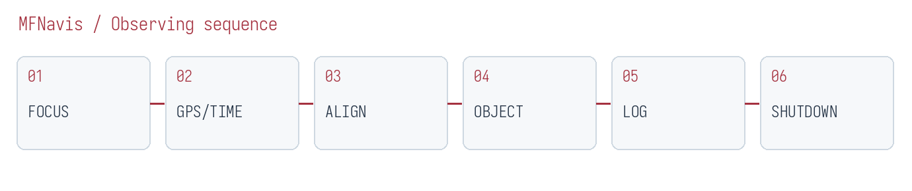
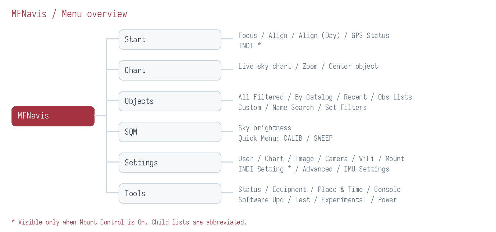
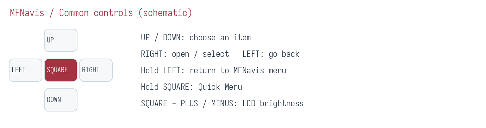
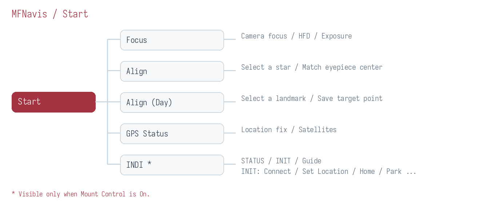
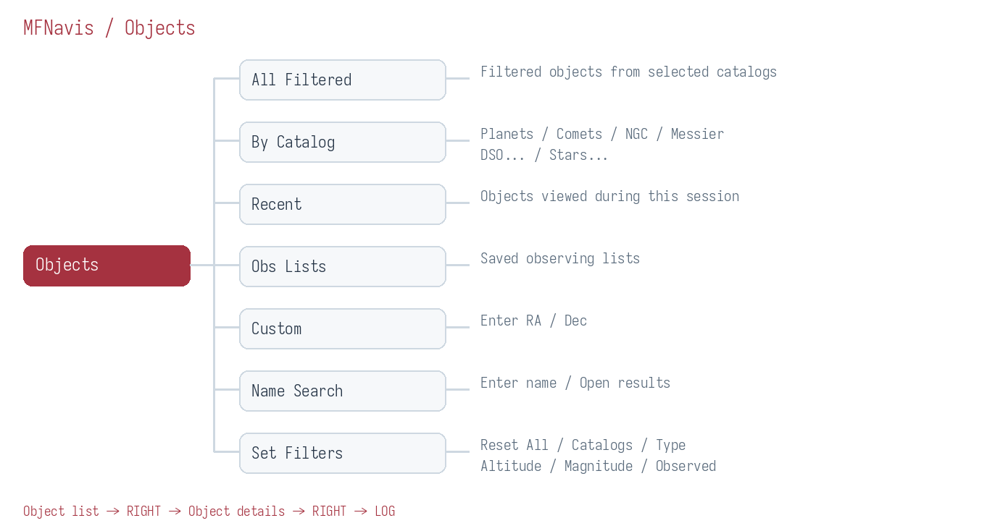
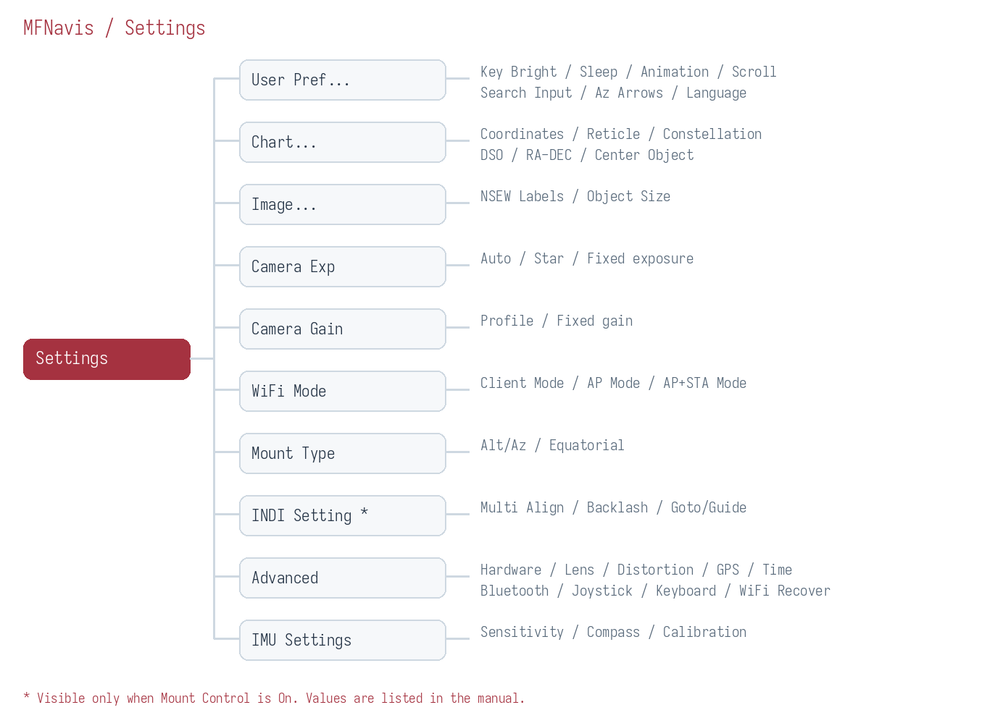
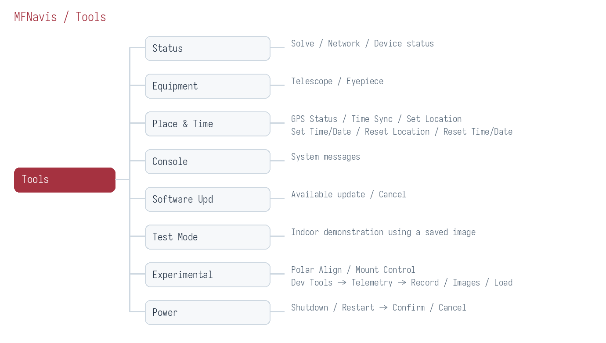

# MFNavis LCD User Manual

**Draft user manual · October 9, 2026**

MFNavis identifies stars in camera images to show where your telescope is pointing and guide you toward an observing target. This manual explains how to prepare for observing, find objects, and change settings using the LCD and keypad. A connected INDI mount also supports automatic and manual movement.

Tables, instructions, and menu paths show **official English menu names (Korean UI labels)** together, for example Start(시작), Focus(초점), and Set Filters(필터 설정). Names such as Lens, Distortion, and CALIB also appear in English in the Korean UI, so they are written once. Parentheses contain the actual Korean UI label. The illustrations are schematic guides to menus and controls; actual text size and layout depend on your device. INDI menus appear **only when Mount Control(가대 제어) is enabled**.

## 1 Quick start for your first observing session

Follow these steps for your first session. **Plate solving** identifies the stars in a camera image to determine the current pointing direction. **Alignment** matches the camera's reference direction to the center of your eyepiece view.

1. **Focus the camera:** Open `Start(시작) → Focus(초점)`. Adjust the MFNavis camera lens while viewing a bright star, looking for the position with a smaller HFD value. This adjustment is for the camera lens.
2. **Check location and time:** Open `Start(시작) → GPS Status(GPS 상태)` and check that a location is available. If GPS is unavailable, use `Tools(도구) → Place & Time(위치/시간)` to enter your location first, then the time and date.
3. **Align the observing center:** Center a bright star in the telescope eyepiece and open `Start(시작) → Align(정렬)`. Press `□` to start star selection, use the direction keys to select the same star, then press `□` again.
4. **Choose an object:** Open `Objects(천체) → By Catalog(카탈로그별) → Messier`. Select an object with `↑ / ↓` and press `→` to open its details.
5. **Find the object:** Move the telescope using the direction indicators and remaining angle in the details screen. For automatic movement, check the mount connection first, then press `5` in object details. After GoTo completes and the mount tracks the selected object, a rectangular border appears around the Push view.
6. **Log the observation:** From object details, press `→` to open LOG(로그) and enter your ratings. Select the save entry and press `→` to save.
7. **Shut down:** Select `Tools(도구) → Power(전원) → Shutdown(종료) → Confirm(확인)`. Wait for shutdown to finish before switching off power.

**If you lose your place in the menus:** Hold `←` to return to the top-level MFNavis menu.

## 2 The menu structure at a glance

There are six top-level menus. Use **Start(시작)** before observing, **Chart(성도) and Objects(천체)** to find objects, **Settings(설정)** for display and device settings, and **Tools(도구)** to check status and shut down.

| Menu | Purpose | Typical first-use path |
|---|---|---|
| Start(시작) | Focus, align camera and eyepiece centers, check GPS, connect INDI | Start(시작) → Focus(초점) |
| Chart(성도) | Show the sky chart for the current pointing direction | Chart(성도) |
| Objects(천체) | Object catalogs, search, observing lists, and filters | Objects(천체) → By Catalog(카탈로그별) → Messier |
| SQM | Measure the brightness of the sky seen by the camera | SQM |
| Settings(설정) | Display, camera, communications, INDI, and hardware settings | Settings(설정) → User Pref...(사용자...) |
| Tools(도구) | Status, equipment, location and time, updates, and power | Tools(도구) → Status(상태) |

**Reading a path:** `Objects(천체) → By Catalog(카탈로그별) → Messier` means select Objects(천체) and press `→`, select By Catalog(카탈로그별) and press `→`, then select Messier and press `→`. Follow menu names even if their positions change.

## 3 Common controls

### 3.1 Buttons and press types

In this manual, `□` means the keypad's **SQUARE** button. A short press means press and release once. A long press means hold until the long-press action runs.

| Button | Action in list menus | Other screens |
|---|---|---|
| ↑ / ↓ | Select previous / next entry | Adjust exposure in Focus(초점); select stars or reference points during alignment |
| → | Open an entry, select a value, or execute a command | Advance or confirm in entry screens; open the observation log from object details |
| ← | Go back one level | May move to a previous field or move a reference point during entry or alignment |
| Hold ← | Return to the top-level menu | Check the screen's cancellation procedure if a task is in progress |
| Hold → | Open details of the most recently viewed object | Requires a recent object; does not open a new screen while already in object details |
| Short press □ | Depends on the active screen | Switch views or start / confirm alignment. Use → to select ordinary menu entries |
| Hold □ | Open / close the current screen's quick menu | Available on screens with a quick menu |
| + / − | Adjust the active screen's function | Zoom the chart, scroll descriptions, and more; see individual procedures |
| Hold □ and press + / − | Increase / decrease LCD brightness | Settings(설정) → Key Bright(키 밝기) controls keypad lighting separately |
| Hold □ and press 0 | Save the current LCD screen | Useful when reporting a problem |

### 3.2 Selecting and saving

**Single-choice menus:** Choose a value with `↑ / ↓`, then press `→`. Check the selected-value indicator. Settings apply when selected; some menus return to the previous screen or restart MFNavis afterward. Pressing `←` does not restore the previous value.

**Multiple-choice menus:** In filter menus Catalogs(천체 목록) and Type(종류), each `→` press toggles the selected entry. Choose all the entries you need, then leave with `←`. Select All(전체 선택) and Select None(선택 해제) select or clear all entries in the current list.

**Commands with confirmation:** Select Confirm(확인) and press `→` to execute, or select Cancel(취소) to return. Some commands execute without a confirmation screen. In INDI INIT(초기화), selecting a command and pressing `→` sends it immediately.

### 3.3 Quick menus and help

Hold `□` to open the quick menu for the current screen. Press the direction shown beside the function you want. When a quick submenu is open, a short `□` press closes one level; holding it closes the entire quick menu.

On screens with help, select **HELP** at the top of the quick menu. Use `↑ / ↓` to change help pages and `←`, `→`, or `□` to close help. Help availability depends on the screen.

### 3.4 Check the active screen before using number keys

Number keys have different roles on different screens: object-number search in catalogs, numeric entry in forms, and movement in mount-control screens.

| Current screen | Meaning of 0 | Meaning of □ |
|---|---|---|
| Objects(천체) → selected object · object details | Stop mount movement, tracking, and Goto/Guide(GoTo/Guide) corrections | Cycle object views |
| Start(시작) → INDI → Guide(가이드) | Toggle Guide Correction(가이드 보정) | Sync the mount to the current pointing direction |
| Start(시작) → Align(정렬), during star selection | Cancel selection | Request alignment with the selected star |
| Start(시작) → Align (Day)(주간정렬) | Cancel / exit without saving | Start or save alignment |
| Settings(설정) → INDI Setting(INDI 설정) → Multi Align(멀티 정렬), during adjustment | Cancel / exit multi-point alignment | Confirm the current alignment point |
| SQM → quick menu CALIB → SQM Calibration(SQM 보정) | Cancel or skip sky frames, depending on the step | Advance / finish |

**In Guide(가이드), 0 does not stop all mount activity.** Releasing a manual direction key stops that movement. In object details, `0` also stops tracking.

## 4 Preparing to observe with Start(시작)

### 4.1 Focus(초점): camera focus

**Path:** `Start(시작) → Focus(초점)` · **Before you start:** Remove the lens cap and point the camera toward a star field.

1. Short-press `□` to cycle through Image, Stars, Single, and Stats views. Use Stars to examine several stars and Single to enlarge one star.
2. If stars are hard to see, press `↑` to increase exposure. If the image is too bright or stars spread out, press `↓` to reduce exposure.
3. In Image, Stars, and Single views, use `+ / −` to change zoom.
4. Adjust the camera lens in small steps. With the same star, find the position where HFD decreases and the star image becomes compact. HFD measures how widely the star's light is spread.
5. Leave with `←`. Exposure stays fixed while in Focus(초점); leaving restores the exposure setting used before entry.

To change gain, select `hold □ → right Gain(이득)` in the quick menu. Adjust exposure directly with `↑ / ↓` in Focus(초점).

**Check the result:** Stars should look small and sharp, with a stable HFD. Focus the telescope eyepiece separately.

### 4.2 Align(정렬): align the observing center at night

**Path:** `Start(시작) → Align(정렬)` · **Before you start:** Plate solving must be working. Center a bright star in the telescope eyepiece.

1. Press `□` to start star selection.
2. Use the direction keys to select the same star that is centered in the eyepiece. Use `+ / −` to zoom the chart.
3. Press `□` again to request alignment.
4. Look for Aligned!(정렬 완료!) or Alignment requested. A request message alone does not guarantee completion; check the pointing display afterward.
5. After star-selection mode ends, leave with `←`.

During star selection, `←` selects a star to the left. Press `0` to cancel selection. Press `1` to reset the alignment point to the camera center.

**Check the result:** Center another bright object in the eyepiece and check that the guidance center matches your actual observing center. This procedure aligns camera and eyepiece centers. INDI mount multi-point alignment is covered in chapter 9.

### 4.3 Align (Day)(주간정렬): align the observing center in daylight

**Path:** `Start(시작) → Align (Day)(주간정렬)` · **Before you start:** Center a distant, easily recognized terrestrial target in the eyepiece.

1. Press `□` to begin.
2. Choose the quadrant containing the target using number keys: `7` upper left, `9` upper right, `1` lower left, `3` lower right. Quadrant selection can run up to three times.
3. Press a direction key once to enter fine adjustment. This first press does not move the reference point. Further direction-key presses move it onto the target.
4. Press `□` to save and return to the previous menu.

Here, `+ / −` increase / decrease **exposure**. Pressing `0` cancels without saving a new alignment point. The quick menu can reset the reference point to the center or change exposure to Auto(자동).

### 4.4 GPS Status(GPS 상태)

**Path:** `Start(시작) → GPS Status(GPS 상태)` or `Tools(도구) → Place & Time(위치/시간) → GPS Status(GPS 상태)`

Check the location-fix status and satellite information. If a fix is unavailable, wait with an open view of the sky. Where GPS is unavailable, enter location and time manually as described in chapter 11. Leave with `←`.

### 4.5 INDI

**Path:** `Start(시작) → INDI` · **Visibility:** `Tools(도구) → Experimental(실험적) → Mount Control(가대 제어) → On(켜짐)`

The menu contains STATUS(상태), INIT(초기화), and Guide(가이드). Changing Mount Control(가대 제어) restarts MFNavis. Connection, automatic movement, mount alignment, and Guide(가이드) controls are described in chapter 9.

## 5 Viewing the sky with Chart(성도)

**Path:** `Chart(성도)` · **Before you start:** A pointing direction must be available to draw the chart.

| Control | Action |
|---|---|
| + | Zoom in |
| − | Zoom out |
| □ | Restore the default field of view |
| → | Open details of the object at the chart center |
| ← | Return to the previous menu |
| Hold □ | Open the chart quick menu |

As you move the telescope, the chart updates to the current direction. Change orientation, reticle, constellation lines, deep-sky objects, and coordinate display in `Settings(설정) → Chart...(성도...)`.

Opening details with `→` requires **Center Object(중앙 천체) to be On(켜짐)** and a selectable object at the chart center. If No solve(해 없음) appears, check Focus(초점) and plate-solving status first. Holding `→` opens the most recently viewed object instead of the object at the chart center.

## 6 Finding targets with Objects(천체)

### 6.1 Choosing an object list

| Menu | How to use it |
|---|---|
| All Filtered(필터 결과) | Open all objects matching the current filters. Select with ↑ / ↓ and open details with →. |
| By Catalog(카탈로그별) | Select a catalog and press →. Includes Planets(행성), Comets(혜성), NGC, Messier, DSO..., and Stars...(별...). |
| Recent(최근) | Reopen objects viewed during the current run. Empty if no objects have been viewed. |
| Obs Lists(관측목록) | Select a previously supplied observing-list file and open it with →, then select an object. |
| Custom(사용자) | Enter RA and Dec for a target outside the catalogs. Move between fields with ↑ / ↓, enter numbers, and confirm with →. |
| Name Search(이름 검색) | Enter a name and press → to open results, then select an object. |
| Set Filters(필터 설정) | Choose catalogs, object types, altitude, magnitude, and observation status. |

**Catalog groups**

| Group | Included catalogs |
|---|---|
| Direct entries | Planets(행성), Comets(혜성), NGC, Messier |
| DSO... | Abell Pn, Arp Galaxies(Arp 은하), Barnard, Caldwell, Collinder, E.G. Globs(E.G. 구상), Harris Globs(Harris 구상), Herschel 400, IC, Lynga Opn Cl(Lynga 산개), Messier, NGC, Sharpless, TAAS 200 |
| Stars...(별...) | Bright Named(밝은 별), SAC Doubles(SAC 이중성), SAC Asterisms(SAC 성군), SAC Red Stars(SAC 적색성), RASC Doubles(RASC 이중성), WDS Doubles(WDS 이중성), TLK 90 Variables(TLK 변광성) |

### 6.2 Finding objects by number and changing the list view

In a catalog list, number keys jump to an object near that number. For example, press `3`, then `1` in Messier, **check that the selected name is M31**, and press `→`. If filters hide the target, that number may select a different object.

Press `□` to change the list view. While a numeric-entry indicator is visible, `□` clears it. Select `hold □ → left Sort(정렬)` to choose Nearest(가까운순) or Standard(표준) sorting; right Filter(필터) opens filters directly. The Comets(혜성) quick menu also offers Refresh(새로고침).

### 6.3 Name Search(이름 검색): search by name

**Path:** `Objects(천체) → Name Search(이름 검색)`

1. Enter a name with the number keys using the displayed letter layout. In Multi-Tap, press the same key repeatedly to select a letter. In T9, press the corresponding key once for each letter.
2. Press `−` to delete the last character and `+` to insert a space. Press `□` to change the character layout.
3. Press `→` to open results. Select a result with `↑ / ↓` and open details with `→`.
4. Return from results to the search-entry screen to edit the name and search again.

Choose the input method in `Settings(설정) → User Pref...(사용자...) → Search Input(입력 방식)`. You can also enter text with an external keyboard.

### 6.4 Set Filters(필터 설정): filter lists

**Path:** `Objects(천체) → Set Filters(필터 설정)`

| Entry | Control and effect |
|---|---|
| Reset All(전체 초기화) | Select Confirm(확인) and press → to restore default filters; Cancel(취소) returns. |
| Catalogs(천체 목록) | Use → to select / clear multiple catalogs included in All Filtered(필터 결과). |
| Type(종류) | Use → to select / clear object types such as galaxies, clusters, nebulae, stars, planets, and comets. |
| Altitude(고도) | Choose a minimum altitude: None(없음) or 0°, 10°, 20°, 30°, 40°. |
| Magnitude(등급) | Choose the maximum magnitude shown: None(없음) or 6–15. Larger numbers include fainter objects. |
| Observed(관측됨) | Choose Any(전체), Observed(관측됨), or Not Observed(미관측) to filter by observation records. |

**Name Search(이름 검색) and Recent(최근) are unaffected by the ordinary list filters.** Check filters first if an object is missing from a catalog or observing list. Altitude filtering requires the correct location and time.

### 6.5 Object details and movement guidance

**Path:** `Objects(천체) → an object list → select an object → →`

Each `□` press cycles through **movement guidance → camera → object image → description → contrast information**. In guidance view, follow the direction arrows and remaining angle toward the target.

| Control | Action |
|---|---|
| ↑ / ↓ | Previous / next object in the current list |
| + / − | Zoom in / out in camera view; next / previous portion of a description; change eyepiece in other views |
| → | Open LOG(로그) when a current pointing direction is available |
| ← | Return to the list |
| 5 | Request GoTo to the selected object using the connected mount |
| 0 | Stop mount movement, tracking, and Goto/Guide(GoTo/Guide) corrections |
| 7 | Request mount Sync using the current pointing direction |
| 1 | Cycle GoTo Type(자동 도입 유형) |
| 8 / 2 / 4 / 6 | Move the mount north / south / west / east while held |
| 9 / 3 | Increase / decrease manual mount movement speed |

Mount controls require Mount Control(가대 제어) to be enabled and a connected mount. When GoTo Type(자동 도입 유형) is Off(꺼짐), `5` does not initiate movement. After a request message, also check actual movement and arrival status.

**Tracking border in the Push view:** After GoTo completes, a rectangular border appears below the title bar around the guidance and camera views when the mount is tracking the currently selected object.

- **Appearance:** A dark outer line and bright inner line remain visible against bright camera images and dark backgrounds. The bright line follows the display color setting and remains visible in night mode.
- **When it disappears:** Tracking stops, a new GoTo or manual movement begins, the mount parks, an error or disconnect occurs, or fresh status information is unavailable. Viewing a different object from the tracked target also hides the border.
- **Checking arrival:** The border is absent during ordinary GoTo motion and pulse-guide arrival corrections. Once movement completes, check the border, remaining angle, and status at the bottom together.

To align the eyepiece center using the selected object, center it in the eyepiece and select `hold □ → down ALIGN(정렬) → right ALIGN(정렬)`. Left CANCEL(취소) in the submenu returns. This ALIGN(정렬) aligns camera and eyepiece centers; mount Sync is a separate command.

### 6.6 LOG(로그): record an observation

Open LOG(로그) with `→` in object details, then select a field with `↑ / ↓`. For ratings, enter `0–5` or cycle values with `→`. Press `→` on observing conditions or eyepiece to open a selection screen. Select the save entry and press `→`; Logged!(기록됨!) appears and the details screen returns.

Conditions(조건) includes Transparency(투명도) and Seeing(시상). Choose NA(해당없음), Excellent(최상), Very Good(매우 좋음), Good(좋음), Fair(보통), or Poor(나쁨) to describe the conditions, then apply with `→`.

### 6.7 Custom(사용자): enter coordinates

**Path:** `Objects(천체) → Custom(사용자)`

Move between fields with `↑ / ↓` and enter RA and Dec with the number keys. Press `−` to delete a digit. In the Dec degrees field, `+` changes the sign; in Epoch, `+` changes the coordinate reference epoch. Press `□` to change the coordinate-entry format. Check every value and confirm with `→`, or leave without saving with `←`.

## 7 Checking sky brightness with SQM

**Path:** `SQM` · **Meaning:** Shows the brightness of the sky toward which the camera points, in mag/arcsec². A larger number means a darker sky.

| Control | Action |
|---|---|
| □ | Switch between measurement and sky-condition description |
| + / − | Next / previous portion of the description |
| ← | Return to the previous menu |
| Hold □ → left CALIB | Open the SQM calibration wizard |
| Hold □ → down SWEEP | Open exposure-based SQM diagnostic measurements |

Moonlight, clouds, twilight, and the camera's pointing altitude affect readings. Compare changes at one location using similar directions and conditions. Basic brightness measurement may continue even if plate solving fails. Entering SQM switches exposure behavior for measurement; leaving restores normal exposure behavior.

### 7.1 SQM Calibration(SQM 보정)

**Path:** `SQM → hold □ → left CALIB → SQM Calibration(SQM 보정)`

1. Open CALIB and press `□` to start.
2. At the lens-cap instruction, put the cap on and press `□`. Wait for frame collection to finish.
3. At the cap-removal instruction, remove the cap and press `□` to collect sky frames.
4. Review the analysis and results, then leave with `□`.

`0` cancels at the introduction and cap-on instruction. At the cap-off instruction or during sky-frame collection, it **skips sky frames and proceeds to analysis**. Do not use `0` as a cancel button during cap-on frame collection.

### 7.2 SQM Sweep: diagnostic measurements

**Path:** `SQM → hold □ → down SWEEP → SQM Sweep`

If you know a reference SQM value, enter four digits: for example, `2130` means **21.30**. Press `−` to delete the last digit and `□` to confirm. With an empty entry, `0` or `□` continues without a reference value.

At confirmation, press `□` to start collection; press `□` again after completion to leave. Here, `0` cancels at confirmation. SWEEP helps diagnose how readings change with exposure.

## 8 Changing display and observing settings

### 8.1 User Pref...(사용자...): preferences

**Path:** `Settings(설정) → User Pref...(사용자...) → entry → choose a value → →`

| Entry | Values | Purpose |
|---|---|---|
| Key Bright(키 밝기) | −4–3 | Keypad lighting. For LCD brightness, hold □ and press + / − |
| Sleep Time(절전 시간) | Off(꺼짐), 10s, 20s, 30s, 1m, 2m | Idle time before sleep |
| Menu Anim(메뉴 효과) | Off(꺼짐), Fast(빠름), Medium(보통), Slow(느림) | Menu transition speed |
| Scroll Speed(스크롤 속도) | Off(꺼짐), Fast(빠름), Medium(보통), Slow(느림) | Scrolling speed for long text |
| Search Input(입력 방식) | Multi-Tap, T9 | Text-entry method for name search |
| Az Arrows(방위 화살) | Default(기본), Reverse(반전) | Azimuth arrow direction in movement guidance |
| Language(언어) | English(영어), German(Deutsch), French(Français), Spanish(Español), Korean(한국어), Chinese(中文) | LCD UI language; select English(영어) for English |

### 8.2 Chart...(성도...): chart display

**Path:** `Settings(설정) → Chart...(성도...) → entry → choose a value → →`

| Entry | Values and effect |
|---|---|
| Coordinate Sys.(좌표계) | Horizontal(지평좌표): horizon orientation; EQ (Auto)(적도(자동)): automatic equatorial orientation; EQ (North-up)(적도(북위)) / EQ (South-up)(적도(남위)): north / south celestial pole upward |
| Reticle(십자선) | Off(꺼짐) / Low(낮음) / Medium(보통) / High(높음): central reticle brightness |
| Constellation(별자리) | Off(꺼짐) / Low(낮음) / Medium(보통) / High(높음): constellation-line brightness |
| DSO Display(DSO 표시) | Off(꺼짐) / Low(낮음) / Medium(보통) / High(높음): deep-sky-object display brightness |
| RA/DEC Disp.(RA/DEC 표시) | Off(꺼짐) / HH:MM / Degrees(도): coordinate display format |
| Center Object(중앙 천체) | Off(꺼짐) / On(켜짐): central-object name and opening details with → from Chart(성도) |

Before location is available, chart orientations that require it may use a temporary orientation. Check the upward direction again after acquiring a GPS location.

### 8.3 Image...(이미지...): object images

In `Settings(설정) → Image...(이미지...)`, enable **NSEW Labels(방위 표시)** with On(켜짐) for direction labels, and **Object Size(천체 크기)** with On(켜짐) for object-size and orientation outlines. Choose Off(꺼짐) to disable them. Open each entry and select the desired value with `→`.

### 8.4 Camera Exp(노출) and Camera Gain(Gain)

| Path | Values | Control |
|---|---|---|
| Settings(설정) → Camera Exp(노출) | Auto(자동), Star(항성), 0.025s, 0.05s, 0.1s, 0.2s, 0.4s, 0.8s, 1s | Select with ↑ / ↓, apply with →. Auto(자동) and Star(항성) are automatic exposure methods; numeric values are fixed durations |
| Settings(설정) → Camera Gain(Gain) | Profile(설정 묶음), 1x, 2x, 4x, 8x, 12x, 15x, 16x, 20x, 22x, 24x, 30x | Select with ↑ / ↓, apply with →. Profile(설정 묶음) uses the camera profile's reference value |

Longer exposures can capture more stars but may elongate them during movement. Actual supported exposure and gain ranges depend on the sensor. Temporary exposure in Focus(초점) is separate from the observing exposure setting in Settings(설정).

### 8.5 WiFi Mode(WiFi 모드) and Mount Type(가대 종류)

| Entry | How to use it | Check afterward |
|---|---|---|
| WiFi Mode(WiFi 모드) → Client Mode(Client 모드) | Connect to an existing wireless network | Check the address in Tools(도구) → Status(상태) |
| WiFi Mode(WiFi 모드) → AP Mode(AP 모드) | Let MFNavis provide a wireless access point | Connect to MFNavisAP, then open http://10.10.10.1 |
| WiFi Mode(WiFi 모드) → AP+STA Mode(AP+STA 모드) | Use an access point and an existing network together | Check both connections in Status(상태) |
| Mount Type(가대 종류) → Alt/Az(경위대) | Select an altitude-azimuth telescope mount | Check the value after MFNavis restarts |
| Mount Type(가대 종류) → Equatorial(적도의) | Select an equatorial telescope mount | Check the value after MFNavis restarts |

Changing WiFi mode may disconnect your phone or computer. Reconnect to the network and address appropriate for the new mode.

## 9 Connecting and moving an INDI mount

### 9.1 Enabling mount control

1. Select `Tools(도구) → Experimental(실험적) → Mount Control(가대 제어) → On(켜짐)`. MFNavis restarts.
2. Request connection with `Start(시작) → INDI → INIT(초기화) → Connect(연결)`.
3. In `Start(시작) → INDI → STATUS(상태)`, check connection, coordinates, tracking, and Home / Park(파크) status.
4. Once location and time are ready, select `INIT(초기화) → Set Location(위치 설정)` to send them to the mount.
5. To use a parked mount, select `INIT(초기화) → Unpark(언파크)` and check status.

When Mount Control(가대 제어) is Off(꺼짐), `Start(시작) → INDI` and `Settings(설정) → INDI Setting(INDI 설정)` are hidden. The mount driver and connection settings must be configured during installation. Check STATUS(상태) for successful connection even after an LCD request message appears.

### 9.2 INIT(초기화) commands

**Path:** `Start(시작) → INDI → INIT(초기화) → select a command → →`

| Entry | Purpose | Check afterward |
|---|---|---|
| Connect(연결) | Request INDI mount connection and initialization | Connection and coordinates in STATUS(상태) |
| Set Location(위치 설정) | Send current location and time to the mount | Synchronization status and error notices |
| Reset Pointing(좌표 초기화) | Request rebuilding of the current pointing-coordinate reference | Updated pointing display |
| Park(파크) | Request movement to the configured park position | Park(파크) status in STATUS(상태) |
| Unpark(언파크) | Request unparking | Unpark(언파크) status in STATUS(상태) |
| Set Home(홈 설정) | Request setting the current position as Home | Home status and device response |
| Return Home(홈으로 복귀) | Request movement to Home | Completed movement and Home status |
| Set-Park(파크 위치 설정) | Request setting the current position as the park position | Device response and park settings |
| Restart INDI(INDI 재시작) | Request an INDI driver restart | Reconnection and received coordinates |

Support varies by mount and driver. Park(파크) and Return Home(홈으로 복귀) can move the telescope; check the movement path before executing them.

### 9.3 Guide(가이드): manual movement and Sync

**Path:** `Start(시작) → INDI → Guide(가이드)`

| Control | Action in Guide(가이드) |
|---|---|
| Hold 8 / 2 / 4 / 6 | Move north / south / west / east; release to stop manual movement |
| 9 / 3 | Increase / decrease manual movement speed |
| □ | Sync the mount to the currently available sky pointing direction |
| 0 | Toggle Guide Correction(가이드 보정) |
| ← | Return to the previous menu; leaving stops manual movement |

An external letter keyboard can use `q / w / e`, `a / s / d`, and `z / x / c` as a direction pad. `s` stops manual movement; `, / .` decrease / increase speed. Custom key mappings can change these actions.

If a current direction is unavailable for Sync, No solve(해 없음) appears. **In Guide(가이드), □ sends Sync rather than switching views.**

### 9.4 Multi Align(멀티 정렬): multi-point alignment

**Path:** `Settings(설정) → INDI Setting(INDI 설정) → Multi Align(멀티 정렬)`

1. Adjust the number of alignment points with number keys or `+ / −`. Press `→` or `□` to continue.
2. Select Manual(수동) / Auto(자동) with `↑ / ↓`, then begin with `→` or `□`. At this step, `1` also starts Manual(수동), and `2` starts Auto(자동).
3. In Manual(수동), choose a star with `↑ / ↓` and move to it with `→` or `□`. In Auto(자동), follow the instructions during preparation and movement.
4. On the adjustment screen, use mount direction controls to center the star. Adjust speed with `9 / 3` and **confirm the current point with □**.
5. Complete the required points and check completion status.

During adjustment, `←` returns to star selection in manual mode; in automatic mode, it cancels the current process and returns to mode selection. At the adjustment step, `0` cancels alignment and exits. Star lists and automatic startup depend on location, time, plate solving, available stars, and mount status.

### 9.5 Backlash(백래시)

**Path:** `Settings(설정) → INDI Setting(INDI 설정) → Backlash(백래시)`

Select the RA axis with `+` or DE axis with `−`. Enter values with number keys and press `□` to send both axes. `→` requests automatic backlash measurement for the selected axis. The input range is 0–999; `0` clears the selected axis's input. **Here, 0 is not entered as a digit.** Check the device's values, units, and support for automatic measurement.

### 9.6 Goto/Guide(GoTo/Guide) settings

**Path:** `Settings(설정) → INDI Setting(INDI 설정) → Goto/Guide(GoTo/Guide) → entry → choose a value → →`

| Entry | Values | Meaning |
|---|---|---|
| GoTo Type(자동 도입 유형) | Off(꺼짐) / INDI Mount(INDI 가대) / MFNavis | Disable automatic movement / use mount GoTo / use MFNavis coordinate-based movement and corrections |
| Tracking Guide(추적 가이드) | Off(꺼짐) / On(켜짐) | Correct the target position during tracking |
| GoTo Recovery(GoTo 복구) | Off(꺼짐) / On(켜짐) | Use GoTo to return after a large target deviation |
| Recovery Range | 0.25°, 0.5°, 1°, 2°, 3° | Deviation angle used to decide GoTo recovery |
| Manual Re-target(수동 재타겟) | Off(꺼짐) / On(켜짐) | Update the tracking target to a new direction after manual movement |
| Max GoTos(최대 GoTo 횟수) | 3, 5, 10, 15, 20 | Maximum repeated moves during MFNavis GoTo |
| Invert Guide RA/Az(가이드 RA/Az 반전) | Off(꺼짐) / On(켜짐) | Reverse RA / azimuth correction direction |
| Invert Guide Dec/Alt(가이드 Dec/Alt 반전) | Off(꺼짐) / On(켜짐) | Reverse Dec / altitude correction direction |

After reversing a correction direction, check with small movements that target error decreases. Manual Re-target(수동 재타겟) changes the tracking target; it does not automatically change the catalog object selected in object details.

## 10 Configuring hardware in Settings(설정)

### 10.1 Advanced(고급): hardware and input devices

**Path:** `Settings(설정) → Advanced(고급)`

| Entry | Control and checks |
|---|---|
| MFNavis Type(MFNavis형) | Choose the actual assembly orientation: Left(왼쪽), Right(오른쪽), Straight(직선형), Flat v3, Flat v2, or AS Bloom, then press →. Check orientation after restart |
| Camera Type(카메라 종류) | Choose the installed sensor and press →: IMX678 (Auto(자동)), v2 - imx477, v3 - imx296 Mono(v3 - imx296 모노), v3 - imx296 Color(v3 - imx296 컬러), v3 - imx462 Mono(v3 - imx462 모노), v3 - imx462 Color(v3 - imx462 컬러). Sensor changes can require reboot; some variant changes restart the software. Follow the screen instructions |
| Lens | Use the lens selection and measurement procedure below |
| Distortion | Use the distortion calibration procedure below |
| GPS Settings(GPS 설정) | Match GPS Type(GPS 종류), GPS Baud Rate(GPS Baud), and GPS Port(GPS 포트) to the receiver |
| Time Sync(시간 동기화) | Configure time synchronization and its sources |
| Bluetooth(블루투스) | Scan, pair, and reconnect external input devices |
| Joystick(조이스틱) | Test buttons and assign them to functions |
| Keyboard | Test keys and assign them to functions |
| WiFi Recover(WiFi 복구) | Request recovery with Confirm(확인) →; return with Cancel(취소) |

Camera Mono / Color refers to the sensor's monochrome or color variant, rather than a display color option.

### 10.2 Lens: selection and measurement

**Path:** `Settings(설정) → Advanced(고급) → Lens`

| Choice | How to use it |
|---|---|
| 4mm, 6mm, 8mm, 10mm, 12mm, 16mm, 25mm | Choose the camera lens's focal length and press → |
| Manual(수동) (mm) | Enter a focal length and confirm with ←. Delete the last character with −; switch the character layout with □ to enter digits and a decimal point |
| Auto(자동) (Measure) | Start measurement with →. Point toward stars in a sky field that can be plate-solved and check progress |

Automatic measurement collects usable frames and evaluates the result. Check the measured focal length afterward. During measurement, `←`, `□`, or `0` cancels and exits. **Lens values describe the MFNavis camera lens**; manage the telescope focal length in Equipment(관측 장비).

### 10.3 Distortion: calibration

**Path:** `Settings(설정) → Advanced(고급) → Distortion`

1. Select Status(상태) to check calibration for the current camera and lens.
2. Point at a star field, select Measure Sky, and press `→` to measure.
3. Check collection progress and results. After completion, check Status(상태) to confirm application.
4. During measurement, `←`, `□`, or `0` cancels and exits. Cancel(취소) Measurement in the menu also requests cancellation.

Reset clears the calibration when Confirm(확인) is selected; Cancel(취소) returns. Check the calibration for your current combination after changing the camera or lens.

### 10.4 GPS Settings(GPS 설정) and Time Sync(시간 동기화)

| Path | Values and control |
|---|---|
| GPS Settings(GPS 설정) → GPS Type(GPS 종류) | Choose UBlox / GPSD (generic)(GPSD), then →. MFNavis restarts |
| GPS Settings(GPS 설정) → GPS Baud Rate(GPS Baud) | Choose 9600 (standard) / 115200 (UBlox-10) to match your receiver, then → |
| GPS Settings(GPS 설정) → GPS Port(GPS 포트) | Choose Auto(자동) or the connected port, then →. Ports: ttyAMA1, ttyAMA2, ttyAMA3, serial0, ttyAMA0, ttyAMA10, ttyS0, ttyACM0, ttyUSB0 |
| Time Sync(시간 동기화) → Time Sync(시간 동기화) | Select Off(꺼짐) / On(켜짐) for time synchronization |
| Time Sync(시간 동기화) → Chrony Source(Chrony 소스) | Select Off(꺼짐) / On(켜짐) for the Chrony time source |
| Time Sync(시간 동기화) → GPS Source(GPS 소스) | Select Off(꺼짐) / On(켜짐) for the GPS time source |
| Time Sync(시간 동기화) → RTC Sync(RTC 동기화) | Select Off(꺼짐) / On(켜짐) for RTC synchronization |

After applying changes, check reception and synchronization in `Tools(도구) → Place & Time(위치/시간) → GPS Status(GPS 상태) / Time Sync(시간 동기화)`. An incorrect port or baud rate prevents GPS reception.

### 10.5 Bluetooth(블루투스): connect input devices

1. Open `Settings(설정) → Advanced(고급) → Bluetooth(블루투스)` and put the external keyboard into pairing mode.
2. Select Scan and press `→`. Choose the device and press `→` to open its action menu.
3. Select Pair+Connect(페어+연결), press `→`, and follow the pairing instructions.
4. Check connection status and test actual key presses.

Reconnect(재접속) reconnects a known device; Refresh(새로고침) updates the list. In a device's action menu, Connect(연결) / Disconnect(연결 해제) connect / disconnect, Pair Again(다시 페어) repeats pairing, and Remove(제거) removes registration. Press `←` to close the action menu or pairing.

### 10.6 Joystick(조이스틱) and Keyboard mappings

| Screen | How to use it |
|---|---|
| Joystick(조이스틱) | Open Test Buttons(버튼 확인) with → to test buttons. Select a function, press →, then press the desired button on the connected device to assign it. |
| Keyboard | Open Test Keys with → to test keys. Select a function, press →, then press the desired external key to assign it. |

Press `←` to return from tests or assignment waiting. **Clear All(전체 지우기) clears custom mappings for that device when you press →.** After assignment, check the menu's updated label and test the action on its actual screen.

### 10.7 IMU Settings(IMU 설정): movement sensor

**Path:** `Settings(설정) → IMU Settings(IMU 설정)`

| Entry | Control and effect |
|---|---|
| Sensitivity(감도) | Off(꺼짐) / Very Low(아주 낮음) / Low(낮음) / Medium(보통) / High(높음): movement-detection sensitivity; changes restart MFNavis |
| Compass(나침반) | Off(꺼짐) / On(켜짐): enable the sensor's compass; changes restart MFNavis |
| Calibration(캘리브레이션) → Save(저장) | Request saving the current sensor calibration |
| Calibration(캘리브레이션) → Load(불러오기) | Request loading saved sensor calibration |
| Calibration(캘리브레이션) → Clear(지우기) | Request deleting saved sensor calibration |

Select each command and press `→` to run it. These functions require the corresponding physical sensor.

## 11 Checking status and managing MFNavis with Tools(도구)

### 11.1 Status(상태)

**Path:** `Tools(도구) → Status(상태)`

Check current plate-solving, location, communications, and equipment status. After changing WiFi mode, check the connection address. When troubleshooting, check both Status(상태) and the relevant function's status screen. Return with `←`.

### 11.2 Equipment(관측 장비): telescope and eyepiece

**Path:** `Tools(도구) → Equipment(관측 장비)`

Choose the telescope or eyepiece row with `↑ / ↓`, then open its selection list with `→`. Select the equipment and press `→`, then return to Equipment(관측 장비) to check magnification and field of view. Lists depend on your saved equipment configuration. Register and edit equipment in the web equipment-management screen.

### 11.3 Place & Time(위치/시간): location and time

**Path:** `Tools(도구) → Place & Time(위치/시간)`

| Entry | How to use it |
|---|---|
| GPS Status(GPS 상태) | Check location-fix status and satellite information; return with ←. |
| Time Sync(시간 동기화) | Check time synchronization status. Configure it in Settings(설정) → Advanced(고급) → Time Sync(시간 동기화). |
| Set Location(위치 설정) → Enter Coords(좌표 입력) | Enter latitude → longitude → altitude. Enter digits and press → to advance fields and screens. Confirming the final altitude applies the location. |
| Set Location(위치 설정) → Load Location(위치 불러오기) | Select a saved place with ↑ / ↓ and open its action menu with →. Select Load(불러오기) and press →. The loaded place also becomes the default. |
| Set Location(위치 설정) → Save Location(위치 저장) | Enter a name for the current location and confirm with ←. |
| Set Time/Date(시간/날짜) | Acquire a location first, enter local time, then press → for the date. Both take effect after confirming the date. |
| Reset Location(위치 초기화) | Clear the current location, then acquire it again through GPS or manual entry. |
| Reset Time/Date(시간 초기화) | Clear current time/date status, then set it again from a time source or manual entry. |

In coordinate entry, use `+` to change sign and check N / S and E / W indicators. `−` deletes the last digit in the current field. In numeric entry, `←` moves to the previous field or cancels at the first field. **Time entry cannot proceed until a location is available.** Use local time at the observing location.

A saved place's action menu also offers Rename(이름변경) and Delete(삭제). Confirm the new name with `←`. Selecting Delete(삭제) and pressing `→` deletes the place directly; `←` closes the action menu.

### 11.4 Console and Software Upd(SW 업데이트)

**Console:** Open `Tools(도구) → Console` to read device messages. Use `↑ / ↓` for older / recent messages and `←` to return. Number keys run test actions and can change time status; use direction keys when reading messages during real observations.

**Software Upd(SW 업데이트):** With internet access, open `Tools(도구) → Software Upd(SW 업데이트)`. If an update is offered, select update or Cancel(취소) with `↑ / ↓` and press `→`. Updating cannot start if no update is available or release information cannot be fetched. If an OS migration confirmation appears, review its conditions before continuing. Maintain power throughout installation.

### 11.5 Test Mode(테스트 모드)

**Path:** `Tools(도구) → Test Mode(테스트 모드)`

Use stored images for indoor demonstrations or checks. Select the entry and press `→`. This mode uses test images instead of the actual sky; check that it is disabled before observing.

### 11.6 Experimental(실험적)

| Entry | How to use it |
|---|---|
| Polar Align(극축정렬) | Assist equatorial polar alignment using the procedure below |
| Mount Control(가대 제어) | Select Off(꺼짐) / On(켜짐) with →. INDI menu visibility changes after restart. |
| Dev Tools(개발도구) → Telemetry → Record(기록) | Off(꺼짐) / On(켜짐) disables / enables coordinate and sensor recording. |
| Dev Tools(개발도구) → Telemetry → Images(이미지) | Off(꺼짐) / On(켜짐) controls image recording. |
| Dev Tools(개발도구) → Telemetry → Load(불러오기) | Select a saved recording and press → to replay. Select Stop replay(리플레이 중지) in the same list and press → to stop. Used for reproducing and diagnosing problems. |

**Polar Align(극축정렬) path:** `Tools(도구) → Experimental(실험적) → Polar Align(극축정렬)`

Press `□` to begin the instructions. Rotate the equatorial setup, stop at each position, and press `□` to request a plate-solving measurement. After the required measurements, adjust the mount's polar-alignment controls using the displayed altitude and azimuth corrections. `−` cancels the current collection while waiting for a measurement, or resets at other steps. At the AIM step with at least two collected points, `0` can also calculate corrections. On the correction screen, `□` starts a new measurement, so review the result first.

### 11.7 Power(전원): shutdown and restart

| Task | Path and control |
|---|---|
| Shut down | Tools(도구) → Power(전원) → Shutdown(종료) → Confirm(확인) → |
| Restart | Tools(도구) → Power(전원) → Restart(재시작) → Confirm(확인) → |
| Return without executing | Cancel(취소) → on either confirmation screen |

Shutdown(종료) performs a normal shutdown; Restart(재시작) restarts the system. Wait for shutdown to complete before removing power.

## 12 Troubleshooting

### 12.1 Closing an error notice

LCD error notices remain until acknowledged. Read long notices with `↑ / ↓`, then close with `←`, `→`, or `□`. Closing returns to the previous screen; **it does not retry the failed command**. Investigate the cause, then request the action again if needed.

### 12.2 Checks by symptom

| Symptom | Checks and action |
|---|---|
| Cannot return from a menu | Check for active entry or alignment and use its cancellation procedure. During ordinary navigation, hold ← for the top-level menu. |
| No stars visible | Check lens cap and sky direction → exposure and focus in Focus(초점). |
| No solve(해 없음) appears | Check star images in Focus(초점) → camera and lens settings → Status(상태). |
| An object is missing | Search with Name Search(이름 검색) → check altitude, magnitude, and type in Set Filters(필터 설정) → use Reset All(전체 초기화) if needed. |
| → does nothing in Chart(성도) | Check Center Object(중앙 천체) is On(켜짐), plate solving is working, and a central object exists. |
| INDI menu is missing | Check Tools(도구) → Experimental(실험적) → Mount Control(가대 제어) is On(켜짐). |
| GoTo does not start | Check target selection in object details → whether GoTo Type(자동 도입 유형) is Off(꺼짐) → connection and Park(파크) in INDI STATUS(상태) → error notices. |
| Pointing is incorrect after movement | Check camera/eyepiece alignment, location/time, and Mount Type(가대 종류); check INDI mount alignment if needed. |
| No GPS fix | Check open sky → GPS Type(GPS 종류), baud rate, and port → enter location/time manually if needed. |
| Time entry cannot proceed | Acquire an observing location first; confirm both local time and date. |
| Connection lost after WiFi change | Reconnect to the new mode's network → check the address in Status(상태) → use WiFi Recover(WiFi 복구) if needed. |
| External keys behave unexpectedly | Check Keyboard / Joystick(조이스틱) tests and mappings; also check the active screen's number-key meanings. |

When reporting a problem, include the error text, current menu path, intended action, software version, and mount/camera models. Hold `□` and press `0` to save a screen image.

## 13 Common menu paths

| Task | Menu path | Section |
|---|---|---|
| Focus the camera | Start(시작) → Focus(초점) | 4.1 |
| Align the eyepiece center | Start(시작) → Align(정렬) / Align (Day)(주간정렬) | 4.2–4.3 |
| Zoom the sky chart | Chart(성도) → + / − | 5 |
| Find M31 | Objects(천체) → By Catalog(카탈로그별) → Messier → 3, 1 → check name → → | 6.2 |
| Search by name | Objects(천체) → Name Search(이름 검색) | 6.3 |
| Change object filters | Objects(천체) → Set Filters(필터 설정) | 6.4 |
| Log an observation | Object details → → → LOG(로그) | 6.6 |
| Measure sky brightness | SQM | 7 |
| Adjust LCD brightness | Hold □ and press + / − | 3.1 |
| Use the English LCD UI | Settings(설정) → User Pref...(사용자...) → Language(언어) → English(영어) | 8.1 |
| Change exposure / gain | Settings(설정) → Camera Exp(노출) / Camera Gain(Gain) | 8.4 |
| Connect / check the mount | Start(시작) → INDI → INIT(초기화) / STATUS(상태) | 9.1–9.2 |
| Move the mount manually | Start(시작) → INDI → Guide(가이드) | 9.3 |
| Align the mount at multiple points | Settings(설정) → INDI Setting(INDI 설정) → Multi Align(멀티 정렬) | 9.4 |
| Change automatic movement type | Settings(설정) → INDI Setting(INDI 설정) → Goto/Guide(GoTo/Guide) → GoTo Type(자동 도입 유형) | 9.6 |
| Measure lens focal length | Settings(설정) → Advanced(고급) → Lens → Auto(자동) (Measure) | 10.2 |
| Configure external input | Settings(설정) → Advanced(고급) → Bluetooth(블루투스) / Joystick(조이스틱) / Keyboard | 10.5–10.6 |
| Choose telescope / eyepiece | Tools(도구) → Equipment(관측 장비) | 11.2 |
| Enter location / time manually | Tools(도구) → Place & Time(위치/시간) | 11.3 |
| Shut down normally | Tools(도구) → Power(전원) → Shutdown(종료) → Confirm(확인) | 11.7 |

### Scope of this manual

This draft follows the MFNavis source in the working tree on October 9, 2026. Device-specific LCD displays, physical buttons, and responses from connected mounts require verification on actual hardware before release. Available entries can vary with hardware, language, saved equipment and observing lists, and software version.
