# MFNavis User Manual LCD and Web

**Draft user manual · October 9, 2026**

MFNavis identifies stars in camera images to show where your telescope is pointing and guide you toward an observing target. This manual explains how to prepare for observing, find objects, and change settings using the LCD, keypad, and web interface. A connected INDI mount also supports automatic and manual movement. **INDI MOUNT connection and detailed settings are available on the web server's INDI page.** See [chapter 14](#chapter-14) for connecting to the web interface and using each page.

Tables, instructions, and menu paths use **official English menu names**, such as Start, Focus, and Set Filters. For the screens shown here, select English under `Settings → User Pref... → Language` on the LCD and use the web language selector separately. The menu diagrams explain menu relationships. LCD captures show the current English UI at 128×128 resolution; location, time, measurements, and mount status are examples for the procedures. Actual text size and layout depend on your device. INDI menus appear **only when Mount Control is enabled**.

## 1 Quick start for your first observing session

Follow these steps for your first session. **Plate solving** identifies the stars in a camera image to determine the current pointing direction. **Alignment** matches the camera's reference direction to the center of your eyepiece view.

1. **Focus the camera:** Open `Start → Focus`. Adjust the MFNavis camera lens while viewing a bright star, looking for the position with a smaller HFD value. This adjustment is for the camera lens.
2. **Check location and time:** Open `Start → GPS Status` and check that a location is available. If GPS is unavailable, use `Tools → Place & Time` to enter your location first, then the time and date.
3. **Align the observing center:** Center a bright star in the telescope eyepiece and open `Start → Align`. Press `□` to start star selection, use the direction keys to select the same star, then press `□` again.
4. **Choose an object:** Open `Objects → By Catalog → Messier`. Select an object with `↑ / ↓` and press `→` to open its details.
5. **Find the object:** Move the telescope using the direction indicators and remaining angle in the details screen. For automatic movement, check the mount connection first, then press `5` in object details. After GoTo completes and the mount tracks the selected object, a rectangular border appears around the Push view.
6. **Log the observation:** From object details, press `→` to open LOG and enter your ratings. Select the save entry and press `→` to save.
7. **Shut down:** Select `Tools → Power → Shutdown → Confirm`. Wait for shutdown to finish before switching off power.

**If you lose your place in the menus:** Hold `←` to return to the top-level MFNavis menu.

## 2 The menu structure at a glance

There are six top-level menus. Use **Start** before observing, **Chart and Objects** to find objects, **Settings** for display and device settings, and **Tools** to check status and shut down.

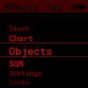

| Menu | Purpose | Typical first-use path |
|---|---|---|
| Start | Focus, align camera and eyepiece centers, check GPS, connect INDI | Start → Focus |
| Chart | Show the sky chart for the current pointing direction | Chart |
| Objects | Object catalogs, search, observing lists, and filters | Objects → By Catalog → Messier |
| SQM | Measure the brightness of the sky seen by the camera | SQM |
| Settings | Display, camera, communications, INDI, and hardware settings | Settings → User Pref... |
| Tools | Status, equipment, location and time, updates, and power | Tools → Status |

**Reading a path:** `Objects → By Catalog → Messier` means select Objects and press `→`, select By Catalog and press `→`, then select Messier and press `→`. Follow menu names even if their positions change.

## 3 Common controls

### 3.1 Buttons and press types

In this manual, `□` means the keypad's **SQUARE** button. A short press means press and release once. A long press means hold until the long-press action runs.

| Button | Action in list menus | Other screens |
|---|---|---|
| ↑ / ↓ | Select previous / next entry | Adjust exposure in Focus; select stars or reference points during alignment |
| → | Open an entry, select a value, or execute a command | Advance or confirm in entry screens; open the observation log from object details |
| ← | Go back one level | May move to a previous field or move a reference point during entry or alignment |
| Hold ← | Return to the top-level menu | Check the screen's cancellation procedure if a task is in progress |
| Hold → | Open details of the most recently viewed object | Requires a recent object; does not open a new screen while already in object details |
| Short press □ | Depends on the active screen | Switch views or start / confirm alignment. Use → to select ordinary menu entries |
| Hold □ | Open / close the current screen's quick menu | Available on screens with a quick menu |
| + / − | Adjust the active screen's function | Zoom the chart, scroll descriptions, and more; see individual procedures |
| Hold □ and press + / − | Increase / decrease LCD brightness | Settings → Key Bright controls keypad lighting separately |
| Hold □ and press 0 | Save the current LCD screen | Useful when reporting a problem |

### 3.2 Selecting and saving

**Single-choice menus:** Choose a value with `↑ / ↓`, then press `→`. Check the selected-value indicator. Settings apply when selected; some menus return to the previous screen or restart MFNavis afterward. Pressing `←` does not restore the previous value.

**Multiple-choice menus:** In filter menus Catalogs and Type, each `→` press toggles the selected entry. Choose all the entries you need, then leave with `←`. Select All and Select None select or clear all entries in the current list.

**Commands with confirmation:** Select Confirm and press `→` to execute, or select Cancel to return. Some commands execute without a confirmation screen. In INDI INIT, selecting a command and pressing `→` sends it immediately.

### 3.3 Quick menus and help

Hold `□` to open the quick menu for the current screen. Press the direction shown beside the function you want. When a quick submenu is open, a short `□` press closes one level; holding it closes the entire quick menu.

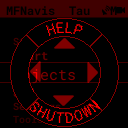

On screens with help, select **HELP** at the top of the quick menu. Use `↑ / ↓` to change help pages and `←`, `→`, or `□` to close help. Help availability depends on the screen.

### 3.4 Check the active screen before using number keys

Number keys have different roles on different screens: object-number search in catalogs, numeric entry in forms, and movement in mount-control screens.

| Current screen | Meaning of 0 | Meaning of □ |
|---|---|---|
| Objects → selected object · object details | Stop mount movement, tracking, and Goto/Guide corrections | Cycle object views |
| Start → INDI → Guide | Toggle Guide Correction | Sync the mount to the current pointing direction |
| Start → Align, during star selection | Cancel selection | Request alignment with the selected star |
| Start → Align (Day) | Cancel / exit without saving | Start or save alignment |
| Settings → INDI Setting → Multi Align, during adjustment | Cancel / exit multi-point alignment | Confirm the current alignment point |
| SQM → quick menu CALIB → SQM Calibration | Cancel or skip sky frames, depending on the step | Advance / finish |

**In Guide, 0 does not stop all mount activity.** Releasing a manual direction key stops that movement. In object details, `0` also stops tracking.

## 4 Preparing to observe with Start

### 4.1 Focus: camera focus

**Path:** `Start → Focus` · **Before you start:** Remove the lens cap and point the camera toward a star field.

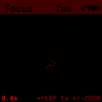
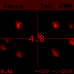
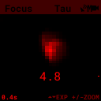
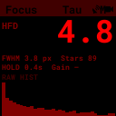

1. Short-press `□` to cycle through Image, Stars, Single, and Stats views. Use Stars to examine several stars and Single to enlarge one star.
2. If stars are hard to see, press `↑` to increase exposure. If the image is too bright or stars spread out, press `↓` to reduce exposure.
3. In Image, Stars, and Single views, use `+ / −` to change zoom.
4. Adjust the camera lens in small steps. With the same star, find the position where HFD decreases and the star image becomes compact. HFD measures how widely the star's light is spread.
5. Leave with `←`. Exposure stays fixed while in Focus; leaving restores the exposure setting used before entry.

To change gain, select `hold □ → right Gain` in the quick menu. Adjust exposure directly with `↑ / ↓` in Focus.

**Check the result:** Stars should look small and sharp, with a stable HFD. Focus the telescope eyepiece separately.

### 4.2 Align: align the observing center at night

**Path:** `Start → Align` · **Before you start:** Plate solving must be working. Center a bright star in the telescope eyepiece.

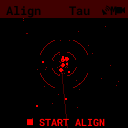
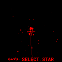
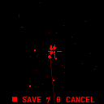

1. Press `□` to start star selection.
2. Use the direction keys to select the same star that is centered in the eyepiece. Use `+ / −` to zoom the chart.
3. Press `□` again to request alignment.
4. Look for Aligned! or Alignment requested. A request message alone does not guarantee completion; check the pointing display afterward.
5. After star-selection mode ends, leave with `←`.

During star selection, `←` selects a star to the left. Press `0` to cancel selection. Press `1` to reset the alignment point to the camera center.

**Check the result:** Center another bright object in the eyepiece and check that the guidance center matches your actual observing center. This procedure aligns camera and eyepiece centers. INDI mount multi-point alignment is covered in chapter 9.

### 4.3 Align (Day): align the observing center in daylight

**Path:** `Start → Align (Day)` · **Before you start:** Center a distant, easily recognized terrestrial target in the eyepiece.

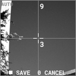
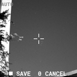

1. Press `□` to begin.
2. Choose the quadrant containing the target using number keys: `7` upper left, `9` upper right, `1` lower left, `3` lower right. Quadrant selection can run up to three times.
3. Press a direction key once to enter fine adjustment. This first press does not move the reference point. Further direction-key presses move it onto the target.
4. Press `□` to save and return to the previous menu.

Here, `+ / −` increase / decrease **exposure**. Pressing `0` cancels without saving a new alignment point. The quick menu can reset the reference point to the center or change exposure to Auto.

### 4.4 GPS Status

**Path:** `Start → GPS Status` or `Tools → Place & Time → GPS Status`

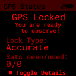

Check the location-fix status and satellite information. If a fix is unavailable, wait with an open view of the sky. Where GPS is unavailable, enter location and time manually as described in chapter 11. Leave with `←`.

### 4.5 INDI

**Path:** `Start → INDI` · **Visibility:** `Tools → Experimental → Mount Control → On`

The menu contains STATUS, INIT, and Guide. Changing Mount Control restarts MFNavis. Connection, automatic movement, mount alignment, and Guide controls are described in chapter 9.

## 5 Viewing the sky with Chart

**Path:** `Chart` · **Before you start:** A pointing direction must be available to draw the chart.

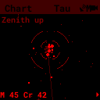

| Control | Action |
|---|---|
| + | Zoom in |
| − | Zoom out |
| □ | Restore the default field of view |
| → | Open details of the object at the chart center |
| ← | Return to the previous menu |
| Hold □ | Open the chart quick menu |

As you move the telescope, the chart updates to the current direction. Change orientation, reticle, constellation lines, deep-sky objects, and coordinate display in `Settings → Chart...`.

Opening details with `→` requires **Center Object to be On** and a selectable object at the chart center. If No solve appears, check Focus and plate-solving status first. Holding `→` opens the most recently viewed object instead of the object at the chart center.

## 6 Finding targets with Objects

### 6.1 Choosing an object list

| Menu | How to use it |
|---|---|
| All Filtered | Open all objects matching the current filters. Select with ↑ / ↓ and open details with →. |
| By Catalog | Select a catalog and press →. Includes Planets, Comets, NGC, Messier, DSO..., and Stars.... |
| Recent | Reopen objects viewed during the current run. Empty if no objects have been viewed. |
| Obs Lists | Select a previously supplied observing-list file and open it with →, then select an object. |
| Custom | Enter RA and Dec for a target outside the catalogs. Move between fields with ↑ / ↓, enter numbers, and confirm with →. |
| Name Search | Enter a name and press → to open results, then select an object. |
| Set Filters | Choose catalogs, object types, altitude, magnitude, and observation status. |

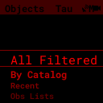

**Catalog groups**

| Group | Included catalogs |
|---|---|
| Direct entries | Planets, Comets, NGC, Messier |
| DSO... | Abell Pn, Arp Galaxies, Barnard, Caldwell, Collinder, E.G. Globs, Harris Globs, Herschel 400, IC, Lynga Opn Cl, Messier, NGC, Sharpless, TAAS 200 |
| Stars... | Bright Named, SAC Doubles, SAC Asterisms, SAC Red Stars, RASC Doubles, WDS Doubles, TLK 90 Variables |

### 6.2 Finding objects by number and changing the list view

In a catalog list, number keys jump to an object near that number. For example, press `3`, then `1` in Messier, **check that the selected name is M31**, and press `→`. If filters hide the target, that number may select a different object.

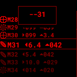

Press `□` to change the list view. While a numeric-entry indicator is visible, `□` clears it. Select `hold □ → left Sort` to choose Nearest or Standard sorting; right Filter opens filters directly. The Comets quick menu also offers Refresh.

### 6.3 Name Search: search by name

**Path:** `Objects → Name Search`

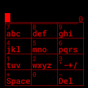

1. Enter a name with the number keys using the displayed letter layout. In Multi-Tap, press the same key repeatedly to select a letter. In T9, press the corresponding key once for each letter.
2. Press `−` to delete the last character and `+` to insert a space. Press `□` to change the character layout.
3. Press `→` to open results. Select a result with `↑ / ↓` and open details with `→`.
4. Return from results to the search-entry screen to edit the name and search again.

Choose the input method in `Settings → User Pref... → Search Input`. You can also enter text with an external keyboard.

### 6.4 Set Filters: filter lists

**Path:** `Objects → Set Filters`

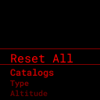
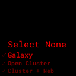

| Entry | Control and effect |
|---|---|
| Reset All | Select Confirm and press → to restore default filters; Cancel returns. |
| Catalogs | Use → to select / clear multiple catalogs included in All Filtered. |
| Type | Use → to select / clear object types such as galaxies, clusters, nebulae, stars, planets, and comets. |
| Altitude | Choose a minimum altitude: None or 0°, 10°, 20°, 30°, 40°. |
| Magnitude | Choose the maximum magnitude shown: None or 6–15. Larger numbers include fainter objects. |
| Observed | Choose Any, Observed, or Not Observed to filter by observation records. |

**Name Search and Recent are unaffected by the ordinary list filters.** Check filters first if an object is missing from a catalog or observing list. Altitude filtering requires the correct location and time.

### 6.5 Object details and movement guidance

**Path:** `Objects → an object list → select an object → →`

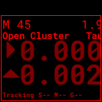
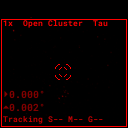
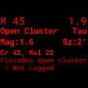

Each `□` press cycles through **movement guidance → camera → object image → description → contrast information**. In guidance view, follow the direction arrows and remaining angle toward the target.

| Control | Action |
|---|---|
| ↑ / ↓ | Previous / next object in the current list |
| + / − | Zoom in / out in camera view; next / previous portion of a description; change eyepiece in other views |
| → | Open LOG when a current pointing direction is available |
| ← | Return to the list |
| 5 | Request GoTo to the selected object using the connected mount |
| 0 | Stop mount movement, tracking, and Goto/Guide corrections |
| 7 | Request mount Sync using the current pointing direction |
| 1 | Cycle GoTo Type |
| 8 / 2 / 4 / 6 | Move the mount north / south / west / east while held |
| 9 / 3 | Increase / decrease manual mount movement speed |

Mount controls require Mount Control to be enabled and a connected mount. When GoTo Type is Off, `5` does not initiate movement. After a request message, also check actual movement and arrival status.

**Tracking border in the Push view:** After GoTo completes, a rectangular border appears below the title bar around the guidance and camera views when the mount is tracking the currently selected object.

- **Appearance:** A dark outer line and bright inner line remain visible against bright camera images and dark backgrounds. The bright line follows the display color setting and remains visible in night mode.
- **When it disappears:** Tracking stops, a new GoTo or manual movement begins, the mount parks, an error or disconnect occurs, or fresh status information is unavailable. Viewing a different object from the tracked target also hides the border.
- **Checking arrival:** The border is absent during ordinary GoTo motion and pulse-guide arrival corrections. Once movement completes, check the border, remaining angle, and status at the bottom together.

To align the eyepiece center using the selected object, center it in the eyepiece and select `hold □ → down ALIGN → right ALIGN`. Left CANCEL in the submenu returns. This ALIGN aligns camera and eyepiece centers; mount Sync is a separate command.

### 6.6 LOG: record an observation

Open LOG with `→` in object details, then select a field with `↑ / ↓`. For ratings, enter `0–5` or cycle values with `→`. Press `→` on observing conditions or eyepiece to open a selection screen. Select the save entry and press `→`; Logged! appears and the details screen returns.

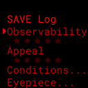

Conditions includes Transparency and Seeing. Choose NA, Excellent, Very Good, Good, Fair, or Poor to describe the conditions, then apply with `→`.

### 6.7 Custom: enter coordinates

**Path:** `Objects → Custom`

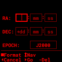

Move between fields with `↑ / ↓` and enter RA and Dec with the number keys. Press `−` to delete a digit. In the Dec degrees field, `+` changes the sign; in Epoch, `+` changes the coordinate reference epoch. Press `□` to change the coordinate-entry format. Check every value and confirm with `→`, or leave without saving with `←`.

## 7 Checking sky brightness with SQM

**Path:** `SQM` · **Meaning:** Shows the brightness of the sky toward which the camera points, in mag/arcsec². A larger number means a darker sky.

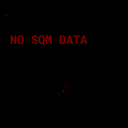

| Control | Action |
|---|---|
| □ | Switch between measurement and sky-condition description |
| + / − | Next / previous portion of the description |
| ← | Return to the previous menu |
| Hold □ → left CALIB | Open the SQM calibration wizard |
| Hold □ → down SWEEP | Open exposure-based SQM diagnostic measurements |

Moonlight, clouds, twilight, and the camera's pointing altitude affect readings. Compare changes at one location using similar directions and conditions. Basic brightness measurement may continue even if plate solving fails. Entering SQM switches exposure behavior for measurement; leaving restores normal exposure behavior.

### 7.1 SQM Calibration

**Path:** `SQM → hold □ → left CALIB → SQM Calibration`

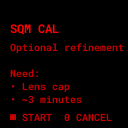

1. Open CALIB and press `□` to start.
2. At the lens-cap instruction, put the cap on and press `□`. Wait for frame collection to finish.
3. At the cap-removal instruction, remove the cap and press `□` to collect sky frames.
4. Review the analysis and results, then leave with `□`.

`0` cancels at the introduction and cap-on instruction. At the cap-off instruction or during sky-frame collection, it **skips sky frames and proceeds to analysis**. Do not use `0` as a cancel button during cap-on frame collection.

### 7.2 SQM Sweep: diagnostic measurements

**Path:** `SQM → hold □ → down SWEEP → SQM Sweep`

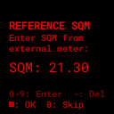

If you know a reference SQM value, enter four digits: for example, `2130` means **21.30**. Press `−` to delete the last digit and `□` to confirm. With an empty entry, `0` or `□` continues without a reference value.

At confirmation, press `□` to start collection; press `□` again after completion to leave. Here, `0` cancels at confirmation. SWEEP helps diagnose how readings change with exposure.

## 8 Changing display and observing settings

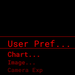

### 8.1 User Pref...: preferences

**Path:** `Settings → User Pref... → entry → choose a value → →`

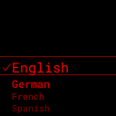

| Entry | Values | Purpose |
|---|---|---|
| Key Bright | −4–3 | Keypad lighting. For LCD brightness, hold □ and press + / − |
| Sleep Time | Off, 10s, 20s, 30s, 1m, 2m | Idle time before sleep |
| Menu Anim | Off, Fast, Medium, Slow | Menu transition speed |
| Scroll Speed | Off, Fast, Medium, Slow | Scrolling speed for long text |
| Search Input | Multi-Tap, T9 | Text-entry method for name search |
| Az Arrows | Default, Reverse | Azimuth arrow direction in movement guidance |
| Language | English, German, French, Spanish, Korean, Chinese | LCD UI language; select English for English |

### 8.2 Chart...: chart display

**Path:** `Settings → Chart... → entry → choose a value → →`

| Entry | Values and effect |
|---|---|
| Coordinate Sys. | Horizontal: horizon orientation; EQ (Auto): automatic equatorial orientation; EQ (North-up) / EQ (South-up): north / south celestial pole upward |
| Reticle | Off / Low / Medium / High: central reticle brightness |
| Constellation | Off / Low / Medium / High: constellation-line brightness |
| DSO Display | Off / Low / Medium / High: deep-sky-object display brightness |
| RA/DEC Disp. | Off / HH:MM / Degrees: coordinate display format |
| Center Object | Off / On: central-object name and opening details with → from Chart |

Before location is available, chart orientations that require it may use a temporary orientation. Check the upward direction again after acquiring a GPS location.

### 8.3 Image...: object images

In `Settings → Image...`, enable **NSEW Labels** with On for direction labels, and **Object Size** with On for object-size and orientation outlines. Choose Off to disable them. Open each entry and select the desired value with `→`.

### 8.4 Camera Exp and Camera Gain

| Path | Values | Control |
|---|---|---|
| Settings → Camera Exp | Auto, Star, 0.025s, 0.05s, 0.1s, 0.2s, 0.4s, 0.8s, 1s | Select with ↑ / ↓, apply with →. Auto and Star are automatic exposure methods; numeric values are fixed durations |
| Settings → Camera Gain | Profile, 1x, 2x, 4x, 8x, 12x, 15x, 16x, 20x, 22x, 24x, 30x | Select with ↑ / ↓, apply with →. Profile uses the camera profile's reference value |

Longer exposures can capture more stars but may elongate them during movement. Actual supported exposure and gain ranges depend on the sensor. Temporary exposure in Focus is separate from the observing exposure setting in Settings.

### 8.5 WiFi Mode and Mount Type

| Entry | How to use it | Check afterward |
|---|---|---|
| WiFi Mode → Client Mode | Connect to an existing wireless network | Check the address in Tools → Status |
| WiFi Mode → AP Mode | Let MFNavis provide a wireless access point | Connect to MFNavisAP, then open http://10.10.10.1 |
| WiFi Mode → AP+STA Mode | Use an access point and an existing network together | Check both connections in Status |
| Mount Type → Alt/Az | Select an altitude-azimuth telescope mount | Check the value after MFNavis restarts |
| Mount Type → Equatorial | Select an equatorial telescope mount | Check the value after MFNavis restarts |

Changing WiFi mode may disconnect your phone or computer. Reconnect to the network and address appropriate for the new mode.

## 9 Connecting and moving an INDI mount

**INDI MOUNT detailed settings:** Open the MFNavis web server on a phone or PC and select **INDI**. You can configure USB or network connections, mount limits, multi-point alignment, backlash, GoTo / Guide, and SkySafari. See 14.1 for web access, 14.4 for connections, and 14.5–14.7 for the other settings.

### 9.1 Enabling mount control

1. Select `Tools → Experimental → Mount Control → On`. MFNavis restarts.
2. Request connection with `Start → INDI → INIT → Connect`.
3. In `Start → INDI → STATUS`, check connection, coordinates, tracking, and Home / Park status.
4. Once location and time are ready, select `INIT → Set Location` to send them to the mount.
5. To use a parked mount, select `INIT → Unpark` and check status.

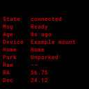

When Mount Control is Off, `Start → INDI` and `Settings → INDI Setting` are hidden. For a first connection or a changed transport, configure the web **INDI → LX200 OnStepX Driver Connection** section first (14.4). Its heading also includes the current driver's name. Check STATUS for successful connection even after an LCD request message appears.

### 9.2 INIT commands

**Path:** `Start → INDI → INIT → select a command → →`

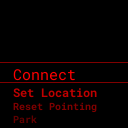

| Entry | Purpose | Check afterward |
|---|---|---|
| Connect | Request INDI mount connection and initialization | Connection and coordinates in STATUS |
| Set Location | Send current location and time to the mount | Synchronization status and error notices |
| Reset Pointing | Request rebuilding of the current pointing-coordinate reference | Updated pointing display |
| Park | Request movement to the configured park position | Park status in STATUS |
| Unpark | Request unparking | Unpark status in STATUS |
| Set Home | Request setting the current position as Home | Home status and device response |
| Return Home | Request movement to Home | Completed movement and Home status |
| Set-Park | Request setting the current position as the park position | Device response and park settings |
| Restart INDI | Request an INDI driver restart | Reconnection and received coordinates |

Support varies by mount and driver. Park and Return Home can move the telescope; check the movement path before executing them.

### 9.3 Guide: manual movement and Sync

**Path:** `Start → INDI → Guide`

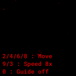

| Control | Action in Guide |
|---|---|
| Hold 8 / 2 / 4 / 6 | Move north / south / west / east; release to stop manual movement |
| 9 / 3 | Increase / decrease manual movement speed |
| □ | Sync the mount to the currently available sky pointing direction |
| 0 | Toggle Guide Correction |
| ← | Return to the previous menu; leaving stops manual movement |

An external letter keyboard can use `q / w / e`, `a / s / d`, and `z / x / c` as a direction pad. `s` stops manual movement; `, / .` decrease / increase speed. Custom key mappings can change these actions.

If a current direction is unavailable for Sync, No solve appears. **In Guide, □ sends Sync rather than switching views.**

### 9.4 Multi Align: multi-point alignment

**Path:** `Settings → INDI Setting → Multi Align`

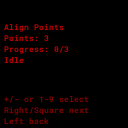
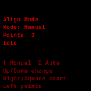

1. Adjust the number of alignment points with number keys or `+ / −`. Press `→` or `□` to continue.
2. Select Manual / Auto with `↑ / ↓`, then begin with `→` or `□`. At this step, `1` also starts Manual, and `2` starts Auto.
3. In Manual, choose a star with `↑ / ↓` and move to it with `→` or `□`. In Auto, follow the instructions during preparation and movement.
4. On the adjustment screen, use mount direction controls to center the star. Adjust speed with `9 / 3` and **confirm the current point with □**.
5. Complete the required points and check completion status.

During adjustment, `←` returns to star selection in manual mode; in automatic mode, it cancels the current process and returns to mode selection. At the adjustment step, `0` cancels alignment and exits. Star lists and automatic startup depend on location, time, plate solving, available stars, and mount status.

### 9.5 Backlash

**Path:** `Settings → INDI Setting → Backlash`

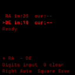

Select the RA axis with `+` or DE axis with `−`. Enter values with number keys and press `□` to send both axes. `→` requests automatic backlash measurement for the selected axis. The input range is 0–999; `0` clears the selected axis's input. **Here, 0 is not entered as a digit.** Check the device's values, units, and support for automatic measurement.

### 9.6 Goto/Guide settings

**Path:** `Settings → INDI Setting → Goto/Guide → entry → choose a value → →`

| Entry | Values | Meaning |
|---|---|---|
| GoTo Type | Off / INDI Mount / MFNavis | Disable automatic movement / use mount GoTo / use MFNavis coordinate-based movement and corrections |
| Tracking Guide | Off / On | Correct the target position during tracking |
| GoTo Recovery | Off / On | Use GoTo to return after a large target deviation |
| Recovery Range | 0.25°, 0.5°, 1°, 2°, 3° | Deviation angle used to decide GoTo recovery |
| Manual Re-target | Off / On | Update the tracking target to a new direction after manual movement |
| Max GoTos | 3, 5, 10, 15, 20 | Maximum repeated moves during MFNavis GoTo |
| Invert Guide RA/Az | Off / On | Reverse RA / azimuth correction direction |
| Invert Guide Dec/Alt | Off / On | Reverse Dec / altitude correction direction |

After reversing a correction direction, check with small movements that target error decreases. Manual Re-target changes the tracking target; it does not automatically change the catalog object selected in object details.

## 10 Configuring hardware in Settings

### 10.1 Advanced: hardware and input devices

**Path:** `Settings → Advanced`

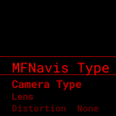

| Entry | Control and checks |
|---|---|
| MFNavis Type | Choose the actual assembly orientation: Left, Right, Straight, Flat v3, Flat v2, or AS Bloom, then press →. Check orientation after restart |
| Camera Type | Choose the installed sensor and press →: IMX678 (Auto), v2 - imx477, v3 - imx296 Mono, v3 - imx296 Color, v3 - imx462 Mono, v3 - imx462 Color. Sensor changes can require reboot; some variant changes restart the software. Follow the screen instructions |
| Lens | Use the lens selection and measurement procedure below |
| Distortion | Use the distortion calibration procedure below |
| GPS Settings | Match GPS Type, GPS Baud Rate, and GPS Port to the receiver |
| Time Sync | Configure time synchronization and its sources |
| Bluetooth | Scan, pair, and reconnect external input devices |
| Joystick | Test buttons and assign them to functions |
| Keyboard | Test keys and assign them to functions |
| WiFi Recover | Request recovery with Confirm →; return with Cancel |

Camera Mono / Color refers to the sensor's monochrome or color variant, rather than a display color option.

### 10.2 Lens: selection and measurement

**Path:** `Settings → Advanced → Lens`

| Choice | How to use it |
|---|---|
| 4mm, 6mm, 8mm, 10mm, 12mm, 16mm, 25mm | Choose the camera lens's focal length and press → |
| Manual (mm) | Enter a focal length and confirm with ←. Delete the last character with −; switch the character layout with □ to enter digits and a decimal point |
| Auto (Measure) | Start measurement with →. Point toward stars in a sky field that can be plate-solved and check progress |

Automatic measurement collects usable frames and evaluates the result. Check the measured focal length afterward. During measurement, `←`, `□`, or `0` cancels and exits. **Lens values describe the MFNavis camera lens**; manage the telescope focal length in Equipment.

### 10.3 Distortion: calibration

**Path:** `Settings → Advanced → Distortion`

1. Select Status to check calibration for the current camera and lens.
2. Point at a star field, select Measure Sky, and press `→` to measure.
3. Check collection progress and results. After completion, check Status to confirm application.
4. During measurement, `←`, `□`, or `0` cancels and exits. Cancel Measurement in the menu also requests cancellation.

Reset clears the calibration when Confirm is selected; Cancel returns. Check the calibration for your current combination after changing the camera or lens.

### 10.4 GPS Settings and Time Sync

| Path | Values and control |
|---|---|
| GPS Settings → GPS Type | Choose UBlox / GPSD (generic), then →. MFNavis restarts |
| GPS Settings → GPS Baud Rate | Choose 9600 (standard) / 115200 (UBlox-10) to match your receiver, then → |
| GPS Settings → GPS Port | Choose Auto or the connected port, then →. Ports: ttyAMA1, ttyAMA2, ttyAMA3, serial0, ttyAMA0, ttyAMA10, ttyS0, ttyACM0, ttyUSB0 |
| Time Sync → Time Sync | Select Off / On for time synchronization |
| Time Sync → Chrony Source | Select Off / On for the Chrony time source |
| Time Sync → GPS Source | Select Off / On for the GPS time source |
| Time Sync → RTC Sync | Select Off / On for RTC synchronization |

After applying changes, check reception and synchronization in `Tools → Place & Time → GPS Status / Time Sync`. An incorrect port or baud rate prevents GPS reception.

### 10.5 Bluetooth: connect input devices

1. Open `Settings → Advanced → Bluetooth` and put the external keyboard into pairing mode.
2. Select Scan and press `→`. Choose the device and press `→` to open its action menu.
3. Select Pair+Connect, press `→`, and follow the pairing instructions.
4. Check connection status and test actual key presses.

Reconnect reconnects a known device; Refresh updates the list. In a device's action menu, Connect / Disconnect connect / disconnect, Pair Again repeats pairing, and Remove removes registration. Press `←` to close the action menu or pairing.

### 10.6 Joystick and Keyboard mappings

| Screen | How to use it |
|---|---|
| Joystick | Open Test Buttons with → to test buttons. Select a function, press →, then press the desired button on the connected device to assign it. |
| Keyboard | Open Test Keys with → to test keys. Select a function, press →, then press the desired external key to assign it. |

Press `←` to return from tests or assignment waiting. **Clear All clears custom mappings for that device when you press →.** After assignment, check the menu's updated label and test the action on its actual screen.

### 10.7 IMU Settings: movement sensor

**Path:** `Settings → IMU Settings`

| Entry | Control and effect |
|---|---|
| Sensitivity | Off / Very Low / Low / Medium / High: movement-detection sensitivity; changes restart MFNavis |
| Compass | Off / On: enable the sensor's compass; changes restart MFNavis |
| Calibration → Save | Request saving the current sensor calibration |
| Calibration → Load | Request loading saved sensor calibration |
| Calibration → Clear | Request deleting saved sensor calibration |

Select each command and press `→` to run it. These functions require the corresponding physical sensor.

## 11 Checking status and managing MFNavis with Tools

### 11.1 Status

**Path:** `Tools → Status`

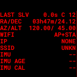

Check current plate-solving, location, communications, and equipment status. After changing WiFi mode, check the connection address. When troubleshooting, check both Status and the relevant function's status screen. Return with `←`.

### 11.2 Equipment: telescope and eyepiece

**Path:** `Tools → Equipment`

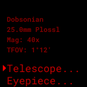

Choose the telescope or eyepiece row with `↑ / ↓`, then open its selection list with `→`. Select the equipment and press `→`, then return to Equipment to check magnification and field of view. Lists depend on your saved equipment configuration. Register and edit equipment in the web equipment-management screen.

### 11.3 Place & Time: location and time

**Path:** `Tools → Place & Time`

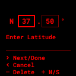
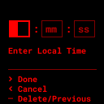

| Entry | How to use it |
|---|---|
| GPS Status | Check location-fix status and satellite information; return with ←. |
| Time Sync | Check time synchronization status. Configure it in Settings → Advanced → Time Sync. |
| Set Location → Enter Coords | Enter latitude → longitude → altitude. Enter digits and press → to advance fields and screens. Confirming the final altitude applies the location. |
| Set Location → Load Location | Select a saved place with ↑ / ↓ and open its action menu with →. Select Load and press →. The loaded place also becomes the default. |
| Set Location → Save Location | Enter a name for the current location and confirm with ←. |
| Set Time/Date | Acquire a location first, enter local time, then press → for the date. Both take effect after confirming the date. |
| Reset Location | Clear the current location, then acquire it again through GPS or manual entry. |
| Reset Time/Date | Clear current time/date status, then set it again from a time source or manual entry. |

In coordinate entry, use `+` to change sign and check N / S and E / W indicators. `−` deletes the last digit in the current field. In numeric entry, `←` moves to the previous field or cancels at the first field. **Time entry cannot proceed until a location is available.** Use local time at the observing location.

A saved place's action menu also offers Rename and Delete. Confirm the new name with `←`. Selecting Delete and pressing `→` deletes the place directly; `←` closes the action menu.

### 11.4 Console and Software Upd

**Console:** Open `Tools → Console` to read device messages. Use `↑ / ↓` for older / recent messages and `←` to return. Number keys run test actions and can change time status; use direction keys when reading messages during real observations.

**Software Upd:** With internet access, open `Tools → Software Upd`. If an update is offered, select update or Cancel with `↑ / ↓` and press `→`. Updating cannot start if no update is available or release information cannot be fetched. If an OS migration confirmation appears, review its conditions before continuing. Maintain power throughout installation.

### 11.5 Test Mode

**Path:** `Tools → Test Mode`

Use stored images for indoor demonstrations or checks. Select the entry and press `→`. This mode uses test images instead of the actual sky; check that it is disabled before observing.

### 11.6 Experimental

| Entry | How to use it |
|---|---|
| Polar Align | Assist equatorial polar alignment using the procedure below |
| Mount Control | Select Off / On with →. INDI menu visibility changes after restart. |
| Dev Tools → Telemetry → Record | Off / On disables / enables coordinate and sensor recording. |
| Dev Tools → Telemetry → Images | Off / On controls image recording. |
| Dev Tools → Telemetry → Load | Select a saved recording and press → to replay. Select Stop replay in the same list and press → to stop. Used for reproducing and diagnosing problems. |

**Polar Align path:** `Tools → Experimental → Polar Align`

Press `□` to begin the instructions. Rotate the equatorial setup, stop at each position, and press `□` to request a plate-solving measurement. After the required measurements, adjust the mount's polar-alignment controls using the displayed altitude and azimuth corrections. `−` cancels the current collection while waiting for a measurement, or resets at other steps. At the AIM step with at least two collected points, `0` can also calculate corrections. On the correction screen, `□` starts a new measurement, so review the result first.

### 11.7 Power: shutdown and restart

| Task | Path and control |
|---|---|
| Shut down | Tools → Power → Shutdown → Confirm → |
| Restart | Tools → Power → Restart → Confirm → |
| Return without executing | Cancel → on either confirmation screen |

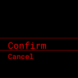

Shutdown performs a normal shutdown; Restart restarts the system. Wait for shutdown to complete before removing power.

## 12 Troubleshooting

### 12.1 Closing an error notice

LCD error notices remain until acknowledged. Read long notices with `↑ / ↓`, then close with `←`, `→`, or `□`. Closing returns to the previous screen; **it does not retry the failed command**. Investigate the cause, then request the action again if needed.

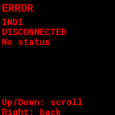

### 12.2 Checks by symptom

| Symptom | Checks and action |
|---|---|
| Cannot return from a menu | Check for active entry or alignment and use its cancellation procedure. During ordinary navigation, hold ← for the top-level menu. |
| No stars visible | Check lens cap and sky direction → exposure and focus in Focus. |
| No solve appears | Check star images in Focus → camera and lens settings → Status. |
| An object is missing | Search with Name Search → check altitude, magnitude, and type in Set Filters → use Reset All if needed. |
| → does nothing in Chart | Check Center Object is On, plate solving is working, and a central object exists. |
| INDI menu is missing | Check Tools → Experimental → Mount Control is On. |
| GoTo does not start | Check target selection in object details → whether GoTo Type is Off → connection and Park in INDI STATUS → error notices. |
| Pointing is incorrect after movement | Check camera/eyepiece alignment, location/time, and Mount Type; check INDI mount alignment if needed. |
| No GPS fix | Check open sky → GPS Type, baud rate, and port → enter location/time manually if needed. |
| Time entry cannot proceed | Acquire an observing location first; confirm both local time and date. |
| Connection lost after WiFi change | Reconnect to the new mode's network → check the address in Status → use WiFi Recover if needed. |
| External keys behave unexpectedly | Check Keyboard / Joystick tests and mappings; also check the active screen's number-key meanings. |

When reporting a problem, include the error text, current menu path, intended action, software version, and mount/camera models. Hold `□` and press `0` to save a screen image.

## 13 Common menu paths

| Task | Menu path | Section |
|---|---|---|
| Focus the camera | Start → Focus | 4.1 |
| Align the eyepiece center | Start → Align / Align (Day) | 4.2–4.3 |
| Zoom the sky chart | Chart → + / − | 5 |
| Find M31 | Objects → By Catalog → Messier → 3, 1 → check name → → | 6.2 |
| Search by name | Objects → Name Search | 6.3 |
| Change object filters | Objects → Set Filters | 6.4 |
| Log an observation | Object details → → → LOG | 6.6 |
| Measure sky brightness | SQM | 7 |
| Adjust LCD brightness | Hold □ and press + / − | 3.1 |
| Use the English LCD UI | Settings → User Pref... → Language → English | 8.1 |
| Change exposure / gain | Settings → Camera Exp / Camera Gain | 8.4 |
| Connect / check the mount | Start → INDI → INIT / STATUS | 9.1–9.2 |
| Move the mount manually | Start → INDI → Guide | 9.3 |
| Align the mount at multiple points | Settings → INDI Setting → Multi Align | 9.4 |
| Change automatic movement type | Settings → INDI Setting → Goto/Guide → GoTo Type | 9.6 |
| Measure lens focal length | Settings → Advanced → Lens → Auto (Measure) | 10.2 |
| Configure external input | Settings → Advanced → Bluetooth / Joystick / Keyboard | 10.5–10.6 |
| Choose telescope / eyepiece | Tools → Equipment | 11.2 |
| Enter location / time manually | Tools → Place & Time | 11.3 |
| Shut down normally | Tools → Power → Shutdown → Confirm | 11.7 |
| Web access / virtual keypad | Web Home / Remote | 14.1–14.2 |
| INDI MOUNT connection / detailed settings | Web INDI | 14.4–14.7 |

## 14 Using the web interface

Use the web pages in a browser on a phone, tablet, or PC. You can view the LCD, use a virtual keypad, search objects, and configure the INDI MOUNT, locations, equipment, and network. The images below are captures of the current web interface; IP addresses, equipment lists, and status values are examples.

### 14.1 Connecting and common controls

1. Connect your phone or PC to the same network as MFNavis. In the default AP configuration, join **MFNavisAP** and open **http://10.10.10.1**. Use your changed AP name or address if you have configured different values.
2. In Client mode, find the device IP in LCD `Tools → Status` and open `http://device-IP`. Add `:8080` if a development server is running on port 8080.
3. If a settings or control page opens Login, enter the configured device password. Web login uses the password of the system account running the MFNavis service.
4. Choose a page from the top navigation. On phones, open **☰** for the same menu. Select English or Korean in the language selector. Web and LCD languages are configured separately.
5. Use the save or apply button for the section you edited, then check its result message and current values. On the INDI page, **each settings section has its own apply button**.

The top bar also provides fullscreen and web-theme controls. The footer's **User manual** links open Korean or English editions, including before login. The manual's language selector keeps the current chapter.

| Web menu | Purpose | Instructions |
|---|---|---|
| Home | LCD screen, network, GPS, coordinates, and version | 14.2 |
| Remote | Virtual keypad beside the screen | 14.2 |
| Catalogs | Search, filters, object details, and sending targets | 14.3 |
| Observations | View and download observing sessions | 14.11 |
| Locations | Register, edit, and load observing locations | 14.8 |
| Equipment | Register and select telescopes and eyepieces | 14.9 |
| INDI | INDI MOUNT connection, controls, and detailed settings | 14.4–14.7 |
| Network Setup | AP, Client, AP+STA, and Wi-Fi settings | 14.10 |
| Tools | Password, backup, and restore | 14.12 |
| LiveCam | Camera preview, exposure, gain, and stacking | 14.13 |
| Logs | View and download operating logs | 14.12 |

### 14.2 Home and Remote

**Path:** Web navigation `Home` or `Remote`

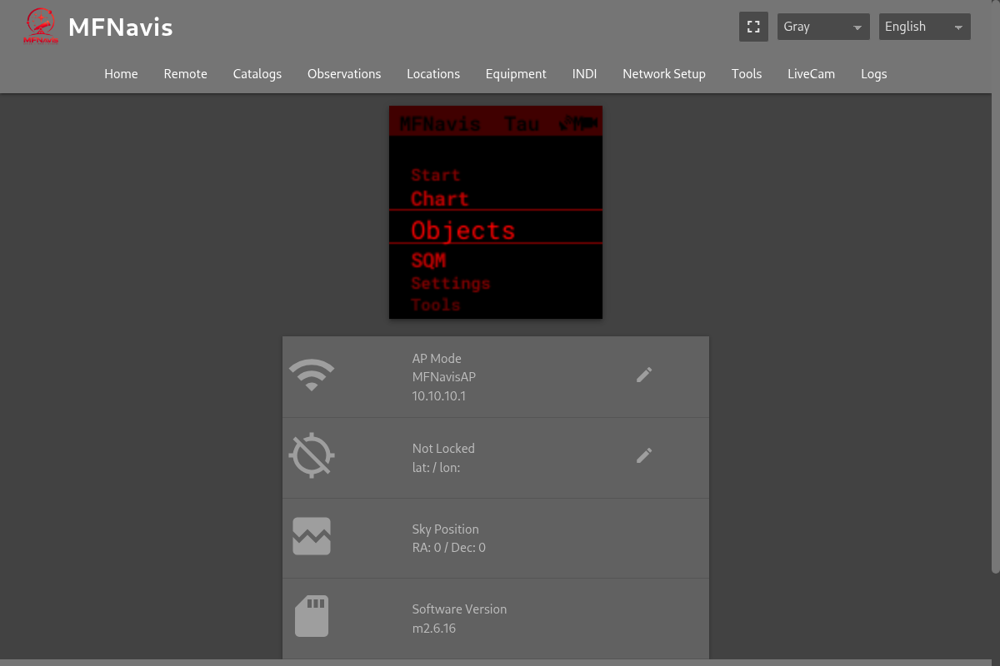

Home shows the device's current LCD image. The status table below it shows network address, GPS location, pointing coordinates, and software version. Edit icons beside network and GPS values open their settings pages.

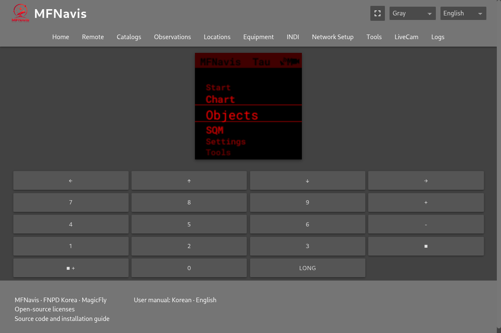

The arrows, numbers, `■`, and `+ / −` on Remote send the corresponding LCD keypad button. Follow chapters 3–11 for the active LCD screen's controls.

| Action | Virtual keypad sequence |
|---|---|
| Short press | Click or tap the desired key once |
| Long press | Select **Long**, then press the desired key. Example: Long → ← |
| Square-button combination | Select **■ +**, then press the desired key. Example: ■ + → + or − adjusts LCD brightness |
| Cancel a modifier | Click the selected Long or ■ + again |

Long and ■ + apply to the next key once, then clear. Select it again for another modified key. Number keys such as `5` and `0` may execute mount commands depending on the active LCD screen; check that screen first.

### 14.3 Catalogs: search and send targets

**Path:** Web `Catalogs`

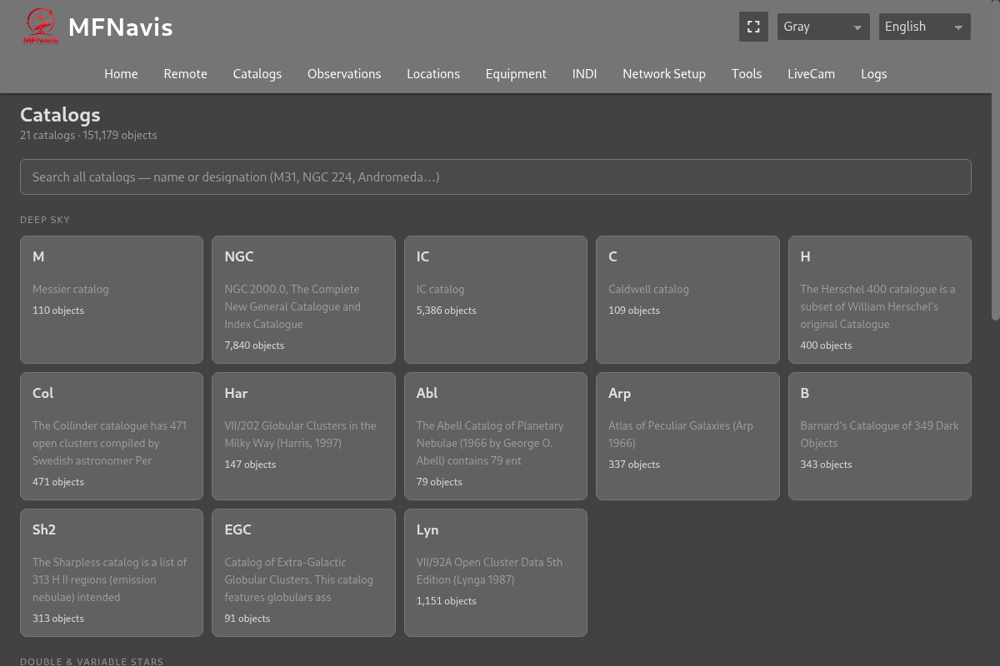

1. Enter `M31`, `NGC 224`, or a name in the global search and select a result. You can also open a catalog card.
2. Filter a catalog by name, type, constellation, magnitude, and observation status. **Up now** requires location information and a supported catalog. **Nearby** sorts by distance from the current pointing. Choose sorting by number, magnitude, or altitude where available.
3. Open an object to view its coordinates, magnitude, description, and altitude information. **Push to MFNavis** sends it to the device's object screen.
4. With Mount Control enabled and GoTo Type set to a value other than Off, sending a target can **also request automatic movement**. Check movement status and error. Use **Stop GoTo** to stop it. During multi-point alignment, movement follows the alignment workflow.

Returning to Catalogs may resume your previous catalog or object. Open the page's Catalogs breadcrumb or `/catalogs?home=1` for the catalog home. Use web observation marking and the LCD's detailed LOG entry according to the record you want to keep.

### 14.4 INDI MOUNT connection settings

**Path:** Web `INDI → Current INDI Driver State / LX200 OnStepX Driver Connection`

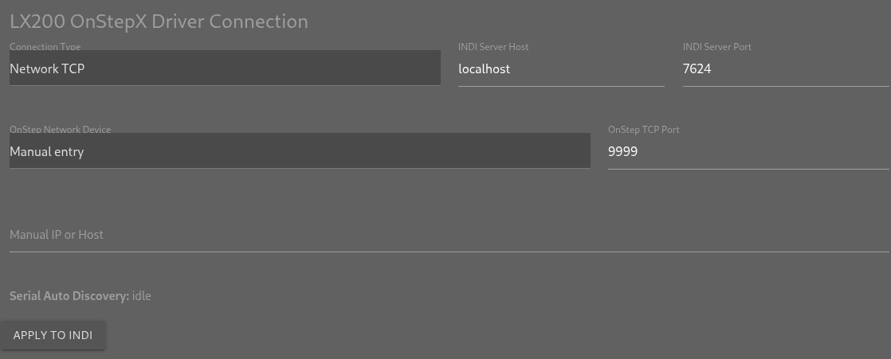

1. Enable LCD `Tools → Experimental → Mount Control → On` and wait for MFNavis to restart.
2. Open **INDI Web Manager** on the web INDI page to select and start the profile and driver. This link opens port 8624 on the same device. Check the driver name and running state on the original INDI page.
3. Enter **INDI Server Host** and **INDI Server Port**. The local defaults are `localhost` and `7624`. These identify the INDI server, separately from the mount's own address and port.
4. Choose **Connection Type** and enter the transport settings below.
5. Click **Apply to INDI**. Check the result and driver state. If needed, request LCD `INIT → Connect` and check `STATUS`.

| Connection | Fields | Check |
|---|---|---|
| Network TCP | Choose OnStep Network Device, or use Manual IP or Host. Enter OnStep TCP Port | Device choices come from AP clients. Change the default TCP port 9999 if your mount uses another port |
| USB Serial | Choose USB Serial Port and Communication Speed, or enter a port manually | Connect the cable and reload the page to refresh the port list |
| USB automatic discovery | Select Auto (Find connected OnStep) and, if needed, Auto (Detect with port), then apply | Requires a local INDI server, running OnStepX profile, and enabled Mount Control. Check discovery messages and the final connection result |

OnStepX-specific connection, location-transfer, and mount-limit controls use the **LX200 OnStepX** driver. Other drivers may disable or omit support for these actions. **Restart INDI** restarts the driver; **REBOOT INDI** requests a reboot of the connected OnStep controller.

### 14.5 INDI location, time, and manual movement

**Path:** Web `INDI → Location and Time / Mount Control`

1. Use **Reload Current Values** to read MFNavis location and UTC time. Check latitude, longitude, and elevation, and edit the location if needed.
2. Click **Send Location and Time** and check progress and the result. The command uses MFNavis's current UTC time; the displayed time field is read-only. To change MFNavis location or time first, use GPS Settings or the LCD location/time menu (14.8, 11.3).
3. Check Home and Park states under **Mount Control**. Select **Manual Slew Rate**, then **hold a direction button** to move. Releasing it stops manual movement.
4. Choose **Pulse Guide Rate** and click **Save** for fine corrections. This value is separate from manual slew rate.

At Home sets the current Home position; Return Home moves there. Park moves to the park position, Unpark releases parking, and Set-Park sets the current park position. Check the telescope's surroundings before requesting movement. **Reset Pointing** under Pointing Coordinate Service rebuilds the coordinate reference.

### 14.6 INDI mount limits, alignment, and backlash

**Path:** Web `INDI → Settings`

| Section | Action | Verify |
|---|---|---|
| Mount Limits | Enter overhead, horizon, and east/west meridian limits; click Apply Mount Limits | Read back current values. Overhead: 60–90°; horizon: −30–30°; meridian: −180–180 minutes. Four meridian minutes equal 1°; meridian limits apply to German equatorial mounts |
| Multi-Point Align | Choose Align Mode, Align Points from 1–9, and Alignment Star for manual mode; click Start Align | Current alignment point and status messages |
| Backlash | Check axis names, enter corrections from 0–3600, and click Save Backlash | Current backlash and save result |

For manual multi-point alignment, select a star, click **GoTo Selected Star**, center it, and click **Confirm Point**. Repeat for the next point. In automatic mode, follow status messages. Use **Cancel Align** to cancel.

Backlash **Start Motion Test** performs actual round-trip GoTo movement. Check the repeat count, instructions, and results. Use **Continue Motion Test** when the test is waiting. Distinguish recommended candidates from stored values and confirm your chosen values with Save Backlash. Axis labels follow the mount type, such as RA/DEC or AZ/ALT.

Mount-limit inputs and their apply button are disabled when driver values cannot be read. In Alt/Az mode, meridian values may be reported by INDI without direct readback from the controller.

### 14.7 INDI GoTo / Guide and SkySafari settings

**Path:** Web `INDI → GoTo / Guide Settings`

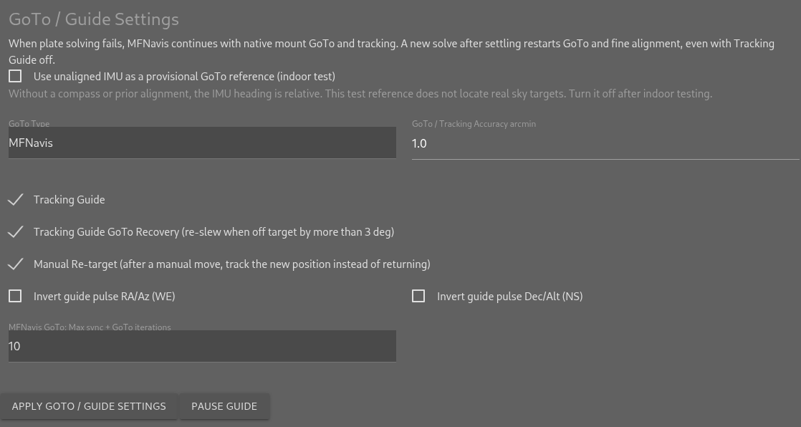

| Setting | Purpose |
|---|---|
| GoTo Type | Off, INDI Mount, or MFNavis; shares the saved LCD setting in 9.6 |
| GoTo / Tracking Accuracy arcmin | Shared arrival and tracking tolerance in positive arcminutes |
| Tracking Guide | Enable corrections using solved coordinates |
| Tracking Guide GoTo Recovery (re-slew when off target by more than 3 deg) | Recover large errors by requesting another GoTo |
| Manual Re-target (after a manual move, track the new position instead of returning) | Track the new direction after manual movement |
| Invert guide pulse RA/Az (WE) / Invert guide pulse Dec/Alt (NS) | Reverse the corresponding correction direction |
| MFNavis GoTo: Max sync + GoTo iterations | Select the maximum Sync / GoTo iteration count for MFNavis mode |
| Use unaligned IMU as a provisional GoTo reference (indoor test) | Relative heading for indoor testing. It does not locate real sky targets; turn it off after testing |

Click **Apply GoTo / Guide Settings** after editing and check the result. **Pause Guide** temporarily pauses correction; use the resume button shown afterward to continue. Check target, phase, error, and correction state under GoTo / Guide Status.

During a solving failure, MFNavis continues native mount GoTo and tracking. A new solve after settling can restart fine alignment, including when Tracking Guide is off.

Under **SkySafari Mount Mode**, choose mount code, Sync, and planet-tracking options, then click **Apply SkySafari Settings**. Check that the displayed MFNavis mount type matches your equipment. **Smooth optical tracking** on the same INDI page provides mode, target, and verified equipment-profile settings, followed by save, target-center confirmation, correction start, and stop controls. Response calibration and starting correction can move the mount.

### 14.8 Locations and GPS Settings

**Path:** Web `Locations`; edit current location/time through Home's GPS edit icon (`/gps`)

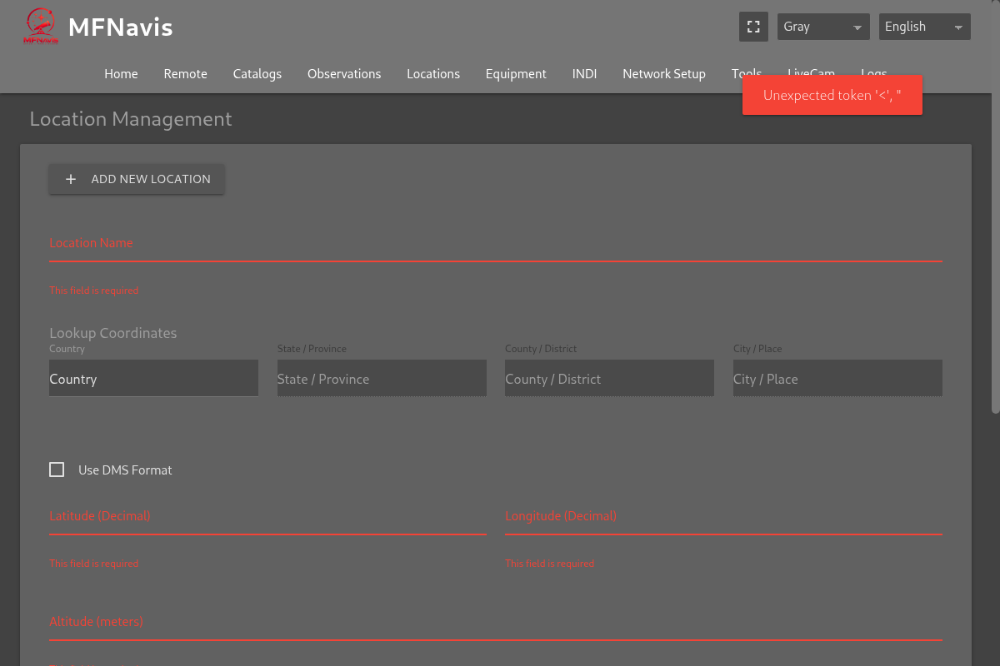

1. Open the add-location form and enter a name. Use **Lookup Coordinates** to choose a country, region, and place, or enter latitude, longitude, and elevation manually.
2. Choose decimal degrees or **Use DMS Format**. Check coordinate signs for north/south and east/west. Click **Save Location**.
3. Use **Load Location** to apply a saved location. **Set as Default** is a separate default-location choice. Use edit and delete icons to manage entries.
4. On GPS Settings, check the current coordinates, elevation, date, and UTC time, then click **Save**. **Set to Browser Date/Time** uses your browser's clock, so verify your phone or PC time first.

Saving a location and loading it as the current location are separate actions. To send location/time to the INDI mount as well, follow 14.5.

### 14.9 Equipment: register and select

**Path:** Web `Equipment`

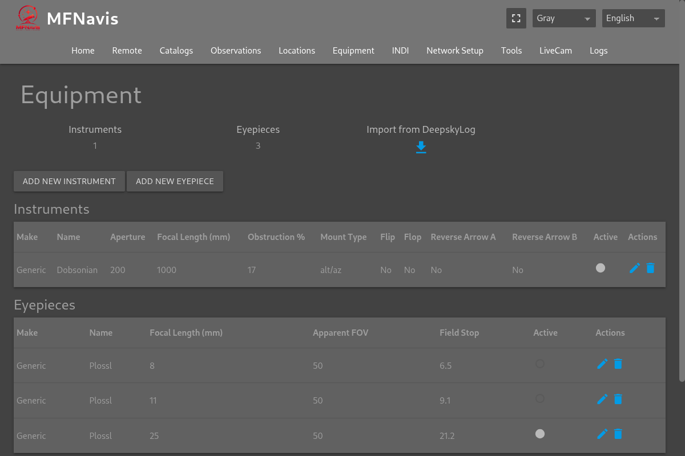

1. Click **Add new instrument** or **Add new eyepiece**.
2. Enter name and relevant measurements: telescope aperture and focal length, eyepiece focal length and apparent field, and other applicable fields. Check units and allowed ranges, then save.
3. Select the telescope and eyepiece to use. Check the selection marker and updated magnification/field on LCD `Tools → Equipment`.
4. Use edit and delete icons to manage entries. DeepskyLog import fetches equipment for the entered username from an external service and requires internet access.

### 14.10 Network Setup

**Path:** Web `Network Setup`

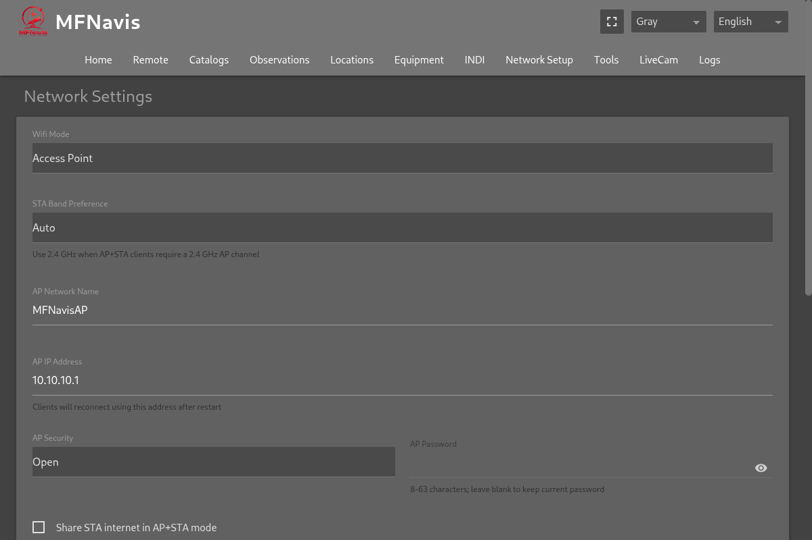

| Task | Action |
|---|---|
| Change connection mode | Select AP, Client, or AP+STA under Wifi Mode |
| Configure AP | Enter AP name, IP, security, and password; choose AP+STA internet sharing and STA band preference as needed |
| Save without applying | Save Settings stores the edits while retaining the current connection |
| Apply settings | Apply & Restart → confirm; reconnect using the changed address and network |
| Register Wi-Fi | Wifi Networks → + → choose a nearby network or enter name/password → Save |
| Apply saved Wi-Fi | Adjust priorities, then use Apply Now when pending changes are shown. A network's connect button requests that connection |

Applying and restarting or switching Wi-Fi can disconnect your browser. Use the new AP name/IP if changed. AP Connected Devices lists current AP clients and also supplies the INDI network-device choices.

### 14.11 Observations: view and download

**Path:** Web `Observations`

Select an observing session to view its objects, ratings, and notes. Download icons save all observations or the selected session as **TSV**. Open it as a tab-delimited file in a spreadsheet. See 6.6 for creating detailed observations on the LCD.

### 14.12 Tools, Logs, and diagnostic captures

**Path:** Web `Tools` or `Logs`

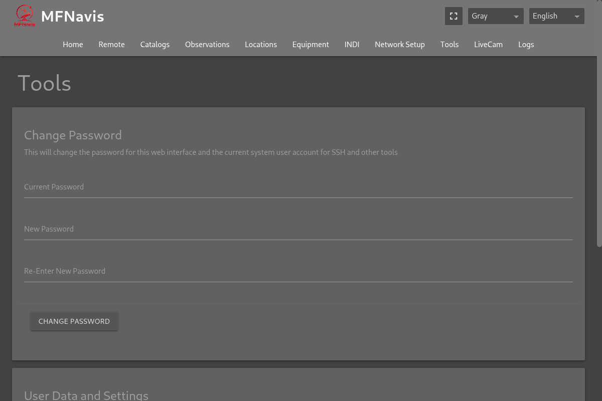

| Function | Instructions |
|---|---|
| Change Password | Enter current password and the new password twice. This changes both web login and that system account's SSH password |
| Download Backup File | Save a ZIP containing personal settings, observations, and observing lists |
| Upload and Restore | Choose backup → restore → confirm. Existing preferences and observations are overwritten; back up current data first |
| Logs | Pause/resume display, copy, or use Download All Logs. Save to SD saves on the device |

To collect solving diagnostics, open **Plate-solving diagnostic capture** at `/solver-capture`. Choose scene, test stage, capture contents, maximum duration, attempts, and storage limit. Click **Start recording** and verify the recording state. Add segment notes as needed, then click **Stop recording**. Recording also stops at the configured limits.

### 14.13 LiveCam

**Path:** Web `LiveCam`

1. Enable **Processing On**, choose Input Frame, Output, and Preview Mode, then click **Apply**. Choose a latest-frame preview or Live Stack.
2. For stacking, choose Stack Mode and frame count. Use **Reset Stack** to start a new accumulation.
3. Under **Camera Exposure / Gain**, choose exposure mode/value and gain, then click **Apply Camera**. Check actual values and status. Manual exposure is in µs; 400000µs equals 0.4 seconds.
4. Use Preview zoom, fit, and star overlays. Download the image in the selected format, or use TIFF download for supported RAW data.

**Preprocess for solving** separately affects the solver's input. Distinguish it from preview brightness, color, and stacking changes. Exposure/gain controls are unavailable when no camera process is attached.

### Scope of this manual

This draft follows the MFNavis source in the working tree on October 9, 2026. Device-specific LCD displays, physical buttons, and responses from connected mounts require verification on actual hardware before release. Available entries can vary with hardware, language, saved equipment and observing lists, and software version.
