# MFNavis 사용자 매뉴얼 LCD와 웹

**사용자 매뉴얼 초안 · 2026년 10월 9일**

MFNavis는 카메라로 별의 위치를 확인하여 망원경이 가리키는 하늘을 표시하고, 관측할 천체까지의 이동 방향을 안내합니다. 이 매뉴얼은 LCD·키패드와 웹페이지로 관측을 준비하고, 천체를 찾고, 설정을 바꾸는 방법을 설명합니다. INDI 마운트를 연결하면 자동 이동과 수동 이동도 사용할 수 있습니다. **INDI MOUNT의 연결과 세부 설정은 웹서버의 INDI 화면에서 할 수 있습니다.** 웹 접속과 페이지별 사용법은 [14장](#chapter-14)을 참고합니다.

표와 설명, 진입 경로에는 **정식 영문 메뉴명(한국어 UI 표시명)**을 함께 적었습니다. 예를 들어 Start(시작), Focus(초점), Set Filters(필터 설정)입니다. Lens, Distortion, CALIB처럼 한국어 UI에서도 같은 영문으로 표시되는 이름은 중복 표기를 생략합니다. 괄호 안은 설명용 의역이 아니라 실제 한국어 UI의 표시명입니다. 메뉴 구조도는 메뉴 관계를 설명하는 개념도입니다. LCD 화면 캡처는 현재 UI의 128×128 화면 기준이며, 위치·시각·측정값·마운트 상태는 조작 설명을 위한 예시입니다. 실제 화면의 글자 크기와 배치는 장비에 따라 다릅니다. INDI 관련 메뉴는 **Mount Control(가대 제어)을 켠 경우에만** 나타납니다.

## 1 처음 사용하는 분을 위한 빠른 시작

처음 관측할 때는 아래 순서로 진행합니다. **솔빙**은 카메라에 찍힌 별을 식별해 현재 방향을 알아내는 과정입니다. **정렬**은 카메라의 방향과 접안렌즈로 보는 중심을 맞추는 과정입니다.

1. **초점 맞추기:** `Start(시작) → Focus(초점)`를 엽니다. 밝은 별이 보이도록 카메라 렌즈의 초점을 조절하고, HFD 값이 작아지는 지점을 찾습니다. 초점을 조절하는 대상은 MFNavis의 카메라 렌즈입니다.
2. **위치와 시간 확인:** `Start(시작) → GPS Status(GPS 상태)`에서 위치가 확보되었는지 확인합니다. GPS를 사용할 수 없다면 `Tools(도구) → Place & Time(위치/시간)`에서 위치를 먼저 입력하고 시간과 날짜를 설정합니다.
3. **관측 중심 맞추기:** 밝은 별을 망원경 접안렌즈 중앙에 놓고 `Start(시작) → Align(정렬)`을 엽니다. `□`를 눌러 별 선택을 시작하고 방향키로 같은 별을 고른 뒤 다시 `□`를 누릅니다.
4. **천체 선택하기:** `Objects(천체) → By Catalog(카탈로그별) → Messier`를 엽니다. `↑ / ↓`로 천체를 고르고 `→`로 상세 화면에 들어갑니다.
5. **천체 찾기:** 상세 화면의 방향과 남은 각도를 보며 망원경을 움직입니다. 자동 이동을 사용하려면 마운트 연결을 먼저 확인하고 상세 화면에서 `5`를 누릅니다. GoTo가 완료되고 선택한 천체를 추적하면 Push 화면 외곽에 사각 테두리가 표시됩니다.
6. **관측 기록하기:** 천체 상세 화면에서 `→`로 LOG(로그) 화면을 열고 관측 평가를 입력합니다. 기록 항목을 선택한 뒤 `→`를 눌러 저장합니다.
7. **종료하기:** `Tools(도구) → Power(전원) → Shutdown(종료) → Confirm(확인)`을 선택합니다. 종료가 완료된 후 전원을 끕니다.

**메뉴에서 길을 잃었을 때:** `←`를 길게 누르면 최상위 MFNavis 메뉴로 돌아갑니다.

## 2 메뉴 구조 한눈에 보기

최상위 메뉴는 여섯 개입니다. 관측 전에는 **Start(시작)**, 천체를 찾을 때는 **Chart(성도)와 Objects(천체)**, 화면과 장비 설정은 **Settings(설정)**, 상태 확인과 종료는 **Tools(도구)**를 사용합니다.

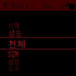

| 메뉴 | 하는 일 | 처음 사용할 때의 대표 경로 |
|---|---|---|
| Start(시작) | 초점, 카메라와 접안 중심 정렬, GPS 확인, INDI 연결 | Start(시작) → Focus(초점) |
| Chart(성도) | 현재 가리키는 하늘의 성도 표시 | Chart(성도) |
| Objects(천체) | 천체 목록, 검색, 관측 목록, 필터 | Objects(천체) → By Catalog(카탈로그별) → Messier |
| SQM | 카메라가 보는 하늘의 밝기 측정 | SQM |
| Settings(설정) | 화면, 카메라, 통신, INDI, 하드웨어 설정 | Settings(설정) → User Pref...(사용자...) |
| Tools(도구) | 상태, 장비, 위치와 시간, 업데이트, 전원 | Tools(도구) → Status(상태) |

**경로 읽는 법:** `Objects(천체) → By Catalog(카탈로그별) → Messier`는 각 이름을 선택하고 `→`로 들어가는 순서입니다. 메뉴 위치가 바뀌어도 이름을 따라가면 됩니다.

## 3 모든 메뉴에서 알아둘 공통 조작

### 3.1 버튼과 누르는 방법

이 문서의 `□`는 키패드의 사각형 버튼인 **SQUARE**를 뜻합니다. 짧게 누르기는 한 번 눌렀다 떼는 동작이고, 길게 누르기는 길게 누르기 기능이 실행될 때까지 유지하는 동작입니다.

| 버튼 | 목록 메뉴에서의 동작 | 다른 화면에서 알아둘 점 |
|---|---|---|
| ↑ / ↓ | 이전 / 다음 항목 선택 | 초점 화면에서는 노출 조절, 정렬 중에는 별이나 표시점 선택 |
| → | 선택한 메뉴 열기, 값 선택, 기능 실행 | 입력 화면에서는 다음 칸 또는 확정, 천체 상세에서는 관측 기록 |
| ← | 한 단계 돌아가기 | 입력·정렬 중에는 이전 칸이나 표시점 이동에 사용될 수 있음 |
| ← 길게 | 최상위 메뉴로 돌아가기 | 진행 중인 작업이 있다면 해당 화면의 취소 방법을 먼저 확인 |
| → 길게 | 최근 확인한 천체의 상세 화면 열기 | 최근 천체가 있을 때 동작하며, 상세 화면에서는 새 화면을 열지 않음 |
| □ 짧게 | 화면 종류에 따라 동작 | 보기 전환, 정렬 시작·확정 등. 일반 메뉴의 선택은 → 사용 |
| □ 길게 | 현재 화면의 퀵 메뉴 열기 / 닫기 | 퀵 메뉴가 있는 화면에서 사용 |
| + / − | 현재 화면의 기능 조절 | 성도 확대·축소, 설명 넘기기 등. 메뉴별 설명 확인 |
| □를 누른 채 + / − | LCD 밝게 / 어둡게 | Settings(설정)의 Key Bright(키 밝기)는 키패드 조명이며 LCD 밝기와 별개 |
| □를 누른 채 0 | 현재 LCD 화면 저장 | 문제를 문의할 때 화면을 남기는 용도로 사용 |

### 3.2 선택과 저장

**한 가지 값을 선택하는 메뉴:** `↑ / ↓`로 값을 고른 뒤 `→`를 누릅니다. 선택된 값의 표시를 확인합니다. 설정은 선택 시 적용되며, 메뉴에 따라 선택 후 이전 화면으로 돌아가거나 재시작합니다. `←`는 이전 값을 복원하는 버튼이 아닙니다.

**여러 값을 선택하는 메뉴:** 필터의 Catalogs(천체 목록)와 Type(종류)에서 `→`를 누를 때마다 해당 항목의 선택이 켜지거나 꺼집니다. 필요한 항목을 모두 고른 뒤 `←`로 나옵니다. Select All(전체 선택)과 Select None(선택 해제)은 현재 목록의 항목을 한꺼번에 선택하거나 해제합니다.

**확인 화면이 있는 기능:** Confirm(확인)을 선택하고 `→`를 눌러 실행합니다. Cancel(취소)을 선택하면 돌아갑니다. 모든 기능에 확인 화면이 있는 것은 아닙니다. INDI INIT(초기화)의 명령은 항목을 선택해 `→`를 누르면 전송됩니다.

### 3.3 퀵 메뉴와 도움말

`□`를 길게 누르면 현재 화면에 맞는 퀵 메뉴가 나타납니다. 표시된 방향의 버튼을 눌러 해당 기능을 사용합니다. 하위 퀵 메뉴가 열리면 `□`를 짧게 눌러 한 단계 닫고, 길게 눌러 전체를 닫습니다.

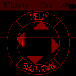

도움말이 제공되는 화면에서는 퀵 메뉴의 위쪽 **HELP**를 선택합니다. 도움말 안에서 `↑ / ↓`로 페이지를 넘기고 `←`, `→` 또는 `□`로 닫습니다. 화면에 따라 도움말 제공 여부가 다릅니다.

### 3.4 숫자키는 화면을 먼저 확인

숫자키는 같은 버튼이라도 화면에 따라 기능이 달라집니다. 천체 목록에서는 번호 검색, 입력 화면에서는 숫자 입력, 마운트 제어 화면에서는 이동에 사용합니다.

| 현재 화면 | 0의 의미 | □의 의미 |
|---|---|---|
| Objects(천체) → 천체 선택 · 천체 상세 | 마운트 이동·추적과 Goto/Guide(GoTo/Guide) 보정 정지 | 천체 보기 전환 |
| Start(시작) → INDI → Guide(가이드) | Guide Correction(가이드 보정) 전환 | 현재 방향으로 마운트 Sync |
| Start(시작) → Align(정렬)의 별 선택 중 | 선택 취소 | 선택한 별로 정렬 요청 |
| Start(시작) → Align (Day)(주간정렬) | 저장하지 않고 취소 / 종료 | 시작 또는 정렬 저장 |
| Settings(설정) → INDI Setting(INDI 설정) → Multi Align(멀티 정렬) · 조정 중 | 다점 정렬 취소 / 종료 | 현재 정렬점 확정 |
| SQM → 퀵 메뉴 CALIB → SQM Calibration(SQM 보정) | 단계에 따라 취소 또는 하늘 프레임 건너뛰기 | 다음 단계 / 종료 |

**Guide(가이드) 화면의 0은 전체 정지 버튼이 아닙니다.** 수동 방향키는 떼면 이동이 멈춥니다. 천체 상세 화면의 `0`은 이동과 추적까지 정지합니다.

## 4 Start(시작)에서 관측 준비하기

### 4.1 Focus(초점) 카메라 초점

**경로:** `Start(시작) → Focus(초점)` · **준비:** 렌즈 캡을 열고 카메라를 별이 있는 하늘로 향합니다.

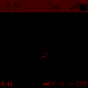
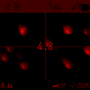
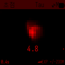
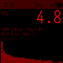

1. `□`를 짧게 눌러 Image, Stars, Single, Stats 보기를 순환합니다. Stars는 여러 별을, Single은 한 별을 확대해 초점을 확인하는 데 사용합니다.
2. 별이 잘 보이지 않으면 `↑`로 노출을 늘립니다. 너무 밝거나 별이 번지면 `↓`로 노출을 줄입니다.
3. Image, Stars, Single 보기에서 `+ / −`로 확대 정도를 바꿉니다.
4. 카메라 렌즈의 초점을 조금씩 조절합니다. 같은 별에서 HFD가 작아지고 별상이 모이는 위치를 찾습니다. HFD는 별빛이 얼마나 퍼졌는지 나타내는 값입니다.
5. `←`로 나옵니다. Focus(초점)에 머무는 동안 노출은 고정되며, 나가면 들어오기 전의 노출 설정으로 돌아갑니다.

게인을 바꾸려면 `□ 길게 → 오른쪽 Gain(이득)`을 선택합니다. 노출은 Focus(초점) 화면의 `↑ / ↓`로 조절합니다.

**완료 확인:** 별이 작고 또렷하게 보이고 HFD가 안정되는지 확인합니다. 망원경 접안렌즈의 초점은 별도로 맞춥니다.

### 4.2 Align(정렬) 밤하늘에서 관측 중심 정렬

**경로:** `Start(시작) → Align(정렬)` · **준비:** 솔빙이 되고 있어야 합니다. 망원경으로 밝은 별 하나를 접안렌즈 중앙에 놓습니다.

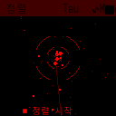
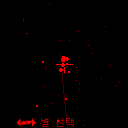
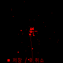

1. `□`를 눌러 별 선택을 시작합니다.
2. 방향키로 접안렌즈 중앙에 둔 것과 같은 별을 선택합니다. `+ / −`로 성도를 확대하거나 축소할 수 있습니다.
3. 다시 `□`를 눌러 정렬을 요청합니다.
4. 화면에 Aligned!(정렬 완료!) 또는 Alignment requested가 표시되는지 확인합니다. 요청 표시만으로 정렬 완료가 보장되지는 않으므로 이후 방향 표시도 확인합니다.
5. 별 선택 모드가 끝난 뒤 `←`로 나옵니다.

별 선택 중 `←`는 왼쪽 별을 고르는 동작입니다. 선택을 취소하려면 `0`을 누릅니다. `1`은 정렬점을 카메라 중앙으로 되돌립니다.

**완료 확인:** 다른 밝은 천체를 접안렌즈 중앙에 놓았을 때, 안내 중심과 실제 관측 중심이 맞는지 확인합니다. 이 정렬은 카메라와 접안 중심을 맞추는 기능입니다. INDI 마운트 다점 정렬은 9장에서 설명합니다.

### 4.3 Align (Day)(주간정렬) 낮에 관측 중심 정렬

**경로:** `Start(시작) → Align (Day)(주간정렬)` · **준비:** 멀리 있는 식별하기 쉬운 지상 물체를 접안렌즈 중앙에 놓습니다.

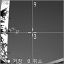
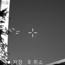

1. `□`로 시작합니다.
2. 화면에 보이는 목표가 있는 구역을 숫자키로 고릅니다. `7`은 좌상단, `9`는 우상단, `1`은 좌하단, `3`은 우하단입니다. 구역 선택은 최대 세 번 진행합니다.
3. 방향키를 한 번 누르면 미세 조정으로 전환됩니다. 이 첫 입력은 표시점을 움직이지 않습니다. 이후 방향키로 목표 지점에 표시점을 맞춥니다.
4. `□`로 저장합니다. 저장 후 이전 메뉴로 돌아갑니다.

`+ / −`는 이 화면에서 **노출**을 늘리거나 줄입니다. `0`으로 취소하면 새 정렬점을 저장하지 않습니다. 퀵 메뉴에서는 표시점을 중앙으로 되돌리거나 노출을 Auto(자동)로 바꿀 수 있습니다.

### 4.4 GPS Status(GPS 상태)

**경로:** `Start(시작) → GPS Status(GPS 상태)` 또는 `Tools(도구) → Place & Time(위치/시간) → GPS Status(GPS 상태)`

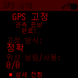

화면에서 GPS 위치 확보 상태와 위성 정보를 확인합니다. 위치가 잡히지 않으면 하늘이 열린 곳에서 기다립니다. GPS를 사용할 수 없는 장소에서는 11장의 수동 위치·시간 입력을 사용합니다. 확인 후 `←`로 나옵니다.

### 4.5 INDI

**경로:** `Start(시작) → INDI` · **표시 조건:** `Tools(도구) → Experimental(실험적) → Mount Control(가대 제어) → On(켜짐)`

STATUS(상태), INIT(초기화), Guide(가이드)로 구성됩니다. Mount Control(가대 제어) 변경 후 MFNavis가 재시작합니다. 연결, 자동 이동, 마운트 정렬과 Guide(가이드) 조작은 9장에서 설명합니다.

## 5 Chart(성도)에서 하늘 보기

**경로:** `Chart(성도)` · **준비:** 현재 방향이 확보되어 있어야 성도를 그릴 수 있습니다.

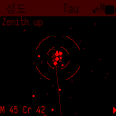

| 조작 | 화면에서 일어나는 일 |
|---|---|
| + | 성도 확대 |
| − | 성도 축소 |
| □ | 기본 시야 범위로 되돌리기 |
| → | 성도 중앙 천체의 상세 화면 열기 |
| ← | 이전 메뉴로 돌아가기 |
| □ 길게 | 성도 퀵 메뉴 열기 |

망원경을 움직이면 성도가 현재 방향에 맞춰 갱신됩니다. 성도의 방향, 십자선, 별자리 선, 심원천체 표시와 좌표는 `Settings(설정) → Chart...(성도...)`에서 조절합니다.

`→`로 상세 화면을 열려면 **Center Object(중앙 천체)가 On(켜짐)**이고, 성도 중앙에 선택할 천체가 있어야 합니다. No solve(해 없음)가 보이면 먼저 Focus(초점)와 솔빙 상태를 확인합니다. `→ 길게`는 성도 중앙 천체 대신 최근 확인한 천체를 엽니다.

## 6 Objects(천체)에서 천체 찾기

### 6.1 천체 목록 선택

| 메뉴 | 사용하는 방법 |
|---|---|
| All Filtered(필터 결과) | 현재 필터에 맞는 천체 전체를 엽니다. ↑ / ↓로 선택하고 →로 상세 화면을 엽니다. |
| By Catalog(카탈로그별) | 목록을 선택한 뒤 →로 엽니다. 자주 쓰는 Planets(행성), Comets(혜성), NGC, Messier와 DSO..., Stars...(별...)가 있습니다. |
| Recent(최근) | 이번 실행 중 확인한 천체를 다시 엽니다. 기록이 없으면 목록이 비어 있습니다. |
| Obs Lists(관측목록) | 미리 넣어 둔 관측 목록 파일을 선택해 →로 엽니다. 이어서 목록의 천체를 선택합니다. |
| Custom(사용자) | 카탈로그에 없는 목표의 RA와 Dec를 입력합니다. ↑ / ↓로 칸을 옮기고 숫자를 입력한 뒤 →로 확정합니다. |
| Name Search(이름 검색) | 이름을 입력하고 →로 검색 결과를 엽니다. 결과에서 천체를 선택합니다. |
| Set Filters(필터 설정) | 표시할 카탈로그, 천체 종류, 고도, 등급과 관측 여부를 선택합니다. |

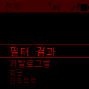

**카탈로그 그룹**

| 그룹 | 포함된 목록 |
|---|---|
| 바로 선택 | Planets(행성), Comets(혜성), NGC, Messier |
| DSO... | Abell Pn, Arp Galaxies(Arp 은하), Barnard, Caldwell, Collinder, E.G. Globs(E.G. 구상), Harris Globs(Harris 구상), Herschel 400, IC, Lynga Opn Cl(Lynga 산개), Messier, NGC, Sharpless, TAAS 200 |
| Stars...(별...) | Bright Named(밝은 별), SAC Doubles(SAC 이중성), SAC Asterisms(SAC 성군), SAC Red Stars(SAC 적색성), RASC Doubles(RASC 이중성), WDS Doubles(WDS 이중성), TLK 90 Variables(TLK 변광성) |

### 6.2 번호로 찾기와 목록 보기

카탈로그 목록에서 숫자키를 누르면 해당 번호에 가까운 천체로 이동합니다. 예를 들어 Messier 목록에서 `3`, `1`을 누른 뒤 **선택된 이름이 M31인지 확인하고** `→`를 누릅니다. 필터 때문에 목표가 숨겨지면 같은 번호가 선택되지 않을 수 있습니다.

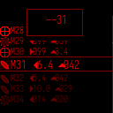

`□`는 목록의 보기 방식을 바꿉니다. 번호 입력 표시가 떠 있을 때는 `□`로 입력 표시를 지웁니다. `□ 길게 → 왼쪽 Sort(정렬)`에서 Nearest(가까운순) 또는 Standard(표준) 정렬을 고르고, 오른쪽 Filter(필터)로 필터 메뉴를 바로 열 수 있습니다. Comets(혜성) 목록의 퀵 메뉴에는 Refresh(새로고침)도 있습니다.

### 6.3 Name Search(이름 검색) 천체 이름 검색

**경로:** `Objects(천체) → Name Search(이름 검색)`

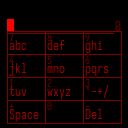

1. 화면의 문자 배치를 보며 숫자키로 이름을 입력합니다. Multi-Tap에서는 같은 키를 반복해 글자를 고릅니다. T9에서는 글자마다 해당 키를 한 번 누릅니다.
2. `−`로 마지막 글자를 지우고 `+`로 공백을 넣습니다. `□`로 문자 키 배치를 바꿉니다.
3. `→`를 눌러 결과 목록을 엽니다. `↑ / ↓`로 결과를 고르고 `→`로 상세 화면을 엽니다.
4. 결과 목록에서 검색 입력 화면으로 돌아온 뒤, 이름을 고쳐 다시 검색할 수 있습니다.

입력 방식은 `Settings(설정) → User Pref...(사용자...) → Search Input(입력 방식)`에서 바꿉니다. 외부 키보드의 문자 입력도 사용할 수 있습니다.

### 6.4 Set Filters(필터 설정) 필터 설정

**경로:** `Objects(천체) → Set Filters(필터 설정)`

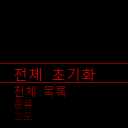
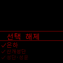

| 항목 | 조작과 효과 |
|---|---|
| Reset All(전체 초기화) | Confirm(확인) →로 필터를 기본 상태로 되돌립니다. Cancel(취소)은 돌아가기입니다. |
| Catalogs(천체 목록) | →로 여러 카탈로그를 선택 / 해제합니다. All Filtered(필터 결과)에 포함할 목록을 정합니다. |
| Type(종류) | →로 천체 종류를 선택 / 해제합니다. 은하, 성단, 성운, 별, 행성, 혜성 등에서 고릅니다. |
| Altitude(고도) | 최소 고도를 선택합니다. None(없음) 또는 0°, 10°, 20°, 30°, 40°입니다. |
| Magnitude(등급) | 표시할 최대 등급을 선택합니다. None(없음) 또는 6–15입니다. 등급 숫자가 클수록 더 어두운 천체를 포함합니다. |
| Observed(관측됨) | Any(전체), Observed(관측됨), Not Observed(미관측) 중 하나를 선택합니다. 관측 기록 여부로 목록을 좁힙니다. |

**Name Search(이름 검색)와 Recent(최근)는 일반 목록 필터의 영향을 받지 않습니다.** 관측 목록과 카탈로그에 원하는 천체가 보이지 않으면 필터부터 확인합니다. 고도 필터를 사용할 때는 관측 위치와 시간이 맞아야 합니다.

### 6.5 천체 상세 화면과 이동 안내

**경로:** `Objects(천체)의 천체 목록 → 천체 선택 → →`

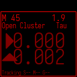
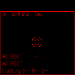
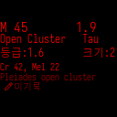

`□`를 누를 때마다 **이동 안내 → 카메라 → 천체 이미지 → 설명 → 대비 정보**가 순환합니다. 이동 안내에서 방향 화살표와 남은 각도를 보며 목표에 접근합니다.

| 조작 | 동작 |
|---|---|
| ↑ / ↓ | 현재 목록의 이전 / 다음 천체 |
| + / − | 카메라 보기에서는 확대 / 축소, 설명에서는 다음 / 이전 부분, 나머지 보기에서는 접안렌즈 변경 |
| → | 현재 방향이 확보되어 있으면 LOG(로그) 관측 기록 화면 열기 |
| ← | 목록으로 돌아가기 |
| 5 | 연결된 마운트로 선택 천체 GoTo 요청 |
| 0 | 마운트 이동·추적과 Goto/Guide(GoTo/Guide) 보정 정지 |
| 7 | 현재 확보된 방향으로 마운트 Sync 요청 |
| 1 | GoTo Type(자동 도입 유형) 전환 |
| 8 / 2 / 4 / 6 | 마운트 북 / 남 / 서 / 동 이동. 누르고 있는 동안 이동 |
| 9 / 3 | 마운트 수동 이동 속도 증가 / 감소 |

마운트 조작은 Mount Control(가대 제어)이 켜져 있고 마운트가 연결된 경우에 사용합니다. GoTo Type(자동 도입 유형)이 Off(꺼짐)이면 `5`로 이동하지 않습니다. 이동 요청 메시지를 본 뒤 실제 진행과 도착 상태도 확인합니다.

**Push 화면의 추적 테두리:** GoTo가 완료된 뒤 마운트가 현재 선택한 천체를 추적하고 있으면, 이동 안내와 카메라 보기의 제목 표시줄 아래 화면 외곽에 사각 테두리가 나타납니다.

- **표시 모양:** 검은 바깥 선과 밝은 안쪽 선을 나란히 그려 밝은 카메라 배경과 어두운 배경 모두에서 확인할 수 있습니다. 밝은 선은 화면의 색상 설정을 따르므로 야간 모드에서도 표시됩니다.
- **표시가 사라지는 경우:** 추적 정지, 새로운 GoTo나 수동 이동, 파크, 오류·연결 끊김, 최신 상태 정보를 확인할 수 없는 경우입니다. 추적 중인 천체와 다른 천체를 열어도 테두리는 표시되지 않습니다.
- **도착 확인:** 일반 GoTo 이동 중과 도착을 위한 펄스가이드 보정 중에는 테두리가 표시되지 않습니다. 완료 후에는 테두리로 추적 상태를 확인하고, 남은 각도와 하단 상태 표시도 함께 확인합니다.

선택한 천체로 접안 중심을 정렬하려면 그 천체를 접안 중앙에 놓고 `□ 길게 → 아래 ALIGN(정렬) → 오른쪽 ALIGN(정렬)`을 선택합니다. 하위 퀵 메뉴의 왼쪽 CANCEL(취소)은 돌아가기입니다. 이 ALIGN(정렬)은 카메라와 접안 중심 정렬이며 마운트 Sync와 구분합니다.

### 6.6 LOG(로그) 관측 기록

천체 상세에서 `→`로 LOG(로그)를 열고 `↑ / ↓`로 기록 항목을 고릅니다. 평가 항목에서는 `0–5`로 값을 입력하거나 `→`로 값을 순환합니다. 관측 조건과 접안렌즈 항목은 `→`로 선택 화면을 엽니다. 기록 저장 항목을 선택해 `→`를 누르면 Logged!(기록됨!) 표시 후 상세 화면으로 돌아갑니다.

Conditions(조건)에는 Transparency(투명도)와 Seeing(시상)이 있습니다. 각 항목에서 NA(해당없음), Excellent(최상), Very Good(매우 좋음), Good(좋음), Fair(보통), Poor(나쁨) 중 관측 당시의 상태를 골라 `→`로 적용합니다.

### 6.7 Custom(사용자) 좌표 직접 입력

**경로:** `Objects(천체) → Custom(사용자)`

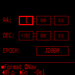

`↑ / ↓`로 입력 칸을 옮기고 숫자키로 RA와 Dec를 입력합니다. `−`로 숫자를 지우고, Dec의 도 단위 칸에서 `+`로 부호를 바꿉니다. Epoch 칸의 `+`는 좌표 기준 시점을 바꿉니다. `□`로 좌표 입력 형식을 바꿀 수 있습니다. 모든 값을 확인한 뒤 `→`로 확정하고, 저장하지 않고 나가려면 `←`를 누릅니다.

## 7 SQM으로 하늘 밝기 확인하기

**경로:** `SQM` · **의미:** 카메라가 향한 하늘의 밝기를 mag/arcsec² 단위로 표시합니다. 숫자가 클수록 하늘이 어둡습니다.

| 조작 | 동작 |
|---|---|
| □ | 측정 화면과 하늘 상태 설명 전환 |
| + / − | 설명 화면의 다음 / 이전 부분 |
| ← | 이전 메뉴로 돌아가기 |
| □ 길게 → 왼쪽 CALIB | SQM 보정 마법사 열기 |
| □ 길게 → 아래 SWEEP | 노출별 SQM 진단 측정 열기 |

달빛, 구름, 황혼과 카메라가 향한 고도가 측정값에 영향을 줍니다. 같은 장소의 변화를 비교할 때는 비슷한 방향과 조건에서 읽습니다. 기본 밝기 측정은 솔빙이 실패해도 계속될 수 있습니다. SQM에 들어가면 측정을 위한 노출 동작으로 바뀌고, 나오면 일반 노출 동작으로 돌아갑니다.

### 7.1 SQM Calibration(SQM 보정) 보정

**경로:** `SQM → □ 길게 → 왼쪽 CALIB → SQM Calibration(SQM 보정)`

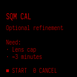

1. `CALIB`를 열고 `□`로 시작합니다.
2. 렌즈 캡을 닫으라는 안내가 나오면 캡을 닫고 `□`를 누릅니다. 프레임 수집이 끝날 때까지 기다립니다.
3. 렌즈 캡을 열라는 안내가 나오면 캡을 열고 `□`를 눌러 하늘 프레임을 수집합니다.
4. 분석과 결과를 확인하고 `□`로 나옵니다.

`0`은 시작 안내·캡 닫기 안내에서는 취소합니다. 캡 열기 안내와 하늘 프레임 수집 중에는 **하늘 프레임을 건너뛰고 분석으로 진행**합니다. 캡을 닫고 수집 중일 때의 `0`을 취소 버튼으로 사용하지 않습니다.

### 7.2 SQM Sweep 진단 측정

**경로:** `SQM → □ 길게 → 아래 SWEEP → SQM Sweep`

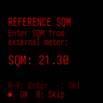

기준 SQM을 알고 있다면 네 자리 숫자로 입력합니다. 예를 들어 `2130`은 **21.30**입니다. `−`로 마지막 숫자를 지우고 `□`로 입력을 확정합니다. 기준값 없이 진행하려면 빈 입력에서 `0` 또는 `□`를 누릅니다.

확인 화면에서 `□`로 수집을 시작하고 완료 후 `□`로 나옵니다. 확인 화면의 `0`은 취소입니다. SWEEP은 노출에 따른 측정 변화를 확인하는 진단 기능입니다.

## 8 Settings(설정)에서 화면과 관측 설정 바꾸기

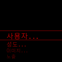

### 8.1 User Pref...(사용자...) 사용자 환경

**경로:** `Settings(설정) → User Pref...(사용자...) → 항목 → 값 선택 → →`

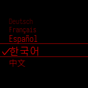

| 항목 | 선택값 | 사용하는 목적 |
|---|---|---|
| Key Bright(키 밝기) | −4–3 | 키패드 조명 밝기. LCD는 □를 누른 채 + / −로 조절 |
| Sleep Time(절전 시간) | Off(꺼짐), 10s, 20s, 30s, 1m, 2m | 입력이 없을 때 절전까지의 대기 시간 |
| Menu Anim(메뉴 효과) | Off(꺼짐), Fast(빠름), Medium(보통), Slow(느림) | 메뉴 이동 애니메이션 속도 |
| Scroll Speed(스크롤 속도) | Off(꺼짐), Fast(빠름), Medium(보통), Slow(느림) | 긴 문구가 흐르는 속도 |
| Search Input(입력 방식) | Multi-Tap, T9 | 이름 검색의 문자 입력 방식 |
| Az Arrows(방위 화살) | Default(기본), Reverse(반전) | 이동 안내의 방위각 화살표 방향 |
| Language(언어) | English(영어), German(Deutsch), French(Français), Spanish(Español), Korean(한국어), Chinese(中文) | UI 언어. 한국어는 Korean(한국어) 선택 |

### 8.2 Chart...(성도...) 성도 표시

**경로:** `Settings(설정) → Chart...(성도...) → 항목 → 값 선택 → →`

| 항목 | 선택값과 효과 |
|---|---|
| Coordinate Sys.(좌표계) | Horizontal(지평좌표)은 지평 기준, EQ (Auto)(적도(자동))는 적도 좌표 자동 방향, EQ (North-up)(적도(북위)) / EQ (South-up)(적도(남위))은 북쪽 / 남쪽 천구 극 방향을 위로 표시 |
| Reticle(십자선) | Off(꺼짐) / Low(낮음) / Medium(보통) / High(높음). 중심 십자선 밝기 |
| Constellation(별자리) | Off(꺼짐) / Low(낮음) / Medium(보통) / High(높음). 별자리 선 밝기 |
| DSO Display(DSO 표시) | Off(꺼짐) / Low(낮음) / Medium(보통) / High(높음). 심원천체 표시 밝기 |
| RA/DEC Disp.(RA/DEC 표시) | Off(꺼짐) / HH:MM / Degrees(도). 좌표 표시 방식 |
| Center Object(중앙 천체) | Off(꺼짐) / On(켜짐). 중앙 천체 이름 표시와 Chart(성도)의 → 상세 진입 |

위치가 아직 확보되지 않으면 위치가 필요한 성도 방향은 임시 방향으로 표시될 수 있습니다. GPS 위치가 잡힌 후 성도의 위쪽 방향을 다시 확인합니다.

### 8.3 Image...(이미지...) 천체 이미지 표시

`Settings(설정) → Image...(이미지...)`에서 **NSEW Labels(방위 표시)**를 On(켜짐)으로 켜면 방향 표시를, **Object Size(천체 크기)**를 On(켜짐)으로 켜면 천체 크기와 방향 윤곽을 표시합니다. Off(꺼짐)로 끌 수 있습니다. 항목을 열고 원하는 값을 `→`로 선택합니다.

### 8.4 Camera Exp(노출)와 Camera Gain(Gain)

| 경로 | 선택값 | 조작 |
|---|---|---|
| Settings(설정) → Camera Exp(노출) | Auto(자동), Star(항성), 0.025s, 0.05s, 0.1s, 0.2s, 0.4s, 0.8s, 1s | ↑ / ↓로 고르고 →로 적용. Auto(자동)와 Star(항성)는 자동 노출 방식이며 숫자는 고정 노출 시간 |
| Settings(설정) → Camera Gain(Gain) | Profile(설정 묶음), 1x, 2x, 4x, 8x, 12x, 15x, 16x, 20x, 22x, 24x, 30x | ↑ / ↓로 고르고 →로 적용. Profile(설정 묶음)은 카메라 프로필 기준값 사용 |

노출을 늘리면 더 많은 별을 담을 수 있지만 이동 중 별상이 길어질 수 있습니다. 카메라가 지원하는 실제 노출·게인 범위는 센서에 따라 다릅니다. Focus(초점)에서 조절한 임시 노출과 Settings(설정)의 관측용 노출 설정을 구분합니다.

### 8.5 WiFi Mode(WiFi 모드)와 Mount Type(가대 종류)

| 항목 | 사용하는 방법 | 완료 확인 |
|---|---|---|
| WiFi Mode(WiFi 모드) → Client Mode(Client 모드) | 기존 무선 네트워크에 연결하는 모드 선택 | Tools(도구) → Status(상태)에서 접속 주소 확인 |
| WiFi Mode(WiFi 모드) → AP Mode(AP 모드) | MFNavis가 직접 무선 접속점을 제공하는 모드 선택 | MFNavisAP에 연결 후 http://10.10.10.1 접속 |
| WiFi Mode(WiFi 모드) → AP+STA Mode(AP+STA 모드) | 접속점과 기존 네트워크 연결을 함께 사용하는 모드 선택 | Status(상태)에서 각 연결 상태 확인 |
| Mount Type(가대 종류) → Alt/Az(경위대) | 경위대식 망원경 선택 | MFNavis 재시작 후 값 확인 |
| Mount Type(가대 종류) → Equatorial(적도의) | 적도의식 망원경 선택 | MFNavis 재시작 후 값 확인 |

WiFi 모드를 바꾸면 휴대전화나 PC의 연결이 끊길 수 있습니다. 새 모드에 맞는 네트워크와 주소로 다시 접속합니다.

## 9 INDI 마운트 연결과 이동

**INDI MOUNT 세부 설정:** 스마트폰이나 PC에서 MFNavis 웹서버를 열고 **INDI**를 선택합니다. USB·네트워크 연결, 이동 한계, 다점 정렬, 백래시, GoTo·Guide와 SkySafari 설정을 할 수 있습니다. 접속 방법은 14.1, 연결 설정은 14.4, 나머지 설정은 14.5–14.7에 설명합니다.

### 9.1 마운트 제어 켜기

1. `Tools(도구) → Experimental(실험적) → Mount Control(가대 제어) → On(켜짐)`을 선택합니다. MFNavis가 재시작합니다.
2. `Start(시작) → INDI → INIT(초기화) → Connect(연결)`로 연결을 요청합니다.
3. `Start(시작) → INDI → STATUS(상태)`에서 마운트 연결, 좌표, 추적과 Home / Park(파크) 상태를 확인합니다.
4. 위치와 시간이 준비되면 `INIT(초기화) → Set Location(위치 설정)`으로 마운트에 위치와 시간을 보냅니다.
5. Park(파크) 상태인 마운트를 사용하려면 `INIT(초기화) → Unpark(언파크)` 후 상태를 확인합니다.

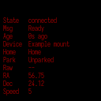

Mount Control(가대 제어)이 Off(꺼짐)이면 `Start(시작) → INDI`와 `Settings(설정) → INDI Setting(INDI 설정)`이 숨겨집니다. 처음 연결하거나 연결 방식을 바꿀 때는 웹 **INDI → LX200 OnStepX Driver Connection(LX200 OnStepX 드라이버 연결)**에서 연결 정보를 먼저 설정합니다(14.4). 제목에는 현재 드라이버 이름이 함께 표시됩니다. LCD에 연결 요청 메시지가 떠도 STATUS(상태)에서 연결 성공 여부를 확인합니다.

### 9.2 INIT(초기화) 명령

**경로:** `Start(시작) → INDI → INIT(초기화) → 항목 선택 → →`

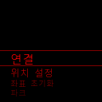

| 항목 | 하는 일 | 실행 후 확인 |
|---|---|---|
| Connect(연결) | INDI 마운트 연결과 초기화 요청 | STATUS(상태)의 연결과 좌표 |
| Set Location(위치 설정) | 현재 위치와 시간을 마운트에 전송 | 위치·시간 동기화 상태와 오류 알림 |
| Reset Pointing(좌표 초기화) | 현재 방향 좌표의 기준을 다시 구성하도록 요청 | 갱신된 방향 표시 |
| Park(파크) | 설정된 주차 위치로 이동 요청 | STATUS(상태)의 Park(파크) 상태 |
| Unpark(언파크) | 주차 해제 요청 | STATUS(상태)의 Unpark(언파크) 상태 |
| Set Home(홈 설정) | 현재 위치를 Home으로 설정 요청 | Home 상태와 장비 응답 |
| Return Home(홈으로 복귀) | Home으로 이동 요청 | 이동 완료와 Home 상태 |
| Set-Park(파크 위치 설정) | 현재 위치를 주차 위치로 설정 요청 | 장비 응답과 주차 설정 |
| Restart INDI(INDI 재시작) | INDI 드라이버 재시작 요청 | 재연결과 좌표 수신 |

지원 여부는 마운트와 드라이버에 따라 다릅니다. Park(파크)와 Return Home(홈으로 복귀)은 실제 망원경을 움직일 수 있으므로 이동 경로를 확인하고 실행합니다.

### 9.3 Guide(가이드) 수동 이동과 Sync

**경로:** `Start(시작) → INDI → Guide(가이드)`

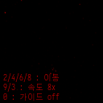

| 조작 | Guide(가이드)에서의 동작 |
|---|---|
| 8 / 2 / 4 / 6 누르고 유지 | 북 / 남 / 서 / 동 이동. 버튼을 떼면 수동 이동 정지 |
| 9 / 3 | 수동 이동 속도 증가 / 감소 |
| □ | 현재 확보된 하늘 방향으로 마운트 Sync |
| 0 | Guide Correction(가이드 보정) 전환 |
| ← | 이전 메뉴로 돌아가기. 화면을 떠나면 수동 이동 정지 |

외부 문자 키보드로는 `q / w / e`, `a / s / d`, `z / x / c`를 방향 패드처럼 사용할 수 있습니다. `s`는 수동 이동 정지, `, / .`는 속도 감소 / 증가입니다. 사용자 키 매핑을 바꾸면 실제 동작도 달라질 수 있습니다.

Sync에 사용할 현재 방향이 없으면 No solve(해 없음)가 표시됩니다. **Guide(가이드)의 □는 표시 화면 전환이 아니라 Sync 명령**입니다.

### 9.4 Multi Align(멀티 정렬) 다점 정렬

**경로:** `Settings(설정) → INDI Setting(INDI 설정) → Multi Align(멀티 정렬)`

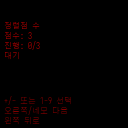
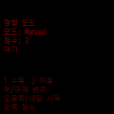

1. 정렬점 수를 숫자키 또는 `+ / −`로 조절합니다. `→` 또는 `□`로 다음 단계에 갑니다.
2. Manual(수동) / Auto(자동)를 `↑ / ↓`로 고른 뒤 `→` 또는 `□`로 시작합니다. 이 단계에서는 `1`로 Manual(수동), `2`로 Auto(자동)를 바로 시작할 수도 있습니다.
3. Manual(수동)에서는 `↑ / ↓`로 별을 고르고 `→` 또는 `□`로 해당 별에 이동합니다. Auto(자동)에서는 준비와 이동이 진행되는 동안 안내를 확인합니다.
4. 조정 화면에서는 마운트 방향 입력으로 별을 중심에 놓습니다. `9 / 3`으로 이동 속도를 조절하고 **□로 현재 정렬점을 확정**합니다.
5. 필요한 점을 완료하고 완료 상태를 확인합니다.

조정 중 `←`는 수동 모드에서는 별 선택으로 돌아가며, 자동 모드에서는 진행을 취소하고 모드 선택으로 돌아갑니다. 조정 단계의 `0`은 정렬을 취소하고 나옵니다. 별 목록과 자동 시작은 위치·시간, 솔빙, 사용 가능한 별과 마운트 상태의 영향을 받습니다.

### 9.5 Backlash(백래시) 백래시

**경로:** `Settings(설정) → INDI Setting(INDI 설정) → Backlash(백래시)`

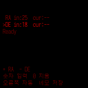

`+`로 RA 축, `−`로 DE 축을 선택합니다. 숫자키로 값을 입력하고 `□`로 두 축의 값을 전송합니다. `→`는 선택한 축의 자동 백래시 측정을 요청합니다. 입력 범위는 0–999이며 `0`은 선택 축의 입력을 지웁니다. **이 화면에서 숫자 0은 자릿수 입력이 아닙니다.** 장비가 제공하는 값과 단위, 자동 측정 지원 여부를 함께 확인합니다.

### 9.6 Goto/Guide(GoTo/Guide) 설정

**경로:** `Settings(설정) → INDI Setting(INDI 설정) → Goto/Guide(GoTo/Guide) → 항목 → 값 선택 → →`

| 항목 | 선택값 | 의미 |
|---|---|---|
| GoTo Type(자동 도입 유형) | Off(꺼짐) / INDI Mount(INDI 가대) / MFNavis | 자동 이동 끄기 / 마운트의 GoTo 사용 / MFNavis의 좌표 기반 이동·보정 사용 |
| Tracking Guide(추적 가이드) | Off(꺼짐) / On(켜짐) | 추적 중 목표 위치를 보정하는 기능 |
| GoTo Recovery(GoTo 복구) | Off(꺼짐) / On(켜짐) | 목표에서 크게 벗어났을 때 GoTo로 복귀하는 기능 |
| Recovery Range | 0.25°, 0.5°, 1°, 2°, 3° | GoTo 복구 판단에 사용하는 이탈 각도 |
| Manual Re-target(수동 재타겟) | Off(꺼짐) / On(켜짐) | 수동 이동 후 추적 목표를 새 방향으로 갱신하는 기능 |
| Max GoTos(최대 GoTo 횟수) | 3, 5, 10, 15, 20 | MFNavis GoTo에서 허용하는 반복 이동 횟수 |
| Invert Guide RA/Az(가이드 RA/Az 반전) | Off(꺼짐) / On(켜짐) | RA / 방위각 보정 방향 반전 |
| Invert Guide Dec/Alt(가이드 Dec/Alt 반전) | Off(꺼짐) / On(켜짐) | Dec / 고도 보정 방향 반전 |

보정 방향을 바꾼 뒤에는 작은 이동에서 목표 오차가 줄어드는지 확인합니다. Manual Re-target(수동 재타겟)은 추적 목표를 바꾸는 기능이며, 천체 상세 화면에서 선택한 천체를 자동으로 바꾸는 기능은 아닙니다.

## 10 Settings(설정)에서 장비 설정하기

### 10.1 Advanced(고급) 하드웨어와 입력장치

**경로:** `Settings(설정) → Advanced(고급)`

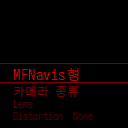

| 항목 | 조작과 확인 |
|---|---|
| MFNavis Type(MFNavis형) | 실제 조립 방향인 Left(왼쪽), Right(오른쪽), Straight(직선형), Flat v3, Flat v2, AS Bloom 중 선택하고 →. MFNavis 재시작 후 화면 방향 확인 |
| Camera Type(카메라 종류) | 장착한 센서 선택 후 →. IMX678 (Auto(자동)), v2 - imx477, v3 - imx296 Mono(v3 - imx296 모노), v3 - imx296 Color(v3 - imx296 컬러), v3 - imx462 Mono(v3 - imx462 모노), v3 - imx462 Color(v3 - imx462 컬러). 센서 변경은 재부팅, 일부 변형 변경은 소프트웨어 재시작을 수반하므로 화면 안내 확인 |
| Lens | 아래의 렌즈 선택·자동 측정 절차 사용 |
| Distortion | 아래의 왜곡 보정 절차 사용 |
| GPS Settings(GPS 설정) | GPS Type(GPS 종류), GPS Baud Rate(GPS Baud), GPS Port(GPS 포트)를 실제 수신기에 맞게 선택 |
| Time Sync(시간 동기화) | 시간 동기화와 사용할 시간 소스 설정 |
| Bluetooth(블루투스) | 검색·페어링·재연결로 외부 입력장치 연결 |
| Joystick(조이스틱) | 버튼 테스트와 기능별 버튼 지정 |
| Keyboard | 키 테스트와 기능별 키 지정 |
| WiFi Recover(WiFi 복구) | Confirm(확인) →로 WiFi 복구 요청, Cancel(취소)로 돌아가기 |

카메라 Mono / Color는 센서의 흑백·컬러 종류를 뜻합니다. 화면에 색을 표시할지 고르는 옵션이 아닙니다.

### 10.2 Lens 렌즈 선택과 측정

**경로:** `Settings(설정) → Advanced(고급) → Lens`

| 선택 | 사용하는 방법 |
|---|---|
| 4mm, 6mm, 8mm, 10mm, 12mm, 16mm, 25mm | 카메라 렌즈의 초점거리에 맞는 값을 골라 → |
| Manual(수동) (mm) | 수동 초점거리 입력 화면에서 값을 입력하고 ←로 확정. −로 마지막 글자를 지우고, □로 문자 키 배치를 바꿔 숫자와 소수점을 입력 |
| Auto(자동) (Measure) | →로 측정 시작. 별이 보이고 솔빙할 수 있는 하늘을 향한 채 진행 상태를 확인 |

자동 측정은 유효한 프레임을 수집하고 결과를 평가합니다. 완료 후 측정된 초점거리를 확인합니다. 진행 중 `←`, `□` 또는 `0`으로 취소하고 나올 수 있습니다. **렌즈 값은 MFNavis 카메라 렌즈의 값**이며, 망원경의 초점거리는 Equipment(관측 장비)에서 관리합니다.

### 10.3 Distortion 왜곡 보정

**경로:** `Settings(설정) → Advanced(고급) → Distortion`

1. Status(상태)를 선택해 현재 카메라·렌즈의 보정 상태를 확인합니다.
2. 별이 보이는 하늘을 향하고 Measure Sky를 선택해 `→`로 측정합니다.
3. 진행 화면에서 수집 상황과 결과를 확인합니다. 완료 후 Status(상태)에서 적용 상태를 확인합니다.
4. 진행 중 `←`, `□` 또는 `0`으로 취소하고 나옵니다. 메뉴의 Cancel(취소) Measurement로도 취소를 요청할 수 있습니다.

Reset은 Confirm(확인)을 선택하면 해당 보정을 초기화합니다. Cancel(취소)은 돌아갑니다. 렌즈나 카메라를 바꾼 경우 현재 조합의 보정 상태를 다시 확인합니다.

### 10.4 GPS Settings(GPS 설정)와 Time Sync(시간 동기화)

| 경로 | 선택값과 조작 |
|---|---|
| GPS Settings(GPS 설정) → GPS Type(GPS 종류) | UBlox / GPSD (generic)(GPSD) 중 선택 후 →. MFNavis 재시작 |
| GPS Settings(GPS 설정) → GPS Baud Rate(GPS Baud) | 9600 (standard) / 115200 (UBlox-10) 중 수신기에 맞는 속도 선택 후 → |
| GPS Settings(GPS 설정) → GPS Port(GPS 포트) | Auto(자동) 또는 실제 연결 포트 선택 후 →. ttyAMA1, ttyAMA2, ttyAMA3, serial0, ttyAMA0, ttyAMA10, ttyS0, ttyACM0, ttyUSB0 |
| Time Sync(시간 동기화) → Time Sync(시간 동기화) | Off(꺼짐) / On(켜짐)으로 시간 동기화 기능 선택 |
| Time Sync(시간 동기화) → Chrony Source(Chrony 소스) | Off(꺼짐) / On(켜짐)으로 Chrony 시간 소스 사용 선택 |
| Time Sync(시간 동기화) → GPS Source(GPS 소스) | Off(꺼짐) / On(켜짐)으로 GPS 시간 소스 사용 선택 |
| Time Sync(시간 동기화) → RTC Sync(RTC 동기화) | Off(꺼짐) / On(켜짐)으로 RTC 동기화 선택 |

적용 후 `Tools(도구) → Place & Time(위치/시간) → GPS Status(GPS 상태) / Time Sync(시간 동기화)`에서 수신과 동기화 상태를 확인합니다. 잘못된 포트나 속도를 선택하면 GPS 정보를 받을 수 없습니다.

### 10.5 Bluetooth(블루투스) 입력장치 연결

1. `Settings(설정) → Advanced(고급) → Bluetooth(블루투스)`를 열고 외부 키보드를 페어링 대기 상태로 둡니다.
2. Scan을 선택해 `→`를 누릅니다. 장치 목록에서 사용할 장치를 골라 `→`로 작업 메뉴를 엽니다.
3. Pair+Connect(페어+연결)를 선택해 `→`를 누르고, 화면에 표시되는 페어링 안내를 따릅니다.
4. 연결 상태를 확인하고 실제 키 입력을 시험합니다.

Reconnect(재접속)는 기존 장치 재연결, Refresh(새로고침)는 목록 갱신입니다. 장치 작업 메뉴의 Connect(연결) / Disconnect(연결 해제)는 연결 / 해제, Pair Again(다시 페어)은 다시 페어링, Remove(제거)는 등록 제거입니다. `←`로 작업 메뉴나 페어링을 닫을 수 있습니다.

### 10.6 Joystick(조이스틱)과 Keyboard 버튼 지정

| 화면 | 사용하는 방법 |
|---|---|
| Joystick(조이스틱) | Test Buttons(버튼 확인) →로 버튼을 확인합니다. 기능 항목을 고르고 →, 연결된 장치의 원하는 버튼을 눌러 지정합니다. |
| Keyboard | Test Keys →로 키를 확인합니다. 기능 항목을 고르고 →, 원하는 외부 키를 눌러 지정합니다. |

테스트 화면과 지정 대기에서는 `←`로 메뉴에 돌아갑니다. **Clear All(전체 지우기)은 →를 누르면 해당 사용자 매핑을 지웁니다.** 지정 후 메뉴의 표시가 바뀌었는지 확인하고 실제 화면에서 동작을 시험합니다.

### 10.7 IMU Settings(IMU 설정) 움직임 센서

**경로:** `Settings(설정) → IMU Settings(IMU 설정)`

| 항목 | 조작과 효과 |
|---|---|
| Sensitivity(감도) | Off(꺼짐) / Very Low(아주 낮음) / Low(낮음) / Medium(보통) / High(높음) 중 선택. 망원경 움직임 감지 민감도이며 변경 후 MFNavis 재시작 |
| Compass(나침반) | Off(꺼짐) / On(켜짐) 선택. 센서의 나침반 기능 사용 여부이며 변경 후 MFNavis 재시작 |
| Calibration(캘리브레이션) → Save(저장) | 현재 센서 보정값 저장 요청 |
| Calibration(캘리브레이션) → Load(불러오기) | 저장한 센서 보정값 불러오기 요청 |
| Calibration(캘리브레이션) → Clear(지우기) | 저장한 센서 보정값 삭제 요청 |

각 작업은 항목을 선택해 `→`로 실행합니다. 실제 센서가 장착되어 있어야 관련 기능을 사용할 수 있습니다.

## 11 Tools(도구)에서 상태 확인과 관리하기

### 11.1 Status(상태)

**경로:** `Tools(도구) → Status(상태)`

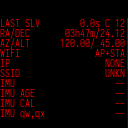

현재 솔빙, 위치, 통신과 장비 상태를 확인합니다. WiFi 모드를 바꾼 뒤에는 접속 주소를 확인합니다. 문제가 생기면 Status(상태)와 해당 기능의 상태 화면을 함께 확인하고 `←`로 돌아갑니다.

### 11.2 Equipment(관측 장비) 망원경과 접안렌즈

**경로:** `Tools(도구) → Equipment(관측 장비)`

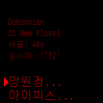

`↑ / ↓`로 망원경 또는 접안렌즈 행을 고르고 `→`로 선택 목록을 엽니다. 사용할 장비를 선택해 `→`를 누른 뒤 Equipment(관측 장비) 화면으로 돌아와 배율과 시야를 확인합니다. 목록은 저장된 장비 구성에 따라 달라집니다. 장비 등록·수정은 웹의 장비 관리 화면에서 합니다.

### 11.3 Place & Time(위치/시간) 위치와 시간

**경로:** `Tools(도구) → Place & Time(위치/시간)`

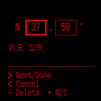
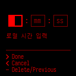

| 항목 | 사용하는 방법 |
|---|---|
| GPS Status(GPS 상태) | 위치 확보 상태와 위성 정보를 확인하고 ←로 돌아갑니다. |
| Time Sync(시간 동기화) | 시간 동기화 상태를 확인합니다. 설정은 Settings(설정) → Advanced(고급) → Time Sync(시간 동기화)입니다. |
| Set Location(위치 설정) → Enter Coords(좌표 입력) | 위도 → 경도 → 고도 순으로 입력합니다. 숫자키로 입력하고 →로 다음 칸과 다음 화면에 갑니다. 마지막 고도까지 확정하면 위치가 적용됩니다. |
| Set Location(위치 설정) → Load Location(위치 불러오기) | 저장된 장소를 ↑ / ↓로 고르고 →로 작업 메뉴를 엽니다. Load(불러오기)를 골라 →로 불러옵니다. 불러온 장소는 기본 장소로도 설정됩니다. |
| Set Location(위치 설정) → Save Location(위치 저장) | 현재 위치를 저장할 이름 입력 화면을 엽니다. 이름을 입력한 뒤 ←로 확정합니다. |
| Set Time/Date(시간/날짜) | 위치를 먼저 확보한 뒤 현지 시각을 입력하고 →로 날짜 입력에 갑니다. 날짜까지 확정해야 시각과 날짜가 적용됩니다. |
| Reset Location(위치 초기화) | 현재 위치를 초기화합니다. 이후 GPS 또는 수동 입력으로 다시 확보합니다. |
| Reset Time/Date(시간 초기화) | 현재 시각·날짜 상태를 초기화합니다. 이후 시간 소스나 수동 입력으로 다시 설정합니다. |

좌표 입력에서는 `+`로 부호를 바꾸고 화면의 N / S, E / W 표시를 확인합니다. `−`는 현재 칸의 마지막 숫자를 지웁니다. 숫자 입력 화면의 `←`는 이전 칸으로 이동하며, 첫 칸에서 누르면 취소합니다. **위치가 확보되지 않으면 시간 입력 화면이 진행되지 않습니다.** 시간은 관측 장소의 현지 시각을 사용합니다.

저장된 장소의 작업 메뉴에서는 Rename(이름변경)으로 이름을 바꾸고, Delete(삭제)로 장소를 삭제할 수 있습니다. Rename(이름변경)의 이름 입력은 `←`로 확정합니다. Delete(삭제)는 선택 후 `→`를 누르면 삭제되며, `←`는 작업 메뉴를 닫습니다.

### 11.4 Console와 Software Upd(SW 업데이트)

**Console:** `Tools(도구) → Console`에서 장비의 메시지를 확인합니다. `↑ / ↓`로 이전 / 최근 메시지를 읽고 `←`로 돌아갑니다. 숫자키는 시험 동작에 쓰이며 시간 상태도 바꾸므로, 실제 관측 중 메시지를 읽을 때는 방향키를 사용합니다.

**Software Upd(SW 업데이트):** 인터넷에 연결된 상태에서 `Tools(도구) → Software Upd(SW 업데이트)`를 엽니다. 업데이트가 제시되면 `↑ / ↓`로 실행 또는 Cancel(취소)을 선택하고 `→`로 진행합니다. 업데이트가 없거나 릴리즈 정보를 가져오지 못하면 업데이트가 시작되지 않습니다. OS 이전 확인 화면이 나오면 표시된 조건을 확인한 뒤 진행합니다. 설치 중에는 전원을 유지합니다.

### 11.5 Test Mode(테스트 모드)

**경로:** `Tools(도구) → Test Mode(테스트 모드)`

저장된 이미지로 동작을 확인하는 실내 시연·점검용 모드입니다. 항목을 선택해 `→`로 실행합니다. 실제 하늘 대신 시험 이미지를 사용하므로 관측을 시작하기 전에 시험 모드가 아닌지 확인합니다.

### 11.6 Experimental(실험적)

| 항목 | 사용하는 방법 |
|---|---|
| Polar Align(극축정렬) | 적도 장치의 극축 정렬 보조. 아래 절차 사용 |
| Mount Control(가대 제어) | Off(꺼짐) / On(켜짐)을 →로 선택합니다. MFNavis 재시작 후 INDI 메뉴 표시가 달라집니다. |
| Dev Tools(개발도구) → Telemetry → Record(기록) | Off(꺼짐) / On(켜짐)으로 좌표·센서 기록을 끄거나 켭니다. |
| Dev Tools(개발도구) → Telemetry → Images(이미지) | Off(꺼짐) / On(켜짐)으로 이미지 기록 여부를 정합니다. |
| Dev Tools(개발도구) → Telemetry → Load(불러오기) | 저장한 기록을 골라 →로 재생합니다. 재생을 끝내려면 같은 목록의 Stop replay(리플레이 중지)를 선택해 →를 누릅니다. 문제 재현·진단용 기능입니다. |

**Polar Align(극축정렬) 경로:** `Tools(도구) → Experimental(실험적) → Polar Align(극축정렬)`

`□`로 안내를 시작합니다. 적도 장치를 회전시키며 각 위치에서 멈춘 뒤 `□`로 솔빙 측정을 요청합니다. 필요한 측정이 끝나면 표시된 고도·방위각 보정량을 보며 장치의 극축 조절기를 조정합니다. `−`는 측정 대기 중 해당 수집을 취소하고, 다른 진행 단계에서는 초기화합니다. 두 점 이상 수집한 AIM 단계에서 `0`으로 계산할 수도 있습니다. 보정 화면의 `□`는 새 측정을 시작하므로 결과를 확인한 뒤 누릅니다.

### 11.7 Power(전원) 종료와 재시작

| 하려는 일 | 경로와 조작 |
|---|---|
| 종료 | Tools(도구) → Power(전원) → Shutdown(종료) → Confirm(확인) → |
| 재시작 | Tools(도구) → Power(전원) → Restart(재시작) → Confirm(확인) → |
| 실행하지 않고 돌아가기 | 각 확인 화면에서 Cancel(취소) → |

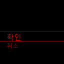

Shutdown(종료)은 정상 종료, Restart(재시작)는 시스템 재시작입니다. 종료 요청을 보낸 직후 전원을 끄지 말고 종료가 끝날 때까지 기다립니다.

## 12 문제가 생겼을 때

### 12.1 오류 화면 닫기

LCD 오류 알림은 확인할 때까지 남아 있습니다. 긴 내용은 `↑ / ↓`로 읽고 `←`, `→` 또는 `□`로 닫습니다. 알림을 닫으면 이전 화면으로 돌아가며, **닫기 조작은 실패한 명령을 다시 실행하지 않습니다.** 원인을 확인한 후 필요한 작업을 직접 다시 요청합니다.

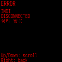

### 12.2 증상별 확인 순서

| 증상 | 확인과 조치 |
|---|---|
| 메뉴에서 돌아갈 수 없음 | 입력·정렬 중인지 확인. 해당 화면의 취소 동작 사용. 일반 탐색에서는 ← 길게로 최상위 메뉴 |
| 별이 보이지 않음 | 렌즈 캡과 하늘 방향 확인 → Focus(초점)에서 노출과 초점 확인 |
| No solve(해 없음)가 표시됨 | Focus(초점)에서 별상 확인 → 카메라·렌즈 설정 확인 → Status(상태) 확인 |
| 천체가 목록에 없음 | Name Search(이름 검색)로 검색 → Set Filters(필터 설정)의 고도·등급·종류 확인 → 필요하면 Reset All(전체 초기화) |
| 성도에서 →가 동작하지 않음 | Center Object(중앙 천체)가 On(켜짐)인지, 솔빙과 중앙 천체가 있는지 확인 |
| INDI 메뉴가 없음 | Tools(도구) → Experimental(실험적) → Mount Control(가대 제어)이 On(켜짐)인지 확인 |
| GoTo가 시작되지 않음 | 상세 화면에서 목표 선택 여부 → GoTo Type(자동 도입 유형)이 Off(꺼짐)인지 → INDI STATUS(상태)의 연결·Park(파크) 상태 → 오류 알림 확인 |
| 이동 후 방향이 맞지 않음 | 카메라·접안 중심 정렬, 위치·시간, Mount Type(가대 종류) 확인. 필요하면 INDI 마운트 정렬 상태 확인 |
| GPS가 잡히지 않음 | 하늘이 열린 위치 확인 → GPS Type(GPS 종류) / Baud Rate / Port 확인 → 필요하면 수동 위치·시간 입력 |
| 시간 입력이 진행되지 않음 | 관측 위치부터 확보. 현지 시각과 날짜를 함께 확정 |
| WiFi 변경 후 접속이 끊김 | 새 모드의 네트워크에 재연결 → Status(상태)의 주소 확인 → 필요하면 WiFi Recover(WiFi 복구) 사용 |
| 외부 키가 예상과 다르게 동작 | Keyboard / Joystick(조이스틱)의 테스트와 매핑 확인. 숫자키를 쓰는 현재 화면도 확인 |

문의할 때는 오류 내용, 현재 메뉴 경로, 하려던 동작, 소프트웨어 버전과 사용한 마운트·카메라를 함께 기록합니다. `□를 누른 채 0`으로 화면을 남길 수 있습니다.

## 13 자주 쓰는 경로 찾아보기

| 하려는 일 | 메뉴 경로 | 설명 |
|---|---|---|
| 카메라 초점 맞추기 | Start(시작) → Focus(초점) | 4.1 |
| 접안 중심 정렬 | Start(시작) → Align(정렬) / Align (Day)(주간정렬) | 4.2–4.3 |
| 성도 확대·축소 | Chart(성도) → + / − | 5 |
| M31 찾기 | Objects(천체) → By Catalog(카탈로그별) → Messier → 3, 1 → 이름 확인 → → | 6.2 |
| 천체 이름 검색 | Objects(천체) → Name Search(이름 검색) | 6.3 |
| 천체 목록 필터 변경 | Objects(천체) → Set Filters(필터 설정) | 6.4 |
| 관측 기록 남기기 | 천체 상세 → → → LOG(로그) | 6.6 |
| 하늘 밝기 측정 | SQM | 7 |
| LCD 밝기 조절 | □를 누른 채 + / − | 3.1 |
| 한국어 UI 사용 | Settings(설정) → User Pref...(사용자...) → Language(언어) → Korean(한국어) | 8.1 |
| 카메라 노출·게인 변경 | Settings(설정) → Camera Exp(노출) / Camera Gain(Gain) | 8.4 |
| 마운트 연결·상태 확인 | Start(시작) → INDI → INIT(초기화) / STATUS(상태) | 9.1–9.2 |
| 마운트 수동 이동 | Start(시작) → INDI → Guide(가이드) | 9.3 |
| 마운트 다점 정렬 | Settings(설정) → INDI Setting(INDI 설정) → Multi Align(멀티 정렬) | 9.4 |
| 자동 이동 방식 변경 | Settings(설정) → INDI Setting(INDI 설정) → Goto/Guide(GoTo/Guide) → GoTo Type(자동 도입 유형) | 9.6 |
| 렌즈 자동 측정 | Settings(설정) → Advanced(고급) → Lens → Auto(자동) (Measure) | 10.2 |
| 외부 입력장치 설정 | Settings(설정) → Advanced(고급) → Bluetooth(블루투스) / Joystick(조이스틱) / Keyboard | 10.5–10.6 |
| 망원경·접안렌즈 선택 | Tools(도구) → Equipment(관측 장비) | 11.2 |
| 위치·시간 수동 입력 | Tools(도구) → Place & Time(위치/시간) | 11.3 |
| 정상 종료 | Tools(도구) → Power(전원) → Shutdown(종료) → Confirm(확인) | 11.7 |
| 웹 접속과 원격 키패드 | 웹 Home(홈) / Remote(원격 조작) | 14.1–14.2 |
| INDI MOUNT 연결·세부 설정 | 웹 INDI | 14.4–14.7 |

## 14 웹 화면 사용하기

웹페이지는 스마트폰·태블릿·PC의 브라우저에서 사용합니다. 큰 화면으로 LCD를 보거나 원격 키패드를 누르고, 천체를 검색하고, INDI MOUNT·관측지·장비·네트워크를 설정할 수 있습니다. 아래 그림은 현재 웹페이지의 실제 화면 캡처이며, IP·장비 목록과 상태값은 설명용 예시입니다.

### 14.1 접속과 공통 조작

1. 스마트폰이나 PC를 MFNavis와 같은 네트워크에 연결합니다. AP 모드의 기본 구성은 **MFNavisAP**에 연결한 뒤 **http://10.10.10.1**을 여는 방식입니다. AP 이름이나 주소를 변경했다면 변경한 값을 사용합니다.
2. Client(무선 연결) 모드에서는 LCD `Tools(도구) → Status(상태)`에서 장비 IP를 확인하고 `http://장비-IP`를 엽니다. 개발용으로 8080 포트에서 실행 중이면 주소 뒤에 `:8080`을 붙입니다.
3. 설정·제어 페이지에서 Login(로그인)이 나오면 장비에 설정된 비밀번호로 로그인합니다. 웹 로그인은 MFNavis 서비스를 실행하는 시스템 사용자 계정의 비밀번호를 사용합니다.
4. 상단 메뉴에서 페이지를 선택합니다. 스마트폰에서는 **☰**를 눌러 같은 메뉴를 엽니다. 화면 위의 언어 선택에서 English(영어) / Korean(한국어)를 선택할 수 있습니다. 웹 언어와 LCD 언어는 별도로 설정합니다.
5. 각 입력 영역의 저장·적용 버튼을 누르고 결과 메시지와 현재 값을 확인합니다. 여러 설정 영역이 있는 INDI 페이지에서는 **해당 영역의 적용 버튼**을 사용합니다.

상단에는 전체 화면과 웹 테마 선택도 있습니다. 화면 하단의 **User manual(사용자 매뉴얼)**에서 한국어·English 매뉴얼을 열 수 있으며, 로그인 전에도 사용할 수 있습니다. 매뉴얼 상단의 언어 선택은 같은 장을 유지합니다.

| 웹 메뉴 | 하는 일 | 사용법 |
|---|---|---|
| Home(홈) | LCD 화면, 네트워크·GPS·좌표·버전 확인 | 14.2 |
| Remote(원격 조작) | 화면을 보면서 가상 키패드 조작 | 14.2 |
| Catalogs(천체 목록) | 검색·필터·천체 상세와 장비로 보내기 | 14.3 |
| Observations(관측 기록) | 관측 세션과 기록 열람·내려받기 | 14.11 |
| Locations(관측지) | 관측지 등록·편집·불러오기 | 14.8 |
| Equipment(관측 장비) | 망원경·접안렌즈 등록과 선택 | 14.9 |
| INDI | INDI MOUNT 연결·제어·세부 설정 | 14.4–14.7 |
| Network Setup(네트워크 설정) | AP·Client·AP+STA와 Wi-Fi 설정 | 14.10 |
| Tools(도구) | 비밀번호 변경·백업·복원 | 14.12 |
| LiveCam(실시간 영상) | 카메라 영상·노출·게인·스택 | 14.13 |
| Logs(로그) | 동작 로그 확인·내려받기 | 14.12 |

### 14.2 Home(홈)과 Remote(원격 조작)

**경로:** 웹 상단 `Home(홈)` 또는 `Remote(원격 조작)`

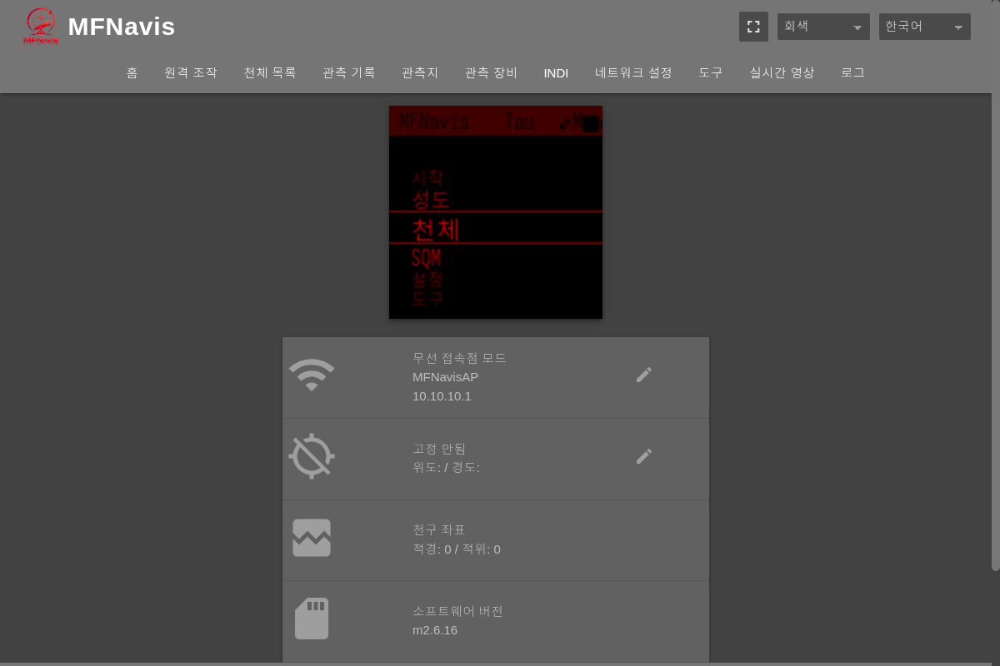

Home(홈)의 LCD 영상은 장비의 현재 화면입니다. 아래 상태표에서 네트워크 주소, GPS 위치, 지향 좌표와 버전을 확인합니다. 네트워크·GPS 옆의 편집 아이콘은 해당 설정 페이지를 엽니다.

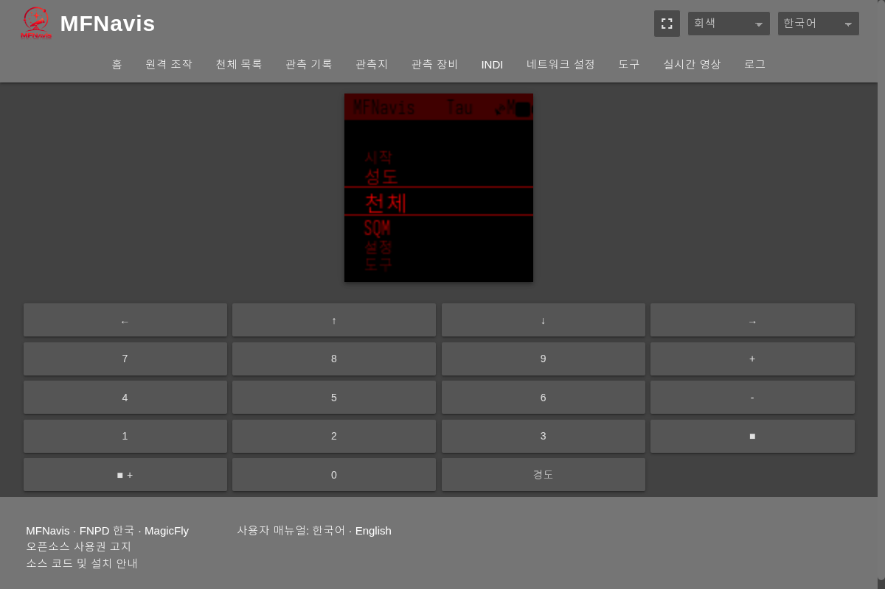

Remote(원격 조작)의 화살표·숫자·`■`·`+ / −`는 LCD 키패드의 같은 버튼을 보냅니다. LCD 화면에 맞는 조작법은 3–11장을 따릅니다.

| 하려는 조작 | 웹 키패드에서 누르는 순서 |
|---|---|
| 짧게 누르기 | 해당 버튼을 한 번 누름 |
| 길게 누르기 | **Long(경도)**를 한 번 눌러 선택한 뒤 대상 버튼을 누름. 예: Long(경도) → ← |
| 사각형 버튼 조합 | **■ +**를 선택한 뒤 대상 버튼을 누름. 예: ■ + → + 또는 −는 LCD 밝기 조절 |
| 조합 선택 취소 | 선택된 Long(경도) 또는 ■ +를 다시 누름 |

Long(경도)과 ■ +는 다음 한 번의 키 입력에 적용된 뒤 해제됩니다. 현재 한국어 화면에서 Long은 ‘경도’로 표시되지만, 이 버튼의 기능은 **길게 누르기 선택**입니다. 연속으로 사용하려면 다시 선택합니다. 웹 키패드에서 숫자 `5`나 `0`을 보내면 현재 LCD 화면에 따라 마운트 명령이 실행될 수 있으므로 화면을 확인합니다.

### 14.3 Catalogs(천체 목록) 검색과 천체 보내기

**경로:** 웹 `Catalogs(천체 목록)`

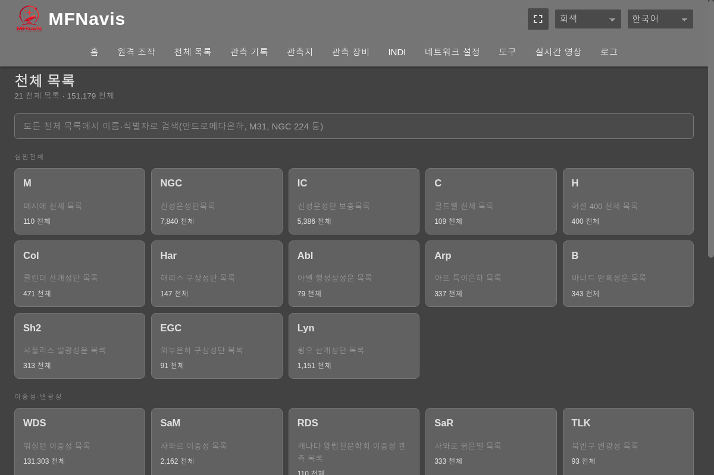

1. 전체 검색창에 `M31`, `NGC 224` 또는 천체 이름을 입력하고 결과를 선택합니다. 카탈로그 카드를 눌러 목록으로 들어가도 됩니다.
2. 목록에서 이름·종류·별자리·등급·관측 여부를 필터링합니다. **Up now(현재 지평선 위)**는 위치 정보와 지원되는 목록에서 사용합니다. **Nearby(주변)**는 현재 지향 방향과 가까운 순서로 표시합니다. 정렬 선택으로 번호·등급·지원되는 경우 고도 순서를 바꿉니다.
3. 천체를 선택하여 좌표·등급·설명과 고도 정보를 확인합니다. **Push to MFNavis(MFNavis로 천체 보내기)**를 누르면 장비의 천체 화면으로 보냅니다.
4. Mount Control(가대 제어)이 켜져 있고 GoTo Type(자동 도입 유형)이 Off(꺼짐)가 아니면 천체 보내기가 **자동 이동도 요청**할 수 있습니다. 이동 상태와 오차를 확인하고, 중단하려면 **Stop GoTo(자동 도입 정지)**를 누릅니다. 다점 정렬 중에는 정렬 기능의 이동 경로를 사용합니다.

Catalogs(천체 목록)에 다시 들어가면 최근 목록이나 천체로 돌아갈 수 있습니다. 전체 목록은 페이지 안의 Catalogs(천체 목록) 경로 링크를 누르거나 `/catalogs?home=1`을 엽니다. 웹의 관측 표시와 LCD의 상세 LOG(로그) 입력은 목적에 맞게 사용합니다.

### 14.4 INDI MOUNT 연결 설정

**경로:** 웹 `INDI → Current INDI Driver State(현재 INDI 드라이버 상태) / LX200 OnStepX Driver Connection(LX200 OnStepX 드라이버 연결)`

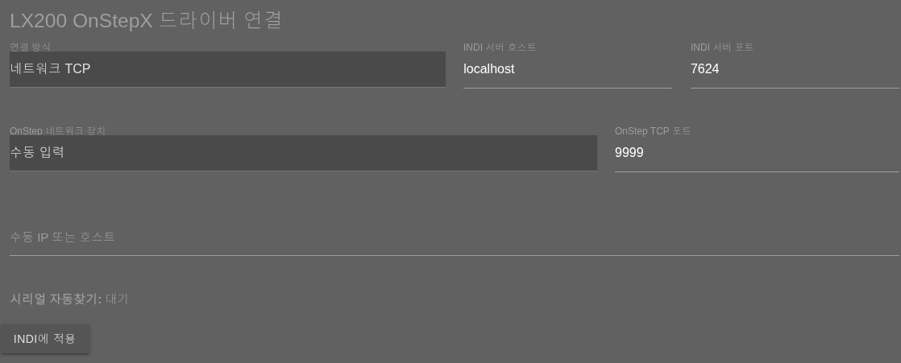

1. LCD의 `Tools(도구) → Experimental(실험적) → Mount Control(가대 제어) → On(켜짐)`으로 마운트 제어를 켜고 MFNavis 재시작이 끝날 때까지 기다립니다.
2. 웹 INDI의 **INDI Web Manager(INDI 웹 관리)**를 열어 사용할 프로필과 드라이버를 선택·시작합니다. 이 링크는 같은 장비의 8624 포트를 엽니다. 드라이버 이름과 실행 상태는 원래 INDI 페이지에서 확인합니다.
3. **INDI Server Host(INDI 서버 호스트)**와 **INDI Server Port(INDI 서버 포트)**를 입력합니다. 같은 장비에서 실행하는 기본값은 `localhost`, `7624`입니다. 이것은 마운트 자체의 IP·포트와 다릅니다.
4. **Connection Type(연결 방식)**을 선택하고 아래 표의 연결 정보를 입력합니다.
5. **Apply to INDI(INDI에 적용)**를 누릅니다. 결과 메시지와 드라이버 상태를 확인하고, 필요하면 LCD `INIT(초기화) → Connect(연결)`로 연결을 요청한 뒤 `STATUS(상태)`를 확인합니다.

| 연결 방식 | 입력할 항목 | 확인할 점 |
|---|---|---|
| Network TCP(네트워크 TCP) | OnStep Network Device(OnStep 네트워크 장치)에서 선택하거나 Manual IP or Host(수동 IP 또는 호스트)에 입력. OnStep TCP Port(OnStep TCP 포트) 입력 | 네트워크 장치 선택은 AP 연결 장치를 기준으로 합니다. 기본 TCP 포트 9999는 마운트 설정에 맞게 변경 가능 |
| USB Serial(USB 시리얼) | USB Serial Port(USB 시리얼 포트)와 Communication Speed(통신 속도) 선택. 필요하면 수동 포트 입력 | 케이블을 연결한 뒤 페이지를 다시 열어 포트 목록 확인 |
| USB 자동 검색 | Auto (Find connected OnStep)(자동 (연결된 OnStep 찾기))와 필요하면 Auto (Detect with port)(자동 (포트와 함께 속도 찾기)) 선택 후 적용 | 로컬 INDI 서버·실행 중인 OnStepX 프로필·켜진 Mount Control 필요. 검색 메시지와 최종 연결 결과 확인 |

연결·위치 전송·마운트 제한 등 OnStepX 전용 기능은 **LX200 OnStepX** 드라이버를 기준으로 합니다. 다른 드라이버에서는 항목이 비활성화되거나 지원되지 않을 수 있습니다. **Restart INDI(INDI 재시작)**는 드라이버 재시작이고 **REBOOT INDI(INDI 재시작)**는 연결된 OnStep 컨트롤러 재부팅 요청입니다. 한국어 표시가 같으므로 영문 버튼 이름으로 구분합니다.

### 14.5 INDI 위치·시간과 수동 이동

**경로:** 웹 `INDI → Location and Time(위치 및 시간) / Mount Control(가대 제어)`

1. **Reload Current Values(현재 값 다시 읽기)**로 MFNavis의 위치·UTC 시각을 읽고 위도·경도·고도를 확인합니다. 필요하면 위치 값을 수정합니다.
2. **Send Location and Time(위치 및 시간 전송)**을 눌러 마운트에 보냅니다. 전송 진행과 결과를 확인합니다. UTC 시각은 MFNavis의 현재 시각을 사용하며, 입력창에서 임의로 수정하지 않습니다. 현재 위치·시간을 먼저 바꾸려면 GPS Settings(GPS 설정)이나 LCD 위치·시간 메뉴를 사용합니다(14.8, 11.3).
3. **Mount Control(가대 제어)**에서 Home·Park 상태를 확인합니다. **Manual Slew Rate(수동 이동 속도)**를 선택한 뒤 방향 버튼을 **누르고 있는 동안** 이동합니다. 버튼에서 손을 떼면 수동 이동을 정지합니다.
4. 미세 보정 속도는 **Pulse Guide Rate(펄스 가이드 속도)**를 선택하고 **Save(저장)**를 누릅니다. 수동 이동 속도와 별도 값입니다.

At Home(홈 위치)은 현재 위치의 Home 설정, Return Home(홈으로 복귀)은 Home 이동, Park(파크)은 주차 이동, Unpark(언파크)은 주차 해제, Set-Park(파크 위치 설정)는 현재 주차 위치 설정입니다. 이동을 요청하기 전에 망원경 주변을 확인합니다. Pointing Coordinate Service(지향 좌표 서비스)의 **Reset Pointing(좌표 초기화)**는 좌표 기준을 다시 구성하는 명령입니다.

### 14.6 INDI 이동 한계·다점 정렬·백래시

**경로:** 웹 `INDI → Settings(설정)`

| 영역 | 조작 | 완료 확인 |
|---|---|---|
| Mount Limits(마운트 제한) | 천정·지평선 고도 한계와 자오선 동·서 한계를 입력하고 Apply Mount Limits(마운트 제한 적용) | 현재 값의 재조회 결과. 천정 60–90°, 지평선 −30–30°, 자오선 −180–180분. 자오선 4분은 1°이며 적도의에 적용 |
| Multi-Point Align(다지점 정렬) | Align Mode(정렬 모드), Align Points(정렬점 수) 1–9, 수동 모드의 Alignment Star(정렬 별)를 선택하고 Start Align(정렬 시작) | 진행 중인 정렬점과 상태 메시지 |
| Backlash(백래시) | 현재 축 이름을 확인하고 0–3600 범위의 보정값 입력 후 Save Backlash(백래시 저장) | 현재 백래시 값과 저장 결과 |

수동 다점 정렬은 별을 선택하고 **GoTo Selected Star(선택한 별로 자동 도입)**로 이동한 뒤, 중심을 맞추고 **Confirm Point(정렬점 확정)**를 누릅니다. 다음 점에서도 같은 순서를 진행합니다. 자동 모드는 상태 메시지를 보며 진행을 확인하고, 중단은 **Cancel Align(정렬 취소)**을 사용합니다.

백래시의 **Start Motion Test(이동 테스트 시작)**는 실제 왕복 GoTo 이동을 수행합니다. 반복 횟수·설명과 결과를 확인하고, 화면에서 대기 중일 때 **Continue Motion Test(이동 테스트 계속)**를 사용합니다. 후보 보정값과 현재 저장된 값을 구분하고, 적용할 값은 Save Backlash(백래시 저장)로 확인합니다. 값의 축 표시는 가대 종류에 따라 RA/DE 또는 Az/Alt가 될 수 있습니다.

드라이버에서 값을 읽을 수 없으면 마운트 제한 입력과 적용 버튼이 비활성화됩니다. Alt/Az에서는 자오선 값이 INDI 표시값일 수 있으며, 컨트롤러에서 직접 읽은 값으로 취급하지 않습니다.

### 14.7 INDI GoTo·Guide와 SkySafari 설정

**경로:** 웹 `INDI → GoTo / Guide Settings(자동 도입 / Guide 설정)`

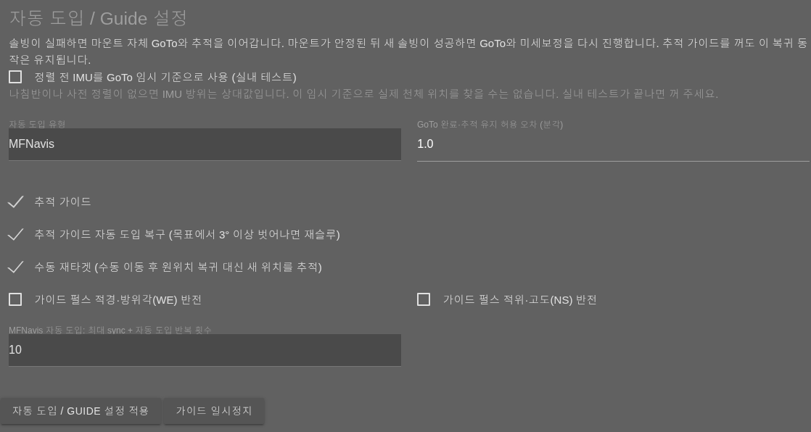

| 항목 | 용도와 선택 방법 |
|---|---|
| GoTo Type(자동 도입 유형) | Off(꺼짐) / INDI Mount(INDI 가대) / MFNavis. 9.6의 LCD 설정과 같은 저장값 |
| GoTo / Tracking Accuracy arcmin(GoTo 완료·추적 유지 허용 오차 (분각)) | 도착과 추적에 사용하는 공통 허용 오차. 양수 분각 입력 |
| Tracking Guide(추적 가이드) | 솔빙 좌표로 추적 보정 사용 |
| Tracking Guide GoTo Recovery (re-slew when off target by more than 3 deg)(추적 가이드 자동 도입 복구 (목표에서 3° 이상 벗어나면 재슬루)) | 큰 오차에서 다시 GoTo하는 복구 사용 |
| Manual Re-target (after a manual move, track the new position instead of returning)(수동 재타겟 (수동 이동 후 원위치 복귀 대신 새 위치를 추적)) | 수동 이동 뒤 새 방향을 추적 목표로 사용 |
| Invert guide pulse RA/Az (WE)(가이드 펄스 적경·방위각(WE) 반전) / Invert guide pulse Dec/Alt (NS)(가이드 펄스 적위·고도(NS) 반전) | 축별 펄스 보정 방향 반전 |
| MFNavis GoTo: Max sync + GoTo iterations(MFNavis 자동 도입: 최대 sync + 자동 도입 반복 횟수) | MFNavis 방식의 Sync와 재도입 최대 반복 횟수 선택 |
| Use unaligned IMU as a provisional GoTo reference (indoor test)(정렬 전 IMU를 GoTo 임시 기준으로 사용 (실내 테스트)) | 실내 테스트용 상대 방향 기준. 실제 천체를 찾는 기준으로 사용하지 않으며 시험 후 해제 |

값을 바꾼 뒤 **Apply GoTo / Guide Settings(자동 도입 / Guide 설정 적용)**를 누르고 결과를 확인합니다. **Pause Guide(가이드 일시정지)**는 보정을 잠시 멈추고, 다시 사용하려면 화면에 나타나는 재개 버튼을 누릅니다. 아래 GoTo / Guide Status(자동 도입 / Guide 상태)에서 목표·이동 단계·오차·보정 상태를 확인합니다.

솔빙이 실패한 동안은 마운트 자체의 GoTo·추적을 이어가며, 정지 후 새 솔빙을 얻으면 다시 정밀 도입을 시작할 수 있습니다. Tracking Guide를 끈 경우에도 새 솔빙에 따른 도입 정밀화가 이루어질 수 있습니다.

**SkySafari Mount Mode(SkySafari 가대 모드)**에서 가대 코드와 Sync·행성 추적 관련 선택을 바꾸고 **Apply SkySafari Settings(SkySafari 설정 적용)**를 누릅니다. 표시되는 MFNavis 가대 종류가 실제 장비와 맞는지 먼저 확인합니다. 같은 INDI 페이지의 **Smooth optical tracking(부드러운 영상 추적 보정)** 영역에서는 모드·목표와 검증된 장비 프로필을 설정한 뒤 저장·중심 확인·보정 시작·정지를 수행합니다. 응답 측정과 보정 시작은 실제 마운트 동작을 수반할 수 있습니다.

### 14.8 Locations(관측지)와 GPS Settings(GPS 설정)

**경로:** 웹 `Locations(관측지)` · 현재 위치·시간 편집은 Home(홈)의 GPS 편집 아이콘(`/gps`)

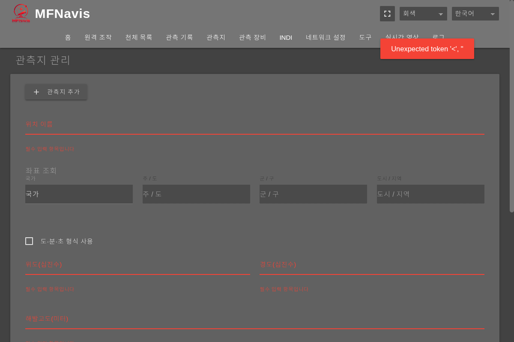

1. Locations(관측지)에서 새 관측지 추가 버튼을 누르고 이름을 입력합니다. **Lookup Coordinates(좌표 조회)**에서 국가·지역·장소를 골라 좌표를 찾거나 위도·경도·고도를 직접 입력합니다.
2. 소수 도 형식과 **Use DMS Format(도·분·초 형식 사용)** 중 선택합니다. 도·분·초 입력은 북/남·동/서에 맞게 부호를 확인합니다. **Save Location(위치 저장)**을 눌러 목록에 저장합니다.
3. 저장된 관측지의 **Load Location(위치 불러오기)**으로 현재 위치를 적용합니다. **Set as Default(기본값으로 설정)**는 기본 관측지를 지정하는 별도 기능입니다. 편집·삭제 아이콘으로 관리합니다.
4. GPS Settings(GPS 설정)에서는 현재 위도·경도·고도·날짜·UTC 시각을 확인하고 **Save(저장)**로 적용합니다. **Set to Browser Date/Time(브라우저 날짜·시각으로 설정)**은 브라우저 시계를 사용하므로 스마트폰·PC 시각을 먼저 확인합니다.

관측지를 저장하는 것과 현재 위치로 불러오는 것은 별개입니다. INDI 마운트에도 위치·시간을 보내려면 14.5의 전송 절차를 진행합니다.

### 14.9 Equipment(관측 장비) 등록과 선택

**경로:** 웹 `Equipment(관측 장비)`

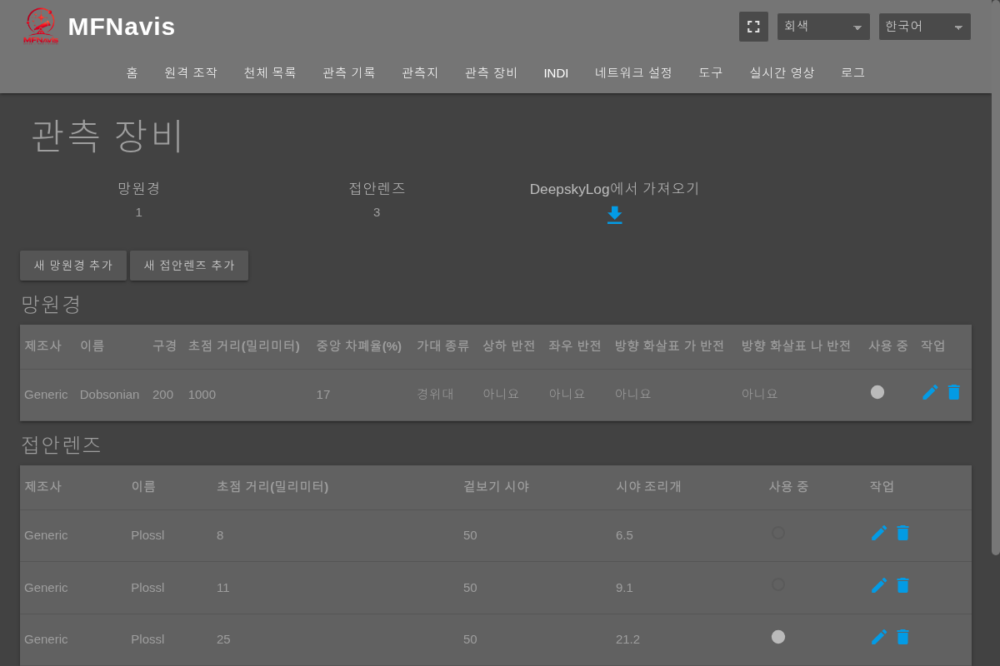

1. **Add new instrument(새 망원경 추가)** 또는 **Add new eyepiece(새 접안렌즈 추가)**를 누릅니다.
2. 이름과 장비의 구경·초점거리, 접안렌즈 초점거리·겉보기 시야 등 해당 항목을 입력하고 저장합니다. 단위와 입력 범위를 확인합니다.
3. 목록에서 사용할 망원경과 접안렌즈를 선택합니다. 선택 표시와 LCD `Tools(도구) → Equipment(관측 장비)`의 배율·시야가 갱신되는지 확인합니다.
4. 편집·삭제 아이콘으로 목록을 관리합니다. DeepskyLog에서 가져오기는 사용자 이름을 입력해 외부 서비스의 장비 정보를 가져오는 기능이며 인터넷 연결이 필요합니다.

### 14.10 Network Setup(네트워크 설정)

**경로:** 웹 `Network Setup(네트워크 설정)`

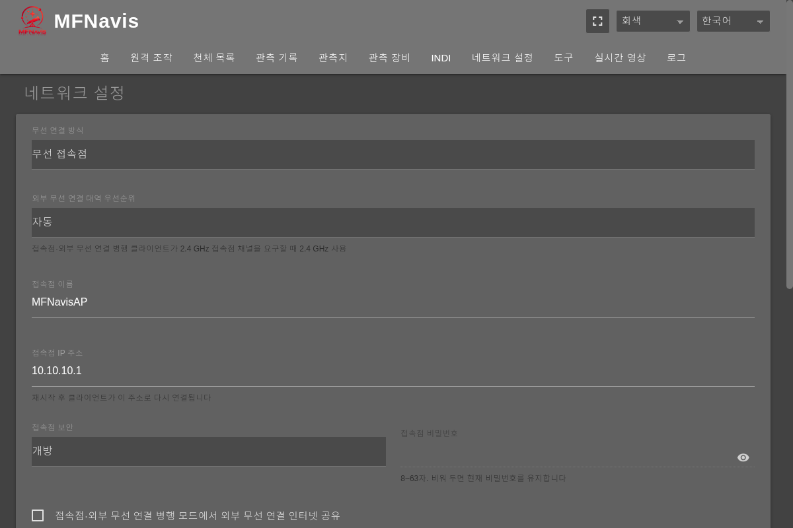

| 하려는 일 | 조작 |
|---|---|
| 접속 방식 변경 | Wifi Mode(무선 연결 방식)에서 AP / Client / AP+STA 선택 |
| AP 설정 | AP 이름·IP·보안·비밀번호 입력. AP+STA 인터넷 공유와 STA 대역 선호도는 구성에 맞게 선택 |
| 입력값만 저장 | Save Settings(설정 저장). 현재 연결을 유지한 채 설정 저장 |
| 설정을 실제 적용 | Apply & Restart(적용 후 재시작) → 확인. 재시작 후 변경한 주소·네트워크로 재접속 |
| Wi-Fi 등록 | Wifi Networks(무선 네트워크)의 + → 주변 Wi-Fi 선택 또는 이름·비밀번호 입력 → Save(저장) |
| 저장된 Wi-Fi 적용 | 우선순위를 조절한 뒤 변경 대기 안내가 나오면 Apply Now(지금 적용). 특정 네트워크의 연결 버튼으로 연결 요청 |

Apply & Restart(적용 후 재시작)나 Wi-Fi 전환 시 브라우저 연결이 끊길 수 있습니다. AP 이름·IP를 바꿨다면 새 접속 정보를 사용합니다. AP Connected Devices(접속점 연결 장치)는 현재 AP에 연결된 장치를 보여주며, INDI 네트워크 장치 선택에도 사용됩니다.

### 14.11 Observations(관측 기록) 열람과 내려받기

**경로:** 웹 `Observations(관측 기록)`

관측 세션을 선택하면 해당 세션의 천체·평가·메모를 확인할 수 있습니다. 내려받기 아이콘으로 전체 관측 기록 또는 선택 세션을 **TSV** 형식으로 저장합니다. 스프레드시트에서 탭으로 구분된 파일로 열면 됩니다. 기록을 새로 남기는 LCD 절차는 6.6을 참고합니다.

### 14.12 Tools(도구)·Logs(로그)와 진단 자료

**경로:** 웹 `Tools(도구)` 또는 `Logs(로그)`

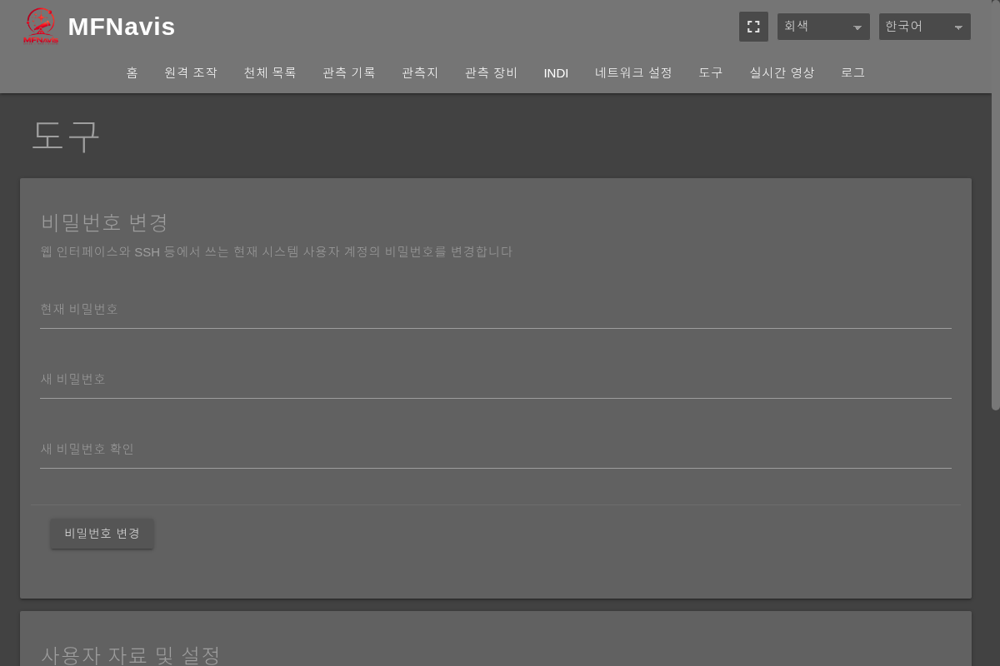

| 기능 | 사용 방법 |
|---|---|
| Change Password(비밀번호 변경) | 현재 비밀번호와 새 비밀번호 두 번 입력 후 변경. 웹 로그인과 해당 시스템 계정의 SSH 비밀번호가 함께 바뀜 |
| Download Backup File(백업 파일 내려받기) | 개인 설정·관측 기록·관측 목록의 ZIP 백업 저장 |
| Upload and Restore(파일을 올려 복원) | 백업 파일 선택 → 복원 → 확인. 기존 설정·관측 기록을 덮어쓰므로 현재 자료를 먼저 백업 |
| Logs(로그) | 로그 표시를 일시정지·재개하고 복사하거나 Download All Logs(모든 로그 내려받기)로 저장. Save to SD(SD로 저장)는 장비 저장 기능 |

솔빙 문제를 기록하려면 `/solver-capture`의 **Plate-solving diagnostic capture(솔빙 테스트 자료 수집)**를 엽니다. 장면·시험 단계·수집 내용·최대 시간·시도 횟수·저장 용량을 선택하고 **Start recording(기록 시작)**을 누릅니다. 상태가 기록 중으로 바뀌는지 확인하고 필요하면 구간 메모를 남긴 뒤 **Stop recording(기록 종료)**을 누릅니다. 설정한 제한에 도달해도 종료됩니다.

### 14.13 LiveCam(실시간 영상)

**경로:** 웹 `LiveCam(실시간 영상)`

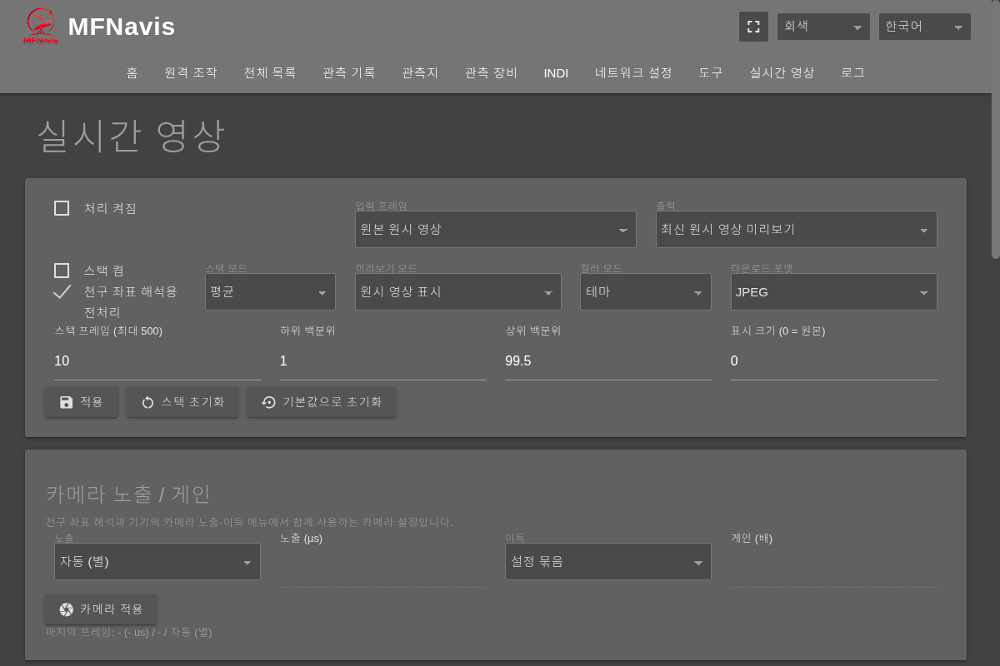

1. **Processing On(처리 켜짐)**을 선택하고 Input Frame(입력 프레임), Output(출력), Preview Mode(미리보기 모드)를 고른 뒤 **Apply(적용)**를 누릅니다. 최신 영상 또는 Live Stack(라이브 스택)을 선택할 수 있습니다.
2. 스택을 사용할 때는 Stack Mode(스택 모드)와 프레임 수를 설정합니다. 누적 영상을 새로 시작하려면 **Reset Stack(스택 초기화)**을 누릅니다.
3. **Camera Exposure / Gain(카메라 노출 / 게인)**에서 노출 모드·값과 게인을 선택하고 **Apply Camera(카메라 적용)**를 누릅니다. 실제 적용값과 상태를 확인합니다. 노출의 수동 입력 단위는 µs이며, 예를 들어 400000µs는 0.4초입니다.
4. Preview(미리보기)에서 확대·축소·화면 맞춤과 별 표시를 사용합니다. 영상 내려받기 버튼으로 선택한 형식의 이미지를 저장하고, 지원되는 RAW 자료는 TIFF 내려받기를 사용합니다.

**Preprocess for solving(천구 좌표 해석용 전처리)**는 솔버에 들어가는 영상에도 영향을 주는 별도 선택입니다. 미리보기의 밝기·색·스택 변경과 구분해서 사용합니다. 카메라 프로세스가 없는 경우에는 노출·게인 적용을 사용할 수 없습니다.

### 문서 적용 범위

이 초안은 2026년 10월 9일 작업 폴더의 MFNavis 코드 기준입니다. 장비별 LCD 표시와 실물 버튼, 연결된 마운트의 응답은 배포 전 실제 장비에서 확인해야 합니다. 하드웨어 종류, 언어, 저장된 장비·관측 목록과 소프트웨어 버전에 따라 표시 항목이 달라질 수 있습니다.
