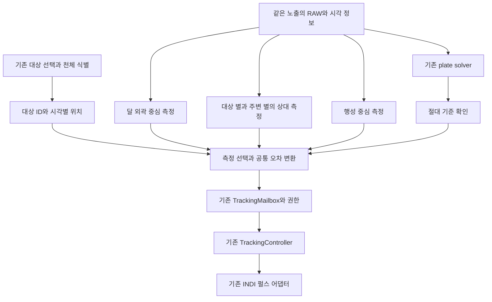

# 수동 정렬과 솔빙 복구를 지원하는 대상별 영상 추적 개선 계획

작성일: 2026-10-03 KST. 검토 기준: MFNavis `main`, HEAD `a10d6395`.

상태 갱신(2026-10-04): **정렬 분기와 대상별 측정을 코드에 통합했으며 실제 장비의 최종 시험은 대기 중이다.** 구현 범위·기존 시험과의 경계·새 설정·재현 명령은 [구현과 최종 시험 인계](../mf_report/mf_target_tracking_integration_20261004_ko.md)를 따른다. 아래 소스 상태와 121개 시험은 `a10d6395` 기준의 구현 전 검토 기록이다.

두 작업은 결합할 수 있다. **정상 솔빙의 정보를 사용하고, 솔빙 공백에는 수동 정렬로 확인한 같은 목표를 대상별 영상 측정으로 이어간다.** 달은 원반 중심, 목성·토성 등 행성은 대상 영상과 주변 별, 항성·딥스카이는 대상 별과 주변 별을 최근 부드러운 보정 엔진의 입력으로 연결한다. 달과 행성의 시간별 운동을 반영하고, 사용자 정렬 시점의 목표를 정상 솔빙 복구 이후에도 유지한다.

정렬 요청은 **유효한 솔빙이 있으면 즉시 정상 정렬, 이동 직후 미솔빙이면 남은 솔빙 시간만 대기, 실패 확정 또는 대기시간 경과 시 사용자 중심 도착 확인** 순서로 처리한다. 대기는 마지막 관측용 이동 완료 시각부터 계산하며 추적 보정 이동으로 다시 시작하지 않는다.

여기서 사용자가 원하는 달빛 중심은 **영상에 들어온 달의 원반 중심**으로 정의한다. 달 내부가 포화되어도 외곽이 구분되면 중심을 측정할 가능성이 있다. 광륜이나 화면 전체 포화로 외곽까지 없어지면 위치를 검증할 수 없으므로 영상 보정을 보류한다. 이 가능성과 한계는 실제 포화 달 영상으로 확인해야 한다.

## 1 결합할 기존 작업과 현재 상태

| 작업 | 소스에서 확인한 현재 상태 | 통합에서 맡길 역할 |
|---|---|---|
| [영상 추적 연속성 설계](mf_visual_tracking_continuity_design_ko.md)와 [시험 구현](mf_visual_tracking_trial_ko.md) | 사용자 기준, 달 외곽 측정, 기존 천체 식별과 시간별 위치 계산, shadow와 재생이 있다. 실제 마운트 전송은 연결하지 않았다. | 대상과 달 중심의 측정 방법을 재사용한다. |
| [부드러운 추적 보정 설계](mf_smooth_tracking_environment_design_ko.md)와 [구현 보고서](../mf_report/mf_smooth_tracking_implementation_20261003_ko.md) | 카탈로그 별 기준, RAW ROI worker, 영상 estimate, 펄스·예측·인계·취소를 구현했다. 달과 최초 미솔빙 정렬은 P6 후속 범위다. | 측정 승인, 보정량 계산, 펄스 실행과 소유권을 재사용한다. |
| [달 근접 GoTo 인계 설계](mf_moon_safe_goto_handoff_design_ko.md) | 구현 전 설계다. 달 근처의 미검증 좌표로 Sync와 복구 GoTo가 반복되지 않도록 최종 direct 구간의 보정을 금지한다. | 달 도착 전후의 자동 Sync와 GoTo 제한을 계승하고, 도착 후 검증된 영상 펄스와 구분한다. |

최신 `default_config.json`의 `smooth_tracking_mode` 기본값은 `active`이고 프로필은 빈 객체다. 기본 On과 세션 시작은 다르며, 현재 코드도 명시 Start와 검증된 프로필을 요구한다. 이전 shadow의 기본 Off나 초기 설계의 Off를 현재 보정 엔진의 기본값으로 해석하지 않는다. 운영 서비스가 어떤 소스를 로드했는지는 이번 검토에서 확인하지 않았다.

### 소스로 확인한 연결 장애

아래는 단순히 옵션을 켜는 것만으로 두 작업을 함께 사용할 수 없는 이유다.

| 확인 위치 | 현재 계약과 필요한 수정 |
|---|---|
| [smooth_tracking_runtime.py](../../python/MFNavis/smooth_tracking_runtime.py#L149), `start_session` | `body`가 있는 요청을 거절하며, `resolve`에 행성 식별 옵션을 넘기지 않는다. 세션에는 대상 ID 대신 고정 RA와 Dec만 저장한다. 달 좌표를 별처럼 넣으면 달의 운동을 따라가는 세션이 되지 않는다. |
| [server.py](../../python/MFNavis/server.py#L2039), `indi_smooth_tracking` | Start와 Calibrate에서 RA, Dec, frame만 큐로 전달한다. 기존 대상 식별 결과를 세션 요청까지 보존해야 한다. |
| [tracking_quality.py](../../python/MFNavis/tracking_quality.py#L80), `build_reference` | 승인된 실제 RAW 솔빙과 카탈로그 별 대응이 필요하다. 달만 보이는 상태에서 새 기준을 만들 수 없다. |
| [smooth_tracking_runtime.py](../../python/MFNavis/smooth_tracking_runtime.py#L65), `run_worker` | reference가 없으면 측정을 시작하지 않으며 `StarTracker`만 생성한다. 달 기준을 별도로 만들고 측정기를 선택해야 한다. |
| [state.py](../../python/MFNavis/state.py#L374), `smooth_tracking_frame` | 별 ROI 반경은 최대 32px다. 달 원반과 외곽을 포함할 별도 bounded ROI 계약이 필요하다. |
| [tracking_quality.py](../../python/MFNavis/tracking_quality.py#L204), `centroid` | 별 ROI에 포화 픽셀이 있으면 측정을 거부한다. 이 규칙을 달 전체에 적용하면 내부 포화만으로 달 측정도 중단된다. |
| [tracking_quality.py](../../python/MFNavis/tracking_quality.py#L249), `StarTracker` | 고정 `context.target`에 대한 오차와 솔빙 기준의 유효기간을 사용한다. 달 직접 측정과 이동 천체를 추적하는 별 측정에는 서로 다른 계산이 필요하다. |
| [tracking_contracts.py](../../python/MFNavis/tracking_contracts.py#L35), `TrackingContext` | 고정 목표와 catalog frame 계약이다. 매 프레임 좌표를 context에 갈아 넣으면 권한과 controller가 계속 달라질 수 있다. 대상 정체성과 시각별 좌표를 분리해야 한다. |
| [integrator.py](../../python/MFNavis/integrator.py#L293), `_apply_visual_measurement` | camera RA, Dec, Roll과 aligned RA, Dec가 있는 측정만 적용한다. 달 한 점에서 완전 자세를 만들어 이 조건을 억지로 통과시키지 않는다. |
| [smooth_mount_runtime.py](../../python/MFNavis/smooth_mount_runtime.py#L148), 복구 기준 전달 | reference를 절대 복구 기준의 pose와 geometry로 읽는다. 달 측정 기준을 그대로 넣으면 형식과 의미가 맞지 않는다. reference 종류별로 분기해야 한다. |
| [ui/align.py](../../python/MFNavis/ui/align.py#L36), `align_on_radec` | 기존 정렬은 요청마다 solver 응답을 기다리며 timeout은 15초다. 유효한 기존 솔빙 즉시 사용, 이동 완료부터의 남은 대기, 실패 시 중심 도착 확인을 공통 처리기로 분리해야 한다. |
| [pos_server.py](../../python/MFNavis/pos_server.py#L1016), `_set_imu_alignment_from_target_if_no_solve` | 최초 솔빙 전 IMU 표시용 정렬 경로이며 솔빙 이력이 있으면 진입하지 않는다. 최초 미솔빙과 관측 중 솔빙 중단 모두를 처리하는 사용자 영상 기준이 추가로 필요하다. |
| [visual_tracking.py](../../python/MFNavis/visual_tracking.py#L250), `TrackingSession.align` | shadow에서는 정렬 시 검출한 별을 기준 광선으로 만들 수 있다. 생산 경로에는 카탈로그 ID가 없는 상대 별 기준의 품질·수명·제어 사용 계약을 별도로 추가해야 한다. |
| [alignment_projection.py](../../python/MFNavis/alignment_projection.py#L115), `cached_target_pixel` | 현재 캐시 함수는 IMU 사용 가능성과 원점도 요구한다. 현재 자세에 유효한 솔빙을 직접 사용하는 경로와 IMU로 과거 솔빙을 전파하는 경로를 구분해야 한다. IMU 표시가 있다는 이유로 과거 솔빙을 새 성공으로 인정하지 않는다. |

## 2 사용자가 얻을 동작

사용자가 달·행성·항성·딥스카이를 선택해 GoTo했지만 광포화나 기타 원인으로 솔빙이 실패한 경우, 수동으로 대상을 찾아 지정 위치에 맞춘 뒤 정렬을 명령한다. 솔빙이 가능하면 기존의 정상 정렬로 처리한다. 솔빙 실패가 확정되거나 충분한 대기시간이 지난 경우에는 정렬 요청을 **선택한 대상을 추적 중심에 맞췄다는 도착 확인 신호**로 사용한다. 첫 솔빙 전과 기존 솔빙 이력이 있는 관측 중 실패에 모두 적용한다.

지정 위치는 정렬된 접안 중심인 `target_pixel` 또는 명시한 세션 유지 위치다. 카메라 화면 중앙과 접안 중심은 다를 수 있으며 RAW 좌표로 정확히 변환한다. 수동 이동과 이전 펄스가 끝난 뒤 새 기준 프레임을 확보하고, 대상과 주변 영상의 품질을 확인해 보정을 시작한다.

| 관측 상황 | 제안 동작 |
|---|---|
| 정렬 요청 시 현재 자세에 유효한 정상 솔빙이 있음 | 새 솔빙을 기다리지 않고 즉시 기존 정상 정렬을 적용한다. |
| 정렬 요청 시 미솔빙이고 관측용 이동 완료 후 대기시간이 남음 | 남은 시간 동안 솔빙을 기다리고, 성공하면 즉시 정상 정렬한다. |
| 정렬 요청 시 미솔빙이고 실패 확정 또는 이동 완료 후 충분한 시간 경과 | 추가 전체 대기 없이 중심 도착 확인으로 처리하고 대상별 영상 기준을 만든다. |
| 중심 도착 확인의 대상이 달 | 달 원반 중심 측정으로 새 보정 세션을 시작·재개한다. |
| 중심 도착 확인의 대상이 목성·토성 등 행성 | 행성 자체의 유효한 중심과 주변 별로 부드러운 보정을 한다. 행성 운동을 반영하며, 행성 중심이 불량하면 유효한 주변 별로 이어간다. |
| 중심 도착 확인의 대상이 항성·딥스카이 | 정렬 시점의 대상 별·주변 별 배치를 상대 기준으로 추적한다. 대상이 영상에 보이지 않는 딥스카이도 주변 별이 유효하면 추적할 수 있다. |
| 어느 대상이든 정상 솔빙 승인 | 솔빙을 절대 좌표·광학 기준과 해당 시각의 오차에 우선 사용한다. 솔빙 사이의 영상 측정도 같은 목표와 제어기를 사용한다. |
| 달 중심 측정 유효, 솔빙 실패 | 달 중심 오차로 부드러운 보정을 계속한다. |
| 달 내부 포화, 외곽 측정 유효 | 외곽으로 얻은 중심을 사용한다. 내부 포화만으로 거부하지 않는다. |
| 달 외곽 불명확, 검증된 배경 별 유효 | 달의 시간별 운동을 반영한 별 측정으로 전환한다. |
| 달과 별 모두 소실 | 기본 달 추적을 유지하고 영상 보정을 보류한다. 별도 검증된 짧은 coast만 허용한다. |
| 처음부터 솔빙 실패, 달은 보임 | 사용자 확인과 기존 광학·응답 보정이 있으면 달 위치 유지로 시작할 수 있게 확장한다. |
| 달이 화면 밖, 화면에 달빛만 있음 | 광륜의 밝은 중심으로 대상을 확정하지 않는다. 사용자 재획득을 기다린다. |
| 행성이 별처럼 작은 점 또는 분해된 원반으로 보임 | 영상 크기에 맞는 별도 행성 중심 품질을 적용한다. 직접 측정이 미검증이거나 불량하면 운동을 반영한 주변 별 추적을 사용한다. |
| 목표가 달 근처 항성이나 DSO | 달 중심으로 목표를 바꾸지 않는다. 원래 천체의 추적 정책을 유지한다. |

### 정렬 요청의 분기와 우선순위

정렬에서 사용할 수 있는 솔빙은 현재 광학·좌표계에 맞는 승인된 실제 솔빙이며, 마지막 관측용 이동 이후의 촬영과 현재 자세에 대한 유효성이 확인돼야 한다. `solve_state=True`, 보존된 과거 solve 셀, IMU·영상 estimate만으로 솔빙 완료를 판정하지 않는다. 필요한 자세 전파의 근거가 없다면 이동 전 솔빙을 즉시 정렬에 사용하지 않는다.

| 우선순위 | 조건 | 처리와 결과 |
|---|---|---|
| 1 | 취소·새 대상·새 관측용 이동 등으로 요청 문맥이 변경됨 | 이전 요청을 취소한다. 이전 목표의 정렬·도착 확인을 뒤늦게 적용하지 않는다. |
| 2 | 현재 자세에 유효한 승인 솔빙이 있음 | **즉시 정상 정렬**한다. 새 노출·솔빙 시도를 강제하거나 남은 timeout을 기다리지 않는다. |
| 3 | 관측용 이동이 아직 진행 중이거나 완료·정착이 확인되지 않음 | 이동 확인 대기다. 요청을 중심 도착으로 완료하지 않는다. |
| 4 | 유효 솔빙 없음, 해당 이동의 솔빙 대기 한도가 남음, 최종 실패는 아님 | **남은 시간만 솔빙 대기**한다. 유효 솔빙이 오면 즉시 정상 정렬로 완료한다. |
| 5 | 유효 솔빙 없음, 해당 문맥의 정렬용 솔빙 실패 확정 | 남은 시간과 관계없이 **사용자 중심 도착 확인**으로 전환한다. |
| 6 | 유효 솔빙 없음, 해당 이동의 솔빙 대기 한도 경과 | **즉시 사용자 중심 도착 확인**으로 전환한다. 요청 시점부터 대기시간을 다시 부여하지 않는다. |

수신 시점에 있는 유효 솔빙을 먼저 검사한다. 이미 시간이 지났어도 유효 솔빙이 있으면 정상 정렬이며, 대기 종료와 솔빙 승인 이벤트가 함께 관측되면 취소 여부를 확인한 뒤 사용 가능한 솔빙을 우선한다. 원본 프레임·시각·문맥이 없는 지연 결과는 이 우선권을 갖지 않는다.

실패 확정은 정렬에 배정한 솔빙 시도의 필요한 탐색·재확인 경로가 끝났거나 해당 worker가 실행 불가임이 확인된 경우다. 단일 프레임의 일시적인 검출 실패를 전체 솔빙 실패로 취급하지 않는다. 반대로 실패가 확정됐는데 무조건 timeout까지 기다리지 않는다. 유효한 솔빙으로 대상 투영이 모순되거나 정상 정렬 자체의 계약이 잘못된 경우는 정렬 오류로 표시하고, 솔빙이 없다는 이유의 도착 확인과 구분한다.

### 솔빙 대기시간과 관측용 이동 완료 시각

대기 기준은 **사용자 수동 재위치 또는 관측 대상 이동용 GoTo가 실제로 완료된 시각**이다. 명령을 큐에 넣은 시각, 추적이 On인 시각, 마지막 INDI 상태 파일 갱신 시각을 이동 완료로 쓰지 않는다. 마운트 완료 응답과 정지 확인을 해당 명령·이동 세대에 연결한다.

추적 가이드 펄스, 새 영상 보정 펄스, 자동 refine·복구 등 **보정 목적의 이동은 솔빙 대기시간을 리셋하지 않는다.** 동일한 GoTo 형식이라도 목적 metadata로 구분하고 INDI Busy 여부만으로 분류하지 않는다. 보정 이동의 종료·정착은 영상 사용 가능성 검사에 별도로 반영한다. 즉 보정 펄스가 끝나야 새 기준 영상을 쓸 수 있어도, 그 때문에 솔빙 대기 한도 전체를 다시 시작하지 않는다.

다음 값은 동일한 clock epoch의 monotonic 시각으로 관리한다. 관측용 이동 완료 시 해당 이동 세대의 솔빙 대기 정책과 deadline을 고정하고, 이후 정렬 요청은 그 window를 공유한다. 설정 변경과 재요청으로 진행 중 한도를 늘리지 않는다.

```text
t_move_done = 마지막 관측용 이동의 확인된 완료 시각
T_solve_wait = 정착부터 솔빙 승인 전달까지를 포함한 최악 조건의 유한 대기 상한
solve_deadline = t_move_done + T_solve_wait
remaining_wait = max(0, solve_deadline - now)
```

`T_solve_wait`에는 정착, 이미 진행 중인 촬영·솔빙의 잔여 시간, 새 유효 노출·readout·버퍼, 필요한 탐색 경로와 재확인 프레임, 큐·승인·게시 지연을 포함한다. 카메라 모드·최대 노출·활성 솔빙 정책의 설정 상한과 부하 시험을 사용하고 무제한 재시도는 포함하지 않는다. 명령 완료 관측의 지연도 상한에 반영한다.

현재 [UI 정렬 timeout](../../python/MFNavis/ui/align.py#L28)은 `ALIGN_TIMEOUT_SECONDS=15.0`이다. 이는 기존 요청 응답 대기값이며 검증된 최악의 솔빙 시간이나 이동 완료 기준 deadline을 구현한 값은 아니다. 새 `alignment_solve_wait_max_s`는 **제안 설정**으로, 위 경로의 상한을 확인해 확정해야 한다. 기존 15초를 비교 출발점으로 사용할 수 있지만 근거 없이 모든 장비의 최악 시간으로 확정하지 않는다.

예를 들어 **시험에서 상한을 15초로 설정하고** 관측용 이동이 0초에 완료됐다면, 3초의 정렬 요청은 최대 12초만 기다린다. 8초에 승인 솔빙이 오면 그때 정상 정렬한다. 20초의 정렬 요청은 유효 솔빙이 없을 때 추가 대기 없이 중심 도착 확인이다. 중간에 보정 펄스가 실행돼도 deadline은 15초로 유지한다.

이동 완료 기록이 없으면 충분히 기다렸다고 추측하지 않는다. 현재 정지 상태를 확인한 시각을 대체 기준으로 명시하고, 그 시각부터 유한 대기 상한을 한 번 적용한다. 실제 이동 완료·정지 상태도 확인할 수 없으면 이동 확인 대기로 표시하고 자동 보정을 허용하지 않는다. 같은 이동에서 정렬 재요청이나 솔빙 재시도 때문에 deadline을 연장하지 않는다.

### 요청 수명과 중심 도착 확인의 적용

정렬 요청은 `request_id`, 대상 revision, 관측용 이동 세대, 요청 시각, 유지 위치와 deadline을 보존한다. 웹·LCD·SkySafari는 같은 분기 정책을 사용하고, 긴 대기는 공통 처리기의 이벤트 상태로 관리해 UI와 Stop 처리를 막지 않는다. 한 요청은 정상 정렬 또는 중심 도착 확인 중 **한 번만** 완료한다.

도착 확인은 사용자의 요청에 담긴 확인을 대기 종료 시 소비하는 것이며 시스템이 달·행성·별의 실제 도착을 절대 좌표로 검증했다는 뜻은 아니다. 결과는 `solved_alignment`와 `user_center_arrival`로 구분하고, 도착 확인 결과에는 `solve_failed`, `solve_wait_expired`, `already_waited` 같은 전환 사유를 기록한다. 별도 Start를 다시 요구하지 않는다.

도착 확인 후 늦은 솔빙은 7절의 기준 갱신 경로로 연결한다. 과거 정렬 요청을 다시 실행하거나 정상 정렬 응답을 두 번 보내지 않으며, 유지 픽셀을 새로 교정해 바꾸지 않는다. 취소·새 이동·새 대상은 이전 대기 요청과 그 요청의 늦은 솔빙 결과보다 우선한다.

### 정렬 분기 이후의 공통 처리

1. 수동 이동 시작 시 이전 자동 보정 권한, 미실행 펄스, 기존 GoTo·refine·복구 예약을 취소한다. 사용자의 이동을 반대로 되돌리는 보정은 하지 않는다.
2. 정렬 요청에서 최신 선택 대상 ID·좌표계·유지 위치·요청 시각을 고정한다. 달·행성의 위치는 실제 정렬 기준 시각에 다시 계산한다. 이전 GoTo 좌표나 이전 대상의 별 배치를 그대로 쓰지 않는다.
3. 위 분기 정책으로 정상 정렬 또는 중심 도착 확인을 선택한다. 기준 RAW는 수동 이동과 잔여 펄스의 종료·정착 이후 촬영돼야 한다. 정렬 적용 전에 새로운 수동 이동이나 대상 변경이 오면 이전 요청을 폐기한다.
4. 정상 정렬은 기존 솔빙 기반 처리와 결과 저장을 수행한다. 중심 도착 확인은 새 사용자 기준과 generation을 발급한다. 두 경로 모두 이전 drift·위치 보정 잔여량을 초기화하며 내부 기준과 INDI Sync의 성공을 각각 기록한다. 정렬이 자동 GoTo를 뜻하지 않는다.
5. 영상 보정이 활성화된 모드이고 장비·측정 조건이 유효하면 **완료된 정렬 명령을 새 세션 시작·재개의 명시적 요청으로 사용한다.** 아직 솔빙·이동 대기 중인 요청은 도착 확인 권한으로 쓰지 않는다. 명시 Off·추적 Off·주차는 그대로 존중하고 shadow는 명령을 보내지 않는다.
6. 영상이 아직 부족하면 사용자 정렬은 성립시키되 보정은 획득 대기로 둔다. 같은 대상을 유지하며 새 영상으로 재확인한다. 다른 별이 더 잘 보인다는 이유로 추적 목표를 바꾸지 않는다.

솔빙 없는 중심 도착 확인은 기존 유지 픽셀을 사용해 세션 기준을 설정한다. 새 FOV·Roll·왜곡이나 영구 `target_pixel` 교정을 성공한 것처럼 저장하지 않는다. UI는 솔빙 대기와 남은 시간, 솔빙 정렬 완료, 사용자 중심 도착 확인, 영상 보정 시작·획득 대기, INDI Sync 결과를 구분해 표시한다.

## 3 통합 구조와 제어 소유권



생산 경로는 기존 `smooth_tracking_runtime` worker 하나로 유지하고 달·행성 중심 측정과 사용자 정렬에 기반한 상대 별 측정을 추가한다. `visual_tracking_runtime.LiveShadow` 자체를 생산 controller로 올리지 않는다. shadow manifest와 로그 수명은 시험용이며, 새 보정의 권한·시각·Stop 계약을 대신하지 못한다. 재사용 대상은 순수 달 측정, 기하 변환, 상대 별 대응, 대상 위치 계산이다.

달·행성·별·솔빙의 측정 결과는 worker에서 검증한 뒤 **프레임당 하나의 최종 측정**으로 게시한다. 현재 mailbox는 같은 sequence의 복수 valid 관측을 받지 않으므로, 측정기가 따로 게시하면 늦게 도착한 결과가 사라질 수 있다. 같은 RAW의 여러 결과를 독립 확인 프레임 여러 개로 세지 않는다.

기존 Tracking Guide와 새 펄스 엔진의 소유권 인계를 유지한다. 기존 반복 솔빙 보정에서 제거한 예측 펄스를 다시 연결하지 않는다. 새 엔진의 위치 보정과 검증된 드리프트 예측은 기존처럼 단일 명령·duty 예산을 공유한다. 관측 실패가 기존 Sync나 자동 복구 GoTo 재개를 뜻하지 않는다.

## 4 대상 식별과 행성 및 딥스카이 운동의 처리

새 달·행성 분류기는 만들지 않는다. 내부 카탈로그의 명시 천체 ID를 우선하고, 좌표만 있는 요청은 기존 `planet_at_coordinates`와 `TargetEphemeris.resolve`를 사용한다. 식별은 새 GoTo나 정렬 때 수행하고 세션 동안 결과를 보존한다. 명시 항성 선택을 가까운 달로 바꾸지 않는다.

현재 [TargetEphemeris](../../python/MFNavis/visual_tracking_target.py#L27)는 기존 `calc_planets`로 관측지와 시각에 따른 RA와 Dec를 계산하고, `basis`로 마운트 종류별 예상 회전을 계산한다. 행성과 딥스카이는 아래처럼 다른 운동 모델을 사용한다.

- **항성·딥스카이:** 짧은 관측 세션의 고정 천구 방향과 기본 항성 추적을 사용한다. 경위대에서는 시야 회전을 반영해 대상 별과 주변 별의 예상 위치를 계산한다. 모든 주변 별을 처음 픽셀에 고정하지 않는다.
- **달·행성 직접 측정:** 올바르게 추적하면 원반 또는 대상 중심은 지정 픽셀에 머문다. 중심의 위치 오차에 천체의 정상 이동량을 한 번 더 더하거나 빼지 않는다.
- **달·행성의 주변 별 측정:** 같은 노출 시각의 천체 RA·Dec와 예상 카메라 자세로 배경 별 위치를 예측하고, 그 예측에서 벗어난 잔차만 보정한다. 행성에 대한 배경 별의 정상 상대 이동을 drift로 학습하거나 0으로 만드는 펄스를 보내지 않는다.

행성 자체를 항성과 같은 고정 기준 별 목록에 넣지 않는다. 행성에는 시간별 위치를, 항성에는 고정 기준 광선을 사용한다. 둘은 공통의 카메라 자세 오차를 측정하는 관측으로 결합하되 서로 다른 예상 운동을 먼저 제거한다.

```text
시각 t의 목표 방향 = 항성·딥스카이의 고정 방향 또는 달·행성의 위치 계산 결과
정상 카메라 자세 Q(t) = 목표를 유지 위치에 두고 마운트별 시야 회전을 반영한 자세
예상 주변 별 픽셀 = 고정 기준 별 광선을 Q(t)로 투영한 위치
주변 별 잔차 = 관측 별 위치 - 예상 주변 별 픽셀
대상 중심 잔차 = 관측 달·행성·대상 별 중심 - 유지 픽셀
최종 보정 오차 = 유효한 잔차를 같은 기준면으로 변환하고 검증한 결과
```

예를 들어 시험에서 행성이 배경 별에 대해 동쪽으로 이동하도록 입력하면, 행성을 정확히 추적하는 영상에서는 주변 별이 반대 방향으로 움직일 수 있다. 이때 최종 보정 오차는 0에 가까워야 한다. 동일한 별 배치에서 딥스카이를 추적하는 시험은 행성 이동 항을 넣지 않으며, 알려진 카메라 이탈을 추가했을 때만 대응 보정이 나와야 한다.

행성 영상은 품질에 따라 별도 중심 측정을 쓴다. 작은 비포화 점은 확인된 점상 모델, 분해된 목성·토성은 검증한 원반·고리 모델로 중심을 추정한다. 포화 밝기 무게중심, 표면 무늬나 근처 위성을 행성 중심으로 채택하지 않는다. 직접 측정이 불량하면 검증된 주변 별 경로로 이어가며, 직접 행성 중심 제어의 실장 검증도 이번 통합의 완료 조건에 포함한다.

기본 비항성 추적은 `track_freq_policy`가 맡고 영상 보정은 남은 오차를 맡는다. RA 주파수 설정만으로 Dec와 경위대의 2축 추적이 모두 구현됐다고 가정하지 않는다. 실제 마운트 기능을 확인하고 부족한 부분은 검증된 펄스 용량 안에서만 보완한다.

천체 좌표를 노출 대표 UTC 시각에 계산하고 timeout은 monotonic을 사용한다. 내부 RA와 Dec 단위는 도이며, INDI 프로토콜의 RA 시간 단위 변환은 기존 경계에서 수행한다. 요청의 `catalog`와 `of_date` 축을 보존하고 기존 변환을 한 번 적용한다. J2000 기준축과 astrometric 또는 apparent 위치 의미는 별개라는 점은 [Skyfield 위치 문서](https://rhodesmill.org/skyfield/positions.html)에 따른다. 달의 관측지 시차를 포함하는 기존 계산을 재사용하고, 새 공급원이 필요하면 현재 계산과 의미를 비교한다.

세션 context에는 고정된 대상 ID와 revision, 오차를 표현하는 기준 접평면을 둔다. 시간별 `target_radec_at_observation`은 측정 필드로 분리한다. 변화하는 좌표 때문에 controller가 매번 재시작하지 않도록 한다. 이동한 목표의 잔차와 펄스 응답 행렬은 같은 접평면으로 변환하며, 현재 자세가 응답 모델의 유효 범위를 벗어나면 재검증한다.

## 5 달 중심 검출과 포화 대응

### 기존 검출기의 재사용 범위

[measure_moon](../../python/MFNavis/visual_tracking_images.py#L48)은 밝은 픽셀의 무게중심 대신 달 외곽의 기울기와 원 적합을 사용한다. 독립적으로 입력한 예상 반지름, 중심 검색 범위, 기울기 방향으로 후보를 제한한다. 현재 검사값은 반지름 5px 이상, 외곽점 25개 이상, 외곽 커버리지 160도 이상, 반지름 차이 10퍼센트 이내, 적합 RMS 1px 이하 등이다. 이 값은 기존 구현의 조건이며 실제 장비의 합격 성능을 뜻하지 않는다.

밝은 부분의 무게중심은 위상·구름·광륜에 따라 달 중심에서 치우칠 수 있다. 따라서 밝은 영역은 제한된 탐색 ROI를 찾는 보조 자료로 쓰고, 보정용 기준은 원반 외곽으로 얻는다. 명암 경계와 광륜을 외곽으로 잘못 고르는 사례도 시험한다. 외곽이 없는 큰 포화 덩어리의 중심을 정밀 추적용으로 승인하는 방식은 이번 1차 범위에서 제외한다.

### 추가할 품질 검사

1. 달 내부와 외곽 띠의 포화율을 따로 측정한다. 내부 포화는 허용할 수 있지만 외곽 포화·blooming·광륜 편향이 오차 예산을 넘으면 거부한다.
2. 반지름은 관측 시각의 각크기와 확인된 광학 scale, 또는 실측한 장비 프로필에서 공급한다. 검출 결과의 반지름으로 검출 결과 자체를 검증하지 않는다.
3. 외곽점의 잔차뿐 아니라 각도별 분포, 여러 원 후보의 모호성, 중심 불확실성, 직전 유효 관측과의 연속성을 평가한다. 현재 커버리지와 RMS만으로 중심 오차 상한이 보장되지는 않는다.
4. 큰 이동·가림 뒤에는 예측 오차에 맞춰 bounded 탐색을 하고 새 프레임으로 재확인한다. 화면 전체의 가장 밝은 광원을 자동 채택하지 않는다.
5. 시야 가장자리의 왜곡으로 달이 원처럼 보이지 않으면 보정된 외곽 광선에서 적합하거나, 검증된 중심 영역으로 사용 범위를 제한한다. 왜곡된 원의 중심 하나만 사후 변환한 결과를 정확하다고 가정하지 않는다.

노출·gain은 기존 카메라 제어가 소유한다. 달 외곽이 잘 보이는 짧은 노출을 추적 요청으로 전달하고, 솔빙 실패 때문에 노출이 계속 늘어나는 동작과 조정한다. 실제 노출값, 적용 프레임, 안정화 기간을 확인하며 전환 프레임으로 drift와 응답을 학습하지 않는다. 첫 단계에서는 한 가지 달용 노출을 안정적으로 유지한다. 별용 노출 교대는 전환 지연과 누락 처리까지 시험한 후 추가한다.

### ROI와 좌표 변환

달 원반과 외곽·검색 여유를 포함하는 사각 ROI를 별 ROI와 구분한다. 요청에는 원본 형상, origin, 크기, frame ID, capture epoch, reference revision을 넣고, 허용 최대 면적과 바이트 수를 장비별로 제한한다. 전체 RAW를 worker IPC로 반복 복사하지 않는다.

예를 들어 **시험 입력으로** 수평 FOV 10.38도, 영상 폭 1920px, 달 지름 0.5도를 가정하면 단순 각도 비례 반지름은 약 46px다. 외곽과 탐색 여유까지 넣으면 현재 별 ROI 반경 상한 32px로 부족하다. 실제 크기는 센서 모드와 위치별 광학 scale로 산정하며 이 예를 모든 카메라에 적용하지 않는다.

달 중심과 유지 픽셀을 같은 공간에서 비교한다. RAW ROI의 origin을 더해 원본 `(y, x)`로 복원하고, 기존 `solver_frame_map` 및 `tracking_quality.corrected_points/native_points`의 왜곡·회전·crop 규약을 따른다. 기존 512 공간의 `target_pixel`을 RAW 중앙으로 간주하지 않는다.

## 6 사용자 정렬 기준과 솔빙 없는 영상 추적

달 중심은 방향의 두 자유도를 측정하며, 단독으로 Roll이나 완전한 카메라 자세를 결정하지 못한다. **로컬 위치 유지 가능성과 절대 pointing 게시 가능성을 별도 판정**한다.

| 변경할 자료 | 제안 필드와 용도 |
|---|---|
| 세션 대상 | 천체 ID, 식별 출처, 입력 좌표계, 대상 revision, 위치 공급원, 유지 픽셀. 현재 고정 좌표 요청과 호환한다. |
| 정렬 요청과 이동 기록 | request ID, 요청·적용 시각, 관측용 이동 ID·목적·세대·완료 시각, 솔빙 deadline, 정책 snapshot, 정상 정렬·중심 도착 확인 결과와 사유. 보정 이동의 정착 경계는 별도로 둔다. |
| reference | `catalog_solve`, `user_star_anchor`, `moon_anchor`, `planet_anchor` 종류, 사용자 정렬 generation, 광학 geometry, 원본 유지 위치, 생성 시각, Roll 근거, 절대 복구 사용 가능성. 원반 측정은 크기 근거도 포함한다. |
| 측정 | `measurement_source`, 측정 중심과 품질, 측정한 자유도, 시각별 목표 좌표, 공통 접평면 오차와 상한, local 제어 가능 여부, 절대 estimate 가능 여부. |
| 장비 프로필 | 달·행성 중심과 상대 별 측정 각각의 검증 범위, 위치별 픽셀 변환, 응답 행렬의 좌표계·방향·자세 범위, 노출·중심 품질·ROI 한도. 기존 카탈로그 별 검증 플래그로 다른 경로의 검증을 대용하지 않는다. |

생산 펄스 제어에는 기존과 같은 접평면 arcsec 오차를 공급한다. 이미지에서 달 중심이 움직이는 방향과 카메라가 움직이는 방향은 반대일 수 있으므로, 픽셀 오차를 N/S/E/W로 직접 대응시키지 않는다. 검증된 광선 변환·자세 또는 두 축의 실측 응답으로 방향과 scale을 확인한다. 자체 펄스의 효과를 제외한 남은 drift만 학습한다.

소스 전환 전에는 새 오차를 기존 제어와 같은 접평면으로 맞추고 bias 차이를 확인한다. 기준면이나 응답 모델이 달라졌다면 새 revision을 발급하고 잔여 위치 보정과 drift를 폐기해 다시 확인한다. 기준면이 고정돼 있어도 경위대의 실제 Alt/Az 자세·시야 회전과 EQ의 pier side에 따른 모델 유효성을 검사한다.

### 카탈로그 식별이 없는 주변 별의 상대 기준

솔빙이 실패해도 별 검출과 프레임 간 대응은 가능할 수 있다. 정렬 후 새 RAW에서 대상 별과 주변 별을 검출하고, 정렬 시점의 배치를 `user_star_anchor`로 만든다. 항성의 카탈로그 ID가 없어도 세션 내 상대 ID, 위치·형상·주변 배치와 시간별 예상 운동을 이용해 추적할 수 있게 한다. 이는 현재 생산 `build_reference`의 카탈로그 ID 필수 조건을 실제로 확장해야 하는 작업이다.

초기 검출은 기존 MFDS RAW 결과를 재사용하고, 이후에는 bounded ROI에서 위치를 재측정한다. 별 수, 두 축의 분포, 대응 모호성, 잔차·불확실성, 새 프레임 확인과 시각 조건을 검사한다. 화면의 밝은 점이나 핫픽셀을 모두 별로 승인하지 않는다. 3개 대응으로 모델을 적합할 수 있다는 사실을 active 품질 승인으로 대용하지 않는다.

딥스카이 대상 자체가 검출되지 않아도 사용자가 맞춘 위치와 주변 별의 움직임으로 위치를 유지할 수 있다. 대상 별은 품질이 좋을 때 주변 별과 함께 쓰고, 대상 점 하나만 남으면 Roll을 새로 측정했다고 하지 않는다. 해당 장비의 로컬 보정 계약으로 일부 자유도만 제어하거나 획득 대기로 둔다.

카탈로그 ID가 없는 기준은 상대 측정이다. 광학·Roll과 사용자 방향 기준이 충분할 때 기준 별을 광선으로 나타낼 수 있으며, 부족하면 로컬 이미지 기준으로 제한한다. 솔빙으로 정체성을 확인한 별과 구분해 출처와 제어 가능성을 게시하고, 이를 절대 Sync·GoTo 기준으로 쓰지 않는다.

### 최초 미솔빙과 관측 중 솔빙 중단의 공통 시작 조건

이전 절대 솔빙이 있는 관측 중 중단과 최초 솔빙이 전혀 없는 시작을 모두 지원 대상으로 삼는다. 전자는 현재 광학·방향 보정을 재사용할 수 있고, 후자는 사용자 확인과 해당 장비의 사전 검증된 광학·펄스 응답을 사용한다. 어느 경우든 수동 이동 뒤에는 새 영상 기준을 만들며, 과거 시야의 별 기준을 자동으로 이어 붙이지 않는다.

솔빙이 중단되어도 새 달·행성·상대 별 관측이 계속 유효하면 위치 유지를 이어간다. 기존 절대 별 기준의 `reference_valid_s`가 지났다는 이유만으로 유효한 사용자 영상 기준도 함께 종료하지 않는다. 관측 freshness, 대응 신뢰도와 광학·응답 모델의 유효성을 별도로 확인하며, 절대 좌표의 신뢰도 저하는 표시한다. 기준 교체는 검증된 새 관측을 연결하는 방식으로 수행하고 불확실성을 매번 0으로 초기화하지 않는다.

최초 미솔빙 시작에는 사용자가 선택한 대상을 지정 위치에 맞췄다는 확인, 신뢰 가능한 시각·관측지, 기존 유지 픽셀, 해당 장비에서 확인한 광학·펄스 방향·2축 응답이 필요하다. 달·행성은 정렬 시각의 위치를 다시 계산한다. 사용자 확인만으로 FOV, 왜곡, Roll, 펄스 부호를 새로 알아냈다고 처리하지 않는다.

완전 자세가 없어도 검증된 로컬 2축 보정은 가능하도록 adapter의 `model_pointing`과 검증 범위를 명시적으로 확장한다. 현재 adapter는 계획 또는 측정의 aligned RA와 Dec도 검사하므로, 좌표를 비워서 보내기만 하면 동작하지 않는다. 신뢰 가능한 사용자 기준·천체 위치를 가진 별도 모델 방향 입력을 사용하고 상대 측정을 절대 솔빙으로 승격하지 않는다.

절대 자세를 복원할 근거가 충분할 때만 integrator가 `camera.estimate`와 `aligned.estimate`를 갱신한다. 부족하면 달 픽셀 오차와 로컬 보정 상태만 게시한다. `camera.solve`, `aligned.solve`, `last_solve_success`, Matches는 실제 솔빙 사실을 유지한다. 영상 시각과 IMU 원점을 연결하지 못했다면 IMU 진행을 보류한다.

## 7 관측 전환과 솔빙 복구

**정상 승인된 신선한 솔빙은 절대 좌표·자세와 해당 시각의 오차에 우선 사용한다.** 솔빙 사이 또는 실패 중에는 대상별 영상 관측으로 같은 목표의 보정을 이어간다. 같은 프레임의 솔빙과 영상 측정으로 펄스를 두 번 만들지 않으며, 솔빙 대기 때문에 유효한 최신 영상을 멈추지 않는다.

솔빙 공백의 측정 선택은 달은 원반 중심, 행성은 유효한 대상 중심과 운동을 반영한 주변 별, 항성·딥스카이는 대상 별·주변 별 순으로 해당 품질에 따라 정한다. 직접 측정과 주변 별의 잔차가 서로 모순되면 평균으로 감추지 않고 확인·보류한다. 일시적인 검출 변화로 매 프레임 기준을 바꾸지 않으며, 복귀 확인 후보는 기존 controller와 같은 새 프레임 3개·0.5초 이상이다.

솔빙 복구 시에는 사용자가 정렬한 대상 ID와 유지 위치를 보존한다. 새 솔빙에서 그 대상의 현재 위치와 영상 기준을 같은 시각·geometry로 비교해 절대 기준을 갱신한다. 작은 차이는 제한된 전환과 ramp로 연결하고, 큰 차이는 독립 관측으로 확인한다. 정렬 당시의 오래된 행성 좌표로 돌아가거나 솔빙 때마다 유지 위치를 재정의하지 않는다.

| 전환 사건 | 처리 |
|---|---|
| 달 측정 유지, 솔빙 실패 | 솔빙 실패 자체로 달 측정 권한을 철회하지 않는다. |
| 행성·항성·딥스카이 영상 유효, 솔빙 실패 | 현재 대상과 영상 세션을 유지하고 해당 운동 모델의 오차로 보정을 계속한다. |
| 달 외곽 측정 실패 | 새 invalid 사건으로 미실행 펄스 권한을 철회하고, 검증된 별 후보 또는 hold를 선택한다. |
| 유효한 별로 전환 | 달·행성 또는 고정 대상에 맞는 운동을 반영한 같은 기준면의 잔차를 확인한다. 실패 기간의 위치 보정량을 쌓지 않는다. |
| 새 솔빙 승인 | 정상 솔빙을 기준으로 사용하되 원본 프레임·시각·geometry를 확인한다. 이전 영상보다 늦게 도착한 과거 솔빙으로 estimate를 되돌리지 않는다. |
| 솔빙과 달 중심이 크게 불일치 | 한 번의 결과로 목표·Roll·유지 픽셀을 바꾸지 않는다. 새 독립 관측으로 원인을 확인한다. |
| 수동 이동 후 같은 대상 또는 새 대상에 정렬 | 이전 측정·권한·예약 명령을 폐기한다. 정렬을 명시 재개 요청으로 받아 새 generation과 새 시야 기준을 만든다. |
| Stop, 새 목표, 카메라 변경 | 기존 제어 세대 규칙을 유지하고 이전 측정·권한·예약 명령을 폐기한다. 유효한 새 정렬 또는 Start 전까지 보정하지 않는다. |

현재 `COAST_REASONS`는 별 소실 관련 사유만 허용한다. 달 소실 사유를 추가하려면 달 측정의 drift 정확도와 시간·오차·이동 한도를 따로 검증해야 한다. 우선 달 전체 소실은 `QUALITY_HOLD`로 두고, 기존 `coast_verified`를 달용 승인으로 해석하지 않는다. 광륜 중심의 급변, 노출 전환, 시각 불명, worker 고장은 coast 대상이 아니다.

## 8 달 근접 GoTo 설계와의 정책 조정

기존 달 근접 GoTo 설계의 `DirectLocked`는 guide pulse도 모두 금지하므로, 문구 그대로 달 중심 보정과 동시에 적용할 수 없다. 다음처럼 **GoTo 계획의 잠금과 관측 세션의 보정 권한**을 나눈다. 아래는 후속 구현에서 적용할 정책 제안이며 기존 moon-safe 설계가 이미 구현됐다는 뜻은 아니다.

1. 최종 direct GoTo와 정착이 진행되는 동안 모든 영상 보정은 금지한다.
2. 정착 후 달 목표·사용자의 정렬 또는 Start·장비 프로필·새 달 측정이 확인되면 새 영상 세션에 미세 펄스 소유권을 인계할 수 있다. GoTo 완료만으로 세션을 자동 시작하지 않는다.
3. 달 영상 세션에는 미세 펄스만 허용한다. 절대 복구에 쓸 수 없는 달 중심이나 IMU fallback으로 자동 Sync, refine, 복구 GoTo를 열지 않는다.
4. 달 측정 실패 때 기존 GoTo 복구가 다시 시작되지 않도록 현재 인계·중단 상태를 유지한다. 큰 이탈은 사용자 재획득과 재개로 처리한다.
5. 달 근처 DSO에 대한 direct 인계는 유지한다. 사용자가 DSO에 맞추고 정렬하면 검증된 주변 별 영상 세션에만 미세 펄스 권한을 줄 수 있다. 달 영상이 보인다는 이유만으로 달 중심 추적 세션을 만들지 않는다.

현재 `start_session`은 `indi_goto_method=pifinder`도 요구한다. 1차 구현은 이 조건 안에서 달 세션을 연결하고, 명시 `indi_mount` 설정에서도 영상 보정을 제공하려면 후속 정책·시험을 추가한다. GoTo plan의 direct 인계와 전역 설정 변경을 혼동하지 않는다.

펄스는 기존 시간 제한 adapter를 재사용한다. INDI의 `TELESCOPE_TIMED_GUIDE_NS/WE`는 ms 단위 명령이라는 점을 [표준 속성 문서](https://docs.indilib.org/drivers/standard-properties/)에서 확인했다. 이 명세만으로 해당 장비의 실제 응답·종료·통신 장애 동작이 검증된 것은 아니며 기존 장비 프로필 계약을 유지한다.

## 9 파일별 수정 계획

아래 표는 구현 전 수정 제안이다. 실제 변경 위치와 이번 단계의 제한은 [구현과 최종 시험 인계](../mf_report/mf_target_tracking_integration_20261004_ko.md)의 수정 위치와 검증 범위를 따른다.

| 파일 | 수정 내용 |
|---|---|
| `visual_tracking_target.py`, `track_freq_policy.py` | 기존 ID·좌표 식별·에페메리스 재사용. 천체 위치와 달 크기 근거를 일관된 시각·관측지에서 공급한다. 식별 로직을 복제하지 않는다. |
| `server.py`, `views/smooth_tracking.html`, `views/js/smooth_tracking.js` | 선택한 대상과 식별 출처를 전달하고 정렬 대기 사유·남은 시간, 결과 종류와 영상 획득 상태를 표시한다. |
| `web_catalogs.py`, `ui/base.py`, `ui/align.py`, `pos_server.py`, `indi_goto_guide_service.py` | 공통 정렬 처리기로 즉시 정상 정렬·이동 완료 기준 유한 대기·중심 도착 확인을 선택한다. 완료된 Align으로 세션을 시작·재개하고 이전 GoTo 복귀를 종료한다. 요청 취소·중복·지연 결과를 세대로 거른다. |
| `alignment_projection.py`, 신규 공통 정렬 처리 모듈 | 현재 자세에 유효한 승인 솔빙을 직접 사용하는 빠른 경로와 과거 솔빙의 IMU 전파를 구분한다. IMU 필수인 cache helper가 정상 솔빙의 즉시 적용을 불필요하게 막지 않도록 검사 계약을 분리한다. |
| `mountcontrol_indi.py`, `tracking_commands.py`, 마운트 상태 게시 | 관측용 이동과 보정 이동에 목적·ID를 붙이고 확인된 완료 시각을 전달한다. 보정 이동은 솔빙 deadline을 리셋하지 않지만 기준 영상의 정착 검사에는 반영한다. |
| `tracking_contracts.py` | 대상 ID와 revision, 측정 소스·자유도·시간별 목표 좌표, 로컬 제어와 절대 좌표 사용 가능성, 달 프로필 계약을 추가한다. |
| `visual_tracking_images.py`와 신규 `tracking_moon.py`·행성 측정 모듈 | 달 외곽 검출을 재사용하고 별도 행성 중심의 품질·모호성·불확실성을 검사한다. 각 측정기를 공통 오차 계약에 연결한다. |
| `state.py`, `tracking_quality.py`, `visual_tracking.py` | 대상용 bounded ROI와 상대 별 기준을 추가한다. 기존 MFDS 검출을 재사용하고 카탈로그 ID 없는 별의 대응·분포·불확실성을 검사한다. 달·행성 추적의 예상 별 운동을 반영한다. |
| `smooth_tracking_runtime.py`, `tracking_mailbox.py` | 사용자 정렬 기준 생성·대상별 측정기 선택·프레임당 최종 측정·기준 수명 분리·정상 솔빙 우선과 영상 전환을 연결한다. |
| `tracking_control.py`, `tracking_motion.py`, `smooth_mount_runtime.py` | 동일 기준면의 오차만 소비한다. 전환 때 drift·잔여량을 폐기하고 reference 종류별 절대 복구 경로를 분기한다. |
| `tracking_mount_adapter.py`, `tracking_calibration.py` | 달용 모델 방향·실제 자세 유효성 검사. 초기에는 기존 검증 응답을 사용하며 달만으로 새 응답을 교정하는 기능은 별도 검증한다. |
| `integrator.py`, `pointing_coordinate_service.py` | 부분 측정으로 완전 자세를 만들지 않는다. 영상 estimate와 솔빙 사실, 사용자 기준과 IMU 원점을 구분한다. |
| 카메라 제어·기본 설정·상태 API | 노출 소유권 조정, 적용 프레임 확인, 대상별 측정 프로필과 정렬·솔빙·추적 진단을 추가한다. 최악 솔빙 대기 상한의 설정과 근거를 관리하고 기존 active 기본값과 사용자 저장값을 유지한다. |

MFDS 검출기 수정은 1차 통합의 전제가 아니다. 현재 RAW ROI와 NumPy/SciPy 측정으로 시작하며 다운로드된 `python/MFDS` 패키지를 직접 수정하지 않는다.

## 10 구현 순서와 검증 기준

| 단계 | 작업 | 완료 판정 |
|---|---|---|
| 1 공통 정렬 분기와 측정 입력 | 즉시 정상 정렬, 관측용 이동 기준 솔빙 deadline, 실패 시 중심 도착 확인과 대상별 측정 계약을 연결하고 shadow로 비교한다. | 정상 솔빙은 대기 없이 적용하고 미솔빙은 남은 시간만 기다린다. 최초 미솔빙·관측 중 실패에서 유효한 도착 확인은 새 시야 기준을 만든다. |
| 2 달과 항성 및 딥스카이 보정 | 검증된 장비에서 달 중심과 대상·주변 별의 로컬 보정을 연결한다. | 솔빙 성공 없이 사용자 정렬 후 위치를 유지하고, 이전 GoTo·중복 보정·허위 솔빙이 없다. |
| 3 행성 보정 | 목성·토성 등 행성 중심과 주변 별을 다른 운동 모델로 측정해 같은 controller로 연결한다. | 행성 정상 운동을 drift로 보정하지 않으며, 직접 중심 불량 시 주변 별로 추적을 이어간다. |
| 4 솔빙 전환과 호환성 | 솔빙 정상·실패 반복, 대상별 소스 전환, 노출 교대, EQ와 pier side를 확장한다. | 같은 목표와 유지 위치를 보존하고, 회복 시 불연속·overshoot·Stop·재연결을 조합별로 검증한다. |

### 추가해야 할 자동 시험

| 시험 입력 | 기대 결과 |
|---|---|
| 명시 MOON, 행성, 명시 항성, 좌표만 있는 대상 | 기존 식별 결과가 보존되며 명시 항성이 달로 바뀌지 않는다. |
| 정렬 요청 시 현재 자세에 유효한 승인 솔빙 | 즉시 정상 정렬 1회, 새 솔빙 요청·timeout 대기·중심 도착 전환 0회. |
| 관측용 이동 후 대기 한도 안의 미솔빙 Align, 대기 중 정상 솔빙 도착 | 이동 완료 기준 deadline까지만 기다리고 솔빙 승인 시 바로 정상 정렬 1회. |
| 대기 중 정렬용 솔빙의 최종 실패 | 남은 시간과 관계없이 중심 도착 확인 1회, 대상별 영상 기준 생성. 단일 일시 실패는 최종 실패와 구분한다. |
| 이동 완료 후 대기 한도 경과 시 미솔빙 Align | 추가 전체 솔빙 대기 0, 즉시 중심 도착 확인 1회. |
| 대기 종료 tick에 사용 가능한 승인 솔빙도 있음 | 취소가 없고 문맥이 유효하면 정상 정렬 1회, 중심 도착 확인과 중복 완료 없음. |
| 보정 펄스·자동 refine·복구 GoTo가 대기 중 반복됨 | 관측용 이동 완료 시각과 deadline은 유지한다. 현재 보정의 정착만 별도로 검사한다. |
| 같은 이동에서 Align 재요청·솔빙 재시도 | 대기 상한 연장 없음, 동일 요청의 중복 완료·세션 생성 없음. |
| 이동 전 성공 솔빙·IMU estimate만 있음 | 새 이동 뒤의 유효 솔빙으로 인정하지 않는다. 남은 대기 또는 중심 도착 분기를 사용한다. |
| 이동 완료 시각이 없거나 프로세스가 재시작됨 | 이전 monotonic 기록으로 충분한 대기를 추측하지 않는다. 확인된 정지 시각의 새 유한 대기 또는 이동 확인 대기. |
| 첫 솔빙 전 또는 솔빙 이력 후 실패, 수동 이동 후 Align | 대기 정책으로 중심 도착 확인이 완료된 두 경우 모두 사용자 영상 기준을 만들고, 유효 조건에서 별도 Start 없이 세션을 시작·재개한다. |
| Align 대기 중 추가 수동 이동·새 대상, 이전 GoTo 복구 예약 | 이전 정렬과 모든 오래된 보정 예약은 폐기되며 사용자의 최종 대상만 유지한다. |
| 보정 Off·추적 Off·주차에서 Align | 사용자 기준 설정과 자동 보정 권한을 구분하고 명령 0을 유지한다. |
| 카탈로그 ID 없는 주변 별과 영상에 보이지 않는 DSO | 검증된 상대 별로 로컬 위치를 유지하되 절대 솔빙·Sync 기준을 만들지 않는다. |
| 행성 중심과 주변 별이 동시에 관측됨 | 행성만 시간별 운동을 적용하고 배경 별을 고정 광선으로 모델링한다. 프레임당 최종 측정과 펄스는 중복되지 않는다. |
| 달 내부만 포화된 영상과 외곽까지 포화된 영상 | 전자는 품질 범위에서 중심 측정, 후자는 invalid와 명령 0. |
| 초승달·반달·보름달, 광륜·부분 구름·다중 밝은 물체 | 원반 중심의 오차와 오승인을 독립 원본 기준으로 평가한다. |
| 다른 RAW 크기·ROI origin·회전·crop·왜곡·512 유지 픽셀 | 중심과 유지 위치가 같은 좌표 공간에 있고 펄스 부호가 맞는다. |
| 달·행성 정상 운동, 고정 대상 추적과 알려진 카메라 이탈 | 정상 운동만 있으면 대상·주변 별 경로 모두 오차가 0에 가깝고, 카메라 이탈에만 해당 보정이 나온다. |
| RA wrap·Dec 변화·경위대 회전·모델 유효 범위 이탈 | 벡터/기준면 변환과 보류가 맞으며 자동 부호 반전이 없다. |
| 솔빙 공백이 별 기준 유효기간보다 김 | 최신 달 측정과 유효 모델은 위치 유지가 가능하고 절대 정확도를 허위 표시하지 않는다. |
| 최초 솔빙 없음, 사용자 기준 있음 또는 없음 | 확인된 기준·응답이 있는 로컬 보정과 획득 대기를 구분한다. |
| 같은 RAW에서 달·별·솔빙 결과, 역순 결과 | 최종 측정 1건, 독립 확인 횟수 중복 없음, 과거 시각으로 복귀 없음. |
| 대상별 솔빙 정상·실패·복구 반복, 영상 소실·재등장 | 정상 솔빙 정보를 우선 사용하고 실패 중 영상 추적을 이어간다. 목표·유지 위치와 새 정렬 generation은 보존하며 재확인·ramp로 복귀한다. |
| 현재 사용자 정렬 뒤 과거 솔빙·이전 대상의 별 관측 도착 | 과거 generation으로 좌표·유지 위치·세션을 되돌리거나 이전 대상 펄스를 내보내지 않는다. |
| direct GoTo 중 또는 정착 후, 새 영상 세션 종료 | 인계 전 펄스 0, 허가 후 단일 owner, 종료 후 자동 legacy 복구 없음. |
| Stop·수동 이동·프로세스 종료·장비 재연결 | 이전 세대 명령이 실행되지 않고 자동 추적 시작·Sync·GoTo가 없다. |

실장 시험 전에 허용 중심 오차를 px와 arcsec로 모두 정하고, RMS·상위 분위수·최댓값, 유효 관측 비율·오검출률, 처리 지연·누락, 펄스 duty·overshoot, 재획득 시간을 기록한다. 목표 수치가 없으면 정밀 추적 완료로 판정하지 않는다. 합성 정답이나 별도 짧은 노출·수동 외곽 측정 같은 독립 기준을 쓰며 controller 출력 자체를 정답으로 사용하지 않는다.

### 이번 검토에서 실행한 기존 시험

다음 7개 파일의 **121개 시험이 통과했다**. 실행 시간 7.92초. 달 외곽과 기존 대상 식별·시간별 위치, 기존 부드러운 보정·API·제어 인계를 확인했다. 기존 pytz와 SWIG 관련 deprecation 경고 3건이 있었다.

```bash
cd /home/mfnavis/MFNavis/python
PYTHONPATH=. PYTHONDONTWRITEBYTECODE=1 ../.venv-dev-trixie/bin/python -m pytest \
  tests/test_visual_tracking.py tests/test_visual_tracking_runtime.py \
  tests/test_smooth_tracking.py tests/test_smooth_tracking_runtime.py \
  tests/test_smooth_tracking_api.py tests/test_smooth_tracking_handover.py \
  tests/test_track_freq_policy.py -q --tb=short
```

기존 달 검출 시험은 합성 보름달·초승달과 잘못된 반지름 거부 등이다. 이번 121개 통과는 기존 부품의 동작을 확인하며, 위 표의 새 통합 시험이나 실제 포화 달 제어 시험을 통과했다는 뜻은 아니다. 실제 장비 이동, 서비스 재시작, 운영 설정 변경은 수행하지 않았다.

## 11 구현 우선순위

먼저 **정렬 요청의 즉시 정상 처리, 이동 완료 기준 솔빙 대기, 실패 시 중심 도착 확인을 공통화**한다. 완료된 요청에서 달 중심, 항성·딥스카이의 상대 별, 행성 중심과 운동을 반영한 주변 별을 같은 부드러운 보정 엔진에 연결한다. 실패·복구가 반복돼도 사용자가 정렬한 같은 목표와 유지 위치를 이어가는 조건까지 완료 범위에 포함한다.
