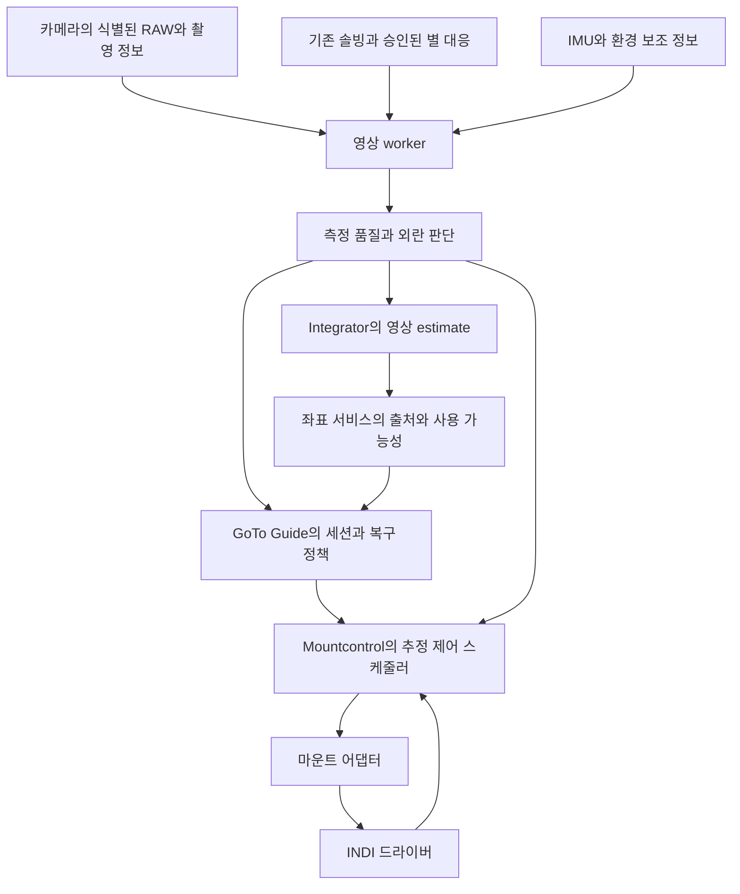

# MFNavis 환경 변화에 대응하는 부드러운 추적 보정 설계

작성일: 2026-10-03 KST

수동 정렬과 미솔빙 추적의 후속 통합은 [대상별 영상 추적 개선 계획](mf_moon_smooth_tracking_integration_plan_20261003_ko.md)을 따른다. 유효 솔빙의 즉시 정렬, 관측용 이동 완료 기준의 유한 솔빙 대기, 실패 시 중심 도착 확인을 구분하는 P6 코드를 연결했다. 새 통합 설정의 기본값은 false이고 기존 최종 시험과 새 통합 실장 시험을 분리한다. 실제 구현·시험 결과는 [최종 시험 인계](../mf_report/mf_target_tracking_integration_20261004_ko.md)를 따른다.

기본 설정 갱신: `smooth_tracking_mode`의 기본값은 On에 해당하는 `active`다. 기본값과 실제 세션 시작은 별개이며, 명시 Start·목표·검증된 장비 프로필이 있어야 명령을 허용한다. 아래 초기 Off 정책은 변경 전 기록이다.

최신 범위 확정: 기존 반복 보정에서 학습하던 예측 펄스는 제거했다. 이 문서의 새 영상 보정 엔진에 대한 예측·제한 유지 설계는 그대로 유효하다. 아래 분석 당시 기존 예측 경로에 관한 내용은 변경 전 조사 기록이다.

상태: **계약·ROI 측정·펄스/예측 제어·교정·복구 제한·웹 제어를 구현하고 실내 회귀 시험을 수행했다. 장비별 광학 응답과 최종 동작 승인은 별도다.** 구현 결과와 재현 방법은 [실내 구현·검증 보고서](../mf_report/mf_smooth_tracking_implementation_20261003_ko.md)를 따른다.

재검토일: 2026-10-03 KST. **감시 단계 구현은 진행할 수 있으나, 현재 shadow를 그대로 자동 제어에 연결할 수는 없다.** 재검토에서 촬영 시각 상한, 이벤트 역전, 좌표 기준시점, 기준별 공간 변환, 펄스 벡터 전송과 실행권 인계의 구현 계약을 보완했다. 아래 P0 조건과 단계별 합격 시험은 구현할 요구사항이며, 기존 회귀 시험 통과가 이를 충족했다는 뜻은 아니다.

검토 기준은 `main`의 HEAD `50367660`과 분석 당시 작업 디렉터리다. 작업 디렉터리에는 GoTo/Guide, 마운트 제어, 보정 재개 감시의 미커밋 변경과 `guide_drift.py`가 있다. 아래의 “현재 구현”은 이 변경까지 포함한 파일을 뜻하며, 해당 커밋만 체크아웃했을 때와 같다고 가정하지 않는다. 운영 마운트나 서비스의 현재 실행 상태를 검증한 문서는 아니다.

이 문서는 펌웨어 수정 없이 표준 마운트 명령으로 추적 오차를 부드럽게 줄이는 방법을 정한다. 특히 광해, 구름, 주변 물체의 가림과 별 오인, 바람, 관측자의 미세한 접촉이 잘못된 펄스나 GoTo를 유발하지 않게 하는 측정 승인, 제어 전환, 복구 절차를 설계한다. 기본 수단은 시간 제한이 있는 펄스 가이드다. 지원과 응답이 확인된 마운트에서만 짧은 저속 축 이동을 추가하고, 보정 능력을 초과한 경우에는 검증된 위치를 기준으로 GoTo 복구를 사용한다.

모든 환경에서 오동작이 없다는 보장은 영상과 IMU만으로 증명할 수 없다. 따라서 **근거가 부족한 상태를 추적 정상으로 간주하지 않고, 추가 보정을 보류하면서 마운트 고유 추적과 사용자의 관측 목표를 유지**하는 것을 기본 동작으로 한다. 가림 중의 정밀 추적 성능을 보장하는 것과 오인에 의한 이동을 억제하는 것은 구분한다.

## 1 요구사항과 구현 범위

### 1 1 사용자 요구사항

- GoTo 도착 후 같은 목표를 추적하고, 작은 오차와 반복되는 드리프트를 부드럽게 보정한다.
- 기계적 슬립이 펄스 보정 능력을 넘으면 한계를 일찍 판단하고, 가능한 범위에서 목표를 다시 찾는다.
- 정상인 축까지 과도하게 움직이지 않으며, 고도 슬립을 이유로 방위축 전체를 불량으로 취급하지 않는다.
- 광해와 구름 때문에 별이 줄어도 무리하게 별 검출·솔빙 기준을 낮추지 않는다.
- 창문 불빛, 가로등, 핫픽셀, 구름 가장자리 등을 별로 오인하여 보정하지 않는다.
- 바람과 관측자의 접촉으로 생긴 왕복 흔들림을 추적 오차처럼 따라가지 않는다.
- 펌웨어 변경과 특정 OnStep 전용 추가 추적 속도 명령을 요구하지 않는다.
- 기존 Stop, 추적 Off, 수동 이동, 주차, 정렬, 마운트 연결·해제의 의미를 유지한다.

### 1 2 첫 구현의 범위

첫 제어 구현은 검증된 별 기준과 펄스 가이드에 집중한다. 달 중심 측정, 최초 솔빙 없는 사용자 정렬, 비항성 천체의 영상 추적은 기존 연속성 설계와 자료 계약을 공유하되, 별 추적과 같은 승인 기준으로 자동 활성화하지 않는다. 각 경로의 검증이 끝나기 전에는 진단만 제공한다.

Alt/Az와 EQ의 좌표·드라이버 경계는 처음부터 분리한다. 경위대에서 먼저 실장 검증하되, 적도의의 RA 단위, 적위, GEM 반전, 남북 반구를 모의 시험에 포함한다. 한 마운트의 시험 결과를 상용 마운트 전체의 지원 근거로 확대하지 않는다.

관련 정본은 [Positioning 용어집](../ax/positioning/CONTEXT.md), [영상 추적 연속성 설계](mf_visual_tracking_continuity_design_ko.md), [현재 shadow 시험 안내](mf_visual_tracking_trial_ko.md)다. 본 문서는 그 설계의 환경 판단과 추적 제어를 구체화하며, 기존 사용자 정렬·대상 수명 설계를 대체하지 않는다.

## 2 구현 착수 전 소스와 설계의 비교

아래 표는 설계 검토 시점의 baseline이다. 이후 추가한 `tracking_*` / `smooth_*` 구현과 시험 결과는 위 구현 보고서에 별도로 기록한다.

| 현재 소스 | 현재 확인한 동작 | 필요한 변경 |
|---|---|---|
| [camera_interface.py](../../python/MFNavis/camera_interface.py#L540) | 촬영 전후 시각, IMU, `frame_id`, 실제 노출·gain, sensor timestamp를 게시한다. IMU가 없으면 `imu_delta`를 0으로 채우는 경로가 있다. | 노출 구간의 시각 근거와 IMU 유효 여부를 명시한다. 0이라는 값만으로 무진동을 판단하지 않는다. |
| [solver.py](../../python/MFNavis/solver.py#L154) | RAW와 solver 입력을 같은 프레임으로 pairing한다. | 새 측정도 동일 pairing 계약을 사용하고 누락된 프레임을 이웃 프레임으로 대체하지 않는다. |
| [sep_shadow.py](../../python/MFNavis/sep_shadow.py#L373) | RAW 검출에 warm pixel map, 포화 기준, 광학 조건별 cloud window gate 등을 적용한다. | 후보 검출을 측정 승인과 구분한다. morphology와 후보별 품질이 부족하면 RAW의 작은 영역에서 추가 측정한다. |
| [horizon_mask.py](../../python/MFNavis/horizon_mask.py#L90) | IMU 기준 고도 하한 아래의 후보를 제외한다. IMU가 무효이면 후보를 통과시킨다. | 수평선 위 건물·나뭇가지까지 제거하는 기능으로 간주하지 않는다. 별 기준·장면 마스크를 추가하고, IMU 무효를 “마스크 검증 완료”로 표시하지 않는다. |
| [solve_acceptance.py](../../python/MFNavis/solve_acceptance.py#L82) | 경로별 Matches, RMSE, Prob와 연속성을 검사한다. 큰 점프는 추가 프레임으로 확인한다. | 기존 승인 기준을 유지하고, 자동 이동에는 추가 제어 승인과 불확실성 경계를 둔다. |
| [solver.py](../../python/MFNavis/solver.py#L2598) | 승인된 RAW 솔빙과 검출을 shadow에 전달한다. 전처리 솔빙은 유효 관측 시각이 불명확해 shadow 기준 갱신에 사용하지 않는다. | 초기 제어도 이 제한을 유지한다. 시간 합성 영상의 마지막 frame ID만으로 최신 원본 측정으로 취급하지 않는다. |
| [visual_tracking.py](../../python/MFNavis/visual_tracking.py#L168) | 고유 대응, RANSAC, 최소 3개 대응, 공간 baseline, 잔차로 별 자세를 적합한다. | 제어에는 별 정체성, 영역 분포, rank, 불확실성, 노출·장면 변화와 재확인까지 필요하다. 3개 적합 성공은 자동 제어 승인과 같지 않다. |
| [visual_tracking.py](../../python/MFNavis/visual_tracking.py#L279) | 세대·시각·frame ID를 확인하고 솔빙 점프를 보류한다. 솔빙 기준을 잡을 때 입력 후보 전체에서 `world`를 만든다. | 처음 기준을 만들 때 카탈로그와 검증된 대응만 사용한다. 건물 불빛이 기준에 포함될 수 있는 현재 후보 전체 사용을 제어 전에 수정한다. |
| [visual_tracking.py](../../python/MFNavis/visual_tracking.py#L420) | 보정 Jacobian으로 진단용 펄스를 계산한다. 명령을 보내지 않는다. | 보정 제안과 명령 실행 사이에 환경·권한·수명·마운트 기능 검증을 둔다. |
| [visual_tracking_runtime.py](../../python/MFNavis/visual_tracking_runtime.py#L243) | 환경 manifest, 신선도, 광학·마운트 변경을 검사하는 shadow 경로다. `moving`이면 세션을 suspend한다. | 생산 경로는 사용자 이동, 자체 보정, 바람, 지속 슬립을 구분한다. 어떤 움직임이든 기준을 버리는 현재 시험 정책을 그대로 사용하지 않는다. |
| [integrator.py](../../python/MFNavis/integrator.py#L170) | `PointingEstimate`의 단일 작성자다. 솔빙 실패 시 estimate를 보존하고 IMU로 진행시킨다. | 새 영상 이벤트를 별도로 받아 estimate에 적용하되 solve 셀과 `last_solve_success`는 변경하지 않는다. |
| [integrator.py](../../python/MFNavis/integrator.py#L380) | IMU `moving`을 통해 heading drift가 위치 이동으로 누적되는 것을 억제한다. | IMU는 흔들림 보조 증거로만 사용한다. 갱신 시각이 새롭거나 moving=False라는 사실을 광학적 정지의 증명으로 사용하지 않는다. |
| [indi_goto_guide_service.py](../../python/MFNavis/indi_goto_guide_service.py#L1569) | 모드·설정·목표·마운트 이동 상태로 보정을 제한한다. 큰 오차, 펄스 악화 시 최신 솔빙으로 SYNC+GoTo 복구한다. | 세션과 복구 정책의 소유권을 유지한다. 환경 보류와 지속 오차·보정 포화를 구분한다. |
| [mountcontrol_indi.py](../../python/MFNavis/mountcontrol_indi.py#L3650) | 새 솔빙을 사용하며 보정 후 관측 경계를 둔다. 반복 악화를 세 번 확인하면 reacquire를 요청한다. | 새 제어에서는 전체 오차 악화만으로 방향 불량을 확정하지 않는다. 외란과 명령 응답을 분리하여 축별로 판단한다. |
| [guide_drift.py](../../python/MFNavis/guide_drift.py#L7) | 세 번의 솔빙, 같은 부호와 유사 속도, 최대 5″/초의 드리프트를 학습한다. 펄스 명목 이동량을 되돌려 외란을 추정한다. | 불확실성·명령 응답 모델·관측 지연을 포함하는 추정기로 확장한다. 5″/초 제한만 올리는 방식은 사용하지 않는다. |
| [mountcontrol_indi.py](../../python/MFNavis/mountcontrol_indi.py#L3822) | 0.2초 예측 주기와 최대 100ms 펄스가 있다. 위치 보정은 3초 간격, 최대 2500ms다. | 드라이버 지연·노출·완료 응답을 반영해 주기를 선택한다. 무조건 0.2초 실행을 호환성 보장으로 취급하지 않는다. |
| [mountcontrol_indi.py](../../python/MFNavis/mountcontrol_indi.py#L3957) | GoTo 접근에는 4×·8×·20×에 해당하는 짧은 물리 축 이동이 있다. | 특정 속도 인덱스와 고정 배율을 다른 마운트에 복사하지 않는다. 기능과 실제 응답이 확인된 어댑터에서만 재사용한다. |
| [latest_frame_worker.py](../../python/MFNavis/latest_frame_worker.py#L48) | 실행 중 작업과 최신 대기 작업을 제한하는 worker가 있다. | 영상 측정에 이 제한 구조를 재사용한다. 작업 freshness만으로 촬영 시각의 freshness를 대체하지 않는다. |

현재 솔빙 품질 경계는 native full-frame 기준 Matches 6개 이상, SEP 경로 7개 이상, RMSE 180″ 이하, Prob `5e-5` 이하 등이다. 이는 광각 솔빙 승인 기준이며 새 추적의 보장 정밀도가 아니다. 현재 일반 점프 확인의 2° 일치 범위도 미세 보정이나 큰 자동 이동을 승인하는 허용 오차로 재사용하지 않는다.

현재 shadow의 `max_gap_s=120`, 검색 12px, 적합 잔차 1.5px도 감시·시험 값이다. 특히 120초 동안 예측 가능하다는 상태 표시를 120초 동안 광학 확인 없이 자동 보정 가능한 것으로 해석하지 않는다.

## 3 실측 근거와 설계상 해석

[2026-10-02와 03의 기록](../mf_report/mf_guide_resume_20261002_ko.md)은 가이드가 꺼진 상태의 고고도 실제 이동 이상, 방향 전환 후 지연, GoTo 완료 판정 지연을 서로 구분한다. 기계적 하중·조임 문제에 의한 슬립은 사용자가 확인한 원인이다. 소프트웨어는 원인 이름을 확정하지 않아도 관측 오차의 증가와 실제 보정 응답을 이용해 대응할 수 있어야 한다.

조정 후 80° 정지 시험은 초기 30초 이후 약 180초 동안 IMU 고도 변화가 약 −0.000054°, 방위각 변화가 약 +0.0315°였다. 모터 주파수 조회는 모두 0이었다. 이 시험은 정지 후 고도가 안정된 근거이며, 조정 후 추적·펄스 응답의 성능 검증은 아니다. IMU 고도와 마운트 내부 고도의 절대 차이가 남았으므로 IMU 절대값을 복구 SYNC 기준으로 승격하지 않는다. 원본은 장비 로컬 `MFNavis_data/telemetry/20261003_alt80_slip_check/`에 보관한다.

마운트의 스텝 계산 좌표와 IMU는 각각 명령 위치와 자세 예측 자료다. 둘의 일치를 독립 광학 검증으로 계산하지 않는다. 새로운 제어의 평가는 카메라의 승인된 관측과 독립적인 검증 자료를 기준으로 한다.

## 4 반드시 유지할 동작 조건

1. **명령 실행자는 mountcontrol 하나다.** 영상 worker, integrator, 좌표 서비스는 마운트 명령을 직접 보내지 않는다.
2. **목표와 현재 측정을 분리한다.** 슬립·바람·솔빙 복구만으로 목표를 현재 좌표로 바꾸지 않는다. 명시적인 사용자 수동 이동·정렬의 기존 정책만 목표를 바꿀 수 있다.
3. **측정 불가를 오차 0으로 채우지 않는다.** 별이 사라지면 신뢰도와 마지막 관측 나이를 게시한다.
4. **상대 영상과 예측은 성공 솔빙이 아니다.** `pointing.camera.solve`, `pointing.aligned.solve`, Matches, `last_solve_success`를 위조하지 않는다.
5. **Stop과 사용자 제어가 자동 보정보다 우선한다.** 대기 명령을 폐기하고, 실행 중 추가 이동을 드라이버가 지원하는 방식으로 끝낸다.
6. **신선도가 없는 환경·연결·추적 상태로 명령하지 않는다.** 미확인은 허용과 구분한다. 마운트 readback 위치만으로 물리 수렴을 확인하지 않는다.
7. **하나의 관측은 한 번만 사용한다.** RAW, 전처리, 같은 프레임의 솔빙과 상대 이동은 독립 표본으로 중복 계수하지 않는다.
8. **광학·정렬·마운트 문맥이 바뀌면 이전 보정은 무효다.** crop, 렌즈·왜곡 보정, target_pixel, pier side, rotator, 위치·시각 체계 변경을 포함한다.
9. **측정이 없는 동안 보정량을 쌓지 않는다.** 보류 시 펄스 잔여량·적분량·복구 예약을 폐기한다. 구름이 걷혔다고 누적분을 한꺼번에 실행하지 않는다.
10. **자동 복구는 관측된 결과로 끝낸다.** 전송 성공이나 INDI Idle만으로 목표 도착을 확정하지 않는다.
11. **재시작으로 자동 이동을 재개하지 않는다.** 저장된 세션·보정은 진단 자료다. 새 세션과 새 측정을 확인하고 사용자 GoTo·정렬·재개 명령으로 다시 활성화한다.
12. **기본값은 기존 동작이다.** 새 기능이 Off이면 기존 모드의 동작을 유지하고, On이면 기존 펄스·예측 루프와 동시에 실행하지 않는다.

## 5 구성과 프로세스 소유권



영상 worker는 상대 자세, 별별 잔차, 관측 품질을 계산하는 순수 측정 경로다. GoTo/Guide 서비스는 목표·권한·상태 전환·재획득 정책을 소유한다. mountcontrol 안의 새 스케줄러가 승인된 측정과 명령 이력으로 외란·보정량을 계산하고 드라이버 명령을 직렬화한다. 목표·권한은 저주기로 전달하고 측정은 최신 이벤트로 전달하여 GoTo/Guide의 기존 heartbeat에 영상 측정 주기를 종속시키지 않는다.

Integrator는 광학 estimate의 단일 작성자로 남는다. 영상 자세를 적용하면 camera estimate를 갱신하고 현재 정렬을 통해 aligned estimate를 재투영한다. 같은 관측에서 파생된 estimate와 측정 이벤트가 mountcontrol에 함께 도착해도 원본 `measurement_id`로 중복 제거한다. 제어 오차는 승인된 측정과 해당 시각의 목표에서 계산하며 화면 평활화 좌표에서 역산하지 않는다.

현재 `LiveShadow`는 solver 안에서 실행되므로 솔빙 처리 지연이 측정 간격에도 영향을 준다. 단계별 생산 연결은 다음처럼 정한다.

- 첫 감시 단계는 기존 RAW 검출 결과를 공유하여 중복 full-frame 검출 없이 품질·외란 판단을 검증한다. 이 단계에서 고빈도 관측 성능을 주장하지 않는다.
- 제어 도입 전에는 별도 최신 프레임 worker에서 승인된 별 주변의 제한된 RAW 영역을 추적한다. 카메라의 식별된 RAW envelope와 소유권이 보장된 버퍼를 사용하고, 프리뷰·합성 LiveCam을 입력으로 쓰지 않는다.
- full-frame 검출과 절대 솔빙은 기존 경로를 이용한다. ROI 추적 실패가 전체 검출·솔빙을 중복 실행시키지 않도록 재획득 요청을 rate limit한다.
- 버퍼 참조가 다음 촬영으로 바뀌는 자료를 그대로 넘기지 않는다. 초기 구현은 필요한 ROI만 복사한다. 공유 메모리 도입은 lease·세대·해제 계약을 별도로 검증한 뒤 한다.

새 worker는 실행 작업 하나와 최신 대기 작업 하나만 유지한다. 늦은 결과는 촬영 나이와 세대 검사를 통과하지 못하면 폐기한다. 로그 저장과 full-frame I/O는 제어 tick에서 실행하지 않는다. CPU 과부하·worker 예외는 추가 보정 보류로 이어지고 기존 솔빙·UI·Stop 경로는 계속 실행되어야 한다.

## 6 자료 계약과 시간 모델

Integrator가 처리하는 영상 이벤트는 성공 솔빙과 별도 타입으로 둔다. 새로운 estimate 출처와 `last_visual_observation`을 추가하고, 기존 CAMERA/CAMERA_FAILED/IMU 분기와 최근 솔빙 검사를 함께 갱신한다. `solve_state=True`는 현재 pointing이 있다는 뜻이므로 영상 estimate에도 가능하지만, 이를 최근 절대 솔빙이 있다는 근거로 사용하지 않는다. frame·reference가 바뀔 때 IMU 진행의 원점을 영상 기준과 일관되게 갱신하거나 임시 보류하여 같은 물리 이동을 두 번 더하지 않는다.

아래 자료형과 모듈 이름은 제안이며 현재 API가 아니다.

| 자료 | 필수 필드와 의미 |
|---|---|
| `TrackingContext` | session_id, target_revision, alignment_revision, geometry_id, connection_epoch, control_epoch, clock_epoch, 마운트 형식, 기준 출처, 목표 계산 방법 |
| `TrackingFrame` | frame_id, capture_sequence, RAW 형상·좌표 공간, 촬영 구간, 대표 시각, 실제 노출·gain, bit depth, 포화·background 통계, IMU 유효 상태, 합성 여부 |
| `StarReference` | 검증된 별 ID와 방향, 기준 frame ID, catalog/solve 대응, descriptor와 형태, 허용 재탐색 영역, 마지막 관측, 제외 영역 |
| `TrackingMeasurement` | measurement_id, 모든 revision, 원본 frame ID, 관측 시각·나이·시각 불확실성, camera 자세 또는 접평면 오차, covariance/bound, 관측된 자유도, 품질 상태·거부 이유, 사용한 별·영역·잔차 |
| `TrackingPermission` | control_epoch, 목표·모드, 허용 보정 단계, 유효기한, 최신 Stop/사용자 명령 세대, tracking 상태의 근거 |
| `CorrectionPlan` | command_id, 원인 measurement_id, context, 명령 방식·방향·길이, 최대 이동량, expires_at_monotonic, 기대 완료 범위, 적용 응답 모델 ID |
| `CorrectionReceipt` | accepted, rejected, started, ended, unknown을 구분한 상태, 드라이버 속성 sequence, 제출·수신·예상 완료 시각, 실제 관측 응답과 불확실성 |
| `EnvironmentEvidence` | 별의 SNR·분포·잔차·유효 비율, 지역별 가림·광해·포화, 노출 전환, 흔들림 근거, 보조 SQM cloud 정보와 원본 시각 |

외부 저장에는 wall UTC를 쓰고 deadline·lease·경과 시간에는 monotonic을 쓴다. 프로세스 재시작 뒤 monotonic deadline을 재사용하지 않는다. 두 시계의 변환은 `clock_epoch`에 묶고 큰 시각 보정이나 수동 천문 시각 변경 때 추정·명령 세대를 바꾼다. 천체 계산 시각과 실제 촬영·명령 시각을 별도 필드로 둔다.

현재 카메라의 `exposure_start/end`는 capture 호출 전후 시각을 포함한다. **버퍼에 남아 있던 영상의 노출은 호출 시작보다 앞설 수 있으므로 호출 구간은 노출 시각의 보수적 경계조차 아니다.** `SensorTimestamp`, 실제 exposure, pipeline diagnostics로 드라이버별 시각 매핑을 검증한다. 매핑이 없으면 검증된 최대 버퍼 나이까지 포함한 경계를 사용하고, 그 상한도 없으면 `timing_unknown`으로 active 보정을 보류한다. 대표 시각을 최신 JSON 작성 시각으로 정하지 않는다.

센서 timestamp의 의미도 backend 계약으로 고정한다. [libcamera 문서](https://docs.libcamera.org/master/internal-api/namespacelibcamera_1_1controls.html)는 첫 행 노출과 `CLOCK_BOOTTIME`을 기술하지만, [Picamera2 설명서 6.4.1](https://datasheets.raspberrypi.com/camera/picamera2-manual.pdf)은 첫 픽셀 readout 시각에서 exposure를 빼서 노출 시작을 구한다. 필드 이름만 보고 일괄적으로 노출 절반을 더하거나 빼지 않는다. 설치 버전·센서 모드별 정의, clock domain과 변환 오차를 기록하고, suspend/resume·센서 재시작 때 재검증한다. rolling shutter는 사용한 ROI 행들의 노출 구간 합집합과 행간 시각차를 포함한다. 시각차에 의한 예상 이동이 오차 예산을 넘으면 단일 자세 적합을 승인하지 않는다.

노출 도중의 펄스는 이미지에 시간 평균으로 반영된다. 외란 추정에는 노출 구간과 명령 구간의 overlap, 드라이버 응답 지연을 반영한다. 최종 위치를 확인하는 솔빙은 이동·펄스 종료 이후 노출된 새 프레임을 요구한다. 진행 중 펄스와 겹친 영상은 모델이 유효한 경우의 추정 자료이며 “도착 확인”으로 사용하지 않는다.

예측을 포함한 총 방향 불확실성은 관측·기준·시각·외란·보정 응답의 오차를 포함한다. 공통 RAW에서 나온 솔빙과 상대 측정, IMU로 예측한 검색 위치와 그 검색으로 얻은 측정은 독립 오차로 가정하지 않는다. 초기에는 교차 상관을 낙관적으로 무시한 공분산 대신 보수적 상한도 허용한다.

### 6 1 이벤트 식별과 역순 도착

`TrackingFrame`에는 `capture_epoch`와 단조 증가 `capture_sequence`, `TrackingContext`에는 `reference_revision`, `coordinate_frame_id`, `response_model_revision`을 추가한다. 세션 ID는 프로세스 재시작을 구분해야 한다. 중복 판정의 원본 키는 `(capture_epoch, capture_sequence)`이며, 처리기별 `measurement_id`만 비교해서 같은 RAW의 솔빙과 영상 추적을 두 관측으로 세지 않는다. 이전 프로세스의 epoch는 새 프로세스의 sequence와 수치 비교하지 않는다.

품질 mailbox의 `quality_revision`은 완료 순서가 아니라 **단일 수신 조정자가 관측 순서를 검사한 뒤** 증가시킨다. 프레임 102의 invalid 이후 늦게 끝난 101의 valid는 hold를 해제하지 못한다. 같은 프레임에서 판단이 충돌하면 보류가 우선한다. worker 사망·Stop 같은 비영상 사건은 별도 fault/control epoch로 즉시 latch하고, 과거 valid 결과로 해제하지 않는다. 새 프레임이 아직 없는 tick과 새 프레임이 invalid인 사건은 구분한다.

Integrator에는 solve 기록 갱신과 현재 estimate 적용을 분리하는 처리가 필요하다. 현재 [_apply_successful_solve](../../python/MFNavis/integrator.py#L278)는 solve·estimate·IMU 원점을 함께 덮어쓰므로 단순 VISUAL 분기 추가로는 충분하지 않다.

| 도착 사건 | 첫 구현의 처리 |
|---|---|
| 최신 영상보다 오래된 성공 솔빙 | 같은 문맥의 더 최신 solve 기록이면 solve 셀·진단은 갱신할 수 있다. 현재 estimate 시각과 영상 원점은 되돌리지 않는다. 제어 reference 교체는 현재 시각으로 검증해 연결할 수 있을 때만 하고, 불가능하면 재획득한다. |
| 영상과 같은 RAW의 성공 솔빙 | 절대 기준으로 대체·보강할 수 있으나 확인 횟수·위치 펄스 예산은 추가하지 않는다. |
| 늦은 실패 솔빙 | attempt/진단의 시각 순서를 확인해 기록한다. 더 최신 영상 estimate의 출처·유효 시각을 CAMERA_FAILED로 덮어쓰지 않는다. |
| 영상 적용 뒤 IMU 갱신 | 영상 관측 시각에 대응하는 검증된 IMU 원점을 별도로 사용한다. 그 원점이 없으면 IMU 진행을 보류한다. 이전 plate solve 원점의 예측으로 영상 보정을 지우지 않는다. |

`last_visual_observation`, estimate provenance, 마지막 성공 solve의 기록은 별도 필드다. `last_solve_success`와 `last_solve_attempt`도 늦은 이벤트로 감소시키지 않는다. 첫 버전은 과거 상태 전체 재추정 없이 오래된 결과의 현재 estimate 적용을 거부한다. `_realign_estimate`도 마지막 solve plate와 현재 영상 자세의 역할을 구분하도록 수정하고, 재정렬이 과거 IMU 원점을 복원하지 않는지 시험한다.

### 6 2 좌표 기준과 단위

RA/Dec 숫자만 전달하지 않고 `frame/equinox`, catalog DB 식별자·고유운동 기준시점, 관측 천문 UTC, 위치 revision, 대기굴절 정책을 함께 전달한다. 첫 별 제어의 기준은 승인된 catalog 좌표계로 통일하고, 겉보기·수평 좌표와 마운트 명령 좌표로의 변환은 이름 있는 경계에서 한 번만 수행한다. 단순히 `JNow`라고 적어 겉보기·기하·굴절 좌표를 같은 것으로 취급하지 않는다.

[INDI 표준](https://docs.indilib.org/drivers/standard-properties/)은 `EQUATORIAL_COORD`를 J2000, `EQUATORIAL_EOD_COORD`를 date 기준으로 구분하며 RA 단위는 시간이다. 현재 [sync_mount](../../python/MFNavis/mountcontrol_indi.py#L4379)와 verified Sync+GoTo의 송신 구간은 RA를 15로 나누지만 그 자체가 기준시점 변환은 아니다. [solver의 epoch 제거](../../python/MFNavis/solver.py#L2774) 전에 reference에 출처를 보존하고, 호출자의 실제 좌표계부터 송신·수신까지 전 경로를 검증한다. adapter가 요구하는 좌표계가 미확인이면 새 자동 Sync+GoTo는 지원하지 않는다.

제어 내부는 각오차 `arcsec`, 시간 간격 `s`, 펄스 길이 `ms`, 응답 `arcsec/ms`로 고정한다. 카메라 중심과 망원경 `target_pixel` 방향, 물리 축과 하늘 접평면을 각각 구분한다. 구면 벡터로 새 접평면을 만들 때 이전 오차·속도·공분산·응답 행렬을 동일 basis로 운반하거나 모두 다시 초기화한다. 프레임마다 basis만 바꾸고 이전 2차원 속도를 그대로 더하지 않는다.

## 7 환경에 따른 측정 승인

### 7 1 판단 순서

단일 점수의 평균이 높은 것만으로 승인하지 않는다. 아래의 필수 조건은 점수와 별개로 통과해야 한다.

1. 프레임·시각·세대·RAW 공간이 일치하고, 합성·blank·test 프레임이 아니다.
2. 유효한 광학·정렬 기준이 있으며 현재 마운트 문맥과 일치한다.
3. 별 정체성이 기준과 일치하고, 가림·포화·핫픽셀 후보를 제외했다.
4. 대응이 모호하지 않고, 자세를 결정할 공간 분포와 관측 rank가 있다.
5. 잔차·모델 간 경쟁·시각 나이를 반영한 불확실성이 제어 한계 이하다.
6. 새 측정이 연속 관측과 모순되지 않거나, 별도의 재확인 절차로 설명된다.
7. 추가 이동의 권한과 마운트 상태가 유효하다.

결과는 `valid`, `degraded`, `invalid`, `unknown`과 구체 사유로 게시한다. `valid`도 허용 보정 단계를 별도로 가진다. 진단에 유용한 2개 별, Roll 미관측, 공간 편중된 측정을 자동 고속 복구 근거로 사용하지 않는다.

### 7 2 광해와 별 오인

기준은 승인된 솔빙의 matched star와 catalog ID에서 만든다. 현재 shadow처럼 모든 검출 후보를 하늘 기준에 올리는 방식은 제어 경로에서 금지한다. 전체 화면 솔빙이 게시 전에 matched 정보를 제거하는 경로는 제거 전에 원본 공간·관측 시각·왜곡 보정 ID를 붙인 별도 reference 이벤트를 만든다. SQM 입력의 기존 공간 계약을 바꾸지 않는다.

reference 생성은 [solver의 matched 제거](../../python/MFNavis/solver.py#L2711) 전에 승인된 RAW 결과를 복사하는 지점에 연결한다. `matched_centroids[i]`, `matched_stars[i]`, `matched_catID[i]`의 대응을 보존하고 공통 mask로 필터한다. 길이 불일치·중복 ID·비유한 방향은 거부한다. tetra3의 ID는 `None`, 스칼라 목록, 복합 ID 목록일 수 있다. ID 없는 DB에서는 이름을 만들어 교차 reference 대응에 쓰지 않고 첫 active 버전을 제한한다. 필요하면 DB 해시와 안정된 catalog 행 ID를 내보내는 계약을 먼저 구현한다.

좌표 변환 순서는 `sensor RAW → 왜곡 제거 → solver canvas 회전 → 카메라 ray`이며 ROI 좌표에는 먼저 RAW 원점을 더한다. RAW ROI 추출 위치는 역회전 후 재왜곡으로 계산한다. 현재 [LiveShadow._observe](../../python/MFNavis/visual_tracking_runtime.py#L243)는 검출점을 왜곡 제거하지만 `target_pixel`에는 full-frame 크기 변환만 수행한다. 생산 경로는 [solver_frame_map](../../python/MFNavis/solver_frame_map.py#L84)의 크기 변환을 왜곡 보정으로 오인하지 않고 **별과 target에 같은 광학 변환**을 적용해야 한다. 회전 0/90/180/270°, 비정사각 센서, 중심 밖 target, ROI 원점과 pixel-center 규약을 포함한 왕복 투영 시험으로 확인한다. 광각 주변 잔차가 예산을 넘으면 허용 영역을 줄인다.

재솔빙은 원래 관측 목표를 바꾸지 않는다. 새 reference와 이전 reference의 동일 시각 target 방향 차이를 비교하고, 기준 교체의 불연속이 허용 오차를 넘으면 `REACQUIRING`으로 이동한다. 별 구성 변경만으로 생긴 centroid bias를 실제 drift로 학습하지 않는다. reference에는 유효 시간·자세 범위와 절대 기준 오차 상한을 두고, 재확인이 계속 실패하면 상대 추적 성공만으로 무기한 연장하지 않는다.

별 후보에는 지역 background·gradient, SNR, 폭·늘어짐, 포화 여부, 근접 후보 모호성, bright halo·선 구조와의 거리를 기록한다. 광해가 심한 영역만 제외하고 영상 전체의 평균 밝기만으로 정상을 판단하지 않는다. 형태 하나만으로 별을 확정하지 않으며, 밝기나 색의 절대값을 유지 조건으로 쓰지 않는다.

별 대응은 one-to-one와 상호 모호성 검사를 유지하고, 카탈로그 투영·시간 이력·공통 회전 적합·영역별 합의를 함께 사용한다. 수평선 마스크 외에 사용자가 지정한 방해 영역과 보수적으로 감지한 건물·나뭇가지·광륜 영역을 사용할 수 있다. 고정 RAW 핫픽셀과 하늘 기준·지상 장면의 서로 다른 운동 모델을 비교하되, 짧은 구간에서는 두 모델을 구분하지 못할 수 있음을 명시한다.

주요 원칙은 **반복 검출 자체가 별임을 증명하지 않는다는 것**이다. 고정 창문 불빛도 여러 프레임에 남는다. 같은 프레임을 RAW·전처리로 재검출한 결과도 확인 횟수를 늘리지 않는다. 두 모델의 우열이 불명확하거나 가림 후 원래 별이 유사한 불빛으로 대체되었을 가능성이 있으면 `ambiguous_scene`으로 보류한다.

재탐색 반경은 마지막 검증 시각, 예상 운동, 불확실성에 따라 제한한다. 별을 놓쳤다고 반경을 무한히 넓혀 가장 가까운 점을 채택하지 않는다. 새 reference 별은 카탈로그 또는 충분한 기존 별과의 독립 검증을 거쳐 넣는다. 기준·마스크를 갱신하는 자료도 승인된 구간만 사용하여 구름 가장자리나 지상 불빛을 “정상 별”로 학습하지 않는다.

### 7 3 구름과 노출 변화

구름의 판단에는 원래 보이던 별의 지역별 소실률, SNR·투과량 감소, background 변화와 적합 잔차를 사용한다. 초기 맑은 하늘 기준은 승인된 관측에서만 갱신한다. 처음부터 구름이 낀 경우 기준이 없다는 사실을 맑음으로 채우지 않는다. 필드 이동, 고도, 노출·gain 변경은 정상적인 별 수·밝기 변화를 만들 수 있으므로 문맥으로 보정하거나 기준을 다시 설정한다.

[SQM CloudEstimator](../../python/MFNavis/sqm/clouds.py#L58)는 솔빙·측광 자료와 baseline에 의존하는 보조 자료다. 솔빙이 실패하는 바로 그 상황에서 정보가 오래되거나 없을 수 있으므로 새 제어의 유일한 cloud 판정으로 사용하지 않는다. 값이 없거나 늦으면 `unknown`이며, 광학 측정이 좋은 영역까지 무조건 금지하는 단일 스위치로 사용하지 않는다.

얇은 구름에서 남은 별의 위치가 일관되고 공간 분포·오차 상한이 충분하면 낮은 이득의 측정 보정을 허용한다. 별 수가 줄었다는 이유만으로 target을 바꾸거나 Sync/GoTo를 보내지 않는다. thick cloud나 완전 가림에서는 신규 위치 보정과 속도 재학습을 중단한다. 2026-10-03 사용자 결정에 따라, 별 소실 전 검증한 속도만 `PREDICTION_COAST`에서 장비별 시간·불확실성·누적 이동 한도 안에 유지할 수 있다. `coast_verified=False`인 미검증 프로필은 즉시 추가 펄스를 중단한다. 가림 전에 학습한 속도를 120초간 계속 보정하는 기본 정책은 채택하지 않는다.

노출·gain이 바뀌면 실제 적용값과 드라이버의 안정화 프레임을 확인한다. 전환 프레임은 속도·응답 학습에서 제외한다. 기존 auto-exposure는 계속 소유권을 가지며, 추적 쪽은 최대 허용 motion blur 등 제약만 전달한다. 두 루프가 서로 직접 gain을 올렸다 내렸다 하지 않도록 최소 유지 시간과 bounded 요청을 둔다. 검출 실패 때문에 솔빙 확률 기준을 낮추는 자동 경로를 만들지 않는다.

### 7 4 가림과 별 분포의 변화

가림은 영상 전체 또는 일부 영역에서 발생할 수 있다. 남은 별이 화면 한쪽에 몰리면 평균 잔차가 작더라도 target_pixel 부근 자세가 부정확할 수 있다. convex hull, 영역 수, baseline의 두 축 rank, target까지의 외삽 거리로 품질을 제한한다. 현재 `min_baseline_px`의 단일 거리 검사만으로는 이 분포 검증을 대체할 수 없다.

유효 별 수가 기준 아래이거나 Roll을 확인할 수 없으면 첫 버전은 광학 보정을 보류한다. 부분 자유도만 관측하는 후속 기능은 `observed_dof`를 명시하고 검증된 축 투영만 제한적으로 사용해야 한다. 1개 밝은 점으로 전체 방향·Roll을 만들어내지 않는다.

완전 가림에서 기본 추적은 유지한다. 추가 보정은 검증된 짧은 예측 유지 한도까지만 허용하고 이후 멈춘다. 복귀 시 독립된 새 프레임들에서 같은 별 정체성과 새 자세를 확인하고 ramp를 0에서 시작한다. 큰 위치 차이는 별도의 절대 솔빙 재획득을 요구한다. 가림 직전의 마지막 위치 오차나 펄스 잔여량은 복귀 때 재사용하지 않는다.

## 8 바람과 관측자 접촉의 처리

### 8 1 원인 이름보다 관측 형태를 판단한다

영상·IMU만으로 바람과 사람의 터치, stick-slip을 항상 구분할 수는 없다. 분류 결과는 `oscillatory`, `step_pending`, `persistent_drift`, `commanded_motion`, `unknown`처럼 제어에 필요한 형태로 둔다. 사용자 명령으로 확인된 수동 이동만 `user_manual`로 판단한다. IMU moving만으로 목표 변경이나 재정렬을 실행하지 않는다.

왕복 흔들림은 복수 프레임의 고주파 잔차·부호 반전·늘어진 별과 IMU의 보조 흔들림 근거로 탐지한다. 한 번의 sign reversal을 원인 증명으로 쓰지 않는다. 정상적으로 보낸 펄스와 마운트의 고유 추적·시야 회전은 예상 운동에서 제거한 뒤 잔차를 판단한다.

### 8 2 왕복 흔들림과 남는 위치 오차

왕복 진동이 hold 조건을 충족하면 drift 학습을 중단하고 신규 추가 속도 요구를 즉시 0으로 만든다. 진입 시 감속 ramp로 신규 펄스를 더 보내지 않으며, 이미 실행된 패킷은 13절의 중단 규칙을 따른다. 고속 복구는 보류한다. 낮은 주파수의 평균 오차를 따로 관측하되 진동보다 늦은 필터가 반대 방향으로 과잉 보정하지 않도록 latency와 bandwidth를 제한한다. 측정 주기보다 빠른 진동은 모터로 상쇄하려 하지 않는다.

터치로 순간 이동이 보이면 `step_pending`으로 들어가 신규 펄스를 보류하고 별 신원을 유지한 채 다음 프레임을 기다린다. 원래 위치로 돌아오면 재중심 이동 없이 추적을 재개한다. 흔들림이 가라앉은 뒤 같은 방향의 오차가 연속 관측으로 확인되면 step으로 승인하고, 기존 목표로 낮은 이득의 복귀를 시작한다. 대량 Sync/GoTo는 절대 기준까지 확인한 후에만 허용한다.

지속 슬립처럼 위치가 계속 한쪽으로 밀리면 “scope moving”으로 영구 대기하지 않는다. 영상 별 신원이 유지되고, 노출 품질과 잔차가 유효하고, 명시적 사용자 이동이 없으며, 여러 구간에서 잔차 속도가 일관된 경우만 `persistent_drift`로 승인한다. 사람의 지속적인 밀기와 구분할 수 없는 큰 이동은 `unknown`으로 보류한다. 복구 시도에는 최대 이동량과 관측 확인 간격을 둔다.

### 8 3 IMU의 역할

IMU는 노출 중 흔들림, 급격한 이동과 검색 예측을 돕는다. 필터링된 quaternion이 오래 같은 값을 유지하거나 yaw drift가 있어도 새로운 timestamp가 게시될 수 있다. 양 끝 quaternion 차이가 작다는 사실만으로 노출 도중의 왕복 흔들림이 없다고 판단하지 않는다. 반대로 moving이 계속 True여도 좋은 영상이 충분한 경우 추가 근거로 판단한다.

기본 동작에 gyro·accel 원시값이 항상 있다고 가정하지 않는다. 원시 샘플이 없으면 관련 feature는 unknown으로 두고 영상 morphology·연속 잔차를 사용한다. 새 기능을 위해 별도 프로세스가 BNO055 I2C를 중복 조회하는 방식은 사용하지 않는다. 센서 데이터의 추가 수집은 기존 IMU 프로세스의 소유권 아래에서만 수행한다.

## 9 측정 승인과 제어 상태의 분리

측정 품질 상태와 마운트 제어 상태를 각각 유지한다. 별을 잃었다는 사건을 `pulse_bad`나 복구 실패와 같은 카운터로 처리하지 않는다.

| 제어 상태 | 진입 조건 | 허용 행동과 종료 조건 |
|---|---|---|
| `DISABLED` | 모드 Off, 추적 보정 Off, 명시 Stop, 권한 철회 또는 세션 없음 | 신규 자동 명령 없음. 사용자 GoTo·정렬·재개 정책으로만 활성화한다. |
| `ACQUIRING` | 새 목표, 정렬·광학·connection 세대 변경 | 기준·기능·보정 응답과 새 측정 확인. 이전 보정 예약 없음. |
| `FINE_TRACKING` | 유효 측정, 작은 오차, 유효 응답 모델 | 제한된 예측·위치 펄스. 관측 나이·권한이 만료되면 보류한다. |
| `DEGRADED_TRACKING` | 남은 별로 위치는 확인되나 품질 저하 | 이득·최대 펄스·예측 시간을 줄인다. 새 응답 학습과 고속 복구는 금지한다. |
| `QUALITY_HOLD` | 가림, 모호한 대응, 노출 전환, 오래된 측정 | 신규 추가 보정 0, 잔여량 폐기. 기본 추적 유지. 새 측정을 재확인한다. |
| `DISTURBANCE_HOLD` | 왕복 흔들림, 미확인 step·큰 외란 | 신규 펄스와 복구 보류. target 유지. 안정 후 남는 오차만 승인한다. |
| `PREDICTION_COAST` | 기준 별 일시 소실, 직전 검증 드리프트와 승인된 짧은 한도 | 위치 보정·학습·고속 복구 없이 한도 내 마지막 예측만 유지. 초과 시 hold. |
| `PULSE_RECOVERY` | 유효한 지속 오차, 펄스로 수렴 가능 | 보정 비율을 점진적으로 높이고 진행을 확인한다. 정밀 band에서 감속한다. |
| `AXIS_RECOVERY` | 펄스 부족, 확인된 짧은 축 이동 기능·응답 | 한 번의 제한 이동 후 정지와 새 광학 관측. 자체 이동을 사용자 retarget로 처리하지 않는다. |
| `GOTO_RECOVERY` | 신뢰 가능한 절대 기준, 펄스·축 이동으로 회복 불가, 복구 허용 | 기존 검증된 Sync+GoTo 수명 사용. 도착 후 새 솔빙으로 판정한다. |
| `REACQUIRING` | 품질 복귀, 큰 오차 후보, 복구 도착 | 새로운 독립 관측을 확인하고 drift와 ramp를 재설정한다. |
| `LIMITED` | 보정 능력 부족·응답 불량·한도 반복 도달 | 기본 추적과 상태 알림. 동일 근거의 무한 GoTo 반복 금지. 새 근거·재개 정책이 필요하다. |

기본 전이는 `ACQUIRING → FINE_TRACKING → PULSE_RECOVERY → AXIS/GOTO_RECOVERY → REACQUIRING`이다. 어디서든 품질이 사라지면 QUALITY_HOLD, 미확인 흔들림이면 DISTURBANCE_HOLD로 이동한다. Stop·주차·연결 세대 변경은 정상 전이보다 먼저 처리한다.

보류는 기본 추적 Off와 다르다. 기존 마운트 고유 추적을 유지하고 UI에는 “추적 유지, 영상 보정 보류”와 이유를 표시한다. 드라이버가 abort 시 기본 추적까지 멈추는 경우에는 관측 복귀를 이유로 자동 재활성화하지 않고 실제 상태와 기존 사용자 정책을 따른다.

### 9 1 전이 우선순위와 기존 엔진 인계

같은 tick의 우선순위는 `Stop/추적 Off/park/연결 무효 → 사용자 이동·정렬 → 권한/시각/품질 무효 → 외란 hold → 복구 → 미세 보정`이다. `DISABLED`는 명시적 비활성 latch이며 영상 복귀로 해제하지 않는다. active 세션의 단순 permission 만료는 `QUALITY_HOLD`로 처리하고, 살아 있는 정책 소유자가 새 lease와 새 관측으로 재획득할 수 있다. 서비스 재시작은 별도 세션이므로 사용자 활성화를 다시 요구한다.

실행권은 mountcontrol이 소유하는 `engine_owner=none|legacy|visual|recovery|user`와 `owner_epoch`로 관리한다. 설정 변경만으로 소유권을 즉시 넘기지 않는다.

1. 기존 owner의 신규 발행을 막고 epoch를 증가시켜 대기 계획·drift·잔여량을 폐기한다.
2. 실행 중 pulse/motion과 `_pending_sync_goto`, `_pending_goto_refine`, 지연 rate 복원 작업을 종료·취소한다. 기존 보정 tick과 서비스의 재GoTo 발행도 동일 owner 검사에 포함한다.
3. 종료 또는 검증된 최장 종료 경계를 확인한다. unknown이면 owner를 넘기지 않고 hold한다.
4. 새 owner는 경계 이후 노출된 새 관측과 새 permission으로만 활성화한다. active→Off도 같은 인계 절차를 거쳐 legacy로 복귀하며, visual 실패는 자동 legacy 복귀 조건이 아니다.

`shadow`는 명령 실행권을 갖지 않는다. 기존 엔진이 동작하는 중 shadow를 평가할 때에는 그 명령 이력을 관측에 첨부한다. MFNavis 내부 실행권이 다른 INDI 클라이언트·핸드컨트롤러까지 배타적으로 잠그는 것은 아니다. 외부 가이더와의 동시 제어는 지원하지 않으며, 예기치 않은 rate·tracking·motion 변경은 모델을 무효화하고 hold한다.

## 10 부드러운 펄스 제어

### 10 1 오차의 좌표계

관측 시각에서 목표와 aligned 방향의 차이를 구면상의 단위벡터·접평면 두 성분으로 구한다. 부호 정의는 “측정 방향에서 목표로 필요한 보정”으로 통일한다. RA wrap, 높은 적위·고도, 시야 회전을 처리하고, 단순 RA 차이나 화면 longitude 최댓값만으로 복구 여부를 결정하지 않는다.

화면에 쓰는 axis error와 광학 각거리, 실제 mount command의 양은 별도로 기록한다. 현재 `max(separation, axis_error)` 기준은 기존 제어에서 유지하되 새 엔진에서는 공통 접평면 오차와 어댑터의 축 부담으로 판단한다.

경위대의 물리 Alt/Az와 펄스의 N/S/E/W는 항상 같지 않다. EQ에서도 RA 명령과 하늘 접평면 이동의 cos(Dec) 효과가 다르다. 실제 응답으로 얻은 두 방향의 행렬과 드라이버 의미를 사용한다. 고도 슬립에 필요한 펄스가 N/S와 E/W 양쪽일 수 있으며, 이를 방위축 슬립의 증거로 보지 않는다.

### 10 2 외란 추정과 제어식

`e(t)`를 목표까지 필요한 접평면 보정, `d(t)`를 현재 기본 추적 아래에서 남는 오차 증가 속도, `B`를 추가 펄스 시간에서 접평면 이동으로 변환하는 응답 행렬로 둔다. 정상 목표 운동은 같은 시각의 목표 계산에 이미 반영되므로 `d`에 항성 속도나 비항성 속도를 다시 더하지 않는다. 아래 이산식은 노출 사이의 명령 효과가 분리된 경우의 근사다.

```text
측정 모델:  e[k+1] = e[k] + d[k] * Δt - B[k] * applied_pulse[k] + noise
명령 요구:  v_req = Kp * deadband(e_pred) + confidence_d * d_hat
명령 제한:  v_cmd = ramp(saturate(v_req, verified_capacity), previous_cmd)
펄스 예산:  B * pulse_ms ≈ v_cmd * next_command_interval
```

이 식은 방향·단위 계약이며, 고정 Kp나 모든 마운트에 같은 응답 행렬을 요구하지 않는다. `e_pred`는 촬영 대표 시각에서 예정 명령 시작까지 진행시킨 오차다. 시각 매핑이나 외란 모델이 불확실하면 예측 성분을 0으로 하고 낮은 이득의 위치 보정만 사용한다.

단, 낮은 이득도 시각·방향 오차 상한이 유효할 때만 허용한다. 제어 오차의 상한이 deadband나 예정 보정량보다 크면 신규 명령은 0이다. `Kp` 단위는 `1/s`다. 부호 확인용 1축 예에서 `e=+10″`, `d=+2″/s`, `Δt=1s`, 양의 보정 응답 `B=0.01″/ms`, 실행 길이 `100ms`이면 다음 오차는 `+11″`다. 오차가 증가했어도 펄스 방향 불량은 아니며, 그 구간의 보정량이 외란보다 작은 것이다.

노출과 pulse가 겹치는 경우 `applied_pulse`를 구간 내 송신 ms 합으로 대체하지 않는다. 대표 시각도 노출 중간값이라는 이유만으로 순간 자세가 되지는 않는다. 다음 모델에서 `w_i`는 합이 1인 노출 가중치, `C(t)`는 명령 이력과 응답 지연으로 계산한 누적 추가 이동이다.

```text
관측:              e_bar[i] = integral(w_i(t) * e(t), dt)
관측에 반영된 보정: C_bar[i] = integral(w_i(t) * C(t), dt)
외란 추정:          d_hat ≈ (e_bar[j] - e_bar[i] + C_bar[j] - C_bar[i]) / Δt
```

이는 외란 속도가 구간에서 거의 일정하고 관측이 같은 basis에 있을 때의 모델이다. 완료된 pulse도 이전 노출에 일부 반영되어 있을 수 있다. 첫 P3는 복잡한 노출 적분을 필수로 구현하는 대신 **명령 종료·정착 경계가 노출 시작 하한보다 확실히 앞선 관측만** 응답 학습·위치 확인에 사용한다. 정확히는 `exposure_start_min > command_end_max + settle_s`를 요구한다. overlap 관측은 진단용으로 남기며, 경계를 알 수 없으면 학습하지 않는다. 연속 pulse 때문에 clean 관측이 없으면 의도적으로 관측 창을 확보하고 그 시간을 capacity에서 차감한다.

방향별 응답이 비대칭이면 `B=[b_N,b_S,b_E,b_W]`인 2×4 행렬과 0 이상의 네 duration을 사용한다. 두 열의 부호만 뒤집는 2×2 모델은 반대 방향 응답의 대칭성이 확인된 경우에만 사용한다. 같은 축의 반대 방향을 한 패킷에 함께 배정하지 않는다. 직렬 드라이버에서는 `sum(pulse_ms)/1000 + I/O·정착·관측 예약시간 ≤ 계획 구간`을 만족시키고, 공통 0~1 배율로 요구 벡터를 줄이는 등 검증된 제한기를 쓴다. ill-conditioned 행렬을 무조건 역행렬로 풀거나 축별 clip 후 실제 방향 변화를 무시하지 않는다.

외란은 여러 개의 독립된 광학 측정으로 robust하게 추정한다. 명령 이력에서 승인·실행·미확인을 구분하며, 응답 불확실성까지 포함해 관측에서 명령 이동량을 제거한다. 전송 ack만 받은 펄스를 정확히 실행된 이동량으로 간주하지 않는다. 가림, step, 노출 전환, 응답 불량은 정상 drift 학습에서 제외한다.

초기 구현은 적분항 없이 위치 비례 보정과 검증된 속도 예측으로 시작한다. 지속 편차 보정에 적분항이 필요해지는 후속 단계는 saturation·hold에서 누적을 중단하는 anti-windup을 필수로 한다. 같은 슬립을 drift 예측과 위치 차이에 완전한 이득으로 중복 반영하지 않도록 replay로 조정한다.

### 10 3 펄스 스케줄링

길고 드문 펄스를 기본으로 삼기보다, 드라이버 지연과 최소 유효 펄스 길이보다 충분히 긴 작은 펄스를 계획된 간격에 분산한다. 너무 짧은 펄스는 마운트 dead time·양자화 때문에 움직이지 않을 수 있으므로 실측 최소값을 사용한다. 펄스 예산의 잔여량은 작고 유효한 관측 동안에만 보존하며, 최대 한 패킷 이하로 제한한다.

한 축의 펄스가 끝나기 전에 같은 축에 새 펄스를 보내지 않는다. 양 축 동시 실행은 드라이버 기능·실측 응답이 확인된 경우만 허용한다. 직렬화해야 하는 드라이버는 양 축이 같은 시간 예산을 경쟁한다는 사실을 capacity 계산에 포함한다. 같은 측정을 5번 읽었다고 위치 펄스를 5번 보내지 않는다. 새 측정 사이의 예측 명령은 유효한 모델과 짧은 permission lease에 묶는다.

미세 오차는 측정 오차 상한·응답 deadband보다 클 때만 보정한다. 정밀 목표 band에서는 펄스 duty와 위치 이득을 줄인다. 작아지는 오차의 예상 도착 시간을 사용해 일찍 감속하고, 부호 전환은 잡음 범위를 벗어난 독립 관측으로 확인한다.

위치 예산은 원본 관측 키당 한 번 생성한다. 여러 패킷으로 나눌 때도 이미 보낸 양을 차감하며 다음 tick에서 같은 오차로 예산을 다시 만들지 않는다. 예측 예산은 별도의 `prediction_step_id`와 짧은 horizon으로 식별하고 이미 발행한 구간과 겹치지 않게 한다. 관측 나이 상한·permission·모델 validity 중 가장 먼저 끝나는 시각까지만 허용한다. drift 학습을 위해 같은 표본을 보관하는 것은 가능하지만 독립 확인 횟수는 늘리지 않는다.

### 10 4 이득과 응답 학습

사용자 또는 확인된 자동 시험 세션에서 짧은 펄스의 부호, 지연, 이동량, 축 간 결합을 측정한다. 변화량은 정상 천체 운동과 실제 보낸 명령을 분리해 계산한다. 입력이 충분하지 않거나 측정 잡음보다 작은 펄스로 나온 gain은 채택하지 않는다.

최초 응답 모델이 없는 상태에서 `ACQUIRING`이 무한 대기하거나 임의의 방향 모델을 채우지 않도록 calibration 경로를 따로 둔다. 사용자가 시작한 시험 세션에만 `purpose=calibration` permission을 부여하고, 자동 목표 추적은 멈춘 채 한 방향씩 제한 probe와 전후의 새 관측을 수집한다. drift를 분리할 무명령 구간과 방향별 반복 자료를 확보하고, 충분한 신호를 얻으려고 정해진 최대 pulse·이동 범위를 넘어 증폭하지 않는다. 실패 시 모델은 무효이며 active 추적을 시작하지 않는다. 기존 제어·외부 가이더가 동시에 동작한 자료를 자동 calibration으로 채택하지 않는다.

추적 중 보낸 펄스로 응답을 보수적으로 갱신할 수는 있지만, 빠르게 달라지는 slip과 동시에 actuator gain을 자유롭게 학습하면 둘을 식별할 수 없다. 환경·자세·외란이 안정되고 양쪽 응답을 분리할 자료가 있을 때만 bounded 업데이트를 한다. 응답 부호는 한 번의 악화 관측으로 자동 반전하지 않는다.

기존 per-axis inversion 설정은 사용자의 명시 보정으로 유지한다. 드라이버·마운트·guide rate·광학·pier side가 바뀌면 모델 validity를 다시 확인한다. Alt/Az의 응답 행렬은 자세·시야 회전에 따라 달라지므로 위치 의존 모델 또는 작은 허용 자세 범위를 둔다. 오래된 단일 Jacobian을 천정 근처까지 그대로 적용하지 않는다.

## 11 펄스 한계와 단계적 복구

### 11 1 크기만으로 전환하지 않는다

펄스의 최대 길이, 최소 유효 길이, 전송 지연, 관측·정착 시간, 동시 실행 제한, 실제 응답으로 유효 보정 capacity를 추정한다. 큰 오차라도 줄어들고 있으면 PULSE_RECOVERY를 유지할 수 있다. 작은 오차라도 신뢰 가능한 증가 속도가 capacity를 넘거나 예상 허용 오차까지의 시간이 짧으면 조기 복구를 검토한다.

예를 들어 명목상 15″/초의 보정도 실제 펄스 duty가 절반이면 평균 이동은 7.5″/초 정도다. 단, 이 예는 한 방향의 단순 설명이며 Alt/Az나 두 축 결합에서 고도 보정 한계를 직접 뜻하지 않는다. 실제 판단은 응답 행렬의 가능한 이동 집합과 관측 오차 벡터를 비교한다.

`pulse_saturated`는 요구가 한도에 걸린 상태, `pulse_ineffective`는 실제 응답이 기대와 맞지 않는 상태, `external_drift_exceeds_capacity`는 정상 응답이어도 외란을 감당하지 못하는 상태다. 세 상태를 현재의 단일 `pulse_alignment_unreliable`에 합치지 않는다.

### 11 2 짧은 축 이동

펄스로 회복 시간이 너무 길거나 지속 외란을 상쇄하지 못하면, 기능과 실제 응답이 확인된 경우 짧은 축 이동으로 전환한다. 이때 전 단계 펄스 종료를 확인하고, 보정하려는 물리 축 방향과 예상 실제 이동량을 어댑터에서 계산한다.

축별 명령을 분리할 수 있을 때 큰 성분의 축부터 제한 이동하고 작은 성분은 다음 관측까지 보존한다. 그러나 드라이버가 수동 축 이동 동안 양 축 추적을 바꾸는 경우가 있어 “방위축은 항상 그대로”를 일반 보장으로 두지 않는다. 그 동작이 확인되지 않으면 AXIS_RECOVERY는 사용하지 않는다.

시간 lease, 최대 각거리, 종료 응답, post-stop 새 관측을 모두 요구한다. 여러 이동을 영상 확인 없이 연속 예약하지 않는다. rate selector를 보내고 fresh property 응답을 확인한 뒤 이동한다. 숫자 인덱스 4/5/6이나 4×/8×/20×를 범용 의미로 사용하지 않는다. 속도가 바뀌면 최소 정지 거리와 드라이버 지연을 포함해 다음 이동 길이를 계산한다.

새 복구 이동은 `origin=tracking_recovery` 등으로 사용자 수동 이동과 구분한다. 해당 태그가 없으면 기존 manual retarget 정책과 충돌하므로 제어 연결을 승인하지 않는다. 원래 사용자 slew rate는 저장하고, 자체 명령 세대가 여전히 유효한 경우만 복구 후 되돌린다. 그 사이 사용자가 변경한 값을 덮어쓰지 않는다.

### 11 3 GoTo 복구

최신 절대 솔빙, 공간·시각·정렬 검증, 이동 한계와 사용자 복구 설정이 유효할 때 기존 verified Sync+GoTo를 사용한다. Sync를 지원하지 않는 마운트에는 Sync+GoTo가 가능하다고 표시하지 않는다. 대안이 검증되지 않았으면 보정을 보류하고 사용자가 재획득하도록 알린다.

품질 소실이나 IMU 좌표 차이만으로 GoTo를 시작하지 않는다. 복구 전에 큰 오차를 독립된 프레임으로 재확인하고, 목표까지 이동 경로·상하한·GEM 반전 정책을 검사한다. 슬립이 있다면 mount readback 좌표가 실제 위치를 나타내지 않을 수 있으므로 새 솔빙을 기준으로 재정의하는 기존 흐름을 유지한다.

복구 이동이 끝난 다음 새 솔빙으로 실제 오차와 진행을 판정한다. 솔빙 복귀 사건만으로 재GoTo를 보내지 않는다. 재시도에는 batch 한도, 시간 한도, 이동량 한도, 이전보다 나아진 독립 관측을 요구한다. 같은 좌표·같은 측정으로 무한 반복하지 않는다. 회복 후 drift를 새로 학습하고 부드럽게 FINE_TRACKING으로 돌아간다.

### 11 4 천정과 고적위

Alt/Az 천정과 EQ 고적위에서는 기하 변환의 조건수가 커지고 일부 명령이 큰 축 운동으로 바뀔 수 있다. 광학 잔차가 작아도 응답 행렬이 불안정하면 duty·최대 이동량을 낮추고, 상한을 넘으면 추정의 해당 자유도를 보류한다. 검색 반경이나 속도를 무조건 높이지 않는다. 회전·pier side·경로 상태가 미확인인 고속 복구는 금지한다.

## 12 마운트 호환성과 드라이버 어댑터

[INDI 표준 속성](https://docs.indilib.org/drivers/standard-properties/)의 timed guide, motion, slew rate, tracking과 abort를 기본 인터페이스로 사용한다. 표준 속성 이름이 있다는 사실은 모든 마운트가 해당 기능을 구현하거나 같은 속도·종료 동작을 보인다는 뜻이 아니다. [ASCOM PulseGuide 설명](https://www.ascom-standards.org/newdocs/pulseguide-faq.html)도 pulse의 이동량이 guide rate에 의존함을 설명한다. ASCOM은 의미 비교용 참고이며 이번 범위에서 새 ASCOM backend를 구현하지 않는다.

| 기능 수준 | 요구 확인 | 제공 기능 |
|---|---|---|
| 관측 전용 | 카메라·기준만 유효 | 환경·오차 감시, 자동 명령 없음 |
| 기본 펄스 | writable timed guide, 부호·최소 길이·종료 semantics, tracking 상태 | 제한된 광학 펄스 보정 |
| 예측 펄스 | 위 조건과 시각·응답·drift validity | 관측 사이의 짧은 bounded 예측 |
| 축 복구 | 검증된 rate selector·motion·stop·lease, 기본 추적에 미치는 영향 | 짧은 물리 축 이동 |
| GoTo 복구 | 좌표계·SYNC·GoTo·완료·제한 정책 확인 | 최신 솔빙 기준의 재획득 |

guide rate 변경은 writable 여부와 fresh readback이 확인된 경우만 사용한다. 지원하지 않으면 고정된 현재 guide rate로 capacity를 계산한다. 마운트 제어의 rate 변경이 수동 속도와 공유된다는 특성은 어댑터 특성으로 기록하며 범용 드라이버에 OnStep workaround를 무조건 적용하지 않는다.

펄스 종료를 알 수 없으면 드라이버별 보수적 최대 완료 시간으로 다음 명령을 지연하고, 종료 미확인을 응답 학습에서 제외한다. Abort가 진행 중 pulse를 끝내지 못하는 드라이버에서는 최대 펄스 길이가 사용자 Stop의 추가 이동 상한이 된다. 이 상한을 기능 수준에 명시하고 긴 펄스로 보정 능력을 높이지 않는다.

여기서 최대 완료 시간은 드라이버 수신·실제 시작 지연까지 측정한 상한이다. **송신 함수 반환 시각 + 요청 duration만으로는 종료가 보장되지 않는다.** 지연 상한 또는 종료 증거가 없으면 기본 펄스 active 지원을 승인하지 않는다. Stop 뒤 이동 상한에는 이미 전송된 드라이버 내부 대기 명령, I/O 취소 지연과 최장 pulse를 모두 포함한다. 새 receipt의 `started/ended`는 실제로 관측한 상태만 표시하고 계산한 시각은 `expected_*`에 둔다.

현재 [PiFinderIndiClient.set_number](../../python/MFNavis/mountcontrol_indi.py#L290)는 지정한 항목만 로컬 property에 대입한 뒤 전체 vector를 전송한다. 새 adapter는 pulse마다 NS 또는 WE vector의 **반대 방향 값을 명시적으로 0**으로 만들고 두 항목의 지원·단위·범위를 검증한다. 캐시의 지난 N duration이 다음 S 명령과 함께 재전송되지 않아야 한다. 로컬 캐시 변경은 ACK가 아니며, 명령 ID 없는 INDI 응답은 연결 세대·수신 sequence·내용·단일 in-flight 제약으로 보수적으로 대응시킨다. 무관한 telemetry를 물리 종료로 승인하지 않는다.

연속적인 수동 motion은 프로세스가 죽으면 lease watchdog도 실행되지 않을 수 있다. 따라서 자동 AXIS_RECOVERY는 드라이버·장치에 시간 제한 동작이나 독립 종료 보장이 있는 경우, 또는 별도로 검증된 watchdog이 있는 경우만 허용한다. Python 안의 deadline만으로 갑작스러운 전원·프로세스 단절에서도 종료가 보장된다고 기술하지 않는다. 펄스-only 마운트가 기본 호환성 대상이다.

## 13 명령 수명과 전원 복구

품질 invalid나 worker 고장은 마지막 valid 측정보다 뒤의 `quality_revision`으로 전달한다. 과거 valid 측정의 lease가 남아 있어도 더 최신의 보류 사건을 우선 적용한다. 새 프레임의 invalid 결과가 오래된 작업 뒤에 대기하지 않도록 보류·취소 상태는 최신 mailbox에 별도로 게시한다. 카메라 cadence 사이에서 실제 가림이 시작되는 시점까지 예측할 수는 없으므로 이미 실행된 짧은 패킷의 추가 이동 상한도 시험·지원 수준에 명시한다.

mountcontrol의 실행 직전에 permission lease, target·geometry·connection·control epoch, 추적·주차·사용자 명령 상태, measurement 나이, 명령 deadline을 다시 확인한다. 명령 큐에 들어갈 때 검증했더라도 실행 시에는 무효일 수 있다.

기존 mountcontrol loop는 자동 검사 후 큐를 읽는 경로가 있으므로, 새 엔진에서는 취소 세대·Stop mailbox를 먼저 확인하도록 순서를 바꾼다. 긴 드라이버 I/O 앞뒤에서도 취소를 확인하며, 진행 중 I/O의 응답을 과거 세대의 성공으로 적용하지 않는다. 단일 FIFO의 뒤에 있는 Stop 때문에 오래된 보정들이 먼저 실행되지 않도록 우선 취소 경로를 마련한다.

Stop mailbox는 기존 명령 dispatcher가 취소 epoch를 먼저 게시한 뒤 stop 명령을 넣도록 연결한다. 실행 직전 검사와 전송 등록은 같은 executor의 임계 구간에서 순서를 확정한다. Stop 이후 새 전송은 없어야 하며, Stop 전에 이미 전송 등록된 명령은 in-flight로 계산해 중단 상한을 검증한다. I/O 동안 lock을 잡아 Stop 게시를 막지 않는다. [현재 set_number](../../python/MFNavis/mountcontrol_indi.py#L290)의 property 대기는 최대 5초이므로, 단순 loop 순서 변경만으로 짧은 Stop 지연을 보장할 수 없다. active tick은 이미 확인한 property만 사용하고 모든 하위 I/O를 장비별 Stop 예산 안에서 제한한다. 별도 I/O worker가 필요해도 명령 소유권과 직렬화는 mountcontrol에 남는다.

Sync+GoTo는 하나의 원자 명령이 아니다. Sync 이후 Stop이나 시간 초과가 발생하면 GoTo는 취소하지만 이미 바뀐 마운트 좌표 모델은 되돌아가지 않는다. `mount_model_revision`을 증가시키고 `sync_applied_goto_cancelled`를 기록하며 새 솔빙으로 확인한다. 오래된 좌표를 자동 재Sync하여 rollback하지 않는다. 복구 자체의 의도된 모델 변경은 transaction에 연결하고, 예상하지 못한 모델·정렬 변경은 transaction을 취소한다.

가림·흔들림·권한 만료 시 실행 전 펄스·motion·GoTo 계획은 즉시 폐기한다. 진행 중 timed pulse는 지원되는 중단을 시도하거나 제한된 원래 길이로 종료한다. 전송 결과가 unknown인 명령을 같은 ID로 무조건 재전송하지 않는다. fresh 상태와 새 관측으로 실제 이동 가능성을 판단한다.

| 사건 | 복구 규칙 |
|---|---|
| 서비스 재시작·전원 복귀 | 새 session/control/connection epoch. 저장된 명령·drift·deadline 재사용 금지. 연결은 기존 정책대로 수행하고 자동 이동은 새 사용자 활성화 이후만 허용한다. |
| 드라이버 재연결·기기 교체 | 기존 property cache·기능·응답 모델을 재검증한다. connection epoch 이전의 receipt와 결과는 무효다. |
| IMU 고장·재보정 | IMU evidence는 unknown. 광학은 독립적으로 검증하되 IMU를 필요로 하는 마스크·기하 경로의 validity를 재판정한다. |
| 카메라 timeout·blank·stale RAW | QUALITY_HOLD. 재시작된 frame sequence는 capture epoch로 구분한다. |
| 시각·위치·정렬·target_pixel 변경 | 해당 revision을 증가시키고 측정·명령·기하 모델을 갱신한다. |
| 사용자 Stop·tracking Off·park | 예약 취소와 제어 비활성화. 새 영상이나 연결 복귀가 자동으로 해제하지 않는다. |
| 기록 장치 가득 참·worker 종료 | 신규 기능의 상태를 보류·해제하고 UI와 기존 Stop 경로를 유지한다. 저장 실패로 명령을 반복하지 않는다. |

프로세스 재기동과 하드웨어의 실제 종료 동작은 별개의 보장이다. 정전 시험에서는 마운트 컨트롤러도 함께 꺼지는 경우와 MFNavis만 꺼지는 경우를 나누어 검사한다. 자동 복귀가 추적 On, 오래된 Sync, 이전 target GoTo를 암묵적으로 발생시키지 않아야 한다.

## 14 보정 설정과 초기 정책

`smooth_tracking_mode`(기본 `off`), `smooth_tracking_profile`, `smooth_tracking_prediction_enabled`(기본 true), `smooth_tracking_axis_recovery_enabled`/`smooth_tracking_goto_recovery_enabled`(기본 false)를 구현했다. 기본 true인 예측 옵션도 active 프로필·명시 시작·측정 및 권한 조건을 통과해야 명령을 보낸다. 설정은 기본 Off인 기능 스위치, shadow/active 실행 모드, 펄스 최대 길이·duty, 최소 신뢰 수준, 복구 허용 범위와 사용자 정확도 목표 정도로 제한한다. 수십 개의 내부 필터 상수를 사용자가 조정해야 정상 동작하는 구조는 피한다.

아래 값은 replay·shadow에서 비교할 **초기 시험 후보**이며 출하 기본값이나 보장 성능이 아니다.

| 항목 | 초기 시험 후보 | 변경 근거 |
|---|---|---|
| 제어용 별 수 | 기본 6개 이상, 품질 저하 시 4~5개는 저이득만 검토 | 정상 측정·가림·불빛 corpus의 오승인율. 현재 수학적 최소 3개와 구분한다. |
| 별 분포 | 두 축 rank와 3개 이상의 공간 영역, target 외삽 제한 | 좁은·편중된 필드에서는 감시만 가능할 수 있다. 정밀도를 위해 기준을 자동 완화하지 않는다. |
| 복귀 확인 | 독립 새 프레임 3개 이상, 최소 시간 구간도 충족 | 동일 영상 재처리·긴 노출 프레임을 독립 다수 표본으로 세지 않는다. |
| 미확인 step | 최초 관측은 보류, 이후 2개 이상의 새 관측으로 확인 | 실제 jump 크기·노출·잔차에 따라 확정 조건을 더 강화한다. |
| 정밀 펄스 패킷 | 50~250ms 후보, 실측 최소 길이 이상 | 드라이버 지연·dead time·Stop 한계를 확인한다. 기존 20ms/100ms를 범용값으로 확정하지 않는다. |
| 명령 시각의 관측 나이 | 0.5~2초 후보와 방향 불확실성 경계를 함께 사용 | 느린 장비는 예측 제어를 제한한다. freshness만 늘려 active 처리하지 않는다. |
| 이득 ramp | 2~5초 후보 | 회복 시간과 최대 overshoot를 비교한다. Stop·품질 실패는 즉시 요구량 0이다. |
| 포화 확인 | 새 관측 3개 이상과 최소 2초 이상의 유효 구간 | 흐린 프레임을 포함하거나 품질 회복마다 카운터를 초기화하지 않는다. |
| 축 복구 1회 길이 | 0.1~0.5초 후보와 실측 최대 각거리 중 작은 값 | 종료 보장·실제 속도·정지 거리가 확인된 마운트만 사용한다. |

고정 숫자와 함께 시각·질량·기하·픽셀 scale·측정 오차 상한을 사용한다. 광각 1.5px 잔차를 고배율에서도 같은 각오차로 가정하지 않는다. 프로필의 값과 실제 마운트 응답을 검사하고 검증 범위를 벗어난 장비는 shadow로 제한한다.

## 15 파일별 구현 계획

| 파일 또는 새 모듈 제안 | 구현 내용과 경계 |
|---|---|
| `types/positioning.py` | 영상 측정 이벤트와 provenance/revision 추가. 기존 solve 자료형·셀의 의미는 유지한다. |
| `main.py`, `state.py`, 명령 dispatcher | 생산 worker의 시작·종료, 원본 식별자가 붙은 bounded 측정 mailbox, 품질/fault mailbox, Stop epoch 게시와 owner 인계. `latest_frame_worker`만 추가해서 프로세스 간 경로가 완성되었다고 보지 않는다. |
| `camera_interface.py`와 카메라 backend | 시각 근거·capture epoch·blank/test·실제 적용 노출 정보. sensor timestamp의 clock 변환을 backend별로 검증한다. |
| `solver.py`, `sep_shadow.py`, `solver_frame_map.py` | 승인된 matched reference 이벤트와 원본 공간 매핑. existing RAW 검출 공유. 합성 시각 미확인 결과를 active reference로 쓰지 않는다. |
| `visual_tracking.py` | reference whitelist, rank/분포·모호성·불확실성, target 주변 잔차와 측정 자유도. 순수 함수·재생 가능한 구조를 유지한다. |
| `tracking_quality.py` 제안 | 환경 feature와 필수 승인 조건. SQM·IMU 보조 증거의 원본 시각·unknown 처리. |
| `tracking_motion.py` 제안 | 왕복/step/지속 drift 분류. 자체 명령 예상 운동과 외란 분리. 명령 전송 없음. |
| `visual_tracking_runtime.py` 또는 별도 생산 worker | 현재 shadow manifest를 보존하고 생산 lifecycle를 분리. 최신 RAW ROI·bounded worker·측정 이벤트 전달. |
| `integrator.py` | 영상 estimate 적용과 현재 정렬 재투영. 같은 frame/anchor에서 IMU 델타 중복 누적 방지. |
| `pointing_coordinate_service.py` | 표시용·제어용 provenance와 usability 분리. 영상 estimate를 high-quality plate solve로 승격하지 않는다. |
| `guide_drift.py`와 `tracking_control.py` 제안 | 실제 응답·명령 구간·불확실성에 기반한 속도 추정, deadband, ramp, packet 예산, saturation 상태. legacy 경로는 선택적으로 유지한다. |
| `indi_goto_guide_service.py` | 세션·권한·환경 hold·복구 전환·batch 예산. 자동 이동과 사용자 retarget의 구분. |
| `mountcontrol_indi.py`와 `tracking_mount_adapter.py` 제안 | 하나의 실행자, 기능·fresh receipt, 응답 모델, cancel epoch, Stop 우선, 펄스 직렬화, 검증된 axis/GoTo 복구. |
| `telemetry.py` 및 status/API/UI | 관측 시각·품질·모델·의도·실행·확인 결과의 기록. “추적 유지/영상 보정 보류/복구 중/능력 부족”을 사용자에게 표시한다. |
| `config.py`와 defaults | 기본 Off와 지원 수준. 기존 goto/guide 설정의 의미를 유지하며 모드 전환 시 단일 엔진 소유권을 설정한다. |

MFDS 검출·전처리 변경이 필요하면 MFDS 저장소에서 구현·릴리즈하고 lock을 갱신한다. MFNavis의 내려받은 `python/MFDS`를 직접 수정하지 않는다. 초기 구현은 현재 검출 출력과 RAW ROI 후처리로 필요한 품질을 확보할 수 있는지 먼저 평가한다.

### 15 1 제어 tick 의사 코드

```text
tick:
    먼저 취소 세대와 사용자 Stop, 연결·추적·주차 상태 확인
    만료된 계획과 과거 context의 이벤트 폐기
    진행 중 명령의 fresh receipt와 종료 경계 갱신
    관측 순서 watermark 이후의 품질/fault 사건과 최신 measurement를 수신
    더 최신 invalid/unknown/fault 또는 lease·관측 나이 만료이면 hold
    hold에서는 미실행 예산 폐기, in-flight 중단/종료 감시, 신규 이동 없음
    새 measurement가 없으면 위치 예산을 만들지 않음
    이때 유효한 예측 모델·lease·horizon이 모두 남은 경우만 기존 예측 계획 진행
    새 measurement가 있으면 원본 키·revision·품질을 확인하고 한 번만 반영
    oscillatory/step_pending이면 disturbance hold, 목표 유지
    관측 오차와 명령 응답을 갱신하고 외란·capacity 계산
    큰 복구가 필요하면 GoTo/Guide에 측정 근거를 붙여 요청
    복구 권한이 오기 전에는 강한 명령을 보내지 않음
    fine/pulse 상태이면 bounded 제어량과 펄스 계획 계산
    실행 직전에 epoch·lease·상태·나이를 다시 검사
    adapter에 단일 명령 제출, receipt와 독립 관측으로 후속 판단
```

GoTo/Guide의 heartbeat와 mountcontrol tick 사이에는 versioned permission을 쓴다. 양쪽에서 동일 오차로 독립 recovery를 발사하지 않는다. 명령에 대한 started/ended와 최신 광학 관측을 전달해 정책과 실행 상태가 어긋나지 않게 한다.

permission에는 `owner_epoch`, 허용 목적·단계, 발급 당시 `quality_revision`과 기준 관측 watermark를 포함한다. owner·target·geometry·connection·clock·mount model·response 모델 revision은 실행 시 현재 문맥과 정확히 일치해야 한다. 품질 watermark는 별도로 비교한다. **새 valid 프레임마다 저주기 서비스의 permission을 다시 받아야 하는 구조는 만들지 않는다.** 같은 문맥의 더 최신 valid는 기존 lease 안에서 사용할 수 있지만, 더 최신 invalid/fault는 그 lease를 즉시 무효화한다. hold 해제에는 그 보류 사건을 확인한 새 permission과 재확인 관측이 필요하며, 과거 heartbeat가 해제할 수 없다. 계획 자체에는 계산에 사용한 품질 revision을 기록하고 실행 전에 새 invalid 또는 오차를 바꾸는 새 측정이 있으면 폐기·재계산한다.

## 16 검증 시나리오

### 16 1 환경 오인과 측정 품질

| 시험 | 기대 결과 |
|---|---|
| 광해 증가, 화면 한쪽 밝은 건물과 많은 점 광원 | 미검증 후보가 reference에 들어가지 않는다. 별의 검증된 공통 운동만 승인한다. |
| 같은 위치에 오래 남는 창문 불빛·핫픽셀 | 시간 반복만으로 별 승인되지 않는다. 하늘 모델과 구분 불가하면 보류한다. |
| 실제 별 소실 후 비슷한 위치의 불빛으로 대체 | descriptor·주변 배치·독립 확인 실패로 reference 교체와 신규 명령을 차단한다. |
| 얇은 구름과 부분 별 소실 | 충분한 남은 별로 degraded 제어 또는 hold. 별 수 감소 자체로 GoTo 없음. |
| 두꺼운 구름·완전 가림·물체 가림 | 신규 추가 명령 없음. 목표 유지, 예산 누적 없음, native tracking 정책 유지. |
| 한 영역의 별만 남음·3개 일직선·target 멀리 외삽 | 작은 RMSE라도 rank/분포 부족으로 active 승인을 거부한다. |
| 구름 가장자리·비행기·위성·달 광륜·포화 점 | 잘못된 공통 운동·거대 위치 jump로 채택하지 않는다. |
| 노출·gain 변경, RAW/전처리 전환 | 전환 시각·frame ID 검사. 과거·합성 측정을 최신 독립 확인으로 사용하지 않는다. |
| 같은 frame ID의 결과 반복·순서 역전·JSON 신선도만 갱신 | 측정·확인 횟수·펄스 수가 증가하지 않는다. |
| 가림 후 정상 별 재등장 | 새 프레임으로 재확인, 과거 펄스 burst 없음, ramp로 복귀한다. |

### 16 2 바람과 접촉

- 평균 0인 왕복 진동, 주기 변화, 측정 cadence 이상의 진동, aliasing과 긴 노출 blur를 넣는다. 외란 속도를 지속 학습하거나 반대 펄스를 번갈아 과도하게 보내지 않아야 한다.
- 짧은 접촉 후 원위치 복귀에는 고속 재중심 이동이 없어야 한다.
- 접촉 후 위치 step이 남으면 관측 재확인 후 원래 target로 회복하고 자동 retarget는 없어야 한다.
- 지속 slip과 사용자 수동 명령이 겹치면 사용자 명령이 우선한다. 원인 불명 큰 움직임을 persistent drift로 자동 승인하지 않는다.
- IMU moving stuck, 일정 quaternion, yaw drift, 센서 stale·무효와 영상 정상/불량 조합을 시험한다. IMU 상태 하나만으로 이동 승인·목표 교체·재Sync가 없어야 한다.

### 16 3 제어 수렴과 호환성

- 알려진 외란 속도에 정상 actuator, 무응답 actuator, 지연 증가, 방향별 유격, guide rate 불일치, 증가하는 slip을 결합한다. 포화와 방향 불량이 구분되어야 한다.
- 정상 방위축과 고도 step·drift를 동시에 넣는다. 접평면·어댑터 변환 후 불필요한 교차 축 오차가 증가하지 않아야 한다. 물리 축과 pulse 축이 다른 경우도 포함한다.
- 두 축 동시 pulse 불가, 비동기·동기 driver, pulse 종료 미확인, guide rate read-only, axis motion 불가, Sync 불가를 각각 시험한다.
- RA wrap, 고적위, Alt/Az 시야 회전·천정 접근, rotator 변화, GEM 반전과 pier side 미확인을 검사한다.
- 달·행성의 정상 목표 운동과 기존 비항성 추적이 새 feed-forward에서 중복 보정되지 않아야 한다. 첫 별 버전에서는 미검증 비항성 active 사용을 차단한다.
- 같은 목표의 일시 hold 후 재개에는 수렴·포화의 진단 이력을 보존하되 drift·명령 잔여량은 새로 확인한다. 목표 변경에는 이전 이력이 제어에 섞이지 않아야 한다.

### 16 4 취소와 전원 장애

- 명령 제출 직전 Stop, queue 적체 중 Stop, driver call 중 Stop, pulse 중 quality invalid, GoTo 중 Stop을 시험한다.
- MFNavis만 종료, mountcontrol만 종료, worker만 종료, 드라이버 재연결, 마운트 컨트롤러 재부팅, 전체 전원 차단을 나누어 시험한다.
- 종료 보장 없는 manual motion은 active 기능으로 노출되지 않아야 한다. 재시작 후 기존 명령 파일·receipt·monotonic deadline이 남아 있어도 자동 이동이 없어야 한다.
- clock jump, 위치 unlock, target_pixel 변경, 카메라 교체와 같은 시점에 늦은 solve가 도착하는 경우를 넣는다.
- CPU 부하·저장 공간 부족·로그 writer 정지·최신 RAW 누락에서도 Stop와 기존 사용자 조작이 처리되어야 한다.

## 17 평가 지표와 합격 조건

### 17 1 구현 경계별 필수 시험

아래는 이번에 통과한 기존 시험이 아니라 **추가 구현 시 작성·통과해야 할 계약 시험**이다. 시간은 fake monotonic clock, 마운트는 명령 기록 가능한 fake adapter를 사용한다. 실제 장비가 필요한 종료·지연 수치는 별도 실장 시험으로 측정한다.

| 경계 | 입력과 합격 판정 |
|---|---|
| 시각·노출 | capture 호출 이전의 버퍼 프레임, timestamp 의미 차이, clock jump, rolling shutter 행간 지연을 주입한다. 상한 미확인 시 명령 0, post-stop 조건은 `start_min > end_max + settle`일 때만 참이어야 한다. |
| 이벤트 순서 | valid 101, invalid 102, 지연 valid 101 순서 및 동일 RAW의 solve/visual 중복. hold 유지, 독립 표본 1회, 위치 예산 1회, fault epoch의 역전 없음. |
| Integrator | visual 102 뒤 solve/failed 101과 IMU를 전달한다. estimate 시각 감소·시각과 다른 자세·과거 원점 복원 없음. solve 기록은 별도 유지하며 재정렬에도 같은 조건을 만족한다. |
| 별 reference | 배열 순서 교란, 복합/누락 ID, 가림 뒤 후보 대체, 중심 밖 target·왜곡·ROI 이동. 잘못된 대응은 거부하고 모든 변환의 target 오차가 프로필 한도 이하여야 한다. |
| 좌표·응답 | catalog→date→INDI 왕복, RA 0/24h, 남반구·고적위·GEM 반전, 접평면 basis 변화. 단위·부호·회전·epoch를 별도 oracle과 비교한다. 10절의 +11″ 예는 방향 불량으로 분류하지 않는다. |
| pulse vector·예산 | N 이후 S, E 이후 W를 전송한다. 반대 항목은 0, 같은 축 중첩 없음, 직렬 두 축 총 시간과 최대 이동량 준수. 같은 측정을 반복 읽어도 예산이 늘지 않는다. |
| Stop·인계 | 검증 직후 Stop, I/O 대기 중 Stop, active↔Off 중 늦은 receipt, pending refine/Sync+GoTo를 주입한다. executor 전송 등록 순서상 Stop 뒤 자동 전송 0, owner 중복 0, 이전 epoch 재실행 0. |
| 보류·복귀 | 새 프레임 없는 정상 tick, 새 invalid, service lease 만료, 명시 disable를 구분한다. 정상 tick만으로 ramp가 매번 초기화되지 않고, invalid에서는 즉시 신규 명령 0, disable은 자동 해제 0. |
| 복구 transaction | Sync ACK 뒤 Stop·timeout. GoTo 0, Sync 적용 기록과 모델 revision 유지, 자동 역Sync 0. 한 목표의 hold 반복으로 recovery batch/시간/이동량 한도가 리셋되지 않아야 한다. |
| calibration·관측 창 | 무모델 초기화, 반대 방향 비대칭, overlap-only 프레임을 주입한다. 무단 probe 0, clean 관측 없이 gain 학습 0, 실패 모델로 추적 0. |

### 17 2 성능과 장비별 승인

불변 조건 위반, 과거 세대 명령, 중복 측정 사용, 가짜 SuccessfulSolve, hold 중 신규 추가 명령, 명시 Stop 뒤 신규 자동 이동은 검증 corpus에서 **0건**이어야 한다. 이는 해당 시험 자료에서의 합격 조건이며 모든 실제 환경의 무오류 확률을 뜻하지 않는다.

정밀 추적 성능은 독립적인 검증 관측에서 다음을 측정한다.

- target_pixel 방향 오차의 RMS, 95/99 분위수, 최댓값과 drift 속도.
- 정밀 band 체류 비율, step·slip 회복 시간, overshoot, 방향 반전 횟수.
- 펄스 duty, 실제 보정 이동량, 축별 응답 예측 오차, capacity 부족 감지 시간.
- 구름·가림·흔들림의 오승인율과 과도한 보류율, 복귀 후 오차·재획득 시간.
- 솔빙·측정 지연, frame drop, Stop 처리 지연과 중단 뒤 추가 이동 상한, CPU·메모리·로그 I/O.

각 장비·렌즈별 시험 시작 전에 허용 오차, 최대 복구 이동량, Stop 상한, 최대 지연과 native tracking 성능을 정한다. 동일 조건의 기존 엔진과 새 엔진을 비교하고 “더 부드러움”을 오차와 명령 변화량·반전 횟수로 평가한다. 부드러움만 좋아지고 RMS나 회복 시간이 허용 범위를 벗어나면 합격시키지 않는다.

active 프로필에는 최소한 `max_total_error_arcsec`, `max_observation_age_s`, `max_timing_uncertainty_s`, 방향별 `min/max_pulse_ms`, `max_duty`, `command_end_bound_s`, `stop_latency_bound_s`, `reference_validity`, `recovery_count/time/travel_budget`과 검증된 자세 범위를 기록한다. 값이 비어 있거나 실제 측정 한도가 설정 목표를 넘으면 해당 기능을 shadow로 제한한다. 프로필 상한은 파서에서 유한성·부호·상호 관계까지 검사한다. 사용자 결정으로 P3 최초 활성화 범위에 검증된 예측 펄스를 포함한다. 기준 별 소실 중의 예측 유지는 별도 `coast_verified`와 짧은 시간·오차·이동 상한을 실측 승인해야 한다. 축 이동과 자동 GoTo는 기능별 검증 뒤 활성화한다.

제어에 쓴 필터 출력만으로 오차를 평가하지 않는다. 알려진 정답의 합성 시퀀스, 보정 모델과 별도의 승인 솔빙, 숨겨둔 검증 별·프레임, 필요한 경우 외부 고정 표적을 사용한다. 학습용 광해·가림 영상과 평가용 영상을 분리하고 exposure/gain·마운트·고도 범위를 보존한다.

과거 실제 측정의 replay는 환경 오승인과 기존 상태 전환의 재현에 사용한다. 새로운 명령을 보냈을 때 실제 기구가 어떻게 반응할지는 과거 영상 replay만으로 평가할 수 없으므로 별도의 closed-loop 모의 actuator와 실제 마운트 시험을 요구한다.

## 18 구현 순서와 완료 기준

| 단계 | 작업 | 단계 완료 기준 |
|---|---|---|
| P0 계약과 비교 기준 | provenance·시간·권한·기능·응답 계약, 기존 테스트와 baseline, 환경 corpus 분류 | 좌표·출처·Stop 우선·revision 불변 조건을 모의 시험으로 확인. 현재 코드를 새 기능으로 잘못 표시하지 않음. |
| P1 환경 감시 | catalog reference, 품질·가림·불빛·흔들림 판단, 기존 RAW 결과 공유 | 명령 없는 shadow. 악조건 오승인·과도 보류를 분리 측정하고 감시 이슈를 해결. |
| P2 빠른 영상 측정 | bounded ROI worker, 시각 매핑, estimate 통합, RAW/솔빙 상관 처리 | 측정 지연·CPU·누락·세대 시험 통과. 기존 solver와 SQM·UI 결과를 훼손하지 않음. |
| P3 펄스 제어 | 실제 응답 calibration, robust drift, ramp, packet·duty·취소 | closed-loop 모의 시험 후 경위대 제한 실장. 명령 없는 shadow 결과만으로 완료 표기하지 않음. |
| P4 단계적 복구 | capacity 판단, 검증된 axis 기능, fresh solve GoTo, recovery 예산 | 반복 slip·가림·접촉에서도 목표·취소·한도를 유지. unsupported 기능은 fallback/hold. |
| P5 호환성 확대 | EQ·GEM·상용 INDI driver, 고정 guide rate·직렬 pulse·기능 부족 | 실제 검증된 조합별 지원 수준과 제한 공개. 모의 결과를 실장 결과로 확대하지 않음. |
| P6 후속 측정 경로 | 최초 미솔빙 정렬, 달·행성, 일부 자유도 측정 | 별 제어와 별도 품질·대상 운동 검증. 기존 연속성 설계의 목표 수명 유지. |

첫 코드 변경부터 기본 Off와 명령 없는 shadow를 제공한다. active 전환은 사용자 요청·시험 범위 안에서만 수행한다. 새 엔진이 실패할 때 기존 자동 보정에 즉시 무조건 넘기면 이미 불명확한 오차로 legacy GoTo가 실행될 수 있으므로, active 상태의 실패는 hold로 처리하고 새 측정·정책을 통해 복귀한다. 설정 Off일 때의 기존 동작과 active 실패 시의 안전한 보류는 구분한다.

**착수와 활성화 기준:** P0/P1 코딩은 가능하다. P2 estimate 통합 전에는 6절의 이벤트 순서·IMU 원점 계약을, P3 active 전에는 9절의 실행권 인계와 12~13절의 종료·Stop 상한을 반드시 구현한다. 시각·catalog 좌표계·광학 변환·방향별 응답 중 하나라도 확인되지 않으면 단순히 이득을 낮춰 active를 허용하지 않는다. P4 자동 Sync+GoTo는 좌표 변환·이동 경로·부분 성공 처리까지 검증된 adapter에서만 연다.

## 19 설계 검토 시점의 검증 이력

작성 과정에서 현재 작업 디렉터리의 아래 기존 시험을 실행했다.

```bash
cd python
PYTHONPATH=. ../.venv-dev-trixie/bin/python -m pytest \
  tests/test_visual_tracking.py tests/test_visual_tracking_runtime.py \
  tests/test_guide_drift.py tests/test_solve_acceptance.py \
  tests/test_solver_frame_pairing.py tests/test_ground_light_filters.py -q
```

결과는 **102 passed**다. 기존 영상 수학·shadow·소규모 drift·솔빙 승인·프레임 pairing·ground filter의 회귀를 확인한 것이며, 이 문서에서 제안한 환경 분류·새 제어·전원 복구 기능의 검증 결과가 아니다. 실행 환경의 `pytz`에서 UTC 변환 deprecation warning 1건이 있었다.

2026-10-03 재검토에서는 마운트·서비스·좌표·정렬·worker·비항성 정책까지 기존 회귀 범위를 넓혀 아래 명령을 실행했다.

```bash
cd python
PYTHONPATH=. ../.venv-dev-trixie/bin/python -m pytest \
  tests/test_visual_tracking.py tests/test_visual_tracking_runtime.py \
  tests/test_guide_drift.py tests/test_solve_acceptance.py \
  tests/test_solver_frame_pairing.py tests/test_ground_light_filters.py \
  tests/test_mountcontrol_indi.py tests/test_indi_goto_guide_service.py \
  tests/test_indi_solve_fallback.py tests/test_pointing_coordinate_service.py \
  tests/test_alignment_tracking_flow.py tests/test_ui_align.py \
  tests/test_latest_frame_worker.py tests/test_nonsidereal.py \
  tests/test_track_freq_policy.py -q
```

결과는 **542 passed, 3 warnings, 8.42s**다. 경고는 `pytz` UTC 변환과 SWIG 타입의 deprecation이다. 종료 시 `swigvarlink` deprecation 메시지도 출력됐다. 기존 회귀가 통과한 것이며, 17절의 새 계약 시험이나 실제 새 제어의 성능을 검증한 결과가 아니다.

최초 확장 실행에 포함했던 `test_imu_runtime.py`는 `adafruit_bno055 → digitalio → lgpio.gpiochip_open` import 중 `lgpio.error: 'can not open gpiochip'`으로 수집 단계에서 실패했다. 위 542개 실행에서는 이 파일을 제외했다. 이 설계 검토 당시에는 GPIO 권한을 바꾸거나 센서를 조작하지 않아 IMU runtime 시험을 미검증으로 남겼다. 후속 구현 검증에서는 장비 시험 허용 범위 안에서 해당 3개 모의 시험을 별도로 실행하여 통과했다. 향후 IMU 원점 통합 시 해당 환경의 시험과 새 이벤트 역전 시험이 필요하다.

위 결과는 구현 착수 전 문서 검토 이력이다. 이후 사용자의 구현 요청에 따라 소스·새 시험을 추가했다. 운영 설정과 서비스 재시작은 수행하지 않았고 실제 장비에는 상태 조회만 수행했다. 후속 시험과 제한은 [구현·검증 보고서](../mf_report/mf_smooth_tracking_implementation_20261003_ko.md)에 기록한다.

## 20 참고 자료와 설계 선택의 근거

문서의 로컬 소스 링크와 줄 번호, 코드 블록의 닫힘을 검사했다. 실제 Markdown 뷰어에서 Mermaid 도식의 렌더링은 별도 확인하지 않았다.

분석 대상 파일의 SHA-256 앞 16자리를 아래에 남긴다. 미커밋 소스가 있으므로 구현 시작 때 커밋 번호뿐 아니라 이 비교 기준과 현재 파일의 차이를 다시 확인한다.

| 파일 | 분석 기준 해시 |
|---|---|
| `solver.py` | `8a5bc40328fac51b` |
| `visual_tracking.py` | `8e717faee7c84858` |
| `visual_tracking_runtime.py` | `67d57c017608d095` |
| `integrator.py` | `6ed2dbc2d02c2f24` |
| `pointing_coordinate_service.py` | `5fdfb454cbea9e38` |
| `indi_goto_guide_service.py` | `b06eab1448288e42` |
| `mountcontrol_indi.py` | `85fd852f4856356d` |
| `guide_drift.py` | `eea7979444fb3bf2` |

- [INDI Standard Properties](https://docs.indilib.org/drivers/standard-properties/): 표준 pulse·motion·rate·coordinate·abort의 이름과 단위. 기능 구현·물리 응답은 장비별 확인 대상이다.
- [libcamera controls](https://docs.libcamera.org/master/internal-api/namespacelibcamera_1_1controls.html), [Picamera2 설명서](https://datasheets.raspberrypi.com/camera/picamera2-manual.pdf): 센서 timestamp와 실제 노출·readout 시각의 계약. 6절의 정의 차이 때문에 설치 backend에서 확인하며, 문서만으로 센서별 정확한 시각을 확정하지 않는다.
- [ASCOM PulseGuide 설명](https://www.ascom-standards.org/newdocs/pulseguide-faq.html): pulse 시간과 guide rate의 관계. 특정 INDI 드라이버의 동작을 대신 검증하지 않는다.
- [PHD2 Guide Algorithms](https://openphdguiding.org/man/Guide_algorithms.htm): 이력·감쇠·방향 전환 억제·예측 가이딩의 참고. 불규칙 slip을 주기 오차로 가정한 PPEC에 그대로 학습시키는 설계는 채택하지 않는다.
- [PHD2 Advanced Settings](https://openphdguiding.org/man-dev/Advanced_settings.htm): 최대 guide duration과 별 상실·복귀 제어의 참고. MFNavis의 수치·상태·명령 소유권은 별도로 설계한다.
- [PHD2 Basic Use](https://openphdguiding.org/man-dev/Basic_use.htm): 여러 별을 사용하는 측정 안정화의 참고. 다중 별이 지상 점광원 오인을 자동으로 해결한다고 가정하지 않는다.

이 문서의 상태 모델, 품질 경계, 모듈 분리, 전환·검증 정책은 MFNavis 요구사항을 위한 제안이다. 구현 전 실측으로 확정할 항목은 센서 촬영 시각의 매핑, ROI 품질 지표의 비용, 장비별 최소 유효 pulse·종료·abort, 자세별 응답 행렬, corpus에서의 오승인·복귀 경계와 CPU 예산이다. 미확정 값은 active 제어에서 유리한 값으로 가정하지 않고 지원 수준을 제한한다.
