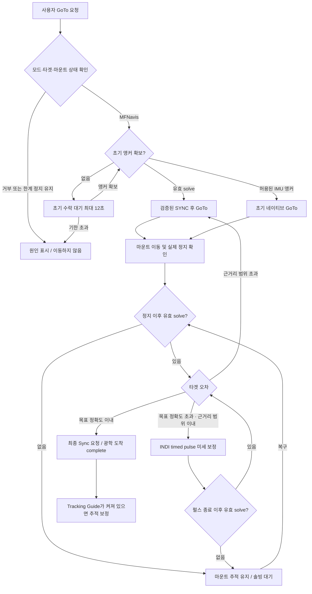
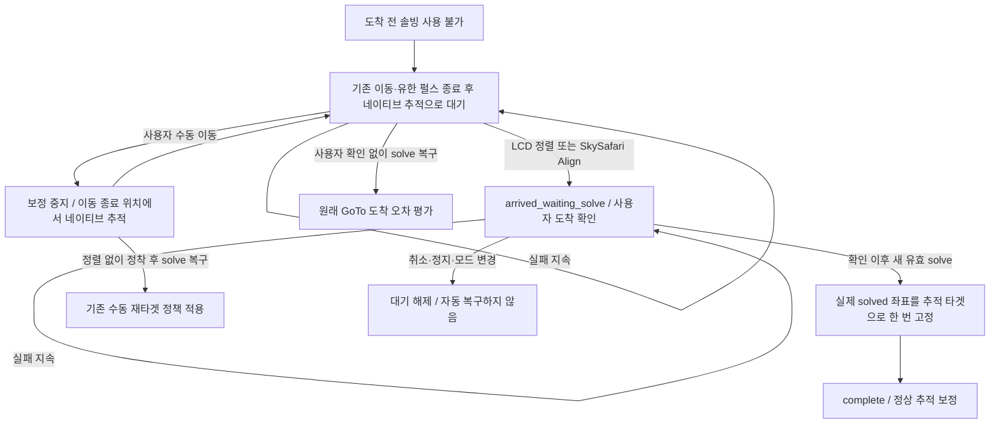
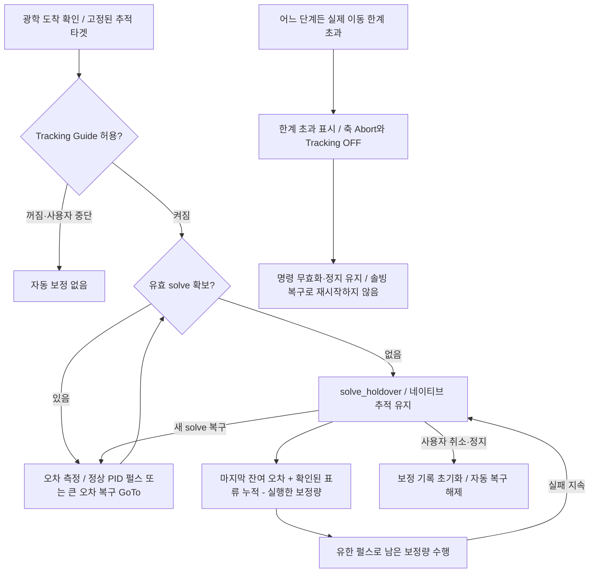

# MFNavis 마운트 제어와 GoTo·보정

기준: 2026-10-10 작업 트리. GoTo 시작, 도착 확인, 솔빙 소실 대기, 추적 보정,
사용자 정렬·취소·정지, 이동 한계 정지를 한 문서에서 관리한다.

## 소유권과 연결

`main.py`가 생성한 GoTo/Guide 서비스는 사용자 의도와 상태 전환을 관리하고,
`mountcontrol_indi.py`는 INDI 연결·명령 전송·상태 수집·실제 정지를 담당한다.
LCD, 웹, SkySafari는 같은 명령 경로를 사용한다. 큐에 넣은 명령과 드라이버의
수락 응답, 물리 이동 완료, 광학 도착을 서로 구분한다.

| GoTo Type | 동작 |
|---|---|
| `off` | GoTo 거부 |
| `indi_mount` | 네이티브 마운트 GoTo |
| `mfnavis` | 광학 앵커·검증된 Sync+GoTo·도착 확인·보정 상태기계 |

INDI Web Manager는 `8624`, INDI 서버 기본 포트는 `7624`다.
설치 후 웹 INDI 화면에서 서버·장치·Serial/Ethernet 전송을 설정하고,
실제 연결 상태와 위치·시각을 확인한다. Serial Auto와 재연결은
[연결 문서](connectivity_ko.md), 다중 정렬과 백레시는 [정렬 문서](alignment_ko.md),
선택형 smooth/영상 추적은 [추적 문서](tracking_ko.md)를 따른다.

## 2026-10-10 GoTo 시작부터 추적 보정까지 검증한 설계

이 절은 현재 작업 트리의 `indi_goto_guide_service.py`, `mountcontrol_indi.py`,
`guide_holdover.py`, `mount_motion_limits.py`와 자동 테스트를 대조한 기준이다.
이 문서를 현재 동작의 기준으로 사용한다. 과거 설계는 별도의 주제별 이력에 보관한다.
검증 범위는 **MFNavis 기본 GoTo/Tracking Guide**다. `indi_mount`는 네이티브
GoTo만 수행하며 `off`는 GoTo를 거부한다. 선택 기능인 smooth tracking은 별도
제어권·광학 품질 정책을 사용한다. 이동 한계 인터록은 smooth timed pulse에도 적용한다.

### 처리 계층과 판정 기준

| 계층 | 역할 | 다음 단계로 넘어가는 증거 |
|---|---|---|
| LCD·웹·SkySafari | 타겟, GoTo, 정렬, 수동 이동, 취소·정지 요청 | 큐에 사용자 의도를 전달 |
| GoTo/Guide 서비스 | 초기 이동·도착·추적·복구 상태 전환 | 최근 마운트 상태와 해당 이동 이후 촬영된 유효 solve |
| 마운트 실행기 | SYNC/GoTo, 가이드 펄스, 실제 한계 검사와 정지 | 현재 연결의 새로운 INDI 응답, 이동 상태, 펄스 종료 시각 |
| `GuideHoldover` | 마지막 측정 오차·실행한 보정량·확인된 표류 속도 기록 | 관측과 추정을 구분하고 같은 오차를 중복 누적하지 않음 |

마운트가 멈췄다는 것과 광학적으로 타겟에 도착했다는 것은 별개다.
`goto_completed_wall`은 마운트 정지 확인 시각이며, 도착 판정에는 그 이후의
solve가 필요하다. 광학 기준은 `pointing.aligned.solve`이고,
IMU로 진행한 `pointing.aligned.estimate`나 마운트 좌표를 새 solve로 취급하지 않는다.
정밀 보정 단계는 유효한 최근 성공 프레임을 계속 사용할 수 있지만, 이미 소비한
프레임으로 PID를 다시 실행하거나 펄스 종료 전 프레임으로 최종 도착을 확정하지 않는다.

### GoTo 시작과 도착 판정



1. 새 GoTo는 이전 도착·복구·보정 횟수를 초기화한다. 초기 IMU 앵커는 기존
   설정과 유효성 조건을 만족할 때만 허용한다. **초기 수락 대기 12초**와
   **이미 수락한 GoTo 중 솔빙 대기**는 다르다. 후자에는 만료 시간이 없다.
2. `sync_and_goto`는 현재 연결에서 새 `ON_COORD_SET=SYNC` 응답 → 요청과
   일치하는 좌표 응답 → `ON_COORD_SET=SLEW` 응답을 확인한 뒤 GoTo를 보낸다.
   이전 캐시나 단순 송신 성공만으로 다음 단계를 진행하지 않는다.
3. 실행기는 INDI Busy·OnStep 완료·좌표 안정화를 확인한다. 검증된 빠른 정지는
   1초, 일반 경로는 2.5초 안정화를 사용한다. 같은 이동의 정지 시각이 있으면
   서비스가 별도 정착 시간을 중복 추가하지 않는다. 타임아웃으로 가정한 완료는
   검증된 정지 시각을 제공하지 않는다.
4. 목표 정확도 `A`는 `indi_goto_refine_accuracy_arcmin`이며 서비스 폴백은 1′,
   최소는 0.1′다. 실제 저장 설정을 우선한다. 근거리 범위 `N`은
   `min(max(A, 설정 근거리 도수 × 60), 15′)`다. `오차 ≤ A`는 도착,
   `A < 오차 ≤ N`은 펄스 보정, 그 밖은 새 solve를 이용한 SYNC+GoTo다.
5. 근거리 접근은 자동 수동 이동이 아니라 **INDI timed guide pulse**다.
   정상 광학 보정은 축별 PID와 확인된 가이드 속도를 사용하고, OnStep은 같은
   축의 타이머를 새 명령으로 교체한다. 기본 최대 펄스는 2.5초다.
6. GoTo 10회/복구 5회는 한 묶음의 한도다. 소진하면 타겟을 유지하고 10초 뒤
   새로운 solve로 다시 시도한다. 90초 미세 보정 정체도 새 관측을 기다리는
   재시도 경로이며, 솔빙 실패 시간만으로 타겟을 취소하는 타이머가 아니다.
7. `complete`는 **광학 오차가 목표 정확도 이내라는 서비스 판정**이다.
   `final_sync_sent`는 최종 Sync 요청을 큐에 넣었다는 뜻이며, 초기
   `sync_and_goto`의 검증된 응답과 같은 의미가 아니다. 최종 Sync 실패는
   실행기의 `sync_failed` 상태로 별도 보고된다.

광학 도착은 초기 접근의 비수렴 판정과 추적 보정의 경계다. 도착이 확인되면
서비스의 비수렴 표시를 해제하고, 첫 추적 보정 명령에만 `reset_convergence`를
보낸다. 실행기는 PID·진행 판정 기록을 초기화하되 이미 소비한 solve 시각과
펄스 이후 관측 경계는 보존한다. 단순 솔빙 소실·복구나 같은 타겟의 보정 재활성화는
이 초기화를 요청하지 않는다. 따라서 광학 도착 전에 확인한 보정 발산을 구름
통과만으로 지우지 않으면서, 도착 후 정상 추적의 시작을 막던 이전 판정을 해제한다.

LCD Push의 `native_tracking`은 솔빙 대기(`WAIT`)로 표시한다. 도착 테두리는
`complete`/`tracking`이면서 `optical_arrival_confirmed=true`일 때만 그린다.
사용자가 정렬로 도착을 확인한 `arrived_waiting_solve`는 별도 도착·솔빙 대기
문구로 표시한다.
광학 도착 후 마지막 성공 solve가 12초를 넘기면 완료 테두리를 0.5초 간격으로
점멸한다. IMU 좌표 갱신이나 실패한 solve 시도는 이 유효시간을 연장하지 않는다.
새 solve에 성공하면 고정 표시로 복귀한다. 정지·취소로 GoTo가 해제되거나 추적이
꺼지면 고정·점멸 여부와 관계없이 테두리를 숨긴다. 이는 표시 변경이며 솔빙 소실
중 마운트 추적과 잔여·표류 보정 정책은 그대로 유지한다.

### 도착 전 솔빙 실패와 사용자 정렬



- 솔빙이 끊겼다는 이유만으로 추가 IMU/마운트 좌표 GoTo를 보내지 않는다.
  이미 승인되어 실행 중인 네이티브 슬루·유한 펄스는 종료를 기다린다.
- 수동 방향키 해제는 축 이동을 정지하고 네이티브 추적을 유지한다.
  전체 Stop과 다르다. 새 타겟은 이동 종료 및 정착 이후의 solve로 결정한다.
- 사용자 정렬은 솔빙이 없는 상태에서도 도착 의도를 확정한다. 이때 좌표를
  solve로 위조하거나 카탈로그 좌표로 복귀하는 GoTo를 만들지 않는다.
- 복구된 첫 유효 solve가 실제 추적 타겟을 정한다. 이후 프레임마다 타겟을
  다시 바꾸지 않는다. 사용자 확인 이전·이동 중·펄스 종료 이전 프레임은 제외한다.
- 취소/정지/새 GoTo는 이 대기를 무효화한다. 이번 점검에서 취소 후
  `arrived_waiting_solve` 표시가 남는 문제를 재현하여, 대기 상태와 이유도
  함께 초기화하도록 수정했다. `clear_tracking_target`, 보정 중단, 모드 변경
  세 가지 취소 경로에 회귀 테스트를 추가했다.

### 도착 후 추적과 보정



축별 보정 잔량은 `r(t) = e₀ + v × (t − t₀) − (p(t) − p(t₀))`다.
`e₀`는 마지막 solve의 오차, `v`는 광학 관측으로 확인한 오차 증가 속도,
`p`는 송신이 수락된 펄스의 속도와 경과 시간으로 추정한 누적 이동량이다.
이는 명령 기반 계산이며 실제 축 이동을 별도 센서로 실측한 값은 아니다.

- 같은 오차를 매 tick 다시 더하지 않는다. 축 타이머 교체 시 이전 펄스는
  실제로 경과한 명령 시간까지만 계산한다. 장시간 기록은 누적값으로 축약한다.
- 표류 속도는 펄스 이동을 보상한 독립 관측에서 학습한다. 0.5~12초 관측 간격,
  같은 부호의 연속 두 속도 추정, 0.2~5″/s 범위와 일관성 검사를 사용한다.
  빠른 연속 프레임도 최소 0.5초 구간으로 묶어 학습한다. 확인된 속도가 없으면
  0으로 두고 마지막 잔량만 처리한다. 솔빙 실패 시간만으로 속도를 만료하지 않는다.
- 잔량이 1″ 이상 쌓이면 확인된 가이드 속도로 최대 2.5초의 펄스를 보낸다.
  진행 중 펄스가 끝난 뒤 잔량을 재계산한다. 추정값은 새 solve나 PID 입력으로
  다시 넣지 않으며, 솔빙 실패만으로 수렴 실패 횟수를 증가시키지 않는다.
- 도착 프레임이 미세 보정 단계에서 이미 소비됐더라도 이동 이후의 유효 프레임이면
  추적 단계의 초기 잔량으로 이어받는다. 이전 PID 명령을 재실행하지는 않는다.
- 새 solve는 추정 잔량을 실제 관측 오차로 교체한다. 작은 오차는 정상 펄스 보정,
  큰 오차는 설정에 따른 광학 앵커 기반 복구 GoTo로 돌아간다. 복구 슬루 중에는
  펄스를 보내지 않고, 복구 정지 이후 새 solve와 정착을 거쳐 보정을 재개한다.
- 연결 상실, 주차, 드라이버 거부·지원 불가, 사용자 보정 Off는 솔빙 실패와
  별개다. 이런 상태에서 무조건 펄스를 보내지는 않는다.

### 모든 단계의 이동 한계와 정지 우선순위

실행기의 한계 검사가 서비스의 도착·솔빙 복구 판단보다 우선한다. 실제 INDI
고도 한계(`minAlt`, `maxAlt`), GEM 현재 피어 측의 자오선 한계, OnStep의
고도·축·리미트 스위치 오류를 검사한다. GPS 잠금이 없어도 마운트의
`GEOGRAPHIC_COORD`가 있으면 해당 위치를 사용한다. 정렬 별 선택의 기본
20~78도나 과거의 고정 10도 값을 물리 한계로 대신 사용하지 않는다.

GoTo는 목적지 고도도 확인한다. 이동 경로·피어 전환·내부 축의 물리 한계는
펌웨어 판정과 상태 보고를 함께 사용한다. 수동 이동·네이티브 추적·펄스·smooth
실행 전과 제어 루프에서 감시하며, 감지 지연은 마운트 상태 보고와 루프 주기에
따른다. 소프트웨어 테스트가 하드웨어 리미트 스위치의 성능을 보증하지는 않는다.

한계 초과 시 `motion_limit.latched=true`와 `limit_exceeded`를 기록하고,
대기 명령의 epoch를 무효화하며 복구 작업을 취소한다. 축 Abort와 Tracking OFF를
요청하고, 실패하면 재시도한다. LCD에는 **마운트 이동 한계 초과**, 상태 파일에는
구체적인 원인을 남긴다. 오류 창 닫기나 솔빙 복구는 재시작 조건이 아니다.
실제 한계 위반이 해소된 뒤 사용자가 명시적으로 Tracking On을 요청해야 정지
유지를 해제할 수 있다. 자동 추적 복구의 Tracking On은 해제하지 못한다.

### 검증 결과와 재현

`test_goto_correction_lifecycle.py`는 실제 서비스·명령 epoch·마운트 실행기를
연결한다. FIFO 운반, INDI I/O, 광학 관측, 물리 정지 입력만 시뮬레이션하며
실제 장비나 운영 서비스는 구동하지 않는다. 정지 콜백의 신선도·안정화 판정은
기존 `test_mountcontrol_indi.py`에서 별도로 검사한다.

| 확인 시나리오 | 자동 검증 위치 |
|---|---|
| 새 SYNC 모드·좌표·SLEW 응답 없이 GoTo를 보내지 않음 | `test_mountcontrol_indi.py`, lifecycle |
| GoTo → 큰 오차 재GoTo → 근거리 펄스 → 광학 도착 → 추적 | lifecycle |
| 도착 전 장기 솔빙 대기 → 수동 이동 → 정렬 확인 → 실제 타겟 고정 | lifecycle, `test_indi_solve_fallback.py` |
| 도착 후 실패 중 잔량 보정 → 새 solve 복구 → 사용자 전체 Stop | lifecycle |
| 도착 후 큰 오차의 광학 복구 및 보정 재개 | lifecycle |
| GoTo·미세 보정·추적·솔빙 실패의 각 단계에서 한계 초과 정지 | lifecycle |
| 장시간 중복 보정 방지·표류 유지·타이머 교체·빠른 프레임 | `test_guide_holdover.py` |
| 최신 설정·GEM 측·축 오류·GPS 없는 경우 한계 판정 | `test_mount_motion_limits.py` |
| LCD/SkySafari 정렬 라우팅·오류 표시·취소 후 표시 해제 | UI/POS/operation errors/solve fallback 테스트 |

검증 명령은 개발 환경에서 실행한다.

```bash
source scripts/activate_dev_trixie.sh
pytest -q tests/test_goto_correction_lifecycle.py tests/test_guide_holdover.py \
  tests/test_goto_arrival.py tests/test_mount_motion_limits.py \
  tests/test_indi_solve_fallback.py tests/test_indi_goto_guide_service.py \
  tests/test_mountcontrol_indi.py tests/test_ui_align.py tests/test_pos_server.py \
  tests/test_pos_server_stellarium.py tests/test_operation_errors.py \
  tests/test_tracking_target_integration.py tests/test_smooth_tracking_handover.py \
  tests/test_smooth_tracking_runtime.py tests/test_solve_acceptance.py \
  tests/test_integrator_drift.py tests/test_pointing_coordinate_service.py \
  tests/test_alignment_tracking_flow.py
```

2026-10-10 실행 결과: **881 passed**, 기존 의존성/프로세스 관련 경고 4건.
새 연결 시나리오 8개와 사용자 확인 취소 표시 회귀 3개를 포함한다.

같은 날 야간 실측에서 베가는 0.57′로 광학 도착한 뒤 기존 비수렴 상태가 남아
추적 보정이 꺼졌고, 데네브는 재이동 후 0.48′로 도착하여 솔빙 소실 보정을
유지했다. 이는 수정 전 실측이며 PID 계수나 펄스 방향의 정확성을 보증하지 않는다.
위 도착 경계 초기화와 LCD 표시 수정은 서비스·실행기 연결 회귀 및 UI 테스트를
포함한 관련 6개 파일 **561 passed**로 검증했다. 같은 관측의 중복 소비 방지와
솔빙 소실 중 기존 비수렴 기록 보존도 함께 검사한다.

22:15(KST) 사용자 승인으로 운영 서비스를 재시작하여 수정 코드를 적용했다.
이후 사용자 요청대로 모드 변경 없이 MFNavis 토성 GoTo를 실행했고,
IMU 초기 이동 후 `native_tracking`/`optical_arrival_confirmed=false`와
네이티브 추적 유지, LCD의 `No solve`·`WAIT` 및 도착 테두리 없음까지 확인했다.
이 관측 구간에는 광학 solve가 복구되지 않아 수정 후 도착·추적 전환의
실장비 재검증은 완료하지 못했다. 원본 상태·LCD·로그는 운영 데이터의
`telemetry/20261010_saturn_after_fix/`에 보관한다.

시험 종료 중 전체 Stop 뒤 추적이 다시 켜지는 현상을 추가로 확인했다.
토성용 추적 주파수의 60초 주기 재전송이 남아 있었으며, 정상 API로 주파수 유지
요청을 해제한 뒤 전체 Stop을 보내자 89초 후에도 이동·추적·보정 정지가 확인됐다. 이에
`stop_mount(stop_tracking=True)`에서 주파수 재전송 대상도 해제하도록 보완했다.
사용자 전체 Stop과 한계 초과 정지가 이 경로를 공유한다. 수동 방향키 해제는
기존처럼 추적을 유지한다. 최종 종료 상태는 같은 데이터 폴더의
`test_finished_status.json`에 저장한다. 이 종료 보강과 완료 테두리의 솔빙 소실 점멸은
23:12(KST) 사용자 요청에 따른 서비스 재시작으로 운영 프로세스에 적용했다.
재시작 후 GoTo idle과 이동·추적·보정 꺼짐을 확인했다. 테두리의 고정·점멸·복구와
정지 후 숨김은 관련 UI·GoTo·정지 키 테스트 **200 passed**로 검증했다.

마감 검사에서 IMU 테스트는 Blinka import 시 GPIO 접근 제한으로 수집이 실패했다.
`test_imu_runtime.py`를 제외한 단위 테스트는 **3556 passed**였으며,
명령 분배 테스트의 미연결 상태 초기화 누락도 보완했다. 이후 추가한 전체 Stop의
주파수 재전송 해제는 마운트·lifecycle·주파수 관련 **293 passed**로 검증했다.
린트·포맷·타입 검사와
Sphinx 문서 빌드는 통과했다. 실장비 접근이 필요한 수집 실패를 전체 통과로
간주하지 않는다.

다음 맑은 날에는 수정 후 광학 도착부터 추적 보정까지의 전환, 데네브에서 관찰한
동서축 펄스와 오차 변화의 관계, 장기 솔빙 소실 중 표류 보정 정확도를 확인한다.
이번에는 PID 계수와 펄스 방향 설정을 변경하지 않았다. 한계 도달부터 실제 정지까지의
시간과 새 전체 Stop 보강도 재검증 대상이다. 짧은 수동 이동 후 방향키 해제와 추적
유지는 이번 실측에서 확인했으며, 장시간·반복 동작까지 검증한 것은 아니다.
현장에서는 작은 이동과 안전한 시험 한계로 시작하고 INDI 응답·`goto_timing`·펄스
기록·오류 표시를 함께 확인한다. 위 현장 관측과 자동 테스트 결과는 구분해 해석한다.

### 실내에서 수행한 PID 기록 재생 (2026-10-10)

베가·데네브의 기록을 각각의 관측 시간 범위로 제한하고 PID 로그와 축별 펄스
이벤트를 연결했다. 베가 15개 관측의 28개 명령, 데네브 14개 관측의 23개 명령을
현재 `GuidePID(Kp=1.0, Ki=0.05, Kd=0.25)`로 재생한 결과, 펄스 길이는
실측과 최대 1ms 차이로 일치했다. 솔빙 소실 중 holdover 명령은 PID 비교에서 제외했다.

| 항목 | 베가 | 데네브 |
|---|---:|---:|
| 최대 2500ms 펄스 / PID 명령 수 | 14 / 28 | 9 / 23 |
| 명령 시점의 관측 나이 중앙값 | 2.00초 | 1.86초 |
| 비교 후보에서 10ms 이상 달라진 명령 | 3 / 28 | 7 / 23 |
| 비교 후보의 총 요청 시간 변화 | −2.3% | −5.7% |

비교 후보 `(Kp=0.6, Ki=0, Kd=0.15)`는 민감도 확인용이며 최적값 추정 결과가 아니다.
재생 구간에서 현재 I 적분량은 모두 0이었다. 데네브 초기 동서 오차는
−857.7″에서 −1022.8″로 커졌으며, 후보에서도 해당 서쪽 명령 5개는 모두 2500ms로
동일했다. 베가 동서 오차에는 인접 PID 관측 사이에 부호와 크기가 크게 바뀌는
구간도 있다. 따라서 P/I/D 변경만으로 이번 비수렴의 원인을 해결했다고 판단할 수 없다.

이 분석은 기록된 오차를 고정하고 출력 명령을 비교한 것이다. 변경한 제어기가
만들었을 다음 좌표나 최종 도착 정확도를 예측한 폐루프 검증은 아니다. 동시 축 명령,
표류, 솔빙 지연·좌표 변화, 실제 펄스 종료 확인 부재로 각 축 응답을 분리하기 어렵다.
운영 PID 값은 유지했다. 다음 야외 검증은 축별 펄스 전후의 독립된 광학 관측과
무펄스 구간의 표류를 확보한 뒤 응답 크기·방향·지연을 식별하는 순서로 진행한다.
재생 코드·명령 CSV·평가 JSON은 운영 데이터의 `telemetry/20261010_pid_offline/`에
보관하며, 이 분석에서는 장비 명령을 보내지 않았다.


## 구현 위치

- [GoTo/Guide 서비스](../../python/MFNavis/indi_goto_guide_service.py): 시작·도착·사용자 확인·재타겟·광학 복구.
- [INDI 실행기](../../python/MFNavis/mountcontrol_indi.py): Sync 응답·마운트 정지·가이드 펄스.
- [이동 한계](../../python/MFNavis/mount_motion_limits.py): 모든 이동의 한계 판정과 정지 유지.
- [솔빙 소실 보정](../../python/MFNavis/guide_holdover.py): 잔여 오차·표류·펄스 이동량 회계.
- [도착 입력](../../python/MFNavis/goto_arrival.py), [추적 명령](../../python/MFNavis/tracking_commands.py): UI·외부 입력의 공통 정책.

상태 파일은 선택한 `utils.runtime_dir`의 `mount_control_status.json`,
`indi_goto_guide_status.json`, `pointing_coordinate_status.json`을 함께 확인한다.
정상 완료 여부는 화면 문자열만으로 판정하지 않고 이동 epoch, solve 시각과 응답을 대조한다.
