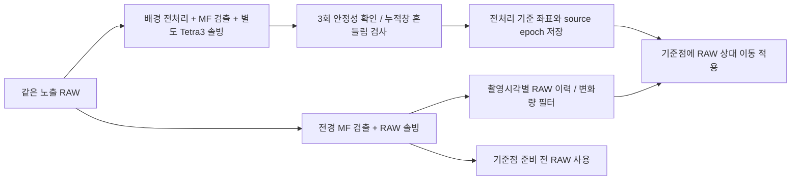

# 전처리 기준 좌표 + RAW 변화량 — 검증 결과

## 결론

제안은 **지연된 전처리 결과를 기준점으로 삼고, RAW는 최신 움직임을 전달하는 방식**으로 구현할 수 있다. 실제 RAW36장 재생에서 전처리·MF 검출·Tetra3 솔빙 전체를 별도 worker로 실행했고 전경 RAW는 전처리 완료를 기다리지 않았다. 초기12프레임은 RAW, 이후24프레임은 전처리 기준점+RAW 변화량을 사용했다.

그러나 RAW 변화량을 그대로 더하면 RAW 두 시점의 잡음이 함께 들어와 결과가 더 흔들렸다. 기록영상에서는 alpha0.3으로 필터한 변화량이 가장 좋은 균형이었다. 공통108프레임 산포p95가 RAW32.65″/기존bias37.11″에서22.27″로 줄었다. 이는 고정 장비 장면의 반복 안정성 개선이며 절대 정확도나 실제 흔들림 보정 성공을 증명하지 않는다.

알려진 이동의 합성시험에서는 큰300″ 이동을2회 확인해0.5초 반응 지연이 생겼다. 필터 방식의 흔들림 구간 오차p95는51.83″로 기존bias25.88″보다 나빴다. **정지/완만한 이동에서 유망하지만 순간 흔들림까지 항상 개선된 것으로 판단할 수 없다.** 운영 서비스에 연결하지 않고 검증용 모듈로 유지한다. 이번 요청은 새로운 구조의 실험이며, 앞서 유지한 auto/동기 복구 서비스 코드를 교체한 것은 아니다.

## 구현한 구조



- 전처리는 시작부터 항상 배경에서 실행한다. 내부 scale 계산은3개 worker다. 전경과 배경은 서로 다른 Tetra3 인스턴스를 사용한다.
- 전처리 기준점은3회 연속 일치(이동 보상 후60″ 이내)를 확인한 뒤 선택한다. 수치들은 초기 실험값이며 하늘 전반에 최적화됐다는 뜻은 아니다.
- 개념식은 `P(기준 시각) + [R(현재)-R(기준 시각)]`다. 실제 구현은 RA를 단순히 빼지 않고 구면 단위벡터/회전으로 처리해0/360도 경계와 극점 부근을 다룬다. 필터 방식은RAW 벡터에 alpha0.3 EMA를 적용한다.
- 이 식은 `현재 RAW + 최근 보정량`으로도 표현된다. '전처리를 주로 사용한다'는 이름만 바꾸는 것으로 RAW잡음이 사라지지 않으며, 보정량의 갱신/필터/무효화 규칙이 중요하다.
- 120″를 넘는 RAW 변화는 다음RAW가 새위치에60″ 이내로 일치해야 큰 이동으로 확정한다. 확인되면 generation과 기준점을 초기화한다. 단일 큰RAW 오검출은 보류한다. 이 규칙이 반응 지연과 오검출 억제의 교환관계를 만든다.
- 전처리 누적 구간 RAW 궤적의 선형 이동을 제거한 반경 잔차p95를 '흔들림 지표'로 계산한다.60″ 초과면 해당 전처리 기준점을 사용하지 않는다. 이 지표에는 실제 흔들림과 RAW솔빙 잡음이 함께 포함된다.
- 기준점 유효기간8초, RAW신선도1.5초를 사용했다. RAW가 없으면 전처리 좌표를 원래 촬영시각으로만 반환한다. 움직임을 현재까지 보상했다고 표시하지 않는다. 시작부터RAW 솔빙이 불가능해도 전처리3회가 안정적이면 원래시각의 전처리 좌표는 확보할 수 있다.
- source frame id와노출 epoch, generation, 순서/유효기간을 검사한다. 늦게 도착한 이동 전 결과를 새위치의 기준점으로 적용하지 않는다.

이 구현은 **카메라 중심 RA/Dec**만 다룬다. Roll, 정렬된 target pixel, IMU와의 회전 결합, mount/GOTO 명령에는 연결하지 않았다. 흔들림으로 이미 번진 별상을 이 좌표 보정만으로 복원하지는 못한다.

## 119장 기록 좌표 재생

이전MF4→2 RAW/전처리 결과와 실제 manifest 경과시간을 사용했다. 전처리 결과는2프레임마다 제공하고 촬영 후1.2초/2.5초에 완료된 것으로 가정했다. 각 방식이 모두 값을 낸 초기10초 이후108프레임을 공통 비교했다. 산포는 시간에 따른 선형 이동을 제거한 각도 잔차다. 전처리 캐시는 매프레임 누적을 사용한 기존자료로, 비동기 작업skip의 영향을 포함하지 않는 낙관적인 비교다. 그래서 실제 병렬영상 재생을 별도로 수행했다.

| 방식 | 완료지연1.2초 산포 중앙값 / p95 | 완료지연2.5초 산포 p95 |
|---|---:|---:|
| RAW | 12.53″ / 32.65″ | 32.65″ |
| 기존 RAW+bias | 14.54″ / 37.11″ | 36.83″ |
| 완료 전처리 좌표 유지 | 8.42″ / 20.09″ | 19.94″ |
| 전처리 기준+직접 RAW 변화량 | 17.48″ / 43.45″ | 46.49″ |
| 전처리 기준+필터 RAW 변화량 | 9.23″ / 22.27″ | 22.73″ |
| 전처리 기준+누적창 평균 RAW 보정 | 10.97″ / 24.09″ | 25.82″ |

완료된 전처리 좌표를 그대로 유지하면 고정 장면의 산포는 작지만 좌표 나이 중앙값이약2.51초였다(지연1.2초 실험). 현재시각까지의 이동을 반영한 값이 아니다. 필터 변화량 방식은 이를RAW 최신 촬영시각으로 이동시켜 산포p9522.27″를 얻었다. RAW자체도 노출/계산시간만큼 오래될 수 있으므로 '현재'는벽시계가 아니라 최신RAW epoch다.

## 알려진 좌표 궤적 시험

0.5초 간격80초(160표본)에8″/s 드리프트,300″ 계단 이동,60″ 진폭 진동,1회600″ RAW 오검출,4초RAW 누락을 넣었다. RAW는고정bias와12″ 표준편차 잡음, 합성전처리는최근5표본 단순평균+4″ 잡음으로 생성했다. 이 합성전처리는 실제 비선형 이미지 전처리를 그대로 모사하지 않는다.

전체오차는 모든 방식의 공통132표본에서 비교하므로 RAW누락 구간은 이 통계에서 제외된다. 누락 시 timestamp/유효기간 정책은 별도 단위검사와 전체 출력 availability로 확인했다. 계단반응은 새위치의정답60″ 이내로 들어오는 첫시점이다.

| 방식 | 정답 오차 중앙값 / p95 | 계단 반응 |
|---|---:|---:|
| RAW | 28.96″ / 51.47″ | 0.0초 |
| 기존 RAW+bias | 17.31″ / 64.18″ | 0.0초 |
| 완료 전처리 좌표 유지 | 22.82″ / 109.13″ | 3.5초 |
| 전처리 기준+직접 RAW 변화량 | 24.57″ / 45.51″ | 0.5초 |
| 전처리 기준+필터 RAW 변화량 | 14.45″ / 42.04″ | 0.5초 |
| 전처리 기준+누적창 평균 RAW 보정 | 11.34″ / 41.08″ | 0.5초 |

필터 변화량 방식도 계단 이동의 첫표본을 보류하므로 순간 최대오차는323.27″였다. 전체p95만으로 이런 순간오차를 숨겨서는 안 된다. 흔들림 구간p95는RAW49.97″, 기존bias25.88″, 필터변화량51.83″였다. 부드럽게 만드는 필터가 실제 빠른 움직임까지 감쇠하는 한계가 드러났다. RAW 오검출 구간에서는 필터변화량p9518.87″로 기존bias505.87″보다 작았지만, 이 역시 설정한 단일오검출 시나리오의 결과다.

따라서 다음 단계에는 RAW별 패턴의 상대 이동 측정이나 IMU와의 교차검증으로 '실제 움직임'과 'RAW솔빙 잡음'을 구분할 근거가 필요하다. 이 자료만으로모든 움직임에 적합한필터/threshold를 확정하지 않는다.

## 누적 구간의 움직임 보정

시간 누적 이미지의 별 중심은 마지막 노출보다 이전 위치 쪽에 놓일 수 있다. 그래서 기준 RAW를 마지막 프레임 대신 누적 구간의 평균 RAW 위치로 잡는 변형도 시험했다.

알려진 동일 가중 평균 궤적에서는 이 방식이 전처리 자체의 시간 지연까지 보정해 정답 오차 중앙값 11.34″를 얻었다. 그러나 실제 기록의 산포 p95는 24.09″로 기본 필터의 22.27″보다 컸다. 실제 전처리는 픽셀별 mask·clip·가중치가 있고 모든 별의 유효 노출 시각이 같지 않다. 특히 비동기에서 건너뛴 프레임도 고려해야 한다. **동일 가중 평균 보정은 기본 채택하지 않았다.** 정확한 영상 정합과 가중치 검증이 필요한 추가 후보다.

## 실제 병렬 영상 재생

validation RAW 36장을 최소 0.4초 간격으로 제공했다. 실제 운영 카메라의 IPC, 프레임 drop, SQM, UI, 마운트는 포함하지 않았다. MF4→2를 양쪽에 사용했고 배경에서 실제 전처리·검출·별도 Tetra3 솔빙까지 수행했다. 결과가 준비되지 않으면 전경은 RAW만 반환했다.

- RAW 솔빙 36/36 성공.
- 최초 12프레임은 RAW, 이후 24프레임은 전처리 기준점+필터 RAW 변화량 사용.
- 전경 중앙값 139.22ms / p95 890.06ms.
- 배경 전처리+검출+솔빙 중앙값 1199.76ms / p95 1642.33ms.
- 전처리 기준점 채택 8회. 종료 직전 worker 통계는 제출 12개, 회수 11개, 대기 교체 24개, 실행 중 1개였다. 종료 정리에서 worker 완료는 기다리지만 관측 루프에서는 전처리 완료를 기다리지 않는다.

전경 139ms와 배경 1200ms를 합산하면 안 된다. 다만 CPU를 공유하므로 RAW 솔빙 자체가 지연될 수 있고 p95가 이를 보여준다. 기존 별도 24장 auto 시험의 76ms와 이번 36장 139ms는 프레임 수·부하·스케줄이 다르므로 단순한 전후 속도 비교로 사용하지 않는다.

## 소스와 재현

- `python/PiFinder/preprocessed_anchor.py`: 시간/세대검사, 안정화, 구면이동, 흔들림지표와RAW필터.
- `python/scripts/evaluate_preprocessed_anchor.py`: 기록좌표/알려진이동 비교.
- `python/scripts/benchmark_anchor_pipeline.py`: RAW/전처리 전체솔빙 병렬실행.
- `python/tests/test_preprocessed_anchor.py`: 순서·epoch·만료·누락·큰이동·흔들림·RAwrap·극점·동일가중누적의검증.

```bash
cd /home/pifinder/PiFinder_test/python
PYTHONPATH=. python3 scripts/evaluate_preprocessed_anchor.py \
  /home/pifinder/PiFinder_test_data/results/anchor_repeat.json \
  --comparison /home/pifinder/PiFinder_test_data/results/mf_primary_validation.json \
  --manifest /home/pifinder/PiFinder_test_data/corpora/20260915_fixed_validation/manifest.jsonl

PYTHONPATH=. python3 scripts/benchmark_anchor_pipeline.py \
  /home/pifinder/PiFinder_test_data/corpora/20260915_fixed_validation \
  /home/pifinder/PiFinder_test_data/cache/validation \
  /home/pifinder/PiFinder_test_data/results/anchor_pipeline_repeat.json
```

운영 서비스·카메라 설정·부팅 경로는 변경하지 않았다. 검증된 테스트 기본 auto 경로도 유지했다. 새 구조는 위 harness에서만 실행되며 기존 서비스 전환 스크립트만으로 활성화되지 않는다. 실제 마운트 이동·정렬·GOTO와 노출 중 흔들린 영상은 검증하지 않았다. RAW 원본과 개별 좌표는 로컬에 보관하고 계획·소스·집계·보고서만 승인된 두 테스트 브랜치에 푸시한다.

## 검사

새 좌표 융합 10개와 기존 worker 5개 검사가 통과했다. 최종 전체 unit/smoke는 **2303 passed, 2 skipped, 716 deselected**, 기존 경고 8개였다. mypy는 202파일, Ruff 검사/포맷은 377파일이 통과했다. 실제 하드웨어 integration 전체나 GOTO 실행 검사를 완료했다는 뜻은 아니다.
