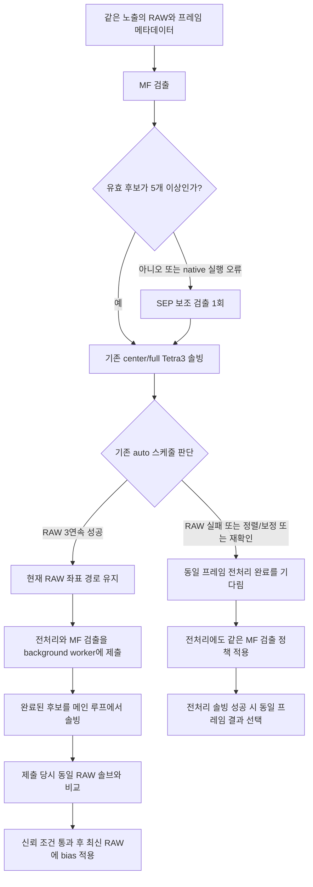

# RAW/전처리 실행 구조 확인

사용자가 유지하도록 한 동기 예외를 포함한 최종 설계다. 메인 루프가 전처리를 기다리는지와 전처리 내부 연산이 병렬인지는 서로 다른 문제다.

- 전처리 내부의 다중 크기 배경 계산은 기본3개 worker, 최소2개로 병렬 실행한다. 동기 예외에서도 이 내부 병렬성은 유지한다. 메인 루프의 대기는 같은 프레임 결과를 필요한 기능에 전달하기 위한 것이다.
- 현재 설정은 `solver_preprocess_mode=auto`가 우선한다. 이전 호환용 `solver_preprocess_async=false` 값만 보고 동기 고정이라고 판단하면 안 된다.
- 현재 background worker는 전처리+검출까지 수행한다. 완료된 별 후보의 Tetra3 솔빙은 메인 루프에서 수행한다. 따라서 비동기 프레임에서도 완료 결과를 검증하는 솔브 비용은 전경 지연에 포함된다.
- 준비/회복의 RAW3연속 성공 확인, RAW 실패, 정렬/왜곡·렌즈 보정의 강제동기,2회 연속 continuity 거절 시 복귀, 움직임/광학계/target pixel 변경 시 초기화는 기존 동작이다.
- async는 최신 작업1개만 대기시키므로 전처리가 늦어져도 작업 큐가 계속 길어지지 않는다. 동일 노출의RAW solution/metadata/IMU anchor를 job에 넣고 generation이 지난 결과는 사용하지 않는다.
- bias는 동일 프레임의 RAW와 전처리 솔브 차이로 계산한다. 기존 최대 일치 범위0.12도, 최소2개 표본, EMA alpha0.25 조건을 유지한다. 오래된 전처리 좌표를 새RAW 좌표처럼 게시하지 않는다.
- MF 후보가5개 이상인데 솔빙이 실패하는 것은 '검출 불가'로 취급하지 않는다. 이 경우 SEP를 추가로 돌리지 않고 기존 동기 전처리 복구 경로가 작동한다.
- 전처리 trusted 이후 RAW를 생략하는 최적화는 이제 명시적인 sync 모드에서만 허용한다. auto에서는 RAW를 계속 확인해 백그라운드 모드에 진입/복귀할 기회를 보존한다.
- `sep_*` route/CSV 이름은 기존 기하·품질 게이트 호환용이다. 실제 검출기는 결과/overlay의 `backend`/`detector_backend`와 fallback 사유로 구별한다.

운영 서비스는 이 테스트 코드를 실행하도록 전환하지 않았다. 이 문서는 코드 확인, 경계 검사와 별도 녹화 재생으로 검증한 구조이며 실제 장비의 GOTO/정렬 실행 검증을 대신하지 않는다.
